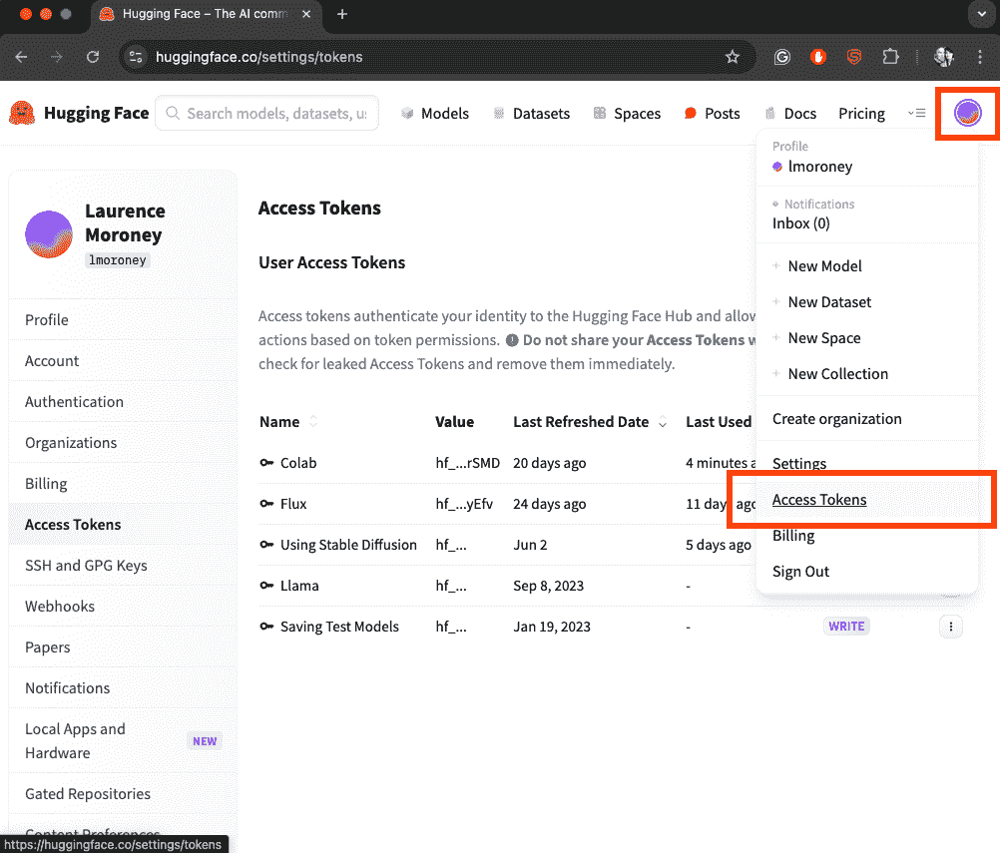
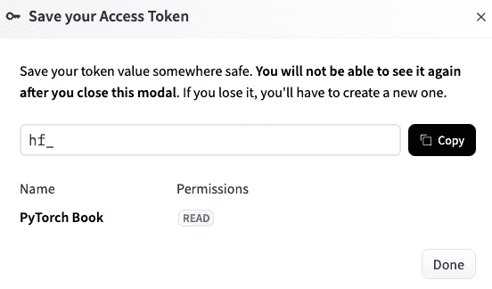
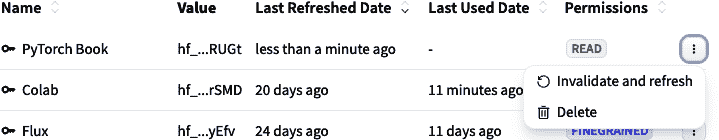
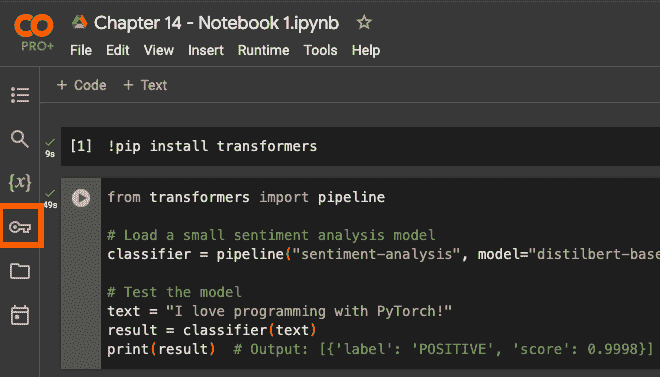

# 第十四章。使用第三方模型和枢纽

开源 PyTorch 框架的成功导致了补充生态系统的增长。在本章中，我们将探讨预训练模型的多种选项以及用于下载、实例化和使用它们进行推理的相关工具和资源。

虽然 PyTorch 框架为深度学习提供了基础，但社区已经创建了众多存储可使用和扩展模型的仓库和枢纽，这使得你更容易使用和扩展现有工作，而不是从头开始。我将其称为“站在巨人的肩膀上”。

随着生成式 AI 的出现，这些枢纽的受欢迎程度急剧上升，许多生成式 ML 模型在流程中的应用场景也由此产生。因此，在使用预训练模型时，有许多选择。你可以直接用于推理，利用那些在大型数据集上训练的模型，这些数据集复制起来是不切实际的。或者，你可以将这些模型作为微调的起点，将它们适应到特定领域或任务中，同时保留其学习到的特征。这可能采取低秩适应（LoRA）的形式，正如我们将在第二十章中讨论的那样，或者采取*迁移学习*的形式，其中将一个任务的知识应用于另一个任务。迁移学习或其他微调已成为标准做法，尤其是在数据或计算资源有限的情况下。

使用预训练模型的优点不仅限于节省计算资源和时间。这些模型通常代表了最先进的架构，并且它们是在你可能无法直接访问的多样化、高质量数据集上训练的。

此外，提供商通常还会发布包含详细文档、性能基准和社区支持的模型，这让你有很长的领先优势。鉴于负责任的 AI 的重要性，这些模型通常附带模型卡，帮助你理解任何研究和工作，以便你能够应对任何潜在的责任问题。

没有一个“统治所有中心的枢纽”，因此了解每个主要枢纽以及如何充分利用它们是有用的。为此，我们将在本章中探讨一些更受欢迎的枢纽。

Hugging Face 已经成为 Transformer 模型的默认标准，而 PyTorch Hub 提供了官方支持的实现。像 Kaggle 这样的平台提供了获奖模型，基于 GitHub 的 TorchHub 则允许直接访问研究实现。

我认为您理解这些资源及其有效使用方法非常重要。随着深度学习领域的不断进步，这些中心在扩大对最先进模型访问和促进 AI 应用快速开发方面发挥着越来越关键的作用。并且随着 AI 开发者角色的成熟和增长，我亲眼看到不从头开始训练模型而是使用或微调现有模型的软件开发者的职业取得了巨大的增长。为此，我希望这一章能帮助您成长！

# Hugging Face Hub

近年来，尤其是随着生成式 AI 的兴起，Hugging Face Hub 已经成为发现和使用预训练 ML 模型的领先平台，尤其是在 NLP 方面。其大部分实用性（以及其成功的一个重要推动力）是两样开源事物的可用性：一个 transformers 库（它使得使用预训练语言模型变得非常容易）和一个 diffusers 库（它对文本到图像生成模型如稳定扩散做同样的事情）。

因此，最初作为一个基于转换器模型的存储库，已经发展成为一个支持计算机视觉、音频处理和强化学习模型的综合生态系统。它已经成长为一个一站式商店，结合了模型的版本控制、文档和模型卡片——而且由于像 transformers 和 diffusers 这样的 PyTorch 友好库，使用这些模型与你的 Python 和 PyTorch 技能相结合相对容易。

协作也是 Hub 成功的关键之一。您只需几行代码就可以下载、使用和微调模型，许多开发者和组织已经与社区分享了他们的模型或微调。在撰写时，有超过 900,000 个公开可用的模型，所以选择余地很大！

## 使用 Hugging Face Hub

在您开始使用 Hugging Face Hub 编码之前，您应该获取一个账户并使用它来获取 API 令牌。

### 获取 Hugging Face 令牌

本节将带您了解在撰写时存在的 [*HuggingFace.co*](http://huggingface.co) 用户界面。它可能在您阅读时已经改变，但原则仍然是相同的。希望它们仍然适用！

首先，访问 [*Huggingface.co*](http://huggingface.co)，如果您还没有账户，您可以在右上角的“注册”按钮创建一个（见图 14-1）。


###### 图 14-1\. 注册 Hugging Face

在您注册并获取账户后，您可以登录，并在页面右上角您将看到您的头像图标。选择此图标，将出现一个下拉菜单。在这个菜单中，您将看到一个选项是“访问令牌”，您可以选择它来查看您的访问令牌（见图 14-2）。



###### 图 14-2\. 访问令牌

在此页面上，您将看到一个创建新令牌按钮，它将带您到一个屏幕，您可以在此处指定您的令牌详细信息。选择“读取”选项卡，并为令牌命名。例如，在图 14-3 中，您可以看到我创建了一个名为 PyTorch Book 的新读取令牌。

您还将看到一个弹出窗口要求您保存您的访问令牌（见图 14-4）。请注意，它告诉您在关闭此对话框模态后您将无法再次看到令牌，因此请确保点击复制按钮，以便令牌为下一步做好准备。


###### 图 14-3\. 创建访问令牌



###### 图 14-4\. 保存您的访问令牌

如果您*确实*忘记了令牌，您必须在令牌列表屏幕上无效化和刷新它。为此，您选择令牌右侧的三个点，然后从下拉菜单中选择无效化和刷新（见图 14-5）。



###### 图 14-5\. 使令牌无效化和刷新

然后，返回到图 14-4 中的对话框，并使用新的令牌值。如果您想使用它，请复制它。

现在您已经有了令牌，让我们探索如何配置 Colab 以使用它。

### 获取使用模型的权限

Hugging Face 上的许多模型在使用时可能需要额外的权限。在这些情况下，您应该始终检查模型页面，并在提供的链接上申请权限。您使用该模型的权限将使用 Hugging Face 令牌进行跟踪。如果您*没有*权限，您将看到如下错误：

```py
GatedRepoError: 401 Client Error.
(Request ID: [...])
Cannot access gated repo for url [...]
Access to model [...] is restricted.
You must have access to it and be authenticated to access it.
Please log in.
```

当这种情况发生时，最简单的事情就是使用模型名称在 Hugging Face Hub 上找到其着陆页，并遵循步骤从那里获取使用权限。

### 为 Hugging Face 令牌配置 Colab

如果您想在 Google Colab 中使用 Hugging Face 的模型，那么您需要配置一个 Colab 机密，其中 Colab 中执行的代码将读取令牌值，代表您将其发送到 Hugging Face，并授予您访问该对象的权限。

这相当简单。首先，在 Colab 中，您选择屏幕左侧的键图标（见图 14-6）。

您应该看到一个类似于图 14-7 中的机密列表。如果您还没有任何 API 密钥，请不要担心。列表底部有一个按钮，上面写着“添加新机密”，您将选择该按钮。



###### 图 14-6\. 选择 Colab 机密


###### 图 14-7\. Colab 机密列表

在“名称”字段中使用“HF_TOKEN”，并将密钥的值粘贴到“值”字段中。然后，翻转开关以授予笔记本访问权限给机密（见图 14-8）。


###### 图 14-8\. 在 Colab 中配置 HF_TOKEN

您的 Colab 代码现在将使用此令牌来访问 Hugging Face。

### 使用 Hugging Face 令牌编写代码

如果你只想直接在你的代码中使用令牌，无论是在 Colab 中还是不在，你将需要在你的代码中登录到 Hugging Face Hub 并将密钥传递给它。这很简单，因为 Hugging Face Hub 库提供了所需的支持。

要开始，只需像这样导入 `login` 类：

```py
from huggingface_hub import login
```

然后，你可以将令牌传递给 `login` 类，并在你的 Python 会话中使用它来初始化，如下所示：

```py
login(token="YOUR_TOKEN_HERE")
```

Hugging Face 类将在你的会话剩余时间内使用该令牌。

## 从 Hugging Face Hub 使用模型

一旦你设置了令牌，获取和使用模型就非常简单。在这个教程中，我们将探索使用语言模型进行文本分类和情感分析。这需要你使用 transformers 库，所以请确保你已经安装了它：

```py
pip install transformers
```

`transformers` API 提供了一个流程类，允许你根据其在 Hugging Face 仓库中的名称下载和使用模型。这个模型是使用斯坦福大学的 SST 情感分析数据集进行微调的：

```py
# Load a small sentiment analysis model
classifier = pipeline("sentiment-analysis", 
             model="distilbert-base-uncased-finetuned-sst-2-english")
```

流程不仅提供下载功能，还封装了执行常见模型任务所需的所有内容。第一个参数，在这种情况下是“情感分析”，描述了你将执行的整体流程任务。Transformers 提供了各种任务类型，包括这个，文本分类，文本生成等等。

当使用 `pipeline` 类时，在幕后发生了一系列关键步骤。这些包括以下内容：

令牌化

在这一步，文本被转换为令牌（正如我们在第四章中讨论的）。

输入处理

在这一步，添加了特殊令牌，并将文本转换为张量。

模型前向传递

在这一步，标记化的输入通过模型的层传递以获得结果。

输出处理

在这一步，输出从张量解码回所需的标签。

你可以在图 14-9 中看到这个工作流程。


###### 图 14-9\. NLP 流程图

然后，当你想要使用它时，作为开发者的你将不再需要编写代码，只需像这样使用模型：

```py
# Test the model
text = "I love programming with PyTorch!"
result = classifier(text)
print(result)  # Output: [{'label': 'POSITIVE', 'score': 0.9998}]
```

所有用于文本分类和情感分析的步骤都被封装并抽象出来，这使得你的代码变得更加简单！

类似地，如果你想使用 diffusers 库，它附带了一系列与模型类型相关的流程。例如，如果你想使用流行的 Stable Diffusion 模型进行文本到图像的转换——其中你给出一个提示，模型将根据该提示绘制图像——你可以非常容易地做到这一点。

让我们通过一个例子来探索这个问题。

首先，从 diffusers 库中，你可以导入支持 Stable Diffusion 的流程，如下所示：

```py
from diffusers import StableDiffusionPipeline
```

使用这个，你可以在 Hugging Face 仓库中指定模型的名称，并使用它来初始化流程：

```py
import torch
from diffusers import StableDiffusionPipeline

model_id = "CompVis/stable-diffusion-v1-4"
device = "cuda"

pipe = StableDiffusionPipeline.from_pretrained(model_id, 
                                               torch_dtype=torch.float16)
pipe = pipe.to(device)
```

与前面的文本示例类似，该流程封装并抽象出许多步骤。这意味着你可以编写相对简单的代码，如下所示：

```py
prompt = "a cute colorful cartoon cat"
image = pipe(prompt).images[0]

image.save("cat.png")
```

但有许多步骤已经为你处理好了。以下是一些包括的内容：

1.  在文本编码步骤中，Stable Diffusion 使用一种称为 CLIP 的技术，将文本提示转换为模型可以理解的嵌入。

1.  然后从随机噪声中构建初始图像。

1.  然后将嵌入输入到模型中，该模型通过去噪过程创建像素和特征，以匹配嵌入。

1.  模型的最终输出随后从张量转换为 RGB 图像。

从文本创建图像的整体过程超出了本章的范围，但在 [Google Research 的这个视频中](https://oreil.ly/zNjUT) 有很好的解释。

这里需要注意的重要一点是，由于图像生成过程始于创建随机噪声，因此使用前面代码创建的任何图像都将不同。所以，如果你没有得到一致的图片，请不要惊慌！我们可以通过使用种子来引导这种噪声，我们将在后面的章节中讨论这一点。

# PyTorch Hub

PyTorch 成功的主要原因之一——尤其是在研究社区中——是开发者具有远见，创建了一个人们可以共享模型的平台。尽管如本章前面所述，这一功能已被 Hugging Face Hub 大量取代，但它仍然值得一看，因为许多新的创新模型（或现有模型的更新）如 YOLO 常常在 Hub 上共享。

###### 注意

YOLO 是“你只需看一次”（You Only Look Once），一个流行且高效的物体检测模型。

与 Hugging Face Hub 类似，PyTorch Hub 的主要优势在于它为你提供了访问那些你可能没有计算资源自己训练的模型，或者用于训练它们的所需数据的途径。在其核心，PyTorch Hub 作为集中式存储库，研究人员和开发者可以在此发布、共享和访问在各个领域不同数据集上训练过的模型。

在本节中，我们将探索 PyTorch Hub 以及你将用于访问其中模型的 API。不幸的是，这些 API 并不像它们本可以做到的那样一致，有时理解所有内容可能有点挑战。但希望本章能有所帮助！

我们将从 PyTorch 视觉库开始，它由图像分类器、物体检测器和其他计算机视觉模型组成。

## 使用 PyTorch 视觉模型

在开始之前，你需要确保你已经安装了 torchvision。使用以下命令：

```py
pip install torchvision
```

安装完成后，你会看到安装版本。在使用 Hub 时，这尤其重要，特别是当你想列出模型以查看可用内容时。你还可以在 [GitHub](https://oreil.ly/KIiFD) 上查看这些版本的详细信息。

因此，要列出可用的模型，你将使用如下代码：

```py
models = torch.hub.list('pytorch/vision:v0.20.1')
for model in models:
        print(model)
```

注意版本号（你可以从我们刚才提到的 GitHub 页面获取）。

在撰写本文时，这个列表上接近一百个模型。请注意，你的标签版本应该与你的 torchvision 版本匹配，所以如果你遇到问题，可以使用此代码查看你的当前版本：

```py
print(torchvision.__version__)
```

你也可以从可用的模型中选择一个，并将其加载到内存中，如下所示：

```py
# Load ResNet-50 from PyTorch Hub
model = torch.hub.load('pytorch/vision:v0.20.1', 'resnet50', 
                        pretrained=True)

# Set the model to evaluation mode
model.eval()
```

模型将被下载、缓存，然后放入评估模式。

接下来，你需要准备你的数据以进行推理，这需要你对模型有一定的领域知识。例如，在我们刚才引用的代码中，我们使用了 `resnet50` 作为模型。这个模型（ResNet）是一个非常流行的图像分类模型，它使用 CNN。了解更多关于这个模型的好地方是 [PyTorch Hub 网站](https://pytorch.org/hub)。

从这里，你可以深入了解模型细节，例如所需的输入大小、它可以分类的标签等。然后，有了这些信息，你可以为模型编写推理代码。以下是一个示例：

```py

# Load and preprocess the image
image_path = "example.jpg"  # Replace with your image path
image = Image.open(image_path).convert('RGB')

preprocess = transforms.Compose([
    transforms.Resize(256),
    transforms.CenterCrop(224),
    transforms.ToTensor(),
    transforms.Normalize(mean=[0.485, 0.456, 0.406], 
                         std=[0.229, 0.224, 0.225]),
])
input_tensor = preprocess(image)
input_batch = input_tensor.unsqueeze(0)
```

你在 第三章 和 第四章 中看到了类似的代码，在那里你探索了构建自己的图像分类器。此代码将图像调整大小到 256 × 256，然后从中心裁剪一个 224 × 224 的图像。图像通常是 32 位 RGB，其中每个像素由 8 位 alpha、8 位红色、8 位绿色和 8 位蓝色表示。然而，对于图像分类，神经网络通常期望归一化的值（即介于 0 和 1 之间），因此对图像进行归一化的转换执行此操作。

当你在 PyTorch 中使用模型时，即使你知道所需的维度（在这种情况下，224 × 224），你也需要对图像进行批处理以进行推理，即使你只处理一张图像。`input_tensor.unsqueeze(0)` 为输入张量添加了这个额外的维度来处理这个问题。

接下来，你将进行实际的推理，这意味着你只需将模型加载到适当的设备上——如果你有 GPU，则是 cuda，否则是 CPU。然后，你将输入批处理传递给模型以获取输出：

```py
# Perform inference
device = torch.device("cuda" if torch.cuda.is_available() else "cpu")
model.to(device)
input_batch = input_batch.to(device)

with torch.no_grad():
    output = model(input_batch)

_, predicted_idx = torch.max(output, 1)
```

`predicted_idx` 是具有最高概率匹配输入图像的类的输出。你将在输出中看到一些数字，如 `tensor([153])`。回想一下，模型的输出层将是与所需标签索引相对应的神经元。在 ResNet 的情况下，数字 153 代表一只马耳他狗。

要解码这些，你可以使用以下代码。你可以在 PyTorch Hub 的模型页面上找到标签文件的 URL：

```py
# Get class labels and map to prediction
url = "https://raw.githubusercontent.com/anishathalye/imagenet-simple-labels/
                                         master/imagenet-simple-labels.json"
class_labels = json.load(urllib.request.urlopen(url))
predicted_label = class_labels[predicted_idx]
print("Predicted Label:", predicted_label)
```

此代码将打印出 `predicted_idx` 的标签。所以，在 `tensor([153])` 的情况下，这将输出一只马耳他狗的标签。

## 自然语言处理

PyTorch Hub 的 NLP 仓库最终指向两个不同的仓库：那些如本章前面所述使用 [Hugging Face Transformers](https://oreil.ly/j1w3-) 实现的，以及来自 [Facebook 的 fairseq 研究团队](https://oreil.ly/mmQeY) 的。

如果你使用 fairseq 模型，可能会遇到很多尖锐的边缘。因此，我强烈建议设置一个 Python 3.11（不晚于该版本）的环境。

在其中，你可以这样设置 fairseq2：

```py
pip install fairseq
```

你可能还需要其他依赖项，如 hydra-core、OmegaConf 和 requests。

一旦你设置了完整的系统，你就可以这样使用 fairseq 模型：

```py
import torch

en2de = torch.hub.load(
     'pytorch/fairseq','transformer.wmt19.en-de.single_model')

en2de.translate('Hello Pytorch', beam=5)
# 'Hallo Pytorch'
```

请注意，环境对你可以使用的 PyTorch、pip 以及许多其他库的版本非常挑剔。这可能会造成非常脆弱的体验，除非你真的想使用 fairseq 仓库中的模型，否则我建议只使用 Hugging Face 的 transformer 版本。

## 其他模型

PyTorch Hub 还提供了各种其他模型类型的仓库，包括音频、强化学习、生成式 AI 等。我发现探索它们最好的方法是浏览 [PyTorch Hub](https://pytorch.org/hub)，并使用首页上的链接导航到所需的 GitHub。

# 摘要

本章探讨了 PyTorch 的预训练模型和模型仓库生态系统，重点关注两个主要平台：Hugging Face Hub 和 PyTorch Hub。虽然 PyTorch Hub 是开创者，引领了这一潮流，但 Hugging Face Hub 已迅速成为预训练模型的首选资源。

我们研究了如何使用 Hugging Face 的 transformers 和 diffusers 库，这些库封装了模型加载和实例化。有了这些，你拥有了超过 900,000 个公开可用的模型的钥匙。作为额外奖励，其中许多都有全面的文档和模型卡片，可以帮助你快速且负责任地启动。你还亲身体验了如何使用它们，包括设置你的账户以及使用令牌从 Hugging Face 获取认证。

Hugging Face API 提供了封装了许多模型使用常见任务的管道，例如 NLP 内部的标记化和序列化，这使得你的编码表面变得更加容易。我们通过文本情感分析场景以及图像分类场景对这些进行了探索。

虽然 PyTorch Hub 中的内容要少得多，并且与访问模型相比可能比较脆弱，但它仍然值得一看，因为它在研究社区中仍然被广泛使用。我们探讨了如何访问 PyTorch Vision 模型，为推理准备数据，以及处理模型输出。该 Hub 还包括使用预训练模型如 ResNet50 进行图像分类的实用示例。

最终，你应该考虑使用预训练模型的优势，这些模型是由专家研究人员构建的，他们使用了昂贵的硬件和高质量的数据集，这些数据集你可能无法获得。为此，你可能发现使用和微调现有模型而不是从头开始训练可能更适合你的场景。我们将在接下来的几章中探讨这一点，从第十五章开始，我们将更深入地探讨使用 Hugging Face Transformers 来使用 LLMs。
