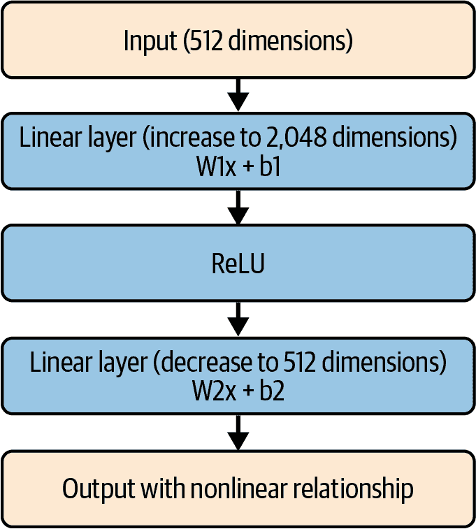

# 第十五章\. Transformers 和 transformers

2017 年，Ashish Vaswani 等人发表的论文[“Attention Is All You Need”](https://oreil.ly/R7og7)彻底改变了 AI 领域。虽然论文的摘要表明这是一种轻量级和简单的方法——卷积和递归架构的演变（参见本书的第四章到第九章）——但这项工作的影响，如果你不介意这个双关语，是变革性的。它彻底颠覆了 AI，从 NLP 开始。尽管作者声称这种方法简单，但在代码中实现它本质上是非常复杂的。其核心是一种新的 ML 架构方法：*Transformers*（我们用大写字母来表示我们指的是它们作为一个概念）。

在本章中，我们将从高层次探讨 Transformers 背后的思想，展示三种主要架构：编码器、解码器和编码器-解码器。请注意，我们只是从非常高的层次进行探讨，概述这些架构是如何工作的。要深入了解这些，需要几本书，而不仅仅是单独的一章！

然后，我们将探讨*transformers*，我们将其小写以表明它们是 Hugging Face 的 API 和库，旨在使使用基于 Transformer 的模型变得容易。在 transformers 之前，你大部分时间都需要阅读论文并自己弄清楚如何实现细节。因此，Hugging Face 的 transformers 库扩大了使用 Transformer 架构创建的模型的可访问性，并已成为使用基于 transformer 架构创建的许多模型的实际标准。

###### 注意

为了澄清，在本章的剩余部分，我将把架构、模型和概念称为 Transformers（首字母大写的*T*），而将 Hugging Face 库称为 transformers（首字母小写的*t*），以避免混淆。

# 理解 Transformers

自从本章引言中提到的原始论文发表以来，Transformers 领域已经发展和成长，但其基础仍然基本保持不变。在本节中，我们将探讨这一点。

当你在任何地方（而不仅仅是与 Hugging Face 一起）处理 LLMs 时，你会听到*编码器*、*解码器*和*编码器-解码器*这些术语。因此，我认为你了解它们的高级概念是个好主意。这些架构中的每一个都代表了处理文本的不同方法——无论是处理、分类还是生成。它们在特定场景下具有特定的优势，为了优化你的场景，了解它们是很好的，这样你可以选择合适的架构。

## 编码器架构

仅编码器架构（例如 BERT、RoBERTa）通常在*理解*文本方面表现出色，因为它们在处理文本时非常严谨。它们本质上是双向的，能够一次性“看到”整个输入序列。有了这种理解能力，它们特别适用于需要深入理解和理解文本及其语义的任务。因此，它们特别适合分类、命名实体识别和问答等任务。它们的优势是将文本转换为丰富的、上下文相关的表示，但它们并不是为了*生成*新文本而设计的。

你可以在图 15-1 中看到基于编码器的架构。


###### 图 15-1\. 基于编码器的架构

让我们更详细地探讨这个架构。它从标记化输入开始，然后传递到自注意力层。

### 自注意力层

*自注意力*是允许标记“关注”输入序列中其他标记的核心机制。例如，考虑句子“我在爱尔兰上高中，所以我不得不学习如何说盖尔语。”这个句子的最后一个词是*盖尔语*，它实际上是由句子中较早的词*爱尔兰*触发的。如果一个模型关注整个句子，它就可以预测下一个词是*盖尔语*。另一方面，如果一个模型没有关注整个句子，那么它可能从句子中解读出更合适的“如何说”的内容，比如*礼貌地*或其他形容词。

然而，自注意力机制——通过考虑整个句子——可以更细致地理解上下文。它是通过让句子中的每个标记与三个向量相关联来工作的。这些是查询（Q）向量（即“我在寻找什么与这个标记相关的信息？”）、键（K）向量（即“哪些标记可能引用我？”）和值（V）向量（即“我携带什么类型的信息？”）。这些向量中的表示随着时间的推移而学习，与我们在本书早期章节中看到的类似过程。然后根据这些向量计算一个注意力分数，并使用 Softmax，将单词的嵌入更新为注意力细节，当它们之间学习到相似性时，将单词嵌入弯曲得更近。

请注意，自注意力通常是双向的，所以单词的顺序并不重要。

自注意力机制通常也有“头”的概念，这些头实际上是之前我们看到的三种向量（Q、K 和 V）的多个并行实例，它们可以学习不同的表示并有效地专门处理输入的不同方面。这些头的的高级表示如图图 15-2 所示。

因此，每个头都有其自己的 Q、K 和 V 向量的学习权重集。这些向量的处理和学习是并行进行的，它们的最终输出投影是每个头的组合信息。随着时间的推移，随着模型规模的增大，导致这种增长的因素之一是头的数量。例如，BERT-base 有 12 个头，BERT-large 有 16 个头。也使用解码器的架构，如 GPT，也有类似的增长。GPT-2 有 12 个注意力头，而 GPT-3 增长到 96 个！

回到图 15-1，自注意力实例（其中图 15-2 可以封装到图 15-1 中的自注意力框中）然后输出到一个*前馈网络*（FFN），这通常更准确地被称为*位置前馈网络*。


###### 图 15-2. 多头自注意力

### 前馈网络层

FFN 层对于支持模型学习文本中的复杂模式至关重要。它是通过向模型中引入非线性来做到这一点的。

为什么这很重要？首先，让我们了解线性和非线性之间的区别。一个*线性方程*是指其值相对容易预测的方程。例如，考虑一个确定房价的方程。这个方程的线性版本可能是土地成本加上每平方英尺特定的美元金额，并且每栋房子都会遵循相同的公式。但正如我们所知，房价远比这复杂得多——它们（不幸的是）并不遵循简单的线性方程。

理解情感可以是一样的。所以，例如，如果你要在图表上分配坐标（就像我们在第七章解释嵌入时做的那样）给单词*good*和*not*，其中*good*可能是+1，而*not*可能是–1，那么*not good*之间的线性关系会给我们 0，这是中性的，而*not good*显然是负面的。因此，在捕捉情感和有效理解我们的文本时，我们需要更细微的方程（即非线性）。

这就是 FFN 的工作。它通过扩展其输入向量的维度，对该向量进行变换，并使用 ReLU“移除”负值（从而移除线性）来达到非线性，然后再将向量恢复到其原始维度。你可以在图 15-3 中看到这一点。



###### 图 15-3. 前馈网络

它如何工作的底层数学和逻辑略超出了本书的范围，但让我们用一个简单的例子来探讨一下。考虑以下代码，它模拟了图 15-3 中发生的情况：

```py
import torch
import torch.nn as nn

# Simplified example with small dimensions
d_model = 2  # Input/output dimension
d_ff = 4     # Hidden dimension

# Create some sample input
x = torch.tensor([[–1.0, 2.0]])

# First linear layer (2 → 4)
W1 = torch.tensor([
    [1.0, –1.0],
    [–1.0, 1.0],
    [0.5, 0.5],
    [–0.5, –0.5]
])
b1 = torch.tensor([0.0, 0.0, 0.0, 0.0])
layer1_out = torch.matmul(x, W1.t()) + b1
print("After first linear layer:", layer1_out)

# Apply ReLU
relu_out = torch.relu(layer1_out)
print("After ReLU:", relu_out)
# Notice how negative values became 0; this is the nonlinear operation!

# Second linear layer (4 → 2)
W2 = torch.tensor([
    [1.0, –1.0, 0.5, –0.5],
    [–1.0, 1.0, 0.5, –0.5]
])
b2 = torch.tensor([0.0, 0.0])
final_out = torch.matmul(relu_out, W2.t()) + b2
print("Final output:", final_out)

```

我们从一个简单的 2D 张量开始：`[–1.0, 2.0]`。

第一层线性层的权重和偏差如下：

```py
W1 = torch.tensor([
    [1.0, –1.0],
    [–1.0, 1.0],
    [0.5, 0.5],
    [–0.5, –0.5]
])
b1 = torch.tensor([0.0, 0.0, 0.0, 0.0])

```

当我们将我们的 2D 张量通过这一层得到`layer1_out`时，矩阵乘法给我们一个看起来是这样的 4D 输出：

```py
After first layer: [–3.0, 3.0, 0.5, –0.5]
```

在这一层有两个负值（-3 和-0.5），所以当我们通过 ReLU 传递时，它们被设置为 0，我们的矩阵变成这样：

```py
Output: [0.0, 3.0, 0.5, 0.0]
```

这个过程被称为*弯曲*。通过移除这些值，我们现在将非线性引入方程中。值之间的关系变得更加复杂，因此试图学习这些关系参数的过程将不得不处理这种复杂性，如果它成功地做到了这一点，它将避免线性陷阱。

接下来，我们将通过另一个具有类似权重和偏差的层将其转换回 2D 张量：

```py
W2 = torch.tensor([
    [1.0, –1.0, 0.5, –0.5],
    [–1.0, 1.0, 0.5, –0.5]
])
b2 = torch.tensor([0.0, 0.0])
```

层的输出将看起来像这样：

```py
Final output: [–2.75, 3.25]
```

因此，FFN 的效果是接收一个向量并输出一个相同维度的向量，去除了线性。

我们可以用我们的简单代码来探索这一点。考虑当我们对我们的输入应用简单的线性变化时会发生什么。所以，如果我们取[-1.0, 2.0]并将其翻倍为[-2.0, 4.0]，FFN 引入的非线性意味着输出不会是简单的翻倍。同样，如果我们取反，输出也不会是简单的取反：

```py
Input: [–1.0, 2.0] → Output: [–2.75, 3.25]
Input: [–2.0, 4.0] → Output: [–5.5, 6.5]    # Not a simple doubling!
Input: [1.0, –2.0] → Output: [2.75, –3.25]  # Not a simple negation!

```

随着时间的推移，为权重和偏差学习到的参数应该保持标记之间的关系，并允许网络学习更细微、非线性的方程，这些方程定义了它们之间的整体关系。

### 层归一化

回到图 15-1，过程的下一步被称为*层归一化*。在这个阶段，目标是通过对异常值和高方差进行移除来稳定通过神经网络的流动数据。层归一化通过计算输入特征的均值和方差来实现这一点，然后对其进行归一化并输出之前进行缩放/平移（参见图 15-4)。


###### 图 15-4\. 层归一化

从统计学的角度来看，从均值和方差中移除异常值并对其进行归一化的想法相当直接。在这里我不会深入细节，但那通常是进行这些类型计算的一般目标。

然后，*缩放和偏移*框变得神秘。你为什么要这样做呢？好吧，如果你稍微深入逻辑，这里的想法是，*归一化*的过程会将一组值的均值驱动到 0，标准差驱动到 1。这个过程本身可能会通过使它们过于相似而破坏我们输入特征的独特性。所以，如果我们有一个可以使用学习到的参数来恢复它们某些程度方差的过程，我们可以在不破坏它们的情况下清理数据——这意味着我们不会把婴儿和洗澡水一起倒掉！

因此，将我们的输出乘以具有偏移量的值可以改变这一点。这些值通常被称为*gamma*和*beta*值，它们的作用有点像权重和偏差。可能通过代码来展示这一点最简单。

因此，考虑以下示例，我们将取一个包含一些值的输入特征，然后对其进行归一化。我们会看到归一化后的值将具有 0 的均值和 1 的标准差：

```py
import torch

# Create sample feature values
features = torch.tensor([5.0, 1.0, 0.1])
print("\nOriginal features:", features)
print("Original mean:", features.mean().item())
print("Original std:", features.std().item())

# Standard normalization
mean = features.mean()
std = features.std()
normalized = (features - mean) / std
print("\nJust normalized:", normalized)
print("Normalized mean:", normalized.mean().item())
print("Normalized std:", normalized.std().item())

# With learnable scale and shift
gamma = torch.tensor([2.0, 0.5, 1.0])  # Learned parameters
beta = torch.tensor([1.0, 0.0, —1.0])  # Learned parameters
scaled_shifted = gamma * normalized + beta
print("\nAfter scale and shift:", scaled_shifted)
print("Final mean:", scaled_shifted.mean().item())
print("Final std:", scaled_shifted.std().item())
```

但是，当我们通过 gamma 和 beta 值对值进行缩放和平移时，我们得到一组新的参数，这些参数与原始参数保持更紧密的关系，但去除了大量的方差（即噪声）。此代码的输出应如下所示：

```py
Original features: tensor([5.0000, 1.0000, 0.1000])
Original mean: 2.0333333015441895
Original std: 2.6083199977874756

Just normalized: tensor([ 1.1374, —0.3962, —0.7412])
Normalized mean: 0.0
Normalized std: 1.0

After scale and shift: tensor([ 3.2748, —0.1981, —1.7412])
Final mean: 0.44515666365623474
Final std: 2.5691161155700684
```

就像 FFN 一样，这实际上是以一种巧妙的方式破坏并重新构建特征。在这种情况下，它被设计用来去除方差，这会根据需要通过将整体分布平移到更好的激活函数范围来放大或抑制特征。

我喜欢将这想象成你对电视所做的以获得更好的图像——有时，你会调整对比度或亮度。通过找到这些设置的优化值，你可以更好地看到特定图像的重要细节。将对比度视为比例，将亮度视为平移。如果一个网络能够学习你的输入特征，它将提高理解它们的能力！

### 重复的编码器层

回到图 15-1，你会看到自注意力、前馈和层归一化层可以重复 N 次。通常，较小的模型将有 12 个实例，较大的模型将有 24 个实例。模型越深，所需的计算资源就越多。更多的层提供了更多的学习复杂模式的能力，但当然，这也意味着更长的训练时间、更多的 GPU 内存开销，以及潜在的过拟合风险。此外，较大的模型可能会影响对应的数据需求，导致复杂性的可能负面影响。

在大多数情况下，模型深度（层数）和宽度（每层的大小，包括头的数量）之间存在权衡。在某些情况下，模型可以通过多次重用相同的层来减少整体参数数量——ALBERT 就是这样一个例子。

## 解码器架构

虽然编码器架构通过在整个输入序列的上下文中具有注意力来专门理解文本，但解码器架构作为生成动力源。它被设计成一次生成一个元素顺序输出。虽然编码器同时处理所有输入（或尽可能多的输入，基于系统的并行化），但解码器是自回归的。它在生成每个输出标记时，同时考虑编码的输入表示和之前生成的输出。目标是保持过程的一致性和上下文相关性。

你可以在图 15-5 中看到编码器架构的示意图。


###### 图 15-5\. 解码器架构

让我们从上往下解释这个结构。第一个框是之前生成的标记。在一个纯解码器架构中，这是已经生成或提供的标记集合。当它们被提供时，通常被称为提示。所以，假设你提供了以下标记：

```py
[“If”, “you”, “are”, “happy”, “and”, “you”, “know”, “it”]
```

经过解码器处理后，将生成“clap”的标记。现在你将拥有以下内容：

```py
[“If”, “you”, “are”, “happy”, “and”, “you”, “know”, “it”, “clap”]
```

这些标记将流入标记嵌入 + 位置编码的框中。

### 理解标记和位置编码

这将每个标记转换为一个称为*嵌入*的向量表示（如第五章第五章自然语言处理简介中所述），在相似的向量空间中聚类具有相似语义意义的单词。请记住，这些嵌入是随着时间的推移而学习的。

例如，如果我们考虑上述标记列表末尾的单词*it*和*clap*，它们可能具有如下所示的标记嵌入：

```py
"it" -> [0.2, –0.5, 0.7] (position 7)
"clap" -> [–0.3, 0.4, 0.1] (position 8)

```

我为了可读性简化了嵌入到只有三个维度。

下一步是执行*位置编码*，这是 Transformers 中的一个巨大创新。除了在向量空间中对单词的语义和意义进行编码外，还使用正弦和余弦波进行创新方法，以编码单词的位置及其对邻居的影响。

因此，例如，鉴于我们为编码使用了三维向量，我们将使用正弦波为奇数索引创建一个三维向量，为偶数索引使用余弦波，如下所示：

```py
Position 7 -> [sin(7), cos(7), sin(7)] = [.122, .992, .122]
Position 8 -> [sin(8), cos(8), sin(8)] = [.139, .990, .139]
```

然后，我们将这些向量相加以得到以下结果：

```py
“It” -> [0.2+.122, —0.5+.992, 0.7+.122] = [0.322, 0.492, 0.822]
“Clap” -> [—0.3+.139, 0.4+.990, 0.1+.139] = [—0.161, 1.390, 0.239]
```

虽然这看起来可能是任意的，但位置编码实际上来自一个特定的公式。这些公式如下所示：

```py
# For Even-numbered dimensions
PE(pos, d) = sin(pos / 10000^(d/d_model))

# For Odd-numbered dimensions
PE(pos, d) = cos(pos / 10000^(d-1/d_model))
```

如果你将这些值作为表格绘制，它们将看起来像表 15-1。

表 15-1\. 位置编码

| 位置 | 维度 0 | 维度 1 | 维度 2 | 维度 3 | 维度 4 | 维度 5 | 维度 6 | 维度 7 |
| --- | --- | --- | --- | --- | --- | --- | --- | --- |
| **0** | 0.000 | 1.000 | 0.000 | 1.000 | 0.000 | 1.000 | 0.000 | 1.000 |
| **1** | 0.841 | 0.540 | 0.100 | 0.995 | 0.010 | 1.000 | 0.001 | 1.000 |
| **2** | 0.909 | –0.416 | 0.199 | 0.980 | 0.020 | 1.000 | 0.002 | 1.000 |
| **3** | 0.141 | –0.990 | 0.296 | 0.955 | 0.030 | 1.000 | 0.003 | 1.000 |

这里的最终目标是列表上的每个位置与其他每个位置之间都有一个关系，在某些维度上，通常距离较远的标记会稍微靠近一些，而通常距离较近的标记会稍微远离一些！

那么，想象一下你有一个输入序列，包含位置 0 到 3 的四个标记，如表格所示。位置 3 的标记与位置 0 的标记尽可能远，因此它们位于序列的两端。

使用这种位置编码，我们得到了在某些维度上它们可能更靠近彼此的可能性。你可以在第一列中看到，维度 0 的值将位置 3 与位置 0 的距离比其他任何位置都要近，而在维度 2 的列中，它们则更远。通过使用这些位置编码，我们打开了单词可以聚集的可能性，即使它们在句子中的距离很远。

想想那个句子“我在爱尔兰上高中，所以我不得不学习如何说盖尔语。”在这种情况下，最后的标记“盖尔语”是最准确的，因为它描述了“爱尔兰”的语言，这在句子中是早先提到的。如果没有位置编码，这就会被遗漏！

此外，位置编码被**添加**到标记嵌入中，因此它们为可能在不同句子部分语义相关的单词提供了一种保持在一起的压力，但它们并不完全覆盖嵌入。

然后将这些输入到多头掩码注意力中。我们将在下一节中探讨这一点。

### 理解多头掩码注意力

在本章前面的注意力部分，我们看到了每个标记的 Q、K 和 V 向量是如何学习和使用的，以及如何使用注意力来更新单词的嵌入。**掩码注意力**背后的想法是将这个更新扩展到忽略我们不应该关注的单词。换句话说（即），目标是我们应该只关注序列中的**先前**位置。

因此，想象一下你有一串由八个单词组成的序列，你想预测第九个单词。当你处理句子中的第三个单词时，它应该只关注第二个和第一个单词，而不要关注它们之后的任何内容。你可以通过这样的三角形矩阵来实现这一点：

```py
1 0 0
1 1 0
1 1 1
```

那么，想象一下对于像*the*、*cat*和*sat*这样的单词集合（见表 15-2）。

表 15-2\. 简单掩码注意力

|   | the | cat | sat |
| --- | --- | --- | --- |
| the | 1 | 0 | 0 |
| cat | 1 | 1 | 0 |
| sat | 1 | 1 | 1 |

当处理*the*时，使用这种方法意味着我们只能关注*The*本身。当处理*cat*时，我们可以关注*the*和*cat*。当处理 sat 时，我们可以关注*the*、*cat*和*sat*。

因此，回忆一下，K、Q 和 V 向量将根据情况调整单词的嵌入，使它们在可能没有紧密的句法意义但通过注意力相互影响（如早期示例中的*Ireland*和*Gaelic*）的情况下更靠近。因此，掩码注意力层的目的是只为我们可以关注到的单词进行这种弯曲。

当多次并行地在多个头部执行此操作，并将结果汇总在一起时，我们得到一个与编码器中使用的非常相似的嵌入注意力调整——只不过掩码防止了序列中任何单词之后（尤其是生成的单词）的标记被修改。

### 添加和归一化

接下来，我们将掩码注意力层的注意力输出添加到原始输入中。这被称为建立*残差连接*。

例如，这个过程可能看起来像这样：

```py
Original input (word "cat" embedding):
[0.5, —0.3, 0.7, 0.1]  # Contains basic info about "cat"

Attention output (learned changes):
[0.2, 0.1, —0.1, 0.3]  # Contains contextual updates based on other words

After adding (final result):
[0.7, —0.2, 0.6, 0.4]  # Original meaning of "cat" PLUS contextual information
```

当我们思考这个问题时，我们会发现我们并没有用注意力机制*替换*原始信息，而是*添加*了从注意力机制中学习的新嵌入，从而保留了原始信息。随着时间的推移，这将有助于网络学习。如果某些注意力更新没有用，那么网络将通过梯度回传将它们调整为接近零。

这超出了本书的范围，通常可以在创建这些模型的论文中找到。但最终，这里的目的是解决被称为*梯度消失问题*的问题——在这种情况下，如果原始输入没有被保持，那么注意力层的梯度会随着后续层的增加而变得越来越小，从而限制了你可以使用的层数。但是，如果你总是将梯度添加到原始输入中，那么就会有一个下限——例如，之前提到的猫的梯度[0.5, –0.3, 0.7, 0.1]——因此，注意力梯度的小变化不会将这些值推向零，从而导致整体梯度消失。

然后将其通过层归一化，如编码器章节所述，以去除异常值同时保持序列的知识。

### 前馈层

前馈层的工作方式与编码器中使用的那些层完全相同（参见本章前面的内容），目的是减少标记序列中的任何线性依赖。从这个输出再次添加到原始数据中，然后进行归一化，其逻辑是，移除 FFN 中的异常值的过程也应该防止梯度消失，从而保留重要信息。归一化还保持了值的稳定范围，因为我们反复添加，可能会将一些值推到远高于 1.0 或低于–1.0，而这些范围内的归一化值通常更适合矩阵计算。

在我们到达下一层之前，我们可以重复这个过程多次，即掩码注意力 -> 添加和归一化 -> 前馈 -> 添加和归一化，在下一层中，我们将使用学习到的值来预测下一个标记。

### 线性和 Softmax 层

线性和 Softmax 层负责将解码器的表示转换为下一个标记的概率。

线性层将学习字典中每个单词的表示，其大小与解码器表示的转置大小相同。这有点难以理解，所以让我们用一个例子来探讨一下。

假设我们的解码器输出，经过所有层后，是一个 4D 表示，就像表 15-3 中那样。

表 15-3\. 模拟解码器输出

|   |   |   |   |
| --- | --- | --- | --- |
| 0.2 | –0.5 | 0.8 | –0.3 |

我们现在为词汇表中的每个词都有一个在训练过程中学习的权重矩阵，这个矩阵可能看起来像表 15-4 中的那个。

表 15-4\. 词汇中单词的权重矩阵

| cat | dog | sat | mat | the |
| --- | --- | --- | --- | --- |
| 1.0 | 0.5 | 2.0 | 0.3 | 0.7 |
| -0.3 | 0.8 | 1.5 | 0.4 | 0.2 |
| 2.0 | 0.3 | 2.1 | 0.5 | 0.8 |
| 0.4 | 0.6 | 0.9 | 0.2 | 0.5 |

注意，解码器的表示是 1 × 4，而每个单词的矩阵是 4 × 1。这就是转置，现在乘法变得容易了。

因此，对于*cat*，我们的最终得分将是这个：

(0.2 × 1.0) + (–.5 × –.3) + (0.8 × 2.0) + (–0.3 × 0.4) = 1.8

然后，我们可以得到每个单词的最终得分，就像表 15-5 中那样：

表 15-5\. 每个单词的最终得分

| cat | dog | sat | mat | the |
| --- | --- | --- | --- | --- |
| 1.8 | -0.2 | 1.1 | 0.2 | 0.5 |

使用 Softmax 函数，这些值随后被转换为概率，就像表 15-6 中那样。

表 15-6\. Softmax 函数的概率

| cat | dog | sat | mat | the |
| --- | --- | --- | --- | --- |
| 47.5% | 6.4% | 23.6% | 9.6% | 12.9% |

然后，我们可以将概率最高的单词作为下一个标记，这个过程称为*贪婪解码*。或者，我们可以从*k*个可能的前 k 个值中取 1 个，这个过程称为*top-k 解码*，例如，我们选择前三个概率，并从那里选择一个值。

然后，这些输出被反馈回顶部框作为新的标记列表，以便过程可以继续预测下一个标记。

至少从高层次来看，这就是解码器的工作方式。在下一节中，我们将探讨它们如何在编码器-解码器架构中结合在一起。

# 编码器-解码器架构

*编码器-解码器架构*，也称为*序列到序列*，结合了上述两种架构类型。这样做是为了处理需要输入和输出序列之间转换的任务。特别是对于机器翻译，它已被证明非常有效，但它也可以用于文本摘要和问答模型的模型中。

如您在图 15-6 中看到的，它的大部分结构与解码器架构非常相似。不同之处在于增加了一个交叉注意力层，该层接收来自编码器的输出并将其注入到工作流程的中间部分。

编码器将处理整个输入序列，创建一个丰富的上下文表示，捕捉输入的全部意义。解码器层可以查询这个表示，将其与其表示相结合，允许解码器在生成每个新标记时，额外关注输入的相关部分。


###### 图 15-6\. 编码器-解码器架构

现在，您可能会想知道为什么编码器-解码器架构需要编码器的输出，并将其与交叉注意力合并。为什么它不能在自己的自注意力块中解除掩码？基本原因归结为以下事实：这有以下几个更强大的原因：

关注点的分离和参数聚焦

如果解码器的自注意力块被解除掩码，它将不得不同时处理理解输入*和*生成输出的任务。这可能导致学习问题，因为目标不够明确。但如果我们将它们分开，每个都可以专注于自己的专业角色。

质量

如果我们分离关注点，每个角色都可以构建一个适合其任务的丰富表示。特别是对于编码器，我们有一个众所周知、经过实战考验的人工理解架构，我们知道它适用于该任务。

这里的主要创新是*交叉注意力块*。我们可以通过类比人类语言翻译者来展示这一直觉。当一个人将句子从法语翻译成英语时，他们不会只是记住整个法语语料库然后写英语。相反，在写英语单词的同时，他们会积极查看法语句子的不同部分，专注于当前正在写的单词最相关的句子部分。

在法语中，句子“Le chat noir”翻译成“The black cat”，但名词和形容词的顺序是颠倒的。直译将是“The cat black”。当人类翻译员注意这一点时，就会知道这一点，并会关注法语句子中的其他单词。交叉注意力做的是同样的事情。随着解码器生成每个新单词，它需要参考源材料来确定下一个要生成的单词。它输出中之前出现的单词可能不足以做到这一点。

你可以在图 15-7 中看到这个机制的实际应用。

最终，编码器通过人工理解源句子，创建了一个丰富、上下文相关的输入表示。交叉注意力是一个选择性的聚光灯，它突出了模型认为对每个生成的单词来说最相关的理解部分，这种突出使得模型在生成正确单词方面更加有效。你可以看到这对于机器翻译非常有效，但理解它可能对其他任务也有用并不需要太多的想象！

交叉注意力的机制与之前的 K、Q 和 V 向量相同，但这里的创新在于 Q 向量将从解码器编码，而 K 和 V 向量将来自编码器。

这是对 Transformer 及其工作原理的一个非常高级的概述。还有很多更详细的细节——特别是关于它们如何学习 Q、K 和 V 向量等内容的细节——这些内容超出了本章的范围，我建议阅读原始论文以了解更多信息。

现在，让我们转换一下话题，转向 Hugging Face 的 transformers（小写*t*）API，它使得你在代码中使用基于 Transformer 的模型变得非常容易。


###### 图 15-7\. 交叉注意力

# The transformers API

在其核心，transformers 提供了一个 API，用于使用 Python 和 PyTorch 与预训练模型一起工作。该库的成功源于三个关键创新：一个用于使用预训练模型简单接口、一个广泛的预训练模型集合（正如我们在第十四章中探讨的），以及一个活跃的社区，该社区经常贡献改进和新模型。

该库已经超越了其 NLP 根源，支持多种类型的模型，包括支持计算机视觉、音频处理和多模态任务的模型。最初，基于 transformer 的架构的目标是有效地学习一个标记序列是如何被另一个标记序列跟随的。然后，基于这个想法的创新模型允许诸如声音这样的概念被表示为一个标记序列，因此，transformers 可以学习声音模式。

对于开发者来说，transformers 提供了多个抽象级别。我们在 第十四章 中探讨了的高级管道 API，使得模型可以立即用于常见任务，而较低级别的接口则提供了对自定义实现的精细控制。此外，库的模块化设计允许开发者混合和匹配分词器、模型和优化器等组件。

可能最有力的，transformers 强调透明性和可重复性。所有模型实现都是开源的，有良好的文档，并附有描述其功能、限制和伦理考虑的模型卡片。在 GitHub 上打开 transformers 库并探索 GPT 和 Gemma 等常见模型的源代码是一个美妙的学习过程。

这种对开放性的承诺使得 transformers API 成为您宝贵的工具，这是值得您投入时间去学习的！

# 开始使用 transformers

在 第十四章 中，我们探讨了如何从 Hugging Face Hub 访问模型，并看到了如何轻松地实例化一个模型然后使用各种管道来使用它。在本章中，我们将更深入地探讨这一点，但让我们首先安装所需的库：

```py
pip install transformers
pip install datasets  # for working with HuggingFace datasets
pip install tokenizers  # for fast tokenization
```

Hugging Face Hub 中的许多模型，通过 transformers 可访问，需要您在 Hugging Face 上拥有一个身份验证令牌，以及使用该模型的权限。在 第十四章 中，我们向您展示了如何获取访问令牌。之后，根据您选择的模型，如果您想访问它，可能需要在它的着陆页上请求权限。您还学习了如何在 Google Colab 中使用 transformers 库，但当然，除了 Colab 之外，还有许多其他使用 transformers 的方法！

一旦您有了令牌，您就可以像这样在您的 Python 代码中使用它：

```py
from huggingface_hub import login
login(token="your_token_here")
```

或者，如果您愿意，可以设置一个环境变量：

```py
export HUGGINGFACE_TOKEN="your_token_here"
```

有了这些，您的发展环境现在可以支持使用 transformers 进行开发。接下来，我们将查看库中的某些核心概念。

# 核心概念

使用 transformers 有许多重要的核心概念，您可以加以利用。transformers 设计的简单性将核心概念隐藏起来，直到您需要它们，但让我们在这里更详细地看看其中的一些。

我们将从您在 第十四章 中学到的管道开始。

## 管道

`pipeline` 类实现了转换器最有用的抽象，目标是使复杂的转换器操作可以通过最少的代码来访问。您可以通过使用具有默认值的适当管道来获取模型的核心默认功能，也可以覆盖默认值以创建自定义功能。

管道封装了所有机器学习处理过程——从数据预处理到模型推理再到结果格式化——在一个单一的方法中。

为了看到管道的实际作用，让我们来看一个例子：

```py
from transformers import pipeline

# Basic sentiment analysis
classifier = pipeline("sentiment-analysis")
result = classifier("I love working with transformers!")
```

在这种情况下，我们没有指定一个模型，而是指定了一个场景（`sentiment-analysis`），管道配置选择了该场景的默认模型，并为我们完成了所有初始化。正如你在第五章和第六章中看到的，当你处理文本时，你需要对其进行分词和序列化。你还需要知道特定模型使用的分词器，以确保你的文本被正确编码，然后转换为正确的、归一化的张量格式。你还需要解析输出，并可能进行去分词，但这里没有出现任何这样的代码。相反，你只需说明你想要进行情感分析，然后将管道指向你想要分类的文本。

我们不仅限于文本情感分析，当然。我们还可以进行文本分类、生成、摘要和翻译。其他场景包括实体识别和问答。随着更多多模态基于 transformer 的模型上线，还包括图像分类和分割、目标检测、图像生成以及包括语音识别和生成的音频场景。

虽然对于某个场景有默认模型，就像我们刚才看到的，但也可以覆盖默认设置并向模型发送自定义参数。

例如，在文本生成中，我们可以使用默认体验如下：

```py
generator = pipeline("text-generation")
text = generator("The future of AI is")
print(text)
```

或者我们可以进一步自定义它，通过传递参数来指定生成令牌的数量（`max_length`）、温度（这将有多有创意），以及输出新令牌时评估的令牌数量（`top_k`）：

```py
# Text generation with specific parameters
generator = pipeline(
    "text-generation",
    model="gpt2",
    max_length=50,
    temperature=0.7,
    top_k=50
)
text = generator("The future of AI is")
```

这为你提供了对任何特定模型进行精细控制的灵活性，这意味着它允许你设置所需的参数以覆盖默认行为。重要的是，管道的抽象处理了使用模型的关键步骤。

再次强调：当你使用管道时，你得到的不仅仅是模型下载。根据你的场景，你通常会得到以下步骤：

模型加载

当你指定一个模型名称时，管道 API 会自动下载并缓存模型及其相关工具，如分词器。

预处理

这会将你的原始输入（通常是字符串、位图、波形文件等）转换为模型兼容的格式，即使需要多个步骤。例如，它可以对字符串进行分词，然后将生成的令牌转换为嵌入或张量。

分词

如前所述，这有助于你获得特定模型所需的特定分词策略。一种分词方案并不适合所有情况！

批处理

这抽象掉了你需要计算最佳批量大小的需求。它将高效地为你处理批处理，同时尊重内存限制。

后处理

模型输出概率张量，流水线将它们转换为人类可读的格式，你可以或你的代码可以与之工作。

现在我们已经快速浏览了流水线及其内容（你将在本书中大量使用它们），让我们继续我们的核心概念之旅，转向分词器。

## 分词器

我们已经讨论了很多关于分词器的内容，我们甚至在第五章和第六章中构建了自己的分词器。但是，预构建的分词器可以作为你创建自己的应用程序时非常强大和有用的工具。Hugging Face transformers 提供了`AutoTokenizer`类，当你处理分词器时，它们为你处理了许多复杂的场景，使你的生活变得更加容易。即使你正在创建自己的模型并从头开始训练它们，使用 AutoTokenizer 可能也是处理这项任务的一种更明智的方式，而不是自己从头开始。

要深入一点，分词器对于 transformer 模型如何处理文本是至关重要的。它是将原始文本转换为模型可以处理格式的第一步。它也常常在构建模型的讨论中被忽视，这是一个很大的错误。分词策略在任何系统设计中都是至关重要的，一个设计不良的分词器可能会对你的整体模型性能产生负面影响。因此，对于手头的任务，拥有一个设计良好的分词器是非常重要的。

在本质上，分词器的任务是分解文本为更小的、称为标记的数值单元。它们可以是单词、单词的部分（即*子词*），甚至是单个字符。为了选择正确的分词策略，你需要在词汇量大小、你将在模型架构中使用的标记序列长度以及你处理不常见单词的愿望和需求之间做出权衡。

Transformers 库支持多种方法，其中子词分词是最常见的一种。它在字符级和词级分词之间提供了一个很好的平衡，允许不常见的单词仍然存在于语料库中，因为它们由更常见的子词组成。例如，单词*antidisestablishmentarianism*不是一个常用术语，但它由字母组合*anti*、*di*s、*est*、*ab*、*lish*、*ment*、*ari*、*an,* 和 *ism* 组成，这些都是！它也是一个与 AI 模型一起使用的好词，这些模型可以解释你的语音，看看它是否能在你之前完成单词！

如你所见，这可以提供极好的*词汇效率*，即在保持可管理词汇量的同时，仍然能够捕捉到有意义的语义。它还可以有效地处理*词汇表外的*词，这意味着通过将它们分解成已知的子词来处理未见过的词。

这里有一个非常有趣的例子。在 transformers 的早期（GPT 之前），我参与了一个项目，我创建了一个使用电视剧《星际之门》的脚本进行训练的 transformer，然后我与该节目的制作人和演员一起对 AI 生成的剧本进行了朗读。鉴于该电视剧是科幻剧，有很多虚构的词（即技术术语），我使用了一个子标记分词器，按照它可以创造新词的逻辑。然而，它最终变得有点过于创意了！你可以在[这个朗读视频](https://oreil.ly/A42Ko)中看到演员们对新词的挣扎。

现在，让我们探索生态系统中的一些常见分词器，看看它们是如何工作的。请注意，分词器与它们的模型类型相关联，所以当你探索 Hugging Face Hub 中的模型（见第十四章 14），你将能够找到它们的分词器。你必须使用与每个模型相应的正确分词器，否则它将无法理解你的输入。根据与分词器相关的许可证，你也可以使用它们来训练或调整你自己的模型，而不是像我们在第四章 4 和第五章 5 中所做的那样从头开始构建。

### WordPiece 分词器

与 BERT 模型关联的 WordPiece 分词器是一种常见的分词器，它在管理子词方面非常高效。它从一个基本词汇表开始，然后迭代地添加它看到的频率最高的组合。子词由*##*表示。虽然它主要是为英语设计的，但它也适用于有清晰词边界（由空格和其他标点符号表示）的类似语言。

现在，让我们考虑一个包含复杂词的示例句子：

```py
              # Let's use a sentence with some interesting words to tokenize
text = "The ultramarathoner prequalified for the 
        immunohistochemistry conference in neuroscience."
```

要加载分词器，你需要实例化一个 AutoTokenizer 对象并调用`from_pretrained`方法，传入分词器的名称。对于 BERT 的 WordPiece，你可以使用`bert-base-uncased`作为分词器名称：

```py
from transformers import AutoTokenizer

# Load BERT tokenizer which uses WordPiece
tokenizer = AutoTokenizer.from_pretrained('bert-base-uncased')
```

然后，为了对文本进行分词，你只需要调用`tokenize`方法并传入你的字符串。这将输出一个包含标记的列表：

```py
# Tokenize the text
tokens = tokenizer.tokenize(text)
print("Tokens:", tokens)
```

这将输出句子中的标记列表，看起来像这样：

```py
Tokens: ['the', 'ultra', '##mara', '##th', '##one', '##r', 'pre', 
         '##qual', '##ified', 'for', 'the', 'im', '##mun', '##oh', '##isto', 
         '##chemist', '##ry', 'conference', 'in', 'neuroscience', '.']
```

不常用的长词（如 *marathoner* 和 *immunohistochemistry*）会被拆分成子词，而其他词（如 *conference* 和 *neuroscience*）则保持为整个单词。这是基于 BERT 使用的训练语料库，关于哪些词足够常见以及哪些词不够常见（例如，我原本预期 *qualified* 应该相当常见）的决定是由原始研究者做出的。

如果你想要查看这些令牌的 ID，你可以使用 encode 方法来获取，如下所示：

```py
# Get the token IDs
token_ids = tokenizer.encode(text)
print("\nToken IDs:", token_ids)
```

ID 列表如下所示：

```py
Token IDs: [101, 1996, 14357, 2108, 2339, 3840, 2837, 13462, 2005, 1996, 19763, 
            2172, 3075, 7903, 5273, 13172, 1027, 2005, 23021, 1012, 102]

```

注意，第一个和最后一个令牌是 `101` 和 `102`，这是分词器插入的特殊令牌，用于句子的开始和结束，模型期望这些令牌。

现在，假设你将令牌 ID 列表解码回字符串，如下所示：

```py
# Decode back to show special tokens
decoded = tokenizer.decode(token_ids)
print("\nDecoded with special tokens:", decoded)
```

然后，你会看到句子中插入了这些特殊令牌：

```py
Decoded with special tokens: [CLS] the ultramarathoner prequalified for the 
                             immunohistochemistry conference in 
                             neuroscience. [SEP]
```

我建议你继续实验 tokenizer，以了解它是如何通过将其转换为令牌和特殊字符来管理文本的。当你调试模型行为或进行某种微调以管理词汇的使用时，这种知识通常很重要。

### 字节对编码

GPT 系列使用一种称为 *字节对编码*（BPE）的格式，它是一种数据压缩算法，也是一种分词算法。它从单个字符的词汇表开始，逐渐学习常见的字节或字符对，将它们合并成新的令牌。

算法最初将训练语料库拆分为字符，并为每个字符分配令牌。然后，它迭代地将最频繁出现的对合并成新的令牌，并将它们添加到词汇表中。这个过程会持续进行预定的合并次数。例如，随着时间的推移，单词中的常见模式会变成它们自己的令牌。这往往倾向于具有常见前缀（如 *inter*）的单词的开头或具有常见后缀（如 *er*）的单词的结尾，最终拥有它们自己的令牌。BPE 不是使用 `##` 字符串来确定子词的开始，而是使用一个特殊字符（通常是 *Ġ*）。

这里是你可以用来对相同句子进行分词的代码。你将使用来自 OpenAI 的`gpt2` AutoTokenizer：

```py
from transformers import AutoTokenizer

# Load GPT-2 tokenizer which uses BPE
tokenizer = AutoTokenizer.from_pretrained('gpt2')

# Same sentence as before
text = "The ultramarathoner prequalified for the immunohistochemistry 
        conference in neuroscience."

# Tokenize the text
tokens = tokenizer.tokenize(text)
print("Tokens:", tokens)
```

输出如下所示：

```py
Tokens: ['The', 'Ġult', 'ram', 'ar', 'athon', 'er', 'Ġpre', 'qualified', 'Ġfor', 
         'Ġthe', 'Ġimmun', 'oh', 'ist', 'ochemistry', 'Ġconference', 
         'Ġin', 'Ġneuroscience', '.']
```

随着时间的推移，你会发现拆分会有细微的差异，这反映了训练集之间的差异。BERT 是在维基百科和 Toronto BookCorpus 上训练的，而 GPT-2 是在网络文本上训练的。

### SentencePiece

SentencePiece，T5 模型所使用的独特分词器。它将所有输入文本视为原始的 Unicode 字符序列，这为非英语语言提供了强大的支持。作为其中的一部分，它将空白符视为其他任何字符。这使得它对像日语和中文这样的语言非常有效，这些语言并不总是有清晰的单词边界，并且它还消除了对特定语言预处理的需求。实际上，在构建过程中，这个分词器直接从多种语言的原始句子中学习其子词单元。

这是如何使用它的方法：

```py
from transformers import AutoTokenizer

# Load T5 tokenizer which uses SentencePiece
tokenizer = AutoTokenizer.from_pretrained('t5-base')

# Same sentence as before
text = "The ultramarathoner prequalified for the immunohistochemistry 
        conference in neuroscience."

# Tokenize the text
tokens = tokenizer.tokenize(text)
print("Tokens:", tokens)
```

这产生了以下一组标记：

```py
Tokens: ['▁The', '▁ultra', 'marathon', 'er', '▁pre', 'qualified', '▁for', 
         '▁the', '▁immun', 'oh', 'ist', 'ochemistry', '▁conference', '▁in',
         '▁neuroscience', '.']

```

正如之前提到的，它在非英语语言中尤其强大。例如，考虑以下代码：

```py
# Let's also try a multilingual example with mixed scripts
text2 = "Tokyo 東京 is beautiful! Preprocessing in 2024 costs $123.45"
tokens2 = tokenizer.tokenize(text2)
print("\nMultilingual example tokens:", tokens2)
```

它将输出以下内容：

```py
Multilingual example tokens: ['▁Tokyo', '▁東', '京', '▁is', '▁beautiful', '!', 
                              '▁Pre', '-', 'processing', '▁in', '▁2024', 
                              '▁costs', '▁$', '123', '.', '45']
```

注意，东京的日语字符被分割成多个标记，而数字保持完整（即 `123` 和 `45`）。

由于 Transformer 最初是为了改进机器翻译而设计的，你可以看到，在 GPT 等生成式 AI 之前出现的 SentencePiece，在设计时就已经考虑了国际化！

# 摘要

在本章中，我们探讨了 Transformer 架构，它是现代大型语言模型的基础，以及 Hugging Face 的 Transformer 库，它使得 Transformer 的使用变得简单易行。

我们探讨了原始 Transformer 架构如何通过使用注意力机制来革命性地改变 AI，在这些机制中，基于学习到的细节，单词的上下文向量会根据序列可能适当关注的其他部分进行修改。我们还研究了擅长人工理解文本的编码器，能够智能生成文本的解码器，以及将两者优点结合起来的序列到序列模型。我们还深入研究了它们的架构，以了解注意力、前馈、归一化等机制以及架构的其他部分是如何工作的。

然后，我们研究了 Transformer，它构成了 Hugging Face 库的一部分，使得下载和实例化基于 Transformer 的模型（包括整个推理流程）变得非常简单。其中还有很多其他内容，希望这为你提供了一个良好的起点。

在下一章中，你将更进一步，探索如何将 LLM 模型适应你的特定需求，使用自定义数据微调或提示调整模型，使其适用于你的特定用例。准备好将理论转化为实践吧！
