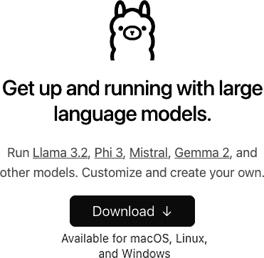
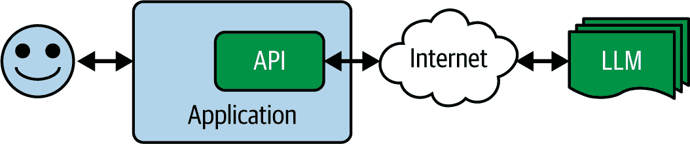
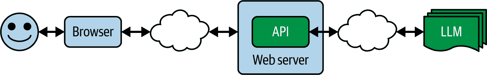

# 第十七章\. 使用 Ollama 提供 LLM 服务

我们已经探讨了如何使用 transformers 下载模型并构建一个简单的管道，让您可以使用它进行推理或微调。然而，如果我不向您展示开源的 Ollama 项目，那就太遗憾了。该项目通过提供一个环境将所有这些整合在一起，您可以在终端与其聊天，或者将其用作服务器，您可以通过 HTTP POST 向其发送请求并读取输出。

像 Ollama 这样的技术将是下一代 LLM 的前沿，它将让您在数据中心内部拥有专用服务器或在您的计算机上拥有专用进程。这将使它们对您来说完全私密。

在其核心，Ollama 是一个开源项目，简化了在您的计算机上下载、运行和管理 LLM 的过程。它还处理非功能性困难要求，例如内存管理和模型优化，并提供标准化的交互接口，例如能够通过 HTTP POST 与您的模型交互。

Ollama 也是您应该考虑的关键战略工具，因为它弥合了基于云的第三方服务（如 GPT、Claude 和 Gemini）与本地部署服务之间的差距。它不仅提供本地开发环境，还提供您可以在自己的数据中心内使用，为多个内部用户提供服务的环境。

通过在本地运行模型，您可以确保数据的完全隐私，消除网络延迟，并离线工作。这在涉及敏感数据或需要一致、低延迟响应的应用程序的场景中尤为重要。

Ollama 还支持一个不断增长的流行开源模型库，包括 Llama、Mistral 和 Gemma，它还支持针对特定任务优化的各种专用模型。每个模型都可以通过简单的命令拉取和运行，其方式类似于 Docker 容器的工作方式。该平台自动处理模型量化，优化模型以在消费级硬件上高效运行，同时保持良好的性能。

在本章中，我们将以三种方式探索 Ollama：安装它并开始使用，查看您如何实例化特定模型并使用它们，以及探索 RESTful API，这些 API 让您能够构建保护隐私的 LLM 应用程序。

# 开始使用 Ollama

Ollama 项目托管在[ollama.com](http://ollama.com)。启动起来非常简单，主屏幕提供了 macOS、Linux 和 Windows 的下载选项。请注意，Windows 版本需要 Windows Subsystem for Linux (WSL)。对于本章，我使用的是 macOS 版本。

当您导航到网站时，您将看到一个友好的欢迎下载界面（见图 17-1）。



###### 图 17-1\. 开始使用 Ollama

一旦你下载并安装了 Ollama，你就可以启动它，你会在屏幕顶部的系统栏中看到它。你与 Ollama 的主要界面将是命令行。

然后，使用 `ollama run` 命令，你可以下载并使用模型。例如，如果你想使用 Gemma，那么从 Google，你可以执行以下操作：

```py
>ollama run gemma2:2b
```

你需要确保注意使用的参数，这些参数可以在 Ollama 的[模型文档页面](https://oreil.ly/VMLKO)上找到。虽然 Ollama 可以并且会量化那些优化以本地运行的模型，但它不能创造奇迹，只有适合你系统资源——最重要的是内存——的模型才能工作。在这种情况下，我运行了 `gemma2:2b`（20 亿参数）版本，这需要大约 8 GB 的 GPU RAM。在 macOS 上，与 M-Series 芯片的共享 RAM 工作良好，而在 16 Gb 的 M1 Mac 上运行时，Gemma 2B 与 Ollama 一起运行得既快又流畅。

你可以在图 17-2 中看到我与 Gemma 的聊天。这些响应在我的两岁笔记本电脑上接收不到一秒！


###### 图 17-2\. 在终端中使用 Ollama

有这样一个本地化的聊天真是太好了，你可以尝试不同的模型，包括像 Llama 3.2\ 这样的多模态模型。

例如，你可以执行以下命令：

```py
ollama run llama3.2-vision
```

然后，在终端内，你可以进行多模态处理。例如，如果你的终端支持它，并且你将一个图像拖放到终端中，你可以询问模型它在图像中看到了什么。Llama 的多模态能力会为你解析图像，而 Ollama 会处理所有的技术难题。

在我的情况下，我只需要给出一个提示，然后将图像拖放到上面。因此，我使用前面的命令打开了一个 Ollama 聊天窗口，并输入了这个提示：

```py
Please give me a detailed analysis of what's in this image. `Call` `out` `any` `major` `or` `minor` `features` `and` `tell` `me` `everything` `you` `know` `about` `it``.`
`Are` `there` `any` `interesting` `and` `fun` `facts``?`
`Maybe` `even` `estimate` `when` `this` `picture` `was` `taken``.`
```

`然后我只是把图片拖放到聊天窗口中，Ollama 就完成了剩下的工作。您可以在图 17-3 中看到结果有多么详细。这是我在 2018 年一次晨跑时拍摄的大阪城照片。虽然 Llama 无法猜出日期，但它能够根据图像中的树叶预测季节。它对其他所有事情都判断正确，并给出了非常详细的输出！ ###### 图 17-3\. 使用 Ollama 进行多模态模型    虽然能够以隐私保护的方式与本地 LLM 聊天确实很酷，但我认为 Ollama 真正的力量在于将其用作服务器，然后可以作为应用程序的基础。我们将在下一章探讨这一点。` ```py`````` # Running Ollama as a Server    To put Ollama into server mode, you simply issue the following command:    ```py ollama serve ```    This will run the Ollama server on port 11434 by default, so you can hit it and ask it to do inference with a `curl` command to test it.    In a separate terminal window, you issue a `curl` command. Here’s an example:    ```py curl http://localhost:11434/api/generate -d '{ `"model"``:` `"gemma2:2b"``,`   `"prompt"``:` `"Why is the sky blue?"``,`   `"stream"``:` `false` `}``'` ```   ```py````` ```py```` Note the `stream` parameter. If you set it to true, you’ll get an active HTTP connection that will send the answer word by word. That will give you a faster time to the first word, which is very suitable for chat applications. And because the answer will appear little by little and usually faster than a person can read, it will make for a better user experience.    On the other hand, if you set the `stream` parameter to `false`, as I have done here, it will take longer to send something back, but when it does, you’ll get everything at once. The time to the last token will probably be about the same as in streaming, but given that there will be no output for a little while, it will feel slower.    The preceding `curl` to Gemma gave me this response:    ```py {"model":"gemma2:2b","created_at":"2024-12-09T18:10:05.711484Z",     "response":"The sky appears blue because ... phenomena! \n",     "done":true,     "done_reason":"stop",     "context":[106,1645,108,4385,603,573,...,235248,108],     "total_duration":7994972625,     "load_duration":820325334,     "prompt_eval_count":15,     "prompt_eval_duration":2599000000,     "eval_count":282,     "eval_duration":4573000000}% ```    I trimmed the response text and the context for brevity. Ultimately, you’d use the response text in an application, but I wanted to also show you how you can build more robust applications showing you everything else that the model provided.    The `done` parameter demonstrates that the prompt returned successfully. When the value is streaming, this parameter will be set to `false` until it has finished sending the text. That way, you can keep your UI updating the text word by word until the message is complete.    The `done_reason` parameter is useful in checking for errors, particularly when streaming. It will usually contain `stop` for normal completion, but in other circumstances, it might say `length`, which indicates that you’ve hit a token limit; `canceled` if the user cancels the request (by interrupting streaming, for example); or `error`.    The count values are also useful if you want to manage or report on token usage. The `prompt_eval_count` parameter tells you how many tokens were used in your prompt, and in this case, it was 15\. Similarly, the `eval_count` parameter tells you how many tokens were used in the response, and in this case (of course), it was 282\. The various duration numbers are in nanoseconds, so in this case, we can see that the total was 0.8 seconds (or more accurately, 820325334 nanoseconds).    If you want to attach a file to your `curl` prompt (for example, to interpret the contents of an image), you can do so by encoding the image to `base64` and passing it in the images array.    So, with the image of Osaka castle I used in Figure 17-3, I could do the following:    ```py curl -X POST \   -H "Content-Type: application/json" \   -d "{\"model\":\"llama3.2-vision\", \`"prompt``\"``:``\"``What is in this image?``\"``,` ```` \`"images``\"``:[``\"``$(cat ./osaka.jpg | base64 | tr -d '``\n``')``\"``],` ```py \`"stream``\"``:false}"` \        `http``:``//``localhost``:``11434``/``api``/``generate` ``` ```py` ```   ```py``` ````` ```py`The key here is to note how the images are sent. They need to be `base64` encoded, where they are turned into a string-like blob that’s easy to put into a JSON payload, instead of uploading the binary image. But you should be careful with code here, because it depends on your system. The code I used—`$(cat ./osaka.jpg | base64 | tr -d '\n')`—is based on how to do `base64` encoding on a Mac. Different systems may produce different `base64` encodings for images, and they can lead to errors on the backend.    The response, abbreviated for clarity, is this:    ``` {     "model":"llama3.2-vision",     "created_at":"2024-12-10T17:15:06.264497Z",     "response":"The image depicts Osaka Castle...",     "done":true,     "done_reason":     "stop",     "context":[128006,882,128007,271,58,...],     "total_duration":88817301209,     "load_duration":21197292,     "prompt_eval_count":19,     "prompt_eval_duration":84560000000,     "eval_count":56,     "eval_duration":4050000000 }% ```py    If you’re trying this on your development box, you may notice that it starts up slowly as it loads the model into memory. It can take one to two minutes, but once it’s loaded and warmed up, successive inferences will be quicker.```` ```py`` ``````py ``````py` ``````py``  ``````py`` ``````py` ``````py # Building an App that Uses an Ollama LLM    It’s all very nice to be able to chat with a local model or curl to it like we just saw. But the next step is to consider building applications that use local LLMs, and in particular, building applications that work within your network to keep LLM inference local.    So, for example, consider Figure 17-4, which depicts the architecture of a typical application that uses the API for an LLM like Gemini, GPT, or Claude. In this case, the user has an application that invokes the LLM service via an API over the internet.    ###### Figure 17-4\. Accessing an LLM via API over the internet    Another pattern is quite similar: a service provider provides a backend web server, and that backend uses LLM functionality on your behalf. Ultimately, it still “wraps” the LLM on your behalf (see Figure 17-5).    ###### Figure 17-5\. Accessing an LLM via a backend web server    The issue here is that data that could be private to your users and that they share with you (in the blue boxes) gets passed to a third party across the internet (in the green boxes). This can lead to limitations in how your application might be useful to them. Consider scenarios where there’s information that should always be private or where there’s IP that you don’t want to share. In the early days of ChatGPT, a lot of companies banned its use for that reason. The classic case involves source code, where company IP might be sent to a competitor for analysis!    You can mitigate this problem by using a technology like Ollama. In this case, the architecture would change so that instead of the data being passed across the internet, the API and the server for the LLM would both be on your home or company’s network, as in Figure 17-6.    ###### Figure 17-6\. Using an LLM in your data center    Now, there are no privacy issues with sharing data with third parties. Additionally, you have control over the model version that is being used, so you don’t have to worry about the API causing regression issues. Look back to Figures 17-4 and 17-5, and you’ll see that by accessing the LLMs over the internet, you’re taking a strong dependency on a particular version of an LLM. Given that LLMs are not deterministic, this effectively means the prompts that work today may not work tomorrow!    So, with Ollama as a server to LLMs, you can build something like you saw in Figure 17-6. In the development environment and what we’ll be doing in the rest of this chapter, there’s no data center—the Ollama server will just run at the localhost, but changing your code to one that you have access to over the local network will just mean a change of server address.    ## The Scenario    As an example of a simple scenario, let’s build the basis of an app that uses a local llama to do analysis of books. It will allow the user to specify a book (as a text file, for simplicity’s sake), and it will bundle that to a call to an LLM to have it analyze the book. The app will also primarily be driven off a prompt to that backend. Perhaps this type of app could be used by a publishing house to determine how it should give feedback to an author to change a book, or by a book agent to work with the author to help them make the book more sellable. As you can imagine, the book content is valuable IP, and it should not be shared with a backend from a third party for analysis.    So, for example, consider this prompt:    ``` 你是一位精通故事讲述技巧的专家，理解故事结构、细微差别和内容。附上的是一部小说，请对该小说的故事情节进行评估，并提出在角色发展、情节和情感内容方面可以改进的建议。如有必要，请详细阐述，以便作者了解他们的作品将如何被接受。 ```py    Sending that to an LLM along with the text should have the desired effect: getting an analysis of the book based on the *artificial understanding* of the contents of the text and the generative abilities of a transformer-based model to create output guided by the prompt.    On this book’s GitHub page, I’ve provided [the full text of a novel](https://oreil.ly/pytorch_ch18) that I wrote several years ago and that I now have the full rights to, so you can try it with a real book like that one if you like. However, depending on your model, the context window size might not be big enough for a complete novel.    Generally, I like to build a simple proof-of-concept as a Python file to see how well it works and test it on my local machine. There are constraints in doing this, but it will at least let us see if the concept is feasible.    ## Building a Python Proof-of-Concept    Now, let’s take a look at a Python script that can perform the analysis for us.    Let’s start with reading the contents of the file:    ``` # 读取文件内容 with open(filepath, 'r', encoding='utf-8') as file:     file_content = file.read() ```py    We’re going to use Ollama on the backend, so let’s set up details for the request by specifying the URL and the content headers we’ll call:    ``` # 准备请求 url = "http://localhost:11434/api/generate" headers = {"Content-Type": "application/json"} ```py    Next, we’ll put together the payload that we’re going to post to the backend. This contains the model name (as a parameter called `model`), the prompt, and the stream flag. We don’t want to stream, so we’ll set the stream to `False`.    ``` payload = {     "model": model,     "prompt": f"You are an expert storyteller who understands                  `story` `structure``,` `nuance``,` `and` `content``.` `Attached` `is` `a` `novel``,`                  `please` `evaluate` `this` `novel` `for` `storylines``,` `and` `suggest`                  `improvements` `that` `could` `be` `made` `in` `character` `development``,`                  `plot``,` `and` `emotional` `content``.` `Be` `as` `verbose` `as` `needed`                  `to` `provide` `an` `in``-``depth` `analysis` `that would help        the author`                  `understand` `how` `their` `work` `would` `be` `accepted``:` `{``file_content``}``",` ```py `"stream"``:` `False` `}` ``` ```py   ````` ```py`Note that we’re appending `file_content` to the prompt. At this point, from the preceding code, it’s just a text blob.    For the model parameter, you can use whatever you like. For this experiment, I tried using the very small `Gemma 2b` parameter model by specifying `gemma2:2b` as the model.    Now, we can POST the request to Ollama like this:    ``` try:     # 发送请求     response = requests.post(url, headers=headers, json=payload)     response.raise_for_status()  # 对不良状态引发异常        # 解析响应     result = response.json()['response']       # 从 Ollama 返回响应文本     return result   except requests.exceptions.RequestException as e:     raise Exception(f"Error making request to Ollama: {str(e)}") except json.JSONDecodeError as e:     raise Exception(f"Error parsing Ollama response: {str(e)}") ```py    This is fully synchronous in that we post the data and block everything until we get the result. In a real application, you’d likely do that part asynchronously, but I’m keeping it simple for now.    As we get the response back from the server, it will contain JSON fields, and the response field will contain the text, as we saw earlier in this chapter. We’ll return this as a `dict` data type.    Next, we can wrap all this code in a function called `analyze`, with this signature:    ``` def analyze_file(filepath: str, model: str = "gemma2:2b") -> dict: ```py    Then, we can easily call it with this:    ``` result = analyze_file(str(input_path)) ```py    Given that Gemma is such a small model, the output it gives is very impressive! My local instance, via Ollama, was able to digest the book and give back a detailed analysis in just a few seconds. Here’s an excerpt (with spoilers if you haven’t read the book yet):    ``` **优势：**   * **引人入胜的情节设定：** 来自太空的致命瘟疫及其可能带来的灾难性后果这一概念既令人紧张又具有时效性，吸引了更广泛的受众。 * **真实的人物形象：** 尽管角色参与了非凡的事件，但他们的形象感觉真实可信，个性鲜明（艾莎的决心，苏-京的智慧）。他们的联系增加了情感分量。 * **紧张的氛围：** 故事逐渐建立紧张感。您巧妙地使用了悬念，如瘟疫三年的最后期限，让读者渴望更多。 * **世界构建潜力：** 提到月球基地和可能的星际跳跃引入了一个充满可能性的丰富世界，为进一步的探索提供了空间。   ```py    It’s pretty impressive work by Gemma to give me this analysis! Other than formatting issues (there are a lot of * characters, which Gemma may have added because it’s sci-fi), we have some great content here, and it’s worth looking further into building an app. So, let’s do that next and explore a web-based app that I can upload my files to so that I can get an analysis within a website.```` ```py``  ````` ```py`## Creating a Web App for Ollama    In this scenario, you’ll create a `node.js` app that provides a local website that the user can upload text to, and you’ll get an analysis back in the browser. The results look like those shown in Figure 17-7.    ###### Figure 17-7\. The browser-based Gemma analysis tool    If you’re not familiar with `node.js` and how to install it, full instructions are on [the Node website](http://nodejs.org). The architecture of a simple node app is shown in Figure 17-8.    ###### Figure 17-8\. The node app directory    In its simplest form, a *node app* is a directory containing a JavaScript file called *app.js* that contains the core application logic, a *package.json* file that gives details of the dependencies, and an *index.html* file that has the template for the app output.    ## The app.js File    This file contains the core logic for the service. A `node.js` app will run on a server by listening to a particular port, and it starts with this code:    ``` const PORT = process.env.PORT || 3000; app.listen(PORT, () => {   console.log(`Server running on port ${PORT}`); }); ```py    To analyze a book, you can define an endpoint that the end user can post the book to with the `app.post` command in `node.js`:    ``` app.post('/analyze', upload.single('novel'), async (req, res) => {   try {     if (!req.file) {       return res.status(400).send('No file uploaded');     } ```py    This function is asynchronous, and it accepts a file. If the file isn’t present in the upload, an error will return.    If the code continues, then there’s a file present. This code will start a new job (allowing the server to operate multiple processes in parallel) that uploads the file, reads its text into `fileContent`, and then cleans it up:    ``` // 生成唯一的作业 ID const jobId = Date.now().toString();   // 存储作业状态 analysisJobs.set(jobId, { status: 'processing' });   // 在后台开始分析 const fileContent = await fs.readFile(req.file.path, 'utf8');   // 清理上传的文件 await fs.unlink(req.file.path); ```py    The analysis of the novel is a long-running process. In it, the contents are appended to the prompt and uploaded to Ollama, which then passes it to Gemma—which, upon completion, sends us a result. We’ll look at the analysis code in a moment, but the wrapper for this that operates in the background is here:    ``` // 在后台处理 analyzeNovel(fileContent)   .then(result => {     analysisJobs.set(jobId, {       status: 'completed',       result: result     });   })   .catch(error => {     analysisJobs.set(jobId, {       status: 'error',       error: error.message     });   }); ```py    It simply calls the `analyzeNovel` method, sending the file content. If the process completes successfully, the `JobId` is updated with `completed`; otherwise, it’s updated with details of the failure. Note that upon a successful completion, the result is passed to `analysisJobs`. Later, when we look at the web client, we’ll see that after uploading the content, it will repeatedly poll the status of the job until it gets either a completion or an error. At that point, it can display the appropriate output.    The `analyzeNovel` function looks very similar to our Python code from earlier. First, we’ll create the request body with the prompt. It contains the `modelID`, the prompt text with the novel text appended, and the `stream` parameter set to false:    ``` async function analyzeNovel(text) {   try {     console.log('Sending request to Ollama...');     const requestBody = {       model: 'gemma2:2b',       prompt: `You are an expert storyteller who understands        story structure, nuance, and content. Attached is a novel.        Please evaluate this novel for storylines and suggest improvements        that could be made in character development, plot, and emotional content.        Be as verbose as needed to provide an in-depth analysis that would help        the author understand how their work would be accepted:\n\n${text}`,       stream: false     }; ```py    It will then post this to the Ollama backend and wait for the response. When it gets it, it will turn it into a string with `JSON.stringify`:    ``` const response = await fetch(OLLAMA_URL, {   method: 'POST',   headers: {     'Content-Type': 'application/json',   },   body: JSON.stringify(requestBody) }); ```py    If there’s an error, we’ll throw it; otherwise, we’ll read in the JSON payload from the HTTP response and filter out the response field, which contains the text response from the LLM. Note the two uses of the word *response* here. It can be confusing! The *response object* (`response.ok`, `response.status`, or `response.json`) is the HTTP response to the post that you made, while the *response property* (`data.response`) is the field within the `json` that contains the response from the LLM with the generated output:    ``` if (!response.ok) {   throw new Error(`HTTP error! status: ${response.status}`); }   const data = await response.json(); return data.response; ```py    ## The Index.html File    In the public folder, a file called *index.html* will render when you call the `node.js` server. By default, this is at `localhost:3000` if you’re running on your dev box. It will contain all the code to render the user interface for the app that we saw in Figure 17-7.    It interfaces with the backend through a form that is submitted via an HTTP-POST. The HTML code for the form looks like this:    ``` <h1>Novel Analysis Tool</h1> <div class="upload-form">   <h2>Upload your novel</h2>   <form id="uploadForm">     <input type="file" name="novel" accept=".txt" required>     <br>     <button type="submit" class="submit-button">Analyze Novel</button>   </form> </div> ```py    The form is called `uploadForm`, so you can write code to execute when the user hits the submit button on this form like this:    ``` document.getElementById('uploadForm')         .addEventListener('submit', async (e) => {e.preventDefault();   ```py    The magic happens within this code by taking the attached file (as `FormData`) and passing it to the `/analyze` endpoint of the backend, as we defined using `app.post` in the *app.js* file (seen previously):    ``` // 上传文件 const formData = new FormData(form); const response = await fetch('/analyze', {   method: 'POST',   body: formData }); ```py    Once this is done, the browser will get the `jobID` back from the server and continually poll the server asking for the status of that `jobID`. Once the status of the job is `completed`, the server will output the results if the job succeeded or the error if it didn’t:    ``` if (!response.ok) throw new Error('Upload failed');   const { jobId } = await response.json();   // 轮询结果 while (true) {   const statusResponse = await fetch(`/status/${jobId}`);   if (!statusResponse.ok) throw new Error('Status check failed');     const status = await statusResponse.json();     if (status.status === 'completed') {     result.textContent = status.result;     result.style.display = 'block';     loading.style.display = 'none';     break;   } else if (status.status === 'error') {     throw new Error(status.error);   }     // 等待再次轮询   await new Promise(resolve => setTimeout(resolve, 1000)); } ```py    The `setTimeout` code at the bottom ensures that we poll every second, but you could change this to reduce load on your server.    To run this, simply navigate to the directory in your console and type this:    ``` node app.js ```py    And that’s it! You can get the fully working code in the downloadable files for this book, and I’ve also included a copy of the novel as a text file so you can try it out for yourself.```` ```py``  ``` ``# 摘要    在本章中，我们探讨了开源 Ollama 工具如何让您能够通过易于使用的 API 包装 LLM，从而构建应用程序。您看到了如何安装 Ollama，然后探讨了使用它的某些场景。您还下载并使用了来自谷歌的简单、轻量级的 Gemma 模型，以及来自 Meta 的强大、多模态的 Llama3.2-vision 模型。您不仅探索了与他们聊天，还探索了附加文件上传的功能。Ollama 为您提供了一个 HTTP 端点，您通过使用`curl`命令模拟 HTTP 流量来实验它。最后，您编写了一个真实世界 LLM 应用程序的原型，该应用程序分析书籍内容，最初是一个证明概念的简单 Python 脚本，然后是一个更复杂的基于`node.js`的 Web 应用程序，该应用程序使用 Ollama 后端和 Gemma LLM 进行繁重的工作！    在下一章中，我们将在此基础上构建，并探讨 RAG 的概念，您将构建使用本地向量数据库来增强 LLM 知识的应用程序。`` ```py ``````py ``````py` ``````py`` ````````
