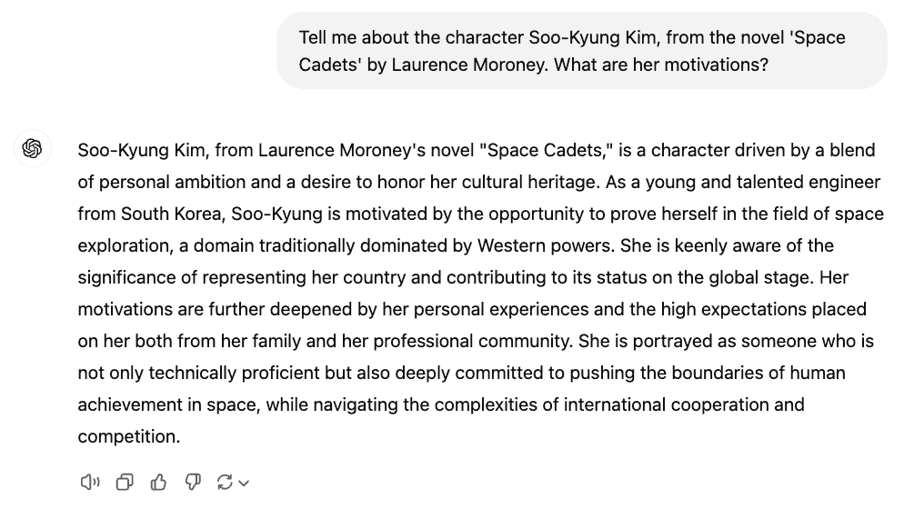
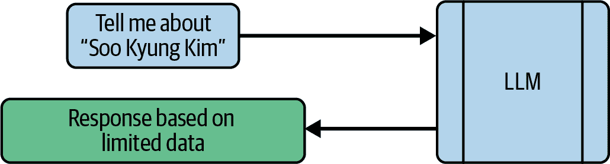
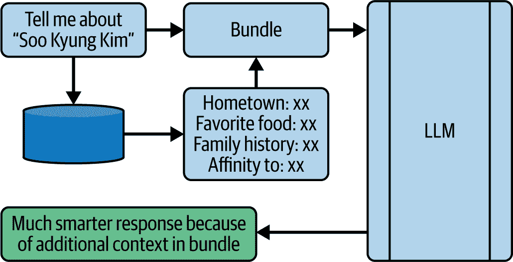
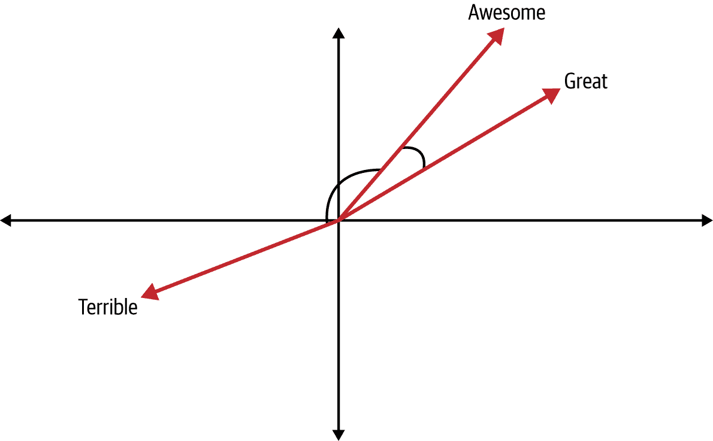
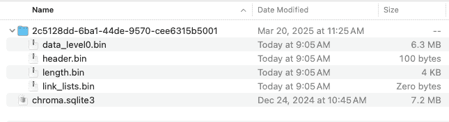
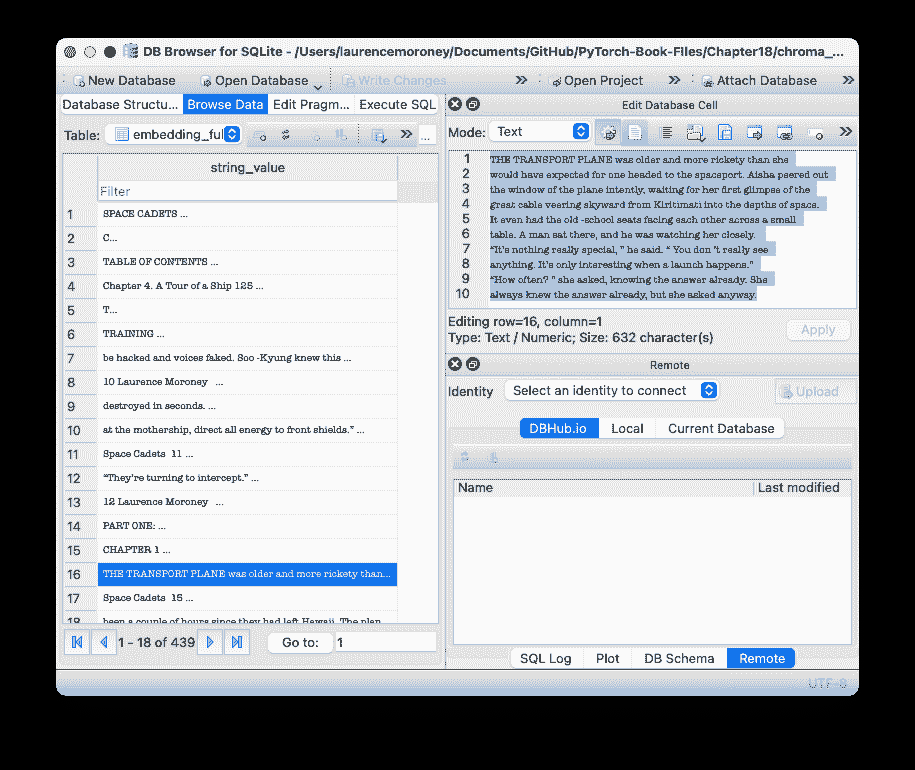

# 第十八章\. RAG 简介

记得你第一次与像 ChatGPT 这样的 LLM 聊天的情景——以及它对你意想不到的事情有多么深刻的见解吗？在 ChatGPT 发布之前，我曾与 LLMs 合作，并在一些突出 LLM 能力的项目中工作，我仍然对他们能做什么感到惊讶。记得谷歌在舞台上进行的著名演示吗？CEO 与冥王星进行了对话？这是我们在 AI 可能性方面经历的根本性思维转变之一，随着其不断进化，我们仍在探索。

但是，尽管如此出色，仍然存在局限性，我和其他人越是用 LLMs 工作，就越会遇到它们。我们在第十五章中讨论的基于 Transformer 的架构在抓取文本数据、从中创建 QKV 映射以及学习如何人工理解文本的语义方面非常出色。但尽管用于构建这些映射的文本量很大，但仍然存在——并且始终存在的一个盲点：私人数据。特别是，如果你想要处理模型未训练过的数据，你面临的主要风险是出现幻觉！

获得帮助减轻这种盲点的技能可能对你作为软件开发者来说是最有价值的事情。

对于本章，我希望你以不同的方式思考 AI 模型，特别是像 LLMs 这样的大型生成模型。停止将它们视为聪明和有知识的，开始将它们视为*工具*，帮助你更好地解析数据。将他们所学的所有内容不是看作一个知识库本身，而是看作他们通过广泛阅读而获得的语言泛化理解的方式。

我把这种理解称为*人工理解*，作为人工智能的补充技术。

然后，一旦你将你最喜欢的 LLM 视为一个用于人工理解的引擎，你就可以开始让它理解你的私人文本——那些不在其训练集中的内容——通过这种理解，以新的和有趣的方式处理你的文本。

让我们通过一个场景来探讨这个问题。想象一下，你正在与一个 AI 模型讨论你最喜欢的科幻小说。你想要询问关于角色、情节、主题等内容，但模型在具体细节上遇到了困难，只能提供一些泛泛的回答——或者更糟糕的是，甚至出现了幻觉。例如，看看图 18-1，它展示了我在与 ChatGPT 讨论一本名为 *Space Cadets* 的小说中的角色时得到的结果。



###### 图 18-1\. 与 GPT 讨论一个角色

这一切都非常有趣——但它是错误的。首先，这个角色来自*北*朝鲜，而不是*南*朝鲜。

GPT 正在自信地犯错。为什么？因为这个小说不在训练集中！我是在 2014 年写的，由一家小型出版社出版，几个月后就倒闭了。因此，它相对较为冷门，是我们用来探索 RAG 的完美素材。到本章结束时，你将使用你的 PyTorch 技能创建一个能够更智能地理解这个小说以及所讨论角色的应用程序。而且，你将拥有整部小说来工作！

稍作补充：当我第一次使用 LLM 来完成这类任务时，我感到非常震惊。它能够 *人工理解* 我自己写作的内容和上下文，就像身边有一个伙伴来批评我的作品并帮助我深入挖掘角色和主题一样。这本书以悬念结束，我从未回来写任何续集。与 LLM 讨论角色弧线等问题，让我对它的发展方向有了全新的智慧来源。

当然，你不仅限于文学作品。几乎每个企业都有大量内部智力资源被锁在文档中，这些文档需要人类花费大量时间阅读、索引、交叉关联和理解，才能回答查询——因此，LLM 能够人工理解这些文档以帮助您挖掘知识的能力是无与伦比的。

正因如此，我对 RAG 感到兴奋。并且我希望你在完成本章后也会如此。

# 什么是 RAG？

缩写 *RAG* 代表 *retrieval augmented generation*，其目的是弥合 LLM 训练时所依据的知识与您拥有的、LLM 没有映射的私有数据之间的知识差距。在查询时间以及像“告诉我关于这个角色……”这样的提示下，我们还会从本地数据存储中提供信息片段。例如，如果我们正在查询小说中的一个角色，本地数据可能包括她的家乡、她最喜欢的食物、她的价值观以及她的说话方式。当我们把 *这些* 数据与查询一起传递时，其中很多都是 LLM 训练集中的，因此 LLM 可以对她的了解更加深入。更重要的是，LLM 在 图 18-1 中犯的错误可以得到缓解——当 LLM 被提供她的家乡时，它至少可以正确地确定她的国家！

图 18-2 展示了向 LLM 发出典型查询的流程。它相当基础：你传递一个提示，然后变压器通过处理 LLM 学到的知识来生成 QKV 值，从而产生一个响应。



###### 图 18-2\. 向 LLM 发出查询的典型流程

正如我们所展示的，如果 LLM 对具体知识了解不多，它会填补这些空白——并且它做得相当不错。例如，尽管它在 图 18-1 中展示的例子中错误地推断出她的国籍，但它至少能够推断出她的名字是韩国的！

使用 RAG，我们将查询流程改为通过我们捆绑的额外信息来增强查询（见图 18-3）。我们通过拥有一个包含书籍内容的本地数据库来实现这一点，然后我们搜索与查询相似的内容。你很快就会看到它是如何工作的细节。



###### 图 18-3\. RAG 查询的典型流程与 LLM

这里的目标是增强初始提示，添加大量的额外上下文。因此，书中的场景可能会提到她的家乡、她的家族历史、最喜欢的食物、她为什么喜欢人或事物等。当这些内容与查询一起传递给 LLM 时，LLM 有更多的工作内容——包括它已经学习过的内容，因此其对角色的解读变得更加智能。因此，它能够*人为地更好地理解*内容。

当然，所有这一切的关键在于能够检索最佳信息来捆绑提示，以充分利用 LLM。你可以通过以允许你搜索语义相关内容的方式存储源材料（在这种情况下，是书籍）的内容来实现这一点。为此，你将使用向量存储。我们将在下一节中探讨这一点。

# RAG 入门

要开始，让我们首先探索如何创建向量数据库。为此，你需要使用支持向量和相似性搜索的数据库引擎。

这些工作原理是将文本存储为向量，通过使用嵌入来表示它。我们在第六章中看到了这些技术的实际应用。为了简单起见，你将首先使用 LangChain 提供的 API 从 OpenAI 获取预构建、预学习的嵌入集。这些将与一个名为 Chroma 的向量存储数据库相结合，该数据库免费且开源。

让我们包含以下导入：

```py
from langchain_community.document_loaders import PyPDFLoader
from langchain.text_splitter import RecursiveCharacterTextSplitter
from langchain_community.embeddings import OpenAIEmbeddings
from langchain_community.vectorstores import Chroma
```

如其名所示，`PyPDFLoader` 用于在 Python 中管理 PDF 文件。我提供这本书作为 PDF，因此我们需要这个。

`RecursiveCharacterTextSplitter` 是一个非常有用的类，可以将书籍分割成文本块。它提供了对块大小和块之间重叠的灵活性。我们将在稍后详细探讨这一点。

`OpenAIEmbeddings` 类为我们提供了访问 Open AI 在训练 GPT 时学习的嵌入的能力，这是一个让我们更快完成工作的便捷途径。对于这个应用，我们不需要学习自己的嵌入——只要我们的文本被编码在一系列嵌入中，并且我们的提示使用相同的嵌入，我们就可以用于相似性搜索。有很多这样的选项，Hugging Face 是一个很好的仓库，你可以在这里找到最新和最好的。

最后，`Chroma` 数据库为我们提供了基于相似性存储和搜索文本的能力。

## 理解相似性

我们已经提到了几次相似度，重要的是你要理解它对你有什么用。回想一下，在第六章，我们讨论了如何使用嵌入将单词转换为向量。这种简单表示如图 18-4 所示。



###### 图 18-4. 单词作为向量

在这里，我们根据它们学习到的向量绘制了单词**Awesome**、**Great**和**Terrible**。在二维空间中这是一个过于简化的表示，但希望这足以演示这个概念。在这种情况下，我们可以可视化**Awesome**和**Great**是相似的，因为它们彼此很近，但我们可以通过观察它们之间向量的角度来量化这一点。通过取那个角度的函数，比如它的**余弦**，可以给我们一个很好的指示，说明向量彼此有多接近。同样，如果我们看单词**Terrible**，**Awesome**和**Terrible**之间的角度非常大，这表明这两个单词不相似。

这个过程被称为**余弦相似度**，在我们创建我们的 RAG 时，我们会使用它。我们将把书籍分成块，计算这些块的嵌入，并将它们存储在数据库中。然后，通过使用提供基于余弦相似度搜索的存储（在这种情况下是 ChromaDB），我们将拥有我们 RAG 的钥匙。

有许多不同的方法可以计算相似度，余弦相似度只是其中之一。值得研究这些其他方法以微调你的 RAG 解决方案，但在这章的其余部分，我将使用余弦相似度，因为它很简单。

## 创建数据库

要创建向量存储，我们将通过加载 PDF 文件、将其分割成块、计算块的嵌入，然后存储它们的过程。让我们一步一步地看看。

首先，我们将使用`PyPDFLoader`加载 PDF 文件：

```py
# Load the PDF file
loader = PyPDFLoader(pdf_path)
documents = loader.load()
```

接下来，我们将设置一个文本分割器，它读取我们将用于分割文本的内容。你的应用程序的一个重要部分将是确定块的大小：

```py
# Split the documents into chunks
text_splitter = RecursiveCharacterTextSplitter(
    chunk_size=1000,
    chunk_overlap=200,
    length_function=len,
    add_start_index=True,
)
```

在这种情况下，代码将把文本分成一千个字符的块。但它使用递归策略来计算分割，其中它试图在文本的自然边界上执行分割，而不是在正好一千个字符的地方进行硬切割。它首先尝试在新行上分割，然后是句子，然后是标点符号，然后是空格。作为最后的手段，它将在单词的中间进行分割。

重叠意味着下一个块不会从下一个字符立即开始，而是在大约两百个字符之前开始。如果我们有这些重叠，一些文本会在数据中出现两次——这是可以的。这意味着我们不会在句子中间分割时丢失内容，等等。你应该根据你的场景探索块的大小和重叠。像这样的较大块将更快地搜索，因为块的数量会比它们更小，但这也降低了块与提示非常相似的可能性，如果提示的长度小于块的大小。

分割器提供了让你指定自己的长度函数的能力，如果你想要以不同的方式测量长度。在这种情况下，我只是在使用 Python 的默认 `len` 函数。通常，对于像这样的 RAG，你可能不需要覆盖 `len` 函数，但这个想法是不同的模型和编码器可能会以不同的方式计算标记。例如，GPT 3.5 将 `lol` 这样的短语识别为一个单独的标记，但一个表情符号可以是四个标记。

`add_start_index` 参数为每个块添加元数据，指示它在原始文本中的位置。这对于调试很有用，你可以回溯每个块来自哪里，或者提供类似引用的东西。

一旦你指定了文本，你可以用它来将 PDF 分割成多个文本：

```py
texts = text_splitter.split_documents(documents)
```

现在你有了文本，你可以通过使用 `OpenAIEmbeddings` 类将它们转换为嵌入，你也可以指定使用 Chroma 来存储向量，通过传递文档：

```py
# Initialize OpenAI embeddings
# Make sure to set your OPENAI_API_KEY environment variable
embeddings = OpenAIEmbeddings()

# Create and persist the vector store
vectorstore = Chroma.from_documents(
    documents=texts,
    embedding=embeddings,
    persist_directory=persist_directory
)
```

如所示，你只需简单地传递你指定的文本和嵌入以及存储嵌入的目录。然后使用以下命令将向量存储保存到磁盘：

```py
# Persist the vector store
vectorstore.persist()
```

###### 注意

`OpenAIEmbeddings` 需要一个 `OPENAI_API_KEY` 环境变量。你可以在 [Open AIPlatform 网站](https://oreil.ly/41hwI) 上获取一个，然后根据你的操作系统设置一个，确保你将其命名为显示的确切名称。

基础数据库是一个 SQLite3 数据库（见图 18-5）。



###### 图 18-5\. 包含 ChromaDB 内容的目录

这让你能够使用任何与 SQLite 兼容的工具来浏览和检查数据库。例如，你可以使用免费的 [DB Browser for SQLite](https://sqlitebrowser.org) 来访问数据（见图 18-6）。



###### 图 18-6\. 在 SQLite 浏览器中浏览数据

现在我们有了向量存储，让我们探索当我们想要在其中搜索相似文本时会发生什么。

## 执行相似性搜索

一旦你设置了向量存储，搜索它就很容易了。

这里有一个你可以用来使用向量存储执行相似性搜索的函数：

```py
def search_vectorstore(vectorstore, query, k=3):
    results = vectorstore.similarity_search(query, k=k)
    return results
```

如你所见，这很简单！如果你喜欢，你可以使用可选参数覆盖或扩展一些功能，包括以下内容：

搜索类型

默认情况下为`similarity`，但也可以设置为`mmr`，代表*最大边际相关性*（MMR），在构建生产系统时值得尝试。MMR 在您希望避免冗余结果时特别有用。

Distance_metric

默认情况下为`cosine`，正如我们之前所看到的，但它也可以是`l2`，这代表*距离*——实际上，是嵌入空间中两个向量之间的直线距离。或者，它可以是`ip`，代表*内积*，这提供了一种非常快速的计算方法，但代价是精度较低。

Lambda_mult

这是一个介于 0 和 1 之间的可选值，您可以使用它来控制距离测量的严格程度。值为 1.0 将给出高度相关的评分，而值为 0.0 将给出更多样化的评分。

在构建系统时，我建议您尝试多种方法，以查看哪种方法最适合您的场景。

## 将所有内容整合在一起

现在，您可以使用以下代码来处理您的 PDF 文件，将其切割并存储为存储中的向量，然后对其运行查询：

```py
# Path to your PDF file
pdf_path = "space-cadets-2020-master.pdf"

# Create the vector store
vectorstore = create_vectorstore(pdf_path)

# Example search
query = "Give me some details about Soo-Kyung Kim. 
         `Where` `is` `she` `from``,` `what` `does` `she` `like``,` `tell` `me` `all` `about` `her``?``"` ``` `results` `=` `search_vectorstore``(``vectorstore``,` `query``,` `5``)` ```py
```

```py`` ````当运行这个程序时，我得到了关于她性格的详细信息。以下是一些片段：    ```py “I think we are going to be good friends,” said Soo-Kyung. “I like how you are straightforward. I am too, but that intimidates some people.” “So where are you from?” “I am from a small village called Sijungho,” continued Soo - Kyung. “There’s not much to see there.” “Sounds Korean,” said Aisha. “You from South Korea?” “North Korea,” corrected Soo -Kyung. “I’ve never even been to South Korea.”   ```    因此，当我们向一个 LLM 查询角色信息时，我们会有所有这些额外内容。我们将在下一节中探讨这一点。```py` `````  ```py```````py``` ``````py`````` # Using RAG Content with an LLM    Now that you’ve created a vector store and stored the book in it, let’s explore how you would read snippets back from the store, add them to a prompt, and get data back. We’ll use a local Ollama server to keep things simple. For more on Ollama, see Chapter 17.    First, let’s load the vector store that we created in the previous step:    ```py def load_vectorstore(persist_directory="./chroma_db"):     embeddings = OpenAIEmbeddings()       # Load existing vector store     vectorstore = Chroma(         persist_directory=persist_directory,         embedding_function=embeddings     )       return vectorstore ```    You *must* use the same embeddings as those you used when you created the vector store. Otherwise, there will be a mismatch when you try to encode your prompt and search for stuff similar to it.    In this case, I’m using the OpenAIEmbeddings, but it’s entirely up to you how to approach this. There are many embeddings available in open source on Hugging Face, or you could use things like the GLoVE embeddings we explored in Chapter 6.    ChromaDB persisted the embeddings in an SQLite database at a specific directory. Make sure you embed that, and then all you have to do is pass this and your embedding function to Chroma to get a reference to your database.    To search the vector store, you’ll use the same code as earlier:    ```py def search_vectorstore(vectorstore, query, k=3):     results = vectorstore.similarity_search(query, k=k)     return results ```    Next, input a query. For example, input this:    ```py query = "Please tell me all about Soo-Kyung Kim." ```    At this point, you have all the pieces you need to do a RAG query, which you can do like this:    ```py # Example query query = "Please tell me all about Soo-Kyung Kim."   # Perform RAG query answer, sources = rag_query(vectorstore, query, num_contexts=10) ```    Here, you create a helper function that will pass the query and the vector store, and you also have a parameter with the number of items to find in the vector store. The app will return the answer (from the LLM) as well as a list of sources from the data that it used to augment the query.    Let’s explore this function in depth:    ```py def rag_query(vectorstore, query, num_contexts=3):     # Retrieve relevant documents     relevant_docs = search_vectorstore(vectorstore, query, k=num_contexts)       # Combine context from retrieved documents     context = "\n\n".join([doc.page_content for doc in relevant_docs])       # Generate response using Ollama     response = query_ollama(query, context)       return response, relevant_docs ```    You’ll start by searching the vector store with the code provided earlier. This will give you the decoded chunks from the datastore as strings, and you should call these `relevant_docs`.    You’ll then create the context string by joining the chunks together with some new line characters to separate them. It’s as simple as that.    Now, the query and the context will be used in a call to Ollama. Let’s see how that will work.    Start by defining the function:    ```py def query_ollama(prompt, context, model="llama3.1:latest", temperature=0.7):       ollama_url = "http://localhost:11434/api/chat" ```    Here, you can set the function to accept the prompt and context. I’ve added a couple of optional parameters that, if they’re not set, will use the defaults. The first is the model. To get a list of available models on your server, you can just use “ollama list” from the command prompt. The `temperature` parameter indicates how deterministic your response will be: the smaller the number, the more deterministic the answer, and the higher the number, the more creative the answer. I set a default of 0.7, which gives some flexibility to the model to make it natural sounding while staying relevant. But when you use smaller models in Ollama (like `llama3.1`, as shown), it does make hallucination more likely.    You’ll also want to specify the `ollama_url` endpoint, as shown in Chapter 17.    Next, you create the messages that will be used to interact with the model.    The structure of conversations with a model typically looks like the one in Figure 18-7. The model will optionally be primed with a system message that gives it instructions on how to behave. It will then have an initial message that it emits to the user, like, “Welcome to the Chat. How can I help?” The user will then respond with a prompt asking the model to do something, to which the model will respond, and so on.    ###### Figure 18-7\. Anatomy of a conversation with a model    The *memory* of the conversation will be a JSON document with each of the roles prefixed by a `role` value. The initial message will have the `system` role, the model messages will have the `model` role, and the user messages will have the `user` role.    So, for the simple RAG app we’re creating, we can create an instance of a conversation like this—passing the system message and the user message, which will be composed of the prompt and the context, like this:    ```py     messages = [         {             "role": "system",             "content": "You are a helpful AI assistant.                          `Use` `the` `provided` `context` `to` `answer` `questions``.`                          `If` `you` `cannot` `find` `the` `answer` `in` `the` `context``,` `say` `so``.`                          `Only` `use` `information` `from` `the` `provided` `context``.``"` ``` `},`         `{`             `"role"``:` `"user"``,`             `"content"``:` `f``"Context:``\n``{``context``}``\n\n``Question:` `{``prompt``}``"`         `}`     `]` ```py ```   ```py```````py` ``````py```` Depending on how you set up the system role, you’ll get very different behavior. In this case, I used a prompt that gets it to heavily focus on the provided context. You don’t *need* to do this, and by working with this prompt, you might get much better results.    Within the user role, this is just as simple as creating a string with `Context:` and `Question:` content that you paste the context and prompt into.    From this, you can now create a JSON payload to pass to Ollama that contains the desired model, the messages, the temperature, and the stream (which must be set to `False` if you want to get a single answer back):    ```py     payload = {         "model": model,         "messages": messages,         "stream": False,         "temperature": temperature     } ```    Note also that the desired model must be installed in Ollama or you’ll get an error, so see Chapter 17 for adding models to Ollama.    Then, you simply have to use an HTTP post to the Ollama URL, passing it the payload. When you get the response, you can query the returned message—where there’ll now be new content added by the model. This content will contain your answer!    ```py     try:         response = requests.post(ollama_url, json=payload)         response.raise_for_status()         return response.json()["message"]["content"]     except requests.exceptions.RequestException as e:         return f"Error querying Ollama: {str(e)}" ```    In this case, I used Llama 3.1 and got some excellent answers. Here’s an example:    ```py Based on the provided context, here's what can be gathered about Soo-Kyung Kim: `1.` `She` `is` `from` `North` `Korea``.` `2.` `She` `has` `been` `trained` `in` `various` `skills``,` `including` `science``,` `technology``,`  `martial` `arts``,` `languages``,` `piloting``,` `and` `strategy``.` `3.` `Her` `family` `name` `"Kim"` `is` `significant``,` `as` `it` `is` `the` `name` `of` `the` `ruling` `family`     `of` `the` `Democratic` `People``'s Republic of Korea (North Korea).` ```` `4.` `Soo``-``Kyung``'s presence on the space academy may be related to her exceptional` ```py     `abilities``,` `but` `there` `is` `also` `a` `suggestion` `that` `she` `was` `chosen` `for` `other`     `reasons``.` `…` ``` ```py` ```   ```py`````` ```py````` ```py```` 你的结果将因温度、块的大小以及各种其他因素而异。    一件需要注意的事情是，你也可以使用一个非常小的模型，比如 Gemma2b，仍然可以得到非常好的结果。然而，如此小的模型的上下文窗口在检索和增强你的查询时可能会出现问题。正如你在这章前面看到的，我们使用了一千字符的块，并检索与提示最接近的 10 个。这已经是 10 k 字符的顺序，根据分词策略，这可能会超过 10 k 个标记。鉴于该模型的上下文窗口仅为 2 k 个标记，你可能会遇到问题。请注意这一点！    ## 扩展到托管模型    在我们刚刚讨论的例子中，我们使用了像 Llama 和 Gemma 这样的较小模型，在本地 Ollama 服务器上执行 RAG。如果你想使用像 GPT 这样的大规模托管模型，过程完全相同。不过，我会做一个小改动，那就是系统提示。鉴于这些模型拥有大量参数，并且已经学习了很多，最好让它们稍微自由一些，不要期望它们仅限于提供的上下文！    例如，对于 GPT，你可以导入支持 OpenAI 的 GPT 模型的类，如下所示：    ```py from langchain_openai import ChatOpenAI ```    然后，你可以这样实例化这个类：    ```py chat = ChatOpenAI(     model=model,     temperature=temperature ) ```    模型值是一个包含你想要使用的模型名称的字符串。例如，你可以使用`gpt-3.5-turbo`或`gpt-4`。检查你阅读此内容时的[OpenAI API 文档中的模型版本](https://oreil.ly/SVBXr)。    然后，你可以非常简单地创建提示。首先，创建一个提示模板来保存系统和用户提示：    ```py # Create prompt template prompt_template = ChatPromptTemplate.from_messages([     ("system", "You are a helpful AI assistant.                  `Use` `the` `following` `context` `to` `answer` `questions``.` `"` ````` `"请尽可能详细地提供一个全面的` ```py`                 `answer``.``"),` ``` `(``"system"``,` `"Context:``\n``{context}``"``),`     `(``"user"``,` `"``{question}``"``)` `])` ```py ```` ```py`` ```   ```py``` ````` ```py`Then, you can make the formatted prompt with the details of the context and prompt:    ``` # Format the prompt with the context and question formatted_prompt = prompt_template.format(     context=context,     question=prompt )   ```py    Finally, you can invoke the GPT chat with the formatted prompt and get the response:    ``` # Get the response response = chat.invoke(formatted_prompt) return response.content ```py    Now, as long as you ensure that you have an `OPENAI_API_KEY` environment variable, as discussed earlier, you’re RAGging against GPT! Please pay attention to the pricing on OpenAI for using the available models.```` ```py`` ``````py ``````py` ``````py`` ``````py``` ``````py```` ```py```````py`  ``` `` `# 摘要    在本章中，你涉足了 RAG 的领域，学习了一种强大的技术，通过结合 LLM 的通用理解技能和本地、私有数据，增强了 LLM 的能力。你通过创建包含一本书内容的向量数据库，然后搜索该数据库以查找与你的给定提示相关的信息来了解 RAG 是如何工作的。    我们还探讨了查询书中的角色以了解更多关于她的信息——尽管像 Llama 和 GPT 这样的模型没有在关于她的内容上进行训练，但它们能够人为地理解文本并提供出色的信息和分析。    你还探索了像 ChromaDB（用于向量存储）和预训练嵌入（如 OpenAIs 用于文本的向量编码，允许相似度搜索）这样的工具。你还探索了可以使用 RAG 增强的各种模型，包括小型本地模型（如 Llama 和 Gemma 与 Ollama）和大型托管模型（如通过 OpenAI API 的 GPT）。这带你完成了整个过程：切片文本、编码它、存储它、基于相似度搜索它，并将它捆绑到提示中，以执行 RAG。    在下一章中，我们将稍微转换一下方向，探讨 AI 的另一个令人兴奋的方面：生成式图像模型。我们将探索提供文本提示的图像的多个不同模型，并深入探讨它们是如何工作的。` `` ```py ``````py`````` ```py``````````
