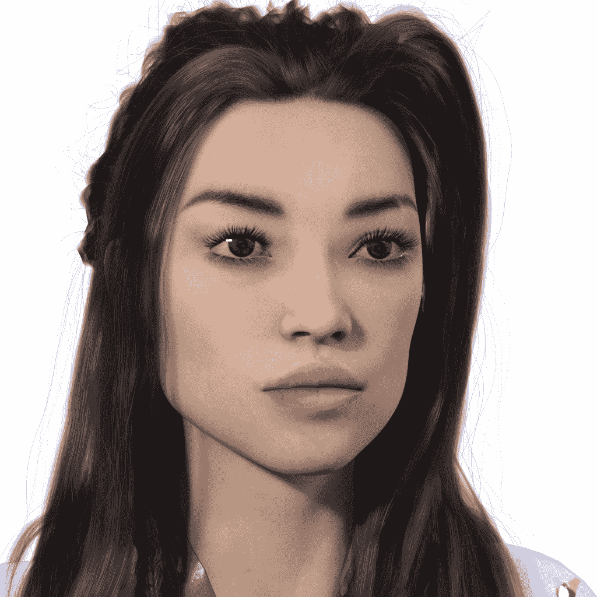
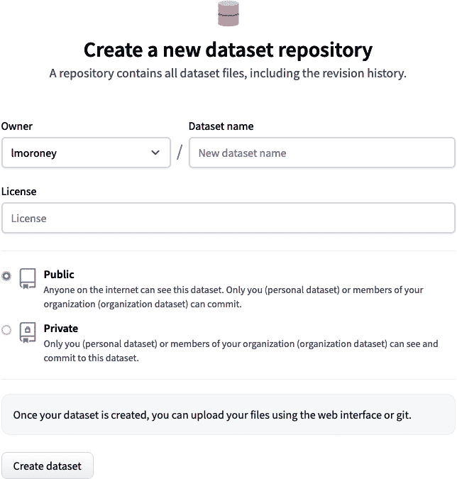
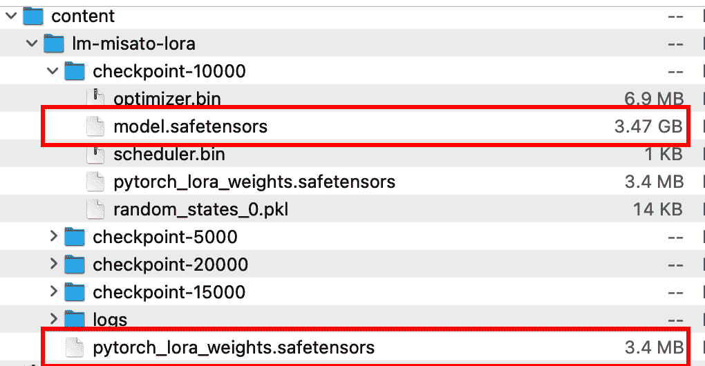
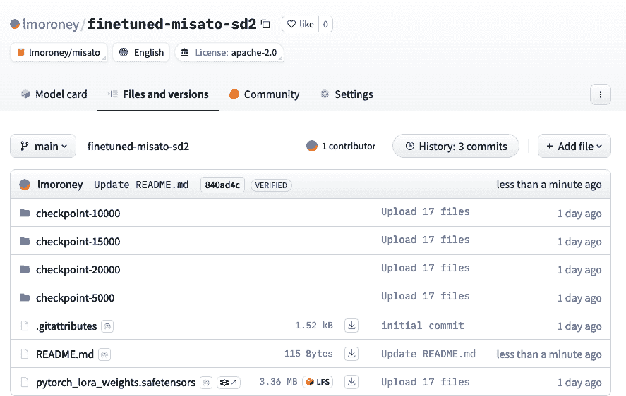

# 第二十章\. 使用 LoRA 和 Diffusers 调优生成图像模型

在第十九章中，你探讨了 diffusers 的概念以及使用扩散技术训练的模型如何根据提示生成图像。就像我们在第十六章中探讨的基于文本的模型一样，文本到图像模型也可以针对特定任务进行微调。扩散模型的架构以及如何微调它们足以写成一整本书，所以在本章中，你将只对这些概念进行高层次探讨。为此，有几种技术，包括 *DreamBooth, 文本反转* 和较新的 *低秩适应* (LoRA)，你将在本章中逐步了解这些技术。最后一种技术允许你使用非常少的数据来定制特定主题或风格的模型。

与 transformers 一样，Hugging Face 的 diffusers 库旨在尽可能简化 diffusers 的使用以及微调。为此，它包括你可以使用的预构建脚本。

我们将通过创建一个虚构的数字影响者 Misato 的数据集的完整示例来开始，使用 LoRA 和 diffusers 微调用于她的文本到图像模型 Stable Diffusion 2。然后，我们将执行文本到图像推理以展示如何创建 Misato 的新图像（见图 20-1）。


###### 图 20-1\. LoRA 调优的 Stable Diffusion 2 图像

# 使用 Diffusers 训练 LoRA

要使用 Diffusers 训练 LoRA，你需要执行以下步骤。首先，你需要获取 diffusers 的源代码，以便你可以访问其预制的训练脚本。然后，你需要获取或创建一个数据集，你可以用它来微调 Stable Diffusion。之后，你将运行训练脚本以获取模型的微调，将微调发布到 Hugging Face，并使用 LoRA 层对基础模型进行推理。一旦完成，你应该能够创建像图 20-1 中展示的图像。让我们逐一了解这些步骤。

## 获取 Diffusers

要开始使用 LoRA，我发现最好的做法是首先克隆 diffusers 的源代码以获取训练脚本。

你可以通过 git 克隆它，切换到目录，并在当前位置运行 `pip install` 来非常简单地完成这项操作：

```py
git clone https://github.com/huggingface/diffusers
cd diffusers
pip install .
```

如果你正在使用 Colab 或其他托管笔记本，你将使用如下语法：

```py
!git clone https://github.com/huggingface/diffusers
%cd diffusers
!pip install .
```

这将为你提供一个本地版本的 diffusers，你可以使用。文本到图像的 LoRA 微调脚本位于 */diffusers/examples/text_to_image* 目录中，你需要像这样安装它们的依赖项：

```py
%cd /content/diffusers/examples/text_to_image # or whatever your dir is
!pip install -r requirements.txt
```

这些依赖关系包括加速、transformers 和 torchvision 等工具的特定版本。从源代码 git-clone 是一个好主意，这样你可以获得最新的*requirements.txt*版本，使你的生活更加轻松！

最后，你还需要 xformers 库，它旨在使 transformers 更高效，从而加快你的处理过程。你可以这样获取它：

```py
!pip install xformers
```

现在，你有一个可以用于微调的 diffusers 环境。在下一步中，你将获取数据。

## 获取用于微调 LoRA 的数据

你将微调 LoRA 的两种主要方式是用于*风格*和用于*主题*。在前者的情况下，你可以获取你想要的特定风格的许多图像，并训练模型以便它将以该风格输出。我强烈建议你在做这件事时要小心，因为许多艺术家通过他们的创作风格谋生，你应该尊重这一点。同样，你也应该考虑基于商业风格训练模型的影响。不幸的是，我看到的许多在线教程都忽略了这一点，这种做法降低了 AI 的整体影响，并将生成 AI 的叙事从*创造性*推向了*窃取知识产权*。所以，请小心行事。

类似地，当涉及到主题时，我看到许多教程使用谷歌图片搜索名人示例来创建他们的 LoRA。再次，我强烈建议你*不要*这样做。请只为那些你拥有使用其肖像权的人创建 LoRA。

为了让你有东西可以使用，我创建了一个针对数字影响者的数据集。我称她为 Misato，这个名字来源于我喜欢的流行动漫中的角色。所有图像都是我使用流行的 Daz 3D 渲染软件渲染的。

你可以在[Hugging Face 网站](https://oreil.ly/Y1qeY)上找到这个数据集。

如果你想要创建这样的数据集，我建议你使用从多个角度拍摄的同一个人像，并专注于特定部分。例如，你可以使用以下这些：

+   3-4 张肖像照（护照风格照片）

+   每侧 3-4 张四分之三头部照

+   3-4 张侧面照，显示脸部侧面

+   3-4 张全身照

对于这些图像中的每一个，你还需要一个描述图像的提示。你将在训练中使用这个提示来为图像提供上下文以及它应该如何被表示。

例如，考虑图 20-2，这是我为 Misato 生成的一张肖像照。



###### 图 20-2\. 数据集中的 Misato 肖像照

这张图片与以下提示配对：“(lora-misato-token)的高质量肖像，清晰的面部特征，中性表情，正面视角，自然光照。”

注意到 (lora-misato-token) 的使用，我们在这里指明了图像的主题。稍后，当我们创建生成新图像的提示时，我们可以使用相同的令牌——例如，“(lora-misato-token) in food ad, billboard sign, 90s, anime, Japanese pop, Japanese words, front view, plain background。” 这个提示将给我们展示 图 20-3 中的内容。我们有一个全新的组合，Misato 作为快餐广告中的模特！

一旦你有一组图像，你需要创建一个 *metadata.jsonl* 文件，该文件以标准格式包含与图像相关的提示，这样你就可以在微调时使用。这是一个包含文件名链接和图像提示的 JSON 文件。Misato 的文件位于 [Hugging Face 网站](https://oreil.ly/MfmGh)。


###### 图 20-3\. 从 LoRA 令牌进行推理

*metadata.jsonl* 文件的一个片段如下：

```py
{ "file_name": "rightprofile-smile.png", 
               "prompt": "photo of (lora-misato-token), 
               `right` `side` `profile``,` `high` `quality``,` `detailed` `features``,` 
               `smiling``,` `professional` `photo` `"}` ```` `{` `"file_name"``:` `"rightprofile-neutral.png"``,`                 `"prompt"``:` `"photo of (lora-misato-token),` ```py                 `right` `side` `profile``,` `high` `quality``,` `detailed` `features``,`                 `professional` `photo` `"}` ``` ```py`
```

```py `` `That’s pretty much all you need. For training with diffusers, I’ve found it much easier if you publish your dataset on Hugging Face. To do this, when logged in, visit the [Hugging Face website](https://oreil.ly/Ez3Gp). There, you’ll be able to specify the name of the new dataset and whether or not it’s public. Once you’ve done this, you’ll be able to upload the files through the web interface (see Figure 20-4).    Once you’ve done this, your dataset will be available at [*https://huggingface.co/datasets/*](https://huggingface.co/datasets/)*<yourname>/<datasetname>*. So, for example, my username (see Figure 20-4) is “lmoroney,” and the dataset name is “misato,” so you can see this dataset at [*https://huggingface.co/datasets/lmoroney/misato*](https://huggingface.co/datasets/lmoroney/misato).    ###### Figure 20-4\. Creating a new dataset on Hugging Face` `` ```  ```py```````py` ``````py```` ```py`````` ## 使用扩散器微调模型    如前所述，当你克隆 diffusers 仓库时，你将获得访问一些示例预写脚本的权限，这些脚本可以帮助你在各种任务中取得先机。其中之一是训练文本到图像 LoRAs。但在运行脚本之前，使用 `accelerate` 是一个好主意，它抽象化了底层加速硬件，包括跨多个芯片的分布。使用 `accelerate`，你可以定义一个配置。有关详细信息，请参阅 [Hugging Face 网站](https://oreil.ly/TnaII)。    为了简化，当你使用 Colab 时，以下是设置基本 `accelerate` 配置的方法：    ```py from accelerate.utils import write_basic_config   write_basic_config() ```    然后，一旦你有了这个配置，你就可以使用 `accelerate launch` 来运行训练脚本。以下是一个示例：    ```py !accelerate launch train_text_to_image_lora.py \   --pretrained_model_name_or_path="stabilityai/stable-diffusion-2" \   --dataset_name="lmoroney/misato" \   --caption_column="prompt" \   --resolution=512 \   --random_flip \   --train_batch_size=1 \   --num_train_epochs=1000 \   --checkpointing_steps=5000 \   --learning_rate=1e-04 \   --lr_scheduler="constant" \   --lr_warmup_steps=0 \   --seed=42 \   --output_dir="/content/lm-misato-lora" ```    注意，运行这个脚本非常计算密集。使用前面的一组超参数（我将在下面解释每个参数），在 Google Colab 中使用 A100 GPU 进行训练大约需要 2 小时（或 17 个计算单元）。计算单元是付费的（在发布时，每个大约 10 美分），所以请确保你了解这一切，并且确实需要付费！    脚本采用以下超参数：    Pretrained_model_name_or_path      这可以是本地文件夹（例如，*/content/model/*）或 *huggingface.co* 上的位置——例如，[*http://huggingface.co/stabilityai/stable-diffusion-2*](http://huggingface.co/stabilityai/stable-diffusion-2) 是名为 Stable Diffusion 2 的模型的存储位置。你也可以不包含 *huggingface.co* 部分的 URL 来指定它。      Dataset-name      同样，这可以是包含数据集的本地目录或 *huggingface.co* 上的地址。正如你所看到的，我在这里使用的是 Misato 数据集。      Caption_column      这是 *jsonl* 文件中包含图像标题的列。你可以在这里指定标题。      Resolution      这是我们将为图像训练的分辨率。在这种情况下，它是 512 × 512。      Random_Flip      这是图像增强（如 第三章 中所述）。由于 Misato 数据集已经涵盖了多个角度，这可能不是必需的。      Train_batch_size      这是每个批次的图像数量。最好从 1 开始，然后根据需要调整。当我使用 Colab 中的 A100 GPU 时，我注意到训练只使用了大约 7 GB 的 40 GB，所以这可以安全地提高以加快训练速度。      Num_training_epochs      这是训练的轮数。      Checkpointing_steps      这是保存检查点的频率。      Learning_rate      这是学习率超参数。      LR_scheduler      如果你想要使用可调整的学习率，你可以在这里指定调度器。可调整 LR 的好处是，训练周期后期最好的 LR 不一定与周期早期最好的 LR 相同，因此你可以动态调整它。      LR_Warmup_steps      这是设置初始 LR 的步数。      Seed      这是一个随机种子。      Output_dir      这是训练过程中保存检查点的位置。      然后，在训练过程中，你会看到类似以下的状态：    ```py Resolving data files: 100% 22/22 [00:00<00:00, 74.14it/s] 12/30/2024 19:23:48 - INFO - __main__ - ***** Running training ***** 12/30/2024 19:23:48 - INFO - __main__ -   Num examples = 21 12/30/2024 19:23:48 - INFO - __main__ -   Num Epochs = 1000 12/30/2024 19:23:48 - INFO - __main__ -   Instantaneous batch size per device... 12/30/2024 19:23:48 - INFO - __main__ -   Total train batch size (w. parallel... 12/30/2024 19:23:48 - INFO - __main__ -   Gradient Accumulation steps = 1 12/30/2024 19:23:48 - INFO - __main__ -   Total optimization steps = 1000 Steps:  10% 103/1000 [05:03<44:00,  2.94s/it, lr=0.0001, step_loss=0.227] ```    一旦模型训练完成，在其目录文件夹中，你会看到类似 图 20-5 中所示的结构。    ###### 图 20-5\. 训练后的目录    原始的 `model.safetensors` 模型被突出显示，你可以看到它的大小为 3.47 GB！另一方面，微调后的 LoRA 只需 3.4 MB。    你可以在下一步中使用它，将模型上传到 Hugging Face 仓库，以便推理时使用它变得非常简单。    ## 发布你的模型    你在训练过程中保存的微调目录包含比你所需多得多的信息，包括基础模型的副本。因此，如果你尝试发布和上传模型，你将花费更多的时间，因为你必须上传大量的不必要的大容量数据！    因此，你应该编辑你的目录结构，从检查点目录中删除 *model.safetensors* 文件，并保留其余部分。    然后，当你登录到 Hugging Face 时，你可以访问 [*huggingface.co/new*](http://huggingface.co/new) 来查看“创建新模型仓库”页面（见 图 20-6）。    ###### 图 20-6\. 创建新仓库    按照步骤操作，并确保选择一个许可证。然后，当你完成时，你可以在下一步通过网页界面上传文件。完成此操作后，你应该会看到类似 图 20-7 中所示的屏幕，其中我命名了模型为“finetuned-misato-sd2”，因为数据是“misato”，而我调整的模型是 Stable Diffusion 2。    你可以在 [Hugging Face 网站](https://oreil.ly/zmlal) 上亲自查看。    ###### 图 20-7\. 微调后的 Misato LoRA for Stable Diffusion 2    现在，数据集和模型都已发布在 Hugging Face 上，使用 diffusers 进行推理变得超级简单。我们将在下一步中看到这一点。    ## 使用自定义 LoRA 生成图像    要使用自定义 LoRA 创建图像，我们将通过一个类似于 第十九章 中的过程。你将使用 diffusers 创建一个管道，但也会添加一个调度器。在稳定扩散中，调度器的角色决定了图像如何从随机噪声演变到最终图像。并非所有调度器都与 LoRA 兼容，你必须确保你使用的调度器与你的基础模型兼容。    你可以使用很多调度器，你可以在 [Hugging Face 网站](https://oreil.ly/SUlZl) 上找到它们。    在这个例子中，你可以尝试使用 `EulerAncestralDiscreteScheduler`：    ```py import torch from diffusers import (     StableDiffusionPipeline,     EulerAncestralDiscreteScheduler,   ) ```    然后，指定我们的 `model_id` 并选择适合它的调度器版本：    ```py model_id = "stabilityai/stable-diffusion-2"   # Choose your device device = "cuda" if torch.cuda.is_available() else "cpu"   # 1\. Pick your scheduler scheduler = EulerAncestralDiscreteScheduler.from_pretrained(     model_id,     subfolder="scheduler" ) ```    一旦完成这些，你可以从 `StableDiffusionPipeline` 类创建管道并将其加载到加速器设备上：    ```py # 2\. Load the pipeline with the chosen scheduler pipe = StableDiffusionPipeline.from_pretrained(     model_id,     scheduler=scheduler,     torch_dtype=torch.float16 ).to(device) ```    下一步是分配新的 LoRA 权重，这些权重是重新训练的层，它们决定了模型的新行为：    ```py # 3\. (Optional) Load LoRA weights pipe.load_lora_weights("lmoroney/finetuned-misato-sd2") ```    稳定扩散支持提示 *和* 负提示，其中第一个提示定义了图像中你想要的内容，第二个提示定义了你 *不* 想要的内容。以下是一个示例：    ```py # 4\. Define prompts and parameters prompt = "(lora-misato-token) in food ad, billboard sign, 90s, anime,           `japanese` `pop``,` `japanese` `words``,` `front` `view``,` `plain` `background``"` ``````py`` `negative_prompt` `=` `(`     `"(deformed, distorted, disfigured:1.3), poorly drawn, bad anatomy,` ``````py`       `wrong` `anatomy``,` `"` ``````py `"extra limb, missing limb, floating limbs, (mutated hands and` `````       `fingers``:``1.4``),` `"` ```py` `"disconnected limbs, mutation, mutated, ugly, disgusting, blurry,` ```       `amputation``"` `` `)` `` ```py ```` ```py`` ``````py ``````py` ``````py`` ```   ```py``` ````` ```py`The negative prompt is very useful in helping you avoid some of the issues with AI-generated visuals, such as deformed hands and faces.    Next up is to define the hyperparameters, such as the number of inference steps, the size of the image, and the seed. There’s also a parameter called *guidance scale*, which controls how imaginative your model is. A guidance scale value of less than 5 gives the model more creative freedom, but the model may not follow your prompt closely. A guidance scale value that’s higher than 7 will make the model adhere more strongly to your prompt, but it can also lead to strange artifacts. The guidance scale value in the middle—6—is a nice balance between freedom and adherence. There’s no hard and fast rule, so feel free to experiment:    ``` num_inference_steps = 50 guidance_scale = 6.0 width = 512 height = 512 seed = 1234567 ```py    Next, you just generate the image as usual:    ``` # 5\. Create a generator for reproducible results generator = torch.Generator(device=device).manual_seed(seed)   # 6\. Run the pipeline image = pipe(     prompt,     negative_prompt=negative_prompt,     width=width,     height=height,     num_inference_steps=num_inference_steps,     guidance_scale=guidance_scale,     generator=generator, ).images[0]   # 7\. Save the result image.save("lora-with-negative.png") ```py    As an experiment, you can try using a different scheduler with the same hyperparameters to yield similar results (see Figure 20-8):    ``` # For DPMSolver, use: from diffusers import DPMSolverMultistepScheduler   scheduler = DPMSolverMultistepScheduler.from_pretrained(model_id,              subfolder="scheduler", algorithm_type="dpmsolver++") ```py    ###### Figure 20-8\. The same prompt and hyperparameters with different schedulers    Note that the text in the image is entirely made up, but given that the prompt is about advertisements, the tone is similar. In the picture on the left, the characters represent “loneliness” and “no,” while in the image on the right, they suggest “husband split?”    What’s most interesting is the consistency in the character! For example, consider Figure 20-9, in which Misato was painted in the styles of Monet and Picasso. We can see that the features learned by LoRA were consistent enough to (mostly) survive the restyling process.    ###### Figure 20-9\. Character consistency across styles    This example used Stable Diffusion 2, which is an older model but one that’s easy to tune with LoRA. As you use more advanced models and tune them, you can get much better results, but the time and costs of tuning will be much higher. I’d recommend starting with a simpler model like this one and working on your craft. From there, you can build up to the more advanced models.    Additionally, Misato’s synthetic nature has triggered different features in the LoRA retraining, leading to the new images that have been created from her having a low-res, highly synthetic look. While the images have been close to photoreal to the human eye, they clearly haven’t been to the model, which learned a LoRA that was very CGI in nature and lower resolution than the ones in the training set!```` ```py`` ``````py ``````py``` ``````py```` ```py```````py`  ``` `` `# 摘要    在本章中，你了解了如何通过使用 LoRA 和 diffusers 库来微调像稳定扩散这样的文本到图像模型。这项技术允许你使用一个小型自定义文件来定制特定主题或风格的模型。在这种情况下，你看到了如何调整 Stable Diffusion 2 以适应合成角色。在本章中，你还经历了从克隆 diffusers 到为它们创建训练环境的所有步骤，该环境包括一个完全自定义的数据集。你学习了如何使用训练脚本创建基于合成角色的新 LoRA，以及如何将其发布到 Hugging Face。最后，你看到了如何在推理时将 LoRA 应用到模型上，以使用 Misato 角色的 LoRA 创建新颖的图像！` `` ``
