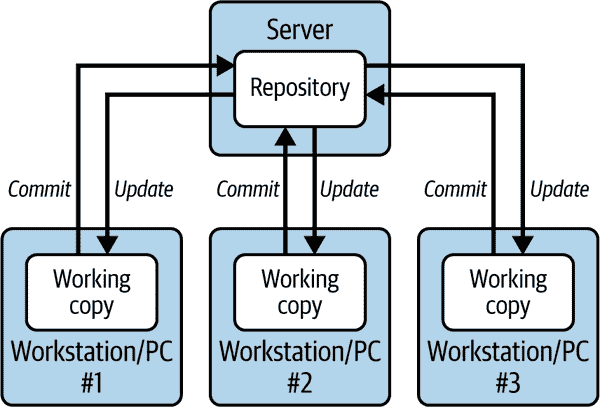
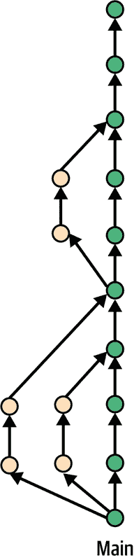
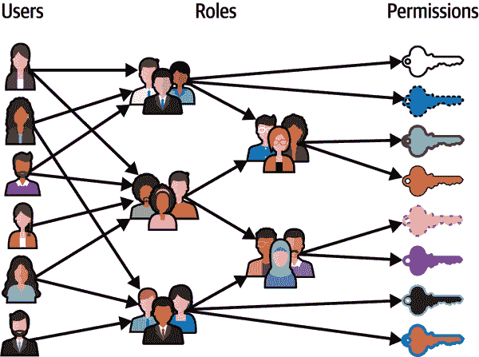

# 第二章\. 源代码管理

想象一下这样一个场景：你和你的团队正在协作进行一个复杂的软件项目。多个大脑在贡献，进行修订和改进。如果没有一个明确的系统来管理更改，你可能会覆盖彼此的工作，失去对谁更新了什么以及为什么做出这些更改的跟踪。如果没有一个明确的系统来标记更改集，当出现问题时，你将无法导航回团队代码的先前稳定版本。如果没有定义的工作流程和结构化的访问控制，任何人都可以在任何时候更改任何内容，没有任何监督。没有控制，如果你的团队需要重新创建它，他们将无法确定用于构建特定发布的代码文件。

接下来，想象一下，几个团队已经为一个新的应用程序工作了数月，现在即将接近部署到您的生产环境。对各种开发和 QA 环境进行了临时的修复和调整，但这些更改并没有可靠地反映在生产环境中。重要的生产设置在 QA 环境中没有重复，开发环境差异很大。鉴于所需环境的日益复杂，启动新环境已成为耗时且易出错的瓶颈，这导致了挫败感和延迟。

这些情况是功能失调和浪费努力的配方。源代码管理（SCM）实践正是为了解决这些问题而创建的。在核心上，SCM 是关于跟踪和管理随时间对代码和其他关键资源（如配置）所做的更改。

现在，人工智能正在改变我们对待源代码管理的方式。AI 可以自动检测风险更改，建议对代码或配置的改进，甚至通过理解修改背后的意图来帮助解决合并冲突。它可以识别跨环境的不一致性，推荐修正，并优化部署工作流程。AI 驱动的工具不仅帮助团队管理复杂性，而且使开发周期更快、更安全、更具弹性。随着软件交付变得更加分散和动态，AI 正在成为使源代码管理更加智能、主动和高效的关键合作伙伴。

# 介绍源代码管理

在团队间协调更改的问题可以追溯到编程的早期阶段，源代码管理实践的历史与计算机编程的演变紧密相连。在本节中，我们将探讨源代码管理是如何演变的，以及 AI 工具在现代源代码管理中的关键作用。

## 源代码管理简史

在编程的早期，程序相对简单；它们受限于有限的硬件，代码管理也相当原始。随着 CPU 变得强大和复杂，计算和代码也变得更加复杂。代码库，即提供基本源代码管理（SCM）功能的中心存储库，首次在 20 世纪 70 年代随着高级语言和结构化编程方法的兴起而出现。像源代码控制系统（SCCS）这样的工具提供了基本的版本跟踪功能，允许开发者回滚到之前的版本并查看变更历史。这些早期系统反映了向更有组织的程序开发方向的转变。

在 20 世纪 70 年代，随着更结构化的软件工程团队的兴起，SCM 进一步发展。1982 年引入的修订控制系统（RCS）和 1986 年引入的并发版本系统（CVS）增加了对协作至关重要的功能，包括分支。这使得更复杂的项目管理和协作文化成为可能。

在 20 世纪 90 年代初，IBM Rational ClearCase 作为 SCM 的商业解决方案出现。它强调强大的配置管理和流程定制，使其适合复杂的软件开发环境。由 CollabNet 开发的 Subversion（SVN）是另一个流行的集中式代码库。SVN 1.0 于 2004 年发布，旨在解决 CVS 的不足并提供缺失的功能。

### 分布式版本控制和 Git

在 21 世纪初，敏捷方法和开源的兴起对软件开发提出了新的要求。快速发布意味着团队需要更多的灵活性和对日益复杂的代码库的控制。团队本身也发生了变化，变得更大，并且通常地理上分散。Git 是由 Linux 内核的创造者林纳斯·托瓦兹（Linus Torvalds）于 2005 年创建的。他需要一个强大而高效的系统来管理 Linux 项目的庞大代码库，而现有的选项都未能满足需求。

版本控制系统（VCS）是跟踪文件随时间变化的核心理技术，是任何 SCM 方法的基础。与大多数早期的代码库不同，Git 是一个分布式 VCS。在集中式 VCS 中，每个人都从存储在中央服务器（仓库）中的单个代码库副本工作。每个开发者都有自己的本地副本（工作副本）可以修改。当开发者进行更改并提交时，这些更改会立即上传到中央仓库，使其他人都能看到。要查看他人的最新更改，开发者只需从中央仓库更新他们的本地副本。图 2-1 展示了集中式 VCS。

###### 图 2-1\. [集中式版本控制](https://oreil.ly/YLeDg)

分布式系统采取了不同的方法。在这里，每个开发者都在他们的本地机器上拥有代码库的完整副本（包括仓库和他们的工作副本）。开发者所做的更改仅限于他们的本地副本，直到他们明确地与团队共享。这是通过“推送”他们的更改到中央仓库来完成的。同样，要查看其他开发者所做的更新，用户需要从中央仓库下载（“获取”）这些更改到他们的本地副本。图 2-2 展示了 Git 分布式版本控制系统。

###### 图 2-2\. 使用 Git 的分布式版本控制

Git 对速度的关注、其分布式特性以及强大的分支功能，在多个方面都带来了变革：

分布式架构便于离线工作

Git 的分布式方法促进了高效和独立的工作，因为开发者可以在本地进行更改，而无需中央服务器。这也使得开发者能够离线工作。

灵活的分支和合并

Git 的分支系统非常灵活。开发者可以创建隔离的分支来处理新功能或错误修复，而不会影响主代码库。将这些分支合并回主代码库是一个顺畅且高效的过程。这使开发者能够更自由地进行实验和迭代。

轻量级且高效，适用于大型代码库

Git 在高效处理大型代码库方面表现出色。它只存储代码版本之间的差异，这使得它比传统的版本控制系统更快，并且需要的存储空间更少。

非线性历史记录有助于组织

与一些强制执行线性历史的源代码管理系统不同，Git 允许开发者通过重置等功能重写历史。这种灵活性有助于保持代码库的整洁和组织。

第一个广泛使用的托管 Git 仓库几年后出现。GitHub，如今最受欢迎的平台，于 2008 年推出。这些平台建立在 Git 的强大功能之上，提供用户友好的网页界面、代码库的云存储和协作功能。这种组合将 Git 从一个强大但技术性的工具转变为一个易于访问且社交的软件开发平台，使其成为现代软件开发工作流程的基石。

虽然传统的集中式仓库仍然有遗留的足迹，并且在具有非常特定需求的环境中仍在使用，但现在 Git 是首选。2022 年 Stack Overflow 调查（[`oreil.ly/rLVE0`](https://oreil.ly/rLVE0)）发现，94% 的受访者使用 Git，而使用任何源代码控制系统的 98% 的受访者使用 Git。因此，我们将重点关注 Git 仓库的变体。

### 使用 Git 进行分支

2010 年，Gitflow 分支约定出现，利用分支来提供开发、功能创建和发布准备之间的清晰分离。图 2-3 展示了 Gitflow 工作流程。

在 Gitflow 工作流程中：

1.  主要代码库位于名为“main”的分支上。这个分支通常被认为是稳定的，应该只包含生产就绪的代码。

1.  创建一个新的“develop”分支，该分支作为所有开发工作的持续集成分支。

1.  功能开发发生在从“develop”分支分叉的独立分支（功能/发布分支）上。开发者在这些功能分支上工作，开发新功能和修复错误。一旦功能完成并经过彻底测试，它就会被合并回“develop”分支。

1.  “develop”分支作为所有完成功能的集成点。它代表了即将发布的版本，并且随着合并的功能分支而持续更新。

1.  当是时候发布时，从“develop”分支创建一个发布分支。可以在该分支上进行错误修复和微小调整。一旦最终确定，发布分支就会被合并回“main”以创建官方发布。在“main”中创建一个相应的标签来标记发布版本。

###### 图 2-3\. [Gitflow 工作流程](https://oreil.ly/L2ZLg)

拉取请求，有时简称为 PRs，是 Git 版本控制中的一个核心协作功能，用于代码审查和集成，并且与 Gitflow 和其他分支模型广泛使用。拉取请求为开发者提供了一个结构化的方式来提出对代码库的更改，并在合并到主分支之前由他人进行审查。

Gitflow 对计划发布和单独发布分支的强调受到了较新 Git 分支模型的挑战。随着持续集成和持续交付的日益普及，这些模型优先考虑更快的部署和更频繁的更新。基于主干的开发完全摒弃了专用开发分支的概念。相反，在经过严格测试后，功能会直接集成到主分支（通常称为“主干”或“main”）。图 2-4 展示了这种模式。

###### 图 2-4\. 基于主干的开发

这种简化的方法允许更快的反馈循环和更快的部署，与现代 DevOps 实践相得益彰。在上述工作流程中，拉取请求（Pull requests）仍然至关重要，确保在将更改合并到主分支之前通过代码审查来保证代码质量。

## GitOps 和源代码管理

我们已经看到代码库如何随着编程和软件开发实践的发展而发展，以解决我们想象中的问题，使团队能够在源代码中有效协作。但关于部署问题呢？我们如何高效和系统地产生我们需要的环境，以及我们如何简化代码到生产环境的部署？

这就是 GitOps 发挥作用的地方。在将开发和运维结合在一起的过程中，DevOps 强调了自动化在消除手动错误和确保环境一致性方面的重要性。这转化为更快的部署、更高的可靠性和降低风险。GitOps 指的是自动化基础设施配置的过程，特别是在现代以容器优先、云基础设施中。GitOps 强调使用代码仓库（通常是 Git）作为系统期望状态的唯一真相来源，并利用自动化来持续地将实际状态与期望状态进行协调。存储到我们仓库的资源可以包括：

基础设施配置

定义环境所需组件的文件，虚拟机（VM）的类型和数量，存储配置，网络设置和安全策略。这可能包括声明性和命令性配置以及部署脚本。

环境变量

这些是存储敏感信息（如密码或 API 密钥）所必需的，这些信息不应直接嵌入到代码中。基础设施即代码（IaC）工具通常具有管理和引用环境变量的安全机制。

其他资源

根据环境的复杂性，仓库可能还会存储其他资源，例如用于应用程序部署的容器镜像（通过 git-lfs）。

以我们的仓库作为唯一的真相来源，我们可以利用其强大的功能。我们获得详细的版本跟踪和变更历史，并且可以使用 Git 工作流程来管理我们的基础设施更新，这些工作流程通过拉取请求促进协作和监督，就像代码审查一样。良好的基础设施自动化可以转化为更快的部署、更少的错误以及每次创建新环境时都可靠的运行环境。我们将在第四章中了解更多关于使用 GitOps 进行部署的信息。

## 单仓库和远程缓存

我们在第一章中提到了微服务的重要性。在基于微服务的系统中提高生产力的两个关键实践是使用单仓库和远程缓存。

单仓库（单体仓库）是一个单一的版本控制代码仓库，用于存储多个项目或服务的代码。在微服务环境中，这种方法简化了协作，简化了依赖关系管理，使服务之间的原子更新成为可能，并减少了版本冲突。

远程缓存指的是在远程服务器上存储构建工件，例如编译代码或测试结果。像 Nx 这样的工具通过允许团队重用先前生成的输出而不是从头开始重建，从而显著加快开发工作流程，减少冗余计算。

单一仓库和远程缓存共同支持更快、更高效的 CI/CD 管道，并有助于提高整体系统性能。然而，随着项目的扩展，单一仓库可能会引入复杂性，而远程缓存如果不经过深思熟虑地实施，可能会引起供应商锁定的问题。

## 源代码管理中的人工智能

人工智能工具彻底改变了开发者对待编码的方式。GitHub Copilot、Cursor、Harness AI Code Agent 以及类似的编码助手/代理充当智能配对程序员，根据项目上下文提供实时代码建议。这些工具可以预测并建议整个行或代码块，显著加快开发过程。

除了代码补全之外，人工智能助手还可以：

+   自动生成样板代码结构

+   提出不同的实现方法

+   提供代码解释和文档

+   帮助调试和优化

人工智能原生软件交付从人工智能原生的源代码管理开始。人工智能与源代码管理的集成不仅限于代码补全。在源代码管理中，人工智能可以分析仓库模式，在代码达到生产之前识别潜在的错误，并根据观察到的类似项目的最佳实践提出架构改进建议。这种主动方法显著减少了技术债务并提高了代码质量，从开发最早阶段开始。

在接下来的章节中，我们将介绍源代码管理系统如何融入交付管道。有了这个理解，我们将讨论在选择适合您团队的源代码管理系统时需要考虑的因素。最后，我们将探讨现代代码仓库的特征，包括人工智能的作用，这些特征可以简化您的整个软件开发管道。

# 交付管道中的源代码管理

核心仓库是交付管道的一个关键组件，是整个管道过程的锚点。它作为代码的唯一真实来源，确保一致性和可靠性，并且是开发者不断与之交互的实体，启动集成和交付活动。

图 2-5 展示了代码仓库与持续集成和交付之间的关系。

###### 图 2-5\. 开发者对代码仓库的操作触发了 CI/CD 管道

让我们逐一了解典型管道的三个主要部分：

代码仓库

开发者针对代码仓库进行操作，提交更改并打开和关闭拉取请求。

持续集成

持续集成是由代码仓库内的特定操作触发的。这些触发器可以自定义，包括代码提交、拉取请求的打开或关闭或其他由您团队的具体需求和习惯确定的有关操作。CI 为开发者提供了关于代码更改的快速反馈。通过自动化构建和测试，CI 充当早期预警系统，提醒开发者潜在的 bug、集成问题或甚至样式违规。这种即时反馈使开发者能够迅速解决问题，防止它们演变成更大、更昂贵的后续问题。有了 CI，您的代码库将保持一致的可部署状态，为您的交付管道的下一步做好准备。

持续交付和部署

持续交付和部署步骤自动化了基础设施的配置和将新代码版本部署到一个或多个预生产环境。通常会对运行在预生产环境中的应用程序执行各种类型的测试。我们将在第四章中探讨这些步骤。最后，自动或手动决策将软件最终部署到生产环境。我们将在第八章中详细讨论这些步骤。通过频繁部署较小的更改，CD 简化了交付过程，降低了发布风险，并增强了快速响应用户反馈的能力。

许多代码仓库内置了秘密检测功能。秘密可能包括以下内容：

API 密钥

用于验证和授权访问各种 Web 服务和 API 的唯一标识符

访问令牌

授予应用程序或资源特定访问权限的临时凭证

OAuth 令牌

用于委托授权的令牌，允许一个应用程序代表用户访问资源

私钥

用于解密消息或验证数字签名的非对称加密中的密钥

用户名和密码

用于对系统和服务的基本身份验证的凭证

数据库连接字符串

建立数据库连接所需的信息细节，通常包括主机名、用户名和密码等敏感信息

云服务连接字符串

用于连接到云服务如 Azure 存储或 AWS S3 的字符串，可能包含访问密钥和其他机密信息

一些代码仓库将在尝试提交或合并检测到秘密的代码时阻止或警告开发者。CI 流程可以在秘密检测中发挥作用，防止它们进入生产环境。理想的方法是利用两者以实现全面的安全。

# 代码仓库考虑因素

考虑到 SCM 对软件开发的重要性，选择代码仓库是团队将做出的第一个决定之一。*我们将把源代码放在哪里？* 是团队需要回答的问题，甚至是启动项目。

首先，一个仓库必须支持对团队至关重要的基本操作和开发者工作流程：

+   支持分布式离线工作的创建、导入和克隆仓库

+   分支、合并以及定义分支规则以满足您特定团队的需求（例如，限制分支创建/删除到特定用户）

+   创建、审查和合并拉取请求，以及定义符合团队治理要求的拉取请求策略（例如，要求所有更改都与拉取请求相关联，禁止直接提交，或设置所需的最小审查者批准数量）

+   创建和修改标签，以及定义标签策略（例如，强制标签名称遵循特定模式，如语义版本控制）

虽然在实现细节上可能存在差异，但这些是预期的仓库功能。

在创建交付管道时，团队通常首先选择仓库；因为这是一个可能对实施产生深远影响的决策，所以确保您的代码仓库能够支持在更广泛的生态系统中的无缝集成至关重要。您的代码仓库应在增强团队生产力的生态系统内运行，而不是增加他们的工作量。此外，解决方案应具有成本效益，并提供您组织所需的可视化。

## 全面集成

一个设计良好的 DevOps 生态系统以易于使用的工具和与交付管道所需的功能和服务的全面集成为特征。这与零散的方法形成对比，在这种方法中，开发者被迫手动集成许多不同的工具，这可能导致难以调试的问题和安全隐患。它也与过于复杂的单一平台解决方案形成对比，这些解决方案通常功能冗余，难以配置。

流线式集成的一个例子是配置即代码。这种做法允许您的交付管道更新在您的仓库中进行版本控制和跟踪，就像您的项目代码一样。您可以通过强制执行需要通过拉取请求和批准进行更改的工作流程来进一步增强协作和治理，这些工作流程反映了标准开发实践。

另一个功能示例与安全/漏洞扫描相关。在拉取请求的上下文中显示检测到的漏洞和建议的修复措施，有助于开发者快速理解和解决任何检测到的问题。

## AI 功能

在过去几年中，使用大型语言模型来提高开发者效率的编码助手或代理经历了爆炸式增长。这些编码助手帮助自动完成代码、生成代码建议、理解代码片段的功能，以及许多其他用例。当人工智能助手与代码仓库集成，能够访问完整的代码库作为上下文——而不仅仅是孤立的代码片段——它们可以生成更准确和相关的建议。

MCP 在这里发挥着关键作用，通过提供一种通用的、标准化的方式将人工智能模型和代码助手与各种数据源连接起来，包括 Harness 代码仓库、GitHub 和 Git 等存储库。这消除了定制集成的需求，减少了开发工作量，提高了效率。

生成人工智能（GenAI）在代码仓库中的另一个强大应用是语义搜索——使用自然语言搜索整个代码库的能力。像 Sourcegraph 的 Cody 和 Harness 代码仓库这样的工具使开发者能够提出诸如“认证是如何实现的，这段代码在哪里？”等问题，而不是依赖于基于关键字的搜索，如“登录”或“认证”。这种能力对于新团队成员的入职和帮助他们快速理解复杂的代码库，而不需要深入了解特定项目的术语，特别有价值。

关于代码审查，DeepCode 和 Codacy 等工具使用机器学习算法来审查代码变更，比人工审查更有效地自动检测潜在的错误、代码异味和遵守编码标准。在源代码管理系统中，人工智能的其他用例包括在提交代码之前自动扫描漏洞和合规性问题以增强安全性，总结拉取请求，以及使用源代码管理作为数据源之一来生成软件交付管道。

重要的一点是，要注意，在使用人工智能系统时，结果在很大程度上取决于用于训练人工智能模型的数据。因此，例如，“良好”的代码将产生良好的代码建议和审查，而“不良”的代码将产生不良的代码建议和审查。

测量人工智能的影响在验证使用人工智能是否真正对开发者产生了积极影响方面同样重要。像 Harness 软件工程洞察力和其他工具可以帮助测量使用不同编码助手的开发者的生产力，并将它们与不使用任何编码助手的开发者进行比较。

人工智能驱动的源代码管理系统通过生成快速且可靠的代码（尤其是在良好训练的情况下），通过在源头识别问题——包括安全漏洞——来提高代码质量，并通过提高代码审查的质量和效率来增强团队合作，从而加速上市时间。

## 通过开源实现效率和透明度

你的 DevOps 工具是否开源是一个重要的考虑因素。对于预算有限的组织来说，开源解决方案可以具有成本效益，并且它们提供的透明度也有优势。

专有解决方案通常可以声称提供可靠的正常运行时间和专门的客户支持团队来解决你遇到的任何技术问题。然而，企业用户通常需要支付订阅费用，这可能是小型团队的一个重大成本因素。开源代码库是免费使用的，这使得它们非常适合预算有限的团队。开源的本质允许透明度和社区驱动的开发。开发者可以访问源代码，使平台可以根据特定需求进行定制。然而，他们通常必须依赖社区进行故障排除和支持。虽然开源很有价值，但它可能不会提供与商业提供商相同的保证援助水平。此外，虽然开源促进透明度，但也意味着潜在漏洞公开可见。

类似于 Harness.io 和 GitLab 的开源核心解决方案提供了一个中间地带。它们提供了一个免费、功能有限的版本，类似于开源。

最后，如果需要满足监管要求或确保业务连续性，开源软件（OSS）可以存入保证金。这提供了这样的保证：如果工具提供商停业，你仍然可以访问构建、测试和监控应用程序以及重新创建开发、测试和生产环境所需的工具。

## 平台方法

传统的、零散的 DevOps 工具链往往会产生数据孤岛，阻碍对整个 SDLC 的可见性。然而，一个单一的 DevOps 平台通过提供端到端的可见性提供了一个有吸引力的解决方案。例如，它允许跟踪每个更改，从代码库中的初始提交到生产服务器上的最终部署。这种全面的视角有助于你识别瓶颈、在开发周期的早期阶段确定潜在问题，并衡量你的 DevOps 实践的整体有效性。此外，全面的审计跟踪提供了所有活动的清晰记录，简化了故障排除并确保符合安全法规。

一个统一的平台还可以简化治理并释放智能自动化的潜力。跨不同工具管理治理政策可能是繁琐且易出错的。一个单一的平台允许你在整个开发管道中一致地定义和执行政策。这确保了代码遵循编码标准、安全最佳实践和内部指南。例如，你可以通过实施一个政策来简化治理，比如*在提交代码之前、在 CI 过程中以及在使用（你组织的）批准的安全扫描器进行 CD 过程中扫描代码*。在一个统一的平台上，这可以很容易地作为一个模板实现，该模板可以重复使用。

此外，通过对部署环境（包括基础设施和配置细节）的全面理解，平台可以提供智能代码建议，以优化性能和效率。想象一个由 AI 驱动的助手，根据服务的部署方式推荐代码调整，可能节省开发时间并提高代码质量。

## 访问控制，一个示例

当团队组建交付工具链时，通常从单个点解决方案开始。然而，这种零散的方法可能导致重大的运营开销。在本节中，我们将通过 RBAC 的示例来了解如何一个统一的交付管道可以简化操作并赋予开发团队权力。

大多数协作工具以某种形式使用基于角色的访问来控制功能。代码仓库将支持内置角色，或者包括内置角色并允许用户定义自定义角色。例如，GitHub 定义了以下角色：*读取、分类、编写、维护*和*管理员*。这些角色对应于访问级别；读取角色建议用于非代码贡献者，而管理员角色是为需要完全访问项目（包括敏感和破坏性操作）的用户设计的。

这些系统使用基于角色的访问控制（RBAC），这是一种在系统中管理资源访问的方法，其核心是三个基本元素，即用户、角色和权限：

+   用户代表需要访问的个人或账户。

+   角色是一组定义明确的权限，它授予对系统内特定资源或操作的访问权限。

+   权限是控制的基本单元，定义了用户可以执行的操作（如读取、编辑或删除数据）。

用户不是直接分配权限。相反，他们被分配一个或多个角色。一旦用户被分配了角色，他们就会继承该角色关联的所有权限。这种方法通过消除为每个用户单独分配权限的需要来简化访问管理。相反，权限在角色级别定义，用户根据分配的角色获得访问权限。图 2-6 说明了分配给角色的用户和与角色关联的权限集。

###### 图 2-6\. 用户被分配到角色中；权限与角色相关联

使用基于角色的访问是一种常见的模式，通过强制执行最小权限原则来减少管理负担并增强安全性——用户仅被授予完成其工作职能所需的权限。基于角色的访问还有助于合规性，因为它提供了关于系统内谁有权访问什么的明确文档。

## 定义角色，平台方法

想象一个由 Git 仓库、Jenkins、Terraform 管理的 AWS 基础设施、Ansible 进行配置管理和 Datadog 捕获性能指标组成的 DevOps 生态系统。在这样的系统中，由多个不同的工具构建，你可能发现需要在每个系统中定义类似的角色，并反复添加相同的角色。为新开发者提供配置可能需要几个耗时的步骤。让我们看看一个一站式平台如何通过平台方法处理 RBAC。

以 Harness 平台为例，它具有三级层次结构。这三个级别或范围是账户、组织（Org）和项目：

+   账户是最顶层的实体。它可以对整个平台进行控制和可见。

+   组织是一个控制单位，来自同一业务单元的人员和项目可以组织在一个独立的层次结构中。一个组织可以拥有多个项目。

+   项目代表了协作的基本单位，用户被分组在一起共同完成同一任务。

资源组是 RBAC（基于角色的访问控制）组件，用于定义用户可以访问的对象。对象可以是任何 Harness 资源，包括项目、管道、连接器、机密、代表、环境、用户等等。当你将一个资源组分配给用户时，资源组中定义的访问权限将授予目标用户。资源组可以在任何范围内定义。

角色同样可以在每个范围内定义。角色应用于资源组，以创建一组完整的权限和访问权限。例如，你可以将管道执行者角色分配给仅允许访问特定管道的资源组，而不是项目中的所有管道。

# 摘要

在本章中，我们介绍了 SCM，它是现代软件开发的基础。SCM 解决了团队协作和随时间管理代码库变化的挑战。它使团队能够有效地协作，并随着时间的推移管理代码变更。

SCM 对 DevOps 和 CI/CD（持续集成/持续部署）工作流程至关重要，并且随着 AI 原生 SCM 系统的出现，其作用正在扩展。这些智能系统可以生成、审查、分析和优化代码，改变团队编写和管理软件的方式。通过自动化常规任务、提高准确性和揭示见解，AI 驱动的 SCM 系统加速了开发并提高了交付效率。

我们还讨论了选择正确代码仓库的重要性以及统一 DevOps 平台对协同工作流程和更强治理的好处。在建立了坚实的 SCM（源代码管理）基础之后，第三章 深入探讨了如何通过持续集成自动化构建和单元测试来确保代码质量和开发速度。
