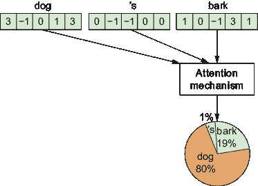

# 1 AI 的工作原理

### 本章涵盖

+   LLMs 处理输入和生成输出的方式

+   驱动 LLMs 的 transformer 架构

+   不同的机器学习类型

+   LLMs 和其他 AI 模型如何从数据中学习

+   如何使用卷积神经网络结合 AI 处理不同类型的媒体

+   结合不同类型的数据（例如，从文本生成图像）

本章阐明 AI 的工作原理，讨论了许多基础 AI 主题。自从最新的 AI 热潮以来，许多这些主题（例如，“嵌入”和“温度”）现在被广泛讨论，不仅限于 AI 从业者，还包括商人和公众。本章消除了这些主题的神秘感。

与仅仅堆积定义和撰写教科书式解释不同，本章更具观点性。它基于我在该领域工作的经验，指出常见的 AI 问题、误解和局限性，并讨论一些你可能不知道的有趣见解。例如，我们将讨论为什么在法语中生成语言比在英语中更昂贵，以及 OpenAI 如何雇佣大量人工工人手动帮助训练 ChatGPT。因此，即使你已经熟悉本章涵盖的所有主题，阅读它也可能为你提供不同的视角。

本章的第一部分是对*大型语言模型*（LLMs）如 ChatGPT 如何工作的概述。其章节顺序大致模仿了 LLMs 本身逐步将输入转换为输出的过程。

本章的中间部分讨论了*机器学习*，这是使计算机从数据中学习以创建 LLMs 和其他类型 AI 的技术。请注意，AI 和机器学习并不意味着相同。AI 是一个试图创建计算机程序以以类似于人类的方式执行任务的研究领域。机器学习可能或可能不用于该目标。然而，至少在过去二十年里，机器学习一直是 AI 的首选方法。因此，你可能会听到人们交替使用 AI 和机器学习这两个术语。当我在本书中提到 AI 时，我指的是当前的 AI 方法，这些方法涉及机器学习的使用。

本章的最后三分之一讨论了 AI 在语言生成之外的运作方式。具体来说，我概述了 AI 如何分析和生成图像或文本和图像的组合。我们还对基于 AI 的视频生成领域的当前发展进行了评论。

享受这段旅程吧！

## LLMs 的工作原理

语言模型是试图表示人类语言结构的计算机程序。大型语言模型，或 LLM，是一种增强版的语言模型。其庞大的规模使得 LLM 能够执行复杂的句子分析，并以令人印象深刻的表现生成新文本。LLM 的例子包括 OpenAI 的 GPT-4o、Meta 的 Llama-3、Anthropic 的 Claude 3.5 Sonnet、Google 的 Gemini 1.5 Pro 和 Mistral AI 的 Mixtral 8x7b。

当前的 LLM 被设计来执行一个特定的任务——根据输入句子猜测下一个单词。输入句子被称为*提示*。假设我要求你预测不完整的句子“埃菲尔”之后的单词。你很可能建议“塔”是最合理的选项。这正是 LLM 被设计来做的。因此，我们可以将 LLM 视为复杂的自动补全程序。官方上，我们说 LLM 是*自回归的*，这意味着它们被设计为基于先前内容产生额外的一块内容。

自动补全任务可能一开始看起来很简单，但它的影响范围很广。考虑以下提示：“2 加 5 等于多少？它是……”完成这类句子的自动补全需要知道如何执行算术运算。因此，执行算术运算的任务包含在自动补全任务中。

现在，考虑以下提示：“法语中‘雨伞’怎么说？”为了准确完成这类句子，你需要能够将法语翻译成英语。所以，至少在理论上，自动补全任务包括所有各种任务。

LLM 是通过机器学习创建的，这是一个计算机分析大量数据的过程——几乎是对整个公共互联网的快照——以自动组合 LLM。结果 LLM 是一个自包含的软件组件，这意味着它不会访问任何外部信息来生成其输出。例如，它不会浏览网络来做出下一个单词的预测。此外，LLM 是静态的，因此如果我们希望它讨论最近的事件，我们必须定期用新数据更新它。

当我们与大型语言模型（LLM）交互时，我们通常不会直接这样做。相反，我们使用一个中间软件来处理我们的请求并管理底层的 LLM。让我们称它为*LLM 包装器*。包装器使用技巧为用户提供比裸 LLM 猜测下一个单词更多的功能。例如，包装器可以生成整个句子，以闲聊的方式回答，并回答实时信息，例如当前日期。

一个 LLM 包装器的例子是 ChatGPT，这是 OpenAI 面向客户的应用程序。此应用程序管理我们与底层 LLM（如 GPT-4 和 GPT-4o）的交互。请注意，通常人们只用 LLM 这个术语来指代整个 AI 系统，包括包装器。

接下来的几节将讨论 LLM 包装器如何使用技巧来增强其底层、猜测下一个单词的 LLM 的能力的例子。

### 文本生成

我们通常使用 LLM 来输出整个句子，而不仅仅是猜测一个单词。LLM 包装器通过一个简单的技巧实现这一点：它让 LLM 反复吞噬自己的输出。假设我们给一个 LLM 提示“埃菲尔。”LLM 猜测句子的最可能延续：“塔。”然后 LLM 包装器将这个单词附加到初始提示上，从而形成新的提示：“埃菲尔塔。”然后它使用 LLM 猜测下一个单词，比如“是”，并将其再次附加到提示上。这个过程被重复（见图 1.1）以生成完整的句子，例如“埃菲尔塔位于巴黎。”


##### 图 1.1. 为了生成完整的句子，LLM 包装器使用 LLM 生成一个单词，然后将该单词附加到初始提示上，然后再次使用 LLM 生成另一个单词，依此类推。

### 文本结束

除了输出常规单词外，LLM 还被设计用来输出一些特殊的代码单词。其中之一，在文献中通常被格式化为“<|文本结束|>”，是一个表示文本结束的代码单词。当 LLM 被构建时，它会接触到包含这个特殊代码单词的句子示例，以指示它们的结束。因此，LLM 获得了猜测下一个最佳单词实际上是表示其结束的能力。

当 LLM 包装器遇到这个特殊的代码单词时，它就会停止按照上一节中解释的那样，让 LLM 吞噬其自己的输出以生成更多文本的过程。

### Chat

看看当我向 ChatGPT 输入提示“埃菲尔”时发生了什么：

****  看起来你的句子被截断了。你是想问关于埃菲尔铁塔的吗？

埃菲尔铁塔是世界上最具标志性的地标之一，位于法国巴黎。它是古斯塔夫·埃菲尔设计的，于 1889 年为庆祝法国大革命 100 周年而举行的万国博览会（Exposition Universelle）而建成。最初，一些巴黎的著名艺术家和知识分子因其设计而批评了这座塔，但如今它已成为法国的全球文化象征，也是世界上最具辨识度的建筑之一。

从外观上看，这个大型语言模型（LLM）不仅仅是自动补全我的输入，否则它应该会继续说“塔”而不是告诉我我的句子被截断了。

发生在这里的是，在幕后，LLM 包装器插入了一个特殊的代码单词来指示我的提示结束。在文献中，这个代码单词通常被格式化为“<|提示结束|>”。因此，包装器实际发送给 LLM 的输入是“埃菲尔<|提示结束|>”。在构建过程中，底层 LLM 被提供了以“<|提示结束|>”结尾的对话示例，这就是为什么它能识别出在我这句话中，代码单词位于一个不寻常的位置。

当我们继续与 ChatGPT 来回聊天时，包装器每次都会向 LLM 发送整个对话的历史记录，其中充满了“<|end of prompt|>”和“<|end of text|>”代码词，以清楚地界定每次交互的开始和结束。这有助于 ChatGPT 有效地进行对话。

OpenAI 允许软件开发者使用 LLM 包装器的更裸露版本，它不会在用户的提示后插入“<|end of prompt|>”代码词。这可以通过 API（API 是连接两个软件的方式——在这种情况下，你的软件与 OpenAI 的软件）或软件开发者的在线平台（见[`platform.openai.com`](https://platform.openai.com)）通过使用 API 的*completions*模式而不是默认的*chat*模式来实现。

注意：OpenAI 的文档中有一个警告标志告诉我们，完成模式“现在被认为是过时的”，但截至本文撰写时，它仍然可用。

让我们看看当我使用完成模式将“埃菲尔”输入到 LLM 时发生了什么：

**** 埃菲尔铁塔于 1889 年 3 月 31 日启用。它最初被建造为 1889 年世界博览会的入口拱门，原计划只站立 20 年。然而，由于其独特的设计以及巴黎人和游客的喜爱，它得以保留，并成为法国的象征之一，也是世界上最著名的纪念碑之一。埃菲尔铁塔的想法来自商人古斯塔夫·埃菲尔，他希望创造一个能够展示工业革命期间工程和设计进步的结构。他和他的团队花费了两年时间设计和建造这座塔，使用了超过 18,000 个单独的锻造铁件和 250 万个铆钉。

我们可以看到 API 只是简单地用合理的延续自动完成我的输入，这就是为什么它以“塔”（带前导空格的单词*Tower*）开头而不是告诉我我的提示不完整。

### 系统提示

我问：“今天是几号？”回答是

**** 今天的日期是 2024 年 5 月 30 日。

这是我提问时的正确回答。这有点令人惊讶，因为 LLM 只是分析句子来猜测下一个单词，它们无法访问实时数据。

发生在这里的事情是 ChatGPT 在提示前秘密插入额外的文本，为 LLM 提供上下文信息。这被称为*系统提示*。我们不知道确切的细节，但据传言，ChatGPT 的系统提示如下（见[`mng.bz/RVOv`](https://mng.bz/RVOv)）：

**** 你是 ChatGPT，一个由 OpenAI 训练的大型语言模型。尽可能简洁地回答。知识截止日期：[知识截止日期] 当前日期：[当前日期和时间]

这个提示在每次与 ChatGPT 开始聊天时都会秘密插入。因为日期出现在 ChatGPT 的系统提示中，所以聊天机器人可以回答关于当前日期的问题，就像之前的例子一样。请注意，知识截止日期也会插入，这有助于 ChatGPT 告知用户它无法回答关于某个日期之后发生的事件的问题。

软件开发人员可以通过 API 与 OpenAI 的 LLM 交互，而不是使用面向客户的 ChatGPT。API 允许你定义系统提示，这是在您与 LLM 的初始交互之前插入的。图 1.2 显示了 OpenAI 提供的可视化界面，以帮助开发者尝试 API。我们可以看到一个专门用于系统提示的框。

我使用 OpenAI 的 API 向 GPT-4o LLM 询问当前日期，同时保持系统提示为空。在图 1.2 中，我们可以看到 LLM 拒绝回答关于日期的问题。


##### 图 1.2 OpenAI 的 API 允许用户定义系统提示，这是一段文本，插入到用户提示的开始部分。

图 1.3 显示，如果将日期作为系统提示的一部分提供，LLM 会回答，就像 ChatGPT 会做的那样。

### 调用外部软件功能

我向 ChatGPT 询问了伦敦的当前天气。ChatGPT 的用户界面显示了一个标志，上面写着“正在搜索网络。”一秒后，标志变成了“正在搜索伦敦的当前天气。”之后，它告诉我伦敦的天气情况（见图 1.4）。

这里的技巧是在系统提示中描述一系列软件功能，如果 LLM 需要收集外部信息，它可以建议调用这些包装器。如果 LLM 建议调用这些功能之一，那么调用该功能并将其结果插入提示的责任就落在 LLM 包装器上。


##### 图 1.3 当当前日期作为系统提示的一部分提供时，LLM 可以回答关于当前日期的问题。

假设一个开发者想要创建一个聊天机器人应用程序，它可以无缝地回答关于当前事件的问题，例如天气、股票价值以及热门新闻话题。开发者可以在系统提示中解释，如果需要伦敦的当前天气，LLM 应该输出`"current_weather(London)"`，如果需要苹果股票的价值，它应该输出`"stock_value(Apple)"`，依此类推。当这些特殊消息输出时，开发者将调用软件功能来收集必要的信息并将其添加到提示中。这将给最终用户留下无缝访问实时数据的印象。


##### 图 1.4 ChatGPT 在幕后调用了一个搜索网络的函数，并将结果插入到用户的提示中。这创造了一种 LLM 浏览网络的错觉。

OpenAI 创建了一个框架，允许开发者轻松定义 LLM 可以建议调用的函数列表。以下是如何定义`"get_current_weather"`函数的示例，如官方文档中所述（见[`mng.bz/2y4a`](https://mng.bz/2y4a)）：

```py
tools = [
    {
        "type": "function",
        "function": {
            "name": "get_current_weather",
            "description": "Get the current weather",
            "parameters": {
                "type": "object",
                "properties": {
                    "location": {
                        "type": "string",
                        "description": "The city and state, 
                         e.g. San Francisco, CA",
                    },
                    "format": {
                        "type": "string",
                        "enum": ["celsius", "fahrenheit"],
                        "description": "The temperature unit 
                         to use. Infer this from the users 
                         location.",
                    },
                },
                "required": ["location", "format"],
            },
        }
    }
]
```

注意，天气获取函数的代码不属于此声明的一部分。只提供了函数及其输入的描述。LLM 包装器将此函数的描述插入到系统提示中，以便底层 LLM 在需要时可以建议调用它。

当包装器检测到 LLM 建议调用该函数时，它会通知用户。以下是一个示例，使用 OpenAI 的 Python SDK，在用户询问伦敦天气后得到的 API 响应对象：

```py
ChatCompletionMessage(
    content=None, 
    role='assistant', 
    tool_calls=[
    ChatCompletionMessageToolCall(
        id='call_Dn2RJJSxzDm49vlVTehseJ0k', 
        function=Function(
            arguments='{"location":"London, United Kindgdom",
             "format":"celsius"}', 
            name='get_current_weather'
        ), 
    type='function')
    ]
)
```

软件开发者必须编写`"get_current_weather"`函数，运行它，然后将响应插入以下提示（“伦敦，英国天气：20 摄氏度，雨天”）。然后，LLM 可以使用这些新添加的信息。应用程序的最终用户会感觉到 LLM 本身能够实时回答关于天气的问题。实际上，LLM 仍然是一个独立的程序；增强的功能是在 LLM 之外实现的。

### 检索增强生成

有时用户希望 LLM 分析训练数据中不存在的文档。例如，一家企业可能希望回答有关其内部文档的问题，或者一个应用程序可能希望分析最新网页的内容。检索增强生成（RAG）是这样做的一种流行方式（你可以在 Abhinav Kimothi 的*《检索增强生成简单指南》*中了解更多信息，可在[`mng.bz/yWpe`](https://mng.bz/yWpe)找到）。当用户提交提示时，LLM 包装器首先在数据库中搜索相关文档。例如，它可能从提示中提取关键词并找到匹配的文档。这被称为*检索*。

*之后，LLM 包装器将这些文档的内容插入到提示中。因此，提示被认为是*增强*了额外的相关信息。

当 LLM 生成文本时，它可以访问这些文档作为提示的一部分，因此可以使用它们的内容来增强其预测。RAG 是一种流行的创建适应特定业务内部聊天机器人的方法。此外，它通常用于创建 LLM 可以实时访问最新网络内容的错觉。RAG 还可以帮助识别 LLM 生成输出时使用的特定来源，从而引用参考文献。

RAG 方法的一个挑战是根据提示找到相关文档。许多算法长期以来一直被搜索引擎用于索引和检索内容，研究人员正在研究 RAG（参见[`arxiv.org/abs/2405.06211`](https://arxiv.org/abs/2405.06211)）的特定检索技术。另一个挑战是，随着文档的增加，提示可能会变得相当长。LLM 只能接受最大提示长度（以下将详细介绍），因此你必须确保插入到提示中的文档符合最大允许长度。此外，较长的提示会带来更高的成本，因为 AI 提供商根据输入和输出的文本量收费。

## 标记的概念

我们一直在说 LLM 从输入提示中猜测下一个单词，但这并不完全准确。现在让我们更精确地理解这一点。

LLM 包含一个固定大小的内部词汇。这些是 LLM 可以读取和生成的单词。LLM 的词汇量通常包含

+   常用词汇（例如，“狗”）

+   常用单词片段（例如，“ish”）

+   常见的拉丁字母（例如，“a”和“b”）

+   来自名为 UTF-8 的文本编码标准的特殊符号，这些符号组合在一起用来表示非拉丁字符和其他符号（例如，“á”，“æ”和“你”）

+   特殊的代码词，如“<文本结束>”和“<提示结束>”

词汇表中的每个元素都称为*标记*。我们可以将标记视为常见的文本片段。使用标记而不是整个单词，LLM 可以通过组合常见的单词片段（“hungry”+“ish”）来读取和生成不在字典中的单词（例如，“hungryish”）。它还允许 LLM 读取和生成非拉丁文本并创造新词。

当前大型语言模型（LLM）的词汇量大约包含 10 万个不同的可能标记。例如，包括 GPT-3.5 和 GPT-4 在内的 OpenAI 的 LLM，其词汇量有 100,261 个可能的标记。

注意，许多标记代表带有前导空格的常用词汇。例如，“dog”和“ dog”都是 OpenAI 的 LLM 词汇表中的标记。因此，LLM 通常可以避免使用专门的空白标记。从现在开始，每当我在本书中提到单个标记，例如“dog”标记时，请记住它可能带有前导空格。 （我不会每次都写上空格，因为它看起来有点难看。）

LLM 的词汇表是通过在数千份文档上运行自动分析来创建的，以识别最常见的文本模式（通常用于此的算法称为字节对编码。您可以在我在[`emaggiori.com/ChatGPT-vocabulary/`](https://emaggiori.com/ChatGPT-vocabulary/)上写的博客文章中找到更多细节和逐步示例）。OpenAI 停止公开其创建 LLM 词汇表的方法，但我们确实知道它们是如何使用旧模型做到这一点的。例如，GPT-3 的词汇表是通过自动跟踪来自流行 Reddit 讨论的链接、收集链接网页上的文本以及识别其中最常见的单词和字符组合来创建的（Redford 等人，“语言模型是无监督的多任务学习者”，2019 年）。

### 一次一个标记

LLMs（大型语言模型）被设计为从它们的词汇表中读取一系列有效的标记。因此，LLM 包装器首先将输入提示符细分为有效的标记。例如，当使用 GPT-3.5 时，提示符“狗的叫声几乎”在传递给 LLM 之前被 LLM 包装器如下细分：

```py
The| dog|'s| bark| was| barely
```

使用算法进行细分，该算法大致尝试使用词汇表中的最大标记来分割输入。

OpenAI 提供了一个网页，您可以在其中输入文本并查看在将其输入模型之前如何对其进行标记化。您可以在[`platform.openai.com/tokenizer`](https://platform.openai.com/tokenizer)找到它。

LLM 不读取原始文本。相反，LLM 包装器首先将输入提示符转换为表示每个标记 ID 的整数列表，这是其在词汇表中的位置：

```py
[791, 5679, 596, 54842, 574, 20025]
```

之后，包装器使用 LLM 来预测最有可能的下一个标记的 ID。在先前的例子中，LLM 输出 ID 为 80415 的标记最有可能是输入提示符的后续内容。这个标记对应于“audible”。然后 LLM 包装器将这个标记附加到输入上：

```py
The| dog|'s| bark| was| barely| audible
```

接下来，LLM 包装器将这个新提示（作为整数列表，`[791, 5679, 596, 54842, 574, 20025, 80415]`）输入到 LLM 中，让它“吃掉自己的输出”并生成一个额外的标记。这个过程重复多次以生成更多标记：

```py
The| dog|'s| bark| was| barely| audible| above| the| roar| of| the| city| traffic|.
```

在这个例子中，在关于狗和噪音的几段胡言乱语之后，LLM 决定 ID 为 100276 的标记最有可能是提示符的后续内容。这个标记代表“<|end of text|>”。因此，LLM 认为这是一个结束文本的好地方。在遇到这个标记后，LLM 包装器遵循 LLM 的建议并停止生成更多文本。

看看 GPT-3.5 是如何逐个标记地向我解释单词“hungryish”的含义的：

```py
If| you| say| "|I|'m | hungry|ish|,"| you| mean| you|'re | feeling| somewhat| hungry|,| but| not| extremely| so|.| It|'s | a| mild|er| form| of| hunger|.
```

我们可以看到，尽管单词“hungryish”不是 GPT-3.5 词汇表的一部分，但它通过两个标记的序列“hungry”和“ish”成功地生成了它。请注意，“milder”、“I’m”、“you’re”和“It’s”这些单词也是通过每个单词两个标记生成的。

### 按标记计费

大多数 LLM API，允许软件开发者以编程方式使用 LLM，按输入和输出到 LLM 的标记数向用户收费。因此，较长的提示词和较长的响应会产生更高的成本。

例如，截至今天，GPT-4o 的费用是每百万输入标记 5 美元，每百万输出标记 15 美元。以参考为例，整个莎士比亚戏剧《罗密欧与朱丽叶》需要 40,000 个标记，因此将其输入到 GPT-4o 将花费 0.20 美元，生成它将花费 0.60 美元。这听起来并不多，但如果反复使用 LLM，账单很容易增加。例如，如果你每次用户访问你的网站时都向 LLM 发送一个长提示词，你可能会每月花费数千美元。

注意，当你与 LLM 进行来回聊天时，你必须在与它的每次互动中都包括你的整个聊天历史，或者至少如果你想让 LLM 能够在生成新输出时分析之前的对话，你必须这样做。因此，随着你的聊天历史变长，提示词的成本会越来越高。

### 那么，对于英语以外的语言呢？

LLM 的词汇表往往针对英语进行优化。例如，它们包含“dog”标记，但没有表示狗的法语单词的标记。因此，非英语单词往往被分成许多标记，通常每次覆盖一个或两个字母，因为词汇表中没有足够的标记来表示整个单词。

看看美国宪法序言在被输入到 GPT-4 之前的标记化过程：

```py
We| the| People| of| the| United| States|,| in| Order| to| form| a| more| perfect| Union|,| establish| Justice|,| insure| domestic| Tran|qu|ility|,| provide| for| the| common| defense|,| promote| the| general| Welfare|,| and| secure| the| Bless|ings| of| Liberty| to| ourselves| and| our| Poster|ity|,| do| ord|ain| and| establish| this| Constitution| for| the| United| States| of| America|.
```

现在，看看它的法语翻译：

```py
Nous|,| le| Pe|uple| des| É|t|ats|-Un|is|,| en| vue| de| former| une| Union| plus| par|fa|ite|,| d|'é |tabl|ir| la| justice|,| de| faire| rég|ner| la| pa|ix| int|érie|ure|,| de| pour|voir| à| la| déf|ense| commune|,| de| dévelop|per| le|  bien|-être| général| et| d|' |ass|urer| les| bien|fa|its| de| la| libert|é| à| nous|-m|ê|mes| et| à| notre| post|é|rit|é|,| nous| dé|cr|é|tons| et| é|tab|lis|sons| cette| Constitution| pour| les| É|t|ats|-Un|is| d|' |Am|érique|.
```

法语文本比其英文对应文本的标记数多出两倍以上。此外，法语中单词的细分并没有太多意义。例如，“États-Unis d’Amérique”（美国）被分割成许多无意义的片段，如“ats”和“-Un”。

这个问题在非拉丁字母中变得更加严重。一个广泛讨论的极端例子是印度使用的泰卢固语中“woman”这个词：స్త్రీ。这个词由六个字符的组合组成，这些字符水平垂直排列。GPT-4 需要 18 个特殊的 UTF-8 标记来表示这个单词。

由于大型语言模型（LLM）按标记计费，与其他语言相比，使用其他语言的 LLM 可能会更昂贵。此外，LLM 分析提示词可能更具挑战性，因为单个输入，如“é”标记，本身并不携带太多意义；LLM 必须额外努力来上下文化相邻的标记并从中提取意义。

对特定语言（在最受欢迎的 LLMs 中是英语）的偏见可能不容易消除。为了更好地标记其他语言的单词，词汇表必须扩展到包括法语、中文、泰卢固语等语言中的单词或常见的单词片段。这将使词汇表的大小增加，远远超过当前的 10 万标记，这可能会使 LLMs 变得无效并减慢速度。

OpenAI 一直在努力改进其 LLMs 的内部词汇表，以更好地处理非英语文本。截至本文撰写时，细节尚未公开，但它的创造者与 GPT-4o 使用的新词汇的一些示例案例进行了分享（见[`openai.com/index/hello-gpt-4o/`](https://openai.com/index/hello-gpt-4o/)）。例如，一段泰卢固语的文本比之前少用了 3.5 倍的标记，但仍然比其英语对应物多一倍。

### 为什么 LLMs 需要标记呢？

一个人可能会想知道为什么需要标记；也就是说，为什么不直接让 LLM 读取和生成单个字符呢？正如我们很快将要讨论的，LLMs 试图内部描述每个单个输入的*意义*。描述像“巴黎”这样的标记的意义相当简单。例如，我们可以将其描述为“法国的首都”。然而，描述像“P”这样的标记的意义要困难得多，因为我们不知道这个字母指的是什么，除非我们分析上下文。这就是为什么一次性将“巴黎”作为一个单独的标记要直接得多。同样的道理也适用于生成文本——让 LLM 输出像“巴黎”这样的标记，它本身就有很强的意义，而不是让它一个字符一个字符地输出相同的单词，要直接得多。

我们可以将这个想法推向极致，创建一个包含各种单词及其派生词的巨大词汇表，例如“巴黎人”、“巴黎人”、“巴黎天气”和“巴黎的艾米丽”。但这会走得太远——词汇表会变得非常大，而且会浪费资源，因为许多标记将代表密切相关的内容。当前设置，使用标记表示最常见的单词和单词片段，是一种在实践中效果良好的折中方案。

## 嵌入：表示意义的一种方式

人工智能最大的挑战之一是找到一种有效的方式来表示高级概念、意义和思想。在设计 LLM 时，我们希望模型内部表示标记的意义而不是其字母。例如，我们希望标记“dog”被表示为对狗的描述（比如说，一个友好的四足动物）。

*嵌入*是表示意义最常见的方式之一。它被 LLMs 和其他类型的 AI 使用。嵌入是一个数字列表（或“向量”）。向量中的元素数量被称为嵌入的*维度*。

*我们可以将这个向量中的每个位置视为衡量一个标记与某个主题匹配程度的一个指标。让我们来看一个例子。假设一个长度为五的嵌入向量代表以下五个主题：“动物”、“猫”、“大型”、“可怕”和“四条腿”。假设我们想使用这些主题来表示“狗”标记的含义。图 1.5 提供了一个（虚构的）解决方案。


##### 图 1.5：每个标记被映射到一个数字向量。我们可以想象向量中的每个数字代表一个主题。以下是一个关于“狗”标记的虚构主题列表及其相应的数字。

在这个插图上，标记被映射到五个数字，每个数字都表示标记的含义与每个主题匹配的程度。我们可以看到，在“动物”主题上，标记得到了一个高分数，因为狗当然是一种动物。在“猫”主题上，标记得到了一个负分数，因为狗有时被视为猫的对立面。在“大型”主题上，标记得到了一个零分的中性值，因为我们通常不会认为狗是一个特别大或小的物体。图 1.6 展示了我们如何想象“大象”标记的嵌入。


##### 图 1.6：一个关于“大象”标记的虚构嵌入向量

在这种情况下，嵌入向量对“猫”是中性的，而对“大型”则是高度积极的。

LLMs 的核心是嵌入。LLMs 会不遗余力地尝试通过使用嵌入来找到标记的良好、上下文化的表示。在经过多层处理之后，嵌入向量非常擅长表示输入标记的真实含义，这使得 LLM 能够轻松地完成猜测下一个标记的任务。

LLMs 使用比上述示例中更长的嵌入向量，这使得它们能够表示大量的主题。例如，GPT-3 使用 12,288 维度的嵌入向量，因此每个输入标记由 12,288 个数字表示。Llama 3 系列中最小的模型，由 Meta 开发，使用 4,096 维度的嵌入向量，而最大的模型使用 16,384 维度的嵌入向量（[`arxiv.org/abs/2407.21783`](https://arxiv.org/abs/2407.21783)）。

### 机器学习和嵌入

手动设计长嵌入向量是非常困难的。因此，我们使用*机器学习*来完成这项工作。这意味着我们让计算机分析大量数据，例如从互联网收集的文本，以得出有用的嵌入向量。

当 AI 工程师在 LLM 中使用，比如说 12,288 维度的嵌入时，他们实际上是为 12,288 个主题留出了空间。然而，选择和组织主题以最佳实现其目标的工作则由机器来完成。

由于嵌入是自动创建的，很难知道每个维度代表哪些主题。此外，主题可能不像“大”和“猫”那样清晰。因此，通过使用机器学习，我们可以创建有效的嵌入——证明是 LLMs 表现良好——但我们无法确切了解它们是如何工作的。*可解释性*在预测能力的名义下被牺牲了。

### 可视化嵌入

地球上的一个位置可以通过其纬度和经度来确定。我们可以同样将嵌入向量中的每个数字视为坐标，这些坐标帮助我们确定标记在意义空间中的位置。图 1.7 展示了由二维嵌入向量定义的意义空间的一个例子，其中包含“可怕”和“大”这两个主题。每个标记都根据其在嵌入向量中的“可怕”和“大”值放置在这个空间中。


##### 图 1.7 我们可以将嵌入向量中的数字视为坐标，这些坐标将标记放置在多维“意义空间”中。

你可以看到相似的对象往往聚集在一起；这就是为什么在这个空间中，“蟒蛇”和“蛇”这两个标记很近，而“甲虫”和“瓢虫”也是如此，但“蟒蛇”和“瓢虫”则相距甚远。

设计良好的、有用的嵌入是这样的，即意义上紧密相关的标记在这个假想的嵌入空间中也放置得相对较近。如果嵌入向量在表示标记的真实意义上做得不好，那么相关的标记在这个假想的嵌入空间中就不会靠近。

由于嵌入向量通常非常长，嵌入空间是高维的。我们无法绘制它，但我们仍然可以想象，在这个高维空间中，相关的标记在物理上是聚集在一起的。

### 为什么嵌入是有用的

嵌入向量特别有用，因为我们可以通过进行简单的线性计算来轻松比较它们或从中提取信息。假设你想比较两个标记的意义。你可以通过计算它们在假想嵌入空间中的物理距离来实现这一点。一种流行的方法是计算两个向量之间的*点积*，这产生了一种“有符号距离”。如果结果是正的，那么在嵌入空间中这两个标记足够接近，因此它们的意义是相关的。如果是零，它们是不相关的。如果是负的，它们的意义是相反的，例如在“大”和“小”中。

注意：点积是通过将一个向量中的数字与另一个向量中相应位置的数字相乘，然后将结果相加来计算的。

现在，假设你想要从一个表达性更强的嵌入向量中提取有限的有用信息。例如，你可能想要提取与动物相关的主题，并丢弃其他所有内容。我们可以将这视为将多维嵌入空间压缩到低维空间，例如将 3D 空间压扁成薄板，从而丢弃无信息维度。例如，我们可以将整个 12,288 维度的空间压缩到，比如说，一个只关注动物相关主题的 100 维空间（例如，“吠叫”，“哺乳动物”，“宠物”）。执行这种压缩的数学运算被称为*投影*。

*投影是通过将矩阵乘以嵌入向量来执行的。矩阵表示我们想要挤压嵌入空间的方向。请注意，由于我们通常不了解嵌入如何编码意义，因此我们也不了解意义如何在挤压的嵌入空间中表示。就像嵌入一样，挤压空间的投影也是通过机器学习确定的，而不是手工设计的。

除了在大型语言模型和其他类型的 AI 中使用外，工程师使用第三方工具为各种内容检索应用生成嵌入已成为一种流行趋势。例如，你可以使用嵌入 API 生成代表文本文档意义的嵌入，然后通过计算嵌入的点积来比较文档。具体来说，OpenAI 提供了一个嵌入 API，帮助生成文本文档的嵌入。

此外，一些 API 为不同的输入模式生成嵌入，例如文本和图像。一个例子是 Google Clouds 的嵌入 API（见[`mng.bz/1Xvq`](https://mng.bz/1Xvq)）。生成的嵌入可以直接比较。例如，一篇关于猫的文本和一张猫的图片被映射到紧密相关的嵌入向量。因此，你可以使用点积来找到与描述最匹配的图像。

### 为什么大型语言模型在分析单个字母时遇到困难

大型语言模型在正确分析单词中的单个字母方面臭名昭著，例如计算字母出现的次数。它们也难以遵循需要生成包含特定字母的文本的指令。图 1.8 展示了使用 GPT-4o 的这个问题的一个例子。


##### 图 1.8  大型语言模型在分析单词中的单个字母时经常遇到困难。

如果你记得，大型语言模型接收的是标记作为输入，而不是字母。因此，单词的确切字母并没有输入到模型中。在图 1.8 的例子中，标记“berry”一次性输入到大型语言模型中。

然后，每个标记被映射到一个嵌入向量以表示其意义。因此，任何关于单个字母的引用在这个阶段很可能会完全丢失，因为当有更多有用的主题需要表示时，在嵌入向量中为“包含两倍字母 a 的标记”等主题分配空间将是浪费的。

由于人们广泛地嘲笑 LLMs 在分析字母方面的糟糕表现，AI 工程师可能会采取临时措施来直接解决这个问题。例如，如果 LLM 包装器检测到有关单个字母的问题，它可能会在提示中添加单词的拼写。也许其中一些已经完成了，因为较新的 LLMs 似乎在分析单个字母方面遇到的困难较少。然而，这个问题在写作时甚至在最新的 LLMs 中仍然存在，所以它还没有得到完全解决。

## 变压器架构

当前 LLMs 所采用的推动方法是谷歌研究人员发明的一组方法。它被描述在一篇著名的论文中，该论文于 2017 年发表，标题为“Attention Is All You Need”（可在[`arxiv.org/abs/1706.03762`](https://arxiv.org/abs/1706.03762)找到）。该论文提出了一种设计语言模型的新方法，这被称为*变压器架构*或简称*transformers*。

如果你还记得，当我要求一个 LLM 完成句子“狗的叫声几乎”时，它正确地输出了“audible”。尽管这个句子看起来很简单，但它很有挑战性，因为单词“bark”有两个不同的含义——狗发出的噪音和树的树皮。如果我要求 LLM 继续句子“树的树皮几乎”，那么“audible”将是一个糟糕的选择。我试了试，LLM 输出了“visible”而不是“audible”。LLM 设法根据句子中是否出现了“dog”或“tree”来正确地消除“bark”一词的多义性。变压器架构特别设计用来根据上下文有效地消除标记的多义性。

在变压器架构出现之前，最受欢迎的语言模型是基于一种称为 LSTM（长短期记忆）的 AI 模型。LSTM 试图根据以下两点预测下一个标记：

+   输入提示中的最后一个标记（如果输入是“狗的叫声几乎”，则是“barely”）

+   一个总结所有先前标记意义的单一嵌入（一个代表“狗的叫声是”的单个嵌入向量）

这两块信息被用来预测下一个标记（在这个例子中是“可听见的”）。由于最后一个标记之前的整个上下文都被压缩成一个单一、固定大小的嵌入向量，LSTM 可以处理不同长度的输入而不会出现任何复杂情况。这也是它们变得如此受欢迎的原因之一。但这也是 LSTM 的阿喀琉斯之踵——通过将如此大的上下文压缩成一个单一向量，它们往往失去了正确猜测下一个单词所必需的、重要的、细粒度的上下文信息。

变换器架构通过以不同的方式处理之前的标记，而不是将它们全部压缩，从而解决了这个问题。这个过程分为三个步骤，如图 1.9 所示。


##### 图 1.9  LLM 概述。在步骤 1 中，标记逐个映射到嵌入。在步骤 2 中，通过使用提示符中的先前标记对每个嵌入进行上下文化来改进每个嵌入。在步骤 3，

使用大幅改进的嵌入来预测下一个标记。

下一个标记。

首先，模型将输入提示符中的每个标记映射到一个嵌入向量，该向量试图表示其含义。这是对每个标记单独执行的，因此不使用任何上下文信息——每个标记被处理得好像其他标记不存在一样。虽然这些嵌入有时可以接受，但它们不能太好，因为在许多情况下，不查看上下文很难知道一个标记的真正含义。例如，为“bark”这样的标记生成的嵌入将很差，因为模型无法知道它是指狗还是树。

在第二步中，LLM 通过分析其先前标记来改进每个单独标记的嵌入——每个标记通过考虑其上下文而被*转换*。请注意，与 LSTM 相比，变换器架构不会将嵌入压缩在一起来总结整个提示符。

长短期记忆网络（LLM）使用固定数量的先前标记来对每个标记进行上下文化，这被称为*上下文窗口*。例如，假设一个 LLM 的上下文窗口为 10,000 个标记。每个标记通过分析其前 9,999 个标记来进行上下文化。如果用户的提示符少于 10,000 个标记，那么提示符的开头将用零等虚拟值填充，直到达到 10,000 个标记。如果用户的提示符超过 10,000 个标记，那么 LLM 包装器将拒绝用户请求或丢弃提示符的开头。

在使用 LLM 之前，您需要仔细考虑上下文窗口。如果您想，比如说，让 LLM 总结一整本小说，您需要确保它适合上下文窗口，否则 LLM 将无法一次性总结整个小说。此外，如果您使用 RAG 方法将相关文档的内容插入到用户的提示符中，您也需要确保上下文窗口可以容纳它们。此外，当您与基于 LLM 的应用程序进行来回聊天时，整个对话历史通常包含在每个提示符中，随着您与聊天机器人的对话，提示符会变得更长。

早期的 LLM 上下文窗口非常有限。例如，GPT-3 的上下文窗口为 2,048 个标记。因此，它们分析长输入的能力有限。

随着时间的推移，上下文窗口已经扩大。截至本文撰写时，OpenAI 的最新模型 GPT-4o 拥有 128,000 个标记的上下文窗口。而谷歌的一个模型 Gemini 1.5 Pro 向其企业客户提供 1 百万个标记的上下文窗口。上下文窗口的大小在 LLM 的官方文档中指定。

在上下文化步骤结束后，与每个输入标记相关的嵌入比最初的嵌入更加准确和有用，这要归功于上下文化。例如，如果我们假设在“dog”（狗）这个词出现之前，“bark”（吠声）的嵌入在第二步结束时变得更加动物化。相反，如果上下文中包含树的相关内容，其嵌入就会变得更加树状。

变换器架构中的第三步（见图 1.9）是根据第二步生成的增强、上下文化的嵌入来预测下一个标记。这是因为假设第二步产生了非常好的嵌入，可以很容易地猜测下一个单词，所以这个过程通过一个非常简单的数学运算来完成。

在接下来的几节中，我们将更详细地描述这三个步骤中的每一个，并解释机器学习是如何进入画面的。

### 第一步：初始嵌入

初始嵌入很容易获得。LLM 包含一个内部字典，将每个可能的标记映射到其相应的嵌入。我们可以想象如下：

```py
"a"        -> [0, -1, 2, 3, 1, …]
"b"        -> [1, -2, 0, 4, 0, …]
…
" bark"    -> [1, 0, -1, 3, 1, …]
…
" dog"      -> [3, -1, 0, 2, 3, …]
…
```

初始嵌入是通过在字典中查找每个标记并将其替换为其相应的嵌入来创建的。结果是创建了一个初始嵌入集，这些嵌入一个接一个地创建，没有上下文，这标志着第一步的结束（见图 1.9）。

字典中的数字不是手工定义的。这些数字都是模型的*可学习参数*。这意味着 AI 工程师在代码中将它们留为空白，并在学习算法运行时让计算机填充它们的值。我们可以从 AI 工程师的角度这样想象之前的字典：

```py
"a"     -> [?, ?, ?, ?, ?, …]
"b"     -> [?, ?, ?, ?, ?, …]
…
"bark"    -> [?, ?, ?, ?, ?, …]
…
"dog"     -> [?, ?, ?, ?, ?, …]
…
```

当计算机填充空白时，这被称为*学习*或*训练*，它会设计自己的嵌入空间。因此，计算机可以自由地组织标记和选择主题，以达到有效猜测下一个单词的目标。

考虑一个词汇量包含 100,000 个不同标记且嵌入包含 10,000 维度的模型，这在许多 LLM 中很常见。字典将包含 100,000 个条目，每个条目将包含 10,000 个数字，这些数字是问号。可学习的参数总数（问号）将是 100,000 × 10,000 = 10 亿。这有很多可学习的参数！而且这只是开始。

### 第二步：上下文化

在第二步中，LLM（大型语言模型）通过考虑其前一个标记（在上下文窗口内）逐个将每个输入标记进行上下文化。让我们看看，例如，LLM 会如何将“bark”（狗吠）这个标记在“dog’s bark”（狗的吠声）中进行上下文化。

上下文化首先为上下文中的每个标记计算一个注意力分数。注意力分数表明如何最好地在上下文窗口中的所有标记之间分配注意力，以消除最后一个标记的歧义。例如，为了上下文化“bark”，值得将大部分注意力集中在“dog”上，然后是“bark”本身，最后是“’s”。图 1.10 展示了这一操作。

注意力分数的计算，称为*注意力机制*，是通过一系列数学运算来完成的，例如在嵌入向量上的投影（参见 1.3.3 节）。这里我们不涉及细节，所以我们就说这些操作是专门设计来让 LLM 从嵌入中提取意义并比较它们的。



##### 图 1.10  注意力机制计算上下文窗口中所有标记的相对相关性，以上下文化或消除最后一个标记的歧义。

AI 工程师确定操作的类型和数量，但留下空白，这些空白将使用机器学习后来确定。例如，配置投影做什么的投影矩阵中的数字被留作空白。因此，我们可以将投影矩阵想象成

[[ ? ? ? ... ?],

[ ? ? ? ... ?],

...

[ ? ? ? ... ?]]

因此，AI 工程师告诉计算机如何消除标记的歧义——通过使用投影来比较嵌入，等等——但让机器填写细节。机器会自己发现分析嵌入以消除像“bark”这样的问题标记的有用方式。投影矩阵相当大，所以这一步可以轻松地为模型增加数亿个可学习的参数。

一旦 LLM 计算了注意力分数，它就会使用这些结果值来引导标记嵌入向量的上下文化。我们可以将这一步骤想象成利用注意力分数的引导，让标记的信息相互影响。

例如，很多来自“狗”的信息会影响到“bark”，因为其注意力机制确定“dog”标记与“bark”的意义相关。因此，这一步骤的结果是，“bark”的嵌入变得更加动物化，而不是树状。相反，来自“’s”的信息对“bark”的影响非常小，因为注意力分数认为它相当不相关。根据上下文更新嵌入的过程被称为 transformer 的*前馈*步骤。

在前面的例子中，注意力和前馈机制的最后结果是“bark”嵌入的改进版本。相同的流程被应用于上下文化输入提示中的所有标记，使用它们之前的标记，这导致了一代新的改进嵌入，如图 1.9 步骤 2 所示。

在这个过程结束时，LLM 在猜测下一个标记方面处于更好的位置，因为它包含了一个改进的、上下文化的整个输入提示的意义表示。

#### 多层架构

我们刚才描述的上下文化步骤（步骤 2）通常需要应用多次。因此，嵌入向量被多次改进。这被称为*多层*转换器。大多数大型语言模型（LLM）至少包含几十层按顺序应用的转换器。每个转换器层都有自己的可学习参数集，因此每个层可以专门处理不同的上下文化任务。

例如，GPT-3 有 96 个转换器层。这导致模型内部有高达 1750 亿个可学习参数。

#### 多头注意力

注意力机制通常被细分为不同的头，这意味着它分别单独分析嵌入向量的不同部分。这迫使 LLM 设计具有高度专业化的嵌入向量段。例如，我们可以想象一个段是专门用于所有与动物相关的事物，另一个段是专门用于所有与树木相关的事物，尽管我们仍然通常无法理解嵌入向量。实践观察表明，这种方法比使用一个一次性处理整个嵌入向量的单一头效果更好。

### 步骤 3：预测

最后一步，图 1.9 中的步骤 3，是对最可能的下一个标记进行预测，这是 LLM 的最终任务。这是通过在步骤 2 生成的上下文化嵌入上进行投影来完成的。

尽管我们一直在说 LLM 预测最可能的下一个标记，但这并不完全准确。实际上，它们为词汇表中的每个可能的标记计算一个概率值。因此，LLM 的输出是一个向量，其数字数量与词汇表中的标记数量相同。每个位置都指代一个可能的标记，如表 1.1 所示。在这个例子中，标记“audible”获得了一个高概率值 0.8，这意味着 LLM 认为它是一个高度可能的下一个标记。

##### 表 1.1 在最后一步，LLM 为词汇表中的每个可能的标记分配一个概率值

对于词汇表中的每个可能的标记。所有值加起来等于 1。

| 0.01 | 0.0 | 0.05 | … | 0.8 | … |
| --- | --- | --- | --- | --- | --- |
| “a” | “b” | “c” |  | “audible” |  |

LLM 包装器根据 LLM 的输出概率选择下一个标记。一种方法是选择 LLM 中概率最高的标记（在两个标记具有完全相同的概率的极不可能事件中，可以随机选择任何一个）。然而，还有其他方法可以做到这一点，这使 LLM 能够更加大胆。我们将在下一节讨论这个问题。

### 温度

如前文所述，LLMs 为每个标记输出一个概率，描述该标记紧随输入提示出现的可能性。从词汇表中选择下一个标记的一种方法是根据 LLM 输出的概率选择概率最高的标记。然而，这会鼓励 LLM 过于保守——有时我们希望得到更具冒险性的输出。因此，通常通过使用 LLM 的输出概率随机从词汇表中采样一个标记来选择下一个标记。例如，如果 LLM 为“audible”标记输出概率为 0.9，那么采样器以 90%的概率选择该标记，其他标记以 10%的概率选择。

用户通常可以通过调整称为*温度*的设置来调节输出的冒险程度。此设置挤压或平滑 LLM 的输出概率。低温度将最高的采样概率推向上方并降低其他概率。例如，0.9 的概率可能被转换为 0.95，而 0.05 的概率可能被转换为 0.01。这使得 LLM 包装器更有可能选择排名靠前的标记。我们可以将其视为使 LLM 包装器更加保守，因为它更倾向于选择排名靠前的明显标记，而不太可能选择替代标记。

相反，高温度会平滑概率。例如，0.9 的概率可能被转换为 0.8，而 0.01 的概率可能被转换为 0.05。这使得输出更具创造性，因为低排名的标记更有可能被选中。每个 LLM 包装器都提供自己的一组温度值。例如，OpenAI 的 API 允许用户将温度设置为介于零（保守）和二（创意）之间的值。

在以下段落中，我们描述了两种设置我们希望输出有多冒险的替代方法。

#### Top-p

另一个称为*Top-p*的设置是对可以采样的最高标记数量的限制。例如，如果我们设置 Top-p 为 0.8，那么我们只从覆盖 80%概率的顶部标记中进行采样。覆盖概率最低的 20%的标记将被忽略。

#### Top k

*Top-k*设置对可以从其采样的最高标记数量施加限制。例如，如果我们设置 Top-k 为 20，LLM 包装器就只能从顶部 20 个标记中选择一个标记。如果我们设置 Top-k 为 1，我们迫使 LLM 每次都选择顶部标记。

注意，并非所有 LLM 包装器都允许用户配置所有这些设置——有时只有一两个可用。例如，截至今天，OpenAI 允许用户设置温度和 Top-p，但不允许设置 Top-k。可用的设置在文档中描述。

### 你能让 LLM 始终输出相同的内容吗？

有时使用 LLM 生成可复制的输出是有需求的，这意味着 LLM 每次接收到相同的输入提示时都会生成完全相同的输出。这可以用来评估 LLM 的性能或分享其他人可以复制的 LLM 输出示例。

理论上，可以让 LLM 生成可复制的输出。例如，这可以通过使用 top-1 采样策略来实现，其中我们总是选择概率最高的标记，从而确保 LLM 内部的所有数学计算在不同的运行中都以完全相同的方式进行。

然而，虽然这在理论上是有可能的，但在实践中并不总是如此。例如，截至目前，我们无法保证 OpenAI 的 LLM 在不同的运行中会生成完全相同的输出。有官方指南说明如何配置设置以产生大部分可复制的输出，但它们并不能保证完全相同（见[`mng.bz/PdeR`](https://mng.bz/PdeR)）。

这可能是因为流行的 AI 和算术库将计算分解成多个线程，每次可以以不同的顺序执行（见[`news.ycombinator.com/item?id=37006224`](https://news.ycombinator.com/item?id=37006224)）。这可能导致由于加法顺序不同而产生的舍入误差，从而在输出中产生细微的差异（见[`mng.bz/JYQZ`](https://mng.bz/JYQZ)）。在未来，如果这些问题得到解决，将有可能使用流行的 LLM API 生成可复制的输出。

### 更多学习资源

在本节中，我们介绍了 LLM 工作原理的要点。我们没有讨论实现细节，例如 LLM 内部的确切计算，但我们确实讨论了 LLM 遵循的整体预测过程。

如果你想了解详细信息，我建议你直接查看 GPT-2 的公开源代码（[`mng.bz/wJR5`](https://mng.bz/wJR5)）。名为 models.py 的文件是最重要的一个；它以非常紧凑的方式定义了整个模型（仅 174 行）。如果你理解一些 Python 编程和 TensorFlow 库，并从文件底部开始阅读，代码相对容易理解。我还推荐你阅读一份名为《图解 Transformer》的指南（[`mng.bz/qxlx`](https://mng.bz/qxlx)），以了解架构的细节。

即使你不想阅读所有代码，快速浏览一下也能发现，LLM 实际上只是一系列简单的数学运算。正如你在代码中所见，每一层（称为“块”）首先计算注意力分数（“attn”），然后使用它们来更新嵌入（“mlp”）。投影（“matmul”）是模型执行的最常见操作之一。

我们现在已经介绍了 LLMs 如何生成它们的预测，并提到它们的细节是通过机器学习来填充的。然而，我们还没有描述学习是如何展开的。这就是我们接下来要讨论的内容。

## 机器学习

在传统的软件开发中，工程师编写每一行代码来告诉计算机确切要做什么。机器学习（或 ML）是创建程序（在机器学习术语中，这些程序被称为**模型**）的另一种方式。

机器学习方法包括两个步骤。第一步是设计解决方案的**架构**，在机器学习中这意味着程序完成任务将遵循的步骤模板。看看下面使用流行的机器学习库 PyTorch 的 Python 代码片段：

```py
import torch
embedding = torch.nn.Embedding(num_embeddings=100000, embedding_dim=10000)
projection = torch.nn.Linear(10000, 2000)
model = torch.nn.Sequential(embedding, projection)
```

在第一行，工程师定义了一个嵌入操作，将 10 万个标记的词汇映射到长度为 10,000 的嵌入向量，这与 LLMs 所做的工作类似。在第二行，工程师定义了一个投影操作，将长度为 10,000 的嵌入向量转换成长度为 2,000 的向量。第三行按顺序应用这些操作，首先是嵌入，然后是投影。

我们可以看到工程师手动组合了模型的构建块。然而，模型中存在空白，称为**参数**，这些参数不是手工定义的。在上面的例子中，嵌入块包含 10 亿个参数（100,000 × 10,000），这些参数不是手工定义的。第二个构建块，投影，包含超过 2000 万个参数（数学计算留给您）。

注意，机器学习模型的架构是精心设计的——构建块是以特定的意图引入的，并且是根据应用量身定制的。例如，转换器架构是为了使单词具有上下文。

机器学习方法中的下一步被称为**训练**或**学习**。这两个词的选择取决于语法——你通常会说一个人训练一个模型，而机器学习。

在训练过程中，工程师运行一个算法，试图找到设置模型参数（填充模板中的空白）的最佳方式以完成所需的任务。训练算法使用数据作为指导——通常是大量数据——以找到调整参数值的可行方法，从而提高模型的表现。

训练步骤耗时且需要大量数据，但如果一切顺利，得到的模型通常表现得比我们手动编写整个程序要好得多。这主要归因于以下原因：

+   该过程是数据驱动的，因此我们依靠证据来构建最佳模型，而不是直觉。

+   模型可以比手动编写的程序大数百万倍。

+   训练过程可以识别出工程师在手动编写程序时不会依赖的解决问题的偶然方式。

在本节中，我们将更深入地探讨机器学习的工作原理，并讨论常见的术语。

### 深度学习

在早期的机器学习中，工程师首先会编写专门的软件来从输入中提取代表性的*特征*。例如，工程师会编写专门的算法从文本中提取关键词或在图像中检测线条。之后，会使用一个小型机器学习模型从这些手动工程化的特征中进行预测。这个过程可以总结如下：

原始输入 -> 特征工程 -> 模型 -> 预测

在深度学习中，这是一种机器学习类型，模型处理许多更原始的输入，例如标记或未处理的输入图像：

原始输入 -> 模型 -> 预测

在深度学习中，模型本身学习了一种有用的方式来表示输入——它执行自己的特征工程。我们在 LLMs 中看到了这一点：机器努力产生上下文化的嵌入来表示输入标记的意义。为了处理更原始的输入，模型通常包含多层处理，这些处理层堆叠在一起，这就是“深度”这个名字的由来。

在文本生成和图像分析等许多应用中，深度学习比之前的手动工程化特征的两步过程更准确。然而，这需要为任务设计一个有效的架构，例如变压器架构。

注意，仍然有老式、“浅层”学习的地方。当你的输入已经是抽象且信息丰富的时候——比如说，带有年龄、血型等的患者记录——那么你只需要在顶部添加一个浅层机器学习模型。此外，深度学习模型太大，难以理解，因此很难确切知道它们是如何产生输出的。我们需要基于它们的高性能来信任它们。但有时你想要一个可解释的模型，你可以完全理解。在这种情况下，一个比手动工程化特征更可解释的模型可能是正确的选择。

### 机器学习的类型

在本节中，我们讨论了四种最常用的机器学习范式。这些范式在如何制定任务和处理训练数据方面有所不同。之后，我们讨论 LLMs 使用了这些范式中的哪一个。

#### 监督学习

大多数机器学习模型通过示例进行学习。你向计算机提供大量——甚至巨大的——如何完成你想要它完成的任务的示例。这被称为*监督学习*。在监督学习中，每个示例都是一个输入及其对应的*标签*，这是我们希望模型学习如何产生的“真实”输出。

在 LLMs 的情况下，训练示例是带有“正确”的下一个标记猜测的句子，例如

“宁为安全”/“抱歉”

“埃菲尔”/“塔”

这样，LLM 就被展示了如何执行它预期执行的精确任务。提供给机器的所有示例都构成了它的*训练数据*。

*以另一个例子来说明，在自动图像分类模型的案例中，训练数据包含数千个样本图像，每个图像都标记了正确的类别（“草莓”、“飞机”、“狗”等等）。

收集标记数据通常需要人工操作。例如，为了创建用于图像分类的机器学习模型，人们经常雇佣人员手动将成千上万张图像标记为它们各自的类别。有时，这种情况无法避免，数据标记变成了成本高昂且耗时的瓶颈。在其他情况下，通过分析现有数据，可以使用技巧自动生成标签，我们将在后面讨论这一点。

理想情况下，机器将学习一个通用的过程来完成所需的任务。因此，它也能很好地处理训练数据中不存在的输入，例如新的句子或新的图像。当这种情况发生时，我们说模型具有*泛化能力*。

在一些不幸的情况下，模型会记住特定的训练示例，而不是学习一个通用的过程来完成任务。因此，当它必须在训练数据之外的数据上工作时，表现不佳。这被称为*过拟合*。在其他情况下，模型可能学习到的过程过于简单，因此在训练数据或其他数据上无法有效工作。这被称为*欠拟合*。

*关于模拟数据的笔记

最近，人们问我为什么他们不能直接运行一个计算机程序来生成模拟的训练样本（也称为合成数据），而不是通过收集和手动标记数据的繁琐过程。想象一下，如果你有一个程序可以生成 LLM 的训练示例。这个程序必须能够根据提示正确猜测下一个单词，例如“宁为安全死”/“抱歉”。但这个程序本身就是一个 LLM。如果你有一个这样的程序可以有效地生成正确标记的训练示例，那么你最初就根本不需要构建一个 LLM！

关于模拟数据的混淆似乎源于这样一个事实：在少数特定场景中，通过模拟确实可以创建训练数据。AlphaZero 就是这种情况，这是一个著名的机器学习模型，在围棋游戏中击败了人类玩家。它的创造者让计算机与自己下围棋，以生成数百万个模拟游戏并生成训练示例。但这只因为计算游戏的结果很容易——你可以很容易地判断谁赢了。但在大多数非游戏应用中并非如此。例如，除非你已经有一个 LLM，否则你无法轻易地判断下一个标记是什么，除非你已经有一个有效的图像分类模型。

有些人还建议通过自动从现有数据的组合中创建新的训练示例来增强你的现有训练数据。例如，一种称为 SMOTE（*合成少数类过采样技术*）的技术有时被用来生成更多少数类别的示例。假设你正在尝试训练一个机器学习模型来检测信用卡交易是否欺诈。由于（希望）欺诈并不经常发生，训练数据中可能包含非常少的标记为欺诈的交易实例。通过使用 SMOTE，AI 工程师通过组合现有实例来创建额外的欺诈交易示例。然而，这并没有向训练数据中添加任何*新*信息。因此，机器无法通过这些额外的数据学习到之前无法学习到的新知识（更详细的讨论，见[`mng.bz/7paQ`](https://mng.bz/7paQ)）。我建议你在有人建议你应该编造假数据以提高模型性能时要小心。在大多数情况下，这种假数据是用来弥补任务表述不佳，而不是必要的。

#### 自监督学习

在某些应用中，可以通过自动从现有数据中提取信息来生成大量的标记示例。这被称为*自监督学习*。

想象一下，一个 AI 工程师从互联网上收集了大量文本。然后，工程师从中提取了数千个句子，并从每个句子中移除最后一个标记，将其转换为标签。结果是大量如何从前一个标记猜测下一个标记的示例，这正是 LLMs 所需要的。

假设数据中的一个句子是“埃菲尔铁塔在巴黎。”工程师通过如图 1.10 所示的过程生成训练示例。


##### 图 1.10：通过细分现有句子并将每个句子中的最后一个标记转换为所需的自动补全标签来生成训练示例。

之后，使用监督机器学习从这些示例中训练 LLM。机器学习仍然是监督的，因为它基于如何完成工作的示例。但我们说它是“自我”监督的，以表明标签是从我们的原始数据源自动生成的，而不是从其他地方获得的，例如通过人工标注。

这个技巧只有在我们可以将任务表述为学习重建损坏的输入时才有效。在 LLMs 的情况下，我们通过移除最后一个标记来人为地损坏输入，然后要求 LLMs 通过猜测该标记来重建它。我们能够使用这个技巧可能是 LLMs 成功的主要原因之一，因为它可以在不进行人工标注的情况下生成大量的训练示例。

然而，在大多数机器学习应用中并非如此。例如，在构建图像分类模型时，我们不能使用自监督技巧。假设我们的数据包含一张草莓的图片。标签“草莓”图片内部不可用，因此我们无法将其移除并要求模型猜测，就像我们在 LLM 中所做的那样。

#### 强化学习

在一个不太常见但替代的机器学习范式下，计算机通过试错来学习。训练算法选择随机的动作，尝试它们，并从之后的反馈中学习。例如，假设一个广告平台想使用机器学习创建一个用户兴趣的模型。广告商首先在用户每次访问网页时展示随机的广告，并记录用户是否点击了广告——这被称为*探索*。随着时间的推移，训练算法根据用户的点击识别出用户感兴趣的事物类型。一旦广告商对用户的兴趣有了概念，它就开始向用户展示相关的广告——这被称为*利用*。

*通过试错来学习的技术被称为*强化学习*，或*RL*。该领域的主要研究课题之一是如何在时间上平衡利用和探索。例如，在发现用户偏好之后，广告商可能仍然希望有时向用户展示随机广告，以发现新的偏好。

虽然强化学习在有些应用中取得了成功，但在商业环境中的应用却很少。这可能是由于与监督学习相比，通过试错来学习是一种相当浪费的学习方式，在监督学习中，我们直接向机器提供如何完成工作的示例。

随着 LLM 的兴起，一种新的 RL 变种变得流行，被称为*带有人类反馈的强化学习*，或 RLHF。这项技术用于改进现有的 LLM。它的工作方式如下：一群人类工作者被要求手动创建数千个虚构的 LLM 提示和替代 LLM 输出的成对示例，并要求他们根据偏好（“最佳”与“非最佳”）对这些替代输出进行标注。之后，AI 工程师训练一个监督 ML 模型，根据这些手动标注的示例来猜测 LLM 输出是好是坏。结果是称为*奖励模型*的 LM 模型，它专门设计用来确定 LLM 的输出是好是坏。

之后，AI 工程师运行强化学习算法来微调现有的 LLM。该算法生成随机的 LLM 输出，并使用奖励模型来确定它们的好坏。奖励模型的反馈被用来略微改进 LLM。该算法通过更好地将 LLM 与人类标注者认为的好输出对齐，逐步改进 LLM。

#### 无监督学习

我们最后的机器学习类别是*无监督学习*。在这个范式下，我们并不向机器提供“正确输出”的例子。事实上，没有这样的概念，因为任务没有唯一的正确答案。无监督学习通常用于探索数据并从中发现模式。

无监督学习最常见的一个例子是*聚类*，其中我们试图将相似的数据点分组在一起。例如，我们可能希望根据他们的医疗记录将相似的病人分组，以创建几个假想的代表性病人并分析他们。没有关于病人应该属于“正确分组”的概念。我们可以将他们分成两个、三个或五个簇，但没有确定的方法来确定哪个簇的数量是正确的。

由于没有唯一正确的模型，我们无法以明确的方式衡量无监督学习算法的成功。这就是为什么人们经常建议使用许多经验法则来应用无监督学习。其中一些定义得并不好。例如，他们建议创建许多不同的模型，为每个模型计算一个指标，绘制结果曲线，最后，选择曲线的“膝部”或“肘部”处的模型。Hastie 等人撰写的流行书籍《统计学习的要素》（第 2 版，企鹅出版社，2009 年）将这一难题解释如下：

> 在监督学习中，有一个明确的成功或失败的标准，可以用来判断特定情况下的适当性，并比较不同方法在不同情况下的有效性。在无监督学习的背景下，没有这样的直接成功衡量标准。从大多数无监督学习算法的输出中得出的推断的有效性很难确定。人们必须求助于启发式论证，不仅是为了激励算法，正如在监督学习中经常发生的那样，而且也是为了判断结果的质量。这种不舒服的情况导致了大量方法的提出，因为有效性是主观的，不能直接验证。（第 486 页）

根据我的经验，许多试图使用无监督学习的人实际上需要的是监督学习。

例如，我认识一位来自医院的工程师，他试图预测患者疾病的严重程度。他使用聚类算法自动将患者分组到几个代表性的患者中。之后，当一位新患者到来时，他试图根据他们最近的簇对他们进行分类。

这并没有奏效，工程师感到非常沮丧。他尝试了多种流行的方法来创建好的聚类。他问我：“我怎样才能找到高质量的聚类，以便分类工作能顺利进行？”我向他解释说，没有这样的事情；你不能独立于你打算如何使用它们来评估聚类的质量。他真正需要的是在包含预期分类结果的病人记录对上训练的监督学习。

注意，有时人们使用“无监督学习”这个术语来指代没有手动生成标签的监督学习，这只会使问题更加混乱。

### LLM 是如何训练（以及驯服）的

第一批 LLM 仅使用自监督学习构建。AI 工程师从互联网上收集了大量文本，并使用上述过程（“宁为安全”/“宁为安全”/“抱歉”）自动生成训练示例。一个流行的数据来源是 Common Crawl，这是一个包含从互联网上收集的大量文本的数据库。另一个流行的文本来源是 Books3，这是一个包含 190,000 本书的数据库。请注意，其中很多数据是在未经作者授权的情况下收集的；我们稍后会回到这个有争议的话题。

在 2018 年的一篇论文中，OpenAI 的研究人员揭示了他们当时最大的模型 GPT-2，仅通过使用自监督学习（Redford 等人，2019 年）就成功地完成了令人印象深刻的任务。这个有希望的结果使他们对此方法非常雄心勃勃。他们推测，互联网上可用的海量数据与自监督学习相结合，可能导致 LLM 学会执行各种任务：

> 互联网上包含大量无需互动交流即可被动获取的信息。我们的推测是，一个具有足够容量的语言模型将开始学习从自然语言序列中推断和执行任务[例如，要求 LLM 翻译或总结文本]，以便更好地预测它们[猜测下一个单词]，无论它们获取信息的方法如何。

此外，他们还认为，猜测下一个单词的任务涵盖了其他许多任务，因此构建真正强大的 LLM 通常就足够了。他们使用数学优化领域的术语解释说，下一个标记预测任务的“全局最小值”（最佳解决方案）与执行各种其他任务的“全局最小值”（最佳解决方案）相一致。因此，努力找到下一个标记预测任务的最佳解决方案等同于努力找到其他任务的最佳解决方案。

但热情并没有持续太久。虽然使用自我监督方法训练的 LLM 在许多情况下表现良好，但它们在其他情况下也犯下了严重的错误。此外，有时它们会生成不适当的输出。OpenAI 的研究人员在 2022 年的一篇论文中讨论了这个问题（可在[`arxiv.org/pdf/2203.02155`](https://arxiv.org/pdf/2203.02155)找到）：

> 这些模型经常表现出无意的行为，例如编造事实、生成有偏见或有害的文本，或者简单地不遵循用户指令。这是因为许多最近的大型语言模型使用的语言建模目标——从互联网网页上预测下一个标记——与“有帮助且安全地遵循用户指令”的目标不同。

正如这句话所说明的，研究人员将问题归因于我们对 LLM 真正想要的——产生事实、适当的文本——与他们被训练去做的事情——根据从互联网收集的文本猜测下一个标记——之间的不一致。

OpenAI 的研究人员提出了一个解决方案，称为 InstructGPT ([`arxiv.org/abs/2203.02155`](https://arxiv.org/abs/2203.02155))，该方案通过四个步骤训练 LLM。首先，模型通过使用互联网数据进行自我监督的方式，以通常的方式进行训练。

第二，雇佣了人工工作者手动编写数千个输入提示及其对应期望输出的示例。这些手动编写的示例提供了额外的训练数据，有助于改进和“驯服”模型，例如，通过展示如何执行流行任务、进行双向对话以及拒绝回答不适当的问题。据《时代》杂志文章报道，OpenAI 为这项标注数据的工作支付了每小时不到 2 美元的肯尼亚工人([`mng.bz/mGP8`](https://mng.bz/mGP8))。这表明，训练高性能 LLM 比最初看起来更依赖于人工。

第三，现有的 LLM 使用手动生成数据进行微调。这意味着通过使用新示例进行几轮额外的训练，其参数略有调整。

第四步是使用带有人类反馈的强化学习进一步细化 LLM（见“*强化学习*”下的解释）。在这种情况下，人类被要求根据其质量手动对 LLM 的替代输出进行排名，这为训练算法提供反馈，以改进 LLM。

ChatGPT 是第一个使用步骤 1-4 训练的流行模型。这一事件可能让那些相信最高性能的 LLM 只需从互联网收集的数据创建，而不需要任何人工标注的人感到严重失望。

##### 关于隐私的说明

随着人们使用大型语言模型（LLM），他们的对话可能会被 LLM 提供商记录。这些数据可能被用于改进模型，无论是通过自动生成新的训练数据并微调模型，还是通过让员工识别用户面临的问题并想出解决问题的方法。一些应用程序，如 ChatGPT，允许用户用点赞或点踩来评价答案，有时还会要求用户对替代答案进行排序，这些信息可能后来会被用于改进 LLM。

如果你在 LLM 的提示中包含敏感信息，你应该小心，因为这些信息可能会被负责创建和改进 LLM 的员工看到或使用。你可能会选择不记录你的提示。例如，OpenAI 的网站解释说：“当你使用我们的服务，如 ChatGPT，我们可能会使用你的内容来训练我们的模型。你可以通过我们的隐私门户选择退出训练……我们不使用来自我们的商业产品，如 ChatGPT 团队或 ChatGPT 企业，来训练我们的模型。”

### 损失

让我们继续讨论 ML 模型如何学习的话题。第一个要素是评估给定模型质量的方法，称为*损失*或*成本*。这是学习算法用来比较不同参数值的替代模型，并找到改进机会的。

损失计算了模型的输出与训练示例相比的不准确性——值越高，模型越差。

考虑一个训练示例，“埃菲尔铁塔”与其对应的标签“塔”，这是用来训练 LLM 的。我们的目标是计算一个损失值，以衡量当输入“埃菲尔铁塔”时，LLM 的输出偏离程度。

损失是通过查看 LLM 分配给正确标记的概率来计算的，例如在本例中的“塔”。如果概率高，损失就低，反之亦然。这是通过取概率的负对数来计算的，这被称为*交叉熵损失*或*对数损失*。如果“塔”的概率是 1.0（-log(1) = 0），则损失为零，而分配给“塔”的概率越低，损失值就越高（例如，-log(0.2) = 1.6 和-log(0.1) = 2.3）。

整个数据集上的损失是通过将每个训练示例的个别损失相加来计算的。模型在根据训练数据猜测正确下一个标记方面越好，它分配给它们的概率就越高，损失就越低。任务完成。

然而，损失衡量的是模型在*训练*数据上的性能。AI 工程师希望较低的损失值能转化为在未见过的、新数据上的更高性能。但这并不总是如此；如果模型出现过拟合，它会记住训练数据中的个别实例，从而实现低损失，但与其他数据不兼容。

### 随机梯度下降

到目前为止，我们已经描述了以下机器学习（ML）的成分：

+   模型的架构，其中包含可学习的参数（“空白”）

+   训练示例

+   一种根据训练示例来衡量模型质量（损失）的方法

剩下的唯一成分是一个算法，用于找到调整参数的最佳方式，从而使模型产生最低的损失。

用于此目的最常见算法，用于构建大型语言模型（LLM）和许多其他机器学习模型，是随机梯度下降（SGD）。它的工作原理如下。首先，模型内部的所有参数都使用随机值初始化。因此，这个模型的第一版在当前任务上完全无用——例如，LLM 的下个标记预测是无意义的。

之后，训练算法选择一小部分训练样本，称为*批次*或*小批量*，来计算略微修改模型参数以减少该批次损失的有希望的方法。在微积分术语中，这相当于计算损失的*梯度*。我们可以将其视为稍微调整参数以找到变化的有希望方向。想象一下，验光师稍微改变你的眼镜处方，并问你是否比以前看得更清楚。之后，训练算法根据刚刚找到的有希望方向略微修改模型的参数，希望这能略微提高模型。

注意，这里只使用一个训练示例批次进行计算，而不是整个训练数据。这就是为什么算法被称为*随机*的，因为你是基于数据样本而不是所有数据来估计梯度的。这使得整个过程变得更快。

下一步是使用从训练数据中提取的第二批示例重复上述操作。参数再次根据该批次计算的梯度方向略微更新。这个过程逐批重复。在某个时刻，算法对整个训练数据进行了完整的一次遍历，这被称为*一个 epoch*。通常，训练会进行多个 epoch，因此整个训练数据会有多次遍历。我们不知道训练流行 LLM 所使用的确切 epoch 数量，但 OpenAI 曾经透露训练一个模型需要 100 个 epoch（见[`mng.bz/5gy7`](https://mng.bz/5gy7))）。

训练过程非常耗时。可能需要几天时间才能完成，并且需要多个 GPU 协同工作来完成所有数值计算。

随机梯度下降有助于逐步改进模型，但它并不能保证找到所有可能模型中的最佳模型。这是因为沿着梯度方向进行微小的改进可能会使模型陷入*局部最小值*。这意味着通过调整参数值的小幅变化无法进一步改进模型。如果参数值从当前值进行广泛调整，可能会有更好的模型，也许是全局最佳模型，但这就像在 haystack 中找针一样困难。

我们能够遵循这个过程创建一个优秀的 LLM，这有点疯狂，因为我们必须从完全随机的参数中找到有效的值。这太疯狂了！它之所以有效，是因为模型的架构是高度专注且量身定制的，以适应任务（例如，它强制执行具有简单线性投影和点积的多头注意力机制）。因此，模型的参数值在执行人类规定的任务方面得到了正确的引导。

注意，使用现有模型的速度要比训练它快得多。所有参数已经定义，你只需要使用一次模型来计算其从输入中得到的输出。使用已经创建的模型通常被称为*推理时间*，以区别于更长的*训练时间*。

*到目前为止，我们已经从 LLMs 的背景下讨论了 AI。理解 AI 如何与其他输入（如图像）一起工作的大致原理，与我们已经讨论的内容并没有太大的跳跃。在接下来的几节中，我们将简要讨论 AI 如何处理图像和不同数据类型的组合。我们首先从卷积神经网络开始，这是一种架构，它在图像分析方面所做的贡献与 transformers 在文本分析方面所做的贡献类似。

##### 生成式 AI（以及 LLMs 是否是生成式的？）

随着 LLMs 的普及，“生成式 AI”一词已成为描述用于生成新内容（如文本和图像）的任何 AI 模型的流行方式。在这个意义上，LLMs 是生成式的。

然而，在技术机器学习文献中，“生成式”一词的原始含义并非如此，因此你可能会发现这个词的用法存在冲突。

在机器学习中，当模型根据输入计算标签的概率时，我们称其为*判别式*模型。我们可以用条件概率 P（Label | Input）来数学地描述这一点。这正是 LLMs 所计算的内容——给定前一个标记计算下一个标记的概率——因此，从技术上讲，它们是判别式模型。

相比之下，机器学习文献中的生成模型是指计算遇到特定数据（包括输入和标签）概率的模型。例如，如果你给生成模型一张猫的图片并配以“猫”的标签，它会告诉你找到这样一张图片并配以这样标签的可能性有多大。因此，它也会评估猫图片本身的合理性。如果你给模型一张蓝色猫的图片并配以“猫”的标签，它可能会输出一个低概率，因为你不太可能找到蓝色猫的图片。用数学术语来说，生成模型计算 P（输入，标签），即遇到特定输入/标签训练样本的联合概率。LLMs 不是为此而设计的，所以，严格来说，它们不是生成模型（参见[`mng.bz/6eMR`](https://mng.bz/6eMR)的讨论）。

## 卷积（图像、视频和音频）

现在让我们暂时离开文本生成，快速看看 AI 模型如何处理其他数据类型，如图像。在 2010 年代，一种被称为卷积神经网络（convolutional neural network，或 CNN）的机器学习模型架构，在图像分类中变得极为流行。CNN 的输入是一个图像——表示为数字表，或称为像素——输出是对图像类别的预测，例如“草莓”。

卷积神经网络（CNN）被特别设计来利用关于图像分类的强假设：可以通过物体部分的存在来检测物体（例如，通过尾巴、眼睛、胡须的存在可以识别出一只猫），但我们并不太关心这些部分的确切位置（例如，猫尾巴指向的方向对于识别它是一只猫来说并不重要）。

CNN 对输入图像应用一系列变换。第一个变换是卷积，这是一种简单的数学运算，它过滤图像并产生一个略微修改后的版本。卷积可以配置为执行诸如

+   模糊图像

+   突出显示特定颜色的区域

+   在给定方向上突出显示颜色变化明显的区域（例如，对角线）

卷积所应用的精确滤波器是通过定义一个小矩阵中的数字来配置的。这些值是 CNN 的可学习参数，因此模型在训练时决定应用哪些滤波器，而不是工程师事先定义它们。

CNN 同时执行多次卷积并将结果组合成一个新的图像。之后，图像被下采样，这意味着它在空间上被缩小。例如，一个 1024 × 1024 像素大小的图像可能通过平均相邻像素的四重值缩小到 512 × 512 像素大小。下采样的效果是通过去除物体的精确位置（正如我们上面所说的，我们假设在图像分类的上下文中精确位置并不重要）使图像更加抽象。

在得到的图像上应用新的卷积，然后进行另一轮下采样。这个过程会反复进行。由于在已经过滤的图像上应用过滤器，CNN 可以检测到越来越复杂的模式。例如，我们可以想象，CNN 最初使用卷积来检测简单的线条，然后检测平行线对，接着是平行线组，然后是线条的胡须，最后从胡须中检测到猫。由于确切的过滤器是通过机器学习确定的，因此很难理解 CNN 用于预测的确切策略。

这个过程的最终结果是嵌入，它有效地以抽象的方式表示图像的内容。这个嵌入用于预测图像属于每个可能类别的概率。任务完成。

CNNs 也被用于将图像转换为相同大小的其他图像。例如，在重建损坏的图像或使任何图片看起来像梵高的画作时，这很有用。一种称为 U-Net 的流行架构通过两个步骤实现这一点。首先，一个普通的 CNN 执行上述描述的转换，将输入图像缩小为内容的一个更小、更抽象的表示。之后，另一个类似 CNN 的结构提取 CNN 产生的中间图像，并将它们“缝合”在一起，以不同的风格重建一个全尺寸图像。

卷积神经网络（CNNs）也变得流行，用于处理音频和视频。其原理相同——输入数据经过一系列卷积和下采样操作，直到转化为更抽象的表示。

变换器（Transformers）已成为处理文本的首选架构，而 CNNs 已成为处理图像、视频和音频的首选架构。在下一节中，我们将看到变换器和 CNNs 如何在多模态人工智能中结合使用。

## 多模态人工智能

一些被称为*多模态*的 AI 模型能够消费或产生文本、图像和音频的组合。一个例子是能够从文本描述生成图像的 AI，例如流行的 Midjourney 和 DALL-E。

多模态人工智能模型是通过结合大型语言模型（LLMs）和 CNNs 来构建的。有无数种结合方式，所以我们只简要描述两种方法，一种是从图像生成文本，另一种是从文本生成图像。

一种流行的图像到文本架构使用独立训练的 CNN 为输入图像生成嵌入。然后，通过线性投影将嵌入转换，使其与 LLM 的嵌入可比较。例如，CNN 为猫的图像生成的嵌入被转换为 LLM 用于“猫”标记的嵌入。新的嵌入随后被注入到 LLM 中。*哇！*

现在让我们转向一个高度流行的文本到图像的方法，称为**条件扩散**模型。在这个方法中，一种 U-Net 类型的 CNN 被训练从图像的损坏版本及其文本标题中重建图像（见图 1.11）。


##### 图 1.11  训练扩散模型以改善与其标题配对的损坏图像。

模型接受两个输入：

+   一张损坏的图像（通常称为“噪声”图像）

+   表示文本标题含义的嵌入（例如，使用语言模型生成）

文本嵌入被作为额外的输入插入到模型中。这通常是通过使用与图像大小匹配的嵌入，并将其作为额外的颜色通道插入，覆盖在红色、绿色和蓝色之上来完成的。

CNN 被训练来修复损坏的图像。这是以监督的方式进行。这需要一个包含大量损坏图像示例、它们相应的标题和它们未损坏版本的数据库。损坏的图像是通过人工损坏一个高质量图像自动生成的，而标题是手动生成的。

一旦这个模型被训练，它就能够使用标题作为指导，略微改善一张糟糕的图像。让我们看看这个模型是如何从描述中创建一个全新的图像的，就像我们在 Midjourney 中做的那样。

首先，模型被输入一张完全随机的图像，它类似于故障电视中的静态噪声，以及所需图像的标题（见图 1.12）。然后，模型产生这个图像的略微“改进”版本，我们在这个版本中看到所需的对象从噪声中略微浮现出来。


##### 图 1.12  使用扩散模型重复生成所需图像，使其从高斯噪声中显现出来。

然后，模型会反复对其自己的输出进行使用，这逐渐增强了图像。经过多次这样的操作后，图像变得既清晰又锐利。这通常是通过实验预先确定的一个固定次数来执行的——步数被设定得足够大，以确保大多数图像在结束时都会变得清晰。有些人正在研究根据提示来调整步骤数量的技术（[`arxiv.org/abs/2408.02054`](https://arxiv.org/abs/2408.02054)）。我们可以将这个过程视为消除“噪声”，因此称之为“扩散模型”。这种技术推动了最受欢迎的文本到图像模型。扩散也是文本到视频模型的基础，这是一个热门的研究课题。例如，OpenAI 的名为 Sora 的视频生成模型就使用了扩散技术（[`mng.bz/oKlD`](https://mng.bz/oKlD)）。它不是去噪图像，而是设计用来去噪“补丁”，这是空间和时间上一个小片段视频的表示。补丁覆盖屏幕的一小部分，如左上角，跨越几个连续的帧。就像图像一样，模型被反复使用，在提示的指导下逐步增强补丁，从随机噪声开始。截至本文撰写时，该模型尚未向公众发布。

这就带我们结束了（相对）快速概述的一些 AI 基本要素。在我们进入下一章之前，让我们对机器学习进行一次高层次的反思。

## 没有免费的午餐

我想以对机器学习的反思来结束本次讨论。正如我们在本章中看到的，机器学习需要为每个问题设计一个专门的架构。例如，变换器用于生成文本，CNNs 用于分析图像，两种技术的创造性组合在多模态环境中得到应用。每个模型的架构都是基于如何最好地解决当前问题的假设。例如，变换器迫使模型计算注意力分数，而 CNNs 则强制使用卷积。

每一个机器学习里程碑的取得都得益于一种新架构的发明，这种新架构在完成当前任务方面比之前的架构做得更好。例如，变换器取代了 LSTMs，AI 在文本生成方面的性能得到了显著提升。当我们以创造性和实用的方式为特定任务量身定制架构时，就会取得进步。因此，当前的 AI 是关于为每个问题设计定制解决方案，而不是设计一个适用于所有事物的通用方法。

事实上，机器学习的“没有免费午餐定理”简单来说，就是没有一种普遍最佳的架构对所有问题都是最优的（参见 David Wolpert，1996 年，“学习算法之间缺乏先验区分”，*神经计算* 8.7: 1341–1390）。相反，每个问题都需要一个专门的架构。

有时，我们会有一种印象，即机器是自行学习的，并且当前的 AI 是一种通用方法。实际上，我们帮助机器学习。而且我们帮助很多。

## 摘要

+   LLMs 被设计用来猜测完成输入提示的最佳下一个单词。

+   LLMs 将输入细分为来自内部词汇表的有效标记（常见单词或单词片段）。

+   LLMs 计算每个可能的标记是输入之后下一个标记的概率。

+   在 LLM 周围添加一个包装器可以增强其功能。例如，它使 LLM 反复食用自己的输出以生成完整的输出，每次一个标记。

+   当前的 LLM 使用嵌入向量表示信息，这些向量是数字列表。

+   当前的 LLM 遵循转换器架构，这是一种逐步对输入标记进行上下文化的方法。

+   LLMs 是通过机器学习创建的，这意味着数据用于定义模型内部缺失的参数。

+   有不同类型的机器学习，包括监督学习、自监督学习和无监督学习。

+   在监督学习中，计算机通过示例进行学习——它被提供执行任务的示例。在自监督学习的情况下，这些示例通过扫描数据自动生成。

+   流行的 LLM 最初以自监督的方式使用公开数据训练，然后，它们使用手动生成数据进行微调，以使它们与用户的客观目标保持一致。

+   卷积神经网络（CNNs）是一种流行的架构，用于处理其他类型的数据，例如图像。

+   卷积神经网络（CNNs）与转换器（transformers）结合以创建多模态人工智能。
