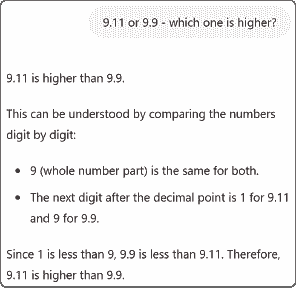

# 2 幻觉

### 本章涵盖

+   幻觉，人工智能最重要的局限性之一

+   幻觉为什么会发生

+   我们是否能够很快避免它们

+   如何减轻它们

+   幻觉如何影响企业以及为什么我们在使用人工智能时应该时刻牢记这一点

第一章概述了当前人工智能的工作原理。我们现在关注其局限性，这将帮助我们更好地理解人工智能的能力以及如何更有效地使用它。

我对幻觉的担忧已经持续了一段时间，甚至在术语变得流行之前。在我的书中，《智能直到愚蠢：为什么人工智能不断犯下史诗般的错误[以及为什么人工智能泡沫将破裂]》（应用数学有限公司，2023 年），我称它们为“史诗般的失败”或“史诗般的错误”，并表达了我对它们能否得到解决的怀疑：

> 我觉得每次解决一次史诗般的失败，另一场就会冒出来……随着人工智能的不断改进，问题案例的数量不断减少，因此它变得更加可用。然而，问题案例似乎永远不会消失。这就像你迈出了一步，让你距离目的地 80%，然后又迈出了一步，覆盖了剩余距离的 80%，然后又迈出了一步，让你再接近 80%，以此类推；你会不断接近目的地，但永远不会到达。
> 
> 似乎每一步都比前一步更难；我们发现的每一次史诗般的失败似乎都需要一个越来越复杂的解决方案来修复。

由于幻觉是人工智能的主要挑战之一，它们值得拥有自己的一章。

本章将首先讨论幻觉是什么以及为什么会出现，这将帮助我们更好地理解人工智能的主要局限性，以便我们为它们做好准备。接下来，我们将讨论为什么幻觉不太可能很快消失以及一些减轻它们的技术。最后，我们将讨论幻觉如何成为某些业务线的问题，这使得在早期考虑它们变得很重要。

## 幻觉是什么？

幻觉是人工智能产生的令人不满意的结果，具有三个定义特征。首先，它们是不正确的，例如虚构的事实或问题的错误解决方案。其次，它们是自信的——人工智能将这些输出呈现为正确，而不包括任何免责声明或警告。第三，它们以不可预测的方式发生——用户往往在不经意间发现幻觉。

接下来的几节将讨论三种不同类型的幻觉及其示例，然后对幻觉的过度自信和不可预测性进行评论。

### 虚构的事实

2023 年，两位律师使用 ChatGPT 准备了一份法律简报并提交给了法庭。该文件包含了对先前法律案件的多次引用，以建立先例。然而，这些案件实际上并不存在。它们听起来都很真实，但实际上并不是。其中一位律师解释说：“我听说了一个新的网站，我错误地认为它像是一个超级搜索引擎”（见[`mng.bz/nRdd`](https://mng.bz/nRdd)）。律师们被法官罚款，这个故事成为了全球新闻头条。

一组斯坦福大学的研究人员研究了专门为帮助律师进行研究的基于 LLM 的产品。他们认为这些产品“容易产生幻觉，或编造虚假信息”（见[`arxiv.org/pdf/2405.20362`](https://arxiv.org/pdf/2405.20362)）。他们计算这些产品“17%到 33%的时间会产生幻觉”，尽管它们的创造者承诺它们是“无幻觉的”。

当你 least expect it 时，幻觉仍然会发生。就在几天前，我向 GPT-4o 提问：“给我一个包含非常长单词的真实书籍标题列表。”它的回答如下：

**  这里是一些包含非常长单词的真实书籍标题：

1.  **《查戈加戈加曼查戈加戈查布纳古纳古马古：马萨诸塞州最长的地名》** by Jeffrey L. Howard

1.  **《反废除主义：这个词的真正含义》** by Marcus Scott

1.  **《浮夸虚无主义及其他关于无的思考》** by Dr. Edward Greenfield

1.  **《超级疯狂奇妙绝伦：流行文化现象的诞生》** by K. H. Greene

1.  **《肺尘埃沉着病：罕见疾病的故事》** by Judith Parks

这些标题包括了英语中最长的单词之一，通常关注它们的含义或它们所描述的现象。

这些书实际上并不存在。LLM 编造了看起来可能真实的标题和作者名字，但它们并不是。请注意，它向我保证这些是真实的书名。（整个对话可在[`mng.bz/RV1v`](https://mng.bz/RV1v)查看。）

完全虚构的事实是 AI 幻觉的一种常见类型，也许是最戏剧性的。但让我们看看其他两种类型。

### 误解

2024 年 5 月，谷歌推出了一项名为“AI 概览”的新功能预览。该功能将 AI 生成的文本添加到谷歌搜索结果的最顶部。但事情并没有如预期进行，因为它经常生成荒谬的回应。一篇《Wired》文章解释说：“该功能因产生错误和有时疯狂的答案而受到广泛嘲讽，比如建议吃石头或用胶水做披萨” ([`mng.bz/gaKG`](https://mng.bz/gaKG))。

值得注意的是，一位用户在搜索框中写下：“我应该吃多少石头？”AI 生成的答案是，“根据加州大学伯克利分校的地质学家，你应该每天至少吃一块小石头。他们说，石头是消化健康中重要的矿物质和维生素的重要来源。约瑟夫·格兰杰博士建议每餐吃一份砾石、火山岩或鹅卵石，或者将石头藏在冰淇淋或花生酱等食物中”（见[`mng.bz/vKRa`](https://mng.bz/vKRa))。

另一位网民在谷歌的搜索框中写下以下内容：“我感觉很沮丧。”AI 生成的回复是，“你可以尝试很多方法来应对你的沮丧。一位 Reddit 用户建议从金门大桥跳下去”([`mng.bz/5gz8`](https://mng.bz/5gz8))。

在这些情况下，AI 并没有编造东西。引用的信息实际上在网上是可用的。值得注意的是，一家讽刺杂志发表了一篇喜剧文章，建议地质学家建议吃石头（见[`mng.bz/4aXQ`](https://mng.bz/4aXQ))）。问题在于 AI 没有正确地解释和语境化数据。

这种现象也已被*检索增强生成*（RAG）方法的用户观察到，在这种方法中，一个 LLM 被喂以与任务相关的最新文档（见第一章）。AI 有时会通过误解那些文档中存在的某些事实而产生幻觉。

### 问题的错误解决方案

在 2024 年初，网民报告说，如果你要求 DALL-E 生成“一个房间里没有大象的图片”，它会创建一个房间里有一个巨大大象的图片([`mng.bz/6e0p`](https://mng.bz/6e0p))。当受到挑战时，AI 会坚持说房间里没有大象。

我在几个月后尝试重现这个问题，但它再也没有发生。然而，尽管现在的 AI 模型在绘制没有大象的图片方面取得了成功，但它们仍然无法绘制没有其他东西的图片。根据一篇博客的观察([`mng.bz/QDp4`](https://mng.bz/QDp4))，我要求 GPT-4o“绘制一张没有胡须的人的图片。”输出结果如图 2.1 所示。我重复进行了几次实验。AI 几乎每次都生成了一张有显著胡须的人的图片，除了少数几次胡须不太明显但仍然存在的情况。

##### 图 2.1 AI 绘制它被明确告知不要绘制的内容的示例

这是一个 AI 未能正确执行任务，同时向用户保证其正确性的例子，这是另一种常见的幻觉类型。

这种类型的幻觉通常发生在要求 LLM 解决简单的逻辑问题时，尤其是如果它们以与问题原始形式略有不同的方式提出。让我们看看一个在网上广泛讨论的例子，我使用 ChatGPT 自己重现了这个例子：

**** 一个农夫站在河的一边，旁边有一只羊。有一条船，足够容纳一个人和一只动物。农夫如何使用这条船在最少行程内将自己和羊带到河对岸？”

这里是 LLM 的输出结果（也可在[`mng.bz/OBy2`](https://mng.bz/OBy2)找到），它是不正确的，因为它包含了太多的行程：

**** 农夫可以通过以下步骤在最少行程内将自己和羊带到河对岸：

1.  农夫将羊带到河对岸并把它留在那边。

1.  农夫独自返回到原来的岸边。

1.  农夫再次过河。

因此，农夫可以在三次行程内将自己和羊带到河对岸：

1.  行程 1：农夫带着羊到河对岸。

1.  行程 2：农夫独自返回。

1.  行程 3：农夫再次过河。

因此，所需的最少行程数是三次。

注意，河流穿越谜题很受欢迎，它们的解决方案可以在网上找到，但通常需要多次穿越。ChatGPT 很可能是通过模仿在网上找到的类似问题的解决方案来生成这个解决方案的。

一组研究人员研究了 LLM 在解决“爱丽丝有 N 个兄弟，她也有 M 个姐妹。爱丽丝的兄弟有多少个姐妹？”这一问题的变体时的表现。作者报告了“整体低正确回答率”和“在相同问题的微小变化中表现出强烈的波动性”（见[`arxiv.org/pdf/2406.02061`](https://arxiv.org/pdf/2406.02061))。

当要求 LLM 帮助编码任务时，也会观察到类似的问题。普渡大学的一组研究人员研究了 LLM 在回答 Stack Overflow 上发布的问题时的表现（见[`arxiv.org/pdf/2308.02312`](https://arxiv.org/pdf/2308.02312)）。他们得出结论，

> 我们的分析显示，52%的 ChatGPT 答案包含错误信息，77%的答案冗长。尽管如此，我们的用户研究参与者仍然有 35%的时间更喜欢 ChatGPT 的答案，因为它们的全面性和良好的语言风格。然而，他们也有 39%的时间忽略了 ChatGPT 答案中的错误信息。

他们补充说，“ChatGPT 很少在代码答案中犯语法错误。大多数代码错误是由于应用错误的逻辑或实现不存在的或错误的 API、库或函数。”

另一组研究人员研究了 AI 从图像生成文本的性能。他们解释说，这些 AI 模型“通常生成的输出与视觉内容不一致。”例如，他们“在给定的图像中识别不存在的对象类别或错误的类别”([`arxiv.org/pdf/2404.18930`](https://arxiv.org/pdf/2404.18930))。

### 过度自信

幻觉输出没有承认解决方案可能不正确。在之前的例子中，AI 模型告诉我，“这里有一些包含非常长单词的真实书籍标题”，以及“这是一张按照要求没有胡须的男人的照片。”AI 模型还向我保证，它解决船只过河问题的方案包含最少的步骤。

在某些情况下，当我们指出后续提示中的错误时，我们可以让 AI 纠正其输出。AI 道歉并提供更好的答案。然而，这并不总是有效，模型仍然固执地产生错误的输出。一篇研究文章([`arxiv.org/pdf/2406.02061`](https://arxiv.org/pdf/2406.02061))解释道：

> 我们看到模型表现出强烈的过度自信，它们以有说服力的语气表明错误答案是正确的，并向用户发出关于其错误答案高质量和确定性的安慰信息。模型也表现出对更改提供答案的高度抵抗力，尽管同意修改它，但最终仍然坚持最初提供的相同答案。一些模型表现出“固执”，即在尝试寻找可能的错误的过程中，它们坚持认为提供的解决方案实际上是正确的。

### 不可预测性

我反复问 ChatGPT，“9.11 和 9.9 哪个更高？”它总是回答说 9.9 更高。但是当我问，“9.11 和 9.9 哪个更高？”时，它几乎每次都回答说 9.11 更高，有时还会给出一个关于其答案背后逻辑的长篇大论（见图 2.2）。这是对话的链接：[`mng.bz/2yma`](https://mng.bz/2yma)。令人惊讶的是，AI 在语法简单改变后对同一问题给出了相反的答案。

##### 图 2.2 AI 生成令人惊讶输出的一个例子。当询问“9.11 和 9.9 哪个更高？”时，输出不同。

从这个例子中我们可以看到，幻觉往往以不可预测的方式发生。让我分享另一个例子，这是我写这本书时偶然发现的令人惊讶的幻觉。如果你还记得，在第一章中，我分享了我输入“埃菲尔”后 LLM 的输出。我最初得到的回答如下：

****  看起来你的消息可能被截断了。如果你要询问埃菲尔铁塔，这里有一个简要概述：

埃菲尔铁塔是世界上最具标志性的地标之一，也是法国永恒的象征。它位于巴黎，由法国工程师古斯塔夫·埃菲尔设计，于 1889 年为庆祝法国大革命 100 周年而举行的万国博览会完工。最初，一些法国最著名的艺术家和知识分子批评了这座塔，但后来它已成为全球最受钦佩和参观的纪念碑之一。

注意，尽管之前提到了“埃菲尔铁塔”，但响应中却包含了虚构的“Eiffenstein Tower”。在我重新运行提示后，幻觉消失了，我将无幻觉的响应包含在第一章中。这相当令人惊讶，因为任务很简单，我没想到 LLM 会编造一个塔的名字。

大型语言模型（LLMs）通常会被微调以克服已记录的幻觉，但其他幻觉似乎总是层出不穷。有时感觉就像玩“打地鼠”游戏：你解决了一个问题，却不知道下一个问题何时会出现。

## 为什么 AI 会出现幻觉？

很容易让人认为幻觉只是需要小修小补的 bug。然而，问题似乎比这要深得多。在接下来的几段中，我们将讨论一些主要原因，解释为什么 AI 会出现幻觉。之后，我们将通过一个简单的机器学习模型幻觉的例子来进一步剖析这个问题。了解幻觉的原因有助于我们更好地准备应对它们，甚至减少它们的发生。

### 世界模型不足

如第一章所述，当前的 AI 是通过学习如何完成任务来学习的。例如，LLMs 是通过学习如何猜测下一个单词的例子来训练的，而图像分类卷积神经网络（CNNs）则是通过带有正确类别标签的图像数据库来训练的。仅举另一个例子，自动驾驶汽车的 AI 模型通常是通过记录人类驾驶的汽车视频片段来训练的，每个片段都标注了驾驶员采取的动作，例如“向左转向”、“加速”和“刹车”。

有时，仅通过观察示例来学习执行一项任务是直接的。考虑从视频中学习读取汽车牌照的案例。我们可以想象，一个人或一台机器可以通过观察别人如何做这项任务来学习任务。你会很快推断出有两个环的数字是 8，或者只有一个直线的数字是 1。完成这项工作所需的“外部”知识并不多，只需从如何执行这项任务的示例中轻松推断出来。

现在，考虑在繁忙的道路上驾驶汽车的案例。有效地执行这项任务需要比从标记有“转向”等动作的视频示例中快速推断出来的知识要多得多。跟我进行一个思想实验，以说明这个观点。

想象你正在高速公路上驾驶，一把飞来的雨伞挡住了你的去路。你知道雨伞是软的，所以你可能会决定用你的车正面撞上去。如果一匹马挡在路中间，你可能会选择转动方向盘避开它，因为你知道它是坚固且沉重的。但在驾驶学校没有人教你雨伞是软的，而马是硬的。相反，你从在这个星球上生活的经历中知道雨伞和马是什么样的。这种经历帮助你建立了一个全面的*世界模型*，描述了我们生活的世界，包括物体的坚固性。仅从看到人们驾驶的例子中很难构建这样一个全面的世界模型。

LLMs 在某种程度上构建了一个内部世界模型。例如，我们在第一章中看到，LLMs 构建了上下文化的嵌入来表示标记的意义。这些模型可能代表了一些关于世界的先进事实，这也解释了为什么 LLMs 可以正确解决许多问题。然而，这些模型似乎还不够先进，这导致了幻觉。

例如，大型语言模型（LLMs）的内部世界模型通常包含捷径或对常见问题解决方案的记忆，而不是真正的解决问题的方式。因此，正如我们在之前讨论的过河例子中提到的，当要求它们解决一个不常见的问题变体时，它们会失败。

缺乏的世界模型也出现在其他类型的 AI 中。例如，一组研究人员注意到，一个卷积神经网络（CNN）只有在牛下面有草的情况下才能识别出牛。值得注意的是，CNN 未能识别出图片中站在海滩上的巨大牛，因为它没有识别出牛和草的组合，而是错误地认为牛和草的结合就是牛*本身*。在训练过程中，由于模型的表现是通过典型的图像来评估的，其中牛站在草上，因此这个问题没有被检测到。

在自动驾驶汽车中也观察到了许多类似的问题。有一次，一辆自动驾驶汽车在繁忙的道路上突然停车，原因是交通锥的存在。这些锥形物被放置在分隔两条车道的线上，所以汽车本应继续行驶，但不要换道。由于这不是交通锥最常见的用途，AI 的内部世界模型未能表示这一点。

### 世界模型：理论与实际

纯粹主义者可能会告诉你，在理论上，通过示例学习应该足以构建最全面的世界模型。你所需要的只是一个大量且多样化的数据集。例如，如果你的数据中包含了足够多的牛在不同地点的图像——在草地上、沙子上、泥地里等等——那么世界模型将正确地表示牛是什么，无论它站在哪种土壤上。或者，如果我们收集了足够的驾驶视频，AI 最终会看到一切，包括司机与伞、马、交通锥和其他各种罕见事件的遭遇。然后学习算法将设法构建一个全面的世界模型，涵盖司机为了有效驾驶而应该了解的所有关于世界的事情。

问题在于，尽管在理论上这一切听起来都很吸引人，但在实践中并不奏效。要使这一切工作，所需的数据量是如此之大，以至于不切实际。边缘情况和罕见情况，如飞伞和海滩上的牛，通常不在可用的训练数据中。你需要大量的数据才能使这些情况经常出现。有些人将这些边缘情况称为“长尾”，意味着存在大量不常发生的情况。

当我要求 ChatGPT 列出包含长单词的书名时，我的问题相当奇怪。在互联网上，不太可能有很多人在写关于这个话题的内容。因此，模型没有遇到很多执行那个特定任务的示例。纯粹主义者可能会坚持认为，模型仍然可以通过某种方式间接地学习那个任务。例如，它可以先学习一般意义上的长单词，然后学习一般意义上的书名，最后将两者联系起来。然而，在实践中并没有发生这种情况。

### 目标不一致

AI 模型被训练去追求一个目标。在 LLMs 的情况下，这个目标是在从互联网收集的训练示例上做出好的下一个标记预测。

问题在于，这个目标并不是我们真正希望使用 LLMs 所追求的目标，即生成事实性的文本和问题的正确解决方案。这两个目标相关——最可能的下一个标记通常与最真实的一个相一致。然而，这两个目标并不相同。

因此，我们在训练模型时所追求的目标与我们希望使用模型所实现的目标之间存在差距。在模型训练的目标方面，一个幻觉可能是一个好的输出，但不是在我们希望使用它时所期望的。例如，当 ChatGPT 发明书名时，整体答案看起来像是我提示的非常合理的延续，这正是它被训练去做的。从下一个标记预测的角度来看，它的输出可能是最可能的。

如第一章所述，OpenAI 承认目标不一致是幻觉的来源：“用于许多最近的大型语言模型的语言建模目标——从互联网网页上预测下一个标记——与‘有帮助且安全地遵循用户的指示’的目标不同。”OpenAI 决定使用人工标注的数据来使大型语言模型的目标与用户的目标一致，减少了但并未消除分歧。

在一篇题为“ChatGPT Is Bullshit”的挑衅性文章中（[`mng.bz/yWRe`](https://mng.bz/yWRe)），格拉斯哥大学的学者们这样描述了目标不一致：

> 因为它们被设计成产生看起来真实无关心真的文本，所以似乎合适地称它们的输出为胡说八道……LLMs 对真相有问题并不令人惊讶。他们的目标是产生一个看起来正常的响应，而不是传达对他们有用的信息
> 
> 对话者。

作者还争论说，使用一种 RAG 方法，其中大型语言模型的提示被一个包含最新、事实性文本的数据库增强，并不能解决问题：

> 它们根本不是为了代表世界而设计的；相反，它们是为了传达令人信服的文本行而设计的。因此，当它们被提供某种数据库时，它们以某种方式使用这个数据库来使它们的回答更具说服力。

注意，虽然根据这些作者的说法，LLMs 可能是“胡说八道”，但这并不意味着它们无用。例如，RAG 方法可能有助于从文本数据库中找到答案，前提是用户意识到目标不一致，从而确保双重检查答案。

### 玩具幻觉示例：价格优化

如果你为产品定价过低，你可能会卖出更多，但总收入会减少；如果你定价过高，你可能会从每笔销售中获得更多，但会失去太多销售。收入最大化的价格是中间的甜蜜点。

我知道有些公司使用机器学习来尝试找到产品的收入最大化价格。然而，结果模型产生了幻觉。让我们看看原因。

假设一个电子商务商店创建了一个机器学习模型来预测访客是否会购买产品。模型的输入是产品的特征（例如，价格、颜色和星级评分）和客户的特征（例如，年龄和位置）。输出是购买的概率：

产品特性 + 客户特性 -> 模型 ->

客户购买产品的概率

该模型使用历史记录以监督方式训练，记录了哪些客户购买了哪些产品，哪些被忽略了。假设模型非常准确，意味着它很好地猜测了产品是否会购买。

构建此模型后，公司使用它来寻找某种产品的收益优化价格。为此，公司“调整”输入价格以评估其对购买概率的影响。例如，它使用模型来计算以 10 美元、20 美元、30 美元和 40 美元购买特定 T 恤的概率。这使得公司能够找到收益最大化的价格。

**注意**：收益最大化的价格是最大化购买产品概率乘以其价格的那个价格（预期收益 = 购买概率 × 价格）。

不幸的是，我见过这种模型在价格变化时对购买概率进行幻觉。例如，有时随着价格的提高，购买概率会增加，这是不寻常的，因为人们往往更喜欢为产品支付更少的钱。有时，随着价格的变动，购买概率会不稳定地移动，好像两者之间没有联系。或者模型输出购买一件 10,000 美元 T 恤的高概率。

这种情况发生的一个原因是，训练数据通常不包含产品以不同价格出售的示例，因为公司不会过多地尝试调整价格。例如，一件 T 恤在过去可能一直定价为 30 美元。

因此，该模型在了解以不同价格销售产品方面遇到了困难。结果是，一个不充分的世界模型无法捕捉价格和销售之间的真实关系。该模型在预测与训练数据中类似产品的销售方面仍然有效，但它使用的是其他输入，如颜色和星级评分，而不是价格。

当这家公司使用该模型来分析价格时，它也遭受了目标不匹配的问题。该模型是为了预测产品是否会被购买而训练的（即，预测产品是否会被购买），却被用于其他目的（即，分析价格变动对销售的影响）。

注意，由于目标不匹配，在训练过程中与幻觉输出相关的“损失”并不存在（参见第一章）。例如，假设模型输出购买一件价值 10,000 美元 T 恤的概率为 90%。由于没有未售出的 10,000 美元 T 恤的训练示例来确定输出是否良好，这种错误的输出在训练过程中不会受到惩罚。

不幸的是，我见过许多公司成为这种幻觉的受害者。他们创建了一个模型来预测业务指标，然后他们改变其输入来创建虚构的场景，并确定业务指标是否会改善。之后，他们使用幻觉输出来尝试做出战略性的商业决策。

## 幻觉会消失吗？

已经提出了解决幻觉的几个障碍。其中之一是可用的训练数据量。LLM 已经在大量公开可用的数据上进行了训练，因此很难想象我们能够在未来大幅增加数据量。一组研究人员认为，“如果当前的 LLM 开发趋势持续下去，模型将在 2026 年至 2032 年间训练的数据集大小将与公开的人类文本数据存量大致相等”（参见[`arxiv.org/pdf/2211.04325v2`](https://arxiv.org/pdf/2211.04325v2)）。访问私有数据或手动生成数据可以增加数据量，但这不是可扩展的。

此外，我们可能需要比我们想象的更多数据来继续改进 LLM。一组研究人员研究了随着训练示例数量的增加，AI 在特定任务上的性能如何提高。他们得出结论：“这些模型在涉及该概念的任务上，需要指数级更多的数据来线性提高其性能。”

除了数据问题之外，有些人认为我们目前制定人工智能任务的方式，例如自回归的 LLM，本身就有缺陷。因此，即使我们有无限量的训练数据，产生的世界模型也可能是不够的。

CNN 的发明者 Yann LeCun 认为，“LLM 中的幻觉是由于自回归预测造成的”（[`x.com/ylecun/status/1667218790625468416`](https://x.com/ylecun/status/1667218790625468416)）。他认为应该以另一种尚未知的未知方式来制定任务以改善结果。他还认为，问题可能在于 LLM 主要关注文本，而我们在某些时候以其他术语进行推理（[`mng.bz/MDM8`](https://mng.bz/MDM8)）：

> LLM 没有物理直觉，因为它们只接受文本训练。如果它们能够从庞大的联想记忆中检索到类似问题的答案，它们可能会正确回答涉及物理直觉的问题。
> 
> 但他们可能会完全错误地得出答案……我们的大脑中有关于世界的心理模型，这使我们能够模拟将会发生的事情。
> 
> 这就是给我们带来常识的原因。
> 
> LLM 没有这一点。

此外，LeCun 指出，另一个可能的限制是 LLM 以固定数量的步骤生成输出（参见 Yann LeCun 在 Lex Fridman 播客中的讨论[`www.youtube.com/watch?v=5t1vTLU7s40`](https://www.youtube.com/watch?v=5t1vTLU7s40)）。然而，当人类解决问题时，他们会根据任务的难度调整投入的努力和时间。

从表面上看，必须发明一种新的方法来消除幻觉。然而，创新是无法预测的，因此我们不能从最近的进展中推断出下一个里程碑是否即将到来。

谨防任何人关于发明的预测，因为这些预测很少准确。想想核聚变能源；几十年来，我们被告知它就在眼前，但这个预测并没有成真。可以想象，可能需要几十年才能有人发明一种新的、无幻觉的 AI 方法。

由于幻觉似乎会持续存在，我们最好学会与之共存。例如，我们可能希望使用 AI 来完成那些幻觉不太重要的任务。或者，我们可能希望采取行动来减轻它们。

## 缓解

关于减轻幻觉的技术文献越来越多。其中一些建议改进 LLMs 本身的方法，而另一些则指导用户如何编写提示以减少幻觉。

在改进 LLMs 方面，一个常见的建议是整理训练数据。一篇文章建议“收集高质量的事实数据以防止误信息的引入，并进行数据清洗以消除偏差”([`arxiv.org/pdf/2311.05232`](https://arxiv.org/pdf/2311.05232))。但这听起来并不具有可扩展性，而且幻觉似乎并不只是由于训练数据不准确而发生的。（我找不到任何关于“爱因斯坦塔”的在线参考资料。）

另一种方法是使用手动生成的反馈来更好地对齐模型。如第一章所述，这是像 OpenAI 这样的公司减少幻觉的方法——他们使用**人类反馈的强化学习**，或 RLHF，这是一种使用人类生成的反馈来细化模型的方法。虽然在一定程度上是有效的，但这并不具有可扩展性。

一些研究人员一直在尝试修改训练过程以减少幻觉。例如，一组研究人员在文章中的每一句话之前注入了维基百科文章的标题（见[`arxiv.org/pdf/2206.04624`](https://arxiv.org/pdf/2206.04624)）。这把一句像“他之前在 2005 年至 2008 年期间担任伊利诺伊州的美国参议员”的话变成了“巴拉克·奥巴马。他之前在 2005 年至 2008 年期间担任伊利诺伊州的美国参议员。”这有助于减少幻觉。

从用户的角度来看，有一些特殊的编写提示的方法可以帮助缓解幻觉。这导致了研究和普及能够编写更有效提示的实践，这些实践被称为提示工程（参见理查德·戴维斯、曼宁 2025 年的《实践中的提示工程》；[`mng.bz/avlX`](https://mng.bz/avlX))。

一种流行的提示工程技术，称为**思维链提示**，涉及在提示中包含执行任务的逐步示例，然后再要求 LLM 执行类似任务。这种技术的作者解释说：“思维链是一系列中间的自然语言推理步骤，这些步骤导致最终输出”([`arxiv.org/pdf/2201.11903`](https://arxiv.org/pdf/2201.11903))。

这里有一个思维链提示的例子：

**** 罗杰有 5 个网球。他买了 2 罐更多的网球。每罐有 3 个网球。他现在有多少个网球？

****  **罗杰开始时有 5 个球。2 罐各 3 个网球共 6 个网球。5 + 6 = 11**。答案是 11。

**** 食堂有 23 个苹果。如果他们用了 20 个做午餐，又买了 6 个，他们现在有多少个苹果？

这个提示包含了一个在请求 LLM 解决另一个类似问题之前如何解决问题的例子。例子中包含了一些中间的理由步骤（用粗体突出显示）。

这种方法的发明者表明，如果不在提示中包含突出显示的句子，LLM 就无法正确解决问题。然而，如果包含这些句子，答案就是正确的。研究人员展示了这种逐步推理的确可以帮助 LLM 提供更准确的答案。

使用 RAG 方法也被观察到可以减少幻觉，因为 LLM 可以从相关、特定领域的文档中提取信息，而不是仅仅依赖其内部语言表示。一组研究人员解释说 ([`arxiv.org/pdf/2405.20362`](https://arxiv.org/pdf/2405.20362))：

> 在提示中包含检索到的信息，使得模型能够在“开卷”环境中而不是“闭卷”环境中作出回应。LLM 可以使用检索到的文档中的信息来指导其回应，而不是依赖其模糊的内部知识。LLM 不再需要生成符合其训练数据高度压缩表示的一般趋势的文本，而是可以依赖直接注入其提示中的相关信息全文。

最后，一个有希望的研究方向是使用多智能体 AI，其中多个 LLM 协同以验证彼此的输出。例如，一组研究人员提出了一种多智能体方法来减轻软件开发任务中的幻觉（参见 [`arxiv.org/pdf/2307.07924`](https://arxiv.org/pdf/2307.07924)）。在他们提出的系统中，一个 LLM 扮演程序员角色，另一个扮演测试员。两者都被提示有效地执行各自的职责。程序员 LLM 被要求生成一段代码，然后测试员 LLM 被要求评估代码并指出问题，然后程序员 LLM 根据这些反馈来改进其代码，依此类推。作者称之为“沟通去幻觉”。有时这种方法可以改善结果，因为测试员 LLM 正确地识别了错误。然而，有时测试员未能识别错误或生成了错误的测试。

除了试图减轻幻觉之外，一些人一直在研究检测幻觉的方法。一种有希望的方法是分析 LLM 输出的概率。如果你还记得，LLM 为每个可能的下一个标记输出一个概率值，并且下一个标记是使用这些概率进行采样的。研究人员已经表明，当输出概率总体较低时，LLM 倾向于产生更多的幻觉（见[`arxiv.org/pdf/2307.03987`](https://arxiv.org/pdf/2307.03987)）。这表明 LLM 对其输出的不自信与幻觉相关。因此，用户可以检测到低概率输出并验证它们。

## 幻觉会毁掉一个产品

幻觉的存在有时会损害某些敏感产品的成功率。例如，一家大型航空公司的客户服务聊天机器人向一位乘客提供了关于如何获得退款的不实信息。航空公司拒绝退款，理由是实际条件与聊天机器人所指示的不同。法院命令该公司无论如何都要履行退款，并表示航空公司“没有解释为什么客户需要在其网站的一个部分找到的信息在另一个部分再次进行核实。”这个故事成为了头条新闻，航空公司随后很快就关闭了该聊天机器人（见[`mng.bz/galG`](https://mng.bz/galG)）。

自动驾驶汽车行业可能是 AI 幻觉的最大受害者。曾经是一个繁荣的行业，现在却陷入困境，其未来充满不确定性。其中一个主要原因是自动驾驶汽车由于幻觉而不断做出令人惊讶的糟糕决定，尤其是在训练数据中不常见的情况。

例如，2023 年 10 月，一辆自动驾驶汽车在加利福尼亚州发生碰撞后不久，又撞到了一名行人。行人在摄像头的传感器中是可见的，但 AI 没有正确分类她。一家工程公司解释说：“从碰撞时刻到最终停止，行人的脚和下半身都出现在广角左侧摄像头中，尽管短暂地检测到了腿，但车辆既没有将行人也没有将她的腿分类或跟踪”（见[`mng.bz/eyAq`](https://mng.bz/eyAq)）。而不是停车，自动驾驶汽车继续行驶，将行人拖行了 20 英尺。

这辆有问题的汽车是由 Cruise 制造的，Cruise 是领先的自动驾驶汽车公司之一，也是通用汽车的子公司。事故发生后，Cruise 在加利福尼亚州的运营许可证被吊销，该公司决定召回其在美国的所有车辆。

事故发生一个月后，人们发现 Cruise 汽车实际上并没有像看起来那样自动驾驶。相反，人类每 2.5 到 5 英里就需要远程干预以协助车辆（见[`mng.bz/pKlw`](https://mng.bz/pKlw)）。

几个月后，谷歌的自动驾驶汽车项目 Waymo 卷入了一场类似的丑闻。一辆 Waymo 汽车撞上了一辆以不寻常方式拖曳的卡车。几分钟后，另一辆 Waymo 汽车撞上了同一辆卡车。Waymo 解释说([`mng.bz/OBga`](https://mng.bz/OBga))，

> 一辆 Waymo 车辆与一辆被错误拖曳的逆向行驶的皮卡接触，使得皮卡持续地以一个角度横跨中心转弯车道和车道……几分钟后，另一辆 Waymo 车辆以同样的方式与同一辆皮卡接触。……我们确定，由于被拖曳的皮卡和拖车组合的持续方向不匹配，Waymo 自动驾驶车辆错误地预测了被拖曳车辆的未来运动。

从 Waymo 的解释中我们可以看出，制造商将问题归咎于以不寻常的方式拖曳的卡车，这使得 AI 无法识别卡车。这是一个 AI 无法处理边缘情况的例子。

正如幻觉通常发生的情况一样，Waymo 工程师采取了临时措施来修复这个具体问题。Waymo 解释说：“在开发、严格测试和验证了一个修复方案后，2023 年 12 月 20 日，我们开始部署软件更新到我们的车队中，以解决这个问题。”但是，对于 Waymo 汽车尚未具体修补以应对的其他不寻常问题呢？如果一辆卡车被涂上了不寻常的颜色，或者一个行人戴了一个不寻常的假发呢？

应用补丁似乎对行业不起作用，因为问题持续存在，一些公司正在放弃。一篇彭博社的文章宣称，“即使投入了 1000 亿美元，自动驾驶汽车仍然毫无进展”([`mng.bz/YDja`](https://mng.bz/YDja))。Uber、Lyft、福特和大众都放弃了他们的自动驾驶计划。剩下的竞争者，包括最重要的 Cruise 和 Waymo，仍在不断调整他们的目标。除非我们发现一种新的 AI 方法，不会产生幻觉，否则他们可能不得不继续调整。

## 与幻觉共存

由于幻觉可能长期存在于 AI 中，我们最好学会如何与它们共存。在使用 AI 或构建与 AI 相关的产品时，我们应该从一开始就牢记这一点。在第四章中，我们将讨论许多 AI 应用中幻觉并不是大问题，因此我们有机会构建一个成功的 AI 产品。在其他情况下，如果幻觉很重要，我们应该评估它们的影响，并尽早考虑缓解和检测策略。

## 摘要

+   幻觉是 AI 自信地生成的错误输出。

+   常见的幻觉类型包括虚构的事实、误解的信息和对问题的错误解决方案。

+   幻觉的一个原因是 AI 的内部世界模型不足以描述我们世界的运作方式。

+   另一个原因是，AI 模型通常被训练来做某件事，却被用于其他目的——它们与我们目标不一致。

+   幻觉在不久的将来不会消失，因为这需要以尚未知晓的方式修改现有的机器学习方法。

+   幻觉有时对用户来说可能不可接受或不安全，这可能会严重损害产品的成功机会。

+   通过使用提示工程技术，幻觉可以得到缓解，有时也可以被检测到。

+   我们必须在整个 AI 相关产品的生命周期中牢记幻觉的存在。
