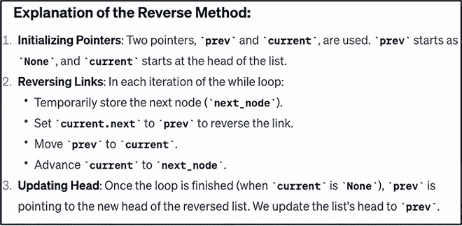
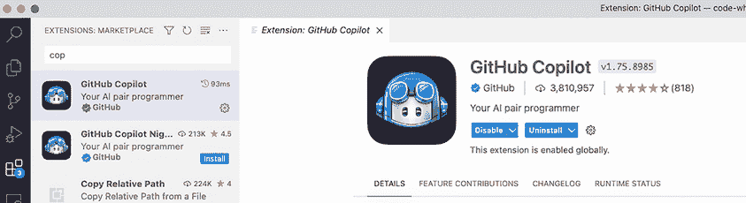

# 2 开始使用大型语言模型

本章涵盖

+   与 ChatGPT 互动

+   学习使用 Copilot 的基础

+   学习使用 CodeWhisperer 的基础

+   探索提示工程模式

+   对比这三个生成式人工智能产品的差异

在本章中，我们将踏上探索生成式人工智能领域的实际之旅，利用三个开创性的工具的力量：ChatGPT、GitHub Copilot 和 AWS CodeWhisperer。随着我们深入这些技术的复杂性，我们将把它们应用于一系列以顶尖科技巨头提出的严格面试问题为模型的有挑战性的场景。无论你是经验丰富的开发者还是好奇的爱好者，都准备好解锁可能让你在下一场技术面试中占据优势的创新策略。准备好将抽象概念转化为 AI 在技术招聘中不断演变角色的前沿的实际解决方案。

我们将首先使用目前可用的两个 ChatGPT 模型：GPT-4 和 GPT-3.5。目的是双重的：它将使我们能够欣赏 ChatGPT 的参与模式，并且它还将让我们建立一个基准，我们可以据此比较和对比其他两个模型。使用两个模型还将使我们能够欣赏这些模型版本之间的代际变革。最后，在本章中，我们将使用一些常见的提示工程模式。

## 2.1 ChatGPT 的初步探索

上下文是与 ChatGPT 一起工作的最重要的方面之一。你之前的*提示*可以极大地改变你当前提示的结果。在 ChatGPT 这样的语言模型中，提示是指提供给模型以生成响应的输入。它可以是一个句子、一个段落，甚至更长的文本。它作为对模型的指令或查询，指导其响应。鉴于提示的质量和模型响应的上下文，始终意识到你当前会话中发出的提示至关重要。因此，每次开始一个新项目时都建议开始一个新的会话。附录 A 将指导你如何设置账户、登录 ChatGPT 以及编写你的第一个提示。

### 2.1.1 使用 GPT-4 导航细微差别

在本节中，我们将努力寻找以下问题的解决方案：“你如何在 Python 中保留一个单链表？”

什么是单链表？

*单链表*是计算机科学中的一个基本数据结构，由一系列元素组成，每个元素存储在一个节点中。通常，单链表由存储数据的节点和指向链表中下一个节点的引用组成。

使用单链表，你只能向一个方向移动。单链表上的常见操作包括插入（添加新节点）、删除（移除节点）、搜索（找到节点）和遍历（按顺序访问每个节点）。

我们将从以下简单的提示开始：

|


| 在我提问时，尽量提出一个更好的问题。作为一名在大学学习计算机科学的实习生，你将如何用伪代码定义单链表？ |
| --- |

好吧，这可能不是一个简单的提示。首先，我们指导 ChatGPT 根据其训练数据增强和重构我们的问题，以便我们得到更好的提示。更好的提示会产生更好的输出。你可能想知道，什么才是更好的提示？这是一个好问题！一般性的提示会产生一般性的结果。具体的提示会产生具体的结果。当我们与大型语言模型（LLMs）以及 ChatGPT 进行交互时，我们将从一般性转向具体性，在过程中不断改进输出。这被称为提示工程中的**细化模式**：迭代地细化或改进提示，以获得更准确、相关或复杂的回应。

提示的第二部分介绍了一种贯穿本书的提示模式：**角色模式**。在提示工程的大背景下，主要与 AI 和 LLMs 相关，角色模式指的是为 AI 设计提示，使其承担一个特定的角色或身份。这种方法可以引导模型以一致和上下文适当的方式回应。使用角色模式的一个关键好处是保持回应的一致性。遵循定义的角色可以使 AI 的回复更加可预测，并与用户的期望保持一致。在这种情况下，我们要求 ChatGPT 扮演一个具有计算机科学背景的实习生的角色。为什么是实习生？我们希望有一个会做工作的角色。

需要重复强调的是，当与 LLMs 合作时，即使应用角色模式，相同的输入也不一定会产生相同的输出。因此，你的输出可能不会与以下内容完全一致，但希望它是相似的。（注意，这些列表是伪代码。）

列表 2.1 ChatGPT 对我们关于反转链表问题的重构

```py
As a computer science intern, how can I define a singly linked list's structure and basic operations using pseudocode? This definition should include the essential components of the list, such as nodes and links, and outline fundamental operations like creating a node, adding a node to the list, and traversing the list.
```

当被问及细化的问题时，ChatGPT 将提供以下代码列表。

列表 2.2 ChatGPT 关于如何反转链表的回答

```py
#Node Structure
class Node
    data
    nextNode

    Constructor(data)
        this.data = data
        this.nextNode = NULL
   #Singly Linked List Structure
class SinglyLinkedList
    head

    Constructor()
        this.head = NULL

    Function AddToFront(data)
        newNode = new Node(data)
        newNode.nextNode = this.head
        this.head = newNode

    Function Append(data)
        newNode = new Node(data)
        if this.head is NULL
            this.head = newNode
            return
        end if

        lastNode = this.head
        while lastNode.nextNode is not NULL
            lastNode = lastNode.nextNode
        end while

        lastNode.nextNode = newNode

    Function Traverse()
        currentNode = this.head
        while currentNode is not NULL
            print currentNode.data
            currentNode = currentNode.nextNode
        end while
```

与 ChatGPT 合作的一个极好的提升生活质量的功能是，它通常会提供关于所讨论代码的文档。图 2.1 是 ChatGPT 提供的文本描述的截图。


图 2.1 ChatGPT 模型 4 对单链表伪代码定义的解释

现在，我们将让 ChatGPT 扮演一个新的角色——计算机科学实习生的角色：

|


| 作为一名具有计算机科学背景的实习生，你将如何使用 Python 编程语言定义单链表的结构和基本操作？这个定义应包括列表的基本组件，如节点和链接，并概述基本操作，如创建节点、将节点添加到列表中以及遍历列表。 |
| --- |

列表 2.3 ChatGPT 在 Python 中实现单链表

```py
class ListNode:
    def __init__(self, value):
        self.value = value
        self.next = None

class SinglyLinkedList:
    def __init__(self):
        self.head = None  # The list initially has no nodes

    def append(self, value):
        """ Append a new node at the end of the list """
        if not self.head:
            self.head = ListNode(value)
            return
        current = self.head
        while current.next:
            current = current.next
        current.next = ListNode(value)

    def prepend(self, value):
        """ Prepend a new node at the beginning of the list """
        new_node = ListNode(value)
        new_node.next = self.head
        self.head = new_node

    def traverse(self):
        """ Traverse the list and print each node's value """
        current = self.head
        while current:
            print(current.value, end=" -> ")
            current = current.next
        print("None")
```

ChatGPT 可能会包含一个示例测试框架来运行此代码。

列表 2.4 基于 Python 实现和运行单链表的方法

```py
# Creating a new linked list
linked_list = SinglyLinkedList()

# Adding nodes to the list
linked_list.append(1)
linked_list.append(2)

# Prepending a node to the list
linked_list.prepend(0)

# Traversing and printing the list
linked_list.traverse()  # Output: 0 -> 1 -> 2 -> None
```

同样，我们可以将角色细化为一个工程职位面试的应聘者。角色的转换将向 ChatGPT-3.5 模型发出信号，表明它应该解释代码以及解决问题的方法：

|


| 你是一名具有计算机科学背景的学生，正在一家软件公司面试工程职位。你被问到以下问题，基于之前定义的单链表（在 Python 中），你将如何编写一个方法来反转遍历方法的输出。你将如何实现这样的方法？ |
| --- |

列表 2.5 ChatGPT 解释如何反转单链表

```py
To implement a method that reverses the output of a traversal method for a singly linked list in Python, you need to reverse the actual links in the linked list. This process involves changing the next reference of each node to point to the previous node instead of the next one. After reversing the links, traversing the list normally will produce the reversed order of elements.

def reverse(self):
        """ Reverse the linked list """
        prev = None
        current = self.head
        while current:
            next_node = current.next
            current.next = prev
            prev = current
            current = next_node
        self.head = prev
```

ChatGPT 可能会输出类似于图 2.2 所示的文本，解释方法和解决问题的方法。



图 2.2 ChatGPT 模型 4 对反转链表伪代码定义的解释

此实现有效地在原地反转单链表，遍历方法将按与原始插入顺序相反的顺序输出元素。

### 2.1.2 使用 GPT-3.5 绘制路径

在本节中，我们将探讨如何利用 ChatGPT-3.5 的能力在 Python 中创建单链表。ChatGPT-3.5 在根据接收到的输入生成类似人类的文本方面表现出色。这使得它成为编码辅助的有价值工具，因为它可以提供逐步指导，提出改进建议，并详细解释复杂的编程概念。

要创建单链表，我们将使用 ChatGPT-3.5 生成必要的 Python 代码。单链表是一种由节点组成的数据结构，其中每个节点包含一个值和指向序列中下一个节点的引用。这种结构特别适用于动态内存分配和高效的插入和删除操作。使用 ChatGPT-3.5，我们可以简化编写单链表代码的过程，确保我们的实现既高效又易于理解。以下示例演示了如何定义 `Node` 和 `LinkedList` 类，初始化列表，并执行基本操作，如插入和遍历。

列表 2.6 ChatGPT-3.5 实现单链表

```py
class Node:
    def __init__(self, data):
        self.data = data
        self.next = None

class LinkedList:
    def __init__(self):
        self.head = None

    def prepend(self, data):
        new_node = Node(data)
        new_node.next = self.head
        self.head = new_node

    def append(self, data):
        new_node = Node(data)
        if not self.head:
            self.head = new_node
            return
        current = self.head
        while current.next:
            current = current.next
        current.next = new_node

    def display(self):
        current = self.head
        while current:
            print(current.data, end=" -> ")
            current = current.next
        print("None")

    def reverse_and_display(self):
        prev = None
        current = self.head
        while current:
            next_node = current.next
            current.next = prev
            prev = current
            current = next_node
        self.head = prev

        current = self.head
        while current:
            print(current.data, end=" -> ")
            current = current.next
        print("None")

# Example usage:
if __name__ == "__main__":
    linked_list = LinkedList()

    linked_list.append(1)
    linked_list.append(2)
    linked_list.append(3)

    linked_list.prepend(0)

    linked_list.display()
    linked_list.reverse_and_display()
```

您可以在任一方向应用角色模式：您可以告诉大型语言模型（LLM）以某个角色中的人或事物的身份回应，或者您可以要求 LLM 假设您是某个角色。这在您需要用简化的术语解释一些代码或试图理解复杂或复杂主题时非常有用。例如，我们可以使用以下提示让 ChatGPT 以简化的方式向我们解释我们的代码：

|


| 假设我是一个成年人，已经从大学毕业，获得了传播学学位。我没有计算机科学方面的经验。你会如何向我解释那个方法？ |
| --- |

让我们看看 ChatGPT 会如何向没有计算机科学背景的人解释我们的方法。

列表 2.7：为非计算机科学家解释 ChatGPT

```py
Certainly! Let's break down the reverse_and_display method in a way that doesn't involve technical jargon or computer science concepts.

Imagine you have a set of books on a bookshelf, and each book has a bookmark pointing to the next book in the shelf. This set of books represents our linked list, and the bookmarks represent the next connections between the items.

Getting Ready: You start at the first book (the head of the linked list) and have two empty hands: one to remember the book you just read (prev) and another to hold the book you are currently reading (current). There's also an empty placeholder (a table, perhaps) to help you temporarily remember the next book.

Changing the Order: Now, let's change the order of the books. For each book (node) you read:
a. Use the bookmark (the next reference) to find out where the next book is and put it on the empty placeholder (the table). This is like making a note of where the next book is located.
b. Turn the bookmark in the current book around, so it now points to the previous book. This means that the current book is now connected to the book you just read instead of the next book. It's like flipping the bookmark.
c. Swap the books in your hands: Put the book you just read (prev) in your left hand (so you remember it for the next iteration) and put the book you are currently reading (current) in your right hand (so you can work on the next book).
d. Walk to where you put the next book (the one on the table) to continue the process.

Starting Over: Keep doing this until you run out of books to read. At this point, your right hand will hold the last book (the first book initially), and your left hand will be empty. Now, you put the first book you're holding (the last book in the original order) back on the shelf as the new first book.

Reading Backward: Finally, go through the books starting from the new first book, and follow the bookmarks in the reversed direction. As you read each book, you say its title out loud. This will give you the titles of the books in reverse order.

So, the reverse_and_display method essentially changes the order of the books (nodes) in the bookshelf and then reads the titles (data) of those books in the reversed order.
Bottom of Form
```

当你使用反向的 Persona 模式时，在提示工程的环境中通常被称为*受众 Persona 模式*。这指的是为特定应用或用例预定义的受众档案或表示。它有助于调整由大型语言模型（LLM）生成的响应，以更好地满足特定用户群体或个人的需求和期望。在我们继续讨论 GitHub CoPilot 之前，让我们比较每个模型的输出质量。

### 2.1.3 在 AI 海洋中导航：从 GPT-3.5 的岸边到 GPT-4 的地平线

这两个模型输出之间的一个显著差异在于它们输出的复杂性和透明度，尤其是在这些模型如何与数据结构交互和修改方面。GPT-3.5 和 GPT-4 所采用方法的差异凸显了人工智能生成代码向更高清晰度和可预测性转变的更广泛趋势。随着人工智能模型变得更加先进，它们的输出越来越多地反映了良好的编程实践细微差别，这与人类程序员技能和敏感性的演变相呼应。这种演变对于人工智能成为软件开发中可靠的合作伙伴至关重要，在软件开发中，清晰度和精确性不仅是理想，而且是必需的。

在 GPT-3.5 中，`reverse_and_display`方法在执行过程中有些不透明。这个模型版本改变了链表的基本数据结构，实际上反转了节点。然而，它并没有明确向用户发出这种变化的信号。从开发者的角度来看，这可能导致意外的副作用。例如，如果我们假设只是显示反转后的列表而调用`reverse_and_display`，我们会发现原始的列表结构已经被永久改变。这种操作的不透明性很容易导致混淆和错误，尤其是在原始数据结构完整性至关重要的更复杂应用中。

相比之下，GPT-4 使用其 `reverse` 方法展示了更为精细的方法。这个方法明确地反转了链表，任何经验丰富的程序员都可以从方法的名字和结构中推断出它将修改底层的数据结构。GPT-4 的方法更符合清晰和可维护的代码原则。它体现了每个函数或方法应该执行一个定义良好的任务的观念。关注点的分离在这里是明显的：列表的反转和显示被视为不同的操作。这增强了代码的可读性，并减少了意外副作用的可能性，因为开发者完全清楚对数据结构所做的更改。

## 2.2 让 Copilot 掌控全局

现在，让我们使用 GitHub Copilot 来解决相同的问题。附录 B 中有创建账户和将插件安装到您喜欢的集成开发环境（IDE；假设您的 IDE 是 VS Code 或 PyCharm）的说明。一旦您完成安装，您应该在您的 IDE 中创建一个新的项目。首先，创建一个名为 main.py 的新文件。在这个文件的开始处，输入以下注释/提示：

```py
# You are a student with a background in computer science who is interviewing for an engineering job at a software company. You are asked the following question: based on the previous definition of a singly linked list (in Python), how would you write a method that would reverse the output of the traversal method? How would you implement such a method?
```

注意开头的哈希字符；它表示 Python 注释。特别有趣的是，我们在 ChatGPT 和 GitHub Copilot 中使用了相同的提示。

接下来，请注意，当你开始输入 `ListNode` 类的定义时，Copilot 将提供代码建议。这是内联模式的互动。或者，你可以通过按 Ctrl-Enter 激活交互式模型，让 Copilot 根据当前上下文生成最多 10 个建议。

注意：在整个书中，我们将主要使用内联模式，其中你使用 Tab 键接受给定的建议。

你可能会得到类似于 ChatGPT 创建的源代码的代码。让我们尝试一个稍微不同的编程挑战，而不是重新打印上一节中的相同代码。我们将向 Copilot 提出以下要求：

```py
# Given an unsorted array of integers, write a function to find the kth smallest element in the array. Can you discuss the time and space complexity of your solution?
```

几次换行后，Copilot 应该添加一些注释来讨论这段代码的时间复杂度和空间复杂度以及一般问题。真令人着迷！

列表 2.8 ChatGPT 计算并报告这段代码的复杂度

```py
def kth_smallest_element(arr, k):
    # Time Complexity: O(N)
    # Space Complexity: O(1)
    if k > len(arr):
        return None
    return sorted(arr)[k - 1]
```

Copilot 的建议是值得称赞的，并且完全合理，但在面试中可能不太可能是一个可接受的答案。它感觉像是在作弊。我们应该期待会有一个后续问题，询问如何在不需要对整个列表进行排序的情况下完成这个任务。让我们完善提示，确保在取第 *k* 个元素之前不排序列表：

```py
#As a computer science graduate seeking a software engineering role, imagine you are in an interview where you are presented with a problem: 'How would you implement a function in Python to determine the kth smallest element within an unsorted array of integers, without resorting to full array sorting or utilizing any built-in sorting functions? Additionally, can you explain the time and space complexity of your algorithm?' This question tests your ability to devise efficient algorithms and your understanding of complexity analysis, all while adhering to specified constraints.
```

Copilot 提供的代码看起来非常类似于二分查找，这当然是一个有趣的选择。

列表 2.9 Copilot 解决第 *k* 个元素问题的方法

```py
# The following code demonstrates an implementation of the kth smallest element function in Python, along with an explanation of its time and space complexity.

# Function to determine the kth smallest element in an unsorted array
def kth_smallest(arr, k):
    # Check if the input array is empty or if k is out of bounds
    if not arr or k < 1 or k > len(arr):
        return None

    # Initialize variables to store the lower and upper bounds of the array
    low = min(arr)
    high = max(arr)

    # Perform binary search to find the kth smallest element
    while low <= high:
        # Calculate the middle element of the array
        mid = low + (high - low) // 2

        # Count the number of elements less than or equal to the middle element
        count = sum(1 for num in arr if num <= mid)

        # Adjust the search range based on the count
        if count < k:
            low = mid + 1
        else:
            high = mid - 1

    # Return the kth smallest element
    return low

# Time complexity: O(n log(max(arr) - min(arr)))
# Space complexity: O(1)
```

## 2.3 让 CodeWhisperer 大声说话

在我们开始使用 CodeWhisperer 之前，我们应该禁用 Copilot。点击扩展选项卡，搜索 Copilot。一旦找到它，点击禁用按钮。您需要重新启动应用程序。当应用程序重新启动后，您就可以开始使用 CodeWhisperer。如果您需要安装或配置 CodeWhisperer 的帮助，请参阅附录 C。一旦插件安装完成，并且您已登录到您的开发者账户，创建一个名为 asset.py 的文件。图 2.3 展示了如何定位和禁用此插件。



图 2.3 在我们可以切换到 CodeWhisperer 之前，我们必须禁用 Copilot。我们在扩展选项卡中关闭了扩展。

我们将使用与 Copilot 相同的提示。这里重新打印出来以方便查阅：

```py
#As a computer science graduate seeking a software engineering role, imagine you are in an interview where you are presented with a problem: 'How would you implement a function in Python to determine the kth smallest element within an unsorted array of integers, without resorting to full array sorting or utilizing any built-in sorting functions? Additionally, can you explain the time and space complexity of your algorithm?' This question tests your ability to devise efficient algorithms and your understanding of complexity analysis, all while adhering to specified constraints.
```

CodeWhisperer 提供的代码实现了快速选择算法，该算法与快速排序算法密切相关。快速选择算法专门设计用于高效地在一个未排序的数组中找到第 *k* 个最小的元素。

列表 2.10 CodeWhisperer 解决第 *k* 个元素问题的方法

```py
def partition(arr, low, high):
    pivot = arr[high]
    i = low - 1
    for j in range(low, high):
        if arr[j] <= pivot:
            i += 1
            arr[i], arr[j] = arr[j], arr[i]
    arr[i + 1], arr[high] = arr[high], arr[i + 1]
    return i + 1

def quickselect(arr, k, low=0, high=None):
    if high is None:
        high = len(arr) - 1
    if low < high:
        pivot = partition(arr, low, high)
        if pivot == k:
            return arr[k]
        elif pivot > k:
            return quickselect(arr, k, low, pivot - 1)
        else:
            return quickselect(arr, k, pivot + 1, high)
    return arr[low]

# Usage Example
arr = [5, 2, 4, 6, 1, 3]
k = 2
print(quickselect(arr, k))
# Output: 2
```

Copilot 和 CodeWhisperer 生成的代码之间存在一个有趣的区别。CodeWhisperer 将 `k` 解释为排序数组中元素的索引。由于大多数编程语言中的数组索引从 0 开始，如果 `k` 是 2，CodeWhisperer 将找到第三小的元素（因为索引 0、1 和 2 分别对应于第一个、第二个和第三个最小的元素）。另一方面，Copilot 假设 `k` 指的是元素的排名，而不是索引。因此，如果 `k` 是 2，Copilot 将返回数组中的第二个最小的元素。这类似于说“第二名”而不是“索引 2”。

在本节中，我们将 AWS CodeWhisperer 引入讨论。像其前辈一样，CodeWhisperer 能够生成解决该问题的代码，强化了 AI 在软件开发中的变革潜力。

由于这些工具生成的代码具有显著的相似性，一个有趣的问题自然产生：这些产品真正是如何比较的？考虑到每个工具的独特优势和局限性，答案可能不像您想象的那么简单。

在下一节中，我们将深入探讨这个问题，比较这三个工具——ChatGPT、Copilot 和 AWS CodeWhisperer——以了解它们的独特功能、最佳用例以及它们如何可能重塑软件开发的未来。我们的目标是提供一份全面的指南，帮助软件开发者在这个快速发展的 AI 驱动工具领域中导航。

## 2.4 比较 ChatGPT、Copilot 和 CodeWhisperer

我们将考虑的第一个维度是参与模型：我们如何与 AI 互动。在 ChatGPT 的情况下，我们登录到聊天网站，并在聊天输入框中输入提示。然后我们在后续的提示中细化我们的要求。反馈循环从先前的提示中获取上下文，将其应用于当前提示，并生成用户反应和重新触发的输出。如果我们将这种参与模型与 Copilot 和 CodeWhisperer 的参与模型进行对比，我们会注意到后两种工具在 IDE 内部工作。我们无法在 IDE 之外使用它，尽管我们可能尝试过。这种方法本身并不低劣；它只是不同而已。

Copilot 和 CodeWhisperer 让你留在 IDE 中的方式可以被视为一种优势而不是缺陷。在后面的章节中，我们将熟悉 Copilot Chat，这是两者的最佳结合：ChatGPT 和 GPT-4，全部都在你的 IDE 中。这些工具让你在代码中保持专注，不受干扰的时间更长。无干扰工作是提高生产力的关键之一。Copilot 和 CodeWhisperer 擅长为你清除障碍，防止你切换上下文，让你摆脱干扰，并让你保持流畅状态的时间更长。他们做得很好。你与 ChatGPT 进行对话；Copilot 和 CodeWhisperer 为你提供建议。对话可能需要更长的时间；建议来得快且免费。

接下来，我们将检查代码是如何呈现和生成的。ChatGPT 可以将代码作为一个块、方法、类或项目来创建。如果被要求，ChatGPT 会故意揭示项目。但它在幕后确实创建了项目。毕竟，ChatGPT 喜欢说话。与 Copilot 和 CodeWhisperer 一起，代码至少最初是一行一行地展开的。随着你更频繁地使用这些工具，你会注意到它们可以为给定的类编写越来越多的代码。但不幸的是，它们不能通过微小的提示来编写整个项目。

它们共同拥有的一个特点是它们对提示的反应能力。在 ChatGPT 中，提示是唯一与工具互动的方式。在 Copilot 和 CodeWhisperer 中，对提示的反应不是严格必要的，但编写这样的提示会使输出更接近你最初的想法。

结合这些因素，你可能会得出结论，ChatGPT 是探索和原型设计的绝佳选择。然而，ChatGPT 可能会引入不必要的干扰，部分原因是因为你已经离开了 IDE，现在在一个带有所有伴随诱惑的网页浏览器中。ChatGPT 本身也是引入不必要的干扰的一部分。你最终可能会陷入俗语中的兔子洞。这个工具让你太容易不做这件事了。不要让这吓到你。这是一个美丽的资源。

Copilot 和 CodeWhisperer 要求你心中有一个期望的结果。因此，这些工具非常适合当你想要全力以赴，按照精确的要求和紧迫的截止日期进行编码时。当你了解语言和框架时，Copilot 和 CodeWhisperer 的工作效果最佳。它们可以自动化许多繁琐的工作，让你能够专注于业务需求，这些需求增加了价值，也可能是你最初编写软件的原因。图 2.4 简要总结了所有三个生成式 AI 的优点和局限性。


图 2.4 ChatGPT、Copilot 和 CodeWhisperer 的优缺点比较

在本章中，我们经历了很多，实现了基本的数据结构，并解决了一些经典的计算机科学问题。本章的工作是基础性的，使我们能够更好地判断何时使用 ChatGPT，而不是使用其他以 IDE 为中心的工具，如 Copilot 和 CodeWhisperer。在随后的章节中，我们将利用这些知识来选择最合适的工具。

最后一点：这些工具在协同工作时效果最佳。例如，ChatGPT 是一个出色的工具，用于示例和结构。Copilot 和 CodeWhisperer 允许你扩展和自定义代码。

## 摘要

+   ChatGPT 是一种基于提示的生成式 AI，通过与用户进行对话来帮助他们探索想法，以帮助设计和开发整个项目。此外，ChatGPT 巧妙地为它所编写的每个方法生成文档。我们之所以在章节开始时使用它，其中一个原因就是它帮助我们定义了一个在章节剩余部分使用的模板。这是一个令人着迷的产品，它可能导致不必要的但令人愉快的分心。

+   Copilot 和 CodeWhisperer 是专注型工具，当你知道你想做什么并需要关于如何最好地完成它的建议时，它们的效果最佳。你与这些工具的互动方式非常相似，结果也是如此。

+   ChatGPT（截至本文写作时）不支持在 IDE 中进行开发。然而，与 GitHub Copilot 和 AWS CodeWhisperer 不同，它能够生成整个项目，并且能够轻松地将代码从一种编程语言翻译成另一种。Copilot 和 CodeWhisperer 会从你的注释中获取提示，以推断你想要编写的代码。使用 ChatGPT 时，你需要明确写出 ChatGPT 用来创建代码的提示。

+   个性模式的目的是为 AI 设计提示，使 AI 承担一个特定的个性或角色，从而以一致和情境适当的方式引导模型的响应。通过遵循定义好的个性，AI 的回复变得更加可预测，并与用户的期望保持一致。

+   实习生的角色通常被描述为渴望学习，对所在领域的知识具有基础到中级水平，并且愿意承担各种学习与经验积累的任务。实习生可能会提出澄清问题，寻求指导，并展现出积极主动的解决问题的态度。他们通常很机智，但可能缺乏该领域经验更丰富的专业人士的深厚专业知识。这种角色在 AI 需要模拟一个以学习和成长为导向的心态的场景中非常有用。

+   精炼模式涉及迭代地精炼或改进提示，以获得更准确、相关或复杂的响应。这关乎从一般到具体，随着与像 ChatGPT 这样的大型语言模型的交互进展，不断提升输出质量。

+   受众角色模式是提示工程中角色模式的一种变体。它涉及定义特定应用或用例的目标受众的档案或代表，这有助于调整由 LLM（大型语言模型）生成的响应，以更好地满足特定用户群体或个人的需求和期望。
