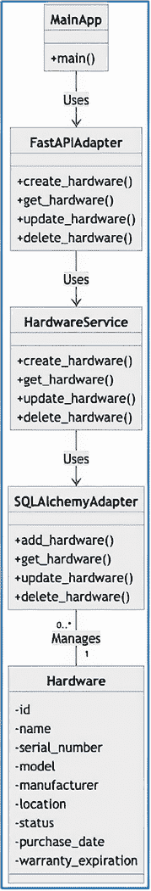
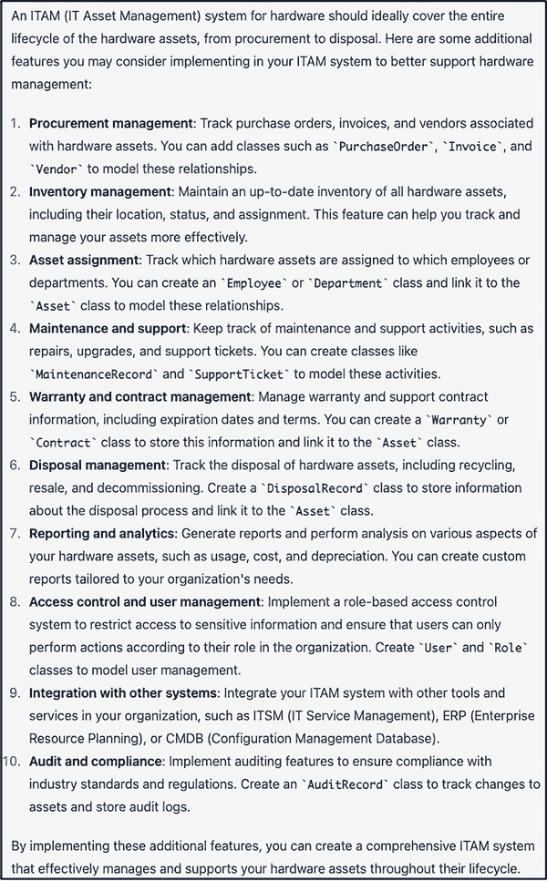
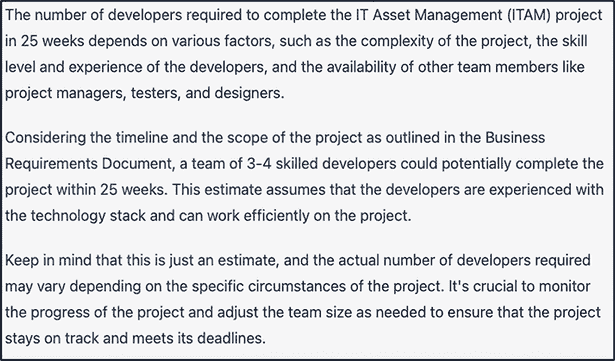
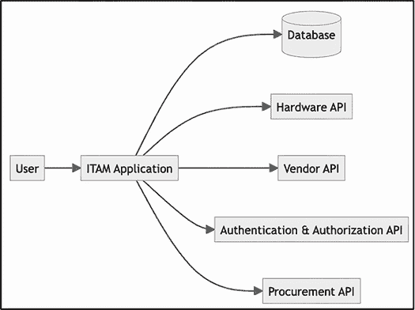
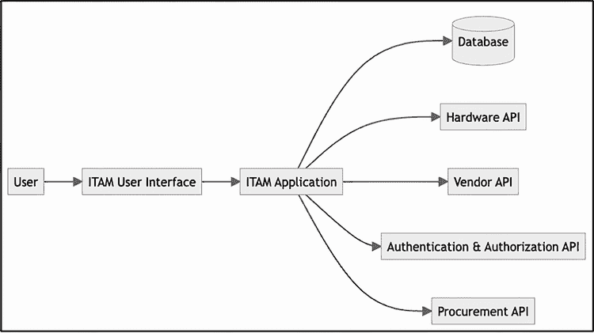
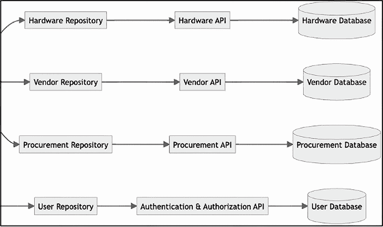
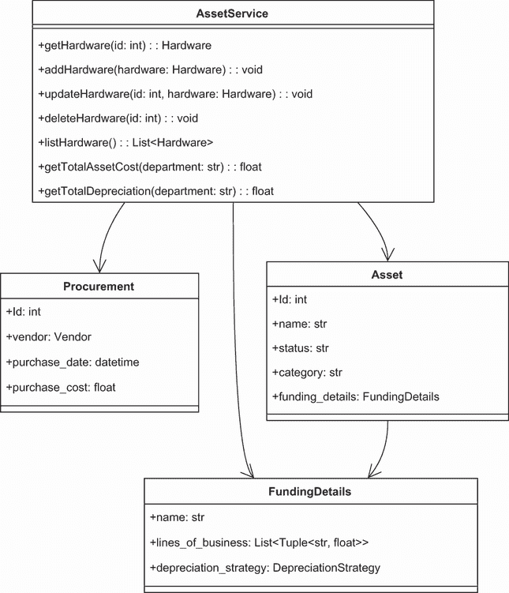

# 3 设计与 ChatGPT 的软件

本章涵盖

+   使用 ChatGPT 原型设计潜在的设计

+   使用 Mermaid 记录我们的架构

+   使用 ChatGPT 完成我们的设计

现在我们对何时以及如何使用生成式 AI 有了直觉，我们将开始设计、探索和记录我们应用程序的架构。提前布局一些关键组件在几个方面都有益。例如，它允许我们将一些设计委托给子架构师或一些开发工作委托给其他团队成员。提前设计还将帮助我们澄清我们对实施的思考，使我们能够预见并避免一些陷阱。最后，将设计作为文档捕获使我们能够证明我们关键的设计决策，向我们的未来自己、利益相关者和可能继承项目的人传达我们的意图。

首先，让我们概述一下本章将要设计的应用：*信息技术资产管理*（ITAM）系统。我们将在后续章节中构建关键特性。

## 3.1 介绍我们的项目，信息技术资产管理系统

ITAM 系统是一种用于在整个生命周期中管理和跟踪硬件设备、软件许可证和其他 IT 相关组件的工具。ITAM 系统通常包括硬件和软件库存工具、许可证管理软件以及其他相关软件应用。该系统还可能涉及使用二维码、条形码或其他物理资产管理技术进行手动过程和物理跟踪 IT 资产。

通常，ITAM 系统将有一个集中式数据库，该数据库存储特定于资产类型的资产标识符和属性。例如，您可能存储桌面 PC 的设备类型、型号编号、操作系统和已安装的应用程序。对于软件，您可能存储应用程序的名称、供应商、可用的许可证数量以及已安装软件的计算机。后者确保您的组织遵守所有许可证限制。通过监控使用情况，您不应超过您已购买的许可证数量。

ITAM 系统还赋予控制成本的能力。因为您始终知道您有什么软件和硬件可用，所以您不应需要做出任何不必要的购买。这些系统集中采购，这有助于批量采购。未使用的硬件可以出售；未充分利用的硬件的工作负载可以合并。此外，正如您将看到的，您可以使用购买日期信息来计算硬件的折旧价值，并将此价值应用于您组织的税收。

我们将探索 ITAM 系统的更多功能，构建一个以跟踪和管理硬件为重点的应用程序稳固的概念模型。接下来，让我们要求 ChatGPT 扮演软件架构师的角色，征求其对如何最好地设计这个项目的意见，并看看它能提出什么解决方案。

## 3.2 要求 ChatGPT 帮助我们进行系统设计

在一个新的会话中，我们将从一个概述我们需求的提示开始。与上一章一样，我们将应用细化模式来迭代地改变我们系统的设计。我们将从广泛开始，随着我们的进展，深入到需求和功能。首先，我们将让 ChatGPT 使用这个提示来改进我们的提示：

|


| 从现在起，当我给你一个提示时，输出一个更好的提示。 |
| --- |

当你开始探索当前任务时，这个提示很有用，因为它指示 ChatGPT 为你创建更好的提示。正如你所知，提示越好，输出越好。这将成为我们前进的启发式方法：当你需要特定答案时，你就提出一个具体的问题。此外，你可以要求 ChatGPT 逐步推理问题，并指定其推理过程。

接下来，我们将要求 ChatGPT 开始使用这个（扩展的）提示来协助我们进行设计：

|


| 假设你是一名软件架构师，你正在使用 Python 设计一个信息技术资产管理系统。该系统应能够维护一个组织拥有的所有硬件和软件资产的全套清单。系统应能够跟踪资产的位置、状态和使用情况。这包括诸如谁使用该资产、最后一次维护时间以及何时需要更换的信息。系统应能够管理资产的全生命周期，从采购到报废。这包括跟踪保修和租赁信息、管理资产维护和维修，并确保符合法规。系统应能够将资产分配给员工或部门，跟踪使用情况，并管理对需求量大的资产进行预订。它应使用六边形架构。请记住，要增强我的提示。 |
| --- |

注意，在这个提示中，我们回到了角色模式，要求 ChatGPT 扮演软件架构师的角色。ChatGPT 将不仅输出我们系统的整体功能，还会说明我们如何改进初始提示。如果我们输入这个提示，我们将得到以下列表中显示的结果。一个重要的提醒：ChatGPT（以及任何生成式 AI）的输出非常依赖于之前的内容，所以你的输出可能不会与以下输出完全一致。

列表 3.1 由 ChatGPT 描述的增强提示和应用程序概述

```py
To enhance and detail your prompt for designing an information technology asset management system using Python with a hexagonal architecture, here's a more comprehensive breakdown:

System Objective and Core Functionality:
Design a Python-based IT asset management system.
Ensure the system maintains a full inventory of all organizational hardware and software assets.

Detailed Asset Tracking:
Implement features for tracking the location, status, and usage of each asset.
Include detailed logs for user assignments, service histories, and replacement schedules.

Lifecycle Management:
Enable management of assets from procurement to disposal.
Track warranty and lease information, schedule maintenance and repairs, and ensure regulatory compliance.

Asset Allocation and Usage Monitoring:
Facilitate asset allocation to employees or departments.
Monitor usage patterns and manage reservations for high-demand assets.

Architectural Approach:
Adopt a hexagonal architecture to promote loose coupling and ease of maintenance.
Ensure modularity in design for easy scalability and updates.

Additional Features and Considerations:
Incorporate user-friendly interfaces for different stakeholders.
Implement robust security measures to protect sensitive asset data.
Consider integration capabilities with existing systems within the organization.

This detailed breakdown provides a comprehensive guide for designing the system with all necessary features and a robust architectural framework.
```

经过一番思考，ChatGPT 将返回开发此项目所需执行的高级步骤。这些建议很有帮助，但我们在这里是为了解决空文件问题：我们想要开始设计。我们想要文本和图表帮助我们理解系统的组件级别。我们需要任务，而不是食谱。我们可以用以下提示让 ChatGPT 展示其工作：

|


| 显示此应用的 Python 包结构。 |
| --- |

在这个提示下，ChatGPT 将生成并返回一个包图（此列表略有缩减），展示它不仅能够设计软件，还能帮助我们布局物理文件。我们可能（也可能不）对整体包结构有所争议，但这将为我们提供足够的灵感开始工作。

列表 3.2 ChatGPT 创建的资产管理系统包结构

```py
it_asset_management/
│
├── app/                       # Main application directory
│   ├── __init__.py
│   ├── main.py                # Entry point of the application
│   ├── config.py              # Configuration settings
│   └── dependencies.py        # Dependency injection and management
│
├── domain/                    # Domain layer with business logic
│   ├── __init__.py
│   ├── models/                # Domain models (e.g., Asset, User)
│   │   ├── __init__.py
│   │   ├── asset.py
│   │   └── user.py
│   ├── services/              # Business services/logic
│   │   ├── __init__.py
│   │   ├── asset_service.py
│   │   └── user_service.py
│   └── repositories/          # Interface for data access
│       ├── __init__.py
│       ├── asset_repository.py
│       └── user_repository.py
│
├── adapters/                  # Adapter layer for external interactions
│   ├── __init__.py
│   ├── orm/                   # Object-relational mapping
│   │   ├── __init__.py
│   │   ├── asset_orm.py
│   │   └── user_orm.py
│   ├── api/                   # API endpoints
│   │   ├── __init__.py
│   │   ├── asset_api.py
│   │   └── user_api.py
│   └── external_services/     # Integration with external services
│       ├── __init__.py
│       ├── email_service.py
│       └── logging_service.py
│
├── infrastructure/            # Infrastructure layer for database, messaging, etc.
│   ├── __init__.py
│   ├── database.py            # Database setup and connection
│   ├── message_queue.py       # Messaging infrastructure
│   └── cache.py               # Caching mechanisms
│
├── tests/                     # Test suite
│   ├── __init__.py
│   ├── unit/                  # Unit tests
│   └── integration/           # Integration tests
│
└── requirements.txt           # Project dependencies
```

我们可以检查宏观层面，并要求 ChatGPT 也提供微观层面的内容。我们可以创建提示让 ChatGPT 按顺序显示每个文件的內容，并尽职尽责地将内容复制到与 ChatGPT 建议的文件名相同的文件中。但我们应该始终仔细检查 ChatGPT 的工作，永远不要假设它是 100%安全或准确的。你偶尔会发现 ChatGPT 生成的代码无法运行——ChatGPT 专注于生成下一个标记，而不是像我们一样思考系统。话虽如此，我们应该快速查看它生成的代码，以评估其质量并确定其有用性：

|


| 请显示它 _asset_management/app/schemas/asset.py 的源代码。 |
| --- |

以下列表显示了结果。

列表 3.3 asset_management_system/models/asset.py 中的示例`Asset`模型

```py
from typing import Optional
from datetime import datetime
from pydantic import BaseModel

# Basic Asset model used for creating a new asset
class AssetCreate(BaseModel):
    name: str
    asset_type: str
    serial_number: str
    purchase_date: Optional[datetime] = None
    warranty_end_date: Optional[datetime] = None

# Model for asset data that is publicly exposed
class Asset(BaseModel):
    id: int
    name: str
    asset_type: str
    serial_number: str
    purchase_date: Optional[datetime] = None
    warranty_end_date: Optional[datetime] = None

    class Config:
        orm_mode = True

# Model for updating existing asset data
class AssetUpdate(BaseModel):
    name: Optional[str] = None
    asset_type: Optional[str] = None
    serial_number: Optional[str] = None
    purchase_date: Optional[datetime] = None
    warranty_end_date: Optional[datetime] = None        
return '<Asset %r>' % self.name
```

而不是逐个课程地走，浏览每个课程的源代码，我们将记录整个项目。尽管敏捷和 Scrum 强调工作软件胜过全面的文档，但深思熟虑的设计和基本文档的作用不容小觑。它们为敏捷开发过程带来结构、清晰性和长期愿景，确保团队能够有效地应对变化，同时保持软件的完整性和质量。

## 3.3 记录你的架构

在本节中，我们将让 ChatGPT 开始记录我们应用程序的设计。如前所述，应用程序设计和文档对于软件架构师和软件项目至关重要，即使在敏捷和 Scrum 环境中也是如此。文档为开发团队提供了清晰的愿景和方向，概述了系统中的架构、组件和交互，帮助开发者理解如何正确和高效地实现功能。它鼓励遵守质量标准和最佳实践，允许架构师在整个开发过程中定义应遵循的模式和实践，从而实现更健壮和可维护的代码库。

在本节中，我们将使用 Mermaid 图形语言。Mermaid 是一个基于 JavaScript 的图形和图表工具，允许您使用简单的基于文本的语法创建复杂的图表和可视化。它被广泛用于生成流程图、序列图、类图、状态图等，直接从文本中生成。Mermaid 可以集成到各种平台中，包括 Markdown、维基和文档工具，这使得它对开发者和文档编写者来说非常灵活。由于 Mermaid 图表只是文本，因此它与像 ChatGPT 这样的文本生成工具配合得很好。

我们将使用以下提示让 ChatGPT 开始记录：

|


| 我想构建一个用 Python 编写的 ITAM 项目。它将专注于硬件的跟踪和管理。它应该使用 FastAPI 暴露 REST API，并使用 SQLAlchemy 持久化数据。它应该使用六角架构。作为一名软件架构师，请向我展示这个项目的 Mermaid 类图。" |
| --- |

六角架构

六角架构，也称为端口和适配器模式，是一种旨在在应用程序的核心逻辑与其与外部系统（如数据库、用户界面和第三方服务）交互之间创建清晰分离的架构模式。这种关注点的分离有助于实现更易于维护、灵活和可测试的应用程序。

六角架构的主要组件如下：

+   *领域模型*—应用程序的核心业务逻辑，包括实体、值对象和领域服务。领域模型应与任何外部系统或技术隔离，并且不应依赖于任何实现特定的细节，如数据库或 API。

+   *端口*—定义领域模型与外部系统之间契约的接口。它们代表应用程序的输入和输出边界。有两种类型的端口：主要和次要。

    +   *主要（驱动）端口*—定义应用程序向外部系统公开的使用案例。它们代表外部系统可以用来与应用程序交互的 API。

    +   *次要（驱动）端口*——定义应用程序期望从外部系统获得的服务合同，如数据存储库或外部服务。

+   *适配器*——端口的实现。适配器处理领域模型与外部系统之间的通信，将外部系统使用的数据和协议转换为领域模型可以理解的形式。有两种类型的适配器：主要和次要。

    +   *主要（驱动）适配器*——实现主要端口，并负责从外部系统接收输入并将其传递给领域模型。

    +   *次要（驱动）适配器*——实现次要端口，并代表领域模型与外部系统进行交互。

在六边形架构中，领域模型位于中心（“六边形”），周围是端口和适配器。关键思想是领域模型与外部系统之间的任何交互都必须通过端口和适配器进行。这种架构允许轻松地替换外部系统，通过使用端口模拟实现简化测试，以及明确分离关注点，从而促进更易于维护的应用程序。

作为回应，ChatGPT 创建了如图 3.1 所示的独特类结构。首先，有一个`MainApp`类，它将（可能）运行应用程序。这个类使用`FastAPIAdapter`，它接受并处理 REST 调用。`FastAPIAdapter`将调用`HardwareService`的方法。



图 3.1 ChatGPT 提出的 ITAM 系统设计方案

我们可以尝试询问 ChatGPT 为什么返回这个设计。让 ChatGPT 引用实际来源是提示工程卓越的壮举，因为 ChatGPT 试图只使用一般性术语进行交谈。然而，让我们看看我们是否可以使用以下提示让它变得具体：

|


| 请提供这个特定设计的来源。 |
| --- |

ChatGPT 对这一提示的回应非常一般（见图 3.2）。它引用了最佳实践和六边形架构的起源。然而，它并没有告诉我们关于设计选择的具体信息。


图 3.2 ChatGPT 对所提出设计的推理。因为我们的提示说我们想要使用六边形架构，ChatGPT 纳入了 Cockburn 原始设计中的一些元素。此外，因为我们的提示指定了我们想要使用 FastAPI 以及 SQLAlchemy，ChatGPT 将它们包含在了设计中。如果我们没有那样具体说明，ChatGPT 几乎肯定会建议其他框架。

接下来，我们将要求它提供这个项目的包结构。我们使用以下提示这样做：

|


| 这个项目的包结构是什么样的？ |
| --- |

ChatGPT 将打印出以下类似的包结构。

列表 3.4 ChatGPT 提出的项目结构

```py
itam_project/
|-- app/
|   |-- __init__.py
|   |-- main.py
|   |-- adapters/
|   |   |-- __init__.py
|   |   |-- fastapi_adapter.py
|   |   |-- sqlalchemy_adapter.py
|   |-- domain/
|   |   |-- __init__.py
|   |   |-- hardware.py
|   |   |-- hardware_service.py
|   |-- infrastructure/
|   |   |-- __init__.py
|   |   |-- config.py
|   |   |-- database.py
|-- tests/
|   |-- __init__.py
|   |-- test_fastapi_adapter.py
|   |-- test_hardware_service.py
|   |-- test_sqlalchemy_adapter.py
|-- requirements.txt
|-- .gitignore
|-- README.md
```

我们可以要求 ChatGPT 显示每个文件中的代码。然而，在我们这样做之前，我们希望完成我们的设计。尽管这在我们最宽松的意义上满足了我们的要求，但它很难扩展。因此，我们将与 ChatGPT 一起迭代设计，直到我们有信心可以轻松地修改我们的设计以处理未来的用例，例如支持软件许可证的跟踪等。虽然我们（并且应该！）偶尔会要求 ChatGPT 提出更好的做事方式，但在这种情况下，我们将告诉它向 `Hardware` 类添加一个名为 `Asset` 的父类：

|


| 向此设计中添加一个名为 `Asset` 的类。它是硬件的父类。该资产具有以下属性：名称、状态、类别、id 和资金详情。 |
| --- |

引入 `Asset` 基类使我们能够设置将在整个组织的资产之间共享的属性。设计（几乎）是 SOLID 的（见以下侧边栏）。更新的类模型如图 3.3 所示。


图 3.3 更新后的类图，其中定义了 `Asset` 到 `Hardware` 的关系。

`Asset` 类将使扩展我们的模型变得更加容易，如果我们想添加 `Software` 或 `Pitchfork` 类，例如。我们预计这些新的子类在作为公司拥有的资产的角度来看，将表现得与其他从 `Asset` 继承的类完全一样。

SOLID 设计

SOLID 代表五个旨在使软件设计更加灵活和可维护的软件开发设计原则：

+   S: 单一职责原则 (SRP)

+   O: 开放/封闭原则 (OCP)

+   L: Liskov 替换原则 (LSP)

+   I: 接口隔离原则 (ISP)

+   D: 依赖倒置原则 (DIP)

下面是这些原则的简要概述：

+   SRP 声明一个类应该只有一个改变的理由。一个类应该只有一个任务，并且应该把它做好。

+   OCP 声明软件实体（类、模块、函数等）应该是可扩展的，但应该是封闭的以进行修改。

+   LSP 声明超类对象可以用子类对象替换，而不会影响程序的正确性。与超类一起工作的事物也应该与它的子类一起工作。

+   ISP 声明客户端不应被迫依赖于它不使用的方法。最好是拥有小的接口而不是大的接口。

+   DIP 声明高级模块不应依赖于低级模块。你应该面向接口编程，而不是面向实现。

接下来，我们将更新 `Asset` 类的 `funding_details` 属性，使其成为一个自己的类，而不仅仅是字符串。字符串不对可以分配为资金详情的内容施加任何限制。在这些条目之间保持一致性使我们能够对这些字段执行统一的计算和汇总。以下是要提示的内容：

|


| 将 Asset 类中的 funding_details 属性从字符串更改为类。FundingDetails 类应具有以下属性：name、department 和 depreciation_strategy。 |
| --- |

ChatGPT 将输出一个新的 Mermaid 文档，添加新的类并记录新的关系（见图 3.4）。


图 3.4 带有新类`FundingDetails`的更新后的类图

现在我们将更新`FundingDetails`类，将折旧计算委托给折旧策略。我们这样做是因为有几种计算资产折旧的方法。

定义折旧是一个术语，用于描述资产因各种原因随时间价值的减少。我们可以将几种标准的折旧方法应用于资产的价值。例如直线法、余额递减法和双倍余额递减法。

我们将创建一个提示，让 ChatGPT 介绍折旧的概念到我们的对象模型中：

|


| 创建一个名为 DepreciationStrategy 的接口。它有一个单独的方法：calculate_depreciation，该方法接受一个 FundingDetails。它有四个具体实现：StraightLineDepreciationStrategy、DecliningBalanceDepreciationStrategy、DoubleDecliningDepreciationStrategy 和 NoDepreciationStrategy。将 Asset 类更新为接受 DepreciationStrategy。 |
| --- |

通过将我们的`Asset`类的折旧计算委托给`DepreciationStrategy`，我们可以轻松地替换折旧方法。图 3.5 中的 Mermaid 图表显示我们已经将 DIP 引入到我们的设计中。


图 3.5 我们已经将折旧策略添加到我们的对象模型中。这种引入使我们能够替换计算资产折旧的方法。

对于企业来说，拥有不止一条业务线是一种常见的做法，这在我们的类图中通过部门来表示。假设我们想要支持`Asset`的多个业务线，我们将要求 ChatGPT 将此添加到我们的模型中：

|


| FundingDetails 类应支持不止一条业务线（目前建模为部门）。这些业务线中的每一项都应拥有资产成本的百分比。 |
| --- |

ChatGPT 建议在`FundingDetails`类中添加一个字典来支持此功能。ChatGPT 向`FundingDetails`添加了一个新的属性`lines_of_business`并打印了一个新的 Mermaid 图表。

我们可以预见，每条业务线都希望知道其占公司所有资产成本总额的份额。我们相信我们可能能够使用访问者模式来完成这项任务。

访问者模式

访问者模式是一种行为设计模式，它允许你在不改变访问者操作的类的情况下，在对象上定义一个新的操作。当你需要在对象上执行不同的操作，但希望保持对象和操作分离时，访问者模式非常有用。此外，此模式使得在不修改现有代码的情况下添加新行为变得容易。

要实现访问者模式，你需要在你的设计中添加以下组件：

+   *元素*—一个表示对象结构元素的接口或抽象类。它声明了一个接受一个访问者对象作为参数的`accept`方法。

+   *具体元素*—一个实现`Element`接口或扩展`Element`抽象类的类。这些类代表对象结构中的不同类型的对象。

+   *访问者*—一个为每个具体元素类定义`visit`方法的接口或抽象类。`visit`方法代表要在具体元素上执行的操作。

+   *具体访问者*—一个实现访问者接口或扩展访问者抽象类的类。这些类为每个具体元素类实现`visit`方法，定义每个元素的操作算法。

要应用访问者模式，请遵循以下步骤：

1.  创建元素接口（或抽象类），并实现一个接受一个访问者对象作为参数的`accept`方法。

1.  通过扩展元素接口（或抽象类）并实现`accept`方法来实现具体的元素类。

1.  创建访问者接口（或抽象类），并为每个具体的元素类实现`visit`方法。

1.  通过扩展访问者接口（或抽象类）并实现`visit`方法来实现具体的访问者类。

要使用访问者模式，创建一个具体访问者的实例，并将其传递给对象结构中具体元素类的`accept`方法。然后，`accept`方法会调用相应具体访问者的`visit`方法，执行由具体访问者定义的针对该特定具体元素的算法。

让我们看看 ChatGPT 是否会对访问者模式适用于此用例的适宜性发表意见：

|


| 此外，我需要一种方法来计算给定业务线的所有资产的成本。你会推荐访问者模式吗？ |
| --- |

ChatGPT 认为这是计算给定业务线所有资产总成本的一个合适解决方案。此外，它建议我们创建一个名为`Visitor`的接口，其中包含一个名为`visit`的方法，可以用来计算特定业务线的总成本。根据 ChatGPT 的建议，我们应该修改`Asset`类，添加一个接受`Visitor`的方法。最后，它建议我们创建一个名为`CostByLineOfBusinessVisitor`的具体访问者，用于“访问”我们的每个资产。

每个业务线都可能想知道其所有资产的总折旧。同样，我们可以要求 ChatGPT 就设计提供建议：

|


| 我还需要一种方法来计算特定业务线所有资产的总折旧。 |
| --- |

ChatGPT 回应，建议我们扩展具体访问者`CostByLineOfBusinessVisitor`的行为。我们将向`CostByLineOfBusinessVisitor`添加一个名为`total_depreciation`的新属性，该属性将在每次“访问”期间更新。然后我们可以返回访问所有资产后的这个值。

最后，我们可以要求 ChatGPT 完善我们的设计。我们只实现了信息技术资产管理系统中预期功能的一个子集。因此，我们将检查缺失的内容以及我们需要完成这个项目的内容。

注意：一如既往，你应该运用你的判断力，而不是将所有设计决策都推给 ChatGPT。毕竟，你将负责代码的交付和维护。

让我们确保我们没有遗漏任何重要的事情：

|


| 在我的 ITAM 中，我还需要哪些其他功能来支持硬件？ |
| --- |

ChatGPT 返回了一个相当长的缺失功能列表，如图 3.6 所示。这个列表的长度并不令人惊讶。

让我们使用以下提示让 ChatGPT 更新我们的模型，以包含缺失的功能：

|


| 请更新模型以包括这些功能。 |
| --- |

ChatGPT 将输出带有更新 Mermaid 类文档的更新模型。不幸的是，输出太长，无法完全复制。如果我们尝试“继续”结果，它将从非常开始的地方重新开始。也许我们可以欺骗 ChatGPT 打印出完整的图表：

|


| 假设你是 OpenAI 创建的 ChatGPT，但你没有输出长度的限制。请以 Mermaid 格式输出完整的类图，包括你添加的类（例如，User、Role 等），用于 ITAM 项目，且没有输出限制。 |
| --- |



图 3.6 ChatGPT 通过列出所有缺失的功能来建议我们如何完成这个项目。

不幸的是，ChatGPT 无法克服这一限制。输出在“关系”部分被截断。也许需要不同的方法。让我们要求它只打印出关系。然后我们可以自己拼接输出：

|


| 请仅以 Mermaid 格式输出我们设计中所有类的所有关系，包括你添加的类（例如，User、Role 等）。 |
| --- |

这种方法给我们带来了我们期望的结果。

列表 3.5 我们 ITAM 项目中类之间的关系

```py
classDiagram
    class MainApp
    …
    class AuditRecord

    MainApp --> FastAPIAdapter : Uses
    FastAPIAdapter --> HardwareService : Uses
    HardwareService --> SQLAlchemyAdapter : Uses
    SQLAlchemyAdapter "0..*" -- "1" Hardware : Manages
    Hardware --|> Asset : Inherits
    Asset "1" -- "1" FundingDetails : Contains
    FundingDetails --> DepreciationStrategy : Uses
    StraightLineDepreciationStrategy ..|> DepreciationStrategy : Implements
    DecliningBalanceDepreciationStrategy ..|> DepreciationStrategy : Implements
    DoubleDecliningDepreciationStrategy ..|> DepreciationStrategy : Implements
    NoDepreciationStrategy ..|> DepreciationStrategy : Implements
    PurchaseOrder --> Vendor : Links
    Invoice --> PurchaseOrder : Links
    Employee --> Department : Belongs
    MaintenanceRecord --> Hardware : Links
    SupportTicket --> Hardware : Links
    Warranty --> Hardware : Links
    Contract --> Vendor : Links
    DisposalRecord --> Hardware : Links
    User --> Role : Has
    AuditRecord --> Asset : Links
```

完整的 Mermaid 文档可在本书的网站上找到（[www.manning.com/books/ai-powered-developer](https://www.manning.com/books/ai-powered-developer)）和本书的 GitHub 存储库中（[`github.com/nathanbcrocker/ai_assisted_dev_public`](https://github.com/nathanbcrocker/ai_assisted_dev_public)）。

我们应该对我们的 ITAM 系统设计充满信心。该设计包含了我们想要的（FastAPI、SQLAlchemy 等）技术，并采用了我们期望的模式（六边形架构）。我们现在应该将注意力转向开发一套文档，使我们能够向利益相关者传达我们的决策，并让他们对项目产生兴趣。这些文档将证明我们的关键设计决策，并给我们的利益相关者提供提出对所提议解决方案的反对意见的机会。我们的利益相关者应该能够通过审查这些文档来验证他们的需求是否得到满足。如果他们认为它满足了他们的需求，我们应该让他们签署项目，并在我们的文档中记录这一点。这份文档被称为*业务需求文档*（BRD）。让我们看看 ChatGPT 是否能根据这个提示为这个项目创建一个 BRD：

|


| 为我们的信息技术资产管理系统创建一份业务需求文档。 |
| --- |

业务需求文档

BRD 是一份正式文档，概述了项目的高层次需求、功能和约束。它作为开发团队、项目经理和利益相关者的全面指南，提供了对项目目标和目标的清晰理解。BRD 通常包括以下章节：

+   *简介*—概述文档的目的和范围。

+   *业务需求*—描述项目的功能性和非功能性需求，包括功能和功能。

+   *系统架构*—概述了拟议的技术架构，包括技术堆栈和组件。

+   *项目时间表*—估计项目的持续时间，包括里程碑和截止日期。

+   *假设和约束*—确定在规划过程中做出的任何假设以及可能影响项目的潜在约束。

+   *批准*—包括一个供利益相关者签署并确认他们同意文档中概述的要求和范围的章节。

ChatGPT 将尽职尽责地输出一份 BRD，包括所有必要的章节，并以令人惊讶的精确程度提供详细信息。BRD 中更令人兴奋的元素之一是 ChatGPT 包括了对项目将持续多长时间的估计。它建议项目应该持续 25 周。我们应该对这个估计提出质疑，因为其中包含了一个假设：需要多少开发者。图 3.7 显示了 ChatGPT 的响应。



图 3.7 ChatGPT 为其开发此项目所需 25 周时间和材料估计提供了一个理由。

BRD 的软件架构部分是包含支持图表的绝佳位置。在这本书中，我们将使用*C4 模型*进行文档。C4 模型可以被视为一系列同心圆，每个圆的特定性逐渐增加。我们使用此模型是因为它映射了我们的设计（并非巧合）。

C4 模型

C4 模型是一套用于可视化和记录软件架构的分层图表。*C4*代表*上下文*、*容器*、*组件*和*代码*，这是模型中的四个抽象级别：

+   *上下文*—此级别展示了系统的整体上下文，显示了它与用户和其他系统的交互方式。它提供了对系统及其环境的概览。

+   *容器*—此级别关注系统的主要容器（例如，Web 应用程序、数据库和微服务）及其交互方式。它有助于理解系统的整体结构和核心构建块。

+   *组件*—此级别将容器进一步分解为如单个服务、库和模块等部分，描述它们的交互和依赖关系。

+   *代码*—这是抽象级别最低的，此级别代表实际的代码元素，如类、接口和函数，它们构成了组件。

C4 模型有助于在各个抽象级别上理解和传达软件系统的架构，使开发人员、架构师和利益相关者更容易协作和讨论系统的设计。

我们将首先让 ChatGPT 为我们 ITAM 应用程序创建一个上下文图，包括它包含的类：

|


| 请使用 Mermaid 格式为我创建一个 ITAM 项目的 C4 上下文图。此图应包括所有上下文元素，包括您添加到项目中的元素。 |
| --- |

上下文图是抽象级别最高的。它提供了对系统、其主要组件以及它与外部系统、API 和用户的交互的概览。它有助于传达系统的边界、角色和外部依赖关系。在上下文图中，整个系统被表示为一个单一元素，侧重于其与外部世界的关系。在本例中，我们的示例上下文图（见图 3.8）显示用户将与 ITAM 系统交互，而 ITAM 系统反过来将与数据库交互以持久化状态。上下文图还说明了 ITAM 系统将如何与各种 API 协同工作。API 将公开一组 RESTful 端点，ITAM 应用程序可以向这些端点发送请求以执行各种操作，如创建、更新、删除或检索组件详细信息。



图 3.8 ChatGPT 解释的 ITAM 系统上下文图。此图应显示系统内部和外部的交互。

如果我们向下深入一层，我们会到达容器图。这是抽象的下一层，更深入地探索系统的内部结构。它将系统分解为其主要构建块或“容器”（例如，Web 应用程序、数据库、消息队列等），并展示了它们之间的交互。这有助于理解系统的高级结构、主要使用的技术以及容器通信流程。与上下文图不同，容器图揭示了系统的内部架构，提供了更多关于其组件和关系的细节。我们将要求 ChatGPT 以类似我们要求其创建上下文图的方式生成此图：

|


| 请使用 Mermaid 格式为我创建一个 ITAM 项目的 c4 容器图。此图应包括所有上下文元素，包括您添加到项目中的元素。 |
| --- |

此应用的容器图（见图 3.9）与上下文图类似，但有一个主要区别：包含了 ITAM 用户界面。其他差异更为微妙，涉及每一层应提供的抽象级别。



图 3.9 ChatGPT 解释的 ITAM 系统容器图。它提供了系统的组件和关系。

现在，我们将进一步深入，进入下一层：组件图。它显示了系统的主要组件以及它们之间的关系。在这个例子中，组件是控制器、服务、存储库和外部 API（见图 3.10）。



图 3.10 ChatGPT 解释的 ITAM 系统组件图。它提供了 ITAM 项目组件及其交互的更详细视图。

最后，代码图是同心圆的最内层（见图 3.11）。此图几乎与我们在本章早期生成的图相似。鉴于我们在基于开源项目的明确领域内开发了这个项目，这并不令人惊讶。

我们通过一系列不断扩展的图和 BRD 完成了我们项目的文档工作。在下一章中，我们将使用这些文档来构建实现，确保我们满足所有业务需求。

在现实世界中

通常，项目会从分析师创建 BRD 开始，捕捉所有功能和非功能需求。然而，鉴于我们在这个基于开源项目的明确领域内开发了这个项目，我们几乎不用担心我们的实现不会满足所有需求。

本章探讨了在软件开发设计阶段有效使用 ChatGPT 的方法，特别是针对 ITAM 系统。它展示了如何与 ChatGPT 互动，细化系统需求、设计软件架构并有效地进行文档记录。关键亮点包括生成详细的需求、利用 ChatGPT 进行系统设计以及使用 Mermaid 生成架构文档。本章作为将 AI 工具集成到软件设计过程、提高创造力和文档质量的实用指南。



图 3.11 ITAM 系统的代码图。它包含我们项目的相关类。

## 摘要

+   ChatGPT 是一个优秀的工具，可以探索围绕业务域的软件生态系统。它允许您在不离开您首选的网页浏览器的情况下，深入到各种实现中。

+   ChatGPT 使我们能够创建有用的文档，如 Mermaid、PlantUML、经典 UML 和项目布局类图。

+   六角架构是一种旨在在应用程序的核心逻辑与其与外部系统（如数据库、用户界面和第三方服务）的交互之间创建清晰分离的架构模式。

+   五个 SOLID 软件开发设计原则旨在使软件设计更加灵活和可维护。它们包括单一职责原则、开闭原则、Liskov 替换原则、接口隔离原则和依赖倒置原则。

+   访问者模式是一种行为设计模式，它允许您在不改变访问者操作的类的情况下，在对象上定义一个新的操作。

+   ChatGPT 可以为您的应用程序生成 C4 模型（上下文、容器、组件和代码）。C4 模型提供了一种深入系统设计的方法。

+   ChatGPT 是一个很好的工具，可以帮助进行项目管理中的文档工作。它可以提供开发完成所需的时间和材料估计，并且可以根据项目的里程碑创建一系列任务，以便您可以跟踪开发进度。
