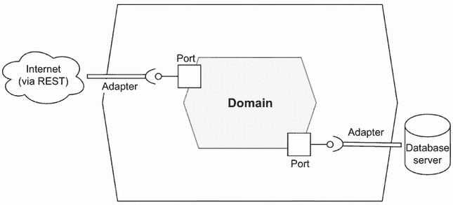
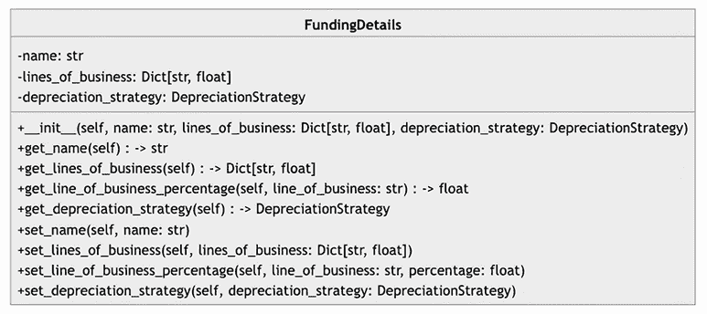
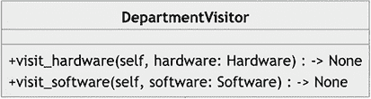

# 第四章：使用 GitHub Copilot 构建软件

本章涵盖

+   使用 Copilot 开发我们系统的核心

+   重构以应用模式

+   集成六边形架构

+   结合事件驱动原则

在上一章中，我们使用 ChatGPT 帮助我们设计我们的信息技术资产管理（ITAM）系统。现在，随着设计的确定，我们开始构建这个应用程序，从领域模型开始。领域模型是我们系统的核心。它代表了将应用和执行我们业务规则的课程。在本章中，我们将广泛使用 GitHub Copilot。本章最重要的收获是使用大型语言模型（LLM）有助于阐明未知未知：即在我们构建的系统中非显而易见、神秘或隐藏的复杂性。它使困难的事情变得容易，使看似不可能的事情成为可能。

一个额外的注意事项：本章代码较多。你的代码几乎肯定不会与本章中展示的代码完全匹配。不要纠结于这个事实，接受它。尝试理解这些差异存在的原因。观察是否改变你的提示会修改结果，如果会，那么是如何修改的。

## 4.1 奠定基础

在本章的第一部分，我们为后续的应用程序奠定了基础。我们从应用程序的核心开始：领域模型。领域模型应包含我们应用程序的未经修饰的业务规则和责任，不受外部世界的影响，专注于业务逻辑和工作流程。如图 4.1 所示，领域位于我们应用程序的核心。这不是巧合，因为它是应用程序的核心。随着我们对六边形架构的理解和欣赏的加深，我们将在本章中多次回到这个图。



图 4.1 传统六边形架构的视觉表示，其中领域或业务逻辑位于中间

正如你从上一章回忆的那样，六边形架构是一种旨在在应用程序的核心逻辑与其与外部系统交互之间创建清晰分离的架构模式。这一原则在图 4.1 中得到了清晰的展示。

### 4.1.1 表达我们的领域模型

在我们开始之前，让我们回顾一下 ChatGPT 的帮助下我们在上一章中创建的文档。类图（图 4.2）将为我们提供实现模板。正如我们现在所知道的，我们不会盲目地实现 ChatGPT 提供的代码和文档的每一个方面。这样做可能会无意中导致一个脆弱且难以更改、不安全或不完整的架构。


如果我们深入查看我们在上一章中创建的`Asset`类的方法和字段（见图 4.3），请注意两点。首先，它与我们在第二章中创建的`Asset`类不同。其次，ChatGPT 建议我们为这个类提供一个接受所有属性的构造函数；然而，它还添加了所有属性的修改器方法——即*设置器*。


图 4.3：我们借助 ChatGPT 创建的`Asset`类。它包括每个属性的构造函数和修改器方法。

### 4.1.2 优先考虑不可变性

不可变对象，其中内部状态不能改变，使类更加安全，并且更易于并发。如果有两个或更多线程访问同一个对象，我们不需要同步访问；两个线程的状态几乎肯定是一样的。因此，我们将优先考虑基于构造函数的值注入而不是修改器方法。当我们编写这个类时，我们不会添加修改器。

首先，我们将`purchase_date`字段从`Hardware`类中提取出来。这个字段在所有`Asset`类中是共享的（本书不会讨论`Asset`类租赁的情况）；因此，`purchase_date`字段应该属于父类。

接下来，我们需要添加一些在上章设计中没有的额外字段：`cost`（成本）、`useful_life`（使用寿命）和`salvage_value`（残值）。这些字段对于正确计算*折旧*是必要的。你可能记得，折旧是一种会计方法，用于在资产的使用寿命内分配资产的成本。你应该注意到，定义中出现了`cost`和`useful_life`这两个术语。因此，这些字段是必需的。此外，残值是指业务、部门或公司在其使用寿命结束时通过出售资产可以期望获得的金额。这个字段在一些折旧计算中是必不可少的；因此，我们将把它添加到我们的类中。创建一个名为`domain`/`model`的包，添加一个名为`asset.py`的文件，然后在这个文件的开始处添加以下提示：

```py
# Define a class named Asset
# It should have the following attributes: 
# - id: int
# - name: str
# - status: str
# - category: str
# - cost: float
# - useful_life: float
# - salvage_value: float
# - purchase_date: datetime
# 
# The attributes cannot be None and cannot be added after construction
# However, we should be able to access the attributes using methods
```

当你通过文件进行缩进以让 GitHub Copilot 为你自动生成代码时，你可能注意到它会创建修改器，尽管我们明确指示它不要这样做。出于这个原因以及许多其他原因（正如我们将在本章中看到的），你必须保持警惕和专注地编写代码。当然，你可以表达你的意图，但这些工具可能会以工具构建代码的方式覆盖你的愿望。此外，你可能注意到 Copilot 添加了`@dataclasses`装饰器。

装饰器设计模式

装饰器设计模式是一种结构型设计模式，它允许你动态地向对象添加新行为或修改现有行为，而无需更改现有类。这是通过将现有对象包装在装饰对象中实现的。

对于一个勇敢的探险者来说，一个有趣的练习是让 Copilot 扮演一个软件工程师的角色——使用角色模式。这会在任何有意义的方面改变输出吗？

定义*设计模式*是软件开发中常见的设计问题的解决方案。我们将在本章中进一步探讨它们。

### 4.1.3 装饰我们最喜欢的类

此装饰器自动生成 Python 的常见方法（例如等于和字符串表示，等等）。数据类是一个主要用于存储数据且没有太多行为的类。在 Python 中，数据类是在 Python 3.7 中引入的，作为一种使主要用于存储数据的类更干净、更高效的工具。这与用户定义的类相对立，其目的可以是混合的（即数据和行为）。在这种情况下使用数据类是有用的，因为它可以避免构造、表示和比较对象的样板代码。此外，对于那些在家计分的人，我们的自动生成代码正在自动生成代码。

列表 4.1 GitHub Copilot 根据我们的提示创建的代码

```py
from dataclasses import dataclass
from itam.domain.funding_details import FundingDetails

@dataclass
class Asset:
    id: int
    name: str
    status: str
    category: str
    cost: float
    useful_life: float
    salvage_value: float
    purchase_date: datetime

    def __post_init__(self):
        if self.id is None:
            raise TypeError("ID cannot be None")
        if self.name is None:
            raise TypeError("Name cannot be None")
        if self.status is None:
            raise TypeError("Status cannot be None")
        if self.category is None:
            raise TypeError("Category cannot be None")
        if self.cost is None:
            raise TypeError("Cost cannot be None")
        if self.useful_life is None:
            raise TypeError("Useful life cannot be None")
        if self.salvage_value is None:
            raise TypeError("Salvage value cannot be None")

    def get_id(self):
        return self.id

    ... # other accessors omitted for clarity
```

`__post_init__()`方法将在构造函数之后运行，并强制所有参数都不是空（在 Python 中称为`None`）。以这种方式进行防御性编码将确保初始化后您的值不会改变。当然，您可以自由添加额外的验证，例如对类别状态的接受值。但如果您希望在该情况下强制执行值，最好通过将其作为适当的类或使用`Enum`类来实现。

接下来，让我们回顾一下我们在上一章中创建的 Mermaid 图中的`Hardware`类（见图 4.4）。从这个图中我们可以注意几个事项：它既不包含访问器方法，也不包含修改器方法。我们需要在我们的提示中添加访问器方法。


图 4.4 使用 ChatGPT 辅助绘制的`Hardware`类。请注意，它没有任何访问器方法。

现在我们已经审查和评估了在我们的`Hardware`类中需要哪些方法和属性，我们可以构建它。在域目录中创建一个名为`hardware.py`的文件。在此文件的开始处，添加以下提示以让 GitHub Copilot 创建我们的`Hardware`类：

```py
# Define a class called Hardware, which is an instance of Asset.
# The Hardware entity has the following attributes:
# - serial_number: str,
# - location: Location,
# - warranty_expiration_date: date,
# - notes: str
# - maintenance_schedules: List[MaintenanceSchedule]
# - warranty: Warranty
# - retirement_date: date
# - retirement_reason: str
# - usage_statistics: UsageStatistics
# - budget: Budget
# The attributes can be None and the class should have a constructor that takes all attributes as parameters.
# The attributes should be private and the class should have accessor methods for all attributes.
```

为了简洁起见，代码列表中不包括构造函数后的代码和访问器方法。然而，它们应该会自动添加到您的文件中。

列表 4.2 `Hardware`类的定义

```py
from datetime import datetime
from dataclasses import dataclass
from itam.domain.asset import Asset
from itam.domain.location import Location
from itam.domain.warranty import Warranty
from itam.domain.maintenance_schedule import MaintenanceSchedule
from itam.domain.usage_statistics import UsageStatistics
from itam.domain.budget import Budget

@dataclass
class Hardware(Asset):
    serial_number: str
    location: Location
    warranty_expiration_date: datetime
    notes: str
    maintenance_schedules: list[MaintenanceSchedule]
    warranty: Warranty
    retirement_date: datetime
    retirement_reason: str
    usage_statistics: UsageStatistics
    budget: Budget
```

接下来，鉴于它已在`Asset`类中引用，让我们添加`FundingDetails`类。然而，首先让我们回顾一下类图（见图 4.5）。请注意，我们将重命名的`lines_of_business`字典，它使用一个字符串作为键。我们应该将其更改为实际的`Department`。这是另一个提醒，我们必须积极监控生成的代码，并就如何最佳实施项目做出决策。



图 4.5 我们在 ChatGPT 的帮助下草拟的`FundingDetails`类。我们需要将`lines_of_business`字典（重命名为`department_allocations`）改为使用`Department`作为键。

我们需要对这个类进行两项额外的编辑。首先，我们需要在构造函数中包含`Asset`。这将使我们能够访问计算折旧所需的字段，如前所述。此外，我们还需要在构造函数中包含一个折旧率。这用于递减折旧，但不用于直线折旧。我们可以在特定的折旧构造函数中设置这个字段的值或使用一个修改器方法，但到目前为止，我们将将其添加到`FundingDetails`类中。创建`FundingDetails`类的更新提示，包括更新的字段名，如下所示：

```py
# Define a class called FundingDetails
# It should have the following attributes: 
# - asset: Asset
# - depreciation_strategy: DepreciationStrategy,
# - depreciation_rate: float
# - department_allocations: Dict[Department, float]
# The attributes cannot be None and cannot be modified after construction
# However, we should be able to access the attributes using methods
```

生成的类中没有什么令人惊讶的：代码建立了内部属性并通过构造函数设置它们。构造函数完成后，它将检查所有属性是否为`None`。

列表 4.3 `FundingDetails`类（省略构造函数和访问器）

```py
from dataclasses import dataclass
from itam.domain.asset import Asset
from itam.domain.depreciation_strategy import DepreciationStrategy
from itam.domain.department import Department

@dataclass
class FundingDetails:
    asset: Asset
    depreciation_strategy: DepreciationStrategy
    depreciation_rate: float
    department_allocations: Dict[Department, float]

    def __post_init__(self):
        if self.asset is None:
            raise TypeError("Asset cannot be None")
        if self.depreciation_strategy is None:
            raise TypeError("Depreciation strategy cannot be None")
        if self.depreciation_rate is None:
            raise TypeError("Depreciation rate cannot be None")
        if self.department_allocations is None:
            raise TypeError("Department allocations cannot be None")

    def get_asset(self):
        return self.asset

    def get_depreciation_strategy(self):
        return self.depreciation_strategy

    def get_depreciation_rate(self):
        return self.depreciation_rate

    def get_department_allocations(self):
        return self.department_allocations
```

本章我们将生成的最终类是`DepreciationStrategy`。在上章中，我们简要介绍了这个类。当时我们没有提到的是，这个类将采用一种新的设计模式：*策略模式*。

策略模式

策略模式是一种行为设计模式，它允许你定义一组算法，将每个算法封装为一个对象，并使它们可互换。策略模式背后的思想是为一组算法定义一个公共接口，以便它们尽管可能有非常不同的实现，但仍可互换。

### 4.1.4 调整折旧策略

在我们尝试创建`DepreciationStrategy`类之前，让我们回顾一下我们在上章中创建的类图（见图 4.6）。这个类的实现包含大量的隐藏复杂性。如果我们不对 Copilot 关于如何执行计算给出非常具体的指示，它将不会提出正确的算法。例如，这是一个创建`DepreciationStrategy`的不完整、不精确的提示：

```py
# Define an interface called DepreciationStrategy. 
# It should have four concrete implementations of the interface: StraightLineDepreciationStrategy, DecliningBalanceDepreciationStrategy, DoubleDecliningDepreciationStrategy, and NoDepreciationStrategy.
# Each implementation overrides the calculate_depreciation() method to provide a specific way of calculating depreciation for an asset based on its funding details.
# The calculate_depreciation() method should take a FundingDetails object as a parameter and return a float value representing the depreciation amount.
```


图 4.6 接口类`DepreciationStrategy`定义了在我们的领域模型中计算资产折旧的功能。有四个具体的类代表了我们可以如何折旧资产。

这个提示将返回看起来似乎是正确的方法。但它们并不正确。例如，如果我们检查直线折旧法，我们会看到它既没有在计算中包含残值，也没有使用使用寿命。

列表 4.4 直线折旧的不正确实现

```py
class StraightLineDepreciationStrategy(DepreciationStrategy):
    def calculate_depreciation(self, funding_details: FundingDetails) -> float:
    return funding_details.get_asset().get_cost() * 
funding_details.get_depreciation_rate()
```

为了纠正这一点，我们应该更新提示，包含折旧方法的实际公式。幸运的是，我们不需要提供确切的语法，只需提供计算。Copilot 将将我们的算法转换为验证 Python 代码。以下是更新的提示：

```py
# Define an interface called DepreciationStrategy. 
# It should have four concrete implementations of the interface: StraightLineDepreciationStrategy, DecliningBalanceDepreciationStrategy, DoubleDecliningDepreciationStrategy, and NoDepreciationStrategy.
# Each implementation overrides the calculate_depreciation() method to provide a specific way of calculating depreciation for an asset based on its funding details.
# The calculate_depreciation() method should take a FundingDetails object as a parameter and return a float value representing the depreciation amount.
# NoDepreciationStrategy should return 0 for all assets.
# The other three strategies should return the depreciation amount based on the following formulas:
# - Straight Line: (cost - salvage value) / useful_life
# - Declining Balance: cost * (1-rate/100)^(current_year - purchase_year)
# - Double Declining: Declining Balance * 2
```

注意，我们可以使用伪代码。Copilot 处理其余部分。

列表 4.5 计算折旧方法的提示输出

```py
from abc import ABC, abstractmethod
from itam.domain.funding_details import FundingDetails
from math import pow

class DepreciationStrategy(ABC):
    @abstractmethod
    def calculate_depreciation(self, funding_details: FundingDetails) -> float:
        pass

class StraightLineDepreciationStrategy(DepreciationStrategy):
    def calculate_depreciation(self, funding_details: FundingDetails) -> float:
        cost = funding_details.get_asset().get_cost()
        salvage_value = funding_details.get_asset().get_salvage_value()
        useful_life = funding_details.get_asset().get_useful_life()
        return (cost - salvage_value) / useful_life

class DecliningBalanceDepreciationStrategy(DepreciationStrategy):
    def calculate_depreciation(self, funding_details: FundingDetails) -> float:
        cost = funding_details.get_asset().get_cost()
        depreciation_rate = funding_details.get_depreciation_rate()
        return cost * pow(1 - (depreciation_rate / 100), 
datetime.now().year - asset.get_purchase_date().year)

class DoubleDecliningDepreciationStrategy(DepreciationStrategy):
    def calculate_depreciation(self, funding_details: FundingDetails) -> float:
        cost = funding_details.get_asset().get_cost()
        depreciation_rate = funding_details.get_depreciation_rate()
        return DecliningBalanceDepreciationStrategy()
.calculate_depreciation(funding_details) * 2

class NoDepreciationStrategy(DepreciationStrategy):
    def calculate_depreciation(self, asset: Asset) -> float:
        return 0
```

许多其他类都未定义。请随意练习通过实现缺失的类来完善你的提示工程。例如，你可能想添加 `Organizations`、`MaintenanceSchedule`、`Address`、`UsageStatistics`、`User`、`Role` 和 `Warranty`。在下一节中，我们将与 Copilot 一起将模式应用于我们的代码，从熟悉的一个开始。

## 4.2 编织模式，模式，模式

在本节中，我们通过常用设计模式丰富我们的领域模型。它们代表最佳实践，可以通过提供一组经过验证的解决方案来加速开发过程，解决某些问题。设计模式不是现成的代码片段，而是关于如何以灵活的方式解决特定问题的通用指南，并且可以在不同的项目中重用。  

### 4.2.1 访问我们的部门

我们将重新审视的第一个模式是 *访问者*。如您在第三章中回忆的那样，您使用访问者模式向给定的类添加新行为或更改现有行为。图 4.7 显示了它在上一章中的建模方式。



图 4.7 `DepartmentVisitor` 接口（更新为新名称；之前称为 `LineOfBusinessVisitor`）。这个类“访问”硬件和软件，内部持有总成本和折旧。

让我们设计一个提示，让 Copilot 生成我们的 `Visitor` 模式实现，`DepartmentVisitor`，它访问我们的 `Asset`：

```py
# Define an interface called class DepartmentVisitor with the following methods:
#  +visit(self, asset: Asset) -> None
# Additionally, define a class called class DepartmentStatisticsVisitor that implements the interface DepartmentVisitor
```

Copilot 生成这个类的直接实现。

列表 4.6 `Vistor` 实现

```py
from abc import ABC, abstractmethod
from itam.domain.asset import Asset

class DepartmentVisitor(ABC):
    @abstractmethod
    def visit(self, asset: Asset) -> None:
        pass

class DepartmentStatisticsVisitor(DepartmentVisitor):
    def __init__(self):
        self._total_cost = 0
        self._total_depreciation = 0
        self._total_allocation = 0

    def visit(self, asset: Asset) -> None:
        self._total_cost += asset.get_cost()
        self._total_depreciation += asset.get_depreciation()
        self._total_allocation += asset.get_allocation()

    def get_total_cost(self):
        return self._total_cost

    def get_total_depreciation(self):
        return self._total_depreciation

    def get_total_allocation(self):
        return self._total_allocation
```

### 4.2.2 在工厂（模式）中创建对象

*工厂模式* 是另一种创建模式，它允许你抽象出你试图创建的对象的一些细节。在我们的 ITAM 系统中，我们有两种类型的 `Asset`（目前）：`Hardware` 和 `Software`。这些对象各自都有独特的属性。这种做法的一个效果是，我们的应用程序不需要知道具体类（例如 `Hardware`）的详细信息。从应用程序的角度来看，它只是得到一个带有额外字段的 `Asset` 实例。让我们看看如何让 Copilot 为我们创建一个 `AssetFactory` 类：

```py
# Define a class called AssetFactory
# It should have the following methods:
#        +new(self, asset_type: str, asset_name: str, asset_cost: float, useful_life: int, depreciation_strategy: str, depreciation_rate: float, salvage_value: float, asset_purchase_date: str) -> Asset
# When asset_type is equal to "hardware" it should delegate the call to a class called HardwareAssetFactory
# When asset_type is equal to "software" it should delegate the call to a class called SoftwareAssetFactory
# If it is neither "hardware" nor "software" it should raise a ValueError
# When depreciation_strategy is equal to "straight_line" it should return a new instance of StraightLineDepreciationStrategy
# When depreciation_strategy is equal to "double_declining_balance" it should return a new instance of DoubleDecliningDepreciationStrategy
# When depreciation_strategy is equal to "none" it should return a new instance of NoDepreciationStrategy
# When depreciation_strategy is equal to "declining_balance" it should return a new instance of DecliningBalanceDepreciationStrategy
# The HardwareAssetFactory and the SoftwareAssetFactory should get the id from the AssetFactory on each call to new.
```

这个提示是我们遇到的最详细的之一。随着我们的需求越来越专业化，我们的提示将自然变得更加细致。让我们详细检查这段代码，从 `new` 方法开始。

列表 4.7 `AssetFactory` 代码，包含两个内嵌的工厂

```py
from datetime import datetime
from itam.domain.asset import Asset
from itam.domain.hardware import Hardware
from itam.domain.funding_details import FundingDetails
from itam.domain.depreciation_strategy import (
    DepreciationStrategy,
    StraightLineDepreciationStrategy,
    DecliningBalanceDepreciationStrategy,
    DoubleDecliningDepreciationStrategy,
    NoDepreciationStrategy
)

class AssetFactory:
    def __init__(self):
        self.id = 0

    def date_from_string(self, date_string: str) -> datetime:
        return datetime.strptime(date_string, "%Y-%m-%d")

    def new(self, asset_type: str, asset_name: str, 
asset_cost: float, useful_life: int, 
depreciation_strategy: str, depreciation_rate: 
float, salvage_value: float, 
asset_purchase_date: str) -> Asset:
        self.id += 1
        purchase_date = self.date_from_string(asset_purchase_date)

        if asset_type == "hardware":
            return HardwareAssetFactory().new(self.id, 
asset_name, asset_cost, useful_life, 
depreciation_strategy, 
depreciation_rate, salvage_value, 
purchase_date)
        elif asset_type == "software":
            return SoftwareAssetFactory().new(self.id, 
asset_name, asset_cost, useful_life, 
depreciation_strategy, depreciation_rate, 
salvage_value, purchase_date)
        else:
            raise ValueError
```

`new` 方法根据 `asset_type` 参数确定需要调用哪个特定工厂。此外，它还跟踪已创建的资产数量，确保标识符（`id` 字段）始终唯一。否则，如果标识符的创建被推到特定的 `Factory` 对象，我们将会得到重复的键。

列表 4.8 内嵌的 `HardwareAssetFactory` 类

```py
class HardwareAssetFactory:
    def new(self, id: int, asset_name: 
str, asset_cost: float, 
useful_life: int, 
depreciation_strategy: str, 
depreciation_rate: float, 
salvage_value: float, 
purchase_date: datetime) -> Asset:
        a = Hardware (
            id=id,
            name=asset_name,
            category="hardware",
            cost=asset_cost,
            useful_life=useful_life,
            status="active",
            salvage_value=salvage_value,
            purchase_date=purchase_date
        )

        funding_details=FundingDetails(
                asset=a,
                depreciation_strategy=
                    self._get_depreciation_strategy(depreciation_strateg,
                depreciation_rate=depreciation_rate,
                department_allocations=dict()
            )

        a.funding_details = funding_details
        return a

    def _get_depreciation_strategy(self, 
depreciation_strategy: str) -> DepreciationStrategy:
        if depreciation_strategy == "straight_line":
            return StraightLineDepreciationStrategy()
        elif depreciation_strategy == "double_declining_balance":
            return DoubleDecliningDepreciationStrategy()
        elif depreciation_strategy == "none":
            return NoDepreciationStrategy()
        elif depreciation_strategy == "declining_balance":
            return DecliningBalanceDepreciationStrategy()
        else:
            raise ValueError
```

`HardwareAssetFactory` 类的 `new` 方法相对简单。这个方法接受来自 `AssetFactory` 的参数，尝试解析 `DepreciationStrategy`，并设置一些合理的默认值。

列表 4.9 内嵌的 `SoftwareAssetFactory` 类

```py
class SoftwareAssetFactory:
    def new(self, id: int, asset_name: str, 
asset_cost: float, 
useful_life: int, 
depreciation_strategy: str, 
depreciation_rate: float, 
salvage_value: float, 
purchase_date: datetime) -> Asset:
        a = Asset(
            id=id,
            name=asset_name,
            category="software",
            cost=asset_cost,
            useful_life=useful_life,
            status="active",
            salvage_value=salvage_value,
            purchase_date=purchase_date
        )

        funding_details=FundingDetails(
            asset=a,
            depreciation_strategy=self.
_get_depreciation_strategy(depreciation_strategy),
            depreciation_rate=depreciation_rate,
            department_allocations=dict()
        )

        a.funding_details = funding_details
        return a

    def _get_depreciation_strategy(self, 
depreciation_strategy: str) -> DepreciationStrategy:
        if depreciation_strategy == "straight_line":
            return StraightLineDepreciationStrategy()
        elif depreciation_strategy == "double_declining_balance":
            return DoubleDecliningDepreciationStrategy()
        elif depreciation_strategy == "none":
            return NoDepreciationStrategy()
        elif depreciation_strategy == "declining_balance":
            return DecliningBalanceDepreciationStrategy()
        else:
            raise ValueError
```

`SoftwareAssetFactory` 类几乎与 `HardwareAssetFactory` 类完全相同——如此相似，以至于可能存在代码异味。在软件开发中，*代码异味*这个术语描述的是开发者的一种直觉，表明代码可能存在更深层次的问题。这本身不是一个错误，而是一种感觉。你可能会有重构的冲动，因为这似乎违反了 DRY 原则（不要重复自己）。

但有一种更简单的方式来处理这种去重。为此，我们将查看下一个设计模式：*建造者模式*。

建造者模式

建造者模式是一种创建型设计模式，它通过提供如何创建对象的逐步说明，提供了一个流畅的 API 来创建对象。

### 4.2.3 指示系统如何构建

首先，我们将编写一个提示，让 Copilot 创建我们的构建器：一个用于 `Asset`，另一个用于 `FundingDetails`。我们将让构建器知道，如果 `asset_type` 是硬件，它应该返回一个 `Hardware` 的实例，对于 `Software` 也是如此：

```py
# Create a class called AssetBuilder
# It should use the Builder pattern to build an Asset
# Create another class called FundingDetailsBuilder
# It should use the Builder pattern to build a FundingDetails
# The AssetBuilder should have an embedded FundingDetailsBuilder
# When the category is "hardware" the AssetBuilder should create a Hardware object
# When the category is "software" the AssetBuilder should create a Software object
# When depreciation_strategy is equal to "straight_line" it should return a new instance of StraightLineDepreciationStrategy
# When depreciation_strategy is equal to "double_declining_balance" it should return a new instance of DoubleDecliningDepreciationStrategy
# When depreciation_strategy is equal to "none" it should return a new instance of NoDepreciationStrategy
# When depreciation_strategy is equal to "declining_balance" it should return a new instance of DecliningBalanceDepreciationStrategy
# The variables will need to be held in local variables and then passed to the Asset and FundingDetails objects when they are created.
# The final method of the AssetBuilder should return an Asset and be called build().
# The final method of the FundingDetailsBuilder should return a FundingDetails and be called build().
```

有一个需要注意的事项是，所有值都需要存储在局部变量中；否则，我们可能会遇到初始化后的异常。下面展示了 `AssetBuilder` 生成的代码。为了简洁起见，省略了 `import` 语句和访问器方法。值得一提的是，这些方法返回 `self`，因此可以串联起来使用。

列表 4.10 对应的 `AssetBuilder` 类

```py
class AssetBuilder:
    def __init__(self):
        self.id = 0
        self.name = ""
        self.category = ""
        self.cost = 0.0
        self.useful_life = 0
        self.status = ""
        self.salvage_value = 0.0
        self.purchase_date = datetime.now()

    def with_name(self, name):
        self.name = name
        return self

    ...
```

接下来，我们将检查 `AssetBuilder` 类的 `build()` 方法。这个方法使用 `category` 字段来返回正确的 `Asset` 子类。

列表 4.11 `AssetBuilder` 类的 `build()` 方法

```py
def build(self) -> Asset:
        if self.category == "hardware":
            return Hardware(
                id=self.id,
                name=self.name,
                category=self.category,
                cost=self.cost,
                useful_life=self.useful_life,
                status=self.status,
                salvage_value=self.salvage_value,
                purchase_date=self.purchase_date
            )
        elif self.category == "software":
            return Software(
                id=self.id,
                name=self.name,
                category=self.category,
                cost=self.cost,
                useful_life=self.useful_life,
                status=self.status,
                salvage_value=self.salvage_value,
                purchase_date=self.purchase_date
            )
        else:
            return Asset(
                id=self.id,
                name=self.name,
                category=self.category,
                cost=self.cost,
                useful_life=self.useful_life,
                status=self.status,
                salvage_value=self.salvage_value,
                purchase_date=self.purchase_date
            )
```

现在我们可以看看 `FundingDetailsBuilder` 类。这个类与 `AssetBuilder` 类非常相似，但没有多态的 `build()` 方法。

列表 4.12 `FundingDetailsBuilder` 类

```py
class FundingDetailsBuilder:
    def __init__(self):
        self.asset = None
        self.depreciation_strategy = ""
        self.depreciation_rate = 0.0
        self.department_allocations = dict()

    def with_asset(self, asset: Asset) -> FundingDetailsBuilder:
        self.asset = asset
        return self

    ...
```

类的 `build()` 方法实现相当简单；它只是在将参数应用到构造函数后返回 `FundingDetails` 对象的实例。

列表 4.13 `FundingDetailsBuilder` 类的 `build()` 方法

```py
def build(self) -> FundingDetails:
        return FundingDetails(
            asset=self.asset,
            depreciation_strategy=self.depreciation_strategy,
            depreciation_rate=self.depreciation_rate,
            department_allocations=self.department_allocations)
```

接下来，让我们从`AssetFactory`类中提取`_get_depreciation_strategy`方法，将映射折旧策略名称到`DepreciationStrategy`实例的逻辑进行整合。

列表 4.14 `FundingDetailsBuilder`的更新版`build()`方法

```py
    def _get_depreciation_strategy(self, 
depreciation_strategy: str) -> DepreciationStrategy:
        if depreciation_strategy == "straight_line":
            return StraightLineDepreciationStrategy()
        elif depreciation_strategy == "double_declining_balance":
            return DoubleDecliningDepreciationStrategy()
        elif depreciation_strategy == "none":
            return NoDepreciationStrategy()
        elif depreciation_strategy == "declining_balance":
            return DecliningBalanceDepreciationStrategy()
        else:
            raise ValueError

    def build(self) -> FundingDetails:
        return FundingDetails(
            asset=self.asset,
            depreciation_strategy=self.
_get_depreciation_strategy(depreciation_strategy),
            depreciation_rate=self.depreciation_rate,
            department_allocations=self.department_allocations
        )
```

现在我们已经编写了构建器，我们可以修改`AssetFactory`来使用它们。

隐藏在明处的模式：适配器

**适配器模式**是一种结构型设计模式，它允许我们弥合目标接口与具有不兼容接口的类之间的差距。例如，在我们的案例中，我们可以在名为`StringDepreciationStrategyAdapter`的适配器中正式化`str` -> `DepreciationStrategy`的接口。

我们将更新`AssetFactory`类中的提示，使用新的构建器来构建`Asset`和`FundingDetails`的实例：

```py
# Define a class called AssetFactory
# It should have the following methods:
#        +new(asset_type: str, asset_name: str, asset_cost: float, useful_life: int, depreciation_strategy: str, depreciation_rate: float, salvage_value: float) -> Asset
# Create a function that will take a string and return a datetime
# Use the AssetBuilder to create the Asset and use the FundingDetailsBuilder to create the FundingDetails
```

使用新的构建器将大大减少这个类的代码量。例如，`new`方法现在只有八行长（如 Microsoft VS Code 格式化所示）。

列表 4.15 `Asset`的更新版工厂方法

```py
    def new(self, asset_type: str, 
   asset_name: str, asset_cost: float, 
   useful_life: int, depreciation_strategy: str, 
   depreciation_rate: float, salvage_value: float, 
   asset_purchase_date: str) -> Asset:
        self.id += 1
        purchase_date = self.date_from_string(asset_purchase_date)
        a = AssetBuilder()
.with_id(self.id)
.with_name(asset_name)
.with_category(asset_type)
.with_cost(asset_cost)
.with_useful_life(useful_life)
.with_status("active")
.with_salvage_value(salvage_value)
.with_purchase_date(purchase_date)
.build()
        f = FundingDetailsBuilder()
.with_asset(a)
.with_depreciation_strategy(depreciation_strategy)
.with_depreciation_rate(depreciation_rate)
.build()

        a.funding_details = f
        return a
```

### 4.2.4 观察变化

接下来，我们将把**观察者模式**应用到我们的 ITAM 系统中。这个模式的真实价值将在下一章中变得更加明显，但我们将在这里播下种子。

观察者模式

观察者模式是一种行为型模式，其中`Subject`类通过通知向观察者类报告某些状态变化。这个模式在用户界面和事件驱动系统中非常有用。

我们将在目录服务中创建一个新的类`AssetManager`。`AssetManager`类将负责与外部世界交互（更多内容将在下一节中介绍）。这个提示指导 Copilot 如何定义这个类：

```py
# Define a class called AssetManager
# with CRUD operations for Asset
```

我们当前对`AssetManager`的实现使用列表来跟踪它所管理的`Asset`的生命周期。`AssetManager`支持`Asset`的所有 CRUD（创建、读取、更新和删除）操作。

列表 4.16 `AssetManager`的实现

```py
from itam.domain.asset import Asset

class AssetManager:
    def __init__(self):
        self._assets = []

    def create(self, asset: Asset) -> None:
        self._assets.append(asset)

    def read(self, asset_id: int) -> Asset:
        for asset in self._assets:
            if asset.get_id() == asset_id:
                return asset
        raise ValueError("Asset not found")

    def update(self, asset: Asset) -> None:
        for i in range(len(self._assets)):
            if self._assets[i].get_id() == asset.get_id():
                self._assets[i] = asset
                return
        raise ValueError("Asset not found")

    def delete(self, asset_id: int) -> None:
        for i in range(len(self._assets)):
            if self._assets[i].get_id() == asset_id:
                del self._assets[i]
                return
        raise ValueError("Asset not found")

    def get_assets(self):
        return self._assets
```

让我们更新我们的提示，为我们的`AssetManager`类添加通知。目前，我们不会分配任何观察者；我们将把这一点留到第五章，当我们开始处理数据流时：

```py
# Define a class called AssetManager
# with CRUD operations for Asset
# and a method to notify observers
```

作为对我们的提示的回应，如果我们重新创建整个类，Copilot 会添加我们将最终扩展的通知框架。

列表 4.17 启用通知的更新版`AssetManager`定义

```py
from itam.domain.asset import Asset

class AssetManager:
    def __init__(self):
        self._assets = []
        self.observers = []

    def add_observer(self, observer):
        self.observers.append(observer)

    def remove_observer(self, observer):
        self.observers.remove(observer)

    def notify_observers(self, event, asset):
        for observer in self.observers:
            observer.update(event, asset)

    def read(self, asset_id: int) -> Asset:
        for asset in self._assets:
            if asset.get_id() == asset_id:
                return asset
        raise ValueError("Asset not found")

    def create(self, asset: Asset) -> None:
        self.notify_observers("CREATE", asset)
        self._assets.append(asset)

    def update(self, asset: Asset) -> None:
        for i in range(len(self._assets)):
            if self._assets[i].get_id() == asset.get_id():
                self._assets[i] = asset
                self.notify_observers("UPDATE", asset)
                return
        raise ValueError("Asset not found")

    def delete(self, asset_id: int) -> None:
        for i in range(len(self._assets)):
            if self._assets[i].get_id() == asset_id:
                del self._assets[i]
                self.notify_observers("DELETE", asset_id)
                return
        raise ValueError("Asset not found")

    def get_assets(self):
        return self._assets
```

我们将在本章的下一节中看到两个更多的模式：单例和仓库。但首先我们需要设置一个控制器来与我们的系统交互。这带我们到了端口和适配器的使用。

## 4.3 插入端口和适配器

我们的 ITAM 系统开始整合；核心业务模型已经构建完成。我们应用了模式使代码更加简洁、可读和可维护。然而，有一个明显的缺陷：我们如何与我们的应用程序交互？在本节中，我们继续深入调查六边形架构。

### 4.3.1 回顾六边形架构

如您所回忆的那样，六边形架构是一种设计软件的方法，它强调将核心业务逻辑与外部服务分离。业务逻辑可以被视为应用程序的“大脑”。它包含所有重要的规则和结构，这些规则和结构是应用程序需要保证程序正确性的。在这个类比中，外部服务是你的“手”或“眼睛”；它们允许与外部世界的交互（用户界面、数据库等）。

六边形架构将主要程序逻辑与外部部分（如按钮、屏幕和数据库）分开。这使得在不更改主要程序的情况下轻松更改这些外部部分。它是通过使用定义外部部分如何与主要程序交互的**端口**和使这些交互以具体方式发生的**适配器**来实现的。

这种方法使得随着时间的推移更改和演进应用程序变得更加容易。如果需要对其中一个外部系统进行更改，应用程序的核心不应受到影响；你只需要更新适配器（见图 4.8）。


图 4.8 动态中六边形架构的更概念化可视化。注意，核心与系统的其余部分分离，并且仅通过端口进行交互。

### 4.3.2 驱动我们的应用程序

我们将首先构建系统的驱动程序。**驱动程序**是指位于应用程序上下文边界之外的系统，它向系统发送请求，并且可选地从应用程序接收响应。一个传统的例子是从网络浏览器到 REST 控制器的表示状态转移（通常称为 REST）调用。

首先，我们将向我们的 ITAM 系统添加一个 REST 控制器。它将公开`AssetManager`类提供的功能。创建一个名为 infrastructure/API 的目录，在其中创建一个名为 asset_controller.py 的文件。在这个文件的开始处，添加以下提示：

```py
# Import statements for Asset, AssetService, AssetFactory, AssetIn, AssetOut, and from_asset
# Use AssetFactory to create an Asset from an AssetIn
# Construct an instance of the APIRouter class from FastAPI
# Define HTTP endpoints to handle CRUD operations for the AssetService
# Implementation of error handling, logging, and other necessary components for a robust and reliable HTTP API
# All methods should be asynchronous
```

由于我们没有指定要使用的路径，Copilot 可能会生成不一致或无效的路径。以下代码是在 VS Code 中响应上一个提示时输出的。路由是`asset`而不是`assets`；这更多的是一种偏好而不是标准，但在 REST 中名词通常被复数化。

列表 4.18 使用`asset`路由生成的代码

```py
@router.post('/asset', response_model=AssetOut)
async def create_asset(asset_in: AssetIn):
    asset = AssetFactory.create_asset(asset_in)
    asset_service.create(asset)
    return from_asset(asset)
```

你可以选择手动更新代码以反映你的路径偏好。然而，最重要的是，确保它在各种方法中保持一致。以下列表显示了如何初始化运行应用程序所需的所有服务。

列表 4.19 更新 `main` 类以反映一致的路径

```py
from fastapi import APIRouter, HTTPException
from itam.domain.asset import Asset
from itam.service.asset_manager import AssetManager
from itam.domain.factory.asset_factory import AssetFactory
from itam.infrastructure.api.asset_model import AssetIn, AssetOut, from_asset
import logging

router = APIRouter()

asset_manager = AssetManager()
asset_factory = AssetFactory()
```

接下来，让我们看看路由是如何定义的，以及它们的方法是如何使用的。前两个路由定义了如何访问我们的 `Asset` 对象。第一个 GET 请求获取系统中当前所有的 `Asset`。在现实世界中，我们会包括便利功能，如分页和排序。然而，鉴于系统中当前条目数量有限，我们将放弃这些功能。下一个 GET 方法通过标识符获取特定的 `Asset`。

列表 4.20 访问 `Asset` 的 `AssetController` 方法

```py
@router.get('/assets', response_model=list[AssetOut])
async def get_assets():
    assets = asset_manager.get_assets()
    return [from_asset(asset) for asset in assets]

@router.get('/assets/{asset_id}', response_model=AssetOut)
async def read_asset(asset_id: int):
    try:
        asset = asset_manager.read(asset_id)
        return from_asset(asset)
    except ValueError as e:
        logging.error(e)
        raise HTTPException(status_code=404, detail="Asset not found")
```

最终的路由集定义了如何在我们的系统中创建 `Asset`、更新它们以及从系统中删除它们。注意，我们不是进行“软删除”，这只会设置一个标志，而不会在后续查询中返回这个 `Asset`。

列表 4.21 修改和删除 `Asset` 的 `AssetController` 方法

```py
@router.post('/assets', response_model=AssetOut)
async def create_asset(asset_in: AssetIn):
    asset = asset_factory.new(asset_in.asset_type, 
    asset_in.name, asset_in.unit_cost, 
    asset_in.useful_life, asset_in.depreciation_strategy, 
    asset_in.depreciation_rate, asset_in.salvage_value,  
    asset_in.purchase_date)
    asset_manager.create(asset)
    return from_asset(asset)

@router.put('/assets/{asset_id}', response_model=AssetOut)
async def update_asset(asset_id: int, asset_in: AssetIn):
    try:
        asset = asset_factory.new(asset_in.asset_type, 
         asset_in.name, asset_in.unit_cost, 
         asset_in.useful_life, asset_in.depreciation_strategy, 
         asset_in.depreciation_rate, asset_in.salvage_value, 
         asset_in.purchase_date)
         asset.set_id(asset_id)
         asset_manager.update(asset)
         return from_asset(asset)
    except ValueError as e:
        logging.error(e)
        raise HTTPException(status_code=404, detail="Asset not found")

@router.delete('/assets/{asset_id}')
async def delete_asset(asset_id: int):
    try:
        asset_manager.delete(asset_id)
    except ValueError as e:
        logging.error(e)
        raise HTTPException(status_code=404, detail="Asset not found")
```

注意到 `Asset` 类的简化表示，称为 `AssetIn` 和 `AssetOut`，这并非巧合。你可以在 `AssetController` 中定义这些类，或者你可以添加一个单独的类并在那里定义它们。在本书的参考实现中，它们定义在一个名为 asset_model.py 的文件中。这个提示定义了 `AssetIn` 和 `AssetOut` 类：

```py
# Define a pydantic model for AssetIn
# It should have the following attributes:
#    name: str
#    asset_type: str
#    department: str
#    depreciation_strategy: str
#    useful_life: int
#    unit_cost: float
#    depreciation_rate: float
#    salvage_value: float

# Define a pydantic model for AssetOut
# It should have the following attributes:
#    id: int
#    name: str
#    asset_type: str
#    department: str
#    depreciation_strategy: str
#    useful_life: int
#    unit_cost: float
#    depreciation_rate: float
#    salvage_value: float
# It should have a method that transforms an Asset into an AssetOut
```

在文件开头定义的提示下，Copilot 生成了类似于以下列表的代码。

列表 4.22 asset_model.py 中的 `AssetIn` 和 `AssetOut` 类

```py
from pydantic import BaseModel
from itam.domain.asset import Asset

class AssetIn(BaseModel):
    name: str
    asset_type: str
    department: str
    depreciation_strategy: str
    useful_life: int
    unit_cost: float
    depreciation_rate: float
    salvage_value: float
    purchase_date: str

class AssetOut(BaseModel):
    id: int
    name: str
    asset_type: str
    depreciation_strategy: str
    useful_life: int
    unit_cost: float
    depreciation_rate: float
    salvage_value: float
    purchase_date: str

@staticmethod
def from_asset(asset: Asset) -> AssetOut:
    return AssetOut(
        id=asset.id,
        name=asset.name,
        asset_type=asset.category,
        depreciation_strategy=str(asset.funding_details.depreciation_strategy),
        useful_life=asset.useful_life,
        unit_cost=asset.cost,
        depreciation_rate=asset.funding_details.depreciation_rate,
        salvage_value=asset.salvage_value,
        purchase_date=asset.purchase_date.strftime("%Y-%m-%d"),
    )
```

可选地，我们可以在 `AssetController` 和 `AssetManager` 之间添加另一层抽象。这样做可能被认为是极端的六边形架构，但计算机科学中很少有挑战不能通过添加另一层抽象来解决。我们将添加一个用于与 `AssetController` 接口的端口。让我们为类 `AssetRestPort` 创建一个提示，并让 Copilot 生成代码：

```py
# Define an interface called AssetRestPort
# It should expose all of the methods in AssetManager as abstract methods
```

这个提示指示 Copilot 创建一个我们将很快实现的接口。

列表 4.23 `AssetRestPort` 的完整源代码

```py
from itam.domain.asset import Asset
from abc import abstractmethod

class AssetRestPort:
    @abstractmethod
    def read(self, asset_id: int) -> Asset:
        pass

    @abstractmethod
    def create(self, asset: Asset) -> None:
        pass

    @abstractmethod
    def update(self, asset: Asset) -> None:
        pass

    @abstractmethod
    def delete(self, asset_id: int) -> None:
        pass

    @abstractmethod
    def get_assets(self):
        pass
```

接下来，我们将使用一个适配器来实现这个端口，该适配器将用于与控制器交互，以进一步抽象组件。如果我们想的话，可以替换这个适配器为另一个，例如，将其转换为命令行应用程序。`AssetRestAdapter` 的提示如下：

```py
# Define an interface called AssetRestAdapter
# It should take an AssetManager as a parameter in its constructor
# It should expose all of the methods in AssetManager
# It should inherit from AssetRestPort
```

这个提示有两个重要的元素。第一个是它实现了我们之前定义的端口接口。第二个是它封装了 `AssetManager` 的功能。

列表 4.24 `AssetRestAdapter` 的源代码

```py
from itam.domain.asset import Asset
from itam.infrastructure.ports.asset_rest_port import AssetRestPort
from itam.service.asset_manager import AssetManager

class AssetRestAdapter(AssetRestPort):
    def __init__(self, asset_manager: AssetManager):
        self._asset_manager = asset_manager

    def read(self, asset_id: int) -> Asset:
        return self._asset_manager.read(asset_id)

    def create(self, asset: Asset) -> None:
        self._asset_manager.create(asset)

    def update(self, asset: Asset) -> None:
        self._asset_manager.update(asset)

    def delete(self, asset_id: int) -> None:
        self._asset_manager.delete(asset_id)

    def get_assets(self):
        return self._asset_manager.get_assets()
```

剩下的工作只是更新`AssetController`以移除其直接调用`AssetManager`方法的操作，并让`AssetController`调用适配器的操作，适配器再调用`AssetManager`的操作。从端口和适配器模式的关键要点来看，它抽象了系统驱动部分（在这种情况下，REST API）与驱动应用（我们的业务模型和系统核心`AssetManager`）之间的交互。为了使这一点更加明确，我们将很快再次修改这个类，将其端口添加到构造函数中。

列表 4.25 使用`AssetRestAdapter`更新`AssetController`的代码

```py
router = APIRouter()

asset_rest_adapter = AssetRestAdapter(AssetManager())
asset_factory = AssetFactory()

@router.post('/assets', response_model=AssetOut)
async def create_asset(asset_in: AssetIn):
    asset = asset_factory.new(asset_in.asset_type,
    asset_in.name, asset_in.unit_cost, 
    asset_in.useful_life, asset_in.depreciation_strategy,
    asset_in.depreciation_rate, asset_in.salvage_value,
    asset_in.purchase_date)
    asset_rest_adapter.create(asset)
    return from_asset(asset)
```

如前所述，我们将修改`AssetController`以移除所有对`AssetManager`的直接引用。我们的当前`AssetController`，尽管它没有直接调用任何`AssetManager`方法，但确实持有对`AssetManager`的间接引用，因为`AssetManager`是在`AssetController`中构建的。这样做进一步隔离了`AssetManager`与驱动程序的变化。

### 4.3.3 访问我们的数据和持久化我们的更改

软件中的抽象不仅仅是学术问题。这些抽象在满足需求和进行更改时给我们提供了灵活性。它们可以隐藏复杂性，将行为封装在看似简单的接口之后。这使我们来到了下一个模式：**仓库**模式。

仓库模式

仓库模式是一种设计模式，通过创建一个单独的地方来处理获取、保存、更新和删除数据等任务来帮助管理数据。它将数据源（如数据库或文件）连接到应用程序的其余部分，使数据访问代码与其他代码分离。

在我们的 ITAM 项目中，仓库模式将使我们能够提供一个大大简化的接口，掩盖了数据访问的复杂性。从仓库或`AssetManager`的角度来看，我们的数据访问层只是一系列方法。幕后，它可能是一个 REST API、Redis 缓存、MongoDB、文件或任何类型的数据库。让我们创建一个提示，使用仓库模式设置我们的通用数据访问层：

```py
# Create an abstract base class called BaseRepository that represents a generic data access layer using the Repository pattern. 
# The class should define common methods for CRUD operations such as create, read, update, and delete. 
# Make sure to use type hints for the input parameters and return values.
```

使用这个提示，Copilot 应该拥有建立所有实现都将遵守的合同所需的一切。让我们检查一下代码。

列表 4.26 `BaseRepository`的代码，我们的通用数据访问层

```py
from abc import ABC, abstractmethod
from typing import List, TypeVar, Generic

T = TypeVar('T')

class BaseRepository(ABC, Generic[T]):
    @abstractmethod
    def create(self, entity: T) -> None:
        pass

    @abstractmethod
    def read(self, entity_id: int) -> T:
        pass

    @abstractmethod
    def update(self, entity: T) -> None:
        pass

    @abstractmethod
    def delete(self, entity_id: int) -> None:
        pass

    @abstractmethod
    def get_entities(self) -> List[T]:
        pass
```

Copilot 引入了一个`Generic`类型，允许在实现时提供一些类型提示。如果我们表达类型应该是`Asset`，方法签名将展示这一点。我们的第一次实现尝试将是一个内存数据存储。这将使我们能够对整个系统进行端到端测试。这也很好地展示了抽象的有用性。不久，我们将添加另一个使用 Postgres 的实现。但首先，这是提示：

```py
# Define a class called InMemoryAssetRepository that inherits from the BaseRepository abstract class. 
# The InMemoryAssetRepository should be specific to managing Asset objects using an in-memory list to store and update the assets. 
# Implement the necessary methods for CRUD operations such as create, read, update, and delete for Asset objects using the in-memory list. 
# Make sure to use type hints for the input parameters and return values.
```

我们的内存实现将使用一个简单的列表来存储 `Asset`s。我们将能够执行所有 CRUD 操作。此外，Copilot 将为我们添加类型提示，让其他人知道它应该接受和返回 `Asset`s。这就是 `BaseRepository`[`Asset`] 的意思：它是一个 `BaseRepository` 的实现，其 `Generic` 类型是 `Asset`。

列表 4.27 `InMemoryAssetRepository` 的代码

```py
from itam.infrastructure.repository.base_repository import BaseRepository
from itam.domain.asset import Asset

class InMemoryAssetRepository(BaseRepository[Asset]):
    def __init__(self):
        self._assets = []

    def create(self, asset: Asset) -> None:
        self._assets.append(asset)

    def read(self, asset_id: int) -> Asset:
        return next((asset for asset in self._assets 
if asset.id == asset_id), None)

    def update(self, asset: Asset) -> None:
        for i in range(len(self._assets)):
            if self._assets[i].id == asset.id:
                self._assets[i] = asset
                break

    def delete(self, asset_id: int) -> None:
        self._assets = [asset for asset in self._assets 
if asset.id != asset_id]

    def get_entities(self) -> list[Asset]:
        return self._assets
```

最后，我们将更新 `AssetManager` 以将 `Asset`s 的 CRUD 操作委托给一个 `BaseRepository` 实例 (`_repository`)。以下是完整的源代码，包括文件开头的提示。

列表 4.28 使用 `InMemoryAssetRepository` 的 `AssetManager`

```py
# Define a class called AssetManager
# with CRUD operations for Asset
# and a method to notify observers whenever an asset is created, updated or deleted
# The AssetManager should use an instance of the InMemoryAssetRepository class for data access and CRUD operations on Asset objects. 
# Implement methods for creating, reading, updating, and deleting assets using the AssetRepository instance. 
# Please include type hints for the input parameters and return values.
# The methods should be named create, read, update, get_assets, and delete.

from itam.domain.asset import Asset
from itam.infrastructure.repository.in_memory_asset_repository import InMemoryAssetRepository

class AssetManager:
    def __init__(self):
        self._repository = InMemoryAssetRepository()

    def create(self, asset: Asset) -> Asset:
        self._repository.create(asset)
        return asset

    def read(self, asset_id: int) -> Asset:
        return self._repository.read(asset_id)

    def update(self, asset: Asset) -> Asset:
        self._repository.update(asset)
        return asset

    def get_assets(self) -> list[Asset]:
        return self._repository.get_entities()

    def delete(self, asset_id: int) -> None:
        self._repository.delete(asset_id)
```

到目前为止，我们有一个核心业务领域，它没有直接被我们的系统直接触及。我们有端口供请求进入。我们也有端口可以存储数据（至少在系统运行时）。我们应该能够通过运行系统，向创建端点发送 POST 请求，并从 GET 端点读取数据来测试系统的端到端。一旦我们确认系统端到端工作正常，我们可以解决我们的数据只保存在内存中的问题；我们现在可以连接一个实际的数据库。为此，我们引入本章的最后一个模式：单例模式。从概念上讲，单例模式非常简单易懂；它应该只有一个实例在运行。它适用于许多用例：日志记录、缓存、配置设置或数据库连接管理器。

单例模式

单例模式是一种设计模式，确保一个类只有一个实例，并提供对该实例的全局访问点。当您想在程序的各个部分共享单个对象而不是创建相同类的多个实例时，会使用它。

### 4.3.4 集中（并外部化）我们的数据访问

我们将要求 Copilot 为我们创建一个单例类来管理数据库的连接。我们不应该在我们的源代码中硬编码用户名或密码（或任何连接细节），这不仅因为它是固有的不安全，而且因为这些细节很可能根据环境（开发与测试与生产）的不同而不同。因此，我们将要求 Copilot 接受这些值作为环境变量，并使用它们来配置连接：

```py
# Create a Python class called DatabaseConnection using the Singleton pattern to manage a single connection to a PostgreSQL database using SQLAlchemy. 
# The class should read the database username, password, and connection string from environment variables
# The environment variables should be named: DB_USERNAME, DB_PASSWORD, DB_HOST, DB_PORT, and DB_NAME
```

我们要求 Copilot 使用 SQLAlchemy，一个对象关系映射（ORM）工具，对数据库执行操作。Copilot 将巧妙地组装我们的源代码。`@staticmethod` 关键字创建了一个属于类而不是类实例的方法。这个关键字用于获取 `DatabaseConnection` 类的实例。因为静态方法不能修改实例数据，所以它可以用来确保这个类只有一个实例在运行，因此是一个单例。构造函数使用字符串插值和环境变量初始化数据库连接。

列表 4.29 `DatabaseConnection` 的实现

```py
from sqlalchemy import create_engine
from sqlalchemy.orm import sessionmaker
import os

class DatabaseConnection:
    __instance = None
    @staticmethod
    def get_instance():
        if DatabaseConnection.__instance == None:
            DatabaseConnection()
        return DatabaseConnection.__instance

    def __init__(self):
        if DatabaseConnection.__instance != None:
            raise Exception("This class is a singleton!")
        else:
            DatabaseConnection.__instance = self
            self.engine = 
create_engine(f"postgresql://
{os.environ['DB_USERNAME']}:
{os.environ['DB_PASSWORD']}@
{os.environ['DB_HOST']}:
{os.environ['DB_PORT']}/
{os.environ['DB_NAME']}")
            self.Session = sessionmaker(bind=self.engine)

    def get_session(self):
        return self.Session()
```

现在我们能够连接到我们的数据库，我们需要创建一个仓库，该仓库将使用此连接来存储和检索我们的 `Asset` 对象。我们将创建一个名为 `SQLAlchemyAssetRepository` 的类来完成这项工作。

列表 4.30 `SQLAlchemyAssetRepository` 类的提示和代码

```py
# Define a class called SQLAlchemyAssetRepository that implements the AssetRepository interface for data access using SQLAlchemy. 
# The class should handle the CRUD operations (create, read, update, and delete) for assets, storing and retrieving them in a PostgreSQL database using SQLAlchemy.

from itam.domain.asset import Asset
from itam.infrastructure.repository.base_repository import BaseRepository
from sqlalchemy.orm import Session

class SQLAlchemyAssetRepository(BaseRepository[Asset]):
    def __init__(self, session: Session):
        self._session = session

    def create(self, asset: Asset) -> Asset:
        self._session.add(asset)
        self._session.commit()
        return asset

    def read(self, asset_id: int) -> Asset:
        return self._session.query(Asset)
.filter(Asset.id == asset_id).first()

    def update(self, asset: Asset) -> Asset:
        self._session.query(Asset)
.filter(Asset.id == asset.id).update(asset)
        self._session.commit()
        return asset

    def get_assets(self) -> list[Asset]:
        return self._session.query(Asset).all()

    def delete(self, asset_id: int) -> None:
        self._session.query(Asset).filter(Asset.id == asset_id).delete()
        self._session.commit()
```

接下来，我们将重构 `AssetController` 以允许我们传入 `AssetRestPort`。通过这样做，我们可以替换应用程序的驱动方面。这次重构进一步将驱动从业务核心中抽象出来。

列表 4.31 更新后的 `AssetController`，公开路由

```py
from itam.infrastructure.ports.asset_rest_port import AssetRestPort
import logging

class AssetController:
    def __init__(self, asset_rest_port:  AssetRestPort):
        self._asset_factory = AssetFactory()
        self._asset_rest_port = asset_rest_port
        ...

    def get_router(self):
        return self._router

    async def get_assets(self):
        return  [ from_asset(a) for a in self._asset_rest_port.get_assets()]

    async def get_asset(self, asset_id: int):
        asset = self._asset_rest_port.read(asset_id)
        if asset is None:
            raise HTTPException(status_code=404, detail="Asset not found")
        return from_asset(asset)

    async def create_asset(self, asset_in: AssetIn):
        asset = self._asset_factory.new(
asset_in.asset_type, 
asset_in.name, 
asset_in.unit_cost, 
asset_in.useful_life, 
asset_in.depreciation_strategy, 
asset_in.depreciation_rate, 
asset_in.salvage_value, 
asset_in.purchase_date)
        self._asset_rest_port.create(asset)
        return from_asset(asset)

    async def update_asset(self, asset_id: int, asset_in: AssetIn):
        asset = self._asset_factory.new(
asset_in.asset_type, 
asset_in.name, 
asset_in.unit_cost, 
asset_in.useful_life, 
asset_in.depreciation_strategy, 
asset_in.depreciation_rate, 
asset_in.salvage_value, 
asset_in.purchase_date)

        asset.id = asset_id
        asset = self._asset_rest_port.update(asset)
        if asset is None:
            raise HTTPException(status_code=404, detail="Asset not found")
        return from_asset(asset)

    async def delete_asset(self, asset_id: int):
        asset = self._asset_rest_port.read(asset_id)
        if asset is None:
            raise HTTPException(status_code=404, detail="Asset not found")
        self._asset_rest_port.delete(asset_id)
        return from_asset(asset)
```

我们现在可以将应用程序的初始化逻辑整合到 main.py 文件中。这是最大的回报。我们的系统将具有分层结构，便于根据需要或当需求发生变化时替换组件。

列表 4.32 main.py 的最终版本，将我们的应用程序连接在一起

```py
from fastapi import FastAPI
from itam.infrastructure.api.asset_controller import AssetController
#from itam.infrastructure.repository.in_memory_asset_repository     
     import InMemoryAssetRepository
from itam.infrastructure.repository.sqlalchemy_asset_repository   
     import SQLAlchemyAssetRepository
from itam.infrastructure.database.database_connection 
     import DatabaseConnection
from itam.service.asset_manager import AssetManager
from itam.infrastructure.adapters.asset_rest_adapter import AssetRestAdapter
import uvicorn

app = FastAPI()
session = DatabaseConnection().get_session()
#repository = InMemoryAssetRepository()
repository = SQLAlchemyAssetRepository(session)
asset_manager = AssetManager(repository)
asset_rest_adapter = AssetRestAdapter(asset_manager)
asset_controller = AssetController(asset_rest_adapter)
app.include_router(asset_controller.get_router())

if __name__ == '__main__':
    uvicorn.run(app, host='0.0.0.0', port=8000)
```

恭喜！我们现在有一个正在运行的系统，可以将数据持久化到我们的数据库中。

## 摘要

+   装饰器模式是一种结构型设计模式，它允许你动态地添加新对象行为或修改现有行为，而不改变现有类。这是通过将当前对象包装在装饰对象中实现的。

+   访问者模式向现有类的行为添加新行为。

+   工厂模式是另一种创建模式，它允许你抽象出你试图创建的对象的一些细节。

+   建造者模式是一种创建型设计模式，它通过提供创建对象的逐步指令来提供一个流畅的 API，用于创建对象。

+   适配器模式是一种结构型设计模式，它允许你桥接目标接口与具有不兼容接口的类之间的差距。

+   观察者模式是一种行为模式，其中主题类通过通知将某些状态变化报告给观察者类。

+   六角架构将主程序逻辑与按钮、屏幕和数据库等外部部分分开。它使得在不改变主程序的情况下改变外部部分变得容易。

+   仓储模式是一种设计模式，它通过创建一个单独的地方来处理获取、保存、更新和删除数据等任务来帮助管理数据。它将数据源（如数据库或文件）连接到应用程序的其余部分，使数据访问代码与其他代码分离。

+   单例模式是一种设计模式，它确保一个类只有一个实例，并提供对该实例的全局访问点。当你想要在程序的不同部分共享单个对象而不是创建同一类的多个实例时，会使用它。
