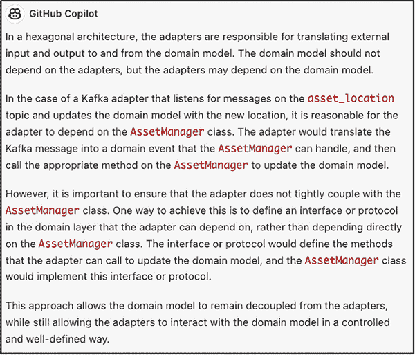
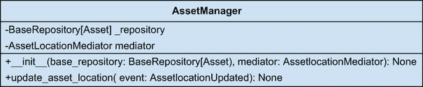

# 5 使用 GitHub Copilot 和 Copilot Chat 管理数据

本章涵盖

+   将数据持久化到关系型数据库

+   使用 Apache Kafka 进行数据流

+   集成事件驱动原则

+   使用 Spark 分析数据以监控位置

上一章为我们信息技术资产管理（ITAM）系统奠定了基础。然而，这个应用程序没有数据将无法满足我们的需求。数据是每个应用程序的生命线。这正是本章的主题：我们可以使用生成式 AI 以各种方式创建数据、流数据、转换数据、对数据做出反应，并从数据中学习。

在上一章中，敏锐的人可能会注意到我们的数据访问模式因为不完整而无法工作。本章的开头部分将解决这个问题。之后，我们将设置我们的数据库，修复访问这些数据的类，并加载一些样本数据以供本章其余部分使用。

## 5.1 收集我们的数据集

我们的第一项任务将是构建一个大量的数据集，以帮助我们在本章剩余部分的实验。首先，我们将使用 GitHub Copilot 生成 1,000 行资产信息。然而，我们很快就会发现问题可能不是最适合这个任务的工具。使用这些工具的一个关键驱动因素是发现的想法：测试它们的边界，对抗它们，偶尔甚至反击。但旅程往往就是乐趣所在。一旦我们找到了这个边缘，我们将被介绍到一个新的、以前未见过的工具：GitHub Copilot Chat。最后，当我们创建我们的资产列表后，我们将为这些资产添加位置信息，再次使用 GitHub Copilot Chat。

我们需要在构建初始数据集之前让我们的数据库运行起来。Docker 使得这项任务变得简单，只需最小努力，我们就能快速启动一个空的 PostgreSQL（或其他 RDBMS/NoSQL 服务器）。你忘记了这个命令吗？不用担心——我们可以询问 Copilot。打开一个名为 data/initial_data_load.sql 的新文件，并在你新创建的 SQL 文件顶部输入以下提示：

```py
-- Question: What is the command to run a docker container, running PostgreSQL for a database called itam_db. I would like to specify the password for this database.
```

Copilot 将逐步揭示 Docker 命令：

```py
--Answer: docker run --name itam_db 
    -e POSTGRES_PASSWORD=postgres -d 
    -p 5432:5432 postgres
```

一旦你在终端或命令行运行此命令，我们就可以构建我们的数据集。你应该能够连接到本地运行的数据库。注意，一个名为`itam_db`的数据库正在其中运行。然而，这个数据库没有任何模式、表或数据。让我们首先设置一个新的模式。

在我们的 initial_data_load.sql 中，我们将添加一个提示让 Copilot 起草创建模式的命令。以下提示（以及 Copilot 的响应）将允许你创建一个名为`itam`的新模式，如果从你的数据库客户端应用程序（例如 DataGrip、SQuirreL、pdAdmin 或甚至使用 Docker 的`exec`命令`docker exec -i itam_db psql -U postgres -c "create schema itam"`）执行：

```py
-- create a schema called itam
create schema itam;
```

接下来，我们应该添加一个用户用于我们的应用程序。此用户将能够对我们的数据进行 CRUD（创建、读取、更新、删除）操作，但无法影响数据库表或过程的结构。

注意：以双横线（`--`）开头的行是 SQL 中的注释。从 Copilot 的角度来看，取消这些行的注释是可选的，因为它将生成不带注释的解决方案；这使它更容易直接复制和粘贴到我们选择的数据库工具中。

在此过程中，我们还将添加一个管理账户来执行我们的读写用户无法执行的操作，例如创建或删除表。

列表 5.1 创建新用户的提示

```py
-- create two users called itam_user and itam_admin. itam_user should be able to read from and write to the tables in the itam schema. itam_admin should be able to read from and write to the tables in the itam schema and create and drop tables in the itam schema.
create user itam_user with password 'itam_user';
create user itam_admin with password 'itam_admin';
grant usage on schema itam to itam_user;
grant usage on schema itam to itam_admin;
grant select, insert, update, delete on all tables in schema itam to itam_user;
grant select, insert, update, delete on all tables in schema itam to itam_admin;
grant usage, drop on schema itam to itam_admin;
```

接下来，我们将此模式的所有权授予`itam_admin`账户。转让此所有权将确保只有此账户可以更改表结构（数据定义）。

```py
-- grant ownership of the itam schema to itam_admin
alter schema itam owner to itam_admin;
```

在设置、账户创建和系统所有权问题解决后，我们可以开始关注数据。我们将从添加支持资产的数据参考开始，即折旧策略。这种数据在性质上更静态；如果有的话，变化频率较低。让我们定义并存储这些策略。

列表 5.2 创建`depreciation_strategy`表的提示

```py
-- create a table called depreciation_strategy in the itam schema. the table should have the following columns: id (int), name (varchar), and description (varchar). the table should have a primary key on id.
-- id needs to be in quotes because it is a reserved word in postgresql
-- there are two values for depreciation_strategy: straight line and double declining balance
create table itam.depreciation_strategy (
    "id" int primary key,
    "name" varchar,
    "description" varchar
);
```

我们将使用一个序列作为此表的主键。尽管对于不会很大且具有已知值可以手动输入的表来说，这并非绝对必要，但添加这个序列将使我们能够更多地与 Copilot 合作，并让它提出一些建议。此外，向 Copilot 提问并让它以文本文件的形式回答问题很有趣。

列表 5.3 创建用作主键的序列的提示

```py
-- create a sequence called depreciation_strategy_seq, which should start at 1 and increment by 1 and should be used as the primary key for the depreciation_strategy table.
create sequence itam.depreciation_strategy_seq start 1 increment 1;
```

自然地，在我们传说中的手中有了序列，我们需要知道如何将序列与`depreciation_strategy`表的主键列关联起来。幸运的是，Copilot 有答案。

列表 5.4 询问 Copilot 如何将序列与主键关联

```py
-- question: how do I make the sequence the primary key for the depreciation_strategy table?

-- answer: use the following command
alter table itam.depreciation_strategy 
    alter column "id" 
    set default
    nextval('itam.depreciation_strategy_seq'
            ::regclass);
```

最后，我们通过将以下静态条目插入表中来完成此表。目前我们只使用两种折旧策略：直线法和双倍余额递减法。

列表 5.5 将静态条目添加到`depreciation_strategy`表

```py
insert into depreciation_strategy (id, name, description) 
    values (1, 'straight line', 
    'straight line');

insert into depreciation_strategy (id, name, description) 
    values (2, 'double declining balance', 
    'double declining balance');
```

接下来，我们将继续处理`funding_details`表。这些信息告诉我们如何为我们的设备融资，其再销售价值，以及资产使用寿命结束后应如何处理资产的说明。步骤序列将与我们对折旧策略所做的工作相同，唯一的区别是我们不会添加静态条目，因为此数据直接与单个资产相关。我们将定义表，创建序列，并将该序列应用于表，其中它作为主键。

列表 5.6 `funding_details`表的完整代码列表

```py
-- create a table called funding_details in the itam schema. the table should have the following columns: id (int), name (varchar),depreciation_strategy_id (int) and depreciation_rate (float). the table should have a primary key on id.
-- depreciation_strategy_id is a foreign key to the depreciation_strategy table.
-- id needs to be in quotes because it is a reserved word in postgresql
create table itam.funding_details (
    "id" int primary key,
    "name" varchar,
    "depreciation_strategy_id" int,
    "depreciation_rate" float
);

-- create a sequence called funding_details_seq, which should start at 1 and increment by 1 and should be used as the primary key for the funding_details table.
create sequence itam.funding_details_seq start 1 increment 1;
alter table itam.funding_details 
alter column "id" 
set default 
nextval('itam.funding_details_seq'
    ::regclass);
```

我们将定义和生成的最终信息是资产本身。这个列表也是多余的，但为了完整性而包含在内。最后，我们创建表，创建序列，并将其用作主键。

列表 5.7 `assets` 表的完整代码列表

```py
-- create a table called assets in the itam schema. the table should have the following columns: 
-- id (int), name (varchar), status (varchar), category (varchar), cost (float), useful_life (int), salvage_value (float), purchase_date (date), funding_details_id (int). The table should have a primary key on id and a foreign key on funding_details_id.
-- id needs to be in quotes because it is a reserved word in postgresql
-- the table should have a sequence called assets_id_seq, which should start at 1 and increment by 1 and should be used as the primary key for the assets table.
create table itam.assets (
    "id" int primary key,
    "name" varchar,
    "status" varchar,
    "category" varchar,
    "cost" float,
    "useful_life" int,
    "salvage_value" float,
    "purchase_date" date,
    "funding_details_id" int
);

-- create a sequence called assets_seq, which should start at 1 and increment by 1 and should be used as the primary key for the assets table.
create sequence itam.assets_seq start 1 increment 1;

alter table itam.assets alter column "id" 
set default 
nextval('itam.assets_seq'::
    regclass);
```

在定义和创建表之后，我们现在将专注于创建数据。在我们的文本文件中，我们向 Copilot 指定我们正在寻找的数据集的参数。Copilot 可能会尝试协助您概述围绕您的新数据集的属性。

列表 5.8 为资产表创建数据集

```py
-- Generate a dataset of assets for an ITAM system. The dataset should include the following columns: id (int), name (varchar), status (varchar), category (varchar), cost (float), useful_life (int), salvage_value (float), purchase_date (date), funding_details_id (int). The dataset should have 1000 rows, sorted by id. Each row should have the following characteristics:
-- - id should be a unique integer and sequential starting at 1.
-- - name should be a random string of characters between 1 and 50 characters long.
-- - status should be a random selection from the following valid asset statuses: in use, in storage, disposed of, in repair, in transit, other.
-- - category should be a random selection from the following valid categories: hardware, software, other.
-- - cost should be a random float between 0 and 100000.
-- - useful_life should be a random int between 1 and 10.
-- - salvage_value should be a random float greater than 0 but less than the cost of the asset.
-- - purchase_date should be a random date between 1/1/2019 and 12/31/2022.
-- - funding_details_id should be a random integer either 1 or 2.
-- The dataset should be saved as a CSV file named assets.csv in the data directory. The file should have a header row and the columns should have the following data types: id (int), name (varchar), status (varchar), category (varchar), cost (float), useful_life (float), salvage_value (float), funding_details_id (int)
```

Copilot 提供的解决方案是新颖的。它使用 Postgres 内置函数构建一个大型序列，这意味着这个解决方案是不可移植的。然而，鉴于这是我们将会使用的数据库，这是一个足够合适的解决方案。生成的数据集已经经过优化。如果我们使用 Python 并请求 Copilot 帮助编写一个脚本来生成一个可以加载到 Postgres 中的文件，我们可能会得到更好的结果。然而，鉴于这个数据集只是为了与应用程序一起使用，我们目前不需要过分关注数据质量——尽管在现实世界中，数据质量是至关重要的。

列表 5.9 Copilot 的响应：基于序列构建的 `insert` 语句

```py
insert into itam.assets (id, name, status, 
    category, cost, useful_life, salvage_value, 
    purchase_date, funding_details_id)
select
    id,
    name,
    status,
    category,
    cost,
    useful_life,
    salvage_value,
    purchase_date,
    funding_details_id
from (
    select
        row_number() over (order by random()) as id,
        md5(random()::text) as name,
        case
            when random() < 0.2 then 'in use'
            when random() < 0.4 then 'in storage'
            when random() < 0.6 then 'disposed of'
            when random() < 0.8 then 'in repair'
            when random() < 0.9 then 'in transit'
            else 'other'
        end as status,
        case
            when random() < 0.5 then 'hardware'
            when random() < 0.9 then 'software'
            else 'other'
        end as category,
        random() * 100000 as cost,
        (random() * 100)::int as useful_life,
        random() * (random() * 100000) as salvage_value,
        -- generate a random date between 1/1/2019 and 12/31/2022
        -- this does not work please fix
        -- '2019-01-01'::date + random() * 
            ('2022-12-31'::date - '2019-01-01'::date) 
            as purchase_date,
        '2019-01-01'::date + (random() * 
          (DATE '2022-12-31' - DATE '2019-01-01')
          ::integer)::integer as purchase_date
        case
            when random() < 0.5 then 1
            else 2
        end as funding_details_id
    from generate_series(1, 1000)
) as assets;
```

如果我们切换回 ChatGPT 一分钟，我们可以得到关于如何创建此类数据集的第二意见。ChatGPT 建议使用 Python 库 `faker`。`faker` 包用于生成假数据，例如常见的英语名字。`numpy` 用于生成成本、使用寿命和残值等随机浮点值。`pandas` 用于在 `DataFrame`（表格）中管理数据。此外，我们可以使用 `df.to_csv('assets.csv', index=False)` 方法将 `DataFrame` 保存到 CSV 文件中。

列表 5.10 ChatGPT 建议使用 `Faker` 生成假数据集

```py
import pandas as pd
import numpy as np
import random
from faker import Faker

# Create Faker object
fake = Faker()

# Define our valid statuses, categories, funding_details and depreciation_strategies
valid_statuses = ['in use', 'in storage', 
'disposed', 'in repair', 'in transit', 'other']
valid_categories = ['hardware']
valid_funding_details = ['purchased']
valid_depreciation_strategies = ['straight line']

# Generate the data
data = {
    'id': list(range(1, 1001)),
    'name': [fake.first_name() for _ in range(1000)],
    'status': [random.choice(valid_statuses) for _ in range(1000)],
    'category': [random.choice(valid_categories) for _ in range(1000)],
    'cost': np.random.uniform(0, 100000, 1000),
    'useful_life': np.random.uniform(1, 10, 1000),
    'salvage_value': np.random.uniform(0, 10000, 1000),
    'funding_details': [random.choice(valid_funding_details)
 for _ in range(1000)],
    'depreciation_strategy': [random.choice(
    valid_depreciation_strategies) 
    for _ in range(1000)],
}

# Create DataFrame
df = pd.DataFrame(data)

# Ensure the DataFrame is sorted by id
df = df.sort_values('id')

# Show the DataFrame
print(df)
```

对于这些资产中的每一个，我们还需要资金细节：它们是如何融资的（在这个例子中是购买）以及折旧详情。不出所料，我们从 Copilot 得到了一个类似的解决方案：使用与用于资产的类似提示生成一系列条目。我们需要确保对于每个资产标识符（1–1000），我们都有一个相应的资金详情条目。否则，在运行此代码时我们可能会遇到空指针。

列表 5.11 为 `funding_details` 表创建数据集

```py
-- Generate a dataset of funding details for an ITAM system. The dataset should include the following columns: id (int), name (varchar), depreciation_strategy_id (int), depreciation_rate (float). The dataset should have 1000 rows, sorted by id. 
-- Each row should have the following characteristics:
-- - id should be a unique integer and sequential starting at 1.
-- - name should be a random string of characters between 1 and 10 characters long.
-- - depreciation_strategy_id should be a random integer either 1 or 2.
-- - depreciation_rate should be a random float between 0 and .4.

insert into itam.funding_details (id, name, 
    depreciation_strategy_id, depreciation_rate)
select
    id,
    name,
    depreciation_strategy_id,
    depreciation_rate
from (
    select
        row_number() over (order by random()) as id,
        md5(random()::text) as name,
        case
            when random() < 0.5 then 1
            else 2
        end as depreciation_strategy_id,
        random() * 0.4 as depreciation_rate
    from generate_series(1, 1000)
) as funding_details;
```

在数据集生成并存储在数据库中后，我们应该能够将我们应用程序的其余部分连接起来，使用 REST API 存储和显示资产。然而，由于我们在构建阶段移除了 SQLAlchemy 的所有元数据（参见第四章），我们需要一种方法以不同的方式将此元数据与我们的适配器连接起来。

在这个阶段，我们已经触及了 Copilot 能力的边缘。我们对接下来会发生什么以及如何解决我们最新的困境感到困惑。尽管很诱人，但我们不能放弃并回家。因此，是时候介绍 Copilot 产品套件中最新的补充：Copilot Chat。Copilot Chat 是一个嵌入在 IDE 中的 GPT-4 模型（目前仅由 Visual Studio Code 支持）。我们将打开聊天对话框，询问如何在仍然使用 SQLAlchemy 的对象关系模型（ORM）功能的同时保持我们的商业模式清洁。图 5.1 显示了 ChatGPT 的响应。

列表 5.12 领域类之外的 ORM 支持

```py
Base  = declarative_base()

class FundingDetailsModel(Base):
    __tablename__ = 'funding_details'
    id = Column(Integer, primary_key=True)
    depreciation_rate = Column(Float)
    depreciation_strategy_id = Column(Integer)

    def get_depreciation_strategy(self) -> DepreciationStrategy:
        if self.depreciation_strategy_id is 1:
            return StraightLineDepreciationStrategy()
        else:
            return DoubleDecliningDepreciationStrategy()

class AssetModel(Base):
    __tablename__ = 'assets'
    id = Column(Integer, primary_key=True)
    name = Column(String)
    status = Column(String)
    category = Column(String)
    cost = Column(Float)
    useful_life = Column(Float)
    salvage_value = Column(Float)
    purchase_date = Column(Date)
    funding_details_id = Column(Integer, ForeignKey('funding_details.id'))
    funding_details = relationship('FundingDetailsModel')
```

现在已经创建了外部模型类，在将它们返回到系统核心之前，我们必须将这些 ORM 实例映射到我们的领域模型。这可能看起来像是针对这样一个简单应用过度设计的代码，但它给了我们在领域模型如何操作方面极大的灵活性。例如，我们的模型可以执行超出 CRUD 的复杂操作。如果我们保持领域模型身份与数据访问层中使用的模型一致，我们将仅限于这些操作。

## 5.2 使用 Kafka 实时监控我们的资产

我们将实时监控我们的资产，以激励我们探索将生成式人工智能与事件驱动架构相结合的使用。我们将认为，当我们的资产从一个位置移动到另一个位置时，某些外部 ISAM 系统的系统会触发事件，这一点是理所当然的。

首先，我们将询问 Copilot Chat 如何使用 Docker 在本地运行 Kafka。Apache Kafka 有一个不应得的声誉，即难以安装和配置，而在 Docker 中运行将使我们能够绕过这一争议。使用 Copilot Chat，我们可以生成一个 Docker Compose 文件。然而，正如通常情况一样，版本非常旧，以至于不支持某些硬件。列表 5.13 是来自 Confluent（提供 Kafka 商业支持的公司的）官方 GitHub 仓库的更新列表。请注意，Docker Compose 文件的内容包括 Kafka 和 Zookeeper。Zookeeper 是 Kafka 用于管理和协调集群中代理的分布式协调服务，至少目前是这样。未来的版本旨在去除对 Zookeeper 的依赖。

列表 5.13 启动 Kafka 与 Zookeeper 的 Docker Compose 文件

```py
version: '2.1'

services:
  zookeeper:
    image: confluentinc/cp-zookeeper:7.3.2
    container_name: zookeeper
    ports:
      - "2181:2181"
    environment:
      ZOOKEEPER_CLIENT_PORT: 2181
      ZOOKEEPER_SERVER_ID: 1
      ZOOKEEPER_SERVERS: zoo1:2888:3888

  kafka:
    image: confluentinc/cp-kafka:7.3.2
    hostname: kafka
    container_name: kafka
    ports:
      - "9092:9092"
      - "29092:29092"
      - "9999:9999"
    environment:
      KAFKA_ADVERTISED_LISTENERS: 
            INTERNAL://kafka:19092,EXTERNAL://
            ${DOCKER_HOST_IP:127.0.0.1}:9092,
            DOCKER://host.docker.internal:29092
      KAFKA_LISTENER_SECURITY_PROTOCOL_MAP: INTERNAL:PLAINTEXT,EXTERNAL:PLAINTEXT,
DOCKER:PLAINTEXT
      KAFKA_INTER_BROKER_LISTENER_NAME: INTERNAL
      KAFKA_ZOOKEEPER_CONNECT: "zookeeper:2181"
      KAFKA_BROKER_ID: 1
      KAFKA_LOG4J_LOGGERS: "kafka.controller=
            INFO,kafka.producer.async
            .DefaultEventHandler=INFO,
            state.change.logger=INFO"
      KAFKA_OFFSETS_TOPIC_REPLICATION_FACTOR: 1
      KAFKA_TRANSACTION_STATE_LOG_REPLICATION_FACTOR: 1
      KAFKA_TRANSACTION_STATE_LOG_MIN_ISR: 1
      KAFKA_JMX_PORT: 9999
      KAFKA_JMX_HOSTNAME: ${DOCKER_HOST_IP:-127.0.0.1}
      KAFKA_AUTHORIZER_CLASS_NAME: kafka.security.authorizer.AclAuthorizer
      KAFKA_ALLOW_EVERYONE_IF_NO_ACL_FOUND: "true"
    depends_on:
      - zookeeper
```

随着我们的新 Kafka 实例运行，我们现在需要一个消费者，它会从主题 `asset_location`（我们很快就会创建）中拉取更新的位置，并更新数据库中的库存。再次，我们可以要求 Copilot Chat 提供一个如何使用 Python 订阅主题的建议：

|


| 在我们的 ITAM 项目中，我们希望有一个用于资产位置 Kafka 主题的 Python 消费者。一旦它接收到新的更新位置，它应该更新领域模型以反映新的位置。我们应该怎么做呢？ |
| --- |

Copilot Chat 生成的代码创建了一个消费者，监听主题，并使用 `AssetManager` 类的引用来更新受影响资产的地点。

列表 5.14 Copilot Chat 监控资产位置的代码

```py
from kafka import KafkaConsumer
from asset_manager import AssetManager

consumer = KafkaConsumer(
    'asset_location',
    bootstrap_servers=['localhost:9092'],
    auto_offset_reset='earliest',
    enable_auto_commit=True,
    group_id='my-group',
    value_deserializer=lambda x: 
            tuple(map(float, x.decode('utf-8')
            .split(',')))
)

asset_manager = AssetManager()

for message in consumer:
    asset_id, latitude, longitude = message.value
    asset_manager.update_asset_location(asset_id, (latitude, longitude))
```

然而，适配器是否应该知道 `AssetManager`？`AssetManager` 并不直接位于领域模型内部；它是一个关键的中介。`AssetManager` 和适配器之间的这种耦合程度可能会被认为违反了六边形架构模型中的六边形。让我们让 Copilot Chat 评价一下。我们可以这样问它：

|


| 由于本项目使用六边形架构，让适配器知道 AssetManager 是否是一个好主意？ |
| --- |

观察图 5.2，Copilot Chat 同意这确实会被视为违反适配器的合同责任。我们可以在 `AssetManager` 类中添加一个新的端口，该端口将使用 Kafka 端口。然而，让我们看看 Copilot Chat 是否有其他建议：

|


| 我们不希望 Kafka 消费者直接与 AssetManager 交互。有没有什么方法可以完成这个任务？ |
| --- |



图 5.2 GitHub Copilot Chat 对其不完美的接受

Copilot Chat 建议我们应用 `Mediator` 模式，这类似于端口和适配器的组合。

中介模式

中介者设计模式是一种行为模式，通过封装中介对象中的交互来促进对象之间的松散耦合。中介对象充当中央枢纽，在对象之间促进通信，而无需对象相互了解。

让我们先看看 Copilot Chat 生成的 `Mediator` 类。该类位于 `AssetManager` 和 Kafka 消费者之间。

列表 5.15 `Mediator` 类位于 `AssetManager` 和 Kafka 消费者之间

```py
class AssetLocationMediator:
    def __init__(self):
        self.handlers = {}

    def register_handler(self, event_type, handler):
        if event_type not in self.handlers:
            self.handlers[event_type] = []
        self.handlers[event_type].append(handler)

    def publish(self, event):
        event_type = type(event)
        if event_type in self.handlers:
            for handler in self.handlers[event_type]:
                handler(event)
```

此实现非常类似于消息队列或消息发布者，这正是重点：解耦。

注意：细心的读者可能会注意到我们在 `Asset` 和类型为 `Hardware` 的资产之间的区别上有点草率。在原始领域模型中，只有 `Hardware` 有位置。通常，我们不认为软件有位置。当然，你可以说软件安装在其位置上，但这种论点的说服力是有争议的。随着这个项目的继续，为了简化起见，我们将领域模型扁平化，因为持久化层中的多态结构是一个令人分心的复杂话题。

现在我们有了将 Kafka 消费者从 `AssetManager` 解耦的策略，我们应该更新 Kafka 消费者以利用它。我们需要在构造函数中将中介者传递给类。这样，`AssetManager` 和消费者将能够访问相同的实例，消息可以自由地来回流动——或者更确切地说，在这种情况下，流动将是单向的。你应该注意，我们打算在这个主题上读写 JSON，因此我们的值反序列化器需要理解这一点。

列表 5.16 将中介者集成到 Kafka 消费者类中

```py
from kafka import KafkaConsumer
from itam.domain.events.asset_location_updated import AssetLocationUpdated
import json

class AssetLocationKafkaConsumer:
    def __init__(self, mediator):
        self.mediator = mediator

        self.consumer = KafkaConsumer(
            'asset_location',
            bootstrap_servers=['localhost:9092'],
            enable_auto_commit=True,
            group_id='itam-group',
            value_deserializer=lambda m: json.loads(m.decode('utf-8'))
        )

    def poll(self):
        print("Polling for asset location updates")
        for message in self.consumer:
            asset_id = message.value['asset_id']
            latitude = message.value['latitude']
            longitude = message.value['longitude']
            timestamp = message.value['timestamp']
            event = AssetLocationUpdated(asset_id, latitude, longitude, timestamp)
            self.mediator.publish(event)
```

接下来，我们将检查 `AssetManager` 类需要进行的更改，以集成跟踪这些位置的能力。

注意：要完整运行此项目，您需要修改 `AssetManager`、`SQLAlchemyAssetRepository` 和 `Asset` 类，并在您的数据库中创建一个名为 `itam.asset_locations` 的新表。完整的更新源代码可在本书的网站上找到（[www.manning.com/books/ai-powered-developer](https://www.manning.com/books/ai-powered-developer)）以及本书的 GitHub 仓库中（[`github.com/nathanbcrocker/ai_assisted_dev_public`](https://github.com/nathanbcrocker/ai_assisted_dev_public)）。目前，我们将专注于使事件通过我们的系统流动所需的更改，并在读者选择的情况下使用存储库作为参考。

图 5.3 展示了对 `AssetManager` 类所做的更改，以开始实时跟踪我们的资产位置。



图 5.3 `AssetManager` 需要添加另一个构造函数参数和一个处理其位置对象更新的方法。

对于 `AssetManager` 类有两个必要的更改。首先，我们需要在构造函数中添加 `AssetLocationMediator`，以注册处理 `AssetLocationUpdated` 事件。其次，我们需要添加一个处理此事件的方法。在这种情况下，我们调用方法 `update_asset_location`。简化的代码如下。

列表 5.17 更新的 `AssetManager` 构造函数和事件处理器

```py
from itam.infrastructure.mediators.asset_location_mediator import 

class AssetManager:
    def __init__(self, base_repository: 
            BaseRepository[Asset], 
            mediator: AssetLocationMediator):
        self._repository = base_repository
        self.mediator = mediator
        self.mediator.register_handler(
            AssetLocationUpdated, 
            self.update_asset_location)

    def update_asset_location(self, event: AssetLocationUpdated) -> None:
        asset = self.read(event.asset_id)
        asset.add_location(event.latitude, 
            event.longitude, event.timestamp)
        #self.update(asset)
        print(f"Asset {asset.id} location updated 
            to {event.latitude}, {event.longitude} 
            at {event.timestamp}")
```

`Asset` 类的 `add_location` 方法仅将新的 `Location` 追加到 `Location` 列表的末尾。更复杂的领域模型可能包括一个 `current_location` 属性，将其他内容降级为历史位置列表；然而，鉴于我们试图让事件通过系统流动，我们最好保持简单。

我们待办事项列表中只剩下一项：创建主题。我们如何做？这是一个好问题。幸运的是，我们需要的所有工具都可在我们的运行 Docker 容器中找到。因此，让我们登录到我们的 Kafka Docker 实例。我们使用以下命令（假设您的 Docker 实例名为 `kafka`）：

```py
docker exec -it kafka /bin/bash
```

首先要检查的是是否已经创建了任何主题。我们可以使用以下命令来完成：

```py
kafka-topics --list --bootstrap-server localhost:9092
```

此命令列出了在此 Kafka 集群上运行的所有现有主题。如您所见，没有任何主题。

由于需要创建一个主题，让我们创建它。使用以下命令：

```py
kafka-topics --create --bootstrap-server localhost:9092 
    --replication-factor 1 
    --partitions 1 
    --topic asset_location
```

如果您再次运行 `kafka-topics --list` 命令，您将看到新主题。我们在创建主题命令中包含的分区和复制因子指令通知 Kafka 我们想要一个分区和一个复制因子为 1。如果我们正在为生产或任何其他非测试目的设置此配置，我们可能希望它们大于这个值，以确保数据的可用性。表 5.1 提供了您将需要用于此和其他项目的常用 Kafka 命令摘要。

表 5.1 Kafka 控制台命令摘要

| 操作 | 命令 |
| --- | --- |
| 创建 | `kafka-topics --create --bootstrap-server localhost:9092 --replication-factor 1 --partitions 1 --topic asset_location` |
| 读取 | `kafka-console-consumer --broker-list localhost:9092 --topic asset_location –from-beginning` |
| 写入 | `kafka-console-producer --broker-list localhost:9092 --topic asset_location` |
| 删除 | `kafka-topics --delete --topic asset_location --bootstrap-server localhost:9092` |
| 列表 | `kafka-topics --list --bootstrap-server localhost:9092` |

现在是趣味部分：观察应用程序的实际运行。Kafka 附带了一个控制台生产者，它将允许我们从标准输入向 Kafka 发布消息。为此，使用以下命令启动控制台生产者：

```py
kafka-console-producer --broker-list localhost:9092 --topic asset_location
```

您将进入一个交互式会话，允许您每行发布一条消息。让我们发布几条消息，模拟我们的资产在芝加哥周围移动。

列表 5.18 Kafka 控制台生产者的条目

```py
{"asset_id": 1, "latitude": 41.8781, "longitude": -87.6298, 
    "timestamp": "2022-01-01T00:00:00Z"}
{"asset_id": 1, "latitude": 41.9000, "longitude": -87.6244, 
    "timestamp": "2022-01-01T00:10:00Z"}
{"asset_id": 1, "latitude": 41.8676, "longitude": -87.6270, 
    "timestamp": "2022-01-01T00:20:00Z"}
{"asset_id": 1, "latitude": 41.8788, "longitude": -87.6359, 
    "timestamp": "2022-01-01T00:30:00Z"}
{"asset_id": 1, "latitude": 41.8740, "longitude": -87.6298, "timestamp": "2022-01-01T00:40:00Z"}
```

当您输入这些消息时，您应该看到应用程序的输出，指示位置已更新。

删除主题

为了完整性，您应该了解一个额外的命令。您在输入这些消息时可能会犯错，无效的消息可能会破坏您的消费者。一个可能的解决方案是删除该主题。删除主题听起来可能有些戏剧性，但它会解决问题。因此，以下是该命令：

```py
kafka-topics --delete --topic asset_location --bootstrap-server 
localhost:9092
```

在本节中，我们添加了使用 Apache Kafka 实时跟踪我们的`Asset`位置变化的能力。在本章的最后部分，我们将与 Copilot Chat 合作，通过实时监控我们的资产并尝试确定它们是否在正确的位置来扩展其能力。我们将探索如何结合使用 Spark 和 Kafka 来完成这项分析。一旦完成，我们将赢得信息安全团队的支持，他们担心我们的核心业务和知识产权过多地存在于这些`Asset`上。

## 5.3 使用 Apache Spark 进行数据分析、学习和跟踪

实时跟踪资产是一项至关重要的业务功能。您的 IT 资产包含敏感的商业数据、客户名单、销售数据、损益（PnL）预测和销售策略等众多内容。丢失资产可能对公司构成生存威胁。因此，对许多信息安全专业人士来说，谨慎管理和监控是首要任务。在本节中，我们的目标是使他们的工作大大简化。现代数据平台使得实时跟踪您的资产变得轻而易举，并在出现可疑条件时发送通知。让我们深入了解。

Apache Spark 是一个围绕速度、易用性和复杂分析构建的强大开源数据处理引擎。它被开发出来，旨在为处理大数据集提供 MapReduce 的改进替代方案，并能够处理批处理和实时分析。Spark 为 Scala、Java、Python 和 R 提供了 API，并内置了用于 SQL 查询的模块。其核心数据结构，弹性分布式数据集（RDD），实现了容错操作，并允许数据在计算机集群中并行处理。

Spark 还包括几个库来扩展其功能，包括用于机器学习的 MLlib、用于处理实时数据流的 Spark Streaming 以及用于处理结构化数据的 Spark SQL 和 DataFrames。这些工具使其非常适合从机器学习到实时数据流和批处理的各项任务。其内存处理能力使 Spark 比其前身快得多，因此它成为大数据处理的热门选择。

首先，我们将要求 Copilot Chat 推荐一个使用 Apache Spark 跟踪我们的资产的战略：

|


| 让我们假设我们的公司位于芝加哥。我们想要创建一个名为 `AssetLocationSparkAdapter` 的类，该类将从名为 `asset_location` 的 Kafka 主题中持续流式传输 `AssetLocation` JSON 消息。`AssetLocation` 具有以下属性：`asset_id`: int，`latitude`: float，`longitude`: float，和 `timestamp`: datetime。`AssetLocations` 存储在名为 `itam.asset_locations` 的 Postgres 数据库表中。`AssetLocationSparkAdapter` 应该计算新的 `AssetLocation` 是否比芝加哥远 25 英里以上。如果是，则应在控制台写入一条消息。这应该使用 Spark 的最新版本。我们该如何做呢？ |
| --- |

Copilot Chat 生成了一个类，你应该能够将其放入名为 `asset_location_spark_adapter.py` 的文件中，位于基础设施包中。它还贴心地为每一行代码提供了注释，因此你应该会发现生成的代码很容易理解。`import` 语句包括 Spark 库以及 `geopy`。

列表 5.19 运行 Spark 所需的 `import`s

```py
from pyspark.sql import SparkSession
from pyspark.sql.functions import from_json, col, expr
from pyspark.sql.types import StructType, 
    StructField, IntegerType, DoubleType, 
    TimestampType
from geopy.distance import distance
```

类以一个过载的构造函数开始，该构造函数定义了 Spark 在将 JSON 转换为 DataFrame 时使用的模式。

注意：根据定义，`AssetLocationSparkAdapter` 是一个阻塞过程。因此，你的 FastAPI 应用程序将不会“完全”启动，直到 Spark 进程被终止。你希望这是一个独立的过程，或者你需要引入一个异步框架以使这两个过程同时运行。

接下来，它启动一个本地 Spark 实例/会话，这将允许 Spark 连接到 Kafka 主题并持续流式传输记录。

列表 5.20 `AssessLocationSparkAdapter`，处理 Kafka 主题

```py
class AssetLocationSparkAdapter:
    def __init__(self):
        # Define the schema for the incoming JSON data
        self.schema = StructType([
            StructField("asset_id", IntegerType()),
            StructField("latitude", DoubleType()),
            StructField("longitude", DoubleType()),
            StructField("timestamp", TimestampType())
        ])

        # Create a SparkSession
        self.spark = SparkSession.builder \
            .appName("AssetLocationSparkAdapter") \
            .getOrCreate()

        # Create a streaming DataFrame from the asset_location topic
        self.df = self.spark \
            .readStream \
            .format("kafka") \
            .option("kafka.bootstrap.servers", "localhost:9092") \
            .option("subscribe", "asset_location") \
            .option("startingOffsets", "earliest") \
            .load() \
            .selectExpr("CAST(value AS STRING)")

        # Parse the incoming JSON data
        self.parsed_stream = self.df \
            .select(from_json(col("value"), self.schema).alias("data")) \
            .select("data.*")
```

`AssetLocationSparkAdapter` 类的最后一部分计算资产当前位置到芝加哥的距离。如果差异大于 25 英里，它将结果集发送到控制台。此外，它提供了一个启动和停止适配器的方法。

列表 5.21 计算 `Asset` 位置到芝加哥的距离

```py
        # Calculate the distance between the current location and Chicago for each asset
        self.distance = self.parsed_stream \
            .withColumn("distance", 
            expr("calculate_distance(latitude, 
            longitude, 41.8781, -87.6298)")) \
            .select(col("asset_id"), col("timestamp"), col("distance")) \
            .filter(col("distance") > 25)

        # Write the results to the console
        self.query = self.distance \
            .writeStream \
            .outputMode("append") \
            .format("console") \
            .start()

    def run(self):
        # Start the streaming query
        self.query.awaitTermination()

    def stop(self):
        # Stop the streaming query and SparkSession
        self.query.stop()
        self.spark.stop()
```

`calculate_distance` 方法接收资产位置的经纬度，并使用 `geopy.distance` 函数确定从芝加哥的距离。

列表 5.22 计算 Chi-town 和 `Asset` 之间距离的函数

```py
def calculate_distance(lat1, lon1, lat2, lon2):
    return distance((lat1, lon1), (lat2, lon2)).miles
```

在这个例子中，Copilot Chat 生成的代码存在一些问题，阻止它在本地运行。在本地运行它、遇到这些问题并在 Stack Overflow 上搜索后，你会找到解决代码中两个主要问题的解决方案：缺少本地运行的环境变量以及未能注册你的 UDF（用户定义函数）。幸运的是，你不需要进行测试和研究——以下列表提供了一个解决方案。

列表 5.23 运行应用程序本地所需的编辑

```py
os.environ['PYSPARK_SUBMIT_ARGS'] = 
    '--packages org.apache.spark:
         spark-streaming-kafka-0-10_2.12:3.2.0,
         org.apache.spark:
         spark-sql-kafka-0-10_2.12:3.2.0 
         pyspark-shell'

class AssetLocationSparkAdapter:
    def __init__(self):
        # Create a SparkSession
        self.spark = SparkSession.builder \
            .appName("AssetLocationSparkAdapter") \
            .getOrCreate()
         self.spark.udf.register("calculate_distance", calculate_distance)
```

最后，为了运行你的 Spark 应用程序，在 `main` 函数中更新 main.py，如下所示。

列表 5.24 更新 `main` 函数

```py
if __name__ == "__main__":
    adapter = AssetLocationSparkAdapter()
    adapter.run()
```

当您将您的资产位置输入到距离芝加哥市中心超过 25 英里的 Kafka 控制台生产者时，您会注意到条目被写入控制台。将类更新为输出这些结果到 Twilio 的短信 API 或 SendGrid 等电子邮件服务将是一件微不足道的事情。

列表 5.25 从您的资产位置流出的输出

```py
+--------+-------------------+------------------+
|asset_id|          timestamp|          distance|
+--------+-------------------+------------------+
|       1|2021-12-31 20:30:00| 712.8314662207446|
+--------+-------------------+------------------+
```

恭喜！您正在实时跟踪您的资产，并在企业资源“长腿”离开时发送实时警报。

## 摘要

+   GitHub Copilot Chat 是一个创新工具，它结合了 ChatGPT 的全面语言理解和 Copilot 的便捷功能。这是编程辅助领域的一个值得注意的发展，特别是在提供实时、上下文相关的建议方面，它促进了更高效的编码体验。

+   中介设计模式是一种独特的行为模式，它促进了对象之间的高度解耦，从而增强了代码的模块化。通过在中介对象中包含对象之间的交互，对象可以间接通信，这减少了依赖性并促进了代码的可重用性和易于修改。

+   Apache Kafka 是一个健壮的、分布式的流平台，旨在创建实时数据管道和流应用程序。它能够有效地处理来自多个来源的数据流并将它们传输到各种消费者，使其成为处理大量实时或近实时数据的理想解决方案。重要的是要记住，Kafka 针对的是仅追加、不可变的数据，而不是需要记录更新或删除或复杂查询的使用场景。

+   Apache Spark 是一个高性能、分布式的数据处理引擎，以其速度、用户友好性和高级分析能力而闻名。它非常适合需要实时数据处理或对大型数据集进行操作的场景。然而，对于诸如基本分析和简单的聚合等简单任务，传统的数据库可能是一个更合适的选择。

+   尽管生成式 AI 发展迅速，但它并非完美无缺。仔细审查所有生成的输出以确保其符合您的具体要求和质量标准至关重要。生成式 AI 不是深度领域知识或编码专长的替代品，但它通过提供有价值的见解并减少常规任务所花费的时间，显著提高了生产力。
