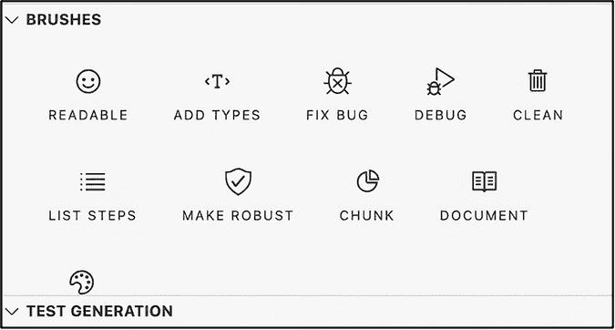
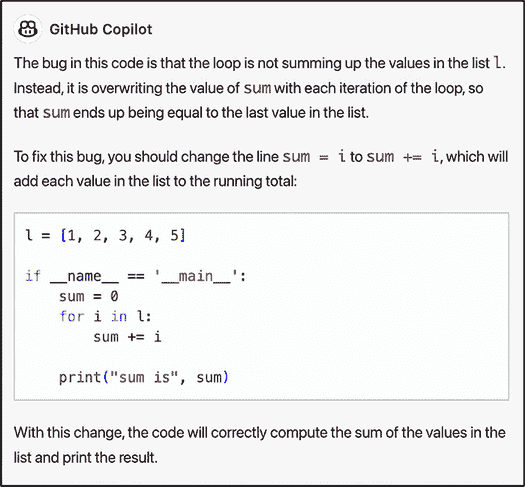
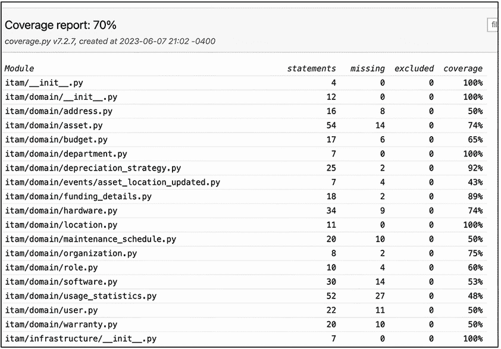

# 6 使用大型语言模型进行测试、评估和解释

本章涵盖

+   轻松起草单元测试

+   生成集成测试

+   确定代码质量和覆盖率

+   评估软件复杂性

+   翻译代码和文本

本章将探讨软件工程的一个关键方面：测试。测试软件的行为具有多个基本目的。首先，它有助于识别可能影响软件功能、可用性或性能的缺陷、错误和问题。此外，它确保软件符合所需的质量标准。通过进行彻底的测试，我们可以验证软件是否满足指定的要求，是否按预期运行，并产生预期的结果。通过全面的测试，开发者可以评估软件在各种平台和环境中的可靠性、准确性、效率、安全性和兼容性。在开发早期阶段发现并解决软件缺陷可以显著节省时间和成本。

一旦我们完成了测试的制定，我们将评估我们代码的质量。你将了解到一些有助于评估软件质量和复杂性的指标。此外，如果我们需要澄清代码的目的，或者是我们第一次审查它，我们将寻求解释以确保彻底理解。

## 6.1 测试，测试……一、二、三类型

测试在软件工程中扮演着至关重要的角色；因此，我们将详细探讨各种测试类型。这包括单元测试、集成测试和行为测试。首先，我们将使用 Copilot Chat 来帮助我们创建一个*单元测试*。

定义 A *单元测试*专注于测试单个组件或代码单元，以确保它们在独立的情况下能正确运行。开发者通常运行单元测试来帮助识别特定软件单元中的错误和问题。

### 6.1.1 单元测试

在本节中，我们将创建单元测试来测试我们的软件组件。Python 有多种单元测试框架可供选择。每个框架都有其独特的功能，适用于不同的场景。在根据我们的 AI 工具提供的推荐选择一个特定的框架之前，我们将简要地检查每个框架。

第一个框架是`unittest`。这是 Python 创建单元测试的标准库。它随 Python 一起提供，无需单独安装。`unittest`提供了一套丰富的断言，非常适合编写简单到复杂的测试用例，但它可能会很冗长。对于编写基本的单元测试来说，这是一个不错的选择，尤其是如果你不想在你的项目中引入额外的依赖项。它在任何需要独立于系统其他部分确认代码单元功能的情况下都很有用。

接下来，让我们来检查 `pytest`。这是一个流行的第三方库，可用于单元测试，尽管它足够灵活，可以处理不仅仅是单元测试。它比 `unittest` 需要更少的样板代码，并具有强大的功能，如设置和清理的 fixtures、参数化测试以及运行 `unittest` 和 `nose` 测试套件的能力。`pytest` 对于简单和复杂的单元测试案例都很好。它也适用于功能性和集成测试。如果你重视简单性和易用性，并且你的项目不受限于仅使用 Python 标准库，`pytest` 是一个极佳的选择。

`nose2` 是已弃用的 `nose` 测试框架的继任者。它扩展了 `unittest` 并使测试更加容易。它以其测试发现功能而闻名，该功能可以自动找到你的项目测试，这样你就不必手动列出它们。`nose2` 对于可以节省时间的较大项目来说是个不错的选择。像 `pytest` 一样，它可以运行 `unittest` 测试套件，所以如果你从 `unittest` 迁移但想保留现有的测试，它也是一个很好的选择。

最后，有 `doctest`。这是 Python 标准库的一部分模块。它不是一个像其他模块那样功能齐全的测试框架，但它允许你直接在你的文档字符串中编写测试。`doctest` 最适合于简单的案例，其中你想要展示如何使用一个函数或模块，并确认示例代码按预期工作。这是一种确保你的文档与代码保持同步的绝佳方式。

Copilot Chat 建议我们使用 `unittest`，因此我们将这样做。你可以尝试自己询问它，看看是否会得出不同的结论，这可能是可能的，这取决于你如何构建问题。

首先，我们将通过创建继承自 `unittest.TestCase` 类的类来定义测试案例。在编写我们的第一个单元测试时，我们将揭示一个迄今为止一直困扰我们的相当有害的错误；我们很快就会达到这一点。最后，我们将测试 `DepartmentStatisticsVisitor` 类的正确性。

我们首先向 Copilot Chat 发送一个提示，要求它为 `DepartmentStatisticsVisitor` 创建一个单元测试。响应将是一个关于上下文重要性的提醒。由于我们开始了一个新的聊天会话，Copilot Chat 将尝试创建这个单元测试，但它缺少我们任何类的定义。

列表 6.1 第一次尝试定义单元测试

```py
import unittest
from department_visitor import DepartmentStatisticsVisitor

class TestDepartmentStatisticsVisitor(unittest.TestCase):
    def test_visit_department(self):
        visitor = DepartmentStatisticsVisitor()
        department = {'name': 'Sales', 'employees': 
            [{'name': 'John', 'salary': 50000}, 
            {'name': 'Jane', 'salary': 60000}]}
        visitor.visit_department(department)
        self.assertEqual(visitor.total_salaries, 110000)
        self.assertEqual(visitor.num_employees, 2)
        self.assertEqual(visitor.avg_salary, 55000)
```

我们通过向 Copilot Chat 输入定义来继续进行，以便它可以细化测试案例。我们可以更多地了解访客类：

```py
The DepartmentStatisticsVisitor class visits to determine the total asset depreciation based off of the asset allocation for each department
```

使用这些更新的信息，Copilot Chat 可以更好地估计我们的单元测试应该如何工作。

列表 6.2 单元测试提示的结果

```py
import unittest
from department_visitor import DepartmentStatisticsVisitor, Asset

class TestDepartmentStatisticsVisitor(unittest.TestCase):
    def test_visit(self):
        visitor = DepartmentStatisticsVisitor()
        asset1 = Asset(1000, 500, 0.5)
        asset2 = Asset(2000, 1000, 0.3)
        visitor.visit(asset1)
        visitor.visit(asset2)
        self.assertEqual(visitor.get_total_cost(), 3000)
        self.assertEqual(visitor.get_total_depreciation(), 1500)
        self.assertEqual(visitor.get_total_allocation(), 0.8)
```

单元测试接近我们需要的；然而，`Asset` 的定义是不正确的。我们可以从我们的 asset.py 类中输入正确的定义，然后 Copilot Chat 将继续细化单元测试。

列表 6.3 下一次尝试定义单元测试，包含 `Asset` 定义

```py
import unittest
from datetime import date
from typing import List
from dataclasses import dataclass

@dataclass
class Location:
    name: str
    address: str

@dataclass
class Asset:
    id: int
    name: str
    status: str
    category: str
    cost: float
    useful_life: int
    salvage_value: float
    purchase_date: date
    locations: List[Location]

class TestAsset(unittest.TestCase):
    def test_asset(self):
        location1 = Location('Office', '123 Main St')
        location2 = Location('Warehouse', '456 Elm St')
        asset = Asset(1, 'Computer', 
            'In use', 'Hardware',
             1000.0, 3, 100.0, date.today(), 
            [location1, location2])
        self.assertEqual(asset.id, 1)
        self.assertEqual(asset.name, 'Computer')
        self.assertEqual(asset.status, 'In use')
        self.assertEqual(asset.category, 'Hardware')
        self.assertEqual(asset.cost, 1000.0)
        self.assertEqual(asset.useful_life, 3)
        self.assertEqual(asset.salvage_value, 100.0)
        self.assertEqual(asset.purchase_date, date.today())
        self.assertEqual(asset.locations, [location1, location2])
```

这更接近了。我们还需要提醒 Copilot Chat，`Asset`类有一个名为`FundingDetails`的类。让我们提供`FundingDetails`的定义，并告知 Copilot Chat 它应该是`Asset`的一部分。

列表 6.4 第三次尝试单元测试，相当接近

```py
import unittest
from department_visitor import 
    DepartmentStatisticsVisitor, Asset, 
    FundingDetails
from datetime import date
from typing import List, Dict
from dataclasses import dataclass

@dataclass
class Location:
    name: str
    address: str

class TestDepartmentStatisticsVisitor(unittest.TestCase):
    def test_visit(self):
        visitor = DepartmentStatisticsVisitor()
        location1 = Location('Office', '123 Main St')
        location2 = Location('Warehouse', '456 Elm St')
        asset1 = Asset(1, 'Computer', 'In use', 
            'Hardware', 1000.0, 3, 
            100.0, date.today(), 
            [location1, location2])
        asset2 = Asset(2, 'Printer', 'In use', 
            'Hardware', 500.0, 2, 50.0, 
            date.today(), [location1])
        funding_details1 = FundingDetails(
            asset1, 'Straight Line', 
            0.33, { 'IT': 0.5, 'HR': 0.5 })
        funding_details2 = FundingDetails(
            asset2, 'Double Declining Balance', 
            0.25, { 'IT': 0.3, 'HR': 0.7 })
        visitor.visit(asset1, funding_details1)
        visitor.visit(asset2, funding_details2)
        self.assertEqual(visitor.get_total_cost(), 1500.0)
        self.assertEqual(visitor.get_total_depreciation(), 550.0)
        self.assertEqual(visitor.get_total_allocation(), 0.8)
```

剩下的只是手动更新`import`语句。

注意：让这个练习成为一个关于大语言模型使用的警示故事：强迫它们在高度专注的任务上表现良好可能非常具有挑战性，以至于不值得付出努力。在现实世界中，没有人会责怪你放弃提示工程，转而只编写这个测试的代码。然而，只要有足够的坚持，你可以构建一个模板库，用于为类似形状的类构建一系列单元测试。此外，请注意，如果你指示 Copilot Chat 生成（一个）针对我的代码的单元测试，Copilot Chat 可以在编辑器窗口中生成测试文件，但它将模拟所有不属于测试类直接部分的对象/属性。根据你试图测试的内容，这个功能的实用性可能会有疑问。Python 的一个常见问题特指，从 Copilot Chat 复制的代码中，缩进经常是不正确的。

当我们尝试运行这个测试时，我们发现访问者、资产、资金详情和折旧策略之间存在*循环依赖*。循环依赖是指两个或多个模块或组件直接或间接地相互依赖的情况。在我们的案例中，当 Python 尝试实例化`Asset`时，它会加载`FundingDetails`的定义。我们可以通过避免直接实例化或引用`FundingDetails`类来解决这个问题。

列表 6.5 更新的`Asset`，没有直接引用`FundingDetails`

```py
@dataclass
class Asset():
    id: int
    name: str
    status: str
    category: str
    cost: float
    useful_life: int
    salvage_value: float
    purchase_date: date
    locations: List[Location]
    funding_details: None or 'itam.domain.funding_details.FundingDetails'
```

我们需要对`FundingDetails`类做同样的事情。它不应该直接引用`DepreciationStrategy`类。

列表 6.6 `FundingDetails`，没有直接引用`DepreciationStrategy`

```py
@dataclass
class FundingDetails:
    depreciation_rate: float
    department_allocations: Dict[Department, float]
    depreciation_strategy: DepreciationStrategy or 'itam.domain.depreciation_strategy.DepreciationStrategy'
    asset: None or 'itam.domain.asset.Asset'
```

正如我们所见，我们能够使用 Copilot Chat 创建一个单元测试。然而，如果我们没有使用 Copilot 编写它，我们可能会更容易地创建它。这个工具在提供关于何时以及如何测试你的代码的指导方面非常出色，但（至少目前）其实现还有待提高。

在现实世界中，我们会继续添加单元测试，以构建一个庞大的测试库。你可能会问，有多少测试才算得上是“庞大”？我们很快就会探讨这个问题。然而，我们首先将注意力转向下一类测试：*集成测试*。

定义：*集成测试*涉及测试软件的不同组件或模块之间的交互，以确保它们能够无缝地协同工作。它验证集成系统按预期工作，并检测模块之间的一致性或通信问题。

### 6.1.2 集成测试

在本节中，我们将开发一个集成测试，这将使我们能够测试端到端系统。幸运的是，`fastapi`自带其自己的测试客户端，这将帮助我们创建这个测试。

我们首先将`AssetController`的定义复制到 Copilot Chat 窗口中。然后我们可以询问 Copilot Chat 如何为这个控制器创建集成测试。鉴于我们在定义中包含了路由，Copilot Chat 应该能够为我们提供准确的集成测试。我们需要指定我们将使用`InMemoryAssetRepository`类，或者测试生成后修复这个问题。

列表 6.7 Copilot Chat 生成的`AssetController`集成测试

```py
from fastapi.testclient import TestClient
from itam.infrastructure.adapters.memory_asset_repository import MemoryAssetRepository
from itam.infrastructure.ports.asset_rest_port import AssetRestPort
from itam.interfaces.asset_controller import AssetController

def test_get_assets():
    # Create an instance of the InMemoryAssetRepository
    asset_repository = InMemoryAssetRepository()

    # Add some assets to the repository
    asset_repository.create(Asset(name="Asset 1", unit_cost=1000))
    asset_repository.create(Asset(name="Asset 2", unit_cost=2000))

    # Create an instance of the AssetRestPort using the MemoryAssetRepository
    asset_rest_port = AssetRestPort(asset_repository)

    # Create an instance of the AssetController using the AssetRestPort
    asset_controller = AssetController(asset_rest_port)

    # Create a TestClient instance using the AssetController's router
    client = TestClient(asset_controller.get_router())

    # Send a GET request to the /assets endpoint
    response = client.get("/assets")

    # Check that the response status code is 200 OK
    assert response.status_code == 200

    # Check that the response body contains the expected assets
    assert response.json() == 
        {"id": 1, "name": "Asset 1", "unit_cost": 1000},
        {"id": 2, "name": "Asset 2", "unit_cost": 2000},
```

现在我们将关注我们将要检查的最后一种测试类型：*行为测试*。

定义 *行为测试*侧重于从最终用户的角度看整个系统的行为。它通常用于测试系统的功能，并确保系统满足为其定义的要求和规范。

### 6.1.3 行为测试

在某种意义上，所有测试都是行为测试，因为测试验证了系统的行为。然而，行为测试在某些方面是独特的。让我们总结一下迄今为止我们所遇到的不同类型的测试，并将它们与行为测试进行对比。

单元测试侧重于在隔离状态下测试系统的单个单元或组件，通常使用自动化测试。单元测试旨在测试单个函数或方法的功能，并确保它们在各种条件下表现正确。

另一方面，集成测试侧重于测试系统不同组件或单元之间的交互。集成测试通常用于测试不同组件或单元之间的接口，并确保它们能够正确地协同工作。集成测试可以是手动执行或使用自动化测试，通常涉及测试系统不同组件或单元之间的交互，而不是整个系统。

行为测试侧重于从最终用户的角度定义软件的行为，以用户故事或场景的形式。这些场景以特定的格式编写，称为*给定-当-然后*（GWT），并用于驱动开发过程。GWT 格式描述了特定场景的先决条件（给定）、操作（当）和预期结果（然后）。

随着我们测试的进行，我们可能会发现某些行为或组件在我们的测试中难以设置。此外，隔离特定对象或模块的行为并测试不同对象之间的交互可能很棘手。为了解决这一限制，我们可以使用*模拟对象*。

定义 A *模拟对象* 是一种测试替身，以受控的方式模拟真实对象的行为。模拟对象还可以用来模拟难以用真实对象复现的错误条件或边缘情况。它们可以通过使用如 `unittest.mock` 或 `pytest-mock` 这样的模拟库手动创建。这些库提供了创建和配置模拟对象的函数和类。模拟对象可以被配置为在调用其方法时返回特定值或引发特定异常。它们还可以用来记录对其方法的调用，以便您可以验证是否以正确的参数调用了正确的方法。

我们将把模拟对象纳入提示中，为 `AssetManager` 创建一个行为测试：

|

![logo-NC

| 我们有一个名为 AssetManager 的类。AssetManager 的构造函数接受两个类 BaseRepository 和 AssetLocationMediator。BaseRepository 是一个存储资产的仓库。我们想使用 InMemoryAssetRepository，它是 BaseRepository 的一个子类，用于在内存中存储资产。为 AssetLocationMediator 使用模拟对象。AssetManager 使用 create 方法存储资产，并使用 get_assets 方法获取所有资产。一个资产有 10 个必需的位置参数：'id'、'name'、'status'、'category'、'cost'、'useful_life'、'salvage_value'、'purchase_date'、'locations' 和 'funding_details'。使用命名参数来清楚地说明哪个参数去哪里。创建一个 BDD 脚本，将两个资产添加到 AssetManager 中，确认所有资产的成本为 $4000.00。这应该用 Python 实现。一步一步地告诉我们你将使用哪些工具和库。 |
| --- |

Copilot Chat 告诉我们，我们需要创建一个新的文件（一个 *feature 文件*），名为 `asset_manager.feature`。在这个文件中，我们将定义 `AssetManager` 的属性（以及任何支持类）。例如，该特征文件定义了一个场景，向 `AssetManager` 添加两个资产，确认所有资产的总成本为 $4,000.00，并模拟 `AssetLocationMediator` 类。

根据 Copilot Chat 列出 6.8 的 `asset_manager.feature` 文件

```py
Feature: Asset Manager
  As an IT Asset Manager
  I want to be able to manage assets
  So that I can keep track of all IT assets in my organization

  Scenario: Add two assets to the Asset Manager
    Given the Asset Manager is running
    And the InMemoryAssetRepository is initialized
    And the AssetLocationMediator is mocked
    When I create an asset with a cost of $2000.00
    And I create another asset with a cost of $2000.00
    Then the total cost of all assets should be $4000.00
```

我们需要在项目的根目录下创建一个名为 features 的目录，并将此文件放置在该目录中。此外，我们还需要添加一个名为 steps 的子目录。接下来，我们创建一个名为 steps.py 的新 Python 文件，并将其放置在 steps 目录中。这个 Python 文件定义了特征文件中场景的步骤实现。导入了 `AssetManager`、`InMemoryAssetRepository`、`AssetLocationMediator` 和 `Asset` 类，并定义了六个函数来对应场景中的步骤。这些函数使用上下文对象在步骤之间存储和检索数据。`unittest.mock` 库中的 `Mock` 类用于为 `AssetLocationMediator` 类创建一个模拟对象。使用命名参数实例化 `Asset` 类，以明确哪个参数属于哪个属性。如果我们向 Copilot Chat 请求 steps.py 文件的內容，我们将看到类似于以下列表的输出。

列表 6.9 steps.py 中定义的行为测试的实现细节

```py
from behave import given, when, then
from itam.service.asset_manager import AssetManager
from itam.infrastructure.repository.in_memory_asset_repository 
    import InMemoryAssetRepository
from itam.domain.asset import Asset
from itam.infrastructure.mediators.asset_location_mediator 
    import AssetLocationMediator
from unittest.mock import Mock

@given('the Asset Manager is running')
def step_impl(context):
    context.asset_repository = InMemoryAssetRepository()
    context.asset_location_mediator = Mock(spec=AssetLocationMediator)
    context.asset_manager = AssetManager(
            context.asset_repository, 
            context.asset_location_mediator)

@given('the InMemoryAssetRepository is initialized')
def step_impl(context):
    pass

@given('the AssetLocationMediator is mocked')
def step_impl(context):
    pass

@when('I create an asset with a cost of ${cost}')
def step_impl(context, cost):
    asset = Asset(id=1, name='Test Asset 1', status='Available',
        category='Test Category', cost=float(cost), useful_life=5,
        salvage_value=0, purchase_date='2022-01-01', 
        locations=['Test Location'], 
        funding_details={'Test Funding': 1000})
    context.asset_manager.create(asset)

@when('I create another asset with a cost of ${cost}')
def step_impl(context, cost):
    asset = Asset(id=2, name='Test Asset 2', status='Available',
        category='Test Category', cost=float(cost), useful_life=5,
        salvage_value=0, purchase_date='2022-01-01', 
        locations=['Test Location'], 
        funding_details={'Test Funding': 1000})
    context.asset_manager.create(asset)

@then('the total cost of all assets need to be ${total_cost}')
def step_impl(context, total_cost):
    assets = context.asset_manager.get_assets()
    assert sum(asset.cost for asset in assets) == float(total_cost)
```

如果你还没有安装它，你需要使用 pip 安装 `behave` 库：`pip install behave`。此外，将其添加到 requirements.txt 文件中，以确保在稍后构建可部署版本的应用程序时将其拉入。我们从项目的根目录运行行为测试，使用以下命令。

列表 6.10 运行行为测试及其输出结果

```py
% behave features
Feature: Asset Manager # features/asset_manager.feature:1
  As an IT Asset Manager
  I want to be able to manage assets
  So that I can keep track of all IT assets in my organization
  Scenario: Add two assets to the Asset Manager          
    # features/asset_manager.feature:6
    Given the Asset Manager is running                   
# features/steps/steps.py:8 0.000s
    And the InMemoryAssetRepository is initialized       
# features/steps/steps.py:14 0.000s
    And the AssetLocationMediator is mocked              
# features/steps/steps.py:18 0.000s
    When I create an asset with a cost of $2000.00       
# features/steps/steps.py:22 0.000s
    And I create another asset with a cost of $2000.00   
# features/steps/steps.py:27 0.000s
    Then the total cost of all assets should be $4000.00 
# features/steps/steps.py:32 0.000s

1 feature passed, 0 failed, 0 skipped
1 scenario passed, 0 failed, 0 skipped
6 steps passed, 0 failed, 0 skipped, 0 undefined
Took 0m0.001s
```

在本节中，我们通过使用三种类型的测试：单元测试、集成测试和行为测试，为良好的软件开发奠定了基础。有些人可能会挑剔地说，这在这个项目的开发周期中来得非常晚，他们并不错。在现实世界中，我们随着代码的开发来开发我们的测试。有些人可能会争论说，我们需要在代码之前构建我们的测试。你可能或可能不持有这种信念，但无论如何，你需要尽早测试，并且经常测试。

在下一节中，我们将深入研究一些可以用来确定我们软件整体质量的指标，并且我们将请求 Copilot 帮助我们评估到目前为止的代码质量。

## 6.2 评估质量

理解软件应用的性能、可靠性、可维护性和整体质量是软件工程的一个关键方面。本节深入探讨了软件质量指标的迷人而复杂的领域——这些是指导我们理解软件系统质量的定量标准和基准。

软件质量指标是允许利益相关者——开发者、测试人员、经理和用户——评估软件产品状态的必要工具，确定其优势和改进领域。它们为产品开发、测试、调试、维护和改进计划等过程提供了经验基础。通过量化软件的特定特征，这些指标提供了理解软件质量这一抽象概念的有形手段。

在本节中，我们探讨几个重要的软件质量指标类别，包括产品指标、过程指标和项目指标。我们将分析它们的含义、计算方法以及如何有效地利用它们来评估和提升软件质量。这次探索将包括静态指标，这些指标应用于静态软件系统，以及动态指标，这些指标评估系统在执行过程中的行为。

软件质量指标不仅有助于确保软件系统的技术稳定性，还有助于确保客户满意度、盈利能力和长期商业成功。因此，对软件开发领域中的任何人来说，了解这些指标都是非常有价值的，从工程师和项目经理到高管和软件用户。

我们将检查几个关于类或代码复杂性和可维护性的常见指标。复杂的软件可能难以理解，这使得开发者，尤其是新开发者，难以掌握软件的不同部分是如何相互作用的。这可能会减缓入职过程和开发时间。

复杂的代码往往会导致更多的维护：修改或错误修复可能需要更长的时间，因为更难预测改变系统单个部分的影响。这可能导致软件生命周期中的成本更高。

复杂的软件也往往更容易出错。因为它更难理解，所以在进行更改时，开发者更有可能引入错误。此外，复杂的代码可能有许多相互依赖性，一个区域的更改可能会在别处产生意外的效果。

软件越复杂，需要更多的测试用例才能实现彻底的测试。由于涉及逻辑的复杂性，编写这些测试用例可能也更困难。

编写简单且易于维护的代码应该是我们最高的优先事项之一。观察伴随我们的代码的指标变化应该有助于我们实现这一目标。为此，我们可以（并且应该）使用的第一个指标是*循环复杂度*。

定义*循环复杂度*是一个衡量软件模块中独立路径数量的指标。它衡量代码中决策的复杂度，包括循环、条件和分支。较高的循环复杂度值表示更高的复杂度，并暗示代码在理解和维护方面可能存在更多错误和挑战。

在文件 department_visitor.py 的任何地方输入以下提示。Copilot 将立即输出答案：

```py
# Question: What is the cyclomatic complexity of the class Department- StatisticsVisitor?
# Answer: 1
```

Copilot 告诉我们这个类的复杂度是 1。你可能或可能不知道这个值的含义。如果不知道，你可以要求 Copilot 进行详细说明：

```py
# Question: Is 1 an excellent cyclomatic complexity?
# Answer: Yes

# Question: Why is 1 a good value for cyclomatic complexity?
# Answer: Because it is low
```

Copilot 告诉我们，如果圈复杂度低，那么它是好的。直观上，这很有道理。低复杂度的代码意味着它更容易理解，因此更容易推理。它也更有可能更容易维护。接下来，我们将探索*霍尔斯特德复杂度度量*。

定义 *霍尔斯特德复杂度度量* 基于代码中使用的唯一操作符和操作数的数量来评估软件程序的复杂度。这些度量包括程序长度（N1）、程序词汇（n1）、体积（V）、难度（D）、努力（E）等指标。这些指标提供了对代码大小和认知复杂度的洞察。

与上次类似，我们将从一个提示开始，要求 Copilot 确定我们的访客类的霍尔斯特德复杂度度量：

```py
# Question: What is the Halstead Complexity Measure of the class Department-StatisticsVisitor?
# Answer: 2

# Question: What is the Halstead Difficulty Measure of the class Department-StatisticsVisitor?
# Answer: 1

# Question: Is 2 a good Halstead Complexity Measure?
# Answer: Yes

# Question: Is 1 a good Halstead Difficulty Measure?
# Answer: Yes

# Question: What is a bad Halstead Difficulty Measure?
# Answer: 10

# Question: What is a bad Halstead Complexity Measure?
# Answer: 10

# Question: What does a high Halstead Difficulty Measure mean?
# Answer: It means the code is hard to understand
```

你可能想继续这个问答会话一段时间，看看可以从 Copilot 中获取哪些信息。一旦你准备好继续，还有一个指标要探索：*可维护性指数*。

定义 *可维护性指数* 是一个综合指标，它结合了多个因素，包括圈复杂度、代码行数和霍尔斯特德复杂度度量，以提供一个软件可维护性的总体度量。更高的可维护性指数表明维护更容易，并且可能具有更低的复杂性。

在访客文件中开始一个类似的关于可维护性指数的讨论：

```py
# Question: What is the maintainability index of the class Department-StatisticsVisitor?
# Answer: 100

# Question: Do we want a high Maintainability Index or low Maintainability Index?
# Answer: high

# Question: Why do we want a high Maintainability Index?
# Answer: Because it is easier to maintain
```

如果我们得到一个低的可维护性指数，我们可以重构以减少这个数字。

一个指标是有用的，因为它给我们提供了一个挂帽子的钉子；也就是说，我们可以采取这个度量并执行一些操作来改进它。指标使我们超越了纯粹的美学或个人的主观性。一个指标是真实、可操作的数据。但是 Copilot 还有（至少）一个众所周知的技巧。Copilot 不仅能够编写和评估我们的代码，它还可以解决代码的缺陷。让我们开始捕捉错误。

## 6.3 捕捉错误

在本节中，我们将使用一个基本的（尽管是人为设计的）示例来展示我们如何使用 Copilot 来查找和修复代码中的问题。这段代码本应遍历整数列表并计算总和。然而，存在一个“一闪而过”的错误：总和被分配了`i`的值，而不是将`i`的值添加到运行总和中。

列表 6.11 遍历整数列表并计算总和

```py
l = [1, 2, 3, 4, 5]

if __name__ == '__main__':
    sum = 0
    for i in l:
        sum = i

    print("sum is", sum)
```

为了调试这个问题，我们将引入一个新的工具：Copilot Labs。在 Copilot Chat 之前，Copilot Labs 是唯一在 IDE（特别是 Visual Studio Code）中提供某些功能的手段。例如，我们需要使用 Copilot Labs 来查找和修复错误。Copilot Labs 今天仍提供的主要优势是它可以访问你的编辑器面板中的高亮内容。这个功能使得 Copilot Labs 可以直接在你的 IDE 中的可编辑代码上操作。

一旦将扩展程序安装到你的 IDE 中，你应该在 IDE 的左侧看到 Copilot Labs 工具箱，如图 6.1 所示。如果你需要关于如何将扩展程序安装到 IDE 的提醒，请参阅附录 A-C 中的说明。



图 6.1 Copilot Labs 工具箱菜单，包括查找和修复错误的选项。工具箱还提供了增强和记录代码的功能。

我们将临时更改 main.py 文件的内容为列表 6.11 中列出的代码。一旦你做了这个更改，突出显示代码并点击 Copilot Labs 工具箱中的修复错误按钮。你应该看到如图 6.2 所示的输出。Copilot Labs 能够确定这段代码中的问题，并提供有关如何修复的建议。



图 6.2 使用 GPT 模型的 Copilot Labs 已经识别出错误及其解决方法。

或者，你也可以将此代码复制到 ChatGPT 中，并要求它找出错误。然而，这样做可能不太方便，因为你必须在请求 ChatGPT 修复之前知道代码中存在错误。

## 6.4 代码覆盖率

*代码覆盖率*是衡量你的代码被测试执行程度的指标。它通常以百分比的形式表示，代表你的代码中由测试执行的代码比例。

代码覆盖率可以用作衡量测试有效性的指标。如果你的代码覆盖率低，可能表明你的代码中某些部分没有被测试，这可能导致未捕获的错误和其他问题。另一方面，如果代码覆盖率较高，你可以放心，你的代码经过了良好的测试。这并不保证你的代码没有错误，但它应该给你一个高度信心，即如果有错误，它们将在测试中被捕获。

为了确定我们的 Python 项目的代码覆盖率，我们将使用`coverage`库中提供的代码覆盖率工具。`coverage`库通过在代码运行时对其进行仪器化来收集覆盖率数据。它可以收集任何 Python 代码的覆盖率数据，包括测试、脚本和模块。通过使用像`coverage`这样的代码覆盖率工具，我们可以更好地了解我们的代码中有多少部分被测试执行，并识别可能需要更多测试的代码区域。

首先，让我们使用 pip 安装`coverage`：`pip install coverage`。接下来，让我们使用覆盖率运行我们的测试：`coverage run -m pytest`。这将运行你的测试并收集覆盖率数据。

现在我们将生成一个覆盖率报告（见图 6.3）。覆盖率报告显示了项目中每个文件的代码覆盖率。我们可以使用`coverage report`命令创建基于文本的覆盖率报告，或使用`coverage html`命令生成报告的 HTML 版本。报告的 HTML 版本位于 htmlcov 目录中。



图 6.3 显示我们 ITAM 系统项目每个文件覆盖率的代码覆盖率报告

代码覆盖率 70% 是一个好的开始。在现实世界中，我们会继续与我们的团队和生成式 AI 伙伴合作，将这个指标提高到 90% 以上。现在，我们将过渡到新的主题：使用生成式 AI 向我们描述代码列表。

## 6.5 从代码到描述的翻译

通常，我们会收到现有的源代码。确定这段代码的确切入口点、代码的目的以及棕色地带项目的整体结构可能具有挑战性。幸运的是，这是生成式 AI 真正擅长的领域之一：将代码翻译成文本描述。

首先，我们将从上一章节复制（有缺陷的）代码到 Copilot Chat 对话框中，前面加上以下提示（见图 6.4）：

|


| 这段代码做什么？ |
| --- |


图 6.4 上次章节中的有缺陷的代码，提示 Copilot Chat 向我们解释此代码

图 6.5 中的解释引人注目的是，Copilot Chat 在代码中检测到一个错误，并提供了修复建议。


图 6.5 Copilot Chat 解释代码的目的，识别错误，并提出修复建议。

接下来，我们将提出更具挑战性的问题：将列表 6.9 中的行为测试解释到 Copilot Chat 窗口中，并询问它这个类的作用。你可能会收到以下类似的回复。

列表 6.12 Copilot Chat 解释我们之前编写的测试行为

```py
The code you provided is not a class but a series of step definitions for a Behavior-Driven Development (BDD) test using the Behave framework in Python. These steps correspond to a specific scenario written in Gherkin language (Given, When, Then format).

These step definitions describe how to interact with an AssetManager class and an InMemoryAssetRepository class. They're meant to test the creation of assets and the calculation of the total cost of all assets.

Let's go through each step:

@given('the Asset Manager is running'): This sets up the initial state for the test. It initializes the AssetManager with an InMemoryAssetRepository (which presumably stores assets in memory during the execution of the test) and a mocked AssetLocationMediator.

@given('the InMemoryAssetRepository is initialized') and @given('the AssetLocationMediator is mocked'): These steps appear to be placeholders, as they don't execute any actions.

@when('I create an asset with a cost of ${cost}') and @when('I create another asset with a cost of ${cost}'): These steps create Asset instances with the given cost and add them to the AssetManager.

@then('the total cost of all assets should be ${total_cost}'): This step retrieves all the assets from the AssetManager, calculates the total cost, and checks that it matches the expected total cost.

This sequence of steps allows the user to test the process of creating assets and validating the total cost of all assets in the AssetManager.

    # Question: What does this method do?
    # Answer: This code defines an asynchronous method get_asset that
      takes an integer asset_id as input. The method first calls the
      _asset_rest_port.read method with the asset_id to retrieve an
      asset from a REST API. If the asset is not found (i.e., the
      REST API returns None), the method raises an
      HTTPException with a 404 status code and a "Asset not
      found" detail message. Otherwise, the method returns the
      asset converted to a domain object using the from_asset
      function. The implementation of the from_asset function is
      not shown in the code snippet.    

async def get_asset(self, asset_id: int):
        asset = self._asset_rest_port.read(asset_id)
        if asset is None:
            raise HTTPException(status_code=404, detail="Asset not found")
        return from_asset(asset)
```

## 6.6 从一种语言翻译到另一种语言

虽然这听起来可能很遥远，但你可能会发现自己正在查看一个用你只有肤浅了解的编程语言编写的代码库。或者，你可能渴望某个特定功能能在你当前的语言中使用。例如，如果将 `Asset` 和 `FundingDetails` 类用 JavaScript 重新编写，它们会是什么样子？好吧，让我们问问 Copilot Chat。

列表 6.13 将 `Asset` 和 `FundingDetails` 翻译成 JavaScript。

```py
class Asset {
  constructor(id, name, status, category, cost, 
        useful_life, salvage_value, 
        purchase_date, locations, 
        funding_details) {
    this.id = id;
    this.name = name;
    this.status = status;
    this.category = category;
    this.cost = cost;
    this.useful_life = useful_life;
    this.salvage_value = salvage_value;
    this.purchase_date = purchase_date;
    this.locations = locations;
    this.funding_details = funding_details;
  }
}

class FundingDetails {
  constructor(asset, funding_source, funding_amount) {
    this.asset = asset;
    this.funding_source = funding_source;
    this.funding_amount = funding_amount;
  }
}
```

你可能会认为翻译一个或两个类太简单了。好吧，我们将尝试更复杂的事情：

|


| 如果用 JavaScript 编写，AssetManager 的行为测试会是什么样子？ |
| --- |

列表 6.14 将 `AssetManager` 行为测试翻译成 JavaScript

```py
const AssetManager = require('./asset_manager');
const Asset = require('./asset');

describe('AssetManager', () => {
  let assetManager;

  beforeEach(() => {
    assetManager = new AssetManager();
  });

  describe('addAsset', () => {
    it('should add an asset to the asset list', () => {
      const asset = new Asset(1, 'Computer', 'Active', 
            'Hardware', 1000.0, 5, 100.0, 
            new Date(), [], null);
      assetManager.addAsset(asset);
      expect(assetManager.assets.length).toBe(1);
      expect(assetManager.assets[0]).toBe(asset);
    });
  });

  describe('removeAsset', () => {
    it('should remove an asset from the asset list', () => {
      const asset = new Asset(1, 'Computer', 'Active', 
            'Hardware', 1000.0, 5, 100.0, 
            new Date(), [], null);
      assetManager.addAsset(asset);
      assetManager.removeAsset(asset);
      expect(assetManager.assets.length).toBe(0);
    });
  });

  describe('getAssetById', () => {
    it('should return the asset with the given ID', () => {
      const asset1 = new Asset(1, 'Computer', 'Active', 
            'Hardware', 1000.0, 5, 100.0, 
            new Date(), [], null);
      const asset2 = new Asset(2, 'Printer', 'Active', 
            'Hardware', 500.0, 3, 50.0, 
            new Date(), [], null);
      assetManager.addAsset(asset1);
      assetManager.addAsset(asset2);
      const result = assetManager.getAssetById(2);
      expect(result).toBe(asset2);
    });

    it('should return null if no asset with the given ID is found', () => {
      const result = assetManager.getAssetById(1);
      expect(result).toBeNull();
    });
  });
});
```

此外，你可能希望让 GPT 将代码重写为地道的 JavaScript。你只需要说

|


| 用地道的 JavaScript 编写 AssetManager |
| --- |

Copilot Chat 会告诉你它将使用 ES6 中引入的类语法来定义 `AssetManager` 类。

列表 6.15 用地道的 JavaScript 重新编写的 `AssetManager` 类

```py
class AssetManager {
  constructor() {
    this.assets = [];
  }

  addAsset(asset) {
    this.assets.push(asset);
  }

  removeAsset(asset) {
    const index = this.assets.indexOf(asset);
    if (index !== -1) {
      this.assets.splice(index, 1);
    }
  }

  getAssetById(id) {
    return this.assets.find(asset => asset.id === id) || null;
  }
}
```

这里是一个使用 Jest 测试框架（Copilot Chat 没有建议就包含了）的 `AssetManager` 行为测试的例子。

列表 6.16 `AssetManager`行为测试的惯用 JavaScript

```py
const AssetManager = require('./asset_manager');
const Asset = require('./asset');
describe('AssetManager', () => {
  let assetManager;
  beforeEach(() => {
    assetManager = new AssetManager();
  });
  describe('addAsset', () => {
    it('should add an asset to the asset list', () => {
      const asset = new Asset(1, 'Computer', 'Active', 
            'Hardware', 1000.0, 5, 100.0, 
            new Date(), [], null);
      assetManager.addAsset(asset);
      expect(assetManager.assets.length).toBe(1);
      expect(assetManager.assets[0]).toBe(asset);
    });
  });
  describe('removeAsset', () => {
    it('should remove an asset from the asset list', () => {
      const asset = new Asset(1, 'Computer', 'Active', 
            'Hardware', 1000.0, 5, 100.0, 
            new Date(), [], null);
      assetManager.addAsset(asset);
      assetManager.removeAsset(asset);
      expect(assetManager.assets.length).toBe(0);
    });
  });
  describe('getAssetById', () => {
    it('should return the asset with the given ID', () => {
      const asset1 = new Asset(1, 'Computer', 'Active', 
            'Hardware', 1000.0, 5, 100.0, 
            new Date(), [], null);
      const asset2 = new Asset(2, 'Printer', 'Active', 
            'Hardware', 500.0, 3, 50.0, 
            new Date(), [], null);
      assetManager.addAsset(asset1);
      assetManager.addAsset(asset2);
      const result = assetManager.getAssetById(2);
      expect(result).toBe(asset2);
    });
    it('should return null if no asset with the given ID is found', () => {
      const result = assetManager.getAssetById(1);
      expect(result).toBeNull();
    });
  });
});
```

在这个例子中，我们使用 Jest 测试框架为`AssetManager`类定义一组行为测试。我们使用`describe`库来确定测试套件和单个测试。

在每个测试中，我们创建一个`AssetManager`类的实例并在其上执行一些操作，例如添加或删除资产。然后我们使用`expect`函数对`AssetManager`类的行为进行断言，例如检查资产是否添加到资产列表或资产是否从资产列表中删除。请注意，JavaScript 中定义类和构造函数的语法与 Python 略有不同，我们使用所需的函数从各自的模块中导入`AssetManager`和`Asset`类。

最后，是时候进入高潮部分了：我们将开始一个新的 ChatGPT 4.0 会话，并将第三章中的 Mermaid 图表粘贴进来。以下是一个提示：

|


| 这里是我的应用程序的 Mermaid 图表。请用 Golang 实现。 |
| --- |

惊讶地看到它返回的代码，是用 Golang 渲染的。

列表 6.17 `Asset`类用惯用 Golang 重写

```py
type Asset struct {
    id            int
    name          string
    status        string
    category      string
    fundingDetails *FundingDetails
}

func NewAsset(name, status, category string, 
    fundingDetails *FundingDetails) *Asset {
    return &Asset{
        name:          name,
        status:        status,
        category:      category,
        fundingDetails: fundingDetails,
    }
}
```

接下来，告诉它切换到 Java。

列表 6.18 `Asset`类用惯用 Java 重写

```py
class Asset {
    private int id;
    private String name;
    private String status;
    private String category;
    private FundingDetails fundingDetails;

    public Asset(String name, String status, String category, FundingDetails fundingDetails) {
        this.name = name;
        this.status = status;
        this.category = category;
        this.fundingDetails = fundingDetails;
    }
```

## 摘要

+   单元测试专注于测试单个组件或代码单元以识别特定单元中的错误和问题。单元测试将在你的代码库中最为常见。

+   集成测试测试软件的不同组件或模块之间的交互，以确保无缝集成并检测通信问题。

+   行为测试从最终用户的角度测试系统的功能，确保它符合需求和规范。

+   模拟对象以受控的方式模拟自然对象的行为，对于测试和模拟错误条件非常有用。模拟对象特别擅长模仿测试所需但不在测试范围内的系统部分：例如，如果你的类有一个数据库构造函数参数，但你不想直接测试数据库，因为数据可能会变化，导致你的测试结果不确定、不可重复或非确定性。

+   圈复杂度衡量软件模块中独立路径的数量，表明复杂性和潜在的错误。

+   Halstead 复杂性度量基于独特的操作符和操作数来评估软件复杂性，提供了对代码大小和认知复杂性的见解。

+   可维护性指数结合了圈复杂度、代码行数和 Halstead 度量等因素，以评估软件的可维护性。

+   代码覆盖率是评估测试有效性的指标，表明代码被测试的程度和未捕获错误的潜在可能性。通常，越高越好。

+   大型语言模型允许你在不熟悉的编程语言中导航代码，或者将另一种语言中的功能翻译到当前或首选语言中。
