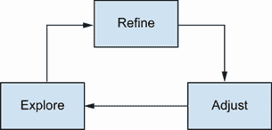

# 第八章：使用 ChatGPT 进行安全的应用程序开发

本章涵盖

+   使用 ChatGPT 进行威胁建模

+   使用 ChatGPT 培养安全思维

+   使用 ChatGPT 缓解风险

在不断发展的软件开发领域，安全担忧已经从事后考虑转变为项目设计和实施阶段的重要组成部分。尽管这种提高的关注度，开发者们往往发现难以跟上应用程序安全领域快速变化的步伐。本章提供了对如何将 AI，特别是 ChatGPT，嵌入到应用程序开发过程的各个阶段以增强应用程序安全性的全面理解，为构建更安全的软件应用程序提供了一套新颖的工具。

随着我们深入探讨这个主题，我们将探讨如何将 ChatGPT 集成到 ISAM 应用程序的开发过程的各个阶段，该应用程序是用 FastAPI 编写的 Python。我们将讨论这个 AI 模型如何帮助识别漏洞、参与威胁建模、评估应用程序设计以识别潜在的不安全性、理解和应用安全最佳实践。

本章的目标不是将 ChatGPT 定位为解决所有安全问题的银弹，而是展示其在开发者安全工具包中作为强大工具的潜力。我们将学习如何积极识别和管理威胁，同时考虑到创建不仅功能性强而且安全的软件的整体目标。在这个过程中，我们将探讨建模威胁、在开发生命周期中融入安全、AI 在安全中的作用等众多话题。让我们开始吧！

安全不是一个特性

安全的应用程序始于设计。虽然它经常被当作一个特性来对待，但它并不是一个特性。生成式 AI 是可用于评估和改进应用程序安全性的工具，但它们不会取代安全专家的输入，也不会使你成为安全专家。有关设计安全应用程序的更多信息，请参阅丹·伯格·约翰逊、丹尼尔·德古恩和丹尼尔·萨瓦诺所著的《设计安全》（Manning，2019；[www.manning.com/books/secure-by-design](https://www.manning.com/books/secure-by-design)）。


软件生命周期（错误）的心理模型，其中安全被视为一个需要根据项目需要优先考虑和降级的特性，或者作为一个在生命周期某个阶段执行的附加功能。然而，安全是一种需要在所有阶段都放在首位的心态。

## 8.1 使用 ChatGPT 进行威胁建模

威胁建模是一种结构化的方法，它帮助团队理解、优先排序和管理系统中潜在威胁。通过模拟攻击者的心态，威胁建模系统地识别漏洞、评估潜在影响，并确定缓解策略。根植于设计阶段，但与整个软件开发生命周期相关，威胁建模在高级安全策略和实际操作之间发挥着至关重要的桥梁作用。

威胁建模不是一个一次性过程。随着新漏洞的发现，系统和外部环境发生变化，因此你必须重新审视并更新你的威胁模型。

### 8.1.1 为什么它在当今的开发环境中很重要

在我们深入探讨使用 ChatGPT 进行威胁建模之前，我们需要退一步思考，为什么我们首先想要做这件事。在当今的开发环境中，对安全的重视程度越来越高，我们必须关注那些显著改变软件开发、部署和访问方式的因素。随着更多服务数字化，攻击面变得更广。从在线银行到健康记录、电子商务，甚至政府服务，现在都可在网上获取，使其成为潜在的目标。

此外，网络威胁不是静态的。新的漏洞每天都在出现，攻击者不断制定新的方法。随着国家支持的网络攻击、勒索软件和网络间谍活动的兴起，危险从未如此严重。

现代架构比以往任何时候都要复杂，因为应用程序通常使用微服务、第三方 API 和云基础设施。这种复杂性可以引入多个潜在的漏洞点。系统不再是孤立的，而是与其他系统相互连接，产生多米诺效应。一个系统的漏洞可能成为攻击其他系统的跳板。

安全漏洞

除了直接的财务影响之外，安全漏洞还可能损害信任，损害公司的声誉，导致法律后果，并导致客户或商业机会的损失。此外，随着欧洲的通用数据保护条例（GDPR）和美国加州消费者隐私法案（CCPA）等法规的实施，组织在保护用户数据方面承担着更大的责任。不遵守规定可能导致重大罚款。

在一个互联、以数字优先的世界里，安全不仅仅是 IT 问题，更是基本的企业需求。确保应用程序从底层开始就考虑安全性可以降低风险和成本，建立信任，并确保系统连续性。

### 8.1.2 ChatGPT 如何帮助进行威胁建模

现在我们已经理解了原因，让我们转向如何利用 ChatGPT 来了解我们周围的网络安全威胁、它们的影响以及潜在的缓解技术。ChatGPT 拥有广泛的网络安全基础知识的知识库；它可以定义标准术语，并以适合你网络安全旅程的任何详细程度向你解释复杂的攻击向量。你可以先要求它解释网络安全原则，什么是 SQL 注入攻击（但不是如何执行它！），或者什么是点击劫持。

作为一种非正式的建模威胁的方法，你可以向 ChatGPT 提出详细假设场景，并询问在这些情况下可能出现的潜在威胁或漏洞。开始时要非常一般化，随着过程的进行进行细化。例如，你可能输入以下提示：

|


| 如果我正在开发一个基于云的电子商务 Web 应用，我应该注意哪些威胁？ |
| --- |

然后深入挖掘，围绕特定威胁进行三角定位：

|


| 攻击者如何在我的电子商务应用中劫持用户的购物车？ |
| --- |

接下来，你可以与 ChatGPT 互动，了解如何评估与各种威胁相关的风险。这可以帮助你确定哪些威胁应该首先解决。在了解一些可能针对你系统的威胁后，你可以与 ChatGPT 讨论潜在的对策、最佳实践和缓解策略。

|


| 我如何评估我的在线服务遭受 DDoS 攻击的风险？ |
| --- |

然后，

|


| 防止跨站脚本攻击的最佳实践是什么？ |
| --- |

你需要定期与 ChatGPT 互动，以刷新你的知识或询问你遇到的新概念或策略。

然而，有一个快速警告：就像往常一样，你必须意识到 ChatGPT 的限制。它没有实时威胁情报或超出其最后更新的知识。对于最新的威胁，请始终咨询最新的资源。尽管 ChatGPT 是一个有价值的工具，但始终与其他权威来源交叉验证其见解。网络安全迅速发展，与多个可信来源保持更新至关重要。在与 ChatGPT 讨论特定威胁后，你可能想查阅来自开放世界应用安全项目（OWASP）、国家标准与技术研究院（NIST）和其他公认网络安全实体等组织的最新文档。

最后，与 ChatGPT 进行互动头脑风暴可以帮助你有效地生成想法，理解复杂的概念，或完善策略，尤其是在像网络安全这样的领域。以下是如何构建和执行此类会议的步骤：

1.  明确说明头脑风暴会议的目标。例如，可以是识别系统中的潜在漏洞、为新的应用程序生成安全措施或讨论提高用户数据保护策略。

2.  通过向 ChatGPT 提供详细背景信息开始会议。如果是关于特定系统或应用程序，请描述其架构、组件、功能以及任何已知的问题或担忧。例如，您可以说

|


| 我正在开发一个基于 Web 的电子商务平台，使用 Docker 容器进行微服务架构。我们正在寻找潜在的安全威胁。 |
| --- |

根据 ChatGPT 的回应，深入探讨特定领域或关注点。例如，您可能说

|


| 请告诉我更多关于容器安全最佳实践的信息。 |
| --- |

或询问

|


| 我如何确保微服务之间的通信安全？ |
| --- |

3.  向 ChatGPT 提出假设情景，并请求反馈或解决方案。这有助于预测潜在的挑战或威胁：

|


| 假设攻击者获得了对其中一个容器的访问权限；应该采取哪些步骤？ |
| --- |

4.  通过扮演魔鬼的代言人，与 ChatGPT 互动。质疑或反驳它提供的想法或建议，以激发进一步的思考并探索不同的角度：

|


| 如果我使用第三方身份验证服务怎么办？这会如何改变安全格局？ |
| --- |

5.  向 ChatGPT 请求具体的步骤或行动项来实施建议的解决方案。例如，您可以询问，

|


| 针对您提到的安全担忧，我应该采取哪些具体步骤来减轻它们？ |
| --- |

注意：随着头脑风暴的进行，记录 ChatGPT 提供的思想、建议和策略。它们在会议后的回顾和实施中将非常有价值。头脑风暴在迭代时最为有效。根据您在一次会议中学到的知识，您可能需要细化问题、调整方法或在下一次会议中探索新的领域。

图 8.1 显示了在头脑风暴会议期间执行的安全反馈循环。



图 8.1 与 ChatGPT 进行头脑风暴会议的工作流程

随着您的项目或场景的进展，重新与 ChatGPT 讨论，以考虑任何变化、更新或新的挑战。最近的更新允许您上传您的系统设计文档，并让 ChatGPT 审查该设计以识别潜在威胁和常见漏洞，就像它可以评估代码一样。

通过以这种方式使用 ChatGPT，您可以从中广泛的知识库中受益，并为您的场景获得有价值的反馈和见解。始终记得将建议与相关领域的最新资源和专家进行交叉验证。

### 8.1.3 案例研究：使用 ChatGPT 模拟威胁建模

除了与 ChatGPT 进行场景分析和互动头脑风暴会议之外，您还可能决定应用一种正式的方法，这是网络安全专业人士常用的：STRIDE。STRIDE 是由微软引入的一种威胁建模方法，旨在帮助识别系统或应用程序中的潜在安全威胁。您可以使用 ChatGPT 和 STRIDE 来模拟威胁并相应地进行分类。

STRIDE

STRIDE 这个缩写代表欺骗、篡改、否认、信息泄露和拒绝服务：

+   *欺骗—*冒充他人或他物。这可能意味着承担用户的身份、设备或甚至系统的身份以获得未经授权的访问。例如，攻击者可能通过欺骗媒体访问控制（MAC）地址来冒充网络上的设备。

+   *篡改—*未经授权修改数据或代码。例如，攻击者可能在中间人攻击中修改传输的数据包。

+   *否认—*恶意（或粗心）用户否认他们执行了特定行为的能力，即使他们确实执行了，也因为缺乏这些行为的证据。例如，用户可能否认下订单或更改某些数据。

+   *信息泄露—*将信息暴露给那些不应有权访问它的人。例如，数据库配置错误可能将敏感用户数据暴露给公众。

+   *拒绝服务（DoS）—*使资源对预期用户不可用或不响应。这可以通过耗尽系统资源或利用特定漏洞来实现。例如，在 DDoS 攻击期间，攻击者可能通过流量淹没一个网站，导致其变慢或完全无响应。

+   *权限提升—*无特权的用户获得了提升的权限，通常允许他们控制整个系统或执行他们未经授权的任务。

在本书的整个过程中，我们一直在开发 ITAM 系统的一部分。作为提醒，该系统用于管理和优化组织的 IT 资产。在本节中，我们将应用 STRIDE 到我们的应用程序中，使用 ChatGPT 协助建模针对该系统的威胁。

让我们从欺骗开始：

|


| 在我们 ITAM 系统的背景下，我们的系统可能如何被欺骗？ |
| --- |

ChatGPT 可能响应的内容可能与以下列表类似。

列表 8.1 ChatGPT 解释欺骗可能如何影响我们的应用程序

```py
MAC Address Spoofing: Most ITAM systems rely on MAC addresses to identify and manage devices on a network. An attacker might spoof the MAC address of an authorized device to gain unauthorized access or to mask a rogue device's presence.
IP Address Spoofing: An attacker could bypass network security measures or divert traffic by masquerading as a trusted IP address. This could lead to unauthorized access to the ITAM system or even denial-of-service attacks.
DNS Spoofing (Cache Poisoning): If the ITAM system relies on domain names for accessing updates or related resources, DNS spoofing can redirect the ITAM server to malicious sites, potentially compromising the system.
Device Identifier Spoofing: Beyond MAC addresses, devices may have other unique identifiers. Spoofing these can allow unauthorized devices to appear as legitimate assets in the ITAM inventory.
User Agent Spoofing: If the ITAM system is accessed via web browsers, attackers can spoof user agent strings to mimic authorized devices or browsers, potentially bypassing certain security checks.
Fake Asset Registration: A malicious actor might introduce fake assets into the system, leading to inaccurate asset tracking, skewed analytics, and potential security loopholes.
Spoofed Update Servers: If your ITAM solution fetches updates from remote servers, attackers could spoof these servers, delivering malicious updates or software.
Phishing & Social Engineering: While not a technical spoofing method per se, attackers can still spoof emails or other communications, pretending to be ITAM administrators or vendors. Unsuspecting employees might then provide sensitive ITAM data.
```

此外，它还可能响应常见的预防或缓解步骤。

列表 8.2 ChatGPT 概述防止此类利用的机制

```py
Network Security: Implement network segmentation, strong firewalls, and Intrusion Detection Systems (IDS) to monitor and block suspicious activities.
Encryption: Encrypt data in transit to protect against man-in-the-middle attacks that could lead to spoofing.
Dynamic Identification: Rotate device identifiers periodically or use dynamic identifiers.
DNS Security: Implement DNS Security Extensions (DNSSEC) to ensure the authenticity of DNS responses.
Authentication and Authorization: Require multi-factor authentication (MFA) for ITAM system access and ensure strict role-based access control.
Regular Audits: Audit the ITAM database frequently to identify discrepancies or rogue assets.
User Education: Regularly train IT personnel and employees about the risks of spoofing and the importance of verifying communications.
```

我们不一一列举 STRIDE 的所有内容，接下来让我们转向否认。这是所有攻击中最不直观的，也是被误解最多的：

|


| 在我们 ITAM 系统的背景下，我们的系统可能受到否认的影响吗？ |
| --- |

ChatGPT 可能在我们系统的背景下对这种风险给出定义。

列表 8.3 ChatGPT 从网络安全的角度定义否认

```py
Repudiation, in a cybersecurity context, refers to the ability of a user (or system) to deny having performed a specific action, even if they did perform it. Regarding ITAM (Information Technology Asset Management) systems, repudiation can pose challenges regarding accountability, traceability, and compliance. Let's explore how repudiation might affect an ITAM system:
```

然后它将这些可能影响我们 ITAM 系统的各种否认风险进行分类。

列表 8.4 ChatGPT 概述的可能否认风险

```py
Denial of Asset Changes: A user might make unauthorized changes to an asset's status or details in the ITAM system and later deny having made such changes. This can lead to inaccuracies in asset tracking, causing potential compliance issues and operational inefficiencies.
Lack of Accountability: If actions within the ITAM system are not appropriately logged or if logs can be altered without a trace, it becomes challenging to hold individuals accountable for their actions. This can result in unauthorized software installations, hardware misallocations, or asset misuse without any accountability.
Financial Discrepancies: Repudiation can lead to financial implications. For instance, if an employee claims they never received a particular hardware asset (like a laptop) when the ITAM system shows they did, it might result in unnecessary additional procurements.
License Violations: Users might install unauthorized software and then deny doing so. Without proper non-repudiation measures, tracking and proving such installations becomes difficult, leading to potential licensing violations.
Security Implications: Malicious insiders or external attackers could exploit the ITAM system to steal or damage assets and deny any wrongdoing. This could pave the way for data breaches, theft of sensitive data, or even financial fraud.
```

ChatGPT 将然后为我们提供减轻这些风险的潜在方法。

列表 8.5 处理否认风险的潜在修复技术

```py
Strong Authentication: Ensure that users accessing the ITAM system go through rigorous authentication processes, ideally with multi-factor authentication (MFA), to ensure that actions can be attributed to specific individuals.
Immutable Logging: Implement tamper-proof logging systems. Every action, change, or transaction within the ITAM should be logged with a timestamp and associated user details.
Digital Signatures: Crucial actions, especially those related to financial transactions or significant asset changes, require a digital signature. This offers an additional layer of verification and non-repudiation.
Role-Based Access Control (RBAC): Ensure users have specific roles and permissions. Limiting access based on job roles can reduce the risk of unauthorized actions and make it easier to trace back activities to particular users.
Regular Audits: Periodically review and audit the logs and transactions in the ITAM system to detect any discrepancies or potential repudiation attempts.
User Training: Educate ITAM system users about the importance of accountability and the consequences of unauthorized actions. Making users aware can reduce inadvertent repudiation instances.
Whistleblower Policies: Encourage employees to report any suspicious activities without fear of retaliation.
```

随着开发实践的演变，我们面临的网络威胁也在不断变化。在本节中，我们探讨了 ChatGPT 的具体属性，使其成为识别和预测潜在网络威胁的有价值资产。凭借其模拟对话、快速分析大量数据和基于模式提供见解的能力，ChatGPT 成为一个有希望的工具体现，可以增强传统的威胁建模方法。

最后，我们简要介绍了 ChatGPT 在威胁建模中的实际应用。这个案例研究强调了在现实生活中的网络安全场景中使用 AI 的实用性，突出了将 ChatGPT 集成到威胁建模过程中的成功、挑战和经验教训。

虽然使用 ChatGPT 等工具模拟外部威胁对于限制或预防对组织及其数据的损害非常有价值，但同样重要的是将我们的注意力转向我们系统的内部，并识别其中的漏洞。我们将在下一节中这样做。

## 8.2 仔细审查应用程序设计并识别潜在漏洞

现代应用程序设计的复杂性有时会隐藏功能和安全性中的细微缺陷。利用 ChatGPT 的分析能力，我们可以深入这些设计，超越传统的人类疏忽和偏见。凭借其广泛的知识和模式识别能力，ChatGPT 提供了一个独特的视角，能够发现常见漏洞并提供可操作的反馈。在本节中，我们将探讨如何通过咨询 ChatGPT，批判性地评估应用程序设计，确保它们不仅功能强大且用户友好，而且能够抵御潜在的威胁。

### 8.2.1 评估设计问题

要开始让 ChatGPT 评估我们的设计，我们可以发出以下提示：

|


| 请审查此应用程序设计并指出设计问题。设计以 mermaid 格式呈现 |
| --- |

然后我们将第二章中的 mermaid 图表复制进来。以下是一些 ChatGPT 在我们的设计中发现的简略问题列表（有趣的是，其中许多建议最初是由 ChatGPT 提供的）。

列表 8.6 ChatGPT 提供的简略设计问题列表

```py
The design described in the Mermaid class diagram is a comprehensive representation of multiple entities involved in an asset management system, with focus on the various assets and their depreciation strategies. Here are some points to consider about this design:

1\. Inheritance vs Composition:
    - The strategies 'StraightLineDepreciationStrategy', 'DecliningBalanceDepreciationStrategy', 'DoubleDecliningDepreciationStrategy', and 'NoDepreciationStrategy' should ideally inherit from 'DepreciationStrategy' to ensure they adhere to the same interface.

2\. DepreciatingAsset class:
    - 'DepreciatingAsset' appears to have a partial definition, perhaps it should either inherit from 'Asset' or be more fleshed out.

3\. Visitor Pattern:
    - The 'LineOfBusinessVisitor' class appears to be implementing the visitor pattern. However, it's not clear if all the methods are necessary. Do you expect every visitable object type ('Hardware', 'Software', 'DepreciatingAsset') to have distinct logic?
```

这并不是一个详尽的列表，但它确实为我们提供了一个反思和改进设计的起点。

### 8.2.2 识别常见漏洞

在本节中，我们深入探讨 ChatGPT 如何利用其广泛的知识库和模式识别能力，在软件设计中揭示隐藏的弱点和潜在威胁，标志着主动网络安全措施的革命性进步。我们将向它询问，

|


| 此设计中是否存在任何漏洞或利用？ |
| --- |

它从长长的列表中吐出了以下几个关键问题。

列表 8.7 ChatGPT 发现的漏洞和利用的简略列表

```py
1\.  Password Security:
The User class stores a password field. It's essential that passwords are not stored as plaintext for security reasons. Consider using a hashing mechanism (e.g., bcrypt) to store password hashes rather than raw passwords.

2\.  Role-Based Access Control (RBAC):
While the Role class seems to address RBAC by having a list of permissions, ensure that the system implementing this design enforces these roles and permissions appropriately. Be particularly careful about functions or methods that modify user roles or permissions.
```

我们可以通过询问 ChatGPT 如何最好地实施其建议来继续这种质询。

在前面的章节中，我们看到了 ChatGPT 如何帮助发现软件设计中的问题。这是一个强大的工具，但正如之前所阐述的，它并不能（也不能）取代对有技能的人的需求。可以这样想：ChatGPT 是一个方便的助手，但人类仍然掌舵。当我们结合使用人工智能和人类智慧时，我们可以使我们的网络世界更安全。这完全是关于团队合作，并利用两者的最佳之处。

## 8.3 应用安全最佳实践

本节是您从开始到结束进行强大软件安全性的必读指南。首先，我们将讨论拥有以安全为重点的心态的重要性。接下来，我们将讨论定期进行安全测试的必要性，以保持一切紧绷。然后，我们将讨论定期的检查或审计，以确保一切保持最新。简而言之，我们将探讨安全工具和正确思考方式。

### 8.3.1 培养安全心态

安全不仅仅是使用正确的工具或遵守最新的协议；它是在每个行动、决策和策略中与安全交织在一起的心态。本节将指导您了解建立这种心态的基础原则，强调在面临现代网络挑战时，警惕性、适应性和持续学习的重要性。

ChatGPT 可以作为安全培训和意识提升的强大工具。您可以用它作为互动工具，教您的团队网络安全的基础，例如什么是跨站脚本攻击以及它是如何工作的。您可以用它来规划事件响应：例如，询问如果您的服务器已被入侵，您应该采取的第一步是什么。

您还可以使用 ChatGPT 来生成安全编码指南和建议。例如，您可以要求它

|


| 为 Python 提供安全的编码指南 |
| --- |

ChatGPT 将为您提供一份长长的列表，包括诸如输入验证、确保您的库安全以及如何安全存储和运行时注入密码的建议。

我们还可以使用 ChatGPT 提供特定于应用程序的指导。例如，

|


| 推荐一个安全部署 Flask Web 应用程序的步骤。 |
| --- |

尽管有无数种方法可以确保我们的应用程序安全，ChatGPT 为我们提供了一个精心挑选的列表。以下列出了选择。

列表 8.8 ChatGPT 关于确保 Flask 安全的顶级建议简表

```py
Deploying a Flask web application securely requires a multifaceted approach that covers everything from code-level security practices to server and network configurations. 

Here are the recommended steps:
1\. Use the Latest Flask Version: Always use the most recent Flask version, as it typically includes security patches for known vulnerabilities.

2\. Avoid Debug Mode in Production: Never run a Flask application with app.debug = True in a production environment. Debug mode can expose sensitive information.

3\. Use a Secure Web Server: Deploy your Flask application behind a production-ready web server like Gunicorn, uWSGI, or mod_wsgi. These are robust servers that can handle real-world traffic and have better security mechanisms.

4\. Implement HTTPS:
Use SSL/TLS to encrypt data between the server and client.
Use tools like Let's Encrypt to get a free SSL certificate.
```

在了解如何安全地开发 Python 软件，特别是基于 Flask 的微服务之后，我们可以开始测试我们的应用程序。

### 8.3.2 持续安全测试

在本节中，我们探讨 ChatGPT 庞大的知识库如何帮助简化决策过程，提供对工具功能的见解，并就有效使用工具以实现最佳应用程序安全提供指导。我们将首先检查静态分析工具和动态分析工具之间的差异。然后我们将使用 ChatGPT 在我们的选择过程中，并看看我们如何使用它来部署工具。

静态应用程序安全测试（SAST）是一种在执行应用程序之前检查应用程序的源代码、字节码或二进制代码的测试过程。SAST 的主要目标是通过对代码库进行分析并识别可能导致安全漏洞的模式或代码段，在开发早期阶段发现安全漏洞。这种方法允许开发者在应用程序运行之前解决漏洞，从而能够检测到在运行时或动态测试中可能被遗漏的问题。SAST 工具通常可以集成到开发环境中，从而实现持续反馈和更快地修复潜在的安全问题。

动态应用程序安全测试（DAST）是一种在应用程序运行时识别安全漏洞的测试过程，通常从外部攻击者的角度进行。与 SAST 不同，SAST 分析源代码、字节码或二进制代码，DAST 评估应用程序的运行时环境。这种方法可以识别在代码中不明显但在执行过程中出现的漏洞，例如与身份验证、会话管理、数据验证和其他运行时相关的问题。DAST 工具通常通过模拟对运行中的应用程序的攻击并监控其响应来运行，这使得它们在检测可被实际攻击利用的漏洞方面特别有用。

考虑到这种区别，我们将要求推荐我们应该为我们的应用程序使用什么：

|


| 你会推荐使用 SAST 还是 DAST 来测试基于 Flask 的 Python 应用程序？ |
| --- |

ChatGPT 可能会输出两种测试方法的比较，然后最终提供推荐。这个推荐可能类似于以下列表。

列表 8.9 ChatGPT 关于确保 Flask 安全的顶级建议简表

```py
For a Flask-based Python application, it's beneficial to use both:

Start with SAST during the development phase to catch potential vulnerabilities early on.

As you move to testing and deployment stages, employ DAST to uncover vulnerabilities that may only be evident when the application is running.

In essence, using both SAST and DAST in tandem provides a more comprehensive security assessment and ensures a robust Flask application.
```

已注意！我们需要努力使用两者。然而，我们将从 SAST 工具开始。让我们通过以下简单提示来获取使用哪个特定库/工具的建议：

|


| 推荐用于 Python 基于 Web 应用程序的 SAST 工具。 |
| --- |

列表 8.10 ChatGPT 对 SAST 工具的建议

```py
For Python-based web applications, several Static Application Security Testing (SAST) tools can help identify vulnerabilities and insecure coding patterns. 

Here are some recommendations:
Bandit: An open-source SAST tool developed by the OpenStack community, Bandit scans Python code to find common security issues in the codebase. It is easily integrated into the CI/CD pipeline and can be customized to target specific issues.

Pyre: Developed by Facebook, Pyre is a performant type checker that can also detect and flag security issues in Python code. It's built to scale and can handle large codebases.

Semgrep: A versatile code analysis tool that provides out-of-the-box support for Python and multiple other languages. Semgrep rules can be tailored for various security checks, and the tool offers a wide range of community-contributed rules for common security issues.

Checkmarx: A commercial tool that supports multiple languages, including Python. Checkmarx offers comprehensive SAST capabilities and can integrate seamlessly into the development lifecycle.
```

将 SAST 工具集成到我们的 CI/CD 流水线中的想法非常吸引人。这种集成应确保这一关键步骤不会被遗漏或绕过，因为它已经嵌入到部署流程中。因此，让我们继续使用 Bandit。但如何操作呢？我们也可以向 ChatGPT 寻求这方面的帮助：

|


| 如果我们想将 bandit 集成到我们的项目中，我们应该如何操作？ |
| --- |

列表 8.11 ChatGPT 安装和使用 Bandit 的说明

```py
Integrating Bandit into your project is a straightforward process. Bandit is a tool designed to find common security issues in Python code. Here's a step-by-step guide to integrate it:

Installation:
You can install Bandit via pip:
pip install bandit 

Run Bandit:
To run Bandit on your project, navigate to the root directory of your Python project and run:
bandit -r . 

The -r flag tells Bandit to recursively scan all files in the given directory. The . indicates the current directory. You can replace . with the specific path if needed.

Configuration:
You can use a .bandit file to customize Bandit's behavior. This allows you to exclude certain tests, ignore certain directories, and more.
For instance, if you want to exclude a certain directory:
bandit -r . --exclude /path/to/excluded/dir
```

尽管 ChatGPT 可以在理解测试结果和提出下一步行动建议方面发挥强大的辅助作用，但请始终记住，它应该补充而不是取代专家判断。特别是在安全等关键领域，将 ChatGPT 的指导与其他资源和专家意见进行核实至关重要。

## 8.4 在静态和传输中加密数据

本节将探讨如何利用 ChatGPT 的知识和分析能力，以获得关于有效加密数据的定制指导。无论你是寻求基础见解的新手，还是希望进行更深入研究的专家，ChatGPT 都准备好提供帮助。让我们借助这个先进的 AI，开始一段加强数据安全之旅。

### 8.4.1 数据加密的重要性

静态数据——即存储时的数据（与传输中的数据相对，传输中的数据正在传输中）——如果没有得到保护，可能会带来重大风险。未加密的数据可以轻易被未经授权的个人访问和读取，使其成为网络犯罪分子的首要目标。如果恶意行为者能够访问存储这些数据的系统或网络，他们可以毫无障碍地提取有价值的信息。

对于企业来说，财务数据（如信用卡详情）的泄露可能导致巨大的经济损失，包括盗窃本身以及可能的诉讼或监管机构的罚款。许多地区和行业都有严格的数据保护法规。不遵守规定，如未能加密敏感数据，可能导致高额罚款和法律诉讼。如前所述，欧盟的 GDPR 和加州的 CCPA 是显著的例子。

没有加密，数据不仅可能被读取，还可能被未经授权的第三方更改。这可能导致错误信息、数据损坏或恶意行为，如毒化数据集。由于未加密数据导致的泄露可能会严重损害组织的声誉，导致客户、客户和合作伙伴失去信任。

需要注意的是，尽管加密是安全的关键层，但它并非万能药。有效的数据安全需要多层方法，包括访问控制、定期安全审计、安全备份和用户教育等措施。

未加密的数据是导致全球多起重大数据泄露事件的关键因素。其中一个最近且臭名昭著的真实世界事件，由于未能正确保障数据，是 2015 年的 Ashley Madison 泄露事件。这次对流行约会网站的攻击导致 3700 万用户的用户数据泄露，包括真实姓名、地址等更多信息。它给用户带来了广泛个人和职业后果，引发了几起诉讼，并对公司的形象造成了重大损害。

类似于此类事件强调了不正确加密和保障数据可能带来的巨大后果。除了经济损失外，公司还会遭受声誉损害、客户信任度降低、法律后果以及更多问题。

### 8.4.2 静态数据加密

加密是确保数据安全的基础，选择正确的算法至关重要。加密方法可能很复杂，但 ChatGPT 可以通过提供基本加密概念的解释来指导您做出明智的选择，例如对称加密与不对称加密、块加密与流加密，以及公钥基础设施。它可以解释广泛使用和行业认可的算法，如高级加密标准（AES）、RSA、椭圆曲线密码学（ECC）等，以及这些算法的优点、潜在漏洞和理想用例。

在本节中，我们将与 ChatGPT 合作，了解如何安全地将一些敏感应用程序数据存储在数据库中。我们将从一般问题开始，询问如何使用 Python 加密和存储这些数据，使用以下提示：

|


| 如何在 Python 中加密敏感数据？ |
| --- |

ChatGPT 将解释如何使用加密库进行加密，并提供如何加密和解密文本的示例。

列表 8.12 ChatGPT 解释如何在 Python 中加密数据

```py
Encrypting sensitive data in Python involves using encryption libraries to transform plain text into ciphertext so that only someone with the correct decryption key can read it. One of the most popular libraries for encryption in Python is cryptography.

Encrypting Data
from cryptography.fernet import Fernet 
# Generate a key 
key = Fernet.generate_key() 
cipher_suite = Fernet(key) 

# Your sensitive data 
plaintext = b"My Secret Data"

# Encrypt the data 
ciphertext = cipher_suite.encrypt(plaintext) 
print(f"Encrypted Data: {ciphertext}") 

Decrypting Data
# Use the same key to decrypt 
decrypted_text = cipher_suite.decrypt(ciphertext) 
print(f"Decrypted Data: {decrypted_text.decode('utf-8')}")
```

除了这个例子，ChatGPT 可能还会提供一些笔记和几点注意事项。以下警告是在询问如何进行加密的会话期间提供的。

列表 8.13 ChatGPT 提供加密最佳实践

```py
Always store the key safely. Anyone with access to the key can decrypt your encrypted data.

It's often advisable to not hard-code your key within the script. Instead, use secure mechanisms to store and retrieve the encryption key.

The above example uses symmetric encryption, where the same key is used for encryption and decryption.

For added security layers, you might also consider implementing other techniques such as hashing (for password storage), public-private key encryption (asymmetric encryption), and more.

Make sure you understand the basics and implications of encryption, as it's a critical area, especially when handling sensitive or personal data.
```

接下来，我们可能想询问 ChatGPT 如何将加密应用于我们数据库中存储的数据：

|


| 我如何使用这个来在数据库中存储敏感数据？ |
| --- |

生成的输出将先介绍一些一般最佳实践和指南，然后再进入如何实现的示例。

列表 8.14 ChatGPT 数据库加密最佳实践

```py
Storing sensitive data in a database using encryption is a common practice to ensure that even if the database is compromised, the data remains secure and unreadable without the encryption key. Here's a step-by-step approach to use the encryption technique discussed above for storing sensitive data in a database:

1\. Key Management:
   - Generate a key using 'Fernet.generate_key()'.
   - Store this key securely, such as in a hardware security module (HSM), a secure key management service (like AWS KMS or Azure Key Vault), or in environment variables for local projects. Never store the key in the database or in your code directly.

2\. Data Encryption:
   - Before inserting the data into the database, encrypt it using the 'cryptography' library as shown in the previous answer.

3\. Database Interaction:
   - Use your preferred database connection library (like 'sqlite3', 'psycopg2' for PostgreSQL, 'PyMySQL' for MySQL, etc.) to insert the encrypted data into your database.
   - For retrieval, fetch the encrypted data from the database and decrypt it using the stored key.

4\. Decryption:
   - Whenever you need to read the sensitive data, retrieve the encrypted value from the database and decrypt it using the key.
```

在概述最佳实践后，ChatGPT 可能会提供一个示例，说明您如何加密和解密您可能想要存储在数据库中的数据。在本次会话中，它提供了一个使用 SQLite3 的示例。我们本可以指定它提供一个使用任何框架的示例；SQLite3 只是碰巧在这个例子中使用了它。与大型语言模型的大部分输出一样，输出高度依赖于许多因素。

列表 8.15 ChatGPT 使用 SQLite3 存储和检索数据的示例

```py
import sqlite3
from cryptography.fernet import Fernet

# Key management
key = Fernet.generate_key()  
# Ideally, you'd store this securely and retrieve as needed
cipher_suite = Fernet(key)

# Encrypt the data
plaintext = b"My Secret Data"
ciphertext = cipher_suite.encrypt(plaintext)

# Create database and table
conn = sqlite3.connect('sensitive_data.db')
cursor = conn.cursor()
cursor.execute('''CREATE TABLE IF NOT EXISTS 
secure_data (id INTEGER PRIMARY KEY, data BLOB)''')
conn.commit()

# Insert encrypted data into database
cursor.execute("INSERT INTO secure_data (data) VALUES (?)", (ciphertext,))
conn.commit()

# Retrieve and decrypt data
cursor.execute("SELECT data FROM secure_data WHERE id=?", (1,))
encrypted_data = cursor.fetchone()[0]
decrypted_data = cipher_suite.decrypt(encrypted_data)
print(decrypted_data.decode('utf-8'))

conn.close()
```

此外，ChatGPT 将在您尝试确保数据静态安全时提供一些重要考虑事项。

列表 8.16 ChatGPT 最终重要注意事项

```py
- When designing for production systems, consider using a dedicated ORM like SQLAlchemy or Django's ORM to handle database interactions.

- Always back up your encryption keys. Losing the key means losing access to the encrypted data.

- Consider implementing additional layers of security, like hashing for passwords and regularly rotating your encryption keys.

- Ensure that the rest of your application is also secure. Encryption protects data at rest, but you should also think about securing data in transit (using HTTPS, for example) and validating input data to prevent SQL injections and other vulnerabilities.
```

最后提醒一点，这一点非常重要：尽管 ChatGPT 可以提供大量有关加密的信息和指导，但与领域专家合作并考虑当前行业标准，特别是对于关键应用来说至关重要。随着计算能力的增长和新漏洞的发现，加密领域不断演变，因此保持更新至关重要。

### 8.4.3 传输中的数据加密

作为开发者，我们不仅负责创建高效和功能性的应用程序，还要确保这些应用程序能够抵御潜在的威胁。本节深入探讨如何利用 ChatGPT 的力量来分析、评估和加强您的 REST 端点的安全性。利用 ChatGPT 庞大的知识库和分析能力，我们将探讨主动措施、最佳实践和实时解决方案，以确保您的端点免受威胁。让我们踏上将先进的人工智能与强大的安全协议相结合，构建更安全、更具弹性的应用程序的旅程。

我们将征求 ChatGPT 关于如何确保我们的数据在传输过程中的安全性的建议：具体来说，如何对从我们的 REST 控制器到网页浏览器的流量进行端到端加密。我们可以使用以下提示：

|


| 我们如何确保我们的 Flask REST 端点安全？ |
| --- |

列表 8.17 ChatGPT 关于如何确保我们的 REST 应用程序安全的建议

```py
Securing your Flask REST endpoints is crucial to protect your application and its data. Here's a step-by-step guide to enhance the security of your Flask REST API:

1\. Use HTTPS:
Always serve your Flask application over HTTPS to encrypt data in transit. This can prevent man-in-the-middle attacks. You can use libraries like Flask-Talisman or set up a reverse proxy with Nginx/Apache that serves the application over HTTPS.

2\. Authentication:
Token-based authentication (e.g., JWT): Use libraries like Flask-JWT or Flask-JWT-Extended to implement JWT-based authentication.
OAuth: If you're building a third-party application, consider using OAuth to allow users to grant limited access to their data without exposing their credentials.

3\. Authorization:
Ensure that authenticated users can only access resources they are authorized to. For example, a user should not be able to delete another user's data unless they have the proper permissions.

4\. Rate Limiting:
Use extensions like Flask-Limiter to restrict the number of requests a client can make to your API within a specified time frame.

5\. Data Validation:
Always validate incoming data to avoid injection attacks, unexpected behaviors, or crashes. Use tools like Marshmallow or Flask-Inputs.

6\. Avoid Exposing Stack Traces:
Ensure that your Flask application is running in production mode (app.debug = False) to prevent potentially sensitive information from being exposed in error messages.
```

在现实世界中，我们会继续这个过程以确保我们的 Kafka 主题的流量安全（尽管在我们聘请安全工程师之前不会这么做）。

另一点需要注意的是：安全性通常涉及评估权衡并确定哪些是可以接受的。例如，在实施加密时，了解相关的权衡至关重要，如潜在的性能影响、增加的复杂性和管理开销。例如，将会有额外的计算开销。加密和解密过程需要计算资源。特别是对于提供更高安全性的算法，计算成本可能相当高。您需要将其纳入您的容量规划中。

此外，延迟几乎肯定会增加。如果加密没有得到优化，实时操作，如流媒体服务和语音通信，可能会出现明显的延迟。加密、传输、解密和处理数据所需的时间可能会增加响应时间。

加密对于安全至关重要，因此在实施时必须全面了解相关的挑战。许多这些挑战可以通过适当的规划、使用优化的工具和最佳实践来缓解，但它们不应被低估。鉴于数据在当今数字景观中的价值日益增加，权衡通常是值得努力的。然而，理解和准备这些开销可以使加密之旅更加顺畅和有效。

## 摘要

+   您已经学习了如何使用 ChatGPT 的知识来识别潜在威胁，评估威胁场景，确定漏洞，并将应用程序设计与最佳实践进行比较。

+   互动问答可以帮助您了解常见的设计缺陷和漏洞，并在软件开发中应用行业标准的安全实践。

+   您已经了解了如何生成安全代码指南，接收定制建议，并在了解相关权衡的同时获得选择合适加密算法的指导。

+   您可以使用 ChatGPT 与静态和动态分析工具进行综合安全评估，解码测试结果，并获得修复建议，培养开发人员和 IT 人员的安全中心思维。
