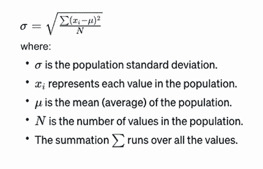
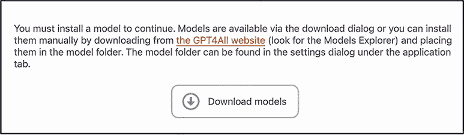
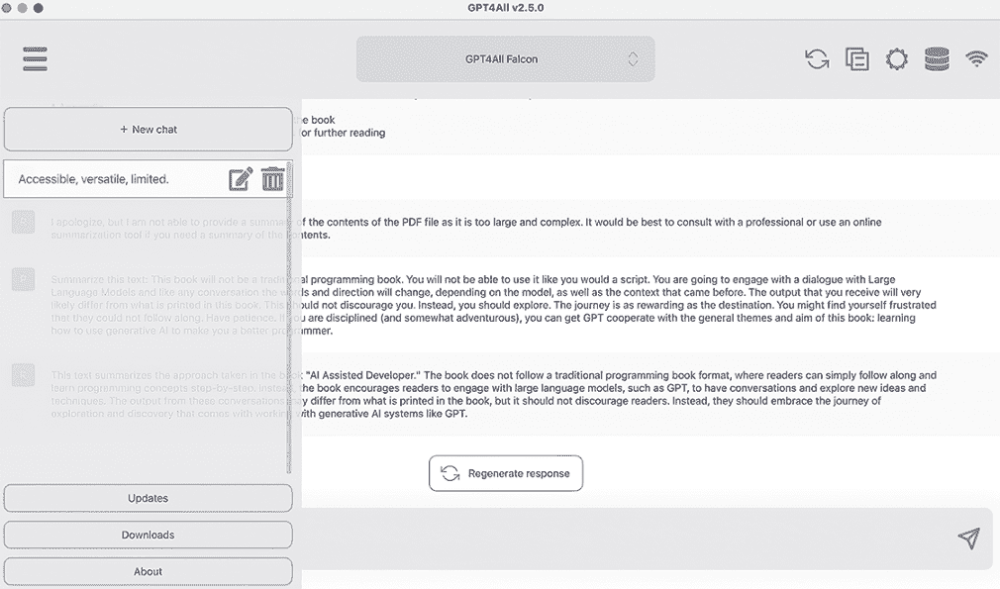

# 9 在路上 GPT-ing

本章涵盖

+   在本地运行大型语言模型

+   比较两个本地托管的大型语言模型的输出结果与 ChatGPT 的输出结果

+   确定何时使用离线模型是合适的

想象一下，你正在前往世界另一端的人工智能会议的路上。你正在飞机上，飞行在离地面 35,000 英尺的高度，你想要为你的应用程序原型设计一个新功能。飞机的 Wi-Fi 既慢又贵。如果你不是为那个破旧的、几乎无法使用的 GPT 支付所有这些钱，而是在你的笔记本电脑上有一个离线的运行，那会怎么样？本章将回顾开发者运行本地大型语言模型（LLM）的选项。

## 9.1 动机理论

介绍性场景并不算太夸张。尽管高速互联网的普及率在增加，但它尚未实现全面覆盖。你可能会发现自己身处没有宽带的地方，无论是家里、路上、学校还是办公室。希望这本书已经成功地论证了，你应该将 LLM 作为你的开发者工具包中的工具使用。因此，你需要采取预防措施，确保你始终以某种形式拥有 LLM。随着你的使用，你将从中获得更多。就像你对集成开发环境的依赖一样，没有它，你仍然是一个优秀的开发者；然而，有了它，你将更加出色。

但不必担心。有许多选项可供你选择。本章将介绍两种，都不需要复杂和痛苦的安装过程。你不需要记住特定供应商的 API。这些方法与使用 ChatGPT 并没有太大的不同。你的提示技巧将完全可移植。准备好了吗？让我们开始吧。

## 9.2 自主托管 LLM

当我们考虑在我们的本地机器上运行 LLM 时，我们立即会遇到几个问题：第一个问题是 LLM 通常需要大量的计算资源。运行这些模型通常需要高性能的 GPU。这种硬件的成本可能很高。这些模型的大尺寸意味着它们需要大量的内存来加载和运行。即使对于高端 GPU 系统来说，这也可能是一个挑战，因为它们可能没有足够的 VRAM 来容纳模型。我们需要考虑的第二个问题是这些模型的输出质量相对于 ChatGPT 等托管 LLM 的质量。

本章探讨了两个显式选择的模型实例，因为它们不需要昂贵的硬件。这些模型运行在普通的商用硬件上，例如这本书所写的 Apple MacBook Pro M2 硅芯片。我们将从 Llama 2 开始，这是 Meta 的 LLM 开发者，在 2000 亿个标记上训练，并提供 70 亿、130 亿和 700 亿参数选项。Llama 2 在本地安装和运行时可能会遇到困难；幸运的是，有一个名为 Ollama 的 Docker 版本，我们将在本章的第一部分中使用。在章节的后半部分，我们将使用 GPT-4All。

这就留下了第二个需要解决的问题。为此，我们将使用 ChatGPT 生成的输出作为基准，来衡量这些本地模型。这并不令人惊讶，但这些模型相对于基准表现非常好。

### 9.2.1 使用 ChatGPT 进行基准测试

在本章中，我们将使用一个新颖的问题（至少在这本书中是这样）：计算整数列表的标准差。标准差衡量一组值的变异。在整个章节中，我们将使用相同的提示并将其呈现给每个模型：

|


| 作为一名数学家，您正在尝试使用纯 Python 计算列表的标准差。请向我展示您将使用的代码，并一步一步地引导我。 |
| --- |

ChatGPT 提供了以下关于涉及步骤和方法的解释。

列表 9.1 ChatGPT 对计算标准差的解释

```py
Computing the standard deviation of a list of numbers in pure Python involves a few steps. Let's walk through them one by one with the code.

1\.   Calculate the Mean (Average): The first step is to find the mean of the list. The mean is calculated by summing all the numbers and then dividing by the count of numbers.

2\.   Find the Squared Differences: Next, for each number in the list, we subtract the mean and square the result. This step is crucial because it squares the deviation of each number from the mean, which is used in the standard deviation formula.

3\.   Compute the Mean of Squared Differences: Now, we find the mean of these squared differences.
4\.   Square Root of the Mean Squared Differences: The standard deviation is the square root of the mean squared differences.

Here's the Python code to compute the standard deviation:

def std_dev_chat_gpt_attempt_1(lst):
    # Step 1: Calculate the mean
    mean = sum(lst) / len(lst)

    # Step 2: Find squared differences
    squared_diffs = [(x - mean) ** 2 for x in lst]

    # Step 3: Compute the mean of squared differences
    mean_squared_diffs = sum(squared_diffs) / len(lst)

    # Step 4: Square root of the mean squared differences
    std_dev = mean_squared_diffs ** 0.5

    return std_dev
```

如果我们编写一个小的`main`函数来计算从 1 到 4 的整数列表的总和，我们得到 1.4142135623730951 或其近似值。

列表 9.2 `main`函数驱动我们的标准差计算

```py
if __name__ == '__main__':
    numbers = [1, 2, 3, 4, 5]
    print(std_dev_chat_gpt_attempt_1(numbers))
# should output 1.4142135623730951
```

随意使用您喜欢的计算器、财务建模程序或其他机制来验证结果。您会发现这个值或多或少是正确的。现在我们已经有了可以比较的基准，我们可以开始我们的比较了。

### 9.2.2 让 Llama 2 输出答案

是时候介绍我们的第一个本地运行的 LLM（大型语言模型），Llama 2 了。正如之前提到的，这个模型可能需要相当大的努力才能安装（至少在撰写本文时是这样）。为了使评估这个模型更容易，我们将使用 Docker 版本：Ollama。以下两个 Docker 命令将运行我们的模型。

列表 9.3 启动和运行 Ollama

```py
docker run -d -v ollama:/root/.ollama -p 11434:11434 --name ollama ollama/ollama

docker exec -it ollama ollama run llama2
```

如果这个操作正确，您最终会看到一个由三个大于号（`>`）组成的提示。第一次运行此命令时，Ollama 需要下载 Llama 2 模型，该模型有数 GB 大小。这可能需要一段时间，并且需要稳定的互联网连接来完成。然而，一旦完成，您将不再需要互联网连接。因此，请确保在离线模式下使用 Ollama 之前运行此命令。

在安装并运行 Ollama 之后，我们现在可以要求 Llama 2 自我介绍：

|


| 假设你是《生成式 AI》一书的作者。你正在编写一个关于在本地机器上运行 LLM 的章节。你将如何描述 Llama？ |
| --- |

列表 9.4 Llama 2 对自己的一些背景介绍

```py
As the author of a book on Generative AI, I would be delighted to introduce readers to Llama, a powerful and versatile language model that can be run locally on one's machine. Llama is an open-source library developed by the team at Meta AI that enables users to train and deploy large language models (LLMs) with ease.

Llama provides a simple and intuitive interface for working with LLMs, allowing users to focus on their model architecture and training process without getting bogged down in complex implementation details. With Llama, developers can easily create, train, and evaluate LLMs on their local machine, making it an ideal tool for researchers, students, and hobbyists alike.

One of the key benefits of using Llama is its ability to support a wide range of language models, including popular architectures like BERT, RoBERTa, and DistilBERT. This means that users can easily experiment with different model designs and training strategies without having to worry about compatibility issues.

Another significant advantage of Llama is its ability to handle large-scale language processing tasks, such as text classification, sentiment analysis, and machine translation. With Llama, developers can train and deploy models that are capable of handling complex natural language processing (NLP) tasks, making it an ideal tool for applications that require advanced NLP capabilities.

In addition to its functionality, Llama also boasts a robust and extensible architecture that allows users to easily integrate it into their own projects or workflows. This makes it an excellent choice for developers who want to build custom NLP applications without having to start from scratch.

Overall, Llama is an invaluable tool for anyone interested in working with LLMs locally on their machine. Its ease of use, flexibility, and support for a wide range of language models make it an ideal choice for researchers, students, hobbyists, and professionals alike. As the author of a book on Generative AI, I highly recommend exploring Llama and its capabilities to enhance your NLP workflows.
```

在介绍完毕之后，我们可以开始评估 Llama 2 的输出，将其与 ChatGPT 产生的输出进行比较。我们有一个已知是正确的基线答案，因此我们可以准确地评估 Llama 2 提供的代码的正确性。让我们用之前的提示让 Llama 2 计算一个数字列表的标准差：

|


| 作为一名数学家，你正在尝试使用纯 Python 计算一个列表的标准差。请向我展示你会使用的代码，并一步一步地引导我。 |
| --- |

列表 9.5 Llama 2 第一次尝试计算标准差

```py
Of course! Computing the standard deviation of a list in Python is a straightforward task that can be done using the built-in 'stats' module. 

Here's the code:
import statsmodels.api as sm

# Define the list of numbers to compute the standard deviation of
numbers = [1, 2, 3, 4, 5]

# Use the stats module to compute the standard deviation
std_dev = sm.stats.stdev(numbers)

# Print the result
print("Standard deviation of {0}: {1}".format(numbers, std_dev))
'''
Let's go through each line of the code:

1\. 'import statsmodels.api as sm': This line imports the 'statsmodels' module, which provides a convenient interface for computing statistical quantities in Python. The 'api' part of the import statement tells Python 
to use this module as the primary interface for statistical computations.

2\. 'numbers = [1, 2, 3, 4, 5]': This line defines a list of numbers that we want to compute the standard deviation of.

3\. 'std_dev = sm.stats.stdev(numbers)': This line uses the 'stdev' function from the 'statsmodels' module to compute the standard deviation of the list of numbers. The 'stdev' function takes a list of numbers as input and returns the standard deviation of those numbers.

4\. 'print("Standard deviation of {0}: {1}".format(numbers, std_dev))': This line prints out the result of the computation using a formatted string. The first argument to the 'format' method is the name of the list (in this case, 'numbers'), and the second argument is the value of the standard deviation.

That's it! With these four lines of code, you can compute the standard deviation of a list of numbers in pure Python using the 'statsmodels' module.
```

虽然这可能是我们在现实世界中会这样做的方式（恭喜，Llama 2），但它并没有提供给我们一个苹果对苹果的比较。让我们重新构建并细化问题：

|


| 不要使用任何库，内置的 Python 函数。 |
| --- |

好的，技术上这并不是一个问题，但希望它能完成这项任务。

列表 9.6 Llama 2 第二次尝试计算标准差

```py
Of course! Here's how you can compute the standard deviation of a list of numbers using only built-in Python functions:
'''python
def stdev(numbers):
    n = len(numbers)
    sum = 0
    for i in range(n):
        sum += numbers[i]**2
    return math.sqrt(sum / (n - 1))

numbers = [1, 2, 3, 4, 5]
std_dev = stdev(numbers)
print("Standard deviation of {0}: {1}".format(numbers, std_dev))
'''
Let me explain how the code works:

1\.   'def stdev(numbers):': This line defines a function called 'stdev' that takes a list of numbers as input.

2\.   'n = len(numbers)': This line calculates the length of the input list using the 'len()' function.

3\.   'sum = 0': This line initializes a variable 'sum' to 0.

4\.   'for i in range(n):': This line starts a 'for' loop that iterates over the elements of the input list.

5\.   'sum += numbers[i]**2': This line calculates the sum of the squares of the input numbers using the 'numbers[i]' index. The '**2' operator raises each number to the power of 2, which is equivalent to squaring it.

6\. 'return math.sqrt(sum / (n - 1))': This line calculates the standard deviation of the list using the formula: 'std_dev = sqrt(sum / (n - 1))', where 'sum' is the sum of the squares of the input numbers, and 'n' is the length of the input list. The 'math.sqrt()' function computes the square root of the result.

7\. 'print("Standard deviation of {0}: {1}".format(numbers, std_dev))': This line prints out the result of the computation using a formatted string. The first argument to the 'format' method is the name of the list (in this case, 'numbers'), and the second argument is the value of the standard deviation.

That's it! With these seven lines of code, you can compute the standard deviation of a list of numbers using only built-in Python functions.
```

仔细的读者（如果你一开始错过了这个，不要担心）可能会注意到 Llama 2 从列表中的项目数量中减去了一个。这很奇怪。它与 ChatGPT 的响应不匹配。让我们看看我们能否弄清楚原因。让我们询问它：

|


| 标准差的公式是什么？ |
| --- |

列表 9.7 Llama 2 对标准差公式的理解

```py
The formula for the standard deviation (SD) of a set of data is:

SD = √(Σ(xi - μ)² / (n - 1))

Where:

* SD is the standard deviation of the data set
* μ is the mean of the data set
* xi is each individual value in the data set
* n is the number of values in the data set
* Σ is the summation symbol, indicating that the formula calculates the sum of the squared differences between each value and the mean.

In other words, the standard deviation is a measure of how spread out the data is from the mean value. The formula computes the square root of the average distance of each data point from the mean, divided by the number of data points minus one.
```

这与 Llama 2 生成的代码一致，所以这是好的。然而，它并没有解释为什么这个输出和 ChatGPT 的输出之间有明显的差异。让我们直接询问它为什么减去了一个：

|


| 当你从列表中的数字数量减去 1 时，这是否意味着增加一个自由度？如果是，为什么？ |
| --- |

如果你以前学过统计学，你可能已经看到了接下来会发生什么。如果没有，Llama 2 将提供一个有用的解释，说明*自由度*的含义以及为什么它被使用。

列表 9.8 Llama 2 对自由度的解释

```py
Yes, when you subtract 1 from the number of numbers in the list, it is because you are adding a degree of freedom. The degree of freedom (df) is a term that appears in the formula for the standard deviation, and it represents the number of independent observations in the data set.

In our case, we have a list of 5 numbers, so the degree of freedom (df) is 4\. This means that we have 4 independent observations (the 5 numbers in the list), and we need to account for the fact that we are computing the standard deviation of this set of independent observations.

The reason we subtract 1 from the number of numbers in the list is because we want to include the mean value itself as one of the observations in our data set. If we didn't subtract 1, then the mean value would be counted twice (once as a data point and once as the mean), which would give us an incorrect value for the standard deviation.

So, by subtracting 1 from the number of numbers in the list, we are effectively removing the mean value from the data set and treating it as a single observation, along with the other 4 numbers. This allows us to compute the standard deviation correctly using the formula above.
```

让我们快速绕道回答这个问题：标准差的公式是什么？答案是，哪一个？实际上有两个：样本和总体。样本标准差是指从更大的总体中抽取的子集或*样本*中的数据点计算出的标准差。这个公式在图 9.1 中展示并解释了。这用于处理有限信息时，不能应用于整个数据集（总体）。这与*总体*标准差形成对比，总体标准差是指个别数据点与总体平均值偏离的程度。这个公式在图 9.2 中展示。


图 9.1 样本标准差的公式

这两个公式都涉及将每个数据点与平均值的差值平方，然后将这些平方值相加，最后取和的平方根。这提供了围绕平均值值分布的度量。



图 9.2 总体标准差的公式

因此，我们可以得出结论，Llama 2 生成了一个用于计算样本标准差的函数，而不是总体标准差（基准）。鉴于这属于特定于统计学的领域，我们可以问，

|


| 如果我要求你扮演统计学家角色而不是数学家角色，你会如何改变你的回答？ |
| --- |

列表 9.9 Llama 2 扮演统计学家角色的回答

```py
Ah, an excellent question! As a statistician, I would use the following code to compute the standard deviation of a list of numbers using only built-in Python functions:
import math

# Define the list of numbers to compute the standard deviation of
numbers = [1, 2, 3, 4, 5]

# Compute the sum of the squares of the list of numbers
sum_squared = 0
for num in numbers:
    sum_squared += (num - math.mean(numbers)) ** 2

# Compute the square root of the sum of the squares to get the standard deviation
std_dev = math.sqrt(sum_squared)

print("Standard deviation of {0}: {1}".format(numbers, std_dev))

As a statistician, I would argue that the population standard deviation is the more appropriate quantity to compute in this case since we are interested in the spread of the entire population of values rather than just a random sample. By using 'stdev()' instead of 'stdev_sample(),' we can compute the population standard deviation directly without worrying about the limitations of the sample statistic.

Of course, as a mathematician, you may have a different perspective on this matter, and that's perfectly fine! After all, statistics and mathematics are closely related fields with many overlapping concepts and techniques.
```

如果我们要求 Llama 2 扮演统计学家角色，它会改变其回答。不幸的是，它没有将结果除以数字列表的长度。一旦这个问题得到解决，我们将得到正确的总体标准差。让我们记住，LLMs 可以自信地产生错误的答案。始终将结果与您的知识或专家的知识进行双重检查。现在，键入 **`/bye`** 以结束您的会话。（在 Llama 2 中键入 `/bye` 表示您希望终止会话。）

让我们关注另一个我们可以在本地运行的 LLM：GPT-4All。

### 9.2.3 使用 GPT-4All 民主化答案

GPT-4All 是由 Anthropic 开发的一款开源软件，它允许用户训练和操作他们自己的大型语言模型（LLMs）。它基于 GPT-3，因此可能不如基于 GPT-4 的模型有效；然而，它可以在没有互联网连接的个人电脑上直接运行。尽管名称相似，但它与 GPT-4 完全无关。

在我们深入使用它之前，让我们让 GPT4-All 自我介绍，使用以下提示：

|


| 假设你是《生成式人工智能》一书的作者。你正在编写关于在本地运行 LLM 的章节。你将如何描述 GPT-4All？ |
| --- |

列表 9.10 GPT-4All 对自身的描述

```py
GPT-4All is an open-source implementation of the Generative Pretrained Transformer (GPT) model architecture that allows users to run a Large Language Model (LLM) locally on their machines. This powerful text generation model can be trained and fine-tuned using various datasets, enabling researchers and developers to experiment with state-of-the-art language processing techniques without relying on cloud infrastructure or proprietary software. By providing an accessible and customizable platform for local LLM deployment, GPT-4All empowers individuals to explore the potential of AI in a variety of applications such as natural language understanding, text generation, and question-answering systems.
```

与 Ollama 不同，GPT-4All 需要安装。幸运的是，这个过程相对快速且痛苦不大：导航至 [`gpt4all.io/`](https://gpt4all.io/)，下载适合您电脑的安装程序，并按照安装说明进行操作。安装应用程序后，您将收到下载模型的说明，如图 9.3 所示。



图 9.3 GPT-4All 要求您下载模型才能运行。

我下载并使用了 Mistral OpenOrca，这是一个高性能的并行和分布式编程框架，旨在简化在高性能计算集群或云环境中开发大规模、数据密集型应用程序的过程。它特别适合处理大数据处理任务、科学模拟、机器学习算法以及其他需要高效资源利用和跨多个节点可扩展性的计算密集型工作负载。Mistral OpenOrca 提供了一套工具和库来管理分布式环境中的作业调度、通信、容错和负载均衡，使其成为开发复杂项目、需要高性能和并行性的开发者的理想选择。GPT-4All 的介绍和本段的大部分内容都是由 Mistral OpenOrca 生成的。

如果你从设置中点击下载按钮，你会看到如图 9.4 所示的下载模型。你还可以在菜单中找到完整的聊天历史，如图 9.5 所示。


图 9.4 GPT-4All 中下载的模型



图 9.5 与所选 GPT-4All 模型进行的聊天列表

让我们通过以下提示来消除一些疑虑：

|


| 生成输出是否需要活跃的互联网连接？ |
| --- |

列表 9.11 GPT-4All 保证不需要互联网

```py
No, an active internet connection is not required to generate output using GPT-4All. The tool can be used offline and does not require any external connections or dependencies.
```

现在我们可以继续比较 GPT4-All/Mistral OpenOrca（以下简称为 GPT-4All）与以下提示：

|


| 作为一名数学家，你正在尝试使用纯 Python 计算列表的标准差。请向我展示你会使用的代码。 |
| --- |

列表 9.12 GPT-4All 尝试计算标准差

```py
To calculate the standard deviation of a list in Python, you can follow these steps:

1\. Calculate the mean (average) of the numbers in the list.
2\. Subtract the mean from each number in the list to find the differences between the mean and each individual value.
3\. Square each difference obtained in step 2.
4\. Find the average of these squared differences. This is the variance.
5\. Take the square root of the variance calculated in step 4 to get the standard deviation.

Here's a Python code snippet that implements this algorithm:

def std_dev(numbers):
    mean = sum(numbers) / len(numbers)

    differences = [x - mean for x in numbers]  
# Subtract the mean from each number.
    squared_differences = [y * y for y in differences]  
# Square each difference.

    variance = sum(squared_differences) / len(numbers)  
# Calculate average of squared differences (variance).
    return math.sqrt(variance)  # Return the standard deviation.
```

有几点需要注意。首先，GPT-4All 生成了计算总体标准差的代码。其次，文本和代码生成得非常快（在我的电脑上，比 Ollama 快四到五倍）。第三，代码完全正确！鼓励你下载不同的模型，询问每个模型擅长什么，并比较结果。

你可能会想知道何时使用 Llama 2 与 GPT-4All 和 ChatGPT。这是一个很好的问题！看看图 9.6。Llama 2 是一个优秀的通用模型。它擅长总结大量文本并撰写上下文适当的文本段落。GPT-4All 的使用案例与可用的模型一样多样化。例如，Mistral OpenOrca 在你需要一个能够有效处理各种语言的多元语言模型时非常理想。如果你的主要目标是与 AI 模型进行自然语言对话并获得基于输入的最准确响应（这确实应该是你想要的），ChatGPT 是最佳选择。ChatGPT 的一个明显限制是它需要一个持续的互联网连接。


图 9.6 本章中使用的模型比较

## 摘要

+   本地 LLM 需要大量的计算资源和昂贵的硬件才能实现最佳性能；然而，像 Llama 2 这样的替代方案可以在普通的商用硬件上运行，并提供不同的参数选项。这些模型可以生成通常质量较高的输出，但并不完全达到像 ChatGPT 这样的托管 LLM 的响应质量（至少在撰写本文时是这样）。

+   总体标准差和样本标准差都用于衡量数据集中的变异性。它们在考虑整个总体还是较小的子集或样本方面有所不同；这意味着前者为整个群体提供了一种精确的测量，而后者是基于其一部分的估计。

+   Llama 2 在处理各种文本方面表现出色，例如生成摘要或编写连贯的文本和代码段落，GPT-4All 提供了各种用例，包括多语言支持；而 ChatGPT 在与自然语言进行对话并给出准确响应方面表现出色（但需要互联网连接）。

+   除了离线可用性之外，还有各种情况，使用像 Llama 2 或 GPT-4All 这样的 LLM 的离线版本是有意义的：

    +   *隐私和安全问题—*离线模型消除了在互联网上传输敏感数据的需要，降低了隐私风险和潜在的网络安全威胁。

    +   *成本节约—*在自己的硬件上运行本地模型可能会降低使用 ChatGPT 或 OpenAI API 等在线服务相关的云计算成本。
