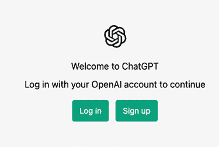
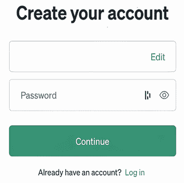
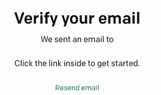
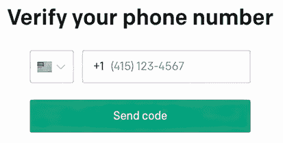
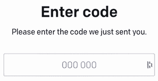

# 附录 A. 设置 ChatGPT

在本附录中，我们将设置 ChatGPT。您将在网站上与 ChatGPT 互动，因此不需要安装和配置任何软件。然而，您确实需要一个账户才能开始。因此，我们将指导您设置账户并输入初始提示。

## A.1 创建 ChatGPT 账户

首先，打开一个网页浏览器并导航到 [`chat.openai.com/auth/login`](https://chat.openai.com/auth/login)。您将被提示登录或创建一个账户（见图 A.1）。选择创建账户。

图 A.1 在 ChatGPT 主页上，您会被询问是要登录还是创建一个新账户。

请使用您的电子邮件、Google 账户（如果您有）或 Microsoft 账户（同样，如果您有）创建一个账户（见图 A.2）。选择您偏好的方法。

图 A.2 您有几种创建账户的方法。选择最适合您的方法。

## A.2 使用电子邮件地址创建 ChatGPT 账户

如果您选择使用电子邮件地址创建账户而不是使用现有账户，请按照以下步骤操作：

1. 输入您的电子邮件地址。然后您将被提示输入密码（见图 A.3）。

注意：您需要一个能够接收短信的手机才能使用此方法。

图 A.3 输入一个复杂、难以猜测的密码。

2. 您将收到一个提示，您必须验证您的电子邮件地址（见图 A.4）。打开您的电子邮件并点击图 A.5 中所示的联系。

图 A.4 OpenAI 要求您验证您的电子邮件地址。

图 A.5 在您的收件箱中，您将找到 OpenAI 用于验证您的电子邮件地址的电子邮件。点击此链接进行验证。

3. OpenAI 将要求您提供一些基本的人口统计信息：您的名字、姓氏和电话号码（见图 A.6）。

图 A.6 OpenAI 将要求您提供您的电话号码。

4. 您将在与您输入的电话号码关联的手机上收到一条短信。您需要将此代码输入到与图 A.7 中所示类似的框中。

图 A.7 您将被提示输入刚刚发送到您刚输入的电话号码的手机上的代码。

您现在应该看到 ChatGPT 主页（图 A.8）。您可以选择升级到“专业”许可证，称为 ChatGPT Plus。此许可证在高峰时段为您提供优先访问权。鉴于 ChatGPT 每天有 1300 万用户，如果您需要在白天使用 ChatGPT，升级几乎是必需的，尽管 ChatGPT 对此事实毫无察觉。

图 A.8 ChatGPT 主页，展示了示例问题和概述了 ChatGPT 的一些功能

|

| 你每天有多少用户？ |
| --- |

|

| 作为一个人工智能语言模型，我无法获取有关每天有多少用户与我互动的数据。我的目的是响应用户的查询，并尽我所能为他们提供有帮助和准确的答案。 |
| --- |

现在你已经有了账户并且已经登录，请继续提出你的第一个问题。我们会等待。
