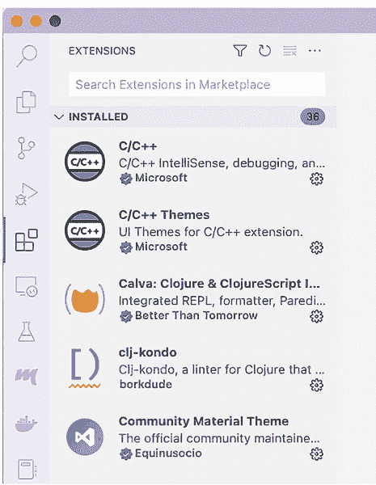
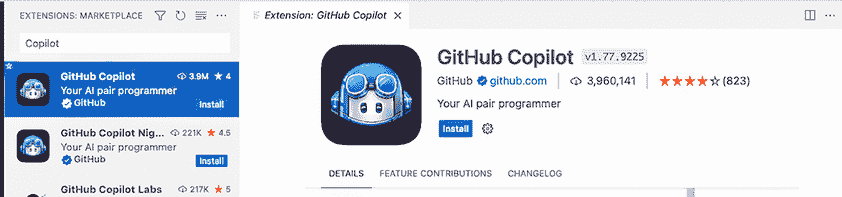
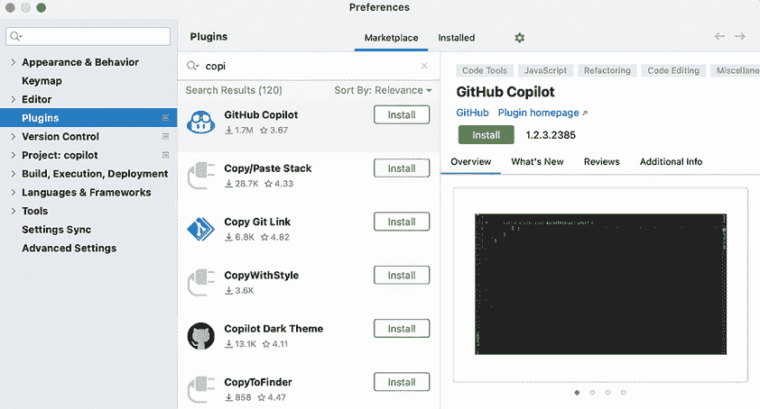
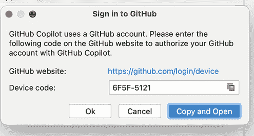
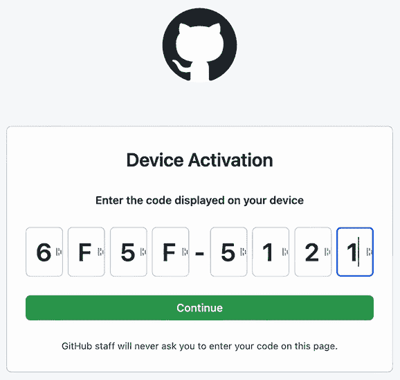
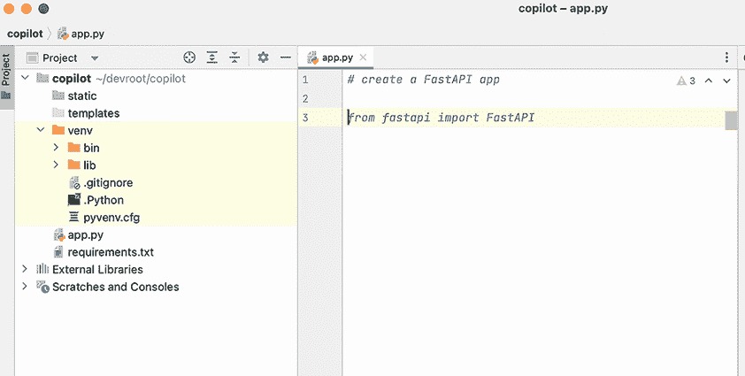
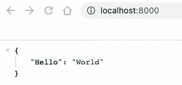

# 附录 B. 设置 GitHub Copilot

本附录将指导您将 Copilot 扩展安装到 Visual Studio Code 和 PyCharm 中。Visual Studio Code，通常简称为 VS Code，是由微软创建的一个跨平台、语言无关的集成开发环境（IDE）。微软免费提供 VS Code。它拥有出色的 Copilot 支持，因此它是您阅读本书时的理想选择。PyCharm 是 JetBrains 提供的针对 Python 的特定 IDE。JetBrains 提供了一个社区版，它是免费的。此外，它还有一个扩展来启用 Copilot 支持。无论选择哪个都行，因为它们都是优秀的工具。

注意 Copilot 需要订阅才能使用。然而，GitHub 提供了一个慷慨的一个月试用期。

## B.1 将 Copilot 扩展安装到 Visual Studio Code 中

我们将首先介绍如何在 VS Code 中安装和启用 Copilot 扩展。请按照以下步骤操作：

1. 点击 VS Code 左侧的扩展选项卡（见图 B.1）；它看起来像一个盒子被插入到一个 L 形结构中（就像在俄罗斯方块中一样）。



图 B.1 Visual Studio Code 中的扩展选项卡。注意搜索窗口位于选项卡顶部附近

选项卡顶部。

2. 在搜索窗口中输入 `copilot`（见图 B.2）。搜索窗口位于选项卡顶部；搜索不区分大小写，因此搜索功能应该能够找到扩展，无论您输入的是 `copilot`、`COPILOT` 还是 `Copilot`。


图 B.2 GitHub Copilot 扩展的搜索结果

3. 点击 GitHub Copilot 搜索结果，VS Code 右侧将显示更多详细信息（见图 B.3）。例如，您将在扩展名称、开发者、下载次数和星数下方看到安装按钮。点击安装按钮以开始安装过程。



图 B.3 GitHub Copilot 扩展的详细扩展信息，包括安装按钮

4. 您将被提示登录到您的 GitHub 账户。点击 VS Code 右下角的“登录到 GitHub”按钮（见图 B.4）。


图 B.4 要继续，您必须登录到您的 GitHub 账户。此对话框将启动该过程。

5. 点击按钮后，VS Code 将要求您允许它代表您登录到 GitHub。点击允许按钮（见图 B.5）。


图 B.5 VS Code 要求允许 Copilot 扩展代表您登录到 GitHub。

6. 您的默认网络浏览器将自动打开并重定向到 GitHub 网站。您将遇到一个 OAuth 屏幕请求您允许 Copilot 扩展查看您的电子邮件地址（见图 B.6）。如果您对此感到舒适，请点击“授权 Visual-Studio-Code 查看您的电子邮件”。


图 B.6 GitHub 网站将请求您的许可，以便其 VS Code 扩展查看您的电子邮件地址。

这标志着 Copilot 扩展在 VS Code 中的安装完成。现在我们将继续在 JetBrains 的 PyCharm 中安装 Copilot 插件。

## B.2 在 PyCharm 中安装 Copilot 插件

打开 PyCharm，打开首选项。然后按照以下步骤操作：

1. 点击插件标签页。类似于 VS Code，点击此标签页将打开一个搜索窗口。在此搜索窗口中，输入`copilot`。当您在市场中找到 Copilot 时，点击安装按钮（见图 B.7）。



图 B.7 PyCharm 的插件标签页，显示搜索结果为 Copilot

2. 从主菜单导航到工具 > GitHub Copilot > 登录到 GitHub（见图 B.8）。


图 B.8 在 PyCharm 中登录到 GitHub 的路径是工具 > GitHub Copilot > 登录到 GitHub。

3. PyCharm 将向您展示一个七位数的字母数字代码，您将在登录过程中使用此代码（见图 B.9）。保存此代码或将它复制到剪贴板，因为您将很快被提示输入它。



图 B.9 PyCharm 显示给您一个 GitHub 的登录码。将其复制到您的剪贴板。

4. 默认的网页浏览器将打开，并提示您输入登录码（见图 B.10）。



图 B.10 将您刚刚收到的 GitHub 登录码粘贴到您的网页浏览器中。

5. GitHub 将请求您的许可以查看和收集一些个人信息，特别是您的电子邮件地址（见图 B.11）。点击“授权 GitHub Copilot 插件”按钮，您将收到插件激活成功的通知（见图 B.12）。


图 B.11 OAuth 登录工作流程要求您同意并授予 GitHub 收集您的电子邮件地址的权限。


图 B.12 确认您已成功完成 Copilot 注册

现在您已将 GitHub Copilot 扩展或插件安装到您喜欢的 IDE 中，您可以创建第一个提示并开始使用 Copilot 进行实践。

## B.3 使用 Copilot 进行首次飞行

如果它尚未打开，请打开您喜欢的 IDE 并创建一个新的 Python 项目。在该项目中，创建一个名为 app.py 的文件。然后在文件的顶部输入以下提示作为注释，以便 Copilot 创建一个简单的 FastAPI 应用程序：

```py
# create a FastAPI app
# run with uvicorn app:app --reload
```

如果您已正确安装并初始化 Copilot，Copilot 将开始为您生成代码。按两次 Enter 键，然后开始输入`from fastapi import FastAPI`的`import`语句。注意，当您开始输入时，该语句会自动为您填写（见图 B.13）。这就是 Copilot。



图 B.13 Copilot 将您输入的提示作为注释，并开始从 Copilot 模型（称为 Cortex）中的数据中匹配该模式。一旦它检测到匹配，它就会生成这个建议。

您可以向提示中添加更多内容：例如，Copilot 应该生成一个返回“Hello, world”的 GET REST 端点。然而，它可能会在您的建议中为您创建该端点。

列表 B.1 Copilot 根据您的提示生成的完整源代码

```py
# create a FastAPI app
# run with uvicorn app:app --reload

import uvicorn
from fastapi import FastAPI

app = FastAPI()

@app.get("/")
def read_root():
    return {"Hello": "World"}

if __name__ == "__main__":
    uvicorn.run(app, host="localhost", port=8000)

from fastapi import FastAPI

app = FastAPI()

@app.get("/")
def read_root():
    return {"Hello": "World"}
```

接下来，从您的终端运行以下命令以安装所需的库并运行应用程序。

列表 B.2 安装所需库并运行应用程序的命令

```py
pip install fastapi
pip install uvicorn
python3 app.py
```

这应该会启动 FastAPI。在您的浏览器中导航到 http://localhost:8000，您应该会看到一个“Hello, world”的 JSON 表示（见图 B.14）。



图 B.14 您的简单 FastAPI 应该返回消息“Hello, world”，这是在学习新语言或技术时最常见的初始输出。

恭喜！您已经创建了第一个由 Copilot 辅助的程序，并且正朝着成为 AI 驱动开发者的大步迈进。
