# 附录 C. 设置 AWS CodeWhisperer

本附录将向您展示如何将 CodeWhisperer 扩展程序安装到 Visual Studio Code 和 PyCharm。

注意：在撰写本文时，CodeWhisperer 在预览期间免费提供。然而，亚马逊既没有给出预览期的具体时间表，也没有讨论预览期结束后将如何定价。

## C.1 将 CodeWhisperer 扩展程序安装到 VS Code

将 CodeWhisperer 扩展程序安装到 VS Code 中与安装 Copilot 扩展程序类似。这种方法是一致的，这是扩展程序的本质。以下是步骤：

1. 点击扩展程序选项卡，并搜索 AWS Toolkit。一旦找到正确的扩展程序，点击“安装”（见图 C.1）。

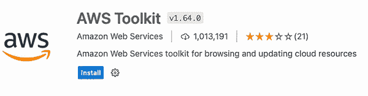

图 C.1 带有“安装”按钮的 AWS Toolkit 详细信息

2. 扩展程序安装完成后，点击 VS Code 左侧的 AWS 选项卡以显示开发者工具菜单。点击“选择连接”选项（见图 C.2）。

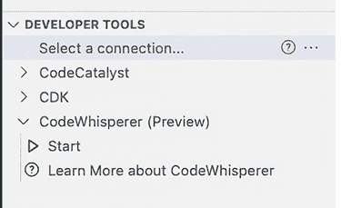

图 C.2 AWS Toolkit 选项卡的开发者工具菜单。请注意，除了“选择连接”选项外，还有一个 CodeWhisperer 选项。

3. 首次选择“选择连接”时，VS Code 的中心顶部将弹出一个下拉菜单。选择“使用个人电子邮件地址注册并使用 AWS Builder ID 登录”（见图 C.3）。

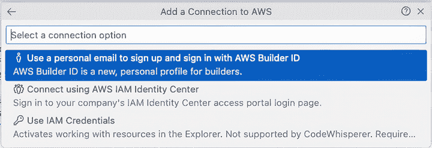

图 C.3 选择如何连接到 AWS CodeWhisperer 服务的下拉菜单

4. 出现一个包含访问代码的对话框（见图 C.4）。复制此代码，然后点击“复制代码并继续”按钮。

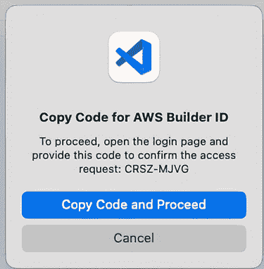

图 C.4 您需要一个个性化的访问代码来将您的 VS Code 实例注册到 AWS 和 CodeWhisperer。

5. VS Code 将会请求您允许打开 Amazon AWS 网站。点击“打开”（见图 C.5）。

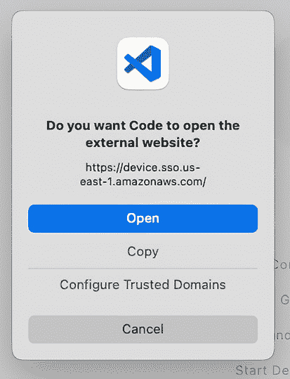

图 C.5 VS Code 需要明确的允许才能继续访问 AWS 网站。

6. 一旦 VS Code 获得了您的允许，您的默认网页浏览器将打开到 AWS 网站。AWS 将要求您输入您的电子邮件地址（建议使用您的个人电子邮件地址；见图 C.6）。


图 C.6 获取您的个性化访问代码并导航到 AWS 网站后，您将被要求创建账户或登录。

7. 当您成功登录或创建账户后，AWS 将提示您允许访问您的数据权限。您明确授予允许从您的 IDE 编辑器中的代码构建上下文。没有这个上下文，CodeWhisperer 无法施展其魔法。您应该点击“允许”按钮（见图 C.7）。

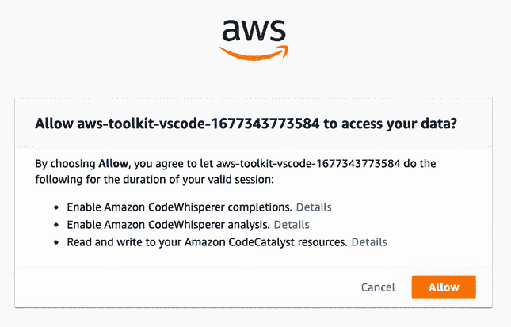

图 C.7 CodeWhisperer 需要您的允许来访问您的编辑器中的代码。一旦获得该权限，它就可以提供代码建议。

8. 在您的同意下，CodeWhisperer 现在已准备好使用。您将收到一个确认（见图 C.8）。

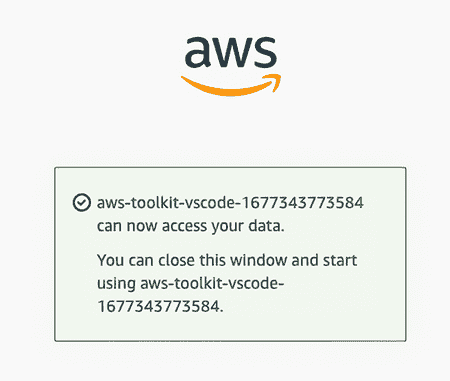

图 C.8 AWS 已注册您的账户，您现在可以继续。

9. 您必须查看并确认 Amazon CodeWhisperer 服务条款（见图 C.9）。如果您同意这些条款，请点击“接受并开启 CodeWhisperer”按钮。


图 C.9 仔细阅读服务条款。然后，如果您同意，点击确认您同意的按钮。

CodeWhisperer 现在可以在 VS Code 中使用了。

## C.2 在 PyCharm 中安装 CodeWhisperer 插件

在 PyCharm 中安装 CodeWhisperer 插件的过程与在 VS Code 中安装扩展的过程非常相似。步骤相同，但菜单略有不同。如果您已经阅读了上一节，您已经准备好应对这一节。即使您没有阅读上一节，我们也会逐步讲解这个过程，使其简单且无痛苦。按照以下步骤操作：

1. 打开首选项（在 Mac 上）或选项（在 Windows 上），然后点击插件选项卡。搜索“AWS Toolkit”，找到它后，点击安装按钮（见图 C.10）。

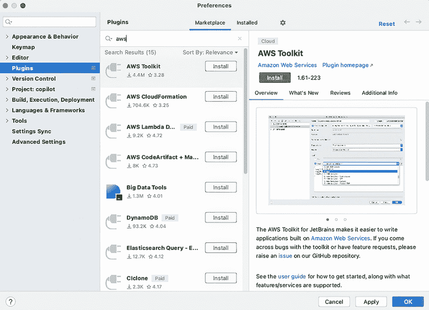

图 C.10 搜索并找到 AWS Toolkit 后的插件选项卡

2. 在完成插件安装后，点击 PyCharm 左下角的 AWS Toolkit 选项卡（见图 C.11）。这将打开开发者工具，并允许您创建一个新的 AWS 连接。


图 C.11 AWS Toolkit 选项卡允许您连接到 AWS 并启动和暂停 CodeWhisperer。

3. 点击“+ 添加 AWS 连接”。这样做将弹出一个对话框，询问您如何连接到 AWS 以及使用哪些凭证。选择“使用个人电子邮件注册并使用 AWS Builder ID 登录”并点击“连接”（见图 C.12）。

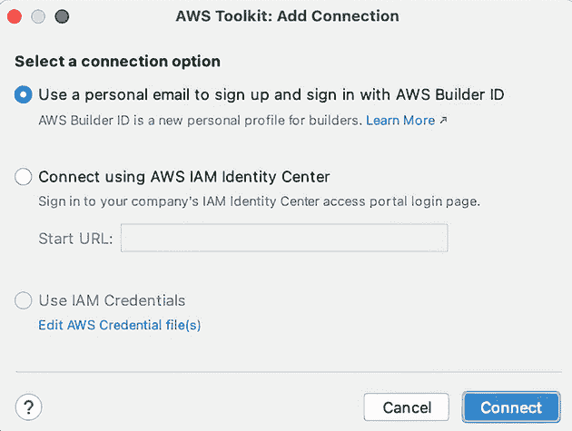

图 C.12 询问您如何连接到 AWS 的对话框

4. PyCharm 将会启动另一个对话框，其中包含一个个人访问码（见图 C.13）。您需要复制此代码，因为您必须授权 AWS 访问 PyCharm 编辑器中的数据。点击“打开并复制代码”。

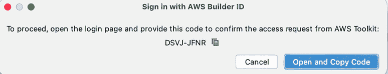

图 C.13 此对话框包含您的个性化代码和继续的按钮。

5. 您的默认浏览器将打开并导航到 AWS 网站，在那里有一个粘贴访问码的窗口（见图 C.14）。输入此代码，然后点击“下一步”。


图 C.14 您粘贴之前复制的代码的网页表单

6. AWS 将要求您使用个人电子邮件地址登录（见图 C.15）。如果您还没有 Builder 账户，您可以注册一个。然后，登录或创建一个新账户以继续。

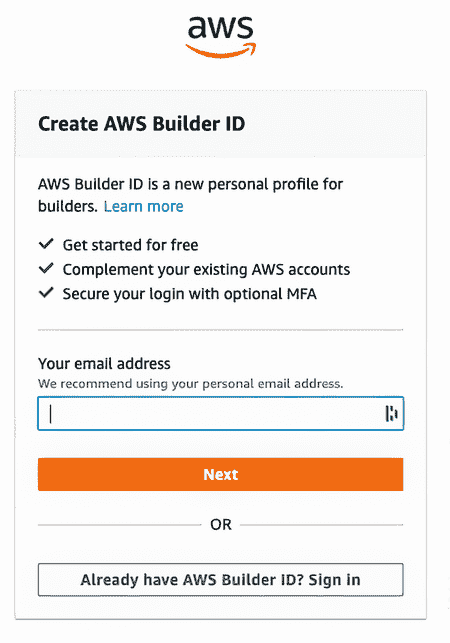

图 C.15 您可以登录现有的 Builder 账户或注册一个新账户。

7. 我们即将完成这个过程，不久您就会使用 CodeWhisperer。您会发现这项努力是值得的。剩下的只是授权 AWS 收集特定的（和有限的）个人数据：您的电子邮件地址和编辑器的上下文（见图 C.16）。然后，点击“允许”以继续。


图 C.16 AWS 需要您的许可来收集信息，以便 CodeWhisperer 可以提供建议。

8. 您将收到确认信息，表明包括 CodeWhisperer 在内的 AWS Toolkit 已在 PyCharm 中授权使用（见图 C.17）。

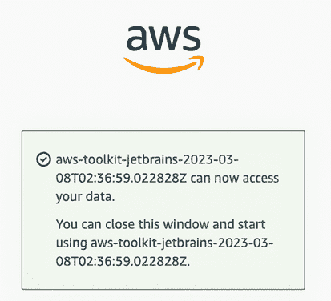

图 C.17 AWS 确认 CodeWhisperer 已准备就绪。

现在，您可以使用此工具了。首先，您需要启动 CodeWhisperer 的代码建议引擎。返回 AWS Toolkit 标签页（默认位于左下角），点击开发者工具，展开 CodeWhisperer，然后点击“开始”（见图 C.18）。

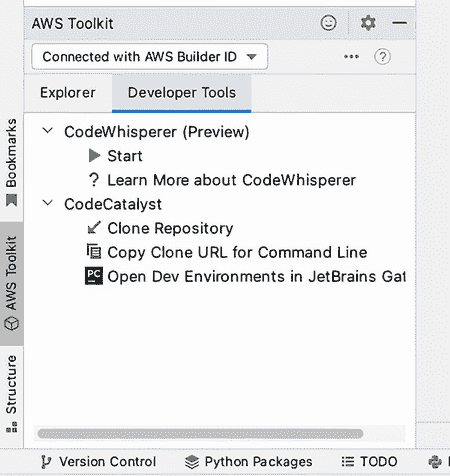

图 C.18 您可以从其中启动（并停止）CodeWhisperer 代码建议引擎的 AWS Toolkit 小部件

一旦您启动了 CodeWhisperer，AWS Toolkit 插件将向您展示亚马逊 CodeWhisperer 服务条款以供审查和接受（或拒绝）（见图 C.19）。要使用 CodeWhisperer，您必须接受这些条款，但您仍应仔细阅读。如果您接受，请点击“接受并开启 CodeWhisperer”按钮。

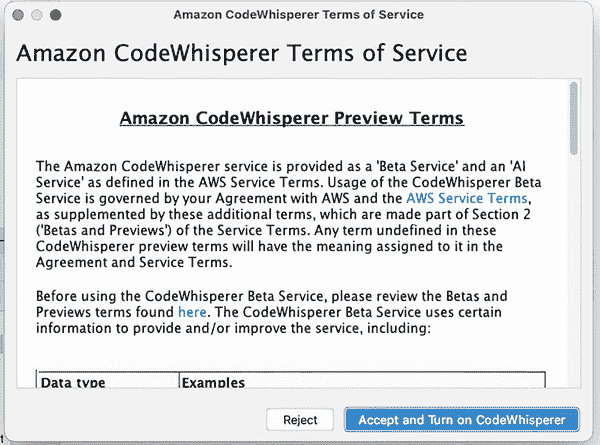

图 C.19 亚马逊 CodeWhisperer 服务条款。您必须接受这些条款才能使用 CodeWhisperer。

现在，让我们开始编写代码。

## C.3 使用 CodeWhisperer 说出您的第一句话

在设置和初步工作完成之后，让我们构建一个基本的 Flask 应用程序。在您首选的 IDE 中创建一个名为 app.py 的文件。接下来，在文件中添加以下提示作为注释。就像 Copilot 一样，CodeWhisperer 接受注释作为提示：

```py
# create a Flask application that has a route to /
# which returns the text "Hello World."
```

在此提示后按 Enter 键，CodeWhisperer 将建议一个`import`语句（见图 C.20）。


图 C.20 您的第一个 CodeWhisperer 建议：在这种情况下，一个`import`语句

持续按 Enter 键，并惊叹于 CodeWhisperer 逐行自动完成程序。您可能需要重新格式化代码以提高可读性，但它应该不会出现重大问题。您可能需要使用 pip 来安装 Flask：`pip install flask`。

列表 C.1 完整源代码列表（格式化以提高可读性）

```py
# create a Flask application that has a route to /
# which returns the text "Hello World."
from flask import Flask

app = Flask(__name__)

@app.route('/')
def hello_world():
    return 'Hello World

if __name__ == '__main__':
    app.run()
```

运行此应用程序。您的应用程序应绑定到默认端口：5000（见图 C.21）。

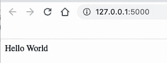

图 C.21 您的第一个 CodeWhisperer 辅助应用程序，运行在默认端口

恭喜！您现在又有了另一个 AI 辅助工具。您准备好继续您的旅程，进入更高（或更高）的生产力。
