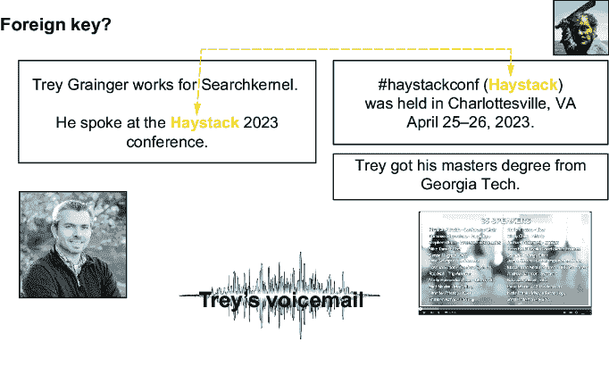
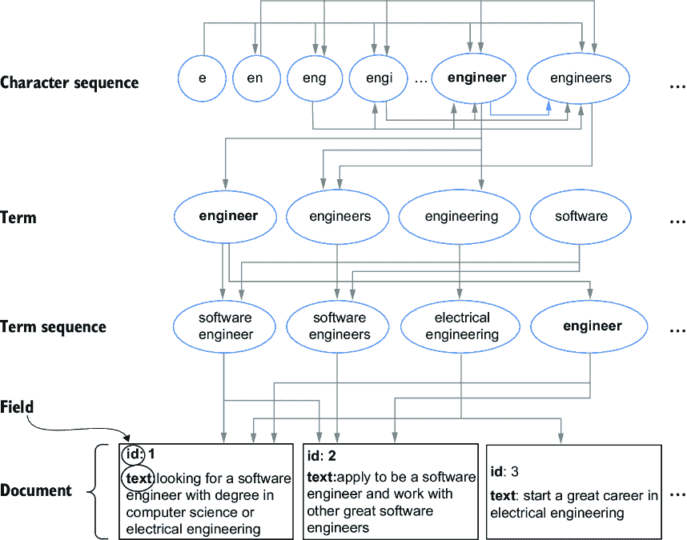
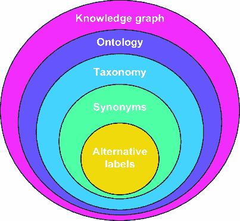

# 第二章：与自然语言一起工作

### 本章涵盖

+   非结构化数据中的隐藏结构

+   以搜索为中心的语言哲学

+   探索分布语义和基于向量的嵌入

+   建模特定领域的知识

+   自然语言和查询的挑战

+   将自然语言理解技术应用于内容和信号

在第一章中，我们提供了一个关于构建人工智能搜索系统的高层次概述。在本书的其余部分，我们将探索并展示您的搜索应用如何从您的内容和用户的行为信号中持续学习，以更好地理解您的内容、用户和领域，并最终为用户提供他们需要的答案。在第三章中，我们将更加深入地实践，启动您选择的搜索服务器和数据处理层（Apache Spark），并从我们的第一个 Jupyter 笔记本开始，我们将使用它来逐步演示许多示例。

然而，在我们深入探讨那些实际案例和具体实现之前，在本章中我们首先建立一个共享的思维方式来解决问题是非常重要的。具体来说，当涉及到智能搜索时，我们必须处理自然语言中的许多复杂性和细微差别——无论是我们在搜索的内容，还是用户的搜索查询。我们必须处理关键词、实体、概念、拼写错误、同义词、首字母缩略词、缩写词、模糊术语、概念之间的显性和隐含关系、通常在分类学中找到的层次关系、通常在本体中找到的高级关系，以及通常在综合知识图中找到的实体关系的具体实例。

虽然可能很诱人立即深入研究一些具体问题，比如如何从内容中自动学习拼写错误，或者如何从用户搜索会话中挖掘同义词，但首先建立一个概念基础来解释我们在搜索和自然语言理解（NLU）中必须处理的问题类型将更为谨慎。建立这个哲学基础将使我们能够在我们的 AI 搜索系统中构建更好的端到端解决方案，其中所有部分以协调和整合的方式协同工作。因此，本章将为我们在本书中处理自然语言理解问题提供哲学基础，以及我们如何将这些解决方案应用到使我们的搜索应用更加智能。

我们将首先讨论一些关于自由文本和其他非结构化数据源性质的常见误解。

## 2.1 非结构化数据的神话

“非结构化数据”这个术语多年来一直被用来描述文本数据，因为它看起来没有以可以轻松解释和查询的方式格式化。然而，广泛持有的观点认为文本，或任何不符合预定义模式（“结构”）的其他数据实际上是“非结构化的”，但这是一种在本节中我们将花时间重新考虑的神话。

如果你查阅维基百科中的“非结构化数据”，它被定义为“既没有预定义的数据模型，也没有以预定义方式组织的信息”。条目接着说，“非结构化信息通常是文本密集型的，但可能包含日期、数字和事实等数据”。

然而，“非结构化数据”这个短语并不是描述文本内容的良好术语。实际上，文本中出现的术语和短语编码了大量的意义，应用于文本以赋予其意义的语言规则本身也构成了其结构。称文本为非结构化有点像称广播电台播放的歌曲为“任意的音频波”。尽管每首歌曲都有独特的特征，但大多数都表现出共同的属性（节奏、旋律、和声、歌词等）。尽管这些属性可能不同或在某些歌曲中缺失，但它们仍然符合共同的期望，使得意义可以通过和从每首歌曲中传达和提取。文本信息通常遵循类似的规则——句子结构、语法、标点符号、词性之间的相互作用等。图 2.1 展示了我们将要更深入探讨的文本示例，作为我们研究这一结构的下一节内容。


##### 图 2.1 非结构化数据。这段文本代表了在搜索引擎中可能找到的典型非结构化数据。

虽然文本是最常见的非结构化数据类型，但还有几种其他类型的非结构化数据具有相似的特征，我们将在下一节中看到。

### 2.1.1 非结构化数据的类型

自由文本内容被认为是非结构化数据的主要类型，但搜索引擎也通常索引许多其他类似地不适合整齐地放入结构化数据库的数据。常见的例子包括图像、音频、视频和事件日志。图 2.2 在图 2.1 的文本示例基础上进行了扩展，并包括了几种其他类型的非结构化数据，如音频、图像和视频。


##### 图 2.2 多种类型的非结构化数据。除了上一图中的文本外，我们现在还看到了图像、音频和视频，这些都是非结构化数据的其他形式。

音频与文本内容最为相似，因为它通常只是编码单词和句子的另一种方式。当然，音频可以包含比仅说话的词语更多——它可以包含音乐和非语言声音，并且它可以更有效地编码细微差别，如情感、语调和同时重叠的交流。

图像是另一种非结构化数据。正如文字形成句子和段落来表达思想一样，图像形成由颜色组成的网格，这些颜色组合在一起形成图片。

因此，视频作为另一种非结构化数据，它是由多个图像随时间组合而成的，以及与图像进展同步的可选音频。

当非结构化数据与结构化数据混合在一起时，我们通常将其称为*半结构化*数据。日志数据是这种半结构化数据的一个很好的例子。通常，日志消息包含结构化的事件日期、结构化的事件类型（如警告与错误或搜索与点击），然后是一些非结构化的消息或描述文本。

从技术上讲，几乎任何类型的文件都可以被认为是非结构化数据，但我们将主要处理上述类型。搜索引擎通常负责处理每种类型的非结构化数据，因此我们将在整本书中讨论处理它们的策略。

### 2.1.2 传统结构化数据库中的数据类型

为了更好地处理我们的非结构化数据，首先将其与 SQL 数据库中的结构化数据进行对比可能是有用的。这将使我们能够后来在查询非结构化数据表示与结构化数据表示之间建立平行关系。

SQL 数据库中的一个记录（行）被分割成列，每一列都可以是特定数据类型。其中一些数据类型表示离散值——来自枚举列表的值，如 ID、名称或文本属性。其他列可能持有连续值，如日期/时间范围、数字以及其他表示没有有限可能值的范围的列类型。

一般而言，当一个人想要将不同的行关联起来，或者将它们与其他数据库表中的行关联起来时，会在离散值上执行“连接”操作。*连接*使用共享值（通常是 ID 字段）将两个或多个记录链接在一起，形成一个组合记录。

例如，如果有人有两个数据表，一个代表员工，另一个代表公司，那么在“公司”表中可能有一个`id`列，在“员工”表中有一个相应的`company_id`列。员工表中的`company_id`字段被称为*外键*，它是一个表中的值，它引用另一个表中的实体，基于共享标识符将记录链接在一起。图 2.3 展示了这一点，展示了离散值、连续值以及使用外键在表之间进行连接的示例。

基于已知关系（键和外键）将不同记录组合在一起的概念，是处理关系数据的一种强大方式，这种处理方式是明确跨视频数据进行的。


##### 图 2.3 典型数据库中的结构化数据。离散值代表标识符和枚举值，连续值代表落在范围内的数据，当相同值存在于两个表之间时，外键存在，因此可以用作创建每个表对应行之间关系的共享属性。

模型表，但正如我们将在下一节中看到的，非常类似的技术也可以应用于自由形式的非结构化数据。

### 2.1.3 非结构化数据中的连接、模糊连接和实体解析

而在数据库中的结构化数据已经是易于查询的形式，现实是未结构化数据受结构缺乏的影响较小，而更多地是由于大量信息被包装在一个非常灵活的结构中。在本节中，我们将通过一个具体的例子来揭示未结构化数据中的这种隐藏结构，并展示它如何以类似的方式用于在文档之间找到和连接关系。

#### 非结构化数据中的外键

我们已经讨论了如何使用外键根据两个记录之间的共享标识符在数据库中将两行连接起来。在本节中，我们将展示如何使用文本数据实现相同的目标。

例如，我们可以轻松地将 SQL 表中使用的外键的概念映射到我们在图 2.2 中探索的非结构化信息。注意图 2.4 中，两个不同的文本部分都包含单词“Haystack”，它指的是一个专注于搜索相关性的技术会议。



##### 图 2.4 非结构化数据中的外键。在这个例子中，相同的术语被用来连接两个相关的文本文档。

第一个实例表示一个正在进行的会议，而第二个文本块包含关于该事件的一般信息。为了我们的示例，让我们假设每个信息块（文本块、图像、视频和音频剪辑）在我们的搜索引擎中都被表示为一个单独的文档。在数据库表中，有两个行各包含一个值为“Haystack”的列与我们的搜索引擎中有两个包含值为“Haystack”的单独文档之间，在功能上几乎没有区别。在两种情况下，我们可以将这些文档视为通过外键相关联。

#### 非结构化数据中的模糊外键

然而，与传统的结构化数据建模相比，我们在非结构化数据方面拥有更多的能力。例如，在图 2.5 中，注意现在有两个文档被链接，并且它们都提到了本书的首席作者——一个使用我的全名“Trey Grainger”，另一个简单地使用我的名字“Trey”。


##### 图 2.5 模糊外键。在这个例子中，使用不同的术语引用了相同的实体，并且基于多个短语解析为同一实体而进行连接。

这是一个实体识别的例子，其中实体有两种不同的表示形式，但它们仍然可以被解析为相同的意义，因此仍然可以用来在两个文档之间连接信息。你可以将其视为“模糊的外键”，因为它仍然是一个外键，但它不是在严格的标记匹配意义上，因为它需要额外的自然语言处理和实体识别技术来解析。

一旦我们打开了这扇门，进入了高级文本处理以进行实体识别，我们就能从我们的非结构化信息中学到更多。例如，在这些文档中，“Trey”和“Trey Grainger”这两个名字不仅指代同一个实体，"he"和"his"这两个词也是如此。

你还会注意到，一张我（位于左下角，以防你不知道我长什么样）的照片以及包含我名字的视频都被识别为相关内容，并重新与文本引用连接起来。我们正依赖于所有这些非结构化数据中存在的隐藏结构来理解意义，将文档联系起来，并更多地了解这些文档中引用的每个实体。

#### 处理模糊术语

到目前为止，一切顺利，但在现实世界的内容中，并不总是合适的假设多个地方出现的相同术语具有相同的意义，或者我们的实体识别总是正确地解析实体。这种相同拼写但具有多种潜在意义的问题被称为多义性，在搜索应用中处理这些模糊术语可能是一个大问题。

你可能已经注意到在前面图例右上角有一个奇怪的照片，看起来有点格格不入。这张照片是一个相当可怕的人拿着大刀。显然，如果你去 Google 搜索`Trey` `Grainger`，这张照片就会返回。如果你进一步挖掘，你会在图 2.6 中看到有一个名为“Trey Grainger”的 x.com（前身为 Twitter）用户，这张照片是他的个人头像。


##### 图 2.6 多义性。这张图片显示了搜索`Trey` `Grainger`的 Google 搜索结果。返回了多张不同人的照片，因为这些人的名字拼写相同，使得短语“Trey Grainger”变得模糊。

这张照片显然是罗伯特·肖（在 1975 年的电影《大白鲨》中扮演昆特）的，但绝对不是你希望人们在搜索你时首先看到的那种类型！

这里有两个关键教训可以吸取。首先，也许永远不要搜索自己的名字（你可能会对找到的东西感到震惊！）。其次，更严肃地说，多义性是搜索和自然语言理解中的一个主要问题。我们不能假设一个术语在不同的上下文中只有一个意义，甚至是一个一致的意义，因此我们的基于人工智能的搜索引擎需要使用上下文来区分这些不同的意义。

#### 非结构化数据作为一个关系的大图

在前面的章节中，我们了解到非结构化数据不仅包含丰富的信息（实体及其关系），而且通过在共享实体上连接不同文档，可以关联不同的文档，这与传统数据库中外键的工作方式类似。然而，典型的非结构化数据包含如此多的这些关系，因此，与其从行和列的角度思考，不如将数据集合视为一个巨大的关系图，正如我们将在本节中探讨的那样。

到目前为止，应该已经很清楚，非结构化数据中隐藏的结构比大多数人所欣赏的要更多。非结构化信息实际上更像“超结构化”信息——它是一个包含比典型“结构化数据”更多结构的图。

图 2.7 展示了即使在我们的例子中只有少量文档的情况下也存在的关系巨大图。你可以看到名称、日期、事件、地点、人物、公司和其他实体，你可以通过在文档间实体之间的连接来推断它们之间的关系。你还会注意到，图像已经被正确地消歧，因此砍刀男子现在与图无关。如果所有这些都可以从仅仅几份文档中学习到，那么想象一下从你搜索引擎中的成千上万、数百万或数十亿份文档中可以学习到什么。


##### 图 2.7 关系巨大图。即使是从一小部分相关文档中也能出现丰富的关系图。

人工智能搜索平台的一部分价值在于能够从你的数据中学习这样的见解。问题是，你如何使用这个巨大的语义知识图来驱动这种智能？

使用文本数据中的图的最强大方式之一是通过大型语言模型（LLM），例如在 1.3.4 节中介绍的 Transformer 模型。这些模型通过深度学习在庞大的数据集上学习数十亿个参数，例如对大部分互联网的爬取，以构建对语言的详细理解。这种理解包括不同语境中单词的含义以及单词之间的语言和概念联系。这些模型内部表示所有训练数据中找到的巨大关系图，这通常比你的数据集更通用，因此模型必须经过微调来从你的数据中学习任何特定领域的关联。这种微调的需求可能会由于 LLM 某种程度上是一个黑盒而带来一些挑战，因为它们否则不会最优地表示你的数据集，它们返回的信息可能是错误的。

幸运的是，你的搜索引擎中倒排索引的固有结构使得在没有额外显式数据建模要求的情况下，轻松遍历数据中的大型关系图。*倒排索引*是用于词汇搜索的主要数据结构，将你的文档字段中的每个关键词或术语映射到包含这些关键词的所有文档的列表（称为*倒排列表*）。倒排索引使得对包含任何给定术语（或术语序列，当考虑位置匹配和通过集合操作实现的布尔逻辑时）的文档集的查找非常快速。通过这些查找，可以遍历不同的术语序列，使用它们的共享文档来计算图中的一个加权边。我们将在第五章深入探讨如何利用隐藏在数据中的这个语义知识图。

## 2.2 自然语言的结构

在上一节中，我们讨论了文本和非结构化数据通常包含一个巨大的关系图，这些关系可以通过查看不同记录之间的共享术语来推导。如果你已经构建搜索引擎一段时间了，你习惯于从“文档”、“字段”和字段内的“术语”的角度来考虑内容。然而，在解释你内容的意义时，还有更多层次需要考虑。

图 2.8 解释了这些额外的语义层次。在最基本层面上，你有*字符*，它们是单个字母、数字或符号，如图中的字母“e”。然后一个或多个字符组合成*字符序列*，如“e”、“en”、“eng”……“engineer”和“engineers”。一些字符序列形成术语，这些术语是完整的单词或标记，带有可识别的意义，如“engineer”、“engineers”、“engineering”或“software”。然后一个或多个术语可以组合成*术语序列*——当术语都是连续的时，通常称为*短语*。这包括像“software engineer”、“software engineers”和“senior software engineer”这样的东西。为了本书的简洁性，我们也认为单个术语是“术语序列”，所以当我们提到“短语”时，这包括单个术语。



##### 图 2.8 展示了语义数据编码到自由文本内容中。字符形成字符序列，这些序列形成术语，这些术语形成术语序列，这些序列形成字段，这些字段形成文档，这些文档形成一个语料库。

##### 术语序列与短语

你可能想知道“词序列”和“短语”之间的区别是什么。简单来说，短语是一个词序列，其中所有词都按顺序出现。例如，“首席执行官”既是一个短语也是一个词序列，而“首席官员~2”（意味着在“首席”两个位置或编辑距离内的“官员”）只是一个词序列，因为它指定了一个不一定按顺序的词序列。在绝大多数情况下，你只会处理按顺序的词序列，所以为了简便起见，本书在指代单词和多词序列序列时，我们将主要使用“短语”这个词。为了避免混淆，请注意，“术语”这个词单独用来指代“搜索引擎字段中的一个唯一值”。因此，我们有时也会将搜索引擎中包含多个单词的未分割字符串称为“术语”，尽管从语言学角度来看，它们被认为是“短语”或“词序列”。

当然，我们知道许多词序列可以组成句子，多个句子可以组成段落，而段落又可以进一步组合成更大的文本组。对于搜索引擎来说，然而，在词序列之后，我们通常关注的下一个更高层次的分组是字段。在搜索引擎中，“字段”是文档的一个分区和标记的部分，通常用于搜索或作为文档的独立部分返回。包含文本的字段可以使用文本分析器以任何数量的方式进行分析，这通常包括在空白和标点符号上分割、将所有术语转换为小写以便它们不区分大小写、去除噪声（停用词和某些字符）、词干提取或词形还原以将术语还原到基本形式，以及去除重音。如果你对文本分析过程不熟悉，或者你想复习一下，我们建议查看 Trey Grainger 和 Timothy Potter 所著的《Solr in Action》第六章（Manning, 2014）。

然后，一个或多个字段组合成一个“文档”，多个文档形成一个“语料库”或数据集。每当对搜索索引执行查询时，它将语料库过滤成一个“文档集”，这是一个与特定查询特别相关的语料库子集。

这些语言层次中的每一个——字符序列、术语、词序列、字段、文档、文档集和语料库——都能为你理解你的内容及其在你特定领域中的独特含义提供独特的见解。

## 2.3 分布式语义和嵌入

分布式语义是自然语言处理领域中的一个研究领域，它侧重于基于分布假设的术语和短语之间的语义关系。分布假设是，在相似上下文中出现的词往往具有相似的意义。这被一句流行的引语很好地概括了：“你可以通过它所伴随的词语来了解一个词。”¹

当将机器学习方法应用于您的文本时，这些分布语义变得越来越重要，搜索引擎使得从您的语料库中的大多数语言表示中推导出上下文变得极其容易。例如，如果有人想找到所有关于 C 级高管的文章，他们可以发出如下查询：

```py
c?o
```

这个查询将匹配“CEO”、“CMO”、“CFO”或任何其他 CXO 风格的头衔，因为它要求找到以“c”开头并以“o”结尾的单个字符之间的任何字符序列。

查询任意复杂的术语序列也存在同样的自由度：

```py
"VP Engineering"~2
```

这个查询将匹配“VP Engineering”、“VP of Engineering”、“Engineering VP”或甚至是“VP of Software Engineering”，因为它要求在两个位置（编辑距离）内找到“VP”和“Engineering”。

当然，搜索引擎倒排索引的性质也使得支持任意布尔查询变得非常简单。例如，如果有人搜索“Word”这个词，但我们想确保匹配的任何文档也包含文档中的“Microsoft”或“MS”这两个词中的任何一个，我们可以发出以下查询：

```py
(Microsoft OR MS) AND Word
```

搜索引擎支持在整个语料库中对字符序列、术语和术语序列进行任意复杂的查询组合，返回作为查询内容匹配唯一上下文的文档集。例如，如果您运行一个针对`pizza`的查询，返回的文档更有可能是餐厅而不是汽车租赁公司，如果您运行一个针对`machine` `learning`的查询，您更有可能看到数据科学家或软件工程师的工作，而不是会计师、餐饮工人或药剂师。这意味着您可以从“machine learning”和“software engineering”之间推断出强关系，以及从“machine learning”和“food service worker”之间推断出弱关系。如果您进一步挖掘，您还将能够看到与您的语料库中的其他部分相比，在机器学习文档集中最常共同出现的其他术语和短语，从而更好地理解“machine learning”这个短语的含义和用法。我们将在第五章中深入探讨使用这些关系进行实际操作的例子。

##### 引入向量

在你阅读这本书的过程中，对向量操作的基本理解将非常重要。*向量*是一系列描述某个项目属性的值。例如，如果你的项目是房子，你可能有一系列属性，如`价格`、`大小`和`卧室数量`。如果你有一套价值 10 万美元、1000 平方英尺和 2 个卧室的房子，这可以表示为向量 `[100000, 1000, 2]`。

这些属性（在这个例子中是价格、大小和卧室数量）被称为*维度*或*特征*，而特定维度的集合被称为*向量空间*。如果你可以在向量空间的维度内为其他项目（如其他房子、公寓或住宅）分配值，你就可以在同一个向量空间中表示这些项目。

如果我们考虑同一向量空间内的其他向量（例如，一套价值 100 万美元、9850 平方英尺和 12 个卧室的房子 `[1000000, 9850, 12]` 和另一套价值 12 万美元、1400 平方英尺和 3 个卧室的房子 `[120000, 1400, 3]`），我们可以在向量上执行数学运算来学习趋势并比较向量。例如，你可能直观地查看这三个示例向量并确定“房价随着房间数量的增加而增加”或“房间数量随着房子大小的增加而增加”。我们还可以在向量上执行相似度计算，以确定价值 12 万美元、1400 平方英尺和 3 个卧室的房子比价值 100 万美元、1000 平方英尺和 2 个卧室的房子更相似，而不是与价值 100 万美元、9850 平方英尺和 12 个卧室的房子相似。

近年来，分布假设已被应用于通过所谓的嵌入来创建术语和术语序列的语义理解。*嵌入*是一组坐标，我们在其中映射（或“嵌入”）一个概念。更具体地说，这组坐标是一个数值向量（一系列数字），旨在表示你数据的语义意义（文本、图像、音频、行为或其他数据模式）。基于文本的嵌入可以表示任何长度的术语序列，但当表示单个单词或短语时，我们称这些嵌入为*词嵌入*。

术语序列通常被编码成一个低维嵌入，可以与语料库中所有其他嵌入的向量进行比较，以找到语义上最相关的文档。

要理解这个过程，可能有用的是思考一下搜索引擎是如何从零开始工作的。让我们想象每个术语都有一个向量存在，它包含了你语料库中每个单词的值（维度）。它可能看起来像图 2.9 所示。


##### 图 2.9 从倒排索引中每个术语一个维度的向量。左侧的每个查询映射到右侧的向量，对于索引中也在查询中的任何术语，其值为`1`，而对于索引中不在查询中的任何术语，其值为`0`。

图 2.9 展示了默认情况下词汇搜索引擎中文档匹配的概念工作方式。一个 *词汇搜索* 是一种搜索，其中文档根据它们包含查询中指定的实际关键词或其他属性的程度的匹配和排名。对于每个关键词查询，存在一个包含倒排索引中每个术语维度的向量。如果该术语存在于查询中，则该维度的值是 `1`，如果该值不存在于查询中，则该维度的值是 `0`。倒排索引中的每个文档都有一个类似的向量，对于索引中出现在文档中的任何术语，其值为 `1`，而对于所有其他术语，其值为 `0`。

当执行查询时，会在索引中查找任何匹配的术语，然后根据查询向量与被评分文档的向量之间的比较来计算相似度得分。我们将在第三章中详细介绍具体的评分计算，但现在的这个高级理解已经足够了。

这种方法有明显的缺点。虽然它非常适合查找具有精确关键词匹配的文档，但当你想查找“相关”的东西时会发生什么？例如，你会注意到术语“soda”出现在查询中，但从未出现在索引中。即使有其他类型的饮料（“苹果汁”、“水”、“卡布奇诺”和“拿铁”），搜索引擎总是会返回零结果，因为它不理解用户正在搜索饮料。同样，你会注意到尽管术语“caffeine”存在于索引中，但查询 `latte`、`cappuccino` 和 `green tea` 永远不会匹配术语“caffeine”，即使它们是相关的。

由于这些原因，现在普遍的做法是使用降维密集嵌入来为索引和查询中的术语序列建模语义意义。一个 *密集嵌入*（也称为 *密集向量嵌入*）是一个包含更抽象特征的向量，它在语义空间中编码输入的概念意义。图 2.10 展示了现在映射到降维向量中的术语，这些向量可以作为密集嵌入使用。


##### 图 2.10 展示了降维密集嵌入。在这种情况下，不再是每个术语一个维度（存在或缺失），而是现在存在更高层次的维度，这些维度评估跨项目共享的属性，例如“健康”，包含“咖啡因”或“面包”或“乳制品”，或者项目是“食物”还是“饮料”。

现在对于图 2.10 最左侧列中的每个词序列都可用一个新的嵌入向量，我们可以现在使用它们向量之间的相似度来评估每一对词序列之间的关系。在线性代数中，我们使用余弦相似度函数（或另一个相似度度量）来评估两个向量之间的关系。余弦相似度是通过执行两个向量的点积并按每个向量的模（长度）进行缩放来计算的。我们将在下一章更详细地介绍数学，但现在，图 2.11 显示了评估这些向量之间相似度的结果。


##### 图 2.11 嵌入之间的相似性。向量之间的余弦值显示了按与“绿茶”、“芝士披萨”和“甜甜圈”的相似度排序的项目列表。

如你在图 2.11 中看到的，由于每个词序列都被编码成一个向量，该向量代表其在高级特征方面的意义，现在这个嵌入可以用来评估该词序列与任何其他相似向量的相似度。你会在图的下部看到三个向量相似度列表：一个用于“绿茶”，一个用于“芝士披萨”，一个用于“甜甜圈”。

通过比较“绿茶”与其他所有词序列的向量相似度，我们发现最相关的项目是“水”、“卡布奇诺”、“拿铁”、“苹果汁”和“苏打水”，而最不相关的是“甜甜圈”。这从直观上是有道理的，因为“绿茶”与列表中更高的项目共享更多的属性。对于“芝士披萨”向量，我们看到最相似的其它嵌入是“芝士面包棒”、“肉桂面包棒”和“甜甜圈”，而“水”位于列表底部。最后，对于“甜甜圈”这个术语，我们发现最相关的项目是“肉桂面包棒”、“芝士面包棒”和“芝士披萨”，而“水”再次位于列表底部。这些结果很好地找到了与我们原始查询最相似的项目。

值得注意的是，这种向量评分仅在计算项目之间的相似度时使用。在你的搜索引擎中，通常有一个两阶段过程，你首先过滤到一组文档（匹配阶段），然后评分这些结果文档（排名阶段）。除非你打算跳过第一步并相对于你的查询向量评分所有文档（这可能需要时间和处理资源），否则你仍然需要在排名阶段之前使用某种形式的初始匹配来过滤查询到一个合理的文档数量进行评分。我们将在第三章、第九章、第十三章、第十四章和第十五章中更深入地探讨成功实现嵌入和向量搜索的机制。

嵌入可以表示查询、文档的部分，甚至整个文档。将术语和术语序列编码到词嵌入中是很常见的，但*句子嵌入*（编码一个表示句子意义的向量）、*段落嵌入*（编码一个表示段落意义的向量）和*文档嵌入*（编码一个表示整个文档意义的向量）也是常见的技巧。

维度比我们这里给出的例子更抽象也是很常见的。例如，像 LLMs 这样的深度学习模型可能会从字符序列以及文档在语料库中的聚类方式中检测出看似难以理解的特征。我们可能无法轻易将这些维度在嵌入向量中应用一个可读的标签，但只要它能提高模型的预测能力并增加相关性，这通常不会成为大多数搜索团队的担忧。事实上，由于向量通过不同的抽象数值特征来编码“意义”，因此也有可能创建和搜索代表不同类型（或*模态*）数据的向量，例如图像、音频、视频，甚至是信号和活动模式。我们将在第 15.3 节中介绍*多模态搜索*（在不同数据模态上的搜索）。

最终，结合多个模型以利用分布语义和嵌入的力量往往能创造出最佳结果，我们将在本书的其余部分深入探讨众多基于图和向量的方法来使用这些技术。

## 2.4 域特定知识建模

在第一章中，我们讨论了搜索智能的进步（参见图 1.8），组织从基本的关键词搜索开始，经过几个额外的改进阶段，最终实现一个完全的自学习系统。搜索智能进步的第二阶段是构建分类法和本体，第三阶段（“查询意图”）包括构建和使用知识图谱。不幸的是，有时行业内从业者对于正确的定义和关键术语，如“本体”、“分类法”、“同义词列表”、“知识图谱”、“替代标签”等，可能会有很大的混淆。为此，我们将在本书中提供一些定义以避免任何歧义。具体来说，我们将为“知识图谱”、“本体”、“分类法”、“同义词”和“替代标签”等关键术语列出定义。图 2.12 显示了它们之间的高层次关系。



##### 图 2.12 域特定知识建模的层次。知识图谱扩展了本体，本体扩展了分类法。同义词扩展了替代标签并映射到分类法中的条目。

我们如下定义这些知识建模技术：

+   *替代标签（或 alt. labels）*—用具有相同意义的替换术语序列。

```py
Examples:
   CTO => Chief Technology Officer
   specialise => specialize
```

+   *同义词*——可以用来表示相同或非常相似事物的替换词序列。

```py
Examples:
   human => homo sapiens, mankind
   food => sustenance, meal
```

+   *分类法*——将事物分类到类别中的方法。

```py
Examples:
   human is mammal
   mammal is animal
```

+   *本体*——事物类型之间关系的映射。

```py
Examples:
   animal eats food
   food contains ingredients
```

+   *知识图谱*——本体的实例化，其中还包含相关的事物。

```py
Examples:
   John is human
   John eats food
```

创建替代标签是这些技术中最容易理解的。缩写（如“RN”=>“注册护士”）和首字母缩略词几乎总是作为替代标签，同样，拼写错误和替代拼写也是如此。有时，将这些映射存储在单独的列表中是有用的，尤其是如果你正在使用算法来确定它们，并且你预计将允许人类修改它们，或者如果你计划稍后重新运行算法。

同义词是这些技术中最常见的，因为几乎每个搜索引擎都会有一些同义词列表的实现。替代标签是同义词列表的一个子集，并且是最明显的同义词类型。大多数人认为“高度相关”的词序列也是同义词。例如，“软件工程师”和“软件开发者”通常被认为是同义词，因为它们通常可以互换使用，尽管这两个词之间有一些细微的含义差异。有时，你甚至会在双语搜索用例的同义词中看到不同语言之间单词的翻译。

替代标签和更一般的同义词之间的一个关键区别在于，替代标签可以被视为原始标签的*替换词*，而同义词则更常被用作*扩展词*，与原始词一起使用。实现方式可能大相径庭，但这最终归结于你是否确信两个词序列具有完全相同的含义（并且你希望将它们标准化），或者你只是试图包含额外的相关词序列，以免错过其他相关结果。

分类法是同义词之上的下一步。分类法更少关注替代或扩展词，而是专注于将你的内容分类到层次结构中。分类信息通常用于驱动网站导航，改变搜索结果子集的行为（例如，根据父产品类别显示不同的细分或过滤选项），或根据查询映射的类别应用动态过滤。例如，如果有人在家居装修网站上搜索“范围”，网站可能会自动过滤到“电器”，以去除其他产品描述中包含“在范围内”等短语的其他产品的噪音。同义词随后映射到分类法中，指向分类法中的特定项目。

与分类法倾向于指定类别之间的父子关系并将事物映射到这些类别不同，本体提供了在领域内定义事物（术语序列、实体）之间更丰富关系的能力。本体通常定义更抽象的关系，试图模拟领域内事物种类之间的关系，例如“员工向老板汇报”、“CMO 的老板是 CEO”、“CMO 是员工”。这使得本体在通过将事实映射到本体并基于本体中的关系进行逻辑推理以应用于这些事实来推导新信息时非常有用。

知识图谱是知识管理领域中的相对新成员。虽然本体定义了适用于事物类型的高级关系，但知识图谱往往是对本体的完整实现，包括那些属于这些类型的每个特定实体。以我们之前提到的本体为例，知识图谱还会包含“Michael 是 CMO”、“Michael 向 Marcia 汇报”和“Marcia 是 CEO”等作为图中的关系。在知识图谱成为主流之前，这些更详细的关系通常会被建模到本体中，而且许多人至今仍在这样做。因此，你经常会看到“知识图谱”和“本体”这两个术语被交替使用，尽管随着时间的推移，这种情况变得越来越少见。

在本书中，我们将主要讨论替代标签、同义词和知识图谱，因为分类法和本体主要被包含在知识图谱中。我们将在第五章更深入地探讨知识图谱。

## 2.5 搜索中自然语言理解面临的挑战

在最后几节中，我们讨论了嵌入在非结构化数据（如文本）中的丰富语义图，以及如何使用分布语义和嵌入来推导和评分查询和文档中术语序列之间的语义关系。我们还介绍了知识建模的关键技术和本书中使用的相关术语。在本节中，我们将讨论与自然语言理解相关的一些关键挑战，我们将在接下来的章节中努力克服这些挑战。

### 2.5.1 不确定性的挑战（多义性）

在 2.1.3 节中，我们介绍了多义性或模糊术语的概念。在那个章节中，我们处理的是一个被标记为“Trey Grainger”名称但指代不同于本书作者的图像。然而，在文本数据中，我们面临相同的问题，而且可能会变得非常混乱。

以“driver”这个词为例。它可以广泛地指代“车辆驾驶员”，一种用于击打球从 tee 上起飞的高尔夫球杆，使硬件设备能够工作的软件，一种工具（螺丝刀），或者推动某物前进的动因（“成功的关键推动者”）。这个词有许多潜在的含义，你可以探索更细粒度的含义。例如，在“车辆驾驶员”类别中，它可能指出租车驾驶员、Uber 驾驶员、Lyft 驾驶员、CDL 驾驶员（持有商业驾驶执照的专业卡车司机），甚至公交车驾驶员。在公交车驾驶员的子集中，它可能指校车驾驶员、公共城市公交车驾驶员、旅游巴士驾驶员等等。我们至少可以将这个列表进一步细分为几十个额外的类别。

在构建搜索应用时，工程师们通常会天真地创建静态的同义词列表，并假设术语具有单一的含义，可以普遍应用。然而，现实情况是，每个术语（单词或短语）都基于其被使用的特定上下文获得独特的含义。

TIP  每个术语都基于其被使用的特定上下文获得独特的含义。

虽然我们在第五章讨论了使用语义知识图来近似无限多种潜在含义的技术，但通常并不实用。不过，无论你支持每个短语多种含义还是只有几种，认识到能够为用户可能遇到的任何短语生成准确（并且往往是细微的）解释的明确需求是很重要的。

### 2.5.2 理解上下文的挑战

我喜欢说，你遇到的每一个术语（单词或短语）都是一个“具有模糊标签的、依赖于上下文的含义集群”。也就是说，有一个标签（术语的文本表示）被应用于某个概念（含义集群），这个概念依赖于它所处的上下文。根据这个定义，如果不理解其上下文，就永远无法精确地解释一个术语。因此，创建无法考虑上下文的固定同义词列表可能会为你的用户提供次优的搜索体验。

Transformer 模型在很大程度上基于这个前提，通过使用输入提示作为上下文来解释提示中的每个词部分（或标记）。根据周围的标记以及它们与模型中学习到的表示的关系，对每个标记给予关注，这种表示也是上下文相关的。我们将在第十三章深入探讨 Transformer 的工作原理，并在第十四章中微调一个 Transformer 以用于问答任务。

仅因为上下文很重要并不意味着总是容易正确应用。当你的搜索引擎不理解查询时，通常有必要执行基本的关键词搜索作为备选方案，而且几乎总是有用预先构建的领域理解来帮助解释查询。这种预先构建的领域理解最终会覆盖一些默认的关键词匹配行为（例如将单个关键词组合成短语、注入同义词和纠正拼写错误）。

正如我们在第一章中讨论的，查询的上下文不仅包括搜索关键词和你的文档中的内容。它还包括对你所在领域的理解，以及对你用户的理解。根据你对用户和任何特定领域理解的了解，查询可以完全不同的含义。这种上下文对于检测和解决我们在上一节中讨论的模糊性是必要的，同时也确保你的用户能够获得尽可能智能的搜索体验。在这本书的整个过程中，我们将关注基于查询使用的独特上下文自动学习每个查询的上下文解释的技术。

### 2.5.3 个性化挑战

当考虑用户特定上下文作为增强查询理解的一种工具时，并不总是明显如何将用户特定个性化应用于现有内容和领域特定评分之上。例如，假设你了解到某个用户非常喜欢苹果这个品牌，因为他们一直在搜索 iPhone。这意味着当他们在搜索手表、电脑、键盘、耳机和音乐播放器时，苹果也应该被提升吗？可能这个用户只喜欢苹果品牌的手机，通过在其他类别中提升品牌，你可能会让用户感到沮丧。例如，即使用户之前搜索过 iPhone，你怎么知道他们不是只是想比较他们正在考虑的其他手机呢？

在所有用户意图维度（图 1.5）中，个性化是最容易出错的一个，因此，它也是现代基于 AI 的搜索应用（当然不包括推荐引擎）中最少见的一个。我们将在第九章中详细讨论这些问题，以突出我们如何在推出个性化搜索体验时找到正确的平衡点。

### 2.5.4 解释查询与文档的挑战

当工程师和数据科学家刚开始使用搜索时，我们常见的一个问题是倾向于将标准自然语言处理技术，如语言检测、词性检测、短语检测和情感分析应用于查询。通常，这些技术是在较长的文本块上训练的——通常是文档、段落或至少句子级别。

文档往往更长，并且为周围文本提供显著更多的上下文，而在大多数情况下，查询往往很短（只有几个关键词）。即使它们更长，查询也倾向于结合多个想法，而不是提供更多的语言上下文。因此，在尝试解释查询时，需要尽可能多地使用外部上下文。

而不是使用依赖于句子结构来解释查询的自然语言处理库，例如，你可以尝试在你的文档语料库中查找查询中的短语，以找到它们最常见的特定领域解释。同样，你可以通过挖掘用户行为信号来使用查询中术语在先前用户搜索会话中的共现。这使得你能够从类似用户那里学习真实意图，这从标准自然语言处理库中可靠地推导出来是非常具有挑战性的。

简而言之，由于查询往往简短且常常暗示比其明确表达的内容更多，因此需要对查询进行特殊处理和解释，所以使用以搜索为中心的数据科学方法来处理查询将比传统的自然语言处理方法产生更好的结果。

### 2.5.5 解释查询意图的挑战

虽然解析查询以理解其中包含的术语和短语的过程很重要，但查询背后通常还隐藏着更高层次的意图——我们可以称之为查询意图。例如，让我们考虑以下查询之间的固有差异：

```py
who is the CEO?
support
iphone screen blacked out
iphone
verizon silver iphone 8 plus 64GB
sale
refrigerators
pay my bill
```

第一个查询“谁是 CEO？”的意图很明显，是为了找到事实性的答案，而不是文档列表。第二个查询“支持”的意图是导航到网站的“支持”部分，或者以其他方式联系支持团队。第三个查询“iPhone 屏幕变黑”也是在寻求支持，但它针对的是特定问题，并且此人可能希望在联系实际支持团队之前找到可能帮助解决该特定问题的故障排除页面。

接下来的两个查询“iPhone”和“Verizon 银色 iPhone 8 Plus 64GB”非常有趣。虽然它们都是关于 iPhone 的，但第一个搜索是一个通用搜索，可能表明浏览或产品研究意图，而第二个查询是第一个搜索的一个更具体的变体，表明用户确切知道他们要找什么，并且可能更接近做出购买决定。对于“iPhone”的通用查询可能更适合返回一个提供 iPhone 和可用选项概览的着陆页，而更具体的查询可能更适合直接进入带有购买按钮的产品页面。作为一个一般性的规则，查询越通用，用户浏览的可能性就越大。更具体的查询——尤其是当它们通过名称引用特定项目时——通常表明购买意图或寻找特定已知物品的愿望。

搜索词`sale`表明用户正在寻找以折扣价可购买的物品，这将触发一些特别实现的过滤器或重定向到特定销售活动的着陆页。搜索词`refrigerators`表明用户想要浏览特定类别的产品文档。最后，搜索词`pay` `my` `bill`表明用户想要采取行动——对此查询的最佳响应不是一组搜索结果，甚至不是一个答案，而是一个重定向到应用程序账单审查和支付部分的链接。

这些查询中的每一个都包含了一个超越仅匹配一组关键词的意图。无论意图是重定向到特定页面、应用特定过滤器、浏览或购买物品，甚至采取特定领域的行动，关键在于用户可能向您的搜索引擎表达他们的目标存在特定领域的细微差别。通常，自动推导这些特定领域的用户意图可能很困难。对于企业来说，实施特定的业务规则来处理这些一次性请求是相当常见的。查询意图分类器可以构建来处理这个问题的一部分，但在构建自然语言查询解释能力时，成功解释每一个可能的查询意图仍然是一个挑战。

## 2.6 内容 + 信号：驱动人工智能搜索的燃料

在第一章中，我们介绍了反射智能的概念——利用反馈循环从内容和用户交互中不断学习。本章完全专注于理解您内容中嵌入的意义和智能，但重要的是要认识到，我们将应用于您文档中“非结构化数据”的许多技术同样可以轻松应用于您的用户行为信号。例如，我们在第 2.3 节中讨论了如何通过找到它们在语料库中最常出现的其他短语来推导出短语的含义。我们指出，“机器学习”与“数据科学家”和“软件工程师”相比，与“会计师”、“餐饮服务人员”或“药剂师”出现的频率更高。

如果你将分布假设抽象到文档之外，并将其应用于用户行为，你可能会预期查询你的搜索引擎的相似用户可能会表现出相似的查询行为。具体来说，数据科学家或寻找数据科学家的人更有可能搜索或与关于机器学习的文档互动，而餐饮服务人员或会计搜索机器学习内容的可能性远低于软件工程师。因此，我们可以将这些相同的技巧应用于从查询日志中学习相关术语和术语序列，在这里，我们不是将术语和术语序列映射到文档的字段，而是将查询中的术语和搜索结果的点击映射到用户会话，然后映射到用户。我们将在第六章中采用这种方法，从用户查询日志中学习相关术语、同义词和拼写错误。

一些搜索应用内容丰富，但用户信号却非常少。其他搜索应用则拥有大量的信号，但内容却很少，或者内容从自动学习角度来看具有挑战性。在理想情况下，你将拥有丰富的内容和大量的用户信号来学习，这使你能够将两者的优点结合到一个更智能的 AI 搜索应用中。无论你处于哪种情况，请记住，你的内容和用户信号都可以作为推动学习算法的动力，你应该尽最大努力最大化收集和每个方面的质量。

最后关于自然语言理解的一点：随着 LLMs（在大量人类知识上训练的深度神经网络，包括大部分互联网和精选来源）的兴起，我们现在能够以前所未有的质量水平解释一般知识问题的意义和意图。LLMs 在处理领域特定理解方面并不出色，至少对于不属于其训练集的信息来说是这样，但通过在领域特定数据上微调 LLMs，这些模型通常可以快速适应更封闭的领域数据。LLMs 在提高我们学习自然语言细微差别、根据这些细微差别解释任意文档和查询以及推动更相关搜索的能力方面迈出了巨大的步伐。

LLMs（大型语言模型），虽然通常是最令人印象深刻的广泛自然语言理解技术，但绝不是我们 AI 搜索工具箱中唯一强大的工具。我们将在第九章、第十三章、第十四章和第十五章中深入探讨使用 LLMs 进行搜索。与此同时，我们还有许多其他关键算法和技术需要探索，用于自然语言和领域理解、解释用户行为以及学习最优的相关性排名模型。

现在我们已经涵盖了开始从您的自然语言内容中提取意义所需的所有背景知识，现在是时候卷起袖子，动手实践了。在下一章中，我们将通过探索基于内容的关联性，在人工智能驱动的搜索应用中深入研究大量示例。

## 摘要

+   非结构化数据是一个误称——它实际上更像是一种超结构化数据，因为它代表了一个特定领域知识的巨大图。

+   搜索引擎可以使用分布语义——基于分布假设来解释术语和短语之间的语义关系——以在字符序列、术语、术语序列（通常是短语）、字段、文档、文档集以及整个语料库的层面上利用丰富的语义意义。

+   分布语义方法使我们能够从它们更大的周围上下文中学习查询和内容的细微意义。

+   嵌入技术是一种强大的搜索结果排序方法，它基于文本（以及其他数据模态）的语义意义，而不是仅仅基于特定关键词的存在和出现次数。

+   特定领域的知识通常通过结合替代标签、同义词列表、分类法、本体和知识图来建模。知识图通常将其他方法中的输出建模为特定领域的统一知识表示。

+   多义性（歧义术语）、上下文、个性化以及针对特定查询的自然语言处理方法代表了自然语言搜索中一些更有趣的挑战。

+   内容和用户信号都是我们人工智能驱动的搜索应用在解决自然语言挑战时需要使用的重要燃料。

[[1]](#ftnote-84) 约翰·鲁珀特·费尔思，《语言学理论概览，1930-1955》，载于 J.R. 费尔思等，《语言学分析研究》，语言学协会特别卷（牛津大学出版社，1957 年）。
