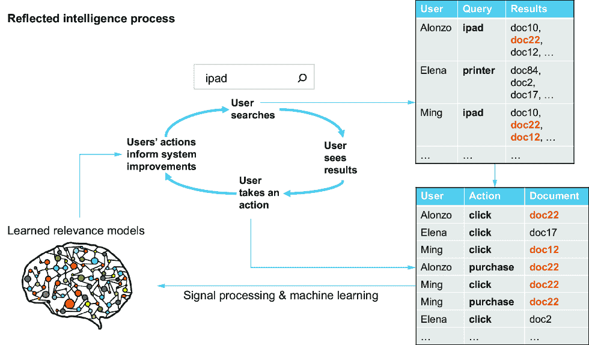
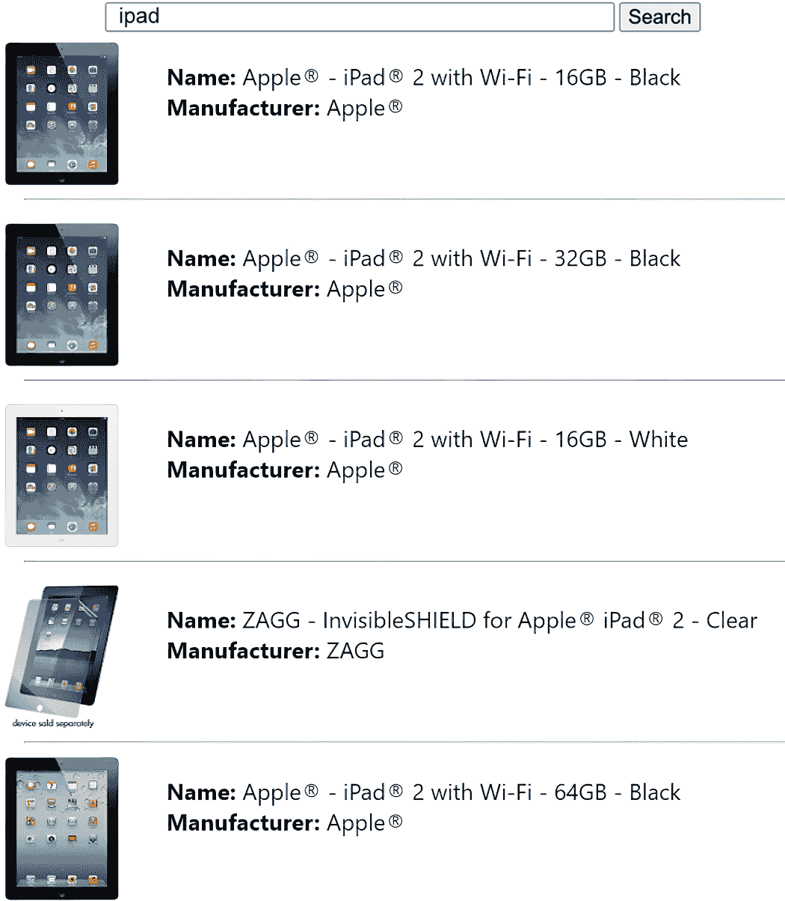
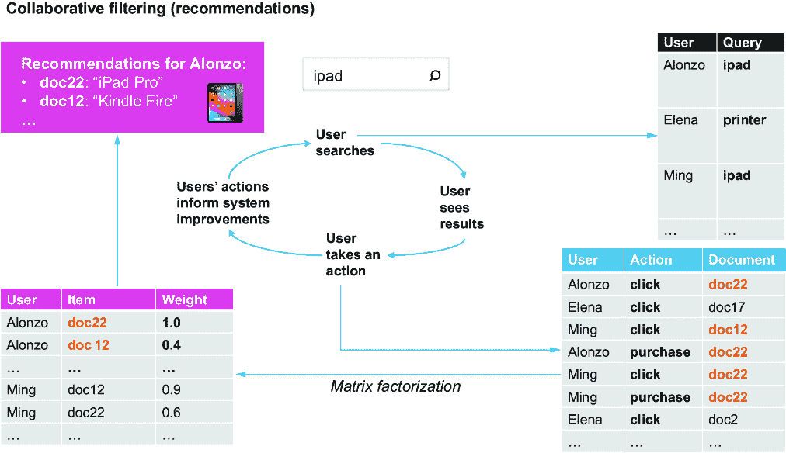
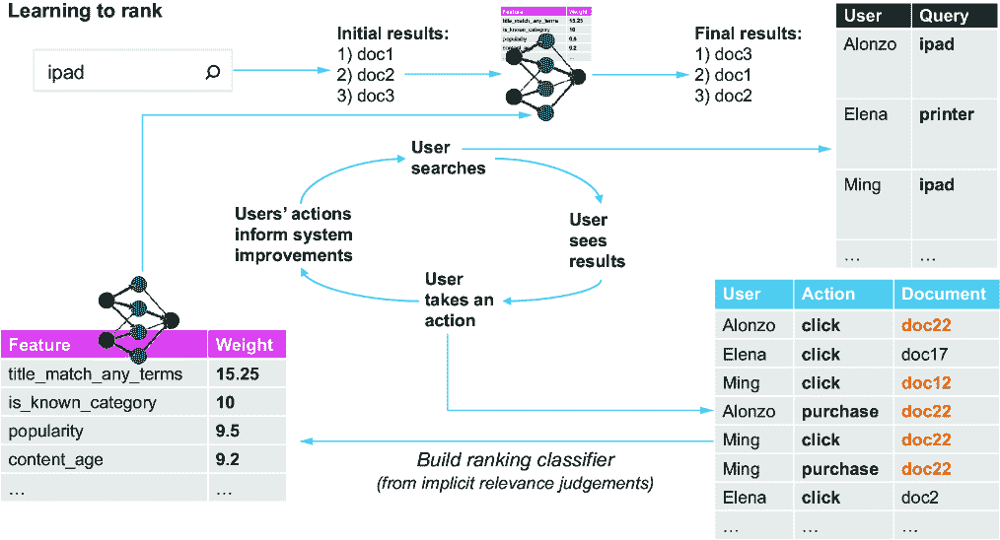

# 4 众包相关性

### 本章涵盖

+   利用用户集体洞察力提高搜索平台的相关性

+   收集和使用用户行为信号

+   利用反射智能创建自调优模型

+   构建端到端信号增强模型

在第一章中，我们介绍了用户意图的维度，即内容理解、用户理解和领域理解。为了创建一个最佳的 AI 驱动搜索平台，我们需要能够结合每个这些上下文来理解我们的用户查询意图。然而，问题是我们是如何得出这些理解的？

我们可以从许多信息来源中学习：文档、数据库、内部知识图谱、用户行为、领域专家等等。一些组织有团队手动用主题或类别标记文档，有些甚至使用像 Amazon Mechanical Turk 这样的工具外包这些任务，这使他们能够从世界各地的人那里众包答案。为了识别网站上的恶意行为或错误，公司通常允许用户报告问题甚至建议更正。所有这些都是众包的例子——依赖于许多人的输入来学习新信息。

在搜索相关性方面，众包可以发挥至关重要的作用，尽管通常重要的是不要通过不断请求帮助而惹恼您的宝贵客户。幸运的是，根据他们的行为，通常可以从用户那里隐式地学习。例如，为了发现查询的最相关文档，我们可以检查日志，以确定在运行相同搜索时其他用户点击最多的文档。这些点击提供了关于哪些结果对查询最相关的信号。

在本章中，我们将探讨如何收集、分析和从这些信号中生成洞察力以众包相关性。我们还将介绍反射智能过程，介绍三种用于普及相关性（信号增强）、个性化相关性（协同过滤）和泛化相关性（学习排序）的关键模型类型。您还将索引一个电子商务数据集并构建您自己的第一个反射智能模型。

## 4.1 与用户信号合作

每当客户采取行动——例如发布查询或购买产品——这都为该用户的意图提供了信号。我们可以记录和处理这些信号，以了解每个用户、不同用户群体或我们整个用户群体的洞察力。

本节介绍了使用用户信号的力量，并使用我们在整本书中都会使用的示例电子商务数据集，引导您了解收集、存储和处理这些信号的机制。

### 4.1.1 内容 vs. 信号 vs. 模型

在构建搜索引擎时，两个高级数据源会影响搜索的相关性：内容和信号。大多数内容以文档的形式存在，可以代表网页、产品列表、计算机文件、图像、视频、事实或任何其他可搜索信息。内容文档通常包含用于搜索的文本或嵌入字段，以及代表与内容相关的属性（作者、大小、颜色、日期等）的其他字段。内容文档的标志性特征是它们包含用户搜索的信息，以及在理想情况下，它们的查询答案。

当用户在查询的响应中看到内容时，他们可能会点击结果、将其添加到购物车或采取其他行动。这些行动是信号，它们对于提供用户如何与内容互动的见解至关重要。这些信号可以随后汇总并用于构建模型，以改进匹配和排名算法的相关性。信号的标志性特征是它们是用户提供的见解，用于展示用户希望如何与内容互动。

有时，依赖外部数据源——或称为*模型*——作为搜索体验的一部分也可能很有用。这可以包括查询知识图谱、引用实体列表或调用在外部数据源上训练的大型语言模型（LLM）或其他基础模型。这些外部模型可以用来更好地解释用户查询、推理和理解内容，甚至总结或生成新的内容以返回。虽然我们可以将模型视为我们搜索引擎的第三种数据源，但它们是在内容和/或信号上训练的，因此作为这两个原始数据源的衍生和精炼表示。

总结来说，我们使用三个主要信息来源来改进搜索：项目的属性（内容）、用户与内容的观察到的交互（信号）以及外部模型（这些模型是从内容和/或信号中派生出来的）。

在构建人工智能驱动的搜索时，我们执行许多任务，可以使用内容或信号来得出相似的结果，但它们为我们提供了两种不同的相关性视角。在理想情况下，我们可以应用这两种视角来构建一个更智能的系统，但了解它们的优缺点对于最佳地使用它们是有用的。

例如，当试图寻找“driver”这个词的同义词时，我们可以查看文本内容中常见于同一文档中的词语。在这种情况下，我们可能会找到一些词语（按它们在文档中出现的百分比优先排序）如“taxi”（40%）、“car”（35%）、“golf”（15%）、“club”（12%）、“printer”（3%）、“linux”（3%）和“windows”（1%）。同样，我们可以查看搜索“driver”的用户发出的信号，并按优先顺序汇总他们其他搜索中的常见关键词，如“screwdriver”（50%）、“printer”（30%）、“windows”（25%）、“mac”（15%）、“golf”（2%）和“club”（2%）。从信号和内容中得出的列表可能相似，也可能非常不同。基于内容的方法告诉我们文档中最常见的意义，而基于信号的方法告诉我们用户正在寻找的最常见的意义。

由于我们的最终目标是向用户提供他们所寻找的内容，因此通常更有效地依赖于从信号中得出的意义，而不是从内容中得出的意义。但如果我们没有与从信号中得出的意义相对应的良好内容呢？我们是使用从内容中得出的意义，还是尝试根据信号数据建议其他相关搜索？如果我们没有足够的信号，或者信号数据不是很干净呢？我们能否以某种方式使用从内容中得出的数据清理信号中得出的数据？

我们在推荐方面遇到类似的问题。基于内容的推荐使用文档中的属性，但不了解用户，而基于信号的推荐不了解内容属性，没有足够的交互将无法工作。基于内容的推荐可能基于对用户不重要的特征，而基于信号的推荐可能会创建自我强化的循环，其中用户只与推荐的物品互动，而这些物品只被推荐是因为用户与它们互动。

理想情况下，我们希望创建一个平衡的系统，能够利用从内容中得出的和从信号中得出的智能的最好部分。虽然本章主要关注基于信号的、众包的智能，但本书的一个主要目标是如何平衡和结合这两种方法，以产生更优化的 AI 驱动搜索体验。

### 4.1.2 设置我们的产品和信号数据集（RetroTech）

在我们探索不同的用例时，本书将使用各种数据集，但拥有一个一致的示例，随着我们的进展可以在此基础上构建，也是非常宝贵的。我们将通过拥有一个具有大量数据和用户交互的强大搜索用例而受益，我们将在该部分中设置它。

值得注意的是，本书中的大多数技术几乎适用于所有搜索案例。何时使用特定技术的决定因素通常更多地取决于内容和信号的量与种类，而不是具体的用例。

电子商务搜索为 AI 驱动的搜索技术的价值提供了一个最具体的用例，并且它也是潜在读者中最容易理解的问题之一，因此我们创建了一个电子商务数据集，以帮助我们探索这个领域：RetroTech 数据集。

#### RetroTech 用例

在零售商之间激烈的竞争，销售尖端电子产品、多媒体和科技产品的情况下，小型在线业务很难竞争。然而，一个细分但正在兴起的群体选择避免最新的最优秀的产品，而是回归到几十年前的熟悉技术。RetroTech 公司成立是为了满足这一独特消费者群体的需求，提供可能难以在当今货架上找到的复古硬件、软件和多媒体产品。

让我们加载 RetroTech 公司的数据集，这样我们就可以开始学习文档与用户信号之间的关系，以及众包智能如何提高我们的搜索相关性。

#### 加载产品目录

RetroTech 网站上有大约 50,000 种产品可供销售，我们需要将这些产品加载到我们的搜索引擎中。如果你构建了 AI 驱动的搜索代码库以运行第三章的示例，那么你的搜索引擎已经启动并运行。否则，构建和运行本书所有示例的说明可以在附录 A 中找到。

在你的搜索引擎启动后，你需要做的下一件事是下载本书附带的 RetroTech 数据集。该数据集包括两个 CSV 文件，一个包含所有 RetroTech 的产品，另一个包含 RetroTech 用户一年的信号数据。以下列表展示了产品目录数据集的一些行，以便你熟悉其格式。

##### 列表 4.1 探索 RetroTech 产品目录

```py
"upc","name","manufacturer","short_description","long_description"
"096009010836","Fists of Bruce Lee - Dolby - DVD", , ,
"043396061965","The Professional - Widescreen Uncut - DVD", , ,
"085391862024","Pokemon the Movie: 2000 - DVD", , ,
"067003016025","Summerbreeze - CD","Nettwerk", ,
"731454813822","Back for the First Time [PA] - CD","Def Jam South", ,
"024543008200","Big Momma's House - Widescreen - DVD", , ,
"031398751823","Kids - DVD", , ,
"037628413929","20 Grandes Exitos - CD","Sony Discos Inc.", ,
"060768972223","Power Of Trinity (Box) - CD","Sanctuary Records", ,
```

你可以看到，产品通过 UPC（通用产品代码）进行标识，并且还有一个名称、制造商，以及一个简短描述（用作搜索结果中的预告）和一个长描述（用于产品详情页面上的完整描述）。

由于我们正在尝试搜索产品，我们的下一步是将它们发送到搜索引擎进行索引。为了在我们的 RetroTech 产品目录上启用搜索，让我们运行以下列表中的文档索引代码，将产品文档发送到搜索引擎。

##### 列表 4.2 将产品文档发送到搜索引擎

```py
products_collection = engine.create_collection("products")
products_dataframe = load_dataframe("data/retrotech/products.csv")
products_collection.write(products_dataframe)
```

输出：

```py
Wiping "products" collection
Creating "products" collection
Status: Success
Loading Products
Schema:
root
 |-- upc: long (nullable = true)
 |-- name: string (nullable = true)
 |-- manufacturer: string (nullable = true)
 |-- short_description: string (nullable = true)
 |-- long_description: string (nullable = true)

Successfully written 48194 documents
```

最后，为了验证文档现在已被索引并可搜索，让我们运行一个示例关键词搜索。以下列表展示了搜索`ipod`这个真正的经典设备的示例！

##### 列表 4.3 在产品目录上运行搜索

```py
def product_search_request(query, param_overrides={}):
  request = {"query": query,
             "query_fields": ["name", "manufacturer", "long_description"],
             "return_fields": ["upc", "name", "manufacturer",
                               "short_description", "score"],
             "limit": 5,
             "order_by": [("score", "desc"), ("upc", "asc")]}
  return request | param_overrides

query = "ipod"
request = product_search_request(query)
response = products_collection.search(**request)
display_product_search(query, response["docs"])
```

前面的`ipod`搜索结果如图 4.1 所示，表明我们的产品现在已被索引并可搜索。不幸的是，结果的相关性相当差。


##### 图 4.1 产品搜索结果。我们可以看到产品目录已被索引，现在对`ipod`的查询返回了搜索结果。

虽然搜索结果排名的质量还不是很好，但我们有一个现成的“关键词匹配”搜索引擎，我们可以开始改进它。我们将以此为基础，并在本书的其余部分介绍更多智能 AI 驱动的搜索功能。我们的下一步是介绍我们的信号数据。

#### 加载信号数据

因为 RetroTech 运行在您的计算机上，没有真实用户在搜索、点击或其他方式生成信号。相反，我们生成了一个数据集，它近似于您在类似现实世界数据集中期望的信号活动类型。

为了简单起见，我们将把我们的信号存储在搜索引擎中，以便在实时搜索场景和外部处理中都可以访问。运行以下列表将模拟并索引一些样本信号，我们可以在本章的其余部分使用这些信号。

##### 列表 4.4 索引用户信号数据集

```py
signals_collection = engine.create_collection("signals")
signals_collection.write(from_csv("data/retrotech/signals.csv"))
```

在加载了我们的 RetroTech 产品和信号数据后，我们将很快开始探索如何使用信号数据来增强搜索相关性。首先，让我们熟悉信号数据，以便我们了解信号在现实世界系统中是如何结构化、使用和收集的。

### 4.1.3 探索信号数据

不同类型的信号有不同的属性需要记录。对于“查询”信号，我们希望记录用户的搜索关键词。对于“点击”信号，我们希望记录被点击的文档以及导致点击的查询。为了后续分析，我们还希望记录查询后返回并可能被用户查看的文档。

为了使示例更具可扩展性并避免为每种新的信号类型编写自定义代码，我们在本书中采用了表示信号的通用格式。这个格式可能与您目前记录信号的方式不同，但只要您最终可以将您的信号映射到这个格式，本书中的所有代码都应该可以在不进行特定用例修改的情况下工作。

我们在本书中使用的信号格式如下：

+   `query_id`—产生此信号的查询信号的唯一 ID

+   `user`—代表搜索引擎特定用户的标识符

+   `type`—信号的类型（“查询”、“点击”、“购买”等）

+   `target`—在`signal_time`时此信号应用的 内容

+   `signal_time`—信号发生的时间和日期

例如，假设用户执行了以下一系列操作：

1.  查询了`ipad`，并返回了三个文档（doc1、doc2 和 doc3）。

1.  点击了 doc1。

1.  返回并点击了 doc3。

1.  将 doc3 添加到购物车中。

1.  返回并搜索了`ipad` `cover`，并返回了两个文档（doc4 和 doc5）。

1.  点击了 doc4。

1.  将 doc4 添加到购物车中。

1.  购买了购物车中的商品（doc3 和 doc4）。

这些交互将导致表 4.1 中显示的信号。

##### 表 4.1 示例信号格式

| query_id | user | type | target | signal_time |
| --- | --- | --- | --- | --- |
| 1  | u123  | query  | ipad  | 2024-05-01-09:00:00  |
| 1  | u123  | results  | doc1,doc2,doc3  | 2024-05-01-09:00:00  |
| 1  | u123  | click  | doc1  | 2024-05-01-09:00:10  |
| 1  | u123  | click  | doc3  | 2024-05-01-09:00:29  |
| 1  | u123  | add-to-cart  | doc3  | 2024-05-01-09:03:40  |
| 2  | u123  | query  | ipad cover  | 2024-05-01-09:04:00  |
| 2  | u123  | results  | doc4,doc5  | 2024-05-01-09:04:00  |
| 2  | u123  | click  | doc4  | 2024-05-01-09:04:40  |
| 2  | u123  | add-to-cart  | doc4  | 2024-05-01-09:05:50  |
| 1  | u123  | purchase  | doc3  | 2024-05-01-09:07:15  |
| 2  | u123  | purchase  | doc4  | 2024-05-01-09:07:15  |

关于信号格式的几点需要注意：

+   *“查询”类型和“结果”类型被拆分为单独的信号*。这并不是必要的，因为它们同时发生，但这样做可以保持表格结构的一致性，并且不需要添加一个仅适用于查询信号的额外结果列。此外，如果用户点击下一页链接或向下滚动页面并看到更多结果，这种结构允许我们创建一个新的信号，而无需返回并修改原始信号。

+   *每个信号都关联回原始“查询”信号*的`query_id`，该信号启动了内容交互系列。`query_id`不仅仅是对用户输入的关键词的引用，而是对特定“查询”信号的引用，该信号标识了用户查询关键词的时间戳实例。因为针对相同查询关键词的结果可能会随时间变化，这使得我们能够更深入地处理用户对特定查询结果的反应。

+   *大多数信号类型在* `target` *中只包含一个项目，但“结果”信号类型包含一个有序的文档列表*。结果的顺序对于我们在本书后面介绍的一些算法来说很重要，用于衡量相关性。因此，保留搜索结果的精确顺序是很重要的。在这种情况下，`target`是一个有序的文档列表，而不是单个文档。

+   *结账产生了每个商品的单独“购买”信号，而不是只有一个“结账”信号*。这样做是为了我们可以追踪每个购买是否来自不同的查询。可以额外添加一个“结账”信号类型来跟踪交易，并且可能将两个购买列为`target`，但这对于本书中的需求来说是多余的。

在有了这些原始信号作为我们的构建块之后，我们现在可以开始思考如何将这些信号链接起来，以开始了解我们的用户及其兴趣。在下一节中，我们将讨论在搜索平台内建模用户、会话和请求的方法。

### 4.1.4 用户、会话和请求的建模

在上一节中，我们研究了用户信号的结构，作为与原始查询相关联的独立交互列表。我们假设有一个“用户”存在，并且有一个唯一的 ID，但如何识别和追踪一个唯一的用户？此外，一旦你确定了如何追踪唯一用户，最好的方法是将他们的交互分解成会话，以了解他们的上下文何时可能发生变化？

网络搜索中的“用户”概念可能相当灵活。如果你的搜索引擎有经过认证（登录）的用户，那么你已经有一个内部用户 ID 来追踪他们。如果你的搜索引擎支持未认证访问或公开可用，那么你将有许多没有正式用户 ID 的用户在运行搜索。但这并不意味着你不能追踪他们；只是需要更灵活地解释“用户”的含义。一个统一的追踪标识符使我们能够将来自同一用户的多个信号联系起来，以了解他们的交互模式。

如果我们认为可追踪的信息是一个从用户最持久的表示到最不持久的表示的层次结构，它看起来可能像这样：

+   *用户 ID*—一个在所有设备上持续存在的唯一用户 ID（经过认证）

+   *设备 ID*—一个在相同设备上的会话中持续存在的唯一 ID（例如设备 ID 或 IP 地址加上设备指纹）

+   *浏览器 ID*—一个只在相同应用或浏览器会话中持续存在的唯一 ID（持久 cookie ID）

+   *会话 ID*—一个在单个会话中持续存在的唯一 ID（例如浏览器隐身模式中的 cookie）

+   *请求 ID*—一个只在单个请求中持续存在的唯一 ID（关闭了 cookies 的浏览器）

在大多数现代搜索应用中，尤其是在大多数电子商务应用中，我们通常需要处理所有这些。作为一个经验法则，你希望将用户与最持久的标识符联系起来——尽可能高的列表中的那个。请求 ID 和会话 ID 之间的链接，以及会话 ID 和浏览器 ID 之间的链接，都是通过用户的 cookie 实现的，所以最终浏览器 ID（存储在 cookie 中的持久唯一 ID）是这些中的共同分母。

特别是，

+   如果用户启用了持久 cookies，一个浏览器 ID 可以有多个会话 ID，这些会话 ID 可以有多个请求 ID。

+   如果用户在每次会话后清除 cookies（例如使用隐身模式），则每个浏览器 ID 只有一个会话 ID，这个会话 ID 可以有许多请求 ID。

+   如果用户关闭了 cookies，那么每个请求 ID 都有一个新的会话 ID 和一个新的浏览器 ID。

在构建搜索平台时，大多数组织没有正确规划和设计它们的信号跟踪机制。如果它们无法将访客的查询与随后的行动相关联，那么最大化其人工智能搜索平台的能力就会变得困难。在某些情况下，可以在事后推导出缺失的信号跟踪信息（例如，通过使用时间戳将信号建模到可能的会话中），但通常最好在设计系统时提前考虑，以更好地处理用户跟踪，防止潜在的信息丢失。在下一节中，我们将讨论如何通过称为“反射智能”的过程使用这些丰富的信号来提高相关性。

## 4.2 介绍反射智能

在上一节中，我们介绍了如何捕捉用户与我们搜索引擎交互时的信号。虽然这些信号本身有助于我们了解我们的搜索引擎是如何被使用的，但它们也作为构建模型的输入，这些模型可以从用户交互中不断学习，并使我们的搜索引擎能够自我调整其相关性模型。在本节中，我们将通过反射智能的概念介绍这些自我调整模型的工作原理。

### 4.2.1 什么是反射智能？

想象你是一家五金店的员工。有人问你他们可以在哪里找到一把锤子，你告诉他们“第二通道”。几分钟后，你看到同一个人从第二通道走到第五通道，但没有拿锤子，然后他们从第五通道拿着锤子走了出来。第二天，另一个人要求一把锤子，你又告诉他们“第二通道”，并且你观察到几乎相同的模式。如果你没有注意到这个模式并调整你的建议，以提供更好的客户体验，你将是一个糟糕的员工。

不幸的是，大多数搜索引擎默认以这种方式运行——它们为每个查询返回大量静态的文档集，无论每个用户是谁或先前用户如何对显示的文档列表做出反应。然而，通过将机器学习应用于收集到的信号，我们可以了解用户的意图，并将这些知识反映出来以改善未来的搜索结果。这个过程被称为*反射智能*。

反射智能的核心是创建反馈循环，这些循环不断学习并基于不断发展的用户交互进行改进。图 4.2 展示了反射智能过程的高级概述。



##### 图 4.2 反射智能过程。用户提出查询，查看结果，并采取一系列行动。然后对这些行动（信号）进行处理，以创建学习相关性模型，从而改善未来的搜索。

在图 4.2 中，用户（Alonzo）运行了一个搜索，在搜索框中输入查询 `ipad`。记录了一个查询信号，其中包含显示给 Alonzo 的所有搜索结果列表。Alonzo 然后看到搜索结果列表并采取两个行动：点击一个文档（doc22）然后购买该文档所代表的商品。这两个额外的行动被记录为额外的信号。Alonzo 的所有信号以及来自每个其他用户的信号，然后可以被各种机器学习算法聚合和处理，以创建学习相关性模型。

这些学习相关性模型可能会提高特定查询的最受欢迎的结果，为每个用户个性化结果，甚至学习在所有用户中通常最重要的文档属性。这些模型还可以学习如何更好地解释用户查询，例如识别常见的拼写错误、短语、同义词或其他语言模式和特定领域的术语。

一旦生成这些学习相关性模型，它们就可以部署回生产搜索引擎，并立即应用于增强未来查询的结果。然后，这个过程再次开始，下一个用户运行搜索，看到（现在希望是改进的）搜索结果，并与这些结果进行交互。这个过程创建了一个自我学习系统，随着每个额外用户交互的进行而不断改进，随着时间的推移变得越来越智能和相关性更强，并自动调整以适应用户兴趣和内容的演变。

在以下章节中，我们将探讨几种反射智能模型类别，包括信号增强（流行相关性）、协同过滤（个性化相关性）和排序学习（泛化相关性）。我们将从最简单且最有效的一种开始：信号增强模型。

### 4.2.2 通过信号增强实现流行相关性

发送到您搜索引擎的最受欢迎的查询通常也是从相关性角度优化最重要的查询。幸运的是，由于更受欢迎的查询会产生更多信号，我们通常可以聚合并提高每个查询中具有最高信号数量文档的相关性。这种被称为 *信号增强* 的 *流行相关性* 是最简单形式的反射智能之一，也是提高您最受欢迎、最高流量查询相关性的最有效方法之一。以下列表展示了在我们的 RetroTech 搜索引擎中应用任何信号增强之前，使用查询 `ipad` 的即插即用搜索。

##### 列表 4.5 执行针对匹配 `ipad` 的产品的关键词搜索

```py
query = "ipad"
request = product_search_request(query)
response = products_collection.search(**request)
display_product_search(query, response["docs"])
```

如预期的那样，这个查询返回了许多包含关键词 `ipad` 的文档，通常包含 `ipad` 的文档排名最高。图 4.3 显示了此查询的结果。


##### 图 4.3 查询`ipad`的关键词搜索结果。结果主要基于关键词出现的次数返回，因此提及关键词多次的配件比用户意图看到的实际产品排名更高。

虽然这些结果的内容中都多次包含“ipad”这个词，但大多数用户会对这些结果感到失望，因为它们是次要配件，而不是搜索焦点的主要产品类型。仅根据文档文本进行排名时，这是一个重大的限制。然而，对于非常流行的查询，许多客户可能会反复运行相同的查询，并忍受令人沮丧的搜索结果，以找到他们真正寻求的实际产品。我们可以将这些重复的搜索与一个反馈循环联系起来，该循环基于新的信号持续更新信号增强模型，如图 4.4 所示。


##### 图 4.4 信号增强反馈循环。用户的搜索被记录下来，并将当前的信号增强模型应用于返回增强后的结果。用户对这些结果采取行动后，所有与文档的用户交互信号都会由原始查询聚合，以生成一个更新的模型，以进一步改进未来的搜索。

一旦您的产品被索引并且您已经开始收集用户查询和文档交互的信号，实施信号增强所需的额外步骤仅包括聚合您的信号，然后将您的聚合信号作为增强添加到您的查询或文档中。列表 4.6 展示了将信号聚合到辅助集合的简单模型。

##### 辅助集合

辅助集合是位于您的搜索引擎中与主集合并排的额外集合，其中包含其他有助于改进您的搜索应用的有用数据。在我们的电子商务示例中，我们的主集合是`products`。我们已添加的`signals`集合可以被视为辅助集合。我们将添加另一个辅助集合`signals_boosting`，我们将在查询时使用它来增强我们的查询。在本书中，我们将介绍许多其他辅助集合来存储我们生成的模型的输入和输出。

##### 列表 4.6 通过聚合信号创建信号增强模型

```py
signals_collection = engine.get_collection("signals")
create_view_from_collection(signals_collection, "signals")  #1

signals_aggregation_query = """
SELECT q.target AS query, c.target AS doc, #2
COUNT(c.target) AS boost  #2
FROM signals c LEFT JOIN signals q ON c.query_id = q.query_id
WHERE c.type = 'click' AND q.type = 'query'
GROUP BY q.target, doc #2
ORDER BY boost DESC"""

dataframe = spark.sql(signals_aggregation_query)  #3
signals_boosting_collection = \  #4
  engine.create_collection("signals_boosting") #4
signals_boosting_collection.write(dataframe)  #4
```

#1 创建一个视图，使信号集合可使用 SQL 查询

#2 为每个关键词统计每个文档的总点击量

#3 执行信号聚合 SQL 查询

#4 将结果写入新的 signals_boosting 集合

列表 4.6 最重要的部分是`signals_aggregation_query`，它被定义为可读性的 SQL 查询。对于每个查询，我们将获取用户在搜索结果中点击过的文档列表，以及文档被点击的次数。通过按每个查询的点击次数对文档进行排序，我们得到一个按流行度排序的文档列表。

这里的想法是，用户倾向于选择他们认为最相关的产品，因此如果我们提升这些文档，我们预计我们的顶级搜索结果将变得更加相关。我们将在下一个列表中通过使用这些聚合计数作为信号提升来测试这个理论。让我们回顾一下之前的`ipad`查询。

##### 列表 4.7 使用信号提升来提高相关性的搜索

```py
def search_for_boosts(query, collection, query_field="query"):
  boosts_request = {"query": query,
                    "query_fields": [query_field],
                    "return_fields": ["query", "doc", "boost"],
                    "limit": 10,
                    "order_by": [("boost", "desc")]}
  response = collection.search(**boosts_request)
  return response["docs"]

def create_boosts_query(boost_documents):
  print(f"Boost Documents: \n{boost_documents}")
  boosts = " ".join([f'"{b["doc"]}"^{b["boost"]}'
                     for b in boost_documents])
  print(f"\nBoost Query: \n{boosts}\n")
  return boosts

query = "ipad"
boost_docs = search_for_boosts(query, signals_boosting_collection)
boosts_query = create_boosts_query(boost_docs)
request = product_search_request(query)
request["query_boosts"] = boosts_query

response = products_collection.search(**request)
display_product_search(query, response["docs"])
```

提升文档：

```py
[{"query": "ipad", "doc": "885909457588", "boost": 966},
 {"query": "ipad", "doc": "885909457595", "boost": 205},
 {"query": "ipad", "doc": "885909471812", "boost": 202},
 {"query": "ipad", "doc": "886111287055", "boost": 109},
 {"query": "ipad", "doc": "843404073153", "boost": 73},
 {"query": "ipad", "doc": "635753493559", "boost": 62},
 {"query": "ipad", "doc": "885909457601", "boost": 62},
 {"query": "ipad", "doc": "885909472376", "boost": 61},
 {"query": "ipad", "doc": "610839379408", "boost": 29},
 {"query": "ipad", "doc": "884962753071", "boost": 28}]
```

提升查询：

```py
"885909457588"⁹⁶⁶ "885909457595"²⁰⁵ "885909471812"²⁰² "886111287055"¹⁰⁹
"843404073153"⁷³ "635753493559"⁶² "885909457601"⁶² "885909472376"⁶¹
"610839379408"²⁹ "884962753071"²⁸
```

列表 4.7 中的查询做了两件值得注意的事情：

+   它查询`signals_boosting`辅助集合中按提升排序的文档，并将这些信号提升转换为另一个查询。

+   然后，它将这个提升查询作为查询时间的提升传递给搜索引擎，作为`query_boosts`参数。在 Solr（我们的默认搜索引擎）的情况下，这内部转换为在搜索请求中添加一个`boost`参数`sum(1,query($boost_query))`，将相关性分数乘以`1`（因此总是增加）加上`boost_query`计算出的相关性分数。（如果你想要复习如何通过函数和乘法提升来影响排名，请参阅第 3.2 节。）

如果你还记得图 4.3，我们原始的`ipad`关键字搜索主要返回了 iPad 配件，而不是实际的 iPad 设备。图 4.5 展示了在原始查询上应用信号提升后的改进结果。



##### 图 4.5 展示了启用信号提升的搜索结果。与之前只显示 iPad 配件不同，我们现在看到了实际的 iPad，因为我们基于用户选择的互动文档进行了众包。

新的结果比仅关键字的结果要好得多。我们现在看到了用户更有可能寻找的产品——iPad！你可以期待在你的搜索引擎中，大多数其他流行查询也会看到类似的改进。当然，当我们向下移动到流行产品列表时，信号提升的相关性改进将开始下降，并且由于信号不足，我们甚至可能会降低相关性。幸运的是，我们将介绍许多其他技术来提高信号量不足的查询的相关性。

本节的目标是向您展示实现端到端反射智能模型的初始、具体示例。在这个实现中使用的信号聚合非常简单，尽管结果不言自明。在实现信号增强模型时有许多考虑和细微差别——是在查询时间还是索引时间增强，如何增加新信号与旧信号之间的权重，如何避免恶意用户通过生成虚假信号试图在搜索结果中提升特定产品，如何引入和融合来自不同来源的信号，等等。我们将在第八章中详细讨论这些主题。

让我们暂时放下流行的相关性提升和信号增强，讨论几种其他类型的反射智能模型。

### 4.2.3 通过协同过滤实现个性化相关性

现在我们来看一种称为协同过滤的反射智能方法，我们将它归类为*个性化相关性*。而流行的相关性确定通常在许多用户中哪些结果最受欢迎，个性化相关性则专注于确定哪些项目最有可能对特定用户相关。

*协同过滤*是使用关于某些用户偏好的观察来预测其他用户偏好的过程。它是推荐引擎中最受欢迎的算法类型，也是许多网站上常见的“喜欢这个项目的用户还喜欢这些项目”推荐列表的来源。图 4.6 展示了协同过滤如何遵循我们之前看到的信号增强模型的相同反射智能反馈循环。



##### 图 4.6 用户到项目推荐的协同过滤。根据他的过去行为，我们的用户（Alonzo）接收到基于其他用户喜欢的项目的推荐，其中这些用户也与其他一些项目与 Alonzo 进行了交互。

与信号增强类似，协同过滤涉及一个连续的反馈循环。收集信号，通过这些信号构建模型，由这些模型生成推荐，然后记录与这些推荐的交互作为额外的信号。协同过滤方法通常生成一个用户-项目交互矩阵，将每个用户映射到每个项目（文档），每个用户和项目之间的关系强度基于积极的交互强度（点击、购买、评分等）。

如果交互矩阵足够丰富，就可以从中推断出任何具有交互数据的用户或项目的推荐。这是通过直接查找与同一项目交互的其他用户，然后增强那些用户也交互的其他项目（类似于信号增强）来实现的。然而，如果用户-项目交互矩阵过于稀疏，通常需要应用矩阵分解方法。

*矩阵分解*是将用户-项目交互矩阵分解成两个矩阵的过程：一个将用户映射到潜在特征（或*因素*），另一个将那些潜在因素映射到项目。这与我们在第三章中描述的降维方法类似，我们当时从使用包含倒排索引中每个单词特征的大多数精确关键词（一个包括倒排索引中每个单词特征的向量）来表示食品项目，转变为使用更少的具有意义的维度（一个包含八个特征描述食品项目的向量）来压缩数据。这种矩阵分解使得通过将有限的信号数据提炼成更少的、更有意义的维度，从而更好地泛化项目之间的相似性，从而能够推导出用户对项目的偏好以及项目之间的相似性。

在协同过滤的矩阵分解背景下，潜在因素代表了我们文档的属性，这些属性被学习为用户之间共享兴趣的重要指标。通过根据这些因素匹配其他文档，我们正在使用众包来找到其他具有相同共享兴趣的相似文档。

尽管协同过滤在基于众包相关性学习用户兴趣和品味方面可能非常强大，但它存在一个被称为*冷启动问题*的主要缺陷。这是一个结果返回依赖于信号存在的情况，但新文档由于从未生成信号而不会被返回。这创造了一个恶性循环，新内容不太可能被展示给用户（生成信号的前提），因为它尚未生成任何信号（这是内容被展示所必需的）。在一定程度上，信号增强模型也表现出类似的问题，即已经流行的文档往往会获得更高的提升，从而获得更多的信号，而未知的文档则继续没有信号增强。这个过程创造了一个自我强化的循环，可能导致搜索结果缺乏多样性。这个问题被称为*展示偏差*，我们将在第十二章中展示如何克服它。

你也可以通过其他方式生成推荐，例如通过基于内容的推荐，我们将在下一章（5.4.6 节）中探讨。然而，协同过滤是独特的，因为它可以在不知道任何关于文档内容的情况下，学习用户对其他文档的偏好和口味。这是因为所有决策都是通过观察用户与内容的互动，并根据这些观察确定相似性的强度来做出的。我们将在第九章实现个性化搜索时，更深入地探讨协同过滤。

除了仅利用流行和个性化相关性模型（在文档已经具有信号时表现最佳）之外，搜索引擎还可以从一种更广义的相关性模型中受益，该模型可以应用于所有搜索和文档。这有助于解决冷启动问题。接下来，我们将探讨如何通过称为“学习排序”的技术将众包相关性进行推广。

### 4.2.4 通过学习排序实现广义相关性

由于信号增强（流行相关性，4.2.2 节）和协同过滤（个性化相关性，4.2.3 节）仅适用于已经具有信号的文档，因此在文档获得流量之前，大量查询不会受益。这就是学习排序作为一种广义相关性的形式证明有价值的地方。

*学习排序*（LTR），也称为*机器学习排序*，是构建和使用一种排序分类器的过程，该分类器可以评估任何文档与任何任意查询的匹配程度。你可以将排序分类器视为一个训练好的相关性模型。而不是手动调整搜索增强和其他参数，LTR 过程训练了一个机器学习模型，该模型可以理解你文档的重要特征，然后适当地评分搜索结果。图 4.7 展示了推出 LTR 的一般流程。



##### 图 4.7 学习排序（广义相关性）。排序分类器是根据用户对每个查询（训练集）中已知文档相关性的判断构建的。然后使用该排序分类器模型重新排序搜索结果，以便排名靠前的文档更具相关性。

在 LTR 系统中，与信号增强和协同过滤中相同的高级反射智能过程适用（参见图 4.2）。区别在于 LTR 可以使用相关性判断列表（查询到其理想排名文档集的映射）来自动训练一个相关性模型，然后可以将其普遍应用于所有查询。您将看到图 4.7 中“构建排名分类器”步骤的输出是一个相关性特征模型（`title_match_any_terms`、`is_known_category`、`popularity`和`content_age`），并且该模型定期部署到生产搜索引擎中以提高搜索结果排名。一个非常简单的机器学习排名模型的特征可能看起来像这样，但并没有要求排名分类器必须是可解释或可解释的，而且许多基于深度学习的先进排名分类器都不是。

在图 4.7 中，请注意，实时用户流从对`ipad`的查询开始。然后，初始搜索结果通过部署的排序学习分类器运行，该分类器返回最终的重新排序搜索结果集。由于排名分类器通常比传统的基于关键词的排名相关性模型更智能，并且使用更复杂的排名参数，因此通常使用排名分类器对搜索引擎中所有匹配的文档进行评分会非常慢。相反，LTR 通常会使用一个初始的、更快的排名函数（如 BM25）来找到前 N 个文档（通常是数百或数千个文档），然后只将这部分文档通过排名分类器。虽然可以使用排名分类器作为主要的相关性函数而不是应用这种重新排序技术，但更常见的是看到重新排序的方法，因为它通常要快得多，同时仍然产生大约相同的结果。

LTR 可以使用显式相关性判断（由专家手动创建）或隐式判断（从用户信号中提取），或者两者的组合。我们将在第十章至第十二章中介绍从显式和隐式判断列表实现 LTR 的示例。

### 4.2.5 其他反射智能模型

除了深入探讨信号增强（第八章）、协同过滤（第九章）和排序学习（第十章）之外，我们将在本书中探索许多其他类型的反射智能。在第六章中，我们将探讨挖掘用户查询以自动学习特定领域的短语、常见拼写错误、同义词和相关术语，而在第十一章至第十二章中，我们将探讨从用户交互中自动学习相关性判断的自动化方法，以便我们可以自动生成用于有趣机器学习方法的训练数据。

通常，用户与内容之间的每一次交互都会创建一个连接——图中的一个边——我们可以用它来理解新兴关系并得出更深入的见解。图 4.8 展示了通过探索这个交互图我们可以学习到的各种关系。相同的传入信号数据可以通过不同的信号聚合和机器学习方法进行处理，以学习

+   用户与项目之间的相似性（用户-项目推荐）

+   项目与项目之间的相似性（项目-项目推荐）

+   可以生成用户兴趣概要的特定属性偏好

+   查询与项目之间的相似性


##### 图 4.8 多种反射智能模型。最左边的框表示推荐中的用户到项目的相似性，接下来显示的是根据用户个人资料学习特定属性偏好，第三个显示的是根据推荐学习项目到项目的相似性，最右边显示的是学习查询到项目的推荐。

我们将在接下来的章节中继续探讨这些技术，但记住，信号数据包含了一个宝库的潜在见解，并且通常提供与用户交互的文档内容一样多的好处。反射智能和众包不仅限于我们描述的信号提升、协同过滤和学习排序技术。它们也可以从内容而不是信号中得出，正如我们将在下一节中讨论的。

### 4.2.6 从内容中进行众包

虽然我们通常认为众包是要求用户提供输入，但我们在这个章节中看到，隐式反馈通常可以在许多用户信号中提供同样多的甚至更多的价值。虽然这个章节完全专注于使用用户信号来进行这种众包，但也很重要的是要指出，内容本身也可以用作你人工智能搜索平台的众包智能。

例如，如果你试图了解你文档的一般质量，你可能能够查看客户评论来生成产品评分或查看产品是否被报告为滥用或垃圾邮件。如果客户留下了评论，你可能能够在文本上运行*情感分析*算法，以确定评论是积极的、中性的还是消极的。根据检测到的情感，你可以相应地提高或惩罚源文档。这个过程本质上是从用户提交的内容中提取信号，因此它仍然是一种众包形式，尽管是从用户提供的其他内容中进行的。

我们提到，在第六章中，我们将介绍如何挖掘用户信号来自动学习特定领域的术语（短语、拼写错误、同义词等）。就像您可以通过用户查询和交互来学习这种术语一样，您也应该意识到文档通常是由人编写的，因此，术语之间非常相似的关系因此反映在书面内容中。我们将在下一章进一步探讨这些基于内容的关系。

存在的最著名的搜索算法之一是*Page Rank*算法——这个突破性的算法最初使谷歌成为最相关的网络搜索引擎而闻名。Page Rank 超越了任何给定网页的文本，并查看所有其他网页创建者的隐含行为，以了解他们如何链接到其他网页。通过测量 incoming 和 outgoing 链接，可以测量网页的“质量”，假设网站更有可能链接到高质量、更权威的来源，而那些高质量来源不太可能链接到低质量来源。这种超越单个文档内容并将其与其他文档相关联的想法——无论是通过它们之间的直接链接、用户评论或反馈、任何其他用户交互，甚至是文档中术语的不同、细微的使用方式——是非常强大的。利用您的内容和用户的所有可用信息的艺术和科学是构建高度相关的 AI 搜索引擎的关键。在第五章中，我们将探讨知识图的概念以及我们如何使用文档之间隐含链接中嵌入的一些关系来自动进一步理解特定领域。

## 摘要

+   内容、信号和模型（这些是从内容和信号中派生出来的）是驱动一个 AI 搜索引擎的三个主要“燃料”来源，其中信号是众包相关性的主要来源。

+   反射智能是创建学习反馈循环的过程，它从每个用户交互中改进，并将学习到的智能反映回来，以持续提高未来结果的相关性。

+   信号增强是一种“普及化相关性”的形式，通常对您最高流量、最受欢迎的查询影响最大。

+   协同过滤是一种“个性化相关性”的形式，它可以使用用户与物品的交互模式来学习用户偏好或物品之间关系的强度，然后根据这些学习到的关系推荐类似物品。

+   学习排序（LTR）是一种“广义相关性”的形式，它是基于相关性判断列表（查询映射到正确排序的文档）来训练排序分类器的过程。LTR 可以应用于对所有文档进行排序，并避免冷启动问题。

+   其他类型的反射智能存在，包括使用内容（而不仅仅是信号）进行众包相关性的技术。
