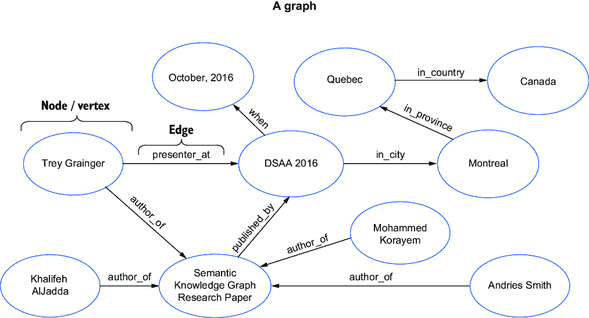
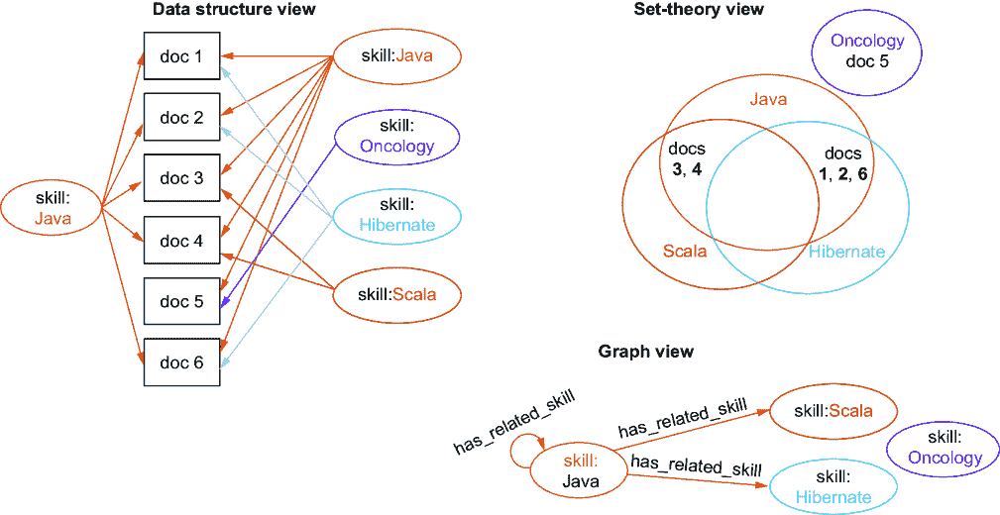

# 第五章：知识图谱学习

### 本章涵盖了

+   构建和使用知识图谱

+   实现开放信息提取以从文本生成知识图谱

+   使用语义知识图谱发现任意语义关系

+   使用知识图谱进行查询扩展和重写

+   使用知识图谱解释文档

在上一章中，我们主要关注基于用户行为信号学习查询和文档之间的相似性。在第二章中，我们也讨论了文本文档内容，而不是“非结构化数据”，更像是一个包含丰富语义关系的巨大超结构化数据图，这些关系连接了我们文档集合中的许多字符序列、术语和短语。

在本章中，我们将展示如何利用我们内容中的这个巨大的语义关系图来更好地解释特定领域的术语。我们将通过使用传统的知识图谱和语义知识图谱来实现这一目标，前者能够在一个领域内显式地建模关系，而后者能够在一个领域内实时推断细微的语义关系。

语义知识图谱是一种简单的*语言模型*（语言模型表示一系列单词的概率分布）。我们将使用语义知识图谱作为理解后续章节中大型语言模型（LLMs）的垫脚石。LLMs 通常是经过数十亿参数和大量数据（通常包括大部分互联网）训练的深度神经网络，以模拟人类知识的通用表示。然而，语义知识图谱是可查询的语言模型，仅代表您搜索索引中实际存在的那些关系。虽然语义知识图谱不具备在语言上进行一般推理的能力，但它们在特定领域的上下文推理方面可以非常强大，正如我们将看到的。

我们还将在这个章节中玩转几个有趣的数据集，以展示知识图谱如何构建和应用，以及如何在不同领域改善查询理解。

## 5.1 与知识图谱一起工作

在第 2.4 节中，我们介绍了*知识图谱*的概念，并讨论了它们与其他类型知识模型（如本体、分类法、同义词和备选标签）之间的关系。如果您还记得，知识图谱整合了所有这些其他类型的知识模型，因此在我们本章的构建过程中，我们将把它们统称为“知识图谱”。

知识图谱（或任何图）是通过节点（也称为*顶点*）和边来表示的。*节点*是知识图谱中代表的一个实体（如术语、人、地点、事物或概念），而*边*则代表两个节点之间的关系。图 5.1 显示了显示节点和边的图的一个示例。



##### 图 5.1 图结构。图由表示实体的节点（也称为“顶点”）和表示节点之间关系的边组成。图提供了一种通过遍历（或“跟随”）节点之间的边来建模知识和推断新见解的方法。

在这个图中，您可以看到四个表示作者的节点，一个表示他们共同撰写的研究论文的节点，一个表示论文所展示和发表的学术会议，然后是表示会议举行的城市、省份、国家和日期的节点。通过遍历（或“跟随”）节点之间的独立边，您可能会推断出其中一位作者在 2016 年 10 月的蒙特利尔，加拿大。虽然任何具有节点和边的结构都被称为图，但这个特定的图代表了事实知识，因此也被称为知识图谱。

建立和表示知识图谱的方法有很多，既可以通过显式地将数据建模为节点和边，也可以通过实时动态地（发现）从您的数据中生成节点和边。后者被称为*语义知识图谱*。在本章中，我们将通过各种示例进行讲解，包括手动构建显式知识图谱、自动生成显式知识图谱以及使用已存在于您的搜索索引中的语义知识图谱。

要开始使用知识图谱，您实际上有三个选择：

+   使用图数据库（Neo4j、Apache TinkerPop、ArangoDB 等）从头开始构建知识图谱

+   插入一个现有的知识图谱（ConceptNet、DBpedia、大型语言模型等）

+   从您的数据中自动生成知识图谱，直接使用您的内容来提取知识

每种方法都有其优势和劣势，尽管这些方法并不一定是相互排斥的。如果您正在构建一个通用知识搜索引擎（如网络搜索引擎），利用现有的知识图谱或大型语言模型是一个很好的起点。然而，如果您的搜索引擎更具有领域特定性，那么您的特定领域实体和术语可能不会出现在现有的图谱中，这就需要您创建一个定制的知识图谱。

在本章中，我们将主要关注第三个选项：从您的内容中自动生成知识图谱。其他两种技术已在外部材料中得到很好的介绍，使用了像 SPARQL、RDF 三元组、Apache Jena 或现有的知识图谱如 DBpedia 和 Yago 等技术。您仍然需要能够覆盖您的知识图谱并添加自定义内容，因此我们将包括如何将显式定义的知识图谱（使用特定预定义关系列表构建）和隐式定义的知识图谱（从数据中动态发现的自动生成关系）集成到您的搜索平台中的示例。

## 5.2 将我们的搜索引擎作为知识图谱使用

许多组织投入大量资源为其组织构建知识图谱，但难以将其集成到其搜索引擎中。幸运的是，我们为示例选择了默认的搜索引擎实现（Apache Solr），它内置了显式的图遍历功能，因此无需引入新的外部系统来实现或遍历我们的知识图谱。

虽然使用支持更复杂图遍历语义的外部图数据库（如 Neo4J 或 ArangoDB）可能有一些优势，但使用这样的外部系统会使协调请求、保持数据同步和基础设施管理变得更加复杂。此外，由于某些类型的图操作只能在搜索引擎中有效地执行（例如，使用倒排索引进行的语义知识图谱遍历，我们将在稍后遇到），将搜索引擎作为统一平台，用于搜索和知识图谱功能，可以减少我们需要管理的系统数量。

我们将在第七章中详细讨论实现语义搜索系统，包括语义查询解析、短语提取、拼写检测、同义词扩展和查询重写，所有这些都将建模为显式构建的知识图谱。由于当前章节的目的是专注于知识图谱*学习*，我们将把关于查询时集成模式的讨论大部分留到第七章，那时我们可以将本章和第六章的内容结合起来，构建适当的知识图谱结构。

## 5.3 从内容中自动提取知识图谱

虽然您需要能够修改您知识图谱中的节点和边，但手动维护大规模知识图谱是非常具有挑战性的。手动维护的知识图谱需要大量的专业知识，必须积极更新以适应信息的变化，并且容易受到维护者偏见和错误的干扰。

*开放信息提取* 是自然语言处理（NLP）研究的一个发展中的领域。开放信息提取旨在直接从您的文本内容中提取事实。这通常是通过使用 NLP 库和语言模型来解析句子并评估它们之间的依赖图来完成的。*依赖图* 是对句子中每个单词和短语的词性分解，以及指示哪些单词指代哪些其他单词的指示。

知识图谱提取的较新方法往往使用专门针对实体提取训练的 LLM（大型语言模型），例如 UniRel（统一表示和交互用于联合关系三元组提取）和 REBEL（通过端到端语言生成进行关系提取）。由于 LLM 方法能够比传统的基于依存图的方法更细致地表示和提取实体之间的关系，它们很可能会随着时间的推移成为知识图谱提取的标准。然而，为了本章的学习，我们将专注于基于依存图的方法，因为它将为理解从文本中提取知识图谱的机制以及定制关系提取模式提供更好的基础。如果需要，你总是可以在以后切换到一个更先进的 LLM 驱动的方法，如果它更适合你的需求。

在本节中，我们将使用语言模型和依存图来提取两种不同类型的关系：任意关系和上下位关系。

### 5.3.1 从文本中提取任意关系

考虑到文本的超结构性质以及典型句子和段落中表达出的丰富关系，我们可以合理地认为我们应该能够识别句子的主语和宾语以及它们之间的关系。在本节中，我们将专注于从文本内容中的句子提取实体之间的任意关系。

通过分析句子中的名词和动词，通常可以推断出句子中存在的事实，并将该事实映射到一个 RDF 三元组（也称为语义三元组）。资源描述框架（RDF）是一种用于表示图和关系的数据模型。一个*RDF 三元组*是一个包含三个部分的数据结构，代表一个主题（起始节点）、关系（边）和对象（结束节点）。例如，在句子“Colin attends Riverside High School”中，动词“attends”可以被提取为一个关系类型，将主题（“Colin”）与对象（“Riverside High School”）连接起来。因此，RDF 三元组是`("Colin", "attends", "Riverside High School")`。

列表 5.1 展示了如何使用基于 Python 的 spaCy 库从文本内容中提取事实的示例。SpaCy 是一个流行的自然语言处理库，它包含了用于词性标注、依存句法分析、文本分类和命名实体识别的最先进的统计神经网络模型。

##### 列表 5.1 提取关系和解决共指

```py
def extract_relationships(text, lang_model, coref_model):
  resolved_text = resolve_coreferences(text, coref_model)  #1
  sentences = get_sentences(resolved_text, lang_model)  #2
  return resolve_facts(sentences, lang_model) #3

text = """
Data Scientists build machine learning models. They also write code.
Companies employ Data Scientists.
Software Engineers also write code. Companies employ Software Engineers.
"""
lang_model = spacy.load("en_core_web_sm")
coref_model = spacy.load("en_coreference_web_trf")  #4
graph = extract_relationships(text, lang_model, coref_model)
print(graph)
```

#1 解析实体，例如用名词替换代词

#2 对文本进行词性分类

#3 生成 RDF 三元组

#4 用于共指消解的 spaCy 实验模型

输出：

```py
sentence: Data Scientists build machine learning models.
dependence_parse: ['nsubj', 'ROOT', 'dobj', 'punct']
---------------------
sentence: Data Scientists also write code.
dependence_parse: ['nsubj', 'advmod', 'ROOT', 'dobj', 'punct']
---------------------
sentence: Companies employ Data Scientists.
dependence_parse: ['nsubj', 'ROOT', 'dobj', 'punct']
---------------------
sentence: Software Engineers also write code.
dependence_parse: ['nsubj', 'advmod', 'ROOT', 'dobj', 'punct']
---------------------
sentence: Companies employ Software Engineers.
dependence_parse: ['nsubj', 'ROOT', 'dobj', 'punct']
---------------------
[['Data Scientists', 'build', 'machine learning models'],
 ['Data Scientists', 'write', 'code'],
 ['Companies', 'employ', 'Data Scientists'],
 ['Software Engineers', 'write', 'code'],
 ['Companies', 'employ', 'Software Engineers']]
```

如您所见，示例代码已经提取了文本内容，将其解析为句子，并确定了这些句子中的主语、关系和宾语。然后可以将这些 RDF 三元组保存到显式构建的知识图中进行遍历。

图 5.2 展示了从该图中提取的图形的可视化。虽然这个例子很简单，但高级算法可以从更复杂的语言模式中提取事实。在代码示例中，我们使用了 spaCy 库，该库使用基于深度学习的神经语言模型来检测输入文本中的词性、短语、依存关系和共指。然后我们采用的机制是将这些语言输出解析为 RDF 三元组，这个机制更依赖于规则，遵循英语语言中的已知语义模式。

不幸的是，以这种方式将任意动词解析为关系时，提取的关系可能会变得相当嘈杂。由于动词的变形不同，有同义词，并且有重叠的意义，通常需要修剪、合并以及其他方式清理任何任意提取的关系列表。

相比之下，某些关系类型要简单得多，例如统计关系（“is related to”）和下位词（“is a”）。我们将在本章的剩余部分主要关注使用这两种特殊类型，从下位词开始。


##### 图 5.2 提取的知识图。该图中的节点和边是基于词性模式从文本内容中自动提取的。

### 5.3.2 从文本中提取下位词和上位词

虽然在知识图中将任意动词映射到干净的关系列表可能具有挑战性，但提取下位词和上位词可能要容易得多。*下位词*是与更一般形式的实体保持“是”或“是实例”关系的实体，更一般的形式被称为*上位词*。例如，对于“phillips head”（ Phillips 头）、“screwdriver”（螺丝刀）和“tool”（工具）之间的关系，我们会说“phillips head”是“screwdriver”的下位词，“tool”是“screwdriver”的上位词，而“screwdriver”既是“phillips head”的上位词也是“tool”的下位词。

从文本中提取下位词/上位词关系的一种常见且相当准确的方法是通过使用 Hearst 模式，由 Marti Hearst 在“从大型文本语料库中自动获取下位词”（在*COLING 1992 Volume 2: 第 14 届国际计算语言学会议*，1992 年）中描述。这些模式描述了常见的语言模板，这些模板可靠地指示句子中存在下位词。以下列表演示了此类模式的一些示例。

##### 列表 5.2 Hearst 模式识别语义关系

```py
simple_hearst_patterns = [
  ("(NP_\\w+ (, )?such as (NP_\\w+ ?(, )?(and |or )?)+)", "first"),
  ("(such NP_\\w+ (, )?as (NP_\\w+ ?(, )?(and |or )?)+)", "first"),
  ("((NP_\\w+ ?(, )?)+(and |or )?other NP_\\w+)", "last"),
  ("(NP_\\w+ (, )?include (NP_\\w+ ?(, )?(and |or )?)+)", "first"),
  ("(NP_\\w+ (, )?especially (NP_\\w+ ?(, )?(and |or )?)+)", "first")]
```

这五个简单的模式分别用 Python 元组表示，第一个元素是一个 *正则表达式*，第二个元素是在模式匹配中的位置（即 `first` 或 `last`）。如果你不熟悉正则表达式，它们提供了一种在字符串中进行模式匹配的通用且强大的语法。任何你看到 *NP* 字符的地方，这表示句子中存在一个 *名词短语*。元组的第二个元素（`first` 或 `last`）指定的位置表示句子中哪个名词短语代表上位词，所有其他与模式匹配的名词短语被认为是下位词。

在以下列表中，我们运行了几乎 50 个这样的 Hearst 模式，以匹配我们内容中许多“是”关系的组合。

##### 列表 5.3 使用 Hearst 模式提取下位词关系

```py
text_content = """Many data scientists have skills such as machine learning,
python, deep learning, apache spark, among others. Job candidates most
prefer job benefits such as commute time, company culture, and salary.
Google, Apple, or other tech companies might sponsor the conference.
Big cities such as San Francisco, Miami, and New York often appeal to
new graduates. Job roles such as Software Engineer, Registered Nurse,
and DevOps Engineer are in high demand. There are job benefits including
health insurance and pto."""

extracted_relationships = HearstPatterns().find_hyponyms(text_content)
facts = [[pair[0], "is_a", pair[1]] for pair in extracted_relationships]
print(*facts, sep="\n")
```

输出：

```py
['machine learning', 'is_a', 'skill']
['python', 'is_a', 'skill']
['deep learning', 'is_a', 'skill']
['apache spark', 'is_a', 'skill']
['commute time', 'is_a', 'job benefit']
['company culture', 'is_a', 'job benefit']
['salary', 'is_a', 'job benefit']
['Google', 'is_a', 'tech company']
['Apple', 'is_a', 'tech company']
['San Francisco', 'is_a', 'big city']
['Miami', 'is_a', 'big city']
['New York', 'is_a', 'big city']
['Software Engineer', 'is_a', 'Job role']
['Registered Nurse', 'is_a', 'Job role']
['DevOps Engineer', 'is_a', 'Job role']
['health insurance', 'is_a', 'job benefit']
['pto', 'is_a', 'job benefit']
```

如此列表所示，通过专注于提取固定类型的关系（以及最普遍的一种——“是”关系），我们可以生成一个整洁的、清晰的分类事实列表，其中更具体的术语（下位词）通过 `is_a` 边指向更一般的术语（上位词）。图 5.3 以视觉方式展示了这个生成的图。


##### 图 5.3 由 Hearst 模式派生的知识图谱。我们可以看到所有节点都通过 `is_a` 边与其他节点相连。

通过利用 Hearst 模式，可以显著减少任意关系提取中存在的不一致性和噪声。我们仍然可能对相似术语之间的关系存在歧义（例如，拼写错误、替代拼写、已知短语或同义词），但这些更容易解决。实际上，我们将在下一章中讨论如何从你的信号和内容中学习这种特定领域的语言，以便在解释传入的用户查询时使用。

虽然将信息从我们的文本中提取到显式的知识图谱中以便后续遍历可能很有用，但现实是这种提取是一个有损过程，因为项目的表示与我们的内容中这些项目的原始上下文（周围的文本和包含文本的文档）断开连接。在下一节中，我们将介绍一种完全不同的知识图谱——语义知识图谱，它优化了实时遍历和排序我们内容中术语和短语之间关系的能力，而无需显式构建，也不会将术语与其原始文本上下文分开。

## 5.4 通过遍历语义知识图谱学习意图

在第二章的第 2.1 节和第 2.2 节中，我们讨论了文本内容是“非结构化数据”的神话，以及实际上文本文档如何代表超结构化数据。我们讨论了分布假设（“一词应当通过其伴随的词群来认识”）并探讨了如何将字符序列、术语、短语以及其他任意术语序列视为模糊的外键，这些外键在文档之间关联相似的概念。我们还讨论了这些文档之间的链接可以被视为一个巨大关系图中的边，使我们能够学习文档语料库中术语和实体的上下文意义。

在本节中，我们将介绍一个语义知识图，这是一个工具和技术，将使我们能够遍历文档中存在的巨大语义关系图。

### 5.4.1 什么是语义知识图？

一个**语义知识图**（SKG）是一个“紧凑、自动生成的模型，用于实时遍历和排序领域内任何关系”。¹我们可以将 SKG 视为一个搜索引擎，它不是匹配和排序文档，而是找到并排序与查询最佳匹配的**术语**。

例如，如果我们索引了一个关于健康主题的文档集合，并搜索`advil`，那么一个 SKG 会自动（无需手动创建列表或数据建模）返回如下值：

```py
advil  0.71
motrin  0.60
aleve  0.47
ibuprofen  0.38
alleve  0.37
```

这样的结果可以被视为“动态同义词”，但与具有相同意义的术语不同，它们更像是概念上相关的术语。你可以将针对`advil`的词汇搜索查询扩展到包括这些其他术语，以提高搜索结果的召回率或提升与`advil`概念匹配的文档，而不仅仅是包含五个字符`a`、`d`、`v`、`i`、`l`的字符串。

除了找到相关术语之外，一个语义知识图（SKG）可以在你的倒排索引字段之间进行遍历（“找到与这个职位名称最相关的技能”），深入多个层级（“找到与这个查询最相关的职位名称，然后找到与这个查询和每个职位名称最相关的技能”），并且可以使用你发送给搜索引擎的任何任意查询作为图遍历的节点来找到任何字段中的语义相关术语。

语义知识图的使用案例多种多样。它们可用于查询扩展、生成基于内容推荐、查询分类、查询消歧、异常检测、数据清洗和预测分析。我们将在本章剩余部分探讨其中的一些，但首先让我们为测试我们的 SKG 设置一些数据集。

### 5.4.2 索引数据集

SKG 在那些文档中使用的术语重叠度更高的数据集上工作得最好。两个词在文档中出现的频率越高，我们就能越好地确定这些术语在统计上出现的频率是否比预期的高。

虽然维基百科对于许多用例来说通常是一个好的起点数据集，但它通常只有一个关于主要主题的权威页面，因此大多数文档之间没有显著的重叠，这使得维基百科对于这个用例来说是一个较差的数据集。相比之下，大多数其他用户提交内容的网站（问题、论坛帖子、职位发布、社交媒体帖子、评论）对于 SKG 用例来说往往拥有优秀的数据集。

对于本章，我们选择了两个主要数据集：一个职位数据集（职位板发布）以及一系列包含以下论坛帖子在内的 Stack Exchange 数据存档：

+   健康

+   科幻

+   开发运维

+   旅行

+   烹饪

### 5.4.3 SKG 的结构

为了最好地利用 SKG，了解其底层结构如何工作是有用的。

与必须显式建模到节点和边中的传统知识图谱不同，SKG 是从您的搜索引擎的底层倒排索引中*实例化*的。这意味着您要产生一个 SKG 所需要做的只是将文档索引到搜索引擎中。不需要额外的数据建模。

倒排索引和相应的正向索引随后作为底层数据结构，使得在您的文档集合中实时遍历和排名任何任意语义关系成为可能。

图 5.4 展示了文档如何被添加到正向索引和倒排索引中。在图的左侧，你可以看到三个文档，每个文档都有一个`job_title`字段、一个`desc`字段和一个`skills`字段。图的右侧显示了这些文档如何映射到您的搜索引擎中。我们看到倒排索引将每个字段映射到一个术语列表，然后将每个术语映射到一个包含文档列表的帖子列表（包括文档中的位置以及图中未包含的一些其他数据）。这使得查找任何字段中的任何术语并找到包含该术语的所有文档变得快速且高效。


##### 图 5.4 倒排索引和正向索引。文档被添加到倒排索引中，该索引将文档映射到术语列表，并映射到正向索引，该索引将术语映射回文档列表。能够映射两个方向的能力对于图遍历和关系发现将证明非常重要。

除了众所周知的倒排索引之外，你还可以在图 5.4 的中心看到不太为人所知的**正向索引**。正向索引可以被视为一个**非倒排索引**：对于每个字段，它将每个文档映射到包含在该文档中的术语列表。正向索引是搜索引擎用来生成搜索结果上的**分面**（也称为**聚合**）的工具，它显示了来自一组文档的每个字段的最高值。在基于 Lucene 的搜索引擎（如 Solr、OpenSearch 和 Elasticsearch）中，正向索引通常通过在字段上启用一个称为**doc values**的功能来在索引时间生成一个字段。或者，Apache Solr 还允许你在查询时间通过“非倒排”内存中的倒排索引来生成相同的正向索引，即使在那些未将 doc values 添加到索引的字段上也能启用分面功能。

如果你具备通过倒排索引（从术语到文档的遍历）搜索任意查询并找到文档集合的能力，同时你也具备从任意文档集合中查找术语的能力（从文档到术语的遍历），这意味着通过进行两次遍历（术语到文档到术语），你可以找到出现在任何匹配查询的文档中的所有相关术语。图 5.5 展示了这种遍历如何发生，包括数据结构视图、集合论视图和图形视图。



##### 图 5.5 SKG 的三个表示。数据结构视图显示了术语映射到文档集合，集合论视图显示了文档集合的交集如何形成它们之间的关系，图形视图显示了节点和边。

在数据结构视图中，它代表我们的倒排和正向索引，我们可以看到术语如何根据它们是否出现在其中与文档相关联。这些关系链接仅在集合论视图中任何两个节点（在这种情况下是术语）出现的文档集合之间存在交集时才存在。最后，图形视图展示了同一底层数据的第三种视图，在这种情况下，我们看到的是节点（而不是文档集合）和边（而不是相交的文档集合）。本质上，SKG 存在于已构建和更新的倒排索引之上，这发生在搜索引擎索引内容时。

我们通常认为搜索引擎的主要功能是接受查询，找到匹配的文档，并按相关性排序返回这些文档。我们在第三章中专门讨论了这一过程，包括匹配（3.2.4-3.2.6 节）、TF-IDF 排序（3.1 节）和常用的 BM25 排序函数（3.2.1 节）。然而，在 SKG 中，我们关注的是匹配和排序相关**术语**，而不是相关文档。

任何任意的查询（你可以解析为文档集的任何内容）都可以成为你图中的一个节点，你可以从该节点遍历到任何文档字段中的任何其他术语（或任意查询）。此外，由于两个节点之间的边遍历每次都使用倒排索引（术语到文档）和正向索引（文档到术语），因此将这些遍历串联成多级图遍历是微不足道的，如图 5.6 所示。

在图中，数据结构视图显示了从技能节点（`Java`）到其他技能节点层（`Java`、`肿瘤学`、`Hibernate`和`Scala`），再到职位名称节点层（`软件工程师`、`数据科学家`和`Java 开发者`）的遍历。你可以看到并非所有节点都是连接的——例如，`肿瘤学`节点在图形视图中没有出现，因为没有任何原始节点可以通过任何边连接到它——没有重叠的文档。

由于并非所有可能的节点都会对任何给定的遍历相关，因此 SKG 能够对节点之间的关系进行评分和分配权重，以便在图遍历过程中优先考虑这些边，这也是非常重要的。我们将在下一节中介绍边的评分和权重分配。

### 5.4.4 计算边权重以衡量节点之间的相关性

由于 SKG 的主要功能是发现节点之间的相关语义关系，因此计算*语义相似度*的能力是至关重要的。但语义相似度究竟是什么？

如果你还记得，第 2.3 节中引入的分布假设指出，在相同语境和相似分布中出现的词语往往具有相似的意义。直观上，这很有道理——术语“疼痛”或“肿胀”在提及“艾德维尔”、“布洛芬”或“冰袋”的文档中出现的可能性，要比在随机文档中高。有趣的是，然而，“冰袋”也可能出现在包含“冷却器”、“长途旅行”或“寒冷”等术语的文档中，而“艾德维尔”和“布洛芬”可能就不会。


##### 图 5.6 多级图遍历。在数据结构视图中，我们看到两次遍历：每次都是通过倒排索引然后是正向索引。在图形结构视图中，我们看到相应的两级遍历：从技能到技能再到职位名称。

这些示例显示了具有相似意义的词语（及其上下文），但让我们也考虑像“a”、“the”、“of”、“and”、“if”、“they”以及无数其他非常常见的停用词。这些词也会在“pain”、“swelling”、“advil”、“ibuprofen”或其他我们检查过的词语的相同上下文中大量出现。这指向分布假设的第二部分——即词语也必须以相似的方式出现。本质上，这意味着给定包含第一个术语的一些文档，任何第二个术语如果它比在包含其他随机术语的文档中更频繁地与第一个术语共现，那么它就倾向于与第一个术语在语义上相似。

实际上，由于“the”或“a”通常与几乎所有其他术语共同出现，尽管它们的共现程度很高，但它们在语义上并不被认为与这些术语相似。然而，像“pain”和“ibuprofen”这样的术语，其出现频率在统计上比任一术语与随机其他术语一起出现的频率要高得多，因此它们被认为是语义相似的。

以下方程展示了计算术语与一组文档语义相关性的方法：


其中

+   `x`是一个查询（通常是一个术语或术语序列），其相关性是相对于另一个查询，前景查询`fg`来计算的。`D[x]`是匹配查询`x`的文档集。

+   `D[fg]`是匹配前景查询`fg`的文档集。`x`的相关性是相对于这个前景集来计算的。

+   `D[bg]`是匹配背景查询`bg`的文档集。这个`bg`查询应该与`x`和`fg`无关，通常设置为匹配整个文档集合`D`或`D`的随机样本。

+   `P[x]`是在背景集中随机文档中找到`x`的概率，计算公式为

这种“相关性”计算（在概念上类似于正态分布中的 z 分数）依赖于“前景”文档集和“背景”文档集的概念，并使得可以在两个集合之间对术语`x`的分布进行统计比较。例如，如果前景集是所有匹配查询`pain`的文档，而背景集是所有文档，那么术语“advil”的相关性就是一个衡量“advil”在包含单词`pain`的文档（前景集）中出现的频率与在任意随机文档（背景集）中出现的频率之间的差异的度量。最常见的方法是使用 Sigmoid 函数来归一化相关性分数，将值映射到-1.0 和 1.0 之间，其中 0.0 表示术语之间没有关系。为了简单起见，我们将在代码和所有后续示例中依赖这个归一化值域。

如果两个术语高度相关，它们的相似度将是一个接近 1.0 的正数。如果术语高度不相关（意味着它们倾向于只在不同的领域出现），分数将更接近-1.0。最后，完全不相关的术语——如停用词——的相似度分数通常会接近零。

Apache Solr 直接在其分面 API 中构建了 SKG 功能。分面提供了从术语遍历到文档集合再到术语的能力，一个相关度聚合函数（`RelatednessAgg`）实现了我们刚刚描述的语义相似性计算。以下列表演示了在 Stack Exchange 健康数据集中搜索与“advil”语义相关的术语。

##### 列表 5.4 发现与`advil`语义相关的术语

```py
health_skg = get_skg(engine.get_collection("health"))

nodes_to_traverse = [{"field": "body",  #1
                      "values": ["advil"]},  #2
                     {"field": "body",
                      "min_occurrences": 2,  #3
                      "limit": 8}]  #4

traversal = health_skg.traverse(*nodes_to_traverse)  #5
print_graph(traversal, "advil") #6
```

#1 查找起始节点的值所在的字段

#2 我们的起始节点是查询“advil”。

#3 通过排除至少出现这么多次的术语来减少噪声

#4 返回多少个节点（术语）

#5 执行图遍历

#6 打印 SKG 遍历的结果

输出：

```py
advil  0.70986
motrin  0.59897
aleve  0.4662
ibuprofen  0.38264
alleve  0.36649
tylenol  0.33048
naproxen  0.31226
acetaminophen  0.17706
```

正如你所见，在 Stack Exchange 健康数据集中的论坛帖子中，与`advil`最语义相关的术语的排名顺序是一系列类似的止痛药。这是使用分布假设通过语义相似性发现和排名术语的魔力——它为我们提供了实时自动发现关系的能力，这些关系可以进一步改进我们对传入查询的理解。

以下是一个 Solr SKG 请求，它使用了 Solr 的 JSON 分面 API 和基于函数排序的能力——我们刚刚讨论的`relatedness`计算。

```py
{
  "limit": 0,
  "params": {
    "q": "*",
    "fore": "{!${defType} v=$q}",
    "back": "*",
    "defType": "edismax",
    "f0_0_query": "advil"
  },
  "facet": {
    "f0_0": {
      "type": "query",
      "query": "{!edismax qf=body v=$f0_0_query}",
      "field": "body",
      "sort": {"relatedness": "desc"},
      "facet": {"relatedness": {"type": "func",
                                "func": "relatedness($fore,$back)"},
        "f1_0": {
          "type": "terms",
          "mincount": 2,
          "limit": 8,
          "sort": {"relatedness": "desc"},
          "facet": {"relatedness": {"type": "func",
                                    "func": "relatedness($fore,$back)"}
}}}}}}
```

列表 5.4 中的`skg.traverse(*nodes_to_traverse)`函数抽象了特定引擎的语法，但如果你试图理解你的特定搜索引擎或向量数据库内部如何处理这类知识图谱遍历的细微差别，你可以检查笔记本中的函数。我们将主要展示`skg.traverse`的抽象，但你可以始终直接调用`skg.transform_request(*nodes_to_traverse)`函数来查看和调试内部、特定引擎的请求。

在下一节中，我们将讨论如何将此 SKG 遍历返回的相关术语应用于提高查询的相关性。

### 5.4.5 使用 SKGs 进行查询扩展

仅根据搜索过程中输入的关键词进行匹配和排名并不总是提供足够的信息来找到和排名最佳结果。在这些情况下，通过动态扩展或以其他方式增强查询以包括概念上相关的术语，你可以显著提高搜索结果的质量。在本节中，我们将介绍如何生成这些相关术语，并展示几种将术语应用于提高搜索结果质量的方法。

由于其能够从任何关键词或查询开始，并在任何领域找到其他高度相关的术语，一个明显的用例是动态扩展查询以包含相关术语。这种扩展有时被称为*稀疏词汇扩展*，因为它在由基于（词汇）特征的查询标记的稀疏向量上操作。实现这种查询扩展的一个著名技术是 SPLADE（稀疏词汇和扩展模型），我们将在第 7.4.3 节中介绍。语义知识图谱也提供了一种生成上下文稀疏词汇扩展的绝佳方式，并且它们的好处是无需对您的数据集进行额外的微调。这使得即使文档不包含用户输入的确切关键词，也能匹配文档，但它们确实包含其他具有非常相似意义的术语。例如，对于一个用户对`advil`的查询，由 SKG 生成的增强术语的扩展查询可能看起来像这样：`advil` `OR` `motrin⁰.59897` `OR` `aleve⁰.4662` `OR` `ibuprofen⁰.3824` `OR` `.` `.` `.`。

让我们通过使用来自不同领域的数据集（Stack Exchange scifi 数据集）来实现这种查询扩展的步骤进行说明。以下列表显示了此过程的第一个步骤：在 SKG 中搜索一个晦涩的术语（作为 SKG 中的一个节点）并找到相关的其他术语（作为 SKG 中的相关节点）。在这种情况下，我们将使用对`vibranium`的查询作为我们的起始节点。

##### 列表 5.5 发现未知术语“vibranium”的上下文

```py
stackexchange_skg = get_skg(engine.get_collection("stackexchange"))

query = "vibranium"
nodes_to_traverse = [{"field": "body", "values": [query]},
                     {"field": "body", "min_occurrences": 2, "limit": 8}]

traversal = stackexchange_skg.traverse(*nodes_to_traverse)

print_graph(traversal, query)
```

响应：

```py
vibranium  0.94237
wakandan  0.8197
adamantium  0.80724
wakanda  0.79122
alloy  0.75724
maclain  0.75623
klaw  0.75222
america's  0.74002
```

对于任何不熟悉术语“vibranium”的人来说，它是一种强大、虚构的金属，存在于漫威漫画和电影中（通过 2018 年好莱坞热门电影《黑豹》广受欢迎）。返回的最相关术语是与“Wakandan”和“Wakanda”相关的，这是 vibranium 起源的虚构文化和国家，“adamantium”，另一种来自漫威漫画的强大（虚构）金属，以及“Maclain”和“Klaw”的名字，这些是漫威漫画中与金属 vibranium 高度相关的角色。Maclain 创造了用于制造“美国队长”盾牌的 vibranium“合金”，因此这些词的相关性。

自动生成的知识图谱在识别相关信息方面非常有效。通过使用 SKG 并将您的查询扩展到包括额外的相关上下文，您可以极大地提高搜索请求的召回率。通过增强与您的查询概念上最佳匹配的结果（而不是仅仅匹配文本），您也可能能够提高您顶级搜索结果的精确度。

以下列表演示了将原始查询以及 SKG 输出翻译成扩展查询的示例。

##### 列表 5.6 使用 SKG 中的节点扩展查询

```py
expansion = ""
for term, stats in traversal["graph"][0]["values"][query] \
                       ["traversals"][0]["values"].items():
  expansion += f'{term}^{stats["relatedness"]} '
expanded_query = f"{query}⁵ " + expansion

print(f"Expanded Query:\n{expanded_query}")
```

扩展查询：

```py
vibranium⁵ vibranium⁰.94237 wakandan⁰.8197 adamantium⁰.80724
wakanda⁰.79122 alloy⁰.75724 maclain⁰.75623 klaw⁰.75222 america's⁰.74002
```

在这种情况下，我们正在进行简单的布尔 OR 搜索，以查找与原始查询 `vibranium` 相关的任何关键词，将原始查询项的权重提高 5 倍，并根据其语义相似度分数对后续术语对相关性分数的影响进行加权。选择将原始术语提高 5 倍是任意的——你可以选择任何值来分配与其他（扩展）术语相比的相对相关性提升。

你可能还会注意到，“vibranium”这个术语出现了两次——第一次作为原始术语，然后再次作为扩展术语（因为术语*也是*与其自身最语义相似的）。如果你正在搜索单个关键词，这几乎总是这种情况，但由于你的查询可能包含短语或其他结构，使得原始查询与返回的术语（如果有）不同，通常将原始查询作为扩展（重新编写）查询的一部分是一个好主意，这样用户的实际查询总是会在结果中表示出来。

虽然先前扩展的查询应该能够合理地排序结果（优先考虑匹配多个相关术语的文档），但它也高度关注*召回率*（扩展以包含任何相关内容），而不是*精度*（确保包含的内容都是相关的）。增强查询可以根据你的主要目标以多种方式构建。

重新编写的查询可以执行简单的扩展，需要匹配最小百分比或数量的术语，需要匹配原始查询中的特定术语，或者甚至只需更改相同的初始结果集的排名。以下列表展示了几个示例，使用最小匹配阈值和百分比，可以根据需要调整精度和召回率之间的平衡。

##### 列表 5.7 不同的查询增强策略

```py
def generate_request(query, min_match=None, boost=None):
  request = {"query": query,
             "query_fields": ["title", "body"]}
  if min_match:
    request["min_match"] = min_match
  if boost:
    request["query_boosts"] = boost
  return request

simple_expansion = generate_request(f"{query} {expansion}", "1")
increased_conceptual_precision = \
  generate_request(f"{query} {expansion}", "30%")
increased_precision_same_recall = \
  generate_request(f"{query} AND ({expansion})", "2")
slightly_increased_recall = generate_request(f"{query} {expansion}", "2")
same_results_better_ranking = generate_request(query, "2", expansion)
```

让我们来看看前面提到的查询增强技术的最终搜索查询。

简单查询扩展：`simple_expansion`

```py
{"query": "vibranium vibranium⁰.94237 wakandan⁰.8197 adamantium⁰.80724
         ↪wakanda⁰.79122 alloy⁰.75724 maclain⁰.75623 klaw⁰.75222
         ↪america's⁰.74002 ",
 "query_fields": ["title", "body"],
 "min_match": "0%"}
```

这种简单的查询扩展与之前描述的相同，匹配包含原始查询或任何语义相关术语的任何文档。

提高精度、降低召回率的查询：`increased_conceptual_precision`

```py
{"query": "vibranium AND (vibranium⁰.94237 wakandan⁰.8197
         ↪adamantium⁰.80724 wakanda⁰.79122 alloy⁰.75724
         ↪maclain⁰.75623 klaw⁰.75222 america's⁰.74002)",
 "query_fields": ["title", "body"],
 "min_match": "30%"}
```

这个提高精度、降低召回率的示例指定了一个“最小匹配”阈值为 30%，这意味着为了匹配，文档必须包含至少 30%（向下取整）的查询术语。

提高顶部结果精度，不减少召回率：`increased_precision_ same_recall`

```py
{"query": "vibranium AND (vibranium⁰.94237 wakandan⁰.8197
         ↪adamantium⁰.80724 wakanda⁰.79122 alloy⁰.75724
         ↪maclain⁰.75623 klaw⁰.75222 america's⁰.74002)",
 "query_fields": ["title", "body"],
 "min_match": "2"}
```

这个提高精度、相同召回率的查询要求“vibranium”这个术语匹配，并且当其他扩展术语匹配时，将提高文档的排名，从而提高顶部结果的精度。

略微提高召回率的查询：`slightly_increased_recall`

```py
{"query": "vibranium vibranium⁰.94237 wakandan⁰.8197
         ↪adamantium⁰.80724 wakanda⁰.79122 alloy⁰.75724
         ↪maclain⁰.75623 klaw⁰.75222 america's⁰.74002",
 "query_fields": ["title", "body"],
 "min_match": "2"}
```

这个略微增加召回率的查询需要两个术语匹配，但它并不明确要求原始查询，因此它可以扩展到其他概念上相似但不必包含原始查询术语的文档。由于术语“vibranium”重复两次，任何仅包含“vibranium”的文档也将匹配。

相同的结果，更好的概念排名：`same_results_better_ranking`

```py
{"query": "vibranium",
 "query_fields": ["title", "body"],
 "min_match": "2",
 "query_boosts": "vibranium⁰.94237 wakandan⁰.8197 adamantium⁰.80724
                ↪wakanda⁰.79122 alloy⁰.75724 maclain⁰.75623
                ↪klaw⁰.75222 america's⁰.74002 "}
```

这个最终的查询返回与原始查询`vibranium`相同的文档，但根据它们与知识图谱中语义相似术语的匹配程度进行不同的排名。这确保了关键词存在于所有匹配的文档中，并且返回包含用户查询的所有文档，同时通过提升更多上下文相关的文档来大大提高排名。

当然，在重写查询以包括增强的语义上下文时，你可以探索无限多种可能的查询排列，但前面的例子应该能提供对可用的选项和需要考虑的权衡的良好感觉。

### 5.4.6 使用 SKGs 进行基于内容的推荐

在最后一节中，我们探讨了如何通过发现和使用 SKG 中的相关节点来增强查询，包括多种结构重写查询的方法以优化精确度、召回率，甚至是在相同结果上改进概念排名。除了使用语义相关术语扩展查询外，还可以使用 SKG 通过根据文档中术语的语义相似性将文档翻译成查询来生成基于内容的推荐。

由于 SKG 中的节点可以代表任何任意查询，我们可以从文档中提取术语并将它们建模为任意节点，相对于文档的已知上下文进行评分。这意味着我们可以从文档中提取数十或数百个术语，将它们全部相对于文档的主题进行评分，然后使用最语义相似的术语生成一个最能代表文档细微、语境意义的查询。

下面的列表展示了如何将一个被分类为“星球大战”的文档进行翻译，并按该主题对所有文档中的术语进行排名。

##### 列表 5.8 计算文档术语与“星球大战”的相关性

```py
from aips import extract_phrases

stackexchange_skg = get_skg(engine.get_collection("stackexchange"))

classification = "star wars"
document = """this doc contains the words luke, magneto, cyclops,
              darth vader, princess leia, wolverine, apple, banana,
              galaxy, force, blaster, and chloe."""
parsed_document = extract_phrases(document)
nodes_to_traverse = [{"field": "body", "values": [classification]},
                     {"field": "body", "values": parsed_document}]

traversal = stackexchange_skg.traverse(*nodes_to_traverse)

print_graph(traversal, classification)
```

评分节点：

```py
luke  0.75212
force  0.73248
darth vader  0.69378
galaxy  0.58693
princess leia  0.50491
blaster  0.47143
this  0.19193
the  0.17519
words  0.10144
and  0.09709
contains  0.03434
doc  0.00885
chloe  0.0
cyclops  -0.01825
magneto  -0.02175
banana  -0.0319
wolverine  -0.03362
apple  -0.03894
```

在这些结果中，你可以看到一份根据与“星球大战”主题的语义相似性很好地排序的文档术语列表。得分较低的术语将与指定主题没有相关性或负相关性。下面的列表通过过滤至少具有`0.25`以上相关性的术语来获取文档中非常干净的、相关的术语列表。

##### 列表 5.9 从评分短语生成推荐查询

```py
def get_scored_terms(traversal):
  return {term: data["relatedness"]
          for term, data in traversal["graph"][0]["values"]["star wars"] \
                                ["traversals"][0]["values"].items()}

rec_query = " ".join(f'"{term}"^{score}'
                     for term, score in get_scored_terms(traversal).items()
                     if score > 0.25)

print(f"Expanded Query:\n{rec_query}")
```

扩展查询：

```py
"luke"⁰.75212 "force"⁰.73248 "darth vader"⁰.69378 "galaxy"⁰.58693
"princess leia"⁰.50491 "blaster"⁰.47143
```

下一个列表展示了此过程的最后一步——运行搜索以返回与原始文档最语义相似的顶级文档。

##### 列表 5.10 运行基于内容的推荐查询

```py
stackexchange_collection = engine.get_collection("stackexchange")

request = {"query": rec_query,
           "query_fields": ["title", "body"],
           "return_fields": ["title"],
           "limit": 5,
           "filters": [("title", "*")]}

response = stackexchange_collection.search(**request)

print(json.dumps(response["docs"], indent=2))
```

输出：

```py
[{"title": "At the end of Return of the Jedi, did Darth Vader learn
          ↪that Princess Leia was his daughter?"},
 {"title": "Did Luke know the &quot;Chosen One&quot; prophecy?"},
 {"title": "Was Darth Vader at his strongest during Episode III?"},
 {"title": "Why couldn't Snoke or Kylo Ren trace Luke using the Force?"},
 {"title": "Does Kylo Ren know that Darth Vader reconciled with Luke?"}]
```

我们刚刚创建的是一个基于内容的推荐算法。当用户行为信号不足，无法进行基于信号的推荐（如协同过滤，见第 4.2.3 节）时，基于内容的方法可以生成仍然具有上下文和领域意识的推荐。

本节中的示例生成了一个基于起始文档中找到的术语的基于内容的推荐查询，但值得记住的是，SKG 并不限于使用传入的术语。你可以添加一个额外的遍历级别，以找到与原始文档中的术语语义相关的其他术语，但实际上并不包含在文档中。这对于主题狭窄且推荐查询匹配的文档不足的情况尤其有用——进一步的遍历将打开新的探索可能性。

在下一节中，我们将快速超越“相关”图关系，看看我们是否可以使用 SKG 生成和遍历一些更有趣的边。

### 5.4.7 使用 SKGs 来建模任意关系

到目前为止，我们所有的 SKG 遍历都使用了“相关”关系。也就是说，我们一直在使用`relatedness`函数找到两个单词或短语之间的语义关系的强度，但我们只测量了节点是“相关的”，而没有测量它们是如何相关的。如果我们能找到节点之间除了“相关”类型边之外的其他类型的边会怎样呢？

如果你还记得，SKG 中的节点是通过执行一个匹配一组文档的查询而即时物化的。如果你从`engineer`节点开始，该节点在内部表示为包含单词`engineer`的所有文档的集合。如果节点被标记为`software engineer`，那么该节点在内部表示为包含术语“software”的所有文档与包含术语`engineer`的所有文档的交集。如果搜索是“`software engineer` OR java”，那么它在内部表示为包含术语“software”且位于`engineer`（短语）之前一个位置的文档集合与包含术语“java”的所有文档集合的并集。所有查询，无论其复杂程度如何，在内部都表示为文档集合。

你可能也记得，边是通过找到包含两个节点的文档集合来形成的。这意味着**节点和边**都是使用相同的机制——文档集合——在内部表示。从实际的角度来看，这意味着如果我们可以使用查询构建一个节点，该查询近似于一个有趣的关系（而不是实体），那么我们可以通过“关系节点”以类似的方式将两个节点联系起来，就像在传统的图结构中使用边将节点联系起来一样。

让我们通过一个例子来分析。回顾我们的科幻数据集，假设我们想要问一个关于 Jean Grey 的问题，她是漫威漫画 X 战警系列中的一位受欢迎的角色。具体来说，假设我们想要弄清楚谁爱上了 Jean Grey。

我们可以通过使用起始节点`jean grey`，遍历到节点`in love with`，然后在`jean grey`的上下文中请求与`in love with`相关的顶级相关术语来实现这一点。列表 5.11 展示了这个查询。通过遍历一个旨在捕获显式语言关系的节点（在这种情况下是`in love with`），我们可以使用中间节点来表示起始节点和终止节点之间的边。

##### 列表 5.11 通过“关系节点”实例化一条边

```py
scifi_skg = get_skg(engine.get_collection("scifi"))

starting_node = "jean grey"
relationship = "in love with"
nodes_to_traverse = [{"field": "body", "values": [starting_node]},
                     {"field": "body", "values": [relationship],
                      "default_operator": "OR"},
                     {"field": "body",
                      "min_occurrences": 25, "limit": 10}]

traversal = scifi_skg.traverse(*nodes_to_traverse)

print_graph(traversal, starting_node, relationship)
```

输出：

```py
jean  0.84915
grey  0.74742
summers  0.61021
cyclops  0.60693
xavier  0.53004
wolverine  0.48053
mutant  0.46532
x  0.45028
mutants  0.42568
magneto  0.42197
```

如果你对这些角色不熟悉，以下是关于 Jean Grey 的相关背景：她与两个变种人有着持续的关系，一个名叫 Cyclops（真名：Scott Summers），另一个名叫 Wolverine。此外，大多数粉丝不知道，Jean Grey 的两个导师，查尔斯·泽维尔教授和磁力王，在漫画书中的一些时候被知道对 Jean Grey 有爱慕之情。

如果我们检查列表 5.11 的结果，我们会看到所有这些预期的名字都被列出。前两个术语，“jean”和“grey”，是最相关的，因为我们正在搜索与`jean grey`相关的`in love with`。她的名字将与她自己高度语义相关。接下来的两个术语，“summers”和“cyclops”，都指的是同一个人，Jean 的最突出的爱情对象。然后我们看到“xavier”和“wolverine”，列表中的最后一个结果是“magneto”。图 5.7 展示了这次遍历的一些底层图关系。


##### 图 5.7 遍历任意定义的边类型。通过实例化一个结合了起始节点（`"jean grey"`）和新的节点（`"in love with"`）的上下文的节点，我们可以从这个组合节点（`"jean grey" + "in love with"`）遍历到其他节点。这相当于说我们正在通过`"in love with"`边从`"jean grey"`遍历到其他节点。

通过使用一个中间节点（即`in love with`）来表示其他节点之间的关系，我们可以形成节点之间的任意类型边，只要我们能将这条边表达为一个搜索查询。

虽然列表 5.11 中我们的图遍历结果相当不错，但我们确实看到了术语“x”（可能是来自“x-men”）和“mutant”也出现了。Jean Grey 和列出的其他所有人都是 X 战警漫画中的变种人，这就是为什么这些术语在语义上如此相关。然而，这些术语并不是对“谁爱上了 Jean Grey？”这个问题的好答案。

这提出了一个重要观点：SKG 是一个统计知识图谱。`in love with` 这种关系的存在纯粹是基于我们收集的术语之间的统计相关性，因此就像任何本体学习方法一样，总会存在一些噪声。尽管如此，对于一个没有显式建模实体的自动生成的图谱来说，这些结果相当不错。

如果我们想要提高这些结果的质量，最简单的事情之一就是对内容进行预处理以识别实体（人物、地点和事物）并索引这些实体，而不是仅仅索引单个关键词。这将导致返回实际人物的名字（例如，“斯科特·萨默斯”、“查尔斯·泽维尔”、“珍妮·格雷”），而不是仅仅返回单个关键词（“summers”、“xavier”、“jean”、“grey”）。

值得注意的是，关系的遍历完全取决于这些关系是否在底层文档的语料库中讨论过。在这种情况下，大量的论坛帖子讨论了这些人与珍妮·格雷的关系。如果存在不足的文档，返回的结果可能很差或不存在。为了避免结果中的噪声，我们设置了 `min_occurrences` 阈值为 `25`，这意味着至少必须有 25 篇文档讨论 `jean grey`、`in love with` 以及找到和评分的其他节点。我们建议将 `min_occurrences` 设置为一个大于 1 的数字，以避免假阳性。

虽然从探索的角度来看，遍历像“in love with”这样的任意语言关系可能是有用的，但从查询理解的角度来看，通常只需要坚持默认的“is related to”关系，并使用术语之间的相关性分数来处理大多数语义搜索用例。然而，遍历多个层次的关系以生成更好的上下文仍然是有用的。具体来说，从术语遍历到分类字段以提供一些额外的上下文，然后到该类别中术语的相关含义，这可能是有用的。我们将在第六章中更详细地介绍这种策略，其中我们将关注具有多个含义的术语的消歧。

## 5.5 使用知识图谱进行语义搜索

通过提供接受任意查询并动态发现上下文中相关术语的能力，SKGs 成为了查询解释和相关性排名的关键工具。我们已经看到，SKGs 不仅可以帮助解释和扩展查询，还可以提供实时分类查询和关键词以及消歧每个查询中术语的多种含义的能力。

在本章早期，我们也探讨了如何通过开放信息提取技术构建显式知识图谱。可能还不明显的是如何解析任意传入的查询并在知识图谱中查找适当上下文和实体。我们将用第七章的大部分内容来介绍如何构建一个端到端的语义搜索系统，该系统能够解析查询并整合这些知识图谱功能。

我们仍需要添加一些对搜索引擎至关重要的关键关系到我们的知识图谱中，例如拼写错误、同义词和领域特定短语。我们将在下一章中介绍如何从用户信号或内容中自动学习这些领域特定术语的每个来源，该章节专注于学习领域特定语言。

## 摘要

+   知识图谱建模了您领域内实体之间的关系，可以通过已知关系显式构建，也可以从您的内容中动态提取。

+   开放信息提取，即从您的内容中提取事实（主题、关系、对象三元组）的过程，可以用来学习任意关系（通常会产生噪声数据）或从文本中提取下位词和上位词关系（噪声较少）到显式知识图谱中。

+   语义知识图谱（SKGs）能够遍历和排名您搜索索引中任何内容之间的任意语义关系。这使得您可以直接使用索引内容作为知识图谱和语言模型，而无需进行任何额外的数据建模。

+   不依赖于用户信号的基于内容的推荐可以通过对文档中最具语义意义的术语和短语进行排名，并使用它们作为查询来查找和排名其他相关文档来生成。

+   SKGs 通过提供领域敏感和上下文敏感的关系发现和查询扩展，能够更好地理解用户意图。

[[1]](#ftnote-113) Grainger 等人，“语义知识图谱：一个紧凑的、自动生成的模型，用于实时遍历和排名领域内的任何关系。”在*2016 年 IEEE 国际数据科学和高级分析会议（DSAA）*，第 420-429 页。IEEE，2016。
