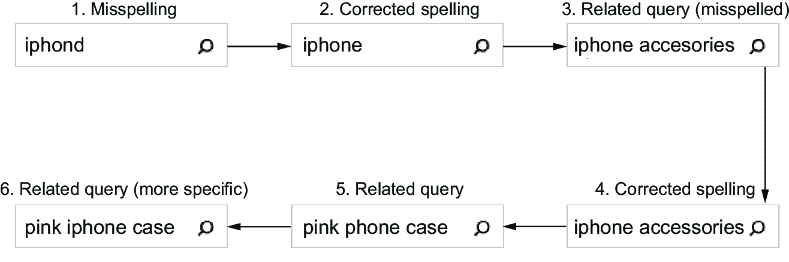
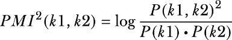

# 6 使用上下文学习特定领域的语言

### 本章涵盖

+   分类查询意图

+   查询意义消歧

+   从用户信号中识别关键术语

+   从用户信号中学习相关短语

+   从用户信号中学习拼写错误和替代术语变体

在第五章中，我们展示了如何生成和使用语义知识图谱（SKG），以及如何将实体、事实和关系明确地提取到知识图谱中。这两种技术都依赖于在单个文档中术语之间的语言联系，或者多个文档和上下文中术语的统计共现。你学习了如何使用知识图谱来查找相关术语，以及这些相关术语如何整合到各种查询重写策略中，以提高召回率或精确度。

在本章中，我们将更深入地了解查询意图以及使用不同上下文来解释查询中特定领域术语的细微差别。我们将从探索查询分类开始，然后展示如何使用这些分类来消除具有多种潜在意义的查询的歧义。这两种方法都将扩展我们在上一章中使用的 SKG。

尽管基于 SKG 的方法在语境化和解释查询方面更有效，但它们仍然依赖于拥有高质量文档，这些文档能够准确代表你的领域。因此，它们在解释用户查询方面的有效性取决于查询与搜索内容重叠的程度。

例如，如果你的 75%用户正在搜索服装，但你的库存大多是电影和数字媒体，那么当用户搜索查询“短裤”时，所有结果都是运行时间短的视频（称为“数字短片”），大多数用户会对结果感到困惑。根据你的查询日志中的数据，如果“短裤”能够映射到你在查询信号中更常见的其他相关术语，如“裤子”、“服装”和“衬衫”，那就更好了。

不仅依赖于文档内容来学习术语和短语之间的关系，而且使用用户生成的信号也是非常有益的。在本章中，我们将展示从用户信号中提取关键短语、学习相关短语以及识别常见拼写错误或替代拼写的技巧。通过结合基于内容的上下文和来自真实用户交互的行为上下文，你的搜索引擎将更好地理解特定领域的术语和实际用户意图。

## 6.1 分类查询意图

查询的目标或意图通常比关键词更重要。在新闻或旅行内容与计算机技术背景下，搜索`driver crashed`可能意味着两种 *非常* 不同的含义。同样，在电子商务中搜索特定产品名称或产品 ID 的人可能正在寻找一个非常具体的商品，并且有很大可能性想要购买它。像`kitchen appliances`这样的通用搜索可能表明用户只是打算浏览可用的产品，看看有什么可用。

在这两种情况下，查询分类器可以有效地确定所发出查询的一般类型。根据领域，查询的上下文可以自动应用（例如，过滤文档的类别），用于修改相关性算法（自动提升特定产品），甚至可以用来驱动不同的用户体验（跳过结果页面，直接进入特定产品的页面）。在本节中，我们将展示如何使用第五章中的 SKG 作为分类器，为传入的查询构建查询分类器。

SKG 遍历在每个图遍历级别执行 *k* 个最近邻搜索。*K* 个最近邻是一种分类，它接受一个数据点（如查询或术语）并尝试在向量空间中找到最接近的 *k* 个其他数据点。如果我们文档上有`category`或`classification`这样的字段，我们可以要求 SKG“找到与我的起始节点最相关的类别”。由于起始节点通常是用户的查询，SKG 可以对该查询进行分类。

我们将继续使用索引的 Stack Exchange 数据集作为 SKG，以扩展查询分类（在本节中）和查询意义消歧（在第 6.2 节中）。

列表 6.1 显示了一个函数，它接受用户查询并遍历 SKG 以找到与查询语义相关的类别进行分类。由于我们已经索引了多个不同的 Stack Exchange 类别（科幻、健康、烹饪、devops 等），我们将使用这些类别作为我们的分类。

##### 列表 6.1 使用 SKG 进行查询分类

```py
def print_query_classification(query, classification_field="category",
      classification_limit=5, keywords_field="body", min_occurrences=5):

  nodes_to_traverse = [{"field": keywords_field, #1
                        "values": [query]},  #1
                       {"field": classification_field, #2
                        "min_occurrences": min_occurrences,  #3
                        "limit": classification_limit}]  #4

  traversal = skg.traverse(*nodes_to_traverse)  #5
  print_classifications(query, traversal)  #6

skg = get_skg(get_engine().get_collection("stackexchange"))

print_query_classification("docker", classification_limit=3)
print_query_classification("airplane", classification_limit=1)
print_query_classification("airplane AND crash", classification_limit=2)
print_query_classification("vitamins", classification_limit=2)
print_query_classification("alien", classification_limit=1)
print_query_classification("passport", classification_limit=1)
print_query_classification("driver", classification_limit=2)
print_query_classification("driver AND taxi", classification_limit=2)
print_query_classification("driver AND install", classification_limit=2)
```

#1 基于查询匹配字段而确定的图初始节点

#2 我们将从中找到相关分类的字段。在这种情况下，我们遍历到类别字段。

#3 只有至少出现在这么多文档中的分类才会被返回。

#4 设置要返回的分类数量

#5 遍历 SKG 以分类查询

#6 打印查询及其分类

示例查询分类：

```py
Query: docker
  Classifications:
    devops  0.87978

Query: airplane
  Classifications:
    travel  0.33334

Query: airplane AND crash
  Classifications:
    scifi  0.02149
    travel  0.00475

Query: vitamins
  Classifications:
    health  0.48681
    cooking  0.09441

Query: alien
  Classifications:
    scifi  0.62541

Query: passport
  Classifications:
    travel  0.82883

Query: driver
  Classifications:
    travel  0.38996
    devops  0.08917

Query: driver AND taxi
  Classifications:
    travel  0.24184
    scifi  -0.13757

Query: driver AND install
  Classifications:
    devops  0.22277
    travel  -0.00675
```

这个请求使用 SKG 根据查询与每个可用分类（在`category`字段内）之间的语义相似度比较，找到最接近的 *k* 个邻居。

我们可以看到每个查询的每个潜在类别的分类得分，例如，“飞机”和“护照”被分类为“旅行”，“维生素”被分类为“健康”和“烹饪”，“外星人”被分类为“科幻”。然而，当我们将“飞机”查询细化为一个更具体的查询，如“飞机 AND 碰撞”时，我们看到分类从“旅行”变为“科幻”，因为关于飞机坠毁的文档更有可能出现在“科幻”文档中，而不是“旅行”文档中。

作为另一个例子，“司机”可能有多种含义。它返回两个潜在分类（“旅行”或“devops”），在没有其他上下文提供的情况下，“旅行”类别是明显的选择。然而，当提供额外的上下文时，我们可以看到查询“司机 AND 出租车”被适当地分类到“旅行”类别，而“司机 AND 安装”则被适当地分类到“devops”类别。

SKG 能够找到任意组合的术语之间的语义关系，这使得它在实时分类传入查询时非常有用。您可以自动应用分类作为查询过滤器或提升，将查询路由到特定上下文的算法或着陆页，或自动消歧查询术语。我们将在下一节中探讨使用两级图遍历来实现查询意义消歧。

## 6.2 查询意义消歧

当从用户的查询中解读用户意图时，理解他们每个词的确切含义是具有挑战性的。多义性问题或模糊术语可能会显著影响您的搜索结果。

如果有人搜索“服务器”，这可能指的是在餐厅接受订单并服务等候的员工，或者它可能意味着运行网络软件的计算机。理想情况下，我们希望我们的搜索引擎能够区分这些词义，并在每个区分的上下文中生成一个独特的相关术语列表。图 6.1 展示了“服务器”这个词的两个潜在上下文以及在每个上下文中可能找到的相关术语类型。


##### 图 6.1 区分模糊术语“服务器”的多个意义

在第 6.1 节中，我们展示了如何使用 SKG（语义知识图谱）自动将查询分类到一组已知类别中。鉴于我们已经知道如何对查询进行分类，添加二级遍历可以为每个查询分类提供一个相关术语的上下文列表。

换句话说，通过从查询遍历到分类，然后到术语，我们可以在每个顶级分类中生成一个术语列表，这些术语描述了原始查询在上下文中的语境化解释。以下列表显示了一个使用 SKG 以这种方式消歧查询的功能。

##### 列表 6.2 在不同上下文中消歧查询意图

```py
def print_query_disambigutaion(query,
      context_field="category", context_limit=5,
      keywords_field="body", keywords_limit=10, min_occurrences=5):

  nodes_to_traverse = [{"field": keywords_field,  #1
                        "values": [query]}, #1
                       {"field": context_field,  #2
                        "min_occurrences": min_occurrences, #2
                        "limit": context_limit}, #2
                       {"field": keywords_field,  #3
                        "min_occurrences": min_occurrences, #3
                        "limit": keywords_limit}] #3

  traversal = skg.traverse(*nodes_to_traverse)
  print_disambigutaions(query, traversal)
```

#1 图形遍历的起始节点（用户的查询）

#2 第一次遍历返回用于区分查询的上下文。

#3 第二次遍历是从与查询和每个相关上下文相关的关键词开始的。

您可以从这个列表中看到，上下文字段（默认为`category`字段）和关键词字段（默认为`body`字段）被用作两级遍历的一部分。对于任何传入的查询，我们首先找到最相关的语义类别，然后在该类别中找到与原始查询最相关的术语。

下面的列表展示了如何调用此函数，传递包含模糊术语的三个不同查询，我们希望找到这些术语的不同含义。

##### 列表 6.3 运行多个查询的查询意义区分

```py
print_query_disambigutaion("server")
print_query_disambigutaion("driver", context_limit=2)
print_query_disambigutaion("chef", context_limit=2)
```

列表 6.3 中查询的结果可以在表 6.1–6.3 中找到，随后是用于在列表 6.4 中区分`chef`的搜索引擎特定 SKG 请求。每个区分上下文（`category`字段）相对于查询进行评分，每个发现的关键词（`body`字段）相对于查询和区分上下文进行评分。

##### 表 6.1 相关术语列表根据类别对查询`服务器`进行上下文化

| 查询：服务器 |  |
| --- | --- |

| `上下文：devops 0.83796` `关键词：`

`服务器 0.93698`

`服务器 0.76818`

`docker 0.75955`

`代码 0.72832`

`配置 0.70686`

`部署 0.70634`

`nginx 0.70366`

`jenkins 0.69934`

`git 0.68932`

`ssh 0.6836`

| `上下文：烹饪 -0.1574` `关键词：`

`服务器 0.66363`

`餐厅 0.16482`

`派 0.12882`

`已提供 0.12098`

`餐厅 0.11679`

`刀片 0.10788`

`部件 0.10135`

`服务 0.08934`

`员工 0.0886`

`菜肴 0.08553`

|

| `上下文：旅行 -0.15959` `关键词：`

`服务器 0.81226`

`小费 0.54391`

`VPN 0.45352`

`小费 0.41117`

| `上下文：科幻 -0.28208` `关键词：`

`服务器 0.78173`

`弗莱尼的 0.53341`

`计算机 0.28075`

`计算机 0.2593`

|

| `服务器 0.39053` `防火墙 0.33092`

`餐厅 0.21698`

`小贴士 0.19524`

`账单 0.18951`

`现金 0.18485`

| `弗莱尼 0.24963` `服务器 0.24778`

`网格 0.23889`

`网络 0.2178`

`关闭 0.21121`

`黑客 0.19444`

|

表 6.1 显示了查询`服务器`的最相关语义类别，随后是每个类别上下文中的`body`字段中最相关的关键词。根据数据，我们看到“devops”类别的语义相关性最高（得分为`0.83796`），而接下来的三个类别都包含负分数（“烹饪”为`-0.1574`，“旅行”为`-0.15959`，“科幻”为`-0.28208`）。对于查询`服务器`，因此“devops”类别是最可能相关的类别。

如果我们查看每个类别返回的不同术语列表，我们也会看到出现几个不同的含义。在“devops”类别中，术语“server”的含义集中在与管理和部署代码到计算机服务器相关的工具上。在“scifi”类别中，含义则围绕计算机网格被黑客攻击和网络被关闭。在“travel”类别中，另一方面，“server”一词的压倒性含义与在餐厅工作的人相关，如“小费”、“餐厅”和“账单”等术语的出现。

当使用此数据实现智能搜索应用时，如果你知道用户的上下文与旅行相关，那么在“旅行”类别中使用特定的含义是有意义的。如果上下文未知，通常最好的选择是使用与语义最相关的类别或用户中最受欢迎的类别。

##### 表 6.2 查询`driver`的按类别划分的上下文相关术语列表

| 查询：driver |  |
| --- | --- |
| --- | --- |

| `上下文：旅行 0.38996` `关键词：`

`driver 0.93417`

`drivers 0.76932`

`taxi 0.71977`

`car 0.65572`

`license 0.61319`

`driving 0.60849`

`taxis 0.57708`

`traffic 0.52823`

`bus 0.52306`

`driver's 0.51043`

| `上下文：devops 0.08917` `关键词：`

`ipam 0.78219`

`driver 0.77583`

`aufs 0.73758`

`overlayfs 0.73758`

`container_name 0.73483`

`overlay2 0.69079`

`cgroup 0.68438`

`docker 0.67529`

`compose.yml 0.65012`

`compose 0.55631`

|

表 6.2 展示了查询`driver`的查询意义消歧。在这种情况下，有两个相关类别，“travel”与语义最相关（`0.38996`）相对于“devops”（`0.08917`）。我们可以看到在每个上下文中`driver`有两个非常不同的含义，其中“travel”类别中的`driver`与“出租车”、“汽车”、“驾照”、“驾驶”和“公交车”相关，而在“devops”类别中，`driver`与“ipam”、“aufs”和“overlayfs”相关，这些都是不同类型的计算机驱动程序。

如果有人搜索`driver`，他们通常不希望搜索结果中出现关于该词两种含义的文档。处理查询关键词的多个潜在含义有几种方法，例如按含义分组结果以突出差异，仅选择最可能的含义，在搜索结果中仔细穿插不同的含义以提供多样性，或者为不同的上下文提供替代查询建议。在这里进行有意的选择通常比随意将多个不同的含义混合在一起要好得多。

##### 表 6.3 查询`chef`的按类别划分的上下文相关术语列表

| 查询：chef |  |
| --- | --- |
| --- | --- |

| `上下文：cooking 0.37731` `关键词：`

`chef 0.93239`

`chefs 0.5151`

`www.pamperedchef.com 0.41292`

`kitchen 0.39127`

`restaurant 0.38975`

`cooking 0.38332`

`chef's 0.37392`

`professional 0.36688`

`nakiri 0.36599`

`pampered 0.34736`

| `上下文：devops 0.34959` `关键词：`

`chef 0.87653`

`puppet 0.79142`

`docs.chef.io 0.7865`

`ansible 0.73888`

`www.chef.io 0.72073`

`learn.chef.io 0.71902`

`default.rb 0.70194`

`configuration 0.68296`

`inspec 0.65237`

`cookbooks 0.61503`

|

作为最后的例子，表 6.3 展示了查询`chef`的消歧。前两个上下文都显示了合理的正相关度分数，表明这两种含义都可能是解释。虽然“烹饪”上下文的分数（`0.37731`）略高于“devops”上下文（`0.34959`），但在选择这两种含义之间时，尽可能考虑用户上下文仍然很重要。在“devops”上下文中，`chef`的含义与用于构建和部署服务器的 Chef 配置管理软件相关（相关术语包括“puppet”和“ansible”），而在“烹饪”上下文中，它指的是准备食物的人（“烹饪”、“口味”、“餐厅”、“食材”）。Chef 软件从烹饪领域汲取灵感，作为准备和提供软件的隐喻，因此看到“cookbooks”这样的术语出现在“devops”类别中并不令人惊讶。

用于消歧查询的特定搜索引擎 SKG 请求可以通过调用`print_disambigutaion_request`函数来查看。这有助于理解和直接在配置的搜索引擎或向量数据库上运行内部 SKG 请求。为这个`chef`查询含义消歧函数调用打印的 Solr 特定 SKG 请求语法如下所示。

##### 列表 6.4 为查询`chef`的 Solr SKG 消歧请求

```py
print_disambigutaion_request("chef", context_limit=2)
```

结果：

```py
{"limit": 0,
 "params": {"q": "*",
            "fore": "{!${defType} v=$q}",
            "back": "*",
            "defType": "edismax",
            "f0_0_query": "chef"}, #1
 "facet": {
   "f0_0": {
     "type": "query",
     "query": "{!edismax qf=body v=$f0_0_query}", #1
     "field": "body",
     "sort": {"relatedness": "desc"},
     "facet": {"relatedness": {"type": "func",
                               "func": "relatedness($fore,$back)"},
       "f1_0": {
         "type": "terms",
         "field": "category", #2
         "mincount": 5, "limit": 2,
         "sort": {"relatedness": "desc"},
         "facet": {"relatedness": {"type": "func",
                                   "func": "relatedness($fore,$back)"},
           "f2_0": {
             "type": "terms",  #3
             "field": "body", #3
             "mincount": 5, "limit": 10,
             "sort": {"relatedness": "desc"},
             "facet": {"relatedness":{"type": "func",
                                      "func": "relatedness($fore,$back)"}}
}}}}}}}
```

#1 起始节点是对 chef 的查询。

#2 第一次 SKG 遍历从类别字段中找到与起始节点最相关的术语。这些类别是消歧上下文。

#3 最后一次 SKG 遍历找到与消歧上下文相关的正文字段中的术语。

这是用于消歧具有`context_limit`为`2`的查询`chef`的内部 Solr SKG 请求。请求将特定于配置的任何搜索引擎或向量数据库，如果没有 SKG 功能，将回退到 Solr。有关更改配置的搜索引擎的说明，请参阅附录 B。

通过结合查询分类、术语消歧和查询扩展，SKG 可以为您的 AI 搜索引擎提供增强的特定领域和高度上下文化的语义搜索能力。我们将在第七章中进一步探讨这些技术的应用，当时我们将它们应用于一个实际的语义搜索应用中。

## 6.3 从查询信号中学习相关短语

到目前为止，你已经看到了如何使用你的内容作为知识图谱来发现相关术语、分类查询和消歧术语。虽然这些技术很强大，但它们完全依赖于你文档的质量。在本章的其余部分，我们将探讨关于你的领域的另一个主要知识来源——用户信号（查询、点击和后续操作）。通常，用户信号可以导致与文档内容相似，甚至更有用的见解，用于解释查询。

作为从真实用户行为中学习特定领域术语的起点，让我们考虑一下你的查询日志代表什么。对于你搜索引擎的每个查询，查询日志包含运行搜索的人的标识符、运行的查询以及查询的时间戳。这意味着如果单个用户搜索多个术语，你可以将这些搜索分组，并且也知道术语输入的顺序。

虽然这并不总是正确的，但一个合理的假设是，如果有人在很短的时间内输入两个不同的查询，那么第二个查询很可能是第一个查询的细化或关于相关主题的。图 6.2 演示了你在查询日志中可能找到的某个用户的真实搜索序列。



##### 图 6.2 某特定用户的查询日志中典型的搜索序列

当查看这些查询时，我们直观地理解到`iphond`是`iphone`的拼写错误，`iphone accesories`是`iphone accessories`的拼写错误，以及`iphone`、`pink phone case`和`pink iphone case`都是相关查询。我们将在后面的章节中处理这些拼写错误，但现在我们可以考虑这些也是相关术语。

虽然依赖单个用户的信号来推断两个查询相关并不明智，但许多用户之间的相似查询模式表明可能存在关联关系。正如我们在 5.4.5 节中展示的那样，查询可以扩展以包含相关术语来提高召回率。在本节中，我们将探讨学习相关查询的技术，首先通过挖掘查询日志，然后通过交叉引用产品交互日志。

### 6.3.1 从查询日志中挖掘相关查询

在我们开始挖掘用户信号以获取相关查询之前，让我们首先将我们的信号转换为更简单的格式以便处理。以下列表提供了从我们的通用信号结构到简单结构的转换，该结构将每个查询术语的出现映射到搜索该术语的用户。

##### 列表 6.5 将信号映射到关键词、用户对

```py
signals_collection = engine.get_collection("signals")
create_view_from_collection(signals_collection, "signals") #1
query = """SELECT LOWER(searches.target) AS keyword, searches.user
           FROM signals AS searches  #2
           WHERE searches.type='query'"""  #2
spark.sql(query).createOrReplaceTempView("user_searches")  #2
print_keyword_user_pairs()
```

#1 将信号语料库中的所有文档加载到 Spark 视图中

#2 从查询信号中选择关键词和用户数据

输出：

```py
Number of keyword user pairs: 725459

Keyword user pairs derived from signals:
User "u10" searched for "joy stick"
User "u10" searched for "xbox"
User "u10" searched for "xbox360"
```

您可以从这个列表中看到，有超过 725,000 个查询被表示出来。我们的目标是根据有多少用户输入了这两个查询来找到相关查询对。两个查询在不同用户的查询日志中共同出现的频率越高，这些查询被认为越相关。

下一个列表显示了每个查询对，其中两个查询都是由同一用户搜索的，以及搜索了这两个查询的用户数量（`users_cooc`）。

##### 列表 6.6 查询的总出现次数和共同出现次数

```py
query = """SELECT k1.keyword AS keyword1, k2.keyword AS keyword2,
           COUNT(DISTINCT k1.user) users_cooc  #1
           FROM user_searches k1
           JOIN user_searches k2 ON k1.user = k2.user
           WHERE k1.keyword > k2.keyword  #2
           GROUP BY k1.keyword, k2.keyword"""  #3
spark.sql(query).createOrReplaceTempView("keywords_users_cooc")
query = """SELECT keyword, COUNT(DISTINCT user) users_occ FROM
           user_searches GROUP BY keyword"""
spark.sql(query).createOrReplaceTempView("keywords_users_oc")
print_keyword_cooccurrences()
```

#1 统计同时搜索了 k1 和 k2 的用户数量

#2 限制关键词对仅有一个排列，以避免重复的查询对

#3 在用户字段上将 user_searches 视图与自身连接，以找到所有由同一用户搜索的关键词对

输出：

```py
+-----------+---------+
|    keyword|users_occ|
+-----------+---------+
|     lcd tv|     8449|
|       ipad|     7749|
|hp touchpad|     7144|
|  iphone 4s|     4642|
|   touchpad|     4019|
|     laptop|     3625|
|    laptops|     3435|
|      beats|     3282|
|       ipod|     3164|
| ipod touch|     2992|
+-----------+---------+

Number of co-occurring keyword searches: 244876

+-------------+---------------+----------+
|     keyword1|       keyword2|users_cooc|
+-------------+---------------+----------+
|green lantern|captain america|        23|
|    iphone 4s|         iphone|        21|
|       laptop|      hp laptop|        20|
|         thor|captain america|        18|
|         bose|          beats|        17|
|    iphone 4s|       iphone 4|        17|
|   skullcandy|          beats|        17|
|      laptops|         laptop|        16|
|      macbook|            mac|        16|
|         thor|  green lantern|        16|
+-------------+---------------+----------+
```

在列表 6.6 中，第一个查询产生了最常搜索的关键词，如结果所示。虽然这些可能是最受欢迎的查询，但它们并不一定是与其他查询共同出现频率最高的查询。第二个查询产生了至少由同一用户搜索过一次的两个查询对的总数（244,876）。最后一个查询按流行度对这些查询对进行排名。这些顶级查询对高度相关。

注意，然而，最上面的结果只有`23`个共同出现的用户，这意味着数据点的数量稀疏，并且列表下方的噪声可能会更多。在下一节中，我们将探讨一种沿不同轴（产品交互）组合信号的技术，这有助于解决稀疏性问题。

虽然直接将搜索数量聚合为用户共同出现的情况有助于找到最受欢迎的查询对，但搜索的流行度并不是唯一有用的度量标准，用于寻找相关性。关键词“和”和“的”高度共同出现，同样，“手机”、“电影”、“电脑”和“电子产品”也是高度共同出现的，因为它们都是许多人搜索的通用词。为了进一步关注术语之间关系强度，而独立于它们的个人流行度，我们可以使用一种称为*点互信息*的技术。

*点互信息*（PMI）是衡量任何两个事件之间关联度的指标。在自然语言处理的情况下，PMI 预测两个词共同出现的可能性，因为它们是相关的，而不是因为它们偶然共同出现的可能性。可以用于计算和归一化 PMI 的公式有很多，但我们将使用一种称为 PMI^k 的变体，其中`k = 2`，这种变体比 PMI 在保持分数一致方面做得更好，无论词频如何。

计算 PMI²的公式显示在图 6.3 中。



##### 图 6.3 PMI²分数

在我们的实现中，`k1` 和 `k2` 代表我们想要比较的两个不同的关键词。`P(k1,k2)` 表示相同用户同时搜索这两个关键词的频率，而 `P(k1)` 和 `P(k2)` 分别表示用户只搜索第一个关键词或第二个关键词的频率。直观上，如果关键词出现的频率比它们随机出现的频率更高，那么它们的 PMI² 分数将更高。分数越高，这些术语在语义上相关的可能性就越大。

下面的列表展示了在我们共现查询对数据集上进行的 PMI² 计算。

##### 列表 6.7 用户搜索的 PMI² 计算

```py
query = """
SELECT k1.keyword AS k1, k2.keyword AS k2, k1_k2.users_cooc,
k1.users_occ AS n_users1, k2.users_occ AS n_users2,
LOG(POW(k1_k2.users_cooc, 2) /  #1
    (k1.users_occ * k2.users_occ)) AS pmi2  #1
FROM keywords_users_cooc AS k1_k2
JOIN keywords_users_oc AS k1 ON k1_k2.keyword1 = k1.keyword
JOIN keywords_users_oc AS k2 ON k1_k2.keyword2 = k2.keyword"""
spark.sql(query).createOrReplaceTempView("user_related_keywords_pmi")

spark.sql("""SELECT k1, k2, users_cooc, n_users1,
                    n_users2, ROUND(pmi2, 3) AS pmi2
             FROM user_related_keywords_pmi
             WHERE users_cooc > 5 ORDER BY pmi2 DESC, k1 ASC""").show(10)
```

#1 PMI 计算

输出：

```py
+-----------------+--------------------+----------+--------+--------+------+
|               k1|                  k2|users_cooc|n_users1|n_users2|  pmi2|
+-----------------+--------------------+----------+--------+--------+------+
|  iphone 4s cases|      iphone 4 cases|        10|     158|     740|-7.064|
|     sony laptops|          hp laptops|         8|     209|     432|-7.252|
|otterbox iphone 4|            otterbox|         7|     122|     787| -7.58|
|    green lantern|     captain america|        23|     963|    1091|-7.594|
|          kenwood|              alpine|        13|     584|     717|-7.815|
|      sony laptop|         dell laptop|        10|     620|     451|-7.936|
|   wireless mouse|           godfather|         6|     407|     248|-7.939|
|       hp laptops|        dell laptops|         6|     432|     269| -8.08|
|      mp3 players|        dvd recorder|         6|     334|     365|-8.128|
|          quicken|portable dvd players|         6|     281|     434|-8.128|
+-----------------+--------------------+----------+--------+--------+------+
```

列表 6.7 的结果按 PMI² 分数排序，我们设置了一个最小出现次数阈值 `>5` 以帮助去除噪声。“hp 笔记本”，“dell 笔记本”和“sony 笔记本”显示为相关，以及像“kenwood”和“alpine”这样的品牌。值得注意的是，在这些成对中出现了一些噪声，如“无线鼠标”与“教父”以及“quicken”与“便携式 DVD 播放器”。使用 PMI 的一个缺点是，在少数用户中同时出现的小数量可以比使用基于术语通常共现的共现更容易产生噪声。

一种结合共现模型和 PMI² 模型优点的方法是创建一个综合分数。这将提供流行度和发生可能性的混合，这应该会将同时在两个分数上匹配的查询对移动到列表的顶部。列表 6.8 展示了将这两个度量结合起来的方法。具体来说，我们取所有共现分数的排名列表（`r1`）以及所有 PMI² 分数的排名列表（`r2`），并将它们混合在一起，生成如图 6.4 所示的综合排名分数。


##### 图 6.4 结合共现和 PMI² 排名的综合排名分数

图 6.4 中显示的 `comp_score`，或综合排名分数，为那些在共现列表（`r1`）和 PMI² 列表（`r2`）中排名高的查询对（查询 `q1` 和查询 `q2`）分配高分，而当术语在排名列表中进一步下降时，它分配的排名较低。结果是考虑了流行度（共现）和查询相关性的可能性（无论其流行度如何）的混合排名。下面的列表展示了如何根据已计算的共现和 PMI² 分数计算 `comp_score`。

##### 列表 6.8 从共现和 PMI 计算综合分数

```py
query = """
SELECT *, (r1 + r2 / (r1 * r2)) / 2 AS comp_score  #1
FROM (
  SELECT *,
  RANK() OVER (PARTITION BY 1  #2
               ORDER BY users_cooc DESC) r1, #2
  RANK() OVER (PARTITION BY 1  #3
               ORDER BY pmi2 DESC) r2  #3
  FROM user_related_keywords_pmi)"""
spark.sql(query).createOrReplaceTempView("users_related_keywords_comp_score")

spark.sql("""SELECT k1, k2, users_cooc, ROUND(pmi2, 3) as pmi2,
             r1, r2, ROUND(comp_score, 3) as comp_score
             FROM users_related_keywords_comp_score
             ORDER BY comp_score ASC, pmi2 ASC""").show(20)
```

#1 综合分数计算结合了 PMI² 分数的排序排名和共现。

#2 从最佳（最高共现）到最差（最低共现）对共现分数进行排名

#3 从最佳（最高 PMI²）到最差（最低 PMI² 分数）对 PMI² 分数进行排名

输出：

```py
+-------------+---------------+----------+-------+---+------+----------+
|           k1|             k2|users_cooc|   pmi2| r1|    r2|comp_score|
+-------------+---------------+----------+-------+---+------+----------+
|green lantern|captain america|        23| -7.594|  1|  8626|       1.0|
|    iphone 4s|         iphone|        21|-10.217|  2| 56156|      1.25|
|       laptop|      hp laptop|        20| -9.133|  3| 20383|     1.667|
|         thor|captain america|        18| -8.483|  4| 13190|     2.125|
|    iphone 4s|       iphone 4|        17|-10.076|  5| 51964|       2.6|
|         bose|          beats|        17|-10.074|  5| 51916|       2.6|
|   skullcandy|          beats|        17| -9.001|  5| 18792|       2.6|
|      laptops|         laptop|        16|-10.792|  8| 80240|     4.063|
|      macbook|            mac|        16| -9.891|  8| 45464|     4.063|
|         thor|  green lantern|        16| -8.594|  8| 14074|     4.063|
|   headphones|   beats by dre|        15| -9.989| 11| 49046|     5.545|
|  macbook pro|        macbook|        15| -9.737| 11| 39448|     5.545|
|  macbook air|        macbook|        15| -9.443| 11| 26943|     5.545|
|   ipod touch|           ipad|        13|-11.829| 14|200871|     7.036|
|       ipad 2|           ipad|        13|-11.765| 14|196829|     7.036|
|         nook|         kindle|        13| -9.662| 14| 36232|     7.036|
|  macbook pro|    macbook air|        13| -9.207| 14| 21301|     7.036|
|      kenwood|         alpine|        13| -7.815| 14|  9502|     7.036|
| beats by dre|          beats|        12|-10.814| 19| 82811|     9.526|
|      macbook|          apple|        12|-10.466| 19| 62087|     9.526|
+-------------+---------------+----------+-------+---+------+----------+
```

总体而言，复合排名分数合理地融合了我们的共现和 PMI²指标，克服了各自的局限性。列表 6.8 中显示的前几项结果看起来都很合理。然而，在本节中我们已经指出的问题之一是，共现数字非常稀疏。具体来说，在超过 70 万个查询信号中，任何查询对之间的最高共现是列表 6.6 中显示的“绿灯侠”和“美国队长”的`23`个重叠用户。

在下一节中，我们将展示一种克服这种稀疏数据问题的方法，即对于特定的查询对，用户之间缺乏重叠。我们将通过将许多用户聚集到一个具有相似行为的较大群体中来实现这一点。具体来说，我们将把我们的重点从关注发出重叠查询的个别用户转移到关注用户查询重叠的产品上。

### 6.3.2 通过产品交互查找相关查询

在 6.3.1 节中用于查找相关术语的技术依赖于许多用户搜索重叠查询。正如我们所看到的，在超过 70 万个查询信号中，任何查询对之间的最高重叠是`23`个用户。由于数据可能非常稀疏，通常有理由在除了用户之外的其他事物上进行汇总。

在本节中，我们将演示如何使用相同的技巧（使用共现和 PMI²）但基于产品点击信号而不是用户进行汇总。由于你可能会拥有比产品多得多的用户，并且由于特定产品可能会因类似关键词而被点击，这种技巧有助于克服数据稀疏性问题，并在查询之间产生更高的重叠。

列表 6.9 中的转换将单独的查询和点击信号合并为具有三个关键列的单行：`keyword`（关键词），`user`（用户）和`product`（产品）。

##### 列表 6.9 将原始信号映射到关键词、用户、产品分组

```py
query = """SELECT LOWER(searches.target) AS keyword, searches.user AS user,
           clicks.target AS product FROM signals AS searches
           RIGHT JOIN signals AS clicks  #1
           ON searches.query_id = clicks.query_id  #1
           WHERE searches.type = 'query'  #1
           AND clicks.type = 'click'"""  #1
spark.sql(query).createOrReplaceTempView("keyword_click_product")
print_signals_format()
```

#1 利用点击信号生成关键词、用户和产品分组

输出：

```py
Original signals format:
+-------------------+-----------+----------------+-----------+-----+-------+
|                 id|   query_id|     signal_time|     target| type|   user|
+-------------------+-----------+----------------+-----------+-----+-------+
|000001e9-2e5a-4a...|u112607_0_1|2020-04-18 16:33|        amp|query|u112607|
|00001666-1748-47...|u396779_0_1|2019-10-16 10:22|Audio stand|query|u396779|
|000029d2-197d-4a...|u466396_0_1|2020-05-07 11:39|alarm clock|query|u466396|
+-------------------+-----------+----------------+-----------+-----+-------+

Simplified signals format:
+-------------+----+------------+
|      keyword|user|     product|
+-------------+----+------------+
|    joy stick| u10|097855018120|
|         xbox| u10|885370235876|
|virgin mobile|u100|799366521679|
+-------------+----+------------+
```

使用这些数据，我们现在将能够根据独立用户在搜索相同产品时对它们的使用情况来确定任何两个关键词之间的关系强度。列表 6.10 生成关键词对，以确定所有关键词对中两个关键词的潜在关系，其中两个关键词都用于同一文档的查询。在 6.3.1 节中寻找重叠查询的背后的想法是，每个用户都可能搜索相关项目。然而，每个产品也可能被相关查询搜索，因此我们可以将我们的心理模型从“找出有多少用户搜索了两个查询”转变为“找出所有用户通过两个查询找到的文档数量”。

列表 6.10 中这种转换的结果现在包括以下列：

+   `k1`，`k2`——这两个关键词可能相关，因为它们都导致点击了同一产品。

+   `n_users1`—搜索 `k1` 并点击了在某个用户搜索 `k2` 后也点击的产品的人数。

+   `n_users2`—搜索 `k2` 并点击了在某个用户搜索 `k1` 后也点击的产品的人数。

+   `users_cooc`—表示搜索过 `k1` 或 `k2` 并访问了其他搜索者搜索 `k1` 或 `k2` 后访问的产品的人数。计算为 `n_users1` + `n_users2`。

+   `n_products`—被同时搜索 `k1` 和 `k2` 的搜索者点击的产品数量。

##### 列表 6.10 导致点击相同产品关键词对

```py
query = """
SELECT k1.keyword AS k1, k2.keyword AS k2, SUM(p1) n_users1, sum(p2) n_users2,
SUM(p1 + p2) AS users_cooc, COUNT(1) n_products FROM (
  SELECT keyword, product, COUNT(1) AS p1 FROM keyword_click_product
  GROUP BY keyword, product) AS k1 JOIN (
  SELECT keyword, product, COUNT(1) AS p2 FROM keyword_click_product
  GROUP BY keyword, product) AS k2 ON k1.product = k2.product
WHERE k1.keyword > k2.keyword GROUP BY k1.keyword, k2.keyword"""
spark.sql(query).createOrReplaceTempView("keyword_click_product_cooc")
print_keyword_pair_data()
```

输出：

```py
Number of co-occurring queries: 1579710

+--------------+-------------+--------+--------+----------+----------+
|            k1|           k2|n_users1|n_users2|users_cooc|n_products|
+--------------+-------------+--------+--------+----------+----------+
|       laptops|       laptop|    3251|    3345|      6596|       187|
|       tablets|       tablet|    1510|    1629|      3139|       155|
|        tablet|         ipad|    1468|    7067|      8535|       146|
|       tablets|         ipad|    1359|    7048|      8407|       132|
|       cameras|       camera|     637|     688|      1325|       116|
|          ipad|        apple|    6706|    1129|      7835|       111|
|      iphone 4|       iphone|    1313|    1754|      3067|       108|
|    headphones|  head phones|    1829|     492|      2321|       106|
|        ipad 2|         ipad|    2736|    6738|      9474|        98|
|     computers|     computer|     536|     392|       928|        98|
|iphone 4 cases|iphone 4 case|     648|     810|      1458|        95|
|       netbook|       laptop|    1017|    2887|      3904|        94|
|        laptop|    computers|    2794|     349|      3143|        94|
|       netbook|      laptops|    1018|    2781|      3799|        91|
|    headphones|    headphone|    1617|     367|      1984|        90|
|        laptop|           hp|    2078|     749|      2827|        89|
|        tablet|    computers|    1124|     449|      1573|        89|
|       laptops|    computers|    2734|     331|      3065|        88|
|           mac|        apple|    1668|    1218|      2886|        88|
|     tablet pc|       tablet|     296|    1408|      1704|        87|
+--------------+-------------+--------+--------+----------+----------+
```

`users_cooc` 和 `n_products` 的计算是两种不同的方式来观察整体信号质量，以确定我们对于任意两个术语 `k1` 和 `k2` 是否相关的信心程度。当前结果按 `n_products` 排序，你可以看到关系列表的顶部非常清晰。这些关键词对代表了多种有意义的语义关系，包括以下内容：

+   *拼写变体*—“laptops” ⇒ “laptop” ; “headphones” ⇒ “head phones” ; 等。

+   *品牌关联*—“tablet” ⇒ “ipad” ; “laptop” ⇒ “hp” ; “mac” ⇒ “apple” ; 等。

+   *同义词/别名*—“netbook” ⇒ “laptop” ; “tablet pc” ⇒ “tablet”

+   *类别扩展*—“ipad” ⇒ “tablet” ; “iphone 4” ⇒ “iphone” ; “tablet” ⇒ “computers” ; “laptops” ⇒ “computers”

你可以编写自定义的、特定领域的算法来识别这些特定类型的关系，就像我们在第 6.5 节中为拼写变体所做的那样。

也可以使用 `n_users1` 和 `n_users2` 来确定两个查询中哪一个更受欢迎。在拼写变体的情况下，我们看到 `headphones` 比 `head phones`（1,829 比 492 用户）更常用，也比 `headphone`（1,617 比 367 用户）更常用。同样，我们看到 `tablet` 在使用上比 `tablet pc`（1,408 比 296 用户）更常见。

虽然我们当前的列表看起来很干净，但它只代表了在导致相同产品点击的搜索中同时出现的所有关键词对。确定每个关键词的整体流行度将更好地了解哪些具体关键词对我们知识图谱来说最重要。以下列表计算了至少导致一个产品点击的查询信号中最受欢迎的关键词。

##### 列表 6.11 计算导致点击的关键词搜索

```py
query = """SELECT keyword, COUNT(1) AS n_users FROM keyword_click_product
           GROUP BY keyword"""
spark.sql(query).createOrReplaceTempView("keyword_click_product_oc")
print_keyword_popularity()
```

输出：

```py
Keyword searches that resulted in clicks: 13744

+------------+-------+
|     keyword|n_users|
+------------+-------+
|        ipad|   7554|
| hp touchpad|   4829|
|      lcd tv|   4606|
|   iphone 4s|   4585|
|      laptop|   3554|
|       beats|   3498|
|     laptops|   3369|
|        ipod|   2949|
|  ipod touch|   2931|
|      ipad 2|   2842|
|      kindle|   2833|
|    touchpad|   2785|
|   star wars|   2564|
|      iphone|   2430|
|beats by dre|   2328|
|     macbook|   2313|
|  headphones|   2270|
|        bose|   2071|
|         ps3|   2041|
|         mac|   1851|
+------------+-------+
```

这个列表与列表 6.6 中的列表相同，但这个列表显示的是搜索过关键词并点击了产品的人数，而不是搜索关键词的人数。我们将使用这个列表作为我们的 PMI² 计算的主查询列表。

由于我们的查询对和查询流行度现在基于查询和产品交互，我们其余的计算（PMI²和综合评分）与第 6.3.1 节中的相同，因此我们在这里省略它们（它们包含在笔记本中供你运行）。在计算了 PMI² 和综合评分之后，以下列表显示了基于产品交互的相关术语计算的最终结果。

##### 列表 6.12 基于产品交互的相关术语评分

```py
query = """SELECT k1, k2, n_users1, n_users2, ROUND(pmi2, 3) AS pmi2,
           ROUND(comp_score, 3) AS comp_score
           FROM product_related_keywords_comp_score
           ORDER BY comp_score ASC"""
dataframe = spark.sql(query)
print("Number of co-occurring queries:", dataframe.count(), "\n")
dataframe.show(20)
```

输出：

```py
Number of co-occurring queries: 1579710

+----------+-----------+--------+--------+-----+----------+
|        k1|         k2|n_users1|n_users2| pmi2|comp_score|
+----------+-----------+--------+--------+-----+----------+
|      ipad|hp touchpad|    7554|    4829|1.232|       1.0|
|    ipad 2|       ipad|    2842|    7554|1.431|      1.25|
|    tablet|       ipad|    1818|    7554|1.669|     1.667|
|  touchpad|       ipad|    2785|    7554|1.223|     2.125|
|   tablets|       ipad|    1627|    7554|1.749|       2.6|
|     ipad2|       ipad|    1254|    7554|1.903|     3.083|
|      ipad|      apple|    7554|    1814|  1.5|     3.571|
|  touchpad|hp touchpad|    2785|    4829|1.394|     4.063|
|      ipad|  hp tablet|    7554|    1421|1.594|     4.556|
|ipod touch|       ipad|    2931|    7554|0.863|      5.05|
|      ipad|      i pad|    7554|     612|2.415|     5.545|
|    kindle|       ipad|    2833|    7554|0.828|     6.042|
|    laptop|       ipad|    3554|    7554|0.593|     6.538|
|      ipad| apple ipad|    7554|     326|2.916|     7.036|
|    ipad 2|hp touchpad|    2842|    4829|1.181|     7.533|
|   laptops|     laptop|    3369|    3554| 1.29|     8.031|
|      ipad|         hp|    7554|    1125|1.534|     8.529|
|     ipads|       ipad|     254|    7554|3.015|     9.028|
|      ipad|  htc flyer|    7554|    1834|1.016|     9.526|
|      ipad|    i pad 2|    7554|     204| 3.18|    10.025|
+----------+-----------+--------+--------+-----+----------+
```

列表 6.11 和 6.12 的结果显示了在较粗粒度级别聚合的好处。通过查看导致特定产品被点击的所有查询，查询对列表现在比第 6.3.1 节中按单个用户聚合的查询对列表大得多。你可以看到，现在有 1,579,710 个查询对在考虑之中，而按用户聚合时为 244,876（参见列表 6.6）。

此外，你可以看到相关查询包括更多针对顶级查询（`ipad`、`ipad 2`、`ipad2`、`i pad`、`ipads`、`i pad 2`）的细粒度变体。如果你将这种相关术语发现与其他算法（如拼写错误检测）结合使用，这些细粒度变体将非常有用，我们将在第 6.5 节中介绍拼写错误检测。 

在上一章中介绍的 SKG 方法与本章中的查询日志挖掘之间，你已经看到了多种发现相关短语的技巧。然而，在我们能够应用这些相关短语之前，我们首先需要能够识别这些已知短语在进入的查询中。在下一节中，我们将介绍如何从我们的查询信号中生成已知短语列表。

## 6.4 从用户信号中检测短语

在第 5.3 节中，我们讨论了几种从文档中提取任意短语和关系的技术。虽然这种方法可以大大有助于发现你内容中的所有相关特定领域短语，但这种方法存在两个不同的问题：

+   *它会产生很多噪声*——在你可能的大量文档集中，并非每个名词短语都是重要的，随着你文档数量的增加，识别错误短语（假阳性）的概率也会增加。

+   *它忽略了用户所关心的内容*——用户兴趣的真实度量是通过他们所搜索的内容来传达的。他们可能只对你内容的一个子集感兴趣，或者他们可能正在寻找的内容在你的内容中甚至没有得到很好的体现。

在本节中，我们将关注如何从你的用户信号中识别重要的特定领域短语。

### 6.4.1 将查询视为实体

从查询日志中提取实体的最简单方法是将整个查询视为一个实体。在我们的 RetroTech 电子商务网站等用例中，这种方法非常有效，因为许多查询都是产品名称、类别、品牌名称、公司名称或人们的名字（演员、音乐家等）。考虑到这个背景，大多数高流行度查询最终都成为可以直接用作短语而无需任何特殊解析的实体。

回顾列表 6.11 的输出，你会发现以下最受欢迎的查询：

```py
+------------+-------+
|     keyword|n_users|
+------------+-------+
|        ipad|   7554|
| hp touchpad|   4829|
|      lcd tv|   4606|
|   iphone 4s|   4585|
|      laptop|   3554|
|        ... |   ... |
+------------+-------+
```

这些是应属于已知实体列表中的实体，其中许多是多词短语。在这种情况下，提取实体的最简单方法也是最强大的方法——只需将查询作为你的实体列表即可。每个查询在用户中的频率越高，你将其添加到实体列表中的信心就越大。

减少噪声查询中潜在假阳性的一个方法是在你的文档和查询中找到重叠的短语。此外，如果你的文档中有不同的字段，如产品名称或公司，你可以将你的查询与这些字段交叉引用，为查询中找到的实体分配一个类型。

根据查询的复杂性，使用最常见的搜索作为你的关键实体可能是实现高质量实体列表的最直接方法。

### 6.4.2 从更复杂的查询中提取实体

在某些用例中，查询可能包含更多噪声（布尔结构、高级查询运算符等），因此可能不能直接用作实体。在这些情况下，提取实体的最佳方法可能是重新应用第五章中提到的实体提取策略，但针对你的查询信号。

默认情况下，词汇搜索引擎将查询解析为单个关键词并在倒排索引中查找它们。例如，对`new york city`的查询将被自动解释为布尔查询`new AND york AND city`（或者如果你将默认运算符设置为`OR`，那么就是`new OR york OR city`）。然后，相关性排名算法将单独对每个关键词进行评分，而不是理解某些单词组合成短语后会产生不同的含义。

能够从查询中识别和提取特定领域短语可以启用更准确的查询解释和相关性。我们已经在第 5.3 节中演示了一种从文档中提取特定领域短语的方法，使用 spaCy NLP 库进行依存句法分析并提取出名词短语。虽然查询通常太短而无法进行真正的依存句法分析，但仍然可以在查询中发现的任何短语上应用一些词性过滤，以排除非名词短语。如果您需要将查询的部分分开，您还可以在查找短语之前对查询进行分词并移除查询语法（`AND`、`OR`等）。处理您应用程序的特定查询模式可能需要一些特定领域的查询解析逻辑，但如果您的查询主要是单个短语或可以轻松分词成多个短语，那么您的查询很可能是提取和添加到您的知识图谱中特定领域短语的最佳来源。我们将在第 7.4 节中通过代码示例介绍在解析查询时识别短语的方法。

## 6.5 拼写错误和替代表示

我们已经介绍了检测特定领域短语和查找相关短语，但有两个非常重要的相关短语子类别通常需要特殊处理：拼写错误和替代拼写（也称为*替代标签*）。当输入查询时，用户通常会拼写他们的关键词，普遍的预期是 AI 驱动的搜索系统能够理解和正确处理这些拼写错误。

对于“笔记本电脑”的一般相关短语可能是“计算机”、“上网本”或“平板电脑”，而拼写错误可能看起来更像是“latop”、“laptok”或“lapptop”。*替代标签*在功能上与拼写错误没有区别，但发生在存在一个短语的多个有效变体时（例如，“specialized”与“specialised”或“cybersecurity”与“cyber security”）。在拼写错误和替代标签的情况下，最终目标通常是将不太常见的变体归一化到更常见的、规范的形式，然后搜索规范版本。

拼写检查可以以多种方式实现。在本节中，我们将介绍大多数搜索引擎中发现的现成文档基础拼写检查，同时也会展示如何挖掘用户信号以根据用户与您的搜索引擎的实际交互来微调拼写修正。

### 6.5.1 从文档中学习拼写修正

大多数搜索引擎都包含一些即插即用的拼写检查功能，这些功能基于集合文档中的术语。例如，Apache Solr 提供了基于文件、基于字典和基于索引的拼写检查组件。基于文件的拼写检查器需要组装一个可以拼写修正的术语列表。基于字典的拼写检查器可以从索引的字段中构建一个要拼写修正的术语列表。基于索引的拼写检查器可以使用主索引上的字段直接进行拼写检查，而无需构建单独的拼写检查索引。此外，如果有人已经离线构建了一个拼写修正的列表，你可以使用同义词列表直接替换或扩展任何误拼为它们的规范形式。

Elasticsearch 和 OpenSearch 具有类似的拼写检查功能，甚至允许特定上下文将拼写建议的范围缩小到特定类别或地理位置。

虽然我们鼓励你测试这些即插即用的拼写检查算法，但不幸的是，它们都存在一个主要问题：缺乏用户上下文。具体来说，任何搜索的单词在索引中出现的次数少于最小次数时，拼写检查组件就会查看索引中所有偏离最小字符数的术语，然后返回与标准匹配的索引中最常见的关键词。以下列表显示了即插即用的基于索引的拼写检查配置的不足之处。

##### 列表 6.13 在文档上使用即插即用的拼写修正

```py
products_collection = engine.get_collection("products")
query = "moden"
results = engine.spell_check(products_collection, query)
print(results)
```

输出：

```py
{'modes': 421, 'model': 159, 'modern': 139, 'modem': 56, 'mode6': 9}
```

在列表 6.13 中，你可以看到一个用户查询`moden`。拼写检查器返回了“modes”、“model”、“modern”和“modem”这些建议的拼写修正，以及一个只出现在少数文档中的建议，我们将忽略它。由于我们的集合是技术产品，可能很明显哪个是可能的最佳拼写修正：它是“modem”。实际上，用户不太可能故意搜索“modes”或“model”作为独立的查询，因为这些词都是通用术语，通常只有在包含其他单词的上下文中才有意义。

基于内容索引没有简单的方法来区分最终用户不太可能搜索“现代”或“型号”。因此，尽管基于内容的拼写检查器在很多情况下可以很好地工作，但通常从用户的查询行为中学习拼写修正会更准确。

### 6.5.2 从用户信号中学习拼写修正

回到第 6.3 节的核心论点，即用户倾向于搜索相关查询，直到找到预期的结果，因此，如果一个用户拼写了一个特定的查询并收到了不良的结果，那么他们就会尝试纠正他们的查询。

我们已经知道如何找到相关短语（在第 6.3 节中讨论），但在这个章节中，我们将介绍如何根据用户信号特别区分拼写错误。这项任务主要归结为两个目标：

1.  找到拼写相似的术语。

1.  确定哪个术语是正确的拼写与拼写错误的变体。

对于这个任务，我们将仅依靠查询信号。我们将进行一些前置规范化，使查询分析不区分大小写，并过滤重复的查询以避免信号垃圾邮件。（我们将在第 8.2-8.3 节中讨论信号规范化。）以下列表显示了一个获取我们的规范化查询信号的查询。

##### 列表 6.14 获取用户搜索的所有查询

```py
def get_search_queries():
  query = """SELECT searches.user AS user,
             LOWER(TRIM(searches.target)) As query  #1
             FROM signals AS searches WHERE searches.type = 'query'
             GROUP BY searches.target, user"""  #2
  return spark.sql(query).collect()
```

#1 将查询转换为小写使得查询分析忽略了大小写变体。

#2 通过用户分组防止单个用户多次输入相同的查询造成的垃圾邮件。

对于本节的目的，我们将假设查询可以包含多个不同的关键词，并且我们希望将这些关键词视为潜在的拼写变体。这将允许在未来的查询中找到并替换单个术语，而不是将整个查询视为一个短语。这还将允许我们排除某些可能是噪音的术语，例如停用词或独立数字。

以下列表演示了将每个查询分词以生成单词列表的过程，我们可以在此基础上进行进一步分析。

##### 列表 6.15 通过分词和过滤查询术语查找单词

```py
from nltk import tokenize, corpus, download  #1
download('stopwords') #1
stop_words = set( #1
  corpus.stopwords.words("english")) #1

def is_term_valid(term, minimum_length=4): #2
  return (term not in stop_words and
          len(term) >= minimum_length and
          not term.isdigit())

def tokenize_query(query):  #3
  return tokenize.RegexpTokenizer(r'\w+').tokenize(query) #3

def valid_keyword_occurrences(searches, tokenize=True):
  word_list = defaultdict(int)
  for search in searches:
    query = search["query"]
    terms = tokenize_query(query) if tokenize else [query]  #3
    for term in terms:  #4
      if is_term_valid(term):  #4
        word_list[term] += 1  #4
  return word_list
```

#1 定义不应被视为拼写错误或更正的停用词，使用自然语言工具包（nltk）。

#2 移除噪音术语，包括停用词、非常短的术语和数字

#3 如果分词，则在空白处拆分查询以形成单个术语

#4 聚合有效关键词的出现次数

一旦清理了标记列表，下一步就是区分高出现频率的标记和低出现频率的标记。由于拼写错误相对较少，而正确的拼写将更频繁地出现，我们将使用出现次数的相对数量来确定哪个版本最可能是标准拼写，哪些变体是拼写错误。

为了确保我们的拼写纠正列表尽可能干净，我们将为流行术语和一些可能是拼写错误的低出现频率术语设置一些阈值。由于某些集合可能包含数百个文档，而其他集合可能包含数百万个文档，我们不能仅仅查看这些阈值的绝对数字，因此我们将使用分位数。以下列表显示了`0.1`到`0.9`之间每个分位数的计算。

##### 列表 6.16 计算分位数以识别拼写候选词

```py
def calculate_quantiles(word_list):
  quantiles_to_check = [0.1, 0.2, 0.3, 0.4, 0.5, 0.6, 0.7, 0.8, 0.9]
  quantile_values = numpy.quantile(numpy.array(list(word_list.values())),
                                   quantiles_to_check)
  return dict(zip(quantiles_to_check, quantile_values))

query_signals = get_search_queries()
word_list = valid_keyword_occurrences(query_signals, tokenize=True)
quantiles = calculate_quantiles(word_list)
display(quantiles)
```

输出：

```py
{0.1: 5.0,
 0.2: 6.0,
 0.3: 8.0,
 0.4: 12.0,
 0.5: 16.0,
 0.6: 25.0,
 0.7: 47.0,
 0.8: 142.20000000000027,
 0.9: 333.2000000000007}
```

在这里，我们可以看到 80%的术语搜索次数为`142.2`次或更少。同样，只有 20%的术语搜索次数为`6.0`次或更少。使用帕累托原则，让我们假设大多数拼写错误都位于搜索量最低的底部 20%的术语中，而大多数最重要的术语都位于搜索量最高的顶部 20%的查询中。如果你想要更高的精度（只为高价值术语生成拼写更正，并且只有在错误率为低的情况下），你可以将这些术语推到`0.1`分位数的`拼写错误`和`0.9`分位数的正确拼写术语。你也可以采取相反的方向，尝试生成一个更大的拼写错误列表，并提高错误率的可能性。

在列表 6.17 中，我们将术语分成桶，将低频术语分配到`拼写错误`桶，将高频术语分配到`更正`桶。这些桶将是当足够多的用户搜索拼写错误候选词和更正候选词时，寻找高质量拼写更正的起点。

##### 列表 6.17 识别拼写更正候选词

```py
def create_spelling_candidates(word_list):
  quantiles = calculate_quantiles(word_list)
  misspellings = {"misspelling": [],
                  "misspell_counts": [],
                  "misspell_length": [],
                  "initial": []}
  corrections = {"correction": [],
                 "correction_counts": [],
                 "correction_length": [],
                 "initial": []}
  for key, value in word_list.items():
    if value <= quantiles[0.2]:  #1
      misspellings["misspelling"].append(key) #1
      misspellings["misspell_counts"].append(value)  #2
      misspellings["misspell_length"].append(len(key))  #3
      misspellings["initial"].append(key[0])  #4
    if value >= quantiles[0.8]: #5
      corrections["correction"].append(key) #5
      corrections["correction_counts"].append(value) #5
      corrections["correction_length"].append(len(key)) #5
      corrections["initial"].append(key[0])  #5
  return (pandas.DataFrame(misspellings), pandas.DataFrame(corrections))
```

#1 位于或低于 0.2 分位数的术语被添加到`拼写错误`列表中。

#2 保留搜索次数以跟踪流行度。

#3 术语的长度将用于稍后设置编辑距离计算的阈值。

#4 存储术语的第一个字母以限制检查拼写错误的范围。

#5 顶部 20%的术语在`更正`列表中有相同的数据存储。

为了有效地比较所有`拼写错误`和`更正`值，我们首先将它们加载到列表 6.17 中的数据框中。你可以想象，`更正`是一个原始的、最受欢迎的搜索词列表，而`拼写错误`列表应该提供一份不太常见的搜索词候选列表，这些搜索词更有可能是拼写错误。

当我们比较拼写错误的候选词与正确拼写的候选词，并决定允许多少字符差异（或*编辑距离*）时，我们需要考虑术语长度。以下列表显示了一个简单的`good_match`函数，它定义了一个通用的启发式方法，即一个术语匹配可以偏离多少编辑距离，同时仍然认为拼写错误是更正候选词的可能排列。

##### 列表 6.18 通过长度和编辑距离查找正确的拼写

```py
def good_match(word_length_1, word_length_2, edit_dist):
  min_length = min(word_length_1, word_length_2)
  return ((min_length < 8 and edit_dist == 1) or
          (min_length >= 8 and min_length < 11 and edit_dist <= 2) or
          (min_length >= 11 and edit_dist == 3))
```

当我们将`拼写错误`和`更正`候选词加载到数据框中，并定义了`good_match`函数后，是时候生成我们的拼写更正列表了。就像在第 6.5.1 节中，拼写更正是从编辑距离和术语在我们文档集合中的出现次数生成的，列表 6.19 基于编辑距离和术语在我们查询日志中的出现次数生成拼写更正。

##### 列表 6.19 将拼写错误映射到它们的正确拼写

```py
from nltk import edit_distance

def calculate_spelling_corrections(word_list):
  (misspellings, corrections) = create_spelling_candidates(word_list)
  matches_candidates = pandas.merge(misspellings,  #1
                       corrections, on="initial")  #1
  matches_candidates["edit_dist"] = matches_candidates.apply(
    lambda row: edit_distance(row.misspelling,  #2
                      row.correction), axis=1)  #2
  matches_candidates["good_match"] = matches_candidates.apply(
    lambda row: good_match(row.misspell_length, #3
                           row.correction_length,  #3
                           row.edit_dist),axis=1)  #3
  cols = ["misspelling", "correction", "misspell_counts",
          "correction_counts", "edit_dist"]
  matches = matches_candidates[matches_candidates["good_match"]] \
    .drop(["initial", "good_match"],axis=1) \
    .groupby("misspelling").first().reset_index() \  #4
    .sort_values(by=["correction_counts", "misspelling",  #4
                     "misspell_counts"],  #4
                 ascending=[False, True, False])[cols] #4
  return matches

query_signals = get_search_queries()
word_list = valid_keyword_occurrences(query_signals, tokenize=True)
corrections = calculate_spelling_corrections(word_list)
display(corrections.head(20)) #5
```

#1 根据单词的第一个字母将拼写错误和更正候选词分组。

#2 计算每个拼写错误和纠正候选之间的编辑距离

#3 使用术语长度和编辑距离应用 good_match 函数

#4 按名称聚合所有拼写错误

#5 获取最常见的 20 个拼写错误

输出：

```py
misspelling   correction  misspell_counts correction_counts edit_dist
50   iphone3       iphone      6               16854             1
61   laptopa       laptop      6               14119             1
62   latop         laptop      5               14119             1
...
76   moden         modem       5               3590              1
77   modum         modem       6               3590              1
135  tosheba       toshiba     6               3432              1
34   gates         games       6               3239              1
84   phono         phone       5               3065              1
```

如您所见，我们现在基于用户信号有一个相对干净的拼写纠正列表。我们的查询`moden`正确映射到“modem”，而不是像在列表 6.13 中看到的基于文档的拼写纠正中那样的不可能的搜索词，如“model”和“modern”。

您可以以多种方式创建拼写纠正模型。如果您想从文档中生成多词拼写纠正，您可以从文档中生成二元组和三元组以执行链式贝叶斯分析，分析连续术语出现的概率。同样，要从查询信号中生成多词拼写纠正，您可以在调用`valid_keyword_occurrences`时将`tokenize`设置为`False`以移除查询的分词。

##### 列表 6.20 从完整查询中查找多词拼写纠正

```py
query_signals = get_search_queries()
word_list = valid_keyword_occurrences(query_signals, tokenize=False)
corrections = calculate_spelling_corrections(word_list)
display(corrections.head(20))
```

输出：

```py
misspelling    correction   misspell_counts  correction_counts edit_dist
181 ipad.          ipad         6                7749              1
154 hp touchpad 32 hp touchpad  5                7144              3
155 hp toucpad     hp touchpad  6                7144              1
153 hp tochpad     hp touchpad  6                7144              1
190 iphone s4      iphone 4s    5                4642              2
193 iphone4 s      iphone 4s    5                4642              2
194 iphones 4s     iphone 4s    5                4642              1
412 touchpaf       touchpad     5                4019              1
406 tochpad        touchpad     6                4019              1
407 toichpad       touchpad     6                4019              1
229 latop          laptop       5                3625              1
228 laptopa        laptops      6                3435              1
237 loptops        laptops      5                3435              1
205 ipods touch    ipod touch   6                2992              1
204 ipod tuch      ipod touch   6                2992              1
165 i pod tuch     ipod touch   5                2992              2
173 ipad 2         ipad 2       6                2807              1
215 kimdle         kindle       5                2716              1
206 ipone          iphone       6                2599              1
192 iphone3        iphone       6                2599              1
```

现在查询不再被分词，您可以在列表 6.20 中看到一些常见的多词拼写错误及其纠正。请注意，单词项在很大程度上是相同的，但多词查询也已进行了拼写检查。这是一种规范产品名称的绝佳方式，使“iphone4 s”、“iphones 4s”和“iphone s4”都正确映射到规范名称“iphone 4s”。请注意，在某些情况下，这可能是一个有损的过程，例如“hp touchpad 32”映射到“hp touchpad”，“iphone3”映射到“iphone”。根据您的用例，您可能会发现仅对单个术语进行拼写纠正是有益的，或者您可以在`good_match`函数中包含特殊处理以处理品牌变体，以确保拼写检查代码不会错误地删除相关的查询上下文。

## 6.6 汇总

在本章中，我们更深入地了解了特定领域语言的上下文和意义。我们展示了如何使用 SKGs 来分类查询和区分基于上下文具有不同或细微意义的术语。我们还探讨了如何从用户信号中挖掘关系，这通常比仅查看您的文档更能提供理解用户的好上下文。我们还展示了如何从查询信号中提取短语、拼写错误和替代标签，使特定领域的术语可以直接从用户那里学习，而不仅仅是来自文档。

到目前为止，您应该对从文档或用户信号中学习特定领域短语和相关短语、对可用内容进行查询分类以及根据查询分类区分术语的意义感到自信。这些技术是您工具箱中用于解释查询意图的关键工具。

我们的目标不仅仅是组装一个大型工具箱。我们的目标是根据需要使用这些工具中的每一个来构建一个端到端的语义搜索层。这意味着我们需要将已知短语建模到我们的知识图谱中，从传入的查询中提取这些短语，处理拼写错误，对查询进行分类，消除传入术语的歧义，并最终为使用我们每个 AI 驱动的搜索技术的搜索引擎生成一个重写的查询。在下一章中，我们将向您展示如何将这些技术组装成一个工作语义搜索系统，该系统旨在最佳解释和建模查询意图。

## 摘要

+   使用语义知识图谱（SKG）对查询进行分类可以帮助解释查询意图并改进查询路由和过滤。

+   查询意义消歧可以提供对用户查询的更语境化的理解，尤其是对于在不同语境中有显著不同含义的术语。

+   除了从文档中学习外，特定领域的短语和相关短语也可以从用户信号中学习。

+   拼写错误和拼写变体可以从文档和用户信号中学习，基于文档的方法更稳健，而基于用户信号的方法更好地代表用户意图。
