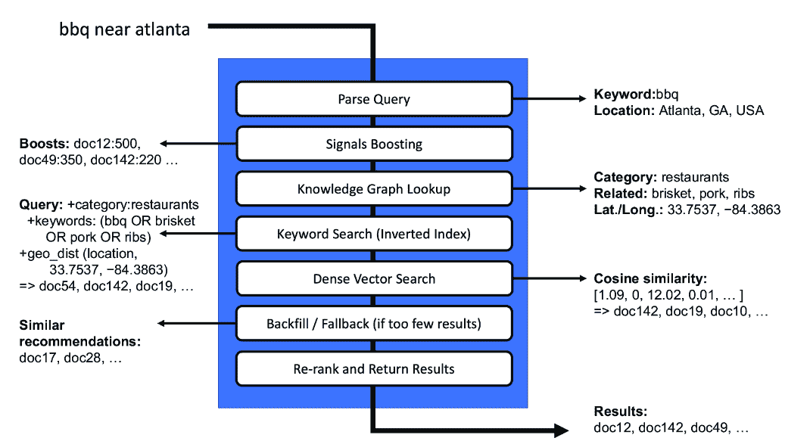

# 第七章：通过语义搜索解释查询意图

### 本章涵盖

+   查询解释的机制

+   实现一个端到端查询意图管道以解析、丰富、转换和搜索

+   标记和分类查询术语和短语

+   使用知识图谱遍历增强查询

+   解释特定领域查询模式的语义

在第五章和第六章中，我们使用内容和信号来解释传入用户查询的特定领域含义。我们讨论了短语识别、拼写错误检测、同义词发现、查询意图分类、相关术语扩展，甚至查询意义消歧。我们主要独立讨论了这些技术，以展示它们各自如何独立工作。

在本章中，我们将所有这些技术付诸实践，将它们整合到一个统一的查询解释框架中。我们将展示一个示例搜索界面，该界面接受真实查询，解释它们，将它们重写以更好地表达最终用户的意图，然后返回排序后的结果。

我们应该注意，为了实现语义搜索，已经发展出多种范式，包括基于嵌入的查询解释和问答（返回提取或生成的答案而不是文档）使用大型语言模型（LLMs）和预训练的 Transformers。这些通常涉及将查询编码为向量，搜索向量的近似最近邻，然后执行向量相似度计算以对文档进行排序。排序后的文档通常随后进行分析以总结、提取或生成答案。我们将涵盖第 13-15 章中基于 LLM 的语义搜索和问答方法。

在本章中，我们将专注于将您已经学到的每个 AI 驱动的搜索策略整合到端到端语义查询管道中。我们将分四个阶段实现该管道：

+   *解析*用户的查询

+   *丰富*解析查询以改进上下文

+   *转换*查询以优化我们目标搜索引擎的相关性

+   *搜索*使用优化的查询

这些步骤不必线性实现（有时它们会重复，有时可以跳过步骤），并且还可以进一步分解（例如，搜索可以分解为匹配、排序和重新排序）。然而，通过这个一致的框架，我们可以整合任何组合的 AI 驱动的搜索技术，这将非常有价值，因为您可以在自己的搜索应用中混合和匹配方法。

## 7.1 查询解释的机制

没有一种“正确”的方式来构建查询解释框架。每个构建智能搜索平台的公司都可能构建出略有不同的事物，这取决于他们的业务需求和搜索团队的专长。然而，在实现中存在一些一致的主题值得探索：

+   **管道**——在索引文档和处理查询时，将所有必要的解析、解释和排名逻辑建模为工作流程中的模块化阶段是有用的。这允许在任何时候通过交换、重新排列或添加管道中的处理阶段来轻松进行实验。

+   **模型**——无论你是微调一个基于复杂深度学习的 LLM（第 13-14 章）、一个学习排序模型（第 10-12 章）、一个信号增强或个性化模型（第 8-9 章），还是包含同义词、拼写错误和相关术语的知识图谱（第 5-6 章），适当的查询解释需要在索引和查询管道中按正确顺序插入正确的模型。

+   **条件回退**——你永远无法完美地解释每个查询。你可能有很多模型帮助解释一个查询，而对另一个查询的含义却一无所知。通常最好从一个基础或“回退”模型（通常是基于关键词的）开始，它可以不完美地处理任何查询，并在其上分层更复杂的模型，以提高解释的精确度。此外，如果没有找到结果，返回推荐可能是有用的，以确保搜索者看到一些可能有用的东西，即使它不是他们所寻求的精确内容。

图 7.1 展示了一个示例查询管道，演示了这些主题：结合管道阶段、模型和条件回退。



##### 图 7.1 示例查询解释管道

图 7.1 接收查询`bbq near atlanta`，并从对查询中已知关键词、位置或其他已知术语进行实体提取的解析查询阶段开始。然后进入信号增强阶段，该阶段会检查一个信号增强模型（在第四章中介绍，将在第八章中详细讨论）以增强给定查询中最受欢迎的文档。

常常使用三种不同但互补的方法来解释单个关键词并将它们相互关联，所有这些方法都包含在示例管道中：

+   **词汇搜索**，例如在倒排索引中对布尔查询匹配进行 BM25 排名

+   **知识图谱搜索**，例如使用语义知识图谱（SKG）或显式构建的知识图谱对查询中找到的实体及其与索引中最相似实体的关系进行排序

+   **密集向量搜索**，例如使用嵌入的近似最近邻的向量余弦相似度

在这三个中，最常见的“默认”匹配层往往是基于倒排索引的词汇搜索，因为这种方法允许匹配文档集中存在的任何术语，无论该术语是否被理解。知识图谱和密集向量方法都依赖于能够将每个查询中的术语与概念或实体相关联，但这在所有情况下都做不到。

实际上，BM25 排名在嵌入中通常优于密集向量方法，即使是从最先进的 LLMs 中提取的，除非这些语言模型最初是在特定领域内容上训练或微调的（这可能会随时间变化，因为预训练的 LLMs 继续变得更加健壮）。我们将在第九章和第十三章开始深入探讨使用 LLMs 进行个性化搜索和语义搜索，我们将在第十四章和第十五章中花费时间微调和使用 LLMs 进行更高级的搜索功能，如问答和生成搜索。我们将在本章中主要关注演示将词汇搜索和知识图谱集成的机制。

图 7.1 管道以一个回填/回退阶段结束，这在之前阶段都无法返回完整结果集的情况下插入额外结果可能很有用。这可以简单到返回推荐而不是搜索结果（在第九章中介绍），或者可能涉及返回部分匹配的查询，精度较低。

然后将所有管道阶段的最终结果组合并按需重新排序，以产生一组最终的相关性排序搜索结果。重新排序阶段可能很简单，但通常将通过使用 *机器学习排名* 通过排名分类器来实现。我们将在第十章至第十二章深入探讨构建和自动化学习排名模型的训练。

尽管本节中的示例管道在许多情况下可能提供良好的结果，但管道的具体逻辑应始终取决于您应用程序的需求。在下一节中，我们将设置一个用于搜索本地商业评论的应用程序，然后我们将实现一个能够在这个领域进行语义搜索的统一管道。

## 7.2 在本地评论数据集上索引和搜索

我们将创建一个搜索引擎，从整个网络中聚合产品和商业评论。如果一家企业有一个实体位置（餐厅、商店等），我们希望找到与该企业相关的所有评论，并使它们可供搜索。

以下列表显示了我们的爬取的本地评论数据被导入搜索引擎的过程。

##### 列表 7.1 加载和索引评论数据集

```py
reviews_collection = engine.create_collection("reviews")
reviews_data = reviews.load_dataframe("data/reviews/reviews.csv")
reviews_collection.write(reviews_data)
```

输出：

```py
Wiping "reviews" collection
Creating "reviews" collection
Status: Success

Loading Reviews...
root
 |-- id: string (nullable = true)
 |-- business_name: string (nullable = true)
 |-- city: string (nullable = true)
 |-- state: string (nullable = true)
 |-- content: string (nullable = true)
 |-- categories: string (nullable = true)
 |-- stars_rating: integer (nullable = true)
 |-- location_coordinates: string (nullable = true)

Successfully written 192138 documents
```

可以在列表输出中看到评论的数据模型。每条评论包含业务名称、位置信息、评论内容、评论评分（1 到 5 颗星的数量）以及被评论实体的类别。

一旦数据被导入，我们就可以运行搜索。在本章中，我们提供了一个比之前章节更互动的应用程序，启动一个 Web 服务器来驱动动态搜索界面。运行列表 7.2 将启动 Web 服务器。

##### 列表 7.2 启动 Web 服务器和加载搜索页面

```py
start_reviews_search_webserver()

%%html
<iframe src="http://localhost:2345/search" width=100% height="800"/>
```

图 7.2 显示了从列表 7.2 加载的搜索界面。你可以从 Jupyter 笔记本中运行嵌入的搜索页面，但如果你在自己的电脑上运行，端口为`2345`，你还可以在网页浏览器中导航到`http://localhost:2345/search`以获得更好的体验。


##### 图 7.2 从本地网络浏览器访问评论搜索页面

让我们先尝试一个简单的查询`bbq near charlotte`。目前，让我们假设你没有完成知识图谱学习过程（第六章）并且还不知道如何将 SKG（第五章）应用于你的查询解释。在这种情况下，我们只是在做标准化的词汇关键词匹配。图 7.3 显示了查询`bbq near charlotte`的顶级词汇搜索结果。


##### 图 7.3 对`bbq near charlotte`的基本词汇关键词搜索，仅匹配关键词

在我们的评论数据集中，这是唯一与我们的查询匹配的评论，尽管在北卡罗来纳州夏洛特市及其附近存在多个烧烤（也称烧烤）餐厅。只有这个结果被返回的原因是它是唯一包含所有三个术语（`bbq`、`near`和`charlotte`）的文档。如果你查看评论，它甚至不是一家提供烧烤的餐厅——实际上它是一场节庆活动的评论，恰好提到了另一个名为“BBQ”的节庆活动！

这里主要的问题是大多数相关的餐厅名称中不包含单词`near`。图 7.4 显示，如果我们去掉单词`near`并搜索`bbq charlotte`，会有更多结果出现。


##### 图 7.4 对`bbq` `charlotte`进行的基本词汇关键词搜索。移除“near”单词后，有更多匹配的结果。

前两个结果都包含“bbq”这个术语，但第一个有一个很低的（1 星）评分，第二个提到了“bbq chicken”（带有烧烤酱的鸡肉），但没有提到“bbq”（烧烤），这通常指的是像拉猪肉、拉鸡肉、排骨或牛腩这样的烟熏肉类。此外，虽然所有结果都在夏洛特市，NC，但这仅仅是因为它们在评论文本中匹配了关键词`charlotte`，这意味着许多没有在评论中提及城市的名称的好结果被遗漏了。从结果来看，搜索引擎并没有正确地解释用户的查询意图。

我们可以做得比这更好！你已经学会了如何提取特定领域的知识以及如何对查询进行分类（例如，`bbq`意味着餐厅），所以我们只需要将这些技术和学习模型端到端地整合。

## 7.3 一个端到端语义搜索示例

上一节展示了仅依赖纯关键词搜索的不足。我们如何提高搜索引擎解释查询的能力？图 7.5 展示了传统关键词搜索难以正确解释的相对具体查询的结果：`top kimchi near charlotte`。


##### 图 7.5 查询`top kimchi near charlotte`的语义搜索

这个查询很有趣，因为只有一个关键词（`kimchi`）实际上包含了一个用于相关性排名的传统关键词。关键词“top”实际上意味着“最受欢迎”或“评分最高”，而短语“near charlotte”表示应用于搜索结果的地理过滤器。您可以在图中看到，原始查询被解析为 `{top}` `kimchi` `{near}` `{charlotte}`。我们使用这种花括号语法来表示“top”、“near”和“charlotte”这些术语都是从我们的知识图谱中识别出来的，而`kimchi`没有被标记，因此是一个未知项。

在解析这些关键词和短语之后，您可以看到它们被丰富并转换成了以下搜索引擎特定的语法（Solr）：

+   *top*: `+{!func v="mul(if(stars_rating,stars_rating,0),20)"}`。这个语法将根据其评论（1 到 5 星）对所有文档进行提升，乘以 20 以生成介于 0 到 100 之间的分数。

+   *kimchi*: `+{!edismax v="kimchi⁰.9193 korean⁰.7069` `banchan⁰.6593 +doc_type:\"Korean\""}`。这是使用第五章中提到的 SKG 扩展方法对未知术语“kimchi”进行扩展。在这种情况下，SKG 确定“Korean”是过滤结果的类别，与“kimchi”最相关的术语是“korean”和“banchan”。

+   *near charlotte*: `+{!geofilt d=50 sfield="location_coordinates" pt="35.22709,-80.84313"}`。这个地理过滤器将结果限制在距离美国北卡罗来纳州夏洛特纬度/经度 50 公里范围内的文档。

如果原始查询像传统词汇搜索那样*没有*查询解释层，则不会有任何结果匹配，如图 7.6 所示。


##### 图 7.6 传统词汇搜索由于没有包含所有关键词的文档而返回无结果

然而，图 7.7 展示了执行语义解析和丰富后的结果。


##### 图 7.7 语义搜索示例通过更好地解释和执行查询返回相关结果

结果看起来相当不错！您会注意到

+   有许多结果（而不是零）。

+   所有结果都有*top*评分（5 星）。

+   所有结果都在*夏洛特*。

**   即使没有包含主要关键词（“kimchi”），也有一些结果匹配，并且它们显然是为提供 kimchi 的韩国餐厅准备的，因为评论中使用了类似的术语。**

*我们将在本章剩余部分介绍如何实现这种语义查询解释级别，从高级查询解释管道开始。

## 7.4 查询解释管道

虽然我们通常需要在查询管道中集成多个模型和不同的查询理解方法，但大多数查询管道都共享一组类似的高级阶段：

1.  *解析*——从查询中提取关键实体及其逻辑关系

1.  *丰富*——生成对查询上下文、查询实体及其语义关系的理解

1.  *转换*——重写用户的查询以优化搜索引擎的召回率和排名

1.  *搜索*——执行转换后的查询并返回排名结果

您可以将每个阶段视为不同类型的管道阶段。正如 7.1 节中的示例管道所示，某些管道可能需要调用多个阶段来解析或丰富查询，而某些管道甚至可能运行多个条件搜索并合并结果。

在接下来的小节中，我们将实现每个阶段，以展示我们从 7.3 节中得到的端到端语义搜索示例的内部工作原理。

### 7.4.1 解析查询以进行语义搜索

正如您在 3.2.5 节中看到的，大多数关键字搜索引擎默认会对传入的查询执行某种形式的布尔解析。因此，查询`statue` `of` `liberty`变成了对`statue` `AND` `of` `AND` `liberty`的查询，其中任何包含所有三个单词（`statue`，`of`，`liberty`）的文档都将匹配，假设默认查询操作符为`AND`。

仅使用布尔匹配本身并不能产生很好的结果，但当与 BM25 排名（在第 3.2.1 节中讨论）结合使用时，它可以对没有真正理解领域内术语的朴素算法产生很好的结果。

与这种布尔解析相反，还可以将整个查询转换为一个数值向量嵌入，如 3.1.1 节中所述。我们将在第 13-14 章中介绍使用 LLMs 和嵌入的密集向量搜索。使用 LLMs 和基于嵌入的查询解释的一个好处是，这些技术提供了对查询作为意义单元的更好表示。使用这种方法，查询的逻辑结构有时可能会丢失，因此它可能不适合需要保留布尔逻辑或确保某些关键词出现在搜索结果中的场景。

解析查询的另一种方法是从知识图中提取已知的术语和短语。我们在第 7.3 节的端到端示例中采用了这种方法。这种方法的一个优点是，除了提供对已知词汇的精细控制外，它还允许显式地建模特定的短语和触发词（`top`、`in`、`near`），以反映其功能意义，而不仅仅是关键词匹配。这种方法的一个缺点是，知识图中不存在任何术语或短语*无法*被轻松提取和解释。

由于我们将在后面的章节中深入研究大型语言模型（LLMs），因此在本章中，我们将专注于使用知识图进行显式查询解析，因为显式解析可以为特定领域提供显著的定制化，实现成本低，并使我们能够结合我们已学到的所有其他人工智能技术。

#### 实现语义查询解析器

在语义解释查询的第一步是识别查询中的术语和短语（*解析*阶段）。在第六章中，我们介绍了如何从我们的内容和用户行为信号中识别重要的特定领域术语和短语。这些可以作为已知实体列表，用于在传入查询上启用实体提取。

由于已知短语列表中可能存在数百万个实体，因此一个高效的结构，如*有限状态转换器*（FST），使得在毫秒内仅用这种规模进行实体提取成为可能。我们不会在这里深入探讨 FST 的工作原理，但它们能够非常紧凑地压缩许多术语序列，并在这些术语序列上快速查找，从而实现闪电般的实体提取。

我们的示例搜索引擎 Apache Solr 实现了一个*文本标记器*请求处理器，它是专门为快速实体提取而构建的。它允许您将任意数量的术语索引到一个查找索引中，因此您可以将该索引构建到 FST 中，并在任何传入的文本流中从该索引中提取术语。

在第六章中，我们生成了特定领域短语的列表，这些列表还包括了变体拼写。我们可以将这些术语映射到一个特别配置的`entities`集合中，包括任何拼写变体，以实现从传入查询中无缝提取实体。以下列表探讨了`entities`集合中几种类型的实体数据。

##### 列表 7.3 用于标记和提取的实体数据

```py
entities_dataframe = from_csv("data/reviews/entities.csv", log=False)
display_entities(entities_dataframe, limit=20)
```

输出：

```py
Entities
+---+--------------------+--------------------+-----------------+----------+
| id|        surface_form|      canonical_form|             type|popularity|
+---+--------------------+--------------------+-----------------+----------+
|  1|                near| {location_distance}|semantic_function|        90|
|  2|                  in| {location_distance}|semantic_function|       100|
|  3|                  by| {location_distance}|semantic_function|        90|
|  4|                  by|{text_within_one_...|semantic_function|        10|
|  5|                near|     {text_distance}|semantic_function|        10|
|  6|             popular|           {popular}|semantic_function|       100|
|  7|                 top|           {popular}|semantic_function|       100|
|  8|                best|           {popular}|semantic_function|       100|
|  9|                good|           {popular}|semantic_function|       100|
| 10|              violet|              violet|            color|       100|
| 11|       violet crowne|       violet crowne|            brand|       100|
| 12|violet crowne cha...|violet crowne cha...|    movie_theater|       100|
| 13|        violet crown|       violet crowne|            brand|       100|
| 14|violet crown char...|violet crowne cha...|    movie_theater|       100|
| 15|            haystack| haystack conference|            event|       100|
| 16|       haystack conf| haystack conference|            event|       100|
| 17| haystack conference| haystack conference|            event|       100|
| 18|            heystack| haystack conference|            event|       100|
| 19|       heystack conf| haystack conference|            event|       100|
| 20| heystack conference| haystack conference|            event|       100|
+---+--------------------+--------------------+-----------------+----------+
only showing top 20 rows

... Entities continued
+---+----------------------------------------------+
|id |semantic_function                             |
+---+----------------------------------------------+
|1  |location_distance(query, position)            |
|2  |location_distance(query, position)            |
|3  |location_distance(query, position)            |
|4  |text_within_one_edit_distance(query, position)|
|5  |text_distance(query, position)                |
|6  |popularity(query, position)                   |
|7  |popularity(query, position)                   |
|8  |popularity(query, position)                   |
|9  |popularity(query, position)                   |
+---+----------------------------------------------+
```

列表 7.3 中表示的实体字段包括

+   `surface_form`—我们希望在未来的查询中匹配的任何拼写变体的特定文本。

+   `canonical_form`—任何可能具有多个表面形式的术语的“官方”版本。

+   `type`—我们领域内术语的分类（类别）。

+   `popularity`—用于优先考虑相同表面形式的不同含义。

+   `semantic_function`——仅对类型为`semantic_function`的实体存在。这用于注入对特殊关键词组合的程序性处理。

在大多数情况下，`surface_form`和`canonical_form`将是相同的，但我们的实体提取器将始终匹配`surface_form`并将其映射到`canonical_form`，因此使用此机制将实体的拼写多个变体映射到一个官方或“规范”版本。这可以用来处理拼写错误（“amin”⇒“admin”），首字母缩略词和缩写（“cto”⇒“首席技术官”），模糊术语（“cto”⇒“首席技术官”与“cto”⇒“已取消订单”），甚至将术语映射到特定的解释逻辑（语义函数）如“附近”⇒`{location_distance}`。

“语义函数”类型是一个特殊类型，我们将在第 7.4.2 节中探讨；它允许非线性、条件查询解析规则。例如，“如果单词*near*后面跟着一个具有*地理位置*的实体，则将查询的这一部分解释为地理过滤器”。

在出现模糊术语的情况下，将存在多个条目，包含相同的外部形式，但映射到不同的规范形式。在这种情况下，`popularity`字段将指定一个相对值，表示哪种含义更常见（值越高，越流行）。

此格式也是可扩展的——您可以添加一个表示规范形式语义意义的`vector`字段，或者一个包含具有相似意义的其他术语的`related_terms`字段。这将使缓存`canonical_form`的静态意义表示成为可能，这在查询时可能比引用外部模型或知识图上的已知术语更有效。

#### 调用实体提取器

除了在列表 7.1 中创建的`reviews`集合外，我们还需要创建一个包含要提取的已知实体的`entities`集合。此集合将作为显式知识图，包含列表 7.3 中的所有实体，以及世界上所有主要城市的列表。下一个列表配置并填充了`entities`集合。

##### 列表 7.4 创建`entities`集合

```py
entities_collection = engine.create_collection("entities")  #1
entities_dataframe = from_csv("data/reviews/entities.csv")
cities_dataframe = cities.load_dataframe("data/reviews/cities.csv")
entities_collection.write(entities_dataframe)  #2
entities_collection.write(cities_dataframe)  #2
```

#1 创建实体集合并配置它以存储从查询中提取的显式知识图实体

#2 明确实体和城市实体被索引到实体集合中，用于实体提取。

输出：

```py
Wiping "entities" collection
Creating "entities" collection
Status: Success
Loading data/reviews/entities.csv
Schema:
root
 |-- id: integer (nullable = true)
 |-- surface_form: string (nullable = true)
 |-- canonical_form: string (nullable = true)
 |-- type: string (nullable = true)
 |-- popularity: integer (nullable = true)
 |-- semantic_function: string (nullable = true)

Loading Geonames...
Successfully written 21 documents
Successfully written 137581 documents
```

我们应该强调的一个配置点是设置实体提取，它发生在`engine.create_collection("entities")`内部。在默认情况下，如果使用 Solr 来为从查询中提取实体提取显式知识图，Solr 的文本标记功能将通过内部进行以下配置更改来启用：

+   使用 Solr 中的 `TaggerRequestHandler` 添加 `/entities/tag` 端点。我们可以向此端点传递查询以执行 `entities` 集合中找到的任何实体的实体提取。

+   在模式中添加一个配置为使用内存中 FST 的 `tags` 字段类型，从而实现从可能包含数百万个实体的集合中以毫秒级的速度进行紧凑且快速的标记。

+   添加一个 `name_tag` 字段，该字段将 `surface_form` 字段复制进去。`name_tag` 字段是 `tags` 字段类型，并由 `/entities/tag` 端点用于匹配来自查询的实体。

如果您的搜索引擎具有本机文本标记功能，则配置将有所不同，但以下列表显示了针对默认文本标记器实现（使用 Apache Solr）的这些更改的代码。

##### 列表 7.5 配置 Solr 文本标记器以进行实体提取

```py
add_tag_type_commands = [{
  "add-field-type": {
    "name": "tag",  #1
    "class": "solr.TextField", #1
    "postingsFormat": "FST50", #1
    "omitNorms": "true",
    "omitTermFreqAndPositions": "true",
    "indexAnalyzer": {
      "tokenizer": {"class": "solr.StandardTokenizerFactory"},
      "filters": [
        {"class": "solr.EnglishPossessiveFilterFactory"},
        {"class": "solr.ASCIIFoldingFilterFactory"},
        {"class": "solr.LowerCaseFilterFactory"},
        {"class": "solr.ConcatenateGraphFilterFactory",  #2
         "preservePositionIncrements": "false"}]},  #2
    "queryAnalyzer": {
      "tokenizer": {"class": "solr.StandardTokenizerFactory"},
      "filters": [{"class": "solr.EnglishPossessiveFilterFactory"},
                  {"class": "solr.ASCIIFoldingFilterFactory"},
                  {"class": "solr.LowerCaseFilterFactory"}]}}
  },

  {"add-field": {"name": "name_tag", "type": "tag",  #3
                 "stored": "false"}},  #3
  {"add-copy-field": {"source": "surface_form",  #4
                      "dest": ["name_tag"]}}] #4

add_tag_request_handler_config = {
  "add-requesthandler": {  #5
    "name": "/tag",  #5
    "class": "solr.TaggerRequestHandler",  #5
    "defaults": {
      "field": "name_tag",  #5
      "json.nl": "map",
      "sort": "popularity desc",  #6
      "matchText": "true",
      "fl": "id,surface_form,canonical_form,type,semantic_function,
      ↪popularity,country,admin_area,*_p"
    }}}
```

#1 标签字段类型使用 Lucene FST50 索引格式进行配置，这允许使用 FST 进行快速内存匹配。

#2 ConcatenateGraphFilter 是文本标记器用于促进实体提取的特殊过滤器。

#3 我们添加了 `name_tag` 字段，我们将使用它来对索引进行查询标记。

#4 使用表面形式值填充 `name_tag` 字段。

#5 配置了一个 /tag 请求处理器，用于使用在 `name_tag` 字段中索引的值作为从传入查询中提取的实体。

#6 如果多个实体匹配（多义性），则默认返回最流行的一个。

在创建了 `entities` 集合、配置了文本标签器并将所有实体索引后，我们现在可以开始对查询进行实体提取。在下面的列表中，我们运行了一个针对 `top kimchi near charlotte` 的查询。

##### 列表 7.6 提取给定查询的实体

```py
query = "top kimchi near charlotte"
entities_collection = engine.get_collection("entities")
extractor = get_entity_extractor(entities_collection)
query_entities = extractor.extract_entities(query)
print(query_entities)
```

输出：

```py
{"query": "top kimchi near charlotte",
 "tags": [
  {"startOffset": 0, "endOffset": 3, "matchText": "top", "ids": ["7"]},
  {"startOffset": 11, "endOffset":15, "matchText":"near", "ids":["1","5"]},
  {"startOffset": 16, "endOffset": 25, "matchText": "charlotte",
   "ids": ["4460243", "4612828", "4680560", "4988584", "5234793"]}],
 "entities": [
  {"id":"1", "surface_form":"near", "canonical_form":"{location_distance}",
   "type": "semantic_function", "popularity": 90,
   "semantic_function": "location_distance(query, position)"},
  {"id": "5", "surface_form": "near", "canonical_form": "{text_distance}",
   "type": "semantic_function", "popularity": 10,
   "semantic_function": "text_distance(query, position)"},
  {"id": "7", "surface_form": "top", "canonical_form": "{popular}",
   "type": "semantic_function", "popularity": 100,
   "semantic_function": "popularity(query, position)"},
  {"id":"4460243", "canonical_form":"Charlotte", "surface_form":"Charlotte",
   "admin_area": "NC", "popularity": 827097, "type": "city",
   "location_coordinates": "35.22709,-80.84313"},
  {"id":"4612828", "canonical_form":"Charlotte", "surface_form":"Charlotte",
   "admin_area": "TN", "popularity": 1506, "type": "city",
   "location_coordinates": "36.17728,-87.33973"},
  {"id":"4680560", "canonical_form":"Charlotte", "surface_form":"Charlotte",
   "admin_area": "TX", "popularity": 1815, "type": "city",
   "location_coordinates": "28.86192,-98.70641"},
  {"id":"4988584", "canonical_form":"Charlotte", "surface_form":"Charlotte",
   "admin_area": "MI", "popularity": 9054, "type": "city",
   "location_coordinates": "42.56365,-84.83582"},
  {"id":"5234793", "canonical_form":"Charlotte", "surface_form":"Charlotte",
   "admin_area": "VT", "popularity": 3861, "type": "city",
   "location_coordinates": "44.30977,-73.26096"}]}
```

响应包括三个关键部分：

+   `query`—已标记的查询

+   `tags`—在传入查询中找到的文本短语的列表，包括文本中的字符偏移量（起始和结束位置）以及每个标签（表面形式）的所有可能的实体匹配（规范形式）的列表

+   `entities`—匹配实体的文档 ID 列表，这些实体可能与匹配的标签之一相对应

我们之前描述了模糊术语，其中一种表面形式可以映射到多个规范形式。在我们的例子中，第一个标签是 `{'startOffset':` `0,` `'endOffset':` `3,` `'matchText':` `'top',` `'ids':` `['7']}`。这表示文本 “top” 在输入 `top kimchi near charlotte` 中的起始位置为 `0`，结束位置为 `3`。它还只在 `ids` 中列出一条记录，这意味着只有一个可能的意义（规范表示）。然而，对于其他两个标签，列出了多个 `ids`，使它们成为模糊标签：

+   `{"startOffset":` `11,` `"endOffset":` `15,` `"matchText":` `"near",` `"ids":` `["1", "5"]}`

+   `{"startOffset":` `16,` `"endOffset":` `25,` `"matchText":` `"charlotte",` `"ids": ["4460243", "4612828", "4680560", "4988584", "5234793"]}`

这意味着对于表面形式“near”有两个规范形式（列出两个`ids`），对于表面形式“charlotte”有五个规范形式。在`entities`部分，我们还可以看到与标签中的`ids`列表相关联的所有不同实体记录。

在本章中，我们将保持简单，始终使用具有最高`popularity`的规范形式。对于城市，我们在`popularity`字段中提供了城市的人口，这意味着所选的“charlotte”是北卡罗来纳州的夏洛特（世界上人口最多的夏洛特）。对于我们的其他实体，其流行度在列表 7.3 中的 entities.csv 中手动指定。你也可以使用信号增强值（如果你从信号中导出实体，这将在第八章中详细介绍）或使用包含实体的索引中文档的数量作为流行度的代理来指定流行度。

你可能会发现使用用户特定的上下文或查询特定的上下文来选择最合适的实体是有益的。例如，如果你正在消除地点歧义，你可以通过地理距离计算来提高流行度，使靠近用户的地点获得更高的权重。如果实体是一个关键词短语，你可以使用 SKG 来分类查询或加载一个术语向量，并提高与整体查询更好的概念匹配的规范形式。

由于我们有从知识图谱中可用的`query_entities`，我们现在可以生成一个带有标记实体的用户友好版本的原始查询。以下列表实现了这个`generate_tagged_query`函数。

##### 列表 7.7 生成标记查询

```py
def generate_tagged_query(extracted_entities):  #1
  query = extracted_entities["query"]
  last_end = 0
  tagged_query = ""
  for tag in extracted_entities["tags"]:
    next_text = query[last_end:tag["startOffset"]].strip()
    if len(next_text) > 0:
      tagged_query += " " + next_text
    tagged_query += " {" + tag["matchText"] + "}"  #2
    last_end = tag["endOffset"]
  if last_end < len(query):
    final_text = query[last_end:len(query)].strip()
    if len(final_text):
      tagged_query += " " + final_text
  return tagged_query

tagged_query = generate_tagged_query(query_entities)
print(tagged_query)
```

#1 使用标记实体重构查询

#2 将已知实体用大括号括起来，以使其与常规关键词区分开来

输出：

```py
{top} kimchi {near} {charlotte}
```

从这个标记查询中，我们现在可以看到关键词“top”、“near”和“charlotte”映射到已知实体，而“kimchi”是一个未知关键词。这种格式是查询的有用、用户友好的表示，但它太简单了，无法表示与每个实体关联的元数据。因为我们需要以编程方式处理实体及其语义交互来丰富查询，我们将实现一个更结构化的语义解析查询表示，我们将其称为`query_tree`。

与纯文本查询不同，这个`query_tree`是查询中作为 JSON 对象表示的强类型节点结构。列表 7.8 展示了`generate_query_tree`函数，该函数从传入的实体提取数据（`query_entities`）返回查询树。

##### 列表 7.8 从用户查询生成类型化查询树

```py
def generate_query_tree(extracted_entities):
  query = extracted_entities["query"]
  entities = {entity["id"]: entity for entity  #1
              in extracted_entities["entities"]}  #1
  query_tree = []
  last_end = 0

  for tag in extracted_entities["tags"]:
    best_entity = entities[tag["ids"][0]]  #2
    for entity_id in tag["ids"]:  #2
      if (entities[entity_id]["popularity"] >  #2
          best_entity["popularity"]):  #2
        best_entity = entities[entity_id] #2

    next_text = query[last_end:tag["startOffset"]].strip()
    if next_text:
      query_tree.append({"type": "keyword",  #3
                         "surface_form": next_text,  #3
                         "canonical_form": next_text})  #3
    query_tree.append(best_entity)  #4
    last_end = tag["endOffset"] 

  if last_end < len(query):  #5
    final_text = query[last_end:len(query)].strip()  #5
    if final_text:  #5
      query_tree.append({"type": "keyword",  #5
                         "surface_form": final_text,  #5
                         "canonical_form": final_text})  #5
  return query_tree

parsed_query = generate_query_tree(query_entities)
display(parsed_query)
```

#1 创建实体 ID 到实体的映射

#2 默认选择实体的最流行规范形式

#3 将任何未标记的文本分配一个关键字类型作为后备

#4 将实体对象添加到查询树中的适当位置

#5 最后一个标记实体之后的任何文本也将被视为关键词。

输出：

```py
[{"semantic_function": "popularity(query, position)", "popularity": 100,
  "id": "7", "surface_form": "top", "type": "semantic_function",
  "canonical_form": "{popular}"},
 {"type": "keyword", "surface_form": "kimchi", "canonical_form": "kimchi"},
 {"semantic_function":"location_distance(query, position)", "popularity":90,
  "id": "1", "surface_form": "near", "type": "semantic_function",
  "canonical_form": "{location_distance}"},
 {"country": "US", "admin_area": "NC", "popularity": 827097,
  "id": "4460243", "surface_form": "Charlotte", "type": "city",
  "location_coordinates": "35.22709,-80.84313",
  "canonical_form": "Charlotte"}]
```

我们现在有查询和标记实体的多种表示：

+   `tagger_data`—第 7.6 节的输出

+   `tagged_query`—第 7.7 节的输出

+   `parsed_query`—第 7.8 节的输出

`parsed_query` 输出是底层 `query_tree` 对象的序列化，完整地表示了所有关键词和实体及其关联的元数据。在此阶段，将查询映射到类型化实体的初始 *解析* 阶段已经完成，我们可以开始利用实体之间的关系来更好地丰富查询。

### 7.4.2 为语义搜索丰富查询

我们查询解释管道的 *丰富* 阶段专注于理解查询中实体之间的关系以及如何最佳地解释和表示它们以优化搜索结果的相关性。

本书的大部分内容已经集中，并将继续集中在丰富阶段。第四章介绍了众包相关性，这是一种通过基于先前用户交互的信息来丰富特定关键词短语的方法。第五章专注于知识图谱，它提供了一种通过主题分类丰富特定关键词短语并找到其他高度相关术语的方法。在第六章中，我们实现了查找同义词、拼写错误和相关术语的算法，这些算法可以通过增强或替换解析术语以更好的学习版本来丰富查询。即将到来的关于信号增强、个性化以及嵌入上的密集向量搜索的章节也将介绍新的方法来解释解析实体并丰富查询以优化相关性。

这些技术都是你的工具箱中的工具，但将它们结合到任何特定实现的最佳方式将是领域特定的，因此我们将在示例中避免过度泛化。相反，我们将专注于一个简单的端到端实现，以便将其他模型轻松地插入其中。我们的简单实现将包括两个组件：

+   一种 *语义函数* 实现，它允许为每个领域注入动态和非线性的语义规则

+   一个 SKG 来寻找未知关键词和查询分类的相关术语

你已经有了扩展查询解析框架以处理来自先前章节的其他丰富类型的工具。例如，你可以使用从表面形式到规范形式的映射来处理第六章中学到的所有替代表示。同样，通过向 `entities` 集合中的每个实体添加额外的字段，你可以注入信号提升、相关术语、查询分类或向量，使它们在查询解析后即可使用。

让我们通过讨论语义函数来启动我们的丰富实现。

#### 实现语义函数

*语义函数* 是一个非线性函数，可以在查询解析和丰富过程中应用，以更好地解释周围术语的含义。我们之前的例子 `top kimchi near charlotte` 包含两个映射到语义函数的术语：“top”和“near”。术语“top”具有非常特定的领域含义：优先考虑评分最高的文档（评论中的星级数量）。同样，术语“near”不是一个应该匹配的关键词；相反，它修改了后续术语的含义，试图将它们组合成一个地理位置。从列表 7.3 中，你会看到以下实体引用了语义函数：

```py
Semantic Function Entities
+-------+-------------------+----------+----------------------------------+
|surface|canonical_form     |popularity|semantic_function                 |
+-------+-------------------+----------+----------------------------------+
|near   |{location_distance}|90        |location_distance(query, position)|
|in     |{location_distance}|100       |location_distance(query, position)|
|by     |{location_distance}|90        |location_distance(query, position)|
|by     |{text_within_on...}|10        |text_within_one_edit_distance(...)|
|near   |{text_distance}    |10        |text_distance(query, position)    |
|popular|{popular}          |100       |popularity(query, position)       |
|top    |{popular}          |100       |popularity(query, position)       |
|best   |{popular}          |100       |popularity(query, position)       |
|good   |{popular}          |100       |popularity(query, position)       |
+-------+-------------------+----------+----------------------------------+
```

你会注意到表面形式“top”、“popular”、“good”和“best”都映射到 `{popularity}` 规范化形式，在下一列表中由 `popularity(query, position)` 语义函数表示。

##### 列表 7.9 考虑流行度的语义函数

```py
def popularity(query, position):
  if len(query["query_tree"]) -1 > position:  #1
    query["query_tree"][position] = {
      "type": "transformed",
      "syntax": "solr",
      "query": '+{!func v="mul(if(stars_rating,stars_rating,0),20)"}'}  #2
    return True  #3
  return False  #3
```

#1 另一个查询树节点必须跟随流行度节点（“top mountain”而不是“mountain top”）。

#2 将查询树中的 `{popularity}` 节点替换为一个新的节点，该节点表示对流行度的相关性提升。

#3 返回语义函数是否被触发。如果为 False，则可以尝试另一个优先级较低的覆盖函数。

此流行度函数使我们能够应用语义解释逻辑来操纵查询树。如果查询树以关键词“top”结束，则函数将返回 `False` 并不会进行任何调整。同样，如果另一个函数被分配了更高的优先级（如 `entities` 集合中指定），则它可能在执行其函数之前就移除了 `{popularity}` 实体。

`location_distance` 函数稍微复杂一些，如下一列表所示。

##### 列表 7.10 考虑位置的语义函数

```py
def location_distance(query, position):
  if len(query["query_tree"]) -1 > position:  #1
    next_entity = query["query_tree"][position + 1] #1
    if next_entity["type"] == "city": #2

      query["query_tree"].pop(position + 1)  #3
      query["query_tree"][position] = {  #4
        "type": "transformed",  #4
        "syntax": "solr",  #4
        "query": create_geo_filter(  #4
          next_entity['location_coordinates'],  #4
          "location_coordinates", 50)}  #4
      return True
  return False  #5

def create_geo_filter(coordinates, field, distance_KM):
  return f'+{!geofilt d={distance_KM} sfield="{field}" pt="{coordinates}"}'
```

#1 函数必须修改下一个实体以成功执行。

#2 下一个实体必须是位置类型（城市）。

#3 移除下一个实体，因为它是一个将被半径过滤替换的位置。

#4 添加具有半径过滤器的替换实体。

#5 如果下一个实体不是城市，则不要应用该函数。

如你所见，我们实现的语义函数允许在解释查询时条件性地应用任何任意逻辑。如果你想，甚至可以调用外部知识图谱或其他数据源来拉取更多信息以更好地解释查询。

你可能已经注意到，`near`、“in”和“by”这些表面形式都映射到 `{location_distance}` 规范化形式，该形式由 `location_distance(query, position)` 函数表示。如果这些术语之一后面跟着一个位置，这个函数工作得很好，但如果是有人搜索 `chief near officer` 呢？在这种情况下，最终用户可能是指“在文档中找到与术语 *chief* 靠近的术语 *officer*”——本质上是一个编辑距离搜索。请注意，还有一个实体映射`near` ⇒ `{text_distance}`，可以在 `{location_distance}` 实体的语义函数返回 `False` 的情况下有条件地调用此回退用例。

语义函数可以以许多不同的方式实现，但我们的示例实现提供了一种高度可配置的方法，将动态语义模式编码到查询解释管道中，以最佳地连接到您的搜索应用可用的许多不同的 AI 驱动搜索方法。我们将在下面的列表中展示这个实现，该列表通过循环查询树来调用所有匹配的语义函数。

##### 列表 7.11 处理查询树中的所有语义函数

```py
def process_semantic_functions(query_tree):
  position = 0  #1
  while position < len(query_tree):  #2
    node = query_tree[position]  #2
    if node["type"] == "semantic_function":
      query = {"query_tree": query_tree}  #1
      command_successful = eval(node["semantic_function"]) #3
      if not command_successful:  #4
        node["type"] = "invalid_semantic_function"  #4
    position += 1
  return query_tree
```

#1 在评估时，将查询和位置变量传递给语义函数。

#2 遍历查询树中的所有项，寻找要执行的语义函数

#3 动态评估语义函数，这些函数增强了查询树

#4 更新任何失败的语义函数的类型

由于语义函数存储为 `entities` 集合中其实体的一部分，我们对这些函数执行后期绑定（使用 Python 的 `eval` 函数）。这允许你随时将新的语义函数插入到 `entities` 集合中，而无需修改应用程序代码。

由于语义函数可能成功或失败取决于周围上下文节点，每个语义函数都必须返回 `True` 或 `False`，以便处理逻辑确定如何处理查询树的其余部分。

#### 集成 SKG

在本节中，我们将集成一个 SKG（在第五章中讨论）到我们的查询丰富过程中。

你的 `entities` 集合可能包含许多使用第六章中技术学习到的实体。你也可以使用 SKG 或其他方法来分类已知实体或生成相关术语列表。如果你这样做，我们建议将分类和相关术语作为额外的字段添加到 `entities` 集合中，以便在查询时缓存响应以加快查找速度。

在我们的实现中，我们将实时调用 SKG 来增强 *未知* 术语。这种方法为查询中的所有未知关键词短语注入相关关键词，可能会产生大量的误报。你可能会希望在生产实现中更加保守，但实施这一点对于学习和实验目的是有用的。以下列表演示了如何查找关键词短语并遍历我们的评论集合作为 SKG。

##### 列表 7.12 从 SKG 获取相关术语和类别

```py
def get_enrichments(collection, keyword, limit=4):
  enrichments = {}
  nodes_to_traverse = [{"field": "content",  #1
                        "values": [keyword],  #1
                        "default_operator": "OR"},  #1
                       [{"name": "related_terms",  #2
                         "field": "content", #2
                         "limit": limit},  #2
                        {"name": "doc_type", #3
                         "field": "doc_type", #3
                         "limit": 1}]]  #3
  skg = get_semantic_knowledge_graph(collection)
  traversals = skg.traverse(*nodes_to_traverse)
  if "traversals" not in traversals["graph"][0]["values"][keyword]:
    return enrichments  #4

  nested_traversals = traversals["graph"][0]["values"] \
                                [keyword]["traversals"]

  doc_types = list(filter(lambda t: t["name"] == "doc_type", #5
                          nested_traversals))  #5
  if doc_types:  #5
    enrichments["category"] = next(iter(doc_types[0]["values"]))  #5

  related_terms = list(filter(lambda t: t["name"] == "related_terms",  #6
                              nested_traversals))  #6
  if related_terms:  #6
    term_vector = ""  #6
    for term, data in related_terms[0]["values"].items():  #6
      term_vector += f'{term}^{round(data["relatedness"], 4)} '  #6
    enrichments["term_vector"] = term_vector.strip()  #6

  return enrichments

query = "kimchi"  #7
get_enrichments(reviews_collection, query)  #7
```

#1 SKG 遍历的起始节点是针对传入关键词在内容字段中的查询。

#2 返回关键词的前 4 个相关术语

#3 返回关键词的顶级 1 个 doc_type（类别）

#4 未找到增强项时返回空

#5 返回遍历中发现的类别

#6 从发现的与相关术语相关的增强项中构建一个增强查询

#7 为关键词“kimchi”获取增强项

列表 7.12 对于关键词“kimchi”的输出如下：

```py
{"category": "Korean",
 "term_vector": "kimchi⁰.9193 korean⁰.7069 banchan⁰.6593 bulgogi⁰.5497"}
```

这里是一些其他潜在关键词的样本 SKG 输出：

+   *bb**q*:

```py
{"category": "Barbeque",
 "term_vector": "bbq⁰.9191 ribs⁰.6187 pork⁰.5992 brisket⁰.5691"}
```

+   *korean bb**q*:

```py
{"category": "Korean",
 "term_vector": "korean⁰.7754 bbq⁰.6716 banchan⁰.5534 sariwon⁰.5211"}
```

+   *lasagna*:

```py
{"category": "Italian",
 "term_vector": "lasagna⁰.9193 alfredo⁰.3992 pasta⁰.3909 
               ↪italian⁰.3742"}
```

+   *karaok**e*:

```py
{"category": "Karaoke",
 "term_vector": "karaoke⁰.9193 sing⁰.6423 songs⁰.5256 song⁰.4118"}
```

+   *drive through*:

```py
{"category": "Fast Food",
 "term_vector": "drive⁰.7428 through⁰.6331 mcdonald's⁰.2873 
                ↪window⁰.2643"}
```

为了完成我们的 *增强* 阶段，我们需要将 `get_enrichments` 函数和之前讨论的 `process_semantic_functions` 函数应用于我们的查询树。

##### 列表 7.13 增强查询树节点

```py
def enrich(collection, query_tree):
  query_tree = process_semantic_functions(query_tree)  #1
  for item in query_tree:

    if item["type"] == "keyword":  #2
      enrichments = get_enrichments(collection, item["surface_form"]) #2
      if enrichments:  #3
        item["type"] = "skg_enriched"  #3
        item["enrichments"] = enrichments  #3
  return query_tree
```

#1 遍历查询树并处理所有语义函数

#2 获取所有未知关键词短语，并在 SKG 中查找它们

#3 如果找到增强项，则将其应用于节点。

这个 `enrich` 函数涵盖了整个增强阶段，处理所有语义函数，然后使用 SKG 增强所有剩余的未知关键词。然而，在我们进入转换阶段之前，让我们快速看一下我们已实现的基于 SKG 的关键词扩展的替代方法。

### 7.4.3 稀疏词汇和扩展模型

在本书中，我们至今已介绍了两种主要的搜索方法：*词汇搜索*——基于查询中特定术语或属性的匹配和排名，以及*语义搜索*——基于查询意义的匹配和排名。你还被介绍了两种主要的查询表示方法：作为稀疏向量（具有非常少非零值的向量）和稠密向量（具有大部分非零值的向量）。词汇关键词搜索通常使用倒排索引实现，该索引存储了每个文档的稀疏向量表示，每个索引中的术语都有一个维度。语义搜索同样通常使用基于嵌入的稠密向量表示进行搜索。

##### 稀疏向量 vs. 稠密向量 vs. 词汇搜索 vs. 语义搜索

由于计算成本，密集向量表示通常具有有限的维度数（数百到数千），这些维度密集压缩数据的语义表示，而稀疏向量表示可以轻松地具有数十万到数千万的维度，这些维度代表更可识别的术语或属性。词汇关键词搜索通常使用倒排索引实现，该索引包含每个文档的稀疏向量表示，每个索引中的术语都有一个维度。同样，语义搜索通常使用密集向量表示在嵌入上进行搜索。由于这些趋势，许多人错误地将“语义搜索”一词与密集向量嵌入搜索等同起来，但这忽略了更多可解释和灵活的基于稀疏向量和图语义搜索方法的丰富历史。本章重点介绍了一些这些方法，第 13-15 章将更深入地介绍密集向量搜索技术。

然而，正如您在本章中已经看到的，语义搜索也可以使用稀疏向量在典型的词汇查询上下文中实现。虽然我们已经实现了直接在用户查询上操作的语义查询解析，但我们还使用 SKG 生成术语和权重的稀疏向量来支持语义搜索。

对于这种查询扩展，存在其他技术，例如 SPLADE（稀疏词汇和扩展）。SPLADE 方法（[`arxiv.org/pdf/2107.05720`](https://arxiv.org/pdf/2107.05720)）不是使用倒排索引作为其语言模型，而是使用预先构建的语言模型来生成上下文化的标记。我们不会使用 SPLADE（或 SPLADE V2 或后续版本），因为它没有在允许商业使用的许可下发布，但列表 7.14 展示了与我们在第 7.4.2 节中用 SKG 方法测试的相同示例查询的替代开源实现（SPLADE++）的样本输出。

##### 列表 7.14 使用 SPLADE++扩展查询

```py
from spladerunner import Expander
expander = Expander('Splade_PP_en_v1', 128) #1
queries = ["kimchi", "bbq", "korean bbq",
           "lasagna", "karaoke", "drive through"]

for query in queries:
  sparse_vec = expander.expand(query,  #2
                  outformat="lucene")[0]  #3
  print(sparse_vec)
```

#1 指定 SPLADE++模型名称和最大序列长度

#2 生成稀疏词汇向量

#3 返回标记标签（字符串）而不是标记 ID（整数）

下面是 SPLADE++扩展的输出：

+   *泡菜**：

```py
{"kim": 3.11, "##chi": 3.04, "ki": 1.52, ",": 0.92, "who": 0.72,
 "brand": 0.56, "genre": 0.46, "chi": 0.45, "##chy": 0.45, 
 "company": 0.41,  "only": 0.39, "take": 0.31, "club": 0.25,
 "species": 0.22, "color": 0.16, "type": 0.15, "but": 0.13, 
 "dish": 0.12, "hotel": 0.11, "music": 0.09, "style": 0.08, 
 "name": 0.06, "religion": 0.01}
```

+   *泡菜**烤肉**：

```py
{"bb": 2.78, "grill": 1.85, "barbecue": 1.36, "dinner": 0.91, 
 "##q": 0.78, "dish": 0.77, "restaurant": 0.65, "sport": 0.46,
 "food": 0.34, "style": 0.34, "eat": 0.24, "a": 0.23, "genre": 0.12, 
 "definition": 0.09}
```

+   *韩国泡菜**烤肉**：

```py
{"korean": 2.84, "korea": 2.56, "bb": 2.23, "grill": 1.58, "dish": 1.21,
 "restaurant": 1.18, "barbecue": 0.79, "kim": 0.67, "food": 0.64,
 "dinner": 0.39, "restaurants": 0.32, "japanese": 0.31, "eat": 0.27,
 "hotel": 0.16, "famous": 0.11, "brand": 0.11, "##q": 0.06, "diner": 0.02}
```

+   *千层面**：

```py
{"las": 2.87, "##ag": 2.85, "##na": 2.39, ",": 0.84, "she": 0.5,
 "species": 0.34, "hotel": 0.33, "club": 0.31, "location": 0.3,
 "festival": 0.29, "company": 0.27, "her": 0.2, "city": 0.12, 
 "genre": 0.05}
```

+   *卡拉 OK**：

```py
{"kara": 3.04, "##oke": 2.87, "music": 1.31, "lara": 1.07, 
 "song": 1.03, "dance": 0.97, "style": 0.94, "sara": 0.81, 
 "genre": 0.75, "dress": 0.48, "dish": 0.44, "singer": 0.37, 
 "hannah": 0.36, "brand": 0.31, "who": 0.29, "culture": 0.21, 
 "she": 0.17, "mix": 0.17, "popular": 0.12, "girl": 0.12,
 "kelly": 0.08, "wedding": 0.0}
```

+   *驾车通过**：

```py
{"through": 2.94, "drive": 2.87, "driving": 2.34, "past": 1.75,
 "drives": 1.65, "thru": 1.44, "driven": 1.22, "enter": 0.81,
 "drove": 0.81, "pierce": 0.75, "in": 0.72, "by": 0.71, "into": 0.64,
 "travel": 0.59, "mark": 0.51, ";": 0.44, "clear": 0.41,
 "transport": 0.41, "route": 0.39, "within": 0.36, "vehicle": 0.3, 
 "via": 0.15}
```

注意，`outputformat=lucene`参数会导致返回的是标记（关键词或部分关键词）而不是标记的整数 ID，因为看到标记有助于我们更好地解释结果。

当将此输出与之前显示的相同查询的 SKG 输出进行比较时，您可能会注意到以下差异：

+   SKG 的输出返回索引中的实际术语，而 SPLADE 风格的输出返回 LLM 的标记。这意味着您可以直接使用 SKG 输出（“lasagna”，“alfredo”，“pasta”）在您的文档字段上搜索，而 SPLADE 标记（`las`，`##ag`，`na##`）则需要从 SPLADE 生成并索引到所有文档中，以便在查询时匹配正确的标记。

+   SKG 稀疏向量在域内术语上往往看起来更干净、更与数据集（餐厅评论）相关。例如，对于查询`bbq`，SKG 返回`{"bbq": 0.9191, "ribs": 0.6186, "pork": 0.5991, "brisket" : 0.569}`，而 SPLADE 返回`{'bb': 2.78, 'grill': 1.85, 'barbecue': 1.36, 'dinner': 0.91, '##q': 0.78, 'dish': 0.77, 'restaurant': 0.65, 'sport': 0.46, 'food': 0.34, `…}`。与 SKG 模型相比，SPLADE 模型的这种表现不足主要是由于 SPLADE 没有在搜索索引中的数据上训练，而 SKG 直接使用搜索索引中的数据作为其语言模型。微调基于 SPLADE 的模型将有助于缩小这一差距。

+   SKG 模型更灵活，因为它可以返回多个维度的关系。注意在上一节中，我们不仅返回了相关术语的稀疏向量，还返回了查询的分类。

+   SPLADE 和 SKG 模型都是上下文感知的。SPLADE 基于整个查询（或文档）编码的上下文对每个标记进行加权，而 SKG 请求同样（可选）可以使用传递给查询或文档的任何上下文来上下文化其标记的权重。基于 SPLADE 的模型在较长的已知上下文中（如一般文档）表现更出色，而 SKG 模型则更优化于较短、特定领域的上下文（如域内查询），但它们都有效，并且代表了基于稀疏向量或基于词汇的语义搜索的新技术。

我们选择在本章中使用基于 SKG 的方法而不是 SPLADE，因为它还具有分类查询和进一步对查询进行上下文化的能力，以便进行查询意义消歧，但无论选择哪种模型，实现基于稀疏向量的语义搜索的类似概念都适用，因此熟悉多种技术是好的。

在下一节中，我们将介绍如何将富查询树转换为搜索引擎特定的查询语法，以便发送给搜索引擎。

### 7.4.4 对语义搜索查询进行转换

现在用户的查询已经解析并丰富，是时候将查询树转换为适当的搜索引擎特定语法了。

在这个 *转换* 阶段，我们调用一个适配器将查询树转换为查询的最有用的引擎特定表示——在我们的默认实现中是 Solr。在我们的语义函数（`popularity` 和 `location_distance` 函数）的情况下，我们已经在查询树的丰富节点中直接注入了这种引擎特定的语法（`{"type":"transformed",` `"syntax":"solr"}`）。我们本可以稍微抽象一下，通过创建每个语义函数输出的通用中间表示，然后在转换阶段将其转换为引擎特定的语法（Solr、OpenSearch 等），但我们选择避免中间表示以使示例更简单。如果你使用不同的引擎（如附录 B 中所述）运行代码，你将在转换节点中看到该引擎的语法。

以下列表展示了一个 `transform_query` 函数，它接受一个丰富的查询树并将其每个节点转换为搜索引擎特定的节点。

##### 列表 7.15 将查询树转换为引擎特定的语法

```py
def transform_query(query_tree):
  for i, item in enumerate(query_tree):
    match item["type"]:
      case "transformed":  #1
        continue  #1
      case "skg_enriched":  #2
        enrichments = item["enrichments"]  #2
        if "term_vector" in enrichments:  #2
          query_string = enrichments["term_vector"]  #2
          if "category" in enrichments: #2
            query_string += f' +doc_type:"{enrichments["category"]}"'  #2
          transformed_query =   #2
          ↪'+{!edismax v="' + escape_quotes(query_string) + '"}'  #2
        else:  #2
          continue  #2
      case "color":  #3
        transformed_query = f'+colors:"{item["canonical_form"]}"'
      case "known_item" | "event":  #3
        transformed_query = f'+name:"{item["canonical_form"]}"'
      case "city":  #3
        transformed_query = f'+city:"{str(item["canonical_form"])}"'
      case "brand":  #3
        transformed_query = f'+brand:"{item["canonical_form"]}"'
      case _:  #4
        transformed_query = "+{!edismax v=\"" +  #4
        ↪escape_quotes(item["surface_form"]) + "\"}"  #4
    query_tree[i] = {"type": "transformed",  #5
                     "syntax": "solr",  #5
                     "query": transformed_query}  #5
  return query_tree

enriched_query_tree = enrich(reviews_collection, query_tree)
processed_query_tree = transform_query(enriched_query_tree)
display(processed_query_tree)
```

#1 如果查询树元素已经被转换成搜索引擎特定的语法，则无需进一步处理。

#2 为丰富节点生成丰富的查询

#3 使用自定义类型处理逻辑处理其他潜在的查询树元素的转换

#4 对于所有其他没有自定义转换逻辑的类型，只需在其表面形式上搜索。

#5 使用搜索引擎特定的语法和查询表示每个转换后的查询树节点

输出：

```py
[{"type": "transformed",
  "syntax": "solr",
  "query": "+{!func v=\"mul(if(stars_rating,stars_rating,0),20)\"}"},
 {"type": "transformed",
  "syntax": "solr",
  "query": "{!edismax v=\"kimchi⁰.9193 korean⁰.7069 banchan⁰.6593
  ↪+doc_type:\\\"Korean\\\"\"}"},
 {"type": "transformed",
  "syntax": "solr",
  "query": "+{!geofilt d=50 sfield=\"location_coordinates\"
  ↪pt=\"35.22709,-80.84313\"}"}]
```

到目前为止，查询树中的所有节点都已转换为 `{'type': 'transformed',` `'syntax':` `engine}` 节点，这意味着它们内部包含生成最终查询到配置的搜索引擎所需的搜索引擎特定语法。我们现在准备好将查询树转换为字符串并发送请求到搜索引擎。

### 7.4.5 使用语义增强的查询进行搜索

我们语义搜索过程的最后一步是 *搜索* 阶段。我们将完全转换后的 `query_tree` 转换为查询，对搜索引擎运行查询，并将结果返回给最终用户。

##### 列表 7.16 运行查询

```py
def to_query(query_tree):
  return [[node["query"] for node in query_tree]

transformed_query = to_query(query_tree)
reviews_collection = engine.get_collection("reviews")
reviews_collection.search(query=transformed_query)
```

对于我们的查询 `top kimchi near charlotte` 的搜索结果将返回第 7.3 节中展示的端到端示例中的内容。由于我们知道现在可以处理语义函数的变体（对于位置，`in`与`near`的区别，对于流行度，`good`与“popular”与`top`的区别），我们将展示一个略微修改后的查询的输出：`good` `kimchi` `in` `charlotte`。如果你对比这个变体的输出（如图 7.8 所示）与原始查询 `top` `kimchi` `near` `charlotte` 的输出，你会发现它们产生了与第 7.5 和 7.7 节中较早的章节中相同的转换查询和最终的搜索结果集。


##### 图 7.8 为`good kimchi in charlotte`的搜索结果，解释为与`top` `kimchi` `near` `charlotte`端到端示例的语义相同

恭喜你，你现在已经实现了一个端到端语义搜索管道，它可以对内容进行语义解析、丰富、转换，并执行搜索。本章没有介绍任何新的机器学习算法，而是提供了一个具体的实现，说明你在这本书中学到的许多模型、算法和其他技术如何集成到一个端到端系统中。

在本书的剩余部分，我们将继续探索更多高级方法，这些方法可以插入到这个框架中，以增强相关性排名并改善查询意图理解。

## 摘要

+   查询解释需要适当地混合查询管道与学习模型，同时确保有足够的后备模型来匹配未知关键词。

+   仅匹配关键词有时可能有效，但当连接词（如`top`、`near`等）所表达的意思未被理解时，会导致匹配效果不佳。解决这一问题的方法之一是通过实现特定领域的语义函数来克服这些限制。

+   一个了解你领域内已知术语和短语的语义查询解析器，允许你从基于关键词的搜索过渡到对实体及其关系的语义搜索。

+   提取已知实体使得模型能够无缝集成到你的查询解释管道中，通过将关键词的表面形式映射到由你的学习模型生成的实体的规范表示（信号增强、替代拼写、相关术语以及其他知识图谱数据）。

+   语义搜索涉及*解析*已知实体，*丰富*使用学习模型，*转换*查询以优化目标搜索引擎的匹配和相关性，然后*搜索*并将结果返回给最终用户。我们将在接下来的章节中继续探索更多高级技术，以将这些阶段插入到这些阶段中。*
