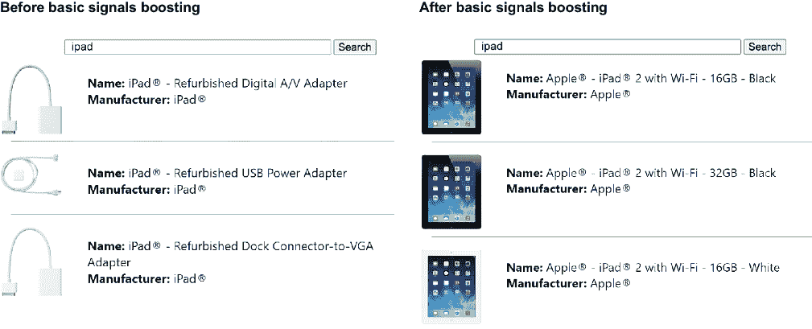
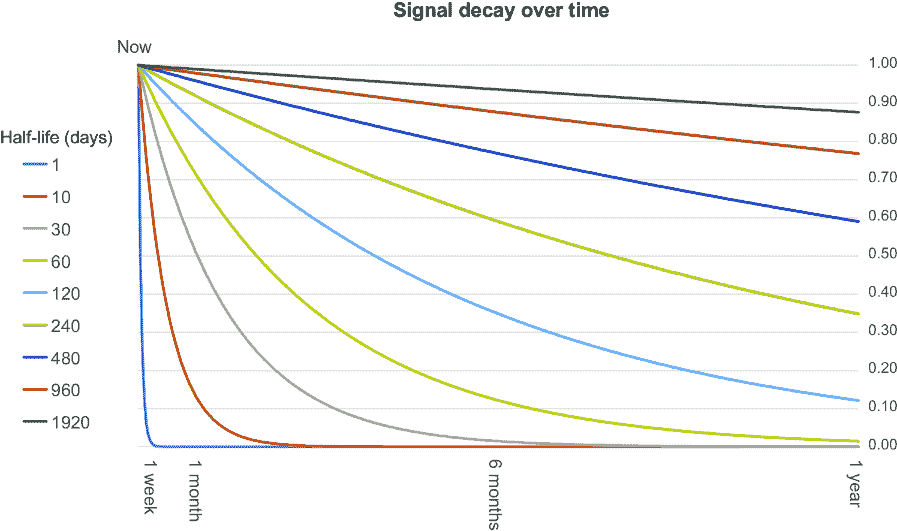
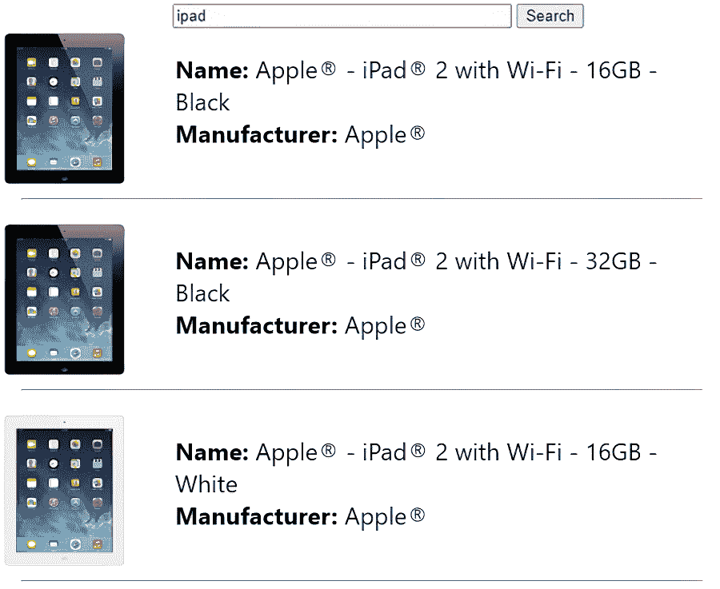

# 8 信号增强模型

### 本章涵盖

+   聚合用户信号以创建基于流行度的排名模型

+   对噪声查询输入进行信号归一化

+   在众包信号中打击信号垃圾邮件

+   应用时间衰减以优先考虑近期信号

+   将多种信号类型混合到一个模型中

+   选择查询时增强或索引时增强

在第四章中，我们介绍了三种不同类别的反射智能：信号增强（流行相关性）、协同过滤（个性化相关性）和排序学习（泛化相关性）。在本章中，我们将深入探讨这些中的第一个，实现信号增强以增强您最热门的查询和文档的相关性排名。

在大多数搜索引擎中，相对较少的查询往往占很大一部分总查询量。这些热门查询，称为*头部查询*，也倾向于产生更多信号（例如电子商务用例中的点击和购买），这有助于对顶级搜索结果的热度做出更强的推断。

信号增强模型直接利用这些更强的推理，并确保您最重要的和最高可见度的查询得到最佳调整以返回最相关的文档。

## 8.1 基本信号增强

在 4.2.2 节中，我们在 RetroTech 数据集上构建了我们的第一个信号增强模型，显著提高了最常搜索和点击的搜索结果的相关性。在本节中，我们将快速回顾创建简单信号增强模型的过程，我们将在接下来的章节中在此基础上解决一些更高级的需求。

您会记得从 4.2.2 节中，信号增强模型聚合了文档上的有用用户行为信号（如点击信号），这些信号是特定查询的结果。我们使用对`ipad`的搜索，并根据该搜索结果中该文档被点击的次数来增强每个文档。图 8.1 展示了查询`ipad`在应用信号增强前后的搜索结果。



##### 图 8.1 应用信号增强模型前后的对比。信号增强通过将最受欢迎的项目推到搜索结果顶部来提高相关性。

导致图 8.1 中相关性提高的信号增强模型是一个基本的信号增强模型。它查看给定查询中每个曾经被点击的文档，并应用与该查询在该文档上的过去点击总数相等的增强。

尽管本章 4.2.2 节中介绍的基本信号增强模型极大地提高了相关性，但它不幸地容易受到一些数据偏差甚至操纵的影响。在 8.2 节中，我们将讨论一些去除信号中的噪声的技术，以最大化信号增强模型的质量并降低不希望偏差的可能性。

## 8.2 归一化信号

在聚合之前对传入的用户查询进行标准化非常重要，以便将变体视为相同的查询。鉴于最终用户可以将任何任意文本作为查询输入，聚合的信号本质上是有噪声的。第四章中的基本信号增强模型（在第 8.1 节中总结）没有进行标准化。它为每个查询和文档对生成聚合的增强，但由于传入的查询尚未标准化为共同的形式，查询的变体将被视为完全不同的查询。以下列表生成了一个列表，列出了在搜索结果中增强最受欢迎的 iPad 型号的顶级查询。

##### 列表 8.1 聚合信号并检索相关查询

```py
def create_boosting_collection(collection_name):
  basic_signals_aggregation_query = """  #1
  SELECT q.target AS query, c.target AS doc,  #1
  COUNT(c.target) AS boost  #1
  FROM signals c LEFT JOIN signals q  #1
  ON c.query_id = q.query_id  #1
  WHERE c.type = 'click' AND q.type = 'query'  #1
  GROUP BY q.target, doc  #1
  ORDER BY boost DESC  #1
  """
  collection = engine.get_collection(collection_name)  #2
  return aggregate_signals(collection, "basic_signals_boosts",  #2
                           basic_signals_aggregation_query)  #2

def search_for_boosts(query, collection, query_field="query"):  #3
  boosts_request = {"query": query,  #3
                    "query_fields": [query_field],  #3
                    "return_fields": ["query", "doc", "boost"], #3
                    "limit": 20, 3((CO1-16)) #3
                    "order_by": [("boost", "desc")]}  #3
  response = collection.search(**boosts_request)  #3
  return response["docs"] #3

signals_boosting_collection = create_boosting_collection("signals")
query = "885909457588"  #4
signals_docs = search_for_boosts(query, signals_boosting_collection, "doc") #5
show_raw_boosted_queries(signals_docs)  #5
```

#1 定义信号聚合查询

#2 从信号集合运行聚合到基本信号增强集合

#3 加载指定查询和集合的信号增强

#4 最受欢迎的 iPad 型号

#5 返回指定文档的顶级信号增强列表

输出：

```py
Raw Boosted Queries
"iPad" : 1050
"ipad" : 966
"Ipad" : 829
"iPad 2" : 509
"ipad 2" : 347
"Ipad2" : 261
"ipad2" : 238
"Ipad 2" : 213
"I pad" : 203
"i pad" : 133
"IPad" : 77
"Apple" : 76
"I pad 2" : 60
"apple ipad" : 55
"Apple iPad" : 53
"ipads" : 43
"tablets" : 42
"apple" : 41
"iPads" : 38
"i pad 2" : 38
```

此列表通过其查询聚合所有信号，并将每个查询及其出现次数存储到一个新的集合中。您可以从输出中看到，在基本信号增强模型中存在许多相同查询的变体。变体的最大罪魁祸首似乎是对大小写敏感，因为我们看到`iPad`、`ipad`、`Ipad`和`IPad`作为常见变体。空格似乎也是另一个问题，有`ipad` `2`与`i pad` `2`与`ipad2`之间的区别。我们甚至在`ipad`与`ipads`中看到了单数与复数表示。

关键词搜索字段通常将查询标准化为不区分大小写，使用词干分析来忽略术语的复数形式，并在单词之间的大小写变化和字母到数字的转换处分割。同样，对信号进行标准化也很有用，因为保持不同查询术语和增强的变体，这些变体对于搜索引擎来说无法区分，可能是适得其反的。未能标准化术语会分散信号的价值，因为信号被分散到具有较低增强的相同关键词的变体中，而不是合并成更有意义的查询并具有更强的增强。

在信号聚合之前，您需要确定查询标准化应该有多复杂，但即使只是将传入的查询转换为小写以使信号聚合不区分大小写，也能走很长的路。以下列表演示了与之前相同的信号聚合基本操作，但这次首先将查询转换为小写。

##### 列表 8.2 不区分大小写的信号聚合

```py
normalized_signals_aggregation_query = """ 
SELECT LOWER(q.target) AS query, #1
c.target AS doc, COUNT(c.target) AS boost   #2
FROM signals c LEFT JOIN signals q ON c.query_id = q.query_id 
WHERE c.type = 'click' AND q.type = 'query' 
GROUP BY LOWER(q.target), doc   #2
ORDER BY boost DESC
""" 

normalized_collection = \ 
  aggregate_signals(signals_collection, "normalized_signals_boosts", 
                    normalized_signals_aggregation_query) 

query = "885909457588"  #3
signals_documents = search_for_boosts(query, normalized_collection, "doc") 
show_raw_boosted_queries(signals_documents)
```

#1 通过将每个查询转换为小写来标准化情况

#2 按标准化查询分组增加了这些查询的信号计数，增加了信号增强

#3 最受欢迎的 iPad 型号

输出：

```py
Raw Boosted Queries
"ipad" : 2939
"ipad 2" : 1104
"ipad2" : 540
"i pad" : 341
"apple ipad" : 152
"ipads" : 123
"apple" : 118
"i pad 2" : 99
"tablets" : 67
"tablet" : 61
"ipad 1" : 52
"apple ipad 2" : 27
"hp touchpad" : 26
"ipaq" : 20
"i pad2" : 19
"wi" : 19
"apple computers" : 18
"apple i pad" : 15
"ipad 2 16gb" : 15
"samsung galaxy" : 14
```

原始增强查询列表看起来已经整洁多了！不仅冗余更少，而且请注意，信号增强的强度已经增加，因为更多的信号被归因于查询的规范形式（小写版本）。

将查询转换为小写，也许删除空白或多余的字符，通常在聚合信号之前对查询进行充分规范就足够了。然而，本节的重要启示是，信号增强模型越强，你就能确保在聚合时将相同的查询视为相同。

查询中的变化并不是我们需要担心数据中的唯一类型的噪声。在下一节中，我们将讨论如何克服由垃圾邮件引起的潜在的重大问题。

## 8.3 拒绝信号垃圾邮件

任何时候我们使用如点击信号这样的众包数据来影响搜索引擎的行为时，我们需要问自己“数据输入如何被操纵以产生不理想的结果？”在本节中，我们将展示如何通过点击信号垃圾邮件来操纵搜索结果，以及如何阻止它。

### 8.3.1 使用信号垃圾邮件来操纵搜索结果

让我们想象有一个用户，出于某种原因，非常讨厌*星球大战*，并认为最新的电影完全是垃圾。他们感情如此强烈，以至于他们想要确保任何搜索`star wars`都能返回作为顶级搜索结果的物理垃圾桶。这个用户对搜索引擎略知一二，并注意到你的杀手级相关性算法似乎在使用用户信号和信号增强。图 8.2 显示了查询`star` `wars`的默认响应，信号增强将最受欢迎的产品带到搜索结果的顶部。


##### 图 8.2 在查询`star wars`时最受欢迎的搜索结果，信号增强已开启。在没有恶意信号垃圾邮件的情况下，这些是预期的结果。

用户决定既然你的搜索引擎排名基于流行项目，他们将通过大量搜索`star wars`来垃圾邮件搜索引擎。他们将跟随每次搜索后对找到的星战主题垃圾桶的虚假点击，试图使垃圾桶出现在搜索结果的顶部。

为了模拟这种场景，我们将在以下列表中运行一个简单的脚本，以生成 5,000 个`star wars`查询和在该查询后对垃圾桶进行 5,000 次相应的点击。

##### 列表 8.3 生成垃圾查询和点击信号

```py
signals_collection = engine.get_collection("signals")
spam_user = "u8675309"
spam_query = "star wars"
spam_signal_boost_doc_upc = "45626176"  #1

signal_docs = []
for num in range(5000):  #2
  query_id = f"u8675309_0_{num}"  #2
  query_signal = {   #2
    "query_id": query_id,  #2
    "user": spam_user,  #2
    "type": "query",  #2
    "target": spam_query,  #2
    "signal_time": datetime.now().strftime("%Y-%m-%dT%H:%M:%SZ"),  #2
    "id": f"spam_signal_query_{num}"}  #2
  click_signal = {   #2
    "query_id": query_id,  #2
    "user": spam_user,  #2
    "type": "click",  #2
    "target": spam_signal_boost_doc_upc,  #2
    "signal_time": datetime.now().strftime("%Y-%m-%dT%H:%M:%SZ"),  #2
    "id": f"spam_signal_click_{num}"}  #2
  signal_docs.extend([click_signal, query_signal])  #2

signals_collection.add_documents(signal_docs)   #2

spam_signals_collection = \  #3
  aggregate_signals(signals_collection, "signals_boosts_with_spam", #3
    normalized_signals_aggregation_query)  #3
```

#1 将垃圾邮件想要移至搜索结果顶部的内容文档

#2 生成并发送 5,000 个查询和点击信号到搜索引擎

#3 生成并发送 5,000 个查询和点击信号到搜索引擎

#4 运行信号聚合以生成包括垃圾信号的信号增强模型

列表 8.3 向我们的搜索引擎发送数千个垃圾查询和点击信号，模拟了如果用户搜索并点击特定的搜索结果数千次我们会看到的结果。该列表然后重新运行基本的信号聚合。

为了看到恶意用户垃圾点击行为对我们搜索结果的影响，以下列表运行了查询 `star wars`，现在结合了操纵后的信号增强模型。

##### 列表 8.4 受垃圾用户信号影响的搜索结果

```py
def boosted_product_search_request(query, collection, boost_field=None):
  signals_documents = search_for_boosts(query, collection)  #1
  signals_boosts = create_boosts_query(signals_documents)  #1
  boosted_request = product_search_request(query)  #2
  if boost_field:  #2
    signals_boosts = (boost_field, signals_boosts)  #2
  boosted_request["query_boosts"] = signals_boosts  #2
  return boosted_request

query = '"star wars"'
boosted_request = boosted_product_search_request(query,
                    spam_signals_collection, "upc")
response = products_collection.search(**boosted_request)
display_product_search(query, response["docs"])
```

#1 从包含垃圾信号的信号增强模型中加载信号增强

#2 使用信号增强模型提升星球大战查询

图 8.3 显示了从列表 8.4 生成的新的操纵后的搜索结果，其中星球大战垃圾桶位于顶部位置。


##### 图 8.3 用户通过向搜索引擎发送虚假信号来操纵搜索结果。用户只需多次点击就能修改顶部结果。

垃圾邮件发送者成功了，这些被操纵的搜索结果现在将出现在每个在 RetroTech 网站上搜索 `star wars` 的后续访客面前！看起来我们需要使我们的信号增强模型更加健壮，以对抗这种信号垃圾。

### 8.3.2 通过基于用户的过滤来对抗信号垃圾

如果你打算使用如用户信号这样的众包数据来影响搜索引擎排名，那么采取步骤最小化用户操纵基于信号的排名算法的能力是很重要的。

为了对抗我们刚刚展示的星球大战垃圾桶问题，最简单的技术是确保同一用户重复点击只获得信号增强聚合中的一个“投票”。这样，无论恶意用户点击一次还是一百万次，他们的点击只算作一个信号，因此对信号增强模型没有实质性的影响。以下列表重新设计了信号聚合查询，只计算每个用户的唯一点击信号。

##### 列表 8.5 去除噪声用户信号

```py
anti_spam_aggregation_query = """ 
SELECT query, doc, COUNT(doc) AS boost FROM ( 
  SELECT c.user unique_user, LOWER(q.target) AS query, c.target AS doc, 
  MAX(c.signal_time) AS boost  #1
  FROM signals c LEFT JOIN signals q ON c.query_id = q.query_id 
  WHERE c.type = 'click' AND q.type = 'query' 
  **GROUP BY unique_user**, LOWER(q.target), doc)   #2
GROUP BY query, doc 
ORDER BY boost DESC""" 

anti_spam_collection = \ 
  aggregate_signals(signals_collection, "signals_boosts_anti_spam", 
                    anti_spam_aggregation_query)
```

#1 信号日期是如果有重复的用户最新的信号。

#2 按用户分组以限制每个用户在信号增强模型中对每个查询/文档对只有一个“投票”。

如果我们使用新的 `signals_boosts_anti_spam` 模型重新运行列表 8.3 中的 `star wars` 查询，我们会看到我们的正常搜索结果已经返回，看起来与图 8.2 中的相同。这是因为恶意用户的额外垃圾信号都被减少为单个不良信号，如表 8.1 所示。

##### 表 8.1 5,000 个垃圾信号在反垃圾信号增强模型中已去重为 1 个信号。

| 模型 | 查询 | 文档 | 增强 |
| --- | --- | --- | --- |
| 在垃圾信号之前 `(normalized_signals_boosts)` | star wars | 400032015667 | 0（尚未有信号） |
| 在处理垃圾邮件信号 `(normalized_signals_boosts)` 之后 | 星球大战 | 400032015667 | 5000 |
| 在清理垃圾邮件信号之后 `(signals_boosts_anti_spam)` | 星球大战 | 400032015667 | 1 |

你可以看到，`signals_boosts_anti_spam`模型中的聚合信号计数与我们在生成垃圾邮件信号之前构建的`normalized_signals_boosts`模型的总数非常接近。由于在`signals_boosts_anti_spam`模型中，每个用户在每个查询/文档对中仅限于一个信号，因此用户操纵信号增强模型的能力现在大大降低。

当然，你可以识别出任何似乎在垃圾邮件你的搜索引擎的用户账户，并从你的信号增强聚合中完全删除它们的信号，但通过去重减少信号的范围要简单得多，并且通常可以达到恢复良好、众包相关排名的相同最终目标。

在列表 8.5 中，我们使用用户 ID 作为关键标识符来去重垃圾邮件信号，但任何标识符在这里都适用：用户 ID、会话 ID、浏览器 ID、IP 地址，甚至某种类型的浏览器指纹。只要你能找到一些可以唯一标识用户或识别低质量流量（如机器人和网络爬虫）的价值，你就可以使用这些信息来去重信号。如果上述技术都不奏效，并且你的点击信号中噪音太多，你也可以选择只查看已知（已认证）用户的点击信号，你可能会更有信心认为这是合法流量。

减少信号垃圾的一种最终方法是通过找到一种方法来区分重要的信号类型和那些容易被操纵的嘈杂信号。例如，从运行查询和点击搜索结果中生成信号是很容易的。而从购买产品中产生的信号则要难以操纵得多，因为它们需要用户在购买记录之前登录或输入支付信息。恶意购买 5000 个星球大战垃圾桶的可能性相当低，因为这样做存在多个金融和物流障碍。

不仅从打击垃圾邮件的角度来看，将购买行为视为比点击更强烈的信号是有价值的，而且从相关性的角度来看，这也是有价值的，因为购买行为更能清楚地表明用户的意图。在下一节中，我们将介绍如何将不同的信号类型组合成一个考虑每种不同信号类型相对重要性的信号增强模型。

## 8.4 组合多种信号类型

到目前为止，我们只处理了两种信号类型——查询和点击。对于某些搜索引擎（如网络搜索引擎），点击信号可能是构建信号增强模型可用的唯一良好来源的众包数据。然而，存在许多不同的信号类型，它们可以为构建信号增强模型提供额外的、通常更好的输入。

在我们的 RetroTech 数据集中，我们有几种在电子商务用例中常见的信号：

+   查询

+   点击

+   添加到购物车

+   购买

虽然对查询的点击有帮助，但它们并不一定意味着对产品的强烈兴趣，因为某人可能只是浏览以查看有什么可用。如果某人将产品添加到他们的购物车中，这通常比点击代表更强的兴趣信号。购买是一个更强的信号，表明用户对产品感兴趣，因为用户愿意为搜索到的商品支付金钱。

虽然一些电子商务网站可能拥有足够的流量来完全忽略点击信号，而只关注添加到购物车和购买信号，但在计算信号提升时，通常包括所有信号类型更有用。幸运的是，在信号聚合时，将相对权重作为乘数分配给每个信号类型非常简单：

```py
signals_boost = (1 * sum(click_signals)) +
                (10 * sum(add_to_cart_signals)) +
                (25 * sum(purchase_signals))
```

通过将每个点击计为 1 个信号，每个添加到购物车计为 10 个信号，每个购买计为 25 个信号，在信号提升模型中，购买比点击重 25 倍，添加到购物车比点击重 10 倍。这有助于减少来自不可靠信号的噪声，同时提高更可靠信号的权重，同时在更好的信号不太普遍的情况下（如新产品或冷门商品）仍然利用大量不可靠信号。 

以下列表演示了一个信号聚合设计，旨在将不同权重的不同信号类型组合在一起。

##### 列表 8.6 使用不同权重的多个信号类型组合

```py
mixed_signal_types_aggregation_query = """ 
SELECT query, doc, ((1 * click_boost)  **#1
 **+ (10 * add_to_cart_boost) +**  #1
 **(25 * purchase_boost)) AS boost** FROM (  #1
  SELECT query, doc, 
    **SUM(click) AS click_boost**,  #2
    **SUM(add_to_cart) AS add_to_cart_boost**,   #2
    **SUM(purchase) AS purchase_boost** FROM (   #2
      SELECT lower(q.target) AS query, cap.target AS doc, 
        IF(cap.type = 'click', 1, 0) AS click, 
        IF(cap.type = 'add-to-cart', 1, 0) AS  add_to_cart, 
        IF(cap.type = 'purchase', 1, 0) AS purchase 
      FROM signals cap LEFT JOIN signals q on cap.query_id = q.query_id 
      WHERE (cap.type != 'query' AND q.type = 'query') 
    ) raw_signals 
  GROUP BY query, doc) AS per_type_boosts""" 

type_weighted_collection = \ 
    aggregate_signals(signals_collection, "signals_boosts_weighted_types", 
                      mixed_signal_types_aggregation_query)**
```

**#1 通过将多个信号以不同的相对权重组合，来计算总的提升值。**

**#2 每种信号类型在组合之前都是独立求和的。**  **您可以从 SQL 查询中看到，每个查询/文档对的总体提升是通过计算所有点击（权重为 `1`），计算所有添加到购物车信号并将其乘以权重 `10`，以及计算所有购买信号并将其乘以权重 `25` 来计算的。**

这些建议的权重（添加到购物车信号为 10 倍，购买信号为 25 倍）在许多电子商务场景中应该效果良好，但这些相对权重也可以为每个领域完全配置。您的网站可能被设置为几乎每个人将产品添加到购物车都会购买该产品（例如，一个杂货店配送应用程序，使用网站的唯一目的是填充购物车并购买）。在这些情况下，您可能会发现将项目添加到购物车不会增加任何额外的价值，但*从购物车中移除*项目可能具有潜在的惩罚，表明该产品与查询不匹配。

在这种情况下，你可能想引入**负面信号增强**的概念。就像我们讨论点击、加入购物车和购买一样，作为用户意图的信号，你的用户体验也可能有无数种方式来衡量用户对你搜索结果的不满。例如，你可能有一个点赞按钮或从购物车中移除按钮，或者你可能能够在购买后跟踪产品退货。你可能甚至想要计算搜索结果中被跳过的文档，并为这些文档记录一个“跳过”信号，以表明用户看到了它们，但没有表现出兴趣。我们将在第十一章讨论点击建模时，涵盖管理点击与跳过文档的主题。

幸运的是，处理负面反馈与处理正面信号一样简单：你不仅可以对信号分配越来越积极的权重，还可以对负面信号分配越来越消极的权重。以下是一个例子：

```py
positive_signals = (1 * sum(click_signals)) +
                   (25 * (purchase_signals)) +
                   (10 * sum(add_to_cart_signals)) +
                   (0.025 * sum(seen_doc_signals))

negative_signals = (-0.025 * sum(skipped_doc_signals)) +
                   (-20 * sum(remove_from_cart_signals)) +
                   (-100 * sum(returned_item_signals)) +
                   (-50 * sum(negative_post_about_item_in_review_signals))

type_based_signal_weight = positive_signals + negative_signals
```

这个简单的线性函数提供了一个高度可配置的基于信号的排名模型，它接受多个输入参数，并根据这些参数的相对权重返回一个排名分数。你可以将尽可能多的有用信号组合到这个加权信号聚合中，以提高模型的鲁棒性。当然，调整每种信号类型的权重以实现最佳平衡可能需要一些努力。你可以手动进行，或者可以使用一种称为学习排名的机器学习技术来完成。我们将在第十章和第十一章中探讨学习排名。

不仅需要根据彼此的重要性对不同的信号进行加权，有时还可能需要将**相同**类型的信号以不同的方式相互加权。在下一节中，我们将讨论一个关键示例：对更近期的交互赋予更高的价值。

## 8.5 时间衰减和短暂信号

信号并不总是无限期地保持其有用性。在上一个章节中，我们展示了如何调整信号增强模型，使其将不同类型的信号视为比其他信号更重要。在本节中，我们将讨论一个不同的挑战——在信号随着时间的推移而变得不那么有用时，考虑信号的“时间价值”。

想象三种不同的搜索引擎使用场景：

+   一个具有稳定产品的电子商务搜索引擎

+   一个求职搜索引擎

+   一个新闻网站

对于像 RetroTech 这样的电子商务搜索引擎，文档（产品）通常可以持续多年，而最好的产品往往是那些有长期兴趣记录的产品。

在一个求职搜索引擎中，文档（工作）可能只存在几周或几个月，直到工作被填补，然后它们永远消失。然而，当文档存在时，新的点击或求职申请并不一定比旧的交互作为信号更重要。

在新闻搜索引擎中，尽管新闻文章会永远存在，但新文章通常比旧文章更重要，新信号也比旧信号更重要，因为人们的兴趣每天，甚至每小时都在变化。

让我们深入这些用例，并展示在执行信号增强时如何最好地处理信号的时间敏感性。

### 8.5.1 处理非时间敏感信号

在我们的 RetroTech 用例中，我们的文档故意很旧，已经存在十年或更长时间，随着产品变得越老越“复古”，对它们的兴趣可能只会增加。因此，我们很少看到物品流行度的巨大波动，新信号不一定比旧信号重要得多。这种用例有点不典型，但许多搜索用例确实处理像这样的“静态”文档集。在这种情况下，最好的解决方案是我们已经在本章中采取的策略：在合理的时间范围内处理所有信号，并给予它们相同的权重。当所有时间段具有相同的权重时，信号增强模型可能不需要经常重建，因为模型随时间缓慢变化。频繁处理信号是不必要的计算开销。

然而，在职位搜索用例中，情况却非常不同。为了辩论的目的，让我们假设平均需要 30 天来填补一个职位空缺。这意味着代表该职位的文档将在搜索引擎中存在 30 天，为该文档收集的任何信号也只有在那 30 天的信号增强窗口内才有用。当职位发布时，它通常在前几天非常受欢迎，因为它新鲜，可能会吸引许多现有的求职者，但在 30 天内的任何时间与该职位的互动都同样有用。在这种情况下，所有点击信号应该得到相同的权重，所有职位申请信号也应同样得到相同的权重（权重高于点击信号）。然而，由于文档的寿命非常短，因此尽快处理所有信号以充分利用其价值是非常重要的。

对于像职位搜索用例这样的短期文档用例，通常不是信号增强的最佳候选者，因为文档可能在信号增强模型变得有效之前就被删除。因此，对于这些用例，查看个性化模型（如第九章中介绍的协同过滤）和可推广的相关性模型（如第十章和第十一章中介绍的排序学习）可能更有意义。

在 RetroTech 和职位搜索用例中，信号在整个文档存在期间都同样有用。在接下来的新闻搜索用例中，我们将看到信号的价值会随着时间的推移而下降。

### 8.5.2 处理时间敏感信号

在新闻搜索引擎用例中，最新发布的新闻通常获得最多的互动，因此较新的信号比旧信号更有价值。一些新闻条目可能非常受欢迎和相关性高，可能持续数天或更长时间，但通常来说，过去十分钟内的信号比过去一小时的信号更有价值，过去一小时的信号比过去一天的信号更有价值，依此类推。新闻搜索是一个极端用例，其中信号需要快速处理，并且较新的信号需要被赋予比旧信号大得多的权重。

一种简单的方式来模拟这种情况是使用衰减函数，例如半衰期函数，它将分配给信号的权重减半（50%）在等间隔的时间段内。例如，半衰期为 30 天的衰减函数会给“现在”发生的信号分配 100%的权重，给 15 天前的信号分配 75%的权重，给 30 天前的信号分配 50%的权重，给 60 天前的信号分配 25%的权重，给 90 天前的信号分配 12.5%，依此类推。使用衰减函数计算信号基于时间的权重的数学公式是

```py
starting_weight × 0.5(signal_age / half_life)
```

在应用这个计算时，`starting_weight` 通常是基于信号类型的相对权重，例如点击的权重为 `1`，加入购物车信号的权重为 `10`，购买信号的权重为 `25`。如果你没有结合多种信号类型，那么 `starting_weight` 将只是 `1`。

`signal_age` 是信号的年龄，`half_life` 是信号减半其价值所需的时间。图 8.4 展示了这种衰减函数如何影响不同半衰期值下信号权重随时间的变化。



##### 图 8.4 基于各种半衰期值的信号衰减。随着半衰期的增加，单个信号保持其增强能力的时间更长。

1 天的半衰期非常激进，在大多数用例中都不实用，因为你不太可能在一天内收集到足够的信号来增强有意义的信号，而且信号迅速变得无关的可能性也很低。

30 天、60 天和 120 天的半衰期在积极折价旧信号的同时，仍然在六到十二个月期间保持折价信号的残余价值。如果你有非常持久的文档，你可以将时间推得更长，利用多年的信号。以下列表演示了一个更新后的信号聚合查询，为每个信号实现了 30 天的半衰期。

##### 列表 8.7 将时间衰减应用于信号增强模型

```py
half_life_days = 30 
target_date = '2024-06-01'  #1
**signal_weight** = 1  #2

time_decay_aggregation = f""" 
SELECT query, doc, sum(time_weighted_boost) AS boost FROM ( 
  SELECT user, query, doc, {signal_weight} * #3
  POW(0.5, (DATEDIFF('{target_date}', signal_time) /  #3
            {half_life_days}))  #3
  AS time_weighted_boost FROM ( 
    SELECT c.user AS user, lower(q.target) AS query, c.target AS doc, 
    MAX(c.signal_time) as signal_time  #4
    FROM signals c LEFT JOIN signals q ON c.query_id = q.query_id 
    WHERE c.type = 'click' AND q.type = 'query' 
          AND c.signal_time <= '{target_date}'    #5
    GROUP BY c.user, q.target, c.target #4
  ) AS raw_signals 
) AS time_weighted_signals 
GROUP BY query, doc 
ORDER BY boost DESC""" 

time_weighted_collection = \ 
    aggregate_signals(signals_collection, "signals_boosts_time_weighted", 
                      time_decay_aggregation)
```

#1 可能的最晚信号日期。在实时系统中，这应该是 now()，但对于像 RetroTech 这样的冻结数据集，可以设置为固定日期。

#2 可以在这里添加一个函数来区分不同信号类型的权重。

#3 半衰期计算

#4 获取每个用户、查询和产品组合的最新唯一信号

#5 只包括目标日期之前的信号

这个衰减函数有几个独特的可配置参数：

+   它包含一个`half_life_days`参数，该参数使用可配置的半衰期计算加权平均值，我们将其设置为`30`天开始。

+   它包含一个`signal_weight`参数，可以替换为返回信号类型的函数，如上一节所示（“click” = 1，“add-to-cart” = 10，“purchase” = 25 等）。

+   它包含一个`target_date`参数，这是信号获得`1`的全值的日期。在此日期之前的任何信号都将根据半衰期衰减，而在此日期之后的任何信号都将被忽略（过滤掉）。

你的`target_date`通常将是当前日期，这样你就可以利用你最新的信号并将它们分配最高的权重。然而，如果你的文档有每月或每年重复的季节性模式，你也可以将其应用于过去的时间段。

虽然我们的产品文档变化不频繁，而且最新的信号不一定比旧信号更有价值，但在正常的电子商务数据集中可能存在潜在的年度模式。例如，某些类型的商品可能在母亲节、父亲节和黑色星期五等重大节日更受欢迎。同样，对“铲子”等物品的搜索在夏季（用于挖土）与冬季（用于清除人行道上的雪）可能具有不同的含义。如果你探索你的信号，可能会出现许多趋势，时间敏感性应影响你的信号权重。

最终，信号是一个滞后指标。它们反映了你的用户刚刚做了什么，但只有当学习到的模式可能重复时，它们作为未来行为预测才有用。

现在我们已经探讨了通过查询归一化、减轻垃圾邮件和相关性操纵、结合不同相对权重的多种信号类型以及应用信号的时间衰减来改进我们的信号模型的技术，你应该能够灵活地实施最适合你用例的信号增强模型。然而，在以规模推出信号增强时，你可以采取两种不同的方法来优化灵活性与性能，我们将在下一节中介绍。

## 8.6 索引时间与查询时间增强：平衡规模与灵活性

本章中所有信号提升模型都使用 *查询时提升* 进行了演示，该提升在查询时从单独的副车集合中加载信号提升，并在将其发送到搜索引擎之前修改查询以添加提升。也有可能使用 *索引时提升* 来实现信号提升模型，其中提升直接添加到应用提升的查询的文档中。在本节中，我们将向您展示如何实现索引时提升，并讨论查询时提升与索引时提升之间的利弊。

### 8.6.1 使用查询时提升时的权衡

正如我们所见，查询时提升将每个查询转化为一个两步过程。每个用户查询都会在信号提升集合中进行查找，并使用找到的任何提升文档来修改用户的查询。查询时提升是实现信号提升最常见的方式，但它既有优点也有缺点。

#### 查询时提升的优势

查询时提升的主要架构特点是它将主搜索集合（`products`）和信号提升集合（`*_signals_boosts`）保持分离。这种分离提供了几个好处：

+   它允许通过仅修改代表该查询的一个文档来增量更新每个查询的信号。

+   它允许通过不执行查找或修改用户的查询来轻松开启或关闭提升。

+   它允许在任何时候交换不同的信号提升算法。

最终，能够在任何时间根据当前上下文更改信号提升的灵活性是查询时信号提升的主要优势。这使实时信号的整合和不同排名函数的实验更容易进行。

#### 查询时提升的缺点

尽管它很灵活，但查询时提升也引入了一些影响查询性能、规模和相关的重大缺点，这可能会使其不适合某些用例：

+   它需要在执行提升搜索之前进行额外的搜索来查找提升，这增加了更多的处理（执行两个搜索）和延迟（最终的查询必须在处理之前等待信号查找查询的结果）。

+   它导致了相关性（提升所有相关文档）和可扩展性（限制提升文档的数量以保持查询时间和查询吞吐量合理）之间的不幸权衡。

+   它使得分页效率低下，并且可能不准确，因为增加提升数量以适应增加的文档偏移量，在翻页过程中会减慢查询速度，并可能导致文档被推到更早的页面（用户错过）或更晚的页面（用户视为重复）。

第一个缺点很明显，因为每个查询本质上变成了两个连续执行的查询，从而增加了总体的搜索时间。第二个缺点可能不那么明显。在查询时间 boosting 中，我们查找一定数量的文档来提升查询结果中的搜索排名。在我们的 8.1 图例中的`ipad`搜索示例中（代码见 4.7 列表），查询的最终 boost 变为

```py
"885909457588"⁹⁶⁶ "885909457595"²⁰⁵ "885909471812"²⁰² "886111287055"¹⁰⁹
"843404073153"⁷³ "885909457601"⁶² "635753493559"⁶² "885909472376"⁶¹
"610839379408"²⁹ "884962753071"²⁸
```

这个 boost 包含 10 个文档，但这仅仅是因为我们请求了这么多的 boost。假设我们只在第一页显示了 10 个文档，整个第一页看起来会很好，但用户如果导航到第 2 页会怎样呢？在这种情况下，将不会显示任何 boosted 文档，因为只有具有查询信号的前 10 个文档被 boosted！

为了为第 2 页 boost 文档，我们需要确保我们有足够的文档 boost 来覆盖前两页的全部内容，这意味着将 boost 的数量从 10 个增加到 20 个（在 boost 查找查询中将`limit`参数修改为 20）：

```py
"885909457588"⁹⁶⁶ "885909457595"²⁰⁵ "885909471812"²⁰² "886111287055"¹⁰⁹
"843404073153"⁷³ "635753493559"⁶² "885909457601"⁶² "885909472376"⁶¹
"610839379408"²⁹ "884962753071"²⁸ "635753490879"²⁷ "885909457632"²⁶
"885909393404"²⁶ "716829772249"²³ "821793013776"²¹ "027242798236"¹⁵
"600603132827"¹⁴ "886111271283"¹⁴ "722868830062"¹³ "092636260712"¹³
```

你可以通过增加每次有人导航到“下一页”时查找的 boost 数量来解决这个问题的绝大部分，但这将极大地减慢后续查询的速度，因为第 3 页需要查找和应用 30 个 boost，第 10 页需要 100 个 boost，以此类推。对于每个查询只存在少量 boosted 文档的情况，这并不是一个大问题，但对于许多用例，可能有数百或数千个文档将受益于被 boost。在我们的`ipad`查询中，有超过 200 个包含聚合信号的文档，所以除非有人翻到搜索结果的很后面，否则这些文档中的大多数永远不会被 boost。到那时，查询可能会变慢，甚至可能超时。

只包含 boost 的子集又带来了另一个问题：搜索结果并不总是严格按照 boost 值排序！我们假设请求前 10 个 boost 将足以覆盖 10 个结果的第 1 页，但 boost 只是影响相关性的因素之一。可能是文档列表中更靠后的文档具有更高的基本相关性分数，如果它们的 boost 也被加载，它们可能会跳到搜索结果的第一页。

因此，当用户从第 1 页导航到第 2 页且加载的 boost 数量增加时，可能会发生不希望的重新排序，结果可能会跳到第 1 页而永远看不到，或者跳到第 2 页再次被看到作为重复项。

即使这些结果比没有应用信号 boosting 的搜索结果更相关，但这并不构成最佳的用户体验。索引时间信号 boosting 可以帮助克服这些缺点，我们将在下一节中展示。

### 8.6.2 实现索引时间信号 boosting

索引时间信号增强将信号增强问题颠倒过来——不是在查询时间对查询的流行文档进行增强，而是在索引时间对文档的流行查询进行增强。这是通过将流行查询及其增强值添加到每个文档的字段中实现的。然后，在查询时间，我们只需在新的字段上搜索，如果该字段包含来自我们查询的术语，它将根据为该术语索引的增强值自动增强。

当实现索引时间增强时，我们使用完全相同的信号聚合来生成文档对和每个查询的增强权重。一旦生成了这些信号增强，我们只需在我们的工作流程中添加一个额外的步骤：更新产品集合，为每个文档添加一个字段，包含文档应增强的每个术语，以及该术语相关的信号增强。以下列表展示了这个额外的步骤。

##### 列表 8.8 将增强索引到主要产品集合中

```py
from aips.data_loaders import index_time_boosts

boosts_collection = engine.get_collection("normalized_signals_boosts")
create_view_from_collection(boosts_collection,  #1
                            boosts_collection.name)   #1

boosted_products_collection = \ 
  engine.get_collection("products_with_signals_boosts") 
create_view_from_collection(boosted_products_collection,   #2
                            boosted_products_collection.name)   #2

boosted_products = index_time_boosts.load_dataframe(  #3
  boosted_products_collection,  #3
  boosts_collection)  #3

boosted_products_collection.write(boosted_products) #4
```

#1 加载之前生成的信号增强模型

#2 注册产品表，以便我们可以从中加载并添加增强后保存回它

#3 将每个文档的所有带信号增强的关键词插入到文档的新信号增强字段中

#4 将产品保存回增强产品集合，并添加更新的信号增强

代码读取每个产品文档之前生成的所有信号增强，然后将查询和增强映射到该文档的新`signals_boosts`字段上。`signals_boosts`字段包含一个以逗号分隔的术语列表（用户查询），每个术语都有一个相应的权重。

当使用 Solr 作为您的搜索引擎（默认）时，这个`signals_boosts`字段是一个特殊字段，包含一个`DelimitedPayloadBoostFilter`过滤器，允许术语（查询）被索引，并带有相关的增强，这些增强可以用来影响查询时间评分。例如，对于最受欢迎的 iPad，产品文档现在将被修改如下：

```py
{...
   "id": "885909457588",
   "name": "Apple® - iPad® 2 with Wi-Fi - 16GB - Black"
   "signals_boosts": "ipad|2939,ipad 2|1104,ipad2|540,i pad|341,apple ipad|
      152,ipads|123,apple|118,i pad 2|99,tablets|67,..."
 ...
 }
```

指定索引时间术语增强的格式将因搜索引擎而异。在查询时间，将搜索此`signals_boosts`字段，如果查询存在于字段中，该文档的相关性评分将根据匹配查询的索引负载进行增强。以下列表展示了如何执行利用索引时间信号增强的查询。

##### 列表 8.9 使用索引时间增强进行排名搜索结果

```py
def get_boosted_search_request(query, boost_field):
  request = product_search_request(query)
  request["index_time_boost"] = (boost_field, query)  #1
  return request

query = "ipad"
boosted_query = get_boosted_search_request(query, "signals_boosts")
response = boosted_products_collection.search(**boosted_query)
display_product_search(query, response["docs"])
```

#1 根据查询的索引信号增强来增强相关性评分

虽然各种搜索引擎对索引时间增强项的查询支持处理方式不同，但在 Solr（我们的默认搜索引擎）的情况下，这内部转化为向搜索请求中添加一个`boost`参数值`payload("signals_boosts", "ipad", 1, "first")`，通过附加到查询`ipad`在`signals_boosts`字段中的第一个匹配项的负载来增强文档（如果没有索引负载，则为`1`）。如果您想回顾如何通过函数和乘法增强来影响排名，请参阅第 3.2 节。

图 8.5 显示了这种索引时间信号增强的结果。正如您所看到的，现在结果看起来与之前在图 8.1 中显示的查询时间信号增强输出相似。



##### 图 8.5 索引时间信号增强，展示了与查询时间索引增强类似的结果

当进行索引时间增强与查询时间增强时，相关性分数可能不会完全相同，因为当对索引负载进行评分时与对增强查询术语进行评分时的数学不同。尽管如此，结果的相对顺序应该非常相似。索引时间信号增强也将适用于所有具有匹配信号增强负载的文档，而查询时间信号增强仅适用于查询中明确增强的前*N*个文档。

### 8.6.3 实施索引时间增强时的权衡

正如我们所看到的，索引时间增强将执行信号增强的大部分工作从查询执行阶段转移到搜索的索引阶段。这解决了查询时间增强中固有的某些问题，但也引入了一些新的挑战，我们将在本节中讨论。

#### 索引时间增强的优点

索引时间增强解决了查询时间增强的大部分缺点：

+   查询工作流程更简单、更快，因为它不需要执行两个查询——一个用于查找信号增强，另一个使用这些信号增强运行增强查询。

+   随着增强文档数量的增加，每个查询都变得更高效、更快，因为查询是对`signals_boosts`字段的单个关键字搜索，而不是包含不断增加的增强文档的长查询。

+   结果分页不再是问题，因为*所有*与查询匹配的文档都被增强了，而不仅仅是那些可以高效加载并添加到查询中的前*N*个文档。

考虑到这些特性，索引时间增强可以通过确保所有查询都接收到其所有匹配文档的一致和完整的增强，从而显著提高结果排序的相关性和一致性。它还可以通过删除查询术语（文档增强）和消除在执行主查询之前进行的额外查找来显著提高查询速度。

#### 索引时间增强的缺点

如果索引时间增强解决了查询时间增强的所有问题，为什么我们总是不使用索引时间信号增强呢？

索引时间提升的主要缺点是，由于查询的增强值被索引到每个文档上（每个文档包含该文档应增强的术语），从信号增强模型中添加或删除关键词需要重新索引与该关键词相关的所有文档。如果信号增强聚合是按关键词增量更新的，这意味着可能需要持续不断地重新索引您搜索引擎内的所有文档。如果您的信号增强模型是批量更新整个索引的，这意味着每次信号增强模型被重新生成时，可能需要重新索引所有文档。

这种索引压力会给您的搜索引擎增加操作复杂性。为了保持查询性能快速且一致，考虑到这种索引压力，您可能希望将文档的索引分离到与搜索索引托管服务器不同的单独服务器上，以服务于查询。

##### 关注点分离：索引与查询

在执行高量索引时，如果可能的话，最好将索引服务器与查询服务器隔离开来。否则，繁忙的索引操作产生的内存或 CPU 压力可能会影响查询延迟和吞吐量。并非所有搜索引擎都支持索引服务器和查询服务器之间这种关注点的分离，但许多搜索引擎都支持。

例如，Elasticsearch 和 OpenSearch 通过使用`follower indexes`的概念支持这种关注点的分离，而 Solr 则是通过支持不同的`replica types`来实现。这三个引擎都有`shards`的概念，即包含集合中部分文档的分区，以及`replicas`的概念，即其分片所有数据的精确副本。每个分片都有一个领导者，负责接收更新并将它们转发到所有副本。

默认情况下，领导者将所有文档更新发送到分片的所有副本，然后每个副本（冗余地）索引该文档，以便它立即可在副本上被搜索。不幸的是，即时可用性的代价是高量索引会消耗每个副本的资源，这可能会降低整个搜索引擎的查询性能。

通过在 Solr 中将查询服务器上的副本类型从`NRT`（近实时）更改为`TLOG`（事务日志）或`PULL`，您将指示副本从分片领导者（它已经在索引文档）那里拉取预构建的索引文件，而不是执行重复索引。在 Elasticsearch 和 OpenSearch 中类似地，如果您配置了从索引副本，托管从索引副本的服务器将从领导者索引复制预构建的索引文件，而不是冗余地索引文档。一些其他搜索引擎和向量数据库具有类似的跨服务器隔离索引操作和查询操作的能力，您可以探索这些能力。

如果您计划进行索引时间信号增强并预计将不断以高量重新索引信号，您应强烈考虑隔离索引和查询时间操作。这确保您的查询性能不会因持续信号增强聚合的显著额外索引开销而受到负面影响。

索引时间增强的另一个缺点是，对您的信号增强函数进行更改可能需要更多的规划。例如，如果您想将点击信号与购买信号的权重从 1:25 更改为 1:20，您需要创建一个带有新权重的`signals_boosts_2`字段，重新索引所有文档并添加新的增强，然后切换查询以使用新字段而不是原始的`signals_boosts`字段。否则，您的增强值和排名分数将不一致地波动，直到所有文档的分数都已更新。

然而，如果能够克服这些缺点，实施索引时间信号增强可以解决查询时间信号增强的所有缺点，从而提高查询性能，完全支持结果分页，并使用所有文档的所有信号，而不是仅从最受欢迎的文档中采样。

正如我们在本章中看到的，信号增强允许流行相关性——增强特定查询的最重要项目。在下一章中，我们将实现个性化相关性——根据每个用户进行调整的排名，使用每个用户的信号（相对于其他用户）来学习他们的特定兴趣。

## 摘要

+   信号增强是一种排名算法，它聚合每个查询的用户信号计数，并使用这些计数作为未来该查询的相关性增强。这确保了每个查询最受欢迎的项目被推到搜索结果的最顶部。

+   通过将不同的变体（大小写、拼写等）视为相同的查询来规范化查询有助于清理用户信号中的噪声，并构建一个更健壮的信号增强模型。

+   群智数据容易受到操纵，因此，明确防止垃圾邮件和恶意信号影响您相关性模型的质量是很重要的。

+   您可以通过为每种类型分配相对权重并对信号类型进行加权求和，将不同的信号类型组合成一个单一的信号增强模型。这使得您能够给予更强的信号（正面或负面）更多的相关性，并减少较弱信号的噪声。

+   引入时间衰减函数可以使近期信号比旧信号具有更大的权重，允许旧信号随时间逐渐消失。

+   使用查询时间信号增强（更灵活）或索引时间信号增强（更可扩展且更一致的相关性排名）可以将信号增强模型投入生产。
