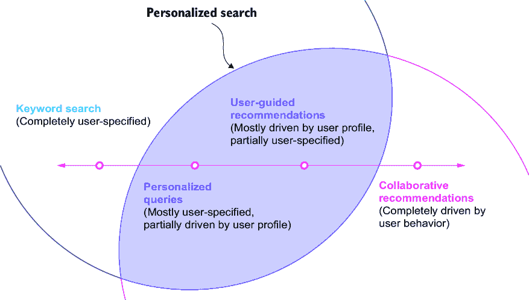
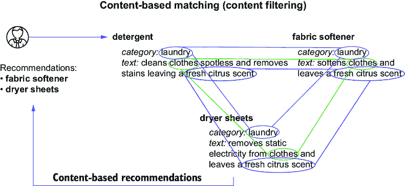
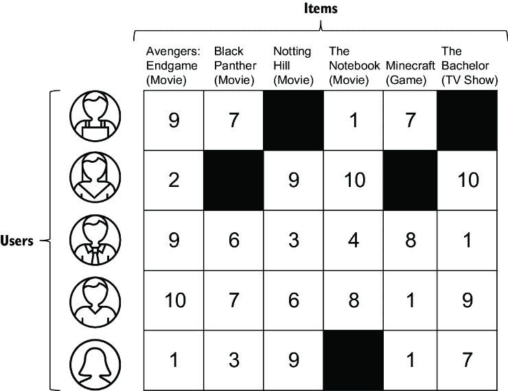
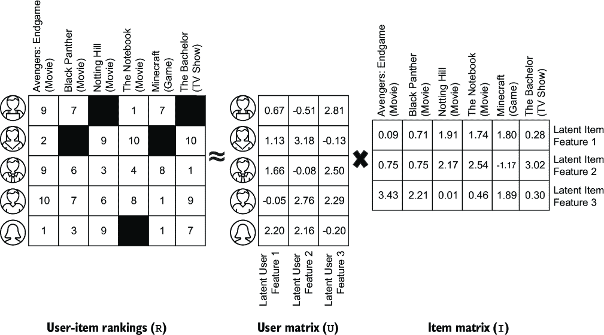
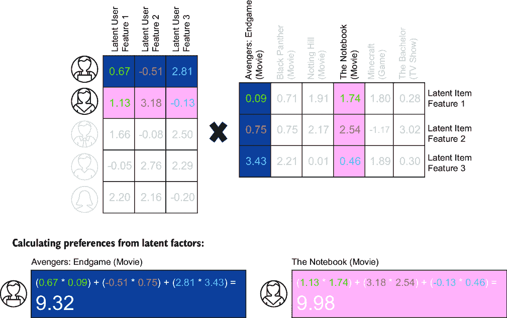
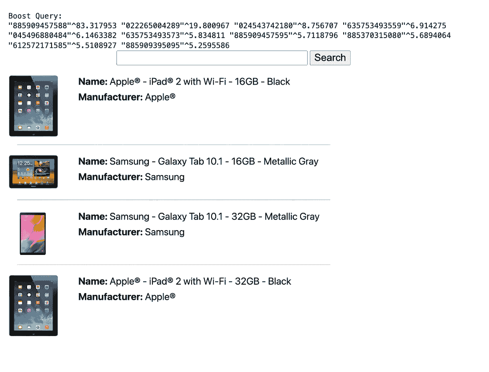
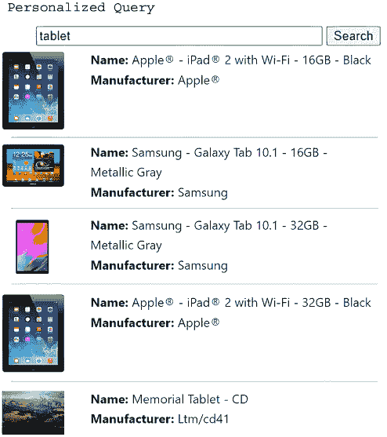
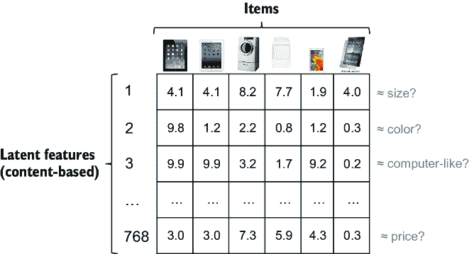
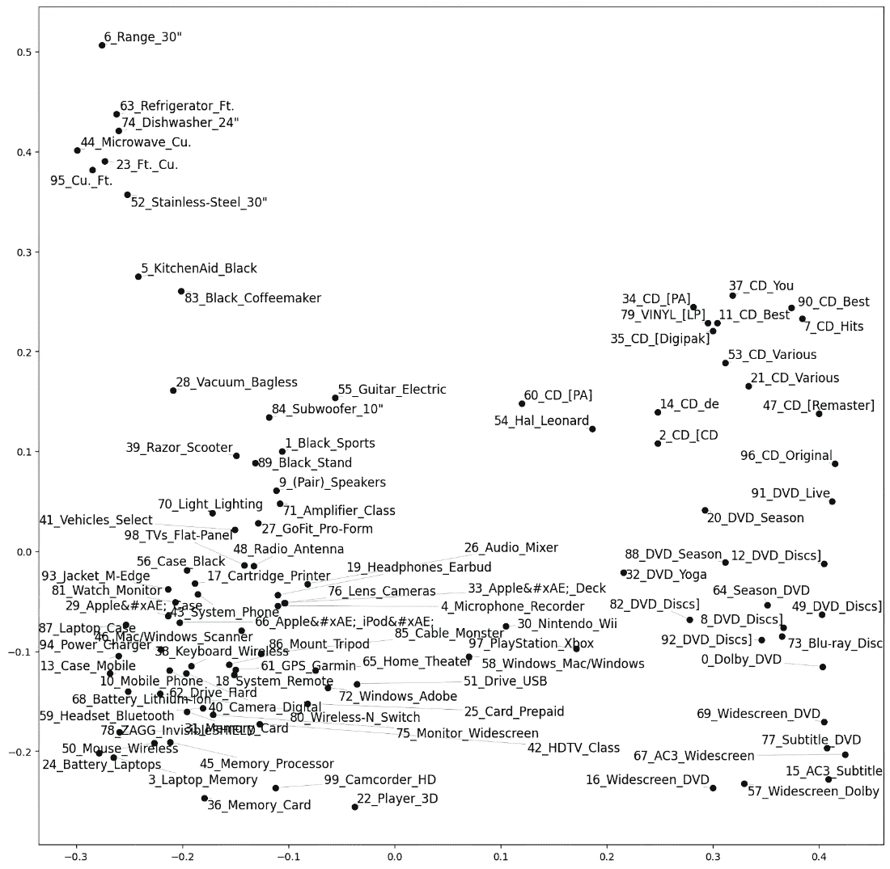

# 第九章：个性化搜索

### 本章涵盖

+   搜索与推荐之间的个性化范围

+   使用用户信号的潜在特征实现协同过滤和个性化

+   使用嵌入创建个性化配置文件

+   从内容和行为的多模态个性化

+   应用基于聚类的个性化限制

+   避免个性化搜索的陷阱

搜索引擎越了解您的用户，就越有可能成功解释他们的查询。在第一章中，我们介绍了正确解释查询意图所需的三个关键上下文：内容理解、领域理解和用户理解。在本章中，我们将深入探讨用户理解上下文。

我们已经关注了从文档中学习特定领域上下文（第五章）以及根据许多不同用户的流行结果（第八章），但并不总是合理地假设“最佳”结果在所有用户中都是一致的。而信号增强模型在所有用户中找到最*流行*的答案，而个性化搜索则试图了解每个*特定*用户的兴趣，并返回满足这些兴趣的搜索结果。

例如，当搜索餐厅时，用户的位置显然很重要。当搜索工作时，每个用户的就业历史（以前的职位，经验水平，薪资范围）和位置可能很重要。当搜索产品时，特定的品牌偏好，家电颜色，互补商品购买以及类似个人品味可能很重要。

在本章中，我们将使用用户信号来学习描述用户兴趣的潜在特征。*潜在特征*是隐藏在数据中的特征，但可以通过对数据进行建模来推断关于用户或物品的信息。这些潜在特征将被用于生成产品推荐和提升个性化搜索结果。我们还将使用基于内容的嵌入来关联产品，并使用每个用户交互的产品的嵌入来生成基于向量的个性化配置文件，以个性化搜索结果。

最后，我们将根据其嵌入对产品进行聚类，以生成个性化限制，确保用户不会看到基于无关类别产品的个性化搜索结果。

应非常谨慎地将个性化应用于搜索结果。通过基于他们之前的搜索活动所做的假设来覆盖他们的明确意图（通常指定为搜索关键词），很容易让用户感到沮丧。我们将深入探讨在更好地个性化搜索的好处与由引擎过度努力读取用户想法而可能引起的用户挫败感之间取得平衡的细微差别。并非所有搜索都应该个性化，但做得好的时候，您会看到它如何极大地改善搜索体验。

## 9.1 个性化搜索与推荐

搜索引擎和推荐引擎代表了个人化范围的两端，我们在第一章中介绍了这一概念（见图 1.5）。我们也在第一章中讨论了用户意图的维度（见图 1.7），指出要完全理解用户意图需要内容理解、用户理解和领域理解。图 9.1 重新提出了这两个心智模型。

虽然关键词搜索只代表内容理解，协同推荐只代表用户理解，但在可能的情况下，它们都可以也应该被结合。*个性化搜索*位于关键词搜索和协同推荐之间的交叉点。


##### 图 9.1 个人化范围和用户意图的维度

图 9.2 将个人化范围叠加在用户意图维度的图上，以描绘出个性化搜索如何在个人化范围内更细腻的图景。



##### 图 9.2 个性化搜索位于关键词搜索和协同推荐之间的交叉点

搜索引擎和推荐引擎之间的关键区别在于，搜索引擎通常由用户引导并匹配他们明确输入的查询，而推荐引擎通常不接受直接的用户输入，而是根据已知或推断的知识推荐内容。然而，现实情况是这两种系统构成了同一枚硬币的两面。在两种情况下，目标都是理解用户在寻找什么，并交付相关结果以满足用户的信息需求。在本节中，我们将讨论搜索和推荐系统之间个人化范围内广泛的能力范围。

### 9.1.1 个性化查询

让我们想象我们正在运行一个餐厅搜索引擎。我们的用户，米歇尔，在纽约午餐时间用手机进行关键词搜索，她输入了“蒸面包圈”这个关键词。她看到了位于美国南卡罗来纳州格林维尔、俄亥俄州哥伦布和英国伦敦的顶级蒸面包圈店。

这些搜索结果有什么问题？嗯，在这种情况下，答案很明确——米歇尔正在纽约寻找午餐，但搜索引擎却显示了她数百到数千公里之外的结果。但米歇尔从未*告诉*搜索引擎她只想看到纽约的结果，也没有告诉搜索引擎她正在寻找附近的午餐地点，因为她想吃现在。尽管如此，搜索引擎应该能够推断出这些信息并根据这些信息个性化搜索结果。

考虑另一种场景——米歇尔在长途飞行后到达机场，并在手机上搜索`司机`。返回的顶部结果是高尔夫球场的击球杆，接着是打印机驱动程序的链接，然后是螺丝刀。如果搜索引擎知道米歇尔的位置，它是否应该能够推断出她的意图——她在寻找一辆车？

以我们之前提到的职位搜索为例，假设米歇尔访问她最喜欢的职位搜索引擎并输入了`护士职位`。就像我们之前的餐厅例子一样，如果纽约的护士职位能出现在列表的顶部，那岂不是理想的情况？如果她后来输入了`西雅图的工作`，那岂不是理想的情况——不是看到随机的西雅图工作（医生、工程师、厨师等），而是由于引擎之前了解到她是一名护士，护士职位现在出现在列表的顶部？

这些都是个性化查询的例子：将用户的明确查询与对用户意图和偏好的隐含理解结合起来，形成一个专门针对该用户的搜索结果。做好这种个性化搜索是棘手的，因为你必须仔细平衡对用户的理解，同时不覆盖他们明确想要查询的内容。然而，当做得好的时候，个性化查询可以显著提高搜索的相关性。

### 9.1.2 用户引导推荐

正如可以在显式关键词搜索中添加对用户特定属性的隐含理解来生成个性化搜索结果一样，也可以通过允许用户覆盖自动生成的推荐输入来启用用户引导的推荐。

推荐引擎允许用户查看和编辑他们的推荐偏好变得越来越普遍。这些偏好通常包括用户之前通过查看、点击或购买而与之互动的项目列表。在广泛的应用场景中，这些偏好可能包括特定项目偏好，如喜欢的电影、餐厅或地点，以及汇总或推断出的偏好，如服装尺码、品牌偏好、喜欢的颜色、偏好的本地商店、期望的职位和技能、偏好的薪资范围等等。这些偏好构成了用户档案：它们定义了关于客户所知的内容，而你能够给予用户更多查看、调整和改进此档案的控制权，你就越能更好地理解你的用户，他们可能也会对结果更加满意。

## 9.2 推荐算法方法

在本节中，我们将讨论不同类型的推荐算法。推荐引擎的实现取决于可用于驱动其推荐的数据。一些系统只有用户行为信号，以及非常少的关于被推荐项目的内 容或信息，而其他系统则有关于项目的丰富内容，但与项目的用户交互非常少。我们将介绍基于内容、基于行为和多模态推荐器。

### 9.2.1 基于内容的推荐器

基于内容的推荐算法根据不同实体（通常在用户和项目之间、项目与项目之间或用户与用户之间）共享的属性来推荐新内容。例如，想象一个求职网站。工作可能具有诸如“职位名称”、“行业”、“薪资范围”、“工作经验年限”和“技能”等属性。用户在其个人资料或简历/简历中将有类似的属性。基于这些属性，基于内容的推荐算法可以确定哪些特征最重要，然后根据用户的期望属性为任何给定用户排名最佳匹配的工作。这被称为用户-项目（或用户到项目）推荐器。

同样地，如果一个用户喜欢某个特定的工作，可以使用这个相同的过程根据这些工作与第一个工作的属性匹配程度来推荐类似的工作。这种推荐在产品详情页上很受欢迎，因为用户已经在查看一个项目，可能希望帮助他们探索相关项目。这种推荐算法被称为项目-项目（或项目到项目）推荐器。

图 9.3 演示了基于内容的推荐器如何使用用户先前交互的项目属性来匹配对该用户相似的项目。在这种情况下，我们的用户查看了“洗涤剂”产品，然后根据这些项目在相同类别字段（“洗衣”类别）中的匹配以及在其产品描述中包含与“洗涤剂”产品相似的文本，推荐了“织物柔软剂”和“烘干剂”。

在第五章介绍知识图谱学习时以及在第六章介绍使用知识图谱的查询扩展时，我们展示了这种相关属性和类别匹配的类型。在那两种情况下，我们主要是扩展关键字查询以包含额外的相关术语，但你可以根据任何其他属性进行项目匹配，如品牌、颜色或尺寸。



##### 图 9.3 基于用户感兴趣的项目属性（如类别和文本关键词）的基于内容的推荐

还可以将用户匹配到其他用户，或将任何实体匹配到任何其他实体。在基于内容推荐的上下文中，所有推荐都可以看作是项目-项目推荐，其中每个项目是一个与其他被推荐实体共享属性的任意实体。

### 9.2.2 基于行为的推荐器

基于行为的推荐器利用用户与物品（文档）的交互来发现物品组中相似的兴趣模式。这个过程被称为 *协同过滤*，指的是使用多人（协同）投票过程来过滤匹配项，这些匹配项通过有多少重叠用户与相同物品的交互来衡量相似度。这里的想法是，相似的用户（即具有相似偏好的用户）倾向于与相同的物品进行交互，当用户与多个物品交互时，他们更有可能与相似物品而不是无关物品进行交互。

协同过滤算法的一个令人惊讶的特性是，它们完全从您的最终用户那里众包了相关性评分过程。事实上，不需要物品本身的特征（名称、品牌、颜色、文本等）——所需的是每个物品的唯一 ID 以及知道哪些用户与哪些物品进行了交互。此外，您拥有的用户交互信号越多，这些算法通常越智能，因为更多的人在不断地投票并告知您的排名算法。这通常导致协同过滤算法在性能上显著优于基于内容的算法。

图 9.4 展示了如何使用来自多个用户的重叠行为信号来驱动协同推荐。在这个图中，一位新用户表示对肥料感兴趣，因为之前表示对肥料感兴趣的其他用户倾向于也点击、加入购物车或购买土壤和覆盖物，因此土壤或覆盖物将被作为推荐返回。另一个包括螺丝刀、锤子和钉子的基于行为的项目簇也被描绘出来，但它们与用户当前的兴趣（肥料）没有足够重叠，因此它们不会被作为推荐返回。


##### 图 9.4 基于协同过滤的推荐，这是一种使用多个用户之间行为信号重叠的技术

我们将在第 9.3 节中实现一个端到端的协同过滤示例，涵盖从用户行为信号中发现潜在用户和物品特征的过程，并使用这些特征为用户生成物品推荐。由于协同过滤是完全众包的，因此它对您的文档或相关内容属性可能缺失或不正确的数据质量问题具有免疫力。

不幸的是，正是这种对用户行为信号的依赖使得协同过滤如此强大，同时也暴露了其弱点。当只有少量与特定项目的互动，或者完全没有互动时会发生什么？答案是，该项目要么永远不会被推荐（当没有信号时），要么很可能会产生糟糕的推荐或显示为与其他项目的糟糕匹配（当信号很少时）。这种情况被称为*冷启动问题*，这是基于行为推荐者面临的主要挑战。为了解决这个问题，你通常需要将基于行为的推荐者与基于内容的推荐者结合起来，正如我们接下来将要讨论的。

### 9.2.3 多模态推荐者

*多模态推荐者*（有时也称为*混合推荐者*）结合了基于内容和基于行为推荐方法。由于协同过滤通常适用于具有许多信号的物品，但在信号很少或没有信号的情况下表现不佳，因此通常最有效的方法是将基于内容的特征作为基线，然后在上面叠加协同过滤模型。这样，如果信号很少，基于内容的匹配器仍然会返回结果；如果信号很多，协同过滤算法在排名结果时将更加突出。结合两种方法可以让你兼得两者之长：高质量的众包匹配，同时避免新内容和不太为人所知的内容的冷启动问题。图 9.5 展示了这在实践中是如何工作的。


##### 图 9.5 多模态推荐将基于内容的匹配和协同过滤结合到一个混合匹配算法中。

你可以在图 9.5 中看到，用户可以与钻头（没有信号）或螺丝刀（有来自其他用户的先前信号，以及内容）进行互动，并且在这两种情况下用户都会收到推荐。这提供了基于信号的协同过滤可以使用的优势，同时也允许对信号不足的物品进行基于内容的匹配。

在下一节中，我们将实现一个协同过滤模型，然后在 9.4 节中实现一个混合个性化搜索系统。

## 9.3 实现协同过滤

在本节中，我们将实现一个协同过滤算法。我们将使用用户-项目互动信号，并演示如何从这些信号中学习表示用户偏好的潜在（隐藏）特征。然后我们将使用这些学习到的偏好来生成推荐。

纯协同过滤，如图 9.2 所示，使我们能够根据用户与这些项目的互动模式来学习项目之间的相似性。这是一个强大的概念，因为它允许在不了解项目本身的情况下（如标题、文本或其他属性）了解项目。

### 9.3.1 通过矩阵分解学习潜在用户和项目特征

协同过滤通常使用一种称为*矩阵分解*的技术来根据用户交互学习关于项目的潜在特征。潜在特征是那些没有直接观察到但可以从其他观察到的特征推断出来的特征。例如，假设你有四个用户，以下是他们购买电影的历史记录：

+   用户 1—*复仇者联盟 4：终局之战*，*黑豹*和*黑寡妇*

+   用户 2—*黑寡妇*，*惊奇队长*和*黑豹*

+   用户 3—*黑寡妇*，*黑暗骑士*和*蝙蝠侠*

+   用户 4—*小美人鱼*，*狮子王*和*玩具总动员*

+   用户 5—*冰雪奇缘*，*玩具总动员*和*狮子王*

这些购买行为中有没有什么模式？如果你知道标题或描述，你可以推断出以下内容：

用户 1–3：

+   所有这些电影都是关于超级英雄的。

+   其中大部分是由漫威工作室制作的，尽管也有一些是由华纳兄弟（DC 漫画）制作的。

+   它们都是动作电影。

+   由于暴力和/或语言问题，它们都不适合小孩子们。

用户 4–5：

+   所有这些都是动画电影。

+   所有这些都很适合小孩子们。

+   所有这些都是由迪士尼/皮克斯制作的。

假设你除了产品 ID 之外没有其他任何信息。通过使用矩阵分解，可以观察到用户如何与项目互动，并推断出关于这些项目的潜在特征。如果前面提到的特征是最能预测类似用户购买行为的，那么它们很可能会在矩阵分解学习的潜在特征中体现出来。矩阵分解还可能发现其他不那么明显的特征。

作为另一个例子，在 RetroTech 数据集中，用户信号可能显示一组用户购买不锈钢微波炉、不锈钢冰箱和不锈钢铁锅，而另一组用户可能购买黑色微波炉、黑色冰箱和黑色铁锅。通过将用户-项目交互聚类在一起，可以统计地确定一个将颜色区分这些项目的潜在特征。此外，一组用户可能购买电视、PlayStation 和 DVD 播放器，而另一组用户可能购买 iPhone、手机壳和屏幕保护器。通过将这些行为聚类在一起，我们可以将这些产品类别（家庭影院与移动电话）区分为一或多个潜在特征。

图 9.6 展示了几个产品和用户之间的示例用户-项目交互矩阵。这些数字是评分，表示用户（*y*-轴）对项目（*x*-轴）的兴趣强度，购买行为比加入购物车动作更重要，而加入购物车信号比点击更重要。空单元格表示用户和项目之间没有交互。



##### 图 9.6 用户-项目交互矩阵。数字代表用户对项目的偏好，范围从 1（非常不利）到 10（非常有利）。空单元格表示用户和项目之间没有交互。

给定用户-项目交互矩阵，我们的目标是找出特定项目为什么被每个用户所偏好。我们假设某些用户兴趣和项目相似性的组合解释了这些偏好。因此，矩阵分解将用户-项目评分矩阵分解成两个独立的矩阵——一个将每个用户映射到一组特征，另一个将每个项目映射到一组特征。

图 9.7 展示了矩阵分解过程，将用户-项目排名矩阵`R`转换为相应的用户特征矩阵`U`和项目特征矩阵`I`。



##### 图 9.7 矩阵分解。用户-项目矩阵`R`被分解成两个矩阵，一个用户矩阵`U`和一个项目矩阵`I`。这两个矩阵的乘积（`U` `.` `I`）应尽可能接近原始的用户-项目矩阵`R`。

用户矩阵（`U`）中的每一行代表一个用户，每一列代表三个潜在用户特征之一（标记为`潜在用户特征 1`、`潜在用户特征 2`和`潜在用户特征 3`）。在项目矩阵（`I`）中，每一列代表一个项目，每一行代表三个潜在项目特征之一（标记为`潜在项目特征 1`、`潜在项目特征 2`和`潜在项目特征 3`）。

我们没有为这些潜在特征命名，也不知道它们的确切含义，但它们是通过数学方法发现的，并且可以预测实际的用户-项目兴趣。潜在特征的数量是一个可以调整的超参数，但在这个例子中设置为`3`。这意味着每个用户由一个有三个维度（潜在特征）的向量表示，每个项目也由一个有三个维度（潜在特征）的向量表示。

一旦学习到矩阵`U`和`I`，它们之后可以独立使用来预测任何用户和项目之间的相似性（通过比较`U`中的用户与`I`中的项目），任何两个用户之间的相似性（通过比较`U`中的用户与另一个`U`中的用户），或者任何两个项目之间的相似性（通过比较`I`中的项目与另一个`I`中的项目）。我们将只关注用户-项目相似性，作为为每个用户个性化推荐的手段。图 9.8 展示了如何为任何用户生成项目评分预测。



##### 图 9.8 从分解矩阵中计算用户-项目偏好。将每个潜在用户特征值（用户行的第一个、第二个和第三个值）乘以相应的潜在项目特征值（项目列的第一个、第二个和第三个值），然后将结果相加。这是所选用户和项目的预测用户-项目偏好。

对于第一个用户（`U` 中的第一行），我们可以通过在用户矩阵 `U` 的第一行（`0.67`, `-0.51`, `2.81`）和项目矩阵 `I` 的第一列（`0.09`, `0.75`, `3.43`）之间执行点积来生成电影《复仇者联盟 4：终局之战》（`I` 中的第一列）的预测评分，结果为 `(0.67` `*` `0.09)` `+` `(-0.51` `*` `0.75)` `+` `(2.81` `*` `3.43)` `=` `9.32`。同样，对于第二个用户（`U` 中的第二行），我们可以通过在用户矩阵 `U` 的第二行（`1.13`, `3.18`, `-0.13`）和项目矩阵 `I` 的第四列（`1.74`, `2.54`, `0.46`）之间执行点积来生成电影《恋恋笔记本》（`I` 中的第四列）的预测评分，结果为 `9.98`。

虽然在某些情况下，例如在增量用户交互后立即生成实时推荐时，对单个用户和项目进行单独预测可能有所帮助，但通常更有用的是生成一个包含所有用户和项目的预测评分的完整用户-项目矩阵 `R'`。图 9.9 展示了通过执行用户矩阵 `U` 与项目矩阵 `I` 的点积生成的最终用户-项目矩阵 `R'`（在右侧）。


##### 图 9.9 重构的用户-项目矩阵 `R'`，其中图 9.8 中的先前计算突出显示。请注意，原始用户-项目矩阵 `R` 中的空值现在用预测值填充（以黑色突出显示）。

当计算用户矩阵和项目矩阵（`U` `.` `I`）的点积时，得到的结果用户-项目矩阵 `R'` 应尽可能接近原始用户-项目矩阵 `R`。最小化原始矩阵 `R` 和预测矩阵 `R'` 之间的差异是矩阵分解的训练优化目标。两个矩阵越接近，模型预测未来相似个性化推荐的能力就越好。

在实践中，潜在特征并不能完美地代表所有可能的相关特征。然而，通过使用一个减少原始 `R` 和预测 `R'` 之间差异的损失函数进行训练，模型将最大化代表 `R` 的可能性，从而能够根据过去用户-项目交互最佳预测未来的推荐。

### 9.3.2 使用交替最小二乘法实现协同过滤

对于基于用户与项目交互的纯协同过滤（仅基于用户与项目的交互）的一种流行算法是**交替最小二乘法**（ALS）。ALS 是一种迭代算法，通过交替学习项目和用户的潜在特征来执行矩阵分解。

ALS 背后的逻辑是用户-项目评分矩阵中的潜在特征是用户潜在特征和项目潜在特征的组合。虽然每个潜在特征的相对权重在开始时并不知道，但可以通过最初使用随机的项目权重并冻结它们（保持它们恒定）来开始学习用户特征权重。随着用户特征权重开始合并，它们可以被冻结并用作学习项目特征权重的输入。然后，ALS 继续交替训练用户特征矩阵（冻结最新的项目特征权重）和项目特征矩阵（冻结最新的用户特征权重）。这个过程会重复进行一定次数的迭代，直到两个矩阵的权重都得到很好的平衡和优化。通过交替学习项目和用户的潜在特征，ALS 可以迭代地学习两个矩阵的最佳组合权重，以提高模型的预测能力。

使用矩阵分解学习到的潜在特征的数量是一个超参数，称为**秩**。秩越高，你能够学习的特征越细粒度，但你也倾向于需要更多的数据点来可靠地学习更细粒度的特征。虽然你无法为每个潜在特征应用标签（特征仅以数字表示），但仍然有可能在数据中发现有意义的类别，这些类别最能预测相似的项目。ALS 是一种流行的协同过滤算法，因为它相对容易实现，并且可以扩展到大型数据集。

在本节中，我们将讨论如何使用 Spark 实现 ALS（交替最小二乘法），以基于用户-项目交互生成推荐模型。我们将使用 RetroTech 数据集，因为它包含了一组产品的用户-项目交互。我们将利用用户-项目交互来学习关于用户和项目的潜在特征，然后我们将使用这些潜在特征来生成未来的推荐。

我们将首先使用 Spark 内置的 ALS 实现生成每个用户-项目对的隐式偏好列表。列表 9.1 生成了一个`user_product_implicit_preferences`集合，根据用户交互的强度分配评分。

##### 列表 9.1 从用户信号生成隐式用户-项目评分

```py
click_weight = 1  #1
add_to_cart_weight = 0  #1
purchase_weight = 0  #1

signals_collection = engine.get_collection("signals")

mixed_signal_types_aggregation = f"""
SELECT user, product,
  (click_boost + add_to_cart_boost + purchase_boost) AS rating
FROM (
  SELECT user, product,
    SUM(click) AS click_boost,
    SUM(add_to_cart) AS add_to_cart_boost,
    SUM(purchase) AS purchase_boost
  FROM (
    SELECT s.user, s.target AS product,
      IF(s.type = 'click', {click_weight}, 0) AS click,
      IF(s.type = 'add-to-cart', {add_to_cart_weight}, 0) AS add_to_cart,
      IF(s.type = 'purchase', {purchase_weight}, 0) AS purchase
    FROM signals s
    WHERE (s.type != 'query')) AS raw_signals
  GROUP BY user, product) AS per_type_boosts"""

signals_agg_collection = \ #2
  aggregate_signals(signals_collection, "user_product_implicit_preferences",  #2
                    mixed_signal_types_aggregation)  #2
```

#1 目前只有点击信号被加权，但可以为每种信号类型设置权重。

#2 对所有信号进行聚合，为每个用户-项目对生成一个单一评分

我们对点击、添加到购物车和购买信号进行了建模支持，尽管我们只给点击分配了权重`1`，给添加到购物车和购买信号分配了`0`。我们这样做是为了使 ALS 算法的数学更简单，但您可以尝试通过将它们的权重增加到正数来打开添加到购物车或购买信号。这些权重有些随意，但目的是根据用户的交互程度区分用户对产品的兴趣强度。如果您对用户更多的交互不一定表示更强的评分或您选择的权重有意义的信心不足，您也可以通过为每个用户-项目对分配评分`1`来简化处理。

在我们的用户-项目评分准备就绪后，我们将从准备好的集合中生成一个数据框来训练和测试模型。我们的数据集包含不到 50,000 个产品，我们将在列表 9.2 中使用它们全部；然而，如果您想快速运行，可以将`top_product_count_for_recs`修改为一个显著更低的数字。根据您的硬件和 Docker 资源配置，运行时间可能从几分钟到几天不等。为了快速（但质量较低）的运行，可以考虑最初用 1,000 个产品进行测试（`top_product_count_for_recs=1000`），然后根据您的舒适度进行扩展。

##### 列表 9.2 准备用于训练的用户-产品-评分数据

```py
create_view_from_collection(signals_agg_collection,
                           "user_product_implicit_preferences")

top_product_count_for_recs = 50000  #1
user_preference_query = f"""
SELECT user, product, rating  #2
FROM user_product_implicit_preferences
WHERE product IN (
  SELECT product FROM (
    SELECT product, COUNT(user) user_count
    FROM user_product_implicit_preferences
    GROUP BY product
    ORDER BY user_count DESC  #3
    LIMIT {top_product_count_for_recs}  #3
  ) AS top_products)
ORDER BY rating DESC"""

user_prefs = spark.sql(user_preference_query)
```

#1 减少产品数量可以加快训练速度，但会降低准确性。

#2 返回用户、产品和评分

#3 限制推荐数量到最受欢迎的产品

我们的数据框包含三列：`user`、`product`和`rating`。出于性能考虑，许多机器学习算法（包括我们将要使用的 Spark 的 ALS 实现）更愿意处理数字 ID 而不是字符串。Spark 包含一个`StringIndexer`辅助对象，可以用来将字符串 ID 转换为数字 ID，以及一个相应的`IndexToString`对象，可以用来将数字 ID 转换回字符串 ID。列表 9.3 将这种 ID 转换整合到我们的数据框中。

##### 列表 9.3 将 ID 转换为整数以供 Spark 的 ALS 算法使用

```py
def order_preferences(prefs):
  return prefs.orderBy(col("userIndex").asc(),
                       col("rating").desc(),
                       col("product").asc())

def strings_to_indexes(ratings, user_indexer,
                       product_indexer):
  transformed = product_indexer.transform(  #1
    user_indexer.transform(ratings))  #1
  return order_preferences(transformed)

def indexes_to_strings(ratings, user_indexer,
                       product_indexer):
  user_converter = IndexToString(inputCol="userIndex",  #2
                                     outputCol="user",  #2
                           labels=user_indexer.labels)  #2
  product_converter = IndexToString(inputCol="productIndex",  #2
                                        outputCol="product",  #2
                              labels=product_indexer.labels)  #2
  converted = user_converter.transform(  #3
    product_converter.transform(ratings)) #3
  return order_preferences(converted)

user_indexer = StringIndexer(inputCol="user", #4
       outputCol="userIndex").fit(user_prefs)  #4
product_indexer = StringIndexer(inputCol="product",  #5
          outputCol="productIndex").fit(user_prefs)  #5

indexed_prefs = strings_to_indexes(user_prefs, user_indexer, product_indexer)
indexed_prefs.show(10)
```

#1 将用户和产品列转换为数据框的索引列

#2 产品和用户的数字索引到字符串映射

#3 对用户标识符执行索引到字符串的转换

#4 将字符串用户字段映射到名为 userIndex 的整数索引

#5 将字符串产品字段映射到名为 productIndex 的整数索引

输出：

```py
+-------+------------+------+---------+------------+
|   user|     product|rating|userIndex|productIndex|
+-------+------------+------+---------+------------+
|u159789|008888345435|     1|      0.0|      5073.0|
|u159789|014633196870|     1|      0.0|      4525.0|
|u159789|018713571687|     1|      0.0|     10355.0|
|u159789|024543718710|     1|      0.0|       263.0|
|u159789|025192979620|     1|      0.0|     12289.0|
|u159789|025193102324|     1|      0.0|      9650.0|
|u159789|085391163121|     1|      0.0|      9196.0|
|u159789|720616236029|     1|      0.0|      2781.0|
|u159789|801213001996|     1|      0.0|     28736.0|
|u159789|813985010007|     1|      0.0|      5819.0|
+-------+------------+------+---------+------------+
only showing top 10 rows
```

如您从列表 9.3 中可以看到，我们的数据框现在包含了两列额外的列：`userIndex`和`productIndex`。在最后调用`indexes_to_strings`函数将它们转换回原始字符串 ID 之前，我们将使用这些数字 ID 在 ALS 实现代码中继续使用。

现在我们已经准备好了用户-项目偏好数据框，是时候调用 ALS 算法了。ALS 需要三个参数：`userCol`、`itemCol`和`ratingCol`，它们分别对应于我们数据框中的`userIndex`、`productIndex`和`rating`列。我们还会设置一些其他参数，包括以下内容：

+   `maxIter=3`（运行的最大迭代次数）

+   `rank=10`（要学习的潜在特征数量）

+   `regParam=0.15`（正则化参数）

+   `implicitPrefs=True`（是否将评分视为隐式或显式）

+   `coldStartStrategy=drop`（如何处理训练数据中不存在的新用户或项目）

列表 9.4 展示了如何使用这些参数调用 ALS。

##### 列表 9.4 使用 Spark 训练 ALS 模型

```py
from pyspark.ml.evaluation import RegressionEvaluator
from pyspark.ml.recommendation import ALS
from pyspark.sql import Row

als = ALS(maxIter=3, rank=10, regParam=0.15, implicitPrefs=True,
          userCol="userIndex", itemCol="productIndex", ratingCol="rating",
          coldStartStrategy="drop", seed=0)

(training_data, test_data) = \  #1
  user_prefs.randomSplit([0.95, 0.05], 0)  #1

training_data = strings_to_indexes(training_data, user_indexer, product_indexer)
test_data = strings_to_indexes(test_data, user_indexer, product_indexer)

model = als.fit(training_data) #2
predictions = model.transform(test_data)  #3
evaluator = RegressionEvaluator(metricName="rmse",  #3
                                labelCol="rating",  #3
                       predictionCol="prediction")  #3
rmse = evaluator.evaluate(predictions)  #3
print(f"Root-mean-square error = {rmse}")  #3
```

#1 将偏好分为 95%的训练数据和 5%的测试数据

#2 使用训练集中的用户偏好训练 ALS 模型

#3 将训练好的模型与测试集中的用户偏好进行比较

输出：

```py
Root-mean-square error = 1.0007877733299877
```

你现在已经训练了一个推荐模型！我们将数据分为训练集（95%）和测试集（5%），构建了 ALS 模型，然后运行评估器来计算均方根误差（RMSE）损失函数以衡量模型的质量。RMSE 是预测评分与实际评分之间差异的度量，因此 RMSE 越低，模型越好。RMSE 的绝对值相对于不同模型训练过程中的相对值来说不太重要，因为计算依赖于底层数据使用的尺度。如果你增加`maxIter`，找到最优的`rank`，并在准备用户-产品-评分数据时增加`top_product_count_for_recs`，你可能会看到 RMSE 略有下降，这是由于模型改进导致的。

现在模型已经训练好了，我们可以用它来生成推荐。列表 9.5 展示了如何从 ALS 模型生成所有用户的物品推荐。我们将为每个用户生成 10 个推荐，并显示前 5 个用户的推荐。

##### 列表 9.5 从 ALS 模型生成用户-项目推荐

```py
indexed_user_recs = model.recommendForAllUsers(10) \
                         .orderBy(col("userIndex").asc())
indexed_user_recs.show(5, truncate=64)
```

输出：

```py
+---------+----------------------------------------------------------------+
|userIndex|                                                 recommendations|
+---------+----------------------------------------------------------------+
|        0|[{6, 0.022541389}, {13, 0.015104328}, {36, 0.010634022}, {20,...|
|        1|[{13, 0.009001873}, {3, 0.007981183}, {23, 0.0050935573}, {31...|
|        2|[{9, 0.06319133}, {17, 0.04681776}, {3, 0.041046627}, {14, 0....|
|        3|[{17, 0.0145240165}, {14, 0.01413305}, {12, 0.012459144}, {39...|
|        4|[{14, 0.006752351}, {4, 0.004651022}, {10, 0.004487163}, {17,...|
+---------+----------------------------------------------------------------+
only showing top 5 rows
```

注意，推荐的格式有点尴尬。我们只能使用`userIndex`而不是原始的`user`，而`recommendations`列是一个结构体数组，每个结构体包含一个`productIndex`和一个`rating`。让我们通过将每个用户-项目推荐转换为行，并用我们的原始`user`和`product` ID 替换`userIndex`和`productIndex`值来清理它。列表 9.6 展示了如何做到这一点。

##### 列表 9.6 将推荐转换为最终、清理过的格式

```py
column_exploder = explode("recommendations").alias("productIndex_rating")
user_item_recs = indexed_user_recs.select("userIndex", column_exploder) \
                      .select("userIndex", col("productIndex_rating.*"))
user_item_recs = indexes_to_strings(user_item_recs, user_indexer,
                                    product_indexer)
user_item_recs = user_item_recs.select("user", "product",
                                       col("rating").alias("boost"))
```

在这个列表中，我们首先使用`rec.productIndex`和`rec.rating`列将推荐`explode`到每个推荐的单独行。然后，我们将`userIndex`选择到每一行上，选择`rec.productIndex`作为`productIndex`，将`rec.rating`作为`rating`。最后，我们将从`userIndex`和`productIndex`转换回`user`和`product`，并返回`user`、`product`和`boost`。

让我们将我们的推荐保存到集合中以便将来使用。这将使我们能够从搜索引擎中即时提供推荐，或者将它们用作增强以个性化搜索结果。列表 9.7 将我们的用户-项目推荐数据框写入搜索引擎中的`user_item_recommendations`集合，遵循与第八章中我们用来表示信号增强类似的数据格式。

##### 列表 9.7 将推荐索引到搜索引擎中

```py
recs_collection = engine.create_collection("user_item_recommendations")
recs_collection.write(user_item_recs)
```

您现在已经根据用户与项目的交互生成了项目推荐，并将它们保存在搜索引擎中的`user_item_recommendations`集合中供将来使用。接下来，我们将演示我们如何提供这些推荐并使用它们来个性化搜索结果。

### 9.3.3 使用推荐增强个性化搜索结果

生成用户-项目推荐后，我们现在可以个性化搜索结果。第八章中`signals_boosts`集合和这里的`user_item_recommendations`集合之间的唯一区别是将`query`列替换为`user`列。换句话说，信号增强是基于匹配特定的关键字查询并应用相关项目相关性增强，而个性化是基于匹配特定的用户并应用相关项目相关性增强。

现在根据列表 9.7 填充了我们的推荐集合后，我们可以直接提供推荐（无关键字查询）或使用推荐根据用户的推荐进行增强以个性化搜索结果。

#### 纯协同推荐

直接提供推荐很简单，所以我们将从这里开始。列表 9.8 显示了我们的一个用户的最近信号，我们将演示这些个性化技术。

##### 列表 9.8 目标用户的交互历史

```py
def signals_request(user_id):
  return {"query": "*",
          "return_fields": ["signal_time", "type", "target"],
          "order_by": [("signal_time", "asc")],
          "filters": [("user", user_id)]}

user_id = "u478462" #1
signals_collection = engine.get_collection("signals")

request = signals_request(user_id)
previous_signals = signals_collection.search(**request)["docs"]
print_interaction_history(user_id, previous_signals)Previous Product Interactions for User: u478462
+-----------+-----------+------------+-------------------------------------+
|signal_time|       type|      target|                                 name|
+-----------+-----------+------------+-------------------------------------+
|05/20 06:05|      query|       apple|                                apple|
|05/20 07:05|      click|885909457588|Apple® - iPad® 2 with Wi-Fi - 16GB...|
|05/20 07:05|add-to-cart|885909457588|Apple® - iPad® 2 with Wi-Fi - 16GB...|
|05/20 07:05|   purchase|885909457588|Apple® - iPad® 2 with Wi-Fi - 16GB...|
|05/25 06:05|      query|     macbook|                              macbook|
|05/25 07:05|      click|885909464043|Apple® - MacBook® Air - Intel® Cor...|
+-----------+-----------+------------+-------------------------------------+
```

#1 我们将为谁个性化结果

根据用户的历史记录，很明显他们对苹果产品、平板电脑和计算机感兴趣。以下列表演示了如何从我们的`user_item_recommendations`集合为该用户提供推荐。

##### 列表 9.9 使用信号增强查询提供推荐

```py
def get_query_time_boosts(user, boosts_collection):
  request = {"query": "*",
             "return_fields": ["product", "boost"],
             "filters": [("user", user)] if user else [],
             "limit": 10,
             "order_by": [("boost", "desc")]}

  response = boosts_collection.search(**request)
  signals_boosts = response["docs"]
  return " ".join(f'"{b["product"]}"^{b["boost"] * 100}'
                  for b in signals_boosts)

def search_for_products(query, signals_boosts):
  request = product_search_request(query if query else "*")  #1
  if signals_boosts:
    request["query_boosts"] = ("upc", signals_boosts)
  return products_collection.search(**request)

user = "u478462"
boosts = get_query_time_boosts(user, recs_collection)
response = search_for_products("", boosts)  #2

print(f"Boost Query:\n{boosts}")
display_product_search("", response["docs"])
```

#1 为了简洁，省略了函数；它可以在列表 4.3 中看到。

#2 查询推荐集合以索引产品增强

图 9.10 显示了列表 9.9 的输出。在顶部，你会注意到一个“提升查询”的条目，显示了为用户推荐的最推荐产品及其对用户的相对提升（计算为`rating * 100`）。在提升查询下方，你会看到针对此空白关键词搜索的增强搜索结果，这是用户的原始推荐。



##### 图 9.10 仅基于协同过滤的用户推荐

推荐将 16GB 的 iPad 提升到顶部，这是有道理的，因为用户之前搜索并点击了 16GB 的 iPad，另一款苹果 iPad（32GB 型号）排名第四。你还会看到其他制造商生产的具有类似配置的平板电脑在顶级推荐中。这是一个很好的例子，说明了协同过滤如何帮助展示可能不直接匹配用户先前互动（只有苹果笔记本电脑和 iPad）的项目，但这些项目可能仍然与用户的兴趣相关（与 iPad 类似的平板电脑）。

这样的推荐可以与传统的搜索结果集成使用，或者甚至可以插入到一组搜索结果中。但也可以将它们用作关键词排名算法的增强，以个性化搜索结果，我们将在下一节探讨。 

#### 纯关键词搜索与个性化搜索

除了独立于关键词搜索提供推荐外，还可以将它们作为额外的信号融入搜索排名算法中，以个性化结果。回到我们上一个例子，想象一下，如果我们的用户对苹果的 iPad 和 MacBook 感兴趣，他执行了“平板”的关键词搜索。如果使用平板推荐来个性化搜索结果，这会有什么不同？列表 9.10 在应用基于用户个性化推荐的信号提升之前和之后运行了查询。

##### 列表 9.10 非个性化与个性化搜索结果

```py
query = "tablet"
response = search_for_products(query, None)  #1
print(f"Non-personalized Query")
display_product_search(query, response["docs"])

response = search_for_products(query, boosts)  #2
print(f"Personalized Query")
display_product_search(query, response["docs"])
```

#1 非个性化搜索结果（仅关键词搜索）

#2 个性化搜索结果（关键词 + 用户-项目推荐提升）

图 9.11 显示了针对“平板”的非个性化查询输出，而图 9.12 显示了应用推荐提升以个性化搜索结果后的输出。

个性化搜索结果可能比非个性化结果对用户的相关性更大。值得注意的是，在我们的实现中，个性化仅作为相关性提升应用。这意味着与用户明确查询不匹配的产品将不会返回，并且所有匹配查询的项目仍然会返回；唯一的区别是产品的排序，因为针对用户个性化的项目现在应该显示在第一页。


##### 图 9.11 无个性化应用的“平板”传统关键词搜索



##### 图 9.12 个人化搜索`tablet`，其中用户对 Apple 品牌表示了兴趣

还请注意，在增强推荐（推荐示例中的平板电脑）之后，第五个搜索结果是来自非个性化搜索结果的项目，“纪念平板”标题为 CD。

这意味着两件事：

+   如果你正在个性化搜索结果，而不仅仅是提供纯推荐，你可能希望为每个用户生成超过 10 个推荐，尤其是当推荐只有在它们也匹配用户的明确查询时才会显示出来。

+   非个性化相关性算法仍然至关重要。如果在基于查询（第八章所述）的信号增强（基于用户）的基础上，再加上基于用户的推荐增强（基于用户），你将看到最上面的热门平板电脑（而不是平板电脑套和 CD），而个性化的平板电脑由于个性化而将在热门结果中上升更高。

我们现在已经了解了协同过滤是如何通过矩阵分解工作的，我们已经实现了基于协同过滤算法（ALS）的推荐，并展示了如何使用这些推荐来个性化搜索结果。在下一节中，我们将探讨另一种基于文档嵌入的个性化技术。

## 9.4 使用基于内容的嵌入个性化搜索

在上一节中，我们使用了用户信号来学习特定项目的个性化增强。这些增强是通过在用户-项目交互模式上使用矩阵分解来学习用户和项目的潜在特征生成的。

你还可以直接使用这些潜在因素将用户或项目聚在一起。不幸的是，没有一种可靠的方法仅基于用户交互信号将查询映射到特定项目的集群中，而不需要事先看到相应的查询（再次是冷启动问题）。幸运的是，搜索引擎没有关于项目（如标题、描述和其他属性）的额外知识是非常罕见的。

在本节中，我们将探讨一种混合方法，结合基于内容的理解和用户交互模式来构建一个不断发展的用户配置文件以个性化搜索结果。

### 9.4.1 生成基于内容的潜在特征

我们已经介绍了许多利用字段来过滤和增强文档中显式属性的技术。第五章至第七章特别关注生成知识图谱和解析特定领域的实体，以帮助实现上下文相关的相关性。

尽管这些技术确实可以用于实现个性化搜索（并且我们鼓励您尝试它们），但在这个部分，我们将探索一种不同的方法。我们不会使用显式属性，而是将使用从文档内容中学习的潜在特征来生成个性化搜索结果。我们将使用大型语言模型（LLM）为每个文档生成嵌入，然后我们将使用这些嵌入以及用户与文档的交互来构建一个不断发展的用户档案。最后，我们将使用该用户档案来个性化搜索结果。

图 9.13 从概念上展示了如何使用 LLM 为文档生成嵌入。类似于我们在 9.3.1 节中使用矩阵分解创建一个映射每个项目到其潜在特征列表的矩阵，我们将使用 LLM 为每个文档生成一个潜在特征的向量。我们将根据文档文本映射到一个 LLM 已经学习过的向量空间中提取这些潜在特征。现在不必担心 LLM 是如何训练的机制——我们将在第十四章和第十五章中深入探讨这一点。只需知道它是在一个大型文本语料库上训练的，并且它学会了如何使用一些代表文本意义的潜在特征将单词和短语映射到向量空间。向量空间中的每个维度代表一个潜在特征，每个维度的值代表该潜在特征在文本中的表示强度。



##### 图 9.13 展示了来自一个 LLM 的项目嵌入。向量空间中的每个维度代表一个潜在特征，每个维度的值代表该潜在特征在文本中对该项目的表示强度。

图 9.13 中的值仅用于说明目的，并不是我们 LLM 实际生成的值。我们为这些特征分配了简化的标签来描述它们似乎代表的内容（“大小”、“颜色”、“类似计算机”和“成本”），但在现实世界的场景中，这些特征将是未标记的，并且将代表 LLM 在训练过程中学习到的更复杂的潜在特征，这些潜在特征结合了许多不同的方面。

在我们的示例中，我们将使用`all-mpnet-base-v2` LLM，这是一个公开可用的模型（[`huggingface.co/sentence-transformers/all-mpnet-base-v2`](https://huggingface.co/sentence-transformers/all-mpnet-base-v2)），它是一个适用于语义搜索和句子及短段落（如我们 RetroTech 数据集中的段落）的通用 LLM。这是一个轻量级模型（只有 768 个维度），它基于来自整个网络的超过 11.7 亿个句子对进行训练，提供了一个良好的通用知识库。

下面的列表检索了我们需要传递给 LLM 的字段。

##### 列表 9.11 检索产品数据以生成嵌入

```py
query = "SELECT DISTINCT name, string(upc), short_description FROM products"
spark.sql(query).createOrReplaceTempView("products_samples")
product_names = dataframe.select("name").rdd.flatMap(lambda x: x).collect()
product_ids = dataframe.select("upc").rdd.flatMap(lambda x: x).collect()
```

要生成嵌入，我们首先使用 Spark 创建一个新的`products_samples`表，其中包含用于生成嵌入和识别相关产品的字段子集。列表 9.12 展示了我们如何使用`all-mpnet-base-v2` LLM 和`Sentence_Transformers`库为每个产品生成嵌入。我们将生成一个包含每个产品的 768 维向量的`product_embeddings`对象，以及一个包含每个产品名称的`product_names`对象和一个包含每个产品 ID 的`product_ids`对象。

##### 列表 9.12 生成产品嵌入

```py
from sentence_transformers import SentenceTransformer  #1
transformer = SentenceTransformer("all-mpnet-base-v2")  #1
...  #2

def get_embeddings(texts, model, cache_name, ignore_cache=False):
  ...  #2
    embeddings = model.encode(texts)  #3
  ... #2
  return embeddings

product_embeddings = get_embeddings(product_names,
 transformer, cache_name="all_product_embeddings")
```

#1 加载 all-mpnet-base-v2 LLM

#2 为了简洁起见，省略了缓存生成的嵌入的优化代码。

#3 为所有产品生成 768 维向量嵌入

由于我们使用的是现成的`all-mpnet-base-v2`模型，因此为所有产品加载和生成嵌入的过程就像列表 9.12 中的代码一样简单。因为为所有产品生成嵌入的过程可能需要一些时间，笔记本中还包含了一些省略的代码优化，用于缓存和重用嵌入以节省额外的处理时间。

如果我们想比较两个产品的相似度，我们可以直接使用点积或余弦相似度计算来比较它们的向量。向量中的 768 个特征是每个文档的预训练潜在特征，类似于图 9.7 中项目特征矩阵中表示的潜在特征。这意味着我们现在可以

+   为任何项目或查询生成嵌入以获取该项目或查询的向量表示。

+   从任何查询嵌入开始进行语义搜索，找到最接近（余弦或点积）的其他嵌入。

+   使用一个项目的嵌入来生成其他项目的推荐，通过找到与最相似（余弦或点积）嵌入的项目。

但关于基于用户生成推荐或个性化搜索结果怎么办？在图 9.7 中，我们不仅提取了潜在的项目特征，还提取了潜在的用户特征。第 9.2 节中协同过滤背后的整个想法是，相似的用户与相似的项目互动，正是因为这些项目具有与用户兴趣重叠的特征。换句话说，代表用户兴趣的向量应该与代表用户表示兴趣的项目向量相似。

为了根据嵌入向量个性化搜索结果，我们需要生成一个代表用户兴趣的向量。一种方法是取用户已与之互动的商品表示向量的平均值。这是一种简单的方法来生成一个代表用户所有过去兴趣的向量，并且在实践中效果惊人。不幸的是，基于每次过去搜索来个性化每次未来搜索可能会有些过于激进，因为用户经常在不同时间进行与不同类型商品无关的搜索。为了避免在这些情况下出现无用的过度个性化，首先在不同商品类别上应用一些防护栏可能是有用的，我们将在下一节中介绍。

### 9.4.2 实现个性化分类的防护栏

某人搜索某件商品并不总是意味着他们想看到类似商品。但如果他们确实想要个性化，通常在概念或类别边界上应用个性化是一个非常糟糕的想法。例如，如果某人观看了包含暴力时间旅行的机器人的电影《终结者》，这并不意味着他们想购买机器人吸尘器或枪。作为一个来自我们数据集的具体例子，想象一下，如果某人之前对“Hello Kitty 水瓶”、“GE 黑色电动剃须刀”、“GE 明亮白灯泡”和“三星不锈钢冰箱”表示了兴趣。如果他们随后搜索“微波炉”，图 9.14 中的哪些商品最合适推荐？


##### 图 9.14 个性化防护栏可以帮助防止无关过去的兴趣意外影响未来的搜索

当用户之前查看“白色”灯和“黑色”电动剃须刀时，没有充分的理由将那些颜色偏好应用到无关的“厨房电器”类别中。此外，是否将“Hello Kitty 水瓶”的兴趣转移到“Hello Kitty 微波炉”上，或者查看“灯泡”和由“GE”公司制造的“电动剃须刀”是否以任何方式转化为用户在查看“厨房电器”时对“GE”品牌的品牌忠诚度，这都是值得怀疑的。然而，鉴于这位特定用户已经对另一件电器（由“三星”公司制造的“不锈钢”冰箱）表示了兴趣，因此，他们可能会对“三星”公司（或至少是“GE”公司以外的其他公司）制造的“不锈钢”电器更感兴趣，例如他们现在正在搜索的微波炉。

应该轻触应用个性化。很容易出错，并以对用户无益（甚至可能令人沮丧和适得其反）的方式应用个性化，因此通常最好谨慎行事，并确保只有在可能有益的情况下才应用个性化。一种简单的方法是在与查询相似的类别内应用个性化。这是应用*护栏*的一种方式，并且是一种非常有效的方法，可以避免以可能对用户无益的方式应用个性化。

虽然你的数据可能或可能没有明确的类别字段用于过滤，但也可以通过根据它们的相似性将项目聚在一起来动态生成类别。这可以通过对所有项目的嵌入进行聚类来实现，以动态创建一个数据驱动的类别集。以下列表演示了从项目的嵌入中生成簇的简单方法。

##### 列表 9.13 从聚类产品生成动态类别

```py
def get_clusters(data, algorithm, args):
  return algorithm(**args).fit(data)

def assign_clusters(labels, product_names):
  clusters = defaultdict(lambda:[], {})
  for i in range(len(labels)):
    clusters[labels[i]].append(product_names[i])
  return clusters

args = {"n_clusters": 100, "n_init": 10, "random_state": 0} #1
algo = get_clusters(product_embeddings, cluster.KMeans, args)  #1
labels = algo.predict(product_embeddings)
clusters = assign_clusters(labels, product_names)  #2
```

#1 使用 KMeans 聚类算法生成 100 个簇

#2 将每个产品名称分配给其对应的簇标签

为了确保我们的聚类效果良好，我们可以检查每个簇中的顶级单词，以确保它们相关并形成一个连贯的类别。列表 9.14 展示了识别每个簇中的顶级单词并使用主成分分析（PCA）将 768 维嵌入映射到二维以进行可视化的代码。

##### 列表 9.14 检查每个产品簇中的流行术语

```py
import collections, numpy as np, matplotlib.pyplot as plt
from adjustText import adjust_text
from sklearn.decomposition import PCA

plt.figure(figsize=(15, 15))
pca = PCA(100, svd_solver="full")  #1
centers = algo.cluster_centers_  #1
plot_data = pca.fit_transform(centers)  #1

points = []
for i, cluster_name in enumerate(plot_data):  #2
  plt.scatter(plot_data[i,0], plot_data[i, 1],  #2
              s=30, color="k")   #2
  label = f"{i}_{"_".join(top_words(clusters[i], 2))}"  #3
  points.append(plt.text(plot_data[i, 0],  #4
                         plot_data[i, 1],  #4
                         label, size=12))  #4
adjust_text(points, arrowprops=dict(arrowstyle="-",  #5
                          color="gray", alpha=0.3))  #5
plt.show()
```

#1 执行 PCA 将嵌入降低到二维以进行可视化

#2 遍历每个簇并在图上绘制它

#3 顶级单词函数从簇中获取最常见的单词。

#4 为每个簇添加一个文本标签，包括簇 ID 和每个簇中的顶级-N 个单词

#5 显示改进：调整文本标签以最小化重叠

图 9.15 显示了列表 9.14 的输出。每个点代表一个簇，每个簇的文本标签包括簇 ID 和该簇中的顶级单词。

虽然图 9.15 可能看起来很混乱，它代表了我们的近 50,000 个产品被分类到其中的 100 个簇，但在语义空间中你可以看到清晰的模式。图的左上角包含厨房电器，音乐倾向于位于图的右上角剩余的已填充区域（右上角是 CD，右上中间是乐器和扬声器），与视频和数据存储相关的项目倾向于位于图的底部（右下角是 DVD 和蓝光，右下中间是家庭影院和相机，左下角是计算机内存卡和存储，以及其他计算机外围设备）。请随意检查各种类别和簇之间的关系，但请意识到它们已经被从 768 维映射到 2 维，因此 KMeans 聚类算法所表示的丰富性在可视化中会丢失很多。



##### 图 9.15 由 KMeans 聚类生成的所有产品嵌入簇，用于对查询和产品进行分类

现在我们有了可用于分类产品的簇（以及与交互过的产品对应的信号），我们需要确保我们可以将查询映射到正确的簇中。有多种方法可以实现这一点：

+   *模型驱动*—只需将查询通过 LLM，并使用生成的嵌入向量来找到最近的类别。

+   *行为驱动*—使用查询信号和相应的交互信号（如点击）来确定热门查询最可能的类别。

+   *内容驱动*—运行关键词或语义搜索，并在结果中找到顶级类别。

+   *混合*—使用这些方法的任意组合。

行为驱动的方法遵循第八章中提到的信号增强方法，但它通过与顶级增强文档相关的类别进行聚合，而不是通过查询。内容驱动的方法使您能够使用第 5-7 章中探索的其他语义搜索技术。为了简单起见，我们将在这里使用模型驱动的方法，并让大型语言模型（LLM）来确定查询的含义。以下列表展示了三种不同的方法，用于根据嵌入向量推导查询的顶级类别。

##### 列表 9.15 比较将查询映射到簇的技术

```py
import sentence_transformers, heapq

def get_top_labels_centers(query, centers, n=2):  #1
  query_embedding = transformer.encode([query], convert_to_tensor=False)
  similarities = sentence_transformers.util.cos_sim(
                            query_embedding, centers)
  sim = similarities.tolist()[0]
  return [sim.index(i) for i in heapq.nlargest(n, sim)]

def get_query_cluster(query):  #2
  query_embedding = transformer.encode([query], convert_to_tensor=False)
  return algo.predict(query_embedding)

def get_cluster_description(cluser_num):
  return "_".join(top_words(clusters[cluser_num], 5))

query = "microwave"
kmeans_predict = get_query_cluster(query)[0]  #3
print("K-means Predicted Cluster:")
print(f"    {kmeans_predict} ({get_cluster_description(kmeans_predict)})")

closest_sim = get_top_labels_centers(query, centers, 1)[0] #4
print(f"\nCosine Predicted Cluster:")
print(f"    {closest_sim} ({get_cluster_description(closest_sim)})")

knn_cosine_similarity = get_top_labels_centers(query, centers, 5)  #5
print(f"\nKNN Cosine Predicted Clusters: {knn_cosine_similarity}")
for n in knn_cosine_similarity:
  print(f"    {n} ({get_cluster_description(n)})")
```

#1 基于与簇质心的余弦相似度获取顶级 N 个簇

#2 基于 KMeans 模型的预测获取簇

#3 选项 1：预测最近的簇（KMeans）

#4 选项 2：找到最相似的簇（余弦相似度）

#5 选项 3（推荐）：找到 N 个最相似的簇（余弦相似度）

输出：

```py
K-means Predicted Cluster:
  44 (Microwave_Cu._Ft._Stainless-Steel_Oven)

Cosine Predicted Cluster:
  44 (Microwave_Cu._Ft._Stainless-Steel_Oven)

KNN Cosine Predicted Clusters: [44, 52, 5, 83, 6]
  44 (Microwave_Cu._Ft._Stainless-Steel_Oven)
  52 (Stainless-Steel_30"_Black_Range_Cooktop)
  5 (KitchenAid_Black_White_Stand_Mixer)
  83 (Black_Coffeemaker_Maker_Coffee_Stainless-Steel)
  6 (Range_30"_Self-Cleaning_Freestanding_Stainless-Steel)
```

在列表 9.15 中，我们看到计算了三个预测：最近簇（K-means）、最相似簇（余弦相似度）和*N*个最相似簇（余弦相似度）。`get_top_labels_centers`函数根据与簇质心的余弦相似度计算前*N*个簇。聚类函数`get_query_cluster`根据 K-means 预测计算一个簇。

这三种方法输出的结果展示了一个重要的观点。虽然查询是针对`微波`，但我们知道类别是动态生成的，产品之间可能存在重叠。K-means 模型和余弦相似度方法在这个例子中都选择了类别`44`（`Microwave_Cu._Ft._Stainless-Steel_Oven`）。虽然依靠余弦相似度来衡量语义相似度比 K-means 预测可能找到更好的结果，但每个返回的类别可能都密切相关。因此，任何个性化都应该应用于相关的每个类别，而不仅仅是其中一个。产品可以分布在多个相关类别中，并且可以根据物品数量和描述的细微差别任意划分有意义的类别。

为了克服相似类别之间的重叠，我们建议使用前*N*个余弦预测簇（Knn，选项 3）而不是过滤到单个簇。在列表 9.15 的结果中，这种混合方法返回了五个相关类别：`44`（“微波炉”）、`52`（“炉灶”）、`5`（“杂项电器”）、`83`（“柜台电器”）和`33`（“烤箱”）。

接下来，我们将使用这些预测类别，以及用户之前交互的嵌入，来个性化搜索结果。

### 9.4.3 将基于嵌入的个性化集成到搜索结果中

我们个性化旅程的最终一步是执行个性化搜索。我们可以用许多不同的方式来完成这项任务：

+   在预测的簇中，对查询向量（`微波`的嵌入）和用户之前交互的向量进行加权平均。这将生成一个代表用户个性化查询的单个向量，因此所有结果都将个性化。

+   执行标准搜索，但然后根据用户在预测簇中之前交互的嵌入的平均值来提升结果。这将是一个混合关键字和基于向量的排名函数，其中关键字搜索将是结果的主要驱动因素，但用户的先前交互将用于提升相关结果。

+   做上述之一，但然后在搜索结果中只个性化几个项目，而不是所有结果。这遵循轻触心态，以免打扰所有用户的搜索结果，同时仍然注入新颖性，使用户能够发现他们可能否则找不到的个性化项目。

+   执行标准搜索（关键字或向量），但随后根据查询向量和用户在预测簇内先前交互的向量之间的加权平均重新排序结果。这使用原始搜索通过默认的相关性算法找到候选结果，但这些结果被重新排序以提升个性化的偏好。

我们将演示最后一种技术，因为它很容易在任何搜索引擎中复制，因为个性化/重新排序步骤可以在原始搜索之后作为一个最终步骤来完成。因此，这项技术将很好地与传统的搜索引擎和向量数据库一起工作。

列表 9.16 展示了我们用于生成个性化向量的两个关键函数：一个 `get_user_embeddings` 函数，该函数查找产品列表的嵌入并返回每个产品的关联簇，以及一个 `get_personalization_vector` 函数，该函数可以结合查询和所有相关用户-项目交互向量之间的嵌入。

##### 列表 9.16 生成个性化向量的函数

```py
def top_clusters_for_embedding(embedding, n=2):
  similarities = sentence_transformers.util.cos_sim(embedding, centers)
  sim = similarities.tolist()[0]
  return [sim.index(i) for i in heapq.nlargest(n, sim)]

def get_user_embeddings(products=[]):  #1
  values = []
  embeddings = get_indexed_product_embeddings()
  for p in products:
    values.append([embeddings[p],
                  top_clusters_for_embedding(embeddings[p], 1)[0]])
  return pandas.DataFrame(data=numpy.array(values), index=products,
                          columns=["embedding", "cluster"])

def get_personalization_vector(query=None,  #2
                            user_items=[],
                           query_weight=1,  #3
                   user_items_weights=[]):  #3
  query_embedding = transformer.encode(query) if query else None

  if len(user_items) > 0 and len(user_items_weights) == 0:  #4
    user_items_weights = numpy.full(shape=len(user_items),
                           fill_value=1 / len(user_items))

  embeddings = []
  embedding_weights = []
  for weight in user_items_weights:  #3
    embedding_weights.append(weight) #3 
  for embedding in user_items:
    embeddings.append(embedding)
  if query_embedding.any():
    embedding_weights.append(query_weight)  #3
    embeddings.append(query_embedding)

  return numpy.average(embeddings, weights=numpy.array(embedding_weights),
                       axis=0).astype("double") if len(embeddings) else None
```

#1 返回一个包含每个产品的嵌入和护栏簇的数据框

#2 返回一个向量，该向量结合了（加权平均）查询的嵌入和传递的用户 _items 的嵌入

#3 可以可选地指定查询权重和用户 _item 权重以影响每个嵌入对个性化向量的影响程度。

#4 默认情况下，权重在查询嵌入和用户 _items 权重之间平分（各占 50%）。

在能够组合嵌入并查找任何产品的护栏簇之后，我们现在可以根据用户的查询和过去的产品交互生成一个个性化向量。我们将生成带有护栏和无护栏的个性化向量以比较结果。

列表 9.17 展示了如何生成个性化向量。在这种情况下，用户之前与两个产品进行了交互：一个 Hello Kitty 水壶和一个不锈钢电炉。他们现在正在运行一个新的以关键字 `microwave` 为查询的查询。

##### 列表 9.17 从用户查询生成个性化向量

```py
product_interests = ["7610465823828", #hello kitty water bottle
                     "36725569478"]   #stainless steel electric range

user_embeddings = get_user_embeddings(product_interests)
query = "microwave"

unfiltered_personalization_vector =  #1
  get_personalization_vector(query=query, #1
  user_items=user_embeddings['embedding'].to_numpy())  #1
print("\nPersonalization Vector (No Cluster Guardrails):")
print(format_vector(unfiltered_personalization_vector))

query_clusters = get_top_labels_centers(query,  #2
                                 centers, n=5)  #2
print("\nQuery Clusters ('microwave'):\n" + str(query_clusters))

clustered = user_embeddings.cluster.isin(query_clusters)  #3
products_in_cluster = user_embeddings[clustered]  #3
print("\nProducts Filtered to Query Clusters:\n" + str(products_in_cluster))

filtered_personalization_vector = get_personalization_vector(query=query,  #4
  user_items=filtered['embedding'].to_numpy())  #4
print("\nFiltered Personalization Vector (With Cluster Guardrails):")
print(format_vector(filtered_personalization_vector))
```

#1 无护栏的个性化向量（使用查询和所有过去的项目交互）

#2 获取查询的前 5 个簇作为护栏使用

#3 过滤到仅包含护栏查询簇中的项目

#4 生成带有护栏的个性化向量（使用查询和仅与查询相关的项目）

输出：

```py
Products Interactions for Personalization:
product        embedding                                           cluster
7610465823828  [0.06417941, 0.04178553, -0.0017139615, -0.020...   1
36725569478    [0.0055417763, -0.024302201, -0.024139373, -0....   6

Personalization Vector (No Cluster Guardrails):
[0.016, -0.006, -0.02, -0.032, -0.016, 0.008, -0.0, 0.017, 0.011, 0.007 ...]

Query Clusters ('microwave'):
[44, 52, 5, 83, 6]

Products Filtered to Query Clusters:
product      embedding                                             cluster
36725569478  [0.0055417763, -0.024302201, -0.024139373, -0....     6

Filtered Personalization Vector (With Cluster Guardrails):
[0.002, -0.023, -0.026, -0.037, -0.025, 0.002, -0.009, 0.007, 0.033, -0 ...]
```

列表 9.17 对用户查询生成个性化向量执行了四个步骤的过程：

1.  获取产品交互列表，以及相关的产品嵌入和簇。

1.  找到查询最相似的 *N*（本例中为 5）个簇。

1.  将用户交互列表过滤到仅包含查询簇中的项目。

1.  通过组合查询和过滤的用户-项目交互向量生成个性化向量（`filtered_personalization_vector`）。（注意：我们还生成了一个`unfiltered_personalization_vector`，它不应用分类保护措施，以便稍后进行对比。）

最终的`filtered_personalization_vector`可以直接用于在嵌入中进行向量搜索，因为它代表了一个在 768 维嵌入向量空间中将查询拉向用户兴趣的嵌入。在我们的案例中，我们打算对查询进行独立搜索，然后使用`filtered_personalization_vector`来重新排序顶级结果。以下列表展示了这个搜索和重新排序的过程。

##### 列表 9.18 使用个性化向量重新排序结果

```py
def rerank_with_personalization(docs,  #1
              personalization_vector):  #1
  embeddings = get_indexed_product_embeddings()
  result_embeddings = numpy.array(
    [embeddings[docs[x]["upc"]]
     for x in range(len(docs))]).astype(float)
    similarities = sentence_transformers.util.cos_sim(
             personalization_vector, result_embeddings).tolist()[0]
  reranked = [similarities.index(i)
              for i in heapq.nlargest(len(similarities), similarities)]
  reranked, _ = zip(*sorted(enumerate(similarities),
                            key=itemgetter(1), reverse=True))
  return [docs[i] for i in reranked]

query = "microwave"
request = product_search_request(query, {"limit": 100})

response = products_collection.search(**request)
docs = response["docs"]
print("No Personalization:")
display_product_search(query, docs[0:4]) #2

print("Global Personalization (No Category Guardrails):")
reranked_seach_results_no_guardrails = \  #3
  rerank_with_personalization(docs,  #3
    unfiltered_personalization_vector)  #3
display_product_search(query, reranked_seach_results_no_guardrails[0:4])

print("Contextual Personalization (with Category Guardrails):")
reranked_seach_results_with_guardrails = \  #4
  rerank_with_personalization(docs,  #4
    filtered_personalization_vector)  #4
display_product_search(query, reranked_seach_results_with_guardrails[0:4])
```

#1 根据与个性化查询向量的余弦相似度重新排序所有搜索结果

#2 显示原始搜索结果（无个性化）

#3 无保护措施的个性化搜索（使用 unfiltered_personalization_vector）

#4 带有保护措施的个性化搜索（使用 filtered_personalization_vector）

列表 9.18 展示了将个性化向量应用于重新排序搜索结果的全过程。`rerank_with_personalization`函数接收原始搜索结果和个性化向量，然后根据个性化向量与每个搜索结果嵌入向量之间的余弦相似度重新排序搜索结果。为了比较，我们进行了两次重新排序：一次是在应用了保护措施的情况下，另一次则没有。最终的排序结果集分别传递给`display_product_search`函数以渲染图 9.16 中比较的三个结果集：未个性化搜索结果、无保护措施的个性化搜索结果以及带有保护措施的个性化搜索结果。


##### 图 9.16 比较非个性化、始终个性化（无保护措施）和上下文个性化（有保护措施）的搜索结果

在左侧，我们看到`microwave`的原始搜索结果，包括微波炉盖、一些不锈钢微波炉和一个基本的微波炉。在中间，我们看到无分类保护措施的个性化搜索结果。用户的个性化向量包括不锈钢微波炉和 Hello Kitty 水瓶的嵌入。正如您所看到的，Hello Kitty 微波炉直接跳到了结果的最顶部，尽管用户之前查看过不锈钢冰箱，而且他们对水瓶的兴趣不太可能转化为对 Hello Kitty 微波炉的兴趣。在右侧，我们看到应用了保护措施的个性化。我们看到所有这些结果现在都是不锈钢微波炉，反映了用户之前对不锈钢冰箱的兴趣，这被自动识别为相似类别。

您现在已经实现了一个端到端的个性化搜索算法。如果谨慎且轻柔地实施，个性化搜索可以显著提高相关性，但重要的是不要通过过度个性化来令用户沮丧。在下一节中，我们将回顾一些需要记住的个性化陷阱和挑战，以避免潜在的用户沮丧。

## 9.5 个性化搜索结果的挑战

在本章中，我们强调了个性化搜索结果所面临的许多挑战。虽然个性化可以是一个强大的工具，用于推动更相关的搜索结果，但了解潜在的陷阱并确保仅在可能对用户有帮助时应用个性化是很重要的。在本章中，我们简要讨论了以下关键挑战：

+   *冷启动问题*—在使用协同过滤时，未与任何物品互动的用户缺乏任何基于个性化所需的信息。对于这类用户，退回到非个性化搜索结果是重要的。将基于内容的过滤方法（搜索或基于属性的匹配）与协同过滤相结合可以帮助克服冷启动问题。

+   *边界限制很重要*—在类别边界上应用个性化通常是一个坏主意。否则，当用户切换上下文查看不相关的物品时，搜索结果看起来会很奇怪，并且会适得其反。查看“白皮书”或“白灯泡”并不意味着用户在搜索家电时想要看到“白色”冰箱。同样，喜欢电影《终结者》并不意味着某人想要购买枪支或机器人吸尘器。在个性化搜索结果时，了解相关范围，在这个范围内应该应用学习到的用户偏好，是很重要的。为物品和查询建模相关类别，并将个性化限制为仅使用与查询相关的物品，是避免这些问题的良好方法。

+   *过度个性化令人沮丧*—当某人输入一个搜索查询时，他们期望搜索引擎返回与他们的特定查询最相关的结果。虽然个性化在某些用例中（例如，在餐厅中的位置个性化）可能非常有帮助，但如果个性化的程度干扰了用户的搜索体验控制，它也可能非常令人沮丧。作为一个极端案例，想象一下，如果每个查询都由每个先前查询或物品交互的特征所增强；搜索体验将迅速退化成一个无法使用的混乱，这将阻止用户找到他们想要的东西。考虑只对前几个结果进行个性化，而不是整个搜索结果集，这样如果个性化出错，非个性化的结果仍然可用。此外，考虑为用户提供一种关闭个性化功能的方法，如果他们觉得这令人沮丧。

+   *反馈循环至关重要*——用户兴趣会随时间变化。无论你是展示推荐内容还是为搜索构建个性化配置文件，用户都需要能够向系统提供反馈，以帮助系统学习和适应他们不断变化的需求。这可以通过允许用户对推荐内容提供明确的反馈（例如，点赞或踩）来实现，或者通过持续收集来自行为信号（点击、购买等）的隐式反馈，并使用新的交互来更新个性化配置文件。在两种情况下，提供一种让用户向系统提供反馈的方式都至关重要，这样系统才能随着时间的推移学习和适应用户不断变化的需求。

+   *隐私可能成为问题*——因为个性化基于之前的用户交互模式，展示个性化推荐和搜索结果意味着收集和暴露用户的过去行为。想象一下，一个电影流媒体服务推荐暴力或成人主题的电影，一家书店推荐浪漫小说或自我提升的书籍，或者一家杂货店推广垃圾食品和酒精。这可能会让用户感到尴尬和沮丧，损害对服务的信任和信心。重要的是要透明地说明正在收集哪些信号以及如何使用它们。同样重要的是，如果用户对隐私问题感到担忧，应提供一种让他们退出个性化服务的方式。

+   *轻触式应用个性化*——大多数搜索引擎不个性化搜索结果，让用户完全控制通过当前查询表达他们的兴趣。偏离这种范式在很多情况下可能有益，但重要的是要确保只有在可能对用户有帮助的情况下才应用个性化。确保轻触式应用的一种策略是仅对前几个结果应用个性化。在个性化方面，通常更谨慎地应用它，非常保守地应用。大多数用户对缺乏个性化不如对试图过度解读他们的想法并出错搜索引擎感到沮丧。

在所有基于人工智能的搜索技术中，个性化既是理解用户意图最未被充分利用的方法之一，也是最具挑战性的方法之一。虽然推荐引擎很普遍，但搜索和推荐之间的个性化范围更加微妙且探索较少。只要个性化搜索得到妥善实施，它就可以成为一个强大的工具，推动更相关的搜索结果，并节省用户发现最符合他们特定兴趣的项目的时间。

## 摘要

+   个性化搜索位于个性化范围的中部，介于关键字搜索（由显式用户输入驱动）和基于用户行为的协同推荐（由隐式输入驱动）之间。

+   通过文档间的用户交互模式学习协同推荐，但它们存在冷启动问题。将协同过滤与基于内容的属性相结合可以克服冷启动问题，并驱动更灵活的个性化搜索体验。

+   将文档和用户表示为嵌入向量，可以构建动态的个性化配置文件，这些配置文件可用于驱动更好的个性化搜索结果。

+   通过嵌入向量对产品进行聚类，可以生成动态类别，作为个性化搜索的护栏，确保用户不会看到与其兴趣相差太远的个性化结果。

+   将反馈循环纳入以从用户互动中学习是很重要的，只要保护用户隐私，并且轻柔地应用以避免过度个性化。

+   个性化搜索可以驱动更相关的搜索结果，但重要的是要在个性化的好处与用户因个性化过于激进而可能产生的挫败感之间取得平衡。找到正确的平衡点可以显著提高搜索引擎对用户意图的理解。
