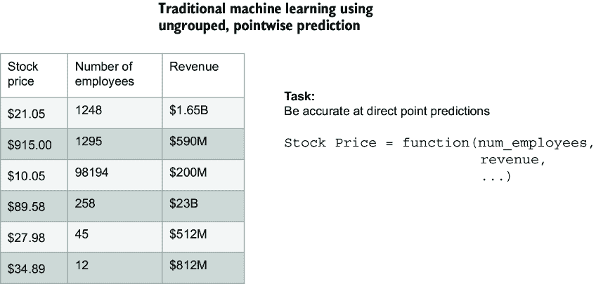
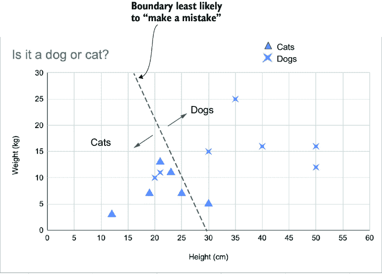
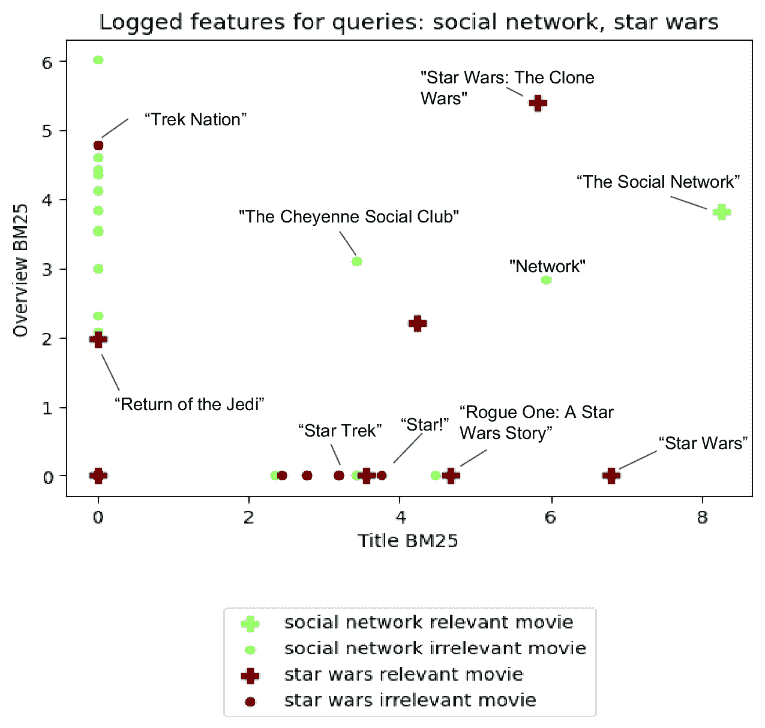
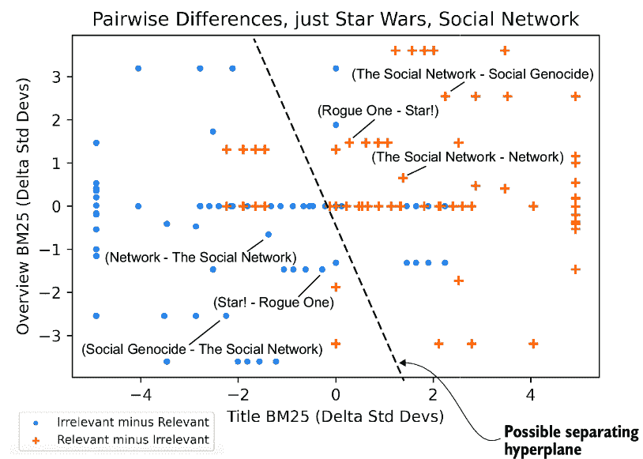
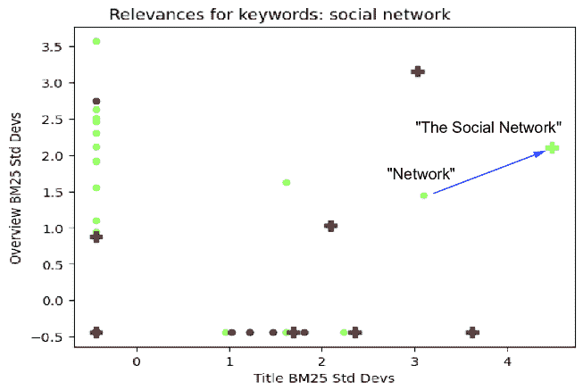
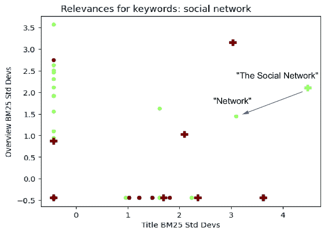

# 第十章：为可推广的搜索相关性学习排名

### 本章涵盖

+   机器学习排名简介，也称为学习排名（LTR）

+   LTR 与其他机器学习方法的区别

+   训练和部署排名分类器

+   特征工程、判断列表以及将机器学习排名模型集成到搜索引擎中

+   使用训练/测试分割验证 LTR 模型

+   基于 LTR 的排名模型的性能权衡

今天是个随意的星期二。你回顾了你的搜索日志，搜索内容从沮丧的跑者的`polar m430 运动手表充电器`查询，到担忧的疑病症患者的`鼻子上的奇怪肿块` `-` `癌症？`，再到好奇的电影爱好者的`william shatner` `第一部电影`。即使这些可能只是一次性的查询，你知道每个用户都期望得到不亚于惊人的搜索结果。

你感到绝望。你知道许多查询字符串本身就很罕见。你几乎没有点击数据来了解这些搜索的相关性。每一天都变得更加具有挑战性：趋势、用例、产品、用户界面，甚至用户术语都在不断演变。当用户似乎不断以新的搜索方式让我们感到惊讶时，任何人如何希望构建令人惊叹的搜索呢？

不要绝望，还有希望！在本章中，我们将介绍可推广的相关性模型。这些模型学习驱动相关性排名的潜在模式。我们不再需要记住标题为“Zits：鼻子上的肿块”的文章是针对查询`weird bump on nose - cancer？`的答案，我们观察到潜在的规律——一个强有力的标题匹配对应着高相关性的可能性。如果我们能够学习这些模式并将它们编码到模型中，我们就可以为*我们从未见过的搜索查询*提供相关结果。

本章探讨了*学习排名* (LTR)：一种使用机器学习来创建可推广的相关性排名模型的技巧。我们将使用搜索引擎准备、训练和搜索 LTR 模型。

## 10.1 什么是 LTR？

让我们探索 LTR 做了什么。我们将看到 LTR 如何通过寻找预测相关性的模式来创建可推广的排名模型。然后我们将探索构建模型的更多细节。

### 10.1.1 超越手动相关性调整

回顾第三章中的手动相关性调整。我们观察到与相关结果相对应的因素，并将这些因素通过数学方法组合成一个*排名函数*。排名函数返回一个相关性分数，将结果尽可能紧密地排序到我们的理想排名。

例如，考虑一个包含以下列表中文档的电影搜索引擎。这份文档来自 TheMovieDB (tmdb)语料库([`themoviedb.org`](http://themoviedb.org))，我们将在本章中使用它。如果你希望跟随本章的代码，请使用本章的第一个笔记本来索引 tmdb 数据集。

##### 列表 10.1 电影《社交网络》的文档

```py
{"title": ["The Social Network"],
 "overview": ["On a fall night in 2003, Harvard undergrad and computer
   ↪programming genius Mark Zuckerberg sits down at his computer and
   ↪heatedly begins working on a new idea. In a fury of blogging and
   ↪programming, what begins in his dorm room as a small site among
   ↪friends soon becomes a global social network and a revolution in
   ↪communication. A mere six years and 500 million friends later,
   ↪Mark Zuckerberg is the youngest billionaire in history... but for
   ↪this entrepreneur, success leads to both personal and legal
   ↪complications."],
 "tagline": ["You don't get to 500 million friends without making a few
   ↪enemies."],
 "release_year": 2010}
```

通过无数次的迭代和调整，我们可能得到一个通用的电影排名函数，其外观可能类似于下一个列表。

##### 列表 10.2 使用手动提升的通用排名函数

```py
keywords = "some example keywords"
{"query": f"title:({keywords})¹⁰ overview:({keywords})²⁰
↪{!func}release_year⁰.01"}
```

手动优化此类通用排名函数的特征权重以适用于许多查询可能需要大量的努力，但此类优化非常适合机器学习。

这就是 LTR 发挥作用的地方——它从我们提出的相关性因素中学习一个最佳排名函数。LTR 可以采取多种形式，从一组简单的线性权重（如这里的提升）到复杂的深度学习模型。

为了学习基础知识，我们将在本章构建一个简单的 LTR 模型。我们将找到评分函数中`title`、`overview`和`release_year`的最佳权重，如列表 10.2 中的函数。通过这个相对简单的任务，我们将看到开发 LTR 解决方案的完整生命周期。

### 10.1.2 在现实世界中实现 LTR

随着我们继续从高层次定义 LTR，让我们快速明确 LTR 在搜索系统整体图景中的位置。然后我们可以看看我们需要构建 LTR 模型所需的数据类型。

我们将专注于构建适用于生产搜索系统的 LTR，这可能与研究环境大不相同。我们不仅需要相关的结果，还需要以主流、易于理解的技术快速返回结果。

从概念上讲，调用 LTR 通常涉及三个高级步骤：

1.  训练一个 LTR 模型

1.  将模型部署到生产环境

1.  使用模型对搜索结果进行排序（或重新排序）

大多数现代搜索引擎支持直接将排名模型部署到搜索引擎中，允许 LTR 模型在“数据所在之处”高效地被调用。通常，LTR 模型在排序方面比基于基本关键词的排名函数（如 BM25）慢得多，因此 LTR 模型通常仅用于对初始、更快的排名函数排序的顶级搜索结果子集的后续排序（或重新排序）。将 LTR 模型推入引擎（如果支持）可以防止需要从搜索引擎返回数百或数千个文档及其元数据到外部模型服务进行重新排序，这相对于在引擎内和大规模上工作可能会慢且效率低下。

因此，在本章中，我们的`ltr`库实现了对部署和调用每个支持的搜索引擎或向量数据库的本地 LTR 模型集成功能的可插拔支持，当这些功能可用时。每个列表中的代码将与任何支持的引擎一起工作（参见附录 B 进行更改），但本章中您将看到的列表输出将反映 Solr 的 LTR 实现，因为 Solr 默认配置。如果您更改引擎，当您运行 Jupyter 笔记本时，您将看到您选择的引擎的输出。

Solr 是第一个原生支持 LTR 模型服务的开源搜索引擎之一，后来这些功能被移植到社区开发的 Elasticsearch LTR 插件（[`github.com/o19s/elasticsearch-learning-to-rank`](https://github.com/o19s/elasticsearch-learning-to-rank)）中，然后被分叉到 OpenSearch LTR 插件（[`github.com/opensearch-project/opensearch-learning-to-rank-base`](https://github.com/opensearch-project/opensearch-learning-to-rank-base)）。因此，Elasticsearch 和 OpenSearch LTR 插件在概念上几乎与 Solr 中的相同。Vespa 实现了分阶段排名（重排名）和在每个阶段调用模型的能力，而 Weaviate 也实现了各种重排名功能。其他支持原生 LTR 的引擎将遵循类似的模式。

图 10.1 概述了开发实用 LTR 解决方案的工作流程。


##### 图 10.1 LTR 系统将我们的训练数据（判断列表）转换为泛化相关性排名的模型。这类系统使我们能够找到训练数据中的潜在模式。

你可能会注意到 LTR 与传统基于机器学习的分类或回归系统工作流程之间的相似之处。但正是这些例外让它变得有趣。表 10.1 将传统机器学习目标与 LTR 之间的定义进行了映射。

##### 表 10.1 传统机器学习与 LTR

| 概念 | 传统机器学习 | LTR |
| --- | --- | --- |
| 训练数据 | 模型应尝试预测的历史或“真实”示例集，例如，过去某天的股票价格，如“苹果”在 2021 年 6 月 6 日的价格为 125 美元。 | *判断列表*：一个*判断*简单地标记一个文档对于查询的相关性或非相关性。在图 10.2 中，“星球大战”被标记为相关（`grade`为`1`），针对查询`star wars`。 |
| 特征 | 我们可以用来预测训练数据的资料，例如，苹果公司在 2021 年有 147,000 名员工，收入为 900 亿美元。 | 用于使相关结果比不相关结果排名更高的数据，理想情况下，搜索引擎可以快速计算的价值。我们的特征是来自列表 10.2 的搜索查询，如`title:({keywords})`。 |
| 模型 | 输入特征以进行预测的算法。鉴于苹果公司在 2021 年 7 月 6 日有 157,000 名员工，收入为 950 亿美元，该模型可能会预测该日期的股价为 135 美元。 | 将排名特征（搜索查询）组合起来，为每个潜在搜索结果分配一个相关性*分数*。结果按分数降序排列，希望将更相关的结果排在前面。 |

本章遵循图 10.1 中的步骤来训练一个 LTR 模型：

1.  *收集判断*—我们从点击或其他来源中推导出判断。我们将在第十一章中深入探讨这一步骤。

1.  *特征记录*——为了训练一个模型，我们必须将判断与特征结合起来，以查看整体模式。这一步骤需要我们要求搜索引擎存储和计算代表特征的查询。

1.  *转换为传统的机器学习问题*——你会发现，大多数 LTR 实际上是将排名任务转换为类似于表 10.1 中“传统机器学习”列的东西。

1.  *训练和评估模型*——在这里，我们构建我们的模型，并确认它确实是可泛化的，因此对于它尚未看到的查询将表现良好。

1.  *存储模型*——我们将模型上传到我们的搜索基础设施，告诉搜索引擎哪些特征作为输入使用，并启用用户在他们的搜索中使用它。

1.  *使用模型进行搜索*——我们终于可以使用模型进行搜索了！

本章的其余部分将详细介绍这些步骤，以构建我们的第一个 LTR 实现。让我们开始吧！

## 10.2 步骤 1：判断列表，从训练数据开始

你已经从高层次了解了 LTR 是什么，那么让我们深入了解。在实现 LTR 之前，我们首先必须了解用于训练 LTR 模型的训练数据：判断列表。

*判断列表*是一系列相关性标签或评分，每个标签都指示一个文档与查询的相关性。评分可以有多种形式。目前，我们将坚持简单的*二元判断*——`0`表示无关文档，而`1`表示相关文档。

使用本书代码提供的`Judgment`类，我们将通过创建一个`Judgment`将《社交网络》标记为`social network`查询的相关：

```py
from ltr.judgments import Judgment
Judgment(grade=1, keywords="social network", doc_id=37799)
```

查看多个查询更有趣。在列表 10.3 中，我们将`social network`和`star wars`作为两个不同的查询，对电影进行相关或不相关的评分。

##### 列表 10.3 标记电影判断为相关或不相关

```py
sample_judgments = [
  # for 'social network' query
  Judgment(1, "social network", 37799),  # The Social Network
  Judgment(0, "social network", 267752), # #chicagoGirl
  Judgment(0, "social network", 38408),  # Life As We Know It
  Judgment(0, "social network", 28303),  # The Cheyenne Social Club

  # for 'star wars' query
  Judgment(1, "star wars", 11),     # Star Wars
  Judgment(1, "star wars", 1892),   # Return of the Jedi
  Judgment(0, "star wars", 54138),  # Star Trek Into Darkness
  Judgment(0, "star wars", 85783),  # The Star
  Judgment(0, "star wars", 325553)  # Battlestar Galactica
]
```

你可以看到，我们将《星际迷航：暗黑无界》和《星际迷航：银河系漫游指南》标记为与查询`star wars`无关，但将《星球大战：绝地归来》标记为相关。

你可能想知道“这些评分是从哪里来的？”是由电影专家手工标记的吗？基于用户点击的吗？好问题！基于用户与搜索结果交互创建一个好的训练集对于 LTR 良好工作至关重要。为了大量获取训练数据，我们通常使用一种称为*点击模型*的算法从点击流量中提取这些标签。由于这一步骤非常基础，我们将用整个第十一章深入探讨这个主题。然而，在这一章中，我们将从手动标记的判断开始，以便我们最初可以专注于 LTR 的机制。

每个判断还有一个`features`向量，可以用来训练模型。`features`向量的第一个特征可以对应于`title` BM25 得分，第二个对应于`overview` BM25 得分，依此类推。我们还没有填充`features`向量，所以如果您检查`sample_judgments[0].features`，它目前是空的（`[]`）。

让我们使用搜索引擎来收集一些特征。

## 10.3 步骤 2：特征记录和工程

特征工程需要识别文档属性和相关性之间的模式。例如，我们可能会假设“我们判断中的相关结果对应于强大的标题匹配”。在这种情况下，“标题匹配”将是我们需要定义的特征。在本节中，您将了解什么是特征（如“标题匹配”），以及如何使用现代搜索引擎从语料库中构建和提取这些特征。

对于 LTR 的目的，一个**特征**是文档、查询或查询-文档关系的某些数值属性。特征是我们用来构建排名函数的数学构建块。您已经看到了一个带有特征的手动排名函数，如列表 10.2 中的关键字得分在`title`字段中就是一个这样的特征，同样还有`release_year`和`overview`关键字得分：

```py
{"query": f"title:({keywords})¹⁰ overview:({keywords})²⁰
↪{!func}release_year⁰.01"}
```

当然，你最终使用的功能可能更复杂或更具有领域特定性，例如在求职中通勤的距离，或者查询与文档之间的某些知识图谱关系。当用户搜索时，任何可以相对快速计算的内容都可能是一个合理的特征。

**特征记录**从判断列表中计算每个标记的查询-文档对的特征。如果我们为查询`social network`计算列表 10.2 中每个组件的值，我们就会得到类似于表 10.2 的内容。

##### 表 10.2 为关键词`social network`记录的相关（`grade=1`）和不相关（`grade=0`）文档的特征

| 等级 | 电影 | **`title:({keywords})`** | **`overview: ({keywords})`** | **`{!func}release_year`** |
| --- | --- | --- | --- | --- |
| 1  | Social Network  | 8.243603  | 3.8143613  | 2010.0  |
| 0  | #chicagoGirl  | 0.0  | 6.0172443  | 2013.0  |
| 0  | Life As We Know It  | 0.0  | 4.353118  | 2010.0  |
| 0  | The Cheyenne Social Club  | 3.4286604  | 3.1086721  | 1970.0  |

机器学习算法可能会检查表 10.2 中的特征值，并收敛到一个好的排名函数。仅从表 10.2 中的数据来看，这样的算法可能会产生一个对`title`特征赋予更高权重而对其他特征赋予更低权重的排名函数。

然而，在我们到达算法之前，我们需要检查生产搜索系统中的特征记录工作流程。

### 10.3.1 在现代搜索引擎中存储特征

支持 LTR 的现代搜索引擎帮助我们存储、管理和提取特征。像 Solr、Elasticsearch 和 OpenSearch 这样的引擎在*特征存储*中跟踪特征——一个命名特征的列表。我们以与搜索引擎执行模型一致的方式记录用于训练的特征至关重要。

如列表 10.4 所示，我们生成并上传特征到搜索引擎。我们在本书的代码库中使用通用的特征存储抽象，允许我们生成各种基于搜索的特征，并将它们作为*特征集*上传到支持搜索引擎的特征存储。在这里，我们创建了三个特征：标题字段的相关度分数`title_bm25`、概述字段的相关度分数`overview_bm25`以及`release_year`字段的值。这里的 BM25 对应于第三章中定义的基于 BM25 的评分，这将成为我们在文本字段中评分词匹配的默认方法。

##### 列表 10.4 创建 LTR 的三个特征

```py
feature_set = [
  ltr.generate_query_feature(feature_name="title_bm25",
                             field_name="title"),
  ltr.generate_query_feature(feature_name="overview_bm25",
                             field_name="overview"),
  ltr.generate_field_value_feature(feature_name="release_year",
                                   field_name="release_year")]

ltr.upload_features(features=feature_set, model_name="movie_model")
display(feature_set)
```

特定于引擎的特征集定义（对于`engine=solr`）：

```py
[{"name": "title_bm25",  #1
  "store": "movies",  #2
  "class": "org.apache.solr.ltr.feature.SolrFeature",
  "params": {"q": "title:(${keywords})"}},  #3
 {"name": "overview_bm25", #4
  "store": "movies",
  "class": "org.apache.solr.ltr.feature.SolrFeature",
  "params": {"q": "overview:(${keywords})"}},
 {"name": "release_year", #5
  "store": "movies",
  "class": "org.apache.solr.ltr.feature.SolrFeature",
  "params": {"q": "{!func}release_year"}}]  #6
```

#1 特征的名称

#2 将特征保存到特征存储

#3 一个参数化特征，接受关键词（例如，星球大战）并搜索标题字段

#4 另一个针对概述字段进行搜索的特征

#5 仅文档特征，电影的发布年份

#6 params 是与 Solr 查询相同的参数，允许您使用 Solr 广泛的查询 DSL 的全部功能来构建特征。

列表 10.4 的输出显示了上传到搜索引擎的特征集——在本例中，是一个 Solr 特征集。根据你配置的搜索引擎实现（如附录 B 所述），此输出将明显不同。前两个特征是参数化的：它们各自接受搜索关键词（例如，“社交网络”、“星球大战”）并在相应的字段上执行搜索。最后一个是一个利用电影发布年份的字段值特征，这将使较新的电影排名更高。

### 10.3.2 从我们的搜索引擎语料库记录特征

在将特征加载到搜索引擎后，我们的下一个重点是记录我们判断列表中每一行的特征。在我们完成最后一部分管道之后，我们将训练一个模型，该模型可以观察每个查询中每个相关和不相关文档之间的关系。

对于我们判断列表中的每个唯一查询，我们需要提取查询评分文档的特征。对于列表 10.3 中样本判断列表中的查询“社交网络”，我们有一个相关文档（37799）和三个不相关文档（267752、38408 和 28303）。

下面的列表显示了查询“社交网络”的特征记录示例。

##### 列表 10.5 记录“社交网络”结果的特征值

```py
ids = ["37799", "267752", "38408", "28303"]  #1
options = {"keywords": "social network"}
ltr.get_logged_features("movie_model", ids,  #2
                        options=options, )  #2
                        fields=["id", "title"])  #2
display(response)
```

#1 “社交网络”查询的相关和不相关文档

#2 查询包含在电影特征存储中的特征值

特定于引擎的搜索请求（对于`engine=solr`）：

```py
{"query": "{!terms f=id}37799,267752,38408,28303",
 "fields": ["id", "title",
   '[features store=movies efi.keywords="social network"]']}  #1
```

#1 示例 Solr 查询语法，用于从每个返回的文档中检索特征值

带有日志特征的文档：

```py
[{"id": "37799",
  "title": "The Social Network",
  "[features]": {"title_bm25": 8.243603, #1
                 "overview_bm25": 3.8143613,  #1
                 "release_year": 2010.0}},  #1
 {"id": "267752",
  "title": "#chicagoGirl",
  "[features]": {"title_bm25": 0.0,
                 "overview_bm25": 6.0172443,
                 "release_year": 2013.0}},
 {"id": "38408",
  "title": "Life As We Know It",
  "[features]": {"title_bm25": 0.0,
                 "overview_bm25": 4.353118,
                 "release_year": 2010.0}},
 {"id": "28303",
  "title": "The Cheyenne Social Club",
  "[features]": {"title_bm25": 3.4286604,
                 "overview_bm25": 3.1086721,
                 "release_year": 1970.0}}]
```

#1 为“社交网络”查询记录的此电影的特征值

注意到列表 10.5 中的搜索请求（在本例中为 Solr）包含一个包含方括号的返回字段。这种语法告诉 Solr 在每份文档上返回一个额外的字段，包含特征存储库中定义的特征数据（在本例中为`movies`特征存储库）。`efi`参数代表*外部特征信息*，它在这里用于传递关键字查询（`social network`）以及计算每个特征所需的任何附加查询时间信息。响应包含四个请求的文档及其相应的特征。这些参数对于每个搜索引擎都不同，但概念将是相似的。

通过一些平凡的 Python 数据转换，我们可以从响应中填充训练集中查询`social network`的特征。在列表 10.6 中，我们将特征数据应用于查询`social network`的判断：

##### 列表 10.6 对于查询`social network`的带有日志特征的判断

```py
[Judgment(grade=1, keywords="social network", doc_id=37799, qid=1,
          features=[8.243603, 3.8143613, 2010.0], weight=1),  #1
 Judgment(0, "social network", 267752, 1, [0.0, 6.0172443, 2013.0], 1),
 Judgment(0, "social network", 38408, 1, [0.0, 4.353118, 2010.0],1), #2
 Judgment(0, "social network", 28303, 1, [3.4286604, 3.1086721, 1970.0], 1)]
```

#1 与“社交网络”查询相关的电影《社交网络》的判断，包括日志特征值

#2 对于“社交网络”查询的不相关文档（注意第一个特征值的低值，标题 BM25 得分为 0.0）

在列表 10.6 中，正如我们可能预期的，第一个特征值对应于我们特征存储库中的第一个特征（`title_bm25`），第二个值对应于我们特征存储库中的第二个特征（`overview_bm25`），依此类推。让我们重复对查询`star wars`的判断进行特征日志记录的过程。

##### 列表 10.7 对于查询`star wars`的日志判断

```py
[Judgment(1, "star wars", 11, 2, [6.7963624, 0.0, 1977.0], 1),
 Judgment(1, "star wars", 1892, 2, [0.0, 1.9681965, 1983.0], 1),
 Judgment(0, "star wars", 54138, 2, [2.444128, 0.0, 2013.0], 1),
 Judgment(0, "star wars", 85783, 2, [3.1871135, 0.0, 1952.0], 1),
 Judgment(0, "star wars", 325553, 2, [0.0, 0.0, 2003.0], 1)]
```

通过生成日志判断的能力，让我们将判断列表扩展到大约一百个电影查询，每个查询大约有 40 部电影被标记为相关/不相关。加载和记录这个更大训练集特征的代码基本上重复了列表 10.5 中显示的搜索引擎请求。特征记录的最终结果看起来就像列表 10.7，但来自一个更大的判断列表。

接下来，我们将考虑如何将排名问题作为一个机器学习问题来处理。

## 10.4 步骤 3：将 LTR 转换为传统机器学习问题

在本节中，我们将探讨将排名作为一个机器学习问题。这将帮助我们理解如何将众所周知的传统机器学习概念应用于我们的 LTR 任务。

LTR 的任务是在许多相关和不相关的训练示例中查找查询，然后构建一个模型，将更多相关文档置于顶部（反之，将不太相关的文档推到底部）。每个训练示例本身并没有多少价值；重要的是它在查询中与同侪的排序。图 10.2 展示了这个任务，有两个查询。目标是找到一个评分函数，可以使用特征来正确排序结果。


##### 图 10.2 LTR 是关于将每个查询的结果集放置在理想顺序中，而不是关于预测单个相关性等级。这意味着我们需要将每个查询视为一个独立的案例。

将 LTR 与一个更传统的点 wise 机器学习任务进行对比：例如，预测公司在表 10.2 中提到的股价。*Pointwise 机器学习*意味着我们可以独立评估模型在每个示例上的准确性，预测其绝对值而不是与其他示例的相对值。仅通过观察一家公司，我们就能知道我们预测该公司股价的准确性。将图 10.3 显示的点 wise 任务与图 10.2 进行比较。注意在图 10.3 中，学习到的函数试图直接预测股价，而 LTR 中，函数的输出仅对查询中相对于其同侪的排序有意义。



##### 图 10.3 Pointwise 机器学习试图优化单个点（如股价或温度）的预测。搜索相关性是一个与点 wise 预测不同的问题。相反，我们需要优化由搜索查询分组的示例的排序。

LTR 的目标与 pointwise 机器学习（预测结果的具体值）非常不同（对多个结果进行排序）。大多数 LTR 方法使用巧妙的炼金术将这个“成对排序”任务转化为每个文档的分类任务，该任务学习预测哪些特征和特征权重最能区分“相关”文档和“不相关”文档。这种转换是构建一个可推广的 LTR 模型的关键，该模型可以针对特定文档操作，而不仅仅是文档对。我们将在下一节通过探索一个名为 SVMrank 的流行 LTR 模型来查看一个模型转换排序任务的方法。

### 10.4.1 SVMrank：将排序转换为二元分类

LTR 的核心是模型：学习相关性/非相关性与`title_bm25`、`overview_bm25`等特征之间关系的实际算法。在本节中，我们将探讨这样一个模型，SVMrank，首先了解“SVM”代表什么，然后了解它如何被用来构建一个优秀且可推广的 LTR 模型。

SVMrank 将相关性转化为二元分类问题。**二元分类**简单地说就是使用可用特征将项目分类为两个类别之一（如“相关”与“不相关”，“成人”与“儿童”，“狗”与“猫”）。

**支持向量机**或**支持向量机**是执行二元分类的一种方法。我们不会深入探讨支持向量机，因为您不需要成为机器学习专家就能理解讨论。不过，如果您想对支持向量机有一个更深入的了解，您可以查阅 Luis Serrano 所著的《Grokking Machine Learning》（Manning, 2021）一书。

直观地说，支持向量机（SVM）寻找最佳、最通用的超平面来在两类之间绘制。一个**超平面**是一个将向量空间分成两部分的边界。一个一维点可以是一个将二维线分成两部分的超平面，就像一条线可以是一个将三维空间分成两部分的超平面。一个平面通常是一个将四维空间分开的三维边界。所有这些，以及甚至超过三维的边界，通常统称为超平面。

例如，如果我们试图构建一个预测动物是狗还是猫的模型，我们可能会查看已知狗或猫的高度和重量的二维图，并绘制一条线来分隔这两类，如图 10.4 所示。



##### 图 10.4 SVM 示例：动物是狗还是猫？这个超平面（这里的线）根据两个特征：高度和重量，将这两个案例分开。很快你就会看到我们如何可能做到类似的事情，以分隔查询的相关和不相关搜索结果。

在类别之间绘制的良好分离超平面试图最小化它在分类训练数据时犯的错误（猫一边的狗少，反之亦然）。我们还希望一个**可泛化**的超平面，这意味着它可能会很好地对训练期间未看到的动物进行分类。毕竟，如果一个模型不能对新数据进行预测，那它有什么用呢？它不会很有 AI 能力！

关于支持向量机（SVMs）的另一个细节是，它们可能对我们的特征范围敏感。例如，想象一下，如果`高度`特征是毫米而不是厘米，就像图 10.5 中那样，它迫使数据在*x*轴上拉伸，分离超平面看起来相当不同！


##### 图 10.5 受一个特征范围影响的分离超平面。这导致支持向量机（SVMs）对特征的范围敏感，因此我们需要对特征进行归一化，以便一个特征不会对模型产生不适当的影响。

SVM 在数据归一化时表现最佳。*归一化*只是将特征缩放到一个可比较的范围。我们将通过将`0`映射到特征值的平均值来归一化我们的数据。如果平均`release_year`是`1990`，那么在`1990`发布的电影将归一化为`0`。我们还将`+1`和`-1`映射到平均值以上或以下的一个标准差。所以如果电影发布年份的标准差是 22 年，那么在 2012 年的电影将变成`1.0`；在 1968 年的电影将变成`-1.0`。我们可以使用训练数据中这些特征的均值和标准差对`title_bm25`和`overview_bm25`重复此操作。这有助于在寻找分离超平面时使特征更具有可比性。

在简要介绍背景之后，现在让我们探索 SVMrank 如何创建一个可推广的模型来区分相关和不相关的文档，即使对于它以前从未见过的查询。

### 10.4.2 将我们的 LTR 训练任务转换为二进制分类

在 LTR 中，我们必须将任务从排序重新定位为一个传统的机器学习任务。在本节中，我们将探索 SVMrank 如何将排序转换为适合 SVM 的二进制分类任务。

在我们开始之前，让我们检查从步骤 2 的末尾开始的完整日志训练集，针对我们最喜欢的两个查询`star` `wars`和`social` `network`。在本节中，我们将只关注两个特征（`title_bm25`和`overview_bm25`），以帮助我们通过图形探索特征之间的关系。图 10.6 显示了针对`star` `wars`和`social` `network`查询的每个评分文档的这两个特征，并标记了训练集中的几个突出电影。



##### 图 10.6 `社交网络`和`星球大战`查询的日志特征分数

#### 首先，归一化 LTR 特征

我们的第一步是归一化每个特征。以下列表将步骤 2 的日志输出归一化到`normed_judgments`。

##### 列表 10.8 归一化日志 LTR 训练数据

```py
means, std_devs, normed_judgments = normalize_features(logged_judgments)
print(logged_judgments[360])
print(normed_judgments[360])
```

输出：

```py
#Judgment(grade, keywords, doc_id,
#         qid, features, weight)
Judgment(1, "social network", 37799,  #1
         11, [8.244, 3.814, 2010.0], 1)  #1
Judgment(1, "social network", 37799,  #2
         11, [4.483, 2.100, 0.835], 1)  #2
```

#1 未归一化的示例，包含原始的 title_bm25、overview_bm25 和 release_year

#2 相同的判断，但归一化

你可以看到，列表 10.8 的输出首先显示了标题和概述的日志 BM25 分数（`8.244`, `3.814`），以及发布年份（`2010`）。然后，这些特征被归一化，其中`title_bm25`的`8.244`对应于平均`title_bm25`以上的`4.483`个标准差，每个特征都是如此。

我们已经在图 10.7 中绘制了归一化的特征。这看起来与图 10.6 非常相似，只是每个轴的刻度不同。


##### 图 10.7 归一化的`星球大战`和`社交网络`评分电影。图中每一点的增量都是相对于平均值的正负一个标准差。

接下来，我们将把排序转换成一个二进制分类学习问题，以区分相关和不相关的结果。

#### 第二，计算成对差异

通过归一化数据，我们已强制特征保持一致的范围。现在我们的 SVM 不应受到具有非常大范围的特征的偏差。在本节中，我们将任务转换为二元分类问题，为我们训练模型做好准备。

SVMrank 使用成对转换将 LTR 重新表述为二元分类问题。*成对*简单来说就是将排序任务转化为最小化查询中顺序错误的成对。

在本节的其余部分，我们将仔细介绍 SVMrank 的成对算法，该算法在列表 10.9 中概述。SVMrank 算法对每个查询的每个判断进行比较，并与该查询的每个其他判断进行比较。它计算该查询中每个相关和不相关成对的特征差异（`feature_deltas`）。在添加到 `feature_deltas` 时，如果第一个判断比第二个判断更相关，则在 `predictor_deltas` 中标记为 `+1`。如果第一个判断不如第二个判断相关，则标记为 `-1`。这种成对转换算法产生了用于二元分类所需的训练数据（`feature_deltas` 和 `predictor_deltas`）。

##### 列表 10.9 将特征转换为 SVMrank 的成对数据

```py
for doc1_judgment in query_judgments:
  for doc2_judgment in query_judgments:
    j1_features = numpy.array(doc1_judgment.features)
    j2_features = numpy.array(doc2_judgment.features)

    if doc1_judgment.grade > doc2_judgment.grade:
      predictor_deltas.append(+1)  #1
      feature_deltas.append(j1_features -  #2
                            j2_features)  #2
    elif doc1_judgment.grade < doc2_judgment.grade: 
      predictor_deltas.append(-1)  #3
      feature_deltas.append(j1_features - #4
                            j2_features)  #4
```

#1 如果 doc1 比 doc2 更相关，则存储标签为 +1。

#2 存储特征差值

#3 如果 doc1 比 doc2 不相关，则存储标签为 -1。

#4 存储特征差值

图 10.8 绘制了成对差异并突出了重要点。



##### 图 10.8 展示了 SVMrank 对 `social` `network` 和 `star wars` 文档的转换后的成对差异，以及一个候选分离超平面。

你会注意到正的成对差值（+）倾向于向上右方。这意味着相关文档的 `title_bm25` 和 `overview_bm25` 与无关文档相比更高。

这需要很多消化！让我们仔细地一步一步地通过几个例子，看看这个算法是如何在图 10.9 中构建数据点的。这个算法比较每个查询的相关和不相关文档，比较查询 `social network` 中的两个文档（*Network* 和 *The Social Network*），如图 10.9 所示。



##### 图 10.9 比较 `social` `network` 查询中的 `Network` 与 `The Social Network`

这些是《社交网络》的特征：

```py
#[title_bm25, overview_bm25]  #1
[4.483, 2.100]  #1
```

#1 title_bm25 的均值高于标准差 4.483，而 overview_bm25 的均值高于标准差 2.100。

这些是《网络》的特征：

```py
#[title_bm25, overview_bm25]  #1
[3.101, 1.443]  #1
```

#1 title_bm25 的均值高于标准差 3.101，而 overview_bm25 的均值高于标准差 1.443。

我们随后将《社交网络》与《网络》之间的差值插入到下面的列表中。

##### 列表 10.10 计算并存储特征差值

```py
predictor_deltas.append(+1)
feature_deltas.append([4.483, 2.100] - [3.101, 1.443]) #1
```

#1 将 [1.382, 0.657] 添加到 feature_deltas

为了重申列表 10.10，我们可以说，这里有一个例子，即电影《社交网络》，对于这个查询`social network`比电影《网络》更相关。有趣！让我们看看它们有什么不同。当然，数学中的“差异”意味着减法，我们在这里会这样做。是的，在取差之后，我们看到`The Social Network`的`title_bm25`比`Network`的`title_bm25`高 1.382 个标准差；同样，`overview_bm25`高 0.657 个标准差。确实，注意图 10.8 中显示的`The Social Network`减去`Network`的`+`号，在变化量中点 `[1.382, 0.657]`。

算法还会注意到，对于查询`social network`，`Network`不如`The Social Network`相关，如图 10.10 所示。



##### 图 10.10 比较查询`social network`下的《网络》与《社交网络》

正如列表 10.9 中所示，我们的代码捕捉了这两个文档之间的相关性差异，但这次是在相反的方向（不相关减去相关）。因此，我们看到相同的值并不奇怪，但它们是负值。

```py
predictor_deltas.append(-1)
feature_deltas.append([3.101, 1.443] - [4.483, 2.100])  #1
```

#1 计算结果为[–1.382, –0.657]

在图 10.11 中，我们继续对两个与查询`social network`相关的文档进行相关-不相关比较，并将另一个比较添加到新的训练集中。

列表 10.11 显示了在图 10.11 中比较的突出显示的文档对中，添加了正变化量（更相关的文档排在前面）和负变化量（不那么相关的文档排在前面）。

##### 列表 10.11 添加正负变化量

```py
# Positive example
predictor_deltas.append(+1)
feature_deltas.append([4.483, 2.100] - [2.234, -0.444])  #1

# Negative example
predictor_deltas.append(-1)
feature_deltas.append([2.234, -0.444] - [4.483, 2.100])  #2
```

#1 计算结果为[2.249, 2.544]

#2 计算结果为[–2.249, –2.544]


##### 图 10.11 比较查询`social network`下的《社会大屠杀》与《社交网络》

一旦我们迭代通过匹配查询`social network`的每对文档之间的差异以创建点训练集，我们就可以继续记录其他查询的差异。图 10.12 显示了第二个查询的差异，这次比较的是匹配查询`star wars`的文档的相关性。


##### 图 10.12 比较查询`star wars`下的《侠盗一号：星球大战外传》与《星！》。我们已经从`social network`转向了另一个查询，并开始研究另一个查询中的模式。

```py
# Positive example
predictor_deltas.append(+1)
feature_deltas.append([2.088, 1.024] - [1.808, -0.444])  #1

# Negative example
predictor_deltas.append(-1)
feature_deltas.append([1.808, -0.444] - [2.088, 1.024])  #2
```

#1 《侠盗一号》特色减去《星！》特色

#2 《星！》特色减去《侠盗一号》特色

我们继续这个过程，计算相关和不相关文档的特征值之间的差异，直到我们计算出所有训练和测试查询的成对差异。

你可以在图 10.8 中看到，正例显示了正的`title_bm25`变化量，可能还有略微正的`overview_bm25`变化量。如果我们计算 100 个查询的全数据集的变化量，如图 10.13 所示，这会变得更加清晰。


##### 图 10.13 完整训练集与分离相关和无关文档的超平面。我们看到一个模式！相关文档的`title_bm25`更高，也许`overview_bm25`也略有提高。

有趣的是，现在很容易直观地识别出更大的`title_bm25`分数匹配与文档对查询的相关性高度相关，并且拥有更高的`overview_bm25`分数至少在一定程度上是正相关的。

现在值得退一步思考，看看这种排名公式的形式是否适合你的领域。不同的 LTR 模型都有自己的方法，将成对比较映射到所需的分类问题。作为另一个例子，LambdaMART——一种基于提升树的流行 LTR 算法——使用成对交换并测量**折算累积增益**（DCG）的变化。

接下来，我们将训练一个鲁棒的模型来捕捉我们完全转换后的排名数据集中的模式。

## 10.5 步骤 4：训练（和测试！）模型

良好的机器学习显然需要大量的数据准备。幸运的是，你已经到达了实际训练模型的章节！有了上一节中的`feature_deltas`和`predictor_deltas`，我们现在有一个适合训练排名分类器的训练集。这个模型将使我们能够预测文档何时可能相关，即使对于它尚未见过的查询和文档。

### 10.5.1 将分离超平面的向量转换为评分函数

我们已经看到了 SVMrank 的分离超平面如何将无关的例子与相关的例子区分开来。这很有用，但你可能还记得，我们的任务是找到我们特征的**最优**权重，而不仅仅是分类文档。因此，让我们看看我们如何使用这个超平面来**评分**搜索结果。

结果表明，分离超平面也为我们提供了学习最优权重所需的东西。任何超平面都是由垂直于平面的向量定义的。因此，当 SVM 机器学习库执行其工作时，它给我们一个感觉，即每个特征应该有的权重，如图 10.14 所示。


##### 图 10.14 完整训练集与候选分离超平面，显示定义超平面的正交向量。

考虑一下这个正交向量代表什么。这个向量指向相关性的方向！它说相关例子是这样的，无关的例子在相反的方向。这个向量**肯定**指向`title_bm25`对相关性有强烈的影响，同时`overview_bm25`有一些较小的影响。这个向量可能类似于：

```py
[0.65, 0.40]
```

我们使用列表 10.9 中的成对转换算法来计算执行无关和相关信息分类所需的 delta 值。如果我们在这个数据上训练一个 SVM，如下面的列表所示，模型会给我们定义分离超平面的向量。

##### 列表 10.12 使用 scikit-learn 训练线性 SVM

```py
from sklearn import svm
model = svm.LinearSVC(max_iter=10000  #1
model.fit(feature_deltas, predictor_deltas)  #2
display(model.coef_) #3
```

#1 使用 sklearn 创建线性模型

#2 使用 SVM 对 delta 进行拟合

#3 定义分离超平面的向量

输出：

```py
array([0.40512169, 0.29006328, 0.14451715])
```

列表 10.12 训练一个 SVM 来分离`predictor_deltas`（记住它们是`+1`和`-1`），使用相应的`feature_deltas`（归一化`title_bm25`、`overview_bm25`和`release_year`特征中的 delta）。得到的模型是与分离超平面正交的向量。正如预期的那样，它对`title_bm25`有很强的权重，对`overview_bm25`有更适度的权重，对`release_year`的权重较弱。

### 10.5.2 对模型进行测试

这个模型作为排名函数是如何工作的？假设用户输入查询`wrath of khan`。这个模型会如何对这个查询的文档`星际迷航 II：怒火中烧`进行评分？未归一化的特征向量表明这个查询有很强的标题和概述匹配。

```py
[5.9217176, 3.401492, 1982.0] #1
```

#1 “星际迷航 II”的原始特征

归一化后，每个特征值是每个特征平均值的多少个标准差以上或以下：

```py
[3.099, 1.825, -0.568]  #1
```

#1 “星际迷航 II”的归一化特征

我们只是将每个归一化特征与其对应的`coef_`值相乘。将它们相加后，我们得到一个相关性分数：

```py
(3.099 * 0.405) + (1.825 * 0.290) + (-0.568 * 0.1445) = 1.702  #1
```

#1 “星际迷航 II”的相关性分数计算

这个模型会如何将“星际迷航 III：寻宝”相对于“星际迷航 II：怒火中烧”在我们的查询`wrath of khan`中的排名？希望不会太高！实际上，它并没有：

```py
[0.0, 0.0, 1984.0]  #1
[-0.432, -0.444, -0.468]  #2
(-0.432 * 0.405) + (-0.444 * 0.290) + (-0.468 * 0.1445) = -0.371  #3
```

#1 “星际迷航 III”的原始特征

#2 “星际迷航 III”的归一化特征

#3 计算“星际迷航 III”的相关性

该模型似乎正确地预测了最相关的答案。

### 10.5.3 验证模型

测试几个查询有助于我们发现问题，但我们更希望有一个更系统的方法来检查模型是否具有可推广性。

LTR 与传统机器学习之间的一个区别是，我们通常评估查询和整个结果集，而不是单个数据点，以证明我们的模型是有效的。我们将在查询级别进行测试/训练分割。这将使我们能够发现存在问题的查询类型。我们将使用简单的精确度指标进行评估，计算前*K*（在我们的案例中`k=5`）个结果中有多少是相关的。你应该选择最适合你自己的用例的相关性指标。

首先，我们将我们的查询随机放入测试集或训练集，如下所示。

##### 列表 10.13 在查询级别进行简单的测试/训练分割

```py
all_qids = list(set([j.qid for j in normed_judgments]))
random.shuffle(all_qids)  #1
proportion_train = 0.1  #1
  #1
split_idx = int(len(all_qids) * proportion_train)  #1
test_qids = all_qids[:split_index]  #2
train_qids = all_qids[split_index:]  #2

train_data = []; test_data=[]
for j in normed_judgments:
  if j.qid in train_qids:  #2
    train_data.append(j)  #2
  elif j.qid in test_qids:  #2
    test_data.append(j)  #2
```

#1 从中随机选择 10%的判断进入训练集

#2 将每个判断放入训练数据（10%）或测试集（90%）

将训练数据分割出来后，我们可以执行步骤 3 中的成对转换技巧。然后我们可以在仅使用训练数据的情况下重新训练。

##### 列表 10.14 仅使用训练数据进行训练

```py
train_data_features, train_data_predictors = pairwise_transform(train_data)

from sklearn import svm
model = svm.LinearSVC(max_iter=10000, verbose=1)
model.fit(train_data_features, train_data_predictors)  #1
display(model.coef_[0])
```

#1 仅适用于训练数据

输出：

```py
array([0.37486809, 0.28187458, 0.12097921])
```

到目前为止，我们保留了测试数据。就像一个好的老师一样，我们不想给学生所有答案。我们想看看模型是否学到了除了死记硬背训练示例之外的东西。

在下一个列表中，我们使用测试数据评估我们的模型。此代码遍历每个测试查询，并使用模型对每个测试判断进行排序。然后，它计算前四个判断的精确度。

##### 列表 10.15 我们的模型能否泛化到训练数据之外？

```py
def score_one(features, model):
  score = 0.0
  for idx, f in enumerate(features):
    this_coef = model.coef_[0][idx].item()
    score += f * this_coef
  return score

def rank(query_judgments, model):
  for j in query_judgments:
    j.score = score_one(j.features, model)
  return sorted(query_judgments, key=lambda j: j.score, reverse=True)

def evaluate_model(test_data, model, k=5):
  total_precision = 0
  unique_queries = groupby(test_data, lambda j: j.qid)
  num_groups = 0
  for qid, query_judgments in unique_queries: #1
    num_groups += 1
    ranked = rank(list(query_judgments), model)  #2
    total_relevant = len([j for j in ranked[:k]
                            if j.grade == 1])  #3
    total_precision += total_relevant / float(k)
  return total_precision / num_groups

evaluation = evaluate_model(test_data, model)
print(evaluation)
```

#1 对于每个测试查询

#2 使用模型对每个判断进行评分并排序此查询

#3 计算此查询的精确度

评估：

```py
0.36
```

在多次运行中，你应该期望精确度大约为 0.3–0.4。对于我们第一次迭代，只是猜测了几个特征（`title_bm25`、`overview_bm25` 和 `release_year`），这还不错！

在 LTR 中，你总是可以回顾之前的步骤，看看可能有哪些改进。这个精确度测试是我们第一次能够系统地评估我们的模型，因此这是一个自然的时间来回顾特征，看看在后续运行中精确度可能如何提高。一直回溯到步骤 2。看看哪些例子位于分离超平面的错误一侧。例如，如果你回顾图 10.8，第三部星球大战电影，《星球大战：绝地归来》，它符合一个相关文档的模式，标题中没有关键词匹配。在没有标题的情况下，可以添加哪些其他特征来帮助捕捉这部电影属于像星球大战这样的特定收藏？也许 TMDB 数据集中有一个我们可以实验的属性。

然而，现在让我们看看我们刚刚构建的模型，看看我们如何将其部署到生产环境中。

## 10.6 步骤 5 和 6：上传模型和搜索

在本节中，我们最终将上传我们的模型，以便它可以应用于对未来的搜索结果进行排名。然后，我们将讨论将模型应用于对所有文档进行排名，以及将其应用于重新排名一个已经运行且可能更有效的初始查询。最后，我们将讨论在生产中使用 LTR 模型的性能影响。

### 10.6.1 部署和使用 LTR 模型

最初，我们提出的目标是找到对硬编码的排名函数（如列表 10.2 中的函数）的 *理想* 提升值：

```py
{"query": f"title:({keywords})¹⁰ overview:({keywords})²⁰
↪{!func}release_year⁰.01"}
```

这个增强查询确实将每个特征乘以一个权重（增强）并将结果相加。但结果证明，我们不想让搜索引擎乘以 *原始* 特征值。相反，我们需要特征值进行归一化。

许多搜索引擎允许我们存储线性排名模型以及特征归一化统计信息。我们保存了每个特征的 `means` 和 `std_devs`，这些将被用于对任何正在评估的文档进行归一化。这些系数在上传模型时与每个特征相关联，如下一个列表所示。

##### 列表 10.16 生成和上传线性模型

```py
model_name = "movie_model"
feature_names = ["title_bm25", "overview_bm25", "release_year"]
linear_model = ltr.generate_model(model_name, feature_names,
                                  means, std_devs, model.coef_[0])
response = ltr.upload_model(linear_model)
display(linear_model)
```

生成的线性模型（对于 `engine=solr`）：

```py
{"store": "movies",  #1
 "class": "org.apache.solr.ltr.model.LinearModel",
 "name": "movie_model",
 "features": [
   {"name": "title_bm25",  #2
    "norm": {"class": "org.apache.solr.ltr.norm.StandardNormalizer", 
             "params": {"avg": "0.7245440735518126",  #3
                        "std": "1.6772600303613545"}}},  #3
   {"name": "overview_bm25",
    "norm": {"class": "org.apache.solr.ltr.norm.StandardNormalizer",
             "params": {"avg": "0.6662927508611409",
                        "std": "1.4990448120673643"}}},
   {"name": "release_year",
    "norm": {"class": "org.apache.solr.ltr.norm.StandardNormalizer",
             "params": {"avg": "1993.3349740932642",
                        "std": "19.964916628520722"}}}],
 "params": {
   "weights": {
     "title_bm25": 0.3748679655554891,  #4
     "overview_bm25": 0.28187459845467566,  #4
     "release_year": 0.12097924576841014}}}  #4
```

#1 特征存储以定位特征

#2 在评估此模型之前要执行哪个特征

#3 在应用权重之前如何归一化此特征

#4 模型中每个特征的权重

列表 10.16 中的`response`是 Solr 特定的，并且会根据您配置的搜索引擎而变化。接下来，我们可以使用上传的 LTR 模型发出搜索，如下面的列表所示。

##### 列表 10.17 使用 LTR 模型对`harry potter`进行所有文档排序

```py
request = {"query_fields": ["title", "overview"],
           "return_fields": ["title", "id", "score"],
           "rerank_query": "harry potter",
           "log": True}
response = ltr.search_with_model("movie_model", **request)
display(response["docs"])
```

特定于引擎的搜索请求（对于`engine=solr`）：

```py
{"fields": ["title", "id", "score"],
 "limit": 5,
 "query": "{!ltr reRankDocs=9999999  #1
 ↪model=movie_model efi.keywords=\"harry potter\"}"}
```

#1 使用指定参数在最大数量的文档上执行我们的模型

返回的文档：

```py
[{"id": "570724", "title": "The Story of Harry Potter", "score": 2.4261155},
 {"id": "116972", "title": "Discovering the Real World of Harry Potter",
  "score": 2.247846},
 {"id": "672", "title": "Harry Potter and the Chamber of Secrets",
  "score": 2.017499},
 {"id": "671", "title": "Harry Potter and the Philosopher's Stone",
  "score": 1.9944705},
 {"id": "54507", "title": "A Very Potter Musical",
  "score": 1.9833609}]
```

在列表 10.17 中，LTR 模型使用`rerank_query`参数中的关键词作为模型的输入，对所有语料库中的文档进行排序。由于请求中没有指定初始`query`参数，因此在搜索结果（所有文档）被 LTR 模型排序之前，不对集合应用匹配过滤器。尽管使用该模型对如此大量的文档进行评分会导致非平凡的延迟，但它允许我们在没有其他匹配参数的情况下直接测试模型。

注意在列表 10.17 中`rerank_query`参数中使用了“重新排序”这个术语。正如这个术语所暗示的，LTR 通常作为第二个排序阶段，在由更有效的算法（如 BM25 和/或初始布尔匹配）首先计算出的结果上发生。这是为了减少必须由更昂贵的 LTR 模型评分的文档数量。以下列表演示了执行基线搜索然后使用 LTR 模型重新排序前`500`个结果。

##### 列表 10.18 使用模型对`harry potter`进行搜索和重新排序

```py
request = {"query": "harry potter",
           "query_fields": ["title", "overview"],
           "return_fields": ["title", "id", "score"],
           "rerank_query": "harry potter",
           "rerank_count": 500,
           "log": True}
response = ltr.search_with_model("movie_model", **request)
display(response["docs"])
```

特定于引擎的搜索请求（对于`engine=solr`）：

```py
{"query": "harry potter", #1
 "fields": ["title", "id", "score"],
 "limit": 5,
 "params": {
   "rq": "{!ltr reRankDocs=500 model=movie_model  #2
   ↪efi.keywords=\"harry potter\"}", #2
   "qf": ["title", "overview"], #1
   "defType": "edismax"}}  #1
```

#1 首次通过 Solr 查询——一个简单的带有 BM25 排序的关键词查询

#2 仅重新排序前 500 个文档

返回的文档：

```py
[{"id": "570724", "title": "The Story of Harry Potter", "score": 2.4261155},
 {"id": "116972", "title": "Discovering the Real World of Harry Potter",
  "score": 2.247846},
 {"id": "672", "title": "Harry Potter and the Chamber of Secrets",
  "score": 2.017499},
 {"id": "671", "title": "Harry Potter and the Philosopher's Stone",
  "score": 1.9944705},
 {"id": "54507", "title": "A Very Potter Musical", "score": 1.9833605}]
```

这个请求速度更快，并且在执行更便宜的初始 BM25 排序（在过滤的`query`之后）以及仅对前`500`个结果进行昂贵的基于 LTR 的重新排序时，仍然会产生相同的前几名结果。

### 10.6.2 关于 LTR 性能的说明

如您所见，构建一个真实的 LTR 模型需要许多步骤。让我们以对 LTR 系统中实际性能约束的一些额外思考来结束本章。

+   *模型复杂性*——模型越复杂，可能越准确。一个简单的模型可能更快、更容易理解，尽管可能不太准确。在这里，我们坚持使用一个非常简单的模型（一组线性权重）。想象一下复杂的深度学习模型——它会工作得怎么样？复杂性是否值得？它是否具有足够的泛化能力（或者它可能具有更强的泛化能力）？

+   *重新排序深度*——重新排序越深，可能找到的额外文档就越多，这些文档可能是隐藏的宝藏。另一方面，重新排序越深，模型在您的实时搜索引擎集群中评分结果所花费的计算周期就越多。

+   *特征复杂性*——如果你在查询时计算非常复杂的特征，它们可能会帮助你的模型。然而，它们会减慢评估和搜索响应时间。

+   *特征数量*——具有许多特征的模型可能会导致更高的相关性。然而，它将需要更多的时间来计算每个文档上的每个特征，所以问问自己哪些特征是至关重要的。许多学术 LTR 系统使用数百个。实用的 LTR 系统通常将这些特征减少到几十个。你几乎总是会看到相关性排名的递减回报，以及随着你继续添加更多特征而计算和延迟成本的上升，因此优先考虑要包含哪些特征是很重要的。

##### 跨度编码器

跨度编码器是一种专门的机器学习排名模型。跨度编码器被训练来评分两段输入（通常是文本）的相关性，例如查询和文档。它们使用 Transformer 架构将这两段输入组合成一个单一表示，然后在搜索中使用这个表示来根据查询和文档在共享语义上下文中的解释来排名文档对查询的相关性。跨度编码器是排名分类器，就像其他 LTR 模型一样，但它们独特之处在于它们在大数据集上进行了预训练，并且通常只关注查询和文档之间的文本相似性，而不是其他特征，如流行度、时效性或用户行为。虽然它们可以在你的数据集上进行微调，但它们通常直接使用，因为它们已经在大量数据上进行了训练，并且可以很好地泛化到新的文本输入。

跨度编码器非常容易使用，通常也是开始使用机器学习排名而不必进行自己训练的最简单方式。跨度编码器通常运行较慢，因此通常不用于重新排序大量文档。在本章和下一章中，我们的重点是更灵活的模型，这些模型可以使用反射智能，包括基于用户判断和用户信号隐式判断的模型，但了解跨度编码器是很有好处的，因为它们是许多搜索团队的首选，尤其是在刚开始的时候。我们将在第 13.7 节中更详细地介绍跨度编码器，包括示例代码。

## 10.7 清洗并重复

恭喜！你已经完成了一个完整的 LTR 循环！尽管如此，像许多数据问题一样，你可能需要继续迭代问题。你总是可以做一些新的事情来提高。

在你的第二次迭代中，你可能需要考虑以下内容：

+   *新和更好的特征*——模型在哪些类型的查询或示例上表现不佳，例如在没有任何`title`提及的`title`搜索中？ （“星球大战”没有在《星球大战：帝国反击战》的标题中提及。哪些特征可以捕捉这些？）我们能从第一章到第九章的章节中吸取教训来构建更高级的特征吗？

+   *所有特征的训练数据覆盖范围*——更多特征意味着更多的训练数据。随着你想要尝试的特征增加，你应该想知道你的训练数据是否在每个不同特征组合中都有足够的相关和不相关文档的示例。否则，你的模型将不知道如何使用特征来解决问题。

+   *不同的模型架构*——我们使用了一个相对简单的模型，该模型期望特征线性且独立地与相关性相关联，但相关性通常是非线性且多维的。一个搜索`ipad`的购物者可能期望最新的苹果 iPad 发布，除非他们添加了“cable”这个词，使查询变为`ipad cable`。对于这个查询，购物者可能只想找到最便宜的电缆，而不是最新的。在这种情况下，可能会有“时效性”和“价格”特征根据特定的关键词组合激活，需要更复杂的模型架构。

在下一章中，我们将重点关注良好 LTR 的基础：出色的判断！

## 摘要

+   学习排序（LTR）构建了可以应用于所有搜索的泛化排序函数，使用稳健的机器学习技术。

+   LTR 特征通常对应于搜索查询。支持 LTR 的搜索引擎通常允许你在训练和后来应用排序模型时存储和记录特征。

+   我们在用于泛化相关性的特征选择上拥有巨大的自由度。特征可以是查询的属性（如术语数量），文档的属性（如流行度），或者查询和文档之间的关系（如 BM25 或其他相关性分数）。

+   要做好 LTR 并应用已知的机器学习技术，我们通常将相关性排序问题重新表述为传统的、点对点的机器学习问题。

+   SVMrank 在归一化特征值上创建简单的线性权重，这是你在 LTR 旅程中的良好开端。

+   要真正有用，我们需要我们的模型泛化到它所学习的内容之外。我们可以通过在测试数据集中留出一些判断并不在训练中使用它们来确认 LTR 模型泛化的能力。训练后，我们可以在之前未见过的测试数据集上评估模型，以确认模型的泛化能力。

+   一旦 LTR 模型加载到你的搜索引擎中，务必考虑性能（如速度）与相关性的权衡。现实世界的搜索系统都需要这两者。
