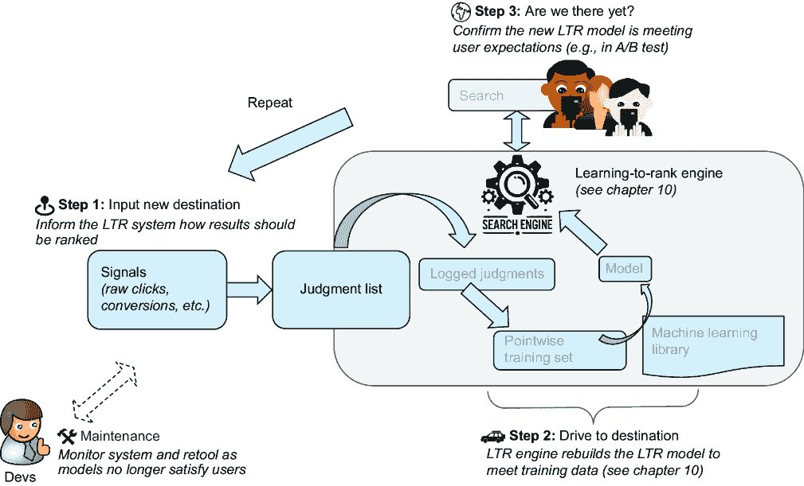
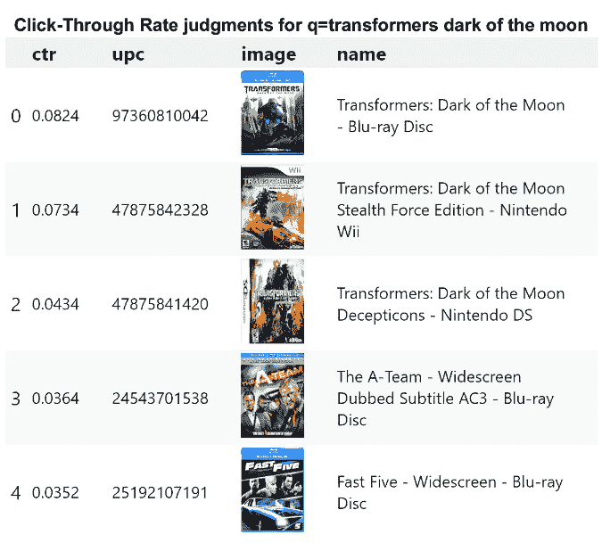
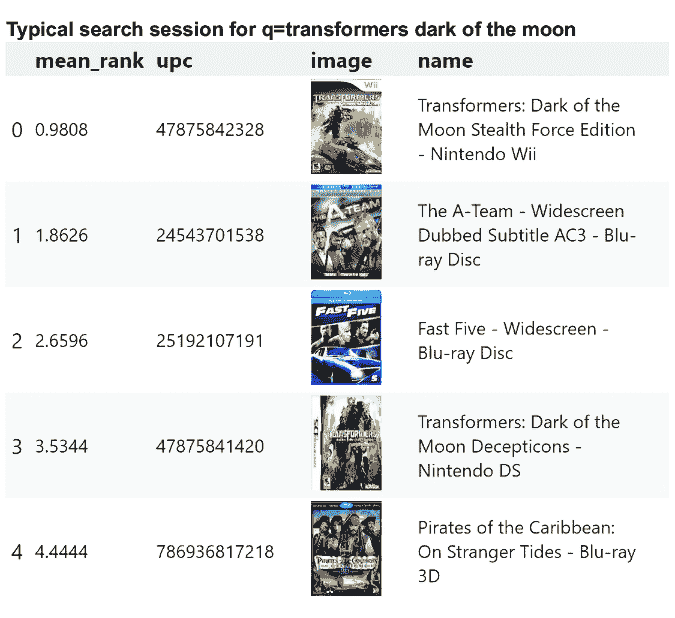
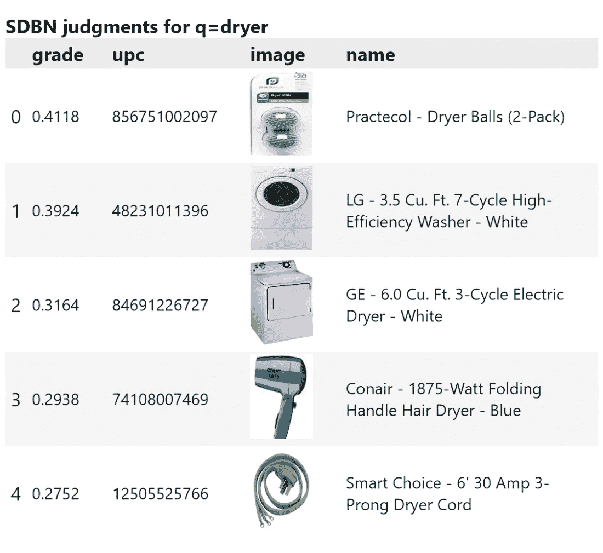
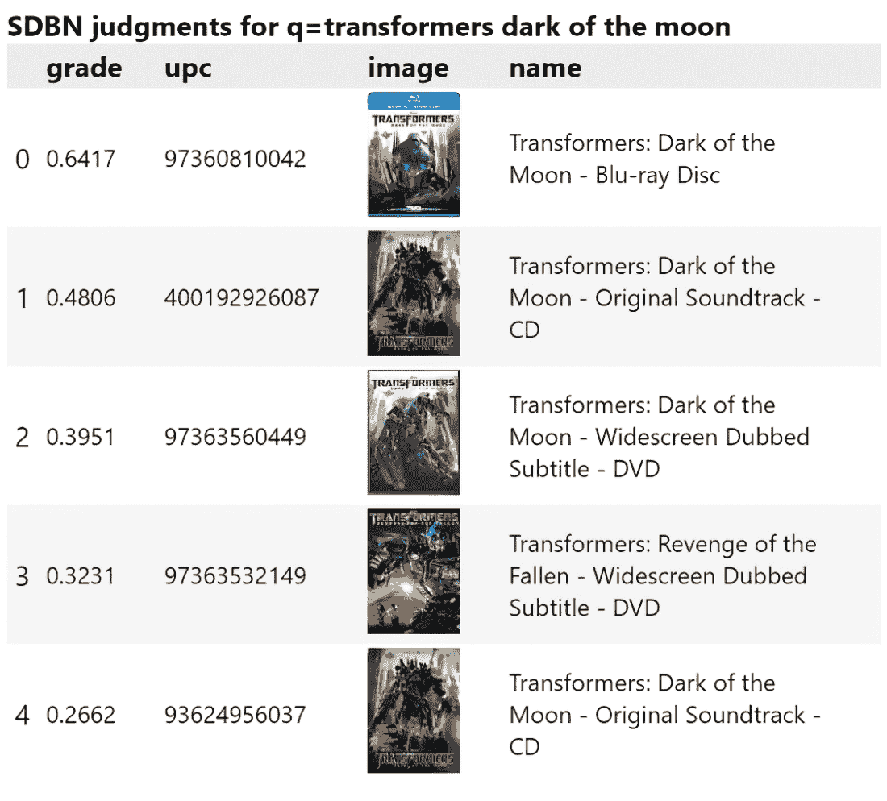
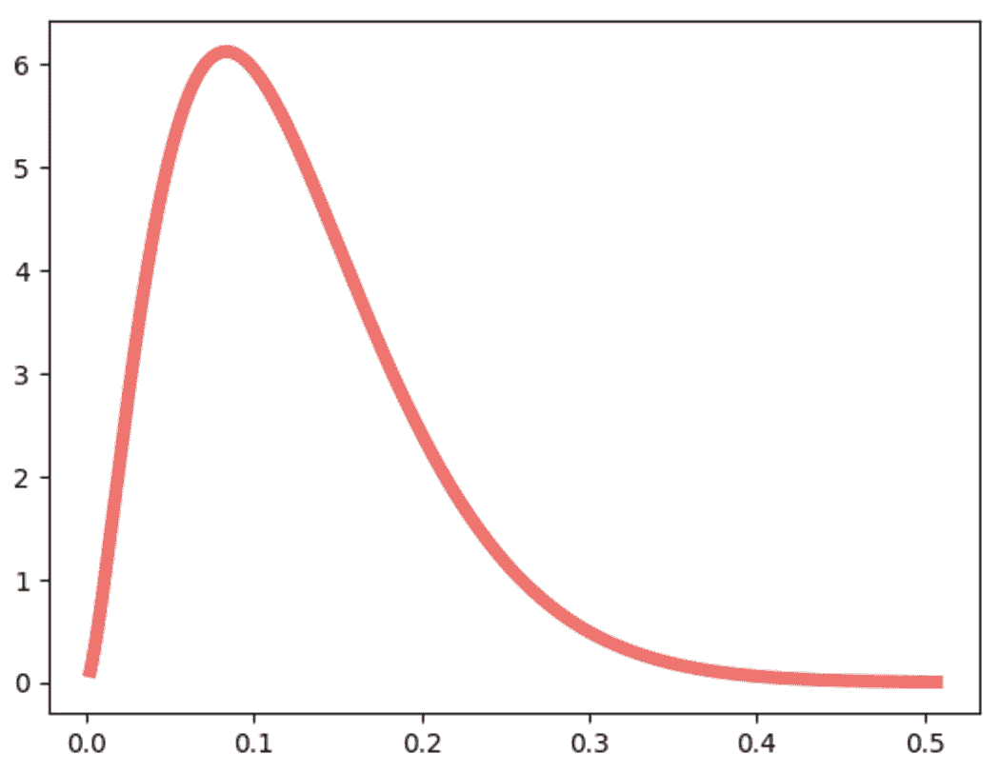
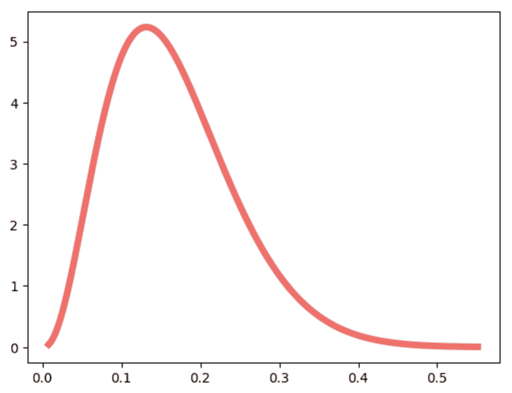
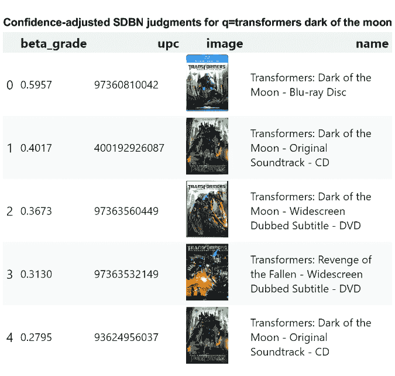
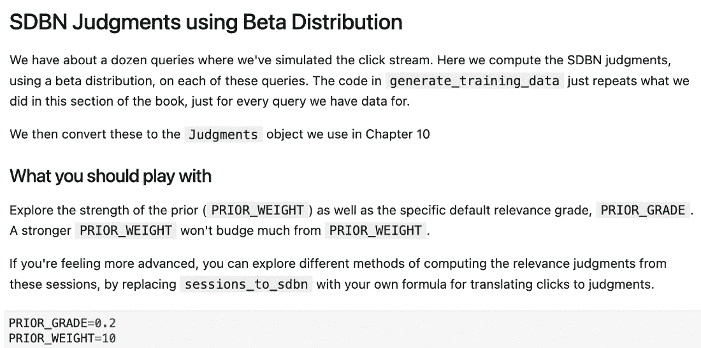
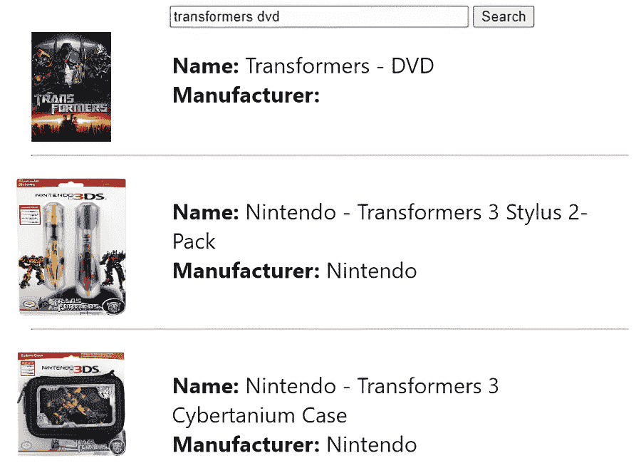

# 11 使用点击模型自动化学习排序

### 本章涵盖

+   自动化从用户行为信号（搜索、点击等）中重新训练学习排序

+   使用点击模型将用户信号转化为隐式 LTR 训练数据

+   克服用户倾向于点击搜索结果中排名更高的项目，而不考虑相关性的倾向

+   在推导隐式判断时处理点击次数较少的低置信度文档

在第十章中，我们一步步地讲解了如何训练一个学习排序（LTR）模型。就像一步步地了解汽车构造的机械原理一样，我们看到了 LTR 模型训练的底层结构和细节。在这一章中，我们将把 LTR 训练过程视为一个黑盒。换句话说，我们将不再深入 LTR 的内部，而是将 LTR 更像看作一辆自动驾驶汽车，微调其行程以到达最终目的地。

记住，LTR 的有效性依赖于准确无误的训练数据。LTR 训练数据描述了用户期望搜索结果如何被最优排序；它为我们输入 LTR 自动驾驶汽车的方向提供了指导。正如您将看到的，根据用户互动来确定相关性带来了许多挑战。如果我们能够克服这些挑战，并对我们的训练数据有很高的信心，那么我们可以构建*自动化的学习排序*：一个定期重新训练 LTR 以捕捉最新的用户相关性期望的系统。

由于训练数据在自动化 LTR 中如此关键，挑战不再仅仅是“我们应该使用什么模型/特征/搜索引擎？”而是更根本的，“用户从搜索中想要什么？”“我们如何将这转化为训练数据？”“我们如何知道这些训练数据是否有效？”通过提高我们对这些问题的答案的信心，我们可以将 LTR（再）训练自动化，如图 11.1 所示。



##### 图 11.1 一个自动化的 LTR 系统从用户信号中自动学习和再训练。这有助于基于用户在多个查询中认为相关的实际内容来构建模型。

让我们简要地回顾自动化 LTR 过程中的每一步：

1.  *输入新目的地*——我们将描述理想相关性的训练数据输入 LTR 系统，这些数据基于我们对用户行为信号的理解，例如搜索、点击和转化（本章涵盖）。

1.  *驶向目的地*——我们的 LTR 系统使用提供的训练数据重新训练 LTR 模型（如第十章所述）。

1.  *我们到了吗？*——模型真的在帮助用户吗？未来的模型或许应该探索其他路线（第十二章涵盖）？

自动化 LTR 会持续重复步骤 1-3 以自动优化相关性。搜索团队会监控自动化 LTR 的性能并在必要时进行干预。这是图 11.1 中的*维护*部分。在维护期间，我们会打开引擎盖来探索新的 LTR 功能和其它模型调整。维护也可能意味着重新审视步骤 1，以纠正我们对用户行为的理解并构建更可靠、更健壮的训练数据。毕竟，如果没有好的训练数据，我们可能完全遵循第十章的内容，但仍可能无法满足用户的需求。

本章通过关注步骤 1——输入新的目的地，开始对自动化 LTR 的探索。我们首先定义从用户点击中推导训练数据的任务。然后，我们将在本章的其余部分克服一些常见的搜索点击数据偏差和挑战。到本章结束时，你将能够构建从用户信号中提取的更可靠训练数据的模型。第十二章将通过观察模型与真实用户互动，使用主动学习和高斯技术克服更复杂的展示偏差，并将所有这些组件整合到一个最终的端到端自动化 LTR 系统中来完成我们的自动化 LTR 探索。

## 11.1（重新）从信号创建判断列表

我们提到，在从点击中创建 LTR 训练数据时需要克服偏差。然而，在我们深入探讨这些偏差之前，我们将探讨使用点击而不是手动标签作为 LTR 训练数据的含义。然后，在本节中，我们将尝试制作训练数据，回顾哪些做得好，哪些不好。这将为我们设置本章的其余部分，我们将探讨如何从这些结果中去除偏差（在第 11.2 节及以后）。

### 11.1.1 从信号生成隐式、概率性判断

让我们为如何使用行为信号作为 LTR 训练数据打下基础。然后我们将深入了解构建可靠判断列表的细节。

在第十章中，我们讨论了 LTR 训练数据，被称为*判断列表*或*判断*。这些判断包含了对给定查询潜在搜索结果相关性的标签或*评分*。在第十章中，我们以电影为例，用`1`（相关）或`0`（不相关）的评分来标记它们，如下面的例子所示。

##### 列表 11.1 标记电影相关或不相关

```py
# Judgment(grade, keywords, doc_id)
sample_judgments = [
  # for 'social network' query
  Judgment(1, "social network", 37799),  # The Social Network
  Judgment(0, "social network", 267752), # #chicagoGirl
  Judgment(0, "social network", 38408),  # Life As We Know It
  Judgment(0, "social network", 28303),  # The Cheyenne Social Club
  # for 'star wars' query
  Judgment(1, "star wars", 11),          # Star Wars
  Judgment(1, "star wars", 1892),        # Return of the Jedi
  Judgment(0, "star wars", 54138),       # Star Trek Into Darkness
  Judgment(0, "star wars", 85783),       # The Star
  Judgment(0, "star wars", 325553)       # Battlestar Galactica
]
```

生成判断列表有许多技术，但这并不是关于判断列表及其众多应用的全面章节。相反，我们将专门关注 LTR 训练数据。因此，我们只会讨论从用户点击信号中生成的判断。我们称之为*隐式判断*，因为它们源自用户与搜索应用之间的交互，当用户搜索和点击时。这与*显式判断*形成对比，显式判断中评分者直接将搜索结果标记为相关或不相关。

隐式判断非常适合自动化 LTR（学习到排名），原因有以下几点：

+   *近期性*——我们有用户流量的直接访问权限，因此我们可以自动化训练今天的 LTR 模型，以满足最新的用户搜索期望。

+   *数据更多，成本更低*——设置一个任务来捕获显式判断，即使使用众包，也是耗时且成本高昂的，尤其是在大规模上。从我们正在收集的实时用户交互中推导出隐式判断，使我们能够利用现有的用户基础为我们完成这项工作。

+   *捕获真实用例*——隐式判断捕获了实际使用你的搜索应用的用户。与此相对比的是，在人工环境中，显式评分者会仔细思考，可能是不切实际地思考，关于选择最相关结果的抽象任务。

不幸的是，点击数据可能很嘈杂。我们不知道为什么用户点击了特定的搜索结果。此外，用户并不同质；有些人会将一个结果视为相关，而其他人则不然。搜索交互中也包含需要克服的偏见，这会在模型计算周围产生额外的不确定性，我们将在本章和下一章的后面详细讨论。

由于这些原因，点击模型不是进行二进制判断，而是创建*概率判断*。它不会只产生`1`（相关）或`0`（不相关）的等级，而是表示一个随机用户认为结果相关或不相关的概率（介于`0.0`和`1.0`之间）。例如，一个好的点击模型可能会将列表 11.1 中的判断重述为以下类似的内容。

##### 列表 11.2 概率性地标记电影查询的相关性

```py
# Judgment(grade, keywords, doc_id),
sample_judgments = [
  Judgment(0.99, "social network", 37799),  # The Social Network
  Judgment(0.01, "social network", 267752), # #chicagoGirl
  Judgment(0.01, "social network", 38408),  # Life As We Know It
  Judgment(0.01, "social network", 28303),  # The Cheyenne Social Club
  Judgment(0.99, "star wars", 11),          # Star Wars
  Judgment(0.80, "star wars", 1892),        # Return of the Jedi
  Judgment(0.20, "star wars", 54138),       # Star Trek Into Darkness
  Judgment(0.01, "star wars", 85783),       # The Star
  Judgment(0.20, "star wars", 325553)       # Battlestar Galactica
]
```

注意列表 10.2 中的《星球大战》电影——`grade`变得更有趣了。《星球大战》现在有非常高的相关性概率（`0.99`）。续集《星球大战：绝地归来》的相关性概率略低。其他科幻电影（如《星际迷航：暗黑无界》和《银河系漫游指南》）的评分略高于`0`，因为《星球大战》系列的粉丝也可能喜欢这些电影。《星》与这些完全不相关——它是一部关于第一个圣诞节的儿童动画电影——因此它只获得了低`0.01`的相关性概率。

### 11.1.2 使用概率判断训练 LTR 模型

我们刚刚介绍了相关性等级可以是概率性的这一想法。现在让我们考虑如何将第十章的教训应用于训练一个模型，使用这些概率判断（介于`0.0`和`1.0`之间）而不是二进制判断。

通常，在训练模型时，你可能需要考虑以下选项：

+   *量化评分*——简单来说，您可以在训练之前设置任意截止值，将评分转换为可接受的格式。您可以将大于`0.75`的评分视为相关（或`1.00`）。任何小于`0.75`的评分将被视为不相关（或`0.00`）。其他算法，如 LambdaMART，接受一系列评分，如`1`到`4`，并且这些算法也可以有离散的截止值，例如将小于`0.25`的评分赋予`1.00`，大于或等于`0.25`但小于`0.5`的评分赋予`2.00`，依此类推。使用这些算法，您可以创建 100 个这样的标签，将`0.00`赋予`0`，`0.01`赋予`1`，等等，直到将`1`赋予在训练前的`100`。

+   *仅使用浮点判断*——第十章中的 SVMRank 算法从不太相关的项目的特征中减去更相关项目的特征（反之亦然），并构建一个分类器来区分相关和不相关的项目。我们使用二元判断来做这件事，但没有任何东西阻止我们使用概率判断。在这里，如果认为《星球大战：绝地归来》（评分=0.80）比《星际迷航：暗黑无界》（评分=0.20）更相关，我们只需将《星球大战：绝地归来》标记为比《星际迷航：暗黑无界》更相关（将差异标记为`+1`）。然后我们执行与第十章相同的成对减法，从《星际迷航：暗黑无界》中减去《星球大战：绝地归来》的特征，以创建一个完整的训练示例。

使用本章中的判断重新训练模型将主要重复第十章中的代码，所以我们将专注于训练点击模型的机制。我们包含了一个笔记本，其中包含一个完整的端到端 LTR 训练示例（见第 11.4 节），它将我们将在本章末尾得到的点击模型整合到您在第十章中已经探索过的 LTR 训练过程中。

是时候回到代码，看看我们的第一个点击模型了！

### 11.1.3 点击率：您的第一个点击模型

现在您已经看到了点击模型生成的判断格式以及这种格式如何集成到训练 LTR 模型中，让我们尝试构建一个简单的点击模型。之后，我们将退后一步，专注于一个更复杂、通用的点击模型，然后我们将探讨一些在处理查询和点击信号中固有的核心偏差。

TIP 如果您想更深入地了解这个主题，我们鼓励您阅读 Chuklin、Markov 和 Rijke 所著的《网络搜索点击模型》（Springer，2015 年）。

为了构建我们的点击模型，我们将回到 RetroTech 数据集，因为它方便地包含了用户点击信号。从这些信号中，我们还逆向工程了构建高质量判断所需的原始会话数据。我们将使用`pandas`库对会话数据进行表格计算。

在以下列表中，我们检查了电影《变形金刚：月黑之时》的样本搜索会话。这个原始会话信息是你的起点——从用户信号中开发判断列表所需的最基本信息。

##### 列表 11.3 检查搜索会话

```py
query = "transformers dark of the moon"
sessions = get_sessions(query)  #1
print(sessions.loc[3]) #2
```

#1 选择“transformers dark of the moon”查询的会话

#2 检查展示给用户的单个搜索会话

输出：

```py
sess_id  query                          rank    doc_id          clicked
3        transformers dark of the moon  0.0     47875842328     False
3        transformers dark of the moon  1.0     24543701538     False
...
3        transformers dark of the moon  7.0     97360810042     True
...
3        transformers dark of the moon  13.0    47875841406     False
3        transformers dark of the moon  14.0    400192926087    False
```

列表 11.3 对应于一个单一的搜索会话，`sess_id=3`，针对查询`transformers` `dark` `of` `the` `moon`。这个会话包括查询、用户看到的排名结果以及每个结果是否被点击。这三个元素是构建点击模型所需的核心成分。

搜索会话将经常有所不同。另一个会话，即使几秒钟后，也可能向用户展示略有不同的排名。搜索索引可能已更改，或者可能已将新的相关性算法部署到生产中。我们鼓励你使用另一个`sess_id`重试列表 11.3，以比较会话。

让我们将这些数据转换为使用我们的第一个简单点击模型：点击率进行判断。

#### 从点击率构建判断

我们将首先构建一个非常简单的点击模型，以便熟悉数据，然后我们可以退后一步，看看这个初步尝试的缺陷。这将使我们能够仔细思考本章其余部分中自动 LTR 生成的判断质量。

我们的第一个点击模型将基于**点击率**（CTR）。CTR 是搜索结果上的点击次数除以它在搜索结果中出现的次数。如果一个结果每次搜索引擎返回时都被点击，CTR 将是`1`。如果它从未被点击，CTR 将是`0`。听起来很简单——可能出什么问题呢？

我们可以查看查询`transformers` `dark` `of` `the` `moon`的每个结果，并考虑与返回`doc_id`的会话数量相关的点击。以下列表显示了计算和每个文档的 CTR 值。

##### 列表 11.4 计算 CTR

```py
def calculate_ctr(sessions):
  click_counts = sessions.groupby("doc_id")["clicked"].sum()
  sess_counts = sessions.groupby("doc_id")["sess_id"].nunique()
  ctrs = click_counts / sess_counts
  return ctrs.sort_values(ascending=False)

query = "transformers dark of the moon"
sessions = get_sessions(query, index=False)
click_through_rates = calculate_ctr(sessions)
print_series_data(click_through_rates, column="CTR")
```

输出：

```py
doc_id         CTR       name
97360810042    0.0824    Transformers: Dark of the Moon - Blu-ray Disc
47875842328    0.0734    Transformers: Dark of the Moon Stealth Force E...
47875841420    0.0434    Transformers: Dark of the Moon Decepticons - N...
...
93624956037    0.0082    Transformers: Dark of the Moon - Original Soun...
47875841369    0.0074    Transformers: Dark of the Moon - PlayStation 3
24543750949    0.0062    X-Men: First Class - Widescreen Dubbed Subtitl...
```

在列表 11.4 中，对于所有查询`transformers dark of the moon`的`sessions`（根据列表 11.3），我们将每个`doc_id`的点击次数求和为`click_counts`。我们还计算了该文档的独特会话数量为`sess_counts`。最后，我们计算`ctrs`为`click_counts` `/` `sess_counts`，从而得到我们的第一个点击模型。我们看到文档 97360810042 的 CTR 最高，而 24543750949 的 CTR 最低。

前面的列表基于 CTR 输出了*理想搜索结果*。也就是说，如果我们使用这个 CTR 点击模型来训练 LTR 模型提供相关性判断，搜索引擎将产生这个排序作为最佳排名。在本章和下一章中，我们将经常通过视觉显示这个理想排名来理解点击模型是否构建了合理的训练数据（判断）。我们可以在图 11.2 中看到基于 CTR 的理想判断`transformers dark of the moon`。



##### 图 11.2 按 CTR 排序的查询“transformers dark of the moon”的搜索结果

检查图 11.2 的结果，有几件事情很突出：

+   我们最高结果的 CTR（电影《变形金刚：月黑之时》的蓝光碟）似乎相当低（`0.0824`，略好于下一个判断的`0.0734`）。我们可能预期蓝光碟的相关性等级要远高于其他结果。

+   电影《变形金刚：月黑之时》的 DVD 甚至都没有出现。它似乎与看似无关的电影和关于电影《月黑之时》的次要电子游戏远在下方。我们原本预期 DVD 的排名应该更高，可能和蓝光碟一样高，甚至更高。

但也许“transformers dark of the moon”只是一个奇怪的查询。让我们重复这个过程，这次针对图 11.3 中的`dryer`进行。


##### 图 11.3 按 CTR 排序的查询`dryer`的搜索结果。我们注意到电影《独立者》这个奇怪的结果似乎并不相关。

在图 11.3 中，我们看到其他一些看起来很奇怪的结果：

+   前两个结果是衣物烘干机，这似乎是好的。

+   接下来是衣物烘干机的部件。嗯，好吧？

+   出现了一部名为《独立者》的电影。这似乎是完全随机的。为什么会被评价得这么高？

+   接下来是一个洗衣机配件，有点相关。

+   最后，我们看到吹风机，这显示了“dryer”一词的另一个潜在含义。

你认为 CTR 点击模型产生的判断如何？回想一下你在第十章中学到的内容。记住，这是你的 LTR 模型的基础，也是目标。你认为这些判断会导致一个最终投入生产时能够成功的良好 LTR 模型吗？

我们也鼓励你自己问一个更基本的问题：我们如何才能判断一个判断列表是否良好？我们的主观解释可能和点击模型中的数据一样有缺陷。我们将在第十二章中更深入地分析这个问题。对于本章，我们将让我们的直觉引导我们去发现可能的问题。

### 11.1.4 判断中的常见偏差

我们到目前为止已经看到，我们可以通过将产品点击次数除以该产品被搜索返回的次数来创建概率判断——这些判断的等级在 0.00 到 1.00 之间。然而，输出结果似乎有点不足，因为它包括了与变形金刚系列无关的电影。我们还看到一部电影被放在了搜索结果中，搜索词是`dryer`！

结果表明，搜索点击数据充满了偏差。在这里，我们将在探索 RetroTech 点击数据中的每个这些偏差之前，简要定义我们所说的“偏差”。

在点击模型中，*偏差*是原始用户点击数据与搜索结果的相关性无关的原因。相反，偏差定义了点击（或未点击）如何反映用户心理、搜索用户界面设计或噪声数据。我们可以将偏差分为两大类：非算法偏差和算法偏差。*算法偏差*是排名、显示和与搜索结果交互中固有的。*非算法偏差*是由于与搜索排名间接相关的原因发生的。

算法偏差可能包括以下内容：

+   *位置偏差*—用户点击排名较高的结果比排名较低的结果多。

+   *自信偏差*—信号数据很少的文档与数据量更多的文档对判断的影响相同。

+   *展示偏差*—如果搜索从未显示特定的结果，用户永远不会点击它们，因此点击模型将不知道它们是否相关。

另一方面，非算法偏差是以下这样的偏差：

+   *吸引力偏差*—一些结果看起来很有吸引力并产生点击（可能由于更好的图像或措辞选择），但结果却是垃圾或完全不相关。

+   *性能偏差*—用户放弃缓慢的搜索，分心，最终什么也不点击，或者只点击最早返回的结果。

由于这本书是关于*人工智能驱动*的搜索，我们将重点讨论搜索点击流数据中的*算法*偏差。本章将涵盖位置偏差和自信偏差，展示偏差将在第十二章中介绍。

但非算法偏差也很重要！搜索是一个复杂的生态系统，它超越了相关性排名。如果结果经常被点击，但后续行动如销售或其他转化没有发生，这可能不是一个排名问题——可能你有垃圾产品的问题。或者你可能有问题与产品页面或结账流程。当你发现限制因素实际上是用户体验、内容或搜索速度时，你可能会被要求提高“相关性”。

现在我们已经反思了我们的第一个点击模型，让我们努力克服第一个偏差。

## 11.2 克服位置偏差

在上一节中，我们看到了我们的第一个点击模型在行动：一个简单的点击率点击模型。这个模型将产品在搜索中被点击的次数除以它在顶部结果中出现的次数。我们看到了这是一个相当有缺陷的方法，并指出有多个可能导致偏差的原因。具体来说，我们指出了位置偏差、信心偏差和展示偏差作为我们点击模型中存在的三种算法偏差。是时候开始解决这些问题了！

在本节中，我们将重点关注这些算法偏差中的第一个，即位置偏差，深入探讨这个问题，并致力于设计一个旨在克服它的点击模型。

### 11.2.1 定义位置偏差

*位置偏差*存在于大多数搜索系统中。如果用户看到了搜索结果，他们往往会更倾向于选择排名较高的搜索结果，而不是排名较低的结果，即使那些较低的结果实际上更相关。Joachims 等人在其论文“评估 Web 搜索中点击和查询重构的隐式反馈的准确性”([www.cs.cornell.edu/people/tj/publications/joachims_etal_07a.pdf](http://www.cs.cornell.edu/people/tj/publications/joachims_etal_07a.pdf))中讨论了位置偏差存在的原因：

+   *信任偏差*—用户相信搜索引擎必须知道自己在做什么，因此他们更倾向于与排名较高的结果互动。

+   *扫描行为*—用户以特定的模式检查搜索结果，例如从上到下，并且通常不会探索他们面前的一切。

+   *可见性*—排名较高的结果更有可能在用户的屏幕上显示，因此用户需要滚动才能看到剩余的结果。

考虑到这些因素，让我们看看我们是否可以在 RetroTech 会话中检测到位置偏差。

### 11.2.2 RetroTech 数据中的位置偏差

RetroTech 数据集中存在多少位置偏差？如果我们能量化这一点，我们就可以考虑如何确切地解决这个问题。在我们考虑一个新的点击模型来克服这些偏差之前，让我们快速评估这个偏差。

通过查看所有查询的所有会话，我们可以计算每个排名的平均 CTR。这将告诉我们 RetroTech 点击数据中存在多少位置偏差。我们在以下列表中这样做。

##### 列表 11.5 所有查询的搜索会话中的点击率按排名

```py
sessions = all_sessions()
num_sessions = len(sessions["sess_id"].unique())
ctr_by_rank = sessions.groupby("rank")["clicked"].sum() / num_sessions
print(ctr_by_rank)
```

输出：

```py
rank
0     0.249727
1     0.142673
2     0.084218
3     0.063073
4     0.056255
5     0.042255
6     0.033236
7     0.038000
8     0.020964
9     0.017364
10    0.013982
```

您可以在列表 11.5 中看到用户点击较高位置的情况更多。排名`0`的结果的点击率是`0.25`，其次是排名`1`的`0.143`，依此类推。

此外，当我们比较早期的 CTR 判断与每个产品在查询中的典型排名时，我们还可以看到位置偏差。如果存在位置偏差，那么我们判断的理想排名最终将类似于显示给用户的典型排名。我们可以通过平均每个会话中每个文档的排名来分析这一点，以查看它们出现在哪里。

下面的列表显示了`transformers dark of the moon`会话的典型搜索结果页面。

##### 列表 11.6 检查`transformers` `dark` `of` `the` `moon`的排名

```py
def calculate_average_rank(sessions):
  avg_rank = sessions.groupby("doc_id")["rank"].mean()
  return avg_rank.sort_values(ascending=True)

sessions = get_sessions("transformers dark of the moon")
average_rank = calculate_average_rank(sessions)
print_series_data(average_rank, "mean_rank")
```

输出：

```py
doc_id        mean_rank    name
400192926087    13.0526    Transformers: Dark of the Moon - Original Soun...
97363532149     12.1494    Transformers: Revenge of the Fallen - Widescre...
93624956037     11.3298    Transformers: Dark of the Moon - Original Soun...
...
25192107191      2.6596    Fast Five - Widescreen - Blu-ray Disc
24543701538      1.8626    The A-Team - Widescreen Dubbed Subtitle AC3 - ...
47875842328      0.9808    Transformers: Dark of the Moon Stealth Force E...
```

在列表 11.6 中，一些文档，如 24543701538 和 47875842328，在这个查询的历史搜索结果中通常出现在顶部。由于位置偏差，它们将被点击得更多。典型的结果页面，如图 11.4 所示，与图 11.2 中的 CTR 排名有很大的重叠。



##### 图 11.4 对于查询`transformers dark of the moon`的典型搜索结果页面。注意无关的电影，如*The A-Team*和*Fast Five*的出现。还要注意 Wii 游戏的排名很高。这些结果的高位置以及它们仅仅因为出现在列表中就获得更多点击的事实，解释了为什么 CTR 模型错误地认为这些是相关的。

不幸的是，CTR 主要受到位置偏差的影响。用户点击图 11.4 中的奇怪电影，是因为搜索引擎为这个查询返回了它们，而不是因为它们相关。如果我们仅仅基于 CTR 来训练 LTR 模型，我们就是在要求 LTR 模型优化用户已经看到和交互的内容。在自动化 LTR 时，我们必须考虑位置偏差。

接下来，让我们看看我们如何在更健壮的点击模型中克服位置偏差，该模型可以补偿位置偏差。

### 11.2.3 简化的动态贝叶斯网络：一个克服位置偏差的点击模型

你已经看到了位置偏差在实际操作中可能造成的危害！如果我们仅仅使用点击数据，我们将训练我们的 LTR 模型来强化用户已经看到的排名。是时候引入一个能够克服位置偏差的点击模型了。我们将从定义“检查”，一个在建模位置偏差中的关键概念开始。然后，我们将介绍一个特定的点击模型，该模型使用这个“检查”概念来调整原始点击数据以克服位置偏差。

#### 如何通过“检查”事件克服位置偏差

基本的点击率（CTR）计算并没有真正考虑到用户是如何扫描搜索结果的。用户在决定点击一个或两个结果之前，可能只会考虑几个结果——这些结果受到位置的影响。如果我们能够捕捉到用户在点击之前有意识地考虑的结果，我们可能能够克服位置偏差。点击模型正是通过定义“检查”的概念来实现这一点的。在我们构建一个能够克服位置偏差的点击模型之前，我们将探讨这个概念。

什么是“检查”？你可能对“印象”很熟悉——当一个 UI 元素渲染在用户屏幕的可见部分时。在点击模型中，我们考虑的是“检查”，即用户有意识地考虑搜索结果的可能性。正如我们所知，用户往往无法注意到他们眼前的东西。你可能就是那个用户！图 11.5 捕捉了这个概念，将“印象”与“检查”进行了对比。


##### 图 11.5 中，印象是视口中渲染的内容（显示器形状的方形），而检查是用户考虑的内容（带有眼睛的搜索结果）。建模用户检查的内容有助于正确地解释用户如何与搜索结果互动。

你可以在图 11.5 中看到，用户没有注意到第二位上的任天堂游戏，尽管它在他们的显示器上被渲染。如果用户没有检查它，点击模型不应该惩罚任天堂游戏的相关性。

为什么跟踪检查有助于克服位置偏差？检查是点击模型理解位置偏差的方式。另一种说法“位置偏差”是“我们认为用户是否检查搜索结果取决于其位置。”因此，正确建模检查是大多数点击模型的核心活动。一些点击模型，如**基于位置的模型**（PBM），试图确定所有搜索中每个位置上的检查概率。其他，如**级联模型**或，如我们很快将看到的，**动态贝叶斯网络**（DBN）模型，假设如果一个结果位于搜索页面的最后一个点击之上，那么它很可能是被检查过的。

对于大多数点击模型，顶部位置通常比底部位置的检查概率更高。这使得点击模型能够正确调整点击。经常检查并点击的项目会被奖励，并被认为更相关。那些被检查但没有点击的项目被认为不太相关。

为了使这一点更具体，让我们深入探讨一个使用检查来帮助克服位置偏差的动态贝叶斯网络点击模型。

#### 定义简化动态贝叶斯网络

**简化动态贝叶斯网络**（SDBN）是更复杂的动态贝叶斯网络（DBN）点击模型的一个略微不准确版本。这些点击模型假设，在搜索会话中，用户检查一个文档的概率在很大程度上取决于它是否位于或高于最低点击的文档。

SDBN 的算法首先标记每个会话的最后一个点击，然后考虑每个会话中或高于此最后一个点击的每个文档为已检查。最后，它通过简单地用文档上的总点击数除以该文档的总检查数来计算相关性等级。因此，我们得到一种动态点击率（CTR），跟踪每个用户的搜索会话中他们可能检查结果的时间，并仔细利用这一点来评估用户对其相关性的评价。然后，我们使用这些相关性评价在会话中汇总以训练 SDBN 点击模型。

让我们逐步跟踪这个算法。我们首先在以下列表中标记每个会话的最后一个点击。

##### 列表 11.7 标记每个会话中哪些结果被检查

```py
def calculate_examine_probability(sessions):
  last_click_per_session = sessions.groupby(  #1
    ["clicked", "sess_id"])["rank"].max()[True]  #1
  sessions["last_click_rank"] = last_click_per_session  #2
  sessions["examined"] = \  #3
    sessions["rank"] <= sessions["last_click_rank"]  #3
  return sessions

sessions = get_sessions("dryer")
probability_data = calculate_examine_probability(sessions).loc[3]
print(probability_data)
```

#1 计算每个会话的 last_click_per_session，即每个会话中点击为真的最大排名。

#2 标记每个会话的最后一个点击排名

#3 将最后一个点击或以上的每个位置设置为 True（否则为 False）

输出（截断）：

```py
sess_id  query   rank    doc_id          clicked  last_click_rank  examined
3        dryer   0.0     12505451713     False    9.0              True
3        dryer   1.0     84691226727     False    9.0              True
3        dryer   2.0     883049066905    False    9.0              True
...
3        dryer   8.0     14381196320     True     9.0              True
3        dryer   9.0     74108096487     True     9.0              True
3        dryer   10.0    74108007469     False    9.0              False
3        dryer   11.0    12505525766     False    9.0              False
...
```

在列表 11.7 中，我们通过在 `last_click_per_session` 中存储它来找到 `clicked` 为 `True` 的最大排名。然后，我们将 `last_click_rank` 或以上的位置标记为在我们的 `dryer` 会话中已检查，正如你在 `sess_id=3` 的输出中可以看到的那样。

在每个会话更新后，我们将所有会话中每个文档的总点击和检查次数进行汇总。

##### 列表 11.8 为此查询按 `doc_id` 汇总点击和检查次数

```py
def calculate_clicked_examined(sessions):
  sessions = calculate_examine_probability(sessions)
  return sessions[sessions["examined"]] \
    .groupby("doc_id")[["clicked", "examined"]].sum()

sessions = get_sessions("dryer")
clicked_examined_data = calculate_clicked_examined(sessions)
print_dataframe(clicked_examined_data)
```

输出（截断）：

```py
doc_id        clicked  examined    name
12505451713       355      2707    Frigidaire - Semi-Rigid Dryer Ve...
12505525766       268       974    Smart Choice - 6' 30 Amp 3-Prong...
...
36172950027        97       971    Tools in the Dryer: A Rarities C...
...
883049066905      286      2138    Whirlpool - Affresh Washer Cleaner
883929085118       44       578    A Charlie Brown Christmas - AC3 ...
```

在列表 11.8 中，`sessions[sessions["examined"]]` 仅筛选出已检查的行。然后，对于每个 `doc_id`，我们计算每个文档的总 `clicked` 和 `examined` 计数。你可以看到一些结果，如 `doc_id=36172950027`，显然被检查了很多次，但用户点击次数相对较少。

最后，我们在以下列表中通过计算点击次数来完成 SDBN 算法。

##### 列表 11.9 计算最终的 SDBN 评分

```py
def calculate_grade(sessions):
  sessions = calculate_clicked_examined(sessions)
  sessions["grade"] = sessions["clicked"] / sessions["examined"]
  return sessions.sort_values("grade", ascending=False)

query = "dryer"
sessions = get_sessions(query)
grade_data = calculate_grade(sessions)
print_dataframe(grade_data)
```

输出（截断）：

```py
doc_id      clicked  examined  grade     name
856751002097    133       323  0.411765  Practecol - Dryer Balls (2-Pack)
48231011396     166       423  0.392435  LG - 3.5 Cu. Ft. 7-Cycle High-Ef...
84691226727     804      2541  0.316411  GE - 6.0 Cu. Ft. 3-Cycle Electri...
...
12505451713     355      2707  0.131141  Frigidaire - Semi-Rigid Dryer Ve...
36172950027      97       971  0.099897  Tools in the Dryer: A Rarities C...
883929085118     44       578  0.076125  A Charlie Brown Christmas - AC3 ...
```

在列表 11.9 的输出中，文档 856751002097 被视为最相关，评分为 `0.4118`，即 `323` 次检查中的 `133` 次点击。

让我们重新审视我们的两个查询，看看现在对于 `dryer` 和 `transformers dark of the moon` 的理想结果看起来如何。图 11.6 展示了 `dryer` 的结果，而图 11.7 展示了 `transformers dark of the moon` 的结果。



##### 图 11.6 根据 SDBN 的查询 `dryer` 的理想搜索结果。注意 SDBN 似乎促进了更多与洗衣相关的结果。



##### 图 11.7 根据 SDBN 的查询 `transformers` `dark` `of the moon` 的理想搜索结果。我们现在已经展示了 DVD、蓝光电影和 CD 原声带。

如果我们主观地审视图 11.6 和 11.7，这两组判断似乎比之前的 CTR 判断更直观。在我们的 `dryer` 例子中，重点似乎在洗衣上。有一些配件（如烘干球）的得分与烘干机本身大致相同。

对于 `transformers dark of the moon`，我们注意到蓝光电影的评分非常高。我们还看到 DVD 和 CD 原声带在“暗月”的其它二级项目（如视频游戏）中排名更高。有些奇怪的是，原声带 CD 的排名高于电影 DVD——也许我们应该进一步调查这一点。

当然，正如我们之前所说的，我们现在正在使用我们的直觉。在第十二章中，我们将更客观地思考我们如何评估判断质量。

在我们的位置偏差得到更好的控制后，我们现在将转向微调我们的判断，以处理另一个关键偏差：置信度偏差。

## 11.3 处理置信度偏差：不要因为少数幸运点击而颠覆你的模型

在棒球比赛中，一个球员的击球率告诉我们他们在每次击球中得到的击球比例。一位伟大的职业球员的击球率大于 0.3。然而，考虑一下这位幸运的小联盟棒球球员第一次击球就击中球的情况。他们的击球率在技术上为 1.0！因此，我们可以得出结论，这位年轻的孩子是一个棒球天才，并且肯定会有一个伟大的棒球生涯。对吗？

不完全是这样！在本节中，我们将探讨这位幸运的小联盟球员的相关性方面。对于那些可能仅仅因为运气好，只被检查过几次，每次都导致点击的结果，我们该怎么办？这些结果可能不应该得到完美的 1.0 分。我们将在我们的数据中看到（并纠正）这个问题。

### 11.3.1 点击数据中的低置信度问题

让我们看看数据，看看低置信度数据点在哪里影响了训练数据。然后我们将看到我们如何补偿 SDBN 结果中的低置信度问题。为了定义这个问题，让我们看看`transformers` `dark of` `the` `moon`和另一个更罕见的查询的 SDBN 结果，看看常见的低置信度情况。

如果你还记得，根据 SDBN，*变形金刚：月黑之时*电影的原声带 CD 排名相当高，这有点可疑。当我们检查排名背后的原始数据时，我们可以看到可能存在的问题。在下面的列表中，我们重构了`transformers` `dark` `of` `the` `moon`的 SDBN 数据来调试这个问题，结合了列表 11.7-11.9。

##### 列表 11.10 重新计算 SDBN 统计数据

```py
query = "transformers dark of the moon"
sessions = get_sessions(query)
grade_data = calculate_grade(sessions)
print_dataframe(grade_data)
```

输出（截断）：

```py
doc_id      clicked  examined  grade     name
97360810042     412       642  0.641745  Transformers: Dark of the Moon -...
400192926087     62       129  0.480620  Transformers: Dark of the Moon -...
97363560449      96       243  0.395062  Transformers: Dark of the Moon -...
...
47875841406      80       626  0.127796  Transformers: Dark of the Moon A...
24543750949      31       313  0.099042  X-Men: First Class - Widescreen ...
47875842335      53       681  0.077827  Transformers: Dark of the Moon S...
```

在列表 11.10 的输出中，注意最上面的结果，蓝光电影（`doc_id=97360810042`），有更多的检查次数（`642`）比原声带 CD（`doc_id=400192926087`，`129`次检查）。鉴于蓝光有更多用户互动的机会，它的评分更可靠，因此它不太可能被噪声点击所主导。另一方面，CD 的检查次数要少得多。鉴于 CD 的数据有限，蓝光的相关性评分不应该更高吗？

通常情况下，这种状况甚至更为明显，尤其是在处理不太常见的查询时。无论你的搜索引擎接收多少查询，一些查询可能会被多次接收（*头部查询*），一些会被适度次数接收（*躯干查询*），而一些则非常罕见（*长尾查询*，或简称*尾部查询*）。以查询`blue ray`为例。你会注意到这实际上是“Blu-ray”的常见误拼。作为一个常见的错误，它可能将包含适度数量检查的文档与接收非常少检查的文档混合在一起。在下面的列表中，我们计算了`blue ray`的 SDBN 统计数据，它受到了这种数据稀疏问题的影响。

##### 列表 11.11 对于稀疏数据的查询的 SDBN 判断

```py
def get_sample_sessions(query):
  sessions = get_sessions(query, index=False)
  sessions = sessions[sessions["sess_id"] < 50050]  #1
  return sessions.set_index("sess_id")

sessions = get_sample_sessions("blue ray")
grade_data = calculate_grade(sessions)
print_dataframe(grade_data)
```

#1 随机抽取几个会话来模拟典型的长尾案例

输出（截断）：

```py
doc_id        clicked  examined  grade      name
600603132872  1        1         1.000000   Blu-ray Disc Cases (10-Pack)
827396513927  14       34        0.411765   Panasonic - Blu-Ray Player
25192073007   8        20        0.400000   The Blues Brothers - Widescree...
...
25192107191   0        7         0.000000   Fast Five - Widescreen - Blu-r...
23942972389   0        15        0.000000   Verbatim - 10-Pack 6x BD-R Dis...
885170038875  0        5         0.000000   Panasonic - 9" Widescreen Port...
```

查看列表 11.11 的输出，我们发现了一些令人不安的情况。就像我们幸运的小联盟棒球选手最极端的情况一样，最相关的结果，文档 600603132872，在仅被一个用户检查后得到了`1.0`（完全相关）的评分！这个`1.0`的评分高于下一个结果，该结果的评分为`0.411`，基于`34`次检查。当你考虑到文档 600603132872 是一套蓝光案例，而 827396513927 是蓝光播放器时，这感觉更加令人不安。我们主观的解释可能会将播放器排在案例之上。第二结果被检查得更多，这不应该算作某种因素吗？

在这些示例中，我们所看到的是**置信度偏差**——当一个判断列表基于统计上不显著、虚假的事件有很多评分时。我们说这些检查次数很少的虚假事件具有低置信度，而那些检查次数更多的提供了更高水平的置信度。无论你的点击模型如何，你很可能有很多查询只有少量流量的情况。为了自动化 LTR，你需要调整你的训练数据生成，以考虑你对数据的置信度。

既然你已经看到了低置信度数据的影响，我们可以继续讨论在构建你的点击模型时可以应用的一些解决方案。

### 11.3.2 使用 beta 先验概率建模置信度

我们刚刚看到了过分重视低置信度数据所造成的一些问题。如果不根据你对数据的置信度调整你的模型，你将无法构建一个可靠的自动化 LTR 系统。我们本可以简单地过滤掉这些低置信度示例，但我们可以做些更智能的事情吗？在本节中，我们将介绍 beta 分布的概念，同时讨论如何保留所有点击流数据。但首先，让我们讨论为什么使用所有数据通常比简单地过滤掉低置信度示例更受欢迎。

#### 我们是否应该过滤掉低置信度的判断？

在我们的点击模型中，我们是否应该仅仅移除低置信度示例？我们通常不推荐像那样丢弃数据点。

过滤训练数据，例如低于某些最小检查阈值的检查点数据，会减少你拥有的训练数据量。即使有一个合理的阈值，查询的文档通常是在幂律分布上被检查的。用户频繁检查一些文档，而大量文档则很少被检查。因此，阈值可能会移除过多的 LTR 示例，导致 LTR 模型错过重要的模式。即使有阈值，你仍将面临如何权衡中等置信度示例与高置信度示例的挑战，例如与之前提到的`transformers` `dark` `of` `the` `moon`查询。

我们主张保留低置信度示例，并仅根据置信度水平权衡所有示例。我们将使用计算的相关度等级的贝塔分布来完成这项工作。然后我们将应用这个解决方案来修复我们的 SDBN 点击模型判断。

#### 使用贝塔分布来调整置信度

贝塔分布帮助我们根据概率而不是仅仅基于有偏见的出现来从我们的点击和检查中得出结论。然而，在我们直接使用贝塔分布进行判断之前，让我们首先通过我们之前直观的棒球击球率类比来检验贝塔分布的有用性。

在棒球中，一名球员的 0.295 击球率意味着当这名球员击球时，大约有 29.5%的几率他们会击中。但如果我们想知道“这名球员在九月雨天在芬威球场击球的击球率是多少”，我们可能几乎没有信息可用。这名球员可能只在这种条件下击球几次。也许他们在那种条件下 2 次尝试中击中了 2 次。我们会得出结论，他们在这些情况下的击球率是 2/3 或 0.67。现在我们知道这个结论是错误的：我们真的认为，基于只有 3 次击球的机会，我们就可以得出这名球员有 66.7%的不太可能击中的高概率吗？更好的方法是将 0.295 的一般击球率作为初始信念，随着我们逐渐获得更多关于“九月雨天在芬威球场击球”的数据，我们逐渐远离这个假设。

*贝塔分布*是一种用于管理信念的工具。它将一个概率，如击球率或判断等级，转换为两个值，`a`和`b`，这些值代表概率分布。`a`和`b`值可以这样解释：

+   `a` *(成功次数)*—我们观察到的击中次数，或者点击的检查次数

+   `b` *(失败次数)*—我们观察到的未击中次数，或者未点击的检查次数

使用贝塔分布，属性`均值` `=` `a` `/` `(a` `+` `b)`成立，其中`均值`是初始点值，如击球率。给定一个`均值`，我们可以找到许多满足`均值` `=` `a` `/` `(a` `+` `b)`的`a`和`b`值。毕竟，`0.295` `=` `295` `/` `(295` `+` `705)`，同样`0.295` `=` `1475` `/` `(1475` `+` `3525)`等等。然而，每个都代表一个不同的贝塔分布。随着我们的进展，请记住这个属性。

让我们把这些部分放在一起，看看贝塔分布是如何防止我们从虚假点击（或击球）数据中得出结论的。

我们可以将我们对任何文档相关性等级的初始信念声明为`0.125`。这就像声明棒球运动员的击球率为 0.295 作为我们对他们表现的初始信念一样。我们可以使用 beta 分布来更新特定案例的初始信念，例如“9 月的雨天在芬威公园”或特定文档对搜索查询的相关性。

第一步是选择一个`a`和一个`b`来捕捉我们的初始信念。对于我们的相关性案例，我们可以选择许多满足`0.125` `=` `a` `/` `(a` `+` `b)`的`a`和`b`值。假设我们选择`a=2.5,` `b=17.5`作为我们对没有点击的文档的相关性信念。绘制这个，我们会看到图 11.8 中的分布。



##### 图 11.8 相关性等级为 0.125 的 beta 分布。平均值对应于我们的默认相关性等级。我们看到最可能的相关性等级分布。

我们现在可以观察到当我们看到文档的第一次点击，将文档的`a`增加到 3.5 时会发生什么。在图 11.9 中，我们有`a=3.5, b=17.5`。



##### 图 11.9 在添加一次点击后，相关性等级的 beta 分布现在是`0.1667`。添加一次点击“拉动”概率分布稍微向一个方向移动，更新初始信念。

更新分布的平均相关性等级现在是`3.5` `/` `(17.5` `+` `3.5)`或`0.1667`，在考虑到其第一次点击的情况下，有效地将初始信念稍微提高。如果没有 beta 分布，这篇文档将会有 1 次点击和 1 次查看，结果等级为`1`。

我们将起始点概率分布（所选的`a`和`b`）称为*先验分布*，或简称*先验*。这是我们对于会发生什么的初始信念。更新`a`和`b`后的特定案例（如文档）的分布是*后验分布*，或简称*后验*。这是我们更新的信念。

回想一下，我们之前提到可以选择许多初始的`a`和`b`值。这很重要，因为初始`a`和`b`的大小使我们的先验更弱或更强。我们可以选择任何满足`a` `/` `(a` `+` `b)` `=` `0.125`的`a`和`b`值。但请注意，如果我们选择一个非常小的值`a=0.25,` `b=1.75`会发生什么。然后我们通过增加 1 来更新`a`。后验分布的新预期值是`1.25 /` `(1.25` `+` `1.75)`或约`0.416`。这仅仅是一个点击就能产生重大影响。相反，使用非常高的`a`和`b`值会使先验非常强，几乎不会变动。当你使用 beta 分布时，你将想要调整先验的大小，以便更新产生期望的效果。

现在你已经看到了捕捉 SDBN 等级的实用工具，让我们看看 beta 分布如何帮助我们解决 SDBN 置信度问题。

#### 在 SDBN 点击模型中使用 beta 先验

让我们通过使用 beta 分布更新 SDBN 点击模型来结束本章。如果你使用其他点击模型，如本章前面提到的那些，你需要思考在这些情况下如何解决置信度问题。beta 分布可能在那里也是一个有用的工具。

如果你记得，SDBN 的输出是每个文档的`clicks`和`examines`的计数。在列表 11.12 中，我们从列表 11.11 继续，它计算了`blue ray`查询的 SDBN。我们将为我们的 SDBN 模型选择`0.3`作为先验等级。这是我们不知道文档信息时的默认等级——可能来自我们在判断中看到的典型等级。然后，我们将使用这个先验等级计算先验 beta 分布（`prior_a`和`prior_b`）。

##### 列表 11.12 计算先验 beta 分布

```py
def calculate_prior(sessions, prior_grade, prior_weight):
  sessions = calculate_grade(sessions)
  sessions["prior_a"] = prior_grade * prior_weight  #1
  sessions["prior_b"] = (1 - prior_grade) * prior_weight  #1
  return sessions

prior_grade = 0.3  #2
prior_weight = 100  #3
query = "blue ray"
sessions = get_sample_sessions(query)
prior_data = calculate_prior(sessions, prior_grade, prior_weight)
print(prior_data)
```

#1 结果满足先验等级 = prior_a / (prior_a + prior_b)

#2 默认的相关性等级

#3 在先验中放置多少信心（先验权重 = a + b）

输出（截断）：

```py
doc_id          clicked  examined  grade     prior_a  prior_b
600603132872    1.0      1.0       1.000000  30.0     70.0
827396513927    14.0     34.0      0.411765  30.0     70.0
25192073007     8.0      20.0      0.400000  30.0     70.0
885170033412    6.0      19.0      0.315789  30.0     70.0
...
```

在列表 11.12 中，使用`100`的权重，你可以确认`prior_grade` `=` `prior_a` `/ (prior_a` `+` `prior_b)` 或 `0.3` `=` `30 /` `(30` `+` `70)`。这已经捕捉到了我们先验的初始概率分布。

在列表 11.13 中，我们需要计算后验分布和相应的相关性等级。我们通过增加点击（我们的“成功”）的`prior_a`和没有点击的检查（我们的“失败”）的`prior_b`来实现这一点。最后，我们计算一个更新的等级作为`beta_grade`。

##### 列表 11.13 计算后验 beta 分布

```py
def calculate_sdbn(sessions, prior_grade=0.3, prior_weight=100):
  sessions = calculate_prior(sessions, prior_grade, prior_weight)
  sessions["posterior_a"] = (sessions["prior_a"] +  #1
                             sessions["clicked"])  #1
 sessions["posterior_b"] = (sessions["prior_b"] +    #2
    sessions["examined"] - sessions["clicked"])  #2
  sessions["beta_grade"] = (sessions["posterior_a"] /  #3
    (sessions["posterior_a"] + sessions["posterior_b"]))  #3
  return sessions.sort_values("beta_grade", ascending=False)

query = "blue ray"
sessions = get_sample_sessions(query)
bluray_sdbn_data = calculate_sdbn(sessions)
print(bluray_sdbn_data)
```

#1 更新我们对文档相关性的信念，通过点击的数量从`prior_a`增加

#2 更新我们对文档缺乏相关性的信念，通过没有点击的检查从`prior_b`增加

#3 从后验 _a 和后验 _b 计算一个新的等级

输出（截断）：

```py
doc_id        cl  ex  grade  pr_a  pr_b  posterior_a posterior_b beta_grade
827396513927  14  34  0.411  30.0  70.0  44.0        90.0        0.328358
25192073007   8   20  0.400  30.0  70.0  38.0        82.0        0.316667
600603132872  1   1   1.000  30.0  70.0  31.0        70.0        0.306931
...
786936805017  1   14  0.071  30.0  70.0  31.0        83.0        0.271930
36725608511   0   11  0.000  30.0  70.0  30.0        81.0        0.270270
23942972389   0   15  0.000  30.0  70.0  30.0        85.0        0.260870
```

在列表 11.13 的输出中，列标题`clicked`、`examined`、`prior` `a`和`prior_b`为了节省空间被缩短为`cl`、`ex`、`pr_a`和`pr_b`。注意我们通过按`beta` `grade`排序的新理想查询结果`blue` `ray`。值得注意的是，我们的蓝光案例滑到了第三个最相关位置，单次点击并没有将等级推过`0.3`。

当我们在图 11.10 和 11.11 中重复对`dryer`和`transformers` `dark of` `the` `moon`的判断计算时，我们注意到顺序是相同的，但等级本身更接近先验的`0.3`，这取决于我们对数据的信心。


##### 图 11.10 对`dryer`的 beta 调整后的 SDBN 结果。注意现在等级更紧密地集中在先验等级`0.3`周围，有些高于或低于这个先验。



##### 图 11.11 `transformers` `dark` `of` `the` `moon`的 Beta 调整后的 SDBN 结果。在图 11.7 中，我们注意到尽管点击次数少于蓝光电影，音轨的相关性评分似乎异常高（`0.48`）。我们现在看到音轨的相关性更接近先前的`0.4`。

图 11.11 明显显示，与未建模置信度的 SDBN 判断（图 11.7）相比，对音轨的置信度较低。等级从`0.4806`降至`0.4017`。值得注意的是，CD 之后的 DVD 等级没有太大变化，只是从`0.3951`变为`0.3673`，因为我们对该观察结果的置信度更高。随着更多观察结果的到来，如果这种模式持续下去，CD 甚至可能降级排名。

大多数查询不会像 `dryer` 或 `transformers` `dark` `of` `the` `moon` 这样。它们更像 `blue` `ray`。为了有意义地处理这些查询进行 LTR，你需要能够处理这些“小数据”问题，例如具有较低的置信度。

我们开始拥有一个更合理的 LTR 自动化训练集，但仍有许多工作要做。在下一章中，我们将转向查看完整的搜索反馈循环。这包括处理展示偏差。回想一下，这是用户从未检查搜索从未返回给他们的偏差。我们如何向自动 LTR 反馈循环添加监督，以克服展示偏差并确保我们的模型——以及由此产生的判断——按预期工作？ 

在我们检查下一章中的这些主题之前，让我们再次查看从头到尾训练 LTR 模型，这样你可以实验你迄今为止学到的知识。

## 11.4 在 LTR 系统中探索你的训练数据

干得好！你已经完成了第十章和第十一章。你现在有了开发合理的 LTR 训练数据和训练 LTR 模型所需的一切。你很可能急于从你的工作中训练一个模型。为了避免在这里重复第十章中的大量代码，我们在书籍代码库的 ch11 文件夹中创建了一个“端到端自动学习排序”笔记本（4.end-to-end-auto-ltr.ipynb）。它将允许你在 RetroTech 数据（图 11.12）上实验 LTR。

在这个笔记本中，你可以微调内部 LTR 引擎——特征工程和模型创建，试图满足训练数据。你还可以探索改变此引擎自动输入的影响：训练数据本身。总之，这个笔记本包含了你迄今为止学到的所有步骤：

1.  使用 SDBN 点击模型和 beta 先验将原始点击会话数据转换为判断

1.  将 dataframe 转换为我们在第十章中使用的判断

1.  加载一组 LTR 特征以用于搜索引擎的特征存储功能

1.  从搜索引擎记录这些特征，然后对数据进行成对转换，以形成一个合适的训练集

1.  在搜索引擎的模型存储中训练和上传模型

1.  使用模型进行搜索和排序



##### 图 11.12 探索完整 LTR 系统的笔记本。你可以对这个模型进行测试。

我们邀请您调整点击模型参数，并思考新的特征，以及到达最终 LTR 模型的不同方式，发现哪些似乎能产生最佳结果。在您进行这些调整时，请务必质疑您自己的主观假设与数据向您展示的内容之间的差异。

通过开箱即用的调整，我们将向您展示图 11.13，显示当前查询`transformers` `dvd`的搜索结果。在这里尝试不同的查询。您如何帮助模型更好地区分相关和不相关的文档？您遇到的问题是由于使用的训练数据引起的吗？还是由于构建模型使用的特征引起的？



##### 图 11.13 我们的训练模型如何对`transformers dvd`进行排序。您认为您能在这方面做得更好吗？

在下一章中，我们将通过监控模型来最终确定自动化的 LTR 系统。最重要的是，我们将考虑如何克服**展示偏差**。即使在本章的调整之后，用户仍然只能对搜索显示的内容采取行动。因此，我们仍然有一个由当前相关性排名严重偏重的反馈循环。我们如何关注这个问题并克服它？在下一章中，我们将考虑这些问题，因为我们的 LTR 模型继续迭代地整合用户交互并主动展示更多有希望的结果。

## 摘要

+   如果我们能可靠地将用户点击数据转换为相关性判断，我们可以自动化学习排序（LTR）。然而，点击模型必须精心设计，以减少数据中的偏差，并确保自动化 LTR 系统在部署给真实用户时的可靠性。

+   学习到的（隐式）相关性判断列表可以插入到现有的 LTR 训练过程中，以替换或增强手动创建的判断。

+   在自动化的 LTR 模型中，原始点击通常存在问题，因为算法在如何对用户排名和展示搜索结果方面存在常见的偏差。

+   在可见的搜索结果中，位置偏差表明用户更喜欢排名靠前的结果。我们可以通过使用跟踪用户检查文档或搜索结果中位置的点击模型来克服位置偏差。

+   大多数搜索应用都有大量的虚假点击数据。当训练数据偏向这些虚假结果时，我们会产生信心偏差。我们可以通过使用贝塔分布来创建先验，并随着新观察数据的到来逐步更新，来克服信心偏差。
