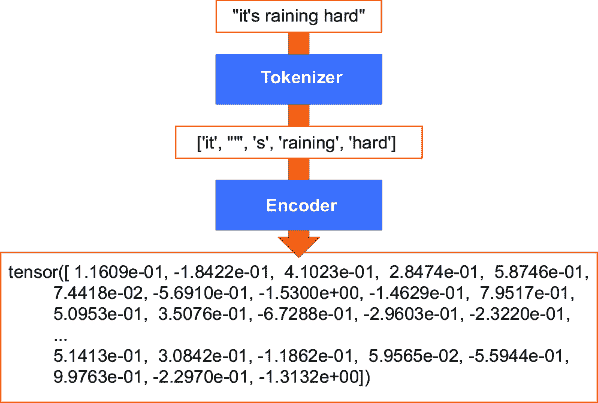
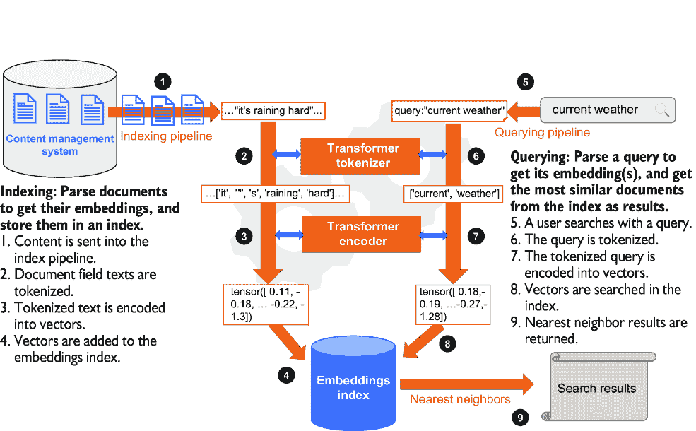
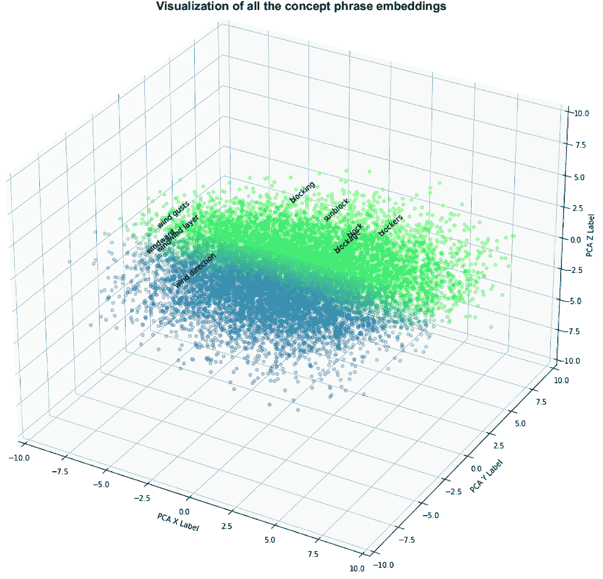
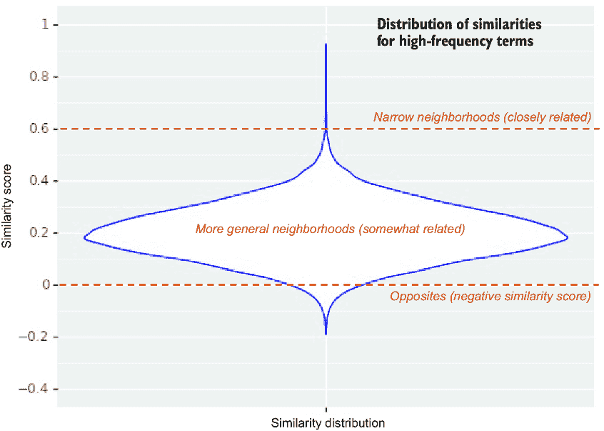
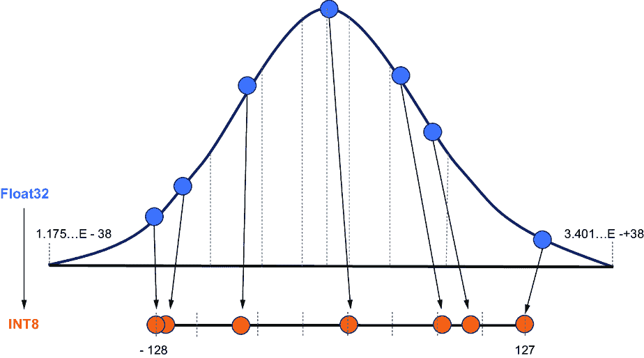
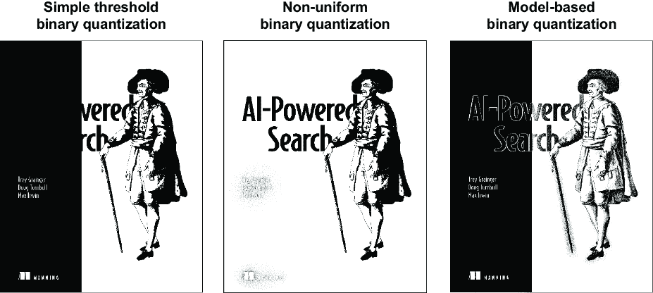
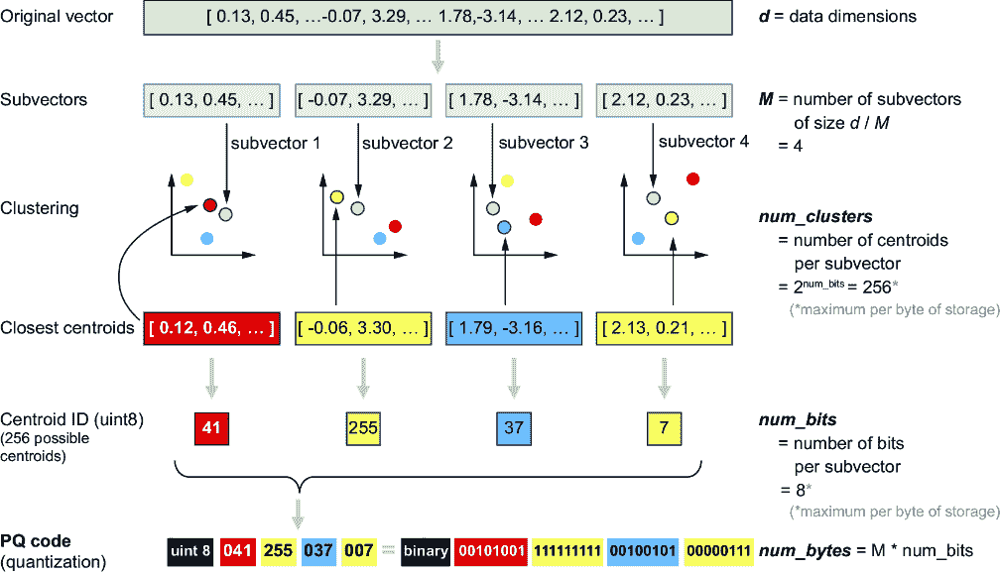
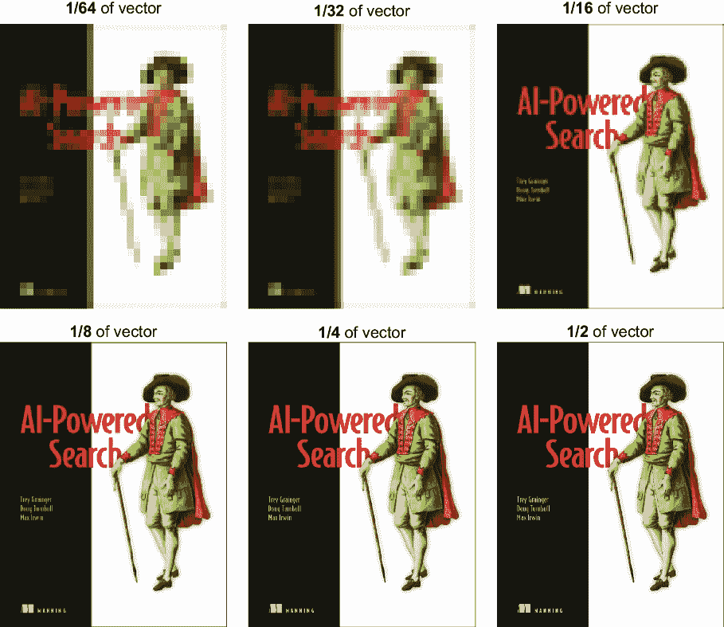
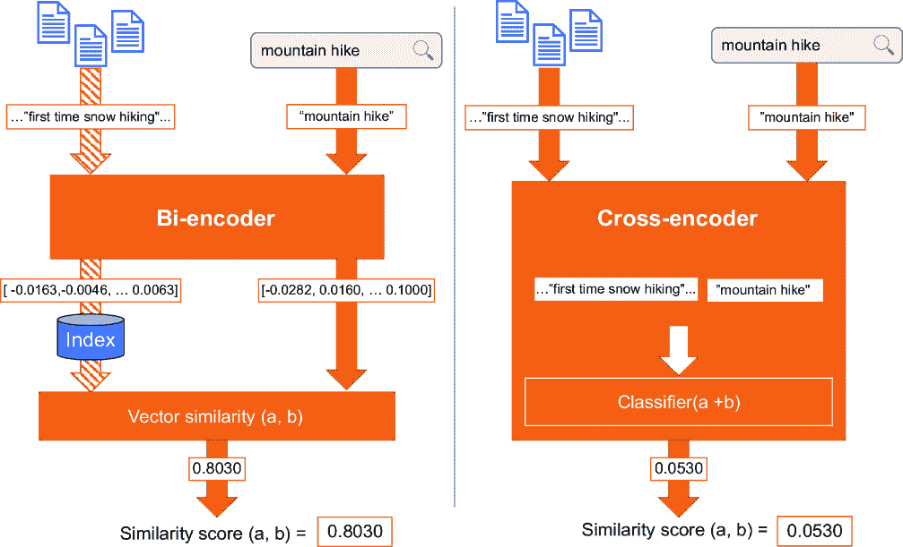

# 第十三章：使用密集向量进行语义搜索

### 本章涵盖

+   使用 LLMs 的嵌入进行语义搜索

+   Transformers 简介及其对文本表示和检索的影响

+   使用 Transformer 模型构建自动补全

+   使用 ANN 搜索和向量量化来加速密集向量检索

+   使用双编码器和交叉编码器进行语义搜索

在本章中，我们将开始我们的密集向量搜索之旅，其中大型语言模型（LLMs）生成的超上下文向量将显著提高对查询、文档和搜索结果的解释。生成式 LLMs（如 OpenAI 的 ChatGPT 和许多其他商业和开源替代品）也能够使用这些向量生成新内容，包括查询扩展、搜索训练数据和搜索结果摘要，我们将在接下来的章节中进一步探讨。

LLMs（大型语言模型）的尖端技术每月（有时几乎是每日）都在变化，但即使是最好的通用模型，在特定任务上也可能被针对这些任务微调的其他较小模型所超越。在接下来的几章中，我们将讨论 LLMs 背后的概念以及如何在您的搜索应用中最佳地使用它们。在本章中，我们将介绍 Transformers，并讨论如何使用它们进行语义搜索和密集向量。在第十四章中，我们将讨论如何微调 LLM 以进行问答，在第十五章中，我们将讨论如何利用 LLMs 和其他基础模型进行生成式搜索。

我们的故事从你在 2.5 节中学到的内容开始：我们可以将上下文表示为数值向量，我们可以使用相似度度量来比较这些向量，看哪些更接近。在第二章中，我们展示了在密集向量上搜索的概念，这是一种称为*密集向量搜索*的技术，但我们的例子简单且人为（基于虚构的食物属性进行搜索）。在本章中，我们将提出问题：“我们如何将现实世界的非结构化文本转换为高维密集向量空间，该空间试图模拟文本表示的实际意义？”以及“我们如何使用这种知识表示来为高级搜索应用服务？”

## 13.1 通过嵌入表示意义

我们将使用语言翻译作为例子来理解我们所说的“密集向量”嵌入的含义。以下两句：“Hello to you!”（英语）和“Barev Dzes”（亚美尼亚语）。这两个表达大约具有相同的意义：每个都是问候，带有一些隐含的正式感。

计算上，为了成功回应“Hello to you!”这样的问候，机器必须同时理解提示的意义以及所有可能的理想回应，在相同的向量空间中。当答案确定后，机器必须通过从答案的向量表示中生成标签来表达它给一个人的信息。

这种意义的向量表示称为*嵌入*。嵌入在自然语言处理（NLP）任务中可以互换使用，并且可以进一步塑形以满足特定用例。我们在第九章中生成了来自 LLM（`all -mpnet-base-v2`）的嵌入，但我们忽略了关于嵌入如何工作的大多数细节。在本章中，我们将介绍从文本中获取嵌入的技术和工具，并将它们用于显著增强我们搜索引擎中的查询和文档解释。

##### 自然语言处理

自然语言处理（NLP）是一套技术和工具，它将非结构化文本转换为机器可操作的数据。NLP 领域相当广泛，包括许多研究领域和待解决的问题（NLP 任务）。NLP-Progress 网站上维护了一个问题领域 comprehensive 列表（[`nlpprogress.com`](https://nlpprogress.com)）。

我们将特别关注将自然语言处理（NLP）应用于信息检索，这是人工智能搜索的一个重要要求。

一个重要的要点需要提前指出：在我们提到的两个简短的英语和亚美尼亚问候语背后，有着深刻的文化细微差别。每一个都承载着丰富的历史，学习它们因此承载了这些历史的背景。这与我们在第五章中探讨的语义知识图谱的情况相同，但那些只使用了搜索引擎内文档的上下文作为它们的模型。Transformer 通常在更大的文本语料库上训练，从而从外部来源引入了更多的这种细微的上下文。

我们可以将人脑作为 Transformer 模型如何学习表示意义的类比。你们作为婴儿、儿童、青少年以及更久之前，是如何学习词语的意义的呢？你们被告知，并吸收了知识和其表现形式。教你们的人已经拥有了这种知识和表达能力。除了有人指出一只猫并对你们说“kitty”之外，你们还观看了电影和视频，然后转向文学和教学材料。你们阅读书籍、博客、期刊和信件。通过所有这些经历，你们将这些知识融入大脑，创建了一个概念及其相互关系密集的表示，使你们能够对它们进行推理。

我们能否将我们从语言能力中获得的内容传授给机器，并期待它们在查询时能够理解和合理地做出回应？请系好你们的帽子！

## 13.2 使用密集向量进行搜索

理解何时使用密集向量进行搜索而不是稀疏向量，需要了解如何处理和关联文本。本节简要回顾了与密集向量搜索相比，稀疏向量搜索是如何工作的。我们还将介绍*最近邻搜索*作为密集向量搜索中用于相似度的一种类型，与 BM25（用于稀疏向量搜索的最常见相似度函数）相比。

##### 基于向量的最近邻搜索

也称为 KNN（*k*-最近邻），基于向量的最近邻搜索是将具有统一维度的数值向量索引到数据结构中，并使用查询向量搜索该数据结构以找到最近的`k`个相关向量的问题空间。我们在第三章中提到，有许多相似度度量用于比较数值向量：余弦相似度、点积、欧几里得距离等。在本章中，我们将使用余弦相似度（作为单位归一化向量上的点积实现）进行向量相似度比较。

### 13.2.1 稀疏向量的简要复习

稀疏向量搜索通常使用倒排索引实现。倒排索引就像你在任何教科书后面找到的那样——一个列出术语及其在源内容中位置的列表。为了有效地查找文本，我们通过处理和规范化标记到一个字典中，该字典包含对帖子（文档标识符和它们出现的位置）的引用来构建索引。结果数据结构是一个稀疏向量表示，允许快速查找这些标记。

在搜索时，我们对查询词进行分词和规范化，并使用倒排索引匹配文档命中以进行检索。然后我们应用 BM25 公式对文档进行评分并按相似度进行排序，正如我们在第 3.2 节中所述。

为每个查询词和文档特征应用分数可以为我们提供快速且相关的搜索，但这个模型受限于“查询词依赖”的相关性模型，其中检索和排序的是术语（及其规范化形式）。问题是它使用查询词字符串的存在（和计数）来搜索和排序，而不是这些字符串所代表的*意义*。因此，相关性分数仅在相对意义上有用，只能告诉你哪些文档与查询最匹配，但不能衡量任何文档是否是客观上的良好匹配。正如我们将看到的，密集向量方法可以提供更全局的相关性感知，并且可以在查询之间进行比较。

### 13.2.2 概念密集向量搜索引擎

当我们处理文档时，我们希望捕捉内容的意义，当搜索时，我们希望根据查询的意义和意图进行检索和排序。带着这个目标，我们处理文档以生成嵌入，然后将这些嵌入存储在搜索索引中。在搜索时，我们处理查询以获取嵌入，并使用这些查询嵌入来搜索索引中的文档嵌入。图 13.1 显示了此过程的简化图，我们将在第 13.4 节中对其进行扩展。


##### 图 13.1 构建和搜索嵌入索引。内容从左侧处理并添加到索引中，用户查询索引以检索结果。

文档和查询的嵌入存在于同一个向量空间中。这一点非常重要。如果您将文档映射到一个向量空间，而将查询映射到另一个向量空间，您将会匹配苹果和橙子。为了有效地工作，嵌入必须属于同一个空间。

但“嵌入”究竟是什么，我们如何搜索它呢？嗯，嵌入是表示某些集合数量的维度的向量，代表信息。这些信息可以是查询、文档、单词、句子、图像或视频，或任何其他类型的信息。

##### 嵌入范围和分块

在处理嵌入时，一个重要的工程任务是确定嵌入的正确粒度级别。嵌入可以用来表示单个单词、句子、段落或更大的文档。

在生成嵌入时，通常很有用将较大的文档分解成部分，并为每个部分生成一个单独的嵌入，这个过程称为*分块*。您可以通过句子、段落或其他概念边界来分块内容，甚至可以创建重叠的分块以确保分割文档的过程不会破坏分割之间的相关上下文。

如果您的搜索引擎支持多值向量场，您可以将多个嵌入索引到单个文档中，并根据其任何嵌入进行匹配。或者，您可以为每个块索引一个单独的文档，每个文档包含一个嵌入，并将原始文档 ID 作为字段存储，以便在索引的块文档匹配时返回。

对于非常大的块来说，很难完全由嵌入表示，就像对于非常小的块来说，很难包含嵌入所需的全部上下文一样，因此确定您应用程序的正确分块粒度可能是提高召回率的一个重要考虑因素。

由于嵌入表示为向量，我们可以使用余弦相似度（在第 2-3 章中进行了深入探讨）或另一种类似的距离测量来比较两个嵌入向量，并得到一个相似度分数。这允许我们将查询的向量与我们要搜索的内容中所有文档的向量进行比较。与查询向量最相似的文档向量被称为*最近邻*。图 13.2 用三个二维向量说明了这一点。

按照相似度从高到低的顺序，图 13.2 中显示的向量之间的余弦相似度如下：

+   `cos(b, c) = 0.9762`

+   `cos(a, b) = 0.7962`

+   `cos(a, c) = 0.6459`

从视觉和数学上都很明显，`b`和`c`彼此最接近，因此我们说`b`和`c`是这三个向量中最相似的。


##### 图 13.2 在笛卡尔平面上绘制了三个向量（a、b 和 c）。使用 cos*q*函数说明了 a 和 b 之间，以及 b 和 c 之间的相似性。

我们可以轻松地将余弦相似度应用于任何长度的向量。在三维空间中，我们比较具有三个特征 `[x, y, z]` 的向量。在密集向量嵌入空间中，我们可能使用具有数百或数千维的向量。但无论维数的数量如何，公式都是相同的，如图 13.3 所示。


##### 图 13.3 两个向量余弦相似度的公式

详见第 3.1 节，回顾使用这种余弦相似度计算来评分向量之间的相似度。在那里，我们探讨了计算向量之间的余弦相似度和点积的示例。然而，从余弦相似度的公式（图 13.3）中，你可以看到余弦值等于点积（`a` `.` `b`）除以向量长度的乘积（`|a| x |b|`）。这意味着如果我们能将向量`a`和`b`的特征归一化，使得每个向量的长度都是`1`（这个过程称为*单位归一化*），那么余弦相似度和点积是相等的：

```py
1 = |a| = |b|
cos(a, b) = (a . b) / |a| x |b|
cos(a, b) = (a . b) / (1 x 1)
cos(a, b) = a . b
```

当一个向量的长度等于`1`时，它被称为*单位归一化向量*。但为什么我们会关心这样的向量归一化呢？好吧，实际上计算点积比计算余弦相似度要高效得多，因为不需要除以每个向量的模长（这需要使用勾股定理来计算每个向量特征的平方和的平方根）。由于余弦计算通常是评分大量文档时搜索中最昂贵的部分，因此在索引时间对向量进行单位归一化，并在搜索时间使用单位归一化查询向量与索引向量进行点积，可以显著加快搜索速度，同时提供相同的结果：

```py
vector_a = [5.0, 3.0]
vector_b = [6.0, 2.0]

unit_vector_a  #1
  = unit_normalize(vector_a)  #1
  = unit_normalize([5.0, 3.0])  #1
  = [5.0 / sqrt(5.0² + 3.0²), 3.0 / sqrt(5.0² + 3.0²)]  #1
  = [0.8575,  0.5145]  #1
  #1
unit_vector_b  #1
  = unit_normalize(vector_b)  #1
  = unit_normalize([6.0, 2.0])  #1
  = [6.0 / sqrt(6.0² + 2.0²), 2.0 / sqrt(6.0² + 2.0²)]  #1
  = [0.9487, 0.3162]  #1

cos(vector_a, vector_b)  #2
  = cos([5.0, 3.0], [6.0, 2.0])  #2
  = (5.0 x 6.0 + 3.0 x 2.0) /  #2
    (sqrt(5.0² + 3.0²) x sqrt(6.0² + 2.0²))  #2
  = 0.9762  #3

dot_product(unit_vector_a, unit_vector_b)  #4
  = dot_product([0.8575, 0.5145], [0.9487, 0.3162])  #4
  = (0.8575 x 0.9487) + (0.5145 x 0.3162)  #4
  = 0.9762  #3
```

#1 将向量 a 和 b 归一化为单位向量。所有索引向量在索引之前都会进行这种归一化处理。

#2 完整的余弦相似度计算。注意分母对每个向量的平方和进行开方运算。

#3 cos(vector_a, vector_b) = dot_product(unit_vector_a, unit_vector_b) = 0.9762

#4 单位归一化向量的点积计算。注意没有分母，并且乘积特征权重的和要简单得多。

虽然从概念上我们仍在执行余弦相似度（由于单位归一化向量），但使用点积允许我们在查询时进行实质上更快的计算。由于这种优化是可能的，因此在生产中执行完整的余弦相似度计算在性能上并不是一个好主意。虽然有一些针对特定用例的好理由，你可能会选择执行余弦而不是点积，例如忽略或考虑向量的幅度（参见第 3.1.4 节以刷新记忆），但你几乎总是至少*实现*使用单位归一化向量和点积计算来执行余弦相似度，出于性能原因。为了强化最佳实践，当实现余弦相似度时，我们将一致地在所有剩余的代码列表中利用这种模式。

##### 优化向量搜索的计算性能和成本

执行向量相似度计算可能在大规模下变得缓慢且计算成本高昂，因此了解如何进行正确的权衡以优化性能和成本是很重要的。

由于点积的计算速度比余弦相似度快得多，我们建议你始终通过索引单位归一化向量，然后在搜索时在文档向量和单位归一化查询向量之间执行点积计算来实现余弦相似度。此外，使用其他优化技术通常可以显著节省内存并大幅提高搜索时间：

+   使用近似最近邻（ANN）方法快速筛选出前*N*个结果进行排名，而不是所有文档（在第 13.5.3 节中介绍）

+   将向量量化（压缩）以减少表示向量中每个特征所需的位数（在第 13.7 节中介绍）

+   使用玛特罗什卡表示学习（MRL）仅索引和/或搜索嵌入的关键部分，同时仍然保持大部分召回率（在第 13.7 节中介绍）

+   使用更便宜的搜索算法或相似度度量标准过度请求有限数量的优化搜索结果，然后使用更昂贵的相似度度量标准重新排名前*N*个结果（在第 13.5.3 节和 13.7 节中介绍）

在能够执行密集向量搜索和最近邻相似度的情况下，下一个关键步骤是找出生成这些神秘嵌入的方法。

## 13.3 通过使用 Transformer 编码器获取文本嵌入

在本节中，我们将介绍 Transformer 及其如何表示意义。我们还讨论了它们如何被用来将这种意义编码到嵌入中。

### 13.3.1 什么是 Transformer？

Transformers 是一类深度神经网络架构，它们被优化为将意义编码为嵌入，并从嵌入中解码意义。基于文本的 Transformers 通过首先使用句子中的周围上下文（编码部分）将术语标签表示为密集向量，然后利用输出模型将向量转换为不同的文本表示（解码部分）来实现这一点。

这种方法的一个美妙特性是编码和解码之间的关注点分离。我们将利用这个特性，仅使用编码机制来获取嵌入，然后我们可以将其用作与任何解码步骤无关的意义的语义表示。

##### 表示意义

回想一下第 13.1 节介绍中的英语和亚美尼亚问候语示例。使用专门为英语到亚美尼亚语言翻译设计的 Transformer 和数据集，可以训练一个模型将两个短语“Hello to you!”和“Barev Dzes”编码成几乎相同的密集向量。然后，这些向量可以被解码回文本，以翻译或重构更接近原始文本的内容。

让我们从理解 Transformer 编码模型的训练方式和它们最终学习到什么开始我们的 Transformer 之旅。为了理解 Transformer 背后的动机和机制，了解一些基础概念的历史是很重要的。

那一年是 1953 年。你发现自己在一个教室里，和其他 20 个学生一起，每个人坐在自己的桌子前。你的桌子上有一支铅笔和一张纸，上面写着句子 `Q:` `I` `went` `to` `the ________ and` `bought` `some` `vegetables.` 你已经知道该怎么做，你在空白处写下“store”。你瞥了一眼坐在你旁边桌子上的同学，他们写的是“market”。一阵铃声响起，答案被统计。最常见的答案是“store”，还有几个答案是“market”和“grocer”。这是完形填空测试。它的目的是测试阅读理解。

现在，你被带到了 1995 年。你坐在另一个教室里，学生们正在参加另一场考试。这次，你的试卷上有一段非常长的段落。看起来大约有 60 个单词长，有些复杂：

> 我们所在的是沼泽地区，靠近河流，随着河流的蜿蜒，离海有二十英里。我在一个难忘的阴雨下午接近傍晚时，似乎获得了对事物本质的第一印象。在这样的时刻，我确信这个长满荨麻的荒凉地方是教堂墓地。

在段落之后，列出了一个带有答案提示的问题：`Q:` `How` `far away` `from` `the` `sea` `is` `the churchyard? A:________`。你在空白处写下，“二十英里”。你刚刚完成了一打问题中的一个问题，这是纽约州教育委员会英语阅读理解测试的一部分。具体来说，这是测试你的注意力。

这两项测试是我们衡量书面语言理解能力的基础。要能够通过这些测试，你必须阅读，阅读，再阅读，并且还要多读一些。实际上，当大多数人在学校参加这些测试时，他们已经练习阅读大约 14 年了，并且积累了大量的背景知识。

这些理论构成了 LLMs（在大量文本上训练的自然语言处理模型）的基础——例如，整个网络 Common Crawl 数据集。

自然语言处理领域的重大突破在 2018 年由谷歌的研究人员（雅各布·德夫林等人）发表的一篇论文中达到顶峰，这篇论文的标题是 *BERT：用于语言理解的深度双向变换器预训练*，它利用了 Cloze 测试和 Transformer 中的注意力机制，在许多语言理解基准测试中达到了最先进的性能（[`arxiv.org/pdf/1810.04805`](https://arxiv.org/pdf/1810.04805)）。

BERT 特别通过向自己展示 Cloze 测试来进行自我学习。训练方式是“自监督”，这意味着它是监督学习，但被构造成一个无监督任务。这是理想的，因为它不需要在初始模型预训练之前手动标记数据。你可以给它任何文本，它将自行进行测试。在训练环境中，Cloze 测试被称为 *掩码语言模型*。模型从一个更基本的嵌入（例如，使用众所周知的 word2vec 或 GloVe 库对词汇表中的每个单词进行嵌入）开始，并将随机删除句子中的 15%的标记进行测试。然后模型优化一个损失函数，这将导致 Cloze 测试的成功率更高。此外，在训练过程中，它使用周围的标记和上下文（注意力）。给定单个训练示例中的向量，训练后的输出向量是一个包含单词及其周围上下文深度学习表示的嵌入。

如果你对 Transformers 和 BERT 感兴趣，我们鼓励你通过阅读这篇论文来了解更多信息。然而，现在你需要了解的只是如何从 BERT 编码器中获取嵌入。基本概念如图 13.4 所示。



##### 图 13.4 Transformer 编码器

在图 13.4 中，我们首先通过分词器处理文本。分词器将文本分割成*词元*，这些是词汇表中的预定义单词部分。这个词汇表在模型训练之前就已经建立。例如，术语“It’s”在分词过程中将被分割成三个词元：`it`，`'`和`s`。BERT 论文中使用的词汇表包含 30,000 个词元。BERT 还使用特殊的词元来表示句子的开始和结束：分别是`[CLS]`和`[SEP]`。一旦分词，标记流将被传递到 BERT 模型进行编码。编码过程随后输出一个*tensor*，这是一个向量数组（每个标记一个向量）。

### 13.3.2 公开可用的预训练 Transformer 模型

虽然 Transformer 使得构建最先进的语言模型成为可能，但拥有从头开始构建它们的知识和资源对于许多人来说可能是一个巨大的障碍。与 Transformer 一起工作的一个非常重要的方面是庞大的社区和开源工具集，这使得任何工程师都能快速开始使用这项技术。只需要一些 Python 知识和互联网连接即可。

通过这个过程从头开始训练的模型很大，大小从几百 MB 到几百 GB 不等，通常需要相似数量的 GPU 内存（VRAM）来快速运行它们。训练本身也需要大量的昂贵计算能力和时间，因此能够使用现有的模型作为起点提供了显著的优势。我们将在下一节中利用这个优势，开始应用这些模型之一来进行搜索。

## 13.4 将 Transformer 应用于搜索

在本节中，我们将构建一个高度准确的自然语言自动补全搜索，它将根据术语的前缀推荐更精确的相关关键词。我们将通过首先将语料库文本通过 Transformer 来获取嵌入索引来实现这一点。然后，我们将在查询时使用这个 Transformer 来获取查询嵌入，并在嵌入索引中搜索与最相似嵌入的*k*个最近文档。图 13.5 是一个展示此过程步骤的架构图。



##### 图 13.5 使用 Transformer 编码向量进行端到端搜索的概念架构

我们有一个内容来源，一个最近邻索引，一种从 Transformer 中检索向量的方法，以及一个相似度公式。我们现在可以构建所有这些组件的管道来处理和索引内容，然后根据查询检索和排名文档。

### 13.4.1 使用 Stack Exchange 户外数据集

在第五章中，我们介绍了 Stack Exchange 的几个数据集。我们选择在这里使用另一个数据集，Stack Exchange 的户外数据集，有一个非常重要的原因：户外问题与答案领域的词汇和上下文在我们的 Transformer 模型中已经得到了很好的覆盖。具体来说，Wikipedia 在训练许多 Transformer 模型时被使用，Wikipedia 有一个专门关于户外内容的章节（[`en.wikipedia.org/wiki/Outdoor`](https://en.wikipedia.org/wiki/Outdoor)）。

注意：第 13-15 章中使用的户外示例，以及其他章节中提到的 Stack Exchange 数据集，均由 Stack Exchange 根据 CC-by-SA 4.0 许可证授权：[`creativecommons.org/licenses/by-sa/4.0`](https://creativecommons.org/licenses/by-sa/4.0)。

以下列表展示了创建户外集合并随后索引户外问题和答案数据的过程。

##### 列表 13.1 索引户外数据集

```py
outdoors_collection = engine.create_collection("outdoors")
outdoors_dataframe = load_outdoors_data("data/outdoors/posts.csv")
outdoors_collection.write(outdoors_dataframe)
```

这是第 13.1 节中创建的`outdoors`集合的架构：

```py
root
 |-- id: *integer* (nullable = true) 
 |-- accepted_answer_id: *integer* (nullable = true) 
 |-- parent_id: *integer* (nullable = true) 
 |-- creation_date: *timestamp* (nullable = true) 
 |-- score: *integer* (nullable = true) 
 |-- view_count: *integer* (nullable = false) 
 |-- body: *string* (nullable = true) 
 |-- owner_user_id: *string* (nullable = true) 
 |-- title: *string* (nullable = true) 
 |-- tags: *array* (nullable = true) 
 |    |-- element: *string* (containsNull = true) 
 |-- answer_count: *integer* (nullable = true) 
 |-- post_type: *string* (nullable = true) 
 |-- url: *string* (nullable = true)
```

索引的数据集包含代表问题和答案的文档，答案通过`parent_id`字段链接到其原始问题。每个文档都包含一个`post_type`字段，用于区分它是否包含“问题”或“答案”。

以下列表显示了一个问题帖子和其相关的答案。

##### 列表 13.2 探索关于`攀岩结`的问题的帖子数据

```py
[{"id": "18825",
  "accepted_answer_id": 18826, #1
  "body": "If I wanted to learn how to tie certain knots, 
  ↪or learn about new knots and what they're used for, 
  ↪what are some good resources to look up?",
  "title": "What's a good resource for learning to tie knots for climbing?",
  "post_type": "question"},  #2
 {"id": "24440",  #3
  "parent_id": 18825,  #3
  "body": "Knots and Ropes for Climbers by Duane Raleigh is a fantastic
  ↪illustrated resource tailored specifically to climbers. The ABoK
  ↪is great, but a but beyond the pale of what the average rock...",

 "post_type": "answer"},   #4
 {"id": "18826",  #5
  "parent_id": 18825,  #3
  "body": "Animated Knots By Grog Arguably the best resource online for knot
  ↪tying is Animated Knots by Grog , it's used by virtually every avid
  ↪knot tyer I've known. They have excellent step-by-step animatio...",
  "post_type": "answer"}]  #4
```

#1 文档 18826 被标记为问题的接受答案。

#2 这是我们的问题文档。

#3 这些文档是第一个文档（id=18825）中问题的答案。

#4 这些是与问题相关的答案文档。

#5 这是被标记为问题接受答案的文档（接受答案 _id=18826）。

在前面的列表中，第一个文档是与查询`攀岩结`最相关的问题。该问题有两个答案，通过每个答案上的`parent_id`字段链接回父问题。其中之一已被选为接受答案，通过在问题文档上设置`accepted_answer_id`字段（在本例中为 18826）来识别。

问题文档的`body`字段包含对问题的详细说明，而答案的`body`字段包含完整的答案。只有问题帖子有一个`title`，它是问题的摘要。其他几个字段（如`view_count`、`answer_count`和`owner_user_id`）在此省略，但在完整数据集中作为元数据字段提供，这有助于使用 BM25 与其他信号混合进行搜索相关性。

现在你已经熟悉了数据模型，让我们花点时间尝试一些查询，看看会返回什么类型的问题。以下列表搜索与常见查询匹配的问题。

##### 列表 13.3 对`攀岩` `结`运行基本的词汇搜索

```py
def search_questions(query, verbose=False):
  request = {"query": query,
             "query_fields": ["title", "body"],  #1
             "limit": 5,
             "return_fields": ["id", "url", "post_type", "title",
                               "body", "accepted_answer_id", "score"],
             "filters": [("post_type", "question")],
             "order_by": [("score", "desc"), ("title", "asc")]}
  response = outdoors_collection.search(**request)
  display_questions(query, response, verbose)

search_questions("climbing knots")
```

#1 将查询与标题和正文字段匹配。

响应：

```py
Query: climbing knots

Ranked Questions:
Question 21855: What are the four climbing knots used by Jim Bridwell?
Question 18825: What's a good resource for learning to tie knots for clim...
Question 18814: How to tie a figure eight on a bight?
Question 9183: Can rock climbers easily transition to canyoning?
Question 22477: Tradeoffs between different stopper knots
```

我们可以看到，这些对于这个词汇查询来说是有些相关的标题。但这仅仅是一个基本的关键词搜索。其他查询的表现远不如这个；例如，在下一条列表中的查询`What is DEET`显示了非常不相关的结果。

##### 列表 13.4 基本词汇匹配可能导致不相关结果

```py
search_questions("What is DEET?")
```

响应：

```py
Query What is DEET?:

Ranked Questions:
Question 20403: What is bushcrafting?
Question 20977: What is "catskiing"?
Question 1660: What is Geocaching?
Question 17374: What is a tent skirt and what is its purpose?
Question 913: What is a buff?
```

这显示了传统词汇搜索如何失败于常见的自然语言用例。具体来说，倒排索引受到查询-术语依赖问题的困扰。这意味着查询中的术语被匹配为字符串与索引中的术语。这就是为什么你在列表 13.4 的结果中看到对`what is`的强匹配。查询的意义没有被理解，因此检索只能基于字符串匹配。

本章的其余部分将提供使用 Transformers 进行自然语言搜索所需的基本知识，而在第十四章中，我们将解决列表 13.4 中明显的问题-回答问题。

### 13.4.2 微调和语义文本相似度基准

使用预训练的 Transformer 模型通常不会为特定任务的提示产生最佳结果。这是因为初始训练是在没有特定用例或领域的通用语言环境中进行的。本质上，它是“未调优”的，以这种方式使用模型类似于在搜索引擎中索引内容而不进行相关性调优。

要实现 Transformers 的全部潜力，它们需要被微调以完成特定任务。这被称为**微调**——即通过在更适合目的的数据上训练预训练模型，以实现特定用例目标的过程。对于自动补全和语义搜索，我们感兴趣的是微调以完成文本相似度发现任务。

这将带我们来到语义文本相似度基准（STS-B）的训练和测试集([`ixa2.si.ehu.eus/stswiki/`](https://ixa2.si.ehu.eus/stswiki/))。这个基准包括语义相似和不相似的段落，并且它们被相应地标记。使用这个数据集，模型可以被微调以提高一组术语与语料库中许多段落之间的最近邻搜索的准确性，这将是本章中的用例。

在第十四章中，我们将微调我们自己的问题回答模型，以便你可以看到它是如何完成的。然而，在本章中，为了我们的目的，我们将使用一个已经包含为此任务预调优模型的工程：SBERT。

### 13.4.3 介绍 SBERT Transformer 库

SBERT，或称*Sentence-BERT*，是一种基于 Transformers 的技术和 Python 库，其基于这样一个理念：BERT 模型可以通过某种方式微调，使得两个语义相似的句子（而不仅仅是标记）在向量空间中应该表示得更近。具体来说，SBERT 会将一个句子中的所有 BERT 嵌入汇总成一个单一的向量。（汇总可以理解为它结合了这些值。）一旦 SBERT 汇总了这些值，它将通过使用一个专门用于学习优化 STS-B 任务的神经网络来训练句子之间的相似性。有关进一步的实施细节，请参阅 Nils Reimers 和 Iryna Gurevych 撰写的“Sentence-BERT”论文（[`arxiv.org/abs/1908.10084`](https://arxiv.org/abs/1908.10084)）。

接下来的列表将为您概述如何通过`sentence_transformers` Python 库使用 SBERT。我们将从导入名为`roberta-base-nli-stsb-mean-tokens`的预训练模型开始，该模型基于 RoBERTa 架构。将 RoBERTa 视为 BERT 的进化版和改进版，具有优化的超参数（配置设置）和轻微的技术修改，这有助于理解。

##### 超参数

在机器学习中，超参数是指在训练之前可以更改的任何参数值，它们将改变学习过程并影响最终模型。

不幸的是，当你开始时，你通常不知道应该将超参数值设置为什么，因此你可能需要通过迭代和测量来学习优化的值。

在模型名称`roberta-base-nli-stsb-mean-tokens`中，我们还可以看到一些可能不认识的术语，包括“nli”和“mean-tokens”。NLI 代表*自然语言推理*（NLP 的一个子领域，用于语言预测），mean-tokens 指的是整个句子的标记化被汇总为一个标记嵌入数值的平均值。使用 mean-tokens 会返回一个整个句子的单一 768 维嵌入。

以下列表展示了如何导入`sentence_transformers`库，加载模型，并显示完整的网络架构。

##### 列表 13.5：加载 RoBERTa `SentenceTransformer`模型

```py
from sentence_transformers import SentenceTransformer
transformer = SentenceTransformer("roberta-base-nli-stsb-mean-tokens")
```

现在，PyTorch 的`transformer`对象包含了 Transformer 的神经网络架构以及所有模型权重。

加载我们的模型后，我们可以从文本中检索嵌入。这正是真正有趣的地方。我们可以将句子通过预训练模型传递到神经网络架构中，从而得到嵌入结果。在接下来的列表中，我们将对四个句子进行编码和评估。

列表 13.6 演示了如何将多个短语编码为密集向量嵌入。

##### 列表 13.6：将短语编码为密集向量嵌入

```py
phrases = ["it's raining hard", "it is wet outside",  #1
           "cars drive fast", "motorcycles are loud"]  #1
embeddings = transformer.encode(phrases, convert_to_tensor=True)  #2
print("Number of embeddings:", len(embeddings))
print("Dimensions per embedding:", len(embeddings[0]))
print("The embedding feature values of \"it's raining hard\":")
print(embeddings[0])
```

#1 我们想要编码的四个句子。我们将将这些句子全部传递给单个批次进行编码。

#2 只需调用 transformer.encode，sentence_transformers 的抽象就会为你完成所有繁重的工作。

响应：

```py
Number of embeddings: 4
Dimensions per embedding: 768
The embedding feature values of "it's raining hard":
tensor( 1.1609e-01, -1.8422e-01,  4.1023e-01,  2.8474e-01,  5.8746e-01,
        7.4418e-02, -5.6910e-01, -1.5300e+00, -1.4629e-01,  7.9517e-01,
        5.0953e-01,  3.5076e-01, -6.7288e-01, -2.9603e-01, -2.3220e-01,
        ...
        5.1413e-01,  3.0842e-01, -1.1862e-01,  5.9565e-02, -5.5944e-01,
        9.9763e-01, -2.2970e-01, -1.3132e+00])
```

在前面的列表中，我们取每个句子并将其传递给编码器。这为每个句子生成一个张量。*张量* 是一个可以存储多维值的通用数据结构。标量（单个值）、向量（标量数组）、矩阵（向量数组）或甚至是多维矩阵（矩阵数组、矩阵的矩阵等）都是不同维度的张量示例。张量是由 Transformer 编码器（如 SBERT）在编码文本时产生的。对于我们的用例，列表 13.6 中的张量是一个包含 768 个维度的嵌入，表示为浮点数。

使用我们的嵌入，我们现在可以执行余弦相似度（单位归一化向量的点积）来查看哪些短语彼此最接近。我们将比较每个短语与每个其他短语，并按相似度排序，以查看哪些最相似。这个过程在列表 13.7 和 13.8 中逐步介绍。

我们将使用 PyTorch 内置库来计算点积来完成这些比较，这允许我们通过单个函数调用传递嵌入。然后我们可以对结果相似度进行排序，并查看哪些两个短语彼此最相似，哪些两个短语最不相似。以下列表计算了短语嵌入之间的相似度。

##### 列表 13.7 比较所有短语

```py
def normalize_embedding(embedding): #1
  normalized = numpy.divide(embedding, numpy.linalg.norm(embedding))
  return list(map(float, normalized))

normalized_embeddings = list(map(normalize_embedding, embeddings))
similarities = sentence_transformers.util.dot_score(normalized_embeddings,
                                                    normalized_embeddings)
print("The shape of the resulting similarities:", similarities.shape)
```

#1 单位归一化嵌入以提高速度，因此点积等于余弦相似度

输出：

```py
The shape of the resulting similarities: torch.Size([4, 4])
```

我们在列表 13.7 中打印相似度对象的形状，以查看我们进行了多少比较。形状是 4 x 4 (`[4, 4]`)，因为我们有 4 个短语，每个短语与其他每个短语以及自身的相似度分数。所有相似度分数都在 0.0（最不相似）和 1.0（最相似）之间。这里包含形状是为了帮助展示比较多个短语复杂性。如果有 100 个短语，相似度形状将是 100 x 100。如果有 10,000 个短语，相似度形状将是 10,000 x 10,000。所以，随着你添加要比较的短语，计算和空间成本将随着复杂性的 *n**²* 增加，其中 *n* 是短语的数量。

在计算了我们的四个短语的相似度后，我们按顺序打印它们在以下列表中。

##### 列表 13.8 按相似度排序并打印结果

```py
def rank_similarities(phrases, similarities, name=None):
  a_phrases = []
  b_phrases = []
  scores = []
  for a in range(len(similarities) - 1):  #1
    for b in range(a + 1, len(similarities)): #2
      a_phrases.append(phrases[a])
      b_phrases.append(phrases[b])
      scores.append(float(similarities[a][b]))  #3

  dataframe = pandas.DataFrame({"score": scores, "phrase a": a_phrases,
                                "phrase b": b_phrases})
  dataframe["idx"] = dataframe.index  #4
  dataframe = dataframe.reindex(columns=["idx", "score",
                                         "phrase a", "phrase b"])

  return dataframe.sort_values(by=["score"],  #5
                               ascending=False,  #5
                               ignore_index=True)  #5

dataframe = rank_similarities(phrases, similarities)
display(HTML(dataframe.to_html(index=False)))
```

#1 将所有短语对附加到数据框中。

#2 我们不会重复短语或附加短语相似度，因为它始终是 1.0。

#3 获取每对分数。

#4 添加索引列

#5 对分数进行排序（ascending=False 以显示最高分数）。

响应：

```py
idx  score     phrase a           phrase b
0    0.669060  it's raining hard  it is wet outside
5    0.590783  cars drive fast    motorcycles are loud
1    0.281166  it's raining hard  cars drive fast
2    0.280800  it's raining hard  motorcycles are loud
4    0.204867  it is wet outside  motorcycles are loud
3    0.138172  it is wet outside  cars drive fast
```

我们现在可以看到，彼此最相似的短语是“it’s raining hard”和“it is wet outside”。我们还看到汽车和摩托车之间存在强烈的相似性。

两个最不相似的表达是“外面很湿”和“汽车开得快”。从这些例子中可以非常清楚地看出，这个语义编码过程正在起作用——我们可以将雨与外面很湿联系起来。密集的向量表示捕捉了上下文，尽管单词不同，但意义仍然存在。注意分数：前两个相似比较的分数大于 0.59，下一个最接近的比较分数小于 0.29。这是因为只有前两个比较看起来彼此相似，正如我们在自然语言理解（NLU）任务中感知的那样。作为聪明的人，我们可以将雨和湿（“天气”）分组，我们也可以将汽车和摩托车（“车辆”）分组。还有一点很有趣，当地面湿的时候，汽车可能开得更慢，这可能是最后一对相似度低的原因。

## 13.5 自然语言自动补全

既然我们知道我们的向量编码和相似性处理工作良好，现在是时候将这种嵌入技术应用于实际的搜索用例——自然语言自动补全！

在本节中，我们将展示在搜索时使用句子转换器的实际应用，以及一个基本的快速语义自动补全实现。我们将把迄今为止所学的内容应用到从户外数据集中提取概念。使用 spaCy（我们在第五章中使用的 Python NLP 库），我们将分块名词和动词以获取户外概念。我们将这些概念放入字典中并处理它们以获取它们的嵌入。然后，我们将使用字典在近似最近邻（ANN）索引中进行实时查询。这将使我们能够输入一个前缀或一个术语，并获取字典中存在的最相似的概念。最后，我们将按相似度顺序将这些概念展示给用户，演示智能的自然语言自动补全。

经验和测试表明，即使在大多数经过良好调整的搜索引擎建议器中，这种方法也表现得更好。我们将看到它产生的噪声更少，而且相似但拼写不同的术语也会自动包含在建议中。这是因为我们不是在比较关键字字符串；而是在比较嵌入，它们代表意义和上下文。这是在 1.2.4 节中介绍的“寻找事物，而不是字符串”的体现。

### 13.5.1 为我们的最近邻词汇获取名词和动词短语

使用我们在第五章中学到的知识，我们将编写一个简单的函数从语料库中提取*概念*。我们不会包括任何分类层次结构，也不会在这里构建一个完整的知识图谱。我们只想得到一个可靠的使用频率较高的名词和动词列表。

我们示例中的概念是人们通常搜索的重要的“事物”和“动作”。我们还需要理解数据集，这最好通过花时间审查概念以及它们之间的关系来实现。在构建任何搜索应用时，理解语料库至关重要，使用高级 NLP 技术也不例外。

以下列表展示了一种策略，它将为我们的词汇表提供合理的候选概念基线，同时从自动完成结果中去除显著的噪声。

##### 列表 13.9 使用 spaCy Matcher 获取所需文本部分

```py
nlp = spacy.load("en_core_web_sm")  #1
phrases = []  #2
sources = []  #3
matcher = Matcher(nlp.vocab) #4
nountags = ["NN", "NNP", "NNS", "NOUN"]  #5
verbtags = ["VB", "VBD", "VBG", "VBN", ) #6
            "VBP", "VBZ", "VERB"]  #6

matcher.add("noun_phrases", [[{"TAG": {"IN": nountags},  #7
                               "IS_ALPHA": True,  #7
                               "OP": "+"}]])  #7
matcher.add("verb_phrases", [[{"TAG": {"IN": verbtags},
                               "IS_ALPHA": True, "OP": "+",
                               "LEMMA":{"NOT_IN":["be"]}}]])  #8
for doc, _ in tqdm.tqdm(nlp.pipe(yield_tuple(dataframe,  #9
                                   source_field="body",  #9
                                   total=total),)  #9
                                 batch_size=40,  #9
                                 n_threads=4,  #9
                                 as_tuples=True), #9
                        total=total): 
  matches = matcher(doc)
  for _, start, end in matches:  #10
    span = doc[start:end]  #10
    phrases.append(normalize(span))  #10
    sources.append(span.text)  #10

concepts = {}
labels = {}
for i, phrase in phrases: #11
  if phrase not in concepts:  #11
    concepts[phrase] = 0  #11
    labels[phrase] = sources[i]  #11
  concepts[phrase] += 1  #11
```

#1 加载英语 spaCy NLP 模型

#2 语料库中所有标准化名词/动词短语（“概念”）

#3 将原始文本标签标准化到概念中

#4 使用 spaCy Matcher 将模式分块为概念标签

#5 匹配名词的词性标签

#6 匹配动词的词性标签

#7 将名词短语匹配模式添加到 spaCy 分析管道中

#8 添加动词短语匹配模式。您可以添加更多 NOT_IN 模式来排除其他“停用词”动词。

#9 以 40 个文档的批次，使用 4 个线程处理每个户外问题的正文字段

#10 获取所有名词和动词短语匹配，并将它们保留在源和短语列表中

#11 通过词频聚合标准化概念

在前面的列表中，我们使用 spaCy Matcher 检测作为词性标签的模式。我们还明确地从动词概念中移除了“to be”动词的形式。在许多非有用情况下，“to be”动词被频繁使用，并经常使概念建议变得杂乱。我们可以通过移除其他噪声动词（如“have”和“can”）来进一步提高质量，但这里只是一个示例。此列表中还介绍了 spaCy 的语言管道（`nlp.pipe`）。`pipe`函数接受一个批次大小和要使用的线程数作为参数，然后以并行批次的流式处理文本（因此比为每个文档单独调用更快）。

使用列表 13.9 中的函数，我们现在可以获取概念列表。当在您的机器上运行此操作时可能需要一些时间，所以请耐心等待。以下列表返回了户外集合中最显著的概念和标签。

##### 列表 13.10 生成语料库中最频繁的概念

```py
collection = engine.get_collection("outdoors")
concepts, labels = get_concepts(collection, source_field="body",
                                load_from_cache=True)
topcons = {key: value for (key, value)
                      in concepts.items() if value > 5}
print("Total number of labels:", len(labels.keys()))
print("Total number of concepts:", len(concepts.keys()))
print("Concepts with greater than 5 term frequency:", len(topcons.keys()))
print(json.dumps(topcons, indent=2))
```

响应：

```py
Total number of labels: 124366
Total number of concepts: 124366
Concepts with greater than 5 term frequency: 12375
{
  "have": 32782,
  "do": 26869,
  "use": 16793,
  ...
  "streamside vegetation": 6,
  "vehicle fluid": 6,
  "birdshot": 6
}
```

除了获取户外数据集的概念外，列表 13.10 还对整个数据集进行了过滤，只包括频率大于`5`的概念。过滤将限制来自语料库中不常出现的术语的噪声，例如拼写错误和我们不希望在自动完成场景中建议的罕见术语。

### 13.5.2 获取嵌入

我们将执行一个复杂的归一化操作，该操作将归一化类似相关的概念。但与算法归一化（如词干提取）不同，我们正在将数据归一化到一个包含 768 个特征维度的密集向量空间。与词干提取类似，这样做的目的是为了提高*召回率*（成功返回的相关文档的百分比）。但与使用词干提取器不同，我们正在寻找并将紧密相关的概念映射在一起。提醒一下，我们只对名词和动词短语进行归一化。忽略其他单词类似于停用词去除，但这没关系，因为我们希望尽可能简洁地提出类似的概念。我们还将更好地表示剩余短语的上下文和意义。因此，周围的非名词和非动词术语是隐含的。

现在我们已经有一个概念列表（来自上一节），我们将使用我们加载的`model`（在列表 13.5 中加载的 RoBERTa 句子转换器模型）来处理它们以检索嵌入。如果你没有 GPU，这可能需要一段时间，所以我们在第一次计算嵌入后，将它们持久化到“pickle 文件”（一个可以轻松存储和从磁盘加载的序列化 Python 对象）。如果你想要重新运行笔记本，你只需加载之前创建的 pickle 文件，而无需再花半小时重新处理原始文本。

超参数警告！`minimum_frequency`术语是一个超参数，在下面的列表中设置为大于五（`>=6`），以最小化罕见术语的噪声。在本章和下一章的其他列表中，我们将遇到更多的超参数，尤其是在我们进行微调时。在你浏览了本章中其余的列表之后，我们鼓励你回来更改`minimum_frequency`的值，看看它如何改变检索到的结果。你可能找到一个更适合且更准确的价值，比我们在这里得到的价值更好。

##### 列表 13.11 检索我们的概念词汇的嵌入

```py
def get_embeddings(texts, model, cache_name, ignore_cache=False):
  ...  #1
    embeddings = model.encode(texts)
  ...  #1
  return embeddings

minimum_frequency = 6  #2
phrases = [key for (key, tf) in concepts.items() if tf >= minimum_frequency]
cache_name = "outdoors_embeddings"
embeddings = get_embeddings(phrases, transformer, 
                            cache_name, ignore_cache=False)

print(f"Number of embeddings: {len(embeddings)}")
print(f"Dimensions per embedding: {len(embeddings[0])}")
```

#1 为了简洁起见，移除了缓存代码

#2 这是一个超参数！我们正在忽略在整个语料库中出现的次数少于这个数字的术语。降低这个阈值可能会降低精确度，而提高它可能会降低召回率。

响应：

```py
Number of embeddings: 12375
Dimensions per embedding: 768
```

从列表 13.11 中，你可以看到每个嵌入都是由我们的 12,375 个概念生成的。所有嵌入都具有来自相同密集向量空间相同的维度性，因此可以直接相互比较。

图 13.6 展示了这些嵌入在 3D 图中的样子以及它们之间的关系。

图中一些概念的相似度已被标注出来，以显示意义邻域。与“风”和“块”相关的概念说明了它们在向量空间中相对于彼此的位置。我们使用维度降低将每个嵌入的 768 维降低到 3 维（*x*，*y*，*z*），以便它们可以轻松绘制。*维度降低*是一种将具有许多特征的向量压缩为具有较少特征的向量的技术。在这次降低过程中，尽可能保持向量空间中的关系。

##### 维度降低会丢失上下文

在执行维度降低时，会丢失很多上下文，因此图 13.6 中的可视化只是为了给你一个向量空间和概念相似性的直观感受，并不建议将概念降低到三维是一个理想的表示方法。



##### 图 13.6 将概念嵌入映射到 3D 可视化的向量空间

使用从列表 13.11 计算出的嵌入，我们现在可以执行大规模比较，以查看哪些术语彼此之间更为紧密相关。我们将通过计算余弦相似度——每个单位归一化嵌入与每个其他单位归一化嵌入的点积来完成此操作。请注意，在这个例子中，我们限制了要比较的嵌入数量，因为随着嵌入数量的增加，所需的计算数量呈指数增长。如果您不确定我们的意思，让我们做一些快速的计算。每个嵌入具有 768 个浮点值。比较前`250`个嵌入的结果是`250` × `250` × `768` = `48,000,000`个浮点计算。如果我们比较完整的 12,375 个嵌入列表，那将是`12,375` × `12,375` × `768` = `117,612,000,000`个浮点计算。这不仅处理速度慢，而且还需要非常大的内存。

以下列表执行了前 250 个概念的暴力比较，以评估相似度得分是如何分布的。

##### 列表 13.12 从词汇表头部探索相似度得分

```py
normalized_embeddings = list(map(normalize_embedding, embeddings))
similarities = sentence_transformers.util.dot_score(  #1
                 normalized_embeddings[0:250],  #1
                 normalized_embeddings[0:250])  #1
comparisons = rank_similarities(phrases, similarities)  #2
display(HTML(comparisons[:10].to_html(index=False)))
```

#1 找到具有最高点积得分的成对概念

#2 按照第 13.8 节列表中定义的相似度进行排名

响应：

```py
idx     score      phrase a   phrase b
31096   0.928151   protect    protection
13241   0.923570   climbing   climber
18096   0.878894   camp       camping
...
7354    0.782962   climb      climber
1027    0.770643   go         leave
4422    0.768611   keep       stay
```

如列表 13.12 所示，`scores`数据框现在包含所有相互比较的短语的排序列表，其中最相似的是“保护”和“保护”，点积相似度为`0.928`。

注意，`250`的索引是任意的，可以根据需要将更大的值用于可视化更多数据。记住我们在列表 13.7 中学到的：使用`n`个概念会产生形状为`[n, n]`的张量。这会产生列表 13.12 中示例的`250` × `250` = `62500`个相似度。

以下列表绘制了前 250 个概念比较相似度得分的分布。

##### 列表 13.13 词相似度分布

```py
from plotnine import *
candidate_synonyms = comparisons[comparisons["score"] > 0.0]
{
  ggplot(comparisons, aes("idx", "score")) +
    geom_violin(color="blue") +
    scale_y_continuous(limits=[-0.4, 1.0],
                       breaks=[-0.4, -0.2, 0, 0.2, 0.4, 0.6, 0.8, 1.0])
}
```

列表 13.13 的输出显示在图 13.7 中，分布清楚地说明了哪些概念之间最相关。您可以看到，非常少的比较具有大于`0.6`的相似度得分，而绝大多数得分低于那个值。



##### 图 13.7 展示了前 250 个概念之间通过点积相似度比较的得分分布。请注意，非常少的比较得分高于`0.6`，而大多数得分低于`0.4`（非常低的置信度）。

我们绘制了得分的分布，以便我们评估它们，并在查询时使用我们的直觉来选择一个基线相似度阈值（在列表 13.15 中稍后使用）。图 13.7 中的可视化非常有前景。由于大多数概念都被标记为不相似，我们可以可靠地选择一个足够高的数值作为质量建议的阈值（例如，本例中的`0.6`）。当我们进行搜索时的自动完成功能时，我们只对看到前五到十个建议的术语感兴趣，因此这个分布表明我们可以可靠地做到这一点。

### 13.5.3 ANN 搜索

在实现工作自动完成之前，我们还有一个更重要的问题要解决。问题是，在查询时，我们理想情况下不希望将每个搜索词与 12,375 个其他词进行比较。由于使用`sentence_transformers .util.dot_score`函数的维度和计算开销，这将是不高效的且速度慢。即使我们愿意计算所有文档的点积相似度，随着我们扩展到数百万个文档，这只会变得越来越慢，因此我们理想情况下只对有很高相似可能性的文档进行评分。

我们可以通过执行所谓的*近似最近邻*（ANN）搜索来实现这一目标。当给定一个向量时，ANN 搜索将有效地返回最相关的文档，而无需在整个语料库中计算嵌入相似度。ANN 搜索旨在以牺牲一些精度为代价，以换取改进的对数计算复杂度，以及内存和空间效率。

为了实现我们的 ANN 搜索，我们将使用索引时间策略，在专门的数据结构中预先存储可搜索的内容向量。将 ANN 搜索想象成密集向量搜索的“倒排索引”。

为了我们的目的，我们将使用*分层可导航小世界*（HNSW）图来索引和查询我们的密集向量。我们还将介绍第 13.7 节中基于聚类和哈希的其他方法，如产品量化（product quantization）和倒排文件索引（IVF）。HNSW 在其研究论文的摘要中进行了描述，论文标题为“使用分层可导航小世界图进行高效且鲁棒的近似最近邻搜索”，作者为 Yu. A. Malkov 和 D.A. Yashunin ([`arxiv.org/abs/1603.09320`](https://arxiv.org/abs/1603.09320))：

> 我们提出了一种基于可导航小世界图和可控层次结构（分层 NSW，HNSW）的近似 K 最近邻搜索的新方法……分层 NSW 逐步构建一个多层结构，该结构由存储元素嵌套子集的层次邻近图集（层）组成。

这意味着在构建索引时，HNSW 会将相似的向量聚类在一起。可导航小世界图通过将数据组织成邻域并使用可能的关系边连接这些邻域来工作。当对密集向量表示进行索引时，最合适的邻域及其潜在连接将被识别并存储在图数据结构中。

##### 不同的 ANN 方法

在本章中，我们使用 HNSW 算法进行 ANN 搜索。HNSW 在召回率和查询吞吐量之间提供了很好的平衡，并且目前（截至本文撰写时）是最受欢迎的 ANN 方法之一。然而，存在许多其他 ANN 方法，包括像局部敏感哈希（LSH）这样的简单技术。LSH 将向量空间划分为哈希桶（代表向量空间中的邻域）并将每个密集向量编码（哈希）到这些桶中的一个。虽然与 LSH 相比，HNSW 的召回率通常要高得多，但 HNSW 依赖于您的数据来生成邻域，并且邻域可能会随时间推移而移动以更好地适应您的数据。LSH 的邻域（哈希）以数据无关的方式生成，这可以更好地满足一些需要分布式系统预先分片的使用案例。我们还将介绍基于聚类和哈希的其他方法，如产品量化（Product Quantization）和倒排文件索引（IVF），在第 13.7 节中。研究不同的 ANN 算法以找到最适合您应用程序的一个可能值得您去做。

当使用密集向量查询启动 HNSW 搜索时，它会找到查询的最佳聚类入口点并搜索最近的邻居。HNSW 实现了许多其他优化技术，我们鼓励您阅读论文以了解更多信息。

### 13.5.4 ANN 索引实现

对于我们的 ANN 搜索实现，我们将首先使用一个名为非度量空间库（NMSLIB）的库。这个库包括*HNSW*算法的规范实现。

我们选择这个库的原因不仅是因为它速度快，而且使用起来也很简单，并且需要非常少的代码。Apache Lucene 还包括一个具有原生 HNSW 支持的密集向量字段类型，这使得算法在 Solr、OpenSearch、Elasticsearch 和其他基于 Lucene 的引擎（如 MongoDB Atlas Search）中可用。HNSW 的实现还可在其他搜索引擎中找到，例如 Vespa.ai、Weaviate、Milvus 等。

NMSLIB 是健壮的、经过充分测试的，并且广泛用于 ANN 应用程序。NMSLIB 也适合展示 ANN 搜索的简单性，而不涉及实现的细节。还有许多其他 ANN 库可用，我们鼓励您调查在优秀的 ANN Benchmarks 网站上列出的其中一些：[`ann-benchmarks.com`](https://ann-benchmarks.com)。

要开始使用 NMSLIB，我们只需导入库，初始化一个索引，将所有嵌入作为批次添加到索引中，然后提交。当以这种方式构建索引时，自动补全是一个理想的使用案例，因为词汇表很少更新。尽管 NMSLIB 和其他库可能在某些情况下遭受写入性能的损失，但这不会影响我们的读密集型自动补全应用程序。从实际的角度来看，我们可以将索引更新作为晚上或周末的工作离线进行，并在适当的时候部署到生产环境中。

下面的列表创建了一个包含所有 12,375 个嵌入的 HNSW 索引，然后执行了一个搜索类似“bag”这个术语的概念的示例搜索。

##### 列表 13.14 使用 NMSLIB 进行 ANN 搜索

```py
import nmslib

concepts_index = nmslib.init(method="hnsw",  #1
                             space="negdotprod")  #1
normalized_embeddings = list(map(normalize_embedding, embeddings))
concepts_index.addDataPointBatch(normalized_embeddings)  #2
concepts_index.createIndex(print_progress=True)   #3

ids, _ = concepts_index.knnQuery( #4
           normalized_embeddings[25], k=10)  #4
matches = [labels[phrases[i]].lower() for i in ids] #5
display(matches)
```

#1 使用 negdotprod 度量空间中的 HNSW 图（距离函数是-1 * 点积）初始化一个新的索引。

#2 所有嵌入都可以在一个批次中添加。

#3 将索引提交到内存。在查询最近邻之前，必须完成此操作。

#4 获取术语查询“bag”（嵌入 25）在我们的嵌入中的前 k 个最近邻。

#5 查找每个术语的标签。

输出：

```py
['bag', 'bag ratings', 'bag cover', 'bag liner', 'garbage bags', 'wag bags',
 'bag cooking', 'airbag', 'paper bag', 'tea bags']
```

在创建并提交索引后，我们运行了一个小示例，比较了术语“bag”并查看返回的内容。有趣的是，所有这些术语都是下位词，这揭示了另一个理想的结果。我们希望在自动补全时向用户提供更精确的术语。这更有可能让用户有机会选择与他们特定的信息需求最相关的术语。

在确认索引正常工作后，我们现在可以构建一个简单的查询函数，该函数接受任何术语并返回顶级建议。SBERT 使用一种技术对相似术语进行编码，以生成相似的向量嵌入。重要的是，与大多数词汇自动补全实现不同，此函数接受任何查询，无论它是否已经在我们的字典中。我们首先获取查询并通过相同的 SBERT 编码器检索嵌入，该编码器用于索引我们的文档。有了这些嵌入，我们就可以从索引中访问最近邻。如果相似度得分大于`0.75`，我们将其视为匹配并包括作为建议。使用此函数，我们可以获取完整术语的建议，例如“mountain hike”，以及前缀，例如“dehyd”。

列表 13.15 显示了我们的自动补全`semantic_suggest`函数实现，该函数执行概念的高斯搜索。我们的查询可能不在字典中，但我们可以在需要时获取嵌入。我们将使用阈值`dist>=0.75`，只返回我们对其相似性有高度信心的相似术语。

##### 选择一个好的相似度阈值

我们通过查看图 13.7 的分布得出了列表 13.15 的`0.75`阈值。这应该通过查看实际用户查询的结果质量来进一步调整。

注意：此函数可能在生产中引起 CPU 瓶颈，因此我们建议在规模上测量吞吐量并根据需要添加硬件。

##### 列表 13.15 编码查询并返回*k*个最近邻概念

```py
def embedding_search(index, query, phrases, k=20,  #1
                     min_similarity=0.75):  #1
  matches = []
  query_embedding = transformer.encode(query) #2
  query_embedding = normalize_embedding(query_embedding)
  ids, distances = index.knnQuery(query_embedding, k=k)
  for i in range(len(ids)):
    similarity = distances[i] * -1  #3
    if similarity >= min_similarity: #4
      matches.append((phrases[ids[i]], similarity))
  if not len(matches):
    matches.append((phrases[ids[1]], distances[1] * -1))  #5
  return matches

def semantic_suggest(prefix, phrases):
  matches = embedding_search(concepts_index, prefix, phrases)
  print_labels(prefix, matches)

semantic_suggest("mountain hike", phrases)
semantic_suggest("dehyd", phrases)
```

#1 为了说明目的，我们将 k 设置为 20。在实际应用中，这可能会设置在 5 到 10 之间。

#2 获取查询的嵌入

#3 将负点积距离转换为正点积

#4 我们只返回相似度在 0.75 或更高的术语。

#5 没有找到邻居！只返回原始术语

响应：

```py
Results for: mountain hike

1.000 | mountain hike
0.975 | mountain hiking
0.847 | mountain trail
0.787 | mountain guide
0.779 | mountain terrain
0.775 | mountain climbing
0.768 | mountain ridge
0.754 | winter hike

Results for: "dehyd"

0.941 | dehydrate
0.931 | dehydration
0.852 | rehydration
...
0.812 | hydrate
0.788 | hydration pack
0.776 | hydration system
```

我们做到了！现在我们可以高效地提供基于 Transformer 嵌入和近似最近邻搜索的语义自动补全。

总体而言，使用此模型查询许多查询的结果质量相当令人印象深刻。但请注意，在将此类解决方案部署给真实客户之前，使用标记数据集来衡量成功至关重要。我们将在第十四章中演示使用标记数据来衡量和改进相关性的过程。

## 13.6 使用 LLM 嵌入进行语义搜索

使用我们迄今为止所学到的知识，我们现在将密集向量搜索提升到下一个层次：我们将在搜索时将查询嵌入作为召回步骤查询文档嵌入。

我们特别从自动补全开始作为我们的第一个实现，因为这对理解语言相似性的基础知识很有帮助。在向量空间中，对事物相似或不相似有强烈的直觉是至关重要的。否则，在使用嵌入时，你将无休止地追逐召回问题。为了培养这种直觉，我们只从匹配和评分长度只有几个单词的基本概念开始。

通过这个理解，我们现在将转向比较整个句子。我们将对标题执行语义搜索。记住，我们正在 Stack Exchange 户外数据集上搜索，因此文档标题实际上是贡献者提出的问题的摘要。作为额外的好处，我们可以使用上一节中的相同实现来搜索彼此相似的标题。

此函数将主要重复上一节中的编码和相似度函数。本节中的代码甚至更短，因为我们不需要提取概念。

下面是我们将遵循的步骤：

1.  获取户外数据集中所有标题的嵌入。

1.  使用嵌入创建一个 NMSLIB 索引。

1.  获取查询的嵌入。

1.  搜索 NMSLIB 索引。

1.  显示最近邻标题。

### 13.6.1 获取标题及其嵌入

我们 NMSLIB 索引将由标题嵌入组成。我们使用与之前自动完成示例中完全相同的函数，但与转换概念不同，我们现在正在转换户外社区提出的所有问题的标题。以下列表显示了将标题编码为嵌入的过程。

##### 列表 13.16 将标题编码为嵌入

```py
outdoors_dataframe = load_dataframe("data/outdoors/posts.csv")
titles = outdoors_dataframe.rdd.map(lambda x: x.title).collect()  #1
titles = list(filter(None, titles))  #1
embeddings = get_embeddings(titles, cache_name)  #2

print(f"Number of embeddings: {len(embeddings)}")
print(f"Dimensions per embedding: {len(embeddings[0])}")
```

#1 获取户外语料库中每个问题的标题

#2 获取标题的嵌入（第一次运行时需要一点时间，直到它被缓存）

响应：

```py
Number of embeddings: 5331
Dimensions per embedding: 768
```

我们已经将 5,331 个标题编码为嵌入，图 13.8 绘制了标题嵌入相似度分布。

将图 13.8 与图 13.7 中的概念相似度分布进行比较。注意形状和分数分布略有不同，这是由于标题和概念之间的差异。图 13.7 顶部有一个更长的“针”。这是因为标题更具体，因此与更广泛的名词和动词短语的关系会有所不同。


##### 图 13.8 比较所有标题嵌入之间的相似度分数分布

### 13.6.2 创建和搜索最近邻索引

现在我们已经为语料库中所有问题标题生成了嵌入，我们可以轻松地创建最近邻索引。

##### 列表 13.17 创建 ANN 标题嵌入索引

```py
import nmslib
titles_index = nmslib.init(method="hnsw", space="negdotprod")
normalized_embeddings = list(map(normalize_embedding, embeddings))
titles_index.addDataPointBatch(normalized_embeddings)
titles_index.createIndex(print_progress=True)
```

使用我们新创建的索引，搜索变得简单！列表 13.18 显示了新的`semantic_search`函数，它实现了给定查询的标题的 ANN 搜索。这与我们为自动完成实现的列表 13.15 中的`semantic_suggest`非常相似——主要区别在于，这里的底层嵌入索引由`title`内容组成，而不是从`body`内容中提取的概念。

##### 列表 13.18 对标题执行语义搜索

```py
def semantic_search(query, phrases):
  results = embedding_search(titles_index, query, phrases,  #1
                             k=5, min_similarity=0.6)  #1
  print_labels(query, results)

semantic_search("mountain hike", titles)
```

#1 来自列表 13.15 的 embedding_search

响应：

```py
Results for: mountain hike

0.723 | How is elevation gain and change measured for hiking trails?
0.715 | How do I Plan a Hiking Trip to Rocky Mountain National Park, CO
0.698 | Hints for hiking the west highland way
0.694 | New Hampshire A.T. Section Hike in May? Logistics and Trail Condi...
0.678 | Long distance hiking trail markings in North America or parts the...
```

现在，让我们花点时间来反思这些结果。它们都是相关的吗？是的——它们都是与查询`mountain hike`绝对相关的所有问题。但是，这非常重要，它们是最相关的文档吗？我们不知道！我们不知道的原因是`mountain hike`几乎不提供任何上下文。因此，虽然标题在语义上都与查询相似，但我们没有足够的信息来确定它们是否是我们应该向用户展示的文档。

话虽如此，很明显，这种基于嵌入的搜索方法为我们的匹配和排名工具箱带来了有趣的新功能，提供了概念上关联结果的能力。这些结果是否更好取决于上下文。

到目前为止，我们通过手动实现密集向量搜索，依靠 NMSLIB 库来完成繁重的工作，但同时也向您展示了如何使用 ANN（HNSW）支持构建密集向量索引并对其进行查询。我们故意这样做是为了帮助您理解密集向量搜索的内部工作原理。然而，在您的生产系统中，您可能更倾向于使用您搜索引擎内置的密集向量搜索支持。在下一个列表中，我们将切换到使用我们的`collection`接口，通过配置的搜索引擎或向量数据库实现相同的语义搜索功能。

##### 列表 13.19 使用配置的搜索引擎执行向量搜索

```py
def display_results(query, search_results):
  print_labels(query, [(d["title"], d["score"])
                       for d in search_results])

def index_outdoor_title_embeddings(): #1
  create_view_from_collection(engine.get_collection("outdoors"),
                              "outdoors")
  outdoors_dataframe = spark.sql("""SELECT id, title FROM outdoors
                                    WHERE title IS NOT NULL""")
  ids = outdoors_dataframe.rdd.map(lambda x: x.id).collect()
  titles = outdoors_dataframe.rdd.map(lambda x: x.title).collect()
  embeddings = list(
    map(normalize_embedding,  #2
        get_embeddings(titles, cache_name)))  #2
  embeddings_dataframe = spark.createDataFrame(
    zip(ids, titles, embeddings),
    schema=["id", "title", "title_embedding"])

  collection = engine.create_collection("outdoors_with_embeddings")
  collection.write(embeddings_dataframe)
  return collection

def semantic_search_with_engine(collection, query, limit=10):  #3
  query_vector = transformer.encode(query) #4
  query_vector = normalize_embedding(query_vector)  #4
  request = {"query": query_vector,
             "query_fields": ["title_embedding"],
             "return_fields": ["title", "score", "title_embedding"],
             "quantization_size": "FLOAT32",  #5
             "limit": limit}
  response = collection.search(**request)
  return response["docs"]

embeddings_collection = index_outdoor_title_embeddings()

query = "mountain hike"
search_results = semantic_search_with_engine(embeddings_collection, query)
display_results(query, search_results)
```

#1 构建包含文档标题和嵌入的新集合

#2 为所有文档计算归一化嵌入

#3 通过对标题嵌入进行查询来返回文档

#4 将字符串查询编码和归一化，然后构建成向量搜索请求。

#5 嵌入的量化大小，在本例中为 32 位

响应：

```py
0.723 | How is elevation gain and change measured for hiking trails?
0.715 | How do I Plan a Hiking Trip to Rocky Mountain National Park, CO
0.698 | Hints for hiking the west highland way
0.694 | New Hampshire A.T. Section Hike in May? Logistics and Trail Condi...
0.678 | Long distance hiking trail markings in North America or parts the...
```

每个搜索引擎或向量数据库都有自己的独特 API 来实现关键词搜索、向量搜索、混合关键词和向量搜索以及其他功能。列表 13.19 中的`semantic_search_with_engine`函数展示了使用一个与引擎无关的接口来查询您配置的搜索引擎，尽管您可能会发现直接使用您引擎的 API 进行某些操作在更高级用例中更加强大。

我们在本章早期使用了 NMSLIB 来帮助您更好地理解密集向量搜索的内部工作原理。然而，除非您正在做非常定制化的工作，否则您可能更希望使用您搜索引擎内置的、可扩展的密集向量搜索支持，而不是像使用 NMSLIB、FAISS（我们将在本章后面介绍）或 NumPy 这样的库手动本地实现。您会注意到列表 13.19 返回的结果与列表 13.18 中 NMSLIB 实现返回的结果完全相同。

##### 使用密集向量相似度重新排序结果

在列表 13.18 中，我们选择了默认的`min_similarity`阈值，要求相似度分数为`0.6`或更高。检查图 13.8 中的标题相似度分布——您会改变这个数字使其不同于`0.6`吗？

您可以将`min_similarity`设置为低于`0.6`的值，以潜在地增加召回率，并将`k`设置为高于`5`的值作为重新排序窗口大小（例如，`250`）。然后，使用这个更大的结果集，您可以使用点积相似度进行重新排序。利用您在 10-12 章中学到的知识，您还可以将密集向量相似度作为特征（可能还有许多其他特征）纳入更复杂的排序学习模型中。

嵌入的相似度评分是成熟人工智能搜索堆栈中的许多功能之一。这种相似度将与个性化、学习排序和知识图谱结合使用，以提供强大的搜索体验。基于最近邻的密集向量搜索正迅速增长，并可能在某个时刻取代布尔匹配与 BM25 排名，成为搜索非结构化文本最常见的信息检索和排序技术。这两种方法——密集向量搜索和词汇搜索——是互补的，而结合两种方法的混合方法通常效果更好。

## 13.7 量化与表示学习以实现更高效的向量搜索

在上一节中，我们介绍了两个常用于加速密集向量搜索的概念：ANN 搜索和重排序。从概念上讲，ANN 是一种通过高效定位和过滤出最有可能与查询向量相似的前置向量，从而在查询时减少必要的向量相似度计算数量的方法。由于 ANN 搜索是对最佳结果的近似，因此通常使用更精确（且计算成本更高）的向量相似度计算对这些顶级潜在结果进行重排序，以恢复召回率和相关性，使其与非 ANN 优化的搜索相当。

表示和执行向量相似度计算所需的计算时间和内存量与被搜索向量的规模直接相关。在本节中，我们将介绍一些额外的技术来提高向量搜索的效率：

+   标量量化

+   二进制量化

+   产品量化

+   马特罗什卡表示学习

*量化*是一种用于减少数值数据表示（如嵌入向量）的内存占用和计算复杂度的技术。在嵌入的上下文中，量化涉及通过减少表示向量特征的位数来压缩它们。嵌入通常表示为浮点数（floats），默认情况下大小为 32 位（或 4 字节）。如果一个典型的向量嵌入有 1,024 个维度，这相当于 1,024 x 4 字节，即每个向量 4,096 字节（4 KB）。如果你有大量向量需要存储和搜索，这会迅速增加大量的内存和计算开销。

量化嵌入允许你以牺牲一些理想上很小量的召回率为代价，显著提高存储效率和查询速度，这对于大规模搜索系统至关重要。例如，你可以通过将每个特征转换为 8 位整数（Int8）来减少 32 位浮点数（Float32）向量的内存使用量 75%。以这种方式压缩每个维度的单个数值（标量）称为 *标量量化*。这通常可以在不显著影响召回率的情况下完成，并且当你有大量向量需要存储和搜索时特别有用。你甚至可以将每个特征量化到单个比特——一种称为 *二进制量化* 的技术——如果与使用更高精度向量在顶部-*N* 结果上重新排序的步骤结合使用，仍然可以保持相对较高的召回率。图 13.9 使用包含本书封面图像的向量（假设向量的维度代表图像中的像素）直观地展示了标量量化和二进制量化的概念。


##### 图 13.9 数据量化：全精度、降低标量精度和二进制精度

在图中，你可以看到原始图像（未量化）、标量量化图像（使用减少的颜色调色板，映射到相似的范围但颜色/精度较少）和二进制量化图像（每个像素要么是黑色要么是白色）。你会注意到标量量化图像仍然保留了原始图像的大部分重要细节，而二进制量化版本仍然可以清楚地识别，尽管丢失了一些重要数据（标题中的某些字符和颜色）。

在本节中，我们将介绍标量量化、二进制量化和另一种称为乘积量化的第三种量化类型。我们还将介绍一种称为马特罗什卡表示学习的多层嵌入方法，它可以用来动态切换已生成的嵌入的精度级别，而无需额外的量化或重新训练。

### 13.7.1 标量量化

标量量化是量化最简单的形式，其中嵌入向量中的每个值独立映射到较低精度的表示。考虑以下两个向量：

```py
[ -1.2345679,  2.2345679, 100.45679 ]  #4 bytes = 32 bits
[ -1.234,      2.234,     100.44 ]     #2 bytes = 16 bits
```

第一个向量是一个 32 位浮点表示，第二个是一个 16 位浮点表示，每个都四舍五入到最大可靠的精度。第二个向量需要的内存减少了 50%（2 字节对 4 字节），同时仍然表示大约相同的价值，只是精度较低。

这种降低精度是标量量化的一个简单例子，将更高精度的值映射到需要更少内存来存储和更少计算来处理的较低精度表示。

但如果我们想进一步压缩向量到单个字节（甚至几个比特）——我们还能做到这一点并保留大部分召回率吗？答案是肯定的，我们通常通过将浮点值范围映射到 Int8 来实现这一点，如图 13.10 所示。



##### 图 13.10 从 Float32 到 Int8 的标量量化

在图中，顶部的曲线表示浮点数范围内的值分布。由于我们从 32 位量化到 8 位，我们将 Float32 值的范围映射到更小的范围-128 到 127（如果使用无符号整数，则为 0 到 255）。根据所使用的量化算法，通常会尝试尽可能充分地利用新的范围，通过*钳位*（限制范围到最小和最大值）以及利用原始向量中值的密度，将它们更均匀地映射到新的、量化的范围内。

让我们实现一个标量量化示例，看看这种优化对索引大小、召回率和搜索速度有什么影响。存在多个用于执行标量量化的库。您可以使用`sentence_transformers.quantization`模块，或者您的搜索引擎或语言模型可能内置了自己的量化实现。我们将利用 FAISS 库来构建我们的量化索引，并使用`sentence_transformers`库和 FAISS 的组合来构建我们的每个量化示例。FAISS（Facebook AI Similarity Search）是一个开源库，旨在高效地进行密集向量的相似性搜索和聚类。它与我们在本章早期用于语义搜索的 NMSLIB 库类似，但它有一些额外的功能，包括内置的量化支持。FAISS 在密集向量搜索的生产系统中得到广泛应用，并且是实现量化索引的一个很好的选择。

我们稍后会通过一个示例来展示如何使用所选搜索引擎的`collection`抽象进行搜索，但由于并非每个搜索引擎都支持所有量化模式，并且每个搜索引擎都有不同的开销和性能特征，我们将使用 FAISS 进行基准测试。

现在我们将构建一个具有全精度 Float32 嵌入的 FAISS 索引。然后我们将将其作为基准与各种量化嵌入索引进行比较，以比较索引大小、搜索速度和召回率。列表 13.20 显示了创建全精度 Float32 嵌入并将它们索引到 FAISS 索引中的代码。

##### 列表 13.20 使用 FAISS 索引全精度嵌入

```py
from sentence_transformers.quantization import quantize_embeddings

model = SentenceTransformer(
          "mixedbread-ai/mxbai-embed-large-v1",  #1
          similarity_fn_name=SimilarityFunction.DOT_PRODUCT,
          truncate_dim=1024)  #2

def index_full_precision_embeddings(doc_embeddings, name):
  index = faiss.IndexFlatIP(doc_embeddings.shape[1])  #3
  index.add(doc_embeddings)  #4
  faiss.write_index(index, name)  #5
  return index

def get_outdoors_embeddings(model):
  outdoors_dataframe = load_dataframe("data/outdoors/posts.csv")
  post_texts = [post["title"] + " " + post["body"]
                for post in outdoors_dataframe.collect()]
  return numpy.array(
    get_embeddings(post_texts, model, "outdoors_mrl_normed"))

doc_embeddings = get_outdoors_embeddings(model)  #6
full_index = index_full_precision_embeddings(  #7
               doc_embeddings, "full_embeddings")  #7
```

#1 该模型创建支持所有即将到来的优化技术的嵌入。

#2 原始嵌入将具有 1,024 个维度。

#3 IndexFlatIP 是一个简单、未优化的索引，支持不同的嵌入格式。

#4 将文档添加到索引中

#5 将索引写入磁盘

#6 为户外数据集生成嵌入

#7 创建一个全精度（Float32）的 FAISS 索引

在这个列表中，我们使用 `mixedbread -ai/mxbai-embed-large-v1` 模型为户外数据集计算嵌入表示，该模型产生高质量的嵌入表示，与我们的所有量化技术都很好地配合工作，并且支持玛特罗什卡表示学习，我们将在本章后面探讨。然后我们将这些嵌入索引到一个完整精度（Float32）的 FAISS 索引中，我们将很快将其用作基准来评估各种量化技术的性能。

对于我们的基准测试，我们还需要将一些测试查询编码成嵌入表示，这将在列表 13.21 中展示。

##### 列表 13.21 生成查询嵌入和完整索引基准

```py
def get_test_queries():
  return ["tent poles", "hiking trails", "mountain forests",
          "white water", "best waterfalls", "mountain biking",
          "snowboarding slopes", "bungee jumping", "public parks"]

queries = get_test_queries()  #1
query_embeddings = model.encode(queries,  #2
                     convert_to_numpy=True,  #2
                     normalize_embeddings=True)  #2

full_results = time_and_execute_search( #3
                 full_index, "full_embeddings",  #3
                 query_embeddings, k=25)  #3
display_statistics(full_results)  #4
```

#1 获取基准测试的测试查询

#2 为每个查询生成嵌入表示

#3 为完整精度（Float32）索引生成搜索时间、索引大小和召回率统计

#4 显示基准测试统计信息

输出：

```py
full_embeddings search took: 7.621 ms
full_embeddings index size: 75.6 MB
Recall: 1.0
```

在前面的列表中，我们定义了一个查询列表，我们将使用它来基准测试我们的完整精度索引与各种向量搜索优化策略。然后我们对列表 13.20 中的完整精度索引调用 `time_and_execute_search` 函数（为了简洁省略），然后将结果传递给 `display_statistics` 函数（同样为了简洁省略），该函数显示搜索时间、索引大小和召回率统计。

这为我们即将推出的量化（或优化）索引提供了一个比较基准。列表 13.22 展示了我们将使用来比较其他索引策略结果的两个附加函数的实现：`evaluate_search` 函数和 `evaluate_rerank_search` 函数。

##### 列表 13.22 用于基准测试优化搜索方法的函数

```py
def evaluate_search(full_index, optimized_index,  #1
                    optimized_index_name,  #1
                    query_embeddings,  #1
                    optimized_query_embeddings,  #1
                    k=25, display=True, log=False):  #1
  full_results = time_and_execute_search(  #2
                   full_index, "full_embeddings",  #2
                   query_embeddings, k=k)  #2
  optimized_results = time_and_execute_search(  #2
                        optimized_index,  #2
                        optimized_index_name,  #2
                        optimized_query_embeddings, k=k)  #2
  if display:
    display_statistics(optimized_results, full_results)
  return optimized_results, full_results

def evaluate_rerank_search(full_index, optimized_index,  #3
                           query_embeddings,  #3
                           optimized_embeddings,  #3
                           k=50, limit=25):  #3
  results, full_results = evaluate_search(
                            full_index,
                            optimized_index, None,
                            query_embeddings,
                            optimized_embeddings,
                            display=False, k=k)

  doc_embeddings = get_outdoors_embeddings(model)  #4
  rescore_scores, rescore_ids = [], []
  for i in range(len(results["results"])):
    embedding_ids = results["faiss_ids"][i]
    top_k_embeddings = [doc_embeddings[id]  #5
                        for id in embedding_ids]  #5
    query_embedding = query_embeddings[i] #5
    scores = query_embedding @ \ #5
             numpy.array(top_k_embeddings).T  #5
    indices = scores.argsort()[::-1][:limit]  #6
    top_k_indices = embedding_ids[indices]  #6
    top_k_scores = scores[indices]  #6
    rescore_scores.append(top_k_scores)  #6
    rescore_ids.append(top_k_indices)  #6

  results = generate_search_results(rescore_scores, rescore_ids)  #7
  recall = calculate_recall(full_results["results"], results)  #8
  print(f"Reranked recall: {recall}")
```

#1 从每个索引中检索前 25 个结果并进行比较

#2 计算优化索引与完整精度索引的查询速度、索引大小和召回率

#3 与 evaluate_search 相同，但请求 k=50 个结果（默认值）并使用完整精度嵌入重新排序这些结果

#4 为户外数据集中的每个文档生成嵌入表示

#5 在查询嵌入和前 k 个嵌入之间执行点积操作

#6 按点积分数对结果进行排序以重新排序

#7 辅助函数（省略）用于将 ID 和分数与其他文档字段结合，以返回

#8 计算重新排序后的结果与完整精度索引的召回率

`evaluate_search` 函数在内部对完整精度索引和量化索引都调用 `time_and_execute_search` 函数，并将结果传递给 `display_statistics` 函数以比较和显示搜索时间、索引大小和召回率统计。

然后，`evaluate_rerank_search` 函数在重新排序使用全精度嵌入从量化索引中获取的顶级-*N* 结果后，再次计算召回率。虽然量化可以大幅减少内存和搜索时间，但我们会看到它也降低了召回率，这意味着一些*应该*返回的结果没有返回。但是，通过过度请求并使用全精度嵌入（通常在量化搜索后从磁盘加载，而不是与索引一起保留在内存中）重新排序仅顶级-*N* 结果，我们可以恢复大部分丢失的召回率。

我们将在每个后续列表中展示量化召回率和重新排序的量化召回率，以展示全精度搜索、量化搜索和重新排序的量化搜索之间的权衡。对于我们的第一个量化示例，让我们实现 Int8 标量量化。

##### 列表 13.23 使用 FAISS 创建 Int8 量化嵌入索引

```py
def index_int8_embeddings(doc_embeddings, name):
  int8_embeddings = quantize_embeddings(  #1
                      doc_embeddings, precision="int8")  #1
  print("Int8 embeddings shape:", int8_embeddings.shape)
  index = faiss.IndexFlatIP(int8_embeddings.shape[1]) #2
  index.add(int8_embeddings)  #3
  faiss.write_index(index, name) #4
  return index

int8_index_name = "int8_embeddings"
int8_index = index_int8_embeddings(doc_embeddings, int8_index_name)

quantized_queries = quantize_embeddings(  #5
  query_embeddings,  #5
  calibration_embeddings=doc_embeddings,  #5
  precision="int8")  #5

evaluate_search(full_index, int8_index,  #6
                int8_index_name, query_embeddings,  #6
                quantized_queries)  #6
evaluate_rerank_search(full_index, int8_index,  #7
          query_embeddings, quantized_queries)  #7
```

#1 将文档嵌入量化为 Int8 精度

#2 创建一个配置为期望嵌入形状的索引

#3 将量化嵌入添加到索引中

#4 将索引保存到磁盘，以便我们可以测量其大小

#5 将查询嵌入量化为 Int8 精度

#6 对搜索时间、索引大小和召回率进行基准测试

#7 再次执行基准测试，允许使用全精度嵌入重新排序顶级结果

输出：

```py
Int8 embeddings shape: (18456, 1024)
int8_embeddings search took: 9.070 ms (38.65% improvement)
int8_embeddings index size: 18.91 MB (74.99% improvement)
Recall: 0.9289
Reranked recall: 1.0
```

在列表 13.23 的输出中，我们看到 Int8 量化索引比全精度索引小 75%，这是有道理的，因为我们已经从 Float32 精度降低到 Int8 精度，这是从 32 位到 8 位的 ~75% 减少。同样，我们看到由于精度较低的数字处理效率更高（至少在某些系统上），总搜索时间得到了改善。请注意，所有这些基准测试的搜索速度都会因系统而异，每次运行而异，但索引大小基准测试应该始终相同。此外，请注意，我们索引中的文档数量相当少，量化带来的查询速度提升随着文档数量的增加可能会变得更加明显。

然而，最重要的数字是召回率。Int8 量化搜索保持了 92.89% 的召回率。这意味着我们实现了索引大小约 75% 的减少和搜索速度的显著提高，而只有 7.11% 的顶级 *N*=25 结果在量化搜索中丢失。正如本书封面图 13.9 的中间图像保持了原始图像的大部分重要细节一样，我们同样能够在使用 Int8 量化时在列表 13.23 中保留量化嵌入的高保真度。

`重排序召回率` 值为 1.0 进一步表明，仅通过请求前 *N*=50 个结果并使用原始全精度嵌入进行重排序，我们就能达到 100% 的召回率。当在密集向量搜索中使用量化时，这是一个常见的模式：首先使用量化索引进行初始搜索，以请求过多的结果（为了显著提高内存和速度），然后使用更高精度的嵌入（通常从磁盘上拉取，这样就不会影响您的索引和内存需求）对前 *N* 个结果进行重排序，以重新捕获丢失的召回率和排名精度。虽然这些改进令人印象深刻，但我们还可以进一步压缩，使用 4 比特（Int4）或更少。在下一节中，我们将看到当我们将每个维度压缩到单个比特位时会发生什么！

### 13.7.2 二进制量化

二进制量化是一种极端的量化形式，其中嵌入向量中的每个值都由单个比特位表示，将值简化为 `0` 或 `1`。这种方法类似于将图像转换为仅黑白（只有一种黑色，不是灰度），就像图 13.9 右侧的示例中那样。

使用简单的阈值将每个特征量化为单个比特位，可以为任何小于或等于 `0` 的特征分配比特 `0`，对于任何大于 `1.0` 的特征分配值为 `1`。如果特征值在嵌入向量中在正负值之间具有均匀分布，这种方法效果很好。然而，如果特征值在文档中分布不均匀，则使用每个特征的中值或类似的阈值来分配 `0` 或 `1` 作为二进制量化值，可以帮助更均匀地分布这些值。

图 13.11 展示了二进制量化的结果，其中仅保留了最基本的信息，类似于这本书封面的黑白版本。最左边的图像展示了使用简单的阈值，中间的图像表示使用非均匀阈值，该阈值根据原始嵌入中每个特征的相对值分布来分配值，而最右边的图像显示了直接从 Transformer 编码器模型中学习到的最优二进制表示。这种最后的“基于模型”的二进制量化看起来最好，因为值的选取在生成二进制表示时考虑了整个图像的上下文，而不仅仅是单个特征。这允许根据模型如何被训练来理解整个图像，对原始嵌入进行更有意义和更准确的编码，基于可用的二进制量化特征值。我们不会展示基于模型进行二进制量化的示例，因为我们正在尝试在不同量化级别上对相同的嵌入进行召回率基准测试，但值得记住的是，如果你的模型支持基于模型的二进制量化，它通常会比在模型已经以更高精度编码并返回它们之后对特征进行二进制量化提供更好的结果。



##### 图 13.11 不同的二进制量化技术

现在我们使用 FAISS 实现二进制量化并基准测试结果。

##### 列表 13.24 索引和基准测试二进制量化嵌入

```py
def index_binary_embeddings(doc_embeddings,
                            binary_index_name):
  binary_embeddings = quantize_embeddings( #1
    doc_embeddings,  #1
    precision="binary").astype(numpy.uint8)  #1
  print("Binary embeddings shape:", binary_embeddings.shape)
  index = faiss.IndexBinaryFlat(  #2
    binary_embeddings.shape[1] * 8)  #2
  index.add(binary_embeddings)  #3
  faiss.write_index_binary(index, binary_index_name)  #4
  return index

binary_index_name = "binary_embeddings"
binary_index = index_binary_embeddings(
  doc_embeddings, binary_index_name)

quantized_queries = quantize_embeddings(  #5
  query_embeddings,  #5
  calibration_embeddings=doc_embeddings, #6
  precision="binary").astype(numpy.uint8)  #7

evaluate_search(full_index, binary_index,  #8
  binary_index_name,  #8
  query_embeddings, quantized_queries)  #8
evaluate_rerank_search(full_index, binary_index,  #8
  query_embeddings, quantized_queries)  #8
```

#1 将文档嵌入量化为二进制（每个维度 1 位）

#2 创建二进制嵌入索引

#3 将所有文档嵌入添加到索引中

#4 将索引写入磁盘

#5 将查询嵌入量化为二进制

#6 将文档嵌入提供给量化器以校准分配 0 或 1 的最佳阈值。

#7 将每 8 个维度保存为 1 字节，编码为无符号 Int8

#8 对全精度索引进行带和不带重新排序的基准测试

输出：

```py
Binary embeddings shape: (18456, 128)
binary_embeddings search took: 1.232 ms (83.38% improvement)
binary_embeddings index size: 2.36 MB (96.87% improvement)
Recall: 0.6044
Reranked recall: 1.0
```

虽然二进制量化将索引大小和内存需求减少了 96.87%（从 32 位到 1 位）这一点并不令人意外，但令人惊讶的是，我们仅通过每个嵌入特征使用一个比特就能保留 60.44%的召回率。虽然 60%的召回率对于许多搜索用例来说可能并不充分，但请注意，当我们通过 2 倍增加请求量（`N=50`以找到前 25 个）并重新排序时，我们能够将测试查询的召回率恢复到 100%。在更大的数据集和查询数量中，你不太可能保持 100%的召回率，但即使仅使用每个特征的一个比特进行初始搜索就能接近完全召回，这也是一项令人印象深刻的成就。

在能够通过过度请求和重新排序而几乎达到 100%的召回率的同时实现如此极端的压缩，二进制量化推动了量化可能性的极限。你可能认为每个维度一个比特将是我们可以量化嵌入的极限，但在下一节中，我们将介绍一种允许我们进一步压缩的技术——产品量化。

### 13.7.3 产品量化

虽然标量量化二进制量化关注于降低嵌入中单个特征的精度，但产品量化（PQ）则专注于将整个嵌入量化为更内存高效的表示。它允许比二进制量化更深层次的压缩，使得 PQ 对于具有大量嵌入维度的大规模搜索应用尤其有益。

想象一下，你有一个很长的句子，你可以将其拆分成更短的短语；这样处理和加工每个短语就更容易了。同样，PQ 将向量空间划分为更小的区域（子向量），并对每个子向量单独进行量化。然后，PQ 将每个子向量区域进行聚类，以找到一组聚类中心，并最终为每个文档的每个子向量分配一个中心点 ID。每个文档的每个子向量对应的中心点 ID 列表（每个子向量一个）被称为 PQ 码，它是文档嵌入的量化表示。图 13.12 展示了 PQ 过程。



##### 图 13.12 产品量化过程

量化过程从图形的顶层开始，并按顺序向下进行。首先，将`d`维度的原始向量空间划分为`M`个子向量空间。对于每个`M`个子向量空间，从每个原始嵌入中划分出相应的子向量。然后，在子空间内的所有子向量上执行聚类（通常使用*k*-means 算法），以创建一个由子空间内其质心向量标识的`num_clusters`个聚类列表。然后，每个质心被分配一个 ID，该 ID 记录在包含每个质心 ID 与其完整子向量映射的*代码簿*中。最后，每个文档的每个子空间的质心 ID 按顺序连接在一起，创建出*PQ 码*，这是每个文档的官方量化表示。

文档的 PQ 代码随后被索引，在查询时，查询嵌入被划分为相同的`M`个子空间，并计算该子空间中查询子向量与每个聚类中心之间的距离，并将其缓存在查找表中。由于每个文档的 PQ 代码映射到每个子空间中的特定聚类中心，我们可以通过查找缓存的查找表来获取查询子向量与文档子向量之间的近似距离。然后，可以使用内积或欧几里得距离等度量标准计算查询与每个文档之间的向量相似度得分，并按组合子空间中最小距离进行排序。例如，计算欧几里得距离只需要对每个子向量距离平方和的平方根。

像 FAISS 这样的库提供了 PQ 的现成高效实现。列表 13.25 展示了使用 PQ 构建索引的过程。

##### 列表 13.25 构建和基准测试产品量化索引

```py
def index_pq_embeddings(doc_embeddings, index_name, num_subvectors=16):
  dimensions = doc_embeddings.shape[1]  #1
  M = num_subvectors   #2
  num_bits = 8  #3
  index = faiss.IndexPQ(dimensions, M, num_bits)  #4
  index.train(doc_embeddings) #5
  index.add(doc_embeddings) #6
  faiss.write_index(index, index_name)  #7
  return index

pq_index_name = "pq_embeddings"
pq_index = index_pq_embeddings(doc_embeddings,
                               pq_index_name)

evaluate_search(full_index, pq_index, pq_index_name,  #8
                query_embeddings, query_embeddings)  #8
evaluate_rerank_search(full_index, pq_index,  #8
                       query_embeddings,  #8
                       query_embeddings)  #8
```

#1 原始嵌入是 1024 维。

#2 将嵌入划分为 M=16 个子向量（每个子向量为 64 维）

#3 8 位=每个子向量最多 256 个聚类中心。

#4 创建 PQ 索引

#5 使用 k-means 聚类生成聚类中心

#6 将所有 doc_embeddings 添加到索引中

#7 将索引保存到磁盘，以便我们可以测量其大小

#8 运行与全精度索引的基准测试

输出：

```py
pq_embeddings search took: 2.092 ms (75.22% improvement)
pq_embeddings index size: 1.34 MB (98.22% improvement)
Recall: 0.3333
Reranked recall: 0.6800
```

你会立即注意到，PQ 索引的召回率显著低于我们在 33.33%召回率（未重排序）和 68%召回率（重排序后）时基准测试的标量和二进制量化类型。然而，你也会注意到，索引大小比原始全精度索引小 98.22%。显然，我们在这里有意做出了权衡，以超优化索引大小而牺牲召回率。然而，与标量和二进制量化技术不同，PQ 提供了调整这种权衡的杠杆，通过增加子向量的数量（`M_subvectors`）或存储更多精度的`num_bits`来提高召回率。例如，如果你将`M_subvectors`设置为 64，你会得到以下结果：

```py
pq_embeddings search took: 4.061 ms (43.99% improvement)
pq_embeddings index size: 2.23 MB (97.05% improvement)
Recall: 0.5778
Reranked recall: 0.9911
```

这些结果现在与二进制量化结果更加接近。因此，主要收获是 PQ 的主要优势在于控制索引大小和召回率之间的权衡的灵活性，尤其是在你需要显著压缩嵌入时。

我们已经探讨了多种量化方法来减小索引嵌入的大小并加快搜索时间，同时保持相对于压缩水平的高召回率。在下一小节中，我们将通过引入实际上在原始嵌入表示中编码多个精度级别的嵌入来探索解决压缩与召回率权衡的不同方法。

### 13.7.4 马特罗什卡表示学习

马特罗什卡表示学习（MRL）是一种新颖的向量性能优化方法，它学习向量空间的层次表示，其中多个精度级别由向量空间内不同范围的维度编码。这允许灵活长度的表示，其中嵌入的较短部分可以近似完整嵌入的意义，只是精度较低。MRL 以俄罗斯套娃（马特罗什卡娃娃）命名，标志着要发现的其他层中的“层”精度。

作为 MRL 工作原理的概念性解释，想象一下，如果有人从未看过迪士尼动画电影《狮子王》，让你描述它。如果你熟悉这部电影，你可能会从一个非常高级的总结开始，然后如果那个人想要更多细节，再扩展你的描述。例如，你可以想象以下可能的回答：

1.  这是一部关于狮子的迪士尼动画电影。

1.  这是一部关于一只小狮子成长为国王的迪士尼动画电影。

1.  这是一部关于名叫辛巴的小狮子成长为国王的迪士尼动画电影，他的父亲被叔叔杀害。

1.  这是一部关于名叫辛巴的小狮子成长为国王的迪士尼动画电影，他在作为男孩逃离王国后，成年归来，从杀害他父亲的叔叔那里夺回王位。

注意，这些都在不同粒度级别上给出了故事的主要思想。如果你真的需要提供最准确描述，你会选择最详细的那个，但在现实中，在某些情况下，从更高层次的描述开始，并在需要时提供额外的详细级别可能更有效。

这种在不同层次粒度级别上揭示更多关于主题的概念是 MRL 背后的关键思想。这种技术允许向量具有渐进的准确性，这意味着你使用的向量越多，表示就越精确。为了说明这一点，让我们考虑图 13.13，它显示了这本书在不同像素化级别上的封面。



##### 图 13.13 层次表示级别平衡准确性和压缩

如您所见，左上角的图像非常像素化，代表了原始封面的非常粗糙的近似。向右移动，然后到下一行，每个后续图像包含两倍多的维度，最终达到清晰和详细的表示。然而，这些维度是对先前维度的细化；它们并不是完全新的信息。换句话说，可以使用完整的向量，只使用向量的前半部分，只使用向量的前四分之一，等等，仍然可以得到原始向量的近似，只是精度较低。这与 MRL 嵌入的工作方式类似。

表 13.26 展示了使用 MRL 嵌入构建和基准测试 FAISS 索引。请注意，由于通过简单地截断原始嵌入的后续维度来实现低精度表示，因此对于 MRL 嵌入不需要特殊的索引策略。你只需将你要索引和搜索的密集向量场的维度数减少到你选择的 MRL 嵌入的维度数（每次减半并丢弃后半部分）。

##### 表 13.26 展示了在不同阈值下基准测试 MRL 嵌入

```py
def get_mrl_embeddings(embeddings, num_dimensions):
  mrl_embeddings = numpy.array(  #1
    list(map(lambda e: e[:num_dimensions], embeddings)))  #1
  return mrl_embeddings

def index_mrl_embeddings(doc_embeddings, num_dimensions, mrl_index_name):
  mrl_doc_embeddings = get_mrl_embeddings(doc_embeddings, num_dimensions)
  print(f"{mrl_index_name} embeddings shape:", mrl_doc_embeddings.shape)
  mrl_index = index_full_precision_embeddings(  #2
    mrl_doc_embeddings, mrl_index_name)  #2
  return mrl_index

print(f"Original embeddings shape:", doc_embeddings.shape)
original_dimensions = doc_embeddings.shape[1]  #3

for num_dimensions in [original_dimensions//2,  #4
                       original_dimensions//4,  #5
                       original_dimensions//8]:  #6

  mrl_index_name = f"mrl_embeddings_{num_dimensions}"
  mrl_index = index_mrl_embeddings(doc_embeddings,
                                   num_dimensions,
                                   mrl_index_name)
  mrl_queries = get_mrl_embeddings(query_embeddings,
                                   num_dimensions)

  evaluate_search(full_index, mrl_index, mrl_index_name,  #7
                  query_embeddings, mrl_queries) #7
  evaluate_rerank_search(full_index,   #8
    mrl_index, query_embeddings, mrl_queries)  #8
```

#1 仅使用前 num_dimensions 维度

#2 MRL 索引是一个标准索引，只是维度数减少了。

#3 1024 维度

#4 512 维度

#5 256 维度

#6 128 维度

#7 基准 MRL 搜索

#8 基准 MRL 搜索 + 重新排序

输出：

```py
Original embeddings shape: (18456, 1024)

mrl_embeddings_512 embeddings shape: (18456, 512)
mrl_embeddings_512 search took: 3.586 ms (49.15% improvement)
mrl_embeddings_512 index size: 37.8 MB (50.0% improvement)
Recall: 0.7022
Reranked recall: 1.0

mrl_embeddings_256 embeddings shape: (18456, 256)
mrl_embeddings_256 search took: 1.845 ms (73.45% improvement)
mrl_embeddings_256 index size: 18.9 MB (75.0% improvement)
Recall: 0.4756
Reranked recall: 0.9689

mrl_embeddings_128 embeddings shape: (18456, 128)
mrl_embeddings_128 search took: 1.061 ms (84.35% improvement)
mrl_embeddings_128 index size: 9.45 MB (87.5% improvement)
Recall: 0.2489
Reranked recall: 0.64
```

在输出中，我们看到 70.22% 的召回率被编码到嵌入的前 50% 特征中，47.56% 被编码到前 25% 特征中，24.89% 被编码到前 12.5% 特征中。虽然相对于压缩的这种召回率可能不如一些早期的量化方法那么令人印象深刻，但它在嵌入表示中内置，可以随时（或不用）使用，无需特殊索引要求，提供了一些有用的灵活性。此外，正如我们将在下一小节中看到的，MRL 还可以与其他大多数方法结合。

### 13.7.5 结合多个向量搜索优化方法

在本章中，我们讨论了多种提高向量搜索效率的方法：

+   ANN 搜索用于过滤必须评分的文档数量，使其更可能获得高分

+   量化技术以减少嵌入的内存需求和处理时间

+   MRL 以减少找到初始搜索结果集所需的维度数

+   重新排序以在应用其他技术后更积极地提高召回率和排名

在实践中，你通常可以结合这些技术中的几个来达到你期望的性能水平。表 13.27 展示了一个最终示例，它在一个单一实现中结合了这些方法：使用倒排文件索引 (IVF) 的 ANN 以提高性能，二进制量化以提高性能和压缩，MRL 在原始维度的一半进行性能和压缩，以及重新排序两倍的结果数量以提高召回率和相关性排名。

##### 表 13.27 结合 ANN、量化、MRL 和重新排序

```py
def index_binary_ivf_mrl_embeddings(reduced_mrl_doc_embeddings,
                                    binary_index_name):
  binary_embeddings = quantize_embeddings( #1
    reduced_mrl_doc_embeddings,  #1
    calibration_embeddings=reduced_mrl_doc_embeddings,  #1
    precision="binary").astype(numpy.uint8)  #1

  dimensions = reduced_mrl_doc_embeddings.shape[1]  #2
  quantizer = faiss.IndexBinaryFlat(dimensions)  #2

  num_clusters = 256  #3
  index = faiss.IndexBinaryIVF(  #3
            quantizer, dimensions, num_clusters)  #3
  index.nprobe = 4  #3

  index.train(binary_embeddings) #4
  index.add(binary_embeddings)  #4
  faiss.write_index_binary(index, binary_index_name)  #4
  return index

mrl_dimensions = doc_embeddings.shape[1] // 2  #5
reduced_mrl_doc_embeddings =  get_mrl_embeddings(  #5
  doc_embeddings, mrl_dimensions)  #5

binary_ivf_mrl_index_name = "binary_ivf_mrl_embeddings"
binary_ivf_mrl_index = index_binary_ivf_mrl_embeddings(
  reduced_mrl_doc_embeddings, mrl_dimensions,
  binary_ivf_mrl_index_name)

mrl_queries = get_mrl_embeddings(query_embeddings,  #6
                                 mrl_dimensions)  #6
quantized_queries = quantize_embeddings(mrl_queries,  #7
  calibration_embeddings=reduced_mrl_doc_embeddings,  #7
  precision="binary").astype(numpy.uint8)  #7

evaluate_search(full_index, binary_ivf_mrl_index,  #8
  binary_ivf_mrl_index_name,  #8
  query_embeddings, quantized_queries)  #8
evaluate_rerank_search(  #9
  full_index, binary_ivf_mrl_index,  #9
  query_embeddings, quantized_queries)  #9
```

#1 二进制量化：对文档嵌入应用量化

#2 配置，以便索引知道文档嵌入是如何量化的

#3 ANN：使用二进制量化的 IVF 索引进行 ANN 搜索

#4 训练、添加文档并将组合索引保存到磁盘

#5 MRL：获取降维文档嵌入

#6 MRL：获取降维查询嵌入

#7 二进制量化：对查询嵌入应用量化

#8 对二进制 ANN、二进制量化和 MRL 嵌入进行基准测试

#9 再次使用全精度嵌入进行基准测试，使用重新排序

输出：

```py
binary_ivf_mrl_embeddings search took: 0.064 ms (99.09% improvement)
binary_ivf_mrl_embeddings index size: 1.35 MB (98.22% improvement)
Recall: 0.3511
Reranked recall: 0.7244
```

如列表所示，不同的嵌入优化方法可以以互补的方式结合，以实现您在查询速度、索引压缩和内存使用以及最终相关性排名之间期望的平衡。在这种情况下，通过结合 ANN、MRL、二进制量化和重新排序，我们实现了迄今为止最快的搜索时间（比全精度搜索快 99%）和最小的索引大小（比全精度搜索小 98%），同时在重新排序后仍保持超过 72%的召回率。

##### 在支持的引擎中使用量化

我们使用 FAISS 创建了量化索引，以确保所有展示的 ANN 和量化方法都可以轻松地根据索引大小、搜索速度和召回率进行复制，而不依赖于您配置的默认`engine`。不同的搜索引擎对量化方法的支持程度不同，有的在引擎内部执行量化，有的则需要您在引擎外部进行量化并配置适当的量化格式（`FLOAT32`、`INT8`、`BINARY`等）。我们`collection`接口上的`search`方法通过接受一个`quantization_size`参数（在列表 11.19 中已展示）实现了对标量量化和二进制量化的支持，使用后者通过截断 MRL 嵌入在索引和搜索之前来实现。通过在您的搜索请求中添加`rerank_query`部分，也支持重新排序。例如：

```py
{
   'query': [0, ..., 1],
   'query_fields': ['binary_embedding'],
   'quantization_size': 'BINARY',
   'order_by': [('score', 'desc')],
   'limit': 25,
     'rerank_query': {
       'query': [-0.01628, ..., 0.02110],
       'query_fields': ['full_embedding'],
       'quantization_size': 'FLOAT32',
       'order_by': [('score', 'desc')],
       'rerank_count': 50
     }
 }
```

此示例实现了一个初始的二进制量化查询（根据您的引擎支持的程度），并在使用全精度（`Float32`）嵌入重新排序前 50 个结果后返回前 25 个结果。

通过结合各种 ANN、标量量化、二进制量化、乘积量化和 MRL 技术，可以显著提高您的向量搜索系统的效率。存在许多其他量化技术，并且还在不断开发中，但这个概述应该为您提供一个很好的起点，如果您正在寻找优化向量搜索使用的方法。通过实验这些技术并以不同的方式组合它们，您可以优化您的搜索系统，以实现速度、内存使用和召回率之间的期望平衡，尤其是在将重新排序作为最终步骤应用时。但是，基于嵌入的重新排序并不总是获取最相关最终搜索结果的最佳方式。在下一节中，我们将探讨一种通常更好的方法来执行顶级结果的最终重新排序：使用交叉编码器。

## 13.8 交叉编码器与双编码器比较

在本章中，我们使用基于 Transformer 的编码器构建了语义搜索来生成嵌入。我们的策略涉及通过将查询和文档分别编码成嵌入来找到它们之间的相似度，然后使用余弦相似度根据两个嵌入的相似度生成一个相关性分数。这种将每个输入单独编码成嵌入以便进行比较的编码器被称为*双编码器*。

与双编码器相比，*交叉编码器*将输入对一起编码并返回一个相似度分数。假设输入是查询和文档，交叉编码器将查询和文档连接起来并一起编码，返回一个衡量文档如何回答查询的相似度分数。

从功能上讲，交叉编码器仍在生成两个输入之间的相似度分数，但它可以以双编码器无法实现的方式捕获查询和文档之间的共享上下文。例如，一个双编码器可能会将查询“登山远足”放置在包含文本“第一次雪地远足”的文档附近，因为它们都与一个类似的概念——远足相关。但交叉编码器会将查询和文档都传递给编码器（一个 Transformer），然后通过其注意力机制识别出，虽然两个输入都是关于远足的，但文档是关于初学者雪地远足（可能第一次不会涉及山脉）而不是具体关于查询“登山远足”。通过使用查询的上下文来解释文档，交叉编码器因此可以对文档与查询匹配得有多好进行更细微的解释，而双编码器只能独立地解释查询和文档。

图 13.14 可视化了双编码器和交叉编码器的架构。



##### 图 13.14 双编码器与交叉编码器。双编码器分别处理查询和文档输入，而交叉编码器将它们一起处理以生成相似度分数。

在图中，请注意以下关键特征：

+   双编码器将查询和文档分别编码成可以用于相似度函数（如余弦）比较的嵌入。

+   交叉编码器将查询一起编码以分配相似度分数。

+   实心箭头表示必须在查询时发生的数据处理，而条纹箭头表示可以在索引时执行并缓存的工作。请注意，双编码器只需要在查询时对查询进行一次编码，而交叉编码器必须在查询时对每个需要相似度分数的文档进行编码。

交叉编码器在查询时的计算成本比双编码器更高，但它们通常也比双编码器更准确，因为它们可以捕捉查询和文档上下文之间的相关交互。因此，交叉编码器通常用于从基于双编码器的向量搜索或词汇搜索的快速搜索中重新排序一小部分顶级结果，以提供更准确的顶级查询和文档对的相似度评分。

就像我们在第十章到第十二章中构建的学习到排名模型一样，交叉编码器是另一种形式的*排名分类器*——一种将输入分类为可能的相似度评分的模型。列表 13.28 展示了如何调用交叉编码器来重新排序搜索结果。我们将使用列表 13.19 中的相同初始查询，但我们将请求更多的搜索结果数量（`limit=50`），这样我们就可以为交叉编码器提供更多的重新排序选项。

##### 列表 13.28 使用交叉编码器重新排序搜索结果

```py
from sentence_transformers import CrossEncoder
cross_encoder = \  #1
  CrossEncoder("cross-encoder/ms-marco-MiniLM-L-6-v2")  #1

query = "mountain hike"
search_results = semantic_search_with_engine(  #2
  embeddings_collection, query, limit=50)  #2
pairs_to_score = [[query, doc["title"]]  #3
                  for doc in search_results]  #3
cross_scores = cross_encoder.predict(pairs_to_score,  #4
                 activation_fct=torch.nn.Sigmoid())  #5
reranked_results = rerank(search_results, cross_scores) #6
display_results(query, reranked_results[:10])
```

#1 在类似的问题和答案数据集上训练的交叉编码器模型。

#2 为每个文档生成一个查询+文档标题的配对进行评分

#3 请求 50 个结果以提供足够的候选结果进行重新排序

#4 调用交叉编码器对每对进行评分

#5 可选的激活函数，用于将评分归一化到 0 到 1 之间

#6 根据交叉编码器的评分更新相关性排名

响应：

```py
0.578 | What constitutes mountain exposure when hiking or scrambling?
0.337 | ... hiking trails... in... Rocky Mountain National Park...
0.317 | Where in the US can I find green mountains to hike...?
0.213 | Appropriate terms... hiking, trekking, mountaineering...
0.104 | Camping on top of a mountain
0.102 | ... Plan a Hiking Trip to Rocky Mountain National Park, CO
0.093 | What considerations... for... a hiking ascent of Mount...
0.073 | Are there any easy hiking daytrips up mountains...
0.053 | First time snow hiking
0.049 | Advice for first Grand Canyon Hike for Eastern Hikers
```

虽然评分不是余弦相似度（因此不能直接与双编码器评分进行比较），但应用双编码器后，结果的质量似乎普遍有所提高。注意，现在与一般徒步旅行相比，更多文档与登山有关。

以本章整体来看，将交叉编码器与双编码器集成的常见模式如下：

1.  使用 ANN、量化和表示学习技术的组合进行初始搜索（超级快）。

1.  使用从磁盘加载的*N*个更高精度的向量重新排序中等数量的结果（数百或数千个），仅针对前*N*个结果（由于结果数量减少，因此速度快）。

1.  取结果的前一页或两页，并使用交叉编码器重新排序以获得顶级结果的最佳排名（慢，但仅针对少量结果）。

你当然可以使用任何学习到排名模型进行最终的排名步骤。交叉编码器是最常部署的学习到排名模型之一（专注于文档内容），因为它们不需要显式建模的特征，而是从深度学习训练过程中自动学习语言和内容特征。你可以（并且应该）当然微调你的交叉编码器模型，利用第十章和第十一章中的技术，但许多人只是使用现成的预训练交叉编码器模型而不进行微调，因为它们在处理通用文本内容时往往具有很好的泛化能力。

通过本章所学的内容，你现在应该能够用你自己的内容做以下事情：

+   评估和选择一个与您的用例相匹配的现有微调 Transformer 编码器模型。

+   对您文档中的重要文本进行编码，并将它们添加到嵌入索引中，以便进行 ANN 搜索。

+   构建一个自动补全管道，以接受纯文本查询，并快速返回最相关的概念。

+   为您的产品添加一个强大的高召回率语义搜索。

+   通过结合 ANN、量化、MRL 和重排序技术，优化您密集向量搜索系统的性能。

+   使用双编码器对结果进行排序，并使用交叉编码器对这些搜索结果进行重排序，以提高搜索相关性排序。

密集向量搜索背后的技术仍有改进的空间，因为基于嵌入的排序可能计算密集，而 ANN 方法有非平凡的扩展权衡。利用倒排索引的稀疏项向量仍然更加高效且易于扩展。但向生产化这些密集向量搜索技术取得的巨大进步仍在继续，这是有充分理由的。不仅基于向量的搜索能够使文本上的语义搜索更好，而且它还使问答、结果摘要、图像搜索以及其他高级搜索用例（如检索增强生成（RAG））等前沿方法成为可能，所有这些内容我们将在接下来的章节中介绍。

## 摘要

+   密集向量搜索通过比较嵌入向量之间的距离（例如来自大型语言模型（LLMs））来对相关文档进行排序。

+   变换器使 LLM 能够将内容（查询、文档、句子等）的意义编码成向量，并且也能从编码的向量中解码意义。

+   语义搜索和其他使用案例，如语义自动补全，可以使用嵌入来实现。

+   近似最近邻（ANN）搜索是一种通过在执行查询与每个文档向量之间的昂贵相似度计算之前，过滤包含相似向量的文档来加速密集向量检索的技术。

+   稠密向量搜索可以通过结合诸如 ANN 搜索、量化、玛特罗什卡表示学习（MRL）嵌入以及结果的重请求和重排序等技术，在搜索速度、内存使用和最佳结果召回方面进行高度优化。

+   双编码器为查询和文档生成单独的嵌入，并支持高容量匹配和排序，而交叉编码器在查询时需要更多的计算，因此最好用于从双编码器或词汇搜索中重排序少量顶级结果。
