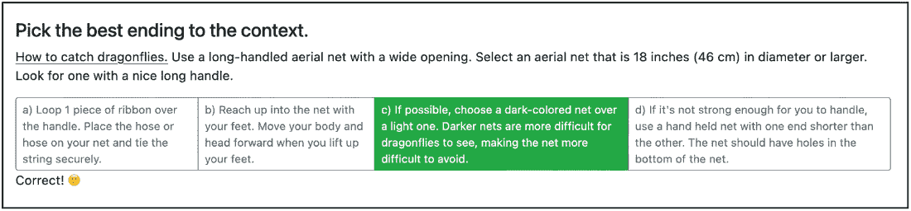
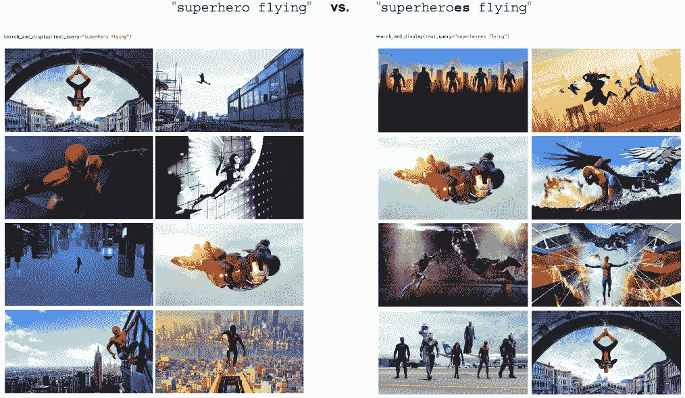
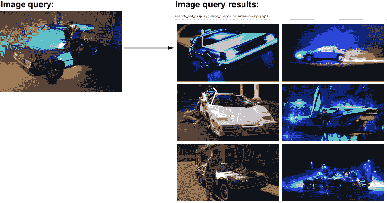
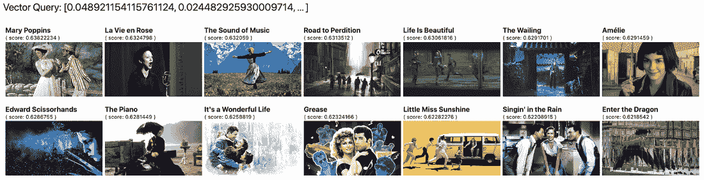
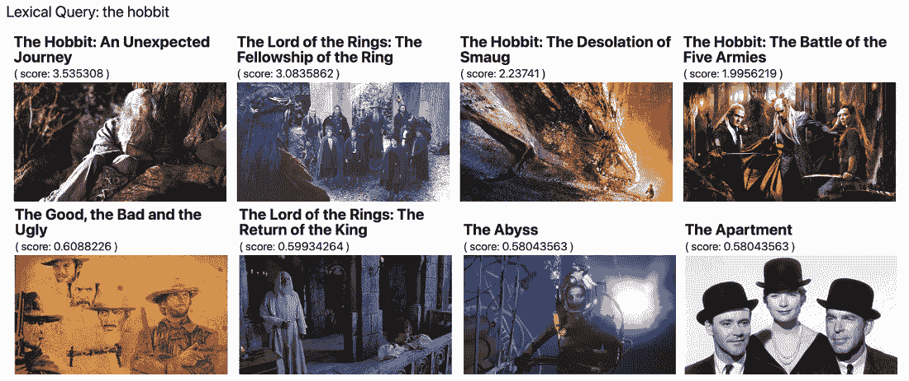

# 15 基础模型和新兴搜索范式

### 本章涵盖

+   检索增强生成（RAG）

+   用于结果摘要和抽象问答的生成搜索

+   整合基础模型、提示优化和评估模型质量

+   为模型训练生成合成数据

+   实现多模态和混合搜索

+   人工智能搜索的未来

大型语言模型（LLMs），就像我们在前两章中测试和微调的那些，在近年来人工智能搜索的进步中一直处于中心位置。您已经看到了一些关键方式，这些模型如何通过将这些内容映射到密集向量搜索的嵌入来提高搜索质量，从通过映射内容到嵌入以改善查询解释和文档理解，到帮助从文档中提取问题的答案。

但在未来的地平线上，有哪些额外的先进方法正在出现？在本章中，我们将介绍搜索和人工智能交叉领域的一些最新进展。我们将介绍基础模型如何被用来扩展人工智能搜索的新功能，如结果摘要、抽象问答、跨媒体类型的多模态搜索，甚至是搜索和信息检索的对话界面。我们将介绍新兴搜索范式的基础，如生成搜索、检索增强生成（RAG）以及正在重新定义我们即将接近人工智能搜索前沿的一些方式的新类别基础模型。

## 15.1 理解基础模型

一个**基础模型**是在大量广泛数据上预训练的模型，旨在在各种任务上具有普遍的有效性。大型语言模型（LLMs）是基础模型的一个子集，它们在非常大量的文本上进行了训练。基础模型也可以在图像、音频或其他来源上训练，甚至可以在包含许多不同输入类型的跨模态数据上训练。图 15.1 展示了基础模型的常见类别。


##### 图 15.1 基础模型类型。LLMs 是几种基础模型类型之一。

视觉基础模型可以将图像映射到嵌入（就像我们在第十三章中将文本映射到嵌入一样），然后可以搜索以实现图像到图像的搜索。

可以使用文本和图像（或其他数据类型）构建多模态基础模型，然后它可以基于文本查询或基于上传的图像作为查询来实现基于文本的图像跨模态搜索。我们将在第 15.3.2 节中实现这种多模态文本和图像搜索。像 Stable Diffusion（一种文本到图像模型）这样的生成多模态模型也可以仅根据文本提示生成全新的图像。可以从图像和文本中学习的多模态基础模型也通常被称为**视觉语言模型**（VLMs）。

### 15.1.1 什么可以称为基础模型？

基础模型通常在涵盖众多主题的广泛数据上训练，以便它们在跨领域的泛化解释和预测方面表现出色。这些模型被称为“基础”模型，因为它们可以作为基础模型（或基础），然后可以更快地在特定领域或特定任务的训练集上进行微调，以更好地解决特定问题。

基础模型通常满足以下标准：

1.  它们是**大型模型**，通常在大量数据上训练，通常具有数十亿或数万亿个参数。

1.  它们是**预训练的**，使用显著的计算能力来得出要保存和部署（或微调）的模型权重。

1.  它们具有**可泛化性**，适用于许多任务，而不是局限于特定任务。

1.  它们是**可适应的**，使用提示从其训练模型中提取额外的上下文来调整其预测输出。这使得它们可以接受的查询类型非常灵活。

1.  它们是**自监督的**，从原始数据中自动学习如何关联和解释数据，并将其表示为未来的使用。

我们已经在之前的章节中与几个基础模型合作过，包括 BERT，这是最早的基础模型之一，以及我们在第十三章中使用的 RoBERTa，我们用它来生成嵌入并在这些嵌入上执行语义搜索。Sentence Transformer 模型，如 SBERT（Sentence-BERT）和 SRoBERTa（Sentence-RoBERTa），是从 BERT 和 RoBERTa 基础模型微调的模型，以在语义文本相似度（STS）任务上表现出色。我们还在第十四章中微调了`deepset/roberta-base-squad2`模型；这是一个基于 RoBERTa 基础模型的模型，经过微调用于问答任务。技术上讲，SBERT、SRoBERTa 和`deepset/roberta-base-squad2`本身也是微调的基础模型，可以进一步用作更多微调的基础以生成额外的模型。

目前，基础模型的主导架构是 Transformer 模型，尽管可以使用循环神经网络（使用如 MAMBA 的架构），并且随着时间的推移，必然会出现更多的架构。大多数基于 Transformer 的模型可以用于生成嵌入向量或预测输出。

基础模型响应的强度反映了三个过程的质量：训练、微调和提示。

### 15.1.2 训练与微调与提示

*训练*（或*预训练*）是一个过程，在这个过程中，大量数据（通常是互联网的大部分）被用来学习基础模型深度神经网络中数十亿或数千亿参数的模型权重。这个过程有时可能非常昂贵，可能需要数月时间，并且由于计算和能源需求，可能花费数百万美元。这个过程设法将大量人类知识损失压缩到一个神经网络中，从该网络中可以后来解压缩出事实和关系（单词、语言学、关联等）。回想一下第 13.3 节，在文本上训练 Transformer 通常遵循一个自监督学习过程，该过程优化预测文本序列中掩盖的标记，以衡量文本的整体理解（第 13.3.1 节中描述的 Cloze 测试）。这种训练可以包括任何可能对模型知识库有益的特定数据集，例如计算机代码或特定领域的内 容（财务文件、学术论文、外语、多模态内容等）。

*微调* 是一个过程，通过这个过程，基础模型可以提供额外的领域特定数据或指令。例如，如果你想使模型遵循指令或表现得像一个人或聊天机器人，你可以通过反映这些行为的输入来训练模型。根据任务或架构以及计算和预算要求，微调有几种方法。某些类型的微调会改变模型的所有权重，这在领域调整需要非常具体且原始模型的任务相同的情况下是有帮助的。更高效或特定于任务的途径可能会保留所有现有权重，并在基础基础模型的神经网络中添加一个或多个额外的层。微调使这些新来源能够通过一个专注于特定数据或目标的较小训练过程，扩展原始模型的能力，以处理新的数据或模式。

*提示* 是向训练好的语言模型提供输入以获得输出的过程。提示是微调模型的最终“训练”步骤，但它发生在推理时间而不是训练时间。我们可以提供模型允许的尽可能多的上下文，这意味着提示可以被操纵来使用这些额外的上下文来影响输出。例如，考虑列表 15.1 和 15.2 中的查询当它们被发送到 OpenAI 的 GPT-4 语言模型时的输出。

##### 列表 15.1 无提示工程查询

```py
Query: "What is a unicorn?"

Response:
A unicorn is a mythical creature that is typically depicted as a horse
with a single, spiraled horn projecting from its forehead. Unicorns have
been a part of human mythology and folklore for centuries and are often
associated with purity, grace, and magic. They are said to possess healing
powers and to be able to bring good luck to those who encounter them.
While unicorns are not real animals, they continue to be a popular symbol
in modern culture, appearing in literature, art, and popular media.
```

列表 15.1 提供了一个关于独角兽的良好一般描述。与此相对比的是列表 15.2，它使用提示工程给基础模型赋予一个名为 AIPS Chat 的“聊天机器人”角色，然后告诉基础模型以拥有生物博士学位的人的身份进行回应。

##### 列表 15.2 提示工程提供的额外上下文查询

```py
Query: "You are a chatbot named AIPS Chat.
        You have a Ph.D. in biology.
        What is a unicorn?"

Response:
Hello! I am a chatbot named AIPS Chat, and I have a Ph.D. in biology. While
unicorns have been depicted in various cultures throughout history, they
are not real animals that exist in the natural world.

From a biological perspective, a unicorn can be described as a mythical
creature resembling a horse with a single, spiraled horn on its forehead.
However, since unicorns are purely fictional, there is no actual
scientific data or research that can be conducted on them.

It is important to note that while many animals possess unique
characteristics, such as the horn of a rhinoceros or the tusk of a
narwhal, these features are not magical and do not provide any special
abilities or powers to the animal possessing them.

In conclusion, while unicorns are a fascinating aspect of human
folklore and mythology, they do not have a basis in reality within the
field of biology.
```

第 15.2 列表中的查询，包括一个拥有生物学博士学位的聊天机器人的上下文，利用这个额外的上下文来告知其答案。如果我们能够访问语言模型的读写权限，我们可以使用由生物学博士和聊天机器人生成的输入和响应来微调它。在列表中，我们能够通过向模型提供提示来简单地从其已经训练好的模型中拉取那个上下文，从而实现类似的结果。微调通常会生成更好的答案，但提示更加灵活，因为您可以在推理时提供任何上下文，而微调则更适合于模型需要学习并在所有未来交互中表征的一般特征。

在提示中提供额外的上下文可能是获得最佳输出的关键。由于生成式基础模型是按顺序逐个预测序列中的下一个标记，因此强迫模型在响应中输出更多相关上下文可以导致模型生成更相关的输出。一个大型预训练模型能够实现*少量样本学习*（能够在提供两个或三个示例的情况下，无需进一步训练就能在特定上下文中学习）。例如，在第 15.2 列表中，我们看到通过在提示中添加“生物学”上下文，之后的答案中就包含了诸如“在自然世界中”、“从生物学角度来看”、“实际科学数据或研究”以及“在生物学领域”等短语。

训练中最困难且成本最高的部分是基础模型的初始生成。一旦训练完成，针对特定任务的微调就相对快速且成本低廉，通常可以使用一个相当小的训练集完成。如果我们将这些模型与人类学习进行比较，基础模型可能就像一个高中生，他们通常知道如何阅读和写作，并能回答有关数学、科学和世界历史的常识性问题。如果我们想让这个学生能够生成和解读财务报表（收入报表、现金流量报表和资产负债表），他们需要学习会计课程来掌握这些技能。然而，经过 18 年或更长时间的训练（生活经验和学校教育）后，学生可能在几个月内就能学会足够的会计知识来生成和解读财务报表。同样，对于基础模型来说，初始训练阶段耗时最长，为后续更快地学习更多知识和技能提供了基础。

## 15.2 生成式搜索

我们在构建人工智能搜索的过程中，大部分的旅程都集中在寻找与用户意图相匹配的结果、答案或行动。在第十四章中，我们甚至提取了特定问题的具体答案，使用了我们的检索-阅读模式。但如果我们的搜索引擎能够根据查询实时生成新的内容，而不是返回真实文档或提取的答案，会怎么样呢？

*生成模型*是能够根据输入提示生成新内容的模型。它们的输出可以是文本内容、从文本输入生成的图像、模拟特定人物或声音的音频，或者结合音频和视频的视频。可以生成文本来描述图像，或者相反，可以生成图像、音频或视频来以不同的方式“描述”文本。

我们正进入一个世界，在这个世界里，有人可以输入一个搜索查询，搜索引擎可以返回完全虚构的内容和图像，这些内容和图像是即时生成的，作为对用户查询或提示的响应。虽然对于像“在巴黎三天内，假设我真的喜欢美食、历史建筑和博物馆，但讨厌人群，一个最佳的日程安排是什么？”这样的查询来说这可能很神奇，但它也引入了严重的伦理考量。

搜索引擎是否应该为用户综合信息，而不是为他们提供现有内容进行解读？如果搜索引擎在政治或商业上存在偏见，并试图影响用户的思维或行为，会怎样？如果搜索引擎被用作审查的工具或传播宣传（如即时修改的图像或文本）来欺骗人们相信错误或采取危险行动，又会怎样？

生成式搜索的一些更常见的用例包括抽取式问答和结果摘要。而传统的搜索方法返回的是“十个蓝色链接”或与特定查询匹配的预定信息框，生成式搜索则侧重于根据动态分析搜索结果即时创建搜索响应。从左到右，图 15.2 展示了从这些传统搜索方法向生成式搜索的演变过程。


##### 图 15.2 传统搜索方法（左）到生成式搜索（右）的频谱

在第十四章中介绍的抽取式问答，开始向生成式搜索转变，因为它分析搜索结果以返回直接的问题答案，而不是仅仅提供搜索结果或预定的答案。然而，这并不是完全的“生成式”搜索，因为它仍然只返回与搜索文档中呈现的答案完全一致的答案，没有任何额外的综合或新内容生成。

当我们继续向图 15.2 的右侧移动时，结果摘要是最先可以完全考虑为生成式搜索的技术。结果摘要，我们将在 15.2.2 节中介绍，是从搜索结果中提取其内容的过程。这对于用户来说非常有用，尤其是当他们正在研究一个主题而没有时间阅读所有结果时。用户不需要点击多个链接并阅读和分析每个结果，而是可以返回页面摘要（如果需要的话，包括引用），从而节省用户评估内容的时间。

抽象式问答与提取式问答非常相似，因为它们都试图回答用户的问题，但它通过分析搜索结果（如结果摘要）或简单地依靠底层基础模型来生成答案来实现。依赖基础模型更有可能导致虚构或幻觉的结果，因此通常有益于将搜索结果作为上下文学习提示的一部分。我们将在下一节中介绍这种检索增强生成的过程。

许多主要搜索引擎和初创公司已经将这些生成模型和交互式聊天会话整合到他们的搜索体验中，这为模型提供了访问互联网（或至少是搜索索引形式的互联网副本）的机会。这使得模型能够几乎实时地了解世界的信息。这意味着模型可能知道与他们互动的用户详细的公开信息，这可能影响结果，这也意味着任何人都可以通过制作以误导方式关联概念的网页来向这些模型注入恶意信息或意图。如果我们不小心，搜索引擎优化（SEO）领域可能会从试图提高网站在搜索结果中的排名转变为试图操纵 AI 向最终用户提供恶意答案。对于使用这些模型的人来说，应用批判性思维技能和验证这些模型的输出将是至关重要的，但不幸的是，这些模型可能如此吸引人，以至于许多人可能会被误导的输出所欺骗，除非采取重大的安全措施。

这些模型将继续进化，通过解释搜索结果来支持搜索者。虽然许多人可能梦想拥有一个基于 AI 的个人助理，但 AI 生成你每天消费的知识所涉及的伦理考量需要谨慎处理。

### 15.2.1 检索增强生成

使用搜索引擎或向量数据库查找可以提供给 LLM 作为上下文的有关联的文档的工作流程通常被称为*检索增强生成*（RAG）。

我们之前多次提到过 RAG，随着这本书的出版，它已经成为了一个热门词汇。这有一个非常好的原因：语言模型的训练是对训练数据的一种有损压缩，而模型无法在不丢失准确性的情况下忠实存储它们训练过的海量数据。它们的信息也只到上次训练时为止——在没有一些持续更新的外部数据源的情况下，模型很难对不断变化的信息做出决策。

无论语言模型可以接受多少上下文，将其作为所有训练信息的真理来源都是计算上不可行或至少成本高昂的。幸运的是，搜索引擎的整个目的就是为任何传入的查询找到相关的上下文。事实上，这本书的*整个*内容都是对 RAG 的*检索*部分的深入研究。在我们讨论本章的结果摘要、抽象问答和生成搜索时，我们正在触及 RAG 的*生成*部分。

要执行 RAG，大多数当前库都会将文档取来，将其拆分成一个或多个部分（块），然后将每个部分的嵌入索引到搜索引擎或向量数据库中。然后，在生成时，提示语言模型的程序将创建查询以找到执行下一个提示所需的信息补充，为这些查询生成嵌入，执行密集向量搜索以找到使用向量相似度（通常是余弦或点积）得分最高的部分，并将结果排序的部分连同提示一起传递给生成 AI 模型。

#### 块化挑战

这种将文档拆分成部分的过程被称为*块化*，它既是必要的也是问题性的。这个问题可以理解为三个约束之间的张力：

+   *向量数据库的限制*——许多向量数据库被设计用来索引单个向量，但将整个文档总结成一个向量可能会丢失文档的很多特异性和上下文。它将整个文档的嵌入汇总成一个更模糊的摘要嵌入。

+   *独立块之间的上下文丢失*——为了保留每个部分（章节、段落、句子、单词或其他有用的语义块）的特异性，将文档拆分成许多单独的文档可能会导致块之间的上下文丢失。如果你将一个文档拆分成 10 个块，并独立生成嵌入，那么这些嵌入之间的共享上下文就会丢失。

+   *许多块的计算复杂性*——你拥有的块越多，你需要索引的向量就越多，你需要搜索的也越多。这可能会非常昂贵且缓慢，而且在你必须对同一初始文档上的多个匹配项进行加权，相对于其他文档上更少但更好的匹配项时，也可能很难管理跨块的结果的相关性。

在实施 RAG 用于生成式 AI 的早期阶段，许多人专注于将文档分块成多个单独的文档，以克服向量数据库的限制。可以使用良好的 ANN（近似最近邻）算法来管理计算复杂性，但在那种情况下，上下文在块之间的丢失仍然是问题，而且不使用更好的算法来建模嵌入，而是创建无限数量的重叠块，这显然是浪费的。

作为一种替代方法，几个搜索引擎和向量数据库（如 Vespa 和 Qdrant）已经支持多值向量字段，这使得创建任意数量的块成为可能，也可以在单个文档内创建重叠的块（这样单个句子或段落可以成为多个块的一部分，从而在块之间保留更多上下文）。这种多向量支持预计在未来几年将成为标准，以支持像 ColBERT 模型系列中引入的基于上下文的后期交互等新兴方法。

#### RAG 的未来

RAG 作为一个学科，仍处于起步阶段，但发展迅速。已经开发了许多库和框架来执行 RAG，但它们通常基于对信息检索过于简单的理解。当前的 RAG 实现往往完全依赖于语言模型和向量相似度来决定相关性，而忽略了本书中我们介绍的大多数其他 AI 驱动的检索技术。在用户意图的维度（见图 1.7）的背景下，这有三个影响：

+   内容上下文在概念上处理得很好（假设所选嵌入模型是针对查询-文档检索进行训练的），但不是基于特定关键词（由于总结多个关键词的向量的范围）。

+   领域上下文处理得和语言模型微调一样好。

+   用户上下文通常完全被忽略。

对于用户意图的内容理解维度（见第 1.2.5 节），使用与嵌入的上下文后期交互的具有前景的方法正在发展，它们最终可能克服对分块的需求。这些方法（如 ColBERT、ColBERTv2、ColPali 及其继任者）涉及为文档中的每个标记生成一个嵌入，但每个标记的嵌入都使用该标记在整个文档中的上下文（或至少是长距离的上下文）。这防止了上下文在块之间的丢失，并避免了将无限数量的块索引到引擎中的需要。这些方法对于 RAG 和检索来说比上一小节中提到的某些更简单的方法更有意义。我们预计在未来几年将看到类似方法的发展，并将显著提高召回率，超过当前的基线排名方法。

在本书中你学到的检索概念，关于用户意图的维度、反映智能和信号模型、语义知识图谱、学习排序和反馈循环（结合基于 LLM 的向量搜索），在大多数当前的 RAG 实现中领先数光年，这些实现只使用了一小部分。

话虽如此，RAG 的未来光明，预计在接下来的几年里，我们将看到解决当前挑战的更复杂方法，以及更好的检索和排序技术整合到 RAG 流程中。RAG 技术正在快速变化和演变，该领域为持续的创新和改进做好了准备。

在接下来的部分，我们将介绍使用 RAG 的最受欢迎的生成式搜索方法之一：结果摘要（带引用）。

### 15.2.2 使用基础模型进行结果摘要

在第三章中，我们提到搜索引擎主要负责三件事：索引、匹配和排序结果。第十三章已经展示了如何通过嵌入来增强索引、通过近似最近邻搜索来增强匹配以及通过在嵌入向量上进行相似度比较来增强结果的排序。但返回结果的方式往往与结果本身一样重要。

在第十四章中，我们展示了如何从包含这些答案的排序文档中提取答案，这可以比返回完整文档并强制用户逐个分析它们有显著的改进。但如果问题的答案*需要*分析文档呢？如果期望的答案实际上是结合来自多个文档的信息，形成一个统一、有良好来源的答案的分析结果呢？

直接从 LLM 生成的答案的一个问题是，它们是基于模型学习到的参数的统计概率分布创建的。尽管模型可能在大量数据源上进行了训练，但它并没有直接存储这些数据源。相反，模型被压缩成数据的损失表示。这意味着你不能指望 LLM 的输出能够准确反映输入数据——只能是一个近似值。

因此，基础模型因产生幻觉而闻名——生成包含错误事实或错误表述主题的响应。提示中提供的上下文也极大地影响了答案，以至于基础模型有时可能更多地反映了用户的词汇选择和偏见，而不是对问题的合法回答。虽然这在创造性工作中可能很有用，但它使得今天的基础模型在安全生成搜索引擎历史上依赖的事实性响应方面相当不可靠。为了用户真正信任结果，他们需要能够验证信息的来源。幸运的是，我们不必直接依赖基础模型来回答问题，而是可以将搜索引擎与基础模型结合起来，使用 RAG 创建混合输出。

使用此类基础模型来总结搜索结果是一种很好的方法，可以为你的搜索引擎注入更好的 AI 驱动的响应。让我们通过一个使用基础模型进行带有引用的搜索结果摘要的例子来了解一下。我们将使用 OpenAI 的 GPT-4 模型的输出，但你也可以从大多数当前的开源或许可 LLMs 中获得类似输出。

工作流程包括两个步骤：

1.  执行搜索。这可能涉及将查询转换为嵌入并执行密集向量搜索，或使用我们讨论过的任何其他技术来找到最相关的结果。

1.  构建一个提示，指导你的基础模型接收用户的查询，并阅读和总结从查询返回的一组搜索结果。

以下列表演示了一个示例提示，将步骤 1 的搜索结果组合成步骤 2 的提示。

##### 列表 15.3 基础模型总结搜索结果的提示

```py
Web search results:

[1] "A large language model, or LLM, is a deep learning algorithm that
can recognize, summarize, translate, predict and generate text and other
content based on knowledge gained from massive datasets."
URL: https://blogs.nvidia.com/blog/2023/
     01/26/what-are-large-language-models-used-for/

[2] A large language model (LLM) is a language model consisting of a
neural network with many parameters (typically billions of weights or
more), trained on large quantities of unlabeled text using
self-supervised learning. LLMs emerged around 2018 and perform well at a
wide variety of tasks. This has shifted the focus of natural language
processing research away from the previous paradigm of training
specialized supervised models for specific tasks.
URL: https://en.wikipedia.org/wiki/Large_language_model

[3] "In this guide, we'll discuss everything you need to know about
Large Language Models (LLMs), including key terms, algorithms,
fine-tuning, and more. As ChatGPT has taken the internet by storm crossing
1 million users in its first 5 days, you may be wondering what machine
learning algorithm is running under the hood. While ChatGPT uses a
specific type of reinforcement learning called "Reinforcement Learning
from Human Feedback (RLHF)", at a high level it is an example of a
Large Language Model (LLM)."
URL: https://www.mlq.ai/what-is-a-large-language-model-llm/

Instructions: Using the provided web search results, write a comprehensive
reply to the given query. Make sure to cite results using
[number] notation after the reference. If the provided search
results refer to multiple subjects with the same name, write separate
answers for each subject.

Query: What is a large language model?
```

当将列表 15.3 的全部内容作为提示传递给语言模型时，我们得到了以下结果。

##### 列表 15.4 对列表 15.3 的总结提示的响应

```py
A large language model (LLM) is a deep learning algorithm that can
recognize, summarize, translate, predict, and generate text and other
content based on knowledge gained from massive datasets
[[1](https://blogs.nvidia.com/blog/2023/01/26/what-are-large-language-
     models-used-for/)].
It consists of a neural network with many parameters (typically billions
of weights or more) and is trained on large quantities of unlabeled text
using self-supervised learning
[[2](https://en.wikipedia.org/wiki/Large_language_model)]. LLMs emerged
around 2018 and have performed well at a wide variety of tasks, shifting
the focus of natural language processing research away from the previous
paradigm of training specialized supervised models for specific tasks
[[2](https://en.wikipedia.org/wiki/Large_language_model)]. One example of
a LLM is ChatGPT, which uses a specific type of reinforcement learning
called "Reinforcement Learning from Human Feedback (RLHF)"
[[3](https://www.mlq.ai/what-is-a-large-language-model-llm/)].
```

此输出从搜索结果中提取关键细节以回答原始查询（“什么是大型语言模型？”），但以引用原始文章的方式进行。如果该答案过于冗长，可以在指令末尾添加额外的改进提示：“Be concise.” 这将导致以下输出：

```py
...
Query: What is a large language model? Be concise.
```

##### 列表 15.5 列表 15.3 的提示`Be concise.`的结果

```py
A large language model (LLM) is a deep learning algorithm that uses neural
networks with billions of parameters, trained on massive unlabeled text
datasets for various language tasks [[2](https://en.wikipedia.org/
wiki/Large_language_model)][[1](https://blogs.nvidia.com/blog/2023/01/
26/what-are-large-language-models-used-for/)].
```

许多搜索引擎已经开始依赖基础模型来解释和引用此类搜索结果。通过添加额外的指令，如“避免含糊不清、有争议或离题”，“使用无偏见和新闻风格”，甚至“以五年级阅读水平写作”，你可以调整摘要的质量和语气，以满足搜索引擎的需求。

### 15.2.3 使用基础模型生成数据

除了在搜索结果之上添加合成和摘要层之外，这些模型的其他新兴用例之一是生成合成领域特定和任务特定的训练数据。

回顾我们之前已经探索过的众多基于 AI 的搜索技术，其中许多需要大量的训练数据来实现：

+   信号增强模型需要显示哪些用户查询与哪些文档相对应的用户信号数据。

+   用于自动化 LTR 的点击模型需要了解用户在搜索结果中点击和跳过的文档。

+   语义知识图谱需要一个数据索引来查找相关术语和短语。

但如果我们微调了一个基础模型来“生成关于缺失主题的文档”或“生成与每个文档相关的现实查询”，会怎么样？或者更好的是，如果我们根本不需要微调，而是可以构建一个提示来为文档生成优秀的查询呢？这样的数据可以用来生成合成信号，以帮助提高相关性。

列表 15.6 至 15.9 展示了我们如何通过将 LLM 与第十四章中的 Stack Exchange 户外集合的搜索相结合，使用提示来查找查询和相关性分数。

对于我们的练习，我们发现给提示提供几份文档比只提供一份文档更好，甚至更好的是返回相关文档（来自同一主题或来自先前查询的结果列表）。这一点很重要，因为每套文档中都有一些细分主题，所以拥有相关文档有助于返回更精细的查询而不是一般的查询。此外，尽管所有文档可能并不完全与原始查询相关（或可能存在噪声），但这仍然给 LLM 提供了一个几轮的机会来理解我们的语料库，而不是基于单个示例来建立其上下文。以下列表显示了使用 LLM 生成文档列表的候选查询所使用的模板。

##### 列表 15.6 生成描述文档的查询的提示

```py
What are some queries that should find the following documents?  List at
least 5 unique queries, where these documents are better than others
in an outdoors question and answer dataset. Be concise and only
output the list of queries, and a result number in the format [n] for
the best result in the resultset. Don't print a relevance summary at
the end.

### Results:
{resultset}
```

以下列表显示了可以生成要插入到列表 15.6 中的提示的`{resultset}`的代码。使用示例查询`what are minimalist shoes?`，我们通过列表 14.15 中的`retriever`函数获取`resultset`。检索器为查询提供答案上下文。

##### 列表 15.7 生成提示友好的文本搜索结果

```py
example_contexts = retriever("What are minimalist shoes?")
resultset = [f"{idx}. {ctx}" for idx, ctx  #1
  in enumerate(list(example_contexts[0:5]["context"]))]  #1
print("\n".join(resultset))
```

#1 我们只想从检索器返回的前 5 个结果中获取索引和上下文信息，并且为每个结果添加 0 到 4 的索引前缀。

输出：

```py
0\. Minimalist shoes or "barefoot" shoes are shoes that provide your feet
     with some form of protection, but get you as close to a barefoot
     experience as possible...
1\. There was actually a project done on the definition of what a minimalist
     shoe is and the result was "Footwear providing minimal interference
     with the natural movement of the foot due to its high flexibility,
     low heel to toe drop, weight and stack height, and the absence of
     motion control and stability devices". If you are looking for a
     simpler definition, this is what Wikipedia says, Minimalist shoes are
     shoes intended to closely approximate barefoot running conditions...
2\. One summer job, I needed shoes to walk on a rocky beach, sometimes in
     the water, for 5 to 10 miles per day all summer. Stretchy neoprene
     shoes were terrible for this- no traction and no support. So I used
     regular sneakers. I chose a pair of cross country racing flats... The
     uppers were extremely well ventilated polyester, so they drained very
     quickly, and the thin material dried much faster than a padded sandal,
     and certainly much faster than a regular sneaker of leather or cotton
     would... The thing to look for is thin fabric that attaches directly
     to the sole, with no rubber rim that would keep the water from
     draining...
3\. ... It's not unhealthy to wear minimalist footwear, but on what terrain
     your wear them could be bad for your body in the long run. Human
     beings were never meant to walk or run exclusively on hard pavement
     or sidewalks. Nor were we designed to clamber around on sharp rocks
     at high elevations... If you're running on soft ground and you have
     the foot strength, then there are plenty of arguments in favour of
     minimalist shoes being better for you than other shoes, because it
     brings your posture and gait back to what nature intended it to be.
     If you're hiking in the mountains on uneven rocky terrain, especially
     while carrying a heavy bag, then you'd be better off wearing a
     supportive hiking boot...
4\. ... My favourite barefoot shoes are Vibram Five-Fingers , I wear either
     my Mouri's or my KSO's at the beach. Vibram Five-Fingers 'Signa'
     watersport shoes: The thin sole will be enough to protect your feet
     from the lava sand...
```

然后，我们将这五个结果添加到列表 15.6 的提示底部，通过用列表 15.7 的响应替换`{resultset}`值来实现。我们使用完全替换后的最终提示，并将其传递给我们的 LLM，得到以下结果。

##### 列表 15.8 LLM 响应将文档与生成查询相关联

```py
resultset_text = "\n".join(resultset)
resultset_prompt = summarize_search_prompt.replace("{resultset}",
                                                   resultset_text)
generated_relevance_judgments = get_generative_response(resultset_prompt)
display(generated_relevance_judgments)
```

输出：

```py
1\.    What is the definition of a minimalist shoe?
2\.    What are the characteristics of minimalist shoes?
3\.    Which shoes are best for walking on rocky beaches?
4\.    Are minimalist shoes suitable for all terrains?
5\.    What are some recommended barefoot shoe brands?

Results:

1\.    [1]
2\.    [0]
3\.    [2]
4\.    [3]
5\.    [4]
```

注意候选查询与每个相关结果中的措辞之间的细微差别。此外，请注意相关结果的顺序与输出中查询的顺序不同。文档 0 的上下文对于特定查询 `什么是简约鞋的特点？` 更相关，而文档 1 的上下文对于查询 `什么是简约鞋的定义？` 更相关。

注意，我们仅使用 pandas 索引位置作为上下文 ID，而不是文档的 ID。根据我们的经验，ID 可能会通过提供无关信息来混淆模型。根据您使用的 LLM，这可能需要通过一些代码进行逆向工程，就像我们用列表 15.7 中的现有 `example_contexts` 所做的那样。同时请注意，模型在列表 15.8 中改变了顺序（查询的顺序与判断结果的顺序不同），因此我们将在解析输出时考虑这一点。

以下列表显示了如何提取信息并为查询、文档和相关结果创建一个漂亮的 Python 字典。

##### 列表 15.9 从 LLM 输出中提取成对判断

```py
def extract_pairwise_judgments(text, contexts):
  query_pattern = re.compile(r"\d+\.\s+(.*)")  #1
  result_pattern = re.compile(r"\d+\.\s+\[(\d+)\]")  #1
  lines = text.split("\n")
  queries = []
  results = []
  for line in lines:
    query_match = query_pattern.match(line)
    result_match = result_pattern.match(line)
    if result_match:
      result_index = int(result_match.group(1))
      results.append(result_index)
    elif query_match:
      query = query_match.group(1)
      queries.append(query)
  output = [{"query": query, "relevant_document": contexts[result]["id"]}
            for query, result in zip(queries, results)]
  return output
```

#1 正则表达式用于查看哪一行属于哪个列表。如果您从模型中获得一些奇怪的输出，可以尝试更健壮的表达式。

接下来，我们将列表 15.8 的输出传递给列表 15.9 中的 `extract_pairwise_judgments`。

##### 列表 15.10 由 LLM 生成的正面相关性判断

```py
resultset_contexts = example_contexts.to_dict("records") #1
output = extract_pairwise_judgments(
           generated_relevance_judgments,
           resultset_contexts)
display(output)
```

#1 示例上下文，来自列表 15.7，包含查询 '什么是简约鞋？' 的搜索结果。

响应：

```py
{"query": "What is the definition of a minimalist shoe?",
 "relevant_document": 18370}
{"query": "What are the characteristics of minimalist shoes?",
 "relevant_document": 18376}
{"query": "Which shoes are best for walking on rocky beaches?",
 "relevant_document": 18370}
{"query": "Are minimalist shoes suitable for all terrains?",
 "relevant_document": 18375}
{"query": "What are some recommended barefoot shoe brands?",
 "relevant_document": 13540}
```

将此过程应用于从客户查询中获取的数百个结果集，将生成大量相关查询-文档对。由于我们一次处理五个结果，因此每次向 LLM 发送单个提示时，我们也将生成五个新的正面成对判断。然后，您可以使用这些判断作为合成信号或作为训练数据来训练在早期章节中探讨的许多基于信号的模型。

### 15.2.4 评估生成输出

在前面的章节中，我们讨论了使用判断列表来衡量我们搜索算法质量的重要性。在第十章和第十一章中，我们手动生成判断列表，然后后来使用点击模型自动生成，用于训练和衡量 LTR 模型的质量。在第十四章中，我们生成了银集和金集来训练和衡量我们微调的 LLM 的提取式问答质量。

这些都是查询和结果对在很大程度上是确定性的搜索用例。然而，衡量生成模型输出的质量要困难得多。在本节中，我们将探讨一些生成用例，以了解如何克服这些挑战。

生成输出可能具有主观性。许多生成模型在调整温度参数时，给定相同的提示会产生不同的输出。*温度*是一个介于`0.0`和`1.0`之间的值，它控制输出中的随机性。温度越低，输出越可预测；温度越高，输出越具创造性。我们建议在评估和生成您的模型时始终将温度设置为`0.0`，以便您对其输出有更高的信心。然而，即使是`0.0`的温度也可能在运行之间对同一提示产生不同的响应，这取决于模型。

评估生成输出的核心方法很简单：构建和评估可以客观衡量的任务。然而，由于提示的输出可能不可预测，因此很难创建一个可以重复用于衡量您特定任务的不同提示的数据集。因此，我们通常依赖于已建立的指标来评估首先选择的模型的质量，然后再开始对其下游输出进行自己的评估。

不同的重要和常见指标针对不同的语言任务。每个指标通常都有一个排行榜，这是一个竞争风格的基准，通过在给定任务上的性能对模型进行排名。以下是一些常见的基准：

+   *AI2 推理挑战（ARC）*——一个由 7,787 个小学科学考试问题组成的多项选择题问答数据集。

+   *HellaSwag*——常识推理测试；例如，给出一个复杂推理问题，并附有多个选择题。

+   *大规模多任务语言理解（MMLU）*——一种用于衡量文本模型多任务准确性的测试。该测试涵盖 57 个任务，包括数学、历史、计算机科学、法律等。

+   *TruthfulQA*——衡量语言模型在生成问题答案时是否诚实。该基准包括 817 个问题，涵盖 38 个类别。作者设计了某些人类可能会由于错误信念或误解而给出错误答案的问题。

图 15.3 展示了 HellaSwag 问答测试的示例。



##### 图 15.3 HellaSwag 示例问题和多项选择题，正确答案已突出显示

一些排行榜包含多个指标，如图 15.4 中的 Open LLM 排行榜。


##### 图 15.4 HuggingFaceH4 开放大型语言模型排行榜空间（拍摄于 2024 年 3 月）

您应使用这些指标来决定为您的特定领域和任务使用哪种模型。例如，如果您的任务是抽象式问答，请考虑使用具有最佳 TruthfulQA 指标的模型。

警告 模型是受许可的，所以请确保你只使用与你的用例相匹配的许可证的模型。一些模型的许可证类似于开源软件（如 Apache 2.0 或 MIT）。但请注意，许多模型有商业限制（例如 LLaMA 模型及其衍生品或基于 OpenAI 的 GPT 等限制性模型输出的模型）。

一旦你选择了你的模型，你应该采取步骤在你的提示上评估它。要严谨，并跟踪你的提示及其表现。市场上出现了一些专门为此目的设计的工具，包括自动提示优化方法，但一个简单的电子表格就足够了。在下一节中，我们将构建我们自己的度量标准来用于新的任务。

### 15.2.5 构建自己的度量标准

让我们探讨如何客观地构建一个生成任务，这样你就可以创建一个数据集，并使用像精确度或召回率（在第 5.4.5 节中介绍）这样的度量标准来评估模型的准确性。我们将使用一个包含非结构化数据的提示来提取结构化信息。由于我们的结果将格式化得可预测，我们就可以根据人工标记的结果来衡量响应的准确性。

对于我们的示例，我们将测试一个生成模型的命名实体识别准确性。具体来说，我们将衡量来自 LLM 的生成输出是否正确地标记了人员、组织或地点类型的实体。

我们将从一篇新闻文章的以下文本片段中获取：

```py
Walter Silverman of Brighton owned one of the most successful local Carvel
franchises, at East Ridge Road and Hudson Avenue in Irondequoit.
He started working for Carvel in 1952\. This is how it appeared in the
late 1970s/early 1980s.
[Alan Morrell, Democrat and Chronicle, May 29, 2023]
```

如果我们手动将此片段中的实体标记为`<per>`（人员）、`<org>`（组织）和`<loc>`（地点），我们将在以下列表中到达标记版本。

##### 列表 15.11 带有实体标签的文章

```py
<per>Walter Silverman</per> of <loc>Brighton</loc> owned one of the most
successful local <org>Carvel</org> franchises, at
<loc>East Ridge Road</loc> and <loc>Hudson Avenue</loc> in
<loc>Irondequoit</loc>. He started working for <org>Carvel</org> in
1952\. This is how it appeared in the late 1970s/early 1980s.
```

这是一个生成模型应该能够生成的格式，它接受文本并按照提示生成一个标记版本。但这个响应只有半结构化，带有临时标记。我们需要进一步处理它，我们可以编写一些 Python 代码来将实体提取到合适的 JSON 格式中。

##### 列表 15.12 从生成输出中提取实体

```py
def extract_entities(text):
  entities = []
  pattern = r"<(per|loc|org)>(.*?)<\/(per|loc|org)>"
  matches = re.finditer(pattern, text)
  for match in matches:
    entity = {"label": match.group(1).upper(),
              "offset": [match.start(), match.end() - 1],
              "text": match.group(2)}
    entities.append(entity)
  return entities

entities = extract_entities(news_article_labelled)
display(entities)
```

输出：

```py
[{"label": "PER", "offset": [0, 26], "text": "Walter Silverman"},
 {"label": "LOC", "offset": [31, 49], "text": "Brighton"},
 {"label": "ORG", "offset": [90, 106], "text": "Carvel"},
 {"label": "LOC", "offset": [123, 148], "text": "East Ridge Road"},
 {"label": "LOC", "offset": [154, 177], "text": "Hudson Avenue"},
 {"label": "LOC", "offset": [182, 203], "text": "Irondequoit"},
 {"label": "ORG", "offset": [229, 245], "text": "Carvel"}]
```

现在实体已经以结构化形式（作为 JSON）表示，我们可以使用列表来计算我们的度量标准。我们可以手动标记许多段落，或者使用第 14.2-14.3 节中的技术来自动化标记，使用模型构建一个银集，然后纠正输出以产生一个金集。

当你有了你的金集时，你可以尝试以下提示。

##### 列表 15.13 标记的实体

```py
For a given passage, please identify and mark the following entities:
people with the tag '<per>', locations with the tag '<loc>', and
organizations with the tag '<org>'. Please repeat the passage below
with the appropriate markup.
### {text}
```

在前面的提示中，`{text}`将被替换为你想要识别实体的段落。当模型生成响应时，它可以直接传递到列表 15.12 中的`extract_entities`函数。

然后可以将提取的实体输出与黄金集进行比较，以产生真实正例的数量`TP`（正确识别的实体）、假正例`FP`（不应识别但被错误识别的文本）和假负例`FN`（应该被识别但未被识别的实体）。

从这些数字中，您可以计算出以下内容：

+   `Precision = (`*TP / ( TP + FP )*`)`

+   `Recall = (`*TP / ( TP + FN)*`)`

+   `F1 = (`*2 * (Precision * Recall) / (Precision + Recall)*`)`

许多在排行榜上列出的指标使用`F1`分数。

您有哪些生成任务？要富有创意，并思考如何使您的任务具有客观可衡量性。例如，如果您正在生成搜索结果摘要，您可以执行类似于命名实体识别的任务——检查摘要是否显示了给定搜索结果集中的重要文本片段，或者是否正确地引用了结果编号和标题。

### 15.2.6 算法提示优化

在第 15.2 节中，我们介绍了使用 LLM 提示生成合成数据、总结和引用 RAG 的搜索结果，以及量化生成数据质量的指标。我们讨论了在衡量*模型*质量时的这一内容，但有一个重要的观点我们略过了：*提示*的质量。

如果您还记得，我们有三种不同的方法来改进 LLM 输出：在训练期间改进模型（预训练）、微调模型或改进提示。预训练和微调是直接、程序化的神经网络模型优化，但到目前为止，我们将提示创建和改进（称为*提示工程*）视为需要人工干预的手动过程。

实际上，提示也可以像模型一样进行程序化微调。例如，DSPy（Declarative Self-improving Language Programs，Pythonically）库提供了一个框架，用于“编程”语言模型的使用，而不是手动提示它。功能上，这是通过定义从语言模型期望的输出格式（以及显示良好响应的训练数据）并让库优化提示的措辞以最佳实现该输出来完成的。

DSPy 使用四个关键组件来完成这种程序化提示优化：

+   *签名*——这些是简单的字符串，解释了训练过程的目标，以及预期的输入和输出。例如：

    +   `question → answer` (问答)

    +   `document → summary` (文档摘要)

    +   `context,` `question → answer` (RAG)

+   *模块*——这些接受一个签名，并将其与提示技术、配置的 LLM 和一组参数相结合，以生成一个提示以实现期望的输出。

+   *指标*——这些是衡量模块生成的输出与期望输出匹配程度的度量。

+   *优化器*——这些用于通过迭代测试提示和参数的变体来训练模型，以优化指定的指标。

以这种方式编程语言模型的使用提供了四个关键优势：

+   它允许自动优化提示，当手动进行时可能是一个耗时且易出错的流程。

+   它允许优化提示以快速测试众所周知的模板（以及随着时间的推移新的技术或数据），以及提示的最佳实践，以及将多个提示阶段链接在一起形成一个更复杂的流水线。

+   它允许您在任何时候轻松切换 LLM，并“重新编译”DSPy 程序以重新优化新模型的提示。

+   它允许您将多个模块、模型和工作流程链接在一起形成更复杂的流水线，并优化流水线每个阶段的提示以及整个流水线。

与手动提示调整相比，这些优势使您的应用程序更加健壮且易于维护，并确保您的提示始终针对当前环境和目标进行微调和优化。一旦您编写了配置的 DSPy 流水线，只需运行优化器来*编译*它，此时每个模块的所有最优参数都已学习。想要尝试新的模型、技术或一组训练数据？只需重新编译您的 DSPy 程序，您就可以出发了，您的提示将自动优化以产生最佳结果。您可以在 DSPy 文档中找到许多用于实现 RAG、问答、摘要以及其他基于 LLM 提示任务的“入门”模板，文档地址为[`github.com/stanfordnlp/dspy`](https://github.com/stanfordnlp/dspy)。如果您正在构建一个非平凡的基于 LLM 的应用程序，我们强烈建议您选择这样的程序化方法来优化提示。

## 15.3 多模态搜索

现在，让我们探索由基础模型嵌入提供的一种最强大的功能：多模态搜索。多模态搜索引擎允许您使用另一种内容类型（也称为*跨模态*搜索）来搜索一种内容类型，或者同时搜索多种内容类型。例如，您可以使用文本、图像或结合文本和图像的混合查询来搜索图像。我们将在本节中实现这些用例中的每一个。

多模态搜索之所以成为可能，是因为可以为文本、图像、音频、视频和其他可以映射到重叠向量空间的内容生成向量嵌入。这使得我们能够在不需要任何特殊索引或转换的情况下，对任何内容类型进行任何其他内容类型的搜索。

多模态搜索引擎有可能彻底改变我们搜索信息的方式，消除之前阻止我们使用所有可用上下文来最好地理解传入查询和排名结果的障碍。

### 15.3.1 多模态搜索的常见模式

虽然多模态搜索涉及许多不同的数据类型都可以被搜索，但在这个部分我们将简要讨论目前最常见的数据模态：自然语言、图像、音频和视频。

#### 自然语言搜索

在第十三章和第十四章中，我们使用了密集向量实现了语义搜索和问答。这两种技术都是自然语言搜索的例子。一个简单的查询，如`shirt` `without` `stripes`，将会让建立在倒排索引之上的每一个电子商务平台都感到困惑，除非手动添加特殊逻辑或集成到一个使用*语义函数*的知识图谱中，就像我们在第七章中实现的那样。

今天的最先进的 LLMs 在处理这些查询方面变得更加复杂，甚至能够解释指令并从不同来源综合信息以生成新的响应。许多构建传统数据库和 NoSQL 数据存储的公司正在积极集成密集向量支持作为一等数据类型，以利用所有这些主要进步。

虽然这些基于密集向量的方法不太可能完全取代传统的倒排索引、知识图谱、信号增强、排序学习、点击模型和其他搜索技术，但我们将会看到新的混合方法出现，这些方法将结合这些技术的最佳部分，以继续优化内容和查询理解。

#### 图像搜索

正如你在第二章中看到的，图像是另一种非结构化数据形式，与文本并列。

传统上，如果你想在倒排索引中搜索图像，你会搜索图像的文本描述或标签。然而，使用密集向量搜索，搜索图像的视觉或概念相似性可以几乎像文本搜索一样容易实现。通过输入图像，使用视觉 Transformer 将其编码为嵌入向量，并索引这些向量，现在可以接受另一张图像作为查询，将其编码为嵌入，然后使用该向量搜索以找到视觉上相似的图像。

此外，通过训练一个同时包含图像及其文本描述的模型，现在可以通过输入图像或文本来进行多模态图像搜索。不再需要有一个标题和一个无法搜索的图像，现在可以使用卷积神经网络（CNNs）或视觉 Transformer 将图像编码到与文本共存的密集向量空间中。在同一个向量空间中，图像表示和文本表示，你可以搜索比标题更详细的图像版本，同时仍然可以使用文本来描述图像中的特征。

由于可以将图像和文本编码到相同的密集向量空间中，因此也可以反向搜索，使用图像作为查询来匹配包含与图像中出现的语言相似的任何文本文档，或者将图像和文本结合成一个混合查询以找到与文本和图像查询模态的最佳匹配的其他图像。我们将在第 15.3.2 节中通过一些这些技术的示例。

#### 音频搜索

使用音频或搜索音频在历史上主要是一个文本到语音的问题。音频文件会被转换成文本并建立索引，音频查询也会被转换成文本并与文本索引进行搜索。语音转录是一个非常困难的问题。谷歌、苹果、亚马逊和微软的语音助手在处理短查询时通常表现很好，但对于想要集成开源解决方案的人来说，这种准确度在历史上一直难以实现。然而，最近在语音识别和语言模型结合以纠正语音误解错误方面的突破，正在将更好的技术带入市场。

需要记住的是，除了说话的词语之外，音频中还可以包含许多其他重要的声音。如果有人搜索“大声的火车”、“急流”或“爱尔兰口音”，这些都是他们希望在返回的音频结果中找到的品质。当多模态 Transformer 模型通过文本和音频映射到重叠的向量空间进行训练时，现在这使得这一切成为可能。

#### 视频搜索

视频不过是序列图像的组合，这些图像被叠加并保持序列与音频同步。如果音频和图像都可以映射到与书面文本重叠的向量空间，这意味着通过索引视频的每一帧（或者可能每秒几帧，取决于所需的粒度），可以创建一个视频搜索引擎，允许通过文本描述搜索视频中的任何场景，通过音频片段搜索，或者通过图像搜索以找到最相似的视频。计算机视觉、自然语言处理和音频处理领域的深度学习模型正在趋同，只要这些不同类型的媒体都可以表示在重叠的向量空间中，搜索引擎现在可以搜索它们。

### 15.3.2 实现多模态搜索

在本节中，我们将实现最流行的多模态搜索形式之一：文本到图像搜索。我们将通过使用在互联网上的图像和文本数据对上联合训练的嵌入来实现这一点。这导致学习的潜在文本特征与学习的潜在图像特征处于相同的向量空间。这也意味着，除了执行文本到图像搜索外，我们还可以使用相同的嵌入模型根据任何传入图像的像素执行图像到图像的视觉搜索。我们还将展示一个在混合查询中结合模态的示例，同时搜索与文本查询 *和* 图像最匹配的结果。

我们将使用 CLIP 模型，这是一个可以在相同向量空间中理解图像和文本的多模态模型。CLIP 是由 OpenAI 开发的一个基于 Transformer 的模型，它在大量图像及其相关文本标题的数据集上进行了训练。该模型被训练来预测哪个标题与哪个图像相匹配，反之亦然。这意味着该模型已经学会了将图像和文本映射到相同的向量空间，以便相似的图像和相关的文本嵌入彼此靠近。

我们将回到第十章中使用的电影数据库（TMDB）数据集，以实现我们的多模态搜索示例。然而，在这种情况下，我们不是在电影的文本上搜索，而是在电影的图像上搜索。

在以下列表中，我们定义了计算归一化嵌入和构建电影集合的功能。该集合由电影的图像嵌入和电影元数据组成，包括标题、图像源 URL 和电影 TMDB 页面的 URL。

##### 列表 15.14 索引缓存的电影嵌入

```py
def normalize_embedding(embedding):  #1
  return numpy.divide(embedding,  #1
    numpy.linalg.norm(embedding,axis=0)).tolist()  #1

def read(cache_name):  #2
  cache_file_name = f"data/tmdb/{cache_name}.pickle"  #2
  with open(cache_file_name, "rb") as fd:  #2
    return pickle.load(fd)  #2

def tmdb_with_embeddings_dataframe():  #2
  movies = read("movies_with_image_embeddings")  #2
  embeddings = movies["image_embeddings"]
  normalized_embeddings = [normalize_embedding(e)  #1
                           for e in embeddings]  #1
  movies_dataframe = spark.createDataFrame(
    zip(movies["movie_ids"], movies["titles"],
        movies["image_ids"], normalized_embeddings),
    schema=["movie_id", "title", "image_id", "image_embedding"])
  return movies_dataframe

embeddings_dataframe = tmdb_with_embeddings_dataframe()  #3
embeddings_collection = engine.create_collection(  #3
                          "tmdb_with_embeddings")  #3
embeddings_collection.write(embeddings_dataframe)  #3
```

#1 在索引时对电影嵌入进行归一化，以便在查询时使用更高效的点积（相对于余弦）计算。

#2 我们预先生成并缓存了电影嵌入，这样你就不必下载和处理所有图像。

#3 构建包含图像嵌入的电影集合

由于 CLIP 模型是一个在文本和图像上联合训练的多模态模型，因此从文本或图像生成的嵌入可以用来搜索相同的图像嵌入。

使用归一化嵌入构建的索引后，剩下的工作就是执行对集合的向量搜索。以下列表显示了搜索图像所需的键函数，包括使用文本查询、图像查询或混合文本和图像查询。

##### 列表 15.15 使用 CLIP 的多模态文本/图像向量搜索

```py
device = "cuda" if torch.cuda.is_available() else "cpu"  #1
model, preprocess = clip.load("ViT-B/32", device=device)  #1

def movie_search(query_embedding, limit=8):   #2
  collection = engine.get_collection("tmdb_with_embeddings")
  request = {"query_vector": query_embedding, #3
             "query_field": "image_embedding",  #3
             "return_fields": ["movie_id", "title",  #3
                               "image_id", "score"],  #3
             "limit": limit,  #3
             "quantization_size": "FLOAT32"} #4
  return collection.search(**request)

def encode_text(text, normalize=True):  #5
  text = clip.tokenize([text]).to(device)  #5
  text_features = model.encode_text(text)  #5
  embedding = text_features.tolist()[0]  #5
  if normalize:  #5
    embedding = normalize_embedding(embedding)  #5
  return embedding  #5

def encode_image(image_file, normalize=True):  #6
  image = load_image(image_file)  #6
  inputs = preprocess(image).unsqueeze(0).to(device)  #6
  embedding = model.encode_image(inputs).tolist()[0]  #6
  if normalize:  #6
    embedding = normalize_embedding(embedding)  #6
  return embedding #6

def encode_text_and_image(text_query, image_file):  #7
  text_embedding = encode_text(text_query, False)
  image_embedding = encode_image(image_file, False)
  return numpy.average((normalize_embedding(  #8
    [text_embedding, image_embedding])), axis=0).tolist()  #8
```

#1 加载预训练的 CLIP 模型和图像预处理程序

#2 执行查询嵌入的向量搜索

#3 使用查询嵌入构建搜索请求，以搜索索引图像嵌入

#4 每个嵌入特征值使用的数据类型，在本例中为 32 位浮点数。

#5 计算文本的归一化嵌入

#6 计算图像的归一化嵌入

#7 计算并组合图像和文本的归一化嵌入

#8 将文本和图像向量平均以创建一个多模态查询

`movie_search` 函数遵循与第十三章中使用的类似的过程：获取一个查询向量并对具有嵌入的集合执行向量搜索。我们的 `encode_text` 和 `encode_image` 函数根据文本或图像计算归一化嵌入。`encode_text_and_image` 函数是两者的混合体，其中我们从文本和图像中生成嵌入，将它们单位归一化，并通过平均它们将它们汇总在一起。

在核心多模态嵌入计算到位后，我们现在可以实施一个简单的搜索界面来显示对传入的文本、图像或文本和图像查询的顶部结果。

##### 列表 15.16 在文本和图像嵌入上进行多模态向量搜索

```py
def search_and_display(text_query="", image_query=None):
  if image_query:
    if text_query:
      query_embedding = encode_text_and_image(text_query, image_query)
    else:
      query_embedding = encode_image(image_query)
  else:
    query_embedding = encode_text(text_query)
  display_results(movie_search(query_embedding), show_fields=False)
```

`search_and_display` 函数接受文本查询、图像查询或两者，然后检索嵌入并执行搜索。然后该函数以简单的网格显示顶部结果。图 15.5 显示了查询“在雨中唱歌”的示例输出：

```py
search_and_display(text_query="singing in the rain")
```


##### 图 15.5 对“在雨中唱歌”的文本查询

前四幅图像中的三幅来自电影《 Singin’ in the Rain》，所有图像都显示有人在雨中或打着伞，许多图像要么来自音乐剧，要么显示人们积极唱歌。这些结果展示了使用在文本和图像上训练的嵌入执行图像搜索的强大功能：我们现在能够搜索包含由单词表达的意义的像素的图片！

为了展示将文本映射到图像中的意义的一些细微差别，让我们运行同一查询的两个变体：`superhero flying`与`superheroes flying`。在传统的关键词搜索中，我们通常会丢弃复数，但在嵌入搜索的上下文中，尤其是在多模态搜索的上下文中，让我们看看这种细微差别如何影响结果。如图 15.6 所示，我们的搜索结果从单个超级英雄飞行的图像（或至少离地面很高）变为主要包含类似动作的超级英雄群体的图片。



##### 图 15.6 “superhero flying”与`superheroes flying`查询之间的细微差别

这种跨模态（文本到图像）搜索令人印象深刻，但让我们也测试一下图像到图像搜索，以展示这些多模态嵌入的可重用性。图 15.7 显示了使用《回到未来》电影中著名的时光机器变形的德洛瑞安（DeLorean）汽车的图像进行图像搜索的结果。

```py
search_and_display(image_query="chapters/ch15/delorean-query.jpg")
```



##### 图 15.7 与德洛瑞安相似的汽车的图像到图像搜索

如你所料，大多数汽车实际上是著名的《回到未来》中的 DeLorean。其他汽车有类似的美学特征：相似的形状，类似的开门方式。我们不仅很好地匹配了汽车的特征，而且许多结果还反映了图像查询中的发光照明效果。

为了将我们的 DeLorean 搜索进一步推进，让我们尝试结合我们最后两个查询示例的多模态搜索。让我们对之前的 DeLorean 图像（图像模态）和文本查询`superhero`（文本模态）进行多模态查询。这个查询的结果如图 15.8 所示。

```py
search_and_display(text_query="superhero",
                   image_query="chapters/ch15/delorean-query.jpg")
```


##### 图 15.8 图像和文本查询的多模态搜索

真是令人兴奋！第一张图片是一位超级英雄（黑豹）站在一辆运动型汽车上，汽车灯光闪烁，与原始图片相似。现在的大部分结果都显示了电影中的英雄或主角，每个结果都包含运动型汽车，大多数图片都包含了从图像查询中获取的照明效果。这是一个很好的例子，说明了如何使用多模态嵌入来推断细微的意图，并允许以新的方式在多种类型的数据集中进行查询。

在文本和图像之间进行多模态搜索的影响是深远的。在电子商务搜索中，有人可以上传他们需要的零件的图片，立即找到它，即使不知道零件的名称，或者上传他们喜欢的服装或家具的图片，找到类似风格的款式。有人可以描述一个医疗问题，并立即找到反映症状或涉及的器官系统的图片。从第九章，你可能还记得我们从用户行为信号中学习物品和用户潜在特征的工作。这种行为是另一种模态，就像图像一样，可以学习并与文本和其他模态进行交叉训练，以增加搜索引擎的智能。正如我们将在第 15.5 节中进一步讨论的，许多类似的数据模态将继续在未来变得可搜索，帮助使搜索引擎在理解和查找相关内容和答案方面变得更加强大。

## 15.4 其他新兴的 AI 驱动搜索范式

在整本书中，你学习了大多数关键 AI 驱动搜索类别中的技术，例如信号处理和众包相关性、知识图谱、个性化搜索、学习排序和基于 Transformer 嵌入的语义搜索。

基础模型的出现以及将语言表示为密集向量的能力，在近年来彻底改变了我们思考和研究搜索引擎构建的方式。过去搜索主要是基于文本的，现在可以搜索任何可以编码为密集向量的内容。这包括对图像、音频、视频、概念或这些或其他模态的组合进行搜索。

此外，用户与搜索的交互方式也在以新的和开创性的方式不断发展。这包括提出问题、接收综合答案，这些答案是多个搜索结果的组合、生成解释搜索结果的新内容、生成图像、散文、代码、说明或其他内容。聊天机器人界面与对话中的上下文跟踪相结合，使得搜索任务的迭代优化成为可能，用户可以对响应提供实时反馈，并使 AI 能够作为代理进行搜索、综合和根据实时用户反馈优化搜索结果的相关性。

在我们 AI 驱动的搜索之旅的最后一部分，我们将探讨一些正在发展的趋势以及它们如何可能塑造搜索的未来。

### 15.4.1 对话和上下文搜索

我们已经花费了大量时间来介绍上下文搜索——在解释查询时理解内容上下文、领域上下文和用户上下文。随着搜索引擎变得更加对话化，个人上下文开始变得更加重要。例如，

```py
User: "Please, take me home."
Phone: "I don't know where you live."
```

尽管有人将地址保存在名为“家”的书签下，并且他们的手机每天跟踪他们的位置（包括他们晚上睡觉的地方），但一些高度使用的数字助手仍然无法自动引入这种上下文，就像图 15.9 中所示的那样，并且需要在设置中明确配置您的家庭位置。这些不足之处预计在未来几年中随着个人助手从所有可用上下文中构建更加精确的个性化模型而消失。


##### 图 15.9 数字助手需要从许多不同的数据源中提取信息，以构建强大的个性化模型

除了这些个性化上下文之外，还有一个越来越重要的上下文：对话上下文。以下是一个缺乏当前对话上下文意识的聊天机器人（虚拟助手）的例子：

```py
User: "Take me to the plumbing store."
Phone: "Here is a list of stores that I found. [shares list]"

User: "Go to the one in East Rochester."
Phone: [Provides directions to the geographical center of East Rochester,
        not the plumbing store it suggested in the last exchange]
```

良好的聊天机器人整合强大的搜索索引来支持他们回答问题和返回信息的能力，但许多聊天机器人仍然缺乏对先前对话上下文的短期和长期记忆。它们可能会独立地搜索每个查询，而不考虑先前的查询和响应。根据应用和查询类型，一些先前的对话上下文作为个性化模型的一部分有理由无限期地记住，例如某人的家庭地址、家庭成员的名字或常去的地方（医生、牙医、学校等）。然而，在许多情况下，仅在当前对话中的短期记忆就足够了。随着搜索体验变得更加对话化，对话上下文的短期和长期记忆变得更加重要。

为聊天环境训练的基础模型，如 OpenAI 的 ChatGPT，极大地提高了聊天机器人的对话能力。尽管它们是预训练模型且不实时更新，但可以向它们的提示中注入额外的上下文，使得完全有可能捕捉并添加个性化的上下文到未来的提示中，以改善它们满足每个用户的能力。

### 15.4.2 基于代理的搜索

正如我们在第七章讨论了管道对于最佳解释和表示用户查询意义的重要性一样，管道也是随着聊天机器人和基础模型交互出现的多步骤问题解决的一个基本组成部分。

在基于代理的搜索中，搜索引擎或其他 AI 界面被给出一个提示，然后可以生成新的提示或任务，将它们连接起来以实现预期的结果。解决用户的请求可能需要多个步骤，如生成新的任务（“现在去找到这个主题的前十大网站”或“解释你上一个答案是否正确”），对数据进行推理（“现在将每个网站提取的列表合并”，或“总结结果”），以及其他功能性步骤（“现在返回搜索结果”）。

未来，相当一部分网络流量将来自基于 AI 的代理搜索信息以用于其问题解决。这些代理在多大程度上将网络搜索引擎作为数据服务层，鉴于网络搜索引擎通常已经缓存了大部分网络内容，这一点尚待观察，但搜索引擎对于这些基于 AI 的代理来说是自然的启动点。像 Bing 这样的主要搜索引擎以及几家初创公司已经推出了多步骤搜索，涉及一定程度的迭代任务跟随以生成更深入研究的响应。这很可能是未来一段时间内增长的趋势。

## 15.5 混合搜索

在第二章和第三章中，我们介绍了两种不同的搜索范式：基于关键词的词汇搜索（基于稀疏向量表示，如倒排索引，通常使用 BM25 进行排序）和密集向量搜索（基于密集向量表示，通常使用余弦、点积或类似的基于向量的相似度计算进行排序）。在本节中，我们将展示如何结合这些不同范式的结果。

我们主要将词汇和向量搜索视为正交的搜索方法，但在实践中，你通常会通过将这两种方法作为混合搜索的一部分来获得最佳结果。*混合搜索*是将多个搜索范式的结果结合起来的过程，以提供最相关的结果。混合搜索通常涉及结合词汇和向量搜索的结果，尽管这个术语并不局限于这两种方法。

实现混合搜索有几种方法。一些搜索引擎直接支持在同一个查询中将词汇查询语法和向量搜索语法结合起来，有效地允许你用向量替换查询中的特定关键词或过滤器，并以任意复杂的方式组合向量相似度分数、BM25 分数和函数分数。一些搜索引擎不支持将向量搜索和词汇搜索作为同一个查询的一部分运行，而是支持混合搜索*融合*算法，这些算法允许你以深思熟虑的方式合并来自不同的词汇和向量查询的结果。在其他情况下，你可能在使用一个与你的词汇搜索引擎分开的向量数据库，在这种情况下，你可能需要使用类似的融合算法来在引擎外部组合这些结果。

### 15.5.1 互逆排名融合

在本节中，我们将演示一种流行的混合搜索算法，用于合并两组搜索结果，称为*互逆排名融合*（RRF）。RRF 通过根据文档在不同结果集中的相对排名来对文档进行排名，从而结合两个或多个搜索结果集。该算法很简单：对于每个文档，它将每个结果集中文档的排名的倒数相加，然后根据这个总和对文档进行排序。当两组搜索结果互补时，该算法特别有效，因为它将排名更高的文档排在更高位置，当它们在两个结果集中都排名较高时，排名最高。以下列表实现了 RRF 算法。

##### 列表 15.17 用于组合多个搜索结果集的 RRF

```py
def reciprocal_rank_fusion(search_results, k=None):
  if k is None: k = 60
  scores = {}
  for ranked_docs in search_results:  #1
    for rank, doc in enumerate(ranked_docs, 1):  #2
      scores[doc["id"]] = (scores.get(doc["id"], 0) +  #3
                           (1.0 / (k + rank)))  #3
  sorted_scores = dict(sorted(scores.items(), #4
    key=lambda item: item[1], reverse=True))  #4
  return sorted_scores  #4
```

#1 `search_results`是一个与不同搜索（词汇搜索、向量搜索等）相关联的排名文档集的列表。

#2 `ranked_docs`是一个特定搜索的文档列表。

#3 一个文档的分数通过在多个排名文档列表中存在以及在每个列表中的排名更高而增加。

#4 按从高到低的 RRF 分数排序返回文档。

在这个函数中，一个任意列表（`search_results`）被传递进来，其中包含每个单独搜索的排名文档集。例如，`search_results`中可能有两个项目：

+   来自词汇搜索的排名文档

+   来自向量搜索的排名文档

每个文档的 RRF 分数是通过将每个搜索结果集（`ranked_docs`）中文档的倒数排名（`1` `/` `(k` `+` `rank)`)相加来计算的。最终的 RRF 分数随后会被排序并返回。

`k`参数是一个常数，可以增加以防止一个异常值在一个搜索结果中的排名很高。`k`值越高，赋予出现在多个排名文档列表中的文档的权重就越大，而不是赋予在给定排名文档列表中排名更高的文档的权重。默认情况下，`k`参数通常设置为`60`，根据研究表明这个值在实践中效果很好（[`plg.uwaterloo.ca/~gvcormac/cormacksigir09-rrf.pdf`](https://plg.uwaterloo.ca/~gvcormac/cormacksigir09-rrf.pdf)）。

我们已经将 RRF 逻辑集成到`collection.hybrid_search`函数中，我们将在列表 15.19 中调用它。然而，首先，让我们看看对于样本短语查询：“singin'” `in` `the` `rain`，词汇搜索与相应的向量搜索的初始结果是什么样的。

##### 列表 15.18 独立运行词汇和向量搜索

```py
over_request_limit = 15
base_query = {"return_fields": ["id", "title", "id", "image_id",
                                "movie_id", "score", "image_embedding"],
              "limit": over_request_limit,
              "order_by": [("score", "desc"), ("title", "asc")]}

def lexical_search_request(query_text):
  return {"query": query_text,
          "query_fields": ["title", "overview"],
          "default_operator": "OR",
          **base_query}

def vector_search_request(query_embedding):
  return {"query": query_embedding,
          "query_fields": ["image_embedding"],
          "quantization_size": "FLOAT32",
          **base_query}

def display_lexical_search_results(query_text):
  collection = engine.get_collection("tmdb_lexical_plus_embeddings")
  lexical_request = lexical_search_request(query_text)
  lexical_search_results = collection.search(**lexical_request)

  display_results(lexical_search_results, display_header= \
                  get_display_header(lexical_request=lexical_request))

def display_vector_search_results(query_text):
  collection = engine.get_collection("tmdb_lexical_plus_embeddings")
  query_embedding = encode_text(query_text)
  vector_request = vector_search_request(query_embedding)
  vector_search_results = collection.search(**vector_request)

  display_results(vector_search_results, display_header= \
                  get_display_header(vector_request=vector_request))

query = '"' + "singin' in the rain" + '"'
display_lexical_search_results(query)
display_vector_search_results(query)
```

此列表将词汇短语查询“singin'” `in` `the` `rain`编码为嵌入，使用与列表 15.15 中相同的`encode_text`函数。然后，它对包含文本字段（用于词汇搜索）和 TMDB 数据集中一些电影的图像嵌入的`tmdb_lexical_plus_ embeddings`集合执行词汇搜索和向量搜索。词汇搜索和向量搜索的结果分别显示在图 15.10 和 15.11 中。


##### 图 15.10 短语查询“singin'” `in` `the` `rain`的单个词汇搜索结果

在这个例子中，词汇搜索只返回一个结果：电影 *Singin’ in the Rain*。由于用户的查询是一个短语（引号内）查询，用于精确匹配标题名称，因此它完美匹配并找到了用户可能正在寻找的特定项目。图 15.11 显示了相同查询的对应向量搜索结果。



##### 图 15.11 查询“singin'” `in` `the` `rain`的向量搜索结果

你会注意到，向量搜索结果通常显示包含“rain”或“singing”或类似概念的图像，如雨伞、天气和音乐剧。这是因为我们的向量搜索是在图像嵌入上进行的，所以结果是基于图像的视觉内容，而不是电影的文本内容。虽然这些图像在概念上比词汇搜索结果更好地匹配查询中的单词含义，但它们不包含词汇搜索结果中的精确标题匹配，因此理想的*Singin’ in the Rain*电影文档在顶部几个结果中缺失。

通过使用 RRF 结合这两组结果，我们可以得到两者的最佳结合：词汇搜索的精确标题匹配和向量搜索的概念相关图像。在下面的列表中，我们展示了如何通过调用`collection.hybrid_search`来组合这两组搜索结果。

##### 列表 15.19 混合搜索函数

```py
def display_hybrid_search_results(text_query, limit=8):
  lexical_search = lexical_search_from_text_query(text_query)
  vector_search = vector_search_from_embedding(encode_text(text_query))
  hybrid_search_results = collection.hybrid_search(
        [lexical_request, vector_request], limit=10,
        algorithm="rrf", algorithm_params={"k": 60})
  display_header = get_display_header(lexical_search, vector_search)
  display_results(hybrid_search_results, display_header)

display_hybrid_search_results(query)
```

我们传递一个搜索数组来执行——在这种情况下，我们的`lexical_search`和`vector_search`来自列表 15.18。`collection.hybrid_search`函数内部默认使用 RRF 算法，`k=60`已设置，所以如果你想明确传递这些参数或更改它们，完整的语法是

```py
collection.hybrid_search([lexical_search, vector_search], limit=10,
                         algorithm="rrf", algorithm_params={"k": 60})
```

该调用同时执行搜索并使用 RRF 结合结果，输出显示在图 15.12 中。


##### 图 15.12 使用 RRF 对查询`"singin'` `in` `the` `rain"`进行的词汇和向量搜索混合搜索结果

这些结果展示了混合搜索如何经常提供两者的最佳结合：来自词汇搜索的精确关键词匹配和来自向量搜索的概念相关结果。向量搜索通常难以匹配精确名称、特定关键词、产品名称或 ID。同样，词汇搜索也会错过查询文本的概念相关结果。在这种情况下，最上面的结果是用户可能正在寻找的精确匹配（之前在向量搜索结果中缺失），但现在它已经补充了与用户查询概念上相似的其他结果（之前在词汇搜索中缺失）。

当然，如果你想向混合搜索函数传递超过两个搜索，你也可以这样做。例如，你可能想添加一个包含`title`或`overview`嵌入的额外向量字段，这样你不仅可以在文本内容上进行词汇搜索，在图像上进行向量搜索，还可以在文本内容上进行语义搜索。使用 RRF 与这三组搜索结果结合，可以将三种搜索方法的最佳之处结合到一组结果中。

除了克服关键词搜索和向量搜索各自的功能限制外，混合搜索通常能提供更好的整体搜索排名。这是因为像 RRF 这样的算法被设计成在多个搜索结果集中找到文档时给予最高的排名。当相同的项目从不同的搜索中作为相关内容返回时，融合算法可以利用这些结果集之间的这种一致性来提高这些项目的得分。这在搜索结果集中有一或多个集合包含无关文档时尤其有用，因为两个结果集之间的这种一致性可以帮助过滤掉噪声，并展示最相关的结果。列表 15.20 使用查询`the` `hobbit`演示了这一概念。

##### 列表 15.20 对`the hobbit`进行的词汇、向量和混合搜索

```py
query = "the hobbit"
display_lexical_search_results(query)
display_vector_search_results(query)
display_hybrid_search_results(query)
```

图 15.13 至 15.15 显示了列表 15.20 的结果。

在图 15.13 中，您将在前六个结果中看到五个相关结果（*霍比特人* 是 *指环王* 电影系列的一部分）。文本 “The Hobbit” 出现在前四个结果中的三个标题中。词汇搜索结果中的第五位有一个明显的不良结果，并且第六个文档之后的所有结果都是不良的，主要是匹配 `title` 和 `overview` 字段中的关键词如 “the” 和 “of”。

图 15.14 显示了相同查询的向量搜索结果。这些结果也显示了与 *指环王* 相关的五个相关结果，但词汇搜索中的一个相关结果缺失，向量搜索结果中返回了一个额外的相关电影。



##### 图 15.13 查询 `the` `hobbit` 的词汇搜索结果


##### 图 15.14 查询 `the` `hobbit` 的向量搜索结果

许多剩余的结果在概念上与查询相关，主要显示带有奇幻景观和魔法的电影。鉴于词汇搜索和向量搜索结果之间良好的结果重叠，以及不太相关结果之间的缺乏重叠，我们应该期待混合搜索结果相当不错。

事实上，在图 15.15 中，我们看到前五个结果都是相关的，而且前七个结果中有六个与 *指环王* 相关。我们已经从两个不同的搜索结果列表中（每个列表都缺失不同的文档并显示了一些不相关的结果）转变为一个最终的结果列表。


##### 图 15.15 使用 RRF 对查询 `the` `hobbit` 进行词汇和向量搜索结果的混合搜索结果

RRF 使我们能够从两个列表中提取缺失的结果，并将仅出现在一个列表中的不相关结果向下推，真正强调了每种搜索范式（词汇与向量）的最佳品质，同时克服了各自的弱点。

### 15.5.2 其他混合搜索算法

虽然 RRF 是一种流行且有效的组合搜索结果的算法，但当然还有许多其他算法可以用于类似的目的。一种流行的算法是 *相对分数融合* (RSF)，它与 RRF 类似，但使用每个搜索结果集中文档的相对分数来组合结果。由于相关性分数通常在不同排名算法之间不可比较，因此每个查询模态的分数通常根据每个模态的最小和最大分数缩放到相同的范围（通常是 `0.0` 到 `1.0`）。然后使用加权平均将相对分数组合起来，权重通常根据每个模态在验证集上的相对性能设置。

另一种常见的组合搜索结果的方法是使用一种模态进行初始匹配，然后使用另一种模态重新排序结果。许多引擎都支持词法搜索和向量搜索作为独立的操作，但允许你运行一个查询版本（如词法查询），然后使用另一个版本（如向量查询）重新排序结果。

例如，如果你想确保匹配特定的关键词，同时提高与查询概念上相似的结果，你可能首先运行一个词法搜索，然后使用向量搜索重新排序结果。以下列表展示了这一概念。

##### 列表 15.21 混合词法搜索与向量搜索重新排序

```py
def lexical_vector_rerank(text_query, limit=10):
  lexical_request = lexical_search_request(text_query)
  vector_request = vector_search_request(encode_text(text_query))
  hybrid_search_results = collection.hybrid_search(
     [lexical_request, vector_request],
     algorithm="lexical_vector_rerank", limit=limit)
  header = get_display_header(lexical_request, vector_request)
  display_results(hybrid_search_results, display_header=header)

lexical_vector_rerank("the hobbit")
```

在内部，这相当于一个正常的词法搜索，但随后使用相同（编码）查询的向量搜索分数对结果进行重新排序。从语法上讲，这些是列表 15.21 生成的搜索请求的关键部分：

```py
{'query': 'the hobbit',
 'query_fields': ['title', 'overview'],
 'default_operator': 'OR',
  ...
 'order_by': [('score', 'desc'), ('title', 'asc')],
 'rerank_query': {
   'query': [-0.016278795212303375, ..., -0.02110762217111629],
   'query_fields': ['image_embedding'],
   'quantization_size': 'FLOAT32', ...
   'order_by': [('score', 'desc'), ('title', 'asc')], ...
 }
}
```

使用向量搜索重新排序的词法搜索输出显示在图 15.16 中。在这种情况下，结果看起来非常类似于 RRF 结果。请注意，与图 15.10 不同，那里的词法查询默认操作符是`AND`，导致只有一个精确的词法匹配，而在这里，默认操作符是`OR`，因此向量搜索返回了更多结果以便重新排序。如果你想提高精确度并只返回更精确的词法匹配，可以将默认操作符设置为`AND`或在词法搜索请求中添加一个`min_match`阈值。


##### 图 15.16 通过词法查询的向量重新排序的混合搜索

从功能上讲，词法搜索完全负责哪些文档返回，而向量搜索完全负责结果的顺序。如果你想要强调词法关键词匹配但具有更语义相关的排序，这可能是一个更好的选择。另一方面，像 RRF 或 RSF 这样的融合方法将提供一种更混合的方法，确保每个模态的最佳结果都能呈现出来。还有许多其他方法可以组合搜索结果，最佳方法将取决于具体用例以及每种搜索模态的相对优势和劣势。

## 15.6 上下文技术融合

就像推荐、聊天机器人和问答系统都是人工智能驱动的信息检索类型一样，许多其他技术也开始与搜索引擎融合。正在出现一些向量数据库，它们像搜索引擎一样处理多模态数据，并且许多不同的数据源和数据模式正被拉在一起，作为优化匹配、排序和数据推理的额外上下文。生成模型正在使基础理解能力得到提升，足以生成新的书面和艺术作品。

但大多数这些技术仍然以零散的方式集成到生产系统中。随着研究人员继续致力于构建通用人工智能、智能机器人和更智能的搜索系统，我们可能会看到技术不断汇聚，整合新的和不同的上下文，以构建对内容、领域和用户的更全面理解。图 15.17 展示了未来几年这种技术汇聚可能的样子。


##### 图 15.17 上下文技术汇聚以提供更智能的结果

在图中，我们看到我们已经讨论过的文本、音频和视频模式，以及可能提供额外上下文的元数据模式。我们看到一个感官模式，这可能适用于配备传感器的物理设备网络或具有直接交互访问物理世界的机器人。我们还看到时间模式，因为查询和数据搜索的时间都可以影响结果的相关性。

正如 LLMs（大型语言模型）学习文本的领域和语言结构（参见第十三章）一样，基于地理和从现实世界交互中观察到的行为，基础模型也可以学习到额外的文化背景和习俗。

这其中许多可能看起来与传统的搜索，甚至今天的人工智能搜索相去甚远——确实如此！然而，搜索的目标是最好地满足用户的信息需求，随着更多重叠的技术从不同角度解决这个问题，我们看到搜索正成为一个关键的基础层，许多这些技术都将与之集成。

许多人工智能从业者已经认识到使用 RAG（Retrieval-Augmented Generation）来为生成式人工智能模型查找和提供实时上下文的重要性，而数据安全、数据准确性和模型大小等因素使得搜索引擎在未来很长一段时间内将成为基于知识的生成式人工智能系统的关键支撑。来自多个来源的大量数据需要被索引，以便生成式人工智能模型能够实时检索和使用。

将这些技术汇聚成端到端系统将能够比任何单一系统更好地解决这些人工智能搜索问题。无论这被标记为“机器人技术”、“人工智能”、“通用智能”、“人工智能搜索”还是其他完全不同的东西，还有待观察。但你所学习到的许多人工智能搜索技术已经并将继续成为下一代上下文推理引擎发展的核心。

## 15.7 以上所有内容，请！

在整本书中，我们深入探讨了构建人工智能搜索的核心概念。我们不仅涵盖了现代人工智能搜索相关性的理论背景，还通过代码示例，结合实际应用案例，展示了每个主题的实践应用。

我们所探讨的技术和算法并不适用于所有用例，但通常通过结合多种方法，你将提供更有效和相关的搜索体验。

尽管人工智能搜索领域正在快速发展，尤其是由于生成式基础模型和密集向量搜索方法的快速创新，但其核心原则保持不变。搜索引擎的职责是理解用户意图，并返回最能满足每个用户信息需求的内 容。这需要正确理解每次交互的内容上下文、用户上下文和领域上下文。除了从你的内容中学习语言模型和知识图谱外，如果你的搜索引擎能够通过用户与搜索引擎的交互（用户信号）隐式地学习，那么其能力将会得到极大的提升。

你已经学会了关键的人工智能搜索算法的工作原理，以及如何将这些算法实现并自动化到自学习搜索引擎中。无论你需要自动化构建信号增强模型、学习排序模型、点击模型、协同过滤模型、知识图谱学习，还是对基于深度学习的 Transformer 模型进行微调以增强语义搜索和问答，你现在拥有了实施世界级人工智能搜索引擎所需的知识和技能。我们期待看到你将构建出什么！

## 摘要

+   基础模型作为训练和可以后来针对特定领域或任务进行微调的基模型。

+   提示工程允许你向每个请求注入额外的上下文和数据，提供了一种对将返回请求内容进行实时微调的方法。基于 LLM 的应用程序理想情况下应该被编程来自动生成和优化提示，而不是需要手动提示验证和调整，这样它们可以自动处理模型和环境随时间的变化，同时仍然保持最佳性能。

+   搜索结果摘要和训练数据生成是基础模型可以帮助推动搜索引擎相关性改进的两个关键领域。

+   在多种数据类型上联合训练嵌入模型，可以启用强大的多模态搜索能力（文本到图像、图像到图像、混合文本加图像到图像等），扩展用户的表达能力和搜索引擎解释用户意图的能力。

+   基于人工智能的搜索随着大型语言模型、密集向量搜索、多模态搜索、对话式和上下文搜索、生成式搜索以及新兴的混合搜索方法的兴起而迅速发展。

+   实现人工智能搜索有许多技术，未来的最佳系统将是那些能够在混合搜索系统中有效应用多种相关方法的系统。
