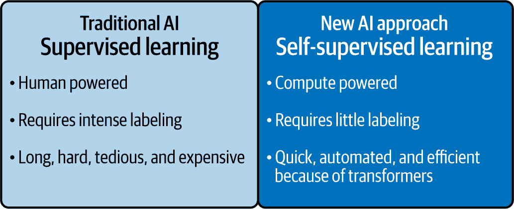
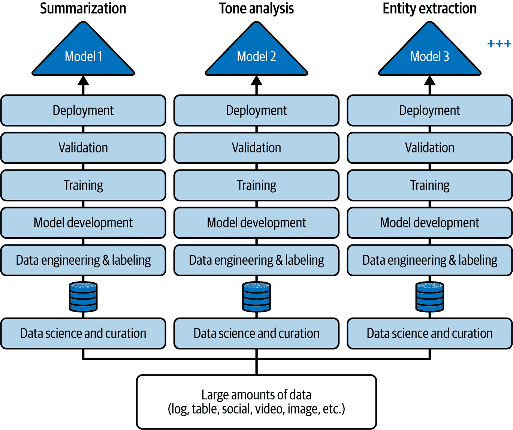
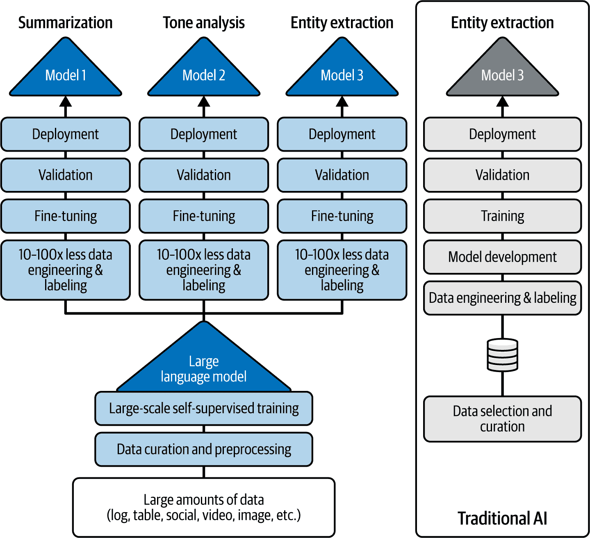

# 第二章\. 哦，成为一名 AI 价值创造者

在上一章中，我们提供了一套可以立即提高任何 AI 之旅成功几率的强制性要求。这一切都源于我们无数的集体经验，这些经验涵盖了从数千次客户互动到电视节目如*60 分钟*，再到美国白宫、北约、高级管理层，甚至梵蒂冈！（梵蒂冈在氮气保险库中存放着无价之宝，而我们——嗯，更广泛的 IBM 团队——帮助学者们安全地扩展知识和历史。虽然我们无法与您分享那笔交易的细节，但我们对其未来充满信心。）

您还了解到了今天的 Netscape 时刻以及它如何是一场横扫您个人和职业海岸的巨浪般的变革。您现在明白，尽管电一度被认为神奇，尽管它并非如此，AI 也不是魔法。我们（好吧，用双手推）您进入了一个+AI 到 AI+的思维模式，并为您提供了这个时刻的 AI 梯子，以攀登 AI 成功的阶梯。最后，我们为您提供了一些操作框架，用于分类 AI 预算、选择用例和设想结果，这些结果要么将您的业务向左或向右转变。

我们认为第一章和本章都很重要，因为它们都关乎在您的 AI 之旅中关注正确的细节。为什么？细节很重要，细节会区分，细节会赢得（或保持）信任。我们将以自由女神像的历史作为您在本书第一部分所做事情的类比。她高耸且绿色地矗立在标志性的纽约港。她的绿锈（随着时间的推移，铜与绿色化学反应形成的绿色物质）帮助她坚强地抵抗自然元素——但当她作为移民在驶入纽约港口时，看到她铜色的光芒，那一定是一件令人印象深刻的事情。如果你有机会，花点时间看看她的头发。如果你搜索近距离的照片，你会在她头后的头发上看到复杂的编织和精确的卷曲。这是在完美雕像上的完美头发。有趣的是，自由女神像是在第一架飞机之前 10 年建造的。她的雕塑家弗雷德里克·奥古斯特·巴托尔迪没有理由相信任何人会看到她的头发——然而细节很重要，因为雕塑是他的工艺，他的声誉依赖于这些细节。这与 AI 有什么关系？您在未来几年内做出的决定——以及您如何做出这些决定——可能永远不会孤立或明确地被看到，但它们的细节很重要，因为它们将代表您是谁，以及您的团队、公司和您希望成为的人。请记住这一点。

在这一章中，我们想向您介绍可能是您个人导航系统中最重要的 AI 目的地：*AI 价值创造者*。记住，这本书的这一部分是关于商业的，所以虽然我们会在稍后从技术角度为您提供一些关于大型语言模型（LLMs）的见解，但我们还有一些与 AI 商业相关的内容，我们希望确保您思考，这样您就能比那些没有阅读这本书的人拥有更丰富的技能集。

# AI 岁月：AI“时间流逝”部分

*AI*这个术语首次在 1956 年被提出，尽管没有像这一代的 GenAI 和代理时刻那样，这一代技术的各个版本自那时以来一直在进步和失望。有些人可能会说，人工智能的失望多于它的喜悦，这导致了“人工智能寒冬”，在经历了一些突破之后，人工智能又重新崛起。如果你看看发明的历史（以电力为例），那么通往人工智能突破的道路上经过大量实验也就不足为奇了。虽然许多人工智能实验都失败了，但成功的实验产生了重大影响，而这些成功来自于解决导致失败的问题。

人们长期以来一直在推测机器有朝一日能够像人类一样独立思考的可能性。这始于 19 世纪末，但这个想法真正扎根于艾伦·图灵 1950 年的开创性论文“计算机器与智能”。^(1) 历史学家称图灵为人工智能之父，正是因为这篇论文。在论文中，他提出了社会可以创造出能够下棋的计算机，描述了这些计算机将超越人类玩家，并说我们将使它们精通自然语言。他理论化了机器最终会思考。

在我们职业生涯的 IBM 时期，我们见证了（并且是其中一部分）图灵在通往“思考”机器的道路上所识别出的许多里程碑。这些包括像国际象棋（与 Deep Blue）、*Jeopardy!*和围棋这样的棋类游戏以及辩论系统的人工智能的演变和变体。但图灵只是开始。

如果图灵的论文是火花，那么大爆炸就在六年后在达特茅斯学院的夏季人工智能研究项目研讨会上爆发了。在那里，几位年轻的学者与贝尔实验室和 IBM 的几位资深科学家聚在一起，提出了一个扩展的夏季研讨会，只有少数相邻领域的顶尖人物参与，以密集地考虑人工智能。这就是*AI*这个术语首次被使用，它标志着人工智能作为研究领域的确立。

这个团队详细阐述了研究人员自那时以来一直在努力解决的各种挑战，以开发能够思考的机器。神经网络、自主学习、创造力等等，所有这些在今天仍然相关。

为了有更清晰的视角，这是 1956 年，也就是晶体管发明获得诺贝尔奖的那一年。今天，我们可以在图形处理单元（GPU）中放置超过 1000 亿个晶体管，并配置大量相互连接的 GPU 来提供生成 AI 所需的计算能力。多年来，AI 理论、技术和想法与硬件的进步并行发展，共同显著降低了计算和存储成本。所有这些现在正汇聚在一起，使 AI 变得非常真实和实用。

但我们想强调一个关键点：这不仅仅关乎强大的硬件和巧妙的算法。*也许生成式 AI 最重要的成分*——尤其是当你的业务想要从中获得最大价值时——是*你的*数据。*不谈论数据就无法谈论生成式 AI*。这使得硬件、算法和数据成为 AI 三脚架的三个支柱。

## 关于基础模型的一些快速说明

在生成式 AI 的世界里，你经常会听到关于 LLMs 如何推动生成式 AI 的消息。但它们是什么？在基本层面上，LLMs 是在高维空间中用大量参数表示语言的新方法——这些表示是通过在大量文本上训练创建的。

从这个角度来看，计算机历史的大部分内容都是关于想出新方法来表示数据并从中提取价值。长期以来，我们一直将数据放入表格中。例如，我们将员工或客户放入数据库的行中，并将他们的属性放入列中。这对于在线事务处理（OLTP）或为个人支付开具支票等活动来说非常好。

然后，世界开始用图表来表示数据，这帮助我们以前所未有的方式发现和欣赏数据点之间的关系；例如，这个人、企业或地点与这些其他的人、企业或地点相连。以这种方式表示的数据开始揭示模式。例如，公司使用图表来绘制社交网络或发现异常购买以帮助他们检测信用卡欺诈。这项技术是多种数据分析方法的组合，使用各种类型的数据存储库（包括图数据库），这也是 Facebook 上“你可能认识的人”（PYMK）功能的工作原理（仅举一例）。

今天，随着大型语言模型（LLMs），我们正在处理大量以神经网络形式表示的数据，这些神经网络模拟（非常松散地）大脑细胞的抽象版本。这里有层层叠叠的连接，包含数百万、数十亿、数百亿甚至数万亿个参数——突然之间，你可以做一些令人着迷的事情。你可以发现如此详细的模式，以至于你可以更有信心地预测关系。例如，你可以预测这个单词最有可能与下一个单词相关联，这两个单词最有可能后面跟着一个特定的第三个单词——这意味着你可以不断建立、重新评估和预测，直到创造出新的或*生成*的东西。因此，我们称之为*生成式 AI*。

这就是 GenAI：能够观察数据、发现关系，并足够自信地预测序列的可能性，以创造出之前不存在的东西。文本、图像、视频、声音以及所有类型的数据都可以在模型中表示。

在深度学习出现之前，我们只能做这些的有限版本，而深度学习本身就是人工智能的一个里程碑。通过*深度学习*，我们开始使用具有许多层的非常大的神经网络来表示大量数据，但训练必须使用人工标注的数据进行；例如，看一张图片并标注为“猫”，另一张图片标注为“狗”。这被称为*监督学习*。那么问题是什么？正如你在图 2-1 中可以看到的，监督学习是昂贵的、费力的、耗时的，因此只有大型机构才会进行这项工作，而且只为特定的任务。如果你想让 AI 总结和翻译文本，你需要标注两个非常大的数据集...手动（关于这一点稍后详述）。

大约在 2017 年，一种新的方法出现了，它由一种称为*transformers*（我们在第九章中简要介绍了这些）的架构驱动。使用这种方法，AI 可以执行一种新的无摩擦学习，称为*自监督学习*，在这种学习中，语言模型可以通过隐藏文本的某些部分（单词、句子等）并在模型中要求填补空白（AI 术语为*掩码*）来在大量的未标注数据上训练。例如，如果我们说，“愿力量与你同在”，你可能会猜测接下来的三个词是“来自《星球大战》的‘与你同在’”。虽然这是一个过度简化的例子，但这个惊人的过程，当规模扩大时，产生了今天我们称之为 LLMs 的强大数据表示。

###### 图 2-1\. 比较使用监督学习与自监督学习开始时的活化能

这就是真正神奇的地方。研究人员发现，他们不必构建仅适用于狭窄用途案例和特定专业领域的 AI 模型（例如，为总结构建并精心制作一个数据集，为翻译构建另一个数据集），他们可以拥有更广泛适用的 AI。基本上，这些 LLM 可以在大量互联网数据上训练（今天的最受欢迎的 LLM 实际上是互联网上所有内容的极高压缩表示——这既是好事也是坏事）并因此获得类似人类的*一套*自然语言能力。

在规模化的自监督、海量数据和计算能力的结合下，世界迎来了可泛化和适应性的 AI。我们如下定义这些术语：

可泛化

这意味着 AI 能够在广泛的任务和领域内表现出色，通常无需进行特定的任务调整。换句话说，同一个用于文本文档情感分类的 LLM 可以提取文本中的人物和地点——这一行为被称为命名实体识别（NER），并且可以进行翻译、总结等操作。

适应性

这意味着 AI 不仅能执行多项任务，还能处理它最初训练时并未针对的不同的用例。适应性 AI 也是*自发的*，这意味着它具有它未被明确编程的、意外出现的功能；例如，一个 LLM 可以通过识别模式来回答它从未训练过的谜语或解决逻辑谜题。底线是，能够使用相同的模型处理多个用例并在其中发现新的功能是一个强大的工具（尽管你仍然希望将其引导成为 AI 价值创造者；关于这一点，稍后还会详细介绍）。

在过去十年中，AI 的应用领域爆炸式增长。（我们打赌，你可能已经使用了许多这些应用，即使你并不知道。你使用过 Siri 或 Alexa 吗？你改变过灰蒙蒙的天空，使其变得晴朗，以创造一个完美的瞬间吗？你使用过翻译应用吗？）在这段时间里，我们看到 AI 从纯粹学术研究转变为一个主要力量，推动着众多行业的发展，并影响着每天数十亿人的生活。

近年来，我们已经能够构建能够从数千或数百万个示例中学习的 AI 系统，帮助我们更好地理解我们的世界，并找到解决难题的新方法。这些大规模模型导致了能够理解我们说话或写作的系统的发展。这包括我们每天使用的自然语言处理（NLP）和自然语言理解（NLU）程序，从数字助手到语音转文字程序。其他系统，经过著名艺术家全部作品的训练或现有所有化学教科书的训练，使我们能够构建基于那些艺术家风格的生成模型，或基于化学研究历史的新的化合物配方和对接组合。

尽管如今许多新的 AI 系统正帮助解决各种现实世界的问题，但在 GenAI 出现之前，使用传统方法为每个新系统创建和部署 AI 需要相当多的时间和资源。对于每个新的应用，你必须确保有一个大型的、标签清晰的特定任务数据集。如果不存在该任务的数据集，你需要人们花费数百或数千小时（甚至更多）来寻找和标记适当的图像、文本或图表，用于训练和验证数据集。

这意味着什么？你可以使用一个大型预训练的 LLM——如果你用它来商业用途，你将希望确保你从一个值得信赖的模型开始——并添加*你的*机构知识来加速模型，使其*在你的特定用例中表现出色*，使用你特定的数据。（我们将在第八章中深入探讨这个话题的弊端、意愿和兴奋之处。）

现在，如果你因为你是我们之前提到的那类企业之一，花费了大量时间收集和标记 AI 项目的数据，但最终因为数据标记不足而失败（这就是传统 AI 的情况），请不要气馁！在这个 GenAI 世界中，这项工作并不是无用的，因为刚才提到的专有行业特定数据正是你用来定制 LLM 以满足商业需求的数据。这是你成为 AI 价值创造者所需要做的。事实上，你将真正地利用两年前失败的 AI 项目，并在向老板展示你如何想引导你选择的任何 LLM 以适应你的业务时，成为一个英雄。如何做到这一点？首先，今天的 LLM 几乎不包含任何企业数据（大约 1%），更不用说你的专有数据了。在第一章中，我们告诉你你的数据是竞争优势，现在是时候让这些数据发挥作用了。

简而言之，当你将 LLM 的数据表示与你的标记数据（现在，你需要的数据量要少得多）结合起来时，你最终得到的是针对你业务量身定制的东西。可以这样想：假设你懂西班牙语，今天你正在尝试学习法语。在这个过程中，你已经有大量的*基础*知识，比如如何变位动词。正如你将在第八章中发现的那样，有一种新的开源方法（称为 InstructLab）使得将你的数据整合到公司的私有 LLM 中变得比以往任何时候都容易，而且这肯定会给你的最终结果带来一些惊喜。

当前的观点通常是，你可以将 LLM（因此得名）应用于语言。但这应该引发一个问题，什么是语言？工业设备中的信号正在用它们自己的语言与你交谈；有编程语言，这是人类用来指令机器的交流术语；还有用户在网站上导航时的点击，软件代码，化学，以及化学的图示表示。我们甚至与一家使用 AI 来模拟味觉和嗅觉的公司合作过。如果你眯起眼睛，*一切看起来都像是一种语言*，如果它是一种语言，那么它就可以被学习、解读和理解。

要点在于，AI 可以被专门化以在任何语言中完成各种提高生产力的任务。这意味着 AI 可以横向扩展到你的业务中，应用于 HR 流程、客户服务、自助服务、网络安全、代码编写、应用现代化，以及我们将在第四章中与你分享的许多其他事情。

## 深入探讨：大型语言模型的演变以及比较监督学习与自监督学习

大型语言模型并非与传统 AI 以相同方式构建。它们通过自监督学习进行训练，这意味着你不需要手动标注大量数据。基本上，你通过告诉模型去阅读大量数据（例如，文本）来训练模型，当它完成时，你最终得到一个大型且多功能的模型，具有更类似人类的语言能力。AI 使用数学模型来表示它所摄入的数据（如单词）中的关系。如果你在提示中给模型几个单词，它可以通过数学预测在上一节中分享的*星球大战*短语序列中出现单词的可能性。

我们对通用人工智能最兴奋的两件事之一就是，你现在可以如此快速地构建这些相同的用例，原因如图 2-1 中总结的那样，以及这些模型（正如我们在上一节中提到的）是可泛化和可适应的。要欣赏通用人工智能如何使人工智能项目的价值实现时间曲线变平，最好的方法就是超越数据标注，并将通用人工智能与传统方式进行比较，后者是将人工智能用例引入生产的方式。

许多在人工智能领域已经有所涉猎的人可能会觉得，在这个新的通用人工智能（GenAI）时代，他们看到了许多来自传统人工智能时代的用例在重复出现——而且你们是对的。然而，如果我们不指出，尽管最初的通用人工智能用例可能正在重复，但仍然有新的用例出现，并且具有代理能力的 AI 带来了更多可能性。在过去十年中，随着深度学习的出现，世界（作为一个社区）证明了如果你收集足够的数据，对数据进行标注，训练模型，并部署它们，你就能为特定任务带来令人难以置信的准确性。这种传统的方法正如你在图 2-2 中看到的那样。

注意在图 2-2 中，每个模型都是为特定的 AI 用例而构建的。在这个例子中，用例包括摘要、语气分析和实体提取。要使用传统的 AI 方法构建这些模型，你的公司将为每个任务创建一个单独的团队，并且每个团队都会构建一个单独的模型来锚定该任务。所有这些团队都会经历相同的数据选择和整理、标注、模型开发、训练、验证等繁琐过程——甚至可能重复使用相同的数据！

###### 图 2-2. 通过组装许多数据科学团队并让他们尽可能多地完成项目来构建 AI 的传统方式

不同的团队收集数据，为各自的用例整理数据，并经历与其他团队相同的步骤，这只能被描述为漫长、艰难、繁琐且昂贵。事实上，我们谦逊地建议，你的公司能够扩展 AI 的规模，这实际上是对以下问题的回答：你能组建多少个数据科学团队，这些团队能够完成多少个项目？

现在将新的 AI 方法（图 2-3 的左侧）与传统的 AI 路径（图右侧）进行对比。正如你所看到的，你不需要为每个特定任务构建一个 AI 模型（如图 2-2 所示），而是使用一个可能由其他人（如 IBM、Google、DeepSeek、OpenAI 或 Anthropic；说实话，很少有公司会自己构建——相反，他们将引导现有的模型）训练的 LLM，并将其适应许多不同的下游任务。此外，请注意，单个 LLM 如何为图 2-3 中的三个用例提供动力。

###### 图 2-3\. 通用人工智能（GenAI）扩展人工智能，降低技能要求、数据、时间、管理和前期成本

由于大型语言模型（LLM）的通用性，公司现在可以使用相同的模型来实现多个商业用例。他们以前根本无法使用传统人工智能做到这一点。

我们真的希望你能花些时间记住图 2-3，因为它说明了为什么 LLM 正成为新人工智能工作流程的必要组成部分。现代人工智能需要非常专注的努力来创建一个*基础模型*（即通用型 LLM），并从这种投资中获得规模经济。自己创建一个 LLM 是一项相当复杂的任务，这也是为什么我们相信你们大多数人会选择从使用一个开始，然后用你们的数据来调整它，以适应你们的业务和用例（我们将在本书的后面告诉你如何做）。

我们希望你已经很好地掌握了这种方法论上的转变，因为下一波人工智能的发展趋势是，用 LLM 作为核心来取代至今主导人工智能领域的特定任务模型。这些模型在广泛的数据集上训练，可用于不同的任务，更重要的是，通过自我构思来实现既定目标，具有代理能力的 AI 也将遵循这条路径。

这就是关键所在。LLM 之所以如此通用，是因为正如其名称所暗示的，它们可以是许多 AI 和代理应用的基石。通过使用自监督学习和迁移学习，这些 AI 模型可以将他们在一种情况下学到的信息应用到另一种情况下。

理解迁移学习最简单的方法是使用传统的计算机视觉示例，即 AI 被用来识别一只猫。（再次，AI 和猫似乎总是形影不离——这就像某个猫爱好者觉得他们的深度学习需要一些深沉的喵喵声。）如果你教一个 AI 如何识别一只猫，那么这个 AI 将从形状和边缘开始，并在其神经网络中逐渐构建层来识别猫。在其基础层面，这个 AI 可能能够检测三角形（边缘的组合）。如果你想想猫，三角形构成了它的耳朵、鼻子和其他部分，一旦 AI 能够找到三角形，它就可以继续发现其他猫的特征，因为它在其神经网络中使用了越来越多的层，最终将看到的对象定义为猫。现在，想象一下你想要识别一艘帆船。一个被训练来识别帆船的 AI 将从相同的地方开始：寻找边缘和形状。所以，你可以将知道三角形外观的 AI 层转移到帆船上，你可以对可能成千上万的层做同样的事情——现在你理解了迁移学习。无论 AI 是在识别猫还是帆船，那个三角形的识别都是关键的。

我们中的大多数人都能体会到 LLMs 在日常生活中支持多个用例的灵活性。例如，一旦你学会了如何开车，你就获得了一些可以转移到驾驶其他汽车上的重要技能。当然，有一些细微差别需要适应（比如在哪里找到雨刮器控制），你甚至可能会遇到重大问题（如果你只开过自动挡，尝试开手动挡），但仍然有一系列基本技能可以转移。今天，没有人在进行计算机视觉时不用某种形式的迁移学习来构建卷积神经网络（CNN）或使用视觉转换器（ViT）——这就像是终极计算机视觉作弊码！

带走的要点是什么？很简单：不再需要为每个特定任务构建一个 AI 模型，你可以训练一个模型并将其适应于许多不同的下游任务。这意味着公司现在有机会从“一个任务：一个模型”的模式转变为“一个模型：多个任务”的模式。例如，你的 IT 支持聊天机器人和你的人力资源自助服务项目可以使用与将为你撰写营销邮件和总结合同文档的新应用相同的基模型。

如图 2-3 所示，还有很多工作要做！虽然数据工程和标记任务现在微不足道，但您仍然会希望使用您的数据来引导模型走向您的业务领域及其品牌、风格、社会规范等。有许多方法可以做到这一点，使用诸如提示调整、提示工程、参数高效微调（PEFT）方法和 InstructLab 等技术。您将在第八章中了解更多关于这一点，但您在将数据投入使用之前必须做的准备工作已经大大减少，这得益于 LLMs。

当然，这里令人耳目一新的不应该是具有数十亿甚至数万亿参数的模型的力量。希望它已经跃然纸上，如果不是的话：与 LLMs 相关的生产力意味着企业最终可以用更少的时间、更少的数据、更少的初始资金和更少的行政工作来扩展他们的 AI 计划。例如，在 IBM 自己的经验中，使用传统方式用 AI 支持 12 种语言花了 7 年时间——但一旦它采用了 GenAI，它支持的语言在一年内就增加到了 25 种。

# AI 价值创造应该是您的目标

当氧气、热量和燃料结合时，我们得到火。这是基本的、原始的，也是解锁人类进步的关键。想想看：火提供了光、热和保护，我们的祖先用它来迁移到新的气候和食用新的食物。陶器、冶金、化学、快速交通和许多其他技术都是从火开始的。

但想象一下，如果火是专有的呢？如果制作火的知识没有被共享，如果只有少数人掌握火的知识呢？我们将处于何种境地？

记住我们在序言中告诉你的：我们正处于一个与生成式人工智能（GenAI）相关的转变、分裂或悬崖时刻，尤其是与智能体（agents）相关，它将塑造未来几代人的社会。本节（以及本书的其余部分）将向您展示如何成为自己的 AI 点火者，如何掌控自己的 AI 命运，以及为什么将自己视为 AI 价值创造者而非仅仅是一个 AI 用户如此重要。最后，我们将详细阐述为什么 AI 的未来需要一个开放的创新生态系统。

## 你如何消费 AI：成为价值创造者还是价值使用者？

当涉及到使用 AI 时，有三种消费模式：

+   这已经融入了软件中。

+   您使用他人的模型。

+   您使用一个 AI 平台。

### AI 用户：将 AI（嵌入）到产品中，然后烘烤（使用）

消费 AI 的第一种方式是当它“嵌入”到现成的软件中。在这种方法中，软件供应商创建 AI，然后你将其投入使用。（我们将假设你只在与产品中的真实 AI 合作，而不是“虚假和烘焙”AI，因为现在每个人都说他们的产品中都有 AI。）无论是写作助手（如 Grammarly 或 Jasper），它能帮助你电子邮件中找到正确的语气，还是图像编辑软件（如 Adobe Photoshop 或 Topaz Photo AI），它能自动提升你的图像和视频质量，在这种消费模式中，作为 AI 用户，你可以获得一些非常棒的功能，这可以使你更有效率。谁不想这样呢？

但是有一个注意事项！*你和每个人都可以访问这种“魔法”，*这意味着虽然这种形式的 AI 可能会帮助你更快、更好地完成工作（这是好事），*但它（将会）对任何投入时间提高在该软件中技能的人做同样的事情。换句话说，这些 AI 能力和生产力机会并没有成为差异化因素——*但是*，它们确实为每个人设定了一个新的、更高的基准，包括你的竞争对手。

### AI 用户：当你发起服务调用时，不要掉链子（更大的*但是*）

AI 消费的第二种模式是当你直接在聊天界面或通过 API 调用提示他人的模型。简单来说，随着你为你的业务开发定制的 AI 应用程序，这些应用程序可以调用另一家公司的 GenAI 服务，使用该公司的模型，并获得结果。这也是一种可行的 AI 消费方式。

事实上，我们几乎每个人都在以这种方式使用通用人工智能（GenAI），这使得我们所有人都是一群 AI 用户。但请暂时思考一下成为 AI 用户的感觉：你主要局限于简单地提示他人的 AI 模型（而不是你的模型），你无法控制该模型或用于训练它的数据，而且在几乎所有情况下，你根本不知道用于构建它的数据是什么。

根据你如何巧妙地使用模型，你可以*开始*区分你相对于竞争对手如何使用 AI。*但是*，还有更多需要注意的注意事项——*尤其是*如果你试图成为一个 AI 价值创造者的话。

第一个考虑因素是，就像我们的软件示例一样，你接入的那些模型和服务对每个人都是可用的，那么你真的有差异化吗？当然，也许你比其他人更能有效地提示同一个模型。*但是*，你仍然在访问与所有人相同的模型。

当你的应用程序发出调用并开始施展魔法时，还有另一件事你需要更加关注——那就是它连接到了一个不透明的东西（意味着你无法看到里面）。你并不一定知道另一端发生了什么，AI 模型正在如何处理你的数据（从中学习、存储或只是查看），以及构建服务所基于的 LLM 所使用数据的来源和治理。根据用例的不同，这可能会让你感到有些不安，因为你的业务仍然要对最终结果负责（无论是从社会角度还是越来越多地，从法律角度——我们将在第五章中讨论 Chapter 5）。如果你谈论的是商业 AI——而不是仅仅个人使用——我们认为这应该让你感到不安。

我们希望在你使用他人的专有 AI 时，作为第二份警告，让你思考以下问题：长期来看，价值的创造和积累是什么？在过去，我们看到了许多价值提取型的商业模式——如果你在社交媒体上，你就是其中一员。简单来说，我们总是告诉人们，如果你没有为其付费，那么请不要误会，你很可能就是被出售的产品。但即使你为这项服务付费，的确，你将从这项服务中获得价值（否则你不会为其付费）。然而，那家公司很可能正在从你的使用和你的数据中提取价值，随着时间的推移，积累得越来越多。我们并不打算在这本书中点名任何这些公司，但有大量公司（包括付费服务）从你的战略数据中获益。讽刺的是，这正是那些 LLM（大型语言模型）被制作的方法（从互联网上抓取数据，无论这些数据是否受版权保护）。

这引发了我们希望让你思考的另一个问题：如果你是使用他人 AI 服务的 AI 用户，他们的价值增长速度是否比你快得多？（提示：查看我们未命名的这些公司的一些股价和估值倍数。）简单来说，这种关系可能存在不平衡，这可能会对你的特定业务、整体经济和技术进步产生长期影响。

最后但同样重要的是：作为社会，我们真的希望只有少数人掌握我们所有人都依赖的 AI“火种”吗？这对你的个人业务和股东来说是最好的吗？我们认为不是。

### 火种：成为人工智能价值创造者

人工智能消费的第三种模式是平台模式，这是最全面的模式。这就是你如何成为自己的 AI 点火者，当谈到成为 AI 价值创造者时，我们一开始就要明确一点：这**并不代表**你是在独自一人做这件事或者从头开始重新发明 AI。你不需要花费数年时间和数百万美元来构建自己的 LLMs。当然，你可以通过平台来做这件事，但这种情况将非常罕见。

在一个 AI 价值创造平台上，你已经拥有了构建自己 AI 解决方案所需的所有元素和成分（数据、治理和 LLMs）。你可以访问大量的 GenAI 模型（包括开源和专有模型），或者你可以将你自己的模型带入平台。你拥有工具来改进和定制模型，以便融入你业务中独有的知识，而无需担心分享你最有价值的资产（你的数据）。你可以微调模型，提示调整它们，使用 InstructLab 来定制它们——无论你想要使用我们在第八章中详细介绍的哪些技术来构建你自己的定制 AI 解决方案。在核心上，AI 价值创造者的方法允许你创造和积累对你业务独特的价值。一个 AI 价值创造者的绝佳例子是 L’Oréal，它是世界上领先的美容公司之一。想象一下，随着 L’Oréal 即将迎来 120 岁生日，它积累的配方、材料科学和偏好数据集。本质上，L’Oréal 拥有定义化妆品语言的数据库。它希望成为一个 AI 价值创造者，因此它着手创建一个私有 AI 模型（与 IBM 合作），以加速新产品配方、现有化妆品的重新配方和生产规模优化的任务。如果 L’Oréal 只是一个 AI 用户，它会将这些数据拱手相让，但相反，它将其数据视为竞争优势，并决定在未来几年内更好地装备其全球 4,000 名研究人员。我们认为 L’Oréal 不仅仅是将 AI 应用于美容，它正在为其自身进行一次改造。拥有像其基础一样丰富的数据和像其口红一样大胆的数据，谁知道 AI 在色彩匹配上能有如此敏锐的洞察力？

### 前进的道路：如何利用 AI 创造价值

最终，我们相信大多数企业应该最终采用三种 AI 消费模式的混合。你会使用嵌入 AI 的第三方软件，*有时*使用他人的 AI 用户来完成你想要做的事情是完全合适的。例如，也许你是一名房地产经纪人，想要根据你收到的照片快速描述一套新上市的厨房。除非你有一些专有的描述魔法，否则这可能是你想要使用一些你听说过的更著名模型而无需担忧的情况。但如果你是在基于从三十年销售房屋中获得的数千条情感进行情感分类呢？为了充分实现 AI 的价值并区别于竞争对手，你将想要采用平台方法（就像 L’Oréal 一样）通过使用适合你业务的自身 AI 来创造价值，并且你将想要在适当的地方添加其他 AI 消费模式。让我们更深入地探讨 AI 价值创造，从 LLMs 开始。

回想一下，LLMs 是使用大量数据进行训练的大型深度神经网络，随后适应了许多下游任务。它们可能是广泛的通用模型或更窄、更深入的模型，但关键是它们是预训练的，*预期*如果你希望成为 AI 价值创造者，你可以使用自己的专有数据进一步改进它们。这就像一个新员工加入你的公司一样：他们带着一些作为基础的一般技能和学习的本领。他们了解你业务越多，他们就会增加更多的机构知识和专业知识，从而提供更多的价值（同样，如果他们去了竞争对手那里，可能会造成更大的伤害）。LLMs 基本上也是这样。你使用你的 AI 平台用你特定的业务数据、专有知识和专业知识来调整它们，然后随着时间的推移，它们就会更像你的业务专家，对你的业务更有价值。你不想看到那个训练有洞察你账户的销售员工开始为别人工作，AI 价值创造者对他们的数据也有同样的感觉！

由于 AI 价值创造者控制着平台、流程和数据，随着时间的推移，他们积累的价值会越来越大。在市场上的一些消费级人工智能产品中，我们已经看到了当你放弃控制权时会发生的一些情况。你可能会得到导致不良结果的不良数据，以及虚构或幻觉。你也可能因为无意中使用他人的版权管理内容（这正是所有正在进行的版权诉讼的原因）而陷入麻烦，我们甚至看到专有或敏感数据被意外泄露回公共空间。这些都是为什么在商业人工智能领域，你需要知道你的 LLM 是如何构建的，用于训练它的数据是什么，以及将所有这些组合在一起的配方。这也是为什么你应该优先考虑对敏感数据进行严格控制的理由。*强大的 AI 治理绝对至关重要*。

### 跳跃之前先看看

是的，现在是时候投身于人工智能领域了，但在跃入之前，请务必确保你在投资一个智能、安全且可持续的方法，这种方法让你的企业和客户成为主要受益者。我们认为这种方法从使用一个受信任的平台并创建一个 AI 价值创造者角色开始，然后从这里扩展出去。

# 规划你的 AI 未来：一个拥有许多生成式 AI 模型的未来

我们认为现在有一个 AI 神话，或者至少是一个基本的误解。对于公众来说，生成式 AI 似乎突然出现。很多人认为市场上只有少数面向消费者的 AI 体验，并且认为一个模型将会获胜（在托尔金的话中，将是“一个模型统治一切”）。

*我们认为这种情况不会发生*。人工智能的未来不在于一个模型，而在于许多模型（你有时会听到这被称为*多模型*），它也是多模态的（可以在图像、文本、视频、声音等上工作）。当你将它们应用于特定用例时，你的企业将使用多个微调后的模型以实现最佳结果。其中一些是现成的，一些会根据你的数据进行调整，一些会被用来评估人工智能的输出（它们被称为*评估模型*），一些会直接使用以确保安全性，一些会被用于需要复杂推理的任务，还有一些会被用来驱动代理。这就是为什么平台方法如此重要的原因——这也是为什么我们在第一章中向您介绍了 Hugging Face 社区第一章。

正如我们暗示的（好吧，我们直接告诉了你，但我们只是出于礼貌）——*押注社区*，因为人工智能的未来与其说是关于专有模型，不如说是由开放科学和开源驱动的。专有模型肯定会发挥作用，但未来将要发生的事情中的许多（而且不应该）是在封闭的门后发生的。它需要（并将）在明处展开，在开源中实现完全透明和问责。

再次强调，目前开源社区中围绕生成式人工智能和代理的能量是惊人的。有分布式项目、大学项目和公司努力，所有这些都推动创新并产生可用于您用例的 LLM。

许多人说，“大科技公司的 AI 是问题。”*我们不同意*（并且不是因为我们在一家大科技公司工作）。我们更希望您扩大视野，说，“专有和封闭的 AI 可能是一个严重的问题。”这一点我们同意。我们为什么提出这个观点？是因为有大小不一的供应商（我们在这里不提他们的名字……我们不是想挑起争端），他们是封闭和专有的，还有像 IBM 和 Meta 这样的大公司以及像 Mistral AI 和 DeepSeek 等小公司是开放的。

从长远来看，为了社会的利益，我们不想只有一个或少数几个赢家——一些可以定义人工智能是什么并规定其如何被使用的公司。从我们能看到的来看，我们认为这种情况不会发生——这对您、您的业务以及社会来说都是一件好事。

## 是时候揭开人工智能的神秘面纱并应用它了

正如人们常说的，数据是“新石油”，许多人将人工智能称为世界的“新电力”。除了生成式人工智能使今天的 AI 无处不在并越来越易于获取（多亏了提示词）之外，人工智能（如果做得正确）还可以增强和改变全球的商业运作方式。今天，人工智能可以用于实现最高准确度的预测，并自动化业务流程和决策。其影响巨大，从无缝的客户体验到智能产品再到更高效的服务。最终，结果将为公司、国家和社会带来经济影响。

当然，推动人工智能大规模实验的组织将在下一个十年的市场机遇中获胜。为了打破并帮助揭开人工智能的神秘面纱，您需要考虑该类别的两个关键要素：*组件*和*过程*。换句话说，您需要确定其背后的内容以及如何采用它。

### 组件

正如电力的使用发展是由基本组件如电阻器、电容器、二极管等推动的，人工智能的发展正受到现代软件组件的推动，这些组件在本节中已概述。

#### 具有数据即产品观点的统一、现代数据架构

你已经在我们这本书中多次听到过：你的 AI 需要 IA。为什么？因为 AI 依赖于数据，因此，你的数据必须为 AI 做好准备。（这就是为什么它在我们列表的第一位。）这不仅仅是一个垃圾进，垃圾出的（GIGO）问题，尽管由于 AI 所做的只是找到我们在第一章中提到的那些数值模式，这个问题在 AI 中更为严重。除非你认为互联网上的一切都是真实的，没有假新闻，也没有仇恨、滥用或亵渎，否则这将是一个问题。换句话说，这是一个问题。

一个*数据编织*（如果做得正确）覆盖了所有企业数据，具有受控的搜索性和连接性。它通过数据智能消除了连接数据和理解底层技术细节的复杂性。你经常会听到我们大声疾呼：“云是一种能力，而不是一个目的地！”（混合云是几乎所有企业都基本确定的方法。）同样，你使用数据编织将并行最佳思维过程应用于你的 IA：即“数据并不只在一个地方”的思维模式，这种模式的好处适用于任何地方。

数据编织作为任何云（公共、私有或本地）上所有数据资产的逻辑表示。它自动组织并自动标记企业内部（以及如果需要，企业外部）的数据，无论数据位于何处。它赋予数据流向运输功能的权力，而不是功能流向数据，从而优化计算周期。简单来说，这意味着它将你想要应用于数据的操作发送到数据所在的地方，而不是将所有数据拉到一个单一的地方进行计算。在这个大数据世界中，你可以想象后者不会扩展。

也许最重要的是，它通过虚拟化，为公司员工提供对所有可用数据的受控和无缝访问，从防火墙到边缘。当你想到数据编织时，要想到*自助服务*、*易于访问*和*数据保护*。

最终，数据编织将数据利用转化为在整个业务中——如果适用的话，外部——编织数据的过程。

一个优秀的 IA 策略不仅仅包括我们刚才提到的那些内容，但它们是我们可以拉动的杠杆——从那里开始，收集数据、组织数据、管理数据、将其融入现有的 AI（和非 AI）业务流程等任务都会井然有序地展开。

#### 开发环境和引擎

一家公司需要一个地方来构建、提升技能、培训和运行其 AI 模型。理想情况下，组件应与您的数据持久性战略（如数据湖屋）和治理框架集成，并且所有这些都与生态系统中的共享元数据集成。这种方法还有助于组织在共同的任务、语言和设计过程中团结起来——从输入到输出。当你手头有了这两个组件时，你公司的数据战略将开始感觉像魔法。虽然我们已经摒弃了魔法神话，但加速一个计划并拥有后盾的势头*确实*会感觉非常棒。

#### 人类特征的模式

使 AI 模型“活起来”的机制涉及将这些模型和应用程序连接到人类特征，如声音、语言、视觉和推理。生成式 AI，尤其是代理，在许多无缝客户体验讨论中被提及，通常聚焦于聊天机器人这个话题。但“聊天机器人”这个术语往往让人联想到打字——虽然这是一种模式，但一个自然声音的交互式语音响应（IVR）也是一个机器人。我们都与听起来完全不像是人类的 IVR 互动过，但有了 AI，你可以将真实的人类声音*和*表情带到体验中。例如，尝试将一些内容上传到谷歌的 NotebookLM，并让它为你生成播客——令人印象深刻！使用 AI 可以帮助加速 IVR，使其具有表达性的声音，让你能用类似人类的语言、情感、词语强调和插话来欢迎你的客户。

###### 备注

尽管我们在本书中涵盖了代理 AI，但我们没有具体涵盖代理对交互模式的影响，特别是用户体验（UX）。未来的设计将不得不考虑两种用户：人类和代理。代理体验（AX）将使用 API 来构建工作流程*但*现在还包括桌面交互。

这种能力很重要，因为无论我们是否意识到，作为人类，我们在说话时都会传达情感。当我们向对方道歉时，可能会显得有同理心；当我们不知道某个问题的答案时，可能会显得不确定；当我们传达好消息时，可能会显得愉快。这种传达情感的能力使得我们的声音具有人性，而使用 AI 来完成这项工作最终可以减少在处理当今电话体验时客户的挫败感。

但这里有一个我们希望您理解的重要观点（以及为什么提升技能是一个热门话题）：定制的品牌声音（甚至包括您的声音）可以在几分钟内生成，无需任何技术专长！简单来说，富有表现力的声音能让客户感觉他们是在与真人交谈，而不是机器人，但您的公司将从将成本从现场客服（每次互动成本约为 5 美元）转移到 AI 辅助客服（每次互动成本约为 0.25 美元）来处理“简单的事情”中获益。这是一个很好的例子，说明了我们每天都能通过技术解决或改进的问题。如果您拥有一个带有 IVR 的客服渠道，却不知道构建听起来像真人的人工交互有多么容易，那么您只是在满足于一个“按 1 键...”的迷宫，而不是在迷宫的尽头找到奖品，您的客户却在空旷的地方大喊“和人说话！”

这实际上导致了多模态 AI 的发展，其中人类特征在 AI 中变得越来越明显。例如，谷歌的 Gemini、苹果的 FERRET、Meta 的 Llama、DeepSeek 的 Janus-Pro、IBM 的 Granite 以及各种 OpenAI 模型都允许您在提示中包含一张图片，并且它们会告诉您它们看到了什么。想象一下，您收到了快递服务发来的一张您门口包裹的图片，并附有 AI 生成的描述，可能会通知您，“这个盒子的角落损坏了。”也想象一下，同样的包裹附有一份预先填好的表格，如果您在回家打开包裹后发现货物损坏，可以提交此表格。如果您打开包裹一切正常，那就太好了，无需做什么。如果运来的物品有问题，退货将尽可能无摩擦——这就是代理 AI 在发挥作用！我们真的希望您在这个例子中把自己放在图片中。虽然没有人希望出现问题（比如收到损坏的货物、收到错误的物品或需要重置密码），但*更大的基本真理*是，当事情出错时，您不应该向客户展示摩擦（比如让他们转三次，要求他们重新验证身份，以及所有可以总结为我们似乎每周都在经历的 WTF 时刻的东西）。讽刺的是，研究表明，真正好的客户体验并不仅仅是关于企业做对事情。事实上，作为一个企业，您可能允许出错（取决于用例——如果您的业务是心脏外科手术，您做错了，可能没有客户来投诉，但我们确信会有一些律师）。但保持无摩擦至关重要，当事情不按计划进行时，这会给您的公司带来客户的耐心、理解、忠诚度以及更多。

#### AI 管理和利用

这使你能够自信地将 AI 插入任何应用程序或业务流程，但要做到这一点，你需要了解模型是如何构建的，使用了哪些数据，如何提高模型的影响，什么发生了变化，漂移、偏差和方差。这就是你的模型用于利用和实现所有 AI 的生命周期管理的地方。最后，这个组件为你的 AI 做出的决策提供了证明和可解释性。

这样想吧：如果我们告诉你每分钟全世界产生多少数据，那么当我们保存本章的第一稿时，这个数字就已经过时了。每次我们更新本章，它就会立即过时。你的模型也差不多，这被称为*漂移*。你需要知道，AI 模型一旦投入生产，就可能开始漂移。如果你的数据历史（你用来训练模型的数据）与今天的数据不一致，那么这个模型实际上会偏离它原本要做的（比如选择一个机会）以及/或者开始做坏事（比如选择偏见）。

#### 为大众提供代理和助手

当你将人工智能融入你企业的神经系统，对 AI 进行分类，并将其附加到工作流程中（这就是+AI），你应该知道代理和助手真的可以帮助你为业务带来重大利益。我们认为代理和助手是你在公司真正实现人工智能民主化的地方（在许多情况下，你会看到它们被集成）。是的，拥有一个能够让你收集、组织、存储数据，构建生成式 AI 模型，并对其进行管理的 AI 平台非常重要。超级重要。但助手和代理是利用你模型的力量提升企业的底盘。例如，开发团队可以使用 Microsoft Copilot 或 IBM 的 watsonx Code Assistant 的某个版本来提升他们的开发过程。也许你正在使用 watsonx Assistant 或 Kore.ai 为客户设计无摩擦的体验，或者也许你甚至正在使用 Aisera 或 watsonx Orchestrate 及其 AI 代理库来编排工作流程。所有这些都是真实 AI 提升你企业中人们生产力的例子。我们认为，这是任何成功 AI 策略的关键部分，因为它为以下问题提供了详细的答案：谁将使用 AI 以及它将如何帮助他们？根据你的工作，了解这些问题的答案——或者知道如何提出这些问题——将大有裨益。

### 流程：没有食谱的蛋糕原料做不出蛋糕

拥有这些组件，更多的组织将能够释放他们数据中的价值。但为了充分利用 AI，你还必须了解如何采用和实施这项技术。以下是一些关于将 AI 用于商业的基本步骤的快速建议（随着你阅读这本书，你将获得更多细节）。

#### 第 1 步：确定 AI 合适的商业机会

潜在的应用领域非常广泛：客户服务、员工和公司生产力、制造缺陷、供应链支出等等。任何可以轻松描述的事物都可以编程，一旦编程完成，人工智能就会使其变得更好。正如你在第一章（它将在第四章中真正向你展示）中学到的，机会是无限的，*但是*重要的是你要把所有的努力都集中在商业机会和结果上，而不是数据科学项目上。在大数据狂热时期，我们看到了太多的客户将大量的预算和时间投入到对业务没有价值或业务无法消费的项目中。这就是为什么生成式 AI 如此不同：它使构建用例的速度比以往任何时候都要快，而且它可以为大众所接受。记住，要明智地选择。

#### 第 2 步：为 AI 准备组织

组织将在许多领域需要更大的能力和专业知识，从显而易见的数据科学团队到对生成式 AI 能为你的业务做什么有一个更广阔的视野（以避免我们在这本书中不断谈论的“每天走过可以解决或通过技术改进的问题”这种情况）。

你将需要对生成式 AI、大型语言模型和智能代理进行大规模的技能提升。这项工作并不是关于对市场营销文案编辑进行关于最小绝对收缩和选择算子（Lasso）回归是什么或者 AUC 代表什么（接收者操作特征[ROC]曲线下的面积）等等的即兴提问。对人工智能的益处和注意事项有一般性的基础知识对于让 AI 为你的公司工作至关重要。我们无法强调这一点：你必须有一个计划来提升所有员工的技能，以便将 AI 的好处分布到整个公司；这就是为什么我们专门用了一整章来讲述它——第六章。

这为什么如此重要呢？今天许多重复性和手动任务将被自动化（左移），这将改变许多员工的角色。*很少有整个角色可以由 AI 完成，也很少有角色不能通过 AI 得到增强.* 没有人才来使用技术，所有技术都是无用的，所以你必须组建一个专家团队来激励和培训他人——但你必须确保其他员工的技能不断进步。毕竟，虽然技术年通常相当于狗年（1 狗年等于 7 人类年），生成式 AI 和智能代理的进步速度就像鼠年（1 鼠年等于 30 人类年）——你需要一个计划来跟上。

#### 第 3 步：选择技术和合作伙伴

虽然 CEO 个人选择公司的 GenAI 技术栈（或多个技术栈）的可能性不大，但这里的含义更多的是文化上的。一个组织应该采用许多技术，并通过这个过程进行比较、对比和学习。

我们会给你一个很好的建议，这能让你省去很多痛苦：不要陷入一个常见的陷阱，认为云将是一个来自一个提供商的地方。从后视镜看去，很容易看出这个观点已经被证明是错误的。现在，我们不是说你应该在你的店里拥有成百上千的 AI 供应商（他们无处不在），但我们在这里提醒你，一个 AI 模型不会统治所有。组织应该选择一些*值得信赖*的合作伙伴，他们既有技能也有技术来提供 AI。此外，我们在这里强调*值得信赖*的原因。我们不需要深入细节，但特别是在技术领域，你很可能熟悉好的演员（站起来的人）和坏的演员（最好的情况下是旁观者，最坏的情况下是众所周知的恶棍）。再次强调，我们认为信任将是最终的运营许可，我们将让你从这里开始思考你信任谁。

最终，我们认为大多数成功都来自合作——无论是个人还是职业上的。想想看：蝙蝠侠与罗宾结盟，伯特有厄尼，福尔摩斯没有华生就一事无成，甚至斯努基也有她的“情况”。（最后一点是给那些仍然使用“海滩救护队”俚语的人——我们希望你们中剩下的人不多，如果你根本不知道我们在说什么，我们更高兴。）

#### 接受失败，但要以安全的方式进行

你知道吗，超过 80%的传统 AI 项目从未进入生产阶段？正如你在本章中读到的，由于启动的简单性，GenAI 应该会改善这些数字，但你仍然会遇到摩擦和失败（错误的完成、立法等等）。也许你会尝试 40 个 AI 项目，其中 30 个失败，但成功的 10 个项目将远远弥补这些失败，*前提是你选择了正确的用例*，这也是我们撰写第四章的原因。

许多人喜欢说，“快速失败并继续前进。”这暗示团队应该迅速认识到事情不奏效时，从他们的错误中学习，并继续前进。我们认为，对于许多通用人工智能（特别是代理）用例的建议来说，这太肤浅了。想想看：你会对你的大学生（你正在为其支付账单）说同样的话吗？我们非常怀疑。我们建议思考，“快速失败，继续前进，并确保安全”，并建议你的孩子这样做。这就是为什么我们认为政府不一定需要监管人工智能（许多政府的默认立场），但应该监管人工智能的应用场景。我们认为，在刑事司法量刑系统背后的人工智能（快速失败，继续前进，确保安全）应该受到更高的问责，并比推荐你观看下一部电视剧的人工智能（快速失败，继续前进——没有人会真正因为观看《新泽西真实辣妈》而受到伤害……好吧，也许会有几个）有更多的监管监督。这就是为什么我们在第一章中说，最安全的起点是与内部自动化用例开始。

你所创造的文化也必须改变。它必须准备好并愿意接受安全的失败，从失败中学习，并继续前进。对于那些领导你们公司 AI 项目的人来说（再次强调，其中一些注定会失败），我们有一些建议，这是通过混合迈克尔·海特和福雷斯特·甘普的引语得出来的：在你最伟大的日子里，你可能并不像你想象的那么聪明，但在你最糟糕的日子里，你可能也不像你想象的那么愚蠢。

# 人工智能的未来

在过去几年中取得的所有进步之后，20 世纪 50 年代的雄心壮志已经圆满实现。今天的模型**并不**构成真正的通用智能（尽管推理模型正在让我们更接近），但其中一些可以通过**图灵测试**（最初被称为**模仿游戏**），这是一个测试机器展现与人类相当或无法区分的智能行为的测试。

那么，这对我们所有人意味着什么呢？有些人遇到 GenAI 和代理，认为我们正处于一个光明乌托邦时代的黎明，而另一些人则认为这是通往反乌托邦痛苦的序曲。我们持一种温和但积极倾斜的观点：*一项技术不必是世界末日才能改变世界*。正如我们在第一章中所说，我们不认为技术创新能帮助我们或伤害我们（社交媒体是这一点的绝佳例子）。我们想让你知道，我们认为乐观和焦虑都是合理的，而且社会从工业革命以来一直在质疑每一个重大创新里程碑（而且在许多情况下，都犯了错误）。

人工智能不仅仅关乎我们的数字世界。它也关乎我们的物理世界；如果应用得当，想象一下人工智能可以为发现和创新的速度带来什么。它不仅仅是化妆；想象一下它可以为新材料的发现、医学、能源、气候以及我们作为物种所面临的所有其他紧迫挑战带来什么——这些都是化妆的挑战，只是用不同的“语言”描述而已。随着量子计算的发展，我们注定会看到这些创新之间的协同作用，我们可以利用这些创新来解决这些领域的问题以及更多。最后，关于围绕 GenAI 的新类型计算——我们将把这一点留到第九章。

最终，我们以及全人类的成功都取决于我们和世界其他地区如何对待人工智能。

# 让我们开始吧

在这本书中，我们（在较高层次上）已经涵盖了大量的主题，但我们基本上告诉你，你必须做很多非技术性的工作才能在人工智能方面做得很好。也许这会让你感到不知所措。我们并不想让你有这样的感觉，但你确实需要感到一些不安，以便更快地行动——有目的地行动，这样你就不会错过任何东西。本书剩余部分的目标是*消除你参与的障碍，而不是构建它们*。

关于这一点，不要有任何误解，如果你感到紧迫感和恐惧，担心等待太久而错过时机，这是正常的。我们可以向你保证，几乎每家公司都处于同样的情况，而且很多人都在经历你现在所感受到的相同情绪。而且请相信我们，我们已经听到了许多个人和公司谈论他们的 AI 或他们的产品是如何用 AI 构建的，就像大多数钓鱼故事一样，许多都是夸张的或不真实的。我们想告诉这些人不要向那些知道鱼真实大小的人讲述钓鱼故事，但我们只是微笑，继续我们的日常生活。话虽如此，通过阅读这本书，你将能够做同样的事情，我们将让你自己决定是否只是微笑。

我们可以向你（以及你的企业）保证这一点：如果你能表现出一定的自制力，不要随意使用快速便捷的选项勾选“我在业务中应用了 AI”的复选框（或者被压力迫使这样做）；如果你能够深思熟虑、审慎、有策略地使用一个考虑了所有必要组件（AI、数据智能、数据集成和治理）的平台；*最重要的是，如果你将你的 GPS 设定为“AI 价值创造者”的目标地*，那么你将处于长期成功的位置。更重要的是，像你之前的许多人一样，你的公司不必每次 AI 的风向改变时都从头开始。

个人而言，我们对科技这一新篇章感到非常兴奋。我们所有人一起，将利用通用人工智能和代理来重塑我们的数字世界，甚至我们的物理世界。我们将利用它来帮助解决我们最棘手的社会、医疗和环境问题，等等。我们将通过科学来实现这一点，但同时也将通过赋权企业——包括你所在的企业和我们所在的企业——来更快、更负责任地做事。无论你的公司做什么，人工智能都将是一个强大的新工具，帮助你做得更好。

我们对此非常确信：*AI 价值创造者将是那些产生最大影响的人*。他们将利用令人惊叹的基础技术——通用人工智能，并利用它来构建全新的解决方案和工作流程。这就是我们的目标，让 AI 对每个人来说都触手可及，并将其放在你的手中，这正是本书的主题所在。

^(1) 阿兰·图灵，“计算机与智能”，《心灵》49 卷第 236 期（1950 年 10 月）：433‒460，[*https://doi.org/10.1093/mind/LIX.236.433*](https://doi.org/10.1093/mind/LIX.236.433).

^(2) 训练数据中的噪声是指任何与数据真实潜在模式或关系无关的或随机的信息、错误或变化。
