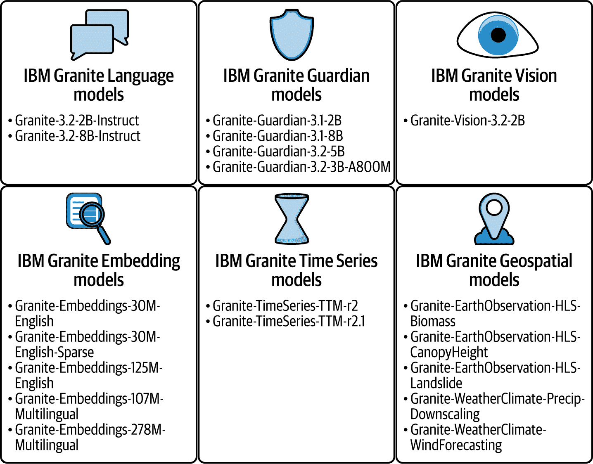
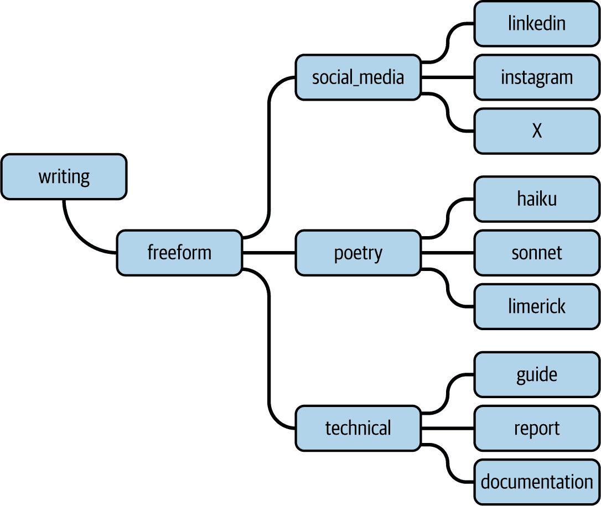
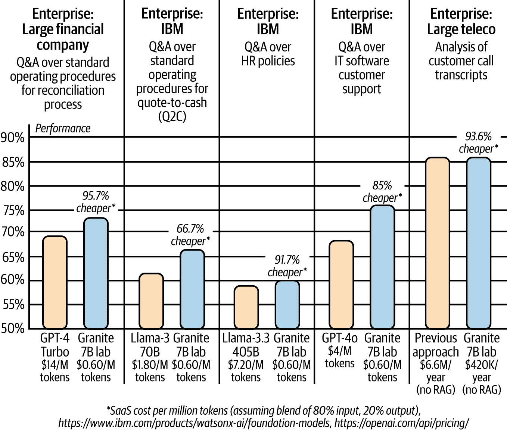

# 第八章\. 利用你的数据作为差异化因素

在上一章中，我们花了一些时间给你介绍关于小型语言模型（SLMs）的力量（和潜力）的观点。我们提出了一个观点，即一个模型不必——也不会——统治所有模型。我们概述了巨大的模型操作起来笨拙、昂贵，并且权力集中在少数（供应商）手中，他们能够负担得起构建它们。但是，更重要的是，它们不会帮助你利用你的数据（除非你将其放弃）来生成适合你业务的定制价值——简而言之，它们帮助你成为一个 AI 用户，而不是 AI 价值创造者。我们认为，高度专注的模型可以做些令人难以置信的事情，我们将继续证明这一点。我们希望看到一个开放的 AI 未来；因此，我们反对一个超级 LLM（大型语言模型）应该统治所有模型的观点。

本书的一个基本前提是，你成为 AI 价值创造者的唯一方式是首先将你的数据视为一种沉睡的超级力量。为了最大限度地利用 AI 并创造价值，我们相信必须在你公司内部建立一个协作生态系统，以便利用你的数据，为你创造价值。事实上，我们认为这个观点非常重要，它甚至成为了本书的标题：*AI 价值创造者*。

在本章中，我们探讨你的公司中的开发人员和领域专家如何利用模型定制的最新技术来为你的公司的 Gen AI 模型做出贡献，为你的业务驱动可防御和差异化的 AI 创新：创造价值。

# 为企业定制开源：一种看待企业数据的新方法

如本书前面所述，不到 1%的企业数据存储在当今的 LLMs（大型语言模型）中。如果你想要成为本书旨在帮助你成为的 AI 价值创造者，你将不得不在你的最有价值资产（你的企业数据）上工作，并使其成为你的 LLM 策略的一部分——最终解锁大量的价值创造机会。

要真正理解这一点有多么深刻，让我们回到我们数字世界的起源，这个起源几乎 350 年前就被戈特弗里德·威廉·莱布尼茨所理解和构想。即使在那时，莱布尼茨已经明白，你可以将我们周围以语言或数学形式存在的所有信息编码成二进制表示。 (莱布尼茨不仅创造了二进制数学，还帮助创立了微积分，所以我们也可以理解为什么有些人可能不是他的粉丝。) 他著名地说：“创造一切，只需一件事就足够了。” 莱布尼茨显然知道以不同方式（在这种情况下，二进制表示）表示信息的价值和力量。快进到今天，你很容易就会注意到，在过去的几十年里，由于我们世界数据表示的演变和表现力，已经创造了巨大的价值创造和商业转型。例如，今天，味道和气味都有数据表示，最终在计算机开始处理数据时，这些数据被进一步转换成仅仅是零和一。事实上，香水和调味品公司实际上使用向量来发现和提出新的产品，这些产品代表柠檬清新或蜂蜜黄油。想想看。除了人工智能，还有谁能想到创造一切贝果冰淇淋！说实话，在 LLM 出现之前，葡萄酒和香水描述已经用它们诗意的（以及常常荒谬的）创造力娱乐了我们多年。因为让我们说实话，谁真的能闻到“清晨露水中的阳光亲吻的金银花轻吟”或尝到“带有存在主义危机大胆结束的忧郁暗示”？展望未来，由于 LLM，我们期待创造力达到新的（礼貌地说，“可能甚至更荒谬”）水平。

## 原始的 Eras 巡演：回顾数据表示的几个十年

在过去的几十年里，新的数据表示为所有企业和行业创造了全新的机会和能力。我们认为花些时间在这个话题上是有价值的，帮助你充分认识到 LLM 对你企业的价值——*尤其是*当它与你的数据相结合时。关键在于，你的企业数据可以融入这种新的数据表示（一个 LLM），它可以使你的数据以只有电影几年前能想象到的方式变得可用，并为你的公司带来巨大的价值。

当你这么想的时候，除了模型中的权重之外，人工智能只是压缩的数据。它只是数据的新表示形式，而且正如所证明的，在过去的几十年里，已经有过各种数据表示时代，每个时代都开启了一个新的价值创造时代。这次人工智能革命与数据表示的力量以及能够在这些新、强大的“容器”中编码大量信息的力量有很大关系，这些“容器”是基础模型（LLMs）。以下是我们如何看到这些年来的一些数据表示时代。

### 到 1980 年代：专家系统

这些是（并且由于它们今天仍在使用，也许我们应该写成“是”），*我们数据的手工制作的符号表示*。数据被编码在关系型数据库中，这创造了一种新的方式，让企业能够以他们以前无法轻松做到的方式组织和连接数据。这个时代对商业产生了深远的影响。突然之间，一家公司可以自动化像工资支付这样的东西，交易可以连接到库存，以及其他核心流程。在这个过程中，创建了专家系统。人类为连接的结构化数据编写了逻辑业务流程的规则。一个很好的例子是欺诈检测或供应链管理——许多公司今天仍在使用这种方法——有一条规则，如果被违反，就会显示一个标志或采取行动。

规则对于某些事物来说很有效，但它们并不那么有创造性，而且总有例外，因此它们只能做到这么正确。基于规则的系统在后台需要大量的手动工作来维护和构建这些规则。每个个别情况都需要编写一条新规则。（这就是为什么我们称这个表示时代为手工制作的。例如，将数据存储在关系型数据库中需要数据库管理员手工创建一个模式来接收它。人类在工作的设计和思考方面做了大量工作。）也许在加油站用 1 美元购买东西就能发现潜在的信用卡欺诈……新规则。随着时间的推移，这条规则作为预测因素被稀释，而其他一些指标被证明是有用的……新规则。这是一个简单的例子，但这种情况过去经常发生（或者没有发生，公司会感到沮丧）。最终，这些系统只要规则正确就能工作。但随着时间的推移，有如此多的变化和规则，大多数这些系统最终都崩溃了。现在想想今天的数字经济——基于规则的系统如何应对增加的接入点和复杂交易带来的威胁，如何识别隐藏在嘈杂和短暂日常活动中的犯罪者留下的信号，或者如何及时对协调攻击进行集中监控？它们做不到。

### 1980 年代至 2010 年代：机器学习

现在我们进入了一个*更专注于特定任务、更少手工制作特征表示数据*的时代。这是怎么发生的呢？因为随着数据的增多，数据驱动的方法开始转变。这在当时是一件大事，因为机器开始从数据中生成自己的规则，并通过展示示例来学习我们世界的新的表示，而不是被给予手编的规则（程序化）。非常酷！许多这些技术至今仍被数据科学家们使用；例如，决策树、支持向量机（SVMs）、k-最近邻等。这个时代是关于学习如何让计算机帮助构建特征，并让这些机器从它们的洞察中学习。这些学习是好的，也许是非常好的。当机器（在人类的帮助下）以新的方式使用数据时，新的表示和编码机制出现了——例如，基于图的数据表示（表示为具有节点和边的网络）。突然之间，世界开始使用这种新的数据表示，并找到了一种遍历它的方法，这对进行互联网搜索、社交媒体和连接人与群体等业务变得至关重要。

### 2010 年到~2017 年：深度学习

现在我们进入了大数据时代（记得那些 3V：体积、速度和多样性）。计算机现在可以访问比以往更多的数据。现在计算机不仅发现了数据，还能创建新的数据表示。进入了我们的数据*特定任务学习特征表示*的世界。在这个时代，世界获得了访问大量计算资源的机会（得益于云和 GPU）和不断增长的数据量（得益于互联网）。计算机创建并构建了特征表示，但一切仍然高度依赖于人类的专长和大量的手动工作。例如，处理更多数据的资源可用性和构建更复杂模型的能力不足仍然“阻碍了”发展。例如，自然语言处理（NLP）的 AI 没有多少记忆，超出了几个单词的范围。

这标志着深度学习时代的开始。有许多内容超出了这本书的范围，例如激活函数，它们的出现是为了帮助这个时代。我们有了更多和更多数据的协同组合（从大数据时代开始，当时世界正忙于收集数据），以及计算能力（特别是，我们发现我们用于游戏的 GPU 由于处理矩阵数学的方式，能够提供强大的处理能力，这是深度学习所使用的数学）。现在，这个时代开始发生一些非常酷的事情，也许还不是魔法般（那将是下一个阶段）。所有那些数学-计算机能力（用于构建表示的 GPU）与可消费模式（云）混合在一起，突然之间，任何人都可以以低于一杯廉价咖啡的成本构建 AI 模型。在这个时代，计算机开始从大量数据中学习，并构建特定任务的特性表示；例如，计算机视觉用于检测 X 光片中的异常或生产线焊接点的缺陷等。其中一些特性表示非常复杂，计算机发明了新的复合特性，例如将性别、位置、身高和职业混合成一个粗略的特征，以描述某物。

### 今天：基础模型（也称为 LLMs）

今天，我们可以*编码任何知识形式，并以我们从未想象过的方式处理这些数据*。

正如我们之前所说的，基础模型的核心是能够在这些新的、令人惊叹的模型类型中编码各种形式的大量信息。我们的世界已经进入了 LLMs 的时代，这种方法不仅利用了巨大的计算能力和所有这些数据，而且一种新技术（大规模的自监督学习——多亏了 transformers）大幅减少了训练模型所需的精心标注的数据量。这与过去有巨大的不同。

具体来说，这种新的数据表示是在庞大的、巨大的数据集上训练的，并且能够完成广泛的通用任务。这些新的数据表示（LLMs）作为构建更专业应用的基石或构建块。它们的灵活性和庞大的规模使它们区别于之前时代的表示，后者是在有限的数据集上训练以完成特定任务的。

这些新的数据表示是通过将训练数据分解成更小的块来创建的，这些块被称为*标记*（一个标记可以是一个单词或一个单词的片段）。这个过程创建了数万亿这样的标记，然后这些标记被转换成向量，这些向量被用来以 AI 可以理解的形式表示标记。但这些标记可以是任何东西，正如你之前所学的，这意味着存储在其中的数据不一定是单词——它可以是一切（代码、图像、声音、味觉和嗅觉特征等）。在训练过程中，这些（未转换为向量的）标记通过神经网络的不同层，应用了一系列数学运算，这些运算主要由矩阵乘法和一些其他简单运算组成——但这都是在巨大的规模上完成的。在这个构建阶段，数据会在这些标记不断变化的序列中组合和重新组合。实际上，不同模态（音频和文本）的信息可以在训练期间结合到同一个基础模型中。一个很好的例子是 OpenAI 最新的 GPT，它将文本和图像生成的力量（来自他们的 DALL-E 模型）结合在一个地方。

在训练过程中，网络参数会进行调整，以便输出的 LLM 在表示输入标记的序列方面变得越来越好。随着它通过这个训练过程，模型会越来越多地学习它所训练的数据的结构、细微差别以及其中的知识和相关性。再次强调，这并不是真正的魔法；这只是数学、人类的创造力以及大量的计算能力。

现在这个新的数据表示（编码在 LLM 中）的能力来源于其规模（可以带入其中的数据量），来源于数据的连通性（在广泛不同的输入数据之间建立语义连接，这使得它们非常具有表现力），以及其多模态性。

现在让我们来看一下我们的观察和本章的原因。在过去的几年里，我们见证了这些表示方法几乎将世界上所有可用的公共数据都拉入了一个大型语言模型（LLM）中。为了辩论的目的，让我们假设 100%的这种数据已经进入了 LLM。现在，将这一点与我们之前分享的估计进行对比，即仅有不到 1%的企业数据进入了现成的 LLM。这是一个非常有趣的对比：几乎所有公共数据都进入了，而几乎所有企业数据都没有。

# 站起来并代表！...你的数据

到这本书的这一部分，你应该对 AI 时代真正是一个转折点有一个感觉。收集的大量数据是一个已经解决的问题（理解它是一个不同的问题），计算资源大量可用——这些力量与新的 AI 技术相结合，为 AI 颠覆创造了完美的风暴。那么，你如何开始使用你的数据呢？正如我们在第五章中讨论的那样，你必须从一个值得信赖的 LLM 开始。一旦你确定了一个你可以信赖的基础模型，就是时候将你的企业数据带入这个时代的数据强大表示了。最后，你部署你的定制模型，通过 AI 进行扩展并创造价值。所以，让我们来谈谈这三个步骤。

## 第一步：一切始于信任

不要低估这个 AI 的转折点：从现在开始，AI 中的所有东西都将因为这种最新的表示格式而有所不同。

最终，要从企业数据中创造价值，第一步与你的数据毫无关系。你的第一步将是选择一个值得信赖的模型——把它想象成一个“价值”容器，或者基础，来构建其上。这一步至关重要，因为你的企业数据将添加到这个起点之上，因此了解这个基础中已经包含的内容，制作它的“配方”，以及它是如何工作的，将非常有好处。这一切都回到了第一章，在那里我们告诉你要向你的 LLM 供应商提出问题，比如，“你用了什么数据来训练你的模型？”并将“这不关你的事”和“我们不知道”这样的回答视为不可接受。再次强调，这难道不是与你选择在哪里建造房子的地方有什么不同吗？基础必须坚固。你的基础（LLM）是否包含版权侵权、仇恨、愤怒、亵渎（HAP）、偏见、种族主义、色情等内容？如果今天的 LLM 是互联网的压缩表示，而你相信互联网上的所有内容都是真实的，没有有害内容，你没有任何这些担忧，那么你可以继续前进！你有没有经历过 Reddit 的某个帖子，看到其中一些群体中的毒性？（而且我们不去的房间里情况更糟。）当你试图使用这些数据时，你希望将它们与这些内容混合吗？这将最终成为代表你业务的模型的基石！

让我们探讨原因，基于我们在第五章中使用过的相同水质类比，当时我们讨论了在 LLM（大型语言模型）中数据血缘透明度的重要性。想象一下，我们给你一杯水（一个 LLM），你的意图是加入柠檬汁和糖（我们将这视为你的企业数据），目标是制作柠檬水。如果我们给你一个不透明的装满水的玻璃杯（一个你对数据一无所知的 LLM，当你问我们从哪里得到水时，你得不到任何直接的回答），你会感到舒服地使用它来搭配你新鲜柠檬和昂贵的有机甘蔗糖吗？想想看：这个玻璃杯是不透明的，你甚至看不到里面！里面的水可能是纯净的泉水，也可能是混浊的泥潭水，甚至可能是受污染的水！如果你看不到这个玻璃杯里面的东西，你还会在加入大量高品质的糖和柠檬后喝里面的东西吗？可能不会，那么为什么你要用你公司最宝贵的资产之一——你的数据来做这样的事情呢？

类似地，在使用 LLM 时，几乎不可能隔离或限制一个模型，使其根据你添加的企业数据提供有见地的回答，同时忽略玻璃杯中所有那些混浊的水（数据）。当然，检索增强生成（RAG）和微调等技术可以帮助，但即使你的模型被定制，它仍然很可能会从你作为起点使用的基模型继承一些程度的表现力和安全性（或缺乏这些）特征。

在这个类比中，重要的是你用来制作柠檬水的玻璃杯必须是透明的，这样你才能看到里面。你需要知道为你的柠檬水提供基础的水是从哪里来的，这样当你混合你的原料时，你就有了一个很好的想法，知道会发生什么，它看起来会怎样，它的味道会怎样。当你想用 LLM 来利用你的数据时，情况也是一样的。你需要一个基础模型，它在数据使用和制作它的配方方面是透明的。这样，当你将你的数据添加到其中时，你就可以自信、安全、可靠地这样做。

透明度的另一个方面是对于创建的最终模型拥有广泛的商业权利和行动自由。记住，这一章**不是**关于模型提供商的章节；这是一章关于**你的**数据的章节。你需要对你的增强模型拥有许可权，这样当你将信息编码到为你的业务选择的模型中时，你就有**完全的行动自由**去做你需要为你的业务做的事情。而且，因为你是在基于一个包含来自外部世界的公共数据的模型之上构建的，它也应该由供应商承担法律索赔。

###### 小贴士

正如我们在 第五章 中讨论的那样，确保您对您的 LLM 所提供的赔偿进行尽职调查。今天，每个供应商都在提供某种形式的赔偿，但您需要知道每个供应商的赔偿保护都是不同的。有些不赔偿所创建的内容，有些完全赔偿，有些限制赔偿的规模，有些不赔偿输出但赔偿在使用的方面，等等。是的，您将不得不让您的法律团队介入。

### IBM 商业广告——在 Granite 中你应该信任

我们再说一遍：我们希望您同意，这本书的大部分内容都不是关于 IBM 的。我们希望您已经欣赏到我们为构建您的 AI 理解所付出的努力，概述了用例，并注意到了您在开始 AI 之旅时需要注意的事项以及您想要确保已经解决的问题——只有一两个小小的 IBM 商业广告。话虽如此，我们认为我们应该给自己留下一页或两页，专注于一个开源模型，您会注意到我们并没有花太多时间在上面：IBM Granite。我们非常自豪于 IBM Granite 系列，因为它触及了我们讨论的要点：模型训练数据使用的透明度（查看 Granite 3 技术报告中关于训练数据的详细页面^(1）；模型以无废话的 Apache 2.0 许可证公开发布；最重要的是，Granite 系列旨在拥有成本效益高、适合特定用途的模型，可以使用企业数据进行进一步定制（我们将在本章稍后深入探讨细节）。

图 8-1 展示了 IBM Granite 3 系列模型的广泛性（在你阅读这本书的时候，Granite 4 可能已经发布，或者接近发布）。

这里是对 图 8-1 中模型的概述以及它们为什么重要：

Granite 语言

这些是您企业语言任务中的基础工作马力的 LLM，这些模型在它们的规模上提供了顶级性能，并设计为可以使用 PEFT 和 InstructLab 等技术进一步定制。

Granite 视觉

这些是多模态模型，专门用于视觉 *理解* 任务（图像 + 提示输入，文本输出）。考虑这些模型用于任何文档理解、图表问答，就像让一个大型语言模型解释趋势线并在条形图中发表意见，或者甚至是多模态 RAG 任务。

Granite 守护者

这些是“安全线”模型（我们在 第五章 中讨论过），它们位于任何部署的 LLM（不仅仅是 Granite）旁边，并帮助监控模型输入和输出，确保没有有害或偏见的内容、幻觉等。

Granite 嵌入

这些模型将大量语言和代码转换为向量嵌入或数值表示——这对于启用 RAG 工作流程非常有用。

Granite 时间序列

这些是非常小的基于 GenAI 的预测模型。它们不是在大量语言上训练，而是在大量时间序列数据点上训练，以获得它们的预测超级能力。

Granite 地理空间

这些地球科学多模态模型是与 NASA 合作开发的，用于预测从天气预报到卫星图像中生物量的数量。



###### 图 8-1. IBM Granite 模型家族快照

IBM 的 Granite 模型的关键原则是透明度和灵活性。每个 Granite 模型都会在 Apache 2.0 许可下发布，并完全披露用于训练的数据，以使用户能够获得最大程度的行动自由，用于其业务的使用和部署。正是对透明度和开放性的这种承诺，使 Granite 在[斯坦福大学对 LLM 提供商的透明度指数排名](https://oreil.ly/FQHb5)中获得了最高的评分之一。

## 第 2 步：在 LLM 中表示你的企业数据

一旦你选择了可信的模型起点（在我们的类比中，这是你装满纯净水的透明玻璃，你将用它来制作柠檬水），下一步就是选择你将如何将企业数据添加到这个基础（将水变成柠檬水的糖和柠檬）的方法。有多种技术可供选择，包括以下常见模式：

检索增强生成（RAG）

你可能已经熟悉了 RAG，因为它是目前企业中部署的顶级模式之一。我们在整本书中都提到了这个模式，但在这里明确地讨论它是有价值的，因为它是一种将企业数据添加到 LLM 的相当常见的机制。在 RAG 模式中，一旦用户提交查询，该查询就会用于从（通常是）数据库中检索相关企业信息，这主要是通过查询中的文本和数据库中的文本之间的相似性匹配来实现的。（这个数据库通常是一个支持语义搜索的向量数据库，但也可以是传统的关系数据库，或者是两种数据库的混合版本，甚至可以是对象存储服务上的文件，以及其他选项。）然后，原始用户查询与检索到的信息（通常称为基础上下文）连接起来，形成一个提供给 LLM 的提示。现在，LLM 可以使用其在训练中积累的广泛知识以及提示中提供的检索信息来回答问题。正如你可能推断的那样，在 RAG 模式中，模型权重根本不接触，这既有优点也有缺点。RAG 是一种卓越的技术，尤其是在回答用户查询时需要提供最新信息时（更新支持数据库以包含最新和最详细的信息比重新训练或微调包含更新信息的模型要容易得多）。然而，RAG 也有一些缺点。首先，有许多依赖性和复杂性需要管理；RAG 不仅仅是一个模型，它是一个系统。另一个缺点是，每次你想让模型回答一个问题——例如，关于某些内部人力资源政策——你都需要向 LLM 提供该人力资源政策的全部文本（这也增加了推理成本，一次又一次）。与此相关的是，LLM 从未真正内化在 RAG 工作流程中提供的信息，也就是说，它没有学习新的概念并以新的方式在各种任务中应用这些概念。

微调

使用企业数据定制 LLM 的另一种常见方法是微调。微调是指根据新数据（我们在本书中多次提到的输入/输出训练对）更新模型的实际权重。这种方法比从头开始重新训练原始模型所需的计算量要少，并且数据量也更少。这项技术为 AI 价值创造者提供了一个更合理的起点，以开始定制他们的模型。存在许多不同类型的微调技术。其中一种是监督微调（SFT），其中所有参数都会更新，另一种是参数高效微调（PEFT），其中只有部分参数会更新。还有像低秩适应（LoRA）这样的方法，其中外部（相对于 LLM）的参数模块被训练与基础模型一起工作。LoRAs 很方便，因为这些模块可以在不需要时移除，或者当模型执行不同任务时用新模块替换。例如，也许你经营一家角色扮演游戏（RPG）公司，并在你的 LLM 上构建一个 LoRA 适配器用于游戏对话和非玩家角色交互，但另一个 LoRA 适配器被用于故事讲述和叙述。LoRA 适配器也有其缺点——正如你可以想象的那样，如果你想要 50 个微调过的定制，那么你正在管理 50 个不同适配器的生命周期。我们还会推测，由于它们使用非常低秩的矩阵，在某个时候它们的数据容量可能会受到限制。

最终，你将选择的微调方法取决于你的性能目标和成本限制。你针对的参数越多，性能越好，但训练模型的开销也会越大。虽然微调提供了一种基于专有数据内在改进模型的方法，但经过微调的模型也会遭受所谓的*灾难性遗忘*。这基本上意味着一旦你在某个任务上微调了一个模型，该模型就变成了该任务的专业人士；也就是说，它在那个任务上非常擅长，但它失去了（忘记了）一些作为通才尝试执行它曾经知道如何执行的任务的能力。这意味着，对于你想要训练模型上的每一个任务，你需要维护该模型的一个单独的、微调过的版本（或者在 LoRAs 的情况下，为每个重要任务维护一个单独的 LoRA 适配器）。

InstructLab

InstructLab 是 Red Hat 研发的一种开源微调形式，它专门设计用于以协作方式将专有企业知识注入到大型语言模型（LLM）中，同时保持 LLM 的一般用途能力。

### 介绍 InstructLab

开源[InstructLab](https://instructlab.ai)方法用于调整 LLM，从一开始就是为了解决希望专门化和部署 LLM 以满足[特定业务需求](https://github.com/instructlab)的 AI 从业者所面临的挑战。InstructLab 不仅促进了在特定领域数据上对模型的专门化，其目标是将向 LLM 的贡献变得与开发者向任何其他软件项目贡献一样简单。InstructLab 的出现是为了尝试弥合开源软件的工作方式与开源 AI 的工作方式之间的差距，现在它既有开源的存在，也有由 Red Hat 支持的企业级产品。

InstructLab 旨在通过提供一个框架来塑造 GenAI（生成式人工智能）的未来，使团队和社区能够以可访问的方式向现有的 LLM 贡献知识和技能。InstructLab 的核心是一种新颖的模型对齐方法，称为*大型聊天机器人对齐*（LAB）.^(2)

正如我们在上一节中提到的，许多社区正在迅速采用和扩展许可宽松的开源 AI 模型，但它们都面临着三个主要摩擦点，这些问题对于传统开源软件来说已经得到了很好的解决，即：

没有直接贡献回这些基础 LLM（大型语言模型）的方法

增强功能以分支的形式出现（四处搜索，你会发现一个无法控制的、不断增长的庞大 Llama 群体——Llama LLM 的独立微调版本——在我们的 GenAI 世界中游荡），这迫使你选择一个“最佳匹配”的模型，而这个模型并不容易扩展。此外，这些分支对模型创建者来说维护成本很高，因为当“父级”Llama 发生变化时会发生什么？你如何获取这些增强功能？而且我们还没有考虑到在庞大的 Llama 群体中筛选出适合你的 Llama。

如果你想向模型贡献内容，入门门槛很高

你做了什么特别的事情吗？想出了某个令人难以置信的新想法——并且它有效？你必须学习如何分支、训练和改进模型以推进你的想法，这需要大量的专业知识。

目前没有直接的社区治理，也没有关于审查、整理和分发分支模型的最佳实践

你有没有看过五岁孩子踢足球？无需多言。

InstructLab 通过为你提供创建和合并贡献（技能和/或知识工件）到 LLM 的工具来解决这些问题，而不需要你拥有一个具备深厚 AI 工程技能的团队。

### 尝试涉足 InstructLab 的领域

InstructLab 的技术为上游模型提供了足够的基础设施资源，使其能够创建其定制模型的常规构建版本——不是通过重建和重新训练整个模型，而是通过注入新的技能和/或知识。它通过三种关键过程的组合来实现，我们将在本节中介绍：

+   一种以分类法驱动的数据整理方法

+   规模化的合成数据生成

+   一种具有多个阶段且避免灾难性遗忘的指令调整方法

InstructLab 项目为开发者提供了工具，通过 GitHub 工作流程将新的技能和/或知识添加到任何开源 LLM 中——直接从他们的笔记本电脑开始。

通过 InstructLab 项目，如图图 8-2 所示，团队可以通过向 InstructLab 项目提交拉取请求，为新技能和/或知识（你的企业数据）贡献 LAB 校准“配方”。所有被接受的技能和/或知识配方随后将由 InstructLab 项目的维护者（无论是公共模型还是公司内部的私有模型）在模型校准阶段添加到预训练的起始模型之上。


###### 图 8-2\. InstructLab 提供了一种新的方式来使社区贡献具有累加性

在模型开发的校准阶段启用贡献，而不是将资源投入到耗时的新基础模型预训练过程中，允许进行敏捷的迭代开发流程，非常适合在公司内部（或者在可能围绕一个行业，由企业联盟共同合作以创建特定于其行业的模型的开源社区中）进行协作。我们亲眼见证了这一点。预训练一个大型语言模型可能需要数月时间以及数千个超级昂贵的 GPU，这不仅消耗水资源，还会让你的钱包缩水。相比之下，使用 InstructLab，一个给定的 LLM 通常可以在不到一天的时间内通过微调方法进行校准，从而允许更快的更新发布周期。

### 你能闻到什么正在烹饪的气味？技能和知识配方

在本质上，一项技能或知识配方仅仅是一组简单的指令，用于程序化生成大量标记的合成数据（再次强调，AI 帮助 AI），这些数据可以体现特定的技能集或知识领域。每个配方包括对技能或知识差距的简短描述，然后是五个或更多的手工制作的示例。在知识配方的案例中，输入还包括一个知识来源，例如在人力资源用例中，涵盖所需主题的公司福利手册。

这些配方以提示的形式提供给更大的教师模型（InstructLab 首次推出时以 Mixtral-Instruct 作为其教师模型），用于生成大量相应的合成数据。为什么是合成数据？它是 InstructLab 的一个关键组成部分，因为许多公司没有足够的目标数据来训练（使用 InstructLab 或更标准的 PEFT 方法）像 LLM 这样的大型任务。合成数据也是 InstructLab 将大量非结构化企业数据转化为可以用于训练您模型的结构化数据集的方式。一旦这些数据生成，就可以用来微调您的 LLM，使其学会您想要推送到公司模型中的缺失技能或知识。

使用合成数据来调整模型本身并不是一个新颖的想法。事实上，有多个使用合成数据来调整模型的例子，包括模型蒸馏（如我们在第七章中讨论的）。例如，Vicuna-13B 是在从 GPT-4 生成的合成数据上训练的。但再次，有一个问题。OpenAI 的条款和条件不支持使用 GPT-4 来创建具有商业竞争力的模型，这*使得这些模型的可行性变得可疑*。我们还可以向您推荐其他一些模型，但它们都需要像 GPT-4 这样的封闭模型作为教师模型来生成所需的合成数据。而就在这里，你就能看到开源如何推动技术向前发展。使 LAB 方法如此吸引人的是，它证明了可以许可的开源模型（Apache 2.0 是一个例子）可以用作教师模型，并且仍然可以驱动最先进的（SOTA）模型性能。

到目前为止，所有贡献给 InstructLab 项目的技能和/或知识配方都已在一个逻辑的、分层的 InstructLab 分类法中进行了规划。简单来说，你可以将分类法想象成一个树状结构，它将事物组织成类别和子类别（参见图 8-2）。对于 InstructLab 来说，分类法将数据样本分类成更小的组（每个分支进一步细分为更具体的层级），最终支持不同的任务（分支上的叶子）。这为开发者提供了一个视觉框架，不仅可以帮助他们识别可能有助于项目的技能和知识，还可以发现并填补他们希望贡献的新知识和技能的空白。

InstructLab 的分类法还有助于确保生成多样化的合成数据，以涵盖在为任何一项高级任务贡献配方时可能希望的所有不同子任务。

考虑一个大型语言模型（LLM）协助代理完成撰写社交媒体帖子的任务，就像我们在上一章中的代理示例一样。你在 X（以前称为 Twitter）上的发布方式与 LinkedIn 或 Instagram 不同。一些平台由于字符限制需要简短的形式；在其他平台上，表情符号更为常见；有些平台非常注重图像，而另一些则要求更多的商业洞察力。这些都是社交媒体特有的写作技巧。在图 8-3 中展示的 InstructLab 分类法片段中，如果贡献者试图提高模型撰写社交媒体帖子的能力，他们可以贡献到位于技能分类法中“写作”分支下的“*social_media*”分支（或者如果不存在，可以创建一个新的分支）。他们的贡献将是针对每个目标社交媒体平台的合成数据食谱。想要让你的 AI 成为诗人吗？给它提供不同的诗歌示例，并创建针对俳句、十四行诗、打油诗等特定诗歌形式的技能。



###### 图 8-3\. InstructLab 写作技能分类法的一个示例

LAB 独特的训练计划在对齐阶段而不是昂贵的预训练阶段吸收这些新数据。而且，这种训练协议还能减轻灾难性遗忘。简单来说，InstructLab 的工作方式确保新添加的知识不会覆盖模型之前学到的内容。

当所有合成数据食谱都已提交并添加到项目的分类法中后，InstructLab 的训练和生成管道会运行所有食谱以生成合成数据。然后，它将生成的数据过滤下来，只包括高质量的样本。然后，使用一种新颖的分阶段微调方法，使用生成的合成数据对每个起始模型（学生模型）进行对齐，从而将所有贡献的技能和知识注入模型。正如人们所说，“一张图胜千言”，我们已将整个工作流程总结在图 8-4 中。


###### 图 8-4\. 大规模对齐聊天机器人（LAB）的工作原理

### 利用社区的力量

为了推动快速创新，开源版本的 InstructLab 已经承诺为社区训练的模型实施定期培训和发布周期。InstructLab 模型的最新版本在 Hugging Face 上公开发布，正如你在本书的第一部分所知，Hugging Face 是世界上最大的有组织 AI 社区的脉搏。Hugging Face 的覆盖范围使社区能够下载经过 InstructLab 调整的模型，对其进行实验，并发现其性能中的差距。一旦确定，社区成员可以通过 pull request 构建并贡献他们自己的技能和知识食谱回到 InstructLab 项目。正如你所期望的传统开源项目一样，InstructLab 的提交者和项目维护者每周审查贡献，并将所有接受的贡献合并回主模型。当然，对于你自己的私有模型，你可以在公司内部完成所有这些操作，并以相同的方式运营。

为了支持使用和贡献 InstructLab 模型的开发者，InstructLab 项目包括一个名为*语言模型开发工具包*（LMDK）的命令行界面工具。LMDK 在贡献者的笔记本电脑上实现了 InstructLab 工作流程。把它想象成一个测试厨房，用于尝试和提交生成合成数据的新食谱，以教授 LLM 新技能。现在，开发者可以瞬间启动，也许他们会开始尝试他们开源 LLM（如 Granite）的本地版本。他们可能会发现模型性能中的一些差距或需要改进的领域，制作一些知识或技能食谱来填补这些空白，然后，哇！这个过程（如图 8-5 所示）就像一个快速开源 AI 创新的飞轮。


###### 图 8-5\. InstructLab 创新周期：快速开源创新的飞轮

### InstructLab 贡献者的一天

如我们之前所述，本书的范围不包括带你完成整个 InstructLab 流程，但你可以轻松找到很多[教程](https://oreil.ly/1MOTp)，这些教程有逐步指导，让你迅速成为英雄贡献者。

图 8-4 向你展示了成为 InstructLab 贡献者的方面，而且正如你现在所理解的，这一切都始于一个技能食谱。以下代码展示了 rhyming 技能食谱的实际样子（它是用 YAML 编写的）：

```py
version: 2
task_description: 'Teach the model how to rhyme.'
created_by: rob-paul-kate
seed_examples:
  - question: "What are 5 words that rhyme with boring?"
    answer: "snoring, pouring, storing, scoring, and exploring."
  - question: "What are 5 words that rhyme with dog?"
    answer: "log, cog, frog, bog, and smog."
  - question: "What are 5 words that rhyme with happy?"
    answer: "snappy, crappy, scrappy, unhappy, and sappy."
  - question: "What are 5 words that rhyme with bank?"
    answer: "shank, crank, prank, sank, and drank."
  - question: "What are 5 words that rhyme with fake?"
    answer: "bake, lake, break, make, and earthquake."
```

接下来，使用 InstructLab 合成数据生成器的本地版本，你可以为你要构建的技能或知识创建自己的合成对齐数据。这些数据随后可以用来对齐你自己的模型本地版本，并快速测试以查看你的贡献是否在缩小差距。你可以继续通过这个过程进行实验，直到你的模型能够完成你想要的任务。一旦你在 LMDK 中完善了你的配方，你就可以将其作为拉取请求提交到 GitHub 上的 InstructLab 分类法，就像提交任何其他开源或内部软件项目一样。接下来，一组提交者会接受或拒绝提交，并使用新的 YAML 文件更新最终的分类法。（同样，这种场景可以是公开的外部或完全内部于你的公司。）

InstructLab 的最后一步是构建过程，这可以定期运行，定期更新你的 LLM（例如）使用来自你的开发者社区的最新和最好的贡献。在这个构建过程中，迄今为止生成的所有合成数据都会被聚合，并用于一个多阶段训练过程，旨在最大化性能并减少像灾难性遗忘等问题。当你的模型的新构建可用时，你现在拥有了一个 LLM，它基于你的开发者提交的所有企业数据和领域 SME 提交的定制化。

虽然我们还在 InstructLab 的早期阶段，但我们看到，在企业数据上专门化小型模型的全端到端过程可以推动性能（越高越好）改进和显著的成本降低，这与仅使用大型通用模型相比，如图 8-6 所示。

###### 注意

在涉及高度敏感组织信息的情况中——例如员工健康或纪律记录——直接将敏感数据嵌入到 LLM 中可能不是你想要的。相反，你可以使用你的数据通过 InstructLab 定制你的 LLM，并使其与公司的品牌、风格、文化价值观等紧密对齐，并将该敏感信息安全地存储在具有受控访问权限的 RAG 系统中。这种方法允许你的定制 LLM 在需要时无缝且安全地访问敏感数据，确保了增强的沟通和严格的数据保密性。同样，如果你在某个不断变化或使用案例需要最新数据的领域，RAG 对于该数据来说也可能更有意义。



###### 图 8-6\. 展示 InstructLab 的影响

## 第 3 步：高潮：部署和实验

如果你的公司没有人能使用一个用你的数据丰富了的受信任的 LLM（大型语言模型），那就没有意义。这使得最终步骤完全关乎部署你的新一代数据表示价值创造资产。那么，要实现这一点需要什么？大量的实验。如果你回顾一下每一次之前的技术变革（比如互联网），历史已经表明，从实验到大规模部署也存在一个过渡点。

在我们今天的世界中，围绕生成式人工智能（GenAI）和智能体充满了极大的兴奋、期待和预期。我们看到的应用程序和 API 可以影响数亿消费者。确实，这种兴奋的类型可以与互联网浏览器的出现（我们在第一章中提到的 Netscape 时刻）相提并论。但是，如果你考虑这种互联网比较，企业价值并不是在 Netscape 出现的那一刻就被释放的。直到互联网将一切粘合在一起：从库存到供应链，再到前端和全渠道。我们认为人工智能也将经历同样的演变：+AI 到 AI+。

要在企业中释放人工智能的价值，你需要能够跨企业规模地针对相同的部署进行目标定位。但要做到这一点，你需要一个受管理的环境，允许进行实验，通过关键工作流程如 RAG、微调和 InstructLab 来定制你的模型，然后将这些模型过渡到大规模部署。

重要的是，由于你的定制模型现在代表了有价值的企业的知识产权（IP），在部署时将需要做出关键的商业决策。例如：你是否可以信任你的模型在云端运行，或者你的模型所代表的数据是否敏感到只能在本地部署？你是否需要我们在第五章中提到的那些主动和被动的安全措施，以确保使用这些模型的应用不会被滥用？你是否需要积极监控你部署的性能和安全？随着生成式人工智能（GenAI）渗透到你的企业中，你正在扩大数字利用的攻击面，因此（再次从第五章中提到）你将不得不考虑对抗性攻击和其他不良行为者可能试图利用你的数字杰作的新方法。

# 未来是开放的、协作的和可定制的。

互联网的大部分内容都是基于开源软件构建的。每天，无论你是否意识到，你都在与 Linux 操作系统互动，Apache 网络服务器正帮助你实现目标。如今，开源软件也驱动着运行 Android 操作系统的智能手机，以及每天保障数百万金融交易安全的 Secure Sockets Layer（SSL）加密协议。我们告诉您，开放、社区共建和企业定制的 LLM 可以带来一些相同的益处。将 LLM 权重公之于众，让每个人都有机会创新、测试、精炼并塑造这一强大技术的未来。允许构建者了解数据来源，可以培养信任并提供可解释性。

透明开源软件使系统更加稳定和安全。这可能导致更快速、更可预测的发布周期，以及更安全的 AI 相关软件。提高 LLM 的可信度和透明度是 InstructLab 项目的主要目标之一。

开源软件还鼓励一种健康的竞争，防止一家或两家公司垄断行业。当每个人都被允许参与时，创新就会蓬勃发展，消费者的成本通常会下降。

你现在已经揭开了将你的数据转化为你的竞争优势的秘密。但在你冲出去统治你的行业（或者至少给你的同事留下深刻印象）之前，让我们通过观察我们的非 AI 驱动的水晶球（这只是我们的想法，我们实际上并没有一个）来结束，并对不断演变的通用人工智能和代理的广阔前景进行一次有根据的猜测。

^(1) Granite Team, IBM, “Granite 3.0 语言模型,” 2023, [*https://ibm.biz/granite-report*.](https://ibm.biz/granite-report)

^(2) Shivchander Sudalairaj 等人，“LAB：为聊天机器人进行的大规模对齐，”预印本，arXiv，2024 年 4 月 29 日，[*https://arxiv.org/abs/2403.01081*](https://arxiv.org/abs/2403.01081)。
