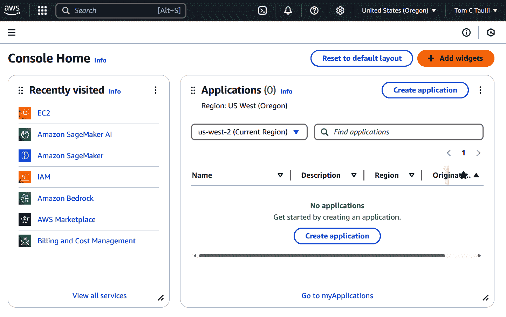

# 第二章\. AI 实践者的 AWS 基础知识

2006 年亚马逊网络服务（AWS）的推出是亚马逊内部挑战的直接结果。公司的代码库和数据系统已经变得庞大而复杂，这使得它们[难以更改和维护](https://oreil.ly/SGSgQ)。为了继续扩大其增长，亚马逊需要重大的架构变革。

首席执行官杰夫·贝索斯优先考虑对公司信息技术（IT）基础设施进行全面改造。该策略涉及将单体代码库分解成更小、独立的组件，称为*微服务*。每个微服务将处理特定的任务，例如身份验证、存储或数据库更新。这种方法使得开发团队更小、更敏捷，从而加快了开发周期——这一概念在“两个披萨规则”中得到了著名的体现，即团队规模足够小，只需两个披萨就能喂饱。

这次转型的一个关键部分是创建一个共享服务平台，以简化并自动化耗时任务，如负载均衡和数据中心管理。这个平台允许开发者轻松配置服务，而无需管理复杂的底层基础设施，使他们能够专注于编码、调试和部署。

这个内部平台成为了 AWS 的基础。贝索斯意识到许多其他公司可以从这种模式中受益，并以可负担的按使用付费定价结构向客户提供服务。AWS 立即取得了成功，尤其是对初创企业来说，最终吸引了更大的企业客户。如今，AWS 是技术行业的主导力量，[服务数百万客户](https://oreil.ly/cCH4T)并推动亚马逊的大部分运营收入。

本章概述了 AWS 及其核心服务。尽管 AIF-C01 考试侧重于 AI，但它包括对基本 AWS 概念的问题。

# 云计算

尽管云计算已经存在多年，但这个概念仍然可能模糊不清。部分原因是由于该行业创新的速度。但另一个因素是云计算的能力、功能和用例的数量。例如，有来自 AWS、Microsoft Azure 和 Google 等平台的企业服务。然后还有许多应用程序，如 iCloud、Google Drive 和 Microsoft 的 OneDrive。

是的，看起来云无处不在。

但对于 AIF-C01 考试来说，了解云计算的良好定义非常重要。那么，让我们看看 AWS 是如何[定义](https://oreil.ly/Wx53r)它的：

> 云计算是通过互联网按需交付 IT 资源，并采用按使用付费的定价模式。您无需购买、拥有和维护物理数据中心和服务器，而是可以从像亚马逊网络服务（AWS）这样的云服务提供商那里按需访问技术服务，例如计算能力、存储和数据库。

让我们逐一分析。首先，云计算是按需的，这意味着您可以在任何时候访问计算服务。这可以通过 AWS 管理控制台、命令行界面（CLI）或软件开发工具包（SDK）来完成。

这些计算服务是虚拟化的。这是指物理硬件，如服务器，由多个用户共享。这是通过使用如虚拟机管理程序和容器化等复杂技术来实现的，这些技术允许更有效和高效地使用 IT 资源。这些技术本质上创建了隔离的环境，拥有自己的操作系统。这使得您感觉好像拥有自己的专用系统，可以根据您的需求进行配置。

下面是云计算的其他优势：

降低了成本

使用 AWS，您无需投资昂贵的物理基础设施，如服务器、存储和网络设备。相反，您可以使用 Amazon 弹性计算云（EC2）启动虚拟机，并且只需为实际使用的计算能力付费。这种按需付费模式消除了大量前期资本支出，并降低了持续维护成本。

可扩展性

AWS 提供几乎无限的扩展性。例如，电子商务网站可以使用 AWS 自动扩展功能根据流量模式自动添加或删除 Amazon EC2 实例。这意味着您的应用程序可以轻松处理需求突然激增，无需人工干预或系统延迟。

全球足迹

AWS 在全球多个地区运营数据中心。例如，Amazon CloudFront（AWS 的内容分发网络）等服务允许视频流平台从靠近用户边缘位置的内容交付，从而实现更低的延迟和更快的加载时间，无论您的客户位于何处。

高可用性

AWS 旨在实现最小化停机时间。例如，Amazon 关系数据库服务（RDS）的多区域部署功能提供自动故障转移支持，即使一个可用区出现故障，您的数据库仍然可用。凭借内置冗余、备份系统和监控，AWS 确保您的应用程序保持在线。

安全性

安全性是 AWS 基础设施的核心组成部分。例如，AWS 身份和访问管理（IAM）等工具允许对谁可以访问特定资源进行精细控制。结合强大的加密、防火墙和来自顶级安全专家的持续更新，AWS 帮助您保护敏感数据并保持合规。

创新

通过将基础设施管理外包给 AWS，您的团队能够专注于更高价值的工作，如构建新应用程序或提升客户体验。云服务消除了配置和管理硬件的负担，从而允许更快地进行实验和创新。

# 云模型

云计算有三种模型：

+   公共云

+   私有云

+   混合云

没有一种模型必然优于另一种。相反，每种模型都服务于不同类型的需要。让我们在以下部分中讨论所有三种。

## 公共云

公有云是最常见的。它是 AWS、微软的 Azure 和谷歌云服务核心所在。云服务提供商构建并维护基础设施和计算资源。这些资源随后被客户共享，这被称为 *多租户模型*。这允许更高的效率和更低的成本。

然而，多租户模型确实存在一些缺点。您依赖于第三方进行关键操作。还有关于安全的担忧。然而，AWS 在这方面确实有强大的系统，例如 IAM、加密和系统与组织控制（SOC）合规性。他们还对其基础设施进行 24/7 监控。

## 私有云

私有云使用单租户模型。这意味着一个组织构建并管理自己的 IT 基础设施。根据安排，这可能意味着它拥有自己的数据中心或从第三方租赁。无论如何，该组织对运营保持完全控制。

这有几个优点。其中之一是私有云可以定制。例如，一个组织可以使用它进行专门的运营，比如为一个需要低延迟的自动化仓库。

私有云通常是受监管行业的首选，如医疗保健和金融服务。它们需要高水平的安保、合规性和隐私。安全漏洞可能导致昂贵的诉讼和公司品牌的损害。鉴于这一点，私有云通常是最佳选择。

AWS 为私有云提供各种服务。例如，Amazon Virtual Private Cloud (VPC) 允许在本地环境中启动 AWS 资源。

那么，私有云的缺点是什么呢？主要的是成本。当然，您需要购买和维护硬件，这可能会很快过时。您还需要一支 IT 专业人员团队来管理基础设施。

## 混合云

混合云将公有云和私有云结合起来。这为两个平台之间数据和应用共享提供了可能。这还可能包括多云环境。这就是一个组织使用多个公有云系统的地方，这可以提供更多的冗余。然而，仍然存在本地环境。

听起来很复杂？确实如此。这些实施需要复杂的 IT 专业知识。

但是 AWS 提供了众多工具来帮助解决问题。现在让我们看看其中一个：AWS Outposts 允许您在本地环境中运行 AWS 基础设施，从而实现无缝体验。例如，一家公司可以在云系统中开发和测试应用程序——这更加经济实惠——然后将其部署在私有云中。

请记住，混合云市场的增长势头强劲。根据 [SkyQuest Technology](https://oreil.ly/lIWqv) 的研究，该类别预计将从 2023 年的 978 亿美元增长到 2031 年的 3481.4 亿美元。

表 2-1 提供了三种云模型之间的比较。

表 2-1\. 云模型

| 特点 | 公共云 | 私有云 | 混合云 |
| --- | --- | --- | --- |
| 定义 | 共享多租户模型 | 单租户模型 | 公共云和私有云的组合 |
| 管理 | 用户无需进行基础设施管理 | 由组织内部管理；需要 IT 专业知识 | 由内部 IT 团队管理，并得到外部云服务提供商的支持 |
| 成本 | 按使用付费定价；前期成本较低；硬件维护 | 硬件和维护的高前期成本 | 通过在公共云和私有云之间平衡工作负载，可以实现更低的成本 |
| 用例 | 网络托管、开发和测试环境、面向客户的软件 | 严格的合规性或数据控制需求（例如，金融、医疗保健） | 需要数据可移植性或灾难恢复灵活性的工作负载 |

# 云服务类型

"即服务"这个短语确实很普遍。它适用于看似任何类型的 IT 服务。一些例子包括存储即服务 (STaaS)、监控即服务 (MaaS) 和人工智能即服务 (AIaaS)。

如果有什么的话，这个概念已经成为许多软件公司营销策略的关键部分。它也容易受到相当大的炒作。

不论如何，"即服务"的概念相当简单明了。它关于租赁或租赁 IT 服务——而不是拥有它。也就是说，你通常同意一个订阅。你也可以通常随时、出于任何原因取消订阅。这种灵活性是“即服务”解决方案受欢迎的一个重要推动力。

但是市场非常竞争激烈。这就是为什么经常会有优惠和促销。例如，如果你愿意签署一年或更长时间的承诺，AWS 可能会提供大幅折扣。

至于云服务，有三种“即服务”的口味，也称为云服务类型：

+   基础设施即服务 (IaaS)

+   平台即服务 (PaaS)

+   软件即服务 (SaaS)

让我们更详细地看看云服务类型以及 AWS 提供的内容。

## 基础设施即服务 (Infrastructure as a Service)

IaaS 是关于云平台的核心 IT 资源。这些包括虚拟机 (VMs)、存储和网络。它们都是虚拟化服务。

虚拟机 (VM) 是 IaaS 的核心。它本质上是一个物理计算机或服务器的软件版本。就像你有一个专用的机器一样。它有自己的操作系统、应用程序和硬件，如 CPU、内存、存储和网络。

在 AWS 中，虚拟机被称为 EC2。为了了解它是如何工作的，让我们看看一个例子。假设你领导着一个正在开发新电子商务应用的团队，并且需要一个测试环境。使用 AWS，你可以通过创建一个 EC2 实例来快速启动所需的必要基础设施。设置这个只需要填写一个表格。

在您完成 EC2 实例的配置后，AWS 将在几分钟内创建它。相比之下，如果您自己完成这项工作，可能需要几个小时——假设您具备 IT 基础设施的技能——并且可能花费数千美元。

但 IaaS 也有缺点：

IT 专业知识

您需要一支熟练的团队来管理像操作系统更新、安全补丁和资源优化这样的任务。他们还需要进行系统监控和处理安全问题。尽管如此，AWS 确实提供了广泛的文档，并设有专业服务部门以帮助其客户。

成本管理

按使用付费模式有时会导致意外支出，例如因服务过度配置而产生的费用。当使用 IaaS 时，需要对成本进行严格的监控。

供应商锁定

从一个 IaaS 提供商迁移到另一个可能既昂贵又耗时。这就是为什么在评估提供商时应该进行严格的审查。

## 平台即服务

PaaS 包括 IaaS 的基础设施。但还有中间件，这是在操作系统和应用程序之间运行的软件。这些是应用服务器、数据库管理系统、消息应用程序和身份验证。PaaS 将允许这些服务之间的通信。

除了中间件之外，还有其他服务提供。您将获得访问开发工具，如 IDE，以及数据加密、负载均衡、自动更新、监控和分析。

PaaS 的一些关键优势包括以下内容：

专注

由于无需管理基础设施和后端资源，开发者可以更多地投入到应用程序的开发中。

成本

由于无需为众多软件应用支付许可证费用，因此成本往往低于 IaaS。您也不需要特定的人员进行基础设施管理和更新。

完整的开发平台

PaaS 提供工具以帮助简化生命周期，包括构建、测试、管理和更新应用程序。这一切都是在同一个集成环境中完成的。

分析

这有助于测试和监控应用程序。这可以提供预测、评估投资回报率（ROI）和改进产品设计。分析工具还可以从复杂的 AI 技术中受益。

数据集成

PaaS 可以使应用程序之间进行实时数据操作，例如在企业资源规划（ERP）和客户关系管理（CRM）平台之间。这使得团队能够获得准确和最新的信息，以便做出更好的决策。

为了更好地了解 PaaS 与 IaaS 的比较，让我们看看 AWS 中一个 PaaS 服务的例子，称为 SageMaker JumpStart（我们将在本书中更深入地介绍这个话题）。使用这个工具，您可以通过选择预训练模型并通过 API 调用将其集成到应用程序中来简化创建 AI 应用程序的过程。

然而，如果您使用 IaaS 方法，过程将更加详细。您需要手动配置 EC2 实例，安装像 Python 和机器学习库这样的软件，并为您的模型配置环境。这包括设置模型推理的 API、管理安全组和处理负载均衡。持续维护任务，如应用安全补丁和监控系统健康，也是您的责任。虽然这种方法提供了更大的控制和定制，但它需要大量努力来管理和维护基础设施。

这并不是暗示 PaaS 比 IaaS 更好。相反，每种方法都是基于您的需求。如果您需要更多控制资源，那么 IaaS 是最佳选择。但如果您没有这种控制资源或需求，那么 PaaS 应该是合适的。

## 软件即服务

SaaS 意味着云提供商管理 IaaS 和 PaaS 的服务。用户只需关注使用应用程序。例如，当您使用 Gmail、Google Docs 或 Slack 时，您正在使用一个 SaaS 应用程序。表 2-2 展示了 SaaS 与 IaaS 和 PaaS 的关系。

表 2-2\. 云类型

| 功能 | IaaS | PaaS | SaaS |
| --- | --- | --- | --- |
| 服务和资源 | 核心 IT 资源，如虚拟机、存储和网络；例如：Amazon EC2 | IaaS 基础设施加上中间件；提供开发和部署环境；例如：AWS Elastic Beanstalk | 即用型应用程序；例如：Amazon WorkDocs、Amazon Q |
| 管理 | 用户管理操作系统、中间件、应用程序；需要 IT 专业知识进行更新和监控 | 提供商管理基础设施和中间件；用户管理应用程序；降低管理开销 | 提供商管理整个堆栈；用户只需使用软件 |
| 定制化 | 高灵活性和控制；完整的基础设施配置；自定义安全和网络选项 | 中等灵活性；有限的定制 | 仅限于应用程序内的配置 |

通常，这些服务是通过网页浏览器访问的。但桌面版本变得越来越常见。

在许多情况下，定价模式基于每个用户的订阅。这可能按月或按年进行（为此，通常会有一年或两年的折扣）。

AWS 提供了各种 SaaS 应用程序，以帮助处理业务运营。以下是一些示例：

Amazon WorkDocs

这提供了安全的文档共享和协作。这为传输或静止的内容提供了加密。

Amazon Chime

这是一个通讯系统，允许进行视频会议、聊天和屏幕共享。

Amazon Connect

这是一个完全管理的客服中心。只需几步点击，您就可以设置系统。

Amazon Q

这是一个由人工智能驱动的助手。它不仅能回答问题，还能生成电子邮件和自动化工作流程等内容。

Amazon Q Developer

这利用了生成式 AI 进行软件开发。它可以生成、调试、测试和部署软件代码。Amazon Q Developer 还具有安全扫描功能。

# AWS 区域、可用区和本地区域

AWS 的全球云基础设施分为三个主要类别：

+   AWS 区域

+   可用区

+   本地区域

将基础设施组织成有意向的类别允许 AWS 提高高可用性、提供灾难恢复、解决低延迟、优化安全性和收取较低费用。

让我们来看看每个类别。

## 区域

一个区域代表一个特定的地理区域。目前，AWS 在全球范围内分为 36 个区域，如图 2-1 所示。但这个数字通常每年都会增加。

###### 图 2-1\. 全球 AWS 区域

一个区域有一个基于位置的名称。例如，“us-east-1”是主要美国东部区域，“eu-central-1”是中欧。每个区域与其他区域隔离，这允许有更高的稳定性，例如在停电或故障时。

选择区域时，以下是一些需要考虑的因素（您不必局限于您或您的业务所在区域）：

用户接近度

拥有较近的区域可以帮助加快内容交付速度。它还可以帮助降低成本。

合规性

在某些国家，您可能需要数据驻留要求。这意味着数据不能离开地理界限。例如，假设这是澳大利亚一家医疗保健公司的案例。他们需要使用“ap-southeast-2”区域来符合规定。

可用服务

一个较近的区域可能没有您需要的 AWS 服务。

成本

价格可能因区域而异。这还可能包括某些国家的税收影响。

## 可用区

对于 AWS，每个区域至少有三个可用区（AZs），这些区域包括多个数据中心（目前有 114 个中心）。随着 AWS 的持续扩展，数据中心的数量会发生变化。

一个 AZ 有自己的冷却能力和物理安全。然后是使用超低延迟网络的连接。为了进一步提高延迟，AZs 相距数十英里。这通常足以减轻多个 AZ 受到停电或灾难影响的可能性。然而，如果您需要高安全级别，您可以在多个 AZ 上运行应用程序。

## 本地区域

本地区域位于一个区域内。它允许服务更靠近用户。这是为需要极低延迟的应用程序而设计的，例如流媒体、游戏、虚拟现实（VR）和人工智能。

本地区域也可以有效地用于数据驻留，以及运行混合云环境。

# 定价模型

AWS 提供了多种定价模型：

按需实例

这些服务提供了按秒（最少 60 秒）支付计算能力的灵活性，无需任何长期承诺。这种模式适用于具有不可预测的工作负载或不能中断的应用程序，例如短期项目、测试新应用程序或处理意外的流量峰值。例如，如果您正在开发一个新功能并需要在不同的环境中对其进行测试，按需实例提供了根据需要上下扩展资源的敏捷性，而无需预付成本。

节省计划

这些服务通过承诺一定量的使用（按每小时$计算）来提供显著的成本节约——高达 72%，期限为一或三年。有两种类型：计算节省计划提供了实例家族和区域之间的灵活性，而 Amazon EC2 实例节省计划适用于特定区域内的特定实例家族。这些计划适用于具有稳定状态使用的应用程序，例如 Web 服务器或后端服务，您可以预测您随时间的变化的计算需求。例如，如果您的公司运行一个具有稳定流量的面向客户的程序，承诺节省计划可以导致成本的大幅降低。

专用主机

专用主机提供完全专用于您的物理服务器，允许您使用现有的每插槽、每核心或每虚拟机软件许可证，包括 Windows Server 和 Microsoft SQL Server。这有助于降低成本并满足合规性要求。它们适用于需要单一租户环境的应用程序，例如具有严格的监管或许可要求的应用程序。例如，如果您正在迁移按核心许可的遗留应用程序，专用主机使您能够在利用 AWS 基础设施的同时保持合规性。

Spot Instances

这些服务允许您以比按需价格低至 90%的折扣利用未使用的 Amazon EC2 容量。然而，这些实例可以在两分钟警告后由 AWS 收回，这使得它们最适合容错和灵活的应用程序。常见用例包括批量处理、大数据分析和持续集成/持续部署（CI/CD）管道。例如，如果您正在运行可以处理中断的大规模数据分析作业，Spot Instances 可以提供显著的成本节约。

当谈到定价时，有许多因素在起作用。为了帮助您，您可以使用[AWS 定价计算器](https://oreil.ly/esJyt)。您输入您计划使用的服务的详细信息，它们将运营的区域以及预期的使用情况。然后您将获得一份*估计*报告。成本可以根据您如何使用服务而轻松改变。

# 核心 AWS 服务：电子商务示例

AWS 为您提供了超过 200 种服务。所有这些服务都包含了众多有用的功能。对于考试，您需要了解的一些服务包括：

+   Amazon CloudFront

+   Amazon CloudWatch

+   Amazon DynamoDB

+   Amazon EC2

+   Amazon Elastic Block Store (EBS)

+   Amazon RDS

+   Amazon Redshift

+   Amazon Simple Storage Service (S3)

+   AWS Glue

+   AWS Lambda

为了了解它们是如何协同工作的，让我们想象你正在为一家快速增长的电子商务初创公司工作。首席执行官希望构建一个实时分析和推荐系统，以改善客户体验并推动销售。该系统需要从各种来源摄取和处理大量数据，分析用户行为，并提供个性化的产品推荐。

让我们回顾一下分析流程，并讨论将要使用的工具。

## 数据摄取

为了开始分析流程，系统从实时和批量源收集数据，以提供对用户活动和业务背景的全面视图。实时数据——例如点击、页面浏览和购买事件——通过 Amazon Kinesis 从公司的网站和移动应用程序流式传输，Amazon Kinesis 能够实现高吞吐量、低延迟的数据摄取。

同时，批量数据——例如产品目录更新、库存水平和客户人口统计信息——被上传到 Amazon S3，该服务作为系统的中央存储。Amazon S3 将数据组织到桶中，并支持元数据标记，这使得管理、查询和分类信息变得更加容易。Amazon S3 具有 99.999999999%的耐用性，确保数据在 AWS 区域内多个设备和设施中可靠存储。该服务提供几乎无限的可扩展性和广泛的存储类别。这使得公司可以根据数据使用模式优化成本和性能。例如，频繁访问的文件可以存储在 Amazon S3 Standard 中，而较少使用的数据可能被放置在 Amazon S3 Intelligent-Tiering 或 Glacier 中以提高成本效益。Amazon S3 还通过桶策略、访问控制列表和加密提供细粒度的安全性。

## 数据处理

一旦数据被摄取，就必须对其进行处理和准备，以便进行分析——这一步骤确保信息是清洁的、一致的，并且准备好为分析和个性化提供动力。对于通过 Kinesis 摄取的实时流数据，Lambda 用于自动触发执行数据清理、转换和丰富等任务的函数。Lambda 是一种无服务器计算服务。这意味着 AWS 在幕后处理基础设施、扩展和可用性。开发者只需上传他们的代码——使用 Python、Node.js、Java 或 Go 等语言——Lambda 就会根据事件运行它。它根据流量自动扩展，用户只需为请求数量和使用的计算时间付费。Lambda 的灵活架构，结合其慷慨的免费层，使其成为处理大量实时数据的有效且成本效益的方式。

对于存储在 Amazon S3 中的批量数据，处理工作由 AWS Glue 负责，AWS Glue 是一个完全托管的、无服务器的提取、转换、加载（ETL）服务，旨在为分析和机器学习工作负载准备数据。AWS Glue 与超过 100 个数据源集成，提供了一个集中式环境，用户可以使用代码和可视化界面创建、运行和监控 ETL 管道。它自动化了与数据准备相关的许多繁重工作，例如模式推断、作业调度和依赖关系解析，并支持将精选数据加载到 Amazon Redshift 等服务中进行下游分析。AWS Glue 的最新进展包括生成式 AI 辅助开发功能，这些功能有助于自动化和简化复杂的转换逻辑。

## 存储和数据库

为了满足系统多样化的性能、可靠性和分析需求，数据被分布到多个 AWS 存储和数据库服务中。对于实时、低延迟访问，使用 DynamoDB 来存储处理后的用户活动数据。DynamoDB 是一个完全托管的、无服务器的数据库，擅长处理非结构化或半结构化数据，响应时间达到毫秒级。它非常适合用于实时个性化、欺诈检测和社交互动等用例。

对于需要关系完整性结构的交易数据——例如订单历史、支付记录或客户资料——系统使用 Amazon RDS。Amazon RDS 支持包括 MySQL、PostgreSQL、Oracle 和 SQL Server 在内的流行数据库引擎，并自动化了备份、打补丁和复制等耗时管理任务。它提供了一个熟悉的 SQL 界面，通过主键和外键约束强制执行数据完整性，并支持跨多个可用区部署以提高可用性。

对于分析查询和大规模报告，Amazon Redshift 充当系统的数据仓库。Amazon Redshift 支持 PB 级存储，并针对基于 SQL 的高性能分析进行了优化。它集成了可视化工具，可以处理结构化和半结构化数据，对于商业智能、趋势分析和历史报告非常有用。Amazon Redshift 还以其成本效益的性能而闻名，其价格性能比比传统云数据仓库高出多达三倍。

## 分析和推荐

为了驱动分析和推荐引擎，系统依赖于 Amazon EC2，它为机器学习工作负载提供所需的可扩展计算基础设施。对于性能密集型任务，如训练和运行推荐模型，Amazon EC2 提供两种主要的扩展策略：垂直扩展，即在单个实例中添加资源；水平扩展，即启动额外的实例以分配工作负载。在用户流量波动剧烈的背景下，水平扩展特别有价值。

访问 Amazon EC2 实例既灵活又安全。一种常见的方法是使用安全外壳（SSH）和密钥对——这是一个由公钥（存储在实例上）和私钥（由用户保管）组成的组合，它可以在不使用密码的情况下验证连接。或者，开发人员和数据科学家可以使用基于浏览器的 EC2 实例连接或 AWS 系统管理器，这允许无需公共 IP 地址或打开入站端口即可访问。

对于持久性和高性能存储，Amazon EBS 连接到 Amazon EC2 实例。EBS 卷提供低延迟的块存储，即使在 EC2 实例停止或终止的情况下也能保留数据——这对于使用大型数据集或需要模型检查点的机器学习任务来说是一个基本功能。EBS 提供两种主要的存储类型：由固态驱动器（SSD）支持的卷，提供快速、一致的性能，非常适合事务性工作负载和高速度处理；以及由硬盘驱动器（HDD）支持的卷，针对大型、顺序数据访问进行了优化，并为吞吐量密集型任务提供了一种更具成本效益的选项。EBS 具有 99.999%的耐用性和跨多个可用区（AZ）的复制，确保了可靠的性能和数据弹性。

## 内容分发

为了确保在不同地理位置上提供快速、可靠和一致的用户体验，系统使用 CloudFront，AWS 的内容分发网络（CDN），来分发静态和动态网页内容。CloudFront 通过在全球边缘位置缓存资产（如产品图片、促销横幅、HTML、JavaScript 和 CSS 文件）来加速这些资产的交付。当用户访问内容时，CloudFront 从最近的边缘位置提供内容。这显著减少了延迟并提高了页面加载时间，这对于高流量电子商务应用至关重要，因为性能直接影响用户参与度和转化率。

CloudFront 的一个主要优势是其与其他 AWS 服务的无缝集成，尤其是与 Amazon S3 和 Amazon EC2 的集成。例如，存储在 Amazon S3 存储桶中的静态内容可以通过 CloudFront 自动提供，而由 EC2 实例生成的动态内容可以通过自定义源设置有效地路由。

CloudFront 还受益于 AWS 广泛的全球基础设施。该服务利用大量边缘位置，这些位置由高容量连接和与电信运营商的合作伙伴关系支持，以确保大规模的高可用性和可靠性。

## 监控和日志记录

为了在整个架构中保持稳定性、性能和安全，系统依赖于 CloudWatch 进行全面的监控和日志记录。CloudWatch 为超过 70 个 AWS 服务（包括 Lambda、Amazon EC2、Amazon Redshift 和 DynamoDB）的健康和行为提供实时可见性。它自动收集标准分辨率指标，这些指标每分钟更新一次，用于内置的 AWS 服务，并支持具有一秒分辨率的自定义监控。

自定义警报被配置为检测异常活动，例如 CPU 峰值、延迟增加或失败的 Lambda 执行。当这些阈值被突破时，CloudWatch 可以通过 Amazon Simple Notification Service (SNS) 触发警报，向系统管理员发送实时通知或触发自动修复工作流程。

除了指标和警报之外，Amazon CloudWatch Logs 还充当系统的集中式日志解决方案。来自 Amazon EC2 实例、Lambda 函数、Amazon Redshift 查询以及其他组件的日志被收集、存储和索引，以便进行搜索和分析。这些日志对于审计、调试以及在调查性能问题或故障时进行根本原因分析非常重要。

# 共享责任模型

共享责任模型显示了 AWS 和客户之间责任划分。这是为了基础设施和服务的安全（参见图 2-2）。

###### 图 2-2\. AWS 共享责任模型

AWS 负责云的安全“方面”，包括保护运行所有 AWS 服务的底层基础设施。这涉及到数据中心、硬件、软件、网络和全球基础设施的物理安全。

相反，客户负责云中的安全“内部”，这涉及到保护他们在 AWS 环境中部署和管理的组件。这种责任根据使用的特定 AWS 服务、这些服务与他们的 IT 环境的集成以及适用的法律和法规而有所不同。

例如，当使用像 Amazon EC2 这样的 IaaS 产品时，客户拥有显著的控制权，因此也承担更大的责任。他们必须管理虚拟机操作系统，包括更新和安全补丁，通过安全组配置防火墙设置，并确保在实例上托管的应用程序和数据的安全。

相比之下，在使用 SaaS 产品时，AWS 管理底层基础设施，减少了客户的安全责任。然而，客户仍然负责使用 IAM 管理访问控制和权限，实施数据加密策略，并对他们的数据进行分类和管理。

为了帮助客户履行其安全责任，AWS 提供了一套安全工具。这些包括 IAM 用于管理用户访问和权限、AWS 密钥管理服务 (KMS) 用于创建和控制加密密钥、AWS CloudTrail 用于监控和记录账户活动、AWS Config 用于评估和评估 AWS 资源配置，以及 AWS Trusted Advisor 用于提供实时指导，帮助根据 AWS 最佳实践配置资源。

# AWS IAM

AWS IAM 管理您的 AWS 资源的认证和授权。权限有许多自定义选项。它们可以是广泛的，也可以严格基于最小权限原则——仅授予用户和系统执行其任务所需的最小权限。这减少了资源意外或恶意滥用的风险。

这里是不同类型的 IAM 用户和实体：

IAM 用户

这是一个人员、应用程序或系统。每个都有名称和凭证。如果一个 IAM 用户拥有管理员权限，这也不是一个根用户。相反，此用户对 AWS 服务拥有完全的行政控制权。

IAM 组

这是一个 IAM 用户的组。IAM 组允许您为多个用户设置权限。例如，一个开发者组可能有使用 Amazon S3 存储的权限。因此，当有新成员加入时，他们将拥有这些权限。或者，如果有人被从组中移除，权限将被终止。

IAM 角色

这不是一个用户。这是一个具有特定权限的身份。例如，可以将角色分配给一个或多个 IAM 用户。通常，角色用于授予对 AWS 资源的临时访问权限。

IAM 的另一层安全措施是多因素认证 (MFA)。这需要两个或更多身份证明来登录。一个例子是密码和来自您的智能手机或认证应用的代码。

IAM 的一个关键部分是建立策略。这些策略以 JSON 格式，定义了谁可以做什么。主要有两种策略类型：

基于身份的策略

您将把它们分配给用户、组或角色。例如，您可能授予开发者启动 Amazon EC2 实例和访问 CloudWatch 日志的权限。

基于资源的策略

您将把它们分配给特定的资源，例如一个 Amazon S3 存储桶。例如，您可以为 Amazon S3 存储桶添加一个策略，允许特定的 IAM 用户或另一个 AWS 账户读取或写入该存储桶中的对象。

AWS 提供了自定义和测试您的 IAM 设置的工具。例如，IAM 访问分析器可以帮助您确定是否有任何资源被外部人士共享。在某些情况下，您甚至可能没有意识到这种情况正在发生。

# 设置 AWS

在设置您的 AWS 账户之前，了解 AWS 免费层非常重要，它允许新用户在指定的使用限制内探索和实验 AWS 服务，而无需承担费用。免费层包括三种类型的优惠：

12 个月免费层

在账户创建后的 12 个月内，此优惠对所有新 AWS 客户开放，包括每月 750 小时的 Amazon EC2 t2.micro 或 t3.micro 实例（Linux 或 Windows）、5GB 的 Amazon S3 标准存储和 750 小时的 Amazon RDS Single-AZ db.t2.micro 实例等服务。

永久免费

这些优惠不会过期，并且对所有 AWS 客户可用。它们包括每月 100 万次 Lambda 请求和 25GB 的 DynamoDB 存储等服务。

短期试用

这些是自您激活特定服务之日起开始的限时优惠。持续时间和包含的服务可能会有所不同。

监控您的用量以保持在免费层限制内非常重要，因为超出这些限制将导致标准按量付费费用。

现在让我们来了解设置 AWS 的过程：

1.  前往*[aws.amazon.com](http://aws.amazon.com)*并选择屏幕右上角的“创建 AWS 账户”。

1.  输入账户名称、电子邮件地址（并验证它）和密码。

1.  您将添加诸如全名、电话号码和地址等详细信息。您还将选择账户类型，可以是个人或商业。

1.  输入有效的信用卡或借记卡信息以用于账单目的。即使您计划使用免费层，AWS 也要求这样做。

1.  选择一种验证方法——例如短信或语音通话——以接收一个 PIN 码。输入 PIN 码以验证您的号码。

1.  选择适合您需求的支持计划。基本计划是免费的，适合大多数新用户。

当您登录账户时，您将被带到 AWS 管理控制台（见图 2-3）。

###### 图 2-3\. AWS 管理控制台

这里是 AWS 管理控制台上的部分小部件：

可用服务

如果您点击屏幕左上角的方块图标，您将看到一个下拉菜单，其中列出了 AWS 服务。还有一个搜索框用于此。

最近访问

这些是您使用过的 AWS 服务。这可以是一种方便导航 AWS 的方式。

应用程序

这显示了您的应用程序及其所在地区。您也可以在这里创建一个新的应用程序。

欢迎使用 AWS

您将找到有用的文档、培训材料和 AWS 更新。

AWS 健康

这监控您资源的问题。

成本和用量

您将看到本月的当前费用。还有一个预测功能。

安全性

这提供了关于漏洞的任何警报或建议。

您可以通过移动小部件来自定义此仪表板。

# 结论

在本章中，我们介绍了云和 AWS 平台的基础。我们学习了云模型和云服务类型等概念。然后我们了解了 AWS 的组织结构和各种服务。在此之后，我们对 AWS 进行了快速演示。

在下一章中，我们将探讨人工智能和机器学习的基础。

# 小测验

要检查您的答案，请参阅“第二章答案键”。

1.  共享责任模型的定义是什么？

    1.  AWS 负责云应用程序的所有安全方面。

    1.  客户负责云中的安全，而 AWS 管理云的安全。

    1.  如果客户请求，AWS 才提供安全更新。

    1.  客户需要管理 AWS 数据中心内的物理安全。

1.  以下哪项是 AWS 的基础设施即服务（IaaS）？

    1.  AWS Lambda

    1.  Amazon EC2

    1.  Amazon RDS

    1.  Amazon Chime

1.  哪个 AWS 服务提供虚拟机（VMs）？

    1.  Amazon RDS

    1.  Amazon S3

    1.  Amazon EC2

    1.  AWS Glue

1.  公共云的主要优势是什么？

    1.  客户对基础设施和定制拥有完全控制权。

    1.  由于资源共享，成本更低。

    1.  您对所有网络安全威胁都有保证的安全。

    1.  每个组织都有一个单租户模型。

1.  以下哪项最能定义云计算？

    1.  公司购买并内部管理的物理服务器集合

    1.  能够通过互联网按需访问 IT 资源

    1.  由单一公司管理的私有数据中心

    1.  适用于人工智能应用的高性能计算系统

1.  AWS 身份和访问管理（IAM）的目的是什么？

    1.  加密所有 AWS 存储资源

    1.  为了管理 AWS 服务的用户身份验证和授权

    1.  为 AWS 环境提供监控和日志记录

    1.  为了自动备份 AWS 资源以进行灾难恢复
