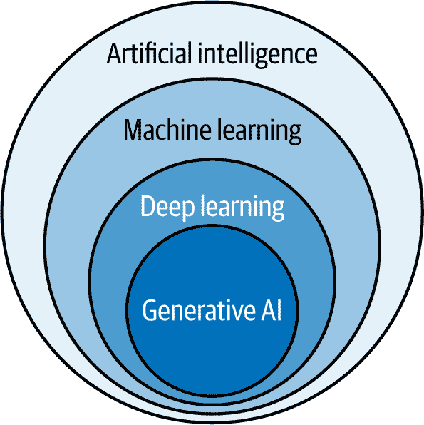
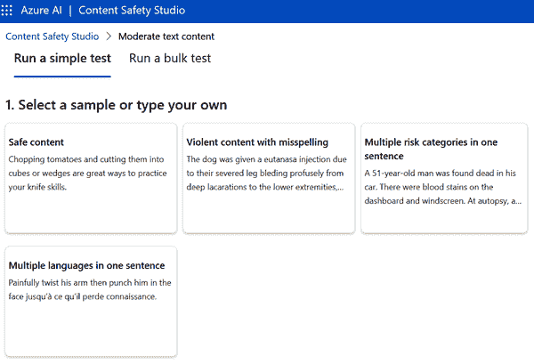

# 第三章\. 人工智能工作负载和关键用例概述

在本章中，我们将探讨人工智能工作负载以及您需要了解的关键因素，以便负责任地实施它们。这些工作负载大约占 AI-900 考试内容的 15%–20%，它们涉及理解人工智能在不同领域如内容审核、个性化、计算机视觉、自然语言处理、知识挖掘和文档智能中的应用。这些是推动人工智能应用的基础模块。它们帮助系统分析图像、理解人类语言、从大量数据中提取见解，并使用生成式人工智能创建内容。

但不仅仅是了解这些人工智能工作负载能做什么。我们还将探讨在开发负责任的人工智能时至关重要的伦理和实际考虑。我们将讨论关键原则，如问责制、包容性、可靠性、安全性、公平性、透明度、安全性和隐私。这些原则对于确保人工智能不仅强大，而且符合道德、值得信赖，并与社会重视的价值观保持一致至关重要。

# 人工智能简介

人工智能是关于帮助计算机像人类一样思考和响应。可以这样想象：人工智能让计算机做出决定、解决问题、理解语言、识别图像，并创造新事物，就像一个人一样。人工智能背后的秘密在于它如何从大量数据中学习，以识别模式和做出预测。有了人工智能，企业可以自动化任务，挖掘埋藏在信息山中的见解，并以前所未有的速度和智慧工作。

图 3-1 中的图表是理解人工智能的一个好方法。它说明了人工智能不是一个单一的技术，而本质上是一组相互依赖的不同技术和方法，它们共同解决复杂问题。

###### 图 3-1\. 人工智能组件图

在最广泛的意义上，人工智能包括所有使机器能够模拟人类智能的技术。这包括解决问题、做决定、理解语言和模式识别等任务。人工智能系统可以是基于规则的或数据驱动的，它们的目的是执行传统上需要人类认知的功能。

*机器学习（ML）*是人工智能的一个子集，它专注于使机器能够在没有明确编程的情况下从数据中学习。ML *算法*识别数据中的模式，并使用这些模式进行预测或决策。这使得系统在处理更多数据时能够随着时间的推移提高其性能。ML 通常用于推荐系统、欺诈检测和预测分析等应用。

*深度学习（DL）* 是机器学习的一个专门子集，它使用受人类大脑启发的艺术神经网络。这些网络通过多个层次处理数据，使深度学习模型能够识别复杂的模式和关系。深度学习在图像识别、语音处理和自然语言理解等领域取得了重大突破。

在深度学习领域，存在 *生成式 AI*。这是一种前沿技术，专注于创建新内容，这可能包括文本、图像、音频和视频。生成式 AI 通过实现自动化内容创作、图像合成和创造性问题解决等功能，正在改变行业。

这些技术共同代表了机器学习、适应和执行任务方式的演变，每一层都提供了越来越强大的功能。在接下来的几节中，我们将探讨这些类别的一些内容。我们还将探索 Microsoft Azure 中的专用 AI 功能。

## 内容审核

*内容审核* 是在内容造成问题之前发现和过滤掉有害或不适当的内容。这对于保持在线空间的安全和尊重非常重要，例如在使用社交媒体平台、在线社区或电子商务网站时。通过阻止有害内容的传播，企业可以保护其用户，维护其品牌声誉，并遵守法规。

如果你正在使用 Microsoft Azure 进行内容审核，你可能已经了解 Azure 内容审核器。但问题是——Microsoft 计划到 2027 年 2 月逐步淘汰此工具，并建议用户切换到 *Azure AI 内容安全工作室*。这项较新的服务可以检测你的应用程序和服务中的文本和图像中的有害内容。

首先，让我们看看 Azure 内容审核器的功能：

文本审核

搜索文本中的冒犯性内容，包括粗俗和色情材料

图像审核

分析图像中的成人内容，并可以使用 OCR 检测图像中的文本

自定义术语列表

允许创建自定义列表以根据内容策略过滤特定术语

视频审核

审核视频中的成人内容，为识别的材料提供时间标记

接下来，以下是 Azure AI 内容安全工作室的主要功能：

审核文本内容

此文本审核工具允许你轻松测试内容，无论是单个句子还是大量数据集。它提供了一个用户友好的界面来运行测试并查看结果。你可以调整敏感度级别，设置内容过滤器，并管理黑名单，以确保你的审核系统完全符合你的需求。你可以在图 3-2 中看到这一点。

提示保护

此功能评估文本以识别用户输入攻击对 LLM 的潜在风险。

基于地面的检测

此工具评估 AI 生成的文本响应是否基于提供的源材料，确保可靠性和事实准确性。

受保护材料检测

此功能识别 AI 生成的文本中的已知内容，如歌曲歌词或文章，以防止诸如版权侵权等问题。

自定义分类 API

这是一个 API，用于创建和训练用于个性化审查的自定义内容类别。

文本和图像分析 API

这些 API 检查文本和图像中的有害内容，提供多个严重程度级别以进行细微的审查。

模板和工作流程

这些模板和可定制的流程提供了一个交互式平台来构建定制的内容审查系统。该平台支持对用户生成和 AI 生成的内容的实时审查，包括微软内置的侮辱性内容阻止列表，并允许上传自定义阻止列表以满足特定需求。

###### 图 3-2\. 文本内容审查工具的仪表板

## 个性化

*Azure AI Personalizer* 是一个工具，它通过使用 *强化学习* 来帮助您的应用程序做出更明智的决策：这是一种 AI 通过对其行动获得反馈来学习的机器学习类型。基本上，它是通过试错来改进的。Personalizer 会查看您应用程序的上下文，例如用户正在做什么或他们在哪里，并考虑一系列可能的行为来找出最佳决策。当它做出决策时，您会提供反馈，称为 *奖励*，这有助于它在实时中学习和改进其选择。

您可以在许多不同的场景中使用 Personalizer。例如，在电子商务环境中，它可以决定向客户展示哪个产品以增加他们购买的机会。另一个常见用途是内容推荐，例如确定哪篇建议的文章将获得最多的点击。

但请记住，Azure AI Personalizer 将于 2026 年 10 月停用。尽管 AI-900 考试仍然将其作为一个主题，但后来可能会出现替代服务。个性化原则的核心可能仍然是考试的一部分，因此值得记住。

下面是 Personalizer 的工作原理分解：

上下文

影响决策的信息，例如您的应用程序、用户或场景（例如，位置、设备类型、用户偏好）

行为

一组潜在决策或项目，每个都有自己的属性（例如，产品列表或文章列表）

奖励

一个介于 0 和 1 之间的分数，表示决策的好坏程度（例如，如果用户点击了一篇推荐的文章，它得到 1 分）

## 计算机视觉

*计算机视觉* 是人工智能的一个分支，它使计算机能够从图像和视频中理解和分析视觉信息。它试图模仿人类视觉的方式。通过处理视觉输入，计算机视觉系统可以检测物体、提取关键细节，并根据它们观察到的内容做出决策。

Azure AI Vision 提供利用计算机视觉分析图像和视频的强大工具。其功能包括：

图像分析

此工具可以从图像中提取详细信息，例如识别物体、人脸或不当内容。它还可以自动生成图像包含内容的描述。

OCR

此功能识别并从图像中提取文本，无论是打印的还是手写的。这对于处理商业文件、收据、发票或手写笔记很有用，并且通过 Read API 处理。

物体检测

此工具在图像中定位和识别物体。它提供有关物体位置和每种物体的实例数量的详细信息。

人脸识别

此功能在图像中检测人脸并提供诸如年龄、情绪和性别等属性。它还可以执行人脸识别和验证。

视频分析

此工具包括诸如空间分析和视频检索等功能。空间分析监控视频流中的运动，有助于理解人流量或确保安全合规性。视频检索使用自然语言创建视频的可搜索索引。

Azure AI Vision 还支持 *数字资产管理（DAM）*，这有助于您在管理数字版权的同时组织、存储和检索媒体。例如，您可以根据标志、人脸、物体甚至颜色对图像进行分组。您还可以自动生成字幕并使用关键词标记图像，以便轻松查找。

## 自然语言处理

*自然语言处理（NLP）* 是一种帮助机器理解和响应人类语言的技术。基本上，它允许计算机与您进行对话。在其核心，NLP 将人类语言——无论是口语还是书面语——分解成机器可以理解的东西。这意味着计算机不仅识别单词，还可以理解完整句子或段落背后的意图。您可能已经在使用 NLP 而没有意识到，比如当您向 Siri 提出问题或与机器人聊天以在线获得帮助时。

自然语言处理（NLP）最大的任务之一是理解人类沟通的混乱、无结构的方式。让我们面对现实——我们并不总是说话或写作得完美。我们使用俚语，有不同的说法来表达相同的意思，有时可能不一致。另一方面，机器习惯于结构化数据。NLP 弥合了这一差距。它处理语言的种种怪癖，如语法和上下文，以便机器能够更自然地响应。无论是翻译语言、总结新闻文章还是接收语音命令，NLP 都是我们今天使用的许多 AI 技术背后的驱动力。

但 NLP 不仅仅是理解单词；它关乎获取意义。例如，如果您向语音助手询问“天气怎么样？”，它不仅仅会挑选出“天气”和“怎么样”。它会处理整个句子来理解您是在询问天气预报。这种更深入的理解，称为**语义学**，是使 NLP 与基本文本匹配不同的地方。它有助于 AI 生成更人性化和自然的响应。

微软提供了一项名为 Azure AI Language 的服务，让您可以处理 NLP。它将文本分析、QnA Maker 和 LUIS（语言理解）这三个工具整合在一起，并增加了新功能。这些功能有两种类型：预配置，您可以直接使用 AI 模型而不做任何调整；可定制，您可以使用自己的数据训练模型。

您可以使用 Azure AI Language 做以下事情：

命名实体识别（NER）

自动将单词或短语分类到人物、地点、日期等类别

个人信息（PII）检测

找出敏感数据，如电话号码或身份证号码，并将其隐藏

语言检测

确定文档所使用的语言，并返回相应的代码

情感分析和意见挖掘

分析文本以确定其是正面还是负面

摘要

从文档中提取关键句子以创建摘要

关键短语提取

识别文本中的主要思想

实体链接

将文本中的单词或短语插入到相应的维基百科页面上的链接，有助于提高清晰度

自定义文本分类

让您训练一个 AI 模型根据您自己的类别对文档进行分类

自定义命名实体识别（NER）

允许您训练一个模型以识别文本中的自定义标签

对话式语言理解（CLU）

构建能够理解和从用户消息中提取有价值信息的自定义模型

问答

提供最佳答案以回答用户问题，这对于聊天机器人和语音启用应用来说非常理想

## 知识挖掘

**知识挖掘**使用 AI 来解释大量数据。通常，重点在于**非结构化数据**，这是缺乏预定义格式的信息，如文本文档、电子邮件、短信、图像和视频。相比之下，**结构化数据**以标准化的格式组织，通常在表格中以行和列的形式，使其易于搜索和分析。

知识挖掘的过程相当简单：您收集数据，使用语言或图像识别等 AI 工具增强它，然后通过搜索和可视化来探索它。这样，您可以快速找到做出更好决策所需的联系。

微软开发了**Azure AI 知识挖掘**来简化这一过程。它结合了 AI、机器学习和搜索技术，帮助您提取、丰富和探索数据。以下是其中的一些关键功能：

认知技能

这些是预先构建的 AI 模型，它们能够自动从文本、图像和其他媒体中提取和结构化信息。例如，它们可以从扫描的文档中提取文本，检测不同的语言，提取关键短语，并在图像中识别对象。

增强功能

知识挖掘不仅通过增强你的数据超越了简单的关键词搜索。它可以将信息分类，提取诸如名称或地点之类的实体，并翻译文本。此外，你可以根据具体需求构建自己的 AI 模型，以添加自定义增强功能。

可定制索引

此工具帮助你创建数据的可搜索索引，使用户能够快速找到相关信息。你还可以自定义索引的构建方式，以适应特定的用例。

与 Azure 搜索集成

知识挖掘与 Azure 认知搜索服务紧密合作，这是一个搜索即服务解决方案。这意味着你可以轻松扩展搜索能力，并管理丰富数据中的查询，而无需费劲。

## 文档智能

“文档智能”，也称为“文档 AI”，利用 AI 自动化从各种文档（如表格、发票和收据）中提取、理解和组织数据。这项技术将非结构化信息转化为结构化、可操作的数据，提高了数据处理效率和准确性。

容易将文档智能与知识挖掘混淆。然而，对于考试来说，了解它们之间的区别很重要。文档智能侧重于从单个文档中提取和结构化数据，自动化数据录入和表单处理等任务。相比之下，知识挖掘涉及分析大量数据，以揭示整个组织数据资产中的模式、关系和见解。虽然两者都使用 AI 处理数据，但文档智能在文档级别操作，而知识挖掘在更广泛的跨文档级别工作，以促进全面的数据探索和发现。

对于 Azure 来说，有“Azure AI 文档智能”服务。以下是主要功能：

通用提取模型

这些模型设计用于在没有定制需求的情况下跨广泛类型的文档工作。它们可以提取关键细节，如文本、表格、键值对和文档的整体结构。这使得它们非常适合处理各种类型文档的组织，需要一致的数据提取。无论文档是有结构的、半结构化的还是非结构化的，这些模型都能提供快速、可靠的成果，而无需任何训练或标记。

预先构建模型

Azure 还提供了适用于常见文档类型的现成模型，例如发票、收据、身份证明和税务表格。这些模型预先配置为提取特定的数据字段，如日期、付款金额或个人详细信息。例如，预构建的模型可以处理 W-2 表格，并包括对其他文档的支持，如 1099 税务表格和健康保险卡。

定制模型

如果你需要更具体的需求，Azure 允许你创建定制的模型，这些模型是根据你的业务需求定制的。你可以使用自己的数据来训练这些模型，这样它们就能准确地知道在你的文档中寻找哪些信息。Azure 提供了两种类型的定制模型：模板模型，如果你的文档遵循相似的结构，那么它们就非常出色；以及神经模型，它们足够灵活，可以处理不同布局的文档。

## 生成式 AI

*Azure OpenAI 服务*为开发者提供了一个全面的工具包，用于创建可以改变各种业务操作的生成式 AI 应用程序。它允许开发定制 AI 共飞行员和代理，使公司能够将 AI 集成到他们的工作流程中。其中一个突出特点是它支持不同的 AI 模型，如 GPT-4o、GPT-4 Turbo、嵌入和 Whisper。

Azure OpenAI 工作室作为服务的用户界面，简化了这些模型的管理和定制。用户可以直接从工作室探索、微调和部署模型。这使得它成为既适用于技术用户也适用于非技术用户的可访问解决方案。

更重要的是，Azure OpenAI 支持高级功能，例如*检索增强生成（RAG）*。这项技术允许开发者针对特定数据集运行模型，提供更准确和上下文相关的输出。对于希望自动化基于知识的任务的组织来说，这个功能增强了 AI 根据其专有信息生成精确响应的能力。

例如，一家公司可以通过将 Azure OpenAI 服务与 Azure AI 搜索集成来实施 RAG，创建一个回答员工关于内部政策（如健康福利）的聊天机器人。通过索引公司文档并使用 RAG，AI 可以检索相关信息，并为员工的询问提供准确、上下文相关的响应。

在创意领域，Azure OpenAI 模型如 DALL-E 为内容生成打开了新的大门。这允许设计师和营销人员从简单的文本提示中生成独特的视觉元素。这项技术在媒体和娱乐领域尤其有影响力，快速、动态的内容创建对于满足消费者需求至关重要。

所以是的，Azure 当然提供了许多 AI 服务——理解它们可能有些困难。但在考试中，你将需要测试它们之间的区别。为了帮助大家，表 3-1 总结了这些服务的特点。

表 3-1\. Azure AI 服务总结

| 服务 | 工具 | 功能 | 弃用 |
| --- | --- | --- | --- |
| 内容审核 | Azure AI 内容安全工作室 |

+   文本内容审核

+   提示保护

+   基础性检测

+   受保护材料检测

+   定制分类 API

+   分析文本和图像 API

+   模板和工作流程

| 2027 年 2 月 |
| --- |
| 个性化 | Azure AI 个性化 |

+   上下文

+   行动

+   奖励

+   使用强化学习来提高个性化随着时间的推移

| 2026 年 10 月 |
| --- |
| 计算机视觉 | Azure AI 视觉 |

+   图像分析

+   光学字符识别（OCR）

+   目标检测

+   人脸识别

+   视频分析

+   数字资产管理

|   |
| --- |
| NLP | Azure AI 语言 |

+   命名实体识别（NER）

+   PII 检测

+   语言检测

+   情感分析

+   摘要

+   定制文本分类

+   对话语言理解（CLU）

+   问答

|   |
| --- |
| 知识挖掘 | AI 知识挖掘 |

+   认知技能

+   丰富

+   可定制的索引

+   与 Azure 认知搜索集成

|   |
| --- |
| 文档智能 | Azure AI 文档智能 |

+   通用提取模型

+   预建模型

+   定制模型

|   |
| --- |
| 生成式 AI | Azure OpenAI 服务 |

+   模型

+   检索增强生成（RAG）

+   工作室

+   与 Azure AI 搜索集成

+   视觉生成

|   |
| --- |

# 负责任的 AI 指导原则

AI 是一个极其强大的工具，正在改变行业，并以各种方式使我们的生活变得更简单。但像任何工具一样，它也伴随着我们需要意识到的风险。

一个主要担忧是 AI 模型中的偏见，这可能导致不公平的结果。例如，想象一个贷款审批系统基于有偏见的训练数据歧视性别。这可能会产生严重后果。它可能导致不平等，损害对 AI 系统的信任，以及对企业造成法律或监管后果。

但这里还有其他风险：

+   可能的错误，例如自动驾驶汽车故障，可能导致事故

+   关于 AI 如何使用数据的担忧，特别是像医疗机器人中的患者数据这样的敏感信息，如果不安全存储可能会被泄露

+   可能不会对所有用户包容的 AI 解决方案，例如没有音频输出的家庭助手，这排除了视障用户

+   AI 决策中的问责制问题，例如由于面部识别错误导致的错误定罪

为了应对这些挑战，微软为负责任的 AI 创建了六个指导原则，分为两大类：

伦理 AI

确保 AI 系统以符合道德原则的方式设计和使用，如问责制、包容性、可靠性和安全性

可解释 AI

专注于使 AI 系统透明且易于理解；包括公平性、透明度、安全性和隐私等原则

微软的六个指南在考试问题中很常见，所以你应该记住它们，并理解它们如何应用于不同的场景。在本章的其余部分，我们将更详细地探讨这些原则。

## 问责制

当你在设计和部署人工智能系统时，确保它们以道德和安全的方式运行的责任在你身上。你必须确保这项技术符合法律和行业标准——本质上，你是在确保它是公平的、负责任的和值得信赖的。以微软的方法为例：创建一个优先考虑*问责制*的框架，从早期的影响评估开始。这些评估考察人工智能可能对个人、组织和社会产生的影响。通过密切关注这些评估，尤其是在可能出现问题的时刻，你可以管理人工智能整个生命周期中的风险。

但问责制并不随着产品的发布而结束。微软倡导人类监督，确保人工智能在没有有意义的人类输入的情况下不会主导一切。管理这些系统的人们需要适当的工具来维持控制并在必要时介入。这可以防止你过度依赖人工智能输出——确保人类问责制始终是方程式的一部分——尤其是在更复杂或高风险的情况下。

为了保持秩序，建立内部审查团队是至关重要的。这些团队可以监督与人工智能开发和部署相关的关键决策，尤其是在敏感领域如医疗保健、就业或面部识别。如果被滥用，这些工具可能会造成身体或情感伤害，或侵犯人们的权利。这就是为什么明确的法律界限对于防止越界和保护个人自由如此重要的原因。

法律和法规在维护人工智能问责制方面发挥着巨大作用，但它们只是拼图的一部分。企业、政府和其它利益相关者也必须承担责任。例如，微软为处理敏感技术如面部识别等开发了自身的指导原则。微软知道，随着它从与客户、学者和民间社会合作中学到更多，这些原则将会发展。这种开放对话——在公司、政府、非政府组织和研究人员之间——对于确保人工智能负责任地发展至关重要。同时，保持团队培训、在重大决策中引入专家，并建立一个稳固的治理体系以确保你保持问责制也是非常重要的。

## 包容性

创建适用于每个人的人工智能始于确保它无论个人的能力如何都是可访问的。语音转文本和文本转语音等工具对于有听力或视力障碍的人来说尤其有帮助。通过包括这些功能，你可以确保没有人错过人工智能提供的利益。

但可及性不仅仅是关于技术——它还关乎创造它的人。拥有来自不同背景和生活经历的多元化团队，对于开发真正为所有人工作的 AI 至关重要。当你将不同的观点带入对话时，你将更有能力发现偏见，并确保 AI 系统被设计成公平和包容的。**包容性设计**是指创建尽可能多的人都可以使用的 AI 系统。这对于那些由于能力、语言、文化、性别或年龄等因素而传统上被排除在外的人来说尤为重要。通过拥抱包容性设计，开发者可以识别并解决可能使人们被排除在外的障碍，为所有用户提供更好的体验。

同样重要的是要涉及 AI 旨在为之服务的社区。与组织和非政府组织合作确保代表性不足的声音被听到。这使得 AI 更能满足他们的特定需求。使用广泛认可的可用性标准也有助于确保 AI 系统真正具有包容性。

## 可靠性和安全性

为了让 AI 系统赢得你的信任，它们需要可靠、安全、一致地工作——即使事情没有按计划进行。AI 应该做它被设计去做的事情，处理意外情况而不会失败，并抵制任何试图以有害方式操纵它的企图。验证 AI 在现实世界中的行为是关键，因为这表明开发者在设计和测试过程中是否为广泛的情况做好了准备。

开发过程中的一个重要部分是彻底测试 AI，以确保它可以安全地处理边缘情况和意外，而不会出现意外的故障。但这并不仅限于此。一旦部署，AI 系统需要持续的维护和保护。如果不受检查，它们可能会随着时间的推移而退化，变得不可靠或不准确。

人类判断对于确保 AI 保持正轨也至关重要。由于 AI 旨在增强人类能力，因此人们有责任决定何时以及如何使用这些系统，以及他们是否应该继续使用它们。这种人类监督有助于揭示可能被忽视的盲点和偏见。

要提高**可靠性和安全性**，首先了解你的 AI 在成熟度方面的位置。定期审计系统，设计它以处理意外情况，并确保你正在将其开发涉及专家。彻底测试、明确解释系统的工作原理以及用户反馈的方式都是至关重要的步骤。

## 公平性

AI 系统必须确保**公平性**，这意味着它们对待每个人都平等。例如，如果 AI 正在帮助做出关于医疗治疗、贷款批准或招聘的决定，它应该为健康状况、财务背景或资格相似的人提供相同的建议。公平性意味着 AI 不应引入或放大不公平地惠及或损害某些群体的偏见。

要解决偏见，首先需要认识到 AI 的预测和建议都有局限性。虽然 AI 提供了有用的见解，但最终人类负责做出影响人们生活的决策。这就是为什么培训人们正确理解 AI 输出并使用自己的判断力来避免不公平后果很重要的原因。

开发者在防止 AI 开发过程中的偏见方面发挥着重要作用。他们需要意识到偏见如何在设计阶段潜入并可能影响系统的建议。减少偏见的一种方法是通过使用多样化的训练数据集。例如，一个旨在筛选求职者的 AI 工具，如果它在一个男性主导的领域训练了有偏见的资料，可能会开始偏爱男性候选人。通过在部署前审计 AI 模型，开发者可以及早捕捉并修复这些偏见。

## 透明度

保持 AI 系统有效运行的一个关键原则是*透明度*。当 AI 参与影响人们生活的重大决策时，受影响的人理解这些决策是如何做出的至关重要。

透明度的一个重要部分是*可理解性*或*可解释性*，这意味着你应该能够清楚地解释 AI 系统的行为。为了提高这一点，你需要确保人们可以轻松地理解这些系统是如何工作的，以便他们可以识别任何潜在的问题——无论是关于性能、安全性、隐私、偏见还是意外结果。此外，使用 AI 的组织需要坦率地说明何时使用这些系统，为什么使用它们，以及它们是如何做出决定的。

这里有一些提高透明度的方法：

+   分享关于所使用数据集的关键细节

+   通过使用更简单的模型并解释它们的工作原理来使 AI 模型更容易理解

+   培训你的团队正确解读 AI 输出，以便他们可以发现问题并做出明智的决定

## 安全性和隐私

随着 AI 变得越来越普遍，保护隐私和确保个人和商业数据的安全变得更加关键和复杂。AI 系统需要访问数据以做出准确的预测和决策，但这引发了关于隐私和数据安全的重要担忧。这些系统必须遵守要求在数据收集、使用和存储方面保持透明度的隐私法律，同时也要让消费者控制自己的信息。

微软在这个领域最大的教训之一发生在 2016 年，当时它推出了 Tay，一个 Twitter 上的聊天机器人。Tay 被设计成从用户互动中学习，以模仿人类对话。但仅仅 24 小时内，用户就利用了 Tay 的学习过程，给它提供了攻击性内容，将聊天机器人变成了仇恨言论的平台。这一事件表明，在设计 AI 系统时考虑人类因素是多么重要。

从这次经验中，微软意识到了为新类型攻击做准备的需求——特别是那些操纵 AI 学习数据集的攻击。为了防止未来事件，微软开发了高级内容过滤工具，并引入了对自动学习的 AI 系统更多的监督。

为了确保 AI 中的*安全和隐私*，组织应遵循一些关键实践：

+   遵守数据保护和隐私法律。

+   设计系统以抵御不良行为者。

+   给客户控制其数据的能力。

+   确保个人信息的匿名性和完整性。

+   定期进行安全和隐私审查。

+   跟进行业最佳实践。

为了总结，表 3-2 列出了负责任 AI 原则的关键特性。

表 3-2\. 负责任 AI 的指导原则

| 原则 | 描述 | 关键行动 |
| --- | --- | --- |
| 责任性 | 确保 AI 在人类监督下以道德方式运行，并与法律标准保持一致，包括影响评估和内部审查团队 | 进行影响评估，保持人类监督，并建立审查团队 |
| 包容性 | 旨在创建对每个人可访问的人工智能，利用多元化的团队和社区伙伴关系 | 包容多元视角，遵循可访问性标准，并与倡导团体合作 |
| 可靠性和安全性 | 专注于 AI 的持续和稳定性能，包括处理意外情况并需要持续维护 | 进行彻底测试，定期审计，并考虑意外情况设计，同时考虑人类判断 |
| 公平性 | 通过解决偏见来促进平等对待，特别是在招聘和贷款审批等高风险决策中 | 使用多样化的训练数据，认识到模型局限性，并在部署前进行偏见审计 |
| 透明度 | 涉及对 AI 决策如何做出以及使用的数据集的清晰解释，以促进更好的理解和信任 | 解释 AI 系统行为，披露使用情况和决策，并简化模型解释 |
| 安全性和隐私 | 优先考虑数据保护，遵守隐私法律，以及防御滥用或攻击 | 遵守隐私法律，确保数据安全，匿名化个人数据，并定期审查合规性 |

# 结论

在本章中，我们介绍了不同的 AI 工作负载和关键用例，这些用例构成了 AI 技术的基石。从内容审核和个性化到更高级的任务，如计算机视觉和自然语言处理，这些工作负载展示了 AI 如何融入日常应用的纹理。我们还探讨了新兴技术，如生成式 AI，它正在创造新的创意和自动化机会。随着 AI 在商业和日常生活中的作用越来越大，理解这些工作负载对于挖掘其潜力同时保持对部署 AI 带来的伦理挑战的警觉至关重要。

我们还强调了负责任 AI 的重要性。随着 AI 的采用持续增长，这些原则对于确保技术不仅运行高效，而且与我们的社会价值观相一致并保护用户至关重要。AI 是一个强大的工具，但需要谨慎开发和管理工作，以避免出现偏见或隐私泄露等问题。

# 测验

为了检查你的答案，请参考“第三章答案键”。

1.  哪种 AI 工作负载旨在自动检测和过滤在线的有害或不适当内容？

    1.  知识挖掘

    1.  生成式 AI

    1.  内容审核

    1.  文档智能

1.  AI 个性化在应用程序中的主要目标是什么？

    1.  基于用户偏好推荐内容

    1.  为了生成新的图像

    1.  为了检测有害内容

    1.  为了分析人类语言

1.  哪种 AI 工作负载有助于分析和解释人类语言？

    1.  自然语言处理（NLP）

    1.  内容审核

    1.  计算机视觉

    1.  文档智能

1.  哪种 AI 工作负载使用光学字符识别（OCR）从图像中提取文本？

    1.  NLP

    1.  知识挖掘

    1.  计算机视觉

    1.  生成式 AI

1.  哪种 AI 工作负载用于从文本和视频等非结构化数据中揭示见解？

    1.  文档智能

    1.  知识挖掘

    1.  计算机视觉

    1.  NLP

1.  哪种 AI 工作负载使系统能够生成新的内容，如文本或图像？

    1.  NLP

    1.  生成式 AI

    1.  知识挖掘

    1.  文档智能

1.  在 Azure AI 内容安全中，哪个 API 用于扫描文本中的有害内容？

    1.  分析文本 API

    1.  分析图像 API

    1.  自定义分类 API

    1.  文本审核 API

1.  哪个 AI 原则确保 AI 系统在所有群体中安全且公平地运行？

    1.  公平性

    1.  透明度

    1.  包容性

    1.  责任

1.  哪种 AI 工作负载主要专注于分析视觉内容，如图像和视频？

    1.  NLP

    1.  知识挖掘

    1.  计算机视觉

    1.  生成式 AI

1.  哪种 AI 工作负载负责处理大量文档并从中提取关键信息？

    1.  NLP

    1.  生成式 AI

    1.  内容审核

    1.  文档智能
