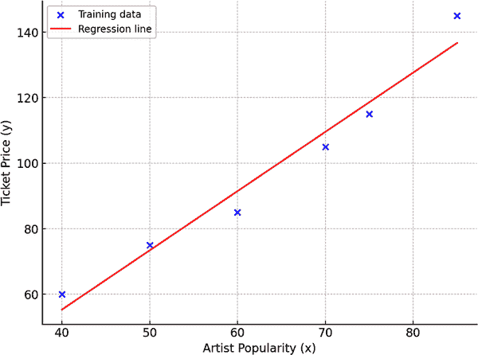
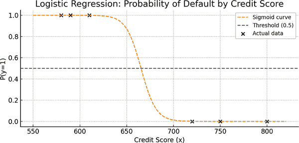
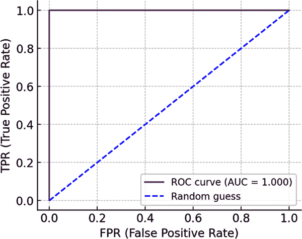
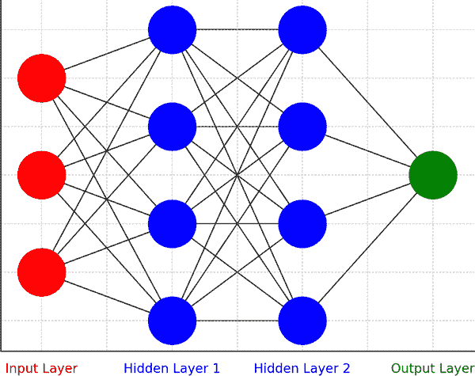

# 第四章：机器学习的基本原则

在 AI-900 考试中，大约 20%–25%的内容涵盖了在 Microsoft Azure 上机器学习的核心原则。这包括回归分析、分类和聚类等基础技术。每种技术都提供了一种独特的问题解决方法。它们允许你根据数据类型和需要做出的预测选择合适的方法。在本章中，我们将深入研究这些必须了解的概念和服务。理解这些想法将帮助你在 AI-900 考试中应对问题，这样你不仅会知道这些服务是什么，还会了解它们是如何工作的以及为什么它们很重要。

# 什么是机器学习？

机器学习（ML），作为人工智能的一个分支，允许系统在没有明确指令的情况下执行数据分析和类似任务。相反，它处理大量的历史数据，识别模式，并根据这些模式进行预测。例如，你可以使用机器学习对图像、数字或文档进行分类，并从中做出预测。

假设你为一家金融服务机构工作，该机构试图区分欺诈交易和真实交易。使用机器学习，系统将学会从已知示例中识别模式，然后将这些知识应用于预测新交易是否真实。

机器学习对于现代企业至关重要，因为它有助于自动化数据收集、分类和分析。这加快了决策过程并推动了增长。它改善了客户体验和资源管理等流程，使企业能够更快地解决问题。

尽管术语*人工智能*（*AI*）和*机器学习*（*ML*）经常被互换使用，但它们并不相同。人工智能是一个更广泛的概念，包括从语音助手到自动驾驶汽车的一切。然而，机器学习专注于特定的任务，例如预测设备维护计划或对文档进行分类。

以制造业为例。机器学习可以帮助以下方面：

预测性维护

在设备发生故障之前识别潜在的设备故障，减少停机时间和维修成本

质量控制

监控生产线以检测缺陷并确保产品质量的一致性

产品设计优化

优化设计，例如通过分析尺寸和形状的微小变化来提高砂纸的磨削性

供应链管理

预测需求，识别瓶颈，并优化物流以提高效率

# 机器学习模型工作流程

在其核心，一个*机器学习模型*只是一个软件应用，它接受一个或多个输入值并计算一个输出值。确定如何进行这种计算的过程称为*训练*。一旦模型经过训练，你就可以用它来进行预测。这个过程被称为*推理*。

让我们更仔细地看看机器学习系统的主要步骤，您可以在图 4-1 中看到。这是一个非常基础的例子。请记住，算法可能相当复杂。但就我们的目的而言，我们只想对工作流程有一个大致的了解。

###### 图 4-1\. 机器学习模型的基本工作流程

让我们更详细地看看这些步骤中的每一个。

## 第一步：训练模型

训练机器学习模型的过程从过去的数据开始，这些数据被称为*训练数据*或*数据集*。训练数据集中的每个数据点由两个基本组成部分组成：

特征

你在每个数据点观察到的特征或属性

标签

模型需要预测的结果或结果

数据集以表格形式组织成行和列，就像你在电子表格或数据库中看到的那样。每一行代表一个单独的记录或条目，每一列包含数据的特定属性或特征。这种结构允许通过以一致格式同步相似信息，轻松比较和分析多个条目之间的数据。表 4-1 展示了客户反馈和退货请求数据集的示例。

表 4-1\. 显示客户反馈和退货请求的样本数据集

| 客户 _ID | 购买日期 | 产品类别 | 评分 | 反馈评论 | 退货请求 |
| --- | --- | --- | --- | --- | --- |
| 001 | 2024-10-01 | 电子产品 | 5 | “产品优秀，快速配送！” | 否 |
| 002 | 2024-10-05 | 服装 | 2 | “尺寸与描述不符。” | 是 |
| 003 | 2024-10-07 | 家居用品 | 4 | “质量不错，但颜色不对。” | 否 |
| 004 | 2024-10-10 | 电子产品 | 1 | “商品损坏到达。” | 是 |
| 005 | 2024-10-12 | 美容 | 3 | “产品一般，包装很差。” | 否 |

数据通常杂乱无章且不完整。这些不完美之处可能会扭曲结果，导致不准确，并使决策复杂化。

例如，一个常见问题是数据缺失。虽然删除不完整信息是一种直接的方法，但它可能导致意外的扭曲，尤其是在缺失数据不是随机分布的情况下。相反，考虑其他有效处理缺失数据的方法：

均值/中位数插补

用数据集的平均值（均值）或中间值（中位数）替换缺失值以保持一致性

预测性插补

利用统计模型根据可用数据中的模式预测和填充缺失值，提供更准确的估计

数据分析中另一个常见的挑战是处理异常值。*异常值*是与其他观察值显著不同的极端数据点。它们可能会扭曲结果或掩盖重要的模式。正确管理异常值对于提高你发现结果的准确性和可靠性至关重要。考虑以下方法：

移除

如果识别出异常值是错误或与分析无关，则从数据集中排除它们

转换

使用数学技术，例如对数或平方根转换，以最小化异常值的影响，而无需完全删除它们

调查

仔细检查异常值，以确定它们是否提供了有价值的见解，或者是否是数据输入错误的结果

数据也可能存在重复。为此，你可以考虑以下选项：

去重算法

使用工具或脚本来识别和合并重复数据

唯一标识符

确保每条记录都有一个唯一键，以防止在输入点出现重复

质量控制

定期审计数据以检测和解决重复问题

然后还有不一致的数据格式问题。你可以使用以下技术来解决这个问题：

数据归一化

将数据转换为标准格式（例如，ISO 8601 日期格式）

验证规则

在数据输入期间实施自动化检查，以强制执行一致的格式

预处理管道

开发提取、转换和加载（ETL）过程，在分析之前清理和标准化数据

一旦提高了数据集的质量——这个过程被称为*数据准备*——你就可以开始进行训练。一种思考方式是基本代数。特征由*x*表示，通常有几个特征，形成一个向量（值的数组）。标签由*y*表示，这是模型试图输出的预测或结果。

例如，假设你正在构建一个基于房屋特征的模型来预测房价。特征（*x*）可能包括卧室数量、面积和位置。标签（*y*）将是房屋的销售价格。该模型经过训练，学习这些特征与价格之间的关系，然后可以根据类似特征预测新房屋的价格。

另一个例子可能是一个旨在预测电子邮件是否为垃圾邮件的模型。特征（*x*）可能包括某些关键词的存在、发件人的地址以及发送电子邮件的时间。标签（*y*）将是一个二元结果：如果电子邮件是垃圾邮件，则为 1，如果不是，则为 0。随着时间的推移，模型会学会识别特征中的模式，这些模式表明电子邮件是垃圾邮件还是合法的。

## 第 2 步：应用算法

当你与机器学习模型一起工作时，你需要一个算法来找出特征和标签之间的关系。目标是找到一种方法来使用特征（*x*）来预测标签（*y*）。基本思想是将一个函数拟合到你的数据上。换句话说，算法寻找一个模式，可以根据*x*计算*y*。对于我们的例子，它看起来是这样的：

*y* = f(*x*)

一旦算法完成了其工作，它就会给你一个模型。这个模型本质上是一个执行计算的函数。在本章中，我们将看到各种示例，例如线性回归。

## 第 3 步：使用推理

一旦完成训练阶段，你可以使用训练好的模型进行预测，这个过程称为*推理*。现在，模型就像一个包含训练期间学习到的函数的软件程序。你提供一组特征值，它为你提供一个标签的预测。

由于这个输出是由函数生成的预测值，而不是实际观察到的值，通常写作 *ŷ*，发音为“y-hat。”这是一种有用的方式来表明结果是基于模型学习到的估计，而不是一个保证的结果。

# 机器学习类型

机器学习有几种类型，每种类型都针对不同的问题设计。在最高层次上，机器学习分为两种主要类型：*监督学习*，它有标记的数据，和*无监督学习*，其中数据没有标签。这两个类别有助于确定模型如何从数据中学习以及它可以执行的任务类型。在监督学习和无监督学习的范畴下，还有其他类型的机器学习。图 4-2 显示了层次结构。

###### 图 4-2\. 机器学习的类别

在接下来的几节中，我们将探讨监督学习的方法，然后接着探讨无监督学习。

# 回归分析

*回归分析*是一种统计方法，用于根据一个或多个已知因素或变量预测数值结果。它帮助你理解这些变量与你要预测的结果之间的关系。

例如，假设你想根据广告支出、季节和市场趋势等因素预测新产品将卖出多少。回归分析允许你分析这些因素，并估计它们如何影响销售，以便你可以根据当前数据预测未来的表现。

你可以这样来处理：

分割数据

首先将你的数据分为三个子集：训练集、验证集和测试集。训练集用于开发模型，验证集帮助微调模型的参数，测试集则保留用于评估模型在新、未见过的数据上的性能。

训练模型

使用训练数据，应用算法来识别关键变量（如广告预算、季节性和市场趋势）及其对销售的影响之间的关系。模型寻找模式，例如增加广告支出是否会导致更高的销售，或者是否某些年份的自然销售表现更好。

微调模型

使用验证集，优化模型的参数或超参数以提高其预测准确性。这一步骤有助于确保模型具有良好的泛化能力，并避免过度拟合训练数据。

测试模型

使用测试集评估微调模型的性能。在这个阶段，模型根据输入变量（例如，广告预算、季节、市场趋势）生成销售预测，并将这些预测与实际销售数据进行比较，以衡量准确性。

评估模型

使用相关的指标，如平均绝对误差（MAE）、均方根误差（RMSE）或*R*²（我们将在本章后面了解）来评估模型预测的准确性。如果模型的性能低于预期，通过重新访问早期步骤来改进过程，例如尝试不同的算法、调整参数或包括新特征。

迭代和改进

使用评估中获得的见解，对模型进行迭代以改进其性能。这个迭代过程可能包括收集更多数据或探索替代建模技术以提高准确性。

## 示例：票务销售

让我们看看一个更详细的例子，以更好地理解回归分析是如何工作的。对于这个例子，我们不会涵盖上一节中概述的每个步骤。在考试中，关于回归分析这样的深入细节是不必要的。相反，我们将专注于主要阶段。

在我们的例子中，我们将根据单个特征（*x*）预测一个数值标签（*y*）。虽然大多数实际应用涉及多个特征，但仅从单个特征开始可以使事情保持简单，并允许我们专注于核心思想。

让我们考虑一个基于表演艺术家人气预测音乐会票价示例。在这里，人气分数是从粉丝收集的调查数据中得出的，代表 1 到 100 的尺度上的一个值。这个分数作为我们的特征，而艺术家音乐会的票价是我们想要预测的标签。为了构建这个预测模型，我们将使用历史数据，这些数据将人气分数（*x*）与过去音乐会的相应票价（*y*）配对，如表 4-2 所示。

表 4-2\. 比较艺术家的知名度和音乐会票价

| 艺术家人气 (*x*) | 票价 (*y*) |
| --- | --- |
| 35 | $45 |
| 40 | $60 |
| 45 | $55 |
| 50 | $75 |
| 55 | $65 |
| 60 | $85 |
| 65 | $100 |
| 70 | $105 |
| 75 | $115 |
| 80 | $135 |
| 85 | $140 |
| 90 | $170 |

接下来，我们将分割数据并使用其中一部分来训练模型。在这种情况下，数据被随机分割以确保数据集的平衡表示。表 4-3 显示了用于训练的数据子集。

表 4-3\. 模型训练的数据子集

| 艺术家人气 (*x*) | 票价 (*y*) |
| --- | --- |
| 40 | $60 |
| 50 | $75 |
| 60 | $85 |
| 70 | $105 |
| 75 | $115 |
| 80 | $135 |

虽然随机分割是一种常见的方法，但根据场景还可以使用其他方法：

分层分割

确保在训练集和测试集中保持关键特征（如流行度范围）的特定比例

基于时间的分割

当数据具有时间顺序时使用，例如时间序列数据，其中较旧的数据用于训练，较新的数据用于测试

K 折交叉验证

将数据分成多个折，其中每个子集轮流作为测试集，而其他数据用于训练

为了更好地理解流行度得分（*x*）和票价（*y*）之间的关系，我们可以在图上绘制这些值作为点。您可以在图 4-3 中看到这一点。通过绘制这些点，您可以看到两者之间的关系——通常，随着流行度的增加，票价也会增加。

###### 图 4-3\. 该散点图说明了艺术家流行度与票价之间的关系

使用训练数据集，我们准备应用一个可以建模艺术家流行度与票价之间关系的算法。我们将使用线性回归公式，该公式本质上是通过最小化线与实际数据点之间的距离来找到最佳拟合线的点。这条线代表一个函数，其斜率告诉你随着艺术家流行度的增加，票价将增加多少。这可以在图 4-4 中看到。

###### 图 4-4\. 为我们的训练数据集添加了线性回归线的散点图

假设一个艺术家的流行度得分为 77。通过应用从线性回归线推导出的方程，我们可以估计相应的票价。在这种情况下，价格将类似于我们建立的趋势中的 $120。

下一步是评估这个回归模型的准确性。使用测试数据集，我们可以预测每个艺术家流行度得分对应的票价，如表 4-4 所示。

表 4-4\. 预测票价

| 艺术家流行度 (*x*) | 实际票价 (*y*) | 预测票价 (ŷ) |
| --- | --- | --- |
| 35 | $45 | $50 |
| 45 | $55 | $60 |
| 55 | $65 | $70 |
| 65 | $100 | $85 |
| 80 | $135 | $120 |
| 90 | $170 | $140 |

然后，我们可以在图表上绘制这些值，您可以在图 4-5 中看到。

###### 图 4-5\. 显示了测试数据中实际和预测票价的原始数据集

原始数据点捕捉了历史趋势，而测试数据突出了模型的预测与实际票价之间的紧密程度。图表使得可视化模型表现良好的地方和出现偏差的地方变得容易，尤其是在比较不同艺术家流行度水平下的实际和预测票价时。

在这种情况下，模型表现相当不错。对于中等受欢迎程度的评分，预测值接近实际值，表明误差最小。然而，在受欢迎程度评分的较低端（35）和较高端（90），模型的预测低估了实际票价。虽然表现有希望，但这些极端情况下的明显偏差表明模型可能需要额外的微调来提高准确性，特别是对于边缘情况。

## 回归模型的评估指标

当涉及到衡量你的回归模型表现如何时，有一些基于你的预测值和实际值之间差异的便捷指标。

### 平均绝对误差

想象一下，你正在预测一群朋友在派对上会吃多少披萨。*平均绝对误差（MAE）* 帮助你了解，平均而言，你的预测偏差有多大——是预测过高还是过低。例如，如果你预测了四块披萨，但你的朋友们吃了七块，你差了三块。MAE 忽略差异是正数还是负数，因此将 -3 和 +3 都视为 3 的差异。如果你的预测误差为 1、2、3 和 4 块披萨，那么 MAE 将是这些数字的平均值：2.5 块披萨。

### 均方误差

有时候，你可能想要给更大的误差赋予更多的权重。毕竟，一直差一块披萨并不像差五块那么糟糕。这就是 *均方误差（MSE）* 发挥作用的地方。不是简单地取误差值，而是将每个误差平方（使更大的错误更加突出），然后平均这些平方值。在我们的披萨例子中，如果你的误差是 1、2、3 和 4，那么平方它们会得到 1、4、9 和 16。那么 MSE 将是这些平方误差的平均值：7.5。

### 均方根误差

虽然 MSE 很有用，但这些平方数与你要测量的原始数量不匹配，所以它们可能感觉有点抽象。如果你想用披萨（或你预测的任何东西）来表示误差，你可以取 MSE 的平方根。这被称为 *均方根误差（RMSE）*。在这种情况下，7.5 的平方根大约是 2.74，这意味着你的平均误差大约是 2.74 块披萨。

### 确定系数

如果你想了解你的模型如何解释数据中的变化，那么请进入 *R*²，也称为 *确定系数*。这个指标告诉你你的模型解释了实际值和预测值之间差异的多少。

例如，如果你试图预测面包店每天卖出多少纸杯蛋糕，*R*² 会告诉你你的模型可以解释多少。如果你的 *R*² 值是 0.85，这意味着你的模型解释了纸杯蛋糕销售的 85% 的变化——其余的可能是一些意外的纸杯蛋糕相关事件，比如隔壁新开了一家面包店。*R*² 的范围从 0 到 1，越接近 1，你的模型越适合数据。

所有这些指标当然很有帮助。但在现实世界的场景中，机器学习不是一次性的交易。数据科学家通常会反复训练模型，调整不同的方面以提高性能。以下是他们会调整的内容：

特征选择和准备

您可以选择在模型中包含哪些因素或特征，以及如何调整它们以获得更好的结果。例如，您可能意识到纸杯蛋糕的销售不仅仅取决于天气，还取决于附近的活动。

算法选择

预测销售的纸杯蛋糕数量的方法不止一种。虽然一个算法可能专注于简单的线性关系，另一个算法可能使用更复杂的模式。

算法参数

这些是您调整以微调算法的设置。想象一下，它们就像烤箱上的旋钮。如果您的纸杯蛋糕没有烤熟，您会调整温度（或者在机器学习中，调整*超参数*）以获得更好的结果。

经过几轮这样的迭代过程后，您将确定最适合您特定问题的模型版本。

让我们总结一下我们在表 4-5 中学到的关于回归分析的内容。

表 4-5\. 回归分析中的关键概念

| 因素 | 描述 |
| --- | --- |
| 目的 | 通过识别历史数据中的模式，根据一个或多个预测特征预测数值结果标签 |
| 流程 |

1.  将数据分为训练集和测试集。

1.  训练模型以识别关系。

1.  测试模型进行预测。

1.  评估模型准确度并在必要时进行细化。

|

| 训练模型 | 使用算法（如线性回归）分析训练数据中的模式，建立自变量和因变量之间的预测关系 |
| --- | --- |
| 评估指标 |

+   MAE：衡量平均预测误差，不考虑方向（高估/低估）

+   MSE：通过平方来强调较大的误差

+   RMSE：提供原始测量单位的误差

+   R²（确定系数）：表示模型的解释力，值越接近 1 表示拟合度越好

|

# 分类

机器学习中的**分类**是一个监督学习任务，其目标是预测给定数据点所属的类别或类别。它涉及在标记数据上训练模型，其中标签是分类的，例如“是”或“否”。模型学习输入特征与输出类别之间的关系，使其能够将新的、未见过的数据点分配到预定义的类别之一。

有各种类型的分类技术。在接下来的几节中，我们将探讨二分类和多分类。

## 二元分类

**二元分类**是分类任务中最常见的一种类型。其核心是预测两种可能的结果之一。当你向模型提供数据时，目标是让它将新的信息分类到两个桶中的一个，通常标记为 0 和 1。例如，如果你正在构建一个预测电子邮件是否为垃圾邮件的模型，二元分类是你的首选技术。每封电子邮件都会被分析，模型会给出预测：“垃圾邮件”或“非垃圾邮件”。

使二元分类与回归等不同之处在于，你并不是在预测一个连续值，如温度或销售额。相反，你专注于在两个离散选项之间做出选择。模型会查看你提供的数据的特征，如电子邮件内容，并使用这些信息分配一个概率。基于这个概率，然后做出最终的分类。

让我们通过一个简单的例子来展示二元分类是如何工作的。想象一下，我们想要使用一个特征来预测一个人是否会违约贷款：他们的信用分数（*x*）。我们的目标是将他们分类到两个类别之一：要么他们违约（*y* = 1），要么他们不违约（*y* = 0）。模型将从表 4-6 中的数据中学习以做出预测。

表 4-6\. 根据信用分数的违约情况

| 信用分数 (*x*) | 是否违约? (*y*) |
| --- | --- |
| 580 | 1 |
| 720 | 0 |
| 610 | 1 |
| 750 | 0 |
| 590 | 1 |
| 800 | 0 |

根据训练数据中的模式，模型最终将预测某人是否可能违约。如您所见，这是关于使用过去的信息来做出二元选择。在我们的例子中，信用分数为 610 或以下的人被预测为会违约，而任何信用分数为 720 或更高的人被预测为不会违约。

为了训练我们的模型，我们将使用一个分析训练数据并将其拟合到计算贷款违约概率的函数的算法。例如，如果模型预测违约概率为 0.8，这意味着有 80%的可能性该人将违约，有 20%的可能性他们不会违约。

处理二元分类的算法有好几种，但**逻辑回归**是一个常见的选择。逻辑回归为我们提供了一个 S 形曲线，称为**sigmoid 函数**，根据输入数据分配介于 0 和 1 之间的值。这如图图 4-6 所示。尽管其名称中包含**回归**，但逻辑回归算法用于分类，因为它模型化了不同结果的可能性。这是考试的一个常见主题。

###### 图 4-6\. 一个 sigmoid 函数，显示了基于信用分数的贷款违约概率，阈值为 0.5 决定违约（y = 1）或未违约（y = 0）

在这种情况下，曲线显示了根据信用评分(*x*)某人违约(*y* = 1)的概率。从数学上讲，模型的函数可以表示如下：

f(*x*) = P(*y* = 1 | *x*)

注意，对于考试，你不需要记住方程式。它们在这本书中作为帮助你更好地理解概念的一种方式被使用。

对于训练数据中的一些人，我们已知他们已经违约(*y* = 1)，因此他们的概率是 1.0。对于其他人，他们没有违约，概率是 0.0。双曲正切曲线直观地显示了违约可能性如何随着信用评分的增加而变化。

在图 4-6 中，0.5 的虚线作为我们模型预测的阈值。当计算出的概率达到或超过 0.5 时，模型预测该人将违约(*y* = 1)。如果概率低于 0.5，预测结果是他们不会违约(*y* = 0)。例如，如果某人的信用评分为 580，并且模型分配了 0.9 的违约概率，这远远高于阈值，意味着模型会预测这个人很可能违约。

就像回归模型一样，当你训练一个二元分类模型时，保留一部分数据来验证模型的表现是非常重要的。比如说，我们将表 4-7 中的信用评分数据留出以验证我们预测贷款违约的模型。

表 4-7\. 验证贷款违约预测所使用的数据

| 信用评分(*x*) | 是否违约(*y*) |
| --- | --- |
| 62 | 0 |
| 108 | 1 |
| 113 | 1 |
| 70 | 0 |
| 88 | 1 |
| 91 | 1 |

我们可以将之前训练的逻辑函数应用于这些值，如图图 4-7 所示。

###### 图 4-7\. 用于评估二元分类模型的双曲正切函数

根据计算出的概率是否高于或低于阈值（通常是 0.5），模型将为每个信用评分预测违约（1）或无违约（0）。然后我们可以将预测的违约（ŷ）与实际违约（*y*）进行比较，如图表 4-8 所示。

表 4-8\. 比较预测违约与实际违约

| 信用评分(*x*) | 实际违约(*y*) | 预测违约(*ŷ*) |
| --- | --- | --- |
| 62 | 0 | 0 |
| 108 | 1 | 1 |
| 113 | 1 | 1 |
| 70 | 0 | 0 |
| 88 | 1 | 0 |
| 91 | 1 | 1 |

这种比较有助于我们了解模型在哪些地方做得正确，在哪些地方可能需要改进。

## 二元分类评估指标

计算二元分类模型评估指标的第一步通常是创建一个包含每个可能类别标签的正确和错误预测数量的*混淆矩阵*，正如你在表 4-9 中看到的。

表 4-9\. 混淆矩阵

|   | 正面 | 负面 |
| --- | --- | --- |
| **正类** | 30 | 45 |
| **负类** | 20 | 19 |

行代表实际值，标记为“正类”或“负类”，而列显示预测值。例如，模型正确预测了 30 次正类，这显示为真阳性计数。然而，它还做出了 45 次错误的预测，将负类错误地分类为正类。同样，有 20 个假阴性实例和 19 个真阴性实例。这种分布有助于评估模型预测的准确性和错误类型。表示混淆矩阵不同可能性的方法之一显示在表 4-10 中。

表 4-10\. 带描述的混淆矩阵

|   | 正类 | 负类 |
| --- | --- | --- |
| **正类** | 真阳性 | 假阳性 |
| **负类** | 假阴性 | 真阴性 |

行和列遵循相同的排列，但现在每个单元格都包含一个标签：真阳性、假阳性、假阴性和真阴性。这些标签提供了对预测结果和实际结果之间关系的更清晰理解：

真阳性 (TP)

模型预测了正类，实际类别也是正类。这是正类的正确预测。

假阳性 (FP)

模型预测了正类，但实际类别是负类。这是一个错误的预测，通常被称为*第一类错误*。

假阴性 (FN)

模型预测了负类，但实际类别是正类。这是另一种错误的预测，被称为*第二类错误*。

真阴性 (TN)

模型预测了负类，实际类别也是负类。这是负类的正确预测。

将其称为*混淆矩阵*确实很恰当：理解这一点可能有些困难。然而，混淆矩阵很可能会出现在考试中。这就是为什么记住这四种结果是个好主意。

让我们现在看看其他常见的评估指标。

### 准确率

从混淆矩阵衍生出的一个基本指标是*准确率*，它只是正确预测占总预测的比例。它计算如下：

准确率 = (TN + TP) ÷ (TN + FN + FP + TP)

对于我们的信用评分示例，计算如下：

(2 + 3) ÷ (2 + 1 + 0 + 3) = 5 ÷ 6 = 0.83

这意味着我们的模型在预测贷款违约时正确率达到了 83%。虽然准确率看起来是一个很好的指标，但如果数据不平衡，它可能会产生误导。例如，如果只有一小部分人违约，模型可以预测所有人都不会违约，并仍然达到高准确率，但它不会真正捕捉到数据中的模式。

### 召回率

*召回率*衡量模型识别正类（贷款违约的人）的能力。它计算如下：

召回率 = TP ÷ (TP + FN)

对于我们的示例，计算如下：

3 ÷ (3 + 1) = 3 ÷ 4 = 0.75

因此，我们的模型正确地识别了 75%的违约者。

### 精确率

*精确度*告诉我们正预测的准确性——也就是说，预测的违约中有多少是实际违约。它是这样计算的：

精确度 = TP ÷ (TP + FP)

在我们这个例子中，计算公式是：

3 ÷ (3 + 0) = 3 ÷ 3 = 1.0

这意味着每次模型预测违约时，它都是 100% 正确的。

### F1 分数

*F1 分数*提供了精确度和召回率之间的调和平均数，这是一种强调数据集中较小值的平均数类型。调和平均数是通过计算值的倒数平均数的倒数来计算的，确保精确度和召回率都得到同等重视。与处理不平衡数据集时可能具有误导性的准确度不同，F1 分数考虑了假正例和假负例，为模型的有效性提供了一个更细致的视角。

公式是：

F1 分数 = 2 × 精确度 × 召回率 ÷ 精确度 + 召回率

对于我们的例子，计算公式是：

2 × 1.0 × 0.75 ÷ 1.0 + 0.75 = 1.5 ÷ 1.75 = 0.86

结果的 F1 分数为 0.86，表明模型在精确度和召回率之间取得了良好的平衡，在正确识别正例的同时，最大限度地减少了误报和漏报。

### 曲线下面积

另一种思考召回率的方式是将其称为 *真正例率 (TPR)*，它显示了模型识别正例（在我们的例子中是违约）的能力。另一方面，我们还有 *假正例率 (FPR)*，它衡量模型在实际上没有违约的情况下错误预测违约的频率。FPR 是通过 FP ÷ (FP + TN) 计算得出的。在我们的例子中，由于没有假正例，FPR 是 0 ÷ 2 = 0。

现在，如果我们调整预测违约的阈值（例如，将其移动到 0.5 以上或以下），这将改变正负预测的平衡，这意味着 TPR 和 FPR 都会发生变化。一种常见的可视化方法是绘制 *接收者操作特征 (ROC) 曲线*，它比较了所有可能阈值下的 TPR 和 FPR。图 4-8 展示了这一点。

###### 图 4-8\. ROC 绘制了真正例和假正例率

完美的 ROC 曲线将直接沿着 TPR 轴向上延伸，然后穿过顶部，使其曲线下面积 (AUC) 为 1.0，如图 图 4-8 所示。这意味着模型做出了完美的预测。一个完全随机的模型将遵循对角线，AUC 为 0.5——基本上就是猜测。对于我们的信用评分示例，假设我们生成了 ROC 曲线和 AUC 为 0.875。这告诉我们，模型比猜测要好得多，并且在预测贷款违约方面表现良好。

表 4-11 总结了我们关于二元分类所学的知识。

表 4-11\. 二元分类中的关键概念

| 因素 | 定义 |
| --- | --- |
| 目的 | 将数据分类到两个不同的类别之一，通常标记为 0 和 1，例如预测“垃圾邮件”与“非垃圾邮件”或“违约”与“无违约” |
| 流程 |

1.  将数据分为训练集和测试集。

1.  训练模型以根据数据中的模式进行分类。

1.  在新数据上测试和验证模型准确性。

|

| 训练模型 | 通常使用逻辑回归来拟合一个估计结果在 0 到 1 之间的概率的函数，应用一个阈值（例如，0.5）来分类结果 |
| --- | --- |
| 评估指标 |

+   准确率：总体正确预测除以总预测数

+   混淆矩阵：一个表格，通过显示 TPs、FPs、TNs 和 FNs 的数量来总结分类模型的性能。

+   召回率：TPR 评估模型识别正例的能力

+   精确率：正预测的准确性

+   F1 分数：精确率和召回率的调和平均值，用于平衡评估

+   AUC：衡量模型在所有阈值下区分类别的能力，1.0 表示完美的分类器

|

## 多类分类

当你进行 *多类分类* 时，你正在确定几个类别中哪一个最适合特定的观察结果。这是基于计算各种结果的可能性。它允许模型预测在给定情况下哪个选项最有可能。

以下以一组花朵为例。对于每一朵花，我们已经测量了花瓣长度 (*x*)，并试图预测花朵类型 (*y*)，这可能是以下之一：

+   0 = 玫瑰

+   1 = 雏菊

+   2 = 郁金香

当然，在现实世界的场景中，你通常会处理不止一个特征 (*x*)。但为了简单起见，我们在这里坚持使用单个特征。数据在表 4-12 中。

表 4-12\. 花瓣长度与花朵类型之间的关系

| 花瓣长度 (*x*) | 花朵类型 (*y*) |
| --- | --- |
| 167 | 0 |
| 172 | 0 |
| 225 | 2 |
| 197 | 1 |
| 189 | 1 |
| 232 | 2 |
| 158 | 0 |

为了训练我们的模型，我们需要选择一个算法，我们有两种主要选项可供选择：一对余（OVR）和多项式。

### 一对余算法

使用 OVR，想法是为每个类别构建一个独立的二元分类模型。每个模型决定一个给定的观察结果是否属于其特定的类别。以我们的花朵为例，这种方法将创建三个模型：

模型 1

确定花朵是否为玫瑰（类别 0）

模型 2

确定花朵是否为雏菊（类别 1）

模型 3

确定花朵是否为郁金香（类别 2）

每个模型计算一个介于 0 和 1 之间的概率。具有最高概率的类别被选为预测。

### 多项式算法

多项式算法生成一个函数，该函数一次产生所有类别的概率分布。它不是拥有多个模型，而是给你一个包含每个类别的概率向量的向量，这些概率的总和始终等于 1。

例如，您可能会得到这样的输出：

[0.2, 0.3, 0.5]

这意味着有 20% 的可能性这朵花是玫瑰，30% 的可能性是菊花，50% 的可能性是郁金香。由于 0.5 是最高的，模型预测郁金香。

无论您选择哪种算法，模型都会使用这些概率来预测任何观察结果的最可能类别。

## 多类分类模型评估

您可以通过计算每个单独类别的二进制指标或使用考虑所有类别的聚合指标来衡量多类分类器的性能。表 4-13 显示了我们花朵示例的评估。

表 4-13\. 评估多类分类器的性能

| 花瓣长度 (*x*) | 实际花朵 (*y*) | 预测花朵 (ŷ) |
| --- | --- | --- |
| 165 | 0 | 0 |
| 171 | 0 | 0 |
| 205 | 1 | 1 |
| 195 | 1 | 1 |
| 183 | 1 | 1 |
| 221 | 2 | 2 |
| 214 | 2 | 2 |

多类分类器的混淆矩阵与二类分类器的混淆矩阵工作原理类似，但它不是捕捉两个类别的预测，而是捕捉多个类别的预测。这显示了实际和预测类别标签组合的预测数量。图 4-9 显示了混淆矩阵。

###### 图 4-9\. 实际和预测的花类混淆矩阵

从这个混淆矩阵中，我们可以找出每个花朵类别的关键指标，列在表 4-14 中。

表 4-14\. 每个花朵类别的关键指标混淆矩阵

| 类别 | TP | TN | FP | FN | 准确率 | 召回率 | 精确率 | F1 分数 |
| --- | --- | --- | --- | --- | --- | --- | --- | --- |
| 0 | 2 | 5 | 0 | 0 | 1.0 | 1.0 | 1.0 | 1.0 |
| 1 | 2 | 4 | 1 | 0 | 0.86 | 1.0 | 0.67 | 0.8 |
| 2 | 2 | 4 | 0 | 1 | 0.86 | 0.67 | 1.0 | 0.8 |

要获得模型的总体准确率、召回率和精确率，我们将 TP、TN、FP 和 FN 的值相加：

总体准确率 = (13 + 6) ÷ (13 + 6 + 1 + 1) = 0.90

总体召回率 = 6 ÷ (6 + 1) = 0.86

总体精确率 = 6 ÷ (6 + 1) = 0.86

最后，使用总体召回率和精确率值计算总体 F1 分数：

总体 F1 分数 = (2 × 0.86 × 0.86) ÷ (0.86 + 0.86) = 0.86

这些指标帮助我们了解我们的花朵分类器在所有类别上的表现如何。

让我们总结一下关于多类分类我们在表 4-15 中学到的内容。

表 4-15\. 多类分类中的关键概念

| 因素 | 描述 |
| --- | --- |
| 目的 | 通过估计给定观察结果（如根据花瓣长度等特征预测花朵类型）的每个类别的可能性，将数据分类到多个可能的类别之一 |
| 处理过程 |

1.  使用 OVR 或多项式算法中选择和训练模型。

1.  根据最高概率输出预测类别。

1.  根据需要评估准确度并改进模型。

|

| 建模技术 |
| --- |

+   OVR：为每个类别构建一个二元分类器来预测给定的观察值是否属于该类别

+   多项式：使用单个模型同时输出所有类别的概率，最高概率表示预测的类别

|

| 评估指标 |
| --- |

+   混淆矩阵：可视化所有类别的正确和错误预测

+   准确率、召回率、精确率和 F1 分数：按类别和汇总计算，以评估整体性能

|

# 聚类

*聚类*是一种机器学习技术，用于根据数据的特征相似性将数据组织成组或聚类。它属于无监督学习类别，因为它不依赖于预先标记的数据来识别这些组。相反，算法分析数据的特征，并根据共享特征将每个数据点分配到聚类中。本质上，聚类是模型在分析数据的内在结构后生成的标签。

聚类在需要揭示数据中的隐藏模式或分组的情况下特别有用。例如，它可以帮助市场细分，根据购买行为将客户分组，或在生物学中，将具有相似功能的基因分组在一起。它对于异常检测也很有价值，例如在欺诈检测中识别不寻常的交易，或在图像分割中将像素分组到不同的区域。

让我们来看一个更详细的例子。假设你是一位海洋生物学家，正在研究一群鱼。你只对根据鱼的长度和鳍数这两个特征对鱼进行分组感兴趣，而不是专注于识别物种。数据在表 4-16 中。

表 4-16\. 基于长度和鳍数相似性的鱼分组

| 长度 (*x*1) | 尾鳍 (*x*2) |
| --- | --- |
| 10 | 3 |
| 12 | 4 |
| 15 | 2 |
| 15 | 2 |
| 16 | 5 |
| 18 | 6 |
| 20 | 2 |
| 22 | 5 |
| 24 | 6 |

在这种情况下，目标是把具有相似长度和鳍数的鱼聚在一起，而不是将它们分类到任何特定的物种中。

有几种方法可以处理聚类。最流行的方法之一被称为*k-均值聚类*。

让我们看看如何做这件事。首先，你需要将你的数据转换成向量，这意味着为每个数据点在空间中分配一个坐标。如果你有两个特征，比如鱼的长度 (*x*1) 和鳍的数量 (*x*2)，这些就变成了两个坐标——[x1, x2]——可以在二维图上绘制。

接下来，你决定你想要多少个聚类。假设你选择了三个聚类（*k* = 3）。你随机在图上放置三个点来代表你聚类的中心，称为*质心*。然后，每条鱼被分配到最近的质心。质心本身被重新计算为分配给它的数据点（鱼）的平均值。

这个过程会重复：随着质心的移动，一些鱼可能离不同的质心更近，因此分配会改变。将鱼重新分配到簇和调整质心的这种来回过程会一直持续到组变得稳定。您可以在图 4-10 中看到这一点。

###### 图 4-10\. 按长度和鳍的数量分组的鱼簇

由于没有已知的标签可以与簇分配进行比较，因此聚类模型的有效性是通过簇之间的分离程度来评估的。您可以使用几个指标来衡量簇的分离程度：

平均到簇中心的距离

衡量簇中每个点到质心的平均距离

到其他中心的平均距离

看看簇中的每个点平均距离其他簇的质心有多近

到簇中心的最大距离

在簇内找到离质心最远的点

轮廓分数

一个介于 -1 和 1 之间的数字，表示簇之间的分离程度（1 表示最佳分离）

# 深度学习

深度学习是一种更复杂的机器学习类型，试图模仿我们大脑的学习方式。在其核心，深度学习依赖于所谓的 *人工神经网络*，它通过使用数学函数的行为类似于生物神经元的工作方式。这些人工神经网络由多个神经元层组成，创建了一个通过越来越复杂的层处理数据的结构。这就是为什么这种方法被称为“深度”学习，而由此产生的模型被称为 *深度神经网络 (DNNs)*。您可以将深度学习应用于各种任务，例如预测结果（回归）、分类数据，甚至更复杂的问题，如理解语言或识别图像。

就像其他机器学习形式一样，深度学习涉及训练一个模型，根据一个或多个输入预测输出。模型的工作是找出一个函数，将这些输入与正确的输出联系起来。这个函数是通过神经网络层构建起来的，每一层处理过程的一部分。在训练过程中，模型反复调整其内部参数（称为 *权重*），以最小化其预测与正确值之间的差距。随着时间的推移，模型微调这些权重以提高准确性和做出更好的预测。

让我们通过查看一个将三种不同类型的果实（苹果、橙子和香蕉）进行分类的例子来分解神经网络的工作原理。在这种情况下，输入数据 (*x*) 是这些特征的测量值的向量。假设我们测量：

+   水果的重量

+   颜色的色调值

+   水果的曲率

所以 *x* 是一个包含三个值的向量：

*x* = [x1, x2, x3]

现在，标签（*y*）是水果的类型，可能是以下三种之一：苹果、橙子或香蕉。由于这是一个分类问题，神经网络将预测每个类的概率。因此，*y*将是一个表示每个水果概率的向量：[P(apple|x), P(orange|x), P(banana|x)]。

这是网络做出预测的方式：

1.  水果的特征数据，如[180g, 0.8, 0.3]，被输入到神经网络的输入层。

1.  输入层中的每个神经元都接受特征值，将它们乘以分配的权重，并通过激活函数传递结果。

1.  每一层的神经元都与下一层的神经元相连，形成一个完全连接的网络，其中结果通过网络的层向前传递。

1.  输出层生成一个概率向量——例如，[0.2, 0.7, 0.1]——这代表了水果是苹果、橙子或香蕉的可能性。由于 0.7 是最高值，网络预测该水果是橙子。

图 4-11 展示了深度学习网络的图形表示。

###### 图 4-11\. 深度学习网络

神经网络的魅力在于在训练过程中调整权重以做出更好的预测。最初，这些权重是随机的，但通过称为*反向传播*的过程，网络将它们细化以提高准确性。以下是训练过程的概述：

1.  定义您的训练数据——基本上，一组已知的水果类型及其相应的测量值。

1.  数据通过神经网络传递，并使用损失函数将输出与实际标签进行比较。损失函数是一个数学公式，它量化了预测输出和真实标签之间的差异。例如，如果网络预测香蕉的值为[0.3, 0.1, 0.6]，但真实标签是[0, 0, 1]，则损失函数计算这些值之间的差异。这种差异，或损失，作为模型调整其参数并改进其预测的信号。最终目标是最大限度地减少这种损失以提高网络的准确性。

1.  网络计算每个权重对损失的贡献程度，并使用这些信息来调整权重。

1.  这个过程在许多周期（称为*epoch*）中重复，直到损失最小化并且模型足够准确。

这种训练通常以数据批次的形式进行，使用如 GPU 等强大的硬件来处理涉及的重计算。随着时间的推移，网络变得擅长识别水果是苹果、橙子还是香蕉。

对于 AI-900 考试，您可能会看到关于机器学习和深度学习之间区别的问题。表 4-17 概述了这些关键区别，以帮助您牢固掌握每个概念。

表 4-17\. 机器学习和深度学习的关键区别

| 因素 | 机器学习 | 深度学习 |
| --- | --- | --- |
| 复杂性 | 较少 | 较多 |
| 数据要求 | 在结构化、较小的数据集上表现良好 | 需要大量数据才能达到准确性 |
| 训练时间 | 更快 | 更长 |
| 硬件要求 | 可在标准 CPU 上运行 | 通常需要 GPU |
| 可解释性 | 更容易 | 更困难 |

# 结论

在本章中，我们探讨了机器学习的核心概念，深入探讨了回归、分类和聚类等基本技术。每种方法都提供了独特的发现数据模式并做出准确预测的方法。它们还使你能够直面现实世界的挑战。

# 测验

要检查你的答案，请参阅“第四章答案键”。

1.  机器学习（ML）中回归分析的主要目的是什么？

    1.  将数据分类到不同的类别

    1.  将相似数据点聚类在一起

    1.  根据变量预测数值结果

    1.  分析图像和视频

1.  以下哪项是监督学习的例子？

    1.  K-means 聚类

    1.  根据特征预测房价

    1.  根据购买历史对客户进行细分

    1.  识别金融交易中的异常

1.  在二元分类中，哪种算法通常用于预测两个类别之间的概率？

    1.  线性回归

    1.  逻辑回归

    1.  决策树

    1.  K-means

1.  F1 分数在模型评估中代表什么？

    1.  模型区分类别的能力

    1.  预测误差的平均值

    1.  精确度和召回率的平衡

    1.  模型的总准确率

1.  机器学习工作流程中的哪个步骤涉及使用模型进行预测？

    1.  训练

    1.  推理

    1.  验证

    1.  数据准备

1.  K-means 聚类与哪种学习类型相关联？

    1.  监督

    1.  半监督

    1.  强化

    1.  无监督

1.  哪个指标衡量回归模型解释数据变化的好坏？

    1.  均方误差 (MSE)

    1.  决定系数 (*R*²)

    1.  根均方误差 (RMSE)

    1.  均值绝对误差 (MAE)

1.  哪种方法通过根据可用数据中的模式进行估计来解决缺失数据？

    1.  均值插补

    1.  预测性插补

    1.  删除不完整数据

    1.  数据归一化

1.  机器学习中分类的主要目标是什么？

    1.  识别未标记数据中的隐藏模式

    1.  预测数值结果

    1.  将数据点分配到预定义的类别

    1.  生成新内容

1.  哪种机器学习技术适合对无标签的相似数据点进行分组？

    1.  回归

    1.  分类

    1.  聚类

    1.  深度学习 (DL)
