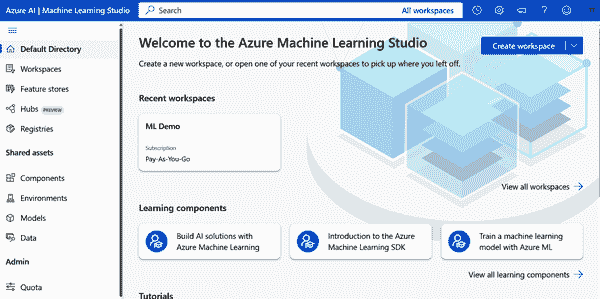
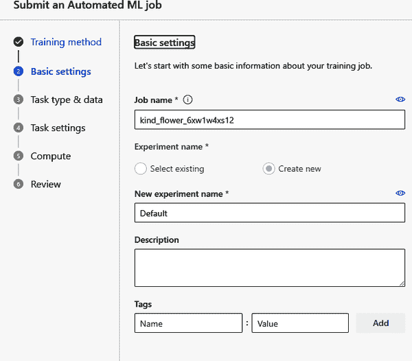
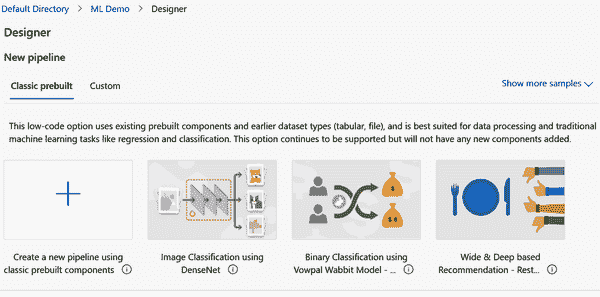
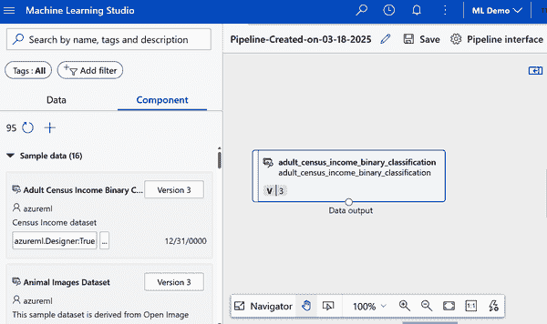
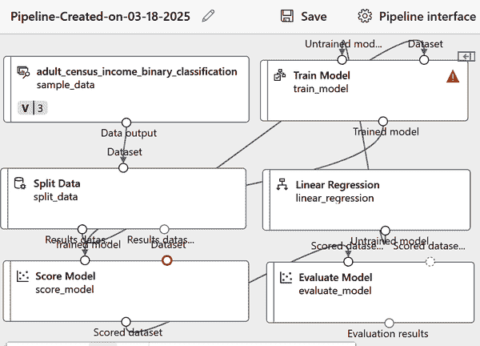

# 第五章\. Azure Machine Learning

在上一章中，我们探讨了机器学习的基础。在本章中，我们将使用*Azure Machine Learning*，这是一种基于云的服务，它简化了机器学习模型的训练、部署和管理。无论你是数据科学家、软件工程师还是 DevOps 专业人士，Azure Machine Learning 都能简化整个机器学习工作流程，从数据探索到模型部署。

Azure Machine Learning 提供两个主要工具，针对不同的用户偏好和目标：

Azure Automated Machine Learning (AutoML)

AutoML 自动化开发机器学习模型的过程，处理诸如算法选择和超参数调整等任务。它可以通过 Azure Machine Learning Studio 的无代码界面和 Python SDK 访问。这意味着系统可以满足不同水平的专业知识需求。

Azure Machine Learning Designer

此工具提供了一个拖放界面，用于构建无需编码的机器学习管道。用户可以直观地连接数据集、转换和算法，以高效地创建和部署模型。

这两个工具都集成到 Azure Machine Learning Studio 中，根据用户偏好和项目需求提供灵活性。对于本章，我们将提供使用这些服务的示例。

# Azure Machine Learning 简介

你可以使用 Azure Machine Learning 来完成以下任务：

+   准备和探索你的数据

+   训练和评估机器学习模型

+   训练后注册和管理模型

+   将模型部署以便应用程序或服务可以使用它们

+   确保遵循负责任的 AI 实践

Azure Machine Learning 旨在与各种机器学习平台协同工作，无论你是在使用 Microsoft Azure 的工具还是像 PyTorch、TensorFlow 或 scikit-learn 这样的开源框架。MLOps 工具使监控模型和按需重新部署它们变得容易。

这是 Azure Machine Learning 提供的内容：

+   用于模型训练和评估的集中式数据集存储

+   按需计算能力来运行如模型训练之类的机器学习作业

+   AutoML 来测试不同的算法和参数，以便你可以找到最适合你数据的最优模型

+   帮助你创建用于模型训练或推理等过程的管道的可视化工具

+   与 MLflow 等流行工具集成，以大规模管理你的模型

+   内置支持评估负责任的 AI 指标，包括公平性和模型可解释性

当你准备好开始时，第一步是在你的 Microsoft Azure 订阅中设置一个 Azure Machine Learning *工作区*。这个工作区是你的主要资源，并且根据需要自动创建其他资源，如存储帐户和虚拟机。我们已经在第二章中学习了如何进行这一操作。

一旦您的工作区准备就绪，您可以通过 Azure 机器学习工作室访问它，这是一个基于浏览器的工具，可以帮助您管理从数据到部署模型的一切。在工作室中，您可以：

+   导入并探索您的数据

+   创建和管理计算资源

+   在笔记本中运行您的代码

+   使用可视化工具构建作业和管道

+   使用自动机器学习训练模型

+   查看模型详情，如评估指标和负责的 AI 信息

+   部署用于实时或批量推理的模型

+   从综合目录管理模型

在接下来的两个部分中，我们将探讨如何使用 Azure 机器学习的 AutoML 和 Azure 机器学习设计器服务。

# 自动机器学习

在本节中，我们将深入了解 Azure 的 AutoML 服务，以训练和测试一个机器学习模型。这将是一个用于医疗保健保险成本预测的系统。我们将使用来自[Kaggle](https://oreil.ly/nMgxP)的数据集，Kaggle 是一个流行的数据科学项目平台，您可以在这里找到大量免费的真实世界数据集。数据集包含有关年龄、性别、体重指数（BMI）、子女、地区和吸烟习惯等信息。

Azure 机器学习工作室是您管理资源并启动工作的地方。打开一个新的浏览器标签页，并访问[机器学习工作室](https://oreil.ly/6kEQF)。您将看到图 5-1 所示的仪表板。

###### 图 5-1. 机器学习工作室的仪表板

在屏幕左侧的菜单标签上，选择“自动机器学习”然后点击“新建自动机器学习作业”。您将看到图 5-2 所示的屏幕。

###### 图 5-2. 创建机器学习模型的设置

左侧的菜单栏显示了创建机器学习模型过程中的不同步骤。第一个步骤是进入“基本设置”。以下是您可以在字段中输入的内容：

作业名称

作业名称将预先填充一个唯一的名称。您可以保持原样。

新实验名称

输入**insurance-prediction**。

描述

输入**预测医疗保险成本的自动机器学习**。

标签

留空。

点击“下一步”，您将被带到“任务类型和数据”部分。这里将显示一个下拉菜单，包含以下选项：

+   分类

+   回归

+   时间序列预测

+   自然语言处理

选择回归然后点击创建。在“数据类型”部分，输入或选择以下内容：

名称

**保险数据**

描述

**历史保险数据**

类型

表格（mltable）

选择“下一步”，您将可以选择上传数据集作为 URI、从 Azure 或从本地文件。选择“本地文件”。

点击下一步，然后选择“Azure 博客存储”以及“workspaceblogstore”。点击下一步后，你将进入“数据源”部分。首先，你需要下载保险 CSV 文件，这是 Kaggle 数据集，并将其放入自己的文件夹中。你还需要一个包含数据结构的文件。你可以在本书的[网站](https://oreil.ly/J6NMG)上找到这些文件。

点击“上传文件夹”并选择要上传的文件：数据集和数据结构。按下一步，系统将处理数据。然后点击创建以生成表格，该表格显示数据集的结构。一旦完成，选择表格并点击下一步。你将进入“任务设置”部分。对于“目标列”，选择“费用”。这是回归将输出的内容。

然后，展开“查看更多配置设置”部分。配置设置中的一些项将是下拉菜单，你可以从中选择一个选项，而其他项则需要你输入信息。按照以下方式完成它们：

主要指标

标准化均方根误差

解释最佳模型

未选择

启用集成堆叠

未选择

使用所有支持的模型

未选择。你将限制作业只尝试几个特定的算法。

允许的模型

仅选择 MaxAbsScaler 和 LightGBM。是的，你通常会选择所有或大多数模型，但那样会花费更多时间，所以在这个演示中两个模型就足够了。

展开并完成“限制”部分的设置如下：

限制

展开此部分。

最大试验次数

3

最大并发试验数

3

最大节点数

3

指标分数阈值

0.085\. 如果标准化均方根误差达到此值，作业将终止。

实验超时

15\. 这很重要。如果你不设置限制，这个过程可能会花费很长时间——甚至数小时。

迭代超时

15

启用早期终止

已选择

验证类型

训练-验证分割

验证数据百分比

10

测试数据集

无

点击下一步，你将进入“计算”部分。确保项目完成如下：

选择计算类型

无服务器

虚拟机类型

CPU

虚拟机层级

专用

虚拟机大小

Standard_D2ds_v4（2 核心处理器，8GB RAM，50GB 存储，每小时 0.11 美元）

实例数量

1

接下来，点击“提交训练作业”。Azure 将处理模型，这可能需要一些时间——15-20 分钟。一旦完成，你将得到结果，如图 图 5-3 所示。

###### 图 5-3\. 模型训练的结果

在右侧是“最佳模型摘要”，包括 MaxAbsScaler 和 LightGBM 模型。你可以点击它们来查看它们的性能。以下是“标准化均方根误差”为 0.08085%。这表明模型的预测率相当准确。

如果你点击“查看所有其他指标”，你会看到许多指标，例如解释方差、MAE 等。然后，如果你选择上面的“指标”菜单项，你会看到两个图表。它们显示了残差和预测值。你可以在图 5-4 中找到它们。

###### 图 5-4\. 回归模型的指标

接下来，我们可以实现这个模型。这可以作为一个实时端点、批量端点或网络服务来实现。

毫无疑问，你可以用这个做更多的事情。AutoML 是一个强大的工具。但这个演示的目的只是给你一个能力和一些主要工作流程的尝鲜。现在，我们将用 Azure 机器学习设计器做同样的事情。

# Azure 机器学习设计器

要使用 Azure 机器学习设计器，首先转到[Azure 机器学习工作室](https://oreil.ly/NN_jk)的仪表板。然后创建一个新的工作区或使用现有的一个。在左侧菜单中，点击设计器并按+创建一个新的管道。图 5-5 显示了 Azure 机器学习设计器的仪表板。

在左侧是一个数据和组件的菜单表。在“数据”下是一个数据集列表，例如动物图像、汽车价格数据和客户关系管理（CRM）客户流失数据。要使用数据集，点击它并将其拖动到主屏幕上。让我们为“成人人口普查收入二分类”数据集做这个操作。如果你右键点击它，你会得到一个弹出窗口来预览表格，如图图 5-6 所示。

我们将要构建一个预测收入水平的模型——也就是说，一个人的收入是否超过某个阈值（例如，每年 50,000 美元）。这是基于成人人口普查收入数据集中的特征，包括年龄、教育、职业和每周工作时间等属性。

然后，我们将数据分为训练和测试。为此，我们将使用一个组件。你可以通过转到左侧菜单栏并在搜索框中输入“split”来找到它。将 Split Data 组件拖放到数据集下。然后使用鼠标将数据集框下的圆圈拖到组件上。图 5-7 显示了这看起来是什么样子。

###### 图 5-5\. Azure 机器学习设计器的仪表板

###### 图 5-6\. Azure 机器学习设计器中的普查数据集

###### 图 5-7\. 数据集和分割数据组件之间的连接

要配置组件，双击它。通过“第一个输出数据集中的行数比例”，我们可以指定训练数据的百分比。我们将使用 0.7。

接下来，我们将选择一个训练模型。回到左侧菜单并搜索“线性回归”。将其拖放到分割组件下。请注意，您可以双击回归模型来更改设置，但我们将保持默认设置。

接下来，搜索“训练模型”。是的，这就是我们训练模型的组件。将其拖到屏幕上。

将线性回归组件连接到训练模型组件。同时将分割数据组件连接到训练模型组件，指定分割数据下的第一个圆圈。图 5-8 显示了这看起来是什么样子。

点击“训练模型”组件，选择“编辑列”。这是我们希望模型预测的值。输入**收入**并按保存。

前往左侧菜单并搜索“评分”。此组件将为预测评分模型。将此组件拖到屏幕上，并将其连接到训练模型组件的第一个圆圈。然后，将分割数据组件连接到评分模型组件的第二个圆圈，如图图 5-9 所示。

###### 图 5-8\. 数据集和组件的连接

###### 图 5-9\. 已处理模型的输出

最后，搜索“评估模型”以获取指标，并将其拖到屏幕上。然后，将其连接到评分模型组件。

我们已完成设置。点击屏幕右上角的“配置和提交”。

您将经历三个输入屏幕。对于第一个屏幕，选择“创建新”的“现有名称”，然后在此下方输入您想要的名称。

在左侧菜单中点击“运行时设置”，然后点击“计算集群”和“创建 Azure ML 计算集群”。（计算集群是一组协同工作以执行大规模数据处理任务的虚拟机。）选择推荐选项并点击下一步。为此输入一个名称并点击创建。

您将被带回到之前的屏幕，您将选择新的集群。点击“审查+提交”，然后按提交。

模型处理可能需要几分钟。一旦处理完成——屏幕顶部的“完成”表示——转到左侧菜单中的“作业”并选择您的模型。

右键点击“评估模型”组件并选择“预览数据”。然后选择“评估结果”，您将获得模型表现的指标。

# 结论

在本章中，您已经看到 Azure 机器学习如何提供适合您经验水平和项目需求的灵活工具——无论是 Azure 机器学习设计器的视觉便捷性还是 AutoML 的可定制功能。通过实际示例，您已经看到设置配置和测试模型是多么简单。虽然考试没有深入到每个细节，但对这些工具的一般了解将使您具备 Azure 机器学习可以提供的坚实基础。

# 小测验

要检查您的答案，请参阅“第五章 答案键”。

1.  哪种机器学习技术通常用于根据已知变量预测数值结果？

    1.  分类

    1.  回归

    1.  聚类

    1.  深度学习 (DL)

1.  在回归分析中，哪个指标衡量预测的平均误差，无论正负偏差？

    1.  均方误差 (MSE)

    1.  决定系数 (*R*²)

    1.  均方绝对误差 (MAE)

    1.  均方根误差 (RMSE)

1.  在二元分类中，哪种算法通常用于估计二元结果的概率？

    1.  K 均值聚类

    1.  逻辑回归

    1.  线性回归

    1.  决策树

1.  Azure 的自动化机器学习 (AutoML) 功能主要支持哪种类型的机器学习？

    1.  强化学习

    1.  监督学习

    1.  无监督学习

    1.  遗传算法

1.  在多类分类问题中，哪种方法为每个类别构建一个二元分类器？

    1.  K 均值聚类

    1.  一对余 (OVR)

    1.  多项式算法

    1.  逻辑回归

1.  哪个 Azure 机器学习功能有助于自动化尝试多个算法以找到最佳模型的过程？

    1.  自定义脚本执行

    1.  自动机器学习 (AutoML)

    1.  数据集存储

    1.  部署管道

1.  哪个评估指标表示分类模型中正确识别的正例比例？

    1.  准确度

    1.  精确度

    1.  回忆

    1.  F1 分数

1.  哪种机器学习技术适合根据相似性对数据点进行分组，而无需先前的标签？

    1.  监督学习

    1.  分类

    1.  聚类

    1.  回归

1.  在回归分析中，哪个术语描述预测值与实际值之间平方差的平均值？

    1.  均方绝对误差 (MAE)

    1.  均方根误差 (RMSE)

    1.  均方误差 (MSE)

    1.  *R*² 分数

1.  哪个深度学习结构由多个层组成，这些层处理数据以进行复杂预测？

    1.  支持向量机 (SVM)

    1.  决策树

    1.  神经网络

    1.  K 近邻
