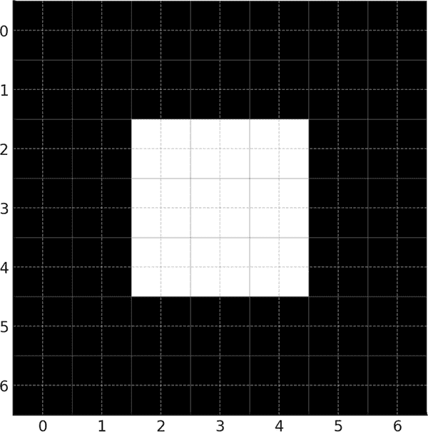
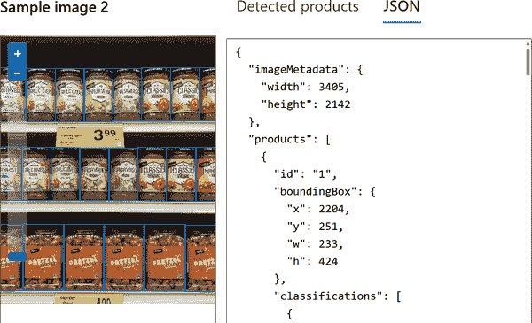
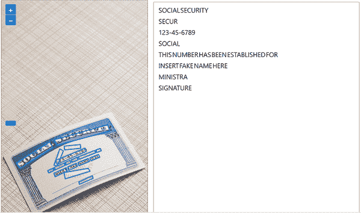
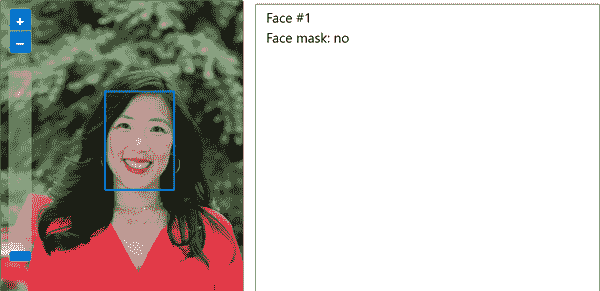

# 第六章\. Azure 上计算机视觉工作负载的特点

在本章中，我们将介绍计算机视觉的基础知识，这是 AI 的核心领域，代表了考试内容的 15%–20%。这项技术使你能够利用 Microsoft Azure 的工具套件，通过数据“看到”并解释世界。我们将从关键计算机视觉解决方案、技术和基础概念的概述开始。然后，我们将深入了解 Azure 如何处理图像分类、目标检测、OCR 和面部分析。我们将更深入地探讨这些主题，并在过程中结合实际示例。

# Azure 的计算机视觉服务

当你在 Azure 上进行计算机视觉探索时，你有几个选项可以选择，每个选项都针对不同的目标和定制化程度：

*Azure AI Vision*

如果你只关注计算机视觉，Azure AI Vision 正是为此而构建的。它拥有处理视觉数据、分析图像和视频以及提取有用见解所需的所有工具。假设你正在开发一个需要通过摄像头流跟踪可用空间并检测未经授权车辆的停车库系统。Azure AI Vision 为你提供了一个专用且强大的工具包，用于处理此类视觉处理任务，并提供帮助你管理预算的选项。

*Azure AI Services*

如果你感兴趣的是利用超出计算机视觉的多个 AI 能力——例如翻译或搜索——Azure AI Services 是你的首选。把它想象成一个一站式商店，提供各种 AI 工具。你可以通过单个端点和密钥来管理所有这些工具。这种设置将节省时间。例如，想象你正在开发一个旅行应用，该应用可以翻译文本、标记图像和检测地标。Azure AI Services 让你能够结合所有这些功能。这使一切保持流畅且易于管理。

*Azure AI Custom Vision*

当你需要定制的图像识别能力时，Azure AI Custom Vision 是你的首选解决方案。它使你能够创建和训练针对项目需求特定标签的定制图像识别模型。例如，如果你在农业领域，你可以构建一个从图像中识别作物病害的模型，帮助农民采取主动措施并提高产量。Custom Vision 可以通过 SDK、API 或直观的 Web 门户访问。

*Azure AI Face Service*

此服务提供先进的 AI 算法，用于在图像中检测、识别和分析人脸——即使某人戴着太阳镜或从某个角度观看。如果您的项目需要身份验证、无接触访问控制或公共场所的自动人脸模糊以保护隐私，这是一个出色的工具。该服务可以返回详细的 facial analysis，这使得它在需要深入人脸识别的应用中非常有用。然而，访问受到限制：只有符合特定资格和使用标准的 Microsoft 管理的客户和合作伙伴才能作为 Microsoft 负责任 AI 原则的一部分使用此服务。有意用户必须完成[人脸识别登记表](https://oreil.ly/sO2xB)。

Azure AI 视频索引器

此工具允许从视频中提取见解，例如目标检测、OCR 和内容审核。这是通过利用超过 30 个 AI 模型实现的。此外，还有音频功能，如转录、翻译和情感检测。

这些选项中的每一个都提供了独特的计算机视觉方法，无论您需要广泛的 AI 工具包、专门的视觉平台、定制模型构建还是高级人脸识别功能。

## 您可以使用 Azure 计算机视觉服务做什么

Azure 的计算机视觉服务提供了一套强大的工具，用于以各种方式分析和理解图像。如果您想自动生成描述，可以从*图像标题生成*开始。这个功能不仅能够识别图像中的内容，还更进一步，为每个描述提供了一个从 0 到 1 的置信度分数。这可以让您了解模型对其分析的确定性。例如，如果您有一张阳光明媚的海滩上有人在游泳的图片，图像标题生成可能会生成一个标题，如“有游泳者的海滩场景”，并显示一个置信度分数，表明其准确性可能有多高——比如说 0.9。这使得验证对结果的信任程度变得容易。

*标记*是另一个有用的功能。它为每张图像添加了一层可搜索的术语。标记突出显示与图像中找到的元素相关的特定关键词，如*海滩*、*海洋*或*太阳*，每个标记都包含一个置信度分数。当组织大型图像库或快速搜索具有特定特征的图像时，此功能非常有价值。

Azure 的计算机视觉还与*目标检测*一起工作。这可以识别和定位图像中的特定对象，如汽车、人或家具。目标检测不仅限于识别对象，还精确地定位图像中对象的准确位置，这对于任何需要空间意识的任务来说都是极好的。这可以用于监控库存、分析交通模式，甚至在零售中启用自动结账系统等场景。

*面部检测* 和 *面部识别* 增加了更多专业化的功能，正如之前在 Azure AI 面部服务中提到的。面部检测通过 Azure 定位图像中的面部存在，但不会进一步识别这些面部属于谁。这对于人群计数或从面部表情评估情绪的应用程序来说非常理想。面部识别通过识别个人面部——将它们与已知身份进行匹配——更进一步。这对于安全应用、个性化体验或任何需要验证某人身份的情况非常有用。

最后，Azure 的 *光学字符识别 (OCR)* 服务允许您从图像中提取文本。这把任何视觉文本转换成机器可读字符。OCR 对于数字化打印文档、扫描收据或阅读手写笔记非常理想。无论您是在自动化数据录入还是使扫描文档可搜索，OCR 都可以通过快速将图像文本转换为可用的数据来简化流程。

表 6-1 提供了 Azure 计算机视觉功能的概述。

表 6-1\. Azure 中的计算机视觉功能

| 功能 | 描述 | 用例 |
| --- | --- | --- |
| 图像字幕 | 识别图像内容并提供描述，同时提供从 0 到 1 的置信度分数 | 描述照片自动生成字幕 |
| 标记 | 向图像添加特定的关键词或标签，每个标签都有一个置信度分数，这使得根据内容对图像进行分类和搜索变得更容易 | 照片库组织数字资产管理 |
| 物体检测 | 识别并定位图像中的特定物体，提供其位置的空间数据 | 库存管理交通分析自动零售结账 |
| 面部检测 | 在图像中检测面部存在，但不识别个人 | 人群计数组内情绪检测 |
| 面部识别 | 识别个人面部，将其与已知身份进行匹配以进行验证 | 安全访问个性化客户体验 |
| 光学字符识别 | 从图像中提取文本，将视觉文本转换为机器可读字符 | 数据录入自动化文档数字化收据扫描 |

让我们通过使用 Azure AI 视觉服务的一个示例来了解一下。前往视觉工作室中的“[为图像添加字幕”部分](https://oreil.ly/aYYYy)。您将在顶部看到示例照片，以及上传您自己的照片的地方，如图 图 6-1 所示。


###### 图 6-1\. Azure Vision Studio 中的图像标题服务

我们将选择棒球运动员。字幕将显示：“一个手持球棒的棒球运动员。”然后，选择 JSON 并查看输出，如下所示：

```py
{
  “apim-request-id”: “163f2514-c22f-41f1-86d9-2d3ec77ca461”,
  “content-length”: “158”,
  “content-type”: “application/json; charset=utf-8”,
  “modelVersion”: “2023-10-01”,
  “captionResult”: {
    “text”: “a baseball player holding a bat”,
    “confidence”: 0.8212961554527283
  },
  “metadata”: {
    “width”: 250,
    “height”: 322
  }
}
```

JSON 显示了 AI 的识别信息、长度、内容类型和模型版本。它还显示了图像标题以及置信度分数，为 0.821。最后，您将看到一些关于图像尺寸的元数据。

## 如何计算机视觉工作

计算机视觉的核心是像素。当计算机“看”图像时，它实际上是在读取数字，这些数字告诉它每个像素有多亮以及它应该是什么颜色。

让我们更深入地了解计算机视觉是如何工作的：

图像由像素组成

将图像想象成一个由像素组成的巨大网格。例如，一个 100 × 100 像素的图像，恰好有 10,000 个像素按行和列排列。每个像素由三个值组成，即红色、绿色和蓝色（RGB），这些值的整数范围从 0 到 255。通过混合这些颜色，计算机构建出我们看到的图像。

在像素中寻找模式

为了识别物体，计算机视觉算法在这个像素网格中寻找模式。它们使用基于数学的方法，如卷积，来识别图像的各个部分，如边缘和纹理。卷积通过分析小群像素（核）来增强某些特征，如边缘，并帮助计算机在图像中识别形状。

发现重要细节

在识别像素中的模式后，计算机视觉模型专注于图像的关键部分——特征。这些特征可能是人脸的曲线、车辆的轮廓或建筑的边缘。通过缩小关注范围，模型只关注最重要的点。这使得更容易判断图像包含的内容。

*教模型识别图像*

现在，模型已经挑选出这些特征，它准备进入下一步：学习。模型已经在大量标记了内容的图像上进行了训练。通过研究这些标记数据，它学会将某些像素模式与“猫”或“汽车”等物体联系起来，并在以后的新图像中识别类似物体。

*深度学习和像素数据*

对于卷积神经网络（CNN）等深度学习模型——我们将在本章后面了解更多关于 CNN 的内容——像素只是开始。CNN 中的每一层都会深入挖掘像素数据，早期层检测边缘，中间层识别形状，而后期层识别完整物体。随着网络的不断学习，它会调整像素之间的关系。这使得模型在每次使用时都能更好地检测模式。

*微调以提高准确性*

在准确性至关重要的应用中——如人脸识别或医学成像——每个像素都很重要。高级算法会仔细检查这些像素，从而提高模型的精度。通过微调像素数据，模型逐渐以更详细的程度进行检测，每次改进都能更好地解释图像。

让我们进一步探讨像素和图像处理。为此，我们将查看一个示例，即一个数组：

```py
0   0   0   0   0   0   0
0   0   0   0   0   0   0
0   0  180 180 180  0   0
0   0  180 180 180  0   0
0   0  180 180 180  0   0
0   0   0   0   0   0   0
0   0   0   0   0   0   0
```

这个数组有七行和七列，形成一个 7 × 7 像素图像——其分辨率。这个图像中的每个像素都由一个介于 0（黑色）到 255（白色）之间的数字表示，这些极端之间的值代表不同的灰度。在这种情况下，像素值为 180 在较暗的背景中创建了一个较亮的灰色方块，如图 6-2 所示。

通过沿 x 和 y 坐标排列行和列，像素值的网格形成一个简单的二维图像。这一层对于灰度图像就足够了，但彩色图像需要更多的复杂性。为了表示颜色，我们使用三个单独的层。每一层代表不同的颜色分量：红色、绿色和蓝色。例如，想象我们有一个类似的 7 × 7 像素数组，分布在三个颜色通道中。

红色：

```py
120  120  120  120  120  120  120
120  120  120  120  120  120  120
120  120  200  200  200  120  120
120  120  200  200  200  120  120
120  120  200  200  200  120  120
120  120  120  120  120  120  120
120  120  120  120  120  120  120
```

绿色：

```py
20    20   20   20   20   20   20
20    20   20   20   20   20   20
20    20  180  180  180   20   20
20    20  180  180  180   20   20
20    20  180  180  180   20   20
20    20   20   20   20   20   20
20    20   20   20   20   20   20
```

蓝色：

```py
250  250  250  250  250  250  250
250  250  250  250  250  250  250
250  250   30   30   30  250  250
250  250   30   30   30  250  250
250  250   30   30   30  250  250
250  250  250  250  250  250  250
250  250  250  250  250  250  250
```



###### 图 6-2\. 一个 7 × 7 网格显示，概述每个像素

这个例子在形状上与图 6-2 相似。但当这三个层结合在一起时，它们形成了一个彩色图像。外侧边缘的蓝绿色方块来自于混合这些颜色的值：

+   红色：120

+   绿色：20

+   蓝色：250

中间的青色方块是通过混合每种颜色的不同值创建的：

+   红色：200

+   绿色：180

+   蓝色：30

这种红、绿、蓝通道的混合使彩色图像逐像素地生动起来。

## 图像过滤器

当你想增强图像时，通过调整每个像素的值以创建各种效果，应用过滤器可以显著地改变图像。过滤器使用*核*——由数字组成的微小网格，定义了每个像素如何被改变。不同的核会产生不同的效果，如模糊或锐化。每个在图像处理中都有其独特的作用。

考虑一个用于锐化的 3 × 3 核矩阵，其看起来如下：

```py
 0  -1   0
-1   6  -1
 0  -1   0
```

该核通过在图像上移动，为每个 3 × 3 区域计算新的像素值，并将这些结果填充到图像的新版本中应用。让我们通过一个简单的灰度图像的例子来了解一下：

```py
  0    0    0    0    0    0    0
  0   50   50   50   50   50    0
  0   50  100  100  100   50    0
  0   50  100  150  100   50    0
  0   50  100  100  100   50    0
  0   50   50   50   50   50    0
  0    0    0    0    0    0    0
```

从左上角开始，3 × 3 区域中的每个像素值与相应的核值相乘，然后求和以生成输出图像的新像素值。例如：

```py
(0 * 0) + (0 * -1) + (0 * 0) +
(0 * -1) + (50 * 6) + (50 * -1) +
(0 * 0) + (50 * -1) + (100 * 0) = 200
```

然后将核向右移动一个像素，并在整个图像上重复此过程。这个特定的核用于锐化，强调细节，并使边缘更加突出。

请记住，有各种过滤器可以产生不同的结果：

模糊

模糊过滤器，如简单的平均核，可以减少噪声并使图像平滑。一个典型的模糊核可能看起来如下：

```py
    1/9  1/9  1/9
    1/9  1/9  1/9
    1/9  1/9  1/9
```

这个核平均每个 3 × 3 区域中的像素，使细节变柔和，并创建模糊效果。

边缘检测

边缘检测过滤器，如 Sobel 或 Laplacian 过滤器，旨在通过强调像素强度中的快速变化来识别图像中的边界——例如：

```py
    -1 -1 -1
    -1  8 -1
    -1 -1 -1
```

此核通过突出像素值急剧变化的地方来检测边缘，有助于隔离形状和线条。

色彩反转

色彩反转过滤器翻转像素值，创建图像的负片。这些过滤器不使用像其他过滤器那样的核。反转颜色意味着每个像素的值从最大强度中减去，将亮区转换为暗区，反之亦然。

锐化

如上例所示，锐化过滤器通过使边缘突出而增强细节。这有助于突出特征或使图像看起来更清晰。

图 6-3 展示了锐化过滤器对苹果图像的对比效果。这个过程被称为*卷积滤波*，涉及将过滤器扫过图像以应用模糊、边缘检测、色彩反转和锐化等效果。通过实验不同的核，你可以获得许多创造性的图像转换可能性。


###### 图 6-3。使用过滤器对图像进行锐化的结果

## 图像分类

*图像分类*是人工智能的一个重要方面，它专注于识别图像中的主要内容并将其分类到特定类别。例如，如果你想让模型区分动物，它可以被训练来识别图像是否显示猫、狗或鸟。这种能力不仅限于检测物品；它关于识别复杂模式。有时这意味着捕捉到人类眼睛可能过于微妙的视觉细节。

监督学习通常用于训练图像分类模型。在这种方法中，模型从标记的数据集中学习——每个图像都与其正确的标签配对——因此模型可以学习每个类别的外观。这样，人工智能就擅长识别和正确标记之前未见过的图像。另一方面，无监督学习，它不依赖于标记数据，通常对于需要精确类别区分的任务来说效果较差。

在实践中，图像分类的一个流行应用是在医疗保健领域，其中人工智能模型可以分析医学图像以检测特定的异常。这可能包括在 X 光片中发现肿瘤或在 MRI 扫描中识别某些条件。这不仅简化了诊断过程，而且还能实现更快、可能更准确的检测，这对于早期干预至关重要。

## 目标检测

*目标检测* 是一种人工智能技术，它不仅能够识别图像中的物体，还能精确指出它们的具体位置。这是通过 *边界框* 实现的，边界框是围绕每个识别出的物体的矩形轮廓，并通过像素坐标进行映射。这些框精确地显示了每个物体在图像中的位置，比仅仅知道存在哪些物体提供了更详细的理解。

Azure AI 的视觉服务提供了强大的目标检测功能。像 Vision Studio 这样的工具使得将此功能集成到各种应用中变得更加容易。Azure AI 视觉服务允许用户使用边界框检测物体并跟踪它们的位置。目标检测建立在图像分析模型之上，但它涉及更复杂的训练，因为模型必须学习不仅识别物体，还要在图像中准确定位它们。图 6-4 展示了使用 Vision Studio 进行目标检测的一个示例。



###### 图 6-4\. 使用 Azure AI 视觉工作室进行目标检测

上传的图像显示了模型如何通过在货架上的每个物品周围绘制边界框来检测单个产品。每个边界框，用蓝色勾勒出来，代表一个“检测到的产品”，显示了每个物品在图像中的位置。在此视觉显示旁边，Vision Studio 在右侧提供了详细的 JSON 数据，包括每个边界框的像素坐标。更重要的是，每个检测到的物体都附带一个置信度分数，告诉我们对每个物品是“产品”有多大的把握。

## OCR

传统 OCR 使用模式识别来匹配文本形状，但有了 AI，事情又上升了一个台阶。现在，机器学习算法分析每个形状和线条，将它们与大量的文本样本库进行比较。这意味着 AI 可以比旧 OCR 方法更好地处理复杂的字体或混乱的笔迹。

话虽如此，OCR 并不完美。有时，它会误读字符——比如将小写的“l”误认为是数字“1”。这些错误尤其可能出现在文本模糊或字体不寻常的情况下。

尽管如此，OCR 可以提供重大优势。让我们举一个例子。假设一个医疗保健提供者有几十年的患者记录存储在满是灰尘的文件柜中。查找文件意味着要翻阅一堆纸张——这是一个繁琐、耗时且经常导致错误或丢失文件的过程。然而，使用 OCR，所有这些纸质记录可以迅速扫描，转换为数字格式，并实现全文搜索。这可以意味着节省大量的金钱和时间。

Azure 的 Read OCR 引擎使用先进的机器学习模型构建，不仅可以从文档中提取文本，还可以适应多种语言和格式。Read OCR 是灵活的，让你可以选择基于云的处理或本地部署。如果你正在处理单个图像或“野外”的照片，Read OCR 提供了一个快速的同步 API，因此你可以将其嵌入到你的软件中。

Read OCR 有两个主要版本，覆盖不同的场景。第一个版本针对通用图像，如标签、标志或海报，这些在日常生活中都能找到。这个版本（OCR for Images 4.0）适用于需要快速文本提取的情况。

第二个版本是为大量文本的扫描或数字文档（如书籍、报告或文章）量身定制的。此 Document Intelligence 模型使用异步 API，这意味着它旨在处理大量数据，如果你正在自动化大规模文档处理，效果极佳。

让我们看看 Azure AI Foundry 的 OCR 功能的一个例子。此示例将社会保障卡图像转换为可读文本，如图 图 6-5 所示。



###### 图 6-5\. Azure AI Foundry 对社会保障卡图像的 OCR 输出

如你所见，Azure AI Foundry 成功地识别了文本。如果你选择 JSON，你将获得一个功能丰富的集合。首先，它会显示一行文本：

```py
    “lines”: [
      {
        “text”: “SOCIAL SECURITY”,
        “boundingPolygon”: [
          {
            “x”: 500,
            “y”: 3742
          },
          {
            “x”: 2696,
            “y”: 2980
          },
          {
            “x”: 2810,
            “y”: 3118
          },
          {
            “x”: 560,
            “y”: 4032
          }
        ],
```

对于每个单词，还提供了位置信息。然后，OCR 将这些信息分解为每个单词的值，以及相应的置信度分数：

```py
“words”: [
          {
            “text”: “SOCIAL”,
            “boundingPolygon”: [
              {
                “x”: 501,
                “y”: 3906
              },
              {
                “x”: 1304,
                “y”: 3402
              },
              {
                “x”: 1381,
                “y”: 3536
              },
              {
                “x”: 596,
                “y”: 4032
              }
            ],
            “confidence”: 0.963
          },
```

这种 OCR 功能与智能文档处理（IDP）相结合，类似于 OCR 的下一级亲戚。它以 OCR 为基础，但深入挖掘，提取结构化和关键信息，而不仅仅是单词。例如，Microsoft 的 Document Intelligence 模型建立在 Read OCR 之上，用于分析关系、识别关键实体并提供详细的文档洞察。（我们已在 “工作室” 部分中介绍了该系统。）

让我们看看 Azure AI [Document Intelligence Studio](https://oreil.ly/Pd_kX) 的一个例子。选择“发票”部分，你会看到仪表板。点击“运行分析”，你会看到图 图 6-6 中所示的屏幕。

在屏幕的左侧，OCR 已经识别了文档上的各个字段。然后，Document Intelligence 技术确定它们具有哪些类型的数据。例如，有账单和收件人地址等字段。每个字段也有相应的置信度分数。


###### 图 6-6\. 使用 Document Intelligence Studio 分析发票

## 面部检测与分析

面部检测和分析是计算机视觉的关键技术。面部检测在图像或视频流中识别人脸，通常作为其他过程（如用面部解锁手机）的初步步骤。它确定是否存在人脸，但不提供额外细节。另一方面，面部分析通过根据面部结构中的模式解释面部特征（如年龄、性别和情感表达）来更进一步。

面部检测和分析依赖于人工智能，尤其是深度学习（DL），它使用神经网络层来分析数据中的模式。模型在大量的人类面部数据集上训练，这使得模型能够准确识别和解释面部特征。像卷积神经网络（CNNs）这样的技术在这里发挥着重要作用，它们扫描并从图像中的像素模式中学习。然后，AI 模型将这种学习应用于实时或预录制的图像中识别面部特征和表情，并在每次使用中不断改进。

你会在许多日常应用中找到面部检测和分析。安全系统使用它进行监控和在拥挤的地方识别感兴趣的个人，而零售环境则将其应用于收集有关客户的统计数据，甚至定制广告。在医疗保健领域，面部分析正在被探索以评估情绪福祉和识别与某些条件相关的症状。游戏和娱乐行业使用它来增强用户体验，根据用户的反应调整游戏或内容交互。

Azure AI Studio 包含强大的面部识别功能。图 6-7 展示了这一功能的示例。



###### 图 6-7\. Azure AI Studio 在图像中识别和分析一位女性的面部

在这个例子中，AI 识别了一位女性的面部。它为她创建了一个边界框，并在她的面部有各种点来指示不同的特征。如果你选择 JSON，你会看到有关此信息：

```py
“faceLandmarks”: {
      “pupilLeft”: {
        “x”: 510.5,
        “y”: 256.4
      },
      “pupilRight”: {
        “x”: 574.7,
        “y”: 263.7
      },
      “noseTip”: {
        “x”: 538.1,
        “y”: 301.7
      },
      “mouthLeft”: {
        “x”: 502.2,
        “y”: 325
      },
```

这捕捉了关于左眼瞳孔、右眼瞳孔、鼻尖等识别和位置的信息。

## 卷积神经网络

想象一下尝试教计算机在照片中识别动物，比如判断动物是猫、狗，甚至是狮子。*卷积神经网络（CNNs）* 使这成为可能。由于它们分析数据的方式，CNNs 是一种流行的深度学习模型。可以将 CNNs 视为数字侦探，它们通过过滤图像来挑选出重要的线索，如形状、边缘和纹理。然后，它们将这些线索拼凑起来做出预测。

下面是如何在实际中工作的。模型的滤波器最初带有随机权重。在每一轮训练中，模型学习哪些细节有助于它识别每个特征，例如动物类型。经过足够的练习后，它在捕捉线索方面变得非常准确——如此之高，以至于即使它以前从未见过那只特定的狮子，也能正确地标注一张狮子的新图像。

下面是 CNN 层的分解：

卷积层

这些层中的每个滤波器都会扫描图像并捕捉特定的模式，例如皮毛纹理或耳朵形状。随着时间的推移，CNN 学习到哪些模式对于在图像中识别动物最有用。

*池化层*

为了避免数据过载，CNN 使用池化（通常是最大池化），这会缩小特征图，仅保留最关键的信息。这个过程使得模型运行更快，对细微变化（如动物姿势的变化）的敏感性降低。

*全连接层*

在这里，模型汇集了它收集到的所有信息。这就像将一个 3D 拼图展平，并将所有碎片连接起来以做出单一预测。到这一阶段，模型对物体有了强烈的认识。

激活函数

在最后几步中，模型需要权衡其选择并得出结论。例如，`softmax`这样的函数被用来分配每个可能标签的概率，因此模型可能会输出类似[0.3, 0.6, 0.1]的概率——例如，表示有 60%的可能性图像是一只狗。

*反向传播和优化*

当模型的猜测不正确时，并不意味着道路的尽头。它会回顾自己哪里偏离了目标，并调整滤波器权重以改进下一次的猜测。这个被称为*反向传播*的反馈循环帮助模型专注于每种图像类型最相关的特征。

训练 CNN 意味着向其提供成千上万——通常是数百万——标记的图像，并让它练习。随着每一轮训练的进行，模型的准确性随着从错误中学习而提高。最终，CNN 理解了如何最好地识别每种类型的对象，即使新图像与训练集略有不同。

虽然卷积神经网络（CNNs）通常用于图像标注，但它们也非常适合其他需要理解复杂视觉数据任务的执行：

*目标检测*

与仅仅说“这是一只猫”不同，CNN 可以识别图像中的多个动物，并在每个动物周围画上框。

图像分割

在像医学成像这样的详细任务中，CNN 可以识别图像中的每个像素，识别不同的区域，例如在医学扫描中识别不同类型的组织，这可能是有帮助的。

简而言之，CNNs 允许机器以以前不可能的方式解释图像。

## 计算机视觉的演变：从 CNNs 到多模态模型

一种新的架构——称为*变换器*——正在接管自然语言处理的世界。变换器通过将单词或短语转换为称为*嵌入*的数值代码来工作。想象一下嵌入就像在一个虚拟景观中的坐标，其中具有相似意义的单词聚集在一起。例如，“cat”（猫）和“kitten”（小猫）会靠近放置，而“cat”（猫）和“airplane”（飞机）则会在这个语义空间中相隔较远。

变换器在语言处理上的成功导致了新的突破：*多模态模型*。这些模型结合了图像和文本，使它们能够同时理解两者。以下是它们是如何做到的：

1.  他们分析图像以提取关键视觉特征。

1.  他们将文本转换为嵌入。

1.  它们学会将这些视觉和基于文本的元素联系起来。

微软的 Florence 是多模态模型的一个例子。它经过数百万带有标题的图像训练，使其能够承担各种任务，例如：

+   将图像分类

+   在图像中识别特定对象

+   构建自然图像描述

+   添加相关标签

这些多模态模型代表了今天人工智能的尖端技术，为能够轻松处理图像和文字的系统创造了令人兴奋的机会。

# 负责任的人工智能与计算机视觉

在第三章中，我们探讨了负责任人工智能的原则。这当然是在计算机视觉的背景下一个重要的话题，其中伦理问题占据中心位置。然而，这项技术也引发了伦理问题。隐私是一个主要问题，因为许多用户可能不知道他们的数据正在被收集或如何被使用。还存在滥用的可能性，例如未经同意的大规模监控。AI 模型中的偏见也是另一个伦理问题，因为训练在有限或非多样化的数据集上的模型可能导致不准确或不公平的结果，尤其是在不同的群体之间。因此，负责任地部署面部检测和分析解决方案需要透明度、严格的数据治理以及持续的努力来减轻偏见并保护个人隐私。让我们深入了解塑造这一类别负责任人工智能实践的关键因素。

## 面部识别的公平性

确保人脸识别系统的公平性是一个至关重要的伦理考量。研究表明，这些系统往往存在偏见，尤其是针对肤色较深的人和女性。Ketan Kotwal 和 Sébastien Marcel 在 2025 年进行的一项[研究](https://oreil.ly/orfFS)发现，这些系统在男性受试者上的准确率通常高于女性受试者。此外，该研究还指出了肤色分类的挑战，指出肤色较浅的人通常比肤色较深的人更容易验证。这种偏见通常源于训练数据集的多样性不足。解决这个问题需要开发更具包容性的数据集，以代表广泛的肤色、性别和种族背景。此外，采用公平感知算法和定期审计可以帮助识别和减少偏见。

由于这些问题，微软对其人脸识别技术实施了限制。例如，它禁止美国警察部门使用这项技术。微软还废弃了某些功能，例如推断情绪、性别和年龄的功能。

## 隐私和安全

人脸识别技术也引发了关于隐私和安全的紧迫关切。未经授权的监控和未经同意的数据收集侵犯了个人隐私权。此外，面部数据的存储存在风险，如发生泄露事件可能导致身份盗窃。为了解决这些问题，组织必须建立严格的指南，要求在收集面部数据之前获得知情同意。采用强大的加密方法和遵守如欧盟通用数据保护条例（GDPR）之类的数据保护法律可以进一步保护敏感信息。提供关于人脸识别系统如何使用的透明度，并给予个人选择退出的选项，是其他有助于保护隐私和建立信任的措施。

## 透明度

透明度对于在计算机视觉系统中培养信任和问责制至关重要。用户应该了解这些系统是如何运作的，它们收集的数据类型以及涉及的决策过程。为了促进透明度，开发者应提供关于其算法的清晰文档，包括使用的数据源和方法。与利益相关者和公众进行开放沟通也有助于消除技术神秘感。更重要的是，结合可解释人工智能技术可以使计算机视觉系统的决策过程对非技术受众更加透明，增强信任和理解。

# 结论

总结一下，Azure 的计算机视觉工具集具有强大的功能，将高级人工智能直接放在您的指尖。了解 Azure 如何处理从对象检测到 OCR 和面部分析的所有事情不仅令人印象深刻，而且对于通过 AI-900 考试至关重要。这项考试期望您了解 Azure 提供的能力——例如，多模态模型如何将文本和图像结合以创建更具情境意识的 AI。随着多模态模型开辟新的可能性，Azure 的计算机视觉工具不仅实用，而且正在塑造人工智能的下一个时代，一次智能应用一次。

# 测验

要检查您的答案，请参阅“第六章答案键”。

1.  以下哪个是计算机视觉中涉及将图像划分为彩色点网格的基本概念？

    1.  过滤器

    1.  像素

    1.  神经网络

    1.  标签

1.  在对象检测中，哪种方法用于确定图像中对象的位置？

    1.  OCR

    1.  矩形框

    1.  面部检测

    1.  图像分类

1.  卷积在计算机视觉中的目的是什么？

    1.  为了检测颜色反转

    1.  为了调整图像大小

    1.  为了识别像素数据中的模式

    1.  为了分配标签

1.  在 Microsoft Azure 的计算机视觉工具中，哪个服务主要处理对象检测和面部分析等任务？

    1.  Azure 认知搜索服务

    1.  Azure AI 视觉

    1.  Azure Machine Learning

    1.  Azure Kubernetes Service

1.  哪种类型的神经网络最常用于图像分类等计算机视觉任务？

    1.  循环神经网络（RNN）

    1.  卷积神经网络（CNN）

    1.  生成对抗网络（GAN）

    1.  Transformer

1.  CNN 的哪个组件减少了特征图的大小，以关注关键细节？

    1.  卷积层

    1.  完全连接层

    1.  池化层

    1.  激活函数

1.  哪种计算机视觉技术读取并解释图像中的文本？

    1.  图像分类

    1.  OCR

    1.  面部检测

    1.  对象检测

1.  与人工智能中的面部检测和分析相关的首要道德担忧是什么？

    1.  缺乏颜色准确性

    1.  隐私和同意问题

    1.  高计算成本

    1.  数据集可用性有限

1.  在 Azure 的 AI 视觉工作室中，什么数据伴随着对象检测以指示模型的置信度？

    1.  像素计数

    1.  置信度分数

    1.  矩形框颜色

    1.  文件类型

1.  激活函数在 CNN 图像识别过程中扮演什么角色？

    1.  识别边缘模式

    1.  减小图像大小

    1.  将概率分配给预测

    1.  向图像添加颜色
