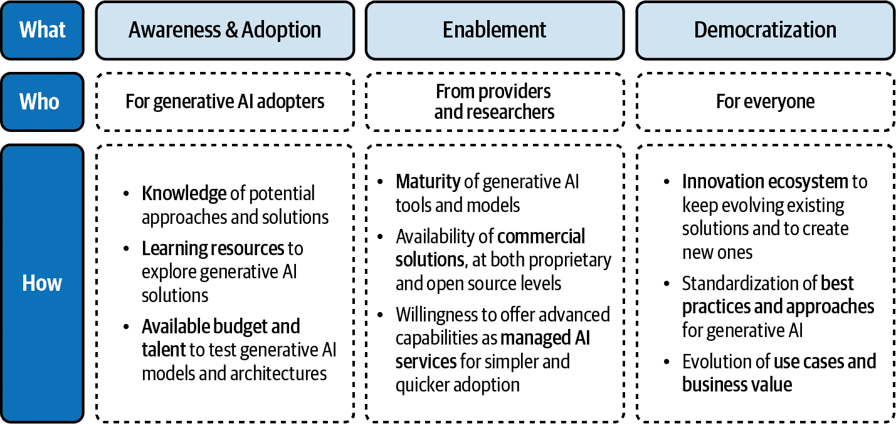

# 引言

人工智能终于来了。虽然它确实已经在我们中间，但我们可以把 2020 年代视为现代、更易获取和更强大的人工智能新时代的开始。

如果你正在阅读这本书，你可能已经知道人工智能不是一个新概念。它首次出现（至少作为一个概念，是在美国一个非常[著名的大学会议](https://oreil.ly/kk-Ey)上）已经几十年了，现在我们可以这样说，几乎所有行业的人士都开始理解人工智能的潜力和考虑因素。经过几个[AI 的夏天和冬天](https://oreil.ly/au2B6)以及炒作和欺骗的周期后，AI 为公司和个人带来的价值承诺终于实现了，生成式 AI、生成式预训练转换器（GPT）和[大型语言模型（LLM）](https://oreil.ly/8KuvO)等术语无处不在。

诸如 OpenAI 的[ChatGPT](https://oreil.ly/HUWak)、[Midjourney](https://oreil.ly/ercyb)以及新的[Microsoft Copilot](https://oreil.ly/NofXj)引擎等 AI 赋能工具的出现，正在促进人们与算法之间的互动。更重要的是，生成式 AI 浪潮可以被视为主流 AI 采用的民主化元素，因为它在基于自然语言的通信方面具有独特的价值。

这不仅针对公众。公司、政治家、政府、天文台、初创企业等都在谈论生成式 AI，采用这些技术来改善他们的客户和公民服务，分析其潜力，并思考未来的 AI 法规。

这就是那时和现在的关键区别：*意识*。以前，AI 赋能的能力被隐藏在幕后（例如，图像存储库中的面部检测和分类引擎，自然语言处理和生成[NLP/NLG]，以及个人家庭助手的语音技术）。如今，大多数人已经意识到，在 GPT 类型的应用程序背后，有一个具有 AI 能力和强大算法的“机器”。

那么，意识之后又是什么呢？这取决于涉及的参与者，但如果我们观察公司和初创企业的典型模式，主要是学习和理解关键技术元素，以及不可阻挡的采用意愿。这把我们带到了*赋能*，这是采用的关键要素。多年来，大多数组织无法利用强大的 AI 赋能技术。这曾是少数公司和研究机构的特权——一种有点 AI 贵族式的创新和竞争的重要进入壁垒。然而，这种情况正在改变，这在许多方面要归功于云计算。

在过去的二十年里，公共云如 Amazon Web Services（AWS）、Google Cloud Platform（GCP）、IBM、Oracle 和[Microsoft Azure](https://oreil.ly/c5Q1h)使全球的公司能够获得基础设施能力，并根据用例访问非常先进的服务。近年来，大数据、AI 和安全领域是超级明星，是采用者迁移到云并利用 aaS（作为服务）能力的关键原因，以及潜在的[财务和可扩展性原因](https://oreil.ly/oXxPn)。

自 2022 年以来，生成式 AI 能力突然登上舞台。例如，Microsoft Azure 集成了[Azure OpenAI 服务](https://oreil.ly/XVU1A)，这是一个企业级能力的基于云的平台即服务（PaaS），可以利用生成语言、代码和图像功能（关于这一点稍后会有更多介绍）。这是 AI 采用者的第一个也是最高级的选项，具有来自 OpenAI 技术的关键竞争优势。但你，我热心的读者，可能已经知道了这一点。这就是你在这里的原因，寻找一种通过使用预构建的模型来应用生成式 AI 的方法，这些模型可以通过 API（应用程序编程接口）轻松定制和集成，同时具有公司可能需要的所有安全和监管优势。

现在是时候深入了解如何使用 Azure OpenAI 和其他 Microsoft 服务来设计、构建和集成解决实际业务需求的云原生解决方案，这些解决方案具有明确的企业案例，将使你能够向你的客户和用户提供高质量的服务。如果你在这里，你肯定理解云的优势，但你还需要一些额外的知识和指导。这正是本书的主题——为整个创新生态系统实现实际的 AI *民主化*（如图 I-1 所示）。你（或将成为）其中的一部分。让我们用这本书让你加入进来。

###### 图 I-1. 最终的 AI 民主化

###### 注意

这本书是一本应用指南，其中包含了与 Azure OpenAI 启用应用程序实施相关的“技术积木”（在端到端 AI 架构中提供特定价值并与其他应用程序互连的托管服务）。这意味着你将学习关于技术设置，同时也将学习与业务相关的主题，例如投资回报率（ROI）和负责任的 AI。

最后但同样重要的是，阅读体验将通过第七章中的几篇专家访谈来补充。生成式 AI 和 Azure OpenAI 是快速发展的主题，所以我希望这本书能成为你下一个专业项目的活资源。
