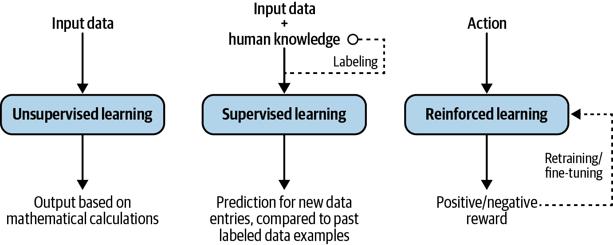
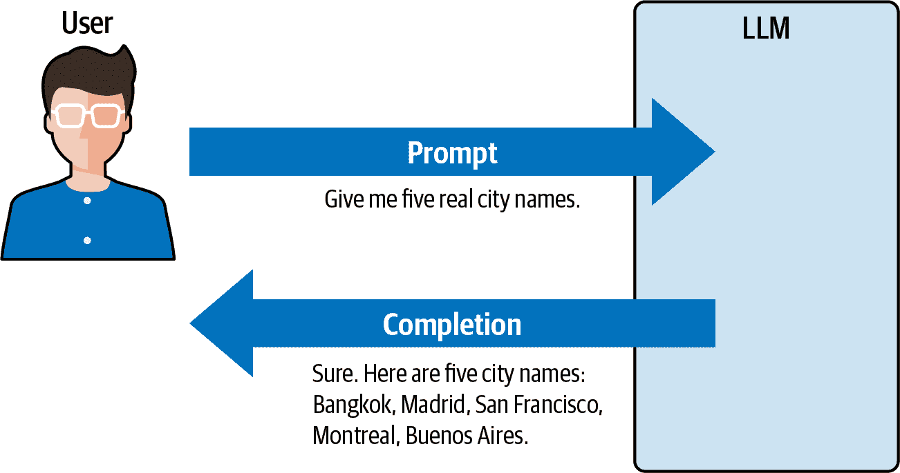
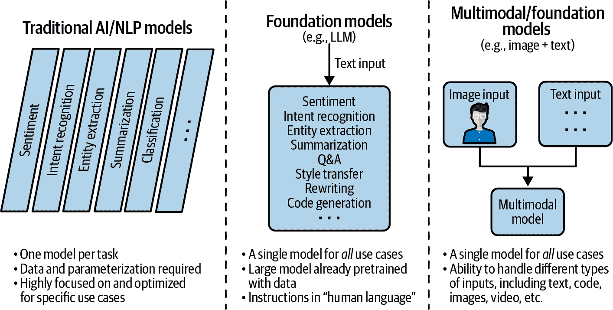
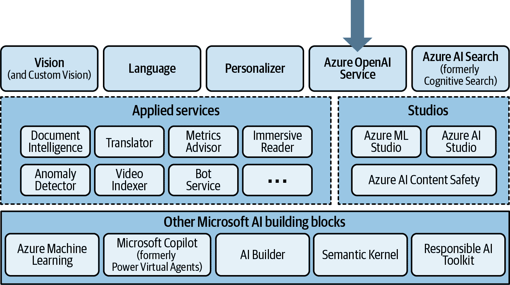
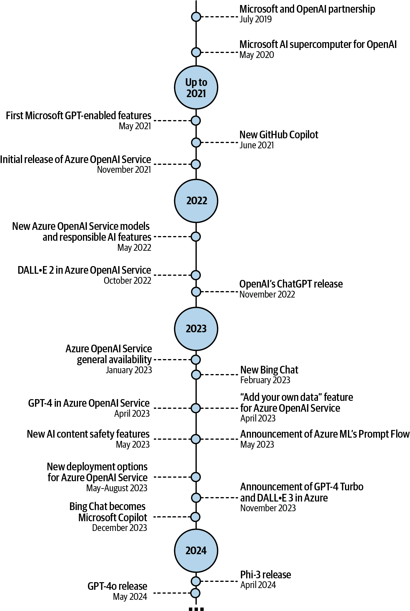
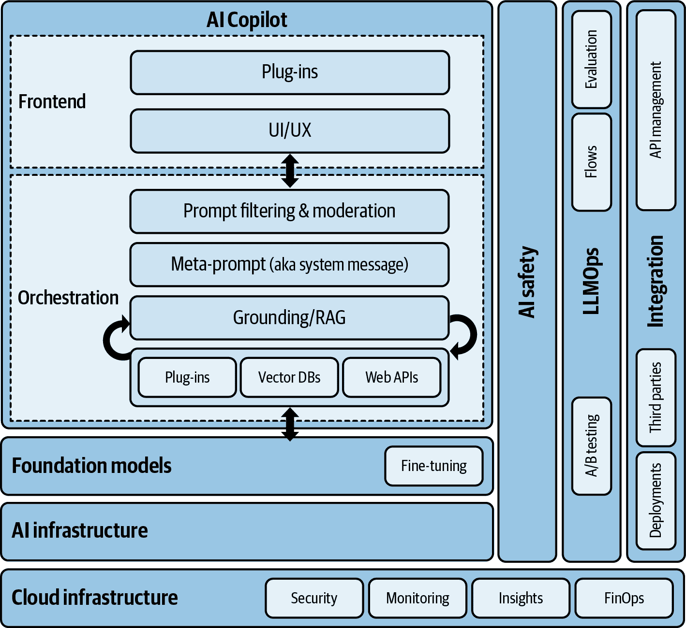

# 第一章：生成式人工智能和 Azure OpenAI 服务的介绍

本章介绍了人工智能（AI）的基础知识，以此将生成式人工智能的新发展置于适当的背景中。它包括一些与技术无关的主题，这些主题对任何类型的实施都很有用，但它侧重于 Azure OpenAI 服务作为实现使用生成式人工智能进行云原生应用程序开发的基石。

# 什么是人工智能？

本节重点关注人工智能技术的历史演变和相关用例，以此揭示人工智能的真实面貌，并将传统方法与新的生成式人工智能技术和能力相连接。

让我们从它的起源开始。术语“人工智能”是在 20 世纪 50 年代提出的。具体来说，约翰·麦卡锡教授在 1955 年将人工智能定义为[“制造智能机器的科学和工程”](https://oreil.ly/hir0l)。也可以说，艾伦·图灵教授之前引入了思考机器的概念。1956 年，达特茅斯学院举办了人工智能夏季研究项目会议，与会者来自最相关的大学和公司。这次会议由麦卡锡教授和其他著名研究人员领导，是人工智能研究领域的开端。从那时起，经历了多次炒作、由于期望过高而导致的失望（通常被称为人工智能冬天，因为对人工智能主题的资助和兴趣减少），以及最终人工智能赋能解决方案的广泛商业化，如个人助理扬声器、智能自动吸尘器等。

话虽如此，在过去二十年里，人工智能经历了很大的发展，但现实是，最初它主要只被一些最大的公司采用，例如微软（不，不一定是为了他们著名的[Clippy](https://oreil.ly/0iNuM)！）、谷歌、亚马逊、优步和其他科技独角兽。这次采用的第一波创造了很好的基础，使他们能够将这些相同的作为托管云服务提供给其他人工智能采用者，这给了他们明显的竞争优势。这开始了我们现在经历的数据和人工智能民主化的阶段，其中较小的公司正在开发或利用人工智能赋能的服务，而这些解决方案已经成为我们日常生活的组成部分。

在深入细节之前，让我们退一步，分析一下今天人工智能的背景，以及它对公司和个人意味着什么。

## 当前人工智能的采用水平

“人工智能采用率”这个术语描述了世界各地组织是正在实施人工智能系统还是利用其他公司的人工智能功能工具。每个公司的采用率实际上取决于多个因素，例如技术成熟度、组织类型（大公司或小公司、公共行政部门、初创公司等）、地理位置等。麦肯锡指出，2022 年（根据他们的[人工智能报告](https://oreil.ly/6GDdZ)）的 AI 采用率为所有受访者的 50%，在国际层面上有有趣的增长，对于发展中国家来说，增长更为显著。此外，他们还估计[生成式人工智能每年可为全球经济增加](https://oreil.ly/4L3JC)相当于 2.6 万亿美元至 4.4 万亿美元的价值。

此外，波士顿咨询集团[定义](https://oreil.ly/mrLCw)了成功水平和人工智能成熟度为内部采用加上组织内部的人工智能知识，只有 20%的组织在人工智能采用方面实际上是先驱。最后但同样重要的是，高德纳[预测](https://oreil.ly/b-x4K)到 2025 年，70%的企业将把人工智能的可持续和道德使用列为他们的首要关注事项，35%的大型组织将设有向 CEO 或 COO 汇报的首席人工智能官。

这些数据表明，即使全球采用率正在提高，公司在使用人工智能的方式以及成功程度方面仍然存在差异。接下来的几节将展示多个具有人工智能功能的系统示例，包括技术和用例层面。

## 人工智能的多种技术

人工智能的定义方式有很多种，但现实是，在人工智能的范畴下，并不只有一种单一的技术。让我们来探索主要的人工智能技术：

机器学习（ML）

一种依赖先进统计模型的人工智能，这些模型通过学习过去的数据来预测未来的情况。以根据现有图片对水果进行分类的简单用例为例。为了向系统描述一个苹果，我们会说它形状略微圆润，颜色是红色、绿色或黄色的多种色调。至于橙子，解释类似，只是颜色不同。然后算法将这些属性（基于过去的例子）作为指导，以便理解每种水果的外观。在接触到越来越多的样本后，它发展出更好的能力来区分橙子和苹果，并在正确识别它们方面变得更加熟练。根据算法类型和任务类型，有大量的机器学习模型，但一些相关的例子包括决策树、k-means 聚类、回归和支持向量机（注意：如果您想探索这一系列人工智能模型，请查看[微软机器学习算法速查表](https://oreil.ly/T7JG9)，它解释了不同模型的任务类型及其数据需求）。

深度学习（DL）

深度学习可以被定义为机器学习的一个子集，其模型依赖于代数和微积分原理。深度学习的独特之处在于，算法使用神经网络来提取输入数据的特点，并根据模式进行分类，从而提供输出，而不需要手动输入定义。这里的关键方面是神经网络。神经网络的灵感来源于它们模仿大脑功能的方式，作为一个执行数学计算的分层系统。神经网络通过多层算法设计来检测模式，通过审查和标记其输出来解释数据。如果我们考虑我们的水果示例，我们不需要提供每种水果的外观属性，而是需要将许多水果图像输入到深度学习模型中。图像将被处理，模型将创建定义，如形状、大小和颜色。

自然语言处理（NLP）

NLP 结合了计算语言学（基于规则的人类语言建模）和统计、机器学习以及深度学习模型。这类模型最初仅限于英语（例如，来自谷歌 AI 的 BERT），但当前的趋势是创建本地版本或多语言模型以支持西班牙语、中文、法语等。话虽如此，NLP 在过去 20 年中经历了巨大的演变。NLP 算法曾经是针对特定任务的，但现代架构使它们能够更好地泛化到不同的任务，甚至获得它们未接受训练的新兴能力。从微软 Azure 的角度来看，Azure OpenAI 服务和[Azure AI Language](https://oreil.ly/b191_)资源都依赖于 NLP 模型。

机器人流程自动化（RPA）

这是一套复制人类代理与视觉界面手动交互的技术。例如，想象你正在人力资源部门工作，每周都需要执行相同的工作，这可能包括通过内部平台检查与员工相关的某些信息，然后填写一些信息，最后发送定制化的电子邮件。RPA 工具易于实施，可以减少浪费的时间，并提高内部效率，因此员工可以专注于增值任务，避免单调的工作。

运筹学（OR）

运筹学是一个非常重要的领域，通常被包括在人工智能技术家族中，与机器学习以及之前提到的强化方法密切相关。蒙特利尔大学[定义运筹学](https://oreil.ly/u_H5h)为：“一个位于计算机科学、应用数学、管理和工业工程交叉路口的领域。其目标是提供基于自动逻辑的决策系统，通常用于控制或优化任务，例如提高工业中的效率或降低成本。”

OR 通常依赖于一系列变量和约束，这些变量和约束引导某种模拟，可用于不同类型的规划活动：管理医院中的有限医疗资源、优化服务时间表、规划能源使用、规划公共交通系统等。

这些是人工智能技术的主要类别，但根据对人工智能含义的解释，这个列表可能会发生变化。无论细节如何，重要的是要记住这些技术作为一组基于特定数据输入进行预测、解释、优化等的能力。现在让我们看看这些不同的 AI 技术如何应用于各种用例，这些用例可能会根据实施方法利用一种技术或结合它们。

## 典型的 AI 用例

无论技术复杂程度如何，都有许多不同类型的 AI 实现，它们的有用性通常取决于组织决定实施的具体用例。例如，一个组织可能会说：“我们希望在账单数据中出现特定模式时自动接收通知”，并开发一些基本的异常检测模型，甚至是一个基本的基于规则的模型，这可以被认为是人工智能。其他人将需要更高级的开发（包括生成式 AI），但它们需要有一个商业理由来支持。

在我们探讨采用公司的技术和商业考虑因素之前，这里有一些 AI 赋能应用的例子：

聊天机器人

你可能非常熟悉聊天机器人——那些嵌入到网站中的小助手，以及允许公司自动化其沟通和客户支持的自动电话机器人。它们基于自然语言处理/语言能力，使它们（以不同水平的成功率）能够理解客户想要或需要的内容意图，因此可以为他们提供初步答案或提示以找到最终答案。它们还可以减轻支持人员回答初步请求的负担，因为聊天机器人可以根据主题分析、过滤和分配案例。主要优势是业务活动的自动化和可扩展性（即用更少的资源做更多的事情），但与复杂任务和信息相关的挑战也存在。话虽如此，随着生成式 AI 的到来，聊天机器人正呈指数级发展，从传统的基于规则的引擎发展到能够适应讨论上下文的动态助手。

计算机视觉系统

依赖于深度学习技术分析图像和视频的图像检测和分类应用。例如，个人设备如笔记本电脑和智能手机就依赖于这种技术，通过你的面部图像来解锁。计算机视觉还支持各种应用的高级视频分析。

欺诈检测

在金融机构中广泛使用，AI 可以帮助检测可能表明对金融资产（如信用卡）某种滥用的不寻常模式，例如，来自远程国家的卡交易、不寻常的购买、反复尝试从 ATM 机取钱等。这些 AI 赋能的系统依赖于不同类型的技术（NLP、行为分析等），使监控更具可扩展性，使人类只需关注关键案例。

基于语音的个人助手

通过智能手机、扬声器、汽车（查看令人惊叹的[梅赛德斯与 Azure OpenAI 的案例](https://oreil.ly/yR55l)）、电视和其他类型的设备集成，这些个人助手通过模拟对话能力与人类用户进行交互。它被广泛用于降低可访问性障碍（即，它使用语音，不需要视觉、书写和阅读能力），并允许用户在激活应用、音乐播放器、视频游戏等特性时解放双手。这些系统也存在与隐私相关的担忧，因为它们可以纯粹以反应方式行事，或者“持续监听”人类的讨论。

营销个性化

对于像谷歌和 Meta 这样的大公司来说，是真正的“造雨者”。首先理解与用户相关的特征（如年龄、位置、偏好等），并将其与广告其产品和服务公司的商业目标相连接，这是现代在线业务的关键特征。营销部门也使用 AI 来细分他们的客户群，并适应这些不同的细分市场。

产品内推荐

Netflix 和 Amazon 等公司根据其对用户需求的了解提供产品内推荐。如果有人寻找体育设备，亚马逊可以推荐相关产品。对于 Netflix 和其他流媒体平台上的电视节目和电影也是如此——他们能够根据你之前观看的内容进行推荐。所有这些都基于客户数据，并且依赖于相对复杂的 AI 模型，我们将在稍后探讨。

机器人

例子包括 Roomba 吸尘器、来自[Boston Dynamics](https://oreil.ly/eVmm5)的令人难以置信的创造，甚至可以跳舞和执行复杂任务，以及人形机器人[Sophia](https://oreil.ly/RjtE9)等。

自动驾驶汽车

这种系统配备了不同的先进技术组合，但其中一些利用了 AI 技术，使汽车能够理解物理环境并适应动态情况。例如，这些车辆可以在没有人类驾驶员的情况下自主驾驶，并且可以根据来自道路和其他车辆的不同的视觉信号做出决策。[特斯拉的 Autopilot](https://oreil.ly/-3AK_)是这一点的绝佳例子。

安全系统

这包括网络和物理安全。与欺诈检测类似，AI 帮助安全系统从数据和指标中识别特定模式，以避免对宝贵资源的未授权访问。例如，[微软安全 Copilot](https://oreil.ly/ISrdc)通过生成 AI 检测隐藏模式，加强防御，并更快地应对事件。另一个例子是能够从视频图像中识别特定情况或对象的 AI 摄像头。

在线搜索

如微软必应、谷歌搜索、雅虎等系统利用大量数据和定制 AI 模型来找到针对特定用户查询的最佳答案。这并不是一个新概念，但我们已经看到，在最近的几年中，随着新的[微软 Copilot](https://oreil.ly/NofXj)和[谷歌 Gemini](https://oreil.ly/Zv5lb)应用的出现，这类系统已经发生了很大的变化。此外，我们将在第三章中看到一些关于生成 AI 和网页搜索应用的示例。

预测性维护

这是一个与工业应用非常相关的案例，它利用不同类型的数据来预测可能需要维护的机械和工业设备的具体问题。这是理解过去数据以生成预测的完美例子，它有助于企业避免潜在问题，并采取积极主动的维护活动。

显然，这些应用可以是跨行业的，或者针对不同行业（例如，农业、医疗保健）的特定应用，但它们依赖于相同的技术组件。现在你已经了解了它们及其典型应用，让我们关注 AI 模型如何学习，因为这将对本书的通用生成 AI 主题相关。

## AI 学习方法的类型

作为人类，我们从婴儿时期开始学习，但我们学习的方式将取决于我们遵循的过程。我们可以通过自己的积极或消极经验自学。我们还可以从成年人的建议中学习，这些成年人之前已经从自己的经验中学习过；这可以帮助我们加速自己的学习过程。AI 模型非常相似，利用先前经验（在这种情况下是数据和模型）的方式取决于 AI 模型学习方法的类型，如图 1-1 所示。

###### 图 1-1\. AI 模型学习类别

让我们逐一分析图中的每个方法：

无监督学习

这基于不需要人类数据标注或支持 AI 模型学习的无监督技术。这类通常依赖于自动计算数据条目之间值的数学运算。它不需要任何形式的标注，但仅适用于特定类型的 AI 模型，包括用于市场营销中客户分段的模型。无监督技术的王者是我们所说的“聚类”，它根据特定的模式和模型参数自动分组数据。

监督学习

监督学习是人工智能实现中非常重要的一种学习方法。在这种情况下，AI 模型不仅使用输入数据，还使用来自人类专家（领域专家或 SMEs）的知识，这些专家可以通过标记输入数据（例如，什么是狗的照片？什么是负面模式？）帮助 AI 理解特定情况。这通常需要某种形式的数据标注，这意味着添加额外的信息（例如，表格型数据集的额外列，一组图片的标签）。一般来说，这是一个手动过程，正确完成它将影响 AI 实现的质量，因为这与数据集本身的质量一样重要。

强化学习

最后但同样重要的是，我们有强化学习（RL）方法。不深入技术细节，主要原则是能够模拟场景，并根据获得的结果向系统提供正面或负面奖励。这种学习模式对于生成式 AI 尤为重要，因为它将*从人类反馈中进行强化学习*（RLHF）应用于 Azure OpenAI 和其他模型。具体来说，[RLHF](https://oreil.ly/RCdKb)根据人类反馈的奖励（即具有特定主题知识的审稿人）进行重新训练。我们将在第三章中探讨细节，因为 RLHF 与 Azure OpenAI 模型的创建高度相关。

模型的学习方法因内部架构、数据源类型和预期结果而异。为了本书的目的，区分和理解高级别的差异很重要，因为我们将参考其中一些在生成式 AI 的上下文中。

生成式 AI 将长期存在，Azure OpenAI 服务已经是采用和民主化的关键因素。现在让我们探讨生成式 AI 的基本原理，了解它是如何工作的以及它能为您和组织带来什么。

# 关于生成式 AI

“生成式 AI”这个术语指的是人工智能领域，它专注于创建具有生成新内容能力的模型和系统，例如图像、文本、音乐、视频、图表等。

如您可能已经知道，这个术语在近年来已经获得了很大的相关性，但它并不新鲜。我们可以在 20 世纪 90 年代谈论概率模型，例如潜在变量模型和图模型，它们旨在捕捉和生成数据分布。此外，深度学习在生成对抗网络（GANs）和变分自编码器（VAEs）等形式的最新进展，对生成式人工智能的普及和进步做出了重大贡献。

随着研究人员、公司和从业者开始探索这些技术生成逼真和创造性输出的潜力，“生成式人工智能”这一术语开始流行起来。结果现在很明显，因为人工智能涵盖了广泛的应用和技巧，包括图像合成、文本生成、音乐生成等。显然，这是一个不断发展的领域，学术界和工业界都在持续创新。

如您在图 1-2 中可以看到，生成能力可以被视为其他现有类型人工智能技术的扩展，这些技术更多地倾向于描述、预测或规定数据模式，或者优化特定场景。高级人工智能技术，包括运筹学和生成式人工智能，使采用者能够从“只有洞察”过渡到自动决策和行动。

###### 图 1-2\. 人工智能能力类型

从技术角度来看，这些模型以非常特别的方式工作。它们不是“仅仅”预测数据条目（例如，预测特定客户的理想保险费率）的某种模式，而是对特定指令生成多个结果。与生成式人工智能模型的交互以问答方式进行，这包括来自人类（基于自然语言指令）的直接指令和自动化操作。

“提示工程”这一术语最近在自然语言处理和语言模型开发背景下出现。虽然没有具体的起源或确切的时间点来界定这一术语的诞生，但它作为一种描述设计和完善提示以从语言模型中引发所需响应的过程而变得流行。

提示工程涉及精心设计提供给语言模型的指令或输入，以实现所需的输出。这包括选择合适的措辞、结构和上下文，以引导模型生成所需的响应或完成特定任务。目前有持续的努力去开发设计有效提示的系统方法，针对特定任务微调模型，以及减轻语言生成中的偏见或不良行为。

从之前提到的问答动态来看，如图图 1-3 所示，*提示*是问题，而*完成*是答案。在 NLP（自然语言处理）和语言模型的背景下，“完成”一词指的是生成或预测文本以完成给定的提示或输入。随着像 OpenAI 的 GPT 这样更大、更强大的模型的发展，“完成”一词被更广泛地使用。总的来说，“完成”一词在语言模型中的出现源于语言建模领域的演变，反映了模型生成或预测文本以填补或完成给定上下文或提示的能力。

###### 图 1-3\. 提示和完成

生成式 AI 是一种新型人工智能，其广泛采用的主要优势是能够通过自然语言提示和完成来启用用户与生成式 AI 模型之间的通信。这是一个变革性的变化，但现在让我们看看我们可以从这些模型中获得的主要功能。

## 生成式 AI 的主要功能

诚然，语言和基于文本的信息是生成式 AI 的关键方面。然而，基于语言的提示可以服务于其他目的。公司和研究人员正在努力探索几个方向：

语言

除了核心的 ChatGPT 型功能，即 AI 模型与人类用户之间的问答之外，还有一些其他相关任务依赖于语言学，但更进一步。如果你可以使用语言作为以下内容的创作催化剂：

代码

技术上，编程语言只是……一种语言。LLMs 擅长处理英语或西班牙语，但它们也擅长理解和生成代码，处理 Java、Python 或 C++就像处理任何其他口语语言一样。这可能不太直观，但将编程语言视为任何其他语言是有道理的。这正是生成式 AI 所做的事情。

旋律

基于音符，LLMs（大型语言模型）可以像生成常规句子一样生成旋律。在这个领域，生成式 AI 的潜力尚未完全探索，但它为音乐创作显示出了有希望的结果。

歌词

另一个语言学例子，歌词可以根据通过提示解释的特定标准构建，用户可以指定单词类型、灵感、风格等。

图片

图像创建背后的原理出人意料地直观：写下潜在图像的描述（使用简单的自然语言），将其作为“提示”的一部分，然后等待生成式 AI 引擎根据其对先前消耗的图像的解释返回一个或多个与该提示匹配的结果。这种能力对于创意和营销活动非常有意思，在这些活动中，专业人士可以利用图像生成工具作为灵感的来源。一个很好的例子是[Microsoft Designer](https://oreil.ly/oIRon)，或者 Microsoft Copilot 的图像创建功能。

音频

想象一下一种技术，它允许你录制自己的声音几分钟，然后根据你想要的任何目的进行复制和复制。某种可扩展的语音许可，利用音频数据来检测模式并模仿它们。甚至有系统可以生成音乐和其他声音（例如，通过[微软 Copilot 与 Suno 的 AI 音乐创作集成](https://oreil.ly/5ltEG)）。

视频

就像图像生成一样，输入可以是一个描述特定场景的提示，包含不同级别的细节，模型将根据这些细节提供视频场景。一个很好的例子是 OpenAI Sora。

其他

生成能力不仅限于这些格式和类型的数据。实际上，有生成式 AI 应用可以创建合成数据，生成化学化合物等。

这些只是生成式 AI 提供的一些功能。它们相当令人印象深刻，但绝对不是新 AI 时代的最后一步，因为有一些非常相关的参与者确保了这一点。让我们看看下一轮的主要竞争者是谁。

## 相关行业参与者

虽然这本书主要关注 Azure OpenAI 服务，这与微软和 OpenAI 都有关联，但了解生成式 AI 的竞争格局非常重要。正如你所知道的那样，这个领域正在见证重大的进步和竞争。研究人员和机构正在积极工作，开发创新模型和算法，以推动生成式 AI 能力的边界。以下是一些加速竞争的相关参与者示例：

[OpenAI](https://oreil.ly/xSlss)

可能是生成式 AI 浪潮中最重要的一员。该公司创建了专有工具，如 ChatGPT，以及其他开源项目，如[Whisper](https://oreil.ly/9si-P))。OpenAI 的起源可以追溯到 2015 年 12 月，当时它由埃隆·马斯克、山姆·奥特曼、格雷格·布鲁克曼、伊利亚·苏茨克维、约翰·舒尔曼和沃伊切赫·扎伦巴作为非营利组织成立。他们的[使命](https://oreil.ly/yRGrR)是确保通用人工智能（AGI）造福全人类。

OpenAI 最初专注于在人工智能领域进行研究和发表论文，以促进知识共享和协作。2019 年，OpenAI 创建了一个名为 OpenAI LP 的营利性子公司，为其雄心勃勃的项目筹集额外资金。公司的目标是开发和部署安全、有益且符合人类价值观的 AGI。他们旨在构建尖端 AI 技术，同时确保其负责任和道德地使用。他们已经使不同类型的 AI 模型获得民主化访问：

+   *对话式 GPT 模型*，以其知名的[ChatGPT 应用](https://oreil.ly/HUWak)而闻名，该应用依赖于 AI 语言模型。它基于 GPT（生成式预训练转换器）架构，这是以生成类似人类文本和参与对话互动而闻名的最先进语言模型的基础。ChatGPT 旨在理解和生成自然语言响应，使其非常适合基于聊天的应用。它已经在互联网上大量多样化的文本数据上进行了训练，使其能够获取知识并生成连贯且与上下文相关的响应。

+   *生成式 AI 模型*，用于文本（[GPT-4o](https://oreil.ly/c2NvZ)、[GPT-4](https://oreil.ly/0SY9B)以及其他），代码（[Codex](https://oreil.ly/ZAbMD)），图像（[DALL·E 3](https://oreil.ly/C9seS)），以及视频（[Sora](https://oreil.ly/ppSjf)）。其中一些模型可通过 Azure OpenAI 服务获得，正如我们在第三章中将要看到的。

+   *最先进的语音转文本模型*，例如[Whisper](https://oreil.ly/9si-P)，作为一个开源仓库提供，同时也作为 OpenAI 的[付费 API](https://oreil.ly/DbmUg)。此外，Whisper 模型也通过[Microsoft Azure](https://oreil.ly/qKUO5)提供。

[微软](https://oreil.ly/lYMby)

除了 OpenAI，另一个关键角色和最早采用生成式 AI 技术的公司之一，这得益于对 OpenAI 的多百万美元投资以及[两家公司之间的合作](https://oreil.ly/hvKP2)。除了本书的主要主题 Azure OpenAI Service（我们将在接下来的章节中深入探讨）之外，微软还将 LLM（大型语言模型）作为其技术栈的一部分，为他们的所有生产力解决方案和云解决方案创建了一系列 AI 协同助手，包括 Microsoft Copilot。此外，他们发布了[小型语言模型（SML）Phi-2](https://oreil.ly/FW-xG)和[Phi-3](https://oreil.ly/vQTnL)，从大小/性能的角度为行业设定了新的标准。我们将在接下来的章节中探讨更多细节，但公司的战略已经转变为以 AI 为先，大量关注生成式 AI，并持续推出新产品、平台、功能和集成。

[Hugging Face](https://oreil.ly/CGiU7)

Hugging Face 是一家专注于自然语言处理和机器学习的技术公司。它以开发 Transformers 库而闻名，该库为训练、微调和部署各种自然语言处理模型提供了一个强大且灵活的框架。Hugging Face 的目标是民主化和简化对最先进自然语言处理模型和技术的访问。它由 Clément Delangue 和 Julien Chaumond 于 2016 年创立。最初，公司作为一个开源项目启动，旨在创建一个由社区驱动的平台，用于共享自然语言处理模型和资源。他们的 Hugging Face Hub 是一个用于共享和访问预训练模型、数据集和训练流程的平台。该平台使用户能够轻松地将各种自然语言资源集成到自己的应用程序中，使其成为开发人员和研究人员宝贵的资源。除了开源贡献外，Hugging Face 还提供商业产品和服务的支持。他们的模型可通过 Azure AI 获取，得益于两家公司之间的[企业合作](https://oreil.ly/eR8a0)。

[Meta](https://oreil.ly/aHn9W)

Meta（原名 TheFacebook 和 Facebook）是一家专注于社交媒体、数字通信和技术平台的多国科技公司。它最初由马克·扎克伯格、爱德华多·萨维林、安德鲁·麦科卢姆、达斯汀·莫斯科维茨和克里斯·休斯于 2004 年创立。近年来，他们建立了一个非常强大的组织人工智能结构，拥有相关的人工智能研究人员和有意义的开源人工智能贡献。他们发布了几个模型，包括他们最新的大型语言模型 [Llama 3](https://oreil.ly/Mfau4) 和 [CodeLlama](https://oreil.ly/GBRM1)，这是一个有趣的数据中心选项，性能良好（基于行业基准），并且比其他现有解决方案的计算需求更低。最新的模型也[可通过](https://oreil.ly/hpI6k) Microsoft Azure 获取，通过 Azure AI Studio 提供的新功能[进行微调和评估]，作为 Meta 与 Microsoft 的独家合作的一部分，将 Microsoft Azure 定位为 Meta 模型的[首选云服务提供商](https://oreil.ly/ehdf3)。

[Mistral AI](https://oreil.ly/C4PM4)

一家专注于人工智能的法国公司。它于 2023 年 4 月由曾在 Meta 和 Google DeepMind 工作的研究人员创立。Mistral AI 专注于开发生成式语言模型，并因其对开源软件的承诺而脱颖而出，与专有模型形成对比。他们的专家混合（MoE）模型为较小的语言模型设定了标准，并且[可通过 Azure AI 模型目录](https://oreil.ly/t-MkN)获取，包括[ Mistral Large](https://oreil.ly/SU0PT) 模型。

[Databricks](https://oreil.ly/l9hDi)

一个数据智能平台（作为 [Microsoft Azure 上的原生服务](https://oreil.ly/7P_jM)提供），他们发布了自己的 LLM，包括一个由他们自己的员工训练的初始开源模型 Dolly 2.0，以及第一个用于商业目的的开源 LLM。在 2024 年，他们发布了 [新的 DBRX 模型](https://oreil.ly/XBH44)（基础和指令版本），也 [通过 Azure AI 模型目录](https://oreil.ly/WITi2)提供。

[Google](https://oreil.ly/39CFk)

Google 是另一家主要竞争对手，也是最具相关性的 AI 创新者之一。其 Google Cloud Platform (GCP) 在 Google Workspace 和 G-Suite 中引入了新的 AI 功能，而 Google Cloud 的 Vertex AI 平台则用于大规模构建和部署机器学习模型和 AI 应用。与 Microsoft Azure 类似，Google Cloud 提供了工具，使开发者更容易在其云中使用生成式 AI 和新的 AI 功能，包括访问低代码生成式 AI 工具。最后，Google 发布了 [Gemini](https://oreil.ly/FZ8NN)（之前称为 Bard）作为他们对抗 OpenAI 的 ChatGPT 和 Microsoft Copilot 的替代品。

[NVIDIA](https://oreil.ly/mwSlg)

生成式 AI 的先驱，提供全栈平台，使解决复杂挑战的创新和创造力成为可能。他们的平台包括加速计算、基本 AI 软件、预训练模型和 AI 工厂。从微软的角度来看，两家公司之间的合作正在增长，包括在微软 Azure 上提供他们的 [生成式 AI 工厂服务](https://oreil.ly/Ge8X7)，以及 [将 NVIDIA AI 模型](https://oreil.ly/OPGhp)纳入 Azure AI 模型目录。

[Anthropic](https://oreil.ly/SmS4F)

由前 OpenAI 员工创立的 AI 公司。他们也有自己的 ChatGPT 风格的机器人 [Claude](https://oreil.ly/AeNhS)，它可以通过他们的开发者控制台中的聊天界面和 API 访问。Claude 能够执行各种对话和文本处理任务，同时保持良好的可靠性和可预测性。他们的 [Claude 模型](https://oreil.ly/df896)可通过 API 获取。

[Amazon Web Services (AWS)](https://oreil.ly/CaxMP)

AWS 在发布生成式 AI 相关产品方面花费了一些时间，但他们最近宣布了他们的 AWS Bedrock 平台，这是一个基础 AI 服务，可以直接连接到生成式 AI 模型。他们提供自己的模型，以及来自第三方如 Cohere 或 Anthropic 的模型。

[IBM](https://oreil.ly/z0XDj)

IBM 宣布了他们的新 WatsonX 平台，该平台包括他们的模型目录、实验室/游乐场环境和 API 启用的集成。

[Cohere](https://oreil.ly/rDW3b)

一家以 LLM 为首的公司，提供自己的语言模型，以及他们的 Coral 生产力聊天机器人，该机器人作为公司的知识助手。

您可以在图 1-4 中看到生成 AI 市场的指数级演变，以及按公司划分的新模型时间线，特别是在 2022 年 ChatGPT 发布之后，2023 年充满了模型和平台的发布。

###### 图 1-4\. 简化的生成 AI 时间线

这个时间线是对不同开源团队和其他公司进步和发布的极大简化版本。有关更多详细信息，[AI 状态报告](https://oreil.ly/UwMhc)和[斯坦福 AI 指数报告](https://oreil.ly/GDYK7)都包含大量关于研究和商业模型以及其他相关参与者的详细信息，我们在这里没有提及。生成 AI 创新的列表肯定会在接下来的几个月和几年中演变，并且现有模型如 Meta 的 Llama 3 和 OpenAI 的 [GPT-4 和 GPT-4o](https://oreil.ly/3GPA5) 的未来实施可能会专注于模型的效率。

现在，让我们看看为什么生成 AI 是一种特殊的人工智能，并解释一个称为基础模型的新概念，这是与传统语言模型比较时的关键区别。

## 基础模型的关键作用

生成 AI 完全颠覆的原因有几个。其中之一是对从未见过的性能水平的感知。使用普通语言进行交互，发送我们的指令并解释结果的能力是另一个原因。然而，生成 AI 能够提供我们今天看到的价值的根本方面之一是 *基础模型* 的概念。

基础模型是使用大量信息（例如，LLMs）预先训练的基模型，能够执行非常不同的任务。这是新的，因为传统的 AI/NLP 模型专注于单一任务，每个任务一个特定模型（例如，语言翻译）。

例如，Azure OpenAI 模型如 GPT-4 和 GPT-4o 可以通过利用单个模型完成许多事情。它们可以执行与特定生成能力相关的各种任务，例如文本/语言，并帮助您分析、生成、总结、翻译、分类等，只需一个模型即可。除此之外，如果模型能够同时处理不同类型的输入，如文本和图像，它们就被称为 *多模态模型*（例如，[GPT-4V](https://oreil.ly/kDBF5)）。您可以在图 1-5 中看到主要差异。

这种灵活的方法为开发新的用例提供了多种选择，你将在后面的章节（第二章和第三章）中看到 Azure OpenAI 如何简化这些基础模型的配置、测试和部署。但它在人工智能颠覆方面代表了什么？让我们首先看看为什么生成式人工智能和像 OpenAI 这样的公司近年来受到了如此多的关注的一个基本原因。

###### 图 1-5\. 传统人工智能与基础模型

## 通往通用人工智能之路

在我们深入本书的核心部分之前，将所有这些创新置于人工智能的一般状态和当前关于 *通用人工智能*（AGI）的讨论中是很重要的，这是由于 GPT-4 和其他 LLMs 的意外能力。

你可能记得一些电影中的参考，很多人想象的人工智能——天网、奥创、*《我，机器人》* 等。它们都展示了一种某种优越的智能，通常由强大且危险的类人机器人代表，这些机器人随着时间的推移而进化，并计划以某种方式取代甚至毁灭人类种族。好吧，即使这本书的目的不是展示对人工智能及其能力的一种天真看法，我们也将从揭示和阐明人工智能当前的发展水平开始，以便每个人都能了解我们现在处于什么位置，以及人工智能系统的现实期望是什么。为此，以下是三种类型的 AI，根据它们的范围和智能水平：

窄人工智能

当前人工智能系统和技术所提供的类型的能力。基本上，这是一种能够获取大量过去数据的 AI，然后基于这些数据生成预测，用于非常具体的任务，例如，从新的图像中检测物体，从音频声音中识别人等。

通用人工智能（或人工通用智能）

人工智能研究人员和公司的下一个目标。想法是推广 AI 的训练过程和它产生的知识，并在其他领域利用这些知识。例如，我们如何让一个 AI 赋能的个人助理意识到不断变化的环境？然后适应之前的学习以应对新情况？这在今天并不是 100%可行的，但可能在某个时刻发生。

超级人工智能

电影和书籍不断展示的那种人工智能。其能力（认知、物理等）远超人类，理论上可以超越他们。然而，这种超级智能目前是对人工智能可能成为的未来的一个未来愿景。这仍然不可行，可能在未来几年甚至几十年内都不会发生（这个观点会根据你问的人而有所不同）。

回到生成式人工智能的话题，当前的讨论集中在当前的人工智能阶段或类型上。但真正的问题是，我们是否仍在谈论窄人工智能？我们是否正在接近通用人工智能？鉴于基础模型在执行各种任务方面的新水平的表现和灵活性，这是一个合理的问题。无论答案（可以从技术到哲学）如何，现实是，生成式人工智能总体上，特别是 Azure OpenAI 服务，正在提供我们以前从未梦想过的能力。

微软团队对 GPT-4 模型的能力进行了[早期分析](https://oreil.ly/rhEVW)，探讨了基础模型之间的关系，并谈论了“接近人类水平的表现”和“AGI 系统的早期版本”。此外，像 OpenAI 这样的公司已将[追求 AGI](https://oreil.ly/vTgyJ) 定为其主要目标之一。

我们已经涵盖了与生成式人工智能主题相关的所有基础知识，包括从传统人工智能的演变、最近的发展，以及围绕性能和生成式人工智能影响的持续讨论。现在，让我们深入了解 Azure OpenAI 服务，特别关注其背后的故事和核心功能。

# 微软、OpenAI 和 Azure OpenAI 服务

微软，作为主要的技术巨头之一，以及相对较年轻的 AI 公司 OpenAI，在近年来合作并共同努力创造了令人印象深刻的技术，包括人工智能超级计算机和大型语言模型。这一合作的主要方面之一是创建 [Azure OpenAI 服务](https://oreil.ly/oZT0k)，这是本书的主要原因，它是一个提供现有 OpenAI 服务和 API 的企业级 PaaS 认知服务，并增加了云原生安全、身份管理、内容审查和负责任的人工智能功能。

公司间的合作在 2023 年变得更加知名，但现实是，它经历了几个阶段，在技术和商业层面都取得了非常重要的里程碑：

+   这始于 2019 年，当时微软宣布对 OpenAI 投资 10 亿美元，以帮助其推进人工智能研究活动并创造新技术。

+   2021 年，他们宣布了另一层次的合作伙伴关系，利用 Azure 的超级计算机构建大规模人工智能模型。

+   2023 年 1 月，他们通过多年的、数十亿美元的投资宣布了其长期合作伙伴关系的第三阶段，以加速人工智能突破，确保这些好处能够广泛地与世界共享。

显然，这一合作伙伴关系的每一步都加深了双方的合作水平及其影响。主要工作领域如下：

生成式人工智能基础设施

构建新的 Azure 人工智能超级计算技术，以支持 OpenAI 和微软生成式人工智能应用的扩展应用，并将现有的 OpenAI 服务移植到微软 Azure 上运行。

管理生成式 AI 模型

将 Microsoft Azure 打造为通过 Azure OpenAI 服务商业化新 OpenAI 模型的首选云合作伙伴，对于您作为采用者来说，这意味着任何 OpenAI 模型都可以通过 Microsoft Azure 获取，作为云中的原生企业级服务，除了现有的 [OpenAI APIs](https://oreil.ly/v-HE1)。

Microsoft Copilot 产品

在接下来的几页中，我们将看到，微软通过创建能够帮助用户执行复杂任务的 AI 联合飞行员，将 AI 嵌入到其产品套件中。

此外，Azure OpenAI 服务并非微软的唯一 AI 服务，它是 Azure AI 套件（如图 图 1-6 所示）的一部分，该套件包括一系列高级功能的 PaaS 选项，这些功能可以协同工作并交互以创建新的 AI 功能解决方案。

###### 图 1-6\. Azure OpenAI 服务和其他 Azure AI 服务

我们将在第三章和第四章中提到一些这些构建块，因为大多数这些服务都与 Azure OpenAI 服务无缝交互，具体取决于预期的解决方案架构。但这是一个高度发展的领域，图 1-7 展示了最近几个月和几年中关键的 [Azure OpenAI 突破](https://oreil.ly/5zqx_) 时间线。

###### 图 1-7\. Azure OpenAI 服务时间线

如果您想了解更多关于合作起源和最初发展的信息，与微软首席技术官 Kevin Scott 和联合创始人（以及前首席执行官）Bill Gates 的这个 [播客节目](https://oreil.ly/uGSH_) 非常有趣，并解释了这一切是如何开始的。

## AI 联合飞行员的兴起

作为其 AI 功能产品的一部分，微软正在推广 *AI 联合飞行员* 的概念。他们是配备微软 AI、OpenAI 的 GPT 模型和其他生成式 AI 技术的个人助理，旨在协助用户完成任务和目标，但不是为了取代人类及其工作。联合飞行员与用户并肩工作，基于 AI 提供建议、见解和行动。用户始终拥有控制权，可以选择接受、修改或拒绝联合飞行员的输出。从视觉角度来看，联合飞行员通常位于屏幕的右侧，微软已将它们包含在几个解决方案中：

GitHub Copilot

一个 [AI 驱动的代码伴侣](https://oreil.ly/KanxU)，帮助开发者更快地编写更好的代码。它根据代码和注释的上下文，在编辑器内建议整个行或整个函数。GitHub Copilot 由 GPT-4（之前由 [OpenAI Codex](https://oreil.ly/ZAbMD) 支持，现已弃用）提供动力，这是一个可以生成自然语言和计算机代码的系统。GitHub Copilot 是原始案例，也是微软套件中的第一个联合飞行员。

Bing Chat/Microsoft Copilot

一个 [帮助用户在网络上查找信息、获取答案并完成任务的对话式 AI 服务](https://oreil.ly/gI9u1)。它使用 GPT 模型，可以根据用户输入产生自然语言响应。用户可以使用文本或语音在浏览器或 Bing 应用程序中与 Bing Chat 进行聊天。这是第一个将生成式 AI 功能纳入基于对话讨论的搜索引擎，现在重新命名为 Microsoft Copilot。

Microsoft 365 Copilot

一个 [为工作提供 AI 驱动的副驾驶](https://oreil.ly/EQmLe)，帮助用户释放创造力、提高生产力和提升技能。它集成了 Microsoft 365 应用程序，如 Word、Excel、PowerPoint、Outlook、Teams 和 Business Chat。它还利用 LLMs（如 Azure OpenAI GPT-4）根据自然语言命令生成内容、见解和操作。

Windows Copilot

一个为 Windows 11 提供升级的 [AI 助手](https://oreil.ly/uJSZC)，帮助用户轻松采取行动并完成任务。它集成了 Bing Chat、Windows 功能和第三方应用程序。用户可以使用自然语言命令与 Windows Copilot 进行交互。

Fabric 和 Power BI Copilot

一个为 Microsoft Fabric（湖屋平台）和 Power BI 提供的 [生成式 AI 界面](https://oreil.ly/Ipshc)，用于自动化报告。

Security Copilot

一个 [AI 驱动的安全解决方案](https://oreil.ly/aKBXf)，帮助用户保护他们的设备和数据免受网络威胁。它使用 AI 检测和预防恶意软件、网络钓鱼、勒索软件和其他攻击。它还根据用户的行为和偏好为用户提供安全提示和建议。

Clarity Copilot

一个 [将生成式 AI 集成到 Microsoft Clarity](https://oreil.ly/5MgnN) 的功能，这是一个帮助用户了解其网站上用户行为的分析工具。它允许用户使用自然语言查询其 Clarity 和 Google Analytics 数据，并获得简洁的摘要。它还使用 AI 从会话回放中生成关键要点。

Dynamics 365 Copilot

一个 [将下一代 AI 带入传统客户关系管理 (CRM) 和企业资源规划 (ERP) 解决方案的功能](https://oreil.ly/AVM6q)。它帮助用户优化业务流程，提高客户参与度，并增加收入。它利用 LLMs（如 OpenAI 的 GPT-4）根据自然语言命令生成见解、建议和操作。

其他

Power Platform Copilot、Microsoft Designer（一种具有生成式 AI 提示界面的视觉设计软件即服务 [SaaS]）以及用于低代码生成式 AI 实现的新 [Copilot Studio](https://oreil.ly/iq_fU)。

总结来说，微软为其产品系列发布了一系列 AI 共飞行员，现实情况是 Azure OpenAI 服务是*创建您自己的共飞行员*的关键部分。我们将分析云原生应用程序的 AI 共飞行员的构建块（例如，新术语如插件和编排器），但您可以在图 1-8 中看到微软在 2023 年 Microsoft Build 上展示的“AI 共飞行员”[分层架构](https://oreil.ly/jGrqE)的改编版本。

###### 图 1-8\. 现代 AI 共飞行员技术堆栈（来源：改编自微软的一张图片）

如图中所示，AI 基础设施和基础模型只是方程的一部分。开发现有和新应用的 AI 共飞行员需要云原生架构和特定的生成式 AI 组件，这正是我们在第 2、3 和 4 章中将要讨论的内容。但在那之前，让我们探索 Azure OpenAI 的高级功能和典型用例。

## Azure OpenAI 服务功能和用例

我们现在将重点关注 Azure OpenAI 启用系统的核心功能和潜在用例，然后再讨论架构和技术考虑因素。考虑到基础模型的灵活性，很容易想象 Azure OpenAI 模型的多重应用。让我们在表 1-1（还有更多，但你可以将其作为你初始用例构思的基准）中探索主要功能，这些功能与我们之前在本章中看到的一致。

表 1-1\. 主要 Azure OpenAI 服务功能和用例

| 类型 | 功能和示例 |
| --- | --- |
| **语言** | 内容生成/分析 | 文本生成 | 使用动态格式和内容自动创建短信 |
| 主题分类 | 根据内容检测书籍主题，用于自动标记 |
| 情感分析 | 从社交媒体评论中检测情感以检测痛点 |
| 实体提取 | 从特定信息中找到关键主题 |
| 调用 API | 生成 API 调用并将其与其他系统集成 |
| 主题专家文档 | 基于书籍或存储库创建基于角色的文档 |
| 机器翻译 | 按需网站翻译 |
| 技术报告 | 基于数据库和其他信息生成报告 |
| 代理辅助 | 为客户代理提供逐步、动态的蓝图 |
| 摘要 | 书籍摘要 | 以特定格式和部分对长文档（例如，书籍）进行摘要 |
| 竞争分析 | 从两家公司中提取关键因素以进行竞争分析 |
| 社交媒体趋势分析 | 关键词趋势的总结以及与在线新闻的关联 |
| 阅读理解 | 使用更简单的语言重新表述关键主题 |
| 搜索 | 网络结果 | 对互联网主题的语义搜索 |
| 社交评论搜索 | 从互联网社交评论中详细搜索特定主题 |
| 知识挖掘 | 从同一主题的不同来源中提取知识 |
| 文档分析 | 搜索特定文档的关键主题和其他相关术语 |
| 自动化 | 索赔管理 | 自动结构化基于文本的信息，以 JSON 文件的形式发送 |
| 财务报告 | 基于社交媒体总结、数据库中的数据以及最终报告及其分发的自动化季度报告 |
| 自动响应用户 | 自动语音启用答案或 Level 1 支持的聊天机器人讨论 |
| **编码** | 从自然语言到编码语言 | 根据自然语言指令生成 Java 循环 |
| 编码建议 | 开发工具的实时编码建议 |
| 自动评论 | 基于书面代码的自动评论生成 |
| 重构 | 自动化代码改进 |
| 代码翻译 | 将一种编程语言翻译成另一种编程语言 |
| 自然语言中的 SQL 查询 | 自然语言中的数据库查询 |
| 代码审查 | 带有 AI 的配对审查 |
| 提交请求信息 | 自动化提交请求评论 |
| 文本 JSON 化 | 将纯文本转换为具有特定参数的 JSON 文件 |
| **图像** | 创意构思 | 与特定主题相关的随机图像生成 |
| 播客和音乐播放列表图像 | 基于播客脚本或音乐歌词生成图像 |
| 内容分发 | 为合作伙伴营销提供的材料 |
| 超个性化 | 基于用户上下文的视觉定制 |
| 营销活动个性化 | 基于用户细分、主题等营销活动的视觉效果 |

这些只是 Azure OpenAI 服务模型多种能力的几个示例。它们可以与其他服务结合使用，模型也可能不断发展，因此不要放弃音频或视频生成的场景。

无论能力类型和用例如何，Azure OpenAI 服务都可以为不同类型的场景提供支持：

Completion

完成功能用于生成完成给定提示的内容。你可以将其视为预测或继续一段文本的一种方式。完成功能通常用于内容生成、编码辅助、故事写作等任务。

Chat

聊天场景旨在模拟对话，允许与模型进行来回交流。用户不是提供一个单一的提示并得到续篇，而是提供一系列消息，模型会相应地回应它们。聊天场景（如驱动 ChatGPT 的场景）对于交互式任务非常有用，包括但不限于辅导、客户支持和当然，日常闲聊。

嵌入

我们将在第二章结束时探讨嵌入的概念，但它们基本上允许我们从文档和其他来源中消费特定的知识。我们将在第三章的几个场景中利用这种能力。

所有这些示例背后的动态是相同的。Azure OpenAI 是一个基于云消耗的 PaaS 平台。与其他基于交互次数计费的其他云服务或 API 不同，Azure OpenAI（以及其他商业 LLM 平台）根据一种称为“tokens”的新概念来衡量服务使用情况。让我们看看这是怎么回事。

## LLM Tokens 作为新的计量单位

从一般意义上讲，云和 SaaS 提供商使用非常多样的方式来计费他们的服务，从固定的月费和按量折扣的使用层到非常细粒度的计量单位，如字符、单词或 API 调用。

在这种情况下，生成式 AI 采用了*tokens*的概念，这是一个[一组单词或字符](https://oreil.ly/Vy9ny)，我们用它来分割基于文本的信息。tokens 单位用于两个目的：

+   对于*消耗*，用于计算配置和与 Azure OpenAI 模型的交互成本。任何 API 调用、发送给模型的提示（文本请求）以及 Azure OpenAI 提供的完成（答案）都遵循此单位。[服务定价](https://oreil.ly/7Gmq6)基于每 1,000 个 token 的成本，并且取决于模型类型（GPT-3.5 Turbo、GPT-4、GPT-4o、DALL·E 3 等）。

+   对于*容量*，在模型和服务层面：

    +   *Token 限制*，这是我们可以传递给任何 Azure OpenAI 模型（以及一般生成式 AI 模型）的最大输入。例如，GPT-3.5 Turbo 提供两种选项，4K 和 16K token 限制，而 GPT-4、GPT-4 Turbo 和 GPT-4o 达到 128K。这可能会在未来几个月和几年内发生变化。有关最新信息，请访问[模型可用性](https://oreil.ly/BI5Ue)页面并检查“最大请求（Tokens）”列。

    +   *服务配额*，这意味着任何 Azure OpenAI 模型在特定资源、配置和用量水平下的最大容量。这也是不断发展的信息，可以通过[官方文档](https://oreil.ly/wwpp8)和 Azure OpenAI Studio 的[配额部分](https://oreil.ly/ONn5Q)获取。这些限制对于任何部署计划都很重要，具体取决于应用程序的类型（例如，如果我们计划部署面向大量企业对消费者[B2C]应用程序的服务）。此外，还有一些[最佳实践](https://oreil.ly/Dv9qf)来处理这些限制。

特定数量的标记取决于单词数量（其他提供商根据字符而不是单词来计算标记），但也取决于它们的长度和语言。一般规则是，1,000 个标记大约相当于英语中的 750 个单词，但 OpenAI 解释了[具体方式](https://oreil.ly/tMYF_)来根据情况计算标记。此外，您始终可以使用 Azure OpenAI 游乐场或 OpenAI 的[分词器](https://oreil.ly/DDQHG)来根据输入文本计算特定的标记估计。

# 结论

这第一章包含了与人工智能和生成式人工智能相关的入门级信息，以及对 Azure OpenAI 主题的初步介绍，包括最新发展、主要功能、典型用例，以及它作为您自身生成式人工智能开发的人工智能协同工作者的价值。

根据您的背景，这些信息可能只是 101 入门级介绍，但 Azure OpenAI 服务背后的概念，即使它们是新的并包含一些新术语，也可能像看起来一样简单——一个托管 PaaS，将允许您部署自己的云原生、生成式人工智能解决方案。

在第二章中，我们将分析云原生开发的潜在场景，它们与 Azure OpenAI 的联系，以及将帮助您准备一切的架构要求。正如本章所述，如果您已经对云原生和 Azure 架构有一些初步的了解，您可以通过阅读它来连接这些点，并理解这些主题针对生成式人工智能的具体细节。如果您对这个主题完全陌生，请随意阅读内容，并探索任何可能支持您技能提升之旅的外部资源。我们才刚刚开始！
