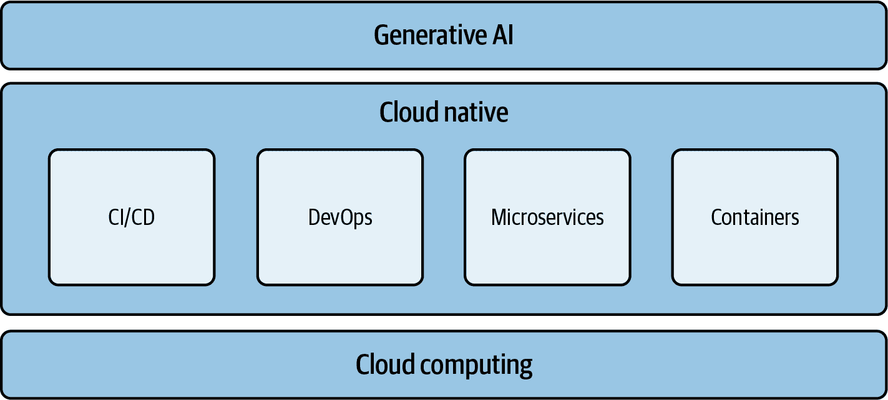
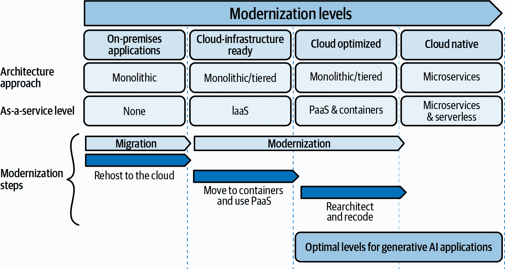
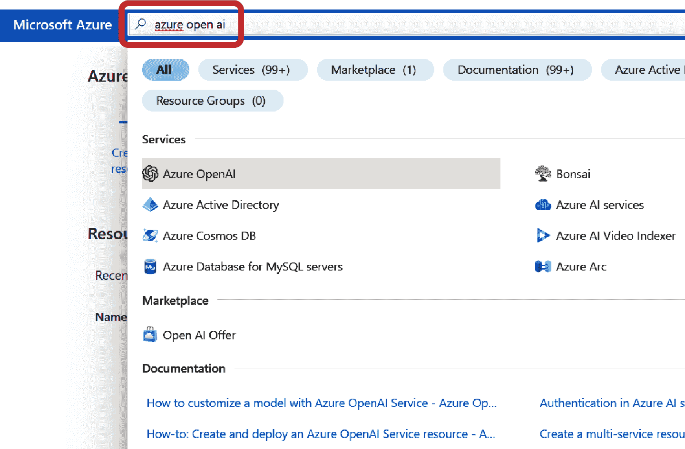
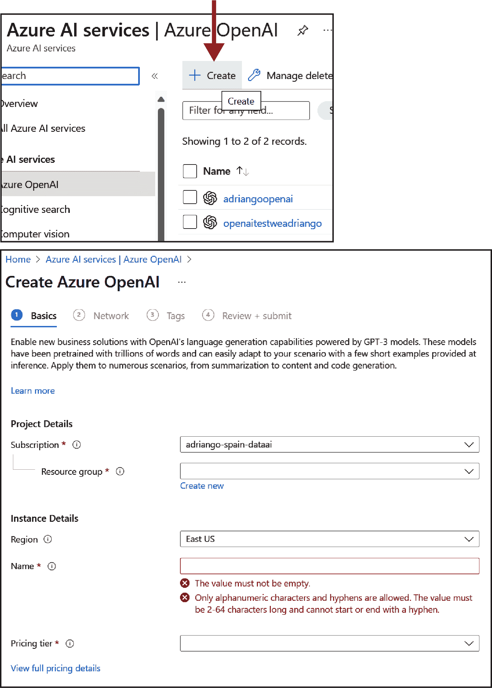
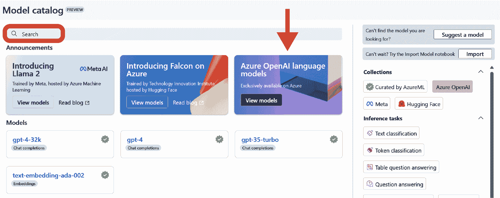
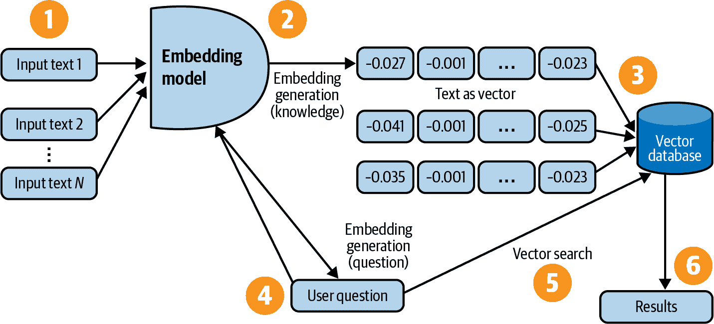
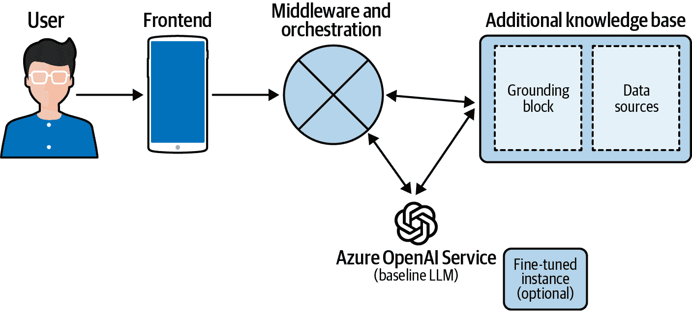

# 第二章\. 为生成式人工智能设计云原生架构

云原生架构是一种设计和构建应用的方式，能够利用云的独特能力和限制。云原生应用通常由运行在容器中的微服务组成，由像 Kubernetes 这样的平台进行编排，并使用 DevOps 和持续集成/持续部署（CI/CD）实践来实现快速交付和可扩展性。云原生架构是生成式人工智能时代的核心。

像云原生计算基金会（Cloud Native Computing Foundation，CNCF）这样的组织是云原生最佳实践和社区发展的伟大催化剂。他们的目标是成为“*云原生计算的供应商中立中心，使云原生普遍且可持续。” CNCF 是这些主题的信息和学习材料的绝佳来源。另一个很好的资源是 [十二要素应用](https://oreil.ly/AFEgd)，这是一种构建云原生应用的公开方法论。

作为云原生运动的一部分，有几个项目和社区致力于使用云原生架构来实现可扩展、可靠和强大的人工智能系统。它们通常需要大量数据、复杂算法和专用硬件来执行图像识别、自然语言处理或推荐系统等任务。这并不总是传统 IT 架构模式（例如，[单体应用](https://oreil.ly/TrFNL)）所能实现的。

人工智能系统需要云原生架构的原因如下：

系统性能

人工智能系统需要以快速和高效的方式处理大量数据并运行复杂的计算。云原生架构使人工智能系统能够利用云的弹性资源，如计算、存储和网络，根据需求进行扩展或缩减。它还允许人工智能系统使用针对人工智能工作负载优化的专用硬件，如图形处理单元（GPUs）或张量处理单元（TPUs）。

灵活性

人工智能系统需要适应不断变化的企业需求、用户反馈和数据质量。云原生架构使人工智能系统能够通过 DevOps 和 CI/CD 实践快速、可靠地部署新功能、模型或更新。它还允许人工智能系统使用 A/B 测试或金丝雀部署等技术来尝试不同的架构、算法或参数。

创新和可集成性

人工智能系统需要利用人工智能研究和技术的最新进展。云原生架构使人工智能系统能够访问云的丰富生态系统中的 AI 服务、工具和框架，这些服务、工具和框架提供最先进的功能和性能。它还允许人工智能系统与其他云服务集成，如数据分析、物联网或边缘计算，从而增强人工智能系统的价值和智能。

CNCF 将云原生最重要的领域描述为 CI/CD、DevOps、微服务和容器，如图 2-1 所示。



###### 图 2-1. 生成式 AI 的云原生构建块（来源：改编自 CNCF 的图像）

这四个领域与生成式 AI 应用相关：

CI/CD

实现了集成代码更改、构建、测试和部署 AI 模型和应用的简化流程，并促进了生成式 AI 开发的快速迭代，缩短了上市时间。

DevOps

将 AI 技术的 DevOps 原则和实践相结合，以改善 AI 系统的开发、部署和运营，并促进生成式 AI 集成到整个软件开发生命周期中。它还确保了可靠的监控、日志记录和反馈循环，使问题在生成式 AI 系统中能够快速识别和解决。

微服务

允许复杂的生成式 AI 系统被分解成更小、独立的微服务，这有助于模块化开发和部署 AI 系统的不同组件。它还增强了可扩展性和灵活性，因为单个微服务可以独立地进行开发、部署和扩展。

容器

提供了一种轻量级且便携的方式来打包和部署生成式 AI 模型和应用，并使生成式 AI 工作负载的扩展、复制和编排变得容易。

云原生架构是开发能够提供高性能、敏捷性和创新的云平台的高级智能 AI 系统的关键推动力。在本章中，我们将探讨如何为利用 Azure OpenAI 服务的 AI 赋能系统准备云原生架构，无论你计划开发哪种类型的应用。让我们从深入研究 AI 云原生开发的典型场景开始。

# 为生成式 AI 现代化应用

本书重点介绍使用 Azure OpenAI 服务和 Microsoft Azure 堆栈开发新的云原生应用。然而，可能存在公司试图利用这些能力来改造现有应用的场景。让我们比较这两种场景，并看看方法：

新云原生应用

从零开始使用[容器化](https://oreil.ly/U0o9G)和微服务架构设计，实现可扩展性、弹性和容错性。它们利用前面提到的四个领域，并使生成式 AI 应用的部署和维护变得更加简单。

现有应用

很可能需要进行迁移或现代化。这意味着它们将要么迁移到云端，要么修改以符合云原生原则，例如将单体架构拆分为微服务或引入容器化。现代化过程涉及逐步升级，解决可扩展性、弹性和容错性，并逐步采用 DevOps 实践。

[《学习微软 Azure》（O’Reilly）](https://oreil.ly/Rqw0P) 一书由 Jonah Carrio Andersson 概述了一些不同的策略，微软的[现代化指南](https://oreil.ly/5Sm8X)描述了将现有的本地/单体应用程序迁移和现代化到云端的流程，以及特定的云原生功能。图 2-2 展示了不同的云现代化级别。



###### 图 2-2. 向生成式 AI 发展的云原生现代化级别（来源：改编自微软的一张图片）

根据现代化步骤，有不同级别的成熟度，从现有的本地应用程序到完全云原生应用程序。这对于 Azure OpenAI 服务的实施是相关的，因为它是一个原生云启用型 PaaS，因为新的和现有的应用程序在集成生成式 AI 功能之前需要达到一定程度的云就绪。想象一下，这是应用程序的其他部分以云启用的方式与 Azure OpenAI 服务连接的方式，具有原生和简单的集成。

成熟度级别如下：

云基础设施就绪应用程序

使用这种迁移策略，你只需将现有的本地应用程序转移到基础设施即服务（IaaS）环境中。虽然你的应用程序的结构基本保持不变，但现在它们托管在云中的虚拟机上。这种简单的迁移方法在行业内通常被称为“提升和转移”，但它只能获得从托管 PaaS/SaaS 服务中可以获得的云价值的一部分。

云优化应用程序

在这个阶段，在不进行重大代码更改或重新设计的情况下，你可以利用容器和其他云托管服务等技术，在云端运行你的应用程序的优势。这增强了你的应用程序的灵活性，通过优化你的业务 DevOps 实践，可以更快地发布。这种增强是通过像 Windows 容器这样的工具实现的，这些工具基于 Docker 引擎。容器解决了多阶段部署期间应用程序依赖带来的挑战。在这个成熟度框架中，你可以选择在 IaaS 或 PaaS 上部署容器，利用额外的云托管服务，如数据库解决方案、缓存服务、监控和 CI/CD 工作流程。

云原生应用程序

这种迁移方法通常是由业务需求驱动的，目标是现代化您的关键任务应用程序。在这个层面，您使用云服务将您的应用程序迁移到 PaaS 计算平台。您实现云原生应用程序和微服务架构，以实现长期敏捷性和扩展到新的极限。这种类型的现代化通常需要专门针对云进行架构设计，甚至需要编写新代码（或重写代码），尤其是在您迁移到云原生应用程序和基于微服务的模型时。这种方法可以帮助您获得在单体和本地应用程序环境中难以实现的好处。

最后一级是最佳生成 AI 启用应用程序的最终目标，但任何这些级别（尤其是最后两级）对于任何应用程序“连接”到 Azure OpenAI 服务来说都“足够好”。本章的其余部分将专注于新的云原生应用程序，但如果您计划利用 Azure OpenAI 服务为现有应用程序提供支持，请首先评估它们并分析向 AI 采用迈进的下一迁移或现代化步骤。

现在，让我们关注云原生的主要优势以及关键的 Azure 启用构建块，这将使您能够构建您的 Azure OpenAI 解决方案。

# 使用 Azure OpenAI 服务的云原生开发

云原生架构背后的部分想法是将代码开发拆分为不同的部分，称为微服务，这样所有模块都基于功能流程进行通信，而不属于同一个技术块。这有一系列优势，不仅适用于 Azure OpenAI 启用的开发，也适用于任何云原生实现。我们可以想象出利用微服务架构的几个原因：

模块化和细粒度的 AI 功能

在 AI 应用程序中，可能涉及不同的任务，如数据预处理、特征提取、模型训练、推理和结果可视化。通过将这些功能作为独立的微服务实现，AI 系统变得更加模块化和细粒度。这允许开发者专注于构建和维护单个服务，使其更容易理解、开发、测试和部署特定的 AI 组件。这也允许组件的可重用性，因为可能存在某些清理管道或甚至模型，可以在同一公司内的不同应用程序中使用。最后但同样重要的是，它支持根据任务进行团队专业化（例如，模型输出处理往往是一个集成或数据工程任务，而模型实现是一个数据科学任务）。

可扩展性和性能优化

AI 工作负载的强度可能会有所不同，有些任务可能需要比其他任务更多的计算资源。通过将 AI 应用程序分解为微服务，每个服务可以根据其特定的资源需求独立扩展。这种可扩展性确保了高效的资源利用和性能提升。例如，模型训练和推理服务可以独立扩展以处理不同的工作负载，提供更好的响应时间和整体系统性能。

AI 算法生命周期管理

AI 应用程序通常需要尝试不同的算法、模型或数据源以达到预期的结果。使用微服务，开发者可以轻松地替换或更新单个 AI 服务，而不会影响系统的其余部分。这种灵活性使得快速原型设计、实验和迭代不同的 AI 方法变得容易，从而有助于发现针对特定任务最有效的算法或模型。此外，某些系统可能会并行运行算法以通过选择这些算法的最佳答案来获得更好的结果。

与外部服务的集成

微服务架构促进了松散耦合和定义良好的 API，这使得将 AI 服务与外部系统、工具或服务集成变得更加容易。这允许 AI 功能在不同的应用程序、领域或平台上得到利用。例如，一个用于 NLP 的 AI 服务可以通过 API 公开，并由多个应用程序使用，或集成到聊天机器人或客户支持系统中。

现在，如果我们考虑由 Azure OpenAI Service 启用的生成式 AI 应用程序，目标是结构化端到端架构，使其合理且将“AI 组件”连接到后端元素（代码、云资源）和前端界面（一个或多个，取决于应用程序），正如您在图 2-3 中看到的那样。


###### 图 2-3\. 微服务支持的 AI 开发

所有涉及到的元素都需要是互操作、可替换和可用的。为此，将构建块组织在微服务中是关键。接下来的两个部分将探讨容器化和无服务器方法。让我们讨论它们作为云原生使能者的作用。

## 基于微服务的应用程序和容器

云原生开发方法通过选择合适的方式来开发和部署应用程序，利用了云的力量。它们依赖于容器化，通常指的是 Docker 类型的容器，以及 Kubernetes 编排。由于它们都基于国际标准（例如，[开放容器倡议（OCI）](https://oreil.ly/JKa4L)），云原生应用程序通常可以在不同的公共和私有云提供商之间进行移植和扩展。

对于 Microsoft Azure 来说，关键的托管容器化服务是 [Azure Kubernetes 服务 (AKS)](https://oreil.ly/ymIkj) 和 [Azure Red Hat OpenShift (ARO)](https://oreil.ly/SXs9T)。虽然两者都是微软提供的托管 Kubernetes 服务，但它们之间有一些关键的区别：

[AKS](https://oreil.ly/YqfZ3)

由 Microsoft Azure 提供的托管 Kubernetes 服务，利用原生 Kubernetes 技术。它提供在 Azure 基础设施上的完全托管 Kubernetes 集群，并专注于在 Azure 上提供简化和流畅的 Kubernetes 体验。它提供了基本的 Kubernetes 功能，包括扩展、负载均衡和部署管理。AKS 与其他 Azure 服务集成良好，并提供了原生的 Azure 资源管理和监控功能。您可以在 [网上](https://oreil.ly/OoChO) 找到定价信息。

[ARO](https://oreil.ly/mM0MD)

微软和红帽联合提供的产品，基于 [Red Hat OpenShift](https://oreil.ly/AftCs) 容器平台构建。ARO 集成了 Kubernetes 技术，但提供了来自 OpenShift 平台的其他功能和集成。它提供了一个更全面且以企业为中心的平台，具有额外的安全、合规性和管理功能。

总结来说，它们在底层技术、供应商和平台功能方面存在差异。AKS 和 ARO 之间的选择取决于您组织的具体需求和偏好，例如对额外企业功能的需求以及与红帽的现有投资或合作关系。您可能还想探索的其他相关服务包括 [Azure 容器应用](https://oreil.ly/QDzs2) 和 [Azure Arc for Kubernetes](https://oreil.ly/X5vd_)（用于混合云场景）。

现在我们已经探讨了 Azure 中的容器化选项，让我们了解无服务器概念及其在基于微服务实现中的相关性。

## 无服务器工作流

另一种或补充的选项是无服务器方法。无服务器计算是一种云计算模型，允许开发者构建和运行应用程序，而无需管理底层基础设施。它对于人工智能工作负载，包括生成式人工智能特别有益，因为它提供了一个可扩展且成本效益高的解决方案。

在无服务器架构中，开发者专注于编写特定功能或任务的代码，这些功能或任务被称为无服务器函数，[Azure Functions](https://oreil.ly/Gm-h9) 是原生微软选项。这些函数在由云提供商自动管理和扩展的容器中执行，正如您在 图 2-4 中所看到的。这消除了开发者配置和管理服务器的需求，使得部署和维护人工智能应用程序变得更加容易。


###### 图 2-4\. 管理云作为服务级别

与其他云原生元素类似，无服务器对于 AI 工作负载的关键优势之一是其可伸缩性。生成式 AI 模型通常需要大量的计算资源，尤其是在训练大型模型或生成复杂输出时。无服务器平台会自动根据需求扩展资源，允许 AI 应用程序在无需人工干预的情况下处理工作负载的波动。这种可伸缩性使得资源利用效率更高，成本优化更好，因为开发者只需为执行期间实际使用的计算资源付费。

无服务器计算的优势之一是其事件驱动的特性。无服务器函数由特定事件触发，例如 HTTP 请求或来自消息队列的消息。这种事件驱动架构非常适合需要实时或异步处理的 AI 工作负载。例如，生成式 AI 应用程序可以由用户交互或计划任务触发，允许它们按需或定期生成输出。此外，无服务器还可以用于在生成式 AI 管道中执行操作。为此，可以使用[Azure Logic Apps](https://oreil.ly/Qvt6X)来触发编排和工作流，并且它与 Microsoft 365 和 Azure 服务集成，这在触发生成式 AI 管道或事件时可能很有用。

与无服务器平台相关的局限性包括执行时间限制、内存约束和部署包大小限制。然而，像函数组合、缓存和并行执行这样的技术可以帮助提高在无服务器架构上运行的生成式 AI 应用程序的效率和响应速度。微调资源分配和优化数据处理管道也有助于提高整体性能。

从一般意义上讲，您将结合一个 PaaS（平台即服务）如 Azure OpenAI，以及根据您的实施方法，加上容器化和/或无服务器组件。现在，我们将探讨您应用程序的 Web 开发部分，以获得 Azure OpenAI 部署具有生成式 AI 功能的 Web 应用程序所利用的服务的一个初步概念。

## 基于 Azure 的 Web 开发和 CI/CD

现在，让我们关注那些超越核心 AI 能力的开发构建块。作为一名云原生实践者，您可能会将您的应用程序代码分成几个部分。正如您已经看到的，这些块是微服务，可能包含后端和前端模块（移动应用、网站、内网等）。

有趣的部分在于您会发现您可以直接通过 Azure App Service 托管基于 Web 的应用程序。Azure App Service 是一个 PaaS，一个完全托管的服务，允许采用者构建、部署和扩展 Web 应用程序和 API，而无需管理底层基础设施。它支持各种编程语言和框架，并使 Web、移动和 API 应用程序开发以及工作流（逻辑应用程序）、CI/CD 和监控成为可能，同时提供与整个 Microsoft Azure 套件的简单集成。

总体而言，Azure App Service 简化了在 Azure 云中构建、部署和扩展 Web 应用程序和 API 的过程。它提供了一个强大且功能丰富的平台，使开发者能够专注于应用程序开发，同时受益于 Azure 平台提供的可扩展性、可用性和管理能力。

您将在第三章中看到，Azure OpenAI 提供了利用 Azure App Service 创建基于聊天应用程序的简单部署选项，这些应用程序具有预定义的模板。

###### 注意

如果您想深入了解这些主题中的任何一个，请访问以下链接：

+   应用程序托管：[Azure App Service 概述 | Microsoft Learn](https://oreil.ly/moBFz)

+   GitHub for CI/CD: [使用 GitHub Actions 部署到 App Service | Microsoft Learn](https://oreil.ly/Z9EBe)

+   YouTube 视频：[如何使用 GitHub Actions 部署您的 Web 应用程序 | Azure 门户系列](https://oreil.ly/dSe0R)

我们现在将介绍 Azure 门户的基础知识，主要面向没有或很少使用 Azure 的读者，作为帮助您了解如何搜索、配置和部署 Azure OpenAI 和其他相关服务的一种方式。如果您已经使用过 Azure 及其门户，您可以跳过这一部分。

# 理解 Azure 门户

Azure 门户是 Microsoft Azure 提供的一个基于 Web 的 UI，允许用户管理和交互他们的 Azure 资源。它作为访问和管理各种 Azure 服务和功能的中心枢纽，包括 Azure OpenAI 服务。门户提供了一个视觉上吸引人且直观的界面，简化了 Azure 资源的管理和监控（图 2-5）。


###### 图 2-5\. Azure 门户：主界面

如您在图 2-5 中看到的，它包括一个可定制的仪表板，提供了您 Azure 资源的概览、最近的活动以及用于快速访问常用服务的个性化瓷砖。

门户左侧的导航面板允许您访问不同的 Azure 服务类别，包括计算、存储、网络、安全 + 身份、AI + 机器学习等。您可以在图 2-6 中看到顺序。


###### 图 2-6\. Azure 门户：左侧面板

此外，点击特定类别可以展开一个包含该类别子类别和服务的菜单。您实际上可以在 AI + 机器学习类别中找到 Azure OpenAI 服务（图 2-7）。


###### 图 2-7\. Azure 门户：资源（Azure OpenAI 服务示例）

或者，Azure 门户在顶部提供了一个搜索栏，允许您快速查找服务、资源或文档。如图 2-8 所示，您可以通过关键词搜索或使用自然语言查询在 Azure 中定位特定的功能或资源。基本上，您只需在搜索栏中键入即可找到 Azure OpenAI。



###### 图 2-8\. Azure 门户：搜索（Azure OpenAI 服务示例）

每个 Azure 服务都有自己的专用面板，这本质上是一个提供该服务详细信息和管理选项的面板。如果您从搜索引擎或左侧面板中选择 Azure OpenAI，您将进入您的资源详情（图 2-9）。基本上，您可以为 Azure OpenAI 创建新的资源，或管理之前部署的资源。如果您选择创建，您可以看到部署新的 Azure OpenAI 服务所需的信息。



###### 图 2-9\. Azure 门户：资源详情（Azure OpenAI 服务示例）

您可以找到与您的订阅、地理位置偏好、为您的 Azure 资源选择的唯一名称以及定价层相关的详细信息。（层是根据估计的使用量来划分的定价级别；目前 Azure OpenAI 只有一个选项，称为“标准 S0”。任何更新都应通过[官方定价页面](https://oreil.ly/7Gmq6)和[Azure 计算器](https://oreil.ly/2SQ4C)提供。）

除了管理个人资源外，Azure 门户还允许您创建[资源组](https://oreil.ly/J2LMM)以逻辑上组织和管理相关资源。这是一个有趣的功能，也是将您为 Azure 生成式 AI 实现所需的资源（包括 Azure OpenAI 服务以及其他我们项目所需的服务）分组的一个推荐的最佳实践。

###### 注意

如果您之前还没有创建 Azure 账户，第一步是[创建一个免费的账户](https://oreil.ly/WVIm2)。通常包括价值 200 美元的信用额度，用于初始实验。它需要一个特定账户的商务电子邮件和支付信息。

我们将在第三章 实现 Azure 上的云原生生成式 AI 中探讨生成式 AI 实现方法的细节，但 Azure 门户背后的理念是简化创建这些架构所需的不同资源的部署、管理和维护过程，无论服务类型如何。从 Azure 门户部署任何 Azure 服务都涉及多个步骤，所以请记住以下高级流程：

1. 在 Azure 门户中登录。

打开网页浏览器，导航到 Azure 门户，并使用您的 Azure 账户凭据进行注册。

2. 创建资源。

要部署 Azure 服务，您需要创建资源。资源代表 Azure 中的服务或组件，例如虚拟机、存储账户或数据库。在 Azure 门户中点击“创建资源”按钮。

3. 选择服务。

在资源创建向导中，您将看到可用的 Azure 服务列表。通过浏览类别或使用搜索栏选择您想要部署的服务。

4. 配置资源。

选择服务后，您将被带到配置页面，您可以在此指定资源的设置。可用的选项取决于您要部署的具体服务。填写所需信息，例如资源名称、区域、定价层以及其他相关设置。

5. 查看并创建。

配置资源后，请查看设置以确保它们正确。如果可用，您还可以启用其他功能或附加组件。满意后，请点击“查看 + 创建”按钮。

6. 验证和部署。

Azure 将验证配置设置并检查任何潜在问题。如果一切正常，请点击“创建”按钮以启动部署过程。

7. 监控部署。

Azure 将根据您的配置开始预配资源。您可以在 Azure 门户中监控部署进度。根据服务类型，部署可能需要几分钟才能完成。

8. 访问和管理已部署的服务。

部署完成后，您可以通过 Azure 门户访问和管理已部署的服务。您可以查看其属性、更改其配置、监控其性能，并根据需要执行其他管理任务。

这是对大多数 Azure 资源的过程，但还有其他部署方法，例如 [Azure 资源管理器模板](https://oreil.ly/TZXTy)、[API 启用资源编排](https://oreil.ly/jezRs)、[Azure Bicep](https://oreil.ly/aZOxZ)、[Azure 上的 Terraform](https://oreil.ly/Wi9xy) 或命令行工具，如 [Azure CLI](https://oreil.ly/Mm4N1) 或 [Azure PowerShell](https://oreil.ly/22BEd)，所有这些工具都是为更高级的行政/技术用户设计的。如果您想了解更多，请随时探索。

对于 Azure OpenAI 服务，您始终可以访问[官方资源部署指南](https://oreil.ly/hSPh3)，其中总结了我们刚刚走过的步骤。在部署服务之前，您可能还想查看的其他信息包括[主要产品页面](https://oreil.ly/MDBhf)、之前提到的[定价指南](https://oreil.ly/7Gmq6)、服务[按地理区域可用性](https://oreil.ly/tYnCe)（例如，如果您从欧盟部署服务，您可能希望使用更近的区域，例如阿姆斯特丹的西欧，以获得更好的延迟、性能，也许还有定价），以及[一般文档](https://oreil.ly/3oNQU)。

现在您已经了解了如何使用 Azure 门户，以及 Azure OpenAI 服务部署过程的关键信息，让我们分析一些在模型和一般架构层面的重要考虑因素。这将是我们在第三章中看到的端到端实现的关键。

# Azure OpenAI 服务的一般注意事项

现在我们已经探讨了使用 Azure 进行云原生开发的理念，以及 Azure OpenAI 服务的 Azure 门户基础，让我们更深入地了解可用的不同 AI 模型和高级架构，这样您就可以了解如何理解 Azure 启用的生成式 AI 产品。

## 可用的 Azure OpenAI 服务模型

任何公共云（包括微软 Azure）的大多数云启用 PaaS 资源都利用本地端点和 API 作为连接和消费其模型的方式。这对于 Azure OpenAI 服务以及我们在本章中看到的其余 Azure AI 服务也是如此。

此外，还有一些视觉元素，如[Azure AI Studio](https://oreil.ly/PCMD3)和[Azure ML Studio](https://oreil.ly/kdZhY)（不要与[Azure OpenAI Studio](https://oreil.ly/LWQO1)混淆，我们将在第三章中解释并利用它），它们提供了访问不同专有和开源 AI/基础模型的方式。这包括一个模型目录，可以利用经过精选的模型选择，包括来自 Azure OpenAI、Meta 和 Hugging Face 的模型（例如，由微软和 Hugging Face 在 Microsoft Build 2023 期间宣布的[Azure 中的 Hugging Face Hub](https://oreil.ly/96mAx)）。这也允许我们以非常简单的方式测试和部署这些模型。

如您在图 2-10 中看到的，如果您访问[工作室页面](https://oreil.ly/kdZhY)，您将能够访问您现有的工作空间，或者如果您是第一次连接到工作室，您将能够创建一个新的工作空间。


###### 图 2-10\. Azure AI Studio：主界面

如果你访问工作区，你会看到我们在本章前面审查过的相同类型的可视化界面。在 图 2-11 中，工作区菜单的左侧面板提供了与数据、模型、端点、所需资源等相关的一切选项。为了简化，我们将关注两个主要功能：[模型目录](https://oreil.ly/BYkuc)，以及在 第四章 中稍后讨论的提示流功能。


###### 图 2-11\. Azure AI Studio：左侧面板

如果你选择模型目录选项并搜索“Azure OpenAI”或直接点击如图 图 2-12 所示的磁贴，你将能够访问可用的 Azure OpenAI 模型更新列表。


###### 图 2-12\. Azure AI Studio：模型目录

图 2-13 中的模型是撰写本文时的可用模型，但根据你检查目录的时间，你可能会发现这些和/或其他的模型。检查当前所有可用模型的一种替代方法是使用 [List API](https://oreil.ly/bk7Zd)。



###### 图 2-13\. Azure AI Studio：Azure OpenAI 服务模型

现在，考虑到 Azure OpenAI 模型可用性的演变性质，探索关键模型系列和一些特定模型示例，这些模型将用于你的生成式 AI 项目。这肯定会随着时间的推移而变化，但这是一个良好的开始。

Azure OpenAI 服务将其功能分为不同的 *模型系列*。一个模型系列通常根据其预期任务将 AI 模型关联起来，例如自然语言理解、代码生成或图像合成。以下是一些最受欢迎的 Azure OpenAI 模型系列：

语言相关模型

流行的语言相关模型包括以下：

GPT-3.5 Turbo 和 GPT-3.5 Turbo Instruct

改进先前 GPT-3 版本的模型，能够理解和生成自然语言和代码。有几个版本具有不同的上下文长度限制，包括 4K 和 16K 令牌，这是最大文本输入的度量。

GPT-4，GPT-4 Turbo，GPT-4o

性能更好（且成本更高）的模型，比 3.5 Turbo 能够处理更复杂的任务，并生成更准确和多样化的输出。它们还可以处理比前辈更大的文本输入（我们通常将其定义为“上下文”）。

语音

Azure 中还有其他选项，但 Azure AI Studio 包含了来自 OpenAI 的语音转文本 [Whisper 模型](https://oreil.ly/9si-P)（即通过输入“whisper”并选择模型）。它不是直接从 Azure OpenAI Studio 可用的，但它可以与其他 GPT 模型集成，以创建语音转文本场景。

其他模型

其他流行的模型包括以下：

Codex 用于编程代码

一系列可以理解和生成代码的模型，包括将自然语言转换为代码。现实情况是，Codex 最初是一个独立的模型，但经过一段时间后，OpenAI 将其功能添加到了常规的 GPT-3.5 Turbo 和 GPT-4 语言模型中。这意味着相同的模型可以处理自然语言和编程代码。

DALL·E for images

一系列可以从自然语言生成原始图像的模型。这是[Bing Create](https://oreil.ly/YwDy-)和[Microsoft Designer](https://oreil.ly/oIRon)等工具背后的模型，并且它直接从 Azure OpenAI Studio 提供，正如我们将在第三章中看到的。

重要的是要区分不同的模型家族及其具体功能，以便了解我们将为我们的生成式 AI 项目使用哪些模型。此外，不同 Azure OpenAI 模型的权衡取决于用例和可用预算。一般来说，更强大的模型如 GPT-4o 可以处理更复杂的任务，并生成更准确和多样化的输出，但它们也消耗更多资源并产生更高的成本。我们将在第三章中探讨几个可以与所有这些 GPT 模型协同工作的场景。您还可以探索整个 OpenAI 模型集，包括一些已弃用的模型，这些模型仍然可以通过 OpenAI 的文档[追踪](https://oreil.ly/SG-fe)。

除了所有这些功能之外，对于启用 LLM 的系统来说，一个关键特性是*嵌入*。这是一个与 NLP 和 LLM 相关的一般术语。嵌入是在多维空间中表示数据的一种方式。它们通常用于捕捉单词、图像或其他类型数据的语义意义。例如，在图 2-14 中，嵌入模型可以将一个单词映射到一个数字向量，使得具有相似意义的单词具有相似的向量。这意味着我们可以连接那些没有直接连接但可能存在数学或语言联系的信息片段（例如，来自同一行业公司的多个知识库、内部和外部来源等）。



###### 图 2-14\. 嵌入模型

此示例说明了典型的*生成和搜索过程*：

1.  我们收集不同的数据输入（PDF 文件、文本文件、URL 等）来创建我们的知识库。这是一个简化的视图，因为来源已经被预先处理以提取基于文本的信息。我们将在第三章中看到此类选项，例如官方加速器和 Azure AI 文档智能。

1.  我们利用[嵌入 API](https://oreil.ly/bhgTY)从不同的来源生成嵌入。我们可以使用带有文本输入的基本 API 调用，它返回生成的向量。

1.  生成的向量/嵌入存储在向量数据库中。我们将在第三章中探讨 Azure 中的几个数据库选项。

1.  在生成过程之后，我们可以假设最终用户将想要搜索特定主题或信息，这些主题或信息将作为我们收集和向量化的不同数据输入的一部分。为此，我们将使用相同的嵌入 API 来生成问题的嵌入（注意：我们需要相同的嵌入模型来处理知识和问题）。

1.  向量数据库将支持搜索功能。这意味着我们将使用向量化的用户问题作为输入，从包含我们的知识库的向量数据库中查找信息。

1.  如果有相关主题，搜索功能将返回 Top-k 种类的结果，我们可以使用这些结果来生成答案（无论是直接打印结果还是将它们作为基于聊天的场景的输入）。

Azure OpenAI 服务中可用的嵌入用例如下：

文本相似度

一组提供嵌入（embeddings）的模型，这些嵌入能够捕捉文本片段的语义相似性。这些模型在许多任务中非常有用，例如聚类、回归、异常检测和可视化。

文本搜索

一组提供嵌入的模型，这些嵌入能够对文档进行语义信息检索。这些模型在搜索、上下文相关性和信息检索等任务中非常有用。

代码搜索

一组提供嵌入的模型，这些嵌入能够通过自然语言查询找到相关的代码。这些模型在代码搜索和相关性等任务中非常有用。

在技术层面上，使用 Azure OpenAI 服务进行嵌入推荐的选择是“Ada”；这是一个比其前辈更改进且成本效益更高的[模型](https://oreil.ly/6m7SL)。这对于通过消耗来自 PDF、网站、文本文件等信息来增加 Azure OpenAI 的知识范围非常有用。

如前所述，嵌入生成基于一个非常简单的 API 调用/响应动态，特定源如何生成嵌入的详细信息可以在[官方文档](https://oreil.ly/2cxWx)中找到，以及具体的[上下文长度限制](https://oreil.ly/SQSGw)（例如，Ada 版本 2 的 8K 个令牌）。生成嵌入就像调用嵌入 API 并使用您想要向量化的所需文本输入一样简单。例如，在 Python 中：

```py
import openai
openai.api_type = "azure"
openai.api_key = YOUR_API_KEY
openai.api_base = "https://YOUR_RESOURCE_NAME.openai.azure.com"
openai.api_version = "2023-05-15"

response = openai.Embedding.create(
    input="Your text string goes here",
    engine="YOUR_DEPLOYMENT_NAME"
)
embeddings = response['data'][0]['embedding']
print(embeddings)
```

这将输出一个数值表示，列表中的每个数字对应于嵌入空间中的一个维度。确切值将取决于特定模型及其训练数据，但可能看起来像这样：

```py
[0.123, 0.456, 0.789, ..., 0.987]
```

我们已经完成了对 Azure OpenAI 模型和其功能的审查。虽然我们将涵盖项目示例和架构的细节第三章，但下一节将探讨 Azure OpenAI 启用实现的一般架构构建块，以及一般云基础设施话题。

## 生成式人工智能系统的架构元素

基于 Azure 的架构依赖于一系列相互连接的服务，这些服务可以为了特定目的相互通信。在这种情况下，Azure OpenAI 在使任何客户端应用程序之间进行交互方面发挥着关键作用，但我们依赖于更多构建块来构建我们的生成式人工智能解决方案。在图 2-15 中，你可以看到 Azure OpenAI 启用（简化）架构的主要构建块。



###### 图 2-15\. 高级架构构建块

让我们更详细地看看这些部分：

应用前端

任何利用生成式人工智能能力的应用端元素。

中间件/协调

我们将在第三章中探讨这个元素，但协调部分基本上允许我们将不同的 Azure OpenAI 技能与其他相关服务连接起来。此外，中间件还可以包括 API 管理和其他我们将在第三章中看到的话题。

Azure OpenAI 服务

对于基于文本的技能，例如解释复杂问题的答案，无论是完成还是基于聊天的场景。

额外的知识库

这是由核心数据源（数据库、blob 存储等）和知识提取元素（如嵌入、Azure 认知搜索、必应搜索等）的组合。目前，我们将它们定义为“基础块”，但我们将看到第三章中的详细内容。

如果你开发的应用程序利用了 Azure OpenAI 和其他 Azure 服务，并且该实现是更大数据/人工智能平台的一部分，端到端架构可能看起来像图 2-16。


###### 图 2-16\. 端到端 Azure 平台（包括 Azure OpenAI 服务）

在这种情况下，Azure OpenAI 服务只是更大端到端解决方案的一部分，该解决方案包括数据源、集成过程、SQL/NoSQL 数据库、容器化、分析等。最终的设置取决于平台本身的架构，但这是一个很好的概述，了解 Azure OpenAI 在任何与 Microsoft Azure 的数据和人工智能实现中的位置。

如果你想了解更多关于 Azure 启用架构和所有这些云服务的详细信息，请查看 Jonah Carrio Andersson 所著的[*学习 Microsoft Azure*](https://oreil.ly/G2U08)。此外，架构的主要参考是针对特定[Azure OpenAI 场景](https://oreil.ly/y-gPD)的官方[Microsoft 架构中心](https://oreil.ly/0jzik)。你可能想将这个资源加入书签，因为微软团队会持续更新内容，包括一些带有 Azure OpenAI 服务的示例视觉架构和解释。

另一个你可以探索的有趣架构是[Azure OpenAI Landing Zone 参考架构](https://oreil.ly/xLs8X)，它包括了端到端云考虑因素，包括核心基础设施主题，如身份和安全、监控、成本管理、用户和 API 管理、FinOps 等。这是一个非常丰富和完整的概述，超出了核心生成式 AI 能力的范畴。

最后但同样重要的是，不要忘记探索[CNCF 云原生 AI 白皮书](https://oreil.ly/qd4lq)，它来自[AI 工作组](https://oreil.ly/8k0bc)，其中包括生成式 AI 主题的技术构建块、技术和云原生资源。

# 结论

如你所见，云原生架构对于生成式 AI 开发非常有价值，因为它们可以无缝集成到 Azure OpenAI 和其他 Azure 服务中。我们将在第三章中探讨不同的实现方法，但所有这些方法都依赖于这里讨论的能力和关键构建块。作为采用者，你可能会遇到需要优化现有应用程序以使其能够集成生成式 AI 能力的情况（如我们在现代化部分所回顾的），但你也将有机会从头开始开发新的 Azure OpenAI 启用应用程序。在这种情况下，利用容器化、无服务器和 PaaS 组件将帮助你设计良好架构和可扩展的架构和解决方案。根据你当前的知识水平，了解微软 Azure 背后的云基础以及特定于开发、API 和 Kubernetes 容器编排的服务将非常重要。

第三章将专注于增强你的 Azure OpenAI 应用程序的不同替代方案，以及你将在下一个项目中利用的主要功能和接口。它还包括了我们在此简要探讨的新术语，如向量数据库和编排。让我们继续。
