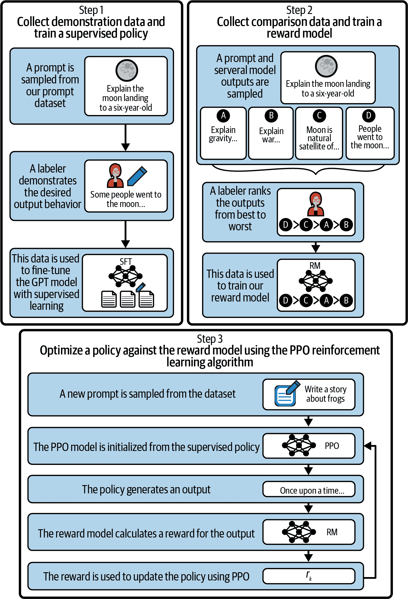
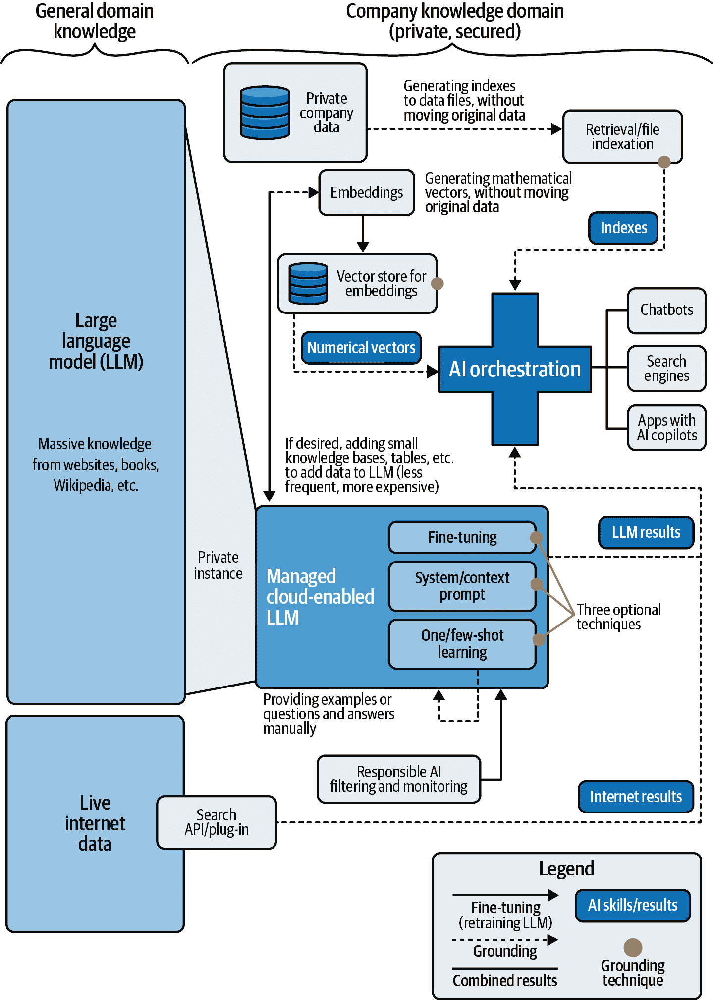
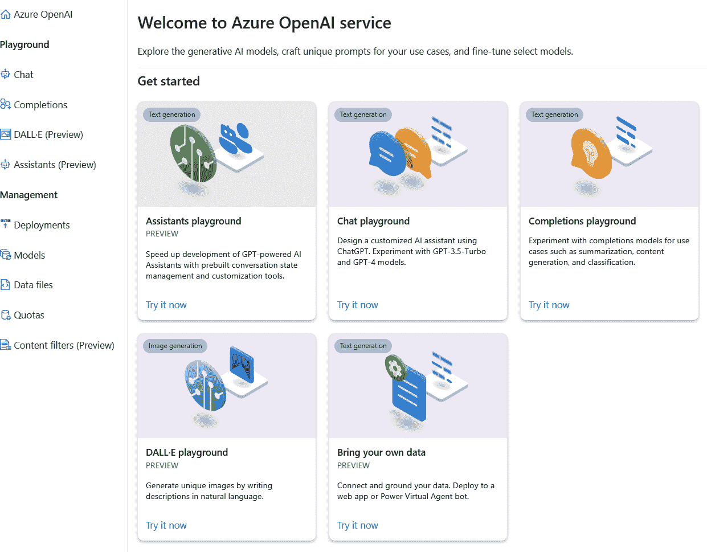
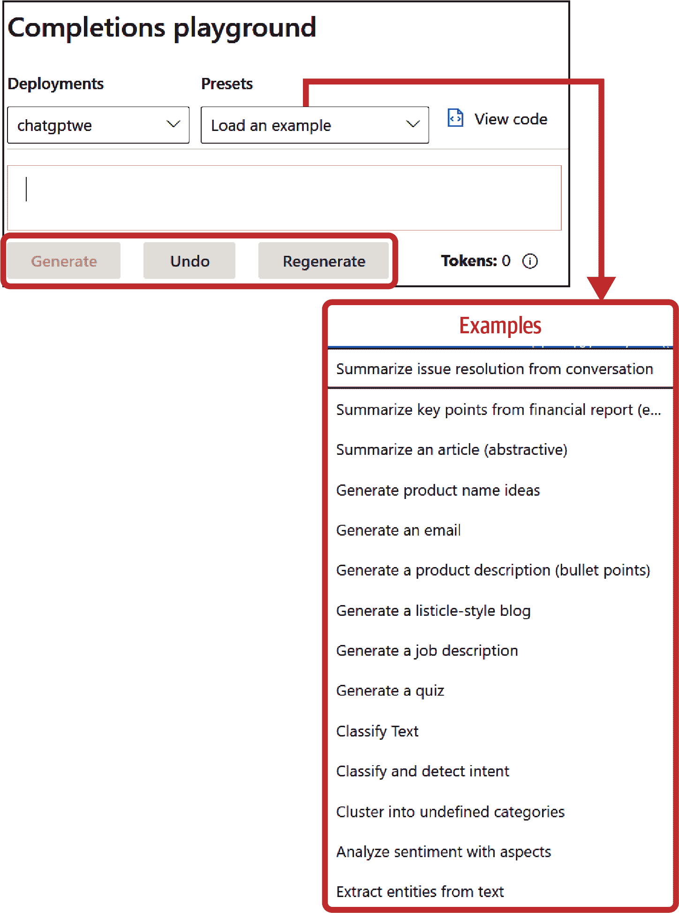
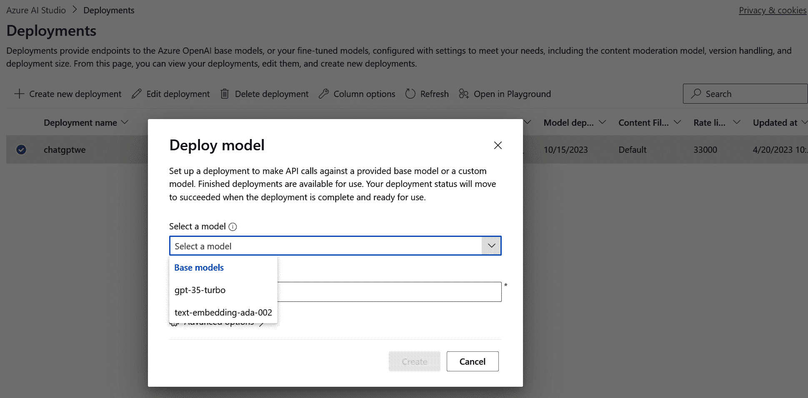

# 第三章：使用 Azure OpenAI 服务实现云原生生成式 AI

本章将专注于使用 Microsoft Azure 和 Azure OpenAI 模型实现生成式 AI 架构，始终旨在展示所有可用选项，并最小化所需的开发、集成和使用成本，同时加速运营化。为此，我包含了一系列最佳实践和典型架构，这将允许您为您的特定场景选择最佳构建块。

我们将包括最相关的 Azure OpenAI 实现方法，基于现有功能库和将不断进化、改进并包含新功能的存储库。我已包含原始文档的 URL，因为它们会持续更新以包含新功能，所以这些链接将允许您探索您需要的任何细节。其中大部分依赖于来自 GitHub 存储库的官方加速器，以及您可以跟踪和/或分叉的项目。但在深入细节之前，让我们探索一些基本主题，这将帮助您理解 Azure OpenAI 服务中的生成式 AI 的全部含义。

# 定义 Azure OpenAI 服务启用应用的知识范围

在 Microsoft Azure 上的生成式 AI 应用不仅限于常规的 ChatGPT 类型应用。它们是依赖于多种技术组件的先进架构，包括运行生成式 AI 模型所需的核心基础设施（服务器、[GPU](https://oreil.ly/y5mXm) 等），并允许采用者创建对话应用和搜索引擎，开发并将新的 AI 协作者集成到他们的应用中，定制客户关注点等。

从 Azure OpenAI 的角度来看，我们谈论的是一个包含高级功能的管理服务，它将允许您根据应用所需的功能范围实现不同级别的知识，基于默认功能和特定的调整和定制技术。通过知识级别，我们指的是超越 LLM 及其海量数据集初始范围的东西（例如，基于自身数据为内部公司应用添加新信息）。调整该知识的某些选项包括以下内容：

基线 LLM

Azure OpenAI 的语言模型是在包含数十亿单词的巨大数据集上训练的。这些数据集经过精心策划，包括广泛的主题、流派和写作风格。训练数据的大小和多样性有助于模型发展对人类语言的广泛理解。训练数据的具体细节尚未公开，但它包括来自各种来源的文本数据，包括书籍、文章、网站和其他公开可用的书面材料。此外，训练过程（RLHF）包括人类审稿人，他们帮助标注和策划数据，标记和解决潜在的偏见或问题内容。与审稿人的反馈循环被建立起来，以持续改进和细化模型。企业级 Azure OpenAI 服务的一个关键优势是[您的数据仅属于您](https://oreil.ly/qA5Ok)且不会被任何人用于重新训练模型。端到端过程在[OpenAI 的公开论文](https://oreil.ly/2uFNS)中解释，标题为“通过人类反馈训练语言模型以遵循指令”，以及他们官方的 GPT 模型卡，如图图 3-1 所示。



###### 图 3-1. ChatGPT 训练过程（来源：改编自[OpenAI](https://oreil.ly/9Lt-2)的一张图片；[Creative Commons 4.0 许可](https://oreil.ly/YGKJ5))

额外知识（基础化）

您可以为 LLMs 提供一些额外的上下文或知识，使它们特定于开发系统的活动范围。这可以从为聊天机器人设定讨论主题到指定与我们想要包含的主题相关的 URL。实现这种基础化的方法有多种：

微调

使用小型知识库或私有数据，用新的额外信息重新训练 LLM。通过 Azure OpenAI 服务提供，这是一个调整 LLM 知识范围的好选择，但成本效益较低（我们将在第五章中探讨，当我们计算 Azure OpenAI 启用实现的成本时）。实际上，需要微调的使用案例非常少，因为它更新了模型的权重，但并不一定使模型在微调的数据上更符合事实。大多数使用案例可以通过检索增强生成（RAG）来实现。

RAG，基于嵌入的检索

根据[Microsoft 的定义](https://oreil.ly/QlN0L)，嵌入是：

> 将标记（如句子、段落或文档）表示或编码为高维向量空间中的表示，其中每个维度对应于语言学习到的特征或属性。嵌入是模型捕捉和存储语言意义及其关系的方式，以及模型比较和对比不同标记或语言单位的方式。嵌入是模型在语言的离散和连续、符号和数值方面之间的桥梁。

RAG，基于索引的检索

能够索引现有文件，以便我们在与 LLM 引擎交互时可以找到它们。Microsoft [定义索引](https://oreil.ly/iJSKP)为：

> 从数据源中提取可搜索内容并使用源数据与搜索索引之间的字段映射来填充搜索索引的爬虫。这种方法有时被称为“拉模型”，因为搜索服务在不需要你编写任何将数据添加到索引的代码的情况下拉取数据。

RAG，混合搜索

作为结合基础技术的结果，[混合搜索](https://oreil.ly/c2W8A)结合了基于嵌入的检索和基于索引的检索，以解锁一些最强大的技术。

其他基础技术

其他技术包括上下文化（提供有关主题和/或特定 URL 的信息以定义一个减少的知识范围）和实时互联网结果，以补充 LLM 信息并包含外部来源。

如你在图 3-2 中看到的，所有这些元素都为从常规 LLM 基于互联网和私有数据创建扩展知识领域做出了贡献。本章的其余部分将专注于使用 Azure OpenAI 和其他 Microsoft 服务实现这些技术的不同方法。

总结来说，任何生成式人工智能架构或方法都将取决于我们为最终解决方案所需的知识领域和水平。如果我们的应用程序可以依赖于（仅）LLM，它已经包含大量信息，那么我们可以不添加任何额外的构建块来实施模型。另一方面，如果我们需要从其他来源添加特定信息（包括 PDF、文本文档、网站、数据库等），那么我们将利用所谓的微调和基础技术。

现在我们来探索可用于使用 Azure OpenAI 服务创建新应用的可用接口和工具。在进入最相关实现方法的逐步指南之前，你将了解关键构建块。



###### 图 3-2\. 生成式人工智能的知识范围

# 使用 Azure OpenAI 服务进行生成式人工智能建模

鼓励人们使用 Azure OpenAI 的关键采用因素之一是服务提供的不同视觉和基于代码的界面，您可以在使用服务时利用这些界面。在本节中，我们将探讨这些界面以及根据您的生成式 AI 实施方法如何使用这些界面。

###### 警告

最初，微软以“有限通用可用性”的形式发布了 Azure OpenAI 服务，这意味着任何希望使用该服务的组织都必须 *填写一份详细的申请表* 来解释潜在的使用案例并保证平台的使用良好。微软的目标是验证任何由 Azure OpenAI 启用的应用程序始终与其 [负责任的 AI 方法](https://oreil.ly/QsuYY) 和平台的 [预期用途](https://oreil.ly/7ojQP) 保持一致。如果您刚开始使用 Azure OpenAI 服务，请先 [检查您是否还需要申请访问权限](https://oreil.ly/MDBhf)，并准备申请表所需的必要信息。

## Azure OpenAI 服务构建块

在深入探讨“如何做”之前，让我们先探索任何 Azure OpenAI 实践者可用的构建块，以便准备和部署新的解决方案。本质上，Azure OpenAI 服务有两个主要组件：允许用户测试、定制和部署其生成式 AI 模型的 *视觉界面* 以及使高级功能能够与任何应用程序利用和集成的 *开发界面*。

这两个元素都是任何采用者的互补和宝贵资产，因为它们只需要相对较低水平的 AI 知识就能使其工作。例如，*公民用户*（混合技术-商业背景，技术性不强，但理解生成式 AI 的原理并具备一些提示工程知识，可以使用视觉游乐场，或利用 Microsoft Copilot Studio）和 *常规开发者* 都是开发平台的理想人选。

### 视觉界面：Azure OpenAI Studio 和 Playground

与任何其他 [Azure AI 服务](https://oreil.ly/TDoRH) 一样，Azure OpenAI 包含了“工作室”的概念（即 [Azure OpenAI Studio](https://oreil.ly/LWQO1)），通过提供直观的用户界面，使与生成式 AI 模型的交互变得非常简单，用户无需编写任何代码即可利用现有的 Azure OpenAI API 进行服务部署。

Azure OpenAI Studio 包含了对所有可用模型（按类型和地理区域）的访问权限[所有可用模型](https://oreil.ly/BI5Ue)，预定义的提示场景和示例，以及几个称为 *playgrounds* 的应用程序。Azure OpenAI Playgrounds 是 Azure OpenAI 服务内的不同应用程序，包括（如 图 3-3 所示）一个可定制的 ChatGPT 类型实例（*Chat*），用于非聊天场景的其他 GPT 语言模型（*Completion*），一个用于将 AI 模型与您的数据连接的 playground（*Bring your own data*），以及一个用于图像生成应用程序的 OpenAI 的 DALL·E 模型。



###### 图 3-3. Azure OpenAI Studio

您可以从工作室的左侧面板访问每个 playground（及其相关管理功能），或通过以下链接直接访问它们：

[Chat playground](https://oreil.ly/FRU9K)

这包括具有创建私有 ChatGPT 实现所需的 [功能和设置](https://oreil.ly/K_fjL) 的对话式 Chat playground，以及将在本节后面解释的将您的数据带入（在 Azure OpenAI Studio 中表示为其中一个 playground）的功能。Chat playground（如 图 3-4 所示）利用了 [Chat Completion API](https://oreil.ly/ZJOLp)。


###### 图 3-4. Azure OpenAI Studio：Chat playground

如 图 3-4 所示，Chat playground 的主要板块和功能包括以下内容：

1. 辅助设置

此区域位于屏幕左侧，允许用户配置聊天机器人的行为。用户可以从模板中选择或创建自己的自定义系统消息。本节帮助用户定义聊天机器人应该如何行动并响应用户查询：

系统消息

一种 [meta-prompt](https://oreil.ly/OmKQO) 类型（即设置讨论默认上下文的提示）来指导 AI 系统的行为。它可以用来介绍系统、设定期望、提供反馈或处理错误。需要记住的一个重要事项是，即使此消息没有令牌限制，它也将包含在每个 API 调用中，因此它将计入模型的总体 [令牌限制/上下文长度](https://oreil.ly/BI5Ue)。

示例

此区域位于屏幕左下角。您可以为机器人智能添加示例，以便它学习正确回答特定问题的方法。当我们不需要完全重新训练模型时，这是一个很好的选择，例如，当您需要从公司的知识库中添加几个主题，并希望定义最佳回答方式时。根据官方描述：“添加示例以显示聊天您想要的响应。它将尝试模仿您在此处添加的任何响应，因此请确保它们与系统消息中设定的规则相匹配。”

2. 聊天会话

此区域位于屏幕中间，是您与聊天机器人之间的主要交互点。您可以在其中输入您的查询，聊天机器人将相应地做出回应。聊天会话允许您测试聊天机器人的性能，并根据需要调整助手设置，以及导入和导出机器人配置，或以[JavaScript Object Notation (JSON)文件](https://oreil.ly/LZJH4)的形式获取结果。

3. 部署到

此选项允许您将聊天机器人部署到特定的平台或环境。Azure OpenAI Studio 允许直接部署到[Azure Web Apps](https://oreil.ly/TtlXr)和[Microsoft Copilot Studio](https://oreil.ly/YV0SN)。我们将在本章的后面部分探讨这些部署选项。

4. 配置

此区域位于屏幕的右上角。它提供了您访问部署和会话设置的选项。用户还可以清除聊天历史并管理与聊天机器人部署相关的参数：

部署

为了处理会话级别的配置，例如您想要使用的 Azure OpenAI 部署资源（例如，您可能为不同的地理区域有几个），以及会话的内存，这将影响系统在获取新问题时可以记住多少交互：

部署实例

您将根据您可能需要的地理和模型需求，从您之前部署的资源[（如果您还没有，您在使用 Azure OpenAI Studio 之前需要创建一个）]中选择一个选项。

包含的过去消息和当前令牌计数

您可能想要调整的特定测试的会话级别参数，您将通过聊天游乐场进行这些测试。完成游乐场会话后，这些参数将消失，除非您部署了一个应用程序（我们将在接下来的几个部分中看到部署选项）。

参数

此右侧面板包括所有技术设置，这些设置将允许您配置预期的输出消息，包括答案的创造性与确定性水平：

最大响应

此参数帮助您设置每个模型响应的令牌数量上限。最大响应以令牌数量衡量，并且它由问题（包括系统消息、示例、消息历史和提示/用户查询）和模型的响应共享。

温度

此参数和 Top-p 参数是直接替代品，用于控制 AI 模型的随机性。降低温度意味着模型将产生更多重复和确定的响应。提高温度将导致更多意外或创造性的响应。尝试调整温度或 Top-p，但不要同时调整。

[助手游乐场](https://oreil.ly/S4KFy)

[发布于 2024 年](https://oreil.ly/MdxvG)，助手游乐场在视觉上与聊天游乐场相似，但它包括：

+   通过使用“线程 ID”参数处理对话线程的能力，将聊天讨论转换为具有上下文和记忆的状态化应用程序。您可以在 Azure OpenAI 的[助手 API 规范](https://oreil.ly/ErRd6)中查看详细信息。

+   其他功能，如 API 调用日志、[代码解释器](https://oreil.ly/3jSFV)和[函数调用](https://oreil.ly/2R7Pz)。

请记住，这是一个相对较新的选项，但[官方文档](https://oreil.ly/HH4hH)包括了助手文件创建和管理的详细步骤。请关注并收藏此 URL，以跟踪任何新闻和技术资源。

[完成游乐场](https://oreil.ly/zJYtL)

正如我们在第一章中回顾的那样，完成技能（与聊天和嵌入模型一起）是 NLP 和现代 LLM 的核心概念之一。完成技能专注于所有基于文本请求的单元交互（无需在交互之间保持记忆，如聊天应用程序中可能需要的，在这些应用程序中，模型会保持讨论上下文）。它利用了[完成 API](https://oreil.ly/Uczv9)。如图 3-5 所示，完成游乐场允许您输入提示，或从一系列示例中选择。它还包括我们在聊天游乐场中回顾过的相同类型的设置参数。



###### 图 3-5\. Azure OpenAI Studio：完成游乐场

您可以生成一个答案（完成），甚至可以重新生成以获得全新的输出。如果您从下拉菜单中选择一个示例，您将看到一个自动提示出现，并显示相应的完成，如图 3-6 所示。


###### 图 3-6\. Azure OpenAI Studio：完成游乐场（示例）

总结来说，您可以使用聊天来处理需要与 AI 模型保持一系列交互的多步场景，而完成技能则可用于特定的单元案例。您稍后将会看到，这两个游乐场只是消耗现有 Azure OpenAI[完成](https://oreil.ly/Uczv9)和[聊天](https://oreil.ly/ZJOLp)API 的视觉界面。

带自数据游乐场

即使 Azure OpenAI Studio 将此功能显示为独立的游乐场，但从技术上讲，它仍然是聊天游乐场的一部分。要访问此功能，您可以使用聊天游乐场的助手设置并选择“添加您的数据”标签，或者直接前往工作室的“自带数据”磁贴（图 3-7）。在两种情况下，结果都将相同。

一旦达到这个阶段，步骤序列相当简单。如图 3-8 图 3-8 所示，系统将允许你选择自己的数据源，将它们的知识与基线 LLM 相结合。这些知识可以来自 PDF 文件、基于文本的文档、幻灯片、网页文件等。在这种情况下，除了之前部署的 Azure OpenAI 资源外，自带数据功能将利用其他资源，如 Azure Data Lake Gen2/Azure Storage 来保存文件，以及 Azure Cognitive Search 来索引文件。Azure Cognitive Search 提供基于[嵌入 API](https://oreil.ly/imKOS)的向量搜索功能，我将在本章末尾解释。最后，你可以始终检查[官方文档](https://oreil.ly/z_iRM)，以了解此 Azure OpenAI 功能的最新更新，因为它是一个快速发展的功能，因为持续整合新的功能。


###### 图 3-7\. Azure OpenAI Studio：自带数据


###### 图 3-8\. Azure OpenAI Studio：自带数据源详情

[DALL·E 游乐场](https://oreil.ly/r4h7Y)

最后一个游乐场瓷砖提供了直接访问 OpenAI 的生成式 AI DALL·E 模型（版本 2 和 3）的途径。这是一个文本到图像的模型，允许你仅通过文本描述来创建新的图像。想象一下描述一个地方或场景，并得到以图像形式呈现的视觉表示，这些图像是按需新鲜创建的。这意味着它们之前并不存在，你可以将这种能力集成到你的解决方案中，并与语言的其他部分相结合。DALL·E 游乐场（如图 3-9 图 3-9 所示）利用了[图像生成 API](https://oreil.ly/bm-7a)。


###### 图 3-9\. Azure OpenAI Studio：DALL·E 游乐场

如图 3-9 图 3-9 所示，游乐场的相关方面包括以下内容：

1\. 游乐场

DALL·E 游乐场在视觉上很简单——一个提示字段和下面的结果（图像）。它与[Bing Create 应用](https://oreil.ly/YwDy-)的结构相似，但提供了部署 DALL·E 模型以供你自己的开发使用的选项。

2\. 设置

设置面板为你提供了选择你想要生成的图像数量和图像大小的选项。

3\. 相册

相册部分展示了所有过去图像实验，为你提供了回顾之前创建的图像、生成新的图像等选项。

除了不同的游乐场，你还可以探索显示在图 3-10 左侧的*管理*面板，其中包括部署、模型、数据文件、配额和内容过滤器等选项。


###### 图 3-10\. Azure OpenAI Studio：管理面板

让我们探索最重要的功能：

[部署](https://oreil.ly/PGocU)

允许您部署 Azure OpenAI 资源地理区域中[可用的任何特定模型实例](https://oreil.ly/XZnCX)，并可视化您之前部署的模型（图 3-11）。



###### 图 3-11. Azure OpenAI Studio：部署

[内容过滤器](https://oreil.ly/Bpsud)

为了负责任的 AI 监管。图 3-12 中所示的所有过滤器（例如，对于提示和完成的仇恨、性、自残和暴力主题，具有不同的过滤级别）都可以应用于部署，并且这些部署将包括每个聊天或完成实现的 内容过滤器。我们将在第四章中探讨此功能，作为生成式 AI 实施的责任 AI 措施的一部分。


###### 图 3-12. Azure OpenAI Studio：内容过滤器

[模型](https://oreil.ly/oC3Hj)

此选项显示与所选部署的特定地理区域相关的[可用的 Azure OpenAI 模型](https://oreil.ly/XZnCX)。

[数据文件](https://oreil.ly/2TZwW)

此文件管理功能允许您[为微调实现准备数据集](https://oreil.ly/FDMr1)。我们将在本章后面部分探讨更多关于微调的内容。

[配额](https://oreil.ly/ONn5Q)

配额面板显示了与不同模型和地理区域相关的[使用配额](https://oreil.ly/bEN4D)。它还帮助您[请求配额增加](https://oreil.ly/iiysu)，如果您需要更多的话。或者，我将在第六章中解释这一点，作为定价和估算练习的一部分，您可以选择通过利用所谓的[为 Azure OpenAI 预留的吞吐量单位（PTU）](https://oreil.ly/KCC6K)来雇佣专用容量，这些是具有性能和服务可用性优势的预留实例。

我们将在本章和第四章中探讨这些功能的一些内容，因为它们都将根据您计划利用的 Azure OpenAI 实现类型而变得相关。现在，让我们看看您可以通过 Azure OpenAI Studio 部署这些模型能做什么。

### 部署接口：Web 应用和 Microsoft Copilot 代理

如本章所述，聊天游乐场包括一些易于使用的部署选项。这些选项在其他游乐场中不可用，但它们可以简化 Azure OpenAI 模型的初步部署，用于内部测试和使用，无需编写任何代码。这些无代码部署可以结合来自“自带数据”功能的具体知识。有两种可能性：

带有[Azure App Service](https://oreil.ly/moBFz)的 Web 应用

第一个可用的部署选项，你可以使用或不用激活“自带数据”功能。正如我们在第二章中讨论的那样，App Service 是 Azure 用于部署原生 Web 应用的选项；它允许与外部和内部系统以及使用各种编程语言的 Web 开发集成。从 Azure OpenAI Studio 及其 Chat playground，你可以简单地“部署到”，然后配置你的部署（见图 3-13）。


###### 图 3-13\. Azure OpenAI Studio：Web 应用部署

如图 3-13 所示，配置选项包括以下内容：

选择 Web 应用

你可以直接从该功能创建一个新的 App Service 资源（在这种情况下，你需要定义将成为你的 Web 应用 URL 一部分的“应用名称”），或者如果你之前通过[Azure 门户的 App Service 面板](https://oreil.ly/dPLy2)部署过，可以选择现有的一个。

定价计划

选择 Web 应用的[定价层](https://oreil.ly/IdDXQ)。

聊天历史记录

一种允许 Web 应用用户恢复他们与聊天[之前的交互](https://oreil.ly/-yyQg)的功能。它依赖于[Cosmos DB（Azure 的 NoSQL 数据库）](https://oreil.ly/-yyQg)，这显然会增加现有的 Azure OpenAI 和 App Service 资源的成本。

一旦你选择了所有这些选项，你就可以点击部署。你需要等待大约 10 分钟，直到所有资源部署完成，然后你将能够从工作室或通过输入 URL *https://<appname>.azurewebsites.net**.* 启动你的 Web 应用。外观和感觉将类似于你在图 3-14 中看到的界面。


###### 图 3-14\. Azure OpenAI Studio：Web 应用界面

新应用的 UI 将包含常规聊天机器人设置，并在窗口右上角提供分享和检查之前讨论的选项。你还可以通过使用[官方源代码](https://oreil.ly/MeBin)来[自定义应用程序的视觉方面](https://oreil.ly/BVUkG)，并通过 Azure App Service 和你的首选编程语言以编程方式部署它，而不是利用 Azure OpenAI Studio。

带有[Microsoft Copilot Studio（以前称为 Power Virtual Agents [PVAs]）](https://oreil.ly/YV0SN)的机器人

此选项适用于包含“自带数据”功能的 Chat playground 实现。这意味着，如果你没有从 PDF 或其他文档中添加扩展知识，Chat playground 不会在图 3-15 右上角将 Microsoft Copilot Studio/PVA 作为部署选项。


###### 图 3-15\. Azure OpenAI Studio：Copilot 部署

如何处理 PVA（预测变量分析）超出了本书的范围，但您可以探索[官方文档中的详细说明](https://oreil.ly/Qi9J3)，其中展示了如何使用 PVA 与 Azure OpenAI 的*生成答案*功能。此选项仅适用于某些地理区域，因此您需要验证您的 Azure OpenAI 模型部署是否在 Chat playground 中显示 PVA 部署选项。如果不是这种情况，您可能需要在其他地区部署新的模型。

总结来说，这些可视化界面可以帮助您以简单的方式利用 Azure OpenAI 模型。它们提供了一种直观的方式，只需几点击即可启动 Azure OpenAI API。然而，您需要基于代码的工具来实现本章后面将看到的其他高级架构。现在让我们探索这些 API 和其他开发工具包，以便您可以利用 Azure OpenAI 服务提供的一切。

### 开发接口：API 和 SDK

除了之前探索的所有接口之外，将 Azure OpenAI 与现有或新应用程序集成的一个关键推动因素是能够将预配置的模型作为常规端点进行消费。从开发的角度来看，我们可以通过使用 API 和相关的软件开发工具包（SDK）来调用这些模型，并在代码中传递任何输入和配置参数。本节涵盖了您需要了解的主要部分——*Azure OpenAI 服务 REST API*，包括[官方 API 参考文档](https://oreil.ly/qH3FL)，其中包含聊天、完成、嵌入和其他部署的详细信息。还有一个[官方仓库](https://oreil.ly/mbA1v)，包含完整的规范。有一些通用的 API 可以帮助您配置和部署 Azure OpenAI 服务，而服务 API 则帮助您消费模型，将 AI 功能带入您的生成式 AI 应用程序。

您需要了解的主要 API 及其高级调用细节如下：

[通用管理 API](https://oreil.ly/xkqqk)

对于 Azure AI 服务账户管理（包括 Azure OpenAI），包括账户创建、删除、列出等任务。

[模型相关信息 API](https://oreil.ly/Y7VMR)

获取可用的 Azure OpenAI 模型列表以及它们的具体功能和模型生命周期（包括潜在的弃用细节）。

[完成](https://oreil.ly/Uczv9)

非聊天语言场景所需的 API。这些和其他 API 都通过使用“YYYY-MM-DD”日期结构来对`api-version`进行版本控制，并且您需要从之前部署的 Azure OpenAI 模型中复制资源名称和部署-ID（记住 Azure 门户中的逐步过程，见第二章）。要创建完成资源，POST 操作如下：

```py
POST https://{your-resource-name}.openai.azure.com/openai/deployments/
  {deployment-id}/***completions***?api-version={api-version}
```

请求和响应动态遵循此结构，其中提示参数是模型生成特定完成内容的输入，以及一系列可选参数[可选参数](https://oreil.ly/Uczv9)，例如`max_tokens`（预期答案的令牌限制）或预期完成/答案的数量`n`。

*请求*:

```py
curl https://YOUR_RESOURCE_NAME.openai.azure.com/openai/deployments/\
  YOUR_DEPLOYMENT_NAME/completions?api-version=YYYY-MM-DD\
  -H "Content-Type: application/json" \
  -H "api-key: YOUR_API_KEY" \
  -d "{
        \"prompt\": \"The best thing in life\",
        \"max_tokens\": 5,  
        \"n\": 1
      }"
```

*响应*:

```py
{ `"id"``:` `"cmpl-4kGh7iXtjW4lc9eGhff6Hp8C7btdQ"``,` ``````py```````py `"object"``:` `"text_completion"``,` ``````py`````` `"created"``:` `1646932609``,` ```py```````py` `"model"``:` `"gpt-35-turbo-instruct"``,` ``````py```` `"choices"``:` `[` ```py`````` `{` ```py````` `"text"``:` `", is eating burgers with a milkshake"``,` ```py```` `"index"``:` `0``,` ```py``` `"logprobs"``:` `null``,` ````` `"finish_reason"``:` `"length"` ```py` `}` ``` `]` `` `}` `` ```py ```` ```py`` ``````py ``````py` ``````py`` ``````py``` ``````py```` ```py```````py` ``````py`````` ```py```````py```
```

 ```py` ``` ``The answers (completions) contain the `finish_reason` parameter. `finish_reason` defines why the model stopped generating more information; for most cases this will be due to `max_tokens`, which stops the model once it reaches the limit. However, there is another option that we will explore in Chapter 4 that stops the model due to what we call *content filters*.`` ```py ```` 

 ```py``` ````` ```py`[Chat completions](https://oreil.ly/ZJOLp)      Dedicated API for chat scenarios (and the only supported one for future model versions), including the configuration parameters we previously reviewed with the Chat playground. This includes input parameters we discussed for the Azure OpenAI Playground, such as `temperature` and `max_tokens`. There is one important parameter for chat messages, known as the [ChatRole](https://oreil.ly/WLv1g). This allows you to split the interactions based on different roles:    System      Helps you set the behavior of the assistant.      User      Provides input for chat completions.      Assistant      Provides responses to system-instructed, user-prompted input.      Function      Provides function results for chat completions. We will explore this concept later in this chapter, after we cover the different Azure OpenAI APIs.      The sequence for a typical chat scenario follows these steps:    1\. Resource creation      Using a similar structure to what you have seen in a regular completion API call (including the date as the API version). The regular POST operation for chat completion is:    ``` POST https://{your-resource-name}.openai.azure.com/openai/deployments/   {deployment-id}/chat/completions?api-version={api-version} ```py      2\. System message      This is how you set the context of the chat engine, by defining the scope of the discussion, allowed or forbidden topics, etc. The system message is also called the context prompt or *meta-prompt*. The [`messages` parameter](https://oreil.ly/vFEYS), along with the [`role` subparameter](https://oreil.ly/y5HFq), is the place where you will define your system message, using:    ``` {   "messages": [     {       "role": `"system"`,       "content": `"the context and system message to add to your chat"`     }   ] } ```py      3\. User-assistant interaction      This leverages the same `messages` parameter, with the *user* and *assistant* roles. The structure for both roles is similar to what we have discussed for the system message, and the response includes the same `finish-reason` parameter that will give you a hint about the result (i.e., if the completion has finished due to the `max_tokens` assigned to the answer, or if there is a filtering reason due to negative topic detection).        [Image generation](https://oreil.ly/bm-7a)      The API call to generate images based on text-to-image DALL·E models. As with the visual playground, the input parameters include the text-based prompt, and two optional inputs such as the number `n` of desired images (if you don’t include it, the system will generate only one image), and the size (by default 1024×1024, with alternative 256×256 and 512×512 options). The POST operation to create an image generation resource is:    ``` POST https://{your-resource-name}.openai.azure.com/openai/\   images/generations:submit?api-version={api-version} ```py    Here is an example of a [curl (command-line tool for downloading and uploading files from various protocols and servers)](https://oreil.ly/xApmg) request:    ``` curl -X POST \   https://{your-resource-name}.openai.azure.com/openai/deployments/\   {deployment-id}/images/generations?api-version=2023-12-01-preview \   -H "Content-Type: application/json" \   -H "api-key: YOUR_API_KEY" \   -d '{         "prompt": "An avocado chair",         "size": "1024x1024",         "n": 3,         "quality": "hd",         "style": "vivid"       }' ```py    The end-to-end process includes three different steps:    1.  *Request*the image generation ([via POST operation](https://oreil.ly/kPf-m)), which helps you pre-generate the images based on the text-based input prompt. It returns an operation ID that you will leverage for the next step.           2.  *Get*the result of the image generation ([GET operation](https://oreil.ly/lxX0B)), which allows you to recover the pre-generated images for the specific operation ID.           3.  *Delete*the previously loaded images ([DELETE operation](https://oreil.ly/5UfTB)) from the server, for the specific Azure OpenAI resource, and the existing operation ID. If you don’t use this option, the images will be automatically deleted after 24 hours.                [Speech to text](https://oreil.ly/hKakE)      Based on the [Azure OpenAI Whisper model](https://oreil.ly/SJNcT), these APIs allow you create transcriptions from audio pieces, for a variety of languages and accents, with great performance and the possibility to combine it with other Azure OpenAI models. You can specify the input audio file, language, discussion style, output format (by default a JSON file), etc. This Azure OpenAI speech-to-text (S2T) feature has a limitation of 25 MB for the input audio file, but you can leverage the [batch transcription mode of Azure AI Speech](https://oreil.ly/NnMTz) (not Azure OpenAI, but the [Azure AI Speech services for voice ↔ text features](https://oreil.ly/-HLPL)) to transcribe bigger files. The POST operation looks similar to the previous APIs:        ``` POST https://{your-resource-name}.openai.azure.com/openai/deployments/   {deployment-id}/audio/transcriptions?api-version={api-version} ```py    The corresponding curl request (illustrative example):    ``` curl $AZURE_OPENAI_ENDPOINT/openai/deployments/MyDeploymentName/\   audio/transcriptions?api-version=2023-09-01-preview \   -H "api-key: $AZURE_OPENAI_KEY" \   -H "Content-Type: multipart/form-data" \   -F file="@./wikipediaOcelot.wav" ```py      [Embeddings](https://oreil.ly/imKOS)      This API call allows you to generate embeddings from specific text inputs, from some of the architectures you will see in this chapter. The model and its specific input length will depend on [model availability](https://oreil.ly/gvAHr) at the time of your implementation. The POST operation is similar to the previous ones, and the dynamic is as simple as [requesting the embeddings](https://oreil.ly/xFJTh) for a text input and [obtaining a JSON response](https://oreil.ly/yYCuU) with the generated embeddings, for you to store (we will see several vector store/database options by the end of the chapter) and leverage them later:    ``` POST https://{your-resource-name}.openai.azure.com/openai/deployments/   {deployment-id}/embeddings?api-version={api-version} ```py    And the corresponding curl example:    ``` curl https://YOUR_RESOURCE_NAME.openai.azure.com/openai/deployments/\   YOUR_DEPLOYMENT_NAME/embeddings?api-version=2023-05-15\   -H 'Content-Type: application/json' \   -H 'api-key: YOUR_API_KEY' \   -d '{"input": "Sample Document goes here"}' ```py      [Fine-tuning](https://oreil.ly/1pqcT)      As we reviewed at the beginning of this chapter, one of the implementation options includes the ability to fine-tune pre-built models with your specific, available information. We will see more details later in this chapter, but for now keep in mind that if you choose this option, there is a specific set of APIs that you can leverage to create, manage, explore, and delete new fine-tuning “jobs.” Also, you will handle your own input files for the fine-tuned models.      Other relevant APIs      Other relevant APIs include the following:    [Bing Search](https://oreil.ly/2yZuu)      The Bing Search API allows you to leverage Microsoft Bing’s search engine for your own development. You can extend the capabilities of your Azure OpenAI–enabled implementations with live search functionalities.      [Form Recognizer (currently known as Azure AI Document Intelligence)](https://oreil.ly/vxtJA)      This helps you transform information from forms and images into structured data. It includes advanced optical character recognition (OCR) functionalities that will support your Azure OpenAI development with specific data sources such as PDF or DOC files.      [Azure AI Search (previously known as Azure Cognitive Search)](https://oreil.ly/wp6r8)      One of the most important elements for RAG architectures, for both vectors and index approaches.      In addition to these APIs, there is an Azure [OpenAI library for .NET developers](https://oreil.ly/9XMBN) and the [OpenAI library for Python](https://oreil.ly/-cwGH), which essentially replicates the features of the official API for a .NET development environment. It provides an interface with the rest of the Azure SDK ecosystem, and it facilitates the connection to Azure OpenAI resources or to non–Azure OpenAI endpoints.```` ```py`` ``````py  ``` `` `This set of visual and development interfaces are your toolkit for most of the Azure OpenAI implementations out there. They are rapidly evolving, but the links to the official documentation will help you access updated information any time. Now, before moving on to the implementation approaches, let’s take a look at a powerful feature that will enable your generative AI systems to interact with other external APIs: function calling.` `` ```py  ``` `` `### Interoperability features: Function calling and “JSONization”    The [Azure OpenAI function calling](https://oreil.ly/bQdsv) option is a way to leverage language models to generate API calls and structure data outputs based on a specific target format. Technically, it is one of the options within the Chat Completion API—the [function](https://oreil.ly/WLv1g) chat role. You can see [several samples](https://oreil.ly/0nhYM) on how to use this functionality, but it essentially relies on the following steps:    1.  Calling the Chat Completions API, including the functions (based on the official [FunctionDefinition format](https://oreil.ly/5Q-8c)) and the user’s input           2.  Using the model’s chat response to call your API or function           3.  Calling the Chat Completions API again, including the response from your function, to get a final response              This is a relatively new functionality, so you can expect some feature improvements over time. You can always check the [official documentation](https://oreil.ly/UAYNH) to get the latest details and advice. Additionally, you can also explore the [JSON mode](https://oreil.ly/Fi3-l) for Azure OpenAI, as it allows you to get a JSON object from the Chat Completions API answer, a powerful feature for interoperability purposes.    This completes the first part of this section. You have learned about the knowledge domains, how to leverage different building blocks to improve and increase the level of knowledge of your generative AI solutions, and the availability tools you will use for implementation. Now, we will move to the next part of this chapter, in which we will explore some of the most relevant development approaches, based on the industry’s best practices. Let’s get started.` `` ```py  ``````py```````py````` ```py```````py```````py ``````py```````py``` ## Potential Implementation Approaches    There are several ways to implement generative AI applications with Azure OpenAI Service. The type of implementations you use will mostly depend on your specific use case, as well as the technical and financial context for adoption. This means there are situations where the most expensive option is not always the best, or other options may have limitations, such as when we don’t have specific data besides our website, etc. Let’s explore the primary implementation types, based on the customization levels of Figure 3-16.    ###### Figure 3-16\. Implementation approaches with Azure OpenAI Service    As you can see from the figure, you can customize a model by preparing a good meta-prompt, adjusting technical parameters, providing one or a few “shots” as examples to guide the model, and implementing fine-tuning and/or grounding techniques. The next sections will go into the details of how to do all of this.    ### Basic Azure ChatGPT instance    A basic, private GPT type of instance is the simplest kind of implementation, and one of the most popular Azure OpenAI cases nowadays. When companies want to have a private “ChatGPT” for their employees, this is the answer. It keeps your own data safe and private and deploys the instance within your own cloud infrastructure. It’s one of the favorite options for internal use with employees.    The deployment process is relatively simple:    1.  Within your Azure OpenAI Studio, deploy a GPT-3.5 Turbo, GPT-4, GPT-4 Turbo, or GPT-4o model instance. This type of model is technically similar to what ChatGPT is, and it will deliver that level of performance. Remember to choose the specific geographic region that is closest to you.           2.  Once you have created the resource, go to the visual playground. There, you will see a left menu with the option “Chat.”           3.  Once there, you can prepare the [system message](https://oreil.ly/OmKQO) / meta-prompt to contextualize the chatbot by telling it something like “You are an AI assistant for company X, to answer questions from the employees” (internal use) or “You are an AI assistant for company X with website Y. If anyone asks something that is not related to this topic, say you cannot answer” (for clients).           4.  You can also customize parameters such as the max length of the answers or the temperature of the messages, which is a metric between 0 and 1 to define the level of creativity of the model.           5.  Once you have tested performance and you are ready to deploy the model, you can come back to the resource page (Azure portal) and find both the endpoint and the keys for that specific resource. That page contains examples of code to for calling the APIs.              The end-to-end architecture (Figure 3-17) is pretty simple—a pre-deployed model that we can directly consume from our applications, based on the existing endpoints and APIs.    ###### Figure 3-17\. Simplified Azure ChatGPT architecture    This type of implementation is good enough for internal company cases where you don’t require any customization based on private data, for example, internal chatbots for employee productivity based on general internet information, or search engines for intranet sites. For the rest of the cases where there is some custom data involved, we will explore other options. Let’s dig into the first of them next.    ### Minimal customization with one- or few-shot learning    Besides the baseline model, and system message/meta-prompt and parameters customization, there is an option to perform *one- or few-shot learning*, which means providing the LLM with examples of discussions based on the expected output for a specific topic. This is a useful and simple option for small adjustments, and it relies on a very similar architecture to the previous one, with relatively light changes. The main difference when compared to the previous approach is the inclusion of one or few examples to guide the LLM before starting to use it (Figure 3-18).    ###### Figure 3-18\. One/few-shot learning architecture    The one-shot/few-shot learning process can be achieved in several ways:    *   Via APIs (code)               *   Use the Chat Completions API with GPT-4 and other models that are designed to take input formatted in a chat-like transcript. You can provide conversational examples that are used by the model for in-context learning.                       *   Use the Completions API with the GPT-3 models, which can take a string of text with no specific format rules. You can provide a set of training examples as part of the prompt to give additional context to the model.                   *   Via playground (visual)               *   Use the Chat playground to interact with GPT-4, GPT-4o, etc. You can add few-shot examples in the chat transcript and see how the model responds.                       *   Use the Completions playground to interact with the GPT-x models. You can write your prompt with few-shot examples and see how the model completes it.                      Overall, all these customizations are intended to improve the performance of the model versus a regular vanilla “ChatGPT” implementation like the one we previously explored, but there are ways to retrain the model in a deeper way, like the one we will explore next.    ### Fine-tuned GPT models    As mentioned earlier in the chapter, there are different ways to customize an LLM to adjust its knowledge scope. Most of them rely on the orchestration/combination of the LLM with other knowledge pieces, without really combining the data sources (i.e., grounding). In this case, we will focus on the only way to “retrain” an Azure OpenAI model with custom company data: the [Azure OpenAI Service fine-tuning feature](https://oreil.ly/T0GP8).    This approach may have some advantages for companies with very specific and valuable data intellectual property, but its cost (you will need to add hosting cost to the regular API calls for the fine-tuning process) and technical complexity will probably lead you (and most of the adopters out there) to other kinds of grounding approaches with better performance/cost balance.    Also, the fine-tuning feature relies on a very special kind of training process. It is not the regular label-based training process you can do, for example, in classification tasks with traditional AI models. We are talking about a new kind of supervised process that leverages Azure OpenAI’s prompting system to inject information based on the [JSON Lines (JSONL) file format](https://oreil.ly/SdBph).    For example, with GPT-3.5 Turbo, you will leverage the system and user roles to reeducate the model:    ``` { `"messages"``:` `[` ```py```````py````` `{` ```py```````py```` `"role"``:` `"system"``,` ```py```````py``` `"content"``:` `"Marv is a factual chatbot that is also sarcastic."` ``````py`````` `},` ```py```````py` `{` ``````py```` `"role"``:` `"user"``,` ```py`````` `"content"``:` `"Who wrote 'Romeo and Juliet'?"` ```py````` `},` ```py```` `{` ```py``` `"role"``:` `"assistant"``,` ````` `"content"``:` `"Oh, just some guy named William Shakespeare. Heard of him?"` ```py` `}` ``` `]` `` `}` `` ```py ```` ```py`` ``````py ``````py` ``````py`` ``````py``` ``````py```` ```py```````py` ``````py`````` ```py```````py``` ``````py```````py` ``````py```````py`` ```   ```py``` ````` ```py` Other legacy models such as DaVinci require a prompt/completion format based on a question-answer logic:    ``` {"prompt": "<prompt text>", "completion": "<ideal generated text>"} `{``"prompt"``:` `"<prompt text>"``,` `"completion"``:` `"<ideal generated text>"``}` ```py   `` `This new way to inject data and knowledge allows us to reeducate the model in a very granular manner, but it is a complex way to do so. You can see the overall architecture in Figure 3-19, in which you will basically customize the model, based on a fine-tuning process that relies on specific organizational data.    ###### Figure 3-19\. Azure OpenAI fine-tuning architecture    The steps to perform *fine-tuning* with Azure OpenAI Service are:    1.  *Prepare your dataset* in JSONL format. For recent models such as GPT-3.5 Turbo, GPT-4, and GPT-4o, you will leverage the Chat Completions API structure for system and user messages.           2.  Launch the *custom model wizard* from Azure OpenAI Studio, as shown in Figure 3-20, to train your new customized model.                    ###### Figure 3-20\. Azure OpenAI: custom model wizard           3.  *Select a base model* (e.g., GPT-3.5 Turbo), choosing your training data and, optionally, your validation data to evaluate model performance. Those datasets are the JSON files you previously prepared.           4.  Review your choices and *launch the training* of the new customized model. Check the status of your customized model and wait for the training to finish.           5.  *Deploy your customized model* for use in an application or service, via APIs.              All these options can work [depending on the type of application](https://oreil.ly/cK_7b) and the intended scope of the model customization. However, there are ways to combine the LLM with internal data sources, from which you can extract knowledge, and then refer to that information from the Azure OpenAI completion and chat completion models. This is what we call [RAG](https://oreil.ly/26QYs) or grounding, and there are different ways to implement it. The next sections contain different grounding alternatives.` `` ```` ```py`` ``````py  ``` `` `### 基于嵌入的接地
