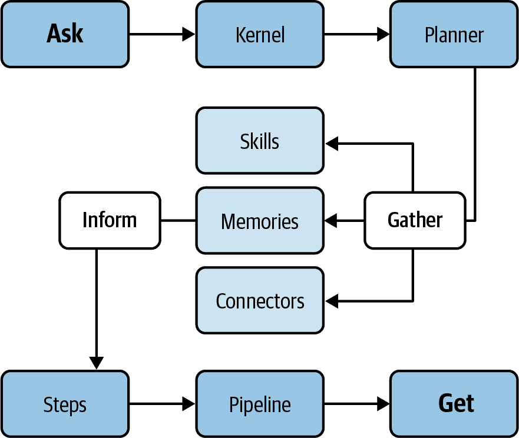
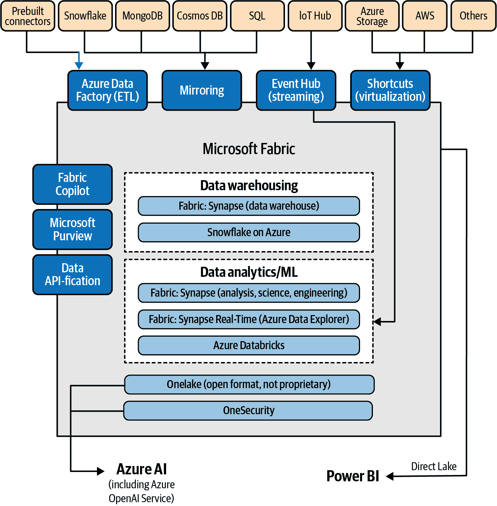

# 第四章。额外的云和 AI 功能

生成式 AI 应用远不止“只是一个大模型”。如您所见，LLM 扮演着核心角色，但还有其他相关的组件可以补充 Azure OpenAI 服务的功能：通过 Azure OpenAI API 或沙盒进行微调、与 Azure 认知搜索和/或 Azure OpenAI 嵌入进行归一化、使用 Bing 搜索 API 的实时搜索能力等。

此外，我们还有一些新的工具，允许我们进一步扩展 LLM 的能力。任何生成式 AI 和 Azure OpenAI 采用者的精选工具可能包括插件、LMM 集成、数据库等。现在让我们更详细地探讨这些内容。

# 插件

人工智能应用中最重要的新术语之一是“插件”的概念。我们可以将其定义为直接访问高级功能的接口，将微软的 Azure OpenAI（或 OpenAI 的 ChatGPT）与其他系统连接起来。例如，有来自 Expedia、FiscalNote、Instacart、KAYAK、Klarna、Milo、OpenTable、Shopify、Slack、Speak、Wolfram 和 Zapier 等公司的[插件](https://oreil.ly/MIQOJ)。它们是 Azure OpenAI 的外部组件，其性质和商业模式取决于开发商公司。

此外，[微软于 2023 年 5 月宣布](https://oreil.ly/hpj1M)其自己的插件集合，将其定义为“标准化的接口，允许开发者构建和消费 API 以扩展大型语言模型（LLM）的功能，并实现 GPT 在 Azure 和微软生态系统中的深度集成。”这些插件包括直接接口到 Bing 搜索、Azure 认知搜索、Azure SQL、Azure Cosmos DB 和 Microsoft Translator。作为开发者，这意味着您可以通过最小化开发和集成工作，将 Azure OpenAI 与其他微软和 Azure 相关的组件连接起来。

# LLM 开发、编排和集成

此外，还有一些面向开发者的组件，允许将现有的 LLM 与其他服务结合，无论编程语言如何。现在让我们深入了解这些选项。

## LangChain

[LangChain](https://oreil.ly/TpuFf) 是一个开源框架，您可以使用它来开发由语言模型驱动的应用程序。它提供各种与语言相关的实用工具和工具（例如，嵌入、管道、代理、插件），并且是您在第三章中较早看到的某些加速器的关键组件之一。[官方文档](https://oreil.ly/T5bxE)讨论了六个关键领域，按复杂度递增的顺序列出：

LLMs 和提示

这包括提示管理、提示优化、适用于所有 LLM 的通用接口以及与 LLM 一起工作的常用实用工具。

链

链接不仅限于对单个 LLM 的调用，而是涉及一系列调用（无论是 LLM 还是其他工具）。LangChain 提供了一个标准接口用于链，与许多其他工具的集成，以及针对常见应用的端到端链。

数据增强生成

数据增强生成涉及特定类型的链，这些链首先与外部数据源交互以获取用于生成步骤的数据。示例包括对长篇文本的总结以及针对特定数据源的问题/答案。

代理

代理涉及一个 LLM 做出关于采取哪些行动的决定，执行该行动，观察结果，并重复此过程直到完成。LangChain 提供了一个标准接口用于代理，提供了一系列可供选择的代理，以及端到端代理的示例。

记忆

记忆指的是链/代理调用之间的持久状态。LangChain 提供了一个标准接口用于记忆，一组记忆实现，以及使用记忆的链/代理的示例。

评估

生成模型通常很难用传统指标进行评估。评估它们的一种新方法是使用语言模型本身来进行评估。LangChain 提供了一些提示/链，以协助进行此类评估。

微软 AI 专家和《用 ChatGPT 和 OpenAI 模型构建现代生成式 AI》（Packt）一书的作者[Valentina Alto](https://oreil.ly/ZTYEf)撰写的文章[“介绍 LangChain 代理”](https://oreil.ly/uVska)解释了 Azure OpenAI 服务与 LangChain 的实现示例。您还可以查看 LangChain 和 Azure OpenAI 服务的[官方集成文档](https://oreil.ly/HGIXQ)。

## 语义内核

[语义内核](https://oreil.ly/Xrcss)是一个开源 SDK，它帮助将 Azure OpenAI 服务和其他 LLMs（大型语言模型）与常规编程语言（如 C#、Java 和 Python）相结合。该 SDK 包括提示链、递归推理、总结、零样本/少样本学习、上下文记忆、长期记忆、嵌入、语义索引、规划、检索增强生成、外部知识库以及“使用自己的数据”选项等功能。

内核的端到端概念包括你在图 4-1 中可以看到的构建块。

###### 图 4-1\. 语义内核构建块（来源：改编自微软[Microsoft](https://oreil.ly/lODC4)的一张图片）

让我们更详细地看看图中的每一部分：

ASK

指的是您向语义内核提供的输入，这可能是一个自然语言中的问题或指令。例如，包括“你能说出世界上最高的山是什么吗？”或“压缩这段文字。”这样的查询，或者“Condense this piece of text.”这样的命令。语义内核试图通过其多样化的能力来解释您的 ASK 并满足它。

内核

代表管理你的 ASK 的核心处理器，它编排人工智能服务、记忆、模型和附加组件的混合，以构建响应。你可以根据你的偏好调整内核的设置和参数。

规划者

规划者是内核的一个内在方面，它巧妙地将功能组合在一起，制定解决你的 ASK 的策略。如果提出像“写一首关于月亮的俳句”这样的请求，规划者可能会结合与主题启动、押韵和诗歌结构相关的功能。

汇聚

在计划的这个阶段，内核开始从包括人工智能模型、记忆存储、连接器或庞大的外部知识库在内的各种渠道收集数据。如果你对“地球上最大的哺乳动物”感兴趣，内核可以调用像 Bing 或维基百科这样的资源来获取答案。

技能

总结语义内核在处理你的 ASK 时的熟练程度，利用其庞大的组件。技能可能从基础到复杂不等，这取决于步骤和来源的复杂性。技能的例子包括阐明、解释、创作、分类，甚至回答查询。将技能视为你人工智能应用程序的功能“解剖学”。

记忆

系统能够存储、回忆和处理从先前交互、任务或外部获取的数据中提取的信息。这与人类记忆的工作方式类似，但以数字格式存在。

连接器

连接器作为桥梁，使语义内核能够与各种人工智能平台、模型、记忆或外部数据宝库接口。使用连接器，可以访问像 OpenAI、Azure OpenAI 或 ChatGPT 这样的模型，以及像《大英百科全书》这样的记忆系统或信息宝库。

通知

这个阶段，内核会通知你 ASK 的结果，这可能表现为文本、视觉、音频或特定的活动。假设你提示“描绘一个宁静的森林”，内核可能会通过策划一个基于图像的查询并展示结果图片来响应。

步骤

构成解决你的 ASK 的计划的基础块，每个步骤可能被构造成一个提示或内置功能。提示涉及发送到 Azure OpenAI 模型的基于语言的指令。相比之下，原生功能指的是标准化的编码操作，通常用 C# 或 Python 等语言编写。例如，在回答“描述光合作用的过程”时，一个步骤可能涉及一个指向核心机制的提示，而另一个步骤则利用原生功能以项目符号格式对它们进行排列。

管道

实质上是一系列旨在解决您的 ASK 的操作。管道可以是预设的，也可以由规划者动态构建。对于像“撰写关于技术演变的叙事”这样的请求，管道可以包括概述、撰写引言、阐述主要内容、结论和最终安排等阶段。

GET

表示您可以在语义内核上启动的操作，以获取其组成部分的详细信息或数据。例如，您可能可以使用 GET 来查看内核的内存库，探索其过去的见解库。

最后但同样重要的是，语义内核是微软内部用于生成 AI 的项目之一，由约翰·梅达博士领导，有关信息可在 [官方 GitHub 仓库](https://oreil.ly/DRPCl) 上找到。如果您想继续探索语义内核，以下是一些额外的资源：

+   [带有语义内核“食谱”的官方食谱](https://oreil.ly/c-Dej)

+   [约翰·梅达博士的 LinkedIn Learning 免费课程](https://oreil.ly/TXE5e)

+   创作者的一些话 ([采访](https://oreil.ly/TWIMU) 和 [视频](https://oreil.ly/A84pK))

## LlamaIndex

[LlamaIndex](https://oreil.ly/QZtYV) 是一个用于 LLM 应用程序的数据框架。这是您在 Azure OpenAI 之外生成 AI 应用的另一种选择，包括企业和 [开源](https://oreil.ly/DOHDI) 选项。它通过一系列 RAG 场景和编排能力提供简单性，这些能力结合了 LLM 和内部数据源，并且在开发者社区中获得了良好的反响。根据您如何使用它，它可以与语义内核和 LangChain 相当、替代或补充。

## Bot Framework

[Microsoft Bot Framework](https://oreil.ly/ssiQu) 是 ChatGPT 之前机器人时代的经典之作。它不依赖于 Azure OpenAI 服务，但一些采用者正在将其用于特定场景的集成（例如，在 Microsoft Teams 或其他通信渠道中部署启用 GPT 的项目），并且它包括一系列旨在帮助构建、测试、部署和管理智能聊天机器人的工具和服务：

Bot Framework SDK

一个模块化和可扩展的软件开发工具包，允许您使用 C#、JavaScript、Python 或 [Java](https://oreil.ly/jpXNm) 构建机器人。该 SDK 提供了用于常见机器人场景的库和模板，例如对话框、状态管理、身份验证等。

Bot Framework Composer

一个开源的视觉创作工具，允许您使用图形界面和自然语言提示创建机器人。您可以使用 Composer 设计机器人的对话框、技能和答案，而无需编写代码。

Azure Bot Service

一种云服务，允许您在 Azure 上托管您的机器人，并将其连接到各种渠道和设备，例如 Facebook Messenger、Microsoft Teams、Skype、网页聊天等。Azure Bot Service 还提供分析、调试、安全等功能。

Bot Framework Emulator

一个桌面应用程序，允许您在本地或远程测试和调试您的机器人。您可以使用模拟器从您的机器人发送和接收消息，检查机器人状态和活动，以及访问机器人日志。

Bot Framework 连接器

一个处理您机器人与频道或用户之间通信的服务。连接器定义了一个 REST API 和一个活动协议，说明您的机器人如何发送和接收消息和事件。

如您所见，Microsoft Bot Framework 是一个针对经典机器人（非 LLM）场景的完整解决方案，Azure Bot Service 是某些官方 Azure OpenAI 加速器的一部分。完整规范可通过其[官方 GitHub 仓库](https://oreil.ly/Z-meG)获取。

## Power Platform、Microsoft Copilot 和 AI Builder

除了 SDK 和开发框架之外，还有其他用于无代码和低代码实现的组件。Power Platform 的[工具和服务套件](https://oreil.ly/4xSv4)有助于构建和管理低代码应用程序，自动化工作流程，分析数据，并构建聊天机器人，将这些连接到任何启用了 Azure 功能的 AI，包括 Azure OpenAI。[Microsoft Copilot/Power Virtual Agents (PVAs)](https://oreil.ly/YV0SN)是 Power Platform 的组件之一，允许您使用低代码图形界面创建智能聊天机器人。您可以使用 PVAs 构建能够提供答案、执行操作并以自然语言与用户交互的机器人。

这些组件与 Azure OpenAI 进行无代码/低代码生成式 AI 应用交互有三种不同的方式：

+   通过使用 Microsoft Copilot/PVAs 的*Azure OpenAI 连接器*，通过 Azure OpenAI API。该场景的实现示例可在[网上](https://oreil.ly/5AQE8)找到。这是一个高度手动化的选项，但仍然易于实现。

+   通过利用 PVA 的[增强对话（又称*生成式答案*）功能](https://oreil.ly/_qrYJ)。此功能允许机器人从多个来源查找并展示信息。生成式答案可以用作聊天机器人的主要解决方案，或者在其他作者的主题无法解决用户查询时作为后备方案。

+   除了这两种机器人类型的应用程序之外，您还可以利用 Power Platform 的[AI Builder 组件](https://oreil.ly/0Az00)及其与 Azure OpenAI 的[集成](https://oreil.ly/LdRQ0)进行自动化和应用程序开发。YouTube 上的[视频演示](https://oreil.ly/dozKD)说明了实现过程。

这些开发构建块是您使用 Azure OpenAI 继续发展您的生成式 AI 项目的工具。随着时间的推移，列表可能会增长，但这个选择代表了今天任何生成式 AI 实践者最相关的部分。现在让我们检查可用于 Azure 首次实施的可用向量数据库，这将使您的基于嵌入的项目与 Azure OpenAI 兼容，并允许您保存生成的向量。

# 数据库和向量存储

如前所述，嵌入是一种生成主题之间距离的数学表示的技术，这种信息就是我们所说的“向量”。由于它们能够连接语言上相关的信息，它们在生成式 AI 领域变得相关。这对于搜索引擎、聊天会话期间的文档检索等都是相关的。为此，我们依赖于一种特定的数据库，称为[向量数据库](https://oreil.ly/r8kST)，因为它更适合存储和管理这类信息。

向量数据库的主要优势在于它允许基于向量的距离或相似度进行快速且精确的数据相似性搜索和检索。这意味着，与传统的方法相比，即基于精确匹配或预定义标准查询数据库，您可以使用向量数据库根据其语义或上下文意义找到最相似或相关的数据。向量数据库用于存储、搜索和检索代表文档、图像和其他在机器学习应用中使用的数据类型的向量（之前通过嵌入技术生成）。

从 Azure OpenAI 服务的角度来看，存在不同的原生 Azure 服务或可通过 Azure 部署的开源组件，它们将作为向量数据库。现在让我们来了解一下这些服务。

## Azure AI Search 中的向量搜索

向量搜索是来自现有 Microsoft Azure AI 服务之一的最新功能，特别是[Azure AI Search](https://oreil.ly/-AIvZ)。这个组件是嵌入和检索方法实现的一部分。

[向量搜索](https://oreil.ly/NAq-o)是一种新的索引、存储和检索搜索索引中向量嵌入的能力。您可以使用它来实现典型用例，如相似性搜索、多模态搜索、推荐引擎或 grounding/RAG 实现。其主要区别（根据[其创造者的说法](https://oreil.ly/Rp75V)）是能够启用不仅经典的向量搜索，而且“一种结合了向量和传统关键词得分的混合搜索方法，并且比单一搜索方法单独提供更好的检索结果质量”，如图 4-2 所示。

###### 图 4-2\. Azure AI Search 中的向量和混合搜索功能（来源：改编自微软的一张图片）

您可以利用此高度发展的技术的[官方文档](https://oreil.ly/ThbR-)，以及有关如何通过 Azure AI Search 的[向量搜索功能](https://oreil.ly/yCCjU)来[保存先前生成的向量](https://oreil.ly/kYtXx)和如何[执行向量查询](https://oreil.ly/Zyfb3)的技术指南。

## Cosmos DB 中的向量搜索

向量搜索是来自另一个 Azure 原生服务的类似向量功能，在这种情况下是[Azure Cosmos DB](https://oreil.ly/Cx4hl)，这是一个托管的多类型 NoSQL 数据库，支持多种键值、列、图和文档格式。它包括开源选项，如 PostgreSQL、MongoDB 和 Apache Cassandra。

向量搜索功能来自[Azure Cosmos DB for MongoDB vCore 产品](https://oreil.ly/8KAtS)，该产品在 Azure 中提供完全托管的 MongoDB 兼容数据库服务。该[新功能于 2023 年 5 月宣布](https://oreil.ly/Evn2W)，它是 Azure Cognitive Search 选项的替代品。这是一个 MongoDB 已经是技术栈一部分的环境的选择。您可以查看[额外的实现示例仓库](https://oreil.ly/5pwnr)，以及[以 Semantic Kernel 作为编排器的实现](https://oreil.ly/UXVhD)。

## Azure Databricks Vector Search

与 Azure AI Search 和 Cosmos DB 一样，Azure Databricks 还有一个出色的原生选项。它提供了[Databricks Vector Search](https://oreil.ly/aWOhX)功能，该功能直接集成到无服务器引擎中，并集成到[Unity Catalog](https://oreil.ly/iVOyi)以实现数据和 AI 治理。如果您想在 Azure 中利用一个本地的端到端平台，并通过多种编排引擎（例如，[LlamaIndex](https://oreil.ly/9R2wP)，[LangChain](https://oreil.ly/lEpJo)）将 Azure OpenAI 连接到向量存储，这是一个不错的选择。

## Azure 上的 Redis 数据库

另一个替代选项是[Azure Cache for Redis](https://oreil.ly/M14AR)，这是一个通过基于 Redis 开源数据库的内存缓存加速应用程序数据层的解决方案。它包含 RediSearch，这是一个提供全文搜索能力的 Redis 模块。Azure 版本建立在 Redis 引擎之上，并设计用于与 Redis Enterprise 一起使用。

与前两种选项类似，Azure Cache for Redis 已经发展并集成了[新的向量搜索功能](https://oreil.ly/TffQk)，该功能结合了高性能缓存解决方案的力量和向量数据库的灵活性，为开发者和企业开辟了新的领域。与 Cosmos DB 一样，这个选项非常适合那些已经将 Redis 或 Azure Cache for Redis 作为其技术栈一部分的公司。

## 其他相关数据库（包括开源数据库）

可用的其他选项包括您可以通过 Azure 利用的本地和开源解决方案：

[pgvector](https://oreil.ly/MrXx1)

对于[Cosmos DB for PostgreSQL](https://oreil.ly/0zLAU)和[Azure Database for PostgreSQL](https://oreil.ly/ZoCki)中的向量相似度搜索，这是 Azure 中[PostgreSQL](https://oreil.ly/eicMh)的本地选项。

[Elasticsearch 向量数据库](https://oreil.ly/kBZto)

可在 Azure OpenAI Playground 中找到，直接集成到[On Your Data 功能](https://oreil.ly/kb6Mf)。

[Neo4j](https://oreil.ly/ZeDfD)

使你能够使用图数据实现 RAG 模式。一个利用知识图力量的好选择，[可在 Azure 上使用](https://oreil.ly/Yx9Sk)，包括 [测试它的加速器](https://oreil.ly/Knsgw)。

[Azure 上的 Pinecone](https://oreil.ly/VVUhS)

自 2023 年 7 月以来已提供私有预览版，这允许通过 Azure 直接部署 Pinecone 向量（商业，完全托管）数据库。这里有一个使用 Azure OpenAI 服务和 Pinecone 数据库的 [实现示例](https://oreil.ly/aoRAk)。

[Milvus](https://oreil.ly/evSww)

一个开源的向量数据库项目，[可在 Azure 上找到](https://oreil.ly/pp5mc)。它是主要的开源竞争者之一，也是 [Linux 基金会毕业项目](https://oreil.ly/DFoM9)。

[Azure 数据探索器](https://oreil.ly/jolGS)

对于向量相似搜索，另一个使用 Azure 原生服务存储嵌入的向量存储选项。这里有一个 [逐步说明](https://oreil.ly/TwpP-)。

其他通过容器部署的向量数据库（非 PaaS）

[Weaviate](https://oreil.ly/p3osX)、[Chroma](https://oreil.ly/iCwUQ)、[Vespa](https://oreil.ly/tWhdm)、[Qdrant](https://oreil.ly/E37Kz) 等。

此外，即使它不是一个向量存储（只是一个创建内存中向量存储的库），你也可以探索 [Faiss](https://oreil.ly/Vd9ZW)，Meta 的用于高效相似搜索和密集向量聚类的库。它通过 Azure ML Prompt Flow 的 [索引查找工具](https://oreil.ly/1IpVq) 允许在用户提供的基于 Faiss 的向量存储中进行查询。

随意探索所有这些向量存储和数据库选项，以及 [OpenAI 烹饪书列表](https://oreil.ly/9o2Wh) 中的其他选项。最简单的方法是利用本地服务，如 Azure 认知搜索或 Azure Cosmos DB，但选择将取决于你的实现方法。现在让我们看看一些你可能需要用于你的生成式 AI 项目的额外技术构建块。

# 生成式 AI 的额外 Microsoft 构建块

除了本章中我们已经涵盖的内容之外，还有一些可以为我们 Azure OpenAI 项目利用的集成服务和正在进行的研究项目。让我们深入了解其中的一些。

## Azure AI 文档智能（以前称为 Azure 表单识别器）用于 OCR

我们之前分析的一些基础场景依赖于图像和 PDF 文档作为主要的知识来源，除了基础 LLM。如果我们想将 LLM 的知识与那些图像和 PDF 中的信息结合起来，我们需要提前从那些文档中提取信息，并将其从源格式转换为相关格式，如 JSON 或 JSONL。

对于 PDF 文件，从文档中提取文本的经典技术是[OCR（光学字符识别）](https://oreil.ly/f3IcI)。这是一个成熟的技术，它可以识别文档中的每一个字符，以读取和提取其信息供以后使用。

如果我们想利用本地的 Azure 服务来执行 OCR 任务，有一个名为[AI 文档智能（之前称为表单识别器）](https://oreil.ly/f6YWE)的 Azure AI 服务。根据官方网站，它是一个“应用高级机器学习从文档中自动且准确地提取文本、键值对、表格和结构的人工智能服务。”这是在执行微调、嵌入等操作之前的一个初步步骤。这篇[官方文章](https://oreil.ly/2D87V)解释了将 AI 文档智能与 Azure OpenAI 服务结合以直接对文档进行查询的端到端过程。

作为替代，之前提到的 Azure AI 搜索服务包括一个类似的[OCR 认知技能](https://oreil.ly/SIhrW)，它可以与包含文本的图像和文档一起工作。

## Microsoft Fabric 的湖屋

对于任何希望实施其 Microsoft Azure 启用数据策略以构建湖屋架构的公司来说，这个选项是必不可少的：[Microsoft Fabric](https://oreil.ly/Ha1sU)。这个资源可能足以成为一本全新的书籍的主题，但你应该知道，它是一个帮助组织创建、使用和管理数据洞察的平台。正如你在图 4-3 中可以看到的，它包括数据集成和科学工具、数据湖、治理和可视化元素。Fabric 与 Azure OpenAI 之间的关系是双向的。Microsoft Fabric 中的数据可以作为 RAG 模式的来源，但你也可以在 Microsoft Fabric 数据工具中[利用 Azure OpenAI 模型](https://oreil.ly/0JHzt)。它还包含一个 GPT 启用的 Copilot，用于自然语言的数据分析。如果你想了解更多信息，你可以探索[官方文档](https://oreil.ly/hVfoG)、[具体示例](https://oreil.ly/8LFSp)和[REST API 规范](https://oreil.ly/4JcB6)。

###### 图 4-3. 带有 Microsoft Fabric 的湖屋

## Microsoft Azure AI 语音

另一个互补的服务是[Azure AI 语音](https://oreil.ly/-HLPL)，它包括语音转文本、文本转语音、语音翻译和说话人识别功能，这些功能可用于你的 Azure OpenAI 启用应用程序中的语音启用特性。这对于可访问的界面非常有用，用户可以通过语音与生成式 AI 引擎进行通信。此外，还有[视觉头像功能](https://oreil.ly/1aXfO)，这将帮助你向你的实现中添加虚拟面孔。

## Microsoft Azure API 管理

[Azure API Management](https://oreil.ly/4uV20) 是一个支持所有企业级 Azure OpenAI 部署的横切元素，允许你管理、平衡和监控你的不同订阅、模型和[API 密钥](https://oreil.ly/w6Jht)。它非常适合成本管理和多部门计费。

## 持续的微软开源和研究项目

在以下内容中，我们将回顾一系列正在进行中的微软研究项目，它们都与大型语言模型（LLM）的开发相关。其中大部分还不是生产就绪的构建模块，即使它们不会被常规的生成式人工智能从业者使用，你也可能想看看最新的生成式人工智能相关进展：

[DeepSpeed](https://oreil.ly/4faw5)

由微软开发的一个深度学习优化库，旨在帮助研究人员更快、更高效地训练大规模模型，比之前可能的规模大 10 到 100 倍。此外，[DeepSpeed Chat](https://oreil.ly/Z1ygr) 是一个开放系统框架，用于实现端到端强化学习与人类反馈（RLHF）训练体验，以生成不同规模的生成式人工智能模型。

[ONNX Runtime](https://oreil.ly/0Sbqp)

一个跨平台的推理和训练机器学习加速器，旨在通过提供更快的模型推理来改善客户体验，并降低训练成本。它在 2019 年由微软[开源](https://oreil.ly/Od81D)，基于[ONNX 开放格式（由微软与 Meta 和 AWS 共同开发）](https://oreil.ly/8wflB)。它包括[DirectML 执行提供者](https://oreil.ly/pvwrw)，这是 ONNX Runtime 的一个组件，用于加速 ONNX 模型的推理。

[JARVIS/HuggingGPT](https://oreil.ly/i94HD)

一个项目，旨在使用 LLM 作为接口，连接来自 Hugging Face 和其他不同 AI 模型，以解决复杂的 AI 任务。

[ToxiGen](https://oreil.ly/QPTVC)

一个由微软提供的大型机器生成数据集，用于仇恨言论检测。

[LLM-Augmenter](https://oreil.ly/8AKVq)

一个旨在通过利用外部知识为 LLM 和自动化反馈来减少幻觉（即 LLM 提供错误答案）的项目。

[AdaTest](https://oreil.ly/655LO)

一个微软项目，旨在通过自适应测试寻找和修复自然语言/机器学习模型中的错误。

[LoRA（低秩自适应）](https://oreil.ly/l4klw)

有助于减少 LLM 的训练参数数量，使这个过程对存储和计算的需求降低。

[Guidance](https://oreil.ly/V7VzS)

一个微软项目，旨在比传统的提示或链式操作更有效地控制现代语言模型。

[PromptCraft-Robotics](https://oreil.ly/6w_-c)

一个旨在结合 ChatGPT 和无人机、摄像头机器人等机器人系统的研究项目。

[Gorilla LLM](https://oreil.ly/7b-nN)

微软研究院与加州大学伯克利分校的合作，他们开发了一个连接到 API 的 LLM，这意味着它可以提供适用于不同主题的适当 API 调用，包括 PyTorch Hub、TensorFlow Hub、HuggingFace、Kubernetes、OpenAPI 等。这是向更通用类型智能迈出的重要一步。

[PowerProxy AI](https://oreil.ly/rkSfN)

一个帮助监控和处理 Azure OpenAI 服务端点流量和流向的项目。

[AutoGen](https://oreil.ly/YkztN)

一个框架，它使您能够使用能够相互交谈以解决任务的多个代理来开发 LLM 应用程序。

[UniLM](https://oreil.ly/xokVD)

一个包含一系列研究论文和其他 LLM 相关 GitHub 存储库链接的 Microsoft 存储库。

[LIDA](https://oreil.ly/73woE)

一个 Microsoft 库，用于使用 LLMs 自动生成可视化和信息图表。

[“思维算法”](https://oreil.ly/WDK37)

一篇研究论文，探讨了使用类似人类推理技术的潜在 LLM 改进。

[PromptBench](https://oreil.ly/X-6-Q)

一个用于 LLM 评估的 Python 包。

[Promptbase](https://oreil.ly/RKDGV)

一系列最佳实践，以获得 LLMs 的最佳性能。

[AICI](https://oreil.ly/kseB7)

一个实时限制和指导 LLMs 输出的人工智能控制器接口。

[Olive](https://oreil.ly/JkcW3)

一个硬件感知的模型优化工具，用于压缩、优化和编译。

[Phi-3](https://oreil.ly/-octd)

一个革命性的开源小型语言模型（SLM），可通过 Azure AI Studio 和[Hugging Face](https://oreil.ly/whwMD)获取。

[Orca/Orca-2](https://oreil.ly/PvATt)

一个 Microsoft 研究项目，使用特定领域的数据专门化 SLMs。

[PyRIT (Python Risk Identification Tool for generative AI)](https://oreil.ly/azSbW)

一个强大的框架，使您可以使用 Azure OpenAI 和其他 LLMs 进行生成式 AI 应用程序的红色团队活动。

[LLMLingua](https://oreil.ly/7VUz2)

一种提示压缩方法，通过最小性能损失加速 LLMs 推理，从令牌消耗和延迟的角度使模型更高效。

由于生成式 AI 是一个高度发展的领域，我旨在为您提供行业试图实现快速概述，以及您已经了解的核心 Azure OpenAI LLM 功能。

# 结论

本章是我们在第三章中讨论内容的延续，它包括一个您可以利用以创建非常高级的云原生架构的项目和技术生态系统。其中大部分是额外的和补充的，对于实现第三章中的某些技术方法来说是必需的。

这是一个高度发展的领域，因此请将本章视为您生成式 AI 实践者旅程的初始工具箱。下一章将聚焦于 LLMOps（LLM 操作，是 DevOps 和 MLOps 概念的演变），以及如何处理生产级话题，如性能、安全和隐私。让我们一起来探索它。
