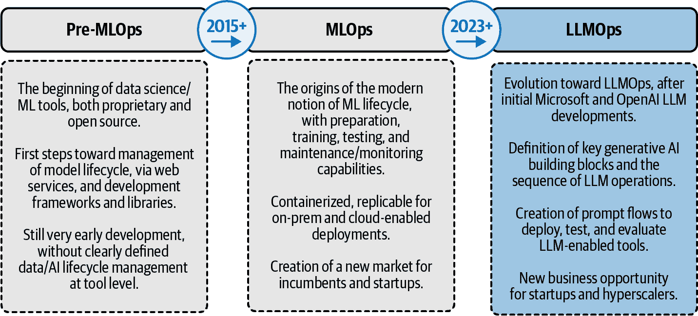
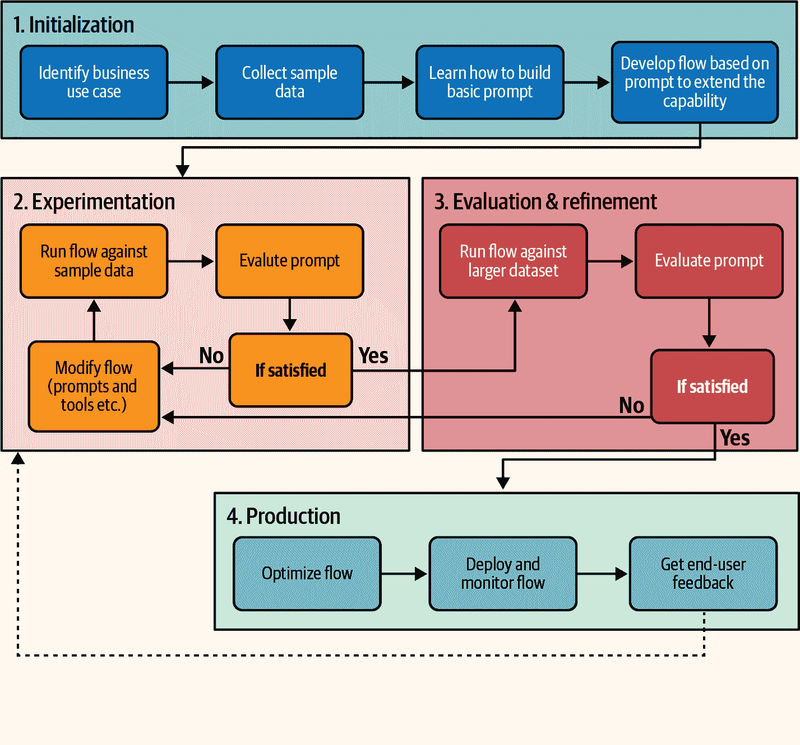
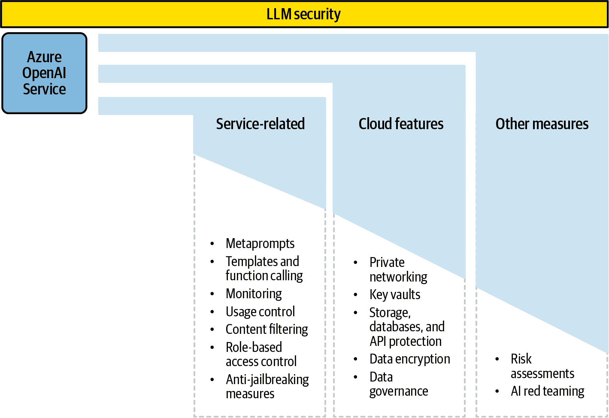

# 第五章\. 实施生成式 AI 的运营

在这一点上，我们已经探讨了生成式 AI 和 Azure OpenAI 服务的演变，云原生生成式 AI 应用开发的主要方法，以及使用 Azure 的 LLM 启用应用的 AI 架构和构建块。

在本章中，我们将探讨从实施到生产级部署的主要考虑因素。为此，我们将讨论高级提示工程主题、相关操作、安全和负责任的 AI 考虑因素。所有这些都将有助于实现云原生、生成式 AI 启用应用的适当企业级实施。

# 提示工程的技艺

*提示工程*是那些令人惊讶地颠覆了现有 AI 技能框架的学科之一。在 OpenAI 的 ChatGPT 之前，没有人能想象，仅使用自然书面语言与 AI 模型互动的能力将成为尝试采用、测试和部署其生成式 AI 系统的公司中最宝贵的技能之一。如果有一个类似于著名的[“数据科学家：21 世纪最性感的工作”](https://oreil.ly/0ZFLS)的等价物，那就是提示工程，例如美国 Anthropic 公司的提示工程师职位，起薪为$300K+。

这也是一个高度发展的领域。最初，它只是向模型发送指令的一种简单方式，现在正变成一种“艺术”，允许你同时进行上下文化、安全化和运营 LLM。它结合了技术和创造性技能。有些人认为提示工程师和 QA（质量保证）技能之间存在相似之处，因为它们都包括同理心、创造力、技术测试、规划等。术语也是新的。类似于传统 API 的呼叫-响应动态，我们在这里讨论提示（请求）和完成（模型答案）。

[微软描述](https://oreil.ly/T7PuQ)提示工程为从 GPT 启用模型中获得最佳性能的关键元素，因为模型对提示的质量或形状非常敏感。以下是[使用 Azure OpenAI 服务的提示技术官方指南](https://oreil.ly/jJkyA)，适用于[聊天](https://oreil.ly/8SMeX)或[完成](https://oreil.ly/1VuzR)场景。表 5-1 以一般术语显示了推荐的技巧。

表 5-1\. 推荐的提示技术

| 推荐 | 示例 |
| --- | --- |
| *利用系统消息*（在提示的开头设置上下文、指令等）和*少量示例学习*（所需输入和输出的示例）作为提高性能的方式。* *元提示或系统消息：*“您是公司 X 的金融主题 AI 助手，如果有人询问其他内容，请说您无法回答。”*少量示例：*“如果有人询问产品 A 的价格，请将其重定向到这个 URL。” “如果有人询问公司服务，列出 A、B、C 和 D。然后请客户选择。” |
| *使用清晰的指令，定义预期的格式，并利用正例和反例。* “以两段回答，最多 1,000 个标记。” “避免谈论具体的股票价格，因为它们可能已经过时。相反，专注于列举客户可以找到这些价格的可信来源。” |
| *根据上下文或用户输入，调整提示词以适应多种场景或子任务，并使用变量作为技术来表示输入或输出中的动态或未知值（例如，$name 代表用户名或$date 代表当前日期）。* *将参数作为变量传递给字符串：*“为$age 岁的用户提供推荐，来自$location，根据当地语境调整语言。在回答问题时使用他们的名字$name。” |
| *应用条件逻辑，作为使用 if-then 语句或其他逻辑运算符来控制输出流程和内容的方式，例如根据某些条件或标准更改语气、格式或信息。* “如果用户提示中的情感主要是负面的，请使用友好、解释性、逐步的方法。” “如果用户提示语气友好，直接切入要点。最多一段。” |
| *通过将模型的输出作为下一次迭代的输入的一部分来使用反馈循环，例如将输出附加到提示中或用它来生成新问题或指令。* *元提示或系统消息：*“回答公司 X 的用户问题，并在回答时记住…<前一次讨论的输出>。解释你推理的原因。” |

[OpenAI 定义](https://oreil.ly/gtxFR)了自己的最佳实践集，以优化提示并获取最佳模型性能：

总是利用最新的模型。

这使您能够利用最新的进步和更新。确保您正在使用模型的最新迭代版本。这并不意味着使用最强大的模型，而是每个模型的最新版本。您始终可以从[官方 Azure OpenAI 模型页面](https://oreil.ly/BI5Ue)获取最新版本。

在一开始就包含指令。

将您的指令放在提示的开头。使用###或“"”等标记来明确区分这些指令和上下文。

追求具体性和细节。

在定义所需的上下文、结果、长度、格式和风格时，避免含糊不清。

通过示例提供清晰的输出格式。

示例可以帮助引导模型走向你期望的输出。例如，示例 1，示例 2 等。

从零样本方法开始，遵循一个渐进的过程。

这意味着在未提供任何说明性示例的情况下测试模型的具体问题。然后，进入少量示例场景，其中你向模型提供一个或多个示例，因为大型语言模型可以从其内容中学习和塑造。如果这些策略都没有产生预期的结果，考虑微调或使模型接地。

消除浮夸的描述。

优先考虑精确性和简洁性，而不是模糊和过于复杂的语言，以简化你的提示并提高模型的理解。

明确说明要做什么。

而不是仅仅指出应该避免什么，明确阐述期望的行动。这积极引导模型按预期执行。

使用代码生成中的引导词来推动模型。

当你的任务与代码生成相关时，“引导词”可以在引导模型走向特定模式时起到工具性的作用。

所有这些建议和[更多建议](https://oreil.ly/Xfw5-)都旨在减少*生成式 AI 模型幻觉*，这是 LLMs 基于其创造性能力创建非事实信息的能力（或限制）。这是所有生成式 AI 技术的常见话题，大多数高级架构都是创建的，以便 LLMs 不会提供虚构或错误的结果。除了微软和 OpenAI 的最佳实践之外，这个四步框架可以通过利用最佳的提示工程实践来帮助解决这个问题：

1. 包含。

这种策略建议在提示中包含具体指令，例如要求模型不要凭空捏造并坚持事实。通过提供明确的指南，AI 模型更有可能生成准确和事实性的内容。

2. 限制。

这种方法涉及限制 AI 模型的输出。例如，你可以从受限的选项列表中选择，而不是允许模型生成自由形式的字符串。通过限制输出，你可以确保生成的文本保持在期望的范围内，并且不太可能基于幻觉。

3. 添加思维链（CoT）。

这种策略建议采用“思维链”风格的指令，例如“逐步解决问题。”通过引导 AI 模型遵循逻辑和结构化的思维过程，它更有可能产生连贯和准确的文章。

4. 重复并定位。

这种技术涉及在提示中重复最重要的指令几次，并将它们放在提示的末尾。这是利用延迟效应，意味着 AI 模型更有可能记住并遵循最后呈现的指令。

通过在提示工程中实施这些策略，您可以提高 AI 生成文本的质量，并减少幻觉的可能性，从而产生更准确和可靠的内容。这对于企业中生成式 AI 的运营至关重要。

由于提示工程是一个高度发展的领域，我建议您通过社区专家的其他精彩外部资源来扩展您的知识：

[PromptsLab 的 Awesome-Prompt-Engineering 存储库](https://oreil.ly/ZmTev)

本存储库包含用于提示工程的手选资源，重点关注生成式预训练转换器（GPT）、ChatGPT、PaLM 等。它包括与提示工程相关的论文、教程、博客、视频、课程和工具。

[Lilian Weng 的博客](https://oreil.ly/lIbm7)

Lilian 是 OpenAI 的安全系统负责人。她的博客介绍了提示工程的概念，它带来的挑战和机遇，以及如何为不同任务设计有效提示的一些示例。

[Chip Huyen 的博客](https://oreil.ly/yQ7rt)

芯片是一位知名的行业专家，Claypot AI 的联合创始人，也是[*《设计机器学习系统》(O’Reilly)*](https://oreil.ly/7UWAL)一书的作者。她分享了一些构建 LLM 生产应用的最佳实践和技巧，例如如何选择合适的模型，如何优化推理速度，以及如何监控输出的质量和可靠性。

[Xavier Amatriain 的博客](https://oreil.ly/3jvie)

Xavier 通过[101（介绍和资源）](https://oreil.ly/ZT8WB)和[201（高级方法和工具包）](https://oreil.ly/n_unu)文章，以及[在线入门级提示工程培训](https://oreil.ly/jIbNt)分享了他丰富的知识。

DAIR.AI 的[提示工程指南](https://oreil.ly/JBB67)及其[相关 GitHub 存储库](https://oreil.ly/QzS_D)

提示工程的指南、论文、讲座、笔记本和资源，包括一系列[高级提示工程场景的示例](https://oreil.ly/0sWII)。

提示工程只是将我们的生成式 AI 实现投入运营的一个步骤。现在我们将探索与 Azure OpenAI 和 LLMs 相关的其他操作。

# 生成式 AI 和 LLMOps

如果我们考虑所有架构、模型和提示因素，并探索端到端 LLM 实现的预期工作流程，我们就会得到*LLMOps*的概念，这是一个新术语，用于定义企业中所有与 LLM 相关的操作。LLMOps 类似于[MLOps（机器学习操作）](https://oreil.ly/VLSZA)，它是一套工具和最佳实践，用于管理 ML 驱动应用的整个生命周期。

[LLMOps](https://oreil.ly/dgVl1) 是一门结合了多种技术以开发、部署和维护 LLM 和生成式 AI 应用的学科。这包括提示工程，但也包括部署和可观察性话题。与 AI 相关联的运营并非新事物，但近年来呈指数级增长，如图 5-1 图所示。

###### 图 5-1\. LLMOps 的演变

这在运营复杂性方面是一个演变，同时也是方法的可扩展性和商业平台可用性使其变得更简单：

截至 2015 年

这一时期代表了现代 MLOps 实践发展之前的时期。在这一时期，用于建模和推理的私有工具，但也出现了开源数据科学工具如 Python 和 R 的兴起。这些工具使得数据科学和机器学习更具灵活性和可访问性。

2015+

云原生和容器化的引入使得将模型投入生产以及以更稳健和更高效的方式扩展变得容易一些。这一时期见证了 MLOps 平台的增长，这些平台使用 docker 化的 ML 堆栈，并通过 Kubernetes 在本地或云中部署，包括可管理性和监控功能。

2023+

LLMOps 解决方案市场的开始。一个有希望但仍然非常新的领域（我们将在本章中探讨第一个 LLMOps 工具），专注于传统 MLOps 工具之外的特定功能。尽管如此，现有的 MLOps 和新的 LLMOps 方法在某种程度上是相似的，如图 5-2 图所示。

###### 图 5-2\. MLOps/LLMOps 和 AI 提供者/采用者活动范围的比较

总结来说，LLMOps 与 MLOps 相比，在 AI 模型提供者和采用者活动方面带来了完全不同的划分，考虑到预训练基础模型及其庞大的数据集的作用。在数据需求（格式、数量）、管道和流程的创建以及评估和监控模型结果的方法上也有明显的差异。此外，一些传统上专注于准备和测试 ML 模型的工程任务正在向提示工程转变。

此外，像 Databricks 这样的公司根据这些概念将 LLMOps 与传统的 MLOps 进行比较[链接](https://oreil.ly/Rle9o)。

+   LLMs 可以通过**新数据**进行**微调**以适应特定领域或任务，与从头开始训练相比，这减少了所需的数据和资源量。

+   LLMs 可以从**人类反馈的强化学习**中受益，这有助于提高它们的性能并在开放性任务中评估其输出。

+   LLMs 的性能指标与传统机器学习模型不同，例如[BLEU](https://oreil.ly/dWQ8D)和[ROUGE](https://oreil.ly/SRoZf)，或者 Azure AI Studio 中我们讨论过的[内置评估指标](https://oreil.ly/gfK28)。

+   大型语言模型（LLMs）可以与其他系统结合，例如网络搜索或向量数据库，以创建能够处理复杂任务如知识库问答的管道，甚至可以与更复杂的[多智能体系统（MAS）](https://oreil.ly/CXcJI)结合。

回到生成式 AI 活动，很明显，它们远远超出了简单的提示工程活动，并在系统和应用层面包括额外的考虑因素。技术 LLM 和提示相关的问题可以从许多不同的角度进行探讨。例如：

+   从*用户体验*的角度来看，通过预测客户问题并评估模型响应，并在生成式 AI 应用开发过程中包括用户体验设计师。

+   考虑到*应用能力*，包括：

    +   成本、延迟和令牌长度限制（例如，将任务拆分为更小的块）。

    +   明确指令、编排提示流，并在助手和系统角色之间来回切换。

    +   调整模型参数，如温度、输出格式等。

+   将核心 LLM 和提示活动与整体*架构设计*相结合：

    +   与架构师合作，解决复杂系统需求。

    +   在企业数据中采用高级模式如 RAG，以及将 AI 响应在企业数据中四舍五入，以获得准确的答案。

+   在设计阶段就包含合规性、安全性和责任问题——例如，选择最佳的 Azure 区域以确保欧盟国家数据驻留，或者在提示和完成级别选择最佳的过滤/审查设置。

在以下章节中，我们将从 Azure 和 Azure OpenAI 的角度探讨一些这些主题，以及可用的考虑因素和选项。让我们先从提示流和管道开始讨论。

## 提示流与 Azure ML

Azure AI Studio 和[Azure ML](https://oreil.ly/JyodR)是端到端机器学习生命周期的企业级 AI 服务，包括构建、测试、部署和管理机器学习模型。它们是包含[AutoML 功能](https://oreil.ly/i0jAV)的 PaaS，可以利用现有的预构建分类、回归、预测、计算机视觉和 NLP 模型。

随着 Azure OpenAI 服务加入 Azure AI 解决方案的行列，Azure ML 已集成一项名为*提示流程*的新功能。提示流程是您 AI 应用程序数据流和处理逻辑的图形表示（它还提供[Python 库](https://oreil.ly/_JxYW)和[Visual Studio 扩展](https://oreil.ly/FjBbh)）；这个 Azure ML 功能是一个开发工具，旨在简化 LLM 启用应用程序的整个开发周期。

微软[定义流程](https://oreil.ly/AI5N-)为可执行的流程，可简化基于 LLM 的 AI 应用程序的开发，并提供了管理和处理数据流的全面框架。提示流程包括三种不同的[流程类型](https://oreil.ly/BZRXb)：

标准流程

这是通用应用开发的[默认流程类型](https://oreil.ly/3yWpf)，用于指令（非聊天）场景。您可以使用各种内置工具创建一个连接 LLM、提示和 Python 工具的流程。您还可以使用类似笔记本的界面自定义和调试您的流程。

聊天流程

这是一个用于对话应用的[专用流程类型](https://oreil.ly/XlxTr)。您可以使用与标准流程相同的工具，但具有针对聊天输入/输出和聊天历史管理的附加功能。您还可以在原生对话模式下测试和调试您的流程。

评估流程

这是一个[针对评估场景的专用流程类型](https://oreil.ly/IGZNA)。您可以使用此流程使用内置或自定义评估流程来衡量您提示和流程的质量和有效性。您还可以使用图表和表格比较不同提示变体的结果。

无论提示类型如何，[提示流程平台](https://oreil.ly/jZEeX)都专注于 Azure OpenAI 和其他 LLM 在 Azure 中的不同实现阶段，包括您可以在图 5-3 中看到的四阶段流程。

###### 图 5-3. LLM 提示流程步骤（来源：改编自微软的一张图片）

让我们逐一分析每个步骤：

1. 初始化（或创建）

使用提示流程创作画布来设计和开发您的提示流程。它在一个提示流程中连接 LLM、提示和 Python 工具，并且可以生成多个[提示变体](https://oreil.ly/MWjlS)以调整 LLM 的输出。它还允许[与 LangChain 功能集成](https://oreil.ly/7GqOL)。

2. 实验（或测试）

在这个阶段，提示流程测试面板帮助您运行和调试您的提示流程。您可以看到您提示流程中每个节点及其变体的输入和输出。

3. 评估和改进

在这个阶段，你可以使用[提示流评估面板](https://oreil.ly/4NrIz)来评估你的提示[流版本/变体](https://oreil.ly/htoB5)的质量和有效性。你可以使用内置的评估流程或创建自己的自定义评估流程来衡量不同的指标，例如准确性、流畅性、多样性和相关性。你还可以在图表和表格中查看你的评估流程的结果。

4. 生产（或部署）

在这个阶段，你可以使用提示流部署面板将你的提示流[部署为实时端点](https://oreil.ly/FPZDN)，例如通过 Azure Kubernetes 服务（AKS）。你还可以通过[Azure Monitor](https://oreil.ly/0GS-u)来[监控端点](https://oreil.ly/XuSsH)，[故障排除](https://oreil.ly/XuSsH)，并使用 Azure AI/ML Studio 的[提示流运行时](https://oreil.ly/6UWqf)来管理它们。

提示流是一个非常强大（且不断发展）的工具，具有规划和部署基于提示的实现的能力。下一步是为这些生成式 AI 应用规划安全需求。

###### 注意

在撰写本书时，微软发布了一系列与这一部分和下一部分相关的功能[系列功能](https://oreil.ly/QdI37)，因为它们包括性能、安全和安全功能：

[AI 辅助安全评估](https://oreil.ly/GcCSo)

这个强大的功能将帮助你创建自动化的评估，以系统地评估和改进你的生成式 AI 应用，在部署到生产之前。你可以查看[透明度说明](https://oreil.ly/XKzEs)以了解如何以及何时使用它们。

[提示盾](https://oreil.ly/KwA_D)

此功能保护生成式 AI 开发免受直接和间接攻击。直接攻击是直接包含在提示中的攻击，而间接攻击发生在应用程序处理的信息不是由应用程序的开发者或用户直接编写的情况下。你可以从[官方文档](https://oreil.ly/_J-J9)中了解更多关于提示盾的信息。

[突出显示](https://oreil.ly/P_Oz6)

微软研究院的一项技术，利用[系统提示](https://oreil.ly/Wbc7V)来抵御间接攻击。

## 保护 LLM

创建高效的提示并管理所有必要的流程是实现企业级实施高性能的关键。然而，开发生成式 AI 应用的公司对安全要求很高，以降低任何潜在风险。正如你在图 5-4 中看到的，使用微软的 Azure 云和 Azure OpenAI 服务对任何 LLM 开发都有几个安全级别。

###### 图 5-4. 保护 LLM 的分层方法

此方法包括：

服务级措施

使用 Azure OpenAI 保护生成式 AI 实施的起点是管理所有与服务模型相关的主题，包括核心模型性能，以及提示、端点和 API 的保护。以下是一些实施这些措施的方法：

+   对于与模型的交互，通过 *系统消息/元提示* 方法进行上下文化，以定义和缩小主题范围。这允许您以编程方式避免设计上不希望出现的提示。

+   对于我们定义的可重复使用的文本字符串提示模板，通过 Azure 中的数据库进行存储和保护。无论格式如何，这些数据库都可以通过实施 [Azure Monitor 中的监控活动](https://oreil.ly/mp1Ls) 来安全地使用。

+   对于 Azure OpenAI 端点，Azure 应用网关提供了一个 [单一入口点和负载均衡](https://oreil.ly/6plOw)，以便快速且可靠地获取响应。应用网关可以作为 Web 应用程序防火墙 (WAF) 运行，提供针对常见基于 Web 的攻击的保护，配置了符合您的 OpenAI 应用程序要求的自定义规则集，以确保只有授权访问。但请注意，负载均衡不支持状态性操作，如模型微调、部署和微调模型的推理。

+   您还可以利用 [Azure OpenAI 的基于角色的访问控制 (RBAC)](https://oreil.ly/YJOZv)，根据他们通过生成式 AI 应用程序访问特定信息的权限来决定谁可以访问什么。如果您想为不同部门开发应访问不同信息的内部共飞行员，这将非常有用。

+   对于额外的安全控制措施，例如 [模型审计和监控](https://oreil.ly/4uV20)，Azure API 管理帮助授予 [对模型 API 的访问权限](https://oreil.ly/sQuG_)，利用 [Microsoft Entra ID](https://oreil.ly/EXO6A)（Azure Active Directory）组以及基于订阅的权限，启用 Azure Monitor 的请求记录，并为您的模型提供详细的用法指标和关键性能指标。

其他云级别措施

除了核心模型措施之外，还有其他安全和网络最佳实践可以帮助保护云原生架构的其余部分：

+   使用 *Azure Private Link* 将 API 管理连接到您的 Azure OpenAI 实例以及其他 Azure 资源，例如 [AI 搜索](https://oreil.ly/iBwcQ)。这可以帮助 [保护数据和流量](https://oreil.ly/jcELV) 避免外部暴露，并保持它们在私有网络内。您可以使用 [私有端点](https://oreil.ly/q0MUT) 在不同的虚拟网络之间进行连接。

+   启用*Azure 密钥保管库*来[存储生成式 AI 应用程序使用的安全密钥和秘密](https://oreil.ly/aTyqt)。这可以帮助防止对您的数据和模型进行未经授权的访问。或者，像[Databricks MLflow AI Gateway](https://oreil.ly/owP_k)这样的工具也可以帮助集中管理 LLM 凭证和部署，特别是对于结合 Azure OpenAI 服务和其他非 OpenAI LLMs 的情况。

+   将*Azure 存储*部署用于存储模型训练工件和数据，以及*存储 Defender*以添加一个检测存储账户潜在威胁的 Azure 原生[安全智能层](https://oreil.ly/cAjUN)。这有助于防止恶意文件上传、敏感数据泄露和数据损坏。此外，您还可以利用 Microsoft Sentinel 和*数据库 Cloud Defender*等服务，这是一种提供[攻击检测和威胁响应](https://oreil.ly/Xk9Q-)的安全服务，用于保护数据库，或者[API Defender](https://oreil.ly/FPScz)，这是一种提供保护、检测和响应能力的 API 服务。所有这些都可以帮助确保您的数据既可访问又安全。

+   利用 Azure 默认的[加密机制](https://oreil.ly/n9bqC)作为保护数据在静态和传输中的原生方式。更具体地说，Azure OpenAI 服务包括将数据持久化到云时自动加密数据的方法，以满足组织的安全和合规承诺。

+   通过使用[Microsoft Purview（微软统一数据治理解决方案）](https://oreil.ly/KFNn6)和第三方工具，如[CluedIn](https://oreil.ly/thi-L)或[Profisee](https://oreil.ly/Y4IPx)进行主数据管理（MDM）和数据质量，*治理数据和管理数据质量*。您将在本书的专家访谈中第第七章中了解更多关于这个主题的内容。

+   最后但同样重要的是，还有一些基于[架构良好框架](https://oreil.ly/jHwtt)的构建块，有助于构建高度安全的 Azure OpenAI 实施的全端着陆区。

一般的公司级治理措施

这些可能包括以下措施：

+   从一般的安全管理角度来看，[微软的 AI 安全风险评估](https://oreil.ly/YzOaS)是一个评估人工智能系统潜在风险和漏洞的过程，例如机器学习模型、数据管道和部署环境。微软开发了一个框架和工具，帮助组织进行 AI 安全风险评估并提高其 AI 系统的安全性，这可以用于 Azure OpenAI 和生成式 AI 的实施。

+   从**安全测试和风险缓解**的角度来看，[红队测试](https://oreil.ly/JLZeB)的概念定义了用于测试安全漏洞的系统对抗攻击。[针对 Azure OpenAI 和其他 LLM 的红队测试](https://oreil.ly/oDBO_)是一种测试生成 AI 系统安全和鲁棒性的实践。它涉及模拟对 AI 系统的对抗攻击，并确定可能影响其质量、可靠性和可信度的潜在危害或漏洞。红队测试是使用 LLM 的 AI 系统负责任开发和部署的重要部分。测试在 LLM 和应用/用户界面级别进行。

即使这种三级方法可以帮助确保并避免大多数安全风险，但这个新的开发领域仍需要持续的分析和改进。与任何其他生成 AI 主题一样，行业持续更新与 LLM 相关的潜在风险列表，了解这些风险可以帮助加强你的安全措施。

[OWASP 基金会](https://oreil.ly/WnMkm)详细列出了一系列在 LLM 应用程序中经常看到的主要风险和漏洞，突出了它们的潜在影响、利用的容易程度以及在现实世界应用中的普遍性：

提示注入

这是一种通过提供巧妙的输入来欺骗 LLM（大型语言模型），从而改变其行为的方式（例如，想象一个用于自动简历分析的 HR 应用程序，其中有人在一个隐藏的文本中插入一个提示，从而改变 AI 工具的后端）。一般来说，输入可以覆盖引导 LLM 的系统提示，甚至可以操纵 LLM 使用的数据来源。这包括越狱技术，这是一种利用提示操纵来绕过 LLM 聊天机器人使用策略措施的技术，使得生成违反聊天机器人政策的响应和恶意内容。所有这些问题都可能来自生成 AI 代码的任何部分，包括使用 LangChain 和 Semantic Kernel 等组件的开发。

不安全的输出处理

这是一个问题，当 LLM 的输出在使用前没有仔细检查时发生，使其他系统面临风险。输出可能包含有害内容，可能导致不同类型的攻击。例如，这可能在 LLM 连接并向数据库发送不安全查询的 RAG 场景中发生。

训练数据中毒

有人篡改用于训练 LLM 的数据，使其容易受到攻击或存在偏见，并影响其安全性、性能或伦理。

模型拒绝服务

攻击者让 LLM 做很多工作，消耗其资源，使其变慢或昂贵。问题更严重，因为 LLM 需要大量资源来运行，而用户输入难以预测。

供应链漏洞

LLM 应用程序可能因使用具有弱点的组件或服务而受到损害，导致安全攻击。这些组件或服务可能包括第三方数据集、预训练模型和插件。

敏感信息泄露

这种情况可能发生在大型语言模型（LLM）在响应中意外泄露私人数据时，允许未经授权的访问、隐私侵犯和安全漏洞。重要的是要清理数据并实施严格的使用政策以防止这种情况发生。这也可能适用于元提示泄露，向外部用户透露关键性能信息。

不安全的插件设计

当 LLM 插件具有不安全的输入和较差的访问控制时，这成为一个问题。这种应用程序控制不足使它们容易被利用，并可能导致远程代码执行等后果。

过度授权

基于 LLM 的系统可能会产生意想不到的后果。例如，如果 LLM 可以与控制其他系统（例如，AI 副驾驶控制自动驾驶汽车的一些基于软件的功能），它可能会增加攻击面。问题在于给予基于 LLM 的系统过多的功能、权限或自主权，这不仅会影响 AI 部分，还会影响连接的其余系统。

过度依赖

这发生在系统或人员过度依赖 LLM 而没有监督的情况下。他们可能会因为 LLM 生成的不正确或不适当的内容而面临虚假信息、沟通不畅、法律问题和安全漏洞等问题。它也可能产生影子 IT 问题，公司员工可能会使用未经批准的应用程序列表中的 LLM 启用系统。

模型盗窃

这发生在未经许可的情况下，有人访问、复制或窃取专有 LLM 模型。影响包括经济损失、竞争优势受损以及可能访问敏感信息。研究表明，甚至可能重新创建 LLM 的部分训练集。[重新创建 LLM 的部分训练集](https://oreil.ly/gvG-Q)。

此外，由于开源软件（OSS）的特殊性质，已有其他组织正在[探索与生成式人工智能开源软件相关的风险](https://oreil.ly/8vcyo)。尽管如此，保护封闭和开源模型将继续是一个重要的研究领域。现在让我们分析其他法律考虑因素。

## 管理隐私和合规性

保护生成式人工智能的发展是必须的，但它只是公司级实施的关键要素之一。还有其他合规性和数据隐私要求会影响技术选择，包括数据驻留、按地理区域提供模型可用性等方面的考虑。

为了这个目的，有一些与微软 Azure 和管理的 Azure OpenAI 服务相关的核心功能，有助于实现合规性并促进任何法律和审计活动：

+   Microsoft Azure 服务的通用*数据保护*机制，重点关注“赋予您对放入云中的数据的控制权”这一[关键原则](https://oreil.ly/SfBXe)。换句话说，您控制您的数据。这对于利用关键安全和数据保护功能，同时保持对数据的控制非常重要。

+   [合规信息](https://oreil.ly/lKBjQ)涉及所有与 Azure 相关的服务。这包括国际法规，如[GDPR](https://oreil.ly/hiTwi)、[CCPA](https://oreil.ly/2btT8)、[HIPAA](https://oreil.ly/Uy8hS)等。这保证了任何使用 Microsoft Azure（包括 Azure OpenAI）的实施都与所有监管要求保持一致。

+   通过[Azure AI Language](https://oreil.ly/b191_)进行[个人可识别信息（PII）检测和文档编辑](https://oreil.ly/kFlHF)，这可以使您的生成式 AI 场景在创建具有知识库的 RAG 启用场景之前对任何敏感数据进行初步过滤。例如，这对于医疗保健或金融场景中的个人信息非常相关。

+   与其他非 Azure 选项相比，*Azure OpenAI 作为托管服务的具体优势*。具体来说：

    +   *数据隐私和安全*：发送到 Azure OpenAI 服务的数据保持在 Microsoft Azure 内部，不会传递给 OpenAI（公司）进行预测。Azure OpenAI 服务自动加密任何持久化在云中的数据，包括训练数据和微调模型。它包括有关如何处理数据和提示的特定信息。有关此信息的任何更新，请参阅[官方 Microsoft 文档](https://oreil.ly/1hpAO)：

        > 您的提示（输入）和完成（输出），您的嵌入以及您的训练数据：
        > 
        > +   对其他客户不可用。
        > +   
        > +   对 OpenAI 不可用。
        > +   
        > +   不用于改进 OpenAI 模型。
        > +   
        > +   不用于改进任何 Microsoft 或第三方产品或服务。
        > +   
        > +   不用于自动改进您在资源中使用 Azure OpenAI 模型（除非您明确使用训练数据微调模型，模型是无状态的）。
        > +   
        > +   您微调的 Azure OpenAI 模型仅对您可用。
        > +   
        > Azure OpenAI 服务完全由 Microsoft 控制；Microsoft 在 Microsoft 的 Azure 环境中托管 OpenAI 模型，并且服务不与 OpenAI（公司）运营的任何服务交互（例如 ChatGPT 或 OpenAI API）。

    +   *区域可用性和私有网络*：Azure OpenAI 服务允许您定义模型的位置（基于特定的[模型区域可用性](https://oreil.ly/BI5Ue)）、数据处理的存储以及您的训练数据，这对于满足当地法规或客户偏好可能很重要。

    +   *负责任的内容过滤*：Azure OpenAI 服务提供额外的内容过滤层，以防止模型生成不适当或冒犯性的内容。在 API 级别，这意味着当内容被过滤时，响应可能包括[`finish_reason = content_filter`](https://oreil.ly/dQJ34)。

    +   *其他人工智能内容安全功能*：这些包括[越狱检测（现称为提示盾牌）](https://oreil.ly/_J-J9)、[受保护材料检测](https://oreil.ly/mbVoM)和[服务滥用监控](https://oreil.ly/hIfnG)。这些优势加上内容过滤，有助于提高使用 Azure OpenAI 服务应用的质量和安全。

    +   *支持和服务级别协议（SLA）以保证可靠性*：Azure OpenAI 服务提供更全面的技术支持和一项[服务级别协议（SLA）](https://oreil.ly/stFaz)，确保服务的高可用性。这可以为使用 Azure OpenAI 服务进行关键应用的客户提供更多信心和安心。

    +   *具体*的[*Azure OpenAI 产品条款*](https://oreil.ly/9LTNj)，包括数据、预期用途、知识产权和其他细节。这份文件记录了企业级实施的相关条件和微软的承诺。

    +   最后但同样重要的是，Azure OpenAI 在数据和提示级别（均被视为私有客户数据）提供定制的数据管理选项，例如 DELETE API 操作，以及[选择退出](https://oreil.ly/66UHN)自动提示监控和过滤有害内容的选项。

现在，让我们继续讨论生成式人工智能操作化的最后一个主题，该主题侧重于现有和未来的法规，以及使用 Azure OpenAI 服务实施时的负责任人工智能实践。

# 负责任的人工智能和新法规

新的生成式人工智能时代的直接后果是，所有社会行为者都普遍意识到了人工智能的潜在优势和风险。关于“人工智能伦理”的运动并不新鲜，但它们主要与学术界、人工智能观测站和国际协会有关，这些机构试图弄清楚应该指导“好人工智能”的原则，以及人工智能系统可能产生的潜在负面影响。现在，随着生成式人工智能和 ChatGPT 的到来，监管倡议正在加速，并包括对 LLM 等的新考虑。从平台的角度来看，Azure OpenAI 服务和 Azure AI Studio 已经发展并纳入了几个负责任的人工智能（RAI）措施。

本节包括在设计生成式人工智能解决方案时需要记住的上下文信息（例如，国际法规），以及一些有助于以负责任的人工智能方法实现生成式人工智能的资源，包括几个针对 RAI 和 LLM 的微软资源，包括 Azure OpenAI 服务模型。

## 生成式人工智能系统的相关监管环境

即使在国际层面（至少在 2024 年）人工智能法规仍在进行中，也有一些关键举措将帮助你了解监管者将关注什么，特别是对于你的生成式人工智能开发：

欧洲联盟（EU）的人工智能法案

这是针对人工智能系统的全面[监管](https://oreil.ly/JGDQh)的第一个例子，也是[其他国际监管](https://oreil.ly/x0Hi6)（例如加拿大的人工智能和数据法案、中国的人工智能法规）的关键参考。它主要基于几个风险级别，对提供者和采用者（在这种情况下，Microsoft 是 Azure OpenAI 模型的提供者，而你或你的公司是采用者）都有具体的义务。它还包括对生成式人工智能系统的*具体要求*。存在几个级别的人工智能风险：

不可接受的风险

这些是会对人们的安全、尊严或权利构成明确威胁的人工智能系统，例如那些操纵人类行为、利用漏洞或启用社会评分或大规模监控的系统。在严格条件和监管下，可能允许出于执法目的进行一些例外。你们的大多数应用永远不会达到这个级别，但了解“禁止”类型系统的重要性是重要的。

高风险系统

这些是会对人们的生活或社会运作产生重大影响的人工智能系统，例如在健康、教育、就业、司法或交通中使用的系统。这些系统在部署前后都必须满足严格的要求，例如确保数据质量、人工监督、准确性、安全性和透明度。它们还必须在欧盟数据库中注册。

根据你的行业和活动领域，与这类要求保持一致将很重要。一般来说，这将是一种提供有关系统细节的方法，无论是在性能层面还是在维护层面。

生成式人工智能系统

这些是针对生成式人工智能系统的具体要求，所有这些要求在 Azure 和 Azure OpenAI 的帮助下相对简单易行：

揭示由人工智能生成的内容

这可以通过在 UI 层面和用户从 Azure OpenAI 启用的工具复制答案时为生成内容提供水印来实现。

设计模型以防止其生成非法内容

这直接关系到过滤输入和输出以避免任何负面内容的能力。我们将在本章后面深入探讨这一点。

发布用于训练的受版权保护数据的摘要

这将包括初始提供者的义务（直接与基线 LLM 相关），以及你在微调或使用其他受版权保护数据进行归一化时的义务。

低风险系统

这些是风险极低或没有风险的人工智能系统，例如用于娱乐、休闲或个人使用的系统。这些系统将主要不受监管，但仍需遵守现有法律和伦理原则。

人工智能风险管理框架

来自美国国家标准与技术研究院（NIST）的[此框架](https://oreil.ly/o3Y12)本身不是人工智能法规，但它为可信人工智能的定义设定了领域，包括生成式人工智能应用。该框架指出，人工智能系统需要是有效和可靠的、安全的、安全的和有弹性的、可问责和透明的、可解释和可理解的、增强隐私的，并且公平地管理有害偏见。NIST 已启动一个专门的[工作组](https://oreil.ly/HRZ4D)来关注生成式人工智能主题，以跟上最新发展。此框架是微软[承诺](https://oreil.ly/T23SA)在其产品中采用最佳实践的组成部分。

其他生成式人工智能发展监管资源

例如，*计算机协会（ACM）* 的[生成式人工智能原则](https://oreil.ly/81nar)包括对生成式人工智能模型、包括限制和用途、个人数据、可纠正性和系统所有权问题的考虑。

同时，*全球人工智能伙伴关系（GPAI）* 2023 年关于[基础模型检测机制](https://oreil.ly/LZaot)的报告重点关注人工智能生成内容的检测方面，并补充了国际法规和框架的透明度要求。来自[人工智能伙伴关系](https://oreil.ly/WAEgA)的类似倡议针对生成式人工智能和合成媒体的责任实践。

这份法规、框架和建议的清单将在未来几年继续演变，但它们都汇聚在一起，包括在开发 Azure OpenAI 系统时应考虑的透明度和问责制问题。为此，接下来的两个部分包括组织和技术级别的资源，您可以将其应用于您的生成式人工智能开发。

## 公司级人工智能治理资源

微软发布了一系列资源，以指导人工智能系统的负责任实施，包括生成式人工智能，这些资源可以作为基准或灵感，以将 Azure OpenAI 与生成式人工智能的发展与负责任的方法相结合：

+   微软的[负责任 AI 标准（版本 2）](https://oreil.ly/fqvjp)，其中包括 RAI 原则，以及一份包含[采用这些原则的要求](https://oreil.ly/ACiW4)的全面文档。这是微软用来实现公平性、可靠性、安全性、隐私和安全、包容性、透明度和问责制的途径。这些原则与我们之前分析过的法规和框架高度相关，因此它们代表了您企业生成式 AI 实施的良好基准。如果您想要一个面向生成式 AI 的替代版本，这里有一个来自 LinkedIn 的[RAI 原则列表](https://oreil.ly/cmghy)。

+   [负责任 AI 成熟度模型](https://oreil.ly/LV_Ei)，一种分析并评估您公司负责任 AI 成熟度水平的方法。它包括 5 个级别和 24 个经验推导的维度。这是确保我们为与未来法规一致的生成式 AI 奠定基础的好方法。

+   具体的 LLM 和 Azure OpenAI 最佳实践和要求，以确保 RAI 方法，包括：

    +   一种从通用微软 RAI 标准改编的[*负责任 AI 和 Azure OpenAI 的四阶段方法*]，[包括措施](https://oreil.ly/uJiId)来：

        +   通过迭代红队、压力测试和分析，*识别*并优先考虑可能导致您的 AI 系统产生潜在危害的情况。

        +   通过建立清晰的指标、创建测量测试集和完成迭代、系统的测试（手动和自动）来*衡量*这些危害的频率和严重程度。

        +   通过实施提示工程和内容过滤器等工具和策略来*减轻*危害。在实施缓解措施后，重复测量以测试其有效性。

        +   *定义和执行*一个部署和运营准备计划。

    +   一个[*针对 LLM 的负责任 AI 八步法*](https://oreil.ly/l3zSt)，包括 Azure OpenAI 和其他 Azure 中的开源选项，如 Meta 的 LLaMA2。它侧重于风险缓解、以用户为中心的设计和额外的安全措施。

    +   针对[Azure OpenAI](https://oreil.ly/PHCsq)的具体要求，包括一个[行为准则，禁止使用案例](https://oreil.ly/PHCsq)，包括暴力、剥削、有害内容等，以及一个[透明度说明，说明预期用途](https://oreil.ly/nCF82)和采用考虑事项。

+   [HAX Toolkit](https://oreil.ly/XPSKw)，这是一个非常好的资源，用于您的面向用户的 AI 解决方案，以支持设计过程并预测 AI 赋能系统的工作和行为。

组织层面的措施将帮助您与法规和国际要求保持一致。然而，在模型级别实施对策的实际实施需要技术 RAI 工具。

## 技术级别负责的 AI 工具

这些是您可以使用的主要工具和功能，以确保您的 Azure OpenAI 实施与 RAI 原则保持一致：

+   通用 RAI [仪表板](https://oreil.ly/AP5-N)和[工具箱](https://oreil.ly/Z8187)，微软将其定义为使用一系列集成工具和功能以安全、可信赖和道德的方式评估、开发和部署 AI 系统，以帮助在实践中实现负责任的 AI。官方[仓库](https://oreil.ly/gnM8L)包括评估错误、分析公平性、理解数据维度、解释模型等工具。

+   *Azure AI 内容安全*，它为模型添加了一个[额外的保护层](https://oreil.ly/6LWOF)，以过滤掉有害的输入和输出。这可以帮助防止用户有意滥用和模型错误。这个安全系统通过检查模型的提示和完成，使用一组旨在检测和阻止四个类别（仇恨、性、暴力和自残）和四个严重程度级别（安全、低、中、高）的有害内容输出的分类模型来工作。默认设置是过滤所有四个伤害类别（提示和完成）的中等严重程度的内容。您可以通过以下方式访问它：

    +   直接来自 [AI 内容安全工作室](https://oreil.ly/C0iVp)，它允许对文本、图像和多模态内容进行审核，以及定制和在线活动监控。它还包括为您的 LLM 启用部署提供的提示盾牌。

    +   通过 [Azure OpenAI 工作室的内容过滤器](https://oreil.ly/9W9J9)进行负责任的 AI 监管。每个过滤器都可以应用于 Azure OpenAI 的“部署”，并且这些部署将包括每个聊天或完成实现的内容过滤器。

# 结论

本章涵盖了使用 Azure OpenAI 服务进行生成式 AI 应用程序的技术考虑因素的最后一组。您已经探讨了与部署、安全、保护和负责任地采用生成式 AI 相关的所有相关运营问题。记住，使用 Azure OpenAI 设计和构建解决方案“只是”第一步（正如我们在第 2、3 和 4 章中讨论的那样）。这些生成式 AI 应用的运营化对于公司层面的实施至关重要，其中安全性、性能、隐私以及法规和 AI 伦理都是可持续项目实施的关键方面。

现在，我们将继续探讨生成式 AI 的一个关键业务相关方面：阐述现实和财务可持续的业务案例。这意味着分析潜在项目及其预期收益，并通过讨论投资回报率（ROI）场景来证明人力和技术的成本。这些方面与我们迄今为止探索的技术细节一样，对于在您的公司中成功实施生成式 AI 应用程序至关重要。
