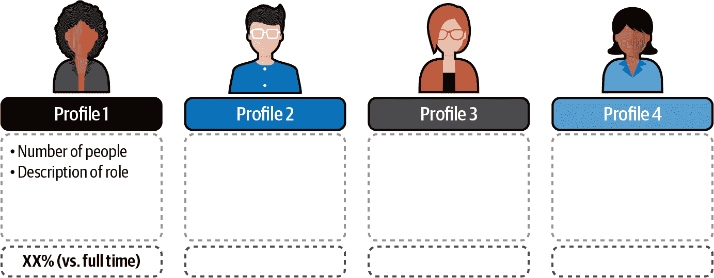
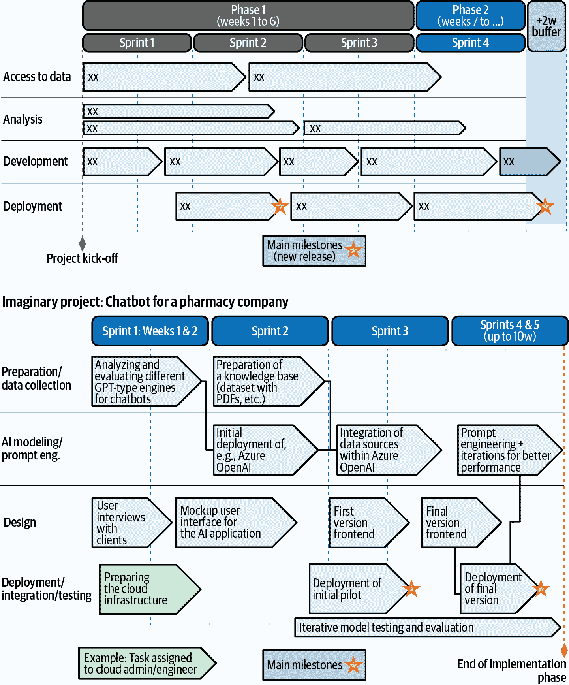

# 第六章\. 生成式 AI 商业案例的阐述

本书的前五章重点介绍了与生成式 AI 相关的云原生架构的技术方面，Azure OpenAI 和其他 Azure 服务的高级功能，以及生成式 AI 在企业中的实施，包括 LLMOps 和负责任 AI 等主题。在第三章中，我们甚至探讨了利用不同 Azure 资源的详细技术方法，并根据项目范围和公司数据类型提供建议。

公司采用 Azure OpenAI，以及 LLMs（大型语言模型）的主要动机之一是通过自动化基于语言的场景来产生显著的优势，以节省成本，或创造差异化，提供比竞争对手更好的产品，从而有可能增加收入。

在本章中，我们将重点关注使用 Azure OpenAI 服务构建生成式 AI 项目的商业考量，包括项目规划和评估主题，如成本场景和估算、投资回报率（ROI）、路线图等。我们将涵盖任何技术实施成为可持续和可行的生成式 AI 项目的关键方面。

# 事前分析，或实施生成式 AI 项目前需要考虑的事项

最有趣的经营管理技巧之一是[事前分析](https://oreil.ly/jjw4R)。相对于*事后分析*（在项目完成后对项目进行分析），*事前分析*是在项目开始之前进行的，假设项目已经失败，然后尝试识别导致失败的因素。鉴于此类实施的复杂性和不确定性，这是一个强大的工具，适用于生成式 AI 和任何 AI 项目，因为它可以将任何技术或商业话题作为识别潜在风险和制定缓解计划的方式。

表 6-1 汇总了与生成式 AI 实施相关的典型风险列表，本章的后续部分将包括一些资产，以提高您使用 Azure OpenAI 的项目成功的可能性。

表 6-1\. 生成式 AI 项目的潜在风险

| 类别 | 风险 | 可能出现的问题 |
| --- | --- | --- |
| **情境** | 监管和合规 | 用例或潜在项目必须与即将出台的法规保持一致。即使其中一些是“正在进行中”，例如社会评分、操纵等，已经是禁止应用的明确例子。对于生成式 AI 部署，所需的[透明度义务](https://oreil.ly/sq8N1)是关键，并需要在项目设计阶段考虑（例如，通过直接从 MLOps 和 LLMOps 系统生成跟踪和变更日志）。 |
| 正确使用 | 微软[Microsoft](https://oreil.ly/7ojQP)和 OpenAI[OpenAI](https://oreil.ly/eQpg-)都有明确的使用和不使用模型的政策。未能遵守这些规定（除了使用国际 AI 和一般法规已禁止的用例外）可能会导致服务访问受限。 |
| 内部关注 | 由于生成式 AI 的新颖性和复杂性，公司内部多个部门可能需要参与讨论，并且他们可能并不在同一个页面上。虽然技术和业务部门可能对如何以及为什么使用 Azure OpenAI 有一个清晰的认识，但其他部门如法律或合规部门可能暂时阻止实施，以便首先了解与服务的性质、数据隐私、居住地等相关的问题。利用[透明度说明](https://oreil.ly/B843c)、微软的[欧盟数据边界](https://oreil.ly/Bor0w)、[合规服务门户](https://oreil.ly/lKBjQ)以及任何[法律和数据保护附加协议（DPA）-相关信息](https://oreil.ly/Fqfi9)将有助于解决此类问题。 |
| **业务** | 不正确的用例发现和优先级排序 | 一个关键挑战是找到并优先考虑最可行和最有影响力的用例。有时优先级是基于执行团队或技术部门的想法。适当的构思和明确的设计思维过程可以帮助分析潜在用例列表中的所有相关方面。 |
| 缺乏量化使用场景 | 对于生成式 AI 的采用者来说，另一个挑战是想象他们的新云原生解决方案将被最终用户使用多少。需要初步场景来在技术和预算层面正确地规划预期的解决方案。这可以通过估计平台的平均每日/每月使用量来估算总用户数来实现。 |
| 意外成本 | 由于生成式 AI 工具（包括 Azure OpenAI 服务）定价的线性，估计成本相对简单。但为了准确估计成本，不仅需要有明确的用例，还需要了解定价结构，并能够根据所选模型使用官方[Azure 计算器](https://oreil.ly/2SQ4C)和其他工具（如[OpenAI 的标记器](https://oreil.ly/DDQHG)）来创建估计。此外，一般 FinOps 最佳实践，如资源标记、定价警报和 Azure 成本管理的使用，有助于监控生成式 AI 项目的成本。 |
| 业务案例不明确 | 如果潜在用例没有得到适当的优先排序，并且没有明确的场景和成本估算，就难以制定任何业务案例和回报率预期。任何生成式 AI 业务都必须包括对采用公司潜在收入、节省或差异化的估算。例如，“呼叫中心节省的人时数”、“自动解决的票数”、“推荐机器人中的商品升级”等。 |
| 创新困境 | 即使公司的大部分人愿意采用生成式 AI，一些项目可能因为创新困境而被暂停。这意味着可能会提出诸如“是否太早实施类似的东西？”或“为什么是这个而不是其他需要预算的创新？”等问题，并且拥有一个坚实的理由来证明新的 Azure OpenAI 项目是成功的关键。快速发展的生态系统和日益激烈的竞争是采用生成式 AI 的潜在考虑因素。 |
| **技术** | 高复杂性 | 尽管使用 Azure OpenAI 的实施在技术性上相对容易接近，但采用公司、集成商和个人对他们的知识水平缺乏信心的情况很常见，尤其是在复杂实施中。视觉界面（如 Azure OpenAI Studio）的演变，作为测试和部署配备生成式 AI 的 Web 应用和机器人代理的方式，以及模型部署和其他视觉功能（如提示流）的方式，将有助于降低技术或非专家采用者的入门门槛。 |
| 性能低 | 根据初始预期，生成式 AI 应用的表现可能会被认为是不完美的（这显然是正确的），因为它们倾向于产生间歇性错误。如果预期不切实际，测试阶段可能会导致失望，阻碍生产之路。与主题专家（SME）和/或最终用户明确界定“足够好”的性能意味着什么，以及一个适当的计划来评估解决方案，这些都是非常重要的。 |
| 资源缺乏 | 由于预算、定制模型所需的数据以及具备正确技能的可用人员等资源的缺乏，项目在实施前或实施过程中可能会被停止。确保可行性的一个好方法是正确界定预期的实施范围，并根据项目优先级和技术复杂性相应地制定计划。 |
| 安全担忧 | 与任何其他数据或 AI 系统一样，生成式 AI 可能在多个层面上遭受攻击：外围、数据源（用于归因的数据源）和提示（通过提示注入技术）。采用最佳架构和 DevSecOps 实践，并计划红队活动以模拟场景，可以帮助提高系统的整体鲁棒性和安全性。 |

当然，还会有其他需要考虑的相关主题，因此任何预先分析活动都必须准备并与所有相关利益相关者讨论。了解和降低风险的最佳方法之一是，在设想中的生成式 AI 解决方案细节和预期实施方面非常具体。为此，制定详细的路线图和相关资源及活动将大有裨益。

# 定义实施方法、资源和项目路线图

对于复杂的 AI 项目来说，最具挑战性的活动之一是以细粒度的方式规划活动，并制定详细的路线图，该路线图指定了主要工作类别、持续时间以及所需的技术和人力资源。

本节包含一种非详尽的方法，将帮助您作为 Azure OpenAI 的采用者逐步规划您的新项目。为了说明以下章节中理论之外的示例，我们将参考[Azure DevOps](https://oreil.ly/dGQEr)（用于项目规划和更多功能的原生 Azure 服务）及其一些功能。

## 定义项目工作流程

在规划项目活动之前，定义实施的作业范围至关重要。为此，创建工作类别（或工作流程）将有助于创建不同的活动和用户故事的存储桶。以下是针对使用 Azure OpenAI 服务的生成式 AI 项目的推荐工作流程列表（相互独立；项目符号不代表顺序方法）：

云启用

与 Azure 云着陆区、租户、资源和资源组等相关的设计、部署和优化活动。它还包括安全和监控配置。

数据集准备

所有数据准备、工程和存储活动，这些活动使 Azure OpenAI 启用的系统定制化。这并非典型的非生成式 AI 数据工程和管道流程，其中我们需要努力实现一个用于训练模型的综合数据输入。相反，数据集将包括各种“片段”，如文档、JSON/JSONL 文件和生成的嵌入。数据质量测量和改进等主题对于成功的实施仍然非常相关和关键。

提示工程

与系统及用户提示的设计、测试、自动化和优化相关的所有内容。由于这些活动需要探索和实验，因此这是一个特定类型的工作流程（从项目规划的角度来看，这些活动的复杂性和计划、估算的复杂性）。

设计和用户测试

与 UI 设计（包括之前的用户访谈）相关的端到端活动，以及从 UI/UX 和模型性能及评估方面对生成式 AI 解决方案的测试。

部署活动

一个横跨所有初步和生成 AI 软件生命周期（即，概念验证、最小可行产品）的部署工作流，包括初始试点、临时内部测试网页等。此工作流将包括整个生成 AI 软件生命周期中特定步骤的关键里程碑和日期，基于基于评估驱动的 AI 系统开发原则。

这些工作流可以通过 Azure DevOps 表示为[区域路径](https://oreil.ly/82ROJ)，因为这些路径有助于将任何项目组织成工作项的组。它们还将作为视觉路线图的工作类别，正如我们在本章后面将看到的。现在我们已经有了工作流，让我们深入了解以定义和量化项目资源。

## 确定所需资源

下一步是了解和计划我们将需要的不同 Azure OpenAI 实施资源。这将从纯粹的技术方面到与解决方案开发相关的“人时”成本，以及其维护成本。我们可以定义以下资源类别：

人力资源

不同的配置文件和相关技能将显然取决于实施类型和范围。然而，对于任何生成式 AI 和 Azure OpenAI 服务相关的实施，您需要考虑以下关键角色：

商业高管

为您的生成 AI 项目提供赞助，支持业务需求，并提供所需资源。

架构师/专家

拥有高度专业化的 Azure OpenAI 和其他生成式 AI 服务知识的技能配置文件。他们可以通过利用聊天、嵌入、文本到图像和其他模型来评估功能和技术需求，并定义合适的架构，同时根据数据源的性质和格式分析不同的微调和定位选项。

开发者

具有先前后端或前端经验的软件开发者配置文件，特别是对于 API 启用集成项目。一些主要能力与 Azure OpenAI API 和 LangChain、语义内核等编排块有关。

提示工程师

具备混合技术和管理经验的才能，技能组合包括快速设计、测试、迭代和优化，以及为生产级重复使用提示的模板创建。具有先前经验的个人可能包括高级测试能力，以及安全性和提示注入技术（例如，质量保证或 QA 工程师）的知识。

安全专业人士

作为[AI 红队](https://oreil.ly/5Kf3c)活动的一部分，或针对确保 API、数据源等的具体开发活动。

云工程师/管理员

经典云专业人士，具备管理、部署、配置和从 Microsoft Azure 消费云资源的能力。他们可能对 Azure OpenAI 服务相关的 Azure 门户、工作室和游乐场界面有初步了解。

负责人工智能和合规性专家

具有伦理和法律知识的具体角色，与第五章中提到的数据隐私和 AI 监管主题相关。他们通常可以兼职提供，并且可能对 ChatGPT、Bing、Azure OpenAI 服务、通用云、产品 DPAs 等工具具有特定知识。

其他战术和技术角色

项目和产品相关的角色，如产品经理（PMs）和产品所有者（POs）、项目经理、敏捷大师等。他们可能具有低到没有生成式 AI 经验，但我们预计这些角色在几个项目之后将继续提升技能并获得实际知识。此外，经典角色如数据三部曲（科学、工程、分析）可能是团队的一部分，甚至承担一些核心生成式 AI 责任，作为其当前角色的演变（或补充）。

如果你正在经典数据 AI 角色（例如，数据科学家）和新 LLM 导向角色（如提示工程师）之间犹豫，图 6-1 显示了关于角色和技能演变的某些高级指导。

###### 图 6-1\. AI 角色和技能的演变（示例）

其他技术资源

实施 Azure OpenAI 启用和其他生成式 AI 项目所需的全部产品和服务：

云订阅

在这种情况下，所有必需的 Azure 服务都是基于消费工作的。这意味着不需要固定价格或许可，只需为特定生成式 AI 实施部署的每个 Azure 服务的价格即可。

其他软件许可

对于大多数情况不是必需的，但某些实施可能包括特定的许可，例如如果你使用 PVAs 作为编排块和机器人界面，或者如果你利用其他非 Azure 生成式 AI 服务来创建端到端架构。

外部成本

这可能与外部技术和咨询服务相关，通常由采用公司利用以加速其生成式 AI 项目。这项工作需要在本章我们将审查的 ROI 练习中进行量化。

其他实施后成本

这包括与维护活动、模型改进或基础范围演变（即向现有知识库添加新文件和数据、生成新嵌入）相关的未来成本场景。

所有这些因素都意味着一个总成本，我们将用它来计划和评估与生成式 AI 实施相关的业务案例的可持续性。这是确保它对采用公司真正值得的关键步骤。

## 估算持续时间和努力

从上一节中定义的“人力资源”的第二级细节是对他们在项目中的参与程度和参与水平进行量化。一种很好的展示方式是列出所有角色，并在图 6-2 中展示具体细节。

###### 图 6-2\. 项目角色和努力程度视觉模板

在这个图中，我们看到角色的分布，包括每个角色的员工人数、活动范围和努力程度与常规全职投入的对比。这个简单的视觉图可以在尝试展示所需角色及其努力程度（每周小时数）时成为你的最佳盟友。然而，你需要根据项目和公司的具体情况来计算这些数据。一个说明性的估计：

+   提示工程师是一个高度专业化的角色，可能需要兼职在一个项目部分工作。根据范围和所需努力的水平，我们可以设想他们在一个项目上投入 25%到 50%的时间，这意味着他们可以同时参与几个生成式 AI 项目（具体来说，在两个到四个之间）。

+   需求驱动的角色，如合规性和 RAI 专家，可以为项目分配最大小时数，用于反应性的临时投入。这取决于项目，但平均可能占他们时间的 5% 到 10%，这意味着每周平均 4 到 8 小时。显然，他们的参与度将根据项目阶段而变化。

+   其他角色，如架构师、工程师、管理员等，将在项目的不同阶段需要特定的知识。其中一些甚至可能有两个或更多职能角色（例如，架构师最初可以定义架构和需求，然后扮演工程角色以实施解决方案）。这同样适用于生成式 AI 开发者，他们可能从事与代码相关的活动，但也可能部署 Azure OpenAI 模型并通过 API 将其集成到工具中。所有这些角色都可以在 20%到 100%的投入度之间变动，具体取决于项目范围。

无论角色的类型和数量如何，最初规划资源需求、了解有多少人将工作、每周多少小时以及在整个端到端项目的哪个阶段工作，都是非常重要的。这意味着重要的是要有一个计划，而不是寻找完美的计划。能够以准确的方式进行规划和估算显然将取决于与 Azure OpenAI 相关的项目经验的增加，因此在最初的几个项目中做出错误的假设是正常的。即使如此，我们也将拥有为生成式 AI 项目准备初步路线图的关键构建块。让我们在下一节中检查详细内容。

## 创建“动态”路线图

让我们分析一下我们现在应该拥有的内容：对潜在用例和实施方法的清晰理解，对架构的初步定义，对人力和工具层面所需资源的初步想法，以及对不同团队成员可用性的估计。

这些都是创建项目“活路线图”的关键要素。让我们从基础开始。路线图是一种以视觉方式传达实现目标或结果计划的方法，在这种情况下是项目实施。它包括达到目标所需的主要步骤或里程碑，以及我们之前讨论的工作流，作为组织所有必需任务的方式。

“活资产”的概念指的是从其初始版本演变它的能力。这对于 AI 项目（包括生成式 AI）尤为重要，因为初步路线图往往在实施阶段会因未知因素（例如，我们需要尝试和测试不同提示符需要多长时间）或意外事件（例如，对云平台的有限访问，团队成员的临时休假）而演变。因此，你可以将路线图视为一个画布，以视觉、易于阅读的方式规划和演变你的实施，这是一个你可以与技术及业务/高管利益相关者一起定期讨论计划和进度的资产。图 6-3 是生成式 AI 项目的视觉路线图示例，包括一个虚构制药公司的说明性案例。

###### 图 6-3\. AI 和生成式 AI 项目的视觉路线图模板（顶部）和示例（底部）

在这种单页路线图上，重要的是不要深入到超细粒度的细节，而是要定义工作流和活动的“是什么”和“何时完成”。使用冲刺来为两周到四周的工作周期构建工作块，是获取任务序列和持续时间更具体细节的方法。

从 Azure 的角度来看，一旦你定义了视觉路线图（例如，以 PowerPoint 幻灯片等常规格式），你就可以通过 Azure DevOps 中的[Boards 功能](https://oreil.ly/NKWy8)来实现其细节。此功能包括创建[Kanban](https://oreil.ly/kEhyq)和[Scrum](https://oreil.ly/0THjo)看板，以及[交付计划](https://oreil.ly/v-hwK)，这些代表按冲刺对日程表视图中的计划工作项。

现在你已经拥有了项目计划和所有相关细节，让我们看看如何创建 Azure OpenAI 使用场景来估算云相关服务的成本。

# 创建使用场景

对于采用者和相关合作伙伴（例如，集成商、咨询公司）来说，最具挑战性的活动之一是为生成式 AI 解决方案的潜在用途创建现实场景。这对于可持续的商业案例至关重要，同时也保证了有足够的预算用于云相关成本（Azure OpenAI 的成本结构针对大规模使用进行了优化，但它仍然是线性的，并且直接取决于与系统的互动次数）。挑战在于想象有多少用户实际上会利用这个解决方案，以及如何利用。

为了这个目的，最佳选择是采用*多级场景制定方法*，我们将逐步计算针对具有潜在最终用户数量的基于聊天的应用程序的几个因素：

预期（平均）用户数量

对于任何面向消费者（B2C）的场景来说，这可能相对困难，因为我们可能会有动态到达的最终用户，甚至内部员工使用内部生成式 AI 应用程序。话虽如此，我们的想法是确定一个最大平均用户数量，我们知道这些用户将积极连接到最终解决方案。

每位用户每天的/每周的/每月的互动次数

再次强调，预测用户将使用解决方案的次数并不容易，但我们需要定义一个最大值。这个值可以基于用户与现有解决方案的过往互动次数，或者通过每天、每周或每月分配最大会话数来确定。这个最大值可以作为应用层面的会话限制，以确保没有人过度使用解决方案。

每次互动的最大长度（以令牌计）

这相对简单，并且适用于提示和完成。我们可以在 Azure OpenAI 模型（通过“最大长度”设置，也可以通过定义系统消息的长度）和应用层面（通过限制用户可以写入的字符和单词数量）进行限制。如果我们处理问题和答案的最大长度，我们可以获得每次互动的平均长度（例如，一个 50 令牌的问题和 200 令牌的答案，总长度为 250 令牌）。

###### 备注

一般规则是 1,000 令牌等于 750 个单词（对于英文文本），但实际上这取决于语言和单词类型。为了准确估计 X 令牌的问题或答案看起来会是什么样子，请检查 OpenAI 的[分词工具](https://oreil.ly/DDQHG)。

如果我们得到这三个要素，我们可以从技术上想象分配给这种使用场景的最大成本，通过创建一个非常简单的公式：

预期用户数量 × 每位用户的互动次数（在特定时期内；为此，我们将按月计算）

× 每次互动的最大令牌长度

= 总成本（即每月的总令牌数）

在此情况下，如果我们有每月的互动次数，总令牌数将对应于一个月内的总令牌使用量。如果我们取这个数量，比如说 2,000 用户 × 30 次互动 × 最大 500 令牌，我们得到总令牌数为 3,000 万。

如您所知，[Azure OpenAI 服务的常规定价](https://oreil.ly/7Gmq6)基于“包”的 1000 个 token。这意味着我们支付一个固定的金额（取决于每个模型的定价，这通常会随着时间的推移而变化和降低），在这种情况下，300,000,000 个 token / 每包 1000 个 token = 30,000 包。如果我们假设单价为 0.002 美元（模型“X”的说明性金额），这意味着 30,000 × 0.002 = 60 美元的每月 Azure OpenAI 使用成本，即每年 720 美元。显然，对于更大的场景，这个金额会更高，并且不包括：

+   基于嵌入的 Azure OpenAI 额外成本。这意味着如果我们利用嵌入技术，除了常规的聊天功能外，我们还将使用不同类型的模型（例如，嵌入大型模型），并且按每 1000 个 token 的交互进行特定定价。

+   其他实现组件，如 Web 应用、其他用于文档智能的 AI 服务、认知搜索、向量存储、语音转文本和文本转语音等。这些取决于解决方案的类型，可以通过使用官方[Azure 计算器](https://oreil.ly/2SQ4C)来计算，就像其他任何云服务一样。

+   用于最终架构的任何其他相关许可证或外部软件。一个很好的例子是使用 PVA 作为 Azure OpenAI 服务的部署和编排选项。在这种情况下，您需要添加[其月度成本](https://oreil.ly/KpqfF)。

一般而言，任何来自视觉架构的“盒子”或构建块都应考虑在内，以计算解决方案的总成本。定期检查官方定价网站，以获取关于每个模型价格的最新信息。对于公司范围内的场景，您可以探索[潜在的收费设置](https://oreil.ly/fpA1N)，以便将相应的成本计费给特定的业务单元或部门。

一旦我们详细说明了使用场景，除了所有之前的人类和技术资源考虑因素外，我们最终准备好详细阐述我们的量化商业案例。

# 计算成本和潜在回报

现在我们可以将所有这些放在一起，关注总成本和总估计价值。这两个要素将帮助我们明确地阐述商业案例，并进行清晰的回报率估计：

总成本

这包括我们之前提到的所有构建块（人力资源、云成本、许可证、外部费用等），以及所有对组织产生直接或间接成本的因素，包括实施团队为提升技能和从事项目工作而产生的成本。云的成本必须基于特定的使用场景进行计算，同时考虑到按使用付费和 PTU 定价模式。

估计价值

这将包括采用公司从 Azure OpenAI 的生成式 AI 项目中可能获得的任何改进：

实际效益

这将包括任何收入增加或产生的节省。可以通过财务影响来量化多少以及何时实现，通常在初始实施之后开始。

软性收益

与创建新的业务线、公司战略差异化、创建新的知识产权、团队在生成式 AI 项目上的经验等相关的一切额外优势。

投资回报率的公式很简单，它主要关注有形的财务数据：

投资回报率 = [(量化硬性收益 - 总成本) / 总成本] × 100

这可能包括诸如盈亏平衡点的考虑，它表示何时收回初始投资。例如，您可以说总项目实施成本是 X，但将在两年内帮助产生 2X 的收入，因此投资回报率为 200%，并且这种情况很可能发生在第一年和第二年之间。

在评估使用 Azure OpenAI 的潜在生成式 AI 用例列表时，您（以及您的公司）需要考虑这些财务或公司层面的因素。您可以使用表 6-2 作为示例，并填写您实际的生成式 AI 项目。

表 6-2\. 生成式 AI 用例发现列表

| 用例 | 描述 | 持续时间 | 成本 | 投资回报率 | 其他好处 | 优先级 |
| --- | --- | --- | --- | --- | --- | --- |
| UC1 | 示例：制药公司的聊天机器人 | 7 周 | X K$ | 根据场景在 150%到 200%之间 | 提高员工满意度 | 优先级高 |
| … |  |  |  |  |  |  |
| UCn |  |  |  |  |  |  |

您显然可以添加其他相关的因素以供内部决策，但这种分析将促进内部讨论和您下一个生成式 AI 项目的优先级排序。与其他章节中的其他视觉元素一样，这些简单的表格和幻灯片在处理所有业务和技术利益相关者时简化了复杂性。

# 结论

这就结束了我们的第六章，本章重点介绍了构建使用 Azure OpenAI 的生成式 AI 项目可持续和现实商业案例的关键要素（例如，项目路线图、所需资源、成本估算）。

记住，这些与业务相关的主题与其他任何技术考虑因素一样重要，并且是确保成功实施和保证内外部用例的用户采用的方式。如果您的生成式 AI 系统很棒，但数字不匹配，那么您的公司将无法采用它并充分利用它。在优先级排序和设计过程中，尽量包括本章中的建议。

我们现在将继续阅读本书的最后一章，其中包含该领域专家的几个生成式 AI 成功案例。我们几乎完成了——让我们行动起来。
