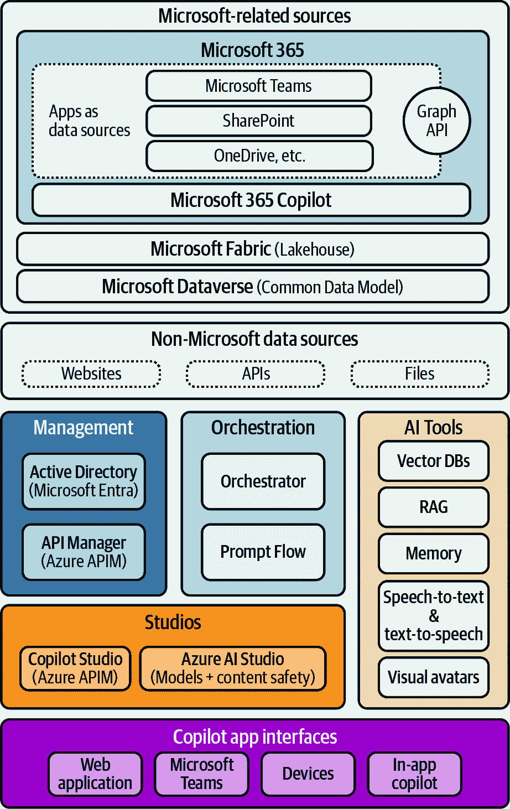

# 第七章\. 探索大局

本章包含了使用 Azure OpenAI 和其他 Microsoft 技术进行生成式 AI 学习的最后一些知识。它包括一些未来愿景、专家访谈和成功案例。记住，生成式 AI（以及人工智能总体而言）是一个高度演进的领域，所以请将这本书视为您进入一个知识和学习资源的宇宙的入口。

让我们从讨论 Azure OpenAI 视角中的“接下来是什么”开始这一最后一章。对于一个像您这样热衷于学习和采用 AI 的人来说，您还应该探索哪些其他领域？

# 接下来是什么？向 Microsoft Copilot 的演变

Azure OpenAI 服务是更广泛生态系统的一部分。所有架构、API 以及与其他生成式 AI 构建块的集成都为 AI Copilot 的概念做出了贡献，我们在第一章中提到了这个概念。

AI Copilot 是技术驱动的助手，是帮助人类代理人变得更好、更高效的伴侣。其背后的原则是提供一个界面（书面或口头），帮助人们执行复杂任务，例如查找特定信息或将信息添加到第三方系统（例如 CRM、支持票务系统）。

正如您在图 7-1 中可以看到的，端到端 Microsoft 对 AI Copilot 的愿景包括 Azure OpenAI 的模型，但也包括与其他系统（如 Microsoft 365，其中已经包括[它自己的 Copilot](https://oreil.ly/Jwuff)）的连接。这可以通过利用[Microsoft Graph API](https://oreil.ly/3qy8E)（365 套件的数据访问开发接口，包括 Outlook 的日历和电子邮件、Teams 的会议记录和转录，等等）和[Microsoft Dataverse](https://oreil.ly/onOnS)（之前称为 Common Data Model，是 Power Platform 和 [Dynamics 365](https://oreil.ly/omP3a) 生态系统中的数据存储）的数据来扩展额外的功能。

###### 图 7-1\. 端到端 Copilot 架构

所有这些构建块的组合使得新的开发模式成为可能，通过将其他数据源和系统与生成式 AI 模型相结合，Copilot 的概念无疑将在接下来的几年中演变。您将看到这种端到端架构成为行业标准，所以我建议您了解所有这些部分是如何连接并启用新的生产力和生成式 AI 场景的。

话虽如此，要全面探索这些内容可能需要两三本书，但为了利用一些官方的微软资源，请查看微软英国团队提供的[学习路径网站](https://oreil.ly/kljOi)，并检查[人工智能学习伴侣路径](https://oreil.ly/SntTJ)，因为它包含大量视频、文章和培训项目。您还可以探索微软 Copilot 技术栈的[示例](https://oreil.ly/1_p3Q)，其中包括 Azure OpenAI 和其他微软服务——如果您有技术背景，这将非常有用。

现在让我们来看看我认为这本书的隐藏宝藏：从一些最大专家那里获得的宝贵且独家见解，这些见解将从设计、数据质量、人工智能的未来等相关的多个角度补充本书的内容。

# 生成式人工智能时代的专家见解

能够接触到一些最相关的生成式人工智能专家，这些人参与了生成式人工智能的塑造以及组织如何采用 Azure OpenAI 和其他相关构建块，这是非常罕见的，也是一项非凡的特权。

本节包括一系列访谈：

[大卫·卡莫纳](https://oreil.ly/FOSlv)

微软战略孵化副总裁兼首席技术官，著有[*《人工智能组织》（O’Reilly）*](https://oreil.ly/JvO8O)。这次访谈包括对人工智能采用和高级用例的讨论，以及他对生成式人工智能未来的展望。我们将从一位有远见的领导者那里获得顶级见解。

[布伦丹·伯恩斯](https://oreil.ly/e_vU5)

微软公司副总裁，云原生生态系统的真实传奇人物，这得益于他在 Kubernetes 共同创始人以及多本 O'Reilly 书籍（如[*Kubernetes: Up and Running*](https://oreil.ly/c86hW)、[*Kubernetes Best Practices*](https://oreil.ly/DIsrj)、[*Managing Kubernetes*](https://oreil.ly/cJDzq)、[*Designing Distributed Systems*](https://oreil.ly/5GcFO)）的作者身份。这次对话讨论了生成式人工智能时代云原生架构的融合。

[约翰·梅达](https://oreil.ly/4jxQ0)

微软工程副总裁兼计算设计/人工智能平台负责人，以及语义内核项目的主要赞助人。这是对人工智能解决方案设计作用和 LLM 编排技术重要性的一个令人惊叹的探索。

[莎拉·伯德](https://oreil.ly/N_NK9)

微软负责任人工智能首席产品官。这次访谈包括与负责 Azure AI 平台（包括 Azure OpenAI）RAI 发展的领导者的对话，莎拉为我们提供了关于这个重要话题的不同视角。

[蒂姆·沃德](https://oreil.ly/cersn)

CluedIn 的 CEO，是数据管理主题的绝佳来源。这次讨论深入探讨了数据质量作为生成式 AI 发展的推动力，同时也探讨了 AI 如何改变公司执行主数据管理（MDM）和质量控制的方式。

[Seth Juarez](https://oreil.ly/oIrgI)

微软 AI 平台的首席项目经理。塞思是 Azure OpenAI 时代的标志性人物之一，这得益于他作为[AI Show](https://oreil.ly/h-Fvw)节目主持人的角色。塞思是 Azure OpenAI 和 Azure AI Studio 主题中最知名的专业人士之一，他是一位出色的讲故事者，能够使复杂的话题看起来简单一些。

[Saurabh Tiwary](https://oreil.ly/qUK9P)

微软 Copilot & Turing 的副总裁。这次访谈包括了对微软 Copilot 愿景的深入交流，它是一个利用 Azure OpenAI 服务的端到端架构。

让我们深入这些访谈！

## 大卫·卡罗纳：AI 的采用和生成式 AI 的未来

**A.G.**：所以，我知道你的背景，也知道你在微软的职业生涯，但谁是大卫，你在微软组织中的角色是什么？

**D.C.**：感谢您的邀请，这是一件非常愉快的事情。我认为我们都有写书的痛苦经历，所以当有人勇敢地踏上这段冒险之旅时，我总是感到敬畏。你做到了这一点，所以恭喜你。我认为，当我最终审视我在微软的角色时，它全部关于创建新的孵化业务。我在微软已经工作了近 23 年，一直专注于这个职能。我最初来自西班牙，曾在西欧的微软工作，15 年前搬到了西雅图的总部。我曾参与云孵化项目，那是一段非常令人兴奋的经历。

之后，随着云服务变得主流，我不再需要不断证明云的重要性，于是我被邀请领导 AI 孵化项目。那时，云服务刚刚开始变得主流，大约是八九年以前，它是从微软研究院开始的。当时我正在与微软研究院合作，我们的目标是创建一个新的业务类别。就在那开始变得主流的时候，大约两年前，也就是在我不再需要在每次对话中证明 AI 的重要性之后，我转到了下一个业务。我现在正在研究像 AI 的未来这样的领域，这些是我们在未来将会看到的 AI 的新前沿。例如，将 AI 应用于科学，这是一个令人惊叹的应用场景。然后还有其他领域，如量子计算，我也很荣幸地参与了孵化，还有一些其他领域，如太空、通信、通信的未来等等。

**A.G.**: 你是谈论生成式 AI、一般人工智能以及我们将在未来几年如何使用它们的理想人选。你现在看到了哪些潜在的和有趣的东西？你对这个生成式 AI 时代的展望是什么？

**D.C.**: 对于我来说，最大的不同之处在于你可以用这个新的 AI 解决之前无法解决的问题，当然。在语言或其他任何模态之上进行推理的概念，而不仅仅是数据，这是非常强大的，我们可以有很多话要说。但对我来说，真正的变革，这一代新 AI 的革命性之处在于它更广泛，更通用。在过去，要创建一个 AI 模型，你需要一个特定的数据集和一个特定的模型。我仍然记得那些早期 AI 的时光，当时我们在微软研究院为 AI 创造了一些里程碑，比如图像分类、语音识别等。所有这些都需要一个非常专业的团队，对那个领域有非常具体的了解，拥有非常具体的数据集和模型。

这个大变化，这个大影响在于可能性。现在这个模型已经变成不仅仅是数据科学家可以创建的，甚至最终用户也可以根据他们的日常生活和工作进行定制和使用，这就是 Copilot 的概念。在那之后，其余的都是历史。但对我来说，这就是新 AI 的核心区别。

**A.G.**: 正是。因为我们一直在使用 AI。我们在不同的产品中都有 AI，但大多数人并没有意识到他们正在使用 AI 或受到 AI 的影响。现在这是自然而然的，这就是民主化的概念，技术的普及，因为我们使用语言，这是最纯粹的方式去沟通。我认为这非常令人兴奋。

**D.C.**: 这只是开始。正如你所知，我对接下来会发生什么感到非常兴奋。当然，不仅仅是技术本身会发展，我认为随着我们对技术的理解更加深入，我们开始将其应用于更多用例，我们将看到我们今天甚至无法想象的场景。我最初提到的一个我最近一直在研究的应用领域是，当然，科学发现的适用性，这将开辟一些我们甚至无法想象的令人惊叹的领域。

**A.G.**: 是的。将这种可扩展性带到那些在传统世界中我们可能无法照顾到的情况中。有一个公共案例，是西班牙马德里 SERMAS，即卫生部门，与 Julian Isla 合作。他们试图利用生成式 AI 来发现好的信息，检索罕见疾病的好信息。通常，每件事背后都有一个商业案例，而使用传统 AI 时，你会说，好吧，目标公众不够多，因为这是一种罕见疾病。而通过这种方式，你实际上可以将它带给世界各地的医生，他们可以更快、更有效地发现情况。这是那种即使它们听起来并不特别先进，因为这只是检索信息，但我个人非常喜欢的一个完美例子。

**D.C.**: 是的。我对那个用例很感兴趣。我也是 Julian Isla 领导的非营利组织[Foundation 29](https://oreil.ly/DCC5D)的一部分，还有 Carlos Mascias 和其他人。对我来说，这是一个很好的例子，正如你所说，因为它专注于诊断罕见疾病。我们面临的一个问题是，像医生这样的职业很大程度上依赖于医生的经验。在诊断常见疾病时，这工作得非常好。但是，初级保健医生接触罕见疾病的机会非常少。他们很难诊断这些疾病。考虑一下，罕见疾病的平均诊断时间为七年。这七年里，你都没有对这种疾病应用正确的治疗方法。对于像这样的模型可以帮助的地方，因为它总是在帮助医生，指导医生，给他们提供疾病可能来源的线索，这是一个了不起的工具，我认为它是人类和机器共同工作这一新范例的绝佳例子。

**A.G.**: 完全正确，并且改善了现状。一个无法否认的事实是，我们可以通过技术来改进某些事情。你提到了模型，你提到了平台。这本书是关于 Azure OpenAI 的，但你怎么看待 Azure OpenAI 作为一项技术或作为一个平台，作为这个时代的技术推动者？你怎么看待它的未来发展？这关乎模型，关乎平台，不同层次，以及与之相关的事物。我有我的看法，但我想听听你的。

**D.C.**：我认为这是一个更深层次的对话，我可以这么说。如果你只从生态系统的某一特定层来看待这个问题，你可能会错过很多东西。对我来说，AI 不仅仅是一种技术，它是一个新的范式，实际上是一个新的经济。你看，AI 对核心 GDP 增长的影响是巨大的。我们只是用技术栈的一层来应对这个问题，这还不够。你需要审视整个生态系统。在整个生态系统中，有众多参与者。当然，在最底层，你有芯片，甚至有你需要考虑的纯硬件。然后，在最上面，你需要解决和针对这些应用的大数据中心。再往上，你有基础模型，它们当然非常明显，它们是其中的关键部分。但除此之外，你还需要工具和平台，才能真正充分利用这些模型。这很容易，你知道这一点比任何人都清楚，很容易在服务和模型上启动一个概念验证，很容易开始进行提示并获取更多模型。但要创建一个真正的用例，要创建一个完整的场景，你需要的东西远不止这些。你需要开始谈论基础，安全性，以及像服务集成、插件等许多其他领域，这些虽然与模型相关，但同样重要。然后，在这之上，你还有更多的层次。你有责任，这是至关重要的。你有应用，你有分发。

在 Azure OpenAI 的情况下，我认为关键之处，当然它是整个技术栈中不可或缺的一部分。但在我们的情况下，从我们开始使用 AI 的那一刻起，我们就坚持的一个原则是，我们相信创新的速度应该与平台并驾齐驱。即使在微软内部，我们看待创新的方式也是将这种创新作为平台提供给公司的其他部分。同时，我们将这个平台带到 Azure，让我们的客户能够使用它。因此，Azure OpenAI 是这一点的完美例证，因为我们所做的是创造了“模型即服务”的概念，使得它对客户来说变得极其容易访问，并且让它成为 Azure 的第一公民。你可以像访问任何其他服务一样访问它，这再次将这一点带到了更广泛的平台，让开发者能够用它来创建新的应用程序。

**A.G.**: 是的。你提到的所有这些平台层，这就是我提问的原因，因为通常讨论都集中在模型上。我们正在创建一个更大的模型，在此之前，它可能只是参数更多，但现在它在基准测试上表现更好。但我认为模型正在成为一种商品，非常昂贵且难以创建。但现在，真正的价值在于将这些模型与平台的其他部分相结合。这就是我最喜欢在 2023-2024 年期间 Azure OpenAI 和 Azure AI Studio 整体演变中的部分。

**D.C.**: 是的。完全同意。

**A.G.**: 你对微软正在发生的一切都有整体的了解，无论是内部还是外部，比如平台、模型、酷炫的项目、微软研究、论文，以及即将到来的一些新事物。哪一部分最让你兴奋？这是关于大型语言模型，还是小型语言模型——你有什么偏好吗？

**D.C.**: 可能是因为研究，当然，在全栈中，每一层都有事情发生。我对每一层都感到兴奋，因为它们都非常重要。在我心中，我是一个软件开发者。我对与平台相关的一切特别热情，因为它是真正使开发者能够在其上创建重要酷炫事物的基础。我是 Azure AI Studio 和那里所有工具的超级粉丝。任何与模型整个生命周期编排相关的事物，我都超级喜欢。在我最初的职位上，我非常专注于如何利用云来改变开发过程。DevOps 的概念，持续集成，持续部署等等。我们发布了当时被称为[Visual Studio Online (VSO)](https://oreil.ly/IJeOu)，现在它是 Azure DevOps。我认为我们总是忘记这部分栈，它非常重要。如果你只是采用非常具体的工具和模型方法来采用 AI，那么你无法在企业中取得成功，所以你需要查看整个生命周期，并编排这个生命周期。这一点，我超级热情。

但现在，如果你问我关于令人惊叹的东西，那些让我兴奋的研究成果，我必须说我，可能是因为我的当前工作，我对将 AI 应用于科学的所有工作都非常着迷。其中有些东西令人震惊，我们现在只是触及了表面。我们最近宣布的一个例子是将这些模型应用于实际的科学发现。在这种情况下，这是一项电池发现，其余的材料来制造电池。它是完全使用这些工具发现的。它们是这些模型能做的三件事，但在某种程度上，其核心概念就像说，嘿，就像 AI 可以在文本之上进行推理，就像 AI 可以在图像、视频等之上进行推理一样，AI 也可以在图之上进行推理。一个非常重要的图就在我们周围，那就是分子。它们只是原子的图。AI 在那些结构、分子之上进行推理的可能性是惊人的。我们看到与生成 AI 相同的理念也适用于图像。想想当你写一个提示时，DALL·E 会提供一个图像作为输出。我们开始看到这一点，微软研究院已经在一些模型上实现了这一点，这些模型可以用分子来做。想想解释模型，你在特定的模型中寻找哪些特性，模型为该分子创造了很多变体和可能性。这太令人震惊了，想想这个的可能性。

但那部分是关于生成的。接下来的一部分是模拟。有了 AI，我们可以模拟这些分子的特性和相互作用，想象一下，这相当于亲自去“湿实验室”进行操作。现在，如果你能通过 AI 做到这一点，速度提高数千倍，那么在传统计算上所需的时间就缩短了，这让你能够仅仅扩展你的搜索空间。现在，你可以筛选数百万种分子来找到那些特性。最后一点是帮助我们合成这些分子，给我们提供合成这些分子的最佳和更有效的方法。这在任何科学领域——从材料到健康，到可持续性，到气候变化，到许多其他领域——的影响都是惊人的。当你结合知识推理的概念时，现在你有一边是能够模拟自然的 AI 模型。另一方面，你有科学家的“副驾驶”概念，科学家可以利用它来与所有过去的科学知识和该领域的当前知识进行推理。这真是太令人震惊了。

**A.G.**: 这在所有层面上都给人留下了深刻的印象，甚至在学术层面上。正在学习的人可以检索所有信息，他们可以加速他们的学习，他们可以越来越多地贡献于研究。你看，这就是为什么我邀请你的原因，因为你对这些事物有远见。

**D.C.**: 这很有趣，因为我们总是谈论人工智能能够代表人类完成的工作，但有了在科学界集体知识之上的 AI 推理这一概念，它实际上能够将这个社区拉得更近，因为现在科学家在基于其他科学家创造的知识进行推理时面临很大的障碍，因为知识太多了。几乎不可能让一个科学家掌握社区的集体知识。现在，有了这些工具，它将使科学家更容易建立在他人发现和进步的基础上，这真是太神奇了。

**A.G.**: 为了完成这次讨论，我会回到你的书，*《人工智能组织》*。学生们在思考，好吧，这和我们有关系吗？描述性人工智能，就像传统人工智能一样，当我谈论生成式人工智能时，我需要学习这些吗？现在有那么多新的专家在谈论这个话题。我说，当然，这种考虑，技术考虑，还有组织上的考虑，包括采用障碍、技巧以及你需要做的事情，还有公司的数据组件，数据战略，这些都非常重要。我感觉你的书包含了很多很好的例子。我记得 Telefonica 和 Chema, Alonso 的那个例子，我特别喜欢，因为它非常具有说明性和创造性。但如果要向公司层面的生成式人工智能采用者推销这本书的价值，它的价值会是什么？

**D.C.:** 是的，我的意思是，这本书是想着那些我看到的，大型公司拥抱人工智能时的学习经验而写的，对吧？所以，我在早期就看到了很多这样的例子，对吧？所以，人工智能的早期阶段就像是在八年前。所以并不是很久以前。而且很有趣，因为我看到阻碍大规模采用人工智能的因素与技术无关。所以这让我想，嘿，有很多书在谈论技术，但在这其中有一个缺口，就是没有讲述一个更广泛的故事，这是任何级别的组织领导者为了在人工智能方面取得成功而应该知道的。所以这就是这本书的写作方法。我确定了四个你需要解决的大领域，才能在规模化的采用人工智能方面取得成功。所以，再次强调，不是概念验证，也不是具体用例，而是真正用人工智能来转型你的公司，对吧？并成为那个人工智能组织的概念。是的，技术是其中之一。所以，当然，技术是存在的，我谈了很多关于技术的事情，但我还谈到了策略。你需要有一个全面综合的策略，它包括短期，也包括长期，并且在这两者之间建立联系，对吧？所以我分享了在微软的所学。我们如何处理这个问题，我们称之为“地平线框架”，以及我们如何确保我们在地平线上平衡这些投资。我们有一个连接性的策略，它投资于短期，因为这对短期有价值，但也投资于长期，以及如何将两者联系起来，对吧？所以这是好的。我还谈到了有一个从技术到业务，然后从业务到技术的方法的必要性，对吧？这是至关重要的。我看到，当时我看到很多对话都是从技术的可能性开始的，但没有考虑到业务需求，对吧？所以你需要一个框架。我还分享了我们在微软使用的框架，以进行以业务为中心的对话，并将其与技术联系起来，以专注于识别我公司的用例和长期赌注。所以这就是策略。

第二个是文化，因为这也是一个关键因素。这种 AI 转型不是在实验室里发生的。不是你可以创建一个 AI 卓越中心，把它当作一个黑盒子，然后忘记这个问题。这是会影响整个组织的事情。作为领导者，你需要知道这一点。所以每个员工都必须参与其中。这是一项需要具体行动和需求的事情。我也分享了如何做到这一点，一些来自微软的经验。我们在那方面有很多经验。你意识到如果将失败与成功进行比较，你会看到文化通常是其中的一个巨大部分。当组织没有完全投入，有些事情是孤立的，没有连接起来时，通过这种方式很难在业务上产生影响。最后一个是责任。所以这也是一个关键因素，正如你所知。这是我们倾向于认为只是为 AI 制定原则。这远远不止这些，对吧？你需要将这些原则转化为现实。现在，即使在那时没有法规，但现在随着法规的出现，它不仅仅是一个好的补充。它将变得绝对关键，每个公司都必须这样做。这不是你可以在过程结束时考虑的事情，这是你必须在开发的每一步中考虑的事情，从构思到开发，再到部署和监控。

**A.G.**：我完全同意。看，这四个支柱今天仍然是一样的。我们面临的情况相同，人们对于技术的兴奋，然后忘记公司的整体战略，创造出与公司战略、回报投资或公司潜在价值无关的案例。文化，所有的教育部分，现在越来越明显，人们需要了解基因 AI，我们在技术团队旁边看到了这个趋势。还有负责 AI 的部分，我称之为问责制。现在这不再是 AI，因为它是有责任的。它是值得信赖的，是负责任的，是道德的，是一切你想要的，但是有法规。所以现在我们希望遵守法规。所以它还是一样的。这就是为什么我认为它对于任何生成式 AI 的采用者来说仍然是一本非常好的经典。

## 布兰登·伯恩斯：原生云在生成式 AI 发展中的作用

**A.G.**：我很高兴你能来。我知道很多人都知道你，但你在微软的当前角色和经历是怎样的？

**B.B.**：当然。我目前是云原生开源和 Azure 管理平台的副总裁。所以重点是，我想最好的总结可能是所有关于 Azure 上的 DevOps 和现代应用开发的事情，特别关注容器和 Linux。

**A.G.**: 所以与云原生和微软生态系统相关的一切，你都在那里。

**B.B.**: 是的。以及 Azure 资源管理器，它是一种带有策略的 API 网关，以及所有基础设施即代码工具。

**A.G.**: 对于我们在书中讨论的那种架构来说，这非常重要。即使这是一个明显的问题，你在云原生和 Kubernetes 方面的经验是什么？

**B.B.**: 当然，是的。我的意思是，显然我是开始 Kubernetes 项目的。实际上，这已经接近十年了，这也是为什么我可能会有一些白发的原因，但你知道，我负责了那个项目的早期阶段，塑造并帮助塑造了社区。然后我来到了 Azure，专注于真正弄清楚 Azure 如何成为运行开源和云原生工作负载的最佳场所。作为那部分工作的一部分，我也认为帮助了许多企业，传统的微软客户，他们在向云原生应用程序的过渡中。我认为云原生就像是一个新的初创企业事物，但实际上，我认为今天正在构建的大多数云原生应用程序都是由需要这种开发敏捷性和可靠性的大型公司构建的。

**A.G.**: 是的，这与微软当前的时代生成式 AI 相连接。你对这场新潮流的个人观点是什么？

**B.B.**: 我对此非常兴奋。我认为每个人都对此感到兴奋。我在个人层面上也非常兴奋，因为这实际上帮助了我。我认为使用 GitHub Copilot 这样的工具实际上确实可以加快速度，尤其是在我学习新事物的时候。我大概在六个月前开始学习 Rust。我发现当你处于一种新的语言中时，它对提高你掌握惯用法的速度产生了巨大的影响。你可能会想，因为有时候，当你学习一种新语言时，你会像编程其他语言一样编程。所以你最终会像以前写 Java 一样写 Python，例如。我认为能够访问那些惯用模式可以帮助你更快地掌握语言。此外，我发现 Rust 也有一点，错误信息并不像它们本可以那样好，我认为。所以再次，拥有那种请为我修复这个错误信息的能力，对吧？它会给我我需要的代码片段。这也很有用。所以我认为这很酷。

我认为我们也非常兴奋地看到我们如何帮助我们的客户在编程语言、基础设施或任何其他众多事物上实现类似的复杂性降低。成为云原生实际上是一个很好的例子，基础设施即代码 (IaC) 对人们来说可能很困难，而使人们能够轻松地从门户中的 ClickOps 过渡到基础设施即代码是非常棒的。而且，像基础设施即代码模板的机械导出这类事情并不总是那么好。我认为生成式 AI 给我们带来了机会，让我们能够走向不同的方向，得到比我们仅仅编写试图完成这项工作的代码更好的、更流畅的模板。

**A.G.**: 是的，我认为这很令人兴奋，因为它双向都适用，不是吗？我们可以利用生成式 AI 来实现所有云原生目的。我们还可以利用云原生的良好实践来实现现有和新应用上的生成式 AI。

**B.B.**: 绝对如此。我的意思是，想想看，这听起来可能有点夸张，声称没有 Kubernetes 就不会有生成式 AI。但我认为实际上这是真的，对吧？不是像 Kubernetes 特别，而是它使许多想要构建大规模系统的人能够忘记机器管理。进行 AI 推理的第一步不再是弄清楚如何让一堆机器协同工作。容器和 Kubernetes 为你处理了这一点。因此，你可以说，好吧，我有一支配备了 GPU 和其他一切设备的机器队。我如何将我的应用程序部署出去进行训练？我认为这是计算机科学的一般历史，构建更高层次的抽象，以使下一个平台能够在此基础上构建。

**A.G.**: 这是我最喜欢的情况之一。如果你查看 *kubernetes.io* 上的成功故事或 [CNCF](https://oreil.ly/epXxD)，他们会谈到 [OpenAI with Cloud Native](https://oreil.ly/b5EfH) 以及它是如何使我们看到的所有各种事物成为可能的，比如更广泛的规模，很多人可以连接到 ChatGPT。当然，背后有微软的 AI 基础设施。但这是所有这些应用领域和 AI 编译器的新推动力。

**B.B.**: 是的。再次减少复杂性。所以，生成式 AI 不仅能够减少复杂性，而且拥有那个协调器还可以减少 AI 工程师们的复杂性，他们不必担心那个问题。而且当你从 Azure 获取它时，你甚至不必担心运行它。它只是为你处理一切。

**A.G.**: 为像我这样的人节省了很多。

**B.B.**: 我认为这也是一个目标，对吧？消费一个想法比实现一个想法要容易得多。你可以这么说，好吧，我知道如何使用排序算法。你可能能写出一个排序算法，但写出来要比使用它花更多的时间。它赋予了许多人力量，这是很棒的。

**A.G.**: 是的。这加速了实施，以前需要花费很长时间的事情现在变得更容易实现，我不会说是商品，但确实更容易实现了。

**B.B.**: 是的。我认为你会在之后看到那种创造性的爆炸，很多可能没有耐心或技能集来实现生成式 AI 的人，但他们可以有很多关于如何使用它的创意想法。所以当你使这种能力可用时，你会产生大量的关于如何使用它的创意。

**A.G.**: 当然。从微软的云原生视角来看，您如何看待所有这些[为 Copilot 的技术堆栈](https://oreil.ly/jGrqE)、语义内核，以及我们在本书中提到的所有不同的酷炫组件？您对这一点有什么个人看法？

**B.B.**: 嗯，我的意思是，你仍然需要在某处运行你的应用程序，对吧？你知道，生成式 AI 并不能让你不需要网页或者不需要某个地方的 Restful API。因此，不仅像 Azure Machine Learning 这样的工具建立在 Azure Kubernetes Service (AKS)之上，而且我们实际上还看到很多人在 AKS 上构建他们需要的客户端应用程序或 API，甚至还有在 AKS 上为 OpenAI 开发的插件。它仍然是一个非常好的托管代码和集成的场所。当然，我们在 AKS 中提供了 GPU 支持，所以有些人正在自己进行推理或构建自己的模型。实际上，我们最大的几个集群都是为了为各种不同的群体提供这种类型的 AI 而构建的。再次强调，我认为这关乎简单性，对吧？因为如果你想要专注于 AI，你就不想专注于运行一个 5,000 节点 Kubernetes 集群所需的一切。那不是一件容易的事情。如果你只需点击几个按钮或执行一个基础设施即代码模板，就能拥有 5,000 个 GPU 节点，那就相当不错了。然后知道我的团队会随时待命处理这些事情。这能为你节省很多时间。

**A.G.**: 是的。这正是我们现在在 Azure AI Studio 中看到的情况，以及所有这些应用程序和部署任何类型模型的能力，因为本书是关于 Azure OpenAI 和专有模型的。您如何看待开源在生成式 AI 中的推动作用？

**B.B.**: 是的。我认为随着时间的推移，我怀疑会有越来越多的模型出现，人们会为不同的情况调整、构建。我的意思是，你已经在看到这种模型共享和模型重新训练发生了。我认为这真的很棒。我认为你看一些东西，你知道，Semantic Kernel 正在开源分享我们的最佳实践。LangChain 也在开源中。我认为这一切都根植于开源。我认为随着时间的推移，还将发生一些事情，那就是更高层次的框架。我认为人们仍在试图弄清楚构建一个完整的副驾驶需要什么。我认为有很多我称之为垂直副驾驶的东西，你知道，擅长某一件事的副驾驶。但我认为，实际上，有一些非常广泛的领域，你可能实际上需要一种知道如何选择副驾驶的东西。我想象它有点像搜索，对吧，当你进行网络搜索时，地图、视频？你可以搜索各种不同类型的内容。我认为 Copilot 也会是这样。在选择你想要生成的内容方面，将会有多个层次。我的意思是，在某种程度上，它就像你的朋友一样。比如，你去找一个朋友寻求技术建议，你去找一个朋友寻求体育或其他什么。你将会找到同样的事情。

**A.G.**: 在一方面，有所有正在创建的构建块以及你提到的协调者，不同的方法，比如检索（RAG），比如我们可以使用的知识库，可以是数据库等。我感觉这正在快速发展，当然。

**B.B.**: 当然。我认为我有一个问题，你可能不知道，我并不一定有正确的答案，那就是，何时进行重新训练，何时进行检索增强生成？因为它们在某种程度上都做同样的事情，你可以通过重新训练或在你自己的语料库上重新训练，或者通过进行检索增强生成来影响你的结果。我认为像这样的问题，人们可能需要一段时间去努力解决。

**A.G.**: 是的。这个问题没有单一的答案。在这本书的其中一个章节中，我提到（非常谨慎地，因为这个话题非常新）我们需要根据数据集，根据你想要的重新训练类型，细调类型，或者与分配的任务相比的 LLM 的一般行为来尝试和测试。

**B.B.**: 或者甚至是一个应用。你可能无法为每个客户重新训练它。你可能必须这样做，因为你可能觉得，嗯，我有一群多样化的用户。我想为每个用户提供个性化的内容，但我不能为每个用户重新训练，所以我将使用检索增强生成。但另一方面，你可以这样想，我是我的公司，重新训练是值得的，因为我了解我的公司，我只会有我公司的结果。我认为这是很有趣的事情。

**A.G.**: 对，也许它是与分段或推荐系统的结合，某种预先过滤你面前用户类型的东西。然后根据用户可能访问信息的能力，基于活动目录或 whatever 的知识库，你可以定制那个答案。

**B.B.**: 我的意思是，基于角色的访问控制（RBAC）是一个很有趣的部分。即使在用于大规模查询的 Azure 资源图中，我们也面临着这样的挑战。它是所有 Azure 资源的索引。将访问控制应用于它是一个非常有趣的问题。因为显然你不能为每个用户构建一个索引，对吧？只有一个所有资源的索引。然后你就必须基本上这样想，好吧，我已经做了查询。我找到了一些数据。现在，我得到的数据中哪些是这位用户实际上可以访问的，或者把它放入查询本身，并在我做搜索查询时，只显示这位用户也有权限访问的东西。显然，正确地做到这一点非常重要。

**A.G.**: 完全同意。面对所有这些复杂性，你对于提升技能有什么建议，对于想要在这个领域跟进的人来说，比如任何有助于学习者读者跟上所有发生的事情的东西？

**B.B.**: 我要说的两件事是，我肯定会推荐尝试一下。我认为必应聊天是一个很好的入门方式，因为它真的很重要，我认为，要了解它的优点和不足。因为我认为当你看到或阅读文章，或者听到，甚至当你看到例子时，它们已经被挑选出来了。它们永远不会展示给你不好的例子。我认为真正有价值的是进去并意识到它并不完美。即使超出了幻觉，我认为人们已经掌握了如何处理它，我认为对于一些问题，它就不是很擅长。我认为经验是走向成功的途径。给自己一个任务，尝试找出系统擅长什么。

特别地，我会说它在一般意义上的总结方面做得非常好。我发现它在提取信息并提炼它方面相当出色。它可以擅长像编译器的错误消息这样的东西。有时它也可能非常糟糕。我认为你必须自己判断它擅长什么，不擅长什么。因为这会给你一个感觉，你可以用它来实现哪些想法。因为你可能会想，我可以用生成式 AI 来做这件事，但实际上，这可能不会很顺利。所以这是第一部分，然后我认为第二部分是我非常相信通过一个对你有意义的玩具项目来“动手实践”。我在家里用一些随机的东西做很多黑客攻击，比如打开灯之类的。不要只是通过玩具示例，因为你没有个人联系。我认为这种个人联系有助于你构建。当然，你不可能一开始就构建整个应用程序。你需要一个小而受限制的东西来确保你继续取得进步。我认为我学习新技术时通常就是这样做的。我真的想了解它是如何工作的，以及我是如何把它拼凑在一起的。那个框架。然后，你知道的，然后你就可以继续说，好吧，我现在有了构建我真正想要构建的应用程序的知识。

**A.G.**：我认为这两个点非常精确地描述了获得经验的过程。当然，这是在 Azure OpenAI 的背景下，但也是关于那里不同的技术或 Azure OpenAI 在不同产品上的不同版本，以及它们的局限性和优势。因为确实有很多优势，但也有局限性。例如，我正在检查与查找与特定人物相关的信息相关的内容。也许这并不总是最佳用例场景，因为它是语言学，你有来自微软的 Adrián González 和另一位棒球运动员 Adrián González。所以，是的，我完全同意这一点。

请提醒我，你也有几本 O’Reilly 的书，对吧？你是拥有多本书籍的作者俱乐部成员。你能告诉我们一些关于它们的内容吗？

**B.B.**：嗯，我写过几本关于 Kubernetes 的不同书籍。[《Kubernetes: Up and Running》](https://oreil.ly/NZcsJ)，这是我与 Kelsey Hightower 和 Joe Beda 合著的。然后最近，[第三版](https://oreil.ly/IvoU6)是与微软的另一位人士 Lachlan Evanson 合著的。现在实际上我正在编写[*Designing Distributed Systems*](https://oreil.ly/vbUwd)的第二版。实际上，它将涉及到一些内容，可能不会像你的书那样深入，但会涉及到在分布式系统背景下构建 AI 系统的一些内容。

然后，实际上我为第二版添加的最激动人心的章节，我将称之为“经典之作”章节，其中包含了人们遇到的所有问题，讨论了人们反复犯的错误。因为我们去现场，你会在故障和事后分析中度过时间，以及所有这类事情。在你做了几年之后，你会发现有一些模式是重复出现的。我已经做了一些笔记，并记下了那些反复出现的许多问题。例如，其中一个经常出现的问题是我们的监控没有意识到错误的缺失应该被视为一个错误。如果有大量的错误，你会注意到。但是，如果它完全安静下来，什么都没有，这可能意味着你完全正常，但也可能意味着你没有处理任何东西。我们曾多次看到系统存在监控缺口，由于某种原因，它们停止了处理任何东西。这种“没有消息就是好消息”的想法，他们直到客户说，嘿，等一下，我的货物在哪里？你可以在在线零售商的交付通道上进行监控，任何类似的事情。在线零售商可以监控包裹从我的配送中心到客户点 A 到点 B 所需的时间。如果超过 12 小时或 whatever，他们可以发出警报。但是，如果你停止交付所有包裹，这个警报就不会触发。因为没有交付，所以没有花费时间。这样的细微差别，你一开始可能不会想到，因为你已经习惯了稳定状态。

**A.G.**: 我认为这适用于我们将在本书的未来版本中看到的内容。就像从行业中获得的那些学习经验，以及我们不知道的事情，因为我们还没有意识到。它将基于经验。我们刚刚开始这股生成式 AI 的浪潮，但在这里情况肯定是一样的。

**B.B.**: 嗯。哦，是的。我想它实际上会迅速变化，因为越来越多的人参与其中。在最初的几年里，当人们开始参与时，云原生开源社区也发生了同样的事情，对吧？甚至包括 UI 框架。我认为现在大多数人使用 React，但就像有一段时间，我觉得人们每三个月就会更换一次 JavaScript 框架。每次我与人交谈时，他们似乎都会切换他们的 JavaScript 框架。我确信 AI 也会发生同样的事情，对吧？因为我认为人们需要一点时间去弄清楚哪些抽象实际上有效。哪些抽象是有意义的？哪些是我们可以将其转化为库的常见问题？我认为现在正在进行大量的自由形式提示工程。我认为将来会有更多的科学进入这个领域。我不知道“科学”这个词是否恰当，但随着人们弄清楚什么有效什么无效，会有更多类似严谨的东西进入这类事物。模板、操作、最佳实践、对策。我认为在某个时候，你可能只需勾选一个复选框，就能获得一大堆修复和类似的东西，幻觉预防等。

**A.G.**: 嘿，就问最后一个问题，因为你提到了事后分析，但我们书中还提到了一个概念，即“事前分析”。你使用“事前分析”的概念来预见可能出错的事情了吗？

**B.B.**: 是的，这有点像我们所说的“红队”行动，你试图打破它，你知道，你是有意去破坏东西的。是的，我认为这非常重要。我认为你检查了坏的东西，显然，媒体上和其它地方都有关于如何欺骗这些模型的方法，但老实说，只是为了看看它是否做得好。我认为这更实际。你知道，没有人会写一个标题说，这个查询回答得不好。但显然，如果你在构建一个产品，了解它是否真的工作是非常重要的。我认为实际上测量，这也是我认为将会非常有趣的事情。现在有很多增长。这就像测量模型的质量。我认为我们并没有做很多严格的科学测量。我的意思是，有一些排行榜和类似的东西可以用来与基准进行比较，但一旦你把它集成到产品中，这并不一定与用户体验的现实情况有 100%的联系。我认为我们将在 Azure 门户和类似的东西上做很多工作，以找出我们哪里让用户感到困惑？你知道，我们的 UI 哪里不好？我认为我们也会用这些聊天系统做同样的事情，对吧，可能就是人们点击我们建议的提示的次数有多少，或者他们按清除按钮的次数有多少，你知道，有很多方法可以找出我们是否给了他们想要的答案？

**A.G.**: 完全同意，因为目前我们在 LangChain 和 Azure AI Studio 上的基准和评估类型的项目中，我们专注于核心模型部分。但你提到的所有定量和定性指标，这是我们通常在产品分析中做的。我在书中也提到了这一点。你会在一些章节中看到它，因为显然这部分会有很多变化，但了解指标，从用户的角度来看，你做得好还是不好，这是至关重要的。我认为这对公司也会非常有用。

**B.B.**: 当然。是的，绝对是这样。我认为它目前还处于初级阶段。看到我们如何解决这个问题将会非常有趣。所以我也非常兴奋。微软也非常重视可访问性和面向所有人的计算。我认为这也会在可用性方面带来变革，因为我们看到人们面临挑战，我们在我们的用户体验可访问性方面做了很多工作，但我认为由生成式语言支持的聊天或基于语音的用户界面可能会比我们通过鼠标或声音界面提供的要好得多。

**A.G.**: 我非常喜欢这个案例，葡萄牙政府为无法书写的人创建了一个[头像](https://oreil.ly/jMgb6)，然后还有一个为可以书写但无法说话的人。我认为这就是我们将要走向的方向。我们说这种生成式人工智能相当于视觉界面与命令行之间的关系。我相信这是真的。

**B.B.**: 是的，我认为看到它如何改变事物将会非常令人兴奋。成为其中一员也很有趣。我想这就是我们一直在这里的原因。参与这种转变也很有趣。

## 约翰·梅达：关于人工智能设计与编排

**A.G.**: 我非常了解你，只是因为我对你使用学习资源的方式有一种狂热。但让我们稍微了解一下约翰是谁，以及你在微软的角色以及你的先前背景。

**J.M.**: 我很幸运能够参与到人工智能超级风暴的中心，有一个名为语义内核的项目，我在帮助推进它。这是一种让更多企业能够利用这种新型人工智能的方法。在那之前，我在物理安全行业工作。我是 Everbridge 这家中型安全公司的首席技术官。我们负责照顾世界、国家、城市和公司。在那之前，我在风险投资公司工作过。我在麻省理工学院待了一段时间，进行过研究，还在一个后期初创公司工作，以真正了解世界的发展方向。

**A.G.**: 太棒了。背景如此有趣。我真的很喜欢你的地方之一是你将设计界和人工智能界结合起来，这对一些人来说是非常直观的。比如，当然，如果我们与人工智能互动，我们希望有一个以人为中心的过程的界面和设计。但你对这种设计过程和设计思维在人工智能应用中的重要性，包括生成式人工智能，有什么看法？

**J.M.**: 是的，嗯，我在西南偏南大会上做了一份关于设计、技术和商业交叉点的年度报告。今年被称为[设计对抗 AI](https://oreil.ly/pOZmj)，有两个含义。一个含义是设计抗议 AI，另一个含义是设计与 AI 竞争。所以一个更像是，你知道的，放弃。停止。另一个是说，也许我会接受挑战。我认为创意人士应该与 AI 竞争，试图提升他们的技艺。许多人说这是关于与 AI 合作而不是竞争。尽管如此，我认为这种 AI 不仅仅是关于图片或文本。它真正关于的是工具、函数、动作。这就是为什么在语义内核中我们说插件、规划器、角色。我听说现在人们说大型动作模型而不是仅仅说大型语言模型，因为大型动作模型假设你正在使用函数、插件、函数调用。我认为 AI 的这种动词方面将会解锁比我们想象的更多的价值。

**A.G.**: 是的，因为这是与工具的交互。一般来说，人们担心 AI 会取代社会的一些基本功能。但有些人跳过了生成 AI 可以作为与非常复杂功能（如设计 3D 或分析 SQL 数据库）交互的界面的部分。所以它作为一个界面。像语义内核这样的模型和工具。

**J.M.**: 嗯，我认为插件非常强大。无论你称它们为函数、工具还是你想叫的任何名字，当你将它们与大型语言模型集成时，当然，你会获得某种规划能力。这正是我们在语义内核中看到的情况。当你使用 GPT-4 时，你给它提供可以规划的插件。一旦它能够规划，它基本上就是在编写你永远无法编写的代码。它即兴编写代码。从设计角度来看，我们投入了大量时间来打造完美的用户体验。这是一件非常困难的事情。我们将为您构建一个旅程，逐步引导您了解整个过程。然而，在现实中，通过函数调用，你不需要这样的旅程。你只需说，我想做这个，它就完成了。你不需要用户界面。这就是为什么人们称其为某种零界面时代，在那里你没有旅程，你直接传送到目标。

**A.G.**: 我喜欢这个概念，因为从我的角度来看，我认为函数调用和规划部分是书中最难解释的部分，坦白说。

**J.M.**: 是的。这太难了。难就难在如果你现在是一名开发者，你只是太忙于发布常规代码。你到周末的时候已经筋疲力尽。你知道，周末你想休息一下，然后，这个新东西，什么，嵌入？什么，你必须做语言模型的理解和测试，什么，这些都是新工具。你知道，Python 可能不是你每天都会做的事情。就像，哦，我不想，我玩过 Python，随便吧。这就是为什么我们试图让那些生活在.NET 或 Java 或无聊语言中的企业开发者更容易上手。所以我告诉人们，语义内核是为无聊的 AI 人而设计的。

**A.G.**: 无聊的 AI 人。这真是一个好的营销点子。

**J.M.**: 嗯，这是因为企业喜欢“无聊”。我的意思是，我们也有一个 Python 分支，但我发现 Python 的东西太先进了，实际上集成到企业中并不容易，因为它是不同的开发者。应用开发者更关注的是发布“真正的代码”。所以我们需要一个更简单的方式来做到这一点。这就是为什么存在语义内核的原因。

**A.G.**: 这是一个非常聪明的定位。那么你怎么定义语义内核？你已经解释了插件和角色，但如果把语义内核看作一个东西，今天和未来，如果我们能在这里提前一瞥，你的愿景是什么？它是如何帮助公司的？

**J.M.**: 嗯，你知道，我认为它对公司最大的帮助是它帮助你变得无聊，因为最新的事物就是最新的事物，但最新事物的问题是它今天才刚刚出现。所以你很容易分心。比如，我该怎么办？哦，我的天，它每天都在变化。所以语义内核是构建在中间件层上的好保险。当底层发生变化时，在中间件级别上适应它很容易。所以它就像是 AI 变化高速的保险。它基于插件，因为插件是功能调用的价值所在。我们有多种方式来做插件，无论是原生代码还是原生加语义代码，你知道，选择你自己的语言。规划者被设计成不仅利用插件自动调用它们，而且生成一个你可以自己阅读的脚本，不是 Python 程序，而是一个 handlebars 格式的计划。我们发现许多企业很高兴 AI 生成了计划，并且他们想冻结计划，因为他们知道它有效。他们不需要发明新的东西。所以有冻结计划。现在我们都在谈论代理。所以它也包含了代理。

**A.G.**: 我们在谈论的是与我现在不能透露的人的区别，即代理和副驾驶之间的区别。

**J.M.**: 我不知道我能否进入那个对话。我认为这非常具有元属性。

**A.G.**: 这非常具有元属性。我认为这是一个关于受众的问题。谈论代理的人可能是一个更面向开发者的受众。

**J.M.**: 是的。很好的观点。嗯，如果你记得面向对象编程的转型，我记得那是一个激进的观念。就像是，你怎么做到这一点？我习惯了以这种线性、分区的编程方式。对象？什么是对象？面向对象编程的第一件事就是不要把所有东西都变成对象。我认为面向代理编程也是如此，有时代理是有用的，有时则不然。这仅仅是一个新的模式，我相信。

**A.G.**: 是的，完全同意。我喜欢这个例子，因为我出生在面向对象的时代。我可以看到前一个时代是怎样的，这没有意义。当你需要创建对象之间的关系时，你以线性方式做这件事。

**J.M.**: 你还记得，你突然把所有东西都变成对象，然后你就无法理解它们了。你创造了一些妥协。我认为代理是一种通过迭代、通过反馈循环来提高模型输出的新方法。这是一种更聪明的提示方法。它更加分区化。但有时如果你需要一个线性工作流程，那可能就是你的应用程序所需。在这种情况下，你不需要代理。在这种情况下。

**A.G.**: 很有趣。从 Azure OpenAI 的角度来看，以及 Azure 中的任何生成式 AI，你怎么看待它与语义内核的联系？你一般如何看待编排的角色？比如在 Copilot 中，我们谈论的是 Prometheus 和其他编排引擎。你怎么理解这一点？这个领域有太多东西了。

**J.M.**: 嗯，你知道，有些人想直接调用模型，调用 API。我确信你见过像[Ollama](https://oreil.ly/Eyl-u)或[LM Studio](https://oreil.ly/qQBmG)这样的东西，它们都在适应 OpenAI API 规范。我有点感觉 OpenAI 已经成为了一种接口机构。由于 Azure OpenAI 非常紧密，快速跟进，我认为生态系统中的任何人都可以利用这一点。然后你可能想直接编排以与 API 通信，或者你想要在某一层进行通信。一层就像衣服。基本上有各种各样的品牌。特别品牌是 Symantec Kernel，以插件为首要。然后插件是基础。而且很酷的是，规划者也是插件，我们的代理、角色也是插件。我们说我们从头到尾都是插件。所以我们非常无聊。

**A.G.**: 这是一个多层架构，其中它们在通信，然后你有不同的选项来与这个服务和其他服务通信。

**J.M.**: 所有的东西都是代码。我们并不是试图创造一个魔法咒语，让你不再编程。你仍然在编程。而且所有东西都是一个计算单元。它是一个插件。你可以制定也是插件的计划，或者你可以创建也是插件的代理。这就像连接那些点一样。

**A.G.:** 太棒了。让我问一下这个问题。有好几个人问我同样的问题。你可以告诉我这不是一个好问题，但语义内核和 LangChain 之间的区别、收敛性和兼容性是什么？

**J.M.**: 这是一个非常常见的问题。是的。LangChain 和 Semantic Kernel 都是开源项目。开源项目相互支持。我对 LangChain 和[Harrison](https://oreil.ly/ttbiM)社区都有很多好评。我也非常喜欢[LlamaIndex](https://oreil.ly/QZtYV)，我认为它就像是一个姐妹或堂兄弟项目，我非常喜欢。真正的区别在于 LangChain 正在运行最新的 AI 想法，而 Semantic Kernel 并不扮演这个角色。Semantic Kernel 的作用是使企业能够利用大型语言模型或大型动作模型的革命。他们可能会走得慢一些，需要更多的安全感和保障。因此，Semantic Kernel 的设计非常少有包依赖，如果有的话。它被设计成 CISO（首席信息安全官）会喜欢的。它也被设计成采购部门会喜欢的，因为它是免费的，但也是微软世界的一部分。

**A.G.:** 是的。这完全合理。我认为两者都是必要的。

**J.M.:** 是的，是的，是的。我的意思是，就像我说的，如果你想驾驶特斯拉 Model S Plaid，那么 LangChain 很有趣。如果你想驾驶丰田 Camry XLE 混合动力车，那么你就有了 Semantic Kernel。而且，有趣的是，随着 Python 分支的出现，一切都在成为 1.0。.NET 首先成为 1.0。我们正在对齐 Python 和 Java 的发布。如果你是一个 Python 团队，通常是一个以数据科学为导向的团队，并且使用 Semantic Kernel，所有你的 YAML 文件和一切都可以轻松转移到 App Dev。所以这是优势。

**A.G.:** 那协调的作用是什么？我知道这有点牵强，但协调在及时提供适当的信息、适当格式和良好时机以符合法规方面有什么作用？我位于西班牙的马德里，在欧洲，AI 法案，加拿大也有类似的东西，未来在美国。我觉得中间层在分配日志级别所需信息方面有很大的潜力。

**J.M.**: 嗯，我认为 Semantic Kernel 首先以 .NET C# 构建 1.0 版本是个好事，因为它在所有地方都有日志记录。它将 Azure 类型的安全性和安全性构建到其架构中。你经常听到人们喜欢 Semantic Kernel 的架构，因为它是由微软设计的。如果你还没有看到，或者如果你的读者或观众还没有看到我们如何封装插件，你会感到非常惊喜，因为启用复杂插件的功能调用只需要很少的代码。你可能会想，等等，这就是我需要的所有代码吗？然后你会说，是的，我们可以开始了。人们都喜欢这样。这是由 [Stephen Toub](https://oreil.ly/i7kqx)，一位 .NET 架构传奇人物设计的。我记得他曾经说过，它必须是这样。我们就说，好吧。然后他说，哇，这真的很棒。真的很棒。但任何看到它的人都会觉得，代码在哪里？因为它是使用企业级语言已经可用的抽象来实现的，所以所有的代码都在那里。

**A.G.:** 学习是这个采访的目标，我知道你是一个谦逊的人，因为你没有太多谈论你的活动和背景，但你正在创建学习资源，这我个人非常喜欢。这就是我写这本书的原因。这就是我们创建所有这些内容的原因。我有两个例子，LinkedIn Learning 和 DeepLearning.AI。它们是关于什么的，让人们继续学习？

**J.M.:** 哦，谢谢。让我看看，我有一个 [LinkedIn Learning 课程](https://oreil.ly/TXE5e)。现在我有很多，包括一个关于 [AI 领导工程](https://oreil.ly/z-nXp) 的课程。因为 AI 工程关乎引领变革。大多数开发者喜欢内向，但他们有时会变成管理者，不得不领导他人。对人们来说，这些 AI 东西有点可怕。理解起来也非常技术性。我还有一个全新的以厨房为主题的课程。此外，微软开发者频道有一个我们制作的新节目，叫做 [梅达先生的温馨 AI 厨房](https://oreil.ly/N9oCg)。是的，每两周在我的厨房里我们都会烹饪 AI。我们还有嘉宾，他们尝试使用 AI。

而[DeepLearning.AI 课程](https://oreil.ly/nxusL)是一个与[安德鲁·吴](https://oreil.ly/CDLm-)交谈的机会，我认为他是我们这个时代的伟大思想家之一。他在《华尔街日报》CIO 峰会上发表了演讲，有人问他这会不会改变人们的就业方式，以及围绕这一点的所有恐惧。他说的是我听过的最好的一句话：你应该把 AI 看作是自动化任务，而不是工作。任何一项工作都有许多任务。如果你有很多作为人类不喜欢做、对人类来说价值不高的任务，那么用 AI 自动化它们就很有意义，并且可以提高你的工作效率。无论是你正在编写的复杂的测试功能，你想着，“哦，所有这些情况都会很痛苦，”然后砰！它就出现了。或者像 shell 脚本那样，在每种语言中都有细微的差别。你只需要说，我需要一个 shell 脚本。就在半小时前，我就做了这件事。我需要一个 shell 脚本。然后发现，哦，这很简单。你自己也调试了它。所以，它是在为我完成我不喜欢做的任务。

**A.G.**: 我真的能理解这一点。就像，就在这次讨论之后，我正在创建转录、创建行动要点和总结最重要的信息。没有人喜欢做这件事，这可能占我工作的 10%，因为我们开了很多会议。我只是想回到你的设计背景。看着这种采用模式，公司和个人正在使用生成式 AI、LLM，他们正在学习如何评估它们、如何使用它们、如何从设计角度进行编排，从 UX、UI 设计的角度来看，你认为在不久的将来会发生什么将彻底不同的事情吗？

**J.M.**: 是的。嗯，我确实认为这场零界面革命正在发生，当你不需要很多用户界面、用户体验、心理学知识时，因为机器可以发现你的意图并执行任务。有件事叫做[克雷顿·克里斯滕森的“待完成工作”](https://oreil.ly/Aq12m)。几乎就像我们创建用户体验是为了完成一项工作，但如果机器知道你想要完成的工作，你告诉它该做什么，然后它就去做，你真的需要任何经验吗？

**A.G.**: 太神奇了，这很有趣。就在今天，我有一个学生问我如何定义人工智能的“待完成工作”。我想，我不知道，我不知道。

**J.M.**: 是的，因为有了工具调用和函数调用，你给它，就像在 Semantic Kernel 中，上周我给了它我写的五个插件，然后我就不必构建它们如何协同工作的逻辑了。实际上，对我来说写逻辑太难了，规划者就按照我无法编写的方式构建了流程。

**A.G.**: 太棒了。最后，既然你提到了厨房，如果你必须选择，有没有一个食谱，你说这是一个人在下一个采用阶段需要学习的东西？

**J.M.**: 哦，好问题。是的，我告诉每个人在厨房里你必须意识到有两种 AI 模型。一种 AI 模型负责完成，另一种负责相似度。这被称为嵌入模型。这被称为完成或聊天完成模型。这两个模型的结合使得这次革命变得惊人。如果你只有一个，那就没什么用了。如果你有聊天完成或完成模型，它将变得没有根据。它会说出一些没有意义的话。如果你有相似度模型，基本上是搜索，你可以找到一些东西，但你不能综合。这两个模型结合起来是一对不可思议的搭档。就像一个是黄油，一个是面粉。就像在一起你可以做出美味的饼干。这是大型语言模型 AI 的一切核心配方。你可以创建功能调用模型，你可以创建复杂的聊天，你可以创建供应链自动化，所有这些都可以从这两个模型中实现。但一个模型单独是不够的，你需要两个一起。

**A.G.**: 你说得对。我认为在人类比较中，这就像 IQ 和 EQ 的结合。就像记住信息的能力，传统智力，但那种以适应听众的方式正确解释的能力。是的，我喜欢它。

## Sarah Bird: 负责任的 AI 和生成式 AI

**A.G.**: 你想先解释一下你在组织中的角色以及你在微软的工作内容吗？

**S.B.**: 是的。我是微软负责任 AI 的首席产品官。这意味着我的团队负责找出我们如何将新的 AI 技术应用于实践，并确保其负责任地开发。在微软构建的许多 AI 中，我们自己正在解决这个问题。如果我们与其他组织如 OpenAI 合作，那么我们与他们合作，确保他们在开发 AI 时发生正确的事情。但那不仅仅是关于模型，真正重要的是我们如何安全地发布一个完整的应用程序。我们采用这项新的 AI 技术，并审视我们需要遵循的整个方法，以有效地使用这项技术。

例如，对于 GPT-4 这个令人兴奋的新技术，我们第一次发布这个技术是在微软 Copilot 中，最初被称为 Bing Chat。我们的团队进去并基本上领导了负责任 AI（RAI）的开发。我们开发了新的缓解措施，开发了新的测试工具，开发了新的红队技术。我们学到的一切，我们都构建到了 Azure AI 平台上，这使得它能够为微软的所有 AI 提供动力，同时也使我们的客户在构建自己的 AI 应用时能够使用相同的最佳实践。这就是团队的任务，找出我们如何真正将 AI 付诸实践，并确保我们在微软内部使用这些最佳实践，并赋予他人这样做的能力。

**A.G.**: 这是一个很棒的任务。而且它不是一个新的任务。在微软，负责任 AI 的旅程甚至早于 GPT 模型。

**S.B.**: 是的，这是我们实际上已经做了很长时间的事情。我很幸运能成为微软第一个负责任 AI 研究团队的创始人之一，那就是[FATE 团队](https://oreil.ly/hmo69)，那是 2015 年。这是我们几乎已经做了 10 年的事情。但在这段时间里，我们已经走了很长的路。它从研究中的几个想法发展到，我们接下来成立的是负责任 AI 办公室，这实际上开始设定我们想要遵循的政策或标准。但即使在没有太多实施经验的情况下制定政策也是非常困难的。从那时起，我们的大部分旅程都是 figuring out how we really do this，在政策、工程和研究之间迭代，以真正成熟我们的实践、工具和技术。但即使有了生成式 AI，对于很多人来说，他们第一次意识到它的那一刻是 ChatGPT。但实际上，在 ChatGPT 推出之前，微软就已经发布了 GitHub Copilot，这是我们大规模生产的第一个生成式 AI 应用。我们在 Bing Chat 和其他应用中使用的大多数东西实际上最初是为 GitHub Copilot 开发的，因为那是第一个真正的实时生成式 AI 应用。[Azure AI 内容安全](https://oreil.ly/uB6d-)，我们今天在 gen AI 应用中使用的安全系统，最初也是为 GitHub Copilot 开发的。

**A.G.**: 这很有趣，因为很多人，包括我们自己，在谈论不同的 Copilot 时，往往会忘记，GitHub Copilot 实际上是零号病人，第一个，也是最初的那个。

**S.B.**: 对于我们这些参与其中的人来说，这是一个令人耳目一新的经历，因为 GPT 技术令人兴奋，但它仍然感觉像是一个玩具。然后当 GitHub 团队真正展示了 GitHub Copilot 的早期原型时，我们想，哇，这是真的，这真的很令人兴奋。但当时我们还不确定，这只是这一个应用吗？这项技术的应用范围有多窄？还会有多少个 GitHub Copilot 呢？然后当下一波技术推出，从 GPT-3 到 GPT-4 时，当我们看到 GPT-4 时，我们想……哦，这不再是狭窄的领域了。会有更多可能的 Copilot。这次技术的飞跃，我认为，真正解锁了更多应用，但 GitHub Copilot 是第一个展示这条道路的。

**A.G.**: 是的，我认为从 RAI（人工智能伦理）的角度来看，有一个定期的完成想法，这是一种与机器的单次交互，然后转向与聊天相关的、具有记忆功能的东西，以及所有的好处和考虑。我认为这可能就是你所谈论的学习、工程和政策二重奏的演变。

**S.B.**: 当然，GitHub Copilot 应用中确实有一些细微差别。我实际上非常喜欢它的设计，因为它是一个人们已经熟悉的范例，有自动建议功能。我们已经习惯了这样的想法……嘿，建议可能并不完美，但如果我喜欢，我可以保留它，我仍然可以去编辑它。我们都知道这使我们用自然语言更快。但后来知道这实际上对代码也有效，这一点并不明显。但我们确实不得不考虑这两个方面，即自然语言的风险，如仇恨内容、暴力内容等，以及代码风险，如产生安全漏洞或代码中的已知弱点。我们必须解决这两个维度。因为只有当应用比人们实际打字速度快时，它才有用，所以我们确实有非常极端的延迟要求。

现在，从那时起，在聊天应用中过渡到 Bing 和 Copilot，正如你所说，增加了多轮对话的维度。现在，如果你试图观察一个交互并说“嘿，AI 系统做得对吗？”你实际上必须对多轮自然语言对话进行评分，这要困难得多。系统将要考虑的话题和交互类型更加多样化。我们从 GitHub Copilot 的坚实基础开始，但当然，有了 GPT-4 的力量、搜索引擎的力量以及我们想要涵盖的广泛内容，我们真的必须考虑得更广泛。所以，这就是你开始讨论诸如幻觉等问题的时候，因为准确性真的很重要，或者因为搜索引擎与信息完整性紧密相连，可能会遗漏错误信息。因此，随着该应用的发展，视野确实变得更加宽广。

**A.G.**: 那一刻我们必须觉得非常有趣，因为我们意识到我们实际上需要新的度量标准，因为你提到了性能，我们有了 ROC 曲线、F1 和 F2 分数用于分类主题等。然后我们到达那里，我们说，好吧，我们有一种新的应用，它基于一种叫做生成式 AI 的东西。我们需要测试这个应用的性能。我们有来自传统语言学的度量标准，比如 BLUE 和 ROUGE。那怎么样？在 AI 层面，我们现在该怎么做？

**S.B.**: 你知道，问题是我们一直都知道我们需要度量标准来真正解决这些风险，对吧？如果没有实际的度量标准，很难理解缓解措施是否有效或是否存在风险。在 RAI（负责任的人工智能）领域的一个大挑战是，这些度量标准一直很难获得。例如，让我们回到“如何评估多轮对话？”这个问题。如果你是看“仇恨”（作为一个 AI 内容安全度量标准），我们内部的指南有超过 20 页长，用来评估这个对话，它们是为专家语言学家设计的。这意味着我们可以按风险来衡量响应，但只能非常偶尔地作为外循环。好吧，一个应用基本上准备发货了。我们可以运行一组非常手动化的测试，由人工评审员评分。如果结果看起来不错，那就太好了，我们可以发货。但这样，你实际上无法在内循环中真正创新，真正尝试不同的事情，并找出哪一种效果最好。

实际上，关于早期开发 Bing Chat，对我来说最难忘的事情之一，当我们使用 GPT-4 时，是意识到它实际上有潜力帮助我们自动化这些度量标准。我们实际上能够使用 GPT-4，通过大量的提示工程，让它评分达到那些专家人类水平。这意味着我们从……嘿，我们只能偶尔检查一次，可能一个月一次，或者在最末尾，到每次我们修改系统时，我们都可以在夜间运行安全测试，查看分数，并迭代。这样，就解锁了整个新的负责任 AI 创新浪潮。这项技术显然是 AI 的一个重大突破，但它也是负责任 AI 和安全的一个重大突破，因为它是一种理解语言和上下文如此之多的惊人新技术。我们真的在我们的 AI 开发中充分利用了这一点。

**A.G.**: 你提到了关键词，比如安全、安全、甚至合规、法规、以及负责任的 AI。所有这些都在这个点上汇聚。所有东西都在朝着最初是道德行事方式的方向发展，比如愿意做有益的事情，朝着负责任、可问责的方向发展。我认为从技术角度来看，这是一个美妙的事情，一种有机的进化。

**S.B.**: 是的，我认为在生成式 AI 方面，令人兴奋但坦白说也具有挑战性的一点是，在我们之前进行的许多负责任 AI 工作中，只有 AI 开发者能够管理这些工作。每个人都能从中受益，但只要与像微软这样的优秀 AI 提供商合作，他们就不需要真正了解细节。但在生成式 AI 方面，我们实际上需要采取深度防御的方法来确保安全和安全，这意味着模型开发者需要做一些事情，安全系统开发者需要做一些事情，应用程序开发者需要查看元提示和基础信息，最终的应用程序开发者需要查看人类如何与之互动。这种用户体验是什么样的？

为了有效地使用这项技术，还有很多工作要做。这并不令人惊讶，它是一种用途更广泛、功能更强大的技术。这项技术已经从仅由少数负责任 AI 专家掌握，发展到如今每个组织、每个安全专业人士、每个 AI 开发者都需要考虑的问题。看到这项工作的有趣增长和支持，真是令人兴奋，但需求的激增也意味着我们还有更多的工作要做。这确实令人兴奋，但也具有挑战性。

**A.G.**: 这非常令人兴奋。我认为它与微软[负责任 AI 倡议](https://oreil.ly/tCL6L)所推出的各种工具和材料非常契合，这些工具和材料既适用于技术层面也适用于组织层面。我在想[影响评估](https://oreil.ly/bJAeg)和[HAX 工具包](https://oreil.ly/AtDRJ)对于界面的应用。你最喜欢哪一个？如果你必须从对组织在负责任 AI 方面有用的材料中选择不同的部分，你会选择哪些？

**S.B.**：哦，这太难了。我喜欢所有负责任的 AI 事物。但我认为你指出的这一点非常重要，因为它涉及实践、政策和技术的混合。你真的需要审视整个范围，客户和组织都在向我们要求这一点。例如，我非常喜欢我们发布的[负责任 AI 标准](https://oreil.ly/j5tBY)，这实际上是我们如何整体上做这件事的指南。组织可以查看它。如果那对他们有效，他们可以采用类似的东西。我们还发布它，以便我们能够获得反馈。人们可以告诉我们他们认为我们遗漏了什么，他们发现什么有效，什么无效。所以，实际上，一切都是从我们这里开始的。但如果你想要将其付诸实践，你首先需要从像影响评估这样的流程开始，你实际上是在映射风险。然后你需要能够有效地衡量风险。因此，我们实际上刚刚发布了[新的生成式 AI 安全评估](https://oreil.ly/GcCSo)，这是我们运行的自测，以真正衡量这些风险。这实际上就是我之前告诉你的突破。

然后你还需要能够减轻风险。Azure AI 内容安全是我们减轻风险的一种很好的方式。这是安全系统层。HAX 工具包在应用、用户体验层方面提供了很大帮助。我们还发布了提示工程指南和元提示模板，以帮助处理提示层。你真的需要全面地审视所有这些才能采用它们。客户经常向我们询问的另一件事是如何进行红队攻击，如何进行那种最终专家验证。我们发布了[红队指南](https://oreil.ly/oDBO_)，但我们知道红队资源有限。因此，我们刚刚发布了[PyRIT](https://oreil.ly/azSbW)，这是一个帮助红队人员通过帮助他们获得更多尝试新事物想法来提高生产力的工具，基本上是使用人工智能以与我们现在使用人工智能协助许多其他角色相同的方式协助他们。

我们发现人们真的需要所有这些部分。我们正在做的大量工作都是为了确保他们理解他们将要需要的完整实践、政策和工具范围。我们希望让每个人都能轻松地拿起这些工具并开始使用，同时根据需要对其进行定制。我们知道不同领域不同，组织不同，所以我们不希望它只是微软的方式。我们只想让人们能够轻松地从负责任的 AI 最前沿开始，然后根据他们的需要进行调整。

**A.G.**: 是的，这很有用。在我的情况下，我正在与合作伙伴、集成商、咨询公司以及寻求灵感或一些良好实践以了解如何接近负责任的人工智能的客户一起使用它。传统上，这关乎定义人工智能原则，比如我们希望负责、透明等。但现在我们正在进一步探讨如何在组织和技术层面上接近这个问题。

**S.B.**: 是的，我认为人们既询问如何进行我们提到的像红队或评估这样的实践，也询问如何应对特定的潜在风险，比如幻觉或提示注入攻击。我们看到人们在两个维度上都在寻找指导。对于像幻觉这样的问题的答案是……这里有步骤：这里是你识别该风险的地方，这里是你如何衡量该风险，如何进行红队测试，这里是对该风险的缓解层。它们实际上是横向和纵向的模式，但我们听到人们以这两种方式寻求指导。

**A.G.**: 是的，确实如此。我认为你已经提到了与 GitHub 或微软必应/Copilot 的经验，我认为这对所有试图创建自己的 Copilot 或任何平台，甚至竞争对手的人来说都极具说明性。我记得人们说……“嘿，Jordi Ribas（微软 CVP）和他的团队每周都在发布经验教训，这对现在所有人来说都非常有用。”所以这非常令人兴奋，从模型到平台的转变，以及与之相关的所有经验教训。

**S.B.**: 是的，现在我们每天都在学习，随着技术对更多人变得可访问，人们可以想到的所有令人兴奋的新用例。但我认为那些早期是非常特别的。学习的速度非常高。我们第一次将来自公司各地的专家召集起来共同工作。微软研究部门的很多人自愿全职参与其中。我们这些伟大的思想家一起工作，每天迭代。我认为对于很多人来说，那次经历也改变了他们在研究方向上的工作，因为他们真正看到了我们现在面临的真正挑战，以及技术的真正惊人潜力。那种亲身体验，你在其中学到了很多，我们都在一起学习，我认为这对我们在微软做 AI 的方式以及许多人对它的看法产生了真正的影响。所以这确实是我们一个非常特别的创新时期。

**A.G.**: 这一定很神奇。我可以想象那些日子和那些讨论，日常的工作。从消费者的角度来看，看到新闻和所有新的功能也很兴奋，不仅限于模型，还有与之相关的所有东西。你对未来的展望是什么……不说两三年太难了，但就下一年而言，你对它如何发展的看法，我们可能会看到什么，我们可能会面临的挑战，你认为会发生什么？

**S.B.**: 是的，我认为我们正在看到一些模式。当然，其中之一是多模态，对吧？许多应用仍然主要是文本，但当你能够理解不同的模态，如图像、音频、视频等时，潜力就大得多。我们开始看到这个技术的非常令人兴奋的例子。我认为在未来一年里，会有更多的多模态应用出现，这当然会从负责任的 AI 角度来看带来新的风险。我认为人们对下一波技术和 AI 代理非常兴奋，拥有能够执行更多操作的技术。这当然大大增加了在负责任的 AI 方面需要考虑的事物范围，同时也提高了所需的质量和准确性，因为如果你采取行动，错误可能会产生更大的影响。

这些是我心中想的两个大问题，但在更宏观的角度上，凯文·斯科特（微软首席技术官）经常说，目前这项技术正处于指数级增长，但我们只能每年或每两年看到曲线上的下一个点，当下一波技术出现时。我认为我们很多人都在问自己，“下一个版本真的会比 GPT-4 指数级地更好吗？”如果是的话，那究竟意味着什么？我们的思维在指数上很难思考，我们实际上是在线性地预测。还有可能我们很快就会看到另一个极端的突破。因此，我认为，一个令人兴奋的开放问题是下一波技术将会变得多好？

**A.G.**: 是的，我认为它是指数级的，我们将会看到的性能，以及你提到的那些考虑因素。就像我说的，在创建新应用的旅程中，我们需要考虑多个维度。一个很好的例子是我们看到[OpenAI 发布 Sora](https://oreil.ly/ppSjf)并将其公之于众，展示了其好处，同时也与社区的不同部分分享，以分析潜在的考虑因素，因为我们可以用这项技术做很多事情。但这很令人兴奋。

**S.B.**: 是的，我认为作为一个技术专家，这是你的希望，但当然不是期望，当技术经历一个关键的转型，真正跨越从令人兴奋的研究想法到真正准备好实践的门槛时，你会在场。因此，我每天都会提醒我的团队，我们需要享受这个过程中的每一刻，因为显然我认为这项技术的影响只会增长，这也会非常令人兴奋，但没有什么能比这个开始带来的变化更令人激动了，以及学习和一切的速度。因此，我们只是在享受这个过程，但同时也非常清楚我们处于一个领导地位，我们需要引导这项技术的未来方向，我们需要帮助世界能够以有效的方式使用它，同时确保它不会被用于我认为社会不希望的方式。因此，我认为我们也非常清楚在这个位置上所承担的责任的重量，确保我们做出我们认为对未来是正确的决定。

## Tim Ward: 数据质量对 LLM 实施的影响

**A.G.**: 当然，你是 CluedIn 的 CEO，但在公司中你的角色是什么？CluedIn 在数据管理、数据质量等方面做了些什么？

**T.W.**: 是的，当然。我实际上是从西雅图的一家酒店房间加入你们的。我实际上就在雷德蒙德微软总部大约 200 米远的地方，所以我整个星期都在和那个团队一起工作。这和我所扮演的角色有点关系。我负责 CluedIn 团队，我是 CluedIn 的 CEO，但我来自一个非常以产品驱动的软件开发背景。我已经在架构产品和构建企业级产品一段时间了。我们在 CluedIn 所做的是为微软客户提供一些非常关键和必要的元素，那就是数据质量和主数据管理（MDM）。

数据质量可能是我们所有人都意识到的方面之一，我们知道我们需要修复它。MDM 是那些可能被说成与数据质量同义的神秘话题之一。MDM 与数据质量有什么区别？在 CluedIn，我们真正看到数据质量修复和 MDM 之间有很多相似之处。我们真正做的是找到那些不同的元素或类别，这里是关键：CluedIn 是一个真正针对非技术用户的工具。这是因为我们认为数据质量似乎不是那种我们总是跌倒的顽固事物，我们知道我们需要做这件事。我们相信的，以及我们从客户那里看到的，是我们从未能够将业务带入并让他们对此负责。通常，工具过于复杂，所以我很高兴地说，我们将这些能力带给任何在 Microsoft 生态系统中的人。他们有 Fabric，可能有 Purview，有 Azure Data Factory。但到了某个时候，他们需要考虑如何将业务带入并让他们在这个数据供应链中发挥作用。

**A.G.**: 哇，这太棒了，因为我非常确信你听到了这个初始生成式 AI 浪潮，就像……哦，我们不再需要数据了，所以我们不需要关心质量。然后发生了什么，人们说他们想要定制开发并使用自己的数据，但是等等，我们已经有一段时间没有处理数据质量了，那怎么办？

**T.W.**: 正确。现在，这里似乎存在某种竞争条件，为了从数据中获取价值和洞察，特别是 AI，我们可能需要 AI 帮助我们解决数据质量问题。解决数据质量问题和真正产生 AI 价值之间存在着一种相当自我实现的阴阳循环性质。我认为你的类比非常准确。

**A.G.**: 是的。在我们深入探讨数据质量之前，因为我认为这里值得讨论，但从生成式 AI 的角度来看，2023 年 CluedIn 的情况如何？我知道你一直在做很多事情，包括你自己的产品。你是如何体验这一点的？

**T.W.**: 许多方面。首先，我们是一家比微软“稍微”小一点的公司，只是稍微小一点，我想我们很早就开始自己采用 AI 了，只是作为一家企业内部，而且是从 GitHub Copilot 开始的。然后它逐渐发展。幸运的是，由于我们与微软之间伟大的关系和合作伙伴关系，我们被赋予了早期访问 Azure OpenAI 的私人预览版。我们立刻意识到，哇，这就是我们将在自己的产品中构建的方式。这也给了我们一些时间来了解必要的护栏。

我们都知道，Adrián，生成式 AI 形成了一些相当惊人的演示，但在数据管理空间、数据治理和数据质量方面，讨论往往转向如何确保我们的生成式 AI 倡议能够真正地经受住企业动荡的本质？它是安全的吗？它是受管理的吗？我有没有发生事件的审计跟踪？谁对使用的数据负责？关于数据主权的问题，数据在哪里？我们很早就开始内部讨论这些问题，也与我们的早期客户采用者讨论，他们表示，一旦你们开始在平台上实施 AI，请让我知道，因为似乎有如此多的机会将 AI 应用于实际的数据管理实践，而不仅仅是将其用作软件的最终消费部分。

**A.G.**: 从 Copilot 的角度来看，从交互、向用户界面添加内容的角度来看，我们说，MDM 或数据质量在传统上是一种技术任务，但我们希望将其带入业务，因为他们了解他们的数据，他们了解信息，因此我们可以添加这一层来注入生成式 AI，这正是你们所做，而且做得非常早。

**T.W.**: 是的，我认为这是我们一直未能将业务带入的最大差距，因为我们经常给他们提供这种软件，然后说，嘿，我为你买了一个很棒的 MDM 平台，你只需把所有数据质量规则放进去。然后有人进来问，好吧，它说要放一个正则表达式。抱歉，什么是正则表达式？我已经做了 19 年的软件工程师，我仍然不知道如何构建正则表达式，但我们却要求人们做这样或那样的事情，这就是他们的角色。我认为这就是为什么这些倡议往往自然地被推回给 IT，因为这看起来像是为他们准备的。然后 IT 部门会说，“不，我们有自己的工具，我们有 Fabric，我们有 Azure Data Factory，这让我能够扮演我的角色，但它要求我非常技术化。”你可以争论，Adrián，我们不是已经尝试将业务带入 30 年了么？有什么变化？好吧，除了技术总体上发生了变化，获取不同软件的途径越来越容易，当然，云也带来了其中的一部分。

另一方面，我们得到了一个简单易行的方式来与大型语言模型（LLMs）互动；那就是那个鸿沟，它是连接我们的桥梁，你可以告诉我你的意图，我会将其翻译成底层系统所需的内容。因为，对于在数据中检测模式，尤其是在确定性方式下，正则表达式只是我们这样做的一种方式。你需要一些底层函数来实现这一点，尤其是在成本效益和经济的方式下。目前我们做不到这一点，这也是我期待的事情之一，我们不能把大型语言模型应用到每一个问题上。实际上，我们也不应该这样做。如果我发现我的整个供应链只是运行在一个有时对有时错的模型上，我恐怕会睡不好觉。这就是那个桥梁，我如何使用一般知识来弥合这些工具仍然要求你做的技术问题，但现在这并不是那么需要技术。

**A.G.**：这些是我们与工具互动、处理信息或尝试通过使用生成式 AI 来满足某些 JSON 文件的情况，引擎本身变得更加确定。就像我们并没有给予太多创造力，因为我们试图与系统建立联系。在你的情况下，你有软件，你有包含所有数据的后端层，你与数据相连。我认为这是界面进化的一个完美例子。当比尔·盖茨说这是从命令行到 Windows，再到这种生成式 AI 界面的进化时，你怎么看待这种关系？我知道这现在不是一个答案，它可能是未来的答案，在产品路线图上的未来答案。但是，你怎么看待像 CluedIn 这样的公司，甚至 MDM 和数据质量解决方案，与 Azure OpenAI 引擎之间的当前关系？

**T.W.**：所以我认为这种关系是某种共生关系，一个很好的例子是 Azure OpenAI 的插件架构。你可以插入像 Uber、KAYAK 或 TripAdvisor 这样的东西，LLM 知道。我知道当你想要一般聊天和一般知识时，但然后我也可以做智能的事情，比如说，实际上，你什么时候只想和 KAYAK 或 TripAdvisor 聊天并预订旅行？在数据管理方面，通过我们平台上的 CluedIn 副驾驶，发生着非常类似的事情，就像你在 Microsoft 365 或 Power BI 或新兴的 Fabric 中看到的那样。如果你有一个包含一百万条记录的大数据集，现在，实际上没有在你自己的数据上训练模型的情况下，通过上下文窗口真的没有简单的方法，至少在经济上不可行，来说明第 4 列第 464,000 行的价值是什么？但共生关系在于，我如何将这种语言翻译成底层语言，然后以非常高效的方式执行查询？这可能是将其本地翻译成 SQL。在我们的情况下，它将翻译成类似弹性搜索查询的东西，即我会构建查询，这样 LLM 实际上不会查看一百万条记录，而是将其转换到本地环境中。

听着，我认为在某个时刻，你将拥有这些无限的令牌大小，你可以要么只说，我想在上下文中获取全部一百万行，或者可能它将会是……将数据加载到模型中，你的副驾驶正在运行你的自定义模型。Azure AI Studio 是一个伟大的工具，它使得构建自己的副驾驶（如 Llama 和 Mistral 等）变得非常容易，同时也可以处理来自各种异构文件类型的数据。从 PDF 到图片，再到 CSV、Excel、文本、视频，甚至 C#和 SQL 文件，它都能处理这些内容。在某个时刻，你可能甚至不需要在所有情况下都进行本地翻译。你几乎可以用聊天的方式与整个数据资产进行原生交流。

**A.G.**：是的，还有与约翰·梅达博士的另一个讨论，他提到了插件的概念，一切都在交互，我们甚至根据需求构建代码。这就像函数调用，但想象一下自动函数调用，模型可以实现，我需要检查我的存储或 Cosmos DB，我需要检查我所拥有的任何信息源。更进一步，如果我正在想象（我知道这次采访是关于提问的），但只是想象一下未来，这甚至与路线图无关，但想象一下在未来，你拥有你的数据状态，然后你使用像 Purview 这样的解决方案来处理一般数据治理，然后你进入数据质量和 MDM 的细节来准备所有数据，然后有一个平滑的两击推送方式到数据存储。

**T.W.**: 我必须对此发表评论，阿德里安，因为在 OpenAI 出现之初，几乎就在几天之内，LangChain 这个概念也随之出现，我想将多个事物串联起来，当然这也是我们说必须包含在内的原因，因为通过插件架构，我们想要的是获取我们所有的员工文件，将它们导入，将它们映射到相同的概念，并为我转换列名语义。如果你有 F 名，即名字，那么它很容易就吸收了，但在许多情况下，你可能会引入一个 SAP 系统，它的列名并不明显，在许多情况下是德语缩写。而且为了让它能够理解并说“我知道你的意思”，然后将其串联起来，之后检查每一列并应用适当的数据质量检查，这正是我最喜欢的一点，那就是你可以非常灵活。你不是在规定性地要求，比如说，“请强制执行电话号码的标准”，这会有效，但你也可以非常灵活和流畅地互动。

我在数据治理领域，但说实话，我并不清楚 ISO 代码，我不知道如果那个人真的知道这些，在聚会上会有多有趣，而你希望大型语言模型——实际上它知道这些，它知道 ISO 代码，它知道它们的作用以及这些事物的串联，我认为这正是将 GenAI 的使用从节省你 5 到 10 秒的事情转变为真正节省数小时研究和试错的时间的关键。我认为关键在于将其引入产品中，我们对我们产品中 AI 的使用有一套标准或伦理规范，我们也从微软那里汲取了一些灵感，其中之一就是“你的数据是你的数据”，我们永远不会使用跨客户数据来训练这个通用模型。

但我们自己添加的一个案例是，不要为了 AI 而使用 AI，这意味着，如果我们在我们平台上构建了一些东西，实际上你也许可以用旧的方式做同样的事情，可能更快或相对相同，为什么要使用 AI 呢？你知道一个很好的例子是在聊天中说出“找到所有超过 64 岁的员工”，但实际上当你使用我们的规则构建器时，你可能用与使用 AI 相同的时间手动完成它，那么在那个点上，它的价值在哪里？我会说，价值并不大。有些情况下它是聪明的，例如，如果我这么说，“为我找到所有北欧地区的客户”，我不用说我需要说“国家是丹麦还是冰岛”或这样那样。现在你节省了 15 秒，但真正应该关注的是，我如何节省了你的复杂性？我如何增加了简单性？以及哪些事情为我节省了一两个小时，三天，这正是我们在 CluedIn 这里真正试图关注的。

**A.G.**: 是的，我喜欢这种端到端架构将处理任何公司数据和处理 AI 活动的不同功能链起来的愿景。但我看到一些案例，人们一直在使用生成式 AI 来不断重新创建聊天机器人，例如，因为我希望它是确定性的，我希望像使用知识库一样使用它，然后我有 10 个问题，10 个答案，我说这并不一定是我们可能想要用生成式 AI 做的事情。你有没有关于数据质量如何已经影响（无论是负面还是正面）Azure OpenAI 的生成式 AI 实现或任何其他技术的有趣故事或见解？比如客户说，因为我们一直在做数据质量工作，我们已经正确地完成了这种数据状态，我们看到了差异。

**T.W.**: 与你的数据聊天的一个非常有趣的形式因素是，它比其他任何形式因素，如搜索或类似的东西，更快地揭示数据质量问题。它变得非常明显，我认为这也是因为人们对 LLM 有很高的期望，所以即使它做了点愚蠢的事情，在我的脑海中，我会想，“我非常感激这一点，这太神奇了，”就像对我的孩子一样，我会比不原谅 ChatGPT 更经常地原谅它，我认为其中一个案例是当你开始将你的数据投入 LLM 时，会发生的事情是聊天界面开始清楚地揭示你的数据质量问题。

一个很好的例子是，在 HR 入职流程中，将员工的人力资源数据纳入其中，让新员工感觉他们不必去寻找，“我该找谁谈论这件事？”当然，他们有一个带有类似信息的 HR 系统，比如，这个人是一名软件工程师，他们有这些职责，但随着员工数量的增加，这种方式可能不是最好的，因此能够使用自己的自然语言的形式非常好。发生的情况是，当你输入类似“你能给我知道 Azure OpenAI 最多的人的联系详情吗？”这样的信息时，它会非常有信心地回复，“没问题，我这里有这个和这个电话号码。”当然，这里有几个挑战，首先是，你现在更困惑了，第二点是，如果没有适当的归属，你就不完全清楚 AI 是否在编造东西。

Azure AI Studio 的一个重要元素是，如果你在那个特定的地方托管你的共飞行员（copilots）以及你用自定义模型所做的任何事情，你可以在文件输入级别免费获得归属。挑战在于数据溯源并不始于那里，它始于很久以前的一个不同地方，但你可以在数据最终到达的地方获得它，因此你可以将其放入你的 AI 模型中，但实际上，该文件的溯源，包括源系统是什么，过程中发生了什么，谁改变了什么，为什么他们要改变……这些都是像 Microsoft Purview 在资产级别引入的一些溯源，CluedIn 在记录级别为我们带来的。Purview 可以说，这些四个与员工数据相关的资产被输入到了你的模型中，很好。然后 CluedIn 说，看那里的 Martin，还有那里的 Martin，我无法将这些数据拼接在一起，但我实际上已经将它们放到了同一个记录中，因此一旦你在这个更干净的数据上使用共飞行员，答案就会更加精确，也更加可靠，因为你可以看到……这是 Martin 的电话号码，哦，还有我是从哪里得到它的，这就是我决定使用它的原因，所以当你开始使用共飞行员时，你会觉得技术很棒，超级有趣，它只是凭空想出来的吗？而且你会从这些 AI 模型中知道，它们没有自我意识。它们不能让你知道它们是否编造了东西。这不是大型语言模型和我们之间的一个奇怪差异吗？比如，如果是我编造了东西，我会意识到，但 LLM（大型语言模型）不会。

**A.G.**: 这取决于。我真的很喜欢这个，因为想象一下，你是一名数据科学家，你正在进行探索性数据分析。如果你没有业务背景，你就无法理解你看到的数据或甚至你自己的分析是否真正正确，我正在思考这个 EDA（探索性数据分析）或探索性数据分析的概念，就像下一个障碍，因为你可能已经在你的项目中看到了它。最好的 EDA 是那些包括来自数学和技术背景的人，但也包括来自业务方面的人，通常他们（业务人士）不进行 EDA，因为他们没有技术手段来探索数据，向数据提问。

但你提出的这个概念，探索数据并理解某处出了问题，导致人们讨论“模型幻觉”。我不喜欢这个表达，幻觉，因为它不像人类，但他们是在谈论模型，我觉得这种能力的连锁展示表明，这不仅仅关于模型，也关于数据。因为你可以拥有最好的模型，GPT-5 或任何其他，即使它非常精确，我们结合我们的信息，这在很多场景下是可行的，我们需要注意这些数据，以便 LLM 检索到好的信息。你对这些关于生成式 AI 的主题在 CluedIn 及其未来几年的愿景是什么？你在功能层面上如何看待这个平台的演变？

**T.W.**: 你知道，我意识到 LLMs（大型语言模型）非常强大的部分，是在我第一次想到可以将我的输入翻译成目标输出的时候，也就是说，我可以这样说，这是我想要的，你能实际返回这样的答案吗，就像这个 JSON 结构？就在那一刻，我回到我们团队，我说，好吧，让我们看看所有包含的功能，我希望我们能够真正理解，我能否在平台的每个不同部分使用 AI？你可以看看一些事情，比如当人们做出改变时，我们会留下审计记录，你可以想，不，那就像一个日志，AI 怎么会与此有关呢？你意识到，嗯，这些记录随着时间的推移会发生变化很多，而不是不得不通过一个巨大的变更日志，我能总结一下变更的历史吗？你几乎可以把这个应用到所有不同的地方，并且带来净正面效果。

对于我来说，愿景是最大的胜利在哪里？那些需要 2 小时而不是 20 秒就能完成的胜利在哪里？我们需要关注那些真正能节省时间的事情，并达到某种业务指标，比如增加收入、降低运营成本、降低风险、复杂性等，这样我们就可以在不总是感到压力的情况下完成任务。所以，我认为在某种程度上，这个 AI 领域发展得太快，以至于对于 ChatGPT 甚至 DaVinci 模型，我们还没有完全挖掘出它们的价值。你可以开始做的事情太多了，而且，当然，美妙的部分是我们可以每天醒来，思考……同样的提示，现在有了答案，而且我实际上除了改变到一个也支持该功能（如函数调用、完成或类似的东西）的模型之外，真的不需要做任何事情。对我来说，CluedIn 使用 GenAI 的愿景非常清楚，你需要 AI 以更完整的方式解决数据质量问题。你仍然会使用那种有点确定性的传统技术，我可以在晚上安心睡觉，因为每次它都会做同样的事情，但你仍然需要那些。

然后，我认为，我们在这里 CluedIn 的工作是，我需要将其带入数据管理流程，这样我们最终可以引入业务，让他们对数据质量负责，因为到目前为止，我认为这是房间里的大象，我们从未谈论过。比如为什么数据质量从未被解决？为什么从未被解决？这太难了，是的，它确实很难，但实际上，问题是，我们从未让业务介入并说，“好吧，看看这个客户列表，这些数据来自 15 个不同的地方，”所以我喜欢这样一个事实，即使在他们的 15 个系统中，它也是完美的。

当我们开始汇集数据时的问题是，尽管我们可以在世界上设置所有的治理，但有些事情会走自己的路，有人需要对此负责。IT 在这个问题中仍然会发挥作用，肯定是在像“我可以可靠地获取数据，我可以进行回滚，我们可以非常快地再次处理它，我们可以进行扩展”这样的方面，但最终，业务部门的人会进来并说，“这是错误的，我知道，因为我每天都在处理这些数据。”作为一个工程师，我知道如何处理数据，但我不懂如何做那些事情，我不知道如何仅仅查看一条记录并检查它是否符合所有正确的模式。但我不了解那些实际上是同一家公司，如果你不解决这个问题，可能会很简单，比如把发票发送到错误的电子邮件地址，然后你不知道为什么他们不付我们钱，然后你意识到那不是付款的团队。然后你去，“哇，我现在已经逾期 30 天了，”现实情况下，我需要给他们发送另一张发票并等待另一个 30 天，可能造成现金流问题。你意识到这真的触及了底线，你需要了解这个现实，然后才能欣赏解决数据质量问题所付出的努力。AI 只是以一种方式加剧了这种需求，因为一旦你使用它，它就会因为形式因素而非常明显地突出。

**A.G.**: 我喜欢这个讨论的部分。我在想公司在数据治理中的角色和责任，即使你采用 DAMA 或任何框架，不同的角色，这是一个新的原型，这就像是 DAMA 角色的奥丁（漫威参考），就像你有一个奥丁（嗯，也许不是奥丁，让我们来一个贾维斯），一个为你工作的贾维斯，去做那些，让我们说实话，人类不做的事情，因为这些是手动过程，我们没有时间每次、每天以正确的方式去做。

## Seth Juarez：从生成式 AI 模型到完整的 LLM 平台

**A.G.**: 那么，你在微软的角色是什么？你在组织中做什么？

**S.J.**: 因此，我在 Azure AI 平台工作，担任项目经理。我的工作是参与孵化和技术叙事。这是我拥有的两个任务。孵化意味着我们构建东西。例如，如果我们想解释某物是如何工作的，我们会构建原型等。无论这些原型与我们的产品有何不同，我们都会将其反馈到我们的产品优先级和构建内容中，以确保叙事能够顺利进行，这引出了第二部分。我们还进行技术叙事，即解释正在发生的事情以及这些事物是如何工作的。同样，任何理想的故事与产品真相不符时，我们都会将其反馈到我们的产品团队，有时他们甚至会让我们负责某些功能。我们就像其他人一样，主要目标是孵化，构建帮助人们理解如何做到这一点的样本和东西，然后是随之而来的技术叙事。

**A.G.**: 你就像漫威的《守望者》，看到产品层面发生的所有事情，加速器、存储库、原型和新功能。

**S.J.**: 正是如此。但不仅仅是我在做。显然，我们有一群人在做这个。例如，你可能认识[Cassie](https://oreil.ly/33PBM)。她也出现在了[AI Show](https://oreil.ly/h-Fvw)上，但她和我一起做这个。

**A.G.**: 太棒了。感谢你的介绍。你已经看到了 Azure OpenAI 服务的整个演变过程，以及与 Azure AI Studio 其他部分的融合。你是如何看待一个最初只是模型，现在却成为一个功能丰富的平台的发展？

**S.J.**: 这是一个很好的问题。实际上，有很多 AI 模型，Azure AI 平台已经从事模型曝光的业务，让您能够定制这些模型，并且已经允许您创建自己的模型多年了，可能已经有半个世纪了。一个新模型的出现，它对我们来说之所以很棒，是因为我们已经有基础设施来让这些模型发光。虽然新的 GPT 系列模型、LLMs 以及 AI 模型在基础设施和这些事物实际运行方面可能看起来像是新事物，但这对我们来说并不新鲜。我们能够快速扩展并大规模地向人们提供这些模型，这真是太好了，显然是在与 OpenAI 的合作下。

**A.G.**: 在最近几个月里，看到这个模型作为一个服务出现，这让我感到惊讶。基本上，能够如此快速和容易地消费 API，对于任何开发者来说都像是魔法。

**S.J**：是的，而且有趣的是，它之所以看起来神奇，是因为我们像我说的一样，已经用我们的认知服务或 AI 服务做了这件事好几年了。我们一直在提供，例如，文本到语音、语音到文本、翻译等作为 API。如果你想想，这些基本上也是模型作为服务。它们只是碰巧更多地处于应用层，但实际上是同一件事。这些模型作为服务是相似的。权重可能不同，模型结构也不同，但运行它们所需的东西实际上非常相似。

**A.G**：是的，我喜欢与 AI 工作室和模型目录的这种融合。只是看看所有可用的模型，而不仅仅是 Azure OpenAI。您如何看待这个平台的发展，其中我们有不同的模型，一个完整的目录，部署起来非常容易，有 API 可供使用，我们只需消费它们，我们有 Llama、Mistral，然后我们还有这个提示流生态系统，我知道这是平台的一部分，所有的评估等等。发生了什么？您如何看待它？

**S.J**：是的，这是一个非常好的问题。实际上，我们希望使人们找到、消费和改进模型的能力商品化。这正是我们想要做的。所以，在我看来，生成式 AI 是最令人兴奋的之一。例如，如果你有一个想法，你想要添加 AI，基本步骤是去模型目录看看是否能找到一些东西，看看我们的服务，看看是否能将其整合。我特别对这个的看法，这也是我逐渐意识到的事情，就像在 2000-2005 年早期，如果你没有手机应用，一个 iPhone 应用，人们会问……你是一个技术公司吗？

我的看法是，当涉及到您应用程序内的 AI 体验时，人们可能会有相同的想法，他们会认为如果您不包含这些使人与计算机互动标准化的东西，他们可能会觉得您的应用程序可能从根本上是有缺陷的。我们正走向一个不再需要适应计算机，而是计算机通过 AI 来适应我们的地方，使体验更加自然。因此，我的看法是我们需要开始思考如何添加这些细微之处并软化我们软件的边缘，以及 AI 如何帮助这些体验？我的看法是我们将开始看到这些事物被大量地纳入我们做的几乎所有事情中，到 2025 年，有人可能会来找你，说：“哇，你的应用程序没有 AI？也许你应该添加它，因为人们可能会觉得它可能从根本上是有缺陷的。”

**A.G.**: 我非常喜欢这个。这与我们与约翰·梅达博士讨论语义内核以及人工智能设计的影响非常相关，以及关于人工智能仅仅带来一种新类型的界面的反思，这种界面远远超出了我们今天所知道的视觉界面。我知道这仅仅是一个个人观点，一些你想象的东西，但你对未来一两年将要发生的事情有什么看法？

**S.J.**: 两件事情，它们看起来似乎是截然相反的，但它们是相互配合的。第一点是这些模型在软件中的使用范围扩大和激增。你将看到这些模型被用于做各种事情，使体验更加愉悦，使体验更加以用户和客户为中心。你将看到这些模型的使用范围大幅扩大，而且我们今天已经看到了这一点。我的意思是，自从 ChatGPT 发布以来，还不到一年半的时间，现在每个人都期待它成为体验的一部分。所以，在用户使用量方面，它正在变得越来越大。

但是也有一些事情会变得更小。会有更多专门化的通用人工智能模型变得较小，并且将以更针对性的方式用于完成特定的事情。就像我们现在拥有的通用人工智能模型相当通用且庞大。然而，你可以制作小型语言模型（SLM），它们更小但更具有针对性。模型越小，你需要让它完成的任务就越具有针对性。你将看到小型语言模型的激增，可能在接下来的两三年内，这些模型甚至会被集成到设备中。你将看到这些体验从本地原生体验转移到更大的云体验，并且这些模型将共同努力，真正聚焦于解决每个任务时的客户体验，以及以更一般的方式解决其他语言问题。这是针对语言模型的。两件截然相反的事情，一方面是使用这些模型的人数在增加，另一方面是人们使用的模型在缩小，我认为这两者将非常有效地结合使用。

**A.G.**: 我相信是这样。对于你提到的第二点，这种多层或多模态架构，我们可以根据它识别的主题来部署我们的第一个模型。我们甚至可以微调第一个模型，然后使用 GPT-4 来完成一个目的，另一个模型来完成另一个目的。你怎么看待这个问题？

**S.J.**: 我认为这是一种很好的表达方式。我们将进入多模态，这意味着多个模型，以及多模态，这意味着多种模态，比如可能是语音、视觉和文本，例如。

**A.G.**: 那么结合不同提供商的模型呢？

**S.J.**: 是的，我认为这很好。在 Azure 上，在 Azure AI Studio 中，我们并不关心你带来什么模型，我们正在尝试与多个人建立合作关系。我们去年[宣布与 Meta 建立合作关系](https://oreil.ly/ehdf3)，其中一些 Llama 2 模型已经包含在内。我们最近[宣布与 Mistral 建立另一项合作关系](https://oreil.ly/SU0PT)，Mistral Large 模型直接在我们的模型目录中，而且其中一些模型你甚至可以进行微调。

但现实是，Azure AI 平台是建立在 Azure Machine Learning Studio 之上的，这是一个通用的机器学习、MLOps 平台，你可以用它来构建你喜欢的任何模型。从理论上讲，你可以从 PyTorch 或 TensorFlow 开始，构建自己的模型或进行任何编码，你可以在 Azure Machine Learning 中直接训练这些模型，并在 AI Studio 中展示它们。但现实是，我们真的不关心你带来什么 AI 模型，无论是我们通过合作建立的，还是你亲自制作的，所有这些都应该并且将在你的应用程序中对你可用。

**A.G.**: 即使是从 Hugging Face 精选的模型，我们也有各种各样的好模型。

**S.J.**: 是的，Hugging Face 是一个了不起的合作伙伴。他们做了很多工作，展示了大量的功能，我们希望这些功能能够帮助你可靠地在你的应用程序中部署和使用它们。

**A.G.**: 是的，你提到了机器学习操作（MLOps），现在 LLM 操作，我们知道这是一个新领域。我们一直在讨论负责任的 AI。但如果我们深入到衡量模型性能的核心方面，你是如何看待这个问题的？因为这是在演变，变得越来越复杂，但也越来越直观。因为一年前，知道如何衡量 LLM 的性能并不容易。我认为现在这一点已经变得清晰了。我们在这一部分将走向何方？

**S.J.**: 很好的问题。我们首先从 DevOps 开始。DevOps 不是一个旧概念，但它是相当知名的。DevOps 是人员、流程和产品的结合，以实现价值的持续交付。MLOps 也是如此。人员、流程和产品的结合实现了价值的持续交付，但与机器学习结合时，LLMOps 与 LLMs 相同。统一这个三脚架——人员、流程和产品——的想法非常重要。因为关于 DevOps、LLMOps 和 MLOps，产品不能解决你的流程问题，也不能解决人员问题。如果人们不接受这个流程，那么没有任何工具能够满足这种需求。

我认为首先要指出的是，没有一劳永逸的解决方案或灵丹妙药或产品能够解决流程问题，以及人们相信流程的事实。这是第一点。第二点是，一旦你想要相信一个流程，人们想要相信一个流程，问题是我们如何在 LLMOps 中使这个流程可靠且有用，当我们评估我们做的提示时，以及如何评估或确保在生产中事物能够正常工作。在 Azure AI Studio 中，我们有多种方法来实现这一点。

我认为存在两种评估方式（但显然，这是一个不断发展的领域，所以我们在这里也在学习很多）。这两种方式是无监督检查和监督检查。监督检查可能是最简单的。想象一下，你有一个对 LLM 的调用，并且你想要确保它给出一个与你的预期相似的答案。基本上，你需要有一个输入和预期输出的数据集。对我来说，这是一个监督测试，因为你已经有了你想要的答案。你可以使用多种指标。这里有一个简单的例子：例如，你可以将真实答案投影到，比如说，一个 Ada 嵌入或其他任何嵌入中，然后将 LLM 给出的答案投影到一个 LLM 嵌入中，然后测量角度。可能有一个特定的容忍度，它给出了语义接近度或意义。这是一种检查方式。

你还可以使用我们喜欢称之为 GPT star 指标的方法，其中你有真实答案，一旦你得到真实答案，你就将其提供给一个 GPT star 指标，比如相似度，然后你作为一个语言问题询问 LLM，这些事物在 1 到 5 的尺度上有多相似？你给它一些少样本学习。这是两种监督学习方法的例子，一种更实证，一种更随机，因为它使用了实际的 LLM 来完成。另一种也是随机的，因为它使用了嵌入，但你有一种方法可以直接投影这些事物并测量实际指标。

然后还有一些我喜欢称之为无监督的，它们关注的是实际输入到提示和上下文中的结构，以及答案，它衡量的是整个结构的完整性。让我给你举一个例子：扎根度，这是衡量答案在提供给 LLM 的上下文中的扎根程度的指标。例如，这是我们常用的一个典型例子，我们有一个“Contoso”户外商店，你问了一个关于帐篷的问题。注意，你有一个问题，然后是答案，但提示的内部结构，无论是 LangChain 还是你在使用的其他工具，都会从数据源中获取一些信息，我们知道这是真实的。对我来说，这就是上下文，它通常直接嵌入到我们称之为检索增强生成（RAG）的提示中。你得到问题，你获取一些数据，你将其放入提示中。在这个特定的 LLM 调用中，你有一个问题，你有一个答案，然后你有获取的上下文。有了这三样东西，我们将要衡量一个叫做扎根度的东西，即我们获取的答案在上下文中的扎根程度，以及它从我们获取的上下文中生成的答案。这是一个正常的交互。你可能会问我一个问题，我会开始用事实和诚意来回答，然后你可能会说，“不，这不是我想要的”那是完全正常的。我们希望 LLM 以这种方式扎根。

有一个衡量答案在获取的上下文和给出的问题中的扎根程度的量表，从一到五，这非常棒。结果证明，这个衡量标准是另一个 GPT 星级指标，我们给出问题/上下文/答案，然后我们说，“在一到五的量表上，答案在上下文中的扎根程度如何？”然后我们在实际的提示中进行一些少样本学习。这也是你可以控制的事情。例如，你可以改变整个扎根度提示，直接匹配你的少样本学习优先级。假设你是一家户外公司，你把这些东西放进去，它就能做到这一点。这些都是我看到即将出现的两种评估类型。一种是监督评估，你有一个真实情况，你将真实情况与答案进行衡量，然后是无监督评估，你是在衡量真实与提供的答案之间的内部一致性。

还有其他一些，比如流畅性、连贯性、相关性，这些都是 GPT 星级无监督指标，你甚至可以发明自己的。有些人发明了一些很巧妙的指标，比如道歉指标，它衡量的是道歉了多少次，我们是否希望最小化这个数值。但你现在基本上进入了一个可以按你的业务需求、你的声音，甚至可能是你的真实情况来评估这些事物的世界，如果这样理解的话。

**A.G.**：这就是为什么平台随着我们在平台上拥有的评估流程以及我们可以使用这些指标的能力而不断演变。顺便说一句，你比书中解释得更好。这就是为什么我想采访你，因为我知道你非常擅长解释这些术语！这太棒了。

**S.J.**：是的。就像我说的，我记得和一些非技术人士、商业人士交谈过，他们担心使用这些 LLM，因为他们说，嗯，我们如何确保它们做的是正确的事情？我向他们展示了，他们就像，哦，所以我可以用英语或我选择的任何语言，因为它们在多种语言中受过训练，来评估这些模型。我说，绝对可以，而且不仅如此。对于这些无监督测试，请注意，你不需要真实标签。当你部署在 Azure AI Studio 时，你有一个叫做模型数据收集器的东西，它使你能够捕获输入/上下文/答案并将其存储在你的存储中（我们看不到任何这些内容，我们对此非常重视）。然后即使在生产中，你也能够创建查看这些数据并测量相同指标的工作，甚至在这些事情出现问题时提醒你。

现在我们已经进入了实际的 LLMOps 阶段，它使得价值的持续交付成为可能。这就是关键所在。如果价值下降，你需要得到警报并修复它，然后让它回到流程中。有了这些无监督评估和指标，如果你选择的话，你实际上可以在你的生产数据的一个子集上运行它们，这对于那些担心这些事情在推理时间或生产中保持一致的人来说，这甚至更好。

**A.G.**：这太令人惊叹了。我只想看看这个方面接下来要发生什么的路线图，因为关于 LLMOps 的讨论有很多，但显然这是一个初步的讨论。这是一个相当新的领域。如果你必须推荐除了《AI Show》、文档以及来自微软的所有官方资源之外的资源，你有没有什么推荐给学习者以及正在听讨论的人，你认为这对他们的技能提升之旅是有益的？

**S.J.**：是的。我要说的是，这又将是一个反直觉的观点，因为我喜欢反直觉。你是你自己的终极资源。我的感觉是，没有多少阅读、观察或思考这些内容能真正胜过亲自尝试。这就是我建议你做的。尝试一下，做一个提示，看看答案出来会发生什么。在我的思维模式中，也许这会有所帮助：你不应该把这些“LLM 事物”看作是知识的存储库。它们不是包含信息的数据库。它们基本上是语言计算器或语言合成器。把你的提示看作是放入 LLM 的语言算术，把响应看作是答案。

例如，这个段落加上这个段落减去这个段落，看起来会是什么样子？我经常使用 LLMs，甚至今天早上。我写下了一堆我想表达的想法，以便使其变得平滑，GPT-4 非常友好地告诉我，是的，你应该这样写。它并不完美，但它使我能够从垃圾开始，得到一些更精致的东西，现在我可以成为一个编辑。编辑比创作容易得多。将 LLMs 视为语言计算器，并开始使用它们来解决任务。一旦你将其作为自己的资源，你将走得很远。这些事情并不难开始，你只需要看到终点，然后输入一个提示，就会有所输出。

**A.G.**: 是的，有很多笔记本的例子，人们可以在其中玩转 API 并进行测试，看看它的反应。这个计算器的概念，我非常喜欢。它与通过使用模型的言语能力与系统交互的人的 Copilot 概念相一致。这太神奇了。

## Saurabh Tiwary: 新的微软 Copilot 时代

**A.G.**: 对于那些不了解情况的人来说，你能解释一下你是谁，你在微软的哪个部门担任什么角色吗？

**S.T.**: 我领导一个名为 Turing 的团队，这个团队一直在训练 LLMs 并将其应用于实践。这是一个应用型团队，因此它将这些模型应用于从 Edge 浏览器到 Bing 问答的各种产品中，或者如果你在 Outlook 中收发邮件，你会在输入时看到那些文本预测，你会看到句子被完成，所以有很多这样的功能。最近，我的团队一直在推动微软宣布的许多 Copilot 体验。其中大部分被广泛使用的，如 Windows Copilot、Edge Copilot、Bing，以类似的方式，甚至在企业端也是如此。所有这些 Copilot 的后端都是相同的，具有可扩展性模型，因此我的团队正在构建这个模型。

**A.G.**: 太神奇了。传说中你创建了 Turing 团队，以及那套第一组 GPU，你用它们准备第一批模型。那是在很久以前。

**S.T.**: 是的，那是在很久以前，比如大约八到九年前，至少在产品方面。显然，微软研究部门一直在推动技术前沿很长时间。但在产品方面，我买了第一块 GPU，然后构建了第一个集群，并在其上运行软件层，这样你就可以进行一些大规模的训练（现在按任何标准都不是大规模），在那个小型集群上进行一些大规模的训练，然后将其发展到 Azure 上运行的多个 GPU，现在我们就在这里，甚至推理 GPU 也变得巨大。

**A.G.**：你提到了微软 Bing Chat 和微软 Copilot。这个旅程是如何的？因为我认为在 GitHub Copilot 之后，这已经成为实验和学习最好的例证；它甚至被 Jordi Ribas 和他的团队在博客上分享，看到你所做的一切真是太令人惊叹了。那这个过程是如何的？

**S.T.**：这是一个神奇的经历。显然，团队在添加功能、改进体验等方面付出了极大的努力。让我分享一下背后的故事。正如我提到的，我们过去一直在训练自己的 LLM，并且我们有这样的信念，即对话式 AI 将是旅程的下一步。甚至在 ChatGPT 或 GPT-4 出现之前，我们就已经有了自己的对话式体验，就像聊天体验一样，我们在印度和 MSIB 国家（马来西亚、新加坡、印度尼西亚和菲律宾）以隐秘模式运行。我们为此工作了几年，可以说是在 ChatGPT 出现前两年。我们一直在迭代安全机制，比如不触及有争议的话题，如何处理越狱等问题。我们已经在更小的规模上对这些事情进行了大量实验，表面面积和交互机制也有所不同。

但是，即使在那个实验中，我们也发现用户参与度很高，也就是说，我记得有一场持续时间较长的对话进行了 13 或 14 个小时。用户连续与机器人交谈了 13 到 14 个小时，我不知道，可能来回有 1800 条消息。实际上，那个初步实验为我们提供了一些基准，所以当我们获得 GPT-4 的访问权限时，我们的路径已经有所规划。因此，在相对较短的时间内，我想我们大约在 2022 年 8 月或 9 月获得了 GPT-4 的访问权限，然后在 2023 年 2 月 7 日前后四到五个月内发布了它。我们发布了所谓的 Bing Chat 体验，现在就是微软 Copilot 体验。

这是一次精彩的旅程，有很多个深夜。实际上，团队在感恩节和假日等时候也在工作，但这是一次非常激动人心的旅程。看到它在微软的所有不同表面上普及，无论是 Word、PowerPoint、M365、Edge、Bing，还是我们的应用家族、移动应用家族，都令人惊叹。合作伙伴关系非常出色。公司像一个人一样努力传播关于 Copilot 的这种信念或使命，覆盖了所有这些表面。如果你退后一步，能够做这样的事情真是太神奇了。

**A.G.**: 这是真的。从现场来看，我觉得这是一种信念，即存在一种无处不在的 Copilot 概念，与所有产品相一致。即使是 Copilot 的端到端架构，这确实是一项新事物，但它非常令人兴奋。我觉得最令人难以置信的事情是看到 Bing Chat、Microsoft Copilot 日复一日、夜复一夜、周复一周的进步，你所分享给行业的所有学习成果，甚至在与博客上的竞争对手交流时，我都觉得这是“金子”！所有的改进，我都能真正感受到产品上的改进。这种创新的速度是我认为难以复制的。

**S.T.**: 我要称赞那些一直非常努力工作的团队成员，他们在微软内部共同努力，朝着这个共同目标前进，提供既愉快又实用的体验。这不仅仅是对话。最终，我们有我们的使命宣言，即让世界上每一个人和组织都更加高效。沿着这个特定的目标，我们不仅想要闲聊的体验。我们还希望人们能够完成事情，做事情。在这个使命中，我们如何连接所有的 Copilot，添加我们添加的这些插件和 GPT 等特性？实际上，一些即将出现的事情甚至涉及到任务完成等。我们正在以非常显著的方式发展产品。

**A.G.**: 是的，以及端到端 Copilot 的概念。人们问，Copilot 究竟是什么？然后有这个 Copilot、那个 Copilot，产品上的所有 Copilot。但这个端到端 Copilot 的概念远远超出了模型……它不仅仅是模型，它是编排，是与 Copilot for 365 等的结合。所有这个架构，你是如何从能力组合的角度设计出如此庞大且有趣的东西的？

**S.T.**: 是的。Copilot 的设计原则是，它真正意义上是一个 Copilot，就像飞机上的一样。如果你在与微软的任何软件进行交互，无论是 Teams、Outlook 还是其他任何地方，Copilot 都会在你身边帮助你。显然，这不会是一个静态的体验，取决于你所在的界面，所以如果你处于操作系统级别，在 Windows 级别，你可能想执行系统级命令，比如打开专注模式或更改我的蓝牙设置或打开一个应用。如果你在 Outlook 中，你可能想在进行通用对话的同时总结你的电子邮件。

我们构建的方式是，无论你在哪里使用 Copilot，你都会得到一个略有不同的体验，这取决于你所处的表面区域。这就是我们推动这个默认的 Copilot 理念的地方，它将为你提供帮助，让你能够以比独自完成更好的体验来完成你的工作或任务或你计划要做的事情。

**A.G.**: 是的，其中一个原始任务，我的意思是，主要任务是搜索。你们是如何通过结合 LLMs 和传统搜索来重新发明互联网搜索这一概念的？你们是如何得到这个想法的？我觉得这太令人震惊了。

**S.T.**: 是的，我在搜索领域工作已经有一段时间了。我们一直在思考的一件事是，如果你把我们当作用户，无论是我自己、你，还是其他任何人。我们为什么想要搜索？搜索实际上是对技术能为我们提供的东西的一种简化，而我们作为用户或人类已经习惯了以某种特定方式使用它，比如，在搜索中，如果你查看搜索日志，你会看到很多非常像两三个词的查询。例如，你会看到“最好的小学”这样的内容。现在，这非常抽象。人们搜索的原因，即使用“最好的小学”这样的搜索想要解决的问题可能是这样的……我有一个孩子一直在上这所预备学校，正在寻找附近且质量好的地方，或者用户可能在计划买房，他们在想是否应该在这个特定的社区买房，等等。可能会有很多更深层次的意图，但用户并没有在搜索引擎中表达出来，因为他们已经从过去的经验中学到了这一点。

在这个领域工作很长时间的人可能还记得[Ask Jeeves](https://oreil.ly/yuhNk)，它大约在 20 到 25 年前存在。使用 Ask Jeeves，你会被告知只需用长句表达自己，它就会找到信息。当时的技术并不出色，而且大多数时候当你提出像“我正在尝试买房，你能告诉我这个特定地区有哪些好的小学吗？”等问题时，它找不到信息，这就是为什么搜索引擎训练人类输入非常具体的关键词。即使你输入了这些关键词，如果你查看用户会话或我们如何互动，发生的事情是我们尝试点击搜索结果，阅读一些内容，然后点击其他东西，然后修改查询，在这个例子中，我们可能会发现存在公立学校和私立学校的选择。我们可能会决定我们应该根据它们是否负担得起来考虑这些选择，然后你迭代等等。鉴于大型语言模型变得非常强大，我们可以尝试压缩这个复杂的工作，这是我们人类将这些工作分解成非常具体的集合。让我们发出第一个查询，查看结果，然后修改它，然后询问其他事情，然后是其他事情。最终，你可能会打开地图，然后说，那个地区在哪里，房子在哪里，距离有多远，等等。

与其那样，使用大型语言模型（LLMs）和这个 Copilot 体验，你可以输入你真正想要的内容。你可以这样说，“我对这个领域不太熟悉，我正在考虑买房，我有两个孩子，我应该在这个地区哪里找好的学校？”等等。你可以表达所有这些内容。然后，作为 Copilot，模型实际上会将其分解，因为它们知道它们可以访问搜索引擎，即模型本身。现在，它会将你的复杂场景分解成更小的子组件，发出搜索查询，查看结果，再次跟进，等等，然后提供全面的视图。不是你完成所有这些任务，而是模型在帮助你完成这些任务。这就是我们的初衷，因为我们看到我们的用户在会话中挣扎，尝试很多不同的事情，迭代，做出改变，等等。无论如何，这就是 Copilot 改进搜索体验背后的故事。

**A.G.**：我想你们最初是从模型开始的，然后是编排部分，现在我们谈论 LlamaIndex、LangChain、Semantic Kernel，但[Prometheus](https://oreil.ly/Vkgtt)已经存在了。这种编排知识和结合片段、技能等的概念。

**S.T.**: 是的，对于那些已经玩过或者尝试使用 LLM（大型语言模型）来构建机器人的人来说，使用像 LangChain 这样的选项，最初可能不会显现出挑战，但当你开始做更复杂的事情时，挑战就会出现。当你有一个数据库或者一个可以拉取信息的接口时，编写提示词非常容易，你可以在那里添加内容。在微软的情况下，系统可以访问许多不同的复杂事物。例如，即使是 Bing，也有一个搜索索引，这是一个接口。但我们还有我们的广告引擎，我们引入了图像创建作为一项功能，我们有 GPT4-V 用于图像理解。有很多，我们实际上引入了插件的概念，如果你想要从 KAYAK 获取实时航班信息，能够访问到这些信息。

一旦你开始添加许多这些组件，如果你开始使用基于原始提示的方法，提示词会变得非常大，甚至模型质量也会受到影响，因为现在它必须遵循指令，一个非常长的指令集，就像人类一样，如果你给出太多的指令，你会在页面底部对上面写了什么感到困惑。你在这里也会看到类似的行为，即模型质量可能不会完全遵循所写内容的正确意图。因此，我们必须构建一个更复杂的编排引擎，它可以进行基于状态的提示，可以进行动态提示，这样发送给模型的提示词就会小得多。它内部有很多复杂性，这样我们才能为用户提供真正令人信服的体验。

**A.G.**: 完全同意。这里有模型、编排，这个椅子的第三条腿，我认为，是用户界面。你是如何实验这种体验的，如何适应，因为用户从传统的关键词搜索到我们将要互动并理解结果的过程有一个学习过程？这个过程是如何的，所有的实验都进行了哪些？

**S.T.**: 是的，目前，许多进入这个领域的公司都选择了一些标准接口。但因为我们几乎是第一个进入市场的，所以我们不得不设计和迭代这个接口很多次。从产品发布的第一天到如今，它已经经历了很多次迭代改进。我们最早做的事情之一就是在我们的搜索引擎上引入了对话界面。所以问题是，大多数用户甚至不知道这个产品的存在。他们该如何参与进来呢？因为我们可能你和我对技术更熟悉，也许我们阅读了最新的新闻，但普通用户如何与这种技术互动？他们甚至怎么知道它的存在？我们做的非常微妙的一件事是在 Bing.com 上，你可以点击图标进入 Copilot，就像你可以点击并进入。但如果你滚动鼠标，你可以无缝地在对话和搜索结果之间切换。这样提供了一种非常自然的方式，我输入这个查询，大多数时候，用户也会输入查询以获取搜索结果。他们得到了搜索结果，但让我只是滚动鼠标，点击几下。你就可以进入对话界面，并进行对话。

我们还做了其他一些非常微妙的事情，例如，对于问答或天气、体育等。我们在 Bing 搜索页面上展示了这些后续查询。当你点击它时，你会进入聊天界面。这就是我们试图教育用户的方式，而不是通过教程或通知栏告诉他们现在可以这样做，我们通过这些微妙的方式，现在如果你点击这个，你会看到你进入了一个对话界面，Copilot 会回答你的后续问题，然后用户就会知道，好吧，背后还有其他一些更智能、更丰富的东西，然后他们可以进一步参与其中。

**A.G.**: 是的，完全是以产品为导向。所以人们会直接进入产品，并以一种有机的方式学习如何处理这种新的功能，非常聪明。因此，因为这本书是关于 Azure OpenAI 的，所以这种过渡，这种向 Microsoft Copilot 概念、我们今天所生活的这个 AI 新时代的演变……你对未来有什么愿景？在行业或即将到来的研究主题中，你认为哪些可能是有趣的，值得一看的？

**S.T.**: 是的，我的意思是，这是一个非常重要且具有挑战性的问题。很多人认为去年是变革性的，发生了许多事情。但鉴于我们看到的趋势线，我认为，虽然很难相信，但我认为变化的速率实际上会加速而不是减缓，这是我们相信的。我知道我们已经将 Copilot 发布到许多表面，但就我们今天看到的 Copilot 而言，我相信它将从这些基于对话的文本界面迅速演变成为一个更加丰富的体验。是的，打字是一种方式，有些地方，例如，消息应用等，已经教育我们，你可以打字，你可以进行来回的对话，等等。我们正在遵循这种模式。但模型变得更加强大，想想真正的多模态，就像我们人类一样。

例如，当我与你交谈时，我可以看到这个微软团队窗口，我看到你的脸，我还能看到你名字旁边写的名字。作为一个人类，我不会进入文本模式或图像模式，我只是看着你的脸，现在我准备阅读文本，等等。当我看着你的屏幕时，一切对我来说都非常流畅。以类似的方式，即使是对于 Copilot，我们也将开始看到那些互动将非常自然的地方。人们可以说话，模型可以生成图像。他们实际上可以插入带有一些文本的图像，它可能会做出回应，等等。非常相似，它不是通过像这样的管道，这个模型被调用，然后是文本到语音，等等。所以这是一个相当强大的轴，模型可能会开始以像素级别进行操作。所以，不是文本模型或图像模型，它只是查看像素，其中一些像素最终变成文本，而另一些像素最终变成图像，这是可以的。

另一件事，我觉得世界正朝着代理的行为发展。这意味着，现在，我之前给出了搜索的例子，你有一个非常复杂的任务，作为用户，我们通过与搜索引擎交互，将问题分解成非常小的部分，发出这些查询，查看结果，我们在心中是协调者，即使我们从未明确说过我们是协调者。我认为我们的 Copilot 今天也是这样，它们在某种程度上受到限制，因为它们很多是关于信息收集的。我们正在尝试使用我添加的 KAYAK 参考来完成一些任务。

最终，你想要做的事情是，在我们 Copilot 的流行例子中之一是，“你能为我规划一个行程吗？”如果我正在度假，随便什么，选你最喜欢的地方。比如伦敦。它会搜索，挑选各种地方，等等。它可以创建行程，也可以推荐酒店等等。但最终，你想要做的是，你只想规划这次度假。因为现在，比如，我的妻子把这个任务交给我，这非常痛苦。我需要去读所有的评论，确保酒店是好的，离我们想去的地方近，等等。我必须做很多这些事情，然后去网站，搜索酒店，进行预订，等等。

我可以说这并不是一个简单的过程。它需要相当多的认知负荷，以及时间和精力。但如果你想想，网络上有许多这些能力。它们是为人类设计的，因为我们可以打开浏览器，我们可以点击结果，我们可以预订东西，等等。我认为这些模型的发展方向是拥有这种代理行为或类似代理的行为，你只需告诉它们，显然还需要一些用户界面等等。显然，你不能完全自主地运行它。“我想去伦敦 X 天。你能帮我规划这次旅行吗？”但这里的计划意味着真正地规划这次旅行，而不仅仅是文本界面。它会开始进行预订，寻找航班，等等。检查天气，这也是另一件事，看天气是否好。如果不好，如果某天会下雨，你可能想在那些天规划一些不同的活动等等。能够代表用户去做这些事情，比如 Copilot 可以开始打开网页，点击东西，这些都是任意的界面。我感觉这就是世界正在走向的方向。

**A.G.**：是的，我认为是这样。这甚至不是编排。这是一个多层架构，你正在执行所有这些动作，而不是我们自己作为代理去预订所有的假期、酒店和旅行等等，我们有一个系统，它依赖于我们今天已有的现有接口，即前端和后端。

**S.T.**：把它想象成你自己的私人助理。如果你有一个非常了解你的私人助理，显然，这就好像你为自己雇佣了一个新的私人助理。最初，可能就是做一些简单的事情等等。但到了某个时候，当信任建立起来，你知道那个人可以做到这些事情，并且他们理解我的兴趣和界限等等，他们就可以开始代表你做很多事情。我认为这就是我觉得这些模型会走向的方向。在零天，显然，它们什么都不会做，因为人们会感到恐慌，为什么你做出了这个特定的选择或那个特定的选择？但随着事情的发展，我认为我们正走向那个未来。

**A.G.**: 我认为如此，我们将在未来一两年内看到的事情非常有希望。这就是为什么我不要求你为未来五年提供愿景，因为我知道这是不可能的。看，这非常有趣，见解非常精彩。我非常高兴你能在这里分享所有这些信息。你对我们读者有什么最后的建议，以继续探索？

**S.T.**: 我认为这个领域发展得如此之快，对我个人来说，因为我已经在这个领域工作了 9 到 10 年，我认为很多社交网站通常是有用的，比如 Twitter，如果你关注正确的一群人等等。现在，实际上，事情已经发生了很大的变化。有一些新闻简报，它们实际上提供了最新的信息，并且实际上使用 LLMs 来简化并总结很多对话，这样你就可以获得一个综合的信息集，显然，如果你对某件事感兴趣，你可以进一步深入了解。我认为这些可能是更有趣的途径。

我可以再举一个例子。通常，会议用于知识传播。现在，如果你看看深度学习领域，会议主要是为了建立联系。论文可能已经在上次会议前三个月到六个月就放在了[arXiv](https://oreil.ly/O9tW3)上。如果它们有用，那么在会议发生时，它们可能已经被讨论到无休无止。甚至研究社区本身也形成了。那么，我想对我们来说也是如此。我会说，只需保持处于最前沿和最新的前沿。我认为这个世界上的事情发展非常快。

**A.G.**: 所以很快。即使是这本 Azure OpenAI 的书也发展了很多，我不知道每周有多少次迭代，只是为了不断更新和添加所有信息。

**S.T.**: 也许在出版后，你可能还需要迭代，比如指向附录或什么的书。

**A.G.**: 是的，附录，第二版，第三版……几乎每个月都有。

# 结论

本章采访的专家们提供了与生成式 AI 和 LLMs（例如，为什么数据质量对 RAG 模式很重要，新的 LLMOps 趋势用于模型性能跟踪，高级用例，以及底层云原生基础设施）相关的独家见解，同时也提供了对其未来的见解。这里有两个反复出现的话题：多模态模型用于分析不同类型的信息，以及 AI 代理的演变，作为一种将步骤自动化以完成复杂任务的组合——所有这一切都不要忘记生成式 AI 系统的负责任和安全实施。

总体来说，这一章是我将第一章到第六章的所有主题汇集在一起的方式，并且与一组令人惊叹的专业人士以高度应用的方式进行了讨论。从技术构建块和架构到组织考虑因素。从 Azure OpenAI 服务到其他能够支持您云原生生成式 AI 开发的“相关部分”。

现在，我们来到了这本书的终点。超过 200 页，充满了与生成式 AI 和 Azure OpenAI 相关的解释、示例和技术主题。但当然，这只是一个开始。公司正在采用 Azure OpenAI，微软的产品团队正在努力继续演进该平台，不仅添加新的 AI 模型，还添加与企业级部署的运营化相关的产品功能。这是一场惊人的竞赛，生成式时代才刚刚开始。这本书是对全球 AI 采用者的小小贡献，以便他们从 Azure OpenAI 服务中获得最大收益。让我们继续创新。
