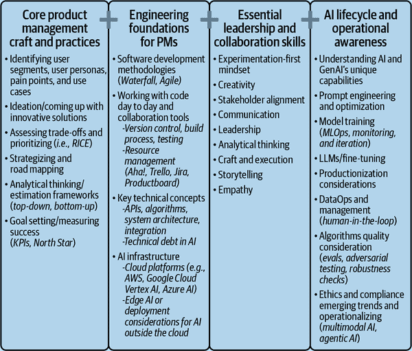
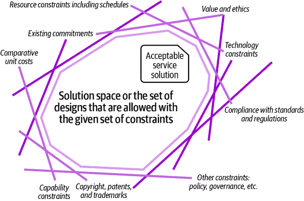
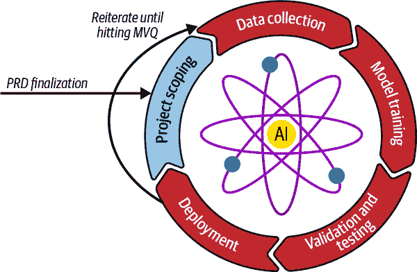
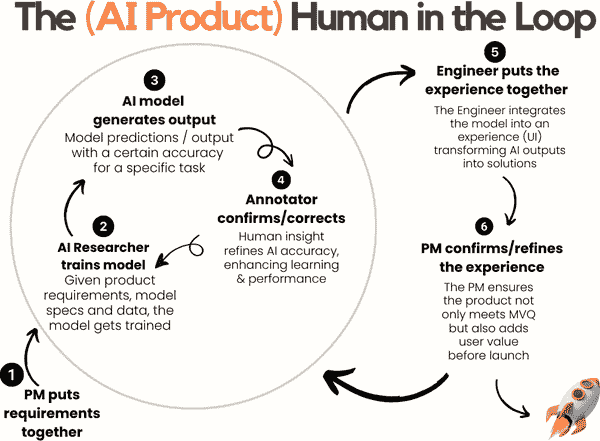

# 第三章. 必备 AI 产品经理知识

在第二章中，我们将 AI 产品经理的角色映射到 AIPDL 的每个阶段。与传统产品管理中的同行不同，AI 产品经理必须仔细应对不断发展的 AI 技术以及不断变化的市场需求。将独特的产品价值主张与精确的市场匹配相结合，为产品带来竞争优势，并推动行业向突破性创新迈进。随着企业越来越多地使用 AI 来驱动决策、优化运营和个性化客户互动，对熟练的 AI 产品经理的需求激增。这些专业人士处于前沿，开发创新产品以满足未满足的需求。

在本章中，我们探讨了产品经理需要掌握的基本技能，以便过渡到专注于 AI 的角色。从传统产品管理转向 AI 产品管理无需从头开始。你已熟练掌握的许多核心技能——如项目管理、利益相关者沟通和战略思维——在这个新领域构成了坚实的基础。然而，AI 产品管理也要求具备专业能力。

AI 产品经理必须具备技术理解和战略远见，以应对 AI 产品的独特挑战。作为 AI 产品经理，你将不仅是项目监管者；你还将是能够洞察并平衡人类需求与机器可能性的远见者。这一角色需要深入理解 AI 技术的潜力和边界。虽然创新解决方案的才能很有价值，但成功的 AI 产品经理是务实的、专注的，确保每个正在开发的产品既新颖又具有市场性和盈利性。

随着 AI 重塑医疗保健、金融和娱乐等行业，需要熟练的产品经理来弥合传统产品管理和 AI 驱动项目之间的差距，这一点至关重要。在接下来的章节中，我将详细介绍如何利用你现有的技能，并确定你需要掌握哪些新技能才能成为一名成功的 AI 产品经理。

四个类别（如图 3-1 所示 Figure 3-1）涵盖了成为 AI 产品经理所需的技能：核心产品管理技艺和实践、工程基础、基本领导力和协作技能，以及 AI 生命周期和运营意识。每个类别都列出了与工作相关的技能清单。无论你是渴望成为 AI 产品经理还是仅仅希望提升现有的专业知识，这里分享的见解将指导你掌握行业所需的核心理念和知识，以保持敏锐。在本章中，考虑你将如何在整个 AIPDL 中使用这些技能。

###### 图 3-1. AI 产品经理技能集的不同类别

# 核心产品管理技艺和实践

本部分讨论的是构成任何成功产品经理技能集核心竞争力的要素。本节将确认人工智能产品经理的许多职责与通用产品经理相似。因此，在本节中，应优先理解这些基础技能如何转化为管理人工智能驱动产品的背景。这种理解将提高你的效率，并确保更顺利地过渡到人工智能产品管理的专业领域。

书中深入探讨了这些实践。我在上一章已经讨论了创意和人工智能的独特超能力，你将在第五章中找到更多关于策略和路线图的信息。本节的目标不仅是要回顾这些基本技能，还要指导你如何从人工智能的角度放大这些技能，并弥合传统产品管理实践与人工智能新需求之间的差距。本节旨在帮助你保持并提升在人工智能导向市场中的角色。

## 识别用户群体、用户画像、痛点以及用户需求

理解你的用户至关重要。一名熟练的产品经理应擅长将更广泛的受众细分为不同的细分市场或角色。这种粒度有助于针对特定的需求或痛点定制产品功能。对于人工智能产品而言，这可能意味着区分和假设哪个用户群体将最能从智能算法中受益，或者哪个细分市场可能需要更直观的界面。

具体来说，用户细分是理解受众的初始和关键步骤。*用户细分* 涉及根据共享特征将更广泛的用户基础划分为更小、更明确的群体。最终目标是调整产品策略以满足这些群体。为了实现这一点，必须分析用户数据，这可能包括人口统计信息、平台上的行为、购买历史或参与度水平。

## 编写用户故事

*用户故事* 是产品管理中的基本工具。它们从最终用户的角度提供了简洁、直接的功能描述。通过将叙事集中在用户的需求和体验上，用户故事确保产品开发专注于提供真实的价值。

在人工智能领域，人类需求和机器功能之间的相互作用错综复杂，用户故事有助于保持这种平衡。它们迫使开发团队在每一个设计和实施阶段都考虑用户的环境，培养以用户为中心的方法，这对于人工智能应用的成功至关重要。在人工智能中，引人入胜的用户故事还充当桥梁，将复杂的技术可能性转化为用户可接受的好处，从而推动更广泛的应用和满意度。

作为一名 AI 产品经理，制定吸引人的用户故事尤为重要。AI 驱动的解决方案可能很复杂，通常集成了先进的技术，如果不正确地锚定，很容易偏离实际用户应用。

这里是一些针对各种 AI 功能的假设用户故事，它们遵循特定的三行模板：

+   用户是谁

+   他们的用例是什么

+   他们的期望或期望结果是什么

**示例 1：Netflix 的改进推荐系统**

故事：避免重复推荐

“作为一名经常忽略特定节目推荐的 Netflix 观众，

我希望系统注意到我对那个节目不感兴趣，并停止推荐，

这样我的推荐就能更符合我的口味。”

**示例 2：Spotify 的同伴推荐功能**

故事：同伴推荐

“作为一名信任我的朋友音乐品味的听众，

我希望有一个选项可以看到我的朋友们目前正在听什么歌曲，

这样我就可以发现我会喜欢的歌曲和播放列表。”

**示例 3：Tinder 或 Bumble 等约会应用的改进匹配算法**

故事：更深入的兴趣匹配

“作为一名重视共同爱好和兴趣的约会应用用户，

我希望匹配算法优先考虑基于共同爱好和核心信念的配置文件，

这样我就能找到与我更有共同点的匹配对象，从而可能导致更有意义的联系。”

**示例 4：设计软件（如 Canva）上的个性化设计模板**

故事：定制邀请模板

“作为一名希望创建独特邀请的事件组织者，

我希望一个系统可以根据活动的主题、配色方案和基调生成个性化的设计模板，

这样我就能快速创建并发送吸引人的邀请，并反映活动的氛围。”

**示例 5：特斯拉自动驾驶安全功能增强**

故事：在各种条件下的高级安全

“作为一名对自动驾驶感兴趣的特斯拉车主，

我希望自动驾驶汽车系统能够适应性地识别和调整不同的天气和道路条件，

这样我就可以确保在各种环境中获得更安全、更可靠的自动驾驶体验。”

一旦定义了用户故事，就要头脑风暴技术和产品来解决用户需求。在不断发展的技术环境中，现状通常是不够的，尤其是在 AI 领域。AI 产品经理在发展和构思想法时必须跳出思维定式，同时利用创造性解决方案来满足用户需求。

创新使产品保持相关性和竞争力，无论是与 AI 驱动的助手互动的新颖方式，还是突破性的算法方法。我们将在“必备领导力和协作技能”中讨论一些创新和解决问题的策略。

## 评估权衡和优先级排序在 AI 产品管理中的重要性

并非所有功能或解决方案，即使可行，都应该追求。AI 产品经理的关键职责之一是仔细评估权衡，并根据业务目标、技术可行性和道德影响来优先考虑决策。这个过程并不简单，因为 AI 系统通常提出一组独特的挑战，需要平衡多个相互竞争的因素。评估权衡意味着权衡一个功能的利益与其成本和潜在风险，同时始终确保决策与公司的长期战略和用户需求保持一致。让我们分析一下在决策过程中面临的一些常见权衡类型。

### 准确性与速度

在 AI 领域，尤其是在设计需要实时决策的系统时，算法的准确性与其处理数据所需的时间之间往往存在紧张关系。例如，在自动驾驶汽车中，物体识别算法必须足够准确，以检测行人、车辆和障碍物。然而，这些算法还需要在毫秒内处理这些数据，以便汽车能够在道路上做出瞬间决策。AI 产品经理必须决定可以牺牲多少准确性以确保系统在所需的时间限制内运行。过分强调准确性可能会延迟系统的响应，使其不安全。相反，如果优先考虑速度而没有足够的准确性，可能会导致错误，损害安全性和对技术的信任。

### 复杂性与简单性

AI 模型从高度复杂的深度学习网络到更直接的基于规则的系统不等。平衡复杂性和简单性通常围绕着平衡易于理解和性能。例如，在客户支持聊天机器人中，一个复杂的 NLP 模型可能更好地处理细微的查询，并给出更类似人类的响应。然而，这样的系统可能更难解释、调试和维护。另一方面，简单的模型可能更透明，更容易排除故障，但可能在性能上有所不足。PM 需要决定增加的复杂性是否由用户体验或运营成果的增量改进所证明是合理的。

### 数据质量与数量

AI 系统对数据的需求很大。然而，在收集大量数据并确保数据高质量、相关性和道德来源之间存在着显著的权衡。在医疗保健等领域的 AI 模型需要大量的患者数据来提高诊断准确性。然而，确保这些数据准确、正确标记并符合 GDPR 等隐私法规至关重要。收集大量低质量或具有偏见的数据可能会引入严重损害模型性能的问题。AI 产品经理在这里的角色是确保数据管道的稳健性，并且关注点不仅在于数量，还在于数据收集的质量和道德考量。

### 泛化与特定性

人工智能发展中一个核心的困境是决定是构建*通用模型*，这些模型可以适应多种任务，还是构建*专用模型*，这些模型针对特定任务进行了优化。例如，在一个推荐系统中，一个通用模型可能会在多个领域（如电影、书籍、音乐）提供建议，但与只关注一个领域（如推荐电影）的专用模型相比，在每个领域可能会失去一些准确性。人工智能项目经理必须评估通用模型的更广泛适用性是否值得在更专业需求中可能出现的性能损失，或者一套专用模型是否尽管增加了开发复杂性和成本，但能提供更好的结果。

### 用户隐私与个性化之间的权衡

随着人工智能越来越推动个性化体验，项目经理在用户隐私方面面临艰难的决策。分析用户数据的人工智能系统——例如定向广告平台——在提供定制体验方面非常有效，但同时也引发了重大的隐私担忧。用户经常担心收集了多少个人数据以及如何使用这些数据，尤其是在 GDPR 等法规日益收紧的情况下。在提供个性化体验和保障用户隐私之间取得平衡至关重要。在某些情况下，这种权衡可能意味着放弃某些数据丰富的个性化功能以保持用户信任，或者投资于保护隐私的人工智能技术，如差分隐私。

### 道德考量与商业目标之间的权衡

随着人工智能系统变得更加复杂，围绕偏见、公平性和透明度的道德担忧日益紧迫。例如，在人工智能驱动的招聘工具中，项目经理必须确保用于筛选候选人的算法没有偏见，确保招聘过程的公平性。然而，可能存在业务压力加快招聘流程、降低成本或满足特定配额，这可能诱使决策者忽视一些这些道德担忧。人工智能项目经理必须在满足商业目标与创建公平、无偏见且道德上可靠的产品之间取得平衡，即使这意味着放慢某些举措以减轻风险。

### 可解释性与性能之间的权衡

另一个重要的权衡是人工智能模型性能与可解释性之间的平衡。复杂的模型，如深度神经网络或集成模型，可能提供更高的准确性，但通常被称为“黑盒”模型，因为它们缺乏可解释性。在信用评分和医疗诊断等领域，决策背后的理由至关重要，项目经理必须在高性能模型的需求与模型能够向用户和监管机构解释其决策的需求之间取得平衡。一个高度准确但无法解释的模型在透明度和问责制至关重要的环境中可能不可行。

## 建立还是购买？战略权衡

除了模型开发中的技术权衡之外，AI 项目经理还经常面临更高层次的战略权衡，尤其是在需要确定是否在内部构建 AI 系统或购买现有解决方案时。以下是需要考虑的关键因素：

成本效益比

构建内部 AI 系统提供更多控制和定制，但成本高昂且耗时。购买第三方解决方案可能节省时间和资源，但它可能不完全符合您业务的特定需求或长期战略。

专业知识与人才

开发 AI 系统需要专业人才，如数据科学家和机器学习工程师。如果您的公司缺乏构建复杂 AI 模型的专业知识，您可能选择购买解决方案或与外部供应商合作。然而，如果 AI 是您业务的核心，投资人才和内部构建可以提供竞争优势。

市场时间

购买预构建的 AI 解决方案可以显著缩短将产品推向市场的时间，这在快速发展的行业中可能至关重要。然而，这可能会限制未来的灵活性，因为预构建的系统通常缺乏内部解决方案可以提供的适应性。

风险和不确定性

内部构建通常涉及更多风险，因为数据可用性、模型性能和可扩展性存在不确定性。现成的解决方案通过提供经过验证的产品来降低这些风险，但它可能引入对第三方供应商的依赖。

数据隐私和伦理

内部构建 AI 系统允许完全控制数据处理和隐私协议，这对于有严格监管要求的行业至关重要。第三方解决方案可能无法提供相同水平的数据使用和处理透明度和控制。

可扩展性和维护

购买一个可扩展的解决方案可以加速增长，但随着公司的发展，维护和定制可能成为一个问题。内部构建允许构建一个可扩展且适合公司增长轨迹的解决方案，但这伴随着持续的开发和维护成本。

竞争格局

如果 AI 是您业务的差异化核心，那么构建内部系统可能提供竞争优势。然而，如果 AI 不是您价值主张的核心，购买一个可靠的标准解决方案可能是一个更明智、成本效益更高的选择。

与核心业务目标的一致性

最终，决定构建还是购买取决于 AI 是否是公司长期目标的核心。如果 AI 是创新和竞争优势的关键驱动因素，那么内部构建可能是一个更好的投资。如果 AI 是辅助技术，购买外部解决方案可能更有效率。

在现实中，权衡取舍不仅仅是选择 A 或 B；对比可能并不总是明显。我喜欢将不同的因素几乎想象成 3D 交易空间中的滑块，您需要精确地定位它们，正如接下来在“定义您的交易空间”中讨论的那样。您可以在多个维度上调整您的策略。

## 定义您的交易空间

想象您正在构建一个由人工智能驱动的功能。您的交易空间可能涉及上述任何权衡取舍。为了快速举例，让我们选择三个权衡取舍：平衡成本与收益、上市时间以及风险与回报。对于这个示例项目，您可能决定更快的上市时间至关重要，这可能意味着选择现成的 AI 解决方案。但这个选择可能会牺牲一些控制和定制，迫使您通过在其他领域投入更多，如用户体验或客户支持，来平衡这些损失。

这个交易空间不是静态的。随着您的项目发展，权衡取舍也会发生变化。在开发初期，您可能会优先考虑快速胜利，但随着项目的成熟，长期可持续性和可扩展性可能会更加重要。将您的交易空间视为一个动态、不断变化的景观，可以帮助您做出更明智的战略决策。

您的交易空间将独特于您的产品、市场和您组织的目标。例如，一个小型初创公司可能会优先考虑速度和敏捷性，而一个大企业可能会更多地关注可扩展性和长期回报率。

这里是我的六步指南，用于定义您自己的交易空间：

1.  第 1 步：识别关键因素

    首先，列出与您的产品相关的关键权衡取舍，例如前面提到的因素。至少，您将希望包括成本、时间、专业知识和风险。一些权衡取舍可能更明显和常见，例如在隐私与个性化之间取得平衡，但可能会有不同的权衡取舍，您需要通过与您的利益相关者交谈来逐个捕捉。研究科学家可能会提出您尚未考虑的新因素；例如，可以通过改进产品来确保解决方案的稳健性和可扩展性，并保持计算成本较低。与您的科学家、工程师和 UX 设计师交谈，绘制一个全面、准确的交易空间画面是一个好习惯。

1.  第 2 步：排序优先级

    确定每个因素的相对重要性。什么是不可协商的？您愿意在哪些方面妥协？请注意，您的利益相关者会有不同的目标。例如，利益相关者 1 可能希望优化质量，而利益相关者 2 可能希望优化上市时间。最终，您需要通过添加您的愿景和战略思维来绘制完整的画面。

1.  第 3 步：绘制相互依赖关系

    理解每个权衡如何影响其他方面。例如，降低成本可能会增加上市时间或减少定制化。你肯定需要与你的科学家、工程和市场营销/公关团队进行沟通。

1.  第 4 步：可视化权衡空间

    创建你权衡空间的视觉表示，如矩阵或图表，你可以在其中绘制不同的场景和结果，如图图 3-2 所示。

1.  第 5 步：测试不同场景

    使用这个权衡空间模型来模拟不同的决策及其影响。根据这些模拟调整你的策略。

1.  第 6 步：迭代和调整

    随着项目的进展，定期回顾你的权衡空间。当新信息可用或市场条件发生变化时，调整你的优先级和策略。

图 3-2 是一个抽象图，它考虑了各种约束条件来可视化权衡空间。它可以帮助你在构思和决策过程中。要创建一个权衡空间，确定你问题的所有相关约束（如资源、伦理、技术或法规）和权衡，然后将这些约束作为边界来定义解决方案空间，可视化可接受解决方案在这些交叉限制中的位置。你的解决方案就在解决方案空间中的某个地方。确保明确指出每个权衡的风险和机遇。

###### 图 3-2\. 人工智能应用中的权衡空间示例（来源：[Christian Kaestner](https://oreil.ly/v6MTu))

## 在产品评论中融入权衡

确定复杂人工智能解决方案的正确前进道路是一个需要跨职能合作伙伴和领导层输入的协作过程。产品评论是协调权衡、约束和战略优先事项的最有效方式之一。第五章提供了进行产品评论的详细指南。在附录中，我介绍了一个产品评论模板，你可以将其作为产品评论文档的一部分使用。在顶部包含一个执行摘要是一个好习惯，目的是与你的领导层讨论权衡空间。这些摘要旨在以清晰、结构化的方式呈现多个选项、它们的权衡和建议，以确保明智的决策。

表 3-1 提供了一个示例，说明我如何可视化地表示人工智能产品的不同解决方案，包括关键因素、权衡和潜在结果。所描述的示例是在设备处理和云处理之间进行决策，权衡了关键因素及其利（+）弊（–）。在这个假设场景中，我选择的因素是用户体验、伦理和隐私、合规性、资源限制和技术限制。

表 3-1. 决策选项优缺点示例

| 因素 | 选项 A：设备端处理 | 选项 B：云处理 |
| --- | --- | --- |
| 用户体验 | + 响应时间快（低延迟），非常适合实时应用。+ 离线功能确保在连接性差的地区可靠性。– 受限于设备硬件，限制了模型复杂性。 | + 支持更先进的具有更好准确性和功能的人工智能模型。+ 无设备限制，易于扩展到多个用户。– 依赖于一致的网络安全质量；延迟可能影响体验。 |
| 道德和隐私 | + 用户数据保持本地化，提高隐私并降低数据泄露风险。– 如果设备丢失或被黑客攻击，则风险更高。 | + 集中监督简化数据审计和安全监控。– 数据聚合增加了滥用或违规的风险。 |
| 合规性 | + 通过保持数据本地化，更容易遵守严格的法规，如 GDPR 或 HIPAA。– 基于设备的合规性可能因硬件和软件合作伙伴关系而异。 | + 通过集中控制简化全球合规性管理。– 跨境数据流动限制可能会复杂化部署。 |
| 资源限制 | + 初始投资后，持续成本较低。– 需要重大的前期硬件投资以实现设备端处理。 | + 可灵活的按需付费定价模式，在闲置期间减少浪费。– 需要持续的服务器基础设施和云扩展运营费用。 |
| 技术限制 | + 独立于网络可用性，确保稳健性。– 需要轻量级人工智能模型，针对受限硬件进行优化。 | + 支持需要高性能计算能力的前沿人工智能模型和技术。– 依赖于稳定的互联网连接，可能产生故障点。 |

在表格之后，添加你的推荐和理由。访问附录以获取完整的产品审查模板。

明确方向和规划路径对于确保人工智能产品成功上市和获得市场认可至关重要。产品经理定义产品的战略愿景，确保与组织目标一致。这包括制定路线图和产品随时间发展的视觉表示，详细说明要开发的功能和何时开发。制定战略愿景还可以包括人工智能产品的数据获取或模型精炼等里程碑。我将在第四章中详细讨论路线图，该章节专注于人工智能产品的日常管理。

# 如何培养通用产品管理技能

要成为一名成功的产品经理，所需的技能是不断变化的。对于任何成功的专业人士来说，持续学习和更新现有技能都是至关重要的。认识到 AI 产品管理中的独特挑战和机遇，本节旨在引导你通过各种教育和实践经验来增强你的分析推理、决策能力和动手能力，这些能力对于在这个动态领域茁壮成长至关重要。在这里，你将找到可操作的指导，以开始并持续提升掌握有效 AI 产品管理所需技能的旅程。

## 教育追求

AI 产品经理需要建立在教育追求之上的基础，这些追求能够为他们提供分析和决策技能。正式课程在这一发展中扮演着至关重要的角色。这些课程从关注分析推理的广泛课程到为技术和 AI 行业量身定制的更专业课程应有尽有。这样的教育项目能够增强批判性思维，并为你提供强大的分析工具，以有效地推动 AI 项目向前发展。你可以在传统大学或通过像[Coursera](https://www.coursera.org)、[edX](https://www.edx.org)和[Udacity](https://www.udacity.com)这样的在线学习平台上参加这些课程。这些平台提供了由各自领域专家开发的专项课程，确保学习者无论地理位置如何都能获取前沿知识。

## 实践经验

除了正式课程之外，研讨会和训练营以浓缩的形式提供了实用的动手经验，这使它们成为你深化对特定领域理解（尤其是在数据分析方面）的绝佳方式。例如，[Maven](https://maven.com)（我在那里授课）、[General Assembly](https://generalassemb.ly)和[Le Wagon](https://www.lewagon.com)等平台举办的研讨会因其关注当前行业实践和技术而受到技术社区的广泛认可。

除了训练营，参加黑客马拉松也是 AI 产品经理获取动手经验、利用社区知识和建立人脉的另一种极好方式。例如，[Devpost](https://devpost.com)和[Kaggle](https://www.kaggle.com)等平台举办了许多黑客马拉松，提供了在特定问题上工作的机会，这些数据集通常模仿现实世界场景。这些活动不仅挑战参与者们在时间限制下应用他们的技能，而且培养了一种协作和创新的精神，提供了一个既具有竞争性又具有教育性的学习平台。

寻找参与多样化项目的方法对于 AI PM 至关重要。通过参与各种 AI 项目，PM 们会遇到需要创新解决方案和适应性思维的挑战。这种接触增强了他们的解决问题的能力，并加深了对不同 AI 应用及其潜在影响的理解。这样的经验是无价的，因为它们使 AI PM 为处理现实世界 AI 产品开发的复杂性做好准备。

## 持续学习

人工智能领域非常动态，对任何 AI PM 来说，持续学习都是成功的关键基石。在突破性研究、变化的方法和相关的行业新闻之后，这是必不可少的。定期咨询来自主要科技公司的 AI 博客，例如[Meta 的 AI 博客](https://ai.meta.com/blog)和[Google 的 AI 博客](https://oreil.ly/bb_N_)，在这些博客中，人们讨论新的进展、研究成果和案例研究。此外，订阅精心策划的时事通讯，如 MIT Technology Review 的[*《算法》*](https://oreil.ly/AWtWx)、[*AI-Weekly*](https://ai-weekly.ai)、[O’Reilly 的 AI 时事通讯](https://oreil.ly/2SzI4)和[*Last Week in AI*](https://lastweekin.ai)，可以提供源源不断的最新和相关信息。这些资源帮助你了解最新的趋势、尖端技术和竞争格局，从而构建管理 AI 驱动产品的策略和工具。

# 必要的领导力和协作技能

作为经验丰富的产品经理，你必须具备对成功的人工智能产品管理至关重要的各种软技能。本节基于这些现有能力，重点关注如何适应和增强它们以应对管理 AI 产品的特定挑战。

虽然在人工智能开发中的技术知识至关重要，但人工智能产品经理（AI PM）的角色也极大地依赖于你理解用户的能力以及将你的人际交往技巧应用于弥合高级人工智能技术与实际、以用户为中心的应用之间的复杂差距。在这里，我们将深入探讨哪些软技能对 AI PM 至关重要，以及你如何进一步发展这些技能，以有效地创建和推出结合尖端技术并真正与用户产生共鸣、满足用户需求的解决方案。这种方法将使你能够利用现有的优势来促进创新，并确保你的 AI 产品尽可能具有影响力和以用户为中心。

## 创造力

创造力赋予产品经理们构思独特解决方案、构想新颖的产品特性以及跳出思维定势来满足用户需求的能力。在新技术和可能性层出不穷、我们难以跟上其步伐的快速变化环境中，一种创造性的方法可以将成功的产品与平庸的产品区分开来。创造力使 AI 产品经理能够不仅看到产品的即时功能，还能看到其改变行业甚至创造全新行业的潜力。这关乎超越当前技术，看到可能性的未来，并做出铺就创新之路的勇敢决策。为了培养这种创造力，你可以沉浸于从艺术到旅行的各种经历中，从而增强你的创新思维能力。定期的头脑风暴会议，如我们在第二章中讨论的那样，进一步激发创造性思维，使其成为创新的关键实践。 

以下小节探讨了将创造力融入人工智能产品管理中的不同方法，突出了创造力如何在创新问题解决、产品差异化和故事叙述中体现。通过深入研究这些主题，你会发现创造力不仅仅是产生 100 个想法；更重要的是，它有助于开发独特的解决方案，在竞争激烈的市场中区分你的产品，并有效地传达其价值。

### 创新问题解决和设计思维

创造力在人工智能产品管理中体现的主要方式之一是通过创新问题解决。通常，解决方案并不明确，需要跳出思维定势的想法。练习设计思维是成为一名创造性问题解决者的好方法。实用设计思维的核心在于与用户产生共鸣，定义痛点，并通过测试来解决以用户为中心的问题。考虑这样一个例子，你是一名负责改善公共交通用户体验和客户情绪的人工智能产品经理。通过创造性地应用人工智能技术来减少因等待时间而产生的痛苦，你可以创造一个有价值的产品，极大地提升客户服务体验。

### 产品差异化

创造力在产品差异化中也起着至关重要的作用。一个有创造力的 AI 产品经理可能会整合看似无关的数据来源，在充斥着人工智能解决方案的市场中提供独特的见解。例如，零售领域的 AI 产品经理可以通过结合天气预报数据和消费者购买模式来预测和应对因天气条件变化而导致的购买行为变化。知道如何通过差异化来传递价值并建立竞争优势是一个创造性的挑战。

### 故事叙述

讲故事是一种确保利益相关者支持、培养团队凝聚力、增强沟通和建立稳固品牌身份的策略。通过阐述清晰而引人入胜的叙述，项目经理确保从团队成员到利益相关者，每个人都与产品的目标保持一致。这种叙述方法有助于建立对用户的同理心，促进团队内部的更好沟通，并创造满足用户需求解决方案。一个在所有用户接触点上产生共鸣的连贯故事，可以建立难忘的品牌身份，使产品成为用户故事的一部分。

###### 注意

通过培养创造力，AI 项目经理确保他们能够跟上技术进步，并对创新的走向有远见。他们将抽象的想法转化为可以显著影响企业和消费者的具体产品，确保他们的项目满足当前市场需求并塑造未来趋势。

## 沟通

有效的沟通对于将复杂的 AI 概念转化为清晰、易懂的叙述至关重要，这些叙述能够引起利益相关者和用户的共鸣。例如，AI 项目经理应该能够有效地向非技术性的董事会成员解释新 AI 算法的好处，从而获得整个项目的支持。你可以通过定期与不同受众的互动来培养这种技能。在团队会议、利益相关者演示和非正式讨论中，练习将复杂的 AI 功能简化为更简单的术语。这不仅将确保清晰性，还将有助于增强你在技术和商业世界之间架起桥梁的能力。

## 领导力

成功领导者的核心品质之一是能够将多元化的团队团结在共同愿景周围。领导力需要领域专业知识以及对产品轨迹和目标的深刻理解。AI 项目经理将跨越各种业务职能进行合作，并必须连接多个部门——如工程、设计和营销——以在产品愿景和里程碑上建立一致性。当将 AI 技术整合到大众喜爱的产品中时，协作至关重要。有意义的、有效的协作取决于项目经理领导团队到达共同终点的能力。

为了提高领导能力，AI 项目经理应积极寻求来自行业经验丰富的专业人士的指导。指导提供了关于成功领导策略的无价见解，并为管理者提供了应对以 AI 为重点的倡议的独特挑战的工具。指导可以以多种形式出现，包括一对一的对话、领导力研讨会和行业会议。

## 分析思维

分析思维是 AI 产品经理的核心技能，使他们能够利用数据来辅助决策。我相信，在任何角色中，数据驱动的决策都至关重要。作为一名产品领导者，我更倾向于使用市场尽职调查或试点实验的相关数据来做出决策，而不是凭直觉或直觉。首先，确定与产品成功相关的关键指标。使用分析工具或自定义仪表板来跟踪这些指标。定期审查数据趋势和异常情况。在做出决定时，使用 A/B 测试来确定最佳行动方案。

培养质疑假设并使用数据支持决策的习惯。虽然理解如何解释预测模型和模拟的结果至关重要，但成功的 AI 产品经理还应该了解不同类型的机器学习模型以及它们最佳部署的场景。例如，回归分析是一个简单的模型，用于预测用户行为，而聚类技术可以根据使用模式有效地细分用户。这些数据科学方法帮助产品经理评估解决复杂问题不同方面的最佳方法。在数据分析方面有坚实的基础将帮助产品经理在面对困难的选择时找到正确的平衡。

参加专注于关键数据科学概念的专业课程，如统计分析、预测建模和机器学习，是加强分析技能的好方法。许多数据科学课程和课程设置既可在现场也可在线获得。像 Coursera 和[O'Reilly AI 学院](https://www.oreilly.com)这样的教育平台易于访问，并提供了许多合格行业专业人士和学者在该领域的最新方法。

在众多数据科学课程中，每个有志于成为 AI 产品经理的人都应该参加数据分析和可视化、统计学和概率以及机器学习和人工智能的课程。这些课程为产品经理提供了有效的决策所需的强大分析工具包。产品经理需要基本的技术技能才能有效地工作，并与工程师和科学家讨论复杂的概念和权衡。了解机器学习和人工智能技术使管理者能够准确理解技术的可行性和可能性。

## 同理心

每个 AI 产品的核心都是用户。练习同理心确保 AI 解决方案是在对用户情绪、需求和挑战有深入理解的基础上构建的。磨炼这一技能的绝佳方式是与用户直接互动、进行访谈、沉浸在用户反馈中，并定期练习换位思考练习，以与不同的用户群体产生共鸣。我们正在寻找让我们的生活变得更好的方法，而练习同理心是了解彼此和找到成为团队玩家的最佳方式。通过建立这些软技能，AI 产品经理可以使用新技术构建与用户产生共鸣的体验。

接下来，我将分享人工智能产品经理必须迅速掌握的相关工程和基于人工智能的知识。

# 产品经理的工程基础

由于人工智能技术的技术复杂性和持续发展，对工程原理的基础理解对于人工智能产品经理尤为重要。基本的工程知识对于与工程团队有效沟通和创建可行且具有影响力的产品路线图至关重要。虽然本书不会深入探讨图 3-1 中列出的工程基础，但以下概述将为您提供必要的基础知识，以增强您的协作努力和对人工智能产品管理的理解。

## 与代码一起工作

在本节中，我们将讨论为什么理解编码实践对于管理人工智能产品至关重要。随着人工智能技术在产品功能中的支撑作用日益增强，人工智能产品经理必须具备实际的编码知识，以便有效地监督开发过程并确保新技术无缝集成。我将分解开发新人工智能驱动产品的最佳编码实践。从理解版本控制到识别清洁代码实践，再到欣赏算法优化的细微差别，每个小节都将建立在前面的小节之上，提供如何有效地与代码工作的全面指南。这种知识有助于与技术团队更好地沟通，并使产品经理能够做出影响产品技术战略和执行的有根据的决定。

### 版本控制

版本控制对于任何协作项目都至关重要，在代码密集型项目中更是如此。拥有一个管理系统来管理文档更改对于监控和存储文档至关重要，而且在最小化错误或意外负面影响的潜在风险方面更为重要。拥有系统化的版本控制工具可以使跨职能团队能够更有效地协作。例如，[Git](https://git-scm.com)这样的系统允许团队随着时间的推移管理源代码的更改，追踪谁在何时做了什么更改。这些工具确保任何人都可以在任何时候召回先前的软件版本。全面的版本控制系统允许更好的错误跟踪和功能开发；例如，您可以使用 Git 来审查特定功能的进度，或了解项目历史中某些更改的影响。这个工具对于个人责任感和通过[GitHub](https://github.com)或[GitLab](https://about.gitlab.com)等平台进行协作审查和贡献至关重要。

### 构建过程

理解产品构建过程对于任何项目经理来说都是至关重要的，以便设定和管理现实的项目时间表和预期。项目经理必须完全了解用于构建产品的工具和流程。熟悉领先的构建系统和工作流程优化器是一个很好的开始。对于项目经理来说，构建中使用的流程和技术不断改进，因此对新技术的专业知识是任何项目经理持续学习的过程。[MLflow](https://mlflow.org)和[Zapier](https://zapier.com)是流行的 GenAI 构建过程技术。

MLflow 在管理 AI 模型训练和部署的复杂性中扮演着至关重要的角色，它最常用于跟踪实验、将代码打包成可重复运行的包，以及管理来自各种 ML 库的模型部署。

Zapier 因其通过编译、链接和打包成名为*Zaps*的可执行产品来自动化工作流程而闻名，这些产品使用一个应用中的特定事件作为触发器，在另一个应用中执行任务，从而简化流程并提高效率。

通过理解这些工具，你可以更好地预测由于依赖关系或新代码集成到你的 AI 产品中可能出现的延迟或问题，确保项目流程更加顺畅，并更准确地安排时间。

### 测试

测试存在于所有工作流程中。对测试方法的深入了解对于确保最终产品的质量和稳健性至关重要。了解单元测试框架[pytest](https://oreil.ly/wA8uM)和[TensorFlow](https://oreil.ly/K_wH0)可以帮助你模拟 AI 模型的不同场景，以测试 AI 驱动应用程序在生产前的稳健性和准确性。单元测试旨在测试单个软件组件，确保其在独立环境中的性能。

例如，在一个 AI 驱动应用程序中，单元测试可能会验证 ML 模型在不同条件下的准确性和响应时间。这种理解有助于你倡导充分的测试阶段，并确保产品在达到客户之前符合质量标准。

### 资源管理

计算资源可以显著影响 AI 项目的性能和成本。拥有稳健的资源管理系统对于有效和高效地分配资源至关重要。例如，[Kubernetes](https://kubernetes.io)和[Docker](https://docker.com)等工具通常用于管理服务器负载和优化资源分配效率。Kubernetes 允许根据服务器负载自动扩展应用程序，这对于部署可能需要大量计算能力的 AI 模型至关重要。了解这些工具和原则使你能够就资源分配做出明智的决定，预测潜在的瓶颈，并有效地管理运营成本。

###### 注意

了解你的工程师如何与代码和构建的模型互动，应该为你提供一个基础，以便知识性地合作并与技术团队建立联系。

## 关键技术概念

本节将探讨有效管理 AI 产品的基本技术概念。随着 AI 继续融入各个行业，了解这些概念将帮助你有效地监督 AI 技术的设计、开发和集成。本节全面介绍了 AI 产品的技术基础，从促进软件无缝交互的 API 机制到驱动 AI 功能的算法的复杂性。这些概念增强了管理者做出明智决策的能力，并使他们能够与技术团队和利益相关者进行有效沟通。

### API

API 对于构建不同软件系统之间的连接至关重要，对于必须将 AI 模型与现有系统或第三方应用程序集成的 AI 产品经理来说，它们是必不可少的。了解 API 允许 AI 产品经理利用外部服务和数据，并以其他应用程序可以轻松消费的方式提供自己的 AI 功能。例如，AI 产品经理可能负责使用 API 将机器学习模型集成到更广泛的 CRM 系统中，以增强预测性客户分析。通过了解 API 的工作原理，你可以确保不同软件组件之间的数据交换和功能的无缝对接，从而实现更强大和灵活的 AI 解决方案。

### 算法

算法是驱动 AI 系统和体验的核心。在构建 AI 产品时，对机器学习模型（如回归模型、神经网络和强化学习）有深入了解非常重要。了解这些算法如何处理数据和从输入中学习，使 AI 产品经理能够决定哪种技术最适合特定任务。例如，了解监督学习和无监督学习算法之间的差异可以帮助你选择正确的客户细分或异常检测任务的方法。这种基础性知识不仅有助于战略性的产品决策，还增强了与数据科学家和工程师的沟通。我将在本章后面更深入地探讨算法和模型训练过程。

### 系统架构

系统架构影响产品开发的各个方面和部署。*系统架构*指的是整体系统的结构化设计，它概述了各种软件组件、硬件元素与其他系统集成的交互方式，从而形成一个完整的产品。系统架构为产品的功能、性能和可扩展性奠定了基础。它确保产品的所有部分协同高效地工作，满足技术要求和用户需求。

了解系统架构的内外部情况有助于你设计可扩展和具有弹性的产品，这些产品能够处理增加的计算需求。例如，人工智能产品经理必须理解如何构建一个集成实时机器学习模型而不会影响整体系统性能的系统。

###### 注意

对 API、算法和系统架构的详细探索强调了它们在成功管理人工智能产品中的关键作用。通过理解 API 如何使系统之间实现互操作性，以及理解稳健的系统架构的重要性，你将更好地装备自己来开发利用人工智能力量的新产品。

### 软件开发方法

有两种流行的开发方法：瀑布和敏捷。

[瀑布方法](https://oreil.ly/_nwjh)是一种传统的、顺序的软件开发方法，其特征是线性和结构化的阶段。该模型将开发过程分为需求收集、设计、实施、验证和维护。每个阶段必须完成才能开始下一个阶段，几乎没有重新访问已关闭阶段的空间。虽然瀑布模型提供了一个清晰、预定义的路径，可以简化计划和执行，但其僵化性是一个明显的限制，尤其是在需要灵活性的项目（由于需求或技术的变化）中。在项目规格不太可能改变且从一开始就需要清晰性的环境中，瀑布方法可以非常有效。

[敏捷方法](https://oreil.ly/xIkS9)是一种动态和协作的软件开发方法，旨在快速适应变化并交付价值。与瀑布模型不同，敏捷将项目分解为更小、更易管理的增量，称为*sprint*，通常持续几周。这种方法强调持续规划、测试和迭代。

敏捷方法促进了一种高度重视反馈的协作工作模式。反馈循环有助于确保开发与用户需求紧密一致，并且可以在实时对模型进行调整。敏捷的迭代特性允许快速发布和快速变更，使其非常适合动态和不确定的环境。

### 估算框架

估算框架准确预测了各种任务和项目所需的时间和资源。本节探讨了几个框架和技术，它们提供了规划的高级方法。

#### 自上而下的估算。

此方法从项目的整体范围开始，根据过去类似规模的项目的总工作量或成本进行估算。自上而下的估算在项目规划早期阶段特别有用，当时关于具体任务和可交付成果的详细信息不可用。这是一种设置初始预算、时间表或项目可行性的有效方法，尤其是在速度是优先事项且细节尚未定义的情况下。然而，对于复杂或高度详细的项目，它可能不太准确，因为它做出的概括可能没有考虑到独特的挑战或细微差别。

#### 自下而上估算。

经常与自上而下估算一起使用，[*自下而上估算*](https://oreil.ly/4lCT5)涉及将项目分解成更小、更详细的组件，并在将它们相加以获得总项目估算之前估算每个组件的工作量。这种细粒度方法允许项目经理更准确地评估项目的范围和需求，考虑每个组件的具体因素和复杂性。通过实施自下而上估算，您可以设定现实的目标和时间表，更有效地分配资源，并减轻项目超支的风险。

#### 参数评估。

另一种有价值的技巧是[*参数估算*](https://oreil.ly/tX6kT)，它依赖于数学模型和历史数据来生成精确的预测。通过确定关键变量——例如单位成本、任务时间或劳动小时数——并将它们应用于项目范围，参数估算提供了一种系统评估资源需求的方法。这种方法在处理重复性或可扩展的项目时最为有效，其中可用的历史数据稳健且指标明确。例如，在建筑、制造或软件开发中，参数估算可以提供可靠和一致的结果。它不太适合独特项目或创新任务，在这些项目中，历史数据或明确指标可能不可用。

#### 专家判断评估。

另一种广泛使用的方法是[*专家判断估算*](https://oreil.ly/N4uh_)，它涉及利用对领域有深入了解的专业人士的见解和经验。专家评估项目的范围、挑战和要求，根据他们以前类似项目的经验提供有根据的估算。专家判断在历史数据有限、项目涉及创新或独特元素或环境不确定的情况下特别有用。例如，在推出新产品、开发原型或管理高风险项目时，经验丰富的专业人士的细微视角可以帮助预测挑战并提供实用的估算。然而，当有客观的定量数据时，它可能不太理想，因为这些数据可以提供更高的准确度或一致性。

### 数据分析软件

数据分析软件为人工智能项目经理提供了深入数据的能力，使他们能够发现模式并得出可操作的见解。

Python，特别是具有 [Pandas](https://oreil.ly/zwEhR) 和 [NumPy](https://numpy.org) 等库，在数据处理和分析方面特别受欢迎。[R](https://www.r-project.org) 是另一种提供数据分析可视化和选项的统计软件工具，非常适合进行更多统计工作。SQL 对于高效查询大型数据库不可或缺，允许项目经理直接从源头检索和分析数据。

此外，像 [Tableau](https://www.tableau.com) 这样的可视化平台将复杂的数据集转化为可理解、交互式的视觉表示，从而便于向利益相关者传达洞察。掌握这些工具可以增强您的分析能力，以便做出基于数据的决策。

###### 注意

虽然人工智能项目经理不需要是经验丰富的工程师，但对这些工程原理和实践的基础知识是必不可少的。这确保了更连贯、信息更丰富、更高效的产品开发过程，尤其是在人工智能快速、复杂的领域中。

# 人工智能产品开发生命周期和运营意识

理解基本概念，例如机器学习算法、模型训练、微调、大型语言模型（LLMs）、模型质量和数据管理，对于有效管理人工智能产品至关重要。掌握这些概念使您能够就设计、开发和部署人工智能系统做出明智的决策。

理解机器学习算法有助于您选择合适的方案来解决特定问题，而了解模型训练过程则确保这些算法能够最佳运行。您需要能够评估模型质量——这是确保人工智能产品达到所需标准并交付可靠预测的必要条件。此外，有效的数据管理策略对于维护用于训练人工智能模型的数据的完整性和效率至关重要。这些能力是成功的人工智能产品管理的基石，确保产品高效运行并与更广泛的企业目标和道德标准保持一致。为了理解这些概念，让我们深入了解人工智能的生命周期。

第二章 介绍了人工智能产品开发生命周期并讨论了人工智能最小可行产品（MVP）。在本节中，我们将更深入地探讨人工智能产品开发生命周期（AIPDL）。理解其阶段至关重要，因为它们概述了从最初的想法到可以迭代和改进的运行人工智能产品的路径。图 3-3 展示了人工智能生命周期的阶段。生命周期会重复进行，直到项目达到合理的最小可行质量（MVQ），这代表着产品提供足够的价值以有效满足用户需求并可以投放市场的阈值。

###### 图 3-3. 人工智能生命周期阶段

## 项目范围

在任何开发开始之前，您需要有一个明确且可执行的计划。这就是项目范围发挥作用的地方。到这一点，您应该已经有一个最终确定的 PRD，如第二章中所述，它定义了 AI 产品的目标、用户需求、成功指标和约束。**项目范围**是关于工程团队将产品需求转化为技术边界和期望的过程。您试图解决什么问题？您追求什么结果？将涉及哪些数据来源？

例如，如果您正在为视频流媒体平台构建一个由 AI 驱动的个性化内容推荐系统，项目范围可能包括确定需要捕获的关键用户交互数据（如观看历史、类型偏好和观看时长）以及设定一个明确的目标，通过推荐相关内容来增加用户参与度。在这种情况下，PRD 将详细说明所需数据的类型、与现有平台的集成点以及衡量成功的关键绩效指标（KPI）。

此阶段还包括与跨职能团队（工程、数据科学、法律、设计）建立初始对齐。明确项目范围可以避免范围蔓延，并使每个人都对项目的目标和前进道路有一个共同的理解。明确指出哪些内容**不在**范围内是一个好习惯，这有助于您为跨职能合作伙伴设定正确的期望。

## 数据收集

在数据收集阶段，您的科学家同行将有一个初步计划，说明训练模型所需的数据量，该模型将提供所需输出。在大型公司中，机器学习运营（MLOps）团队通常负责收集将输入到 AI 模型中的必要数据集。您收集的数据的质量和多样性将直接影响模型的表现。

这里有一些不同的来源，您可以从这些来源获取数据：

+   内部数据库

    +   对于个性化推荐系统（如内容流媒体平台），收集用户活动数据，例如点击、搜索查询、观看历史或购买行为。

    +   客户支持聊天机器人可以利用来自现有 CRM 平台的数据，包括过去的互动、支持工单、聊天记录和客户档案。

    +   为了优化 AI 驱动的业务流程，使用内部运营数据，例如销售数字、库存记录、交易日志或生产指标。

+   第三方 API 和平台

    +   如 X、Meta 和 Instagram 等社交媒体平台提供提供访问公开帖子、用户档案、标签和参与度指标的**API**。这对于情感分析和社交媒体监控工具特别有用。

    +   政府网站、教育机构和非营利组织通常提供免费的公共数据集。例如，[美国人口普查局](https://data.census.gov)、[世界银行](https://oreil.ly/DO_iQ)和[联合国](https://data.un.org)的数据集是人口、经济和地理数据的优秀来源。

    +   例如[OpenWeather](https://oreil.ly/AWkWL)和[Google Maps Platform](https://oreil.ly/Bc-QR)等天气和地理位置 API 提供实时天气条件和基于位置的信息，这些信息可以集成到各种预测模型中（例如供应链预测或个性化营销）。

+   用户生成内容

    +   例如[Amazon](https://www.amazon.com)、[Yelp](https://www.yelp.com)和应用程序商店等平台拥有丰富的用户评论、评分和评论数据集，这些数据对于构建情感分析工具或推荐引擎非常有用。

    +   您可以通过调查、产品反馈表或应用内反馈提示等方式直接从用户那里收集反馈，以了解他们的偏好和行为。

+   公共存储库和开源数据

    +   对于图像识别或计算机视觉任务，例如[ImageNet](https://oreil.ly/HBWTz)、[COCO (Common Objects in Context)](https://oreil.ly/OxXj7)和[Open Images](https://oreil.ly/Bg8qF)等图像数据集提供了成千上万的有标签图像。对于视频数据，YouTube 和类似平台可以提供有标签和无标签视频内容的数据来源。

    +   对于 NLP 项目，例如维基百科存档、Common Crawl、新闻文章和 Enron 电子邮件数据集等开放文本语料库为模型训练提供了大量的文本。

    +   来自医疗机构如[美国国立卫生研究院](https://www.nih.gov)和期刊聚合器如[PubMed](https://oreil.ly/JuXg8)的[科学和医学数据集]对于在医疗保健领域训练 AI 模型（如诊断工具或患者风险评估）非常有价值。

+   传感器和物联网数据

    +   智能设备（例如智能冰箱，例如温度、湿度和门传感器）的使用模式和传感器数据以及用户交互可以被收集来训练智能家居系统的 AI 模型。

    +   例如健身追踪器和智能手表等可穿戴设备提供有关身体活动、心率、睡眠模式等因素的数据，这些数据可用于开发个性化的健康和福祉应用。

+   数据供应商和市集

    +   例如[Kaggle](https://www.kaggle.com)、[Amazon Web Services (AWS) Data Exchange](https://oreil.ly/DQarv)和[Data.gov](http://data.gov)等数据市场提供对各种数据集的访问，从消费者行为到金融市场。

    +   例如[Nielsen](https://www.nielsen.com)、[Experian](https://www.experian.com)和[Acxiom](https://www.acxiom.com)等商业数据提供商销售有关消费者行为、市场趋势和受众人口统计数据，这些数据对于目标营销和广告模型非常有用。

+   合成数据生成

    +   在现实世界数据稀缺或敏感（如医疗数据）的情况下，你可以生成*合成数据*来模拟可能的场景。这可能包括为计算机视觉模型创建人工图像，为推荐引擎生成客户行为场景，或为语音识别模型合成语音数据。（这是一个次优的数据来源，应在缺乏更好的数据或资源时作为最后的手段使用。）

在收集用户数据时，尤其是对于内容推荐系统或社交媒体工具等产品，你必须确保遵守如 GDPR 等法规。这包括在整个数据处理过程中实施强大的保护措施来保护用户信息。采取此类措施的需求不仅来自法律要求，还来自尊重用户隐私和信任的道德责任。

确保数据保护发挥着几个关键作用。首先，它有助于维护用户信任，这是用户保留和品牌声誉的一个关键组成部分。用户更可能参与他们认为能够安全且透明地处理其数据的平台。其次，遵守数据保护法律有助于避免因数据泄露或滥用而可能出现的重大法律和财务处罚。这些法规要求数据必须出于特定、明确和合法的目的进行收集，并以安全的方式处理，以最大限度地减少泄露和滥用的风险。

此外，道德数据使用不仅涉及合规性；它还包括对算法做出的自动化决策中公平性和非歧视性的承诺。这在内容推荐和社交媒体领域尤为重要，因为算法可能塑造公众舆论或影响个人行为。通过采用道德数据实践，公司确保其系统不会持续存在偏见或导致不公平的结果，从而促进一个更具包容性的数字环境。

让我们继续以构建内容推荐系统为例。在数据收集阶段，你会从各种来源收集数据，例如用户行为日志（点击、观看历史）、内容元数据（类型、导演和演员）以及用户生成信息（评分、评论）。

对于不同的例子，如果你正在开发一个用于社交媒体应用的 AI 图像识别工具，你会依赖开源图像数据集、公开可用的照片，甚至用户上传的内容来构建你的数据集。这可能包括收集和手动将数千张图片分类到各种类别中，以训练模型在新图像中准确识别对象。该过程可能还包括从图像存储库中提取数据。

数据收集只是起点。数据的价值在于我们如何标记、分类和从信息中提取意义。在数据科学中，清洁、标记和以适合模型训练的格式结构化数据的任务被称为*数据预处理*。这个过程从数据清洗开始。这包括删除或纠正不准确、不完整或不相关的数据点，这些数据点可能会显著扭曲任何分析的结果。一旦我们有一个干净的数据集，我们继续标记数据。通过分类数据，我们帮助模型学习正确识别输入数据。此外，将数据分类到适当的类别使得应用需要结构化输入的特定分析和预测模型变得更加容易。这种分类可能涉及将数据排序到预定义的类别中或创建新的类别，以更好地代表潜在的模式和关系。

数据收集和处理不是一个一次性任务；它是一个不断发展的过程。随着你收集更多的用户交互或接收更多的内容，你需要不断地改进你的数据管道。随着环境的变化和用户行为的演变，对数据集进行常规更新有助于确保模型是在高质量数据上训练的。

## 模型训练

模型训练是开发产品的核心阶段。这是魔法发生的地方，因为你的数据被输入到算法中，以创建一个可以进行预测或提供见解的模型。你需要采取实验心态，因为你可能需要尝试不同的算法，调整超参数，并评估初始性能以找到最佳方法。

在这个阶段，重要的是要说明在数据科学和机器学习背景下算法和模型之间的区别。虽然这些术语经常被互换使用，但它们指的是不同的概念。

*算法*是一组规则，定义了如何执行任务，在许多情况下，是做出决策。例如，决策树、回归和聚类是描述解决问题所需步骤的算法类型。

另一方面，*模型*是经过数据训练以解决特定问题的算法的具体用例。当你将数据输入算法并允许它从这些数据中学习时，你得到的就是模型。它不仅包括算法的结构，还包括基于与训练数据相似的数据进行预测或决策的优化参数。例如，一个模型可能是一个特定的决策树，通过学习一组训练图像来分类图像是猫还是狗。

尽管算法可以保持不变，但可以通过在不同的数据集上训练来开发不同的模型。这种灵活性使得模型可以根据独特的商业应用进行优化。例如，如果你正在为客服构建聊天机器人，你可能首先使用过去客户互动的数据集来训练一个简单的 NLP 模型。在这一阶段，你会选择一个相关的模型（可能是一个基于转换器的模型，如 GPT）并训练它来理解和回应各种客户查询。你可能需要多次回顾这一步骤，调整模型以提高准确性和相关性。

作为人工智能产品经理，了解这一阶段的基本知识和不同方法之间的权衡将帮助你有效地与数据科学家沟通。虽然作为人工智能产品经理你永远不需要编码，但你需要展示对人工智能的认识，尤其是在算法方面。在本章末尾，你将找到图 3-5，这是一张人工智能算法和应用的地图，帮助你了解模型训练和算法中包含的内容。

## 验证和测试

模型训练完成后，下一步是验证和测试。这一阶段至关重要，因为它决定了你的模型对新、未见数据泛化的能力。你将使用独立的验证数据集来测试模型的准确性、可靠性和整体性能。

对于内容推荐系统，你可能通过在训练阶段未包含的独立用户数据集上运行模型来测试该模型。这将帮助你了解模型预测用户偏好和识别其推荐中的任何偏差或差距的能力。同样，对于聊天机器人，验证可能涉及使用各种现实世界查询测试模型，以查看它是否提供有帮助、准确的响应。

测试是一个迭代过程。你可能会发现模型的表现不符合预期，或者它引入了意外的偏差。在这些情况下，你需要回到之前的阶段——模型训练——并改进你的方法。训练、验证和调整的周期会重复进行，直到模型达到可以发布的 MVQ 要求。

设置 MVQ 是一个关键决策，没有单一的“正确”或“错误”阈值。作为产品经理，你将根据多个因素来决定这一点，包括用户期望、业务目标、风险承受能力和人工智能产品的特定用例。例如，对于由人工智能驱动的内容推荐系统，MVQ 可能是在达到一定水平的用户满意度（通常通过如 NPS 和 CSAT 等定性指标来衡量）。相比之下，对于人工智能医疗诊断工具，MVQ 可能需要更高的准确度阈值以确保患者安全，例如在识别特定条件时达到 95%的成功率。

这个迭代循环是构建一个强大的人工智能产品、为用户提供可靠、有价值的结果的关键。

## 部署

一旦模型经过验证并满足 MVQ（最小可接受质量），就到了部署的时候。部署是将模型从开发环境移动到生产环境，并最终向用户发布的时刻。这一步骤涉及将训练好的模型集成到产品的基础设施中，设置必要的环境（如云服务和 API），并确保模型可以有效地与其他系统组件交互。

在我们的内容推荐系统示例中，部署将涉及将模型连接到流媒体平台，它可以在实时访问用户交互数据以做出个性化内容建议。对于聊天机器人，部署可能意味着将其与公司的客户支持平台集成，使其能够直接处理客户查询并从新的交互中学习。

## 记住要将人类纳入循环

人工智能生命周期中贯穿所有阶段的“横向”方面是必须将人类纳入循环。虽然人工智能带来了强大的能力，但记住这些系统在与人专业知识和管理协作时表现最佳是至关重要的。将人类纳入循环确保您的 AI 产品不仅从数据中学习，而且与用户需求、道德标准和商业目标保持一致。人工智能生命周期的每个阶段都受益于人类的参与。

在模型训练阶段，人类输入至关重要。数据标注通常需要人类专业知识，尤其是在医学成像和金融分析等复杂领域。涉及人类专家有助于确保模型在准确、上下文相关的数据上训练，从而减少结果中的偏差和错误。

在验证阶段，人类评估对于解释结果和理解模型的优势和局限性至关重要。人类可以识别出自动化指标可能忽略的细微错误或偏差，这对于在医疗保健和自动驾驶等高风险环境中部署的模型至关重要。

即使在部署之后，人类反馈循环也是必要的。AI 产品应允许用户对推荐或决策提供实时反馈。然后，这些反馈可以反馈到数据收集和模型再训练阶段，形成一个持续改进的循环。

图 3-4 展示了人类输入在人工智能生命周期中的位置。您会注意到人类参与并非局限于单一阶段；相反，它贯穿整个生命周期。这种持续的协作确保 AI 产品保持适应性、道德性并符合用户需求。

###### 图 3-4\. AIPDL（人工智能产品开发生命周期）每个阶段的交互（来源：玛丽莲·尼卡博士）

## 映射人工智能算法和应用

我经常说，AI 不是一个产品。相反，它是一套技术和方法论，能够赋能各个行业广泛的产品和解决方案。我创建的这张地图，如图图 3-5（[在线版本](https://oreil.ly/KDanI)）所示，概述了这些技术如何汇聚在一起，创造出有影响力和创新的应用。我们将探索这张地图，从核心概念到实际应用，看看 AI 组件如何整合到现实世界场景中。

这张地图将帮助您了解哪种 AI **超级力量** 能够实现哪种 **AI 赋能的用户体验**。当然，没有一种适合所有情况的配方，这些类别之间有显著的交叉。然而，我创建这张地图的愿望是帮助您梳理不同类型的学习方法、算法、应用、用例和现实世界中的例子。请注意，这并不是为了作为工程资源，实际上有无数种方式来可视化这一点，所以我并不是为了准确性而优化，而是为了知识分享（以及乐趣！）。

###### 图 3-5\. 人工智能应用和算法映射（来源：玛丽莲·尼卡博士）

让我们分解这些类别：

学习方法

人工智能中的“**学习方法**”一词指的是用于训练机器学习模型的方法或技术。这种方法决定了模型如何从数据中学习以做出预测或决策。

算法或模型

人工智能中的 **算法** 是一组规则或指令，旨在执行特定任务或解决特定问题。人工智能中的 **模型** 是算法的特定实现，它已经通过数据训练来预测结果或理解模式。（由于这两个概念相互交织，我将它们打包在一起。）

应用

**应用**一词指的是人工智能模型或算法在现实世界场景中的实际使用，以执行有价值的具体任务，换句话说，就是 AI 产品本身。

用例

您知道什么是**用例**：产品或功能如何解决用户的问题或满足需求。这是一个 AI 技术可以应用于解决特定情境中的问题或改进流程的场景。

这是一个高级图表，从产品角度将算法映射到用例，纯粹是为了说明目的。人工智能产品开发的现实情况通常涉及不同算法和用例之间更为微妙和复杂的相互作用。

让我们从研究地图的基础 AI 学习方法开始，这些方法构成了地图的四个象限：监督学习、自监督学习、无监督学习和强化学习。

### 监督学习

*监督学习*涉及在标记数据集上训练模型，这意味着训练集中的每条数据都与正确的答案或结果配对。这是在 AI 中最常用的学习类型，适用于广泛的领域，从图像识别到预测消费者行为。它需要大量的标记数据，通常用于输出已知且需要根据新输入进行预测的情况。

监督学习适用于以下分类任务：

情感分析

分析来自评论或社交媒体的文本数据以确定其情感（正面、负面、中性）

智能匹配

使用 AI 根据学习到的偏好将用户或产品与约会应用或求职门户等服务中的匹配

图像分类

在图像中识别对象并将它们分类到预定义的类别中

诊断

在医疗保健领域，使用图像数据从扫描或测试中诊断疾病

它也适用于以下回归任务：

预测

根据历史数据预测未来的值，如销售额或股价

优化

调整输入以最大化或最小化某些结果，这在物流和资源配置中很有用

时间序列分析

分析按时间顺序排列的数据点以预测未来的点或趋势

监督学习模型有许多应用和用例。例如，逻辑回归和决策树已成为各个行业的关键工具，金融服务是其最显著的采用者之一。这些模型在欺诈检测中特别有效，因为它们是在预先分类的历史数据上训练的——这些交易已经被标记为欺诈或合法。

通过分析这些数据，模型学会识别微妙的模式和异常，这些模式和异常可能表明欺诈活动。例如，如果信用卡交易与客户的典型消费习惯有显著差异，或者发生在意外的地理位置，系统可以将其标记为需要进一步审查。这种预测能力有助于保护消费者和金融机构，减少损失，并有助于提供更安全的银行体验。同样，医疗保健公司也在医疗诊断中应用监督学习，尤其是在图像分类技术方面。这些模型可以分析医学图像，如扫描或 X 光片，以帮助诊断疾病，为医疗保健专业人员提供宝贵的支持，以便他们提供准确和及时的治疗。

### 自监督学习

*自监督学习*是一种机器学习类型，其中系统通过自身学习来理解数据，而不需要人类提供的明确标签。相反，它通过预测数据的缺失部分或属性来从数据中生成自己的标签。LLMs 和 transformers 在自监督学习中对于理解和生成类似人类的文本至关重要。这些模型在大量未标记的文本数据上训练，可以预测文本延续并生成连贯的文本片段。自监督学习在自然语言理解等任务中特别有用，在这些任务中，标记数据可能很少或难以生产。

自监督学习执行以下功能：

语音处理

通过预测序列中的下一个单词或声音来预测语音转写，而无需标记数据

多模态学习

涉及训练模型处理和整合来自不同类型数据的信息，如文本和图像，以执行自动字幕等任务

自然语言处理（NLP）

广泛用于改进驱动应用程序（如情感分析和语言翻译）的语言模型

其应用和用例包括以下内容：

聊天机器人

利用高级 NLP 能力，帮助聊天机器人生成更相关和上下文感知的响应

内容合成

使内容自动化创建，如文章和报告，感觉自然且类似人类

### 无监督学习

*无监督学习*涉及在未标记、注释或分类的数据上训练模型。模型在没有任何指导的情况下学习，在输入数据中找到模式和关系。这种方法对于发现数据中的隐藏模式或内在结构至关重要。它通常用于在事先不知道结果的数据集中进行聚类、关联和降维任务。

无监督学习在以下聚类任务中表现强大：

异常检测

识别数据中的异常模式或异常值，这在欺诈检测中很有用

图像分割

根据像素的相似性将图像分割成多个部分

客户细分

根据购买行为或偏好对客户进行分组，以定制营销策略

它还有助于以下这样的降维任务：

压缩

在保持其基本特征的同时减少数据大小，这对于存储和分析至关重要

可视化

将高维数据转换为更易于理解和分析的视觉格式

无监督学习的应用和用例包括以下内容：

异常检测

识别欺诈信用卡交易

客户细分

提高用户推荐和定向广告

### 强化学习

*强化学习*（RL）是指一个*代理*，一个采取行动以实现目标的决策实体，通过与环境的交互并基于其行动获得奖励或惩罚来学习。神经网络和深度学习通过处理复杂的数据输入，增强了强化学习，使代理能够学习更复杂的策略。神经网络和深度学习是强化学习的关键组成部分，尤其是在自动驾驶等复杂场景中。*神经网络*的结构类似于人脑，由相互连接的层组成，用于处理信息。*深度学习*使用多层来实现复杂的决策。

强化学习在预测和评估任务中表现良好，例如个性化医疗，它涉及根据不同治疗方案预测的结果来定制医疗保健治疗。它也在以下控制优化任务中表现强劲：

金融交易

使用 AI 在实时交易场景中做出买卖决策

机器人和自动化

编程机器人独立在制造或服务环境中执行任务

由强化学习辅助的探索和利用任务包括以下内容：

多臂老虎机

在一个算法必须从多个具有不确定回报的选项中进行选择的问题设置中，优化以获得最大奖励

基于好奇心的探索

鼓励 AI 系统探索新的或不太了解的环境或数据集以改进学习

强化学习（RL）的应用和用例包括以下内容：

Netflix

使用[多臂老虎机算法](https://oreil.ly/qwFQf)进行个性化观看推荐

自动驾驶汽车

使用深度学习和神经网络处理来自摄像头和传感器的实时数据，通过识别行人、车辆和交通标志，帮助车辆安全导航

强化学习算法

使机器人在制造和服务环境中自主探索和执行任务

## 负责任的 AI 实践

负责任的 AI 实践对于确保 AI 技术以优先考虑人类福祉、公平性和透明度的方式进行开发和部署至关重要。对于 AI 产品经理来说，这意味着将道德考量融入产品的每个阶段和 AI 生命周期。通过提出关键问题来领导你的团队，例如“这个产品将影响谁？”和“可能出现的潜在危害是什么？”

当你识别出潜在风险时，利用如[FATE](https://oreil.ly/2__Yz)（公平性、问责制、透明度、伦理）和[AI Ethics Canvas](https://oreil.ly/v5YYH)等伦理框架来指导算法选择、数据收集方法和模型架构的选择。不要止步于此；确保监控产品性能和社会影响指标，以检测和纠正现实世界设置中的偏见、错误或产品滥用。根据伦理指南和用户反馈定期审计和更新模型，对于在整个产品生命周期内保持负责任的人工智能实践是必要的。

积极识别人工智能系统中的风险对于防止意外社会危害至关重要，这些危害可能从算法偏见到侵犯隐私和加剧刻板印象。你可以通过评估数据集的公平性、测试模型输出的潜在偏见以及进行情景分析来识别意外的使用案例，从而进行各种风险评估。例如，如果训练数据存在偏差，基于人工智能的招聘工具可能会无意中偏爱某些群体，导致歧视性招聘行为。同样，如果基于历史上存在偏差的数据进行训练，预测警务算法可能会不成比例地针对少数群体。如果这些风险得不到解决，可能会导致公众反弹、信任丧失，甚至面临监管处罚。

你可以通过创建多样化的数据集来减轻这些风险。人工智能模型的好坏取决于其训练数据，确保数据集代表广泛的族裔、地理和情境多样性对于最小化偏见至关重要。例如，一个主要在浅色人种图像上训练的面部识别系统可能无法准确识别深色人种，导致不平等的结果。为了确保稳健性，人工智能项目经理应使用广泛的边缘案例对产品进行压力测试。

### 伦理与合规

合规并不仅仅是勾选框的事情；它关乎确保人工智能产品值得信赖、符合伦理标准，并满足保护用户的法律标准。这意味着你和你的团队必须优先考虑数据的收集、存储和使用方式；尤其是在处理敏感信息时。最佳实践是对数据进行匿名化、加密，并将数据收集和使用限制在仅用于驱动产品所必需的范围内。存在各种政策，为道德人工智能实践设定了指导方针。积极考虑法规，如 GDPR 和人工智能法案，确保产品设计时具有透明性和稳健性。

### 可解释人工智能（XAI）

XAI 是关于设计易于用户理解的人工智能系统。在其核心，它确保 AI 决策不会感觉像是来自一个“黑箱”，用户不知道系统是如何或为什么做出所提供的决策。当设计用于高风险情况的人工智能产品时，XAI 尤为重要；例如，医生诊断患者、财务顾问评估风险或直接与用户互动的客户服务系统。人们需要信任这项技术。这种信任取决于理解 AI 不仅决定了什么，而且是如何到达那里的。

使 AI 可解释意味着实施可以将算法和决策分解成人类友好解释的方法。例如，特征重要性分数可以突出 AI 在做出预测时最重要的因素，比如显示患者的年龄和医疗史在建议诊断中是关键。可视化工具，如决策树或热图，也可以帮助揭示复杂模型的内部运作。反事实解释是另一种有用的策略，用于传达为了实现不同的结果需要改变什么；例如，“如果你的收入高出 5,000 美元，你的贷款申请更有可能获得批准。”这些方法使 AI 决策更加透明，帮助用户和利益相关者了解幕后发生的事情。

但可解释性并不仅仅是关于用户；它是构建技术的团队的关键组成部分。工程师和数据科学家依赖 XAI 技术来调试和改进模型。如果出现问题，比如 AI 做出有偏见的预测，可解释性工具可以迅速定位问题。XAI 实践降低了开发风险，并有助于确保 AI 系统符合道德指南和监管要求。

# 结论

本章讨论了管理人工智能产品所需的基本技能，涵盖了从一般项目管理原则到人工智能特定技术知识的范围。我们探讨了关键的人工智能概念，如机器学习算法、模型训练、模型质量和数据管理——这些对于开发、部署和维护可靠有效的 AI 系统至关重要。讨论强调了理解这些技术元素的重要性、遵守道德标准的需求以及在建立用户信任中的透明度价值。

解决方案交易空间的概念强调了在考虑多个相互关联因素的基础上做出明智的战略决策的重要性。通过定义你独特的交易空间，你可以更有效地导航 AI 产品开发的复杂性，确保你的最终产品具有创新性并符合你的长期目标。

在确立人工智能项目经理所需的多方面技能集后，很明显，这个角色需要技术敏锐性和广泛的管理技能的独特结合。这个角色充当人工智能技术能力与用户实际需求之间的关键联系，确保人工智能解决方案既具有影响力又具有可持续性。在第四章中，我们将更深入地探讨人工智能项目经理典型一天的工作内容，提供一种实用的视角，说明这些技能是如何应用于该领域日常挑战和机遇的导航。

^(1) *监督学习* 是一种机器学习类型，其中模型通过标记数据进行训练，使算法能够根据定义的标准预测结果。*无监督学习* 涉及在无标签数据上训练模型，要求算法从数据本身识别模式和结构。
