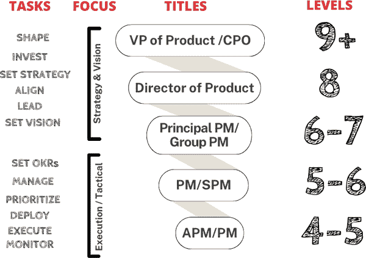
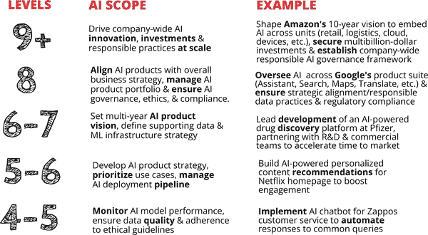

# 第四章. AI 产品经理的日常工作

我希望现在对你来说已经很清楚，AI 产品经理的核心角色是协调 AI 创新并将其无缝集成到用户体验中。但让我们将这个角色置于组织的更广泛背景下。作为 AI 产品经理，你究竟处于什么位置，随着你向上晋升，你的职责将如何转变？

# AI 产品经理的职业阶梯

一个成功的 AI 产品战略取决于将 AI 产品愿景和路线图与公司的整体商业目标对齐。AI 产品经理的工作根据他们在组织中的级别可能会有很大的不同。这带我们来到图 4-1，这是一个受大型组织启发的 AI 产品管理任务不同层次的概览图。当你探索它时，确定你当前的角色定位，了解对你和你的团队来说成功的产品方法可能是什么样子。然而，请注意，这些层次仅用于说明目的。角色和职责可能因公司而异，你的具体角色可能是几个管理级别的混合体。

###### 图 4-1\. AI 产品管理层次和任务图（来源：玛丽莲·尼卡博士）

让我们分析一下图 4-1 中我们看到的内容。左侧列出了 AI 产品管理中的不同层次，从第 4 和第 5 级的实际执行到第 9 级以上的公司级战略，以及每个层次的职责和战略重点。

图 4-2 通过更详细地分解每个层次的范围和重点领域，补充了图 4-1 中显示的信息。例如，在第 4 和第 5 级，重点是监控 AI 模型性能和确保数据质量。这反映了执行级角色的现场性质。随着你向上移动，重点转向制定战略、优先考虑用例和管理 AI 部署管道，这表明向塑造 AI 如何推动商业目标的方向转变。

###### 图 4-2\. AI 产品管理层次、任务和重点领域（来源：玛丽莲·尼卡博士）

## 执行级 AI 产品管理（第 4-6 级）

我们从执行层面开始，这通常包括从产品经理助理（APMs）到团队产品经理。如果你发现自己处于这一层，你的重点是日常开发和部署 AI 产品和功能。你是与 AI/ML 工程师和数据科学家紧密合作的人，跟踪进度，移除障碍，并交付 AI 能力。在这个阶段，你的工作围绕着设定目标和关键结果（OKRs），识别产品-市场匹配度，以及推动产品开发周期。

请查看 图 4-2 中列出的 4 到 6 级的任务。在这里，您可以看到诸如监控 AI 模型性能和确保数据质量等职责——这是执行级 AI 产品经理花费大量时间的关键领域。例如，如果您正在为 Netflix 等平台（如图中所述）构建个性化内容推荐系统（如我们在第三章第三部分中简要讨论的），您的工作将涉及与工程师紧密合作，开发、测试和改进驱动这些推荐的算法。

## AI/ML 产品管理（5-7 级）

向上提升一点，AI/ML 产品经理在定义产品需求、优先排序路线图和协调执行方面发挥着关键作用。他们负责推动单个 AI 产品从构思到部署的整个开发过程。在这里，您的工作不仅限于构建产品；它还涉及理解业务目标并将它们转化为可执行的 AI 策略。

根据 图 4-2，在 6 级和 7 级，您开始设定多年度的 AI 产品愿景并定义支持数据基础设施战略。以辉瑞领导开发一个 [AI 驱动的药物发现平台](https://oreil.ly/NHoxe) 为例；这种角色需要将 AI 产品战略与研发和商业团队对齐，确保 AI 平台加速上市时间。这关乎平衡技术能力与长期业务目标。

## 战略领导（8 级以上）

随着您在高级别职位上的提升，您的职责从实际的产品开发转变为制定产品战略和领导组织。在 Meta 和谷歌工作期间，我观察到大型科技公司倾向于合并角色。随着公司专注于拥有少数几位高级领导人来定义产品方向和愿景（顶层）以及选择负责执行的管理者（底层），这个梯子变得越来越短。

当您达到 8 级及以上时，重点在于将 AI 产品与整体业务战略对齐，并管理整个 AI 产品组合。这涉及大量跨职能工作，确保 AI 努力与公司目标、治理政策、伦理和合规性战略对齐。例如，谷歌负责监督其 AI 创新在一系列多样化的产品（助手、搜索、地图、翻译等）中的应用，确保数据实践符合监管标准。

在最高层（9 级以上），您可能会进入人工智能产品负责人或首席人工智能官等职位。在这些职位上，您不仅管理单个产品，而且在大规模上塑造整个公司的 AI 愿景。这种领导力涉及将 AI 嵌入公司的所有部门，确保数十亿美元的投资，并建立公司层面的负责任 AI 治理框架。这里的责任包括道德考量，确保数据实践符合规定，并维护 AI 模型的完整性。这些层次之间的区别不仅在于范围，还在于所需的战略思维。

通过理解这些层次，您可以更好地规划您目前的位置以及您可能想要去的地方。也许您处于执行层面，与工程师紧密合作构建人工智能驱动的功能。或者，也许您正在朝着塑造与公司更广泛战略一致的人工智能产品愿景迈进。

关键的启示是，作为人工智能产品经理的角色将不断发展，从开发特定功能扩展到制定公司层面的 AI 倡议。但请记住，这些层次和责任只是一个指南，而不是严格的等级制度。您的旅程可能因您所在组织的结构和目标而有所不同。

# 人工智能产品经理简介

在本节中，我邀请了几个我钦佩的人工智能产品领导者来回答三个问题，这些问题展示了我在这个职业中每天都能看到的背景和技能的广度和多样性。我希望这些故事能够激励您无论背景如何都追求这条道路。

## 艾森·科尔

艾森·科尔是洛杉矶产品经理协会的主席，也是人工智能产品训练营的校友。

您通往人工智能产品的道路是怎样的？

管理呢？

我的产品管理之路并不常规。我是一名受过训练的考古学家，并在研究古代墨西哥和秘鲁的人类行为变化中获得了博士学位。在这些文化中，知识就是力量。例如，玛雅人能够准确预测日食，但信息掌握在少数精英手中。他们能够告诉民众，下周白天太阳会消失，星星会出现，而且这确实发生了，足以让镇民相信他们的领导者与神灵通话并验证了他们的权力。

智能手机的兴起以从未有过的民主化方式传播了知识。突然之间，我们都可以随时随地免费（或者至少对大众来说是免费的）获取世界上所有的知识。 

认识到我们正进入人类历史上的一个分水岭时刻，我挤进了初创公司，成为了一名移动产品经理。我们现在看到的人工智能，特别是生成式人工智能的进步，感觉我们正进入另一个分水岭时刻，这就是为什么我全力投入这个不断发展的 AI 领域。

描述一下你作为 AI 产品领导者的日常生活。

我的大部分时间都在传播关于 AI 在产品管理当前能力的意识，以及它对未来可能产生的影响。在短短几年内，AI 已经改变了产品经理的游戏规则。目前，它不仅影响着人们正在构建的内容，还影响着他们构建的方式。在 2023 年和 2024 年，大多数公司都专注于将 AI 的某个方面整合到他们的产品中，主要是为了满足消费者的需求和期望。这导致该领域的许多人开始考虑他们在产品决策过程中的新权衡，例如速度与准确性之间的权衡。

当我在 2024 年中写作时，AI 已经对产品经理的日常工作进行了小小的改进，从利用 ChatGPT 来帮助创建用户故事，到总结会议笔记并快速将其转换为 Jira 任务。这一点已经变成了陈词滥调，但一个利用 AI 的产品经理将打败那些不利用 AI 的产品经理。讽刺的是，那些因为担心 AI 会取代他们而不愿意跟上步伐的人，可能实际上会成为第一批被淘汰的人。

你希望进入这个领域的人知道什么？

对于即将进入这个领域的人来说，我的建议是积极参与。我们仍然处于 AI 对软件开发、产品开发和我们的日常生活产生影响的初期阶段。

在 2023 年初，真正在 AI 产品管理方面有经验的寥寥无几（玛丽·尼卡就是其中之一）。到了 2024 年中，人数有所增加，但超过一年的经验的人寥寥无几。我的一个导师曾经提供过明智的建议：“如果你专注于一个新领域，你很快就会发现自己成为这个领域的顶尖声音。”

AI 已经对我们个人和职业生活产生了重大影响。它只会继续这样做，可能的速度是我们从未见过的。在人类历史的早期，几十代人可能过去，几乎没有或没有技术创新。AI 的板块构造运动进展如此之快，以至于每六个月就会出现根本性的变化。从未有过一个比现在更激动人心的时刻来构建数字产品。我们实际上正在塑造未来！

## 马克·克莱默

马克·克莱默是斯坦福大学的高级 AI/ML 产品经理。

你通往 AI 产品管理的道路是怎样的？

管理？

我通往 AI 产品管理的道路可能有些曲折。我拥有电气工程学位，并开始我的职业生涯作为工程师，但两年后，我进入了商学院。作为工程师，我感到孤立，渴望一个更多与人互动的角色，所以我进入了商业发展和销售。然而，这却变成了太多的人接触，我怀念技术。几年后，我安定下来，从事产品管理，我认为这非常适合我的技能和个性。

在创立了一个以算法为重点的公司（我们构建的技术显著提高了谷歌搜索结果的相关性）之后，我真正回到了我的根源。我重新开始编程，然后在 2017 年，我在 Facebook 上看到了一个来自 Udacity 的“深度学习纳米学位”的广告。我对神经网络一无所知，但冲动地报名参加了。我从第一节课就着迷了。

我在尝试自己的实验的同时，继续在线课程的学习。这最终使我获得了 PARC（著名的研发实验室）的人工智能产品管理职位。我的一个面试官提到他对我的主动性印象深刻，所以我自信这是我得到这份工作的原因。

尽管如此，由于我对人工智能的热爱和对材料的深入了解，我寻求继续学习的方法。有一天，当我从办公室窗户凝视着胡佛塔时，我决定看看斯坦福可能有哪些项目。几年后，我获得了人工智能的毕业证书，现在我是该项目的助教。我还搬到了 Meta，在那里，作为机器学习产品经理，我尽可能地接近了前沿。

描述一下你作为人工智能产品领导者的日常生活。

在之前的公司，我的产品管理职责范围很广，从飞遍全国面试潜在客户到与工程和设计团队合作制定 PRD。这种经验的广度和兴奋感是非凡的。然而，在人工智能方面，我花了很多时间与机器学习研究科学家一起了解可能性的极限，以及构思一个适用于 MVP 的价值主张。

我最大的学习可能是为人工智能产品制定 MVP 范围有多困难。我后来在几个会议上谈到了这一点。在 Andrej Karpathy 的“软件 2.0”世界中，最大的障碍是你不能“事先”知道你的应用程序将如何表现。

它的行为将取决于许多因素，包括训练数据的数量和质量。实际中的模型可能与理论有显著差异，许多用户可能没有耐心自己训练系统。没有丰富的经验很难判断，所以我建议机器学习产品经理在定义任何基于机器学习模型的 MVP 时要格外小心。

话虽如此，最终我们汇集了必要的机器学习组件，在可用数据上进行了充分的训练，以推出一个为我们的测试合作伙伴带来相当价值的产品。

## Diego Granados

Diego Granados 是 AI Product Hub 的联合创始人，也是谷歌的 AI/ML 产品经理。

你是如何进入人工智能产品管理的？

管理？

我进入人工智能领域是“偶然”的。2019 年，我被乔治亚理工学院的计算机科学硕士学位录取，同时，我在微软面试一个产品经理职位，这个职位 90%是典型的产品经理角色，10%是人工智能和机器学习。

加入微软这个新角色三个月后，我们被重组为一个 100% 的 AI 和 ML 团队。当时，Kaggle、我在佐治亚理工学院的课程以及与团队中的数据科学家紧密合作帮助我理解并导航 AI 和机器学习世界的复杂性。

描述一下您作为 AI 产品领导者的日常生活。

作为一名 AI 产品经理，我每天会花一部分时间做任何其他产品经理都会做的事情：工作在产品需求文档上，查看数据，与客户交谈，以及与工程和数据科学团队合作检查进度。

让我的日子变得独特的是，我花时间理解我们将用于实验的数据，与数据科学家一起就实验和指标进行头脑风暴，以及与其他希望在其产品/功能中使用机器学习的利益相关者会面。与他们在一起，我花时间理解他们试图解决的问题，以及我们是否需要机器学习来解决这些问题。

成为 AI 和 ML 产品经理的最大不同之处在于，在新的项目开始时，您会花时间查看您将使用哪些数据，寻找（理想情况下）负责任的 AI 框架来指导您的开发，理解您是否真的需要 AI 和 ML，以及思考您和您的用户将如何理解和解释数据。

您希望进入这个领域的人了解什么？

大多数产品管理技能都是可转移的，但对于 AI 和 ML 来说，了解机器学习的各个方面以及何时以及如何考虑 AI 和 ML 对您的产品至关重要。

要了解技术细节，Kaggle 是一个很好的资源。要了解机器学习中的商业和产品相关主题，[AI 产品中心](https://www.aiproduct.com) 是一个绝佳的地方！

## Jaclyn Konzelmann

Jaclyn Konzelmann 是 Google AI 实验室的产品管理总监，也是 YC S13 的创始人。

您通往 AI 产品管理的路径是怎样的？

产品管理？

我通往 AI 产品管理的道路是由我对构建的终身热情所驱动的。即使在大学期间，当我攻读滑铁卢大学的机电一体化工程学位时，我也被动手项目、创立公司和组织所吸引——一度甚至通过自己的咨询业务为多伦多机场设计输送系统。这种创造欲在毕业后继续存在，使我成为微软的一名产品经理，在那里我磨练了在 Outlook 上的技能。但我的心仍然留在了从零到一的环境中。这就是我为什么启动了一家初创公司；它最终通过了 Y Combinator，我学到了很多。

虽然公司不可避免地逐渐缩减，但这次经历让我回到了湾区，在那里我回归了项目经理的根源，加入了一家成长中的公司，并帮助构建他们的产品团队，同时向一位创始人汇报。为了向最好的学习，我加入了 Google 的助手团队，领导了新语音和摄像头功能的发布，包括持续对话和 Face Match。这是我进入人工智能产品管理领域的起点，在生成式人工智能热潮之前！

经过五年和多次成功的发布后，我转到了 Google Labs，在那里我最近领导了 Gemini API 和 Google AI Studio for Developers 的产品开发。现在，我专注于使用生成式人工智能构建新产品，享受从 0 到 1 的激动。我对 0 到 1 项目和当前人工智能领域如此热爱的一部分原因是解决难题，弄清楚某件事是否可能实现，以及绕过难以克服的构建限制。

描述一下你作为人工智能产品领导者的日常生活。

在 2024 年的 Google I/O 大会上，我在开发者主题演讲中现场发布了 Gemini API 和 AI Studio 的新功能，这凸显了人工智能发展速度的急剧加快。过去需要数月甚至数年才能完成的事情——构建、迭代、改进、优化——现在只需几周就能完成。将今年与 2019 年相比，当时我发布了 Face Match 这一更“传统的人工智能”功能，现在的发展速度之快令人震惊。

这种速度意味着持续学习至关重要。我典型的一天包括从播客、研究论文、文章等中吸收信息。我还专门花时间进行战略思考和写作，制定 PRD、战略文件和“思想文章”，以明确想法。当然，作为项目经理意味着会议——尽管我力求最高效——以及与团队和同事的一对一交流，通常选择“边走边谈”。我还试图每月至少参加一次技术活动，以保持领先并了解他人是如何思考问题的。

目前，我的注意力分散在管理一个项目经理团队和推动个人产品工作之间。这个双重角色确保了我为团队提供清晰的指导，验证我们的路线图，并清除障碍，同时也能亲力亲为地参与我们正在构建的产品。

你希望进入这个领域的人知道什么？

这就是我想让任何进入人工智能项目经理领域的人知道：我们仍然处于极其早期的阶段。你和拥有“多年经验”的人之间的区别可能只是几个月的时间。你绝对有时间赶上，甚至超越。

许多成为优秀项目经理的核心原则依然适用：保持不懈的好奇心，拥抱持续学习，并深入理解你所解决的问题。

话虽如此，对于有志于成为人工智能产品经理的人来说，有两件事尤其关键。首先，拥抱不懈的学习。人工智能发展速度极快，所以“最佳”的方案是不断演变的。关注最新的进展及其产品影响。其次，通过亲自动手来培养对人工智能的“产品级”理解。生成式人工智能功能强大，但需要思维方式的转变。它不是万能的子弹，这些模型是概率性的，而不是确定性的。尝试不同的工具，构建一些东西，并尝试将人工智能融入你的日常生活——最近我尝试使用人工智能制作一部短片，在这个过程中我学到了很多！这种动手经验对于理解技术的功能、局限性和潜在应用非常有价值。

## Arun Rao

Arun Rao 是 Meta（Llama 团队）的人工智能产品负责人。

你通往人工智能产品的道路是怎样的

管理方面？

这是个意外。我在 PIMCO [投资管理] 从事量化衍生品交易员，并想将所有时间都花在深度学习和构建社交机器人上。我创立了一家初创公司，从机器人宠物转型为推荐金融产品的语音聊天助手，然后作为一家盈利但增长不足的初创公司关闭。我决定产品经理是我最喜欢的工作，然后加入了 Amazon Music ML，后来又来到了 Meta Ads Ranking 和 GenAI。

描述一下你作为人工智能产品领导者的日常生活。

我为周一到周三制定了计划，我的首要任务。我为深度工作和阅读留出了时间，并在周围安排了一些混乱的会议，以了解客户、合作伙伴、领导和他人需求。我试图每周阅读两到五篇人工智能论文，非常高效，为此付出了努力来保持时间。当我双倍或三倍预订时，我会不断优先考虑参加哪些会议（我是否能够提供价值，或者是否更好的异步接触以协助或提供意见）。

在任何一周的成功都是推动我的三到五个首要任务前进，并在十二个或更多领域尽可能地对他人有用。通常是在许多需求重叠的地方（客户、业务、领导请求等）进行连接，并学习如何在需求无法满足时优雅地推迟或说“不”。最终，人工智能只是通往构建人们想要的东西的途径——它限制了方法和解决方案，但选择最重要的客户群体及其关键问题是产品经理工作的核心。

你希望进入这个领域的人了解什么？

这很难——我感觉人工智能产品经理是产品经理工作的神经外科。你必须学习大量的专业知识，并跟上大量的论文和研究，同时与高度技术化的团队一起实施想法，其中小错误可能导致大后果。

## Nino Tasca

Nino Tasca 是 Northstar Travel Group 的首席产品官。

你通往人工智能产品的道路是怎样的

管理方面？

我最初是一名软件工程师，但在我的职业生涯早期，我就意识到我对使用技术来帮助解决用户需求比单纯推动技术发展更有热情。白天作为工程师工作期间，我晚上去纽约大学斯特恩商学院[商学院]学习，并获得了我的 MBA 学位。这个证书证明是我通往产品管理道路上的加速器。

描述一下你作为人工智能产品领导者的日常生活。

作为产品领导者，最大的关注点应该是理解客户需求、优先级排序和资源分配。一旦你在职业生涯中达到一定的高级水平，你的主要工作不一定总是找到最佳解决方案。最重要的是理解机会在哪里，确保你有合适的团队利用这些机会，然后为这些人设定成功。

你希望进入这个领域的人了解什么？

人工智能是一个惊人的工具，但它本身不是一个产品。随着人工智能在软件方面的可能性增加，真正的产品管理的基本原则变得更加重要。那就是关注客户需求，确保你将正确的解决方案带到市场上。用户不关心使用什么技术。他们关心的是哪个产品能满足他们的需求。

## Yana Welinder

Yana Welinder 是 Kraftful 的 CEO 和创始人。

你通往人工智能产品管理的道路是怎样的？

管理？

在法律、科技政策和学术界多样化的职业生涯之后，我转向了产品管理。作为一名教授，我撰写了关于人工智能和计算机视觉政策影响的最多引用论文，发表在哈佛法学与技术杂志上。我在斯坦福和哈佛的研究为我打开了在白宫、联合国互联网治理论坛和其他智力激发活动中发表演讲的大门。然而，我总是觉得我的工作中缺少了什么。回到工业界，作为维基媒体基金会的总监，我有两次重要的机会深入产品管理：（1）领导产品、研究和设计团队，为改善维基百科读者体验制定战略建议；（2）领导维基百科向加密访问（默认 HTTPS）的过渡。

这些经历揭示了之前所缺少的东西：构建产品的有形、以用户为中心的影响。接下来，我成为了 Carbon 的第二个产品经理，Carbon 是一家快速增长的独角兽，颠覆了制造业，并实现了以前不可能的设计——最著名的是带有晶格结构的阿迪达斯鞋。这个角色是产品管理的一个速成课程，涵盖了软件、硬件和材料科学，所有这些都得到了内部研发实验室的支持。在创立 Kraftful 之前，我参与了各种人工智能产品的工作，现在我在那里为产品经理构建人工智能产品，结合了我对产品工艺、人工智能和创新的热情。

描述一下你作为人工智能初创公司 CEO 的日常生活。

创业公司总是以狗年为单位运营，AI 能力呈指数级增长。现在运营 AI 创业公司感觉就像以光速冲刺——然而似乎永远不够快。昨天我在重建我们的 AI 分析时对此进行了反思，这次分析使用了最新的大型语言模型。这涉及到对新提示和最新大型语言模型的参数进行实验，这项工作我通常在周末没有会议时处理。在工作日，我将我的发现与工程师们分享，然后他们构建架构以扩展我开发的提示链。这引发了频繁的临时会议来审查结果和微调我们的方法。

同时，其他工程师专注于新功能和 UI 改进，我的角色转变为传统产品管理——定义功能并与设计和工程协作以实现它们。我一天的大部分时间也花在与客户通话或通过 Intercom 交谈上，了解我们如何使 Kraftful 变得更好。在构建一个以前从未存在过的 AI 产品时，这一点尤为重要——我们的客户在使用过程中完善他们的需求，帮助我们实时适应和改进。

你希望进入这个领域的人了解什么——如果他们正在考虑成为一名 AI 产品经理，你有什么建议？

AI 是一个快速发展的领域，进入它可能感觉就像并入一条快速移动的公路。关键是要跟上最新的趋势、模型和工具，同时掌握基础知识。熟悉核心概念，如机器学习、自然语言处理和神经网络。你不需要是 AI 工程师，但你应该能够与团队舒适地讨论这些技术。你的角色是将复杂的 AI 能力转化为用户觉得有价值且易于采用解决方案。最重要的是，专注于构建一个解决真实问题的产品。始终以问题为导向——这将帮助你避免创建一个寻找问题的 AI 解决方案。

## 我的两点看法

这里是我的两点看法。首先，不要感到不知所措。这里有丰富的信息、观点、教程和最佳实践，每一点都为 AI 的某个方面提供了启示。对所有这些都持开放态度，保持好奇心，并使其成为你自己的。此外，根据你独特的技能和视角，找出 AI 如何为你的特定受众带来好处。记住，AI 最终只是一个等待你以最佳方式塑造的工具，为用户增加价值。你在 AI 产品领导力方面的旅程是关于找到你自己的道路。所以，吸收知识，进行实验，发现你如何独特地为此激动人心的领域做出贡献。AI 的未来在你手中。

如果你对了解更多感兴趣，我通过 AI 产品学院提供 AI 产品管理认证，我的[AI PM Bootcamp](https://marily.substack.com)。

## 跨职能协作

作为 AI 项目经理，您的一项最重要的职责是领导跨职能团队之间的协作，这些团队来自不同的利益相关者。AI 产品（如任何创新技术）的成功依赖于团队之间的共同理解和无缝协调。本节将分解您将与之合作的关键利益相关者，重点关注他们在产品生命周期中的角色和贡献。

以一个实际例子来说明，假设您是亚马逊的 AI 项目经理，负责 Alexa（公司智能助手）的重大产品更新。您的目标是增强 Alexa 帮助用户管理家庭日常任务的能力。为了将这一愿景变为现实，您需要与哪些人合作？（请注意，较小的公司将需要处理更少的跨职能合作伙伴。）

### 人工智能和机器学习团队

您的第一个联系点是 AI 团队。Alexa 的价值核心在于其智能功能——语音识别、任务管理和自然语言理解；这些元素由该团队构建和改进。机器学习科学家、红蓝团队和 MLOps 人员是您在这里的关键盟友，负责开发和实施驱动您产品的模型：

+   *机器学习科学家*专注于构建定义 Alexa 理解并响应命令能力的模型。这些专家将需要大量数据集来训练他们的模型——可能来自内部或从第三方提供商获取——并且将迭代各种模型，直到达到性能和效率的正确平衡。

+   *红蓝团队*在安全方面工作，红队进行模拟攻击以暴露漏洞，而蓝队则防御这些攻击。这有助于确保您的产品在面对现实世界的安全威胁时保持稳健。这些团队在确保您的 AI 不仅功能强大，而且安全方面发挥着至关重要的作用。

+   *MLOps 团队*将科学家创建的机器学习模型部署到实际环境中。他们专注于维护使这些模型能够持续集成和监控的基础设施和流程，这在扩展到大型客户群（如 Alexa 的数百万用户）时尤其关键。

简而言之，您的 AI 和 ML 团队将技术创新变为现实，您将与他们紧密合作，确保模型既符合产品愿景，也满足用户需求。

### 运营团队

您合作的运营方面涉及确保产品生命周期中所有数据管道、基础设施和项目管理方面的顺利运行的团队：

+   *项目经理*协调不同团队之间的工作，确保时间表、资源分配和整体项目范围与商业和技术目标一致。他们帮助您从高层次管理项目，导航风险、依赖关系和瓶颈，以确保一切按计划进行。

+   *数据操作（DataOps）团队* 负责收集、清洗和整合用于训练和部署 AI 模型所需的数据。他们确保你的 AI 模型建立在可靠、高质量的数据之上，同时遵守监管标准，如 GDPR。这种协作至关重要，因为你的产品成功取决于为 AI 模型提供数据的完整性和相关性。

这些团队共同为高效且合规的数据处理奠定基础，将操作能力与产品的 AI 驱动目标相一致。

### 工程团队

工程师是 AI 模型和现实世界应用之间的桥梁，将机器学习创新转化为功能完善的产品。与工程团队的出色合作对于将 AI 模型转化为无缝的用户体验至关重要。AI 创新与产品现实世界功能之间的技术集成需要紧密合作以确保成功：

+   *开发者* 负责将 AI 模型集成到产品的架构中。他们需要从 AI 产品经理那里获得清晰的沟通，以有效地实施 AI 模型的要求，确保用户交互在应用程序中流畅无阻。定期的检查、代码审查和技术讨论有助于确保一致性和进展。

+   *测试人员* 严格评估产品的功能，确保 AI 模型在现实世界场景中按预期工作。他们的反馈帮助 AI 产品经理识别边缘情况、潜在错误和改进领域。

+   *数据工程师* 维护支持你的 AI 产品的数据基础设施。他们致力于确保高效的数据管道，能够处理当前和未来的数据需求。

+   *技术项目经理*（TPMs）负责监督所有工程任务的协调，从设定时间表到资源分配。这个角色对于保持透明度和确保所有团队在执行上保持一致至关重要。

### 用户体验团队

用户体验（UX）至关重要，尤其是在向广大受众介绍 AI 产品时。用户体验团队确保产品对用户直观、易于访问且引人入胜：

+   *用户研究人员* 帮助你收集有关用户如何与你的产品互动的可操作见解，突出痛点并指出改进的机会。他们的发现指导你的路线图和产品优先级，确保每个更新都满足真实用户的需求。

+   *UX 开发人员和设计师* 与你紧密合作，将 AI 驱动的功能转化为直观且视觉上吸引人的用户界面。这种合作通常从线框图和原型开始，逐步演变为与 AI 模型能力相一致的高级设计。

+   *内容专家* 确保产品中的任何语言或指导性内容都清晰且符合品牌，使复杂的 AI 功能对用户易于理解。

### 商业团队

您的产品开发业务方面涉及与产品市场营销经理（PMMs）、销售团队和合作伙伴经理紧密合作：

+   *PMMs* 定义产品的价值主张并在市场上定位产品。您将与他们合作制定上市策略，制定与产品的技术能力和用户利益相一致的信息。

+   *销售团队* 从直接客户互动中获取反馈，提供关于痛点和建议点的见解。这些团队帮助您根据现实世界客户的反馈来完善产品，并在创建与目标用户产生共鸣的引人入胜的提案方面为您提供指导。

+   *合作伙伴经理* 与外部利益相关者合作，建立可以增强产品市场覆盖范围或能力的战略联盟。与合作伙伴合作可能涉及集成第三方技术或共同开发功能以实现共同目标。

### 第三方利益相关者

外部供应商、原始设备制造商（OEMs）和顾问可能参与为您的 AI 产品提供专业技术和专业知识：

+   *供应商和 OEMs* 提供专业组件或服务，为产品的技术能力做出贡献。您的角色是管理这些关系，确保质量及时性，同时平衡成本考虑。

+   *顾问和研究机构* 带来先进的知识和创新，尤其是在应对复杂的 AI 挑战或探索尖端技术方面特别有用。

### 治理、风险和合规（GRC）专家

最后，您的 AI 产品必须遵守法律、隐私和合规要求。与法律团队、隐私专家和合规专家合作对于确保产品负责任地构建并在监管框架内至关重要：

+   *法律顾问* 就知识产权、合同和其他法律问题提供建议。

+   *隐私专家* 确保您的产品遵守数据保护法规，如 GDPR 和[加州消费者隐私法案（CCPA）](https://oreil.ly/ccpa)。

+   *合规专家* 监督产品遵守行业标准和企业治理政策。

您与 GRC 利益相关者的合作确保您的产品在创新和安全方面同样负责任。

### 领导团队

最后，与高级管理层，如 C 级高管和投资者建立联系，对于获得支持并确保产品成功所需的资源至关重要。他们提供战略方向、资金和监督，确保您的产品与更广泛的公司愿景和目标保持一致：

+   *C 级高管* 定义 AI 产品的战略目标和目标，确保与更广泛的业务优先事项保持一致。

+   *投资者*提供必要的财务支持，并经常挑战你批判性地思考产品的市场潜力和投资回报率。

定期与领导层进行审查确保你的产品保持正轨并与公司的整体使命保持一致（有关更多信息，请参阅“产品审查：获得领导层的支持”）。

# 结论

人工智能产品经理(AI PM)处于所有活动的中心。你是连接这些不同团队和利益相关者的粘合剂。通过有效地协调每个团队的努力，AI PM 确保最终产品不仅在技术上先进，而且市场准备就绪，并符合所有必要的标准。这一角色需要广阔的视野和对细节的关注，使其成为当今科技行业中最激动人心且最具挑战性的职位之一。

所有利益相关者之间的有效协作对于构建成功的 AI 产品至关重要。AI PM 是项目的中心接触点，引导项目朝着共同的目标前进。

在第五章中，我们将探讨决定人工智能产品成功的关键指标。我们将深入探讨在开发过程中必须关注的重点领域，并揭示帮助你在角色中脱颖而出的策略。把它视为你理解在构建和衡量人工智能产品时何为重要的路线图。我们将涵盖从关键绩效指标(KPIs)和用户参与度指标到持续改进技术的所有内容。到本章结束时，你将牢固掌握如何跟踪、衡量和提升你的 AI 项目的表现，使你的工作引人入胜、有影响力且富有成效。

现在你对你在这一阶梯上的位置以及与你的职业每个级别相关的责任范围有了更清晰的了解，下一步就是探索你将如何使这些人工智能产品成为现实。这涉及到理解人工智能生命周期、制定战略路线图，并确保你的产品决策与用户体验和商业目标保持一致。在接下来的章节中，我将更深入地探讨将人工智能产品从概念到市场、应对挑战和推动有影响力的用户体验的实际方面。
