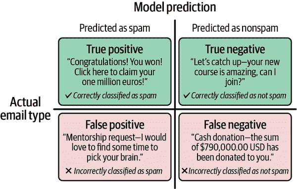

# 第六章. 设定目标和衡量成功

在 AI 产品中解开成功的谜团可能出人意料地具有挑战性。没有单一指标可以完全捕捉 AI 产品的影响。相反，对成功理解来自于多种指标平衡组合，共同提供对产品健康状况的全面视角。在确定产品或功能是否准备发布时，战略性地考虑这些指标至关重要。请记住，没有一劳永逸的秘方；正确的指标取决于产品的性质、用户以及它旨在解决的问题。

要真正理解 AI 功能的性能，仅依赖单一指标几乎总是不够。真正的见解来自于同时检查多个指标。我喜欢将其视为 AI *产品指标混合*（见图 6-1）。每个指标都突出了产品特性的特定方面。通过混合这些指标并检查结果，您可以获得对 AI 功能性能和整体影响的全面理解。

一款成功的 AI 产品有三个核心组件：产品健康指标、系统健康指标和 AI 代理指标。本章将详细探讨每个组件，以构建评估您 AI 产品成功的基础，然后提出一个框架，帮助您制定正确的 OKR。

###### 图 6-1. 产品指标混合（来源：玛丽莲·尼卡博士）

# 产品健康指标

产品健康指标，如参与度、留存率和满意度，完全属于 AI 产品经理的责任范围。这些指标将成为您监控和优化产品的基石。

###### 备注

本节和以下两节中的列表并不全面。相反，它们突出了产品经理可能遇到的最常用的产品健康指标。

让我们通过一个例子来分解这一类别的关键指标，这个例子反映了您在日常工作中可能遇到的情况。假设您是（虚构的）AI 驱动健身应用 FitAI 的产品经理，该应用旨在成为健身爱好者的首选解决方案。您的任务？使用各种产品健康指标持续监控和优化 FitAI：

参与度

参与度衡量用户与您的 AI 产品互动的积极性。使用频率、会话时长和每会话的互动次数是参与度的强有力指标。对于 AI 产品而言，参与度通常关注用户依赖 AI 驱动功能（如推荐或洞察）的频率。

想象一下，用户每天早上打开 FitAI 应用程序，查看他们个性化的、由 AI 生成的锻炼计划，跟踪他们的进度，并分享他们的成就。这里的参与度很高意味着产品提供了明确的价值。您可以通过衡量使用频率、一致性和在应用程序中的时间来跟踪这一点。例如，您可以通过引入一个新功能来实验，允许用户根据每日表现调整他们的锻炼强度。引入此功能后的参与度增加可能表明它与用户产生共鸣，而参与度的下降可能表明需要改进的领域。

用户满意度

虽然参与度很重要，但它通常与用户满意度紧密相关。这个定性指标反映了用户对您的 AI 产品有多满意。高满意度通常转化为忠诚度和倡导。调查、反馈表和[净推荐值（NPS）](https://oreil.ly/E7dFZ)是衡量这一点的绝佳方式。对于 AI 产品，满意度还取决于 AI 是否满足用户期望，提供相关输出，并提升整体体验。

在 FitAI 的背景下，您可能通过调查发现用户对应用程序的个性化锻炼计划和进度跟踪感到非常满意，但认为界面僵硬且不友好。这种反馈可以指导您做出使应用程序更直观的设计决策，直接影响用户满意度评分。

采用

采用率跟踪新用户开始使用您的 AI 产品的速度。高采用率表明产品在市场上正在获得影响力。监控注册率和识别趋势可以提供有关什么驱动用户采用的见解，例如成功的营销活动或口碑传播。

假设 FitAI 在与著名运动队，如波士顿凯尔特人队合作后，新用户数量激增。这种采用率的激增证实了产品处于正确的轨道上，鼓励您探索额外的合作以维持增长。

转化

转化指标衡量您达到最终目标的程度。例如，销售机器人和代理应衡量其达成交易的能力。捐赠请求机器人应衡量在互动后收到的捐赠数量。

保留

保留率衡量您的 AI 产品在一段时间内保持用户持续使用的能力。这是测试产品持久价值的指标。对于 FitAI 来说，保留率会在用户不仅下载应用程序，而且持续使用它来达成他们的健身目标时计算。

假设您注意到完成首次 AI 推荐锻炼的用户有 50%的可能性保持活跃。这个见解表明，新功能应该专注于指导用户完成他们的初始互动，可能通过游戏化奖励，以提高留存率。衡量流失率也同样重要。*流失率*是留存率的反面。它是用户停止使用您产品的速度。分析流失模式可以提供关于潜在问题的宝贵见解。如果您注意到用户在一个月后因为发现 AI 生成的锻炼重复而大量退出 FitAI，这表明引入可定制锻炼选项的机会。了解用户为什么离开与了解他们为什么留下一样重要。

财务指标

如收入和投资回报率等财务指标衡量了您产品的经济影响。对于 FitAI 来说，评估订阅和内购带来的成本与收益之间的平衡将帮助您就未来的投资做出明智的决策。

作为 AI 产品经理，您的任务是持续监控这些产品健康指标，分析它们，并实施优化策略。这通常意味着与您的开发团队合作解决技术问题，并调整您的营销策略以促进采用率和留存率。现在让我们转向系统健康指标，以了解产品在底层的表现。

# 系统健康指标

虽然您作为 AI 产品经理的主要关注点是产品健康，但了解系统健康指标同样重要。这些指标揭示了产品在技术层面的表现，提供了关于可扩展性、可靠性和整体性能的见解。它们包括以下因素：

可用性和延迟

可用性追踪系统多久一次对用户可用，而延迟衡量系统的响应时间。高可用性和低延迟对于维护用户信任至关重要。对于 FitAI 来说，最大化可用性和最小化延迟确保了用户在与个性化锻炼计划互动时的顺畅体验。

可扩展性

随着用户基础的扩大，可扩展性变得至关重要。通过进行负载测试并在高峰流量期间监控资源使用情况，您可以确保您的 AI 系统能够有效地处理增加的负载。

错误率

错误率追踪系统错误的频率。高错误率可能导致用户不满和流失。如果 FitAI 在发布新功能后出现错误激增，这将是调查和迅速解决 bug 的提醒。

为了保持系统健康，定期的监控和审计是必不可少的。为关键指标实施自动化警报，并定期进行压力测试。制定事件响应计划将帮助您在出现问题时迅速行动。

在系统健康得到控制后，我们现在将重点放在 AI 组件上——直接影响模型性能的代理指标。

# AI 代理指标

类似于系统健康指标，作为人工智能产品经理，你可能无法直接控制人工智能代理指标。然而，你必须认识到当这些指标表明用户群体与产品互动方式发生变化时。人工智能代理指标在评估权衡和做出战略决策中起着关键作用，并且它们作为评估底层模型有效性的标准尺。代理指标关注产品中使用的底层模型的完整性。

在机器学习中，代理指标在衡量模型准确性方面发挥着重要作用。名称*代理*反映了它们测量模型的性能，但与产品或功能的最终目标不同。让我给你举几个例子。

## 模型质量指标

*模型质量*指的是训练好的模型在根据新、未见过的数据进行预测或决策时的有效性。它通常通过各种性能指标来评估，这些指标表明模型的预测与实际结果之间的匹配程度。

对于人工智能产品经理来说，理解模型质量至关重要，因为它直接影响人工智能产品的可靠性、效率和影响。例如，在用于诊断疾病的医疗保健人工智能应用中，高精确率确保模型提供的诊断是正确的。相比之下，高召回率确保模型尽可能多地识别出疾病的真实病例。较差的模型质量可能导致错误的诊断，可能对患者造成伤害，并损害医疗保健提供者的信誉。

作为人工智能产品经理，你必须使用这些指标来批判性地评估模型性能，以有效地管理人工智能产品。这包括理解每个指标告诉你关于模型行为的信息，以及如何通过各种优化策略来提高这些指标。

我们在本书中探讨的 AIPDL（人工智能产品开发生命周期）本质上是迭代的。部署后，你将频繁地回顾早期阶段，特别是模型训练和验证，因为新的用户数据变得可用。这个迭代周期包括一系列实验，在这些实验中，你运行评估（evals）来比较实时模型与离线版本的性能。这些评估有助于你确定新模型是否提供了显著的改进，指导你决定是否是时候发布更新版本。

让我们通过一个系统分类传入电子邮件是否为垃圾邮件的例子，来介绍一些最常用的模型质量指标：

准确率

我们通过系统正确分类的电子邮件百分比来衡量这个电子邮件分类功能的准确性。把它想象成一个测试；在所有被分类的电子邮件中，算法准确地将多少电子邮件识别为垃圾邮件或非垃圾邮件？

精确率

精确度是模型预测的所有正结果中真实正结果的比例。它决定了正预测的准确性。在我们的垃圾邮件示例中，对于算法标记为垃圾邮件的所有邮件，我们想知道其中真正是垃圾邮件的邮件数量。高精确度表明模型很少出现误报；换句话说，类型 I 错误较少。

灵敏度

灵敏度衡量模型在找到所有正例方面的好坏。让我们用垃圾邮件的例子来提供一些背景。灵敏度指标评估算法在识别我们收件箱中每封垃圾邮件方面的成功程度。高灵敏度意味着你很少出现误报——换句话说，类型 II 错误较少。

召回率

召回率衡量模型正确识别所有相关正例的能力。在我们的垃圾邮件示例中，它告诉我们算法成功标记为垃圾邮件的实际垃圾邮件数量。高召回率表明模型漏掉的垃圾邮件非常少，这意味着它在捕获正例方面非常有效，误报最少。假设收件箱中有 100 封实际的垃圾邮件，算法正确地将 80 封标记为垃圾邮件；然而，它将 20 封垃圾邮件错误地分类为非垃圾邮件。如果算法成功识别了所有垃圾邮件的 80%，你可以说它有 80%的召回率。

接收者操作特征（ROC）曲线

ROC 曲线是图形表示，说明了在不同阈值设置下，真正正例率与误正例率之间的权衡。在我们的垃圾邮件示例中，ROC 曲线有助于评估模型在不同决策阈值下区分垃圾邮件和非垃圾邮件的能力。曲线靠近左上角的模型具有更好的区分能力。

## 目标函数

*目标函数*是代理指标，用于评估机器学习模型在训练过程中的性能。它们衡量模型的预测与实际结果匹配得有多好，从而指导学习过程。

最常用的目标函数是*损失函数*，它计算每个预测预测值与实际值之间的差异。目标是尽量减少这种损失以提高模型的准确性。例如，*均方误差*（MSE）是用于回归任务的损失函数，称为*回归任务*。回归任务的一个例子是预测商店可能对特定产品的需求。根据价格或效用等一组特征，回归模型可以帮助预测产品的需求。

MSE 计算预测值和实际值之间平方差的平均值。想象一下，你被要求预测一家热门零售店中一种新 AI 产品的每周销售额。准确的销售额预测有助于你有效管理库存，减少因过剩库存和缺货造成的损失。假设你预测第一周的销售额为 100 单位，但实际上是 50 单位。第一周的误差是 50 单位。每周代表一个“损失”。误差越大，损失越高。

现在，想象这种情况持续几周。错误每周都不同，你希望对错误较大的周进行惩罚。为此，你将错误平方。为了得到一个跨时间有意义的标准，你然后计算平方误差的平均值和均方误差（MSE）。损失函数显示了模型预测的准确性。通过工作坊算法以最小化损失函数，将使系统按预期工作。

当你推出一个功能或产品时，你旨在解决特定的用户痛点。仅仅依赖机器学习模型是不够的。作为一个产品经理（PM），你必须确保你的机器学习模型无缝集成到产品体验中，以便用户可以从这项技术中受益。例如，考虑 Spotify 上的推荐小部件，它建议新歌以丰富播放列表，或者 Tinder 上的智能匹配功能，它根据共同的爱好将个人联系起来。将模型与用户体验融合是释放这项 AI 技术真正潜力的关键。通过考虑所有指标，你将获得你 AI 功能成功的一个全面图景。

## 混淆矩阵

混淆矩阵是突出许多关键模型性能指标的有用评估工具。*混淆矩阵*是一个实际和预测的二进制特征的表格，用于评估分类算法的性能。它提供了对分类问题预测结果的总结。表 6-1 中的矩阵比较了实际值与模型预测的值。

表 6-1\. 描述电子邮件分类示例中混淆矩阵的四个元素

| 类型 | 定义 |
| --- | --- |
| 真阳性 | 当预测正确地将邮件分类为垃圾邮件时 |
| 真阴性 | 当预测正确地将邮件分类为非垃圾邮件时 |
| 假阳性 | 当预测错误地将邮件分类为垃圾邮件时 |
| 假阴性 | 当预测错误地将邮件分类为非垃圾邮件时 |

这可以应用于区分你的收件箱中垃圾邮件和非垃圾邮件的功能，如图 6-2 所示。

###### 图 6-2\. AI 将电子邮件分类为垃圾邮件或非垃圾邮件时四种可能结果的视觉表示

图 6-3 提供了实际值和模型预测的值如何转化为用户体验的视觉表示。

###### 图 6-3\. AI 代理指标收件箱（来源：玛丽莲·尼卡博士）

# AI 产品 OKR

现在我们已经探讨了各种指标，是时候讨论如何将这些指标转化为可操作的 OKR 了。关键是平衡所有三个类别：产品健康、系统健康和 AI 代理指标。一个全面的 OKR 框架应该包括一个北极星指标，它捕捉产品提供的核心价值，并辅以其他指标来跟踪性能的具体方面。

在本章的剩余部分，我们将讨论如何为您的 AI 产品制定有效的 OKR，确保您的团队能够专注于真正重要的事情，以推动成功。我们还将探讨设定雄心勃勃、以用户为中心的目标以及定义可衡量的关键结果来监控进度的例子。

## 将指标与目标相结合

对于任何 AI 产品的成功，拥有一个明确的目标集至关重要。通过理解和利用 AI 产品指标组合，您可以构建对产品性能的整体看法，并将其与用户需求、技术卓越和业务目标对齐。有了这个全面的框架，您将准备好准确衡量成功并推动有影响力的产品开发。现在，让我们讨论构建可操作 OKR，这将帮助您的团队在这个动态的 AI 驱动环境中保持专注和对齐。

OKR 代表您的首要目标：您旨在实现的主要目标。它应该是雄心勃勃的、鼓舞人心的，并且与 AI 产品的战略愿景保持一致。您可以拥有多个 OKR，每个 OKR 都针对 AI 产品开发和性能的各个方面。每个 OKR 由多个 KPI 或可量化的指标组成，这些指标传达了产品相对于 OKR 表现的各种维度。您的 KPI 应该是具体的、可衡量的、可实现的、相关的，并且有时间限制（SMART）。这些指标有助于跟踪进度并确定您是否在实现目标的正确道路上。每个目标应该是全面的，并与公司的更广泛目标保持一致。

在“构建 AI 产品 OKR 的框架”中，我将分享我用于构建 AI 产品 OKR 的框架。我喜欢这个框架，因为它提供了一种结构化的方法来设定和衡量目标。它强调清晰、专注以及与产品核心价值的对齐。

北极星指标代表重要的关键绩效指标（KPI）。它捕捉并代表您的 AI 产品所提供的整体价值。每个 OKR 可以根据目标复杂性和范围拥有多个关键指标。虽然北极星指标代表主要目标，但其他支持性 KPI 可以帮助衡量特定维度的进展。尽管有多个 KPI，但每个 OKR 应只有一个北极星指标，作为一个精确、专注的成功衡量标准，它封装了产品创造的核心价值。它是任何 OKR 成功的主要指标，反映了最终的影响和进展。

## AI 产品目标制定框架

此框架结合了本章前面提到的多种指标，以提供一个平衡和全面的进展和成功视图。在为 AI 产品制定 OKR 时，您应该至少包括 AI 产品指标混合桶中的每个指标桶中的一个指标：产品健康指标、系统健康指标和 AI 代理指标。此框架有助于在 AI 产品管理中保持结构化和战略性的目标设定和绩效衡量方法。我们始终希望优先考虑交付影响和可衡量的价值。

拥有一个可靠的 OKR 框架可以作为基础。对于每个 AI 产品或功能，您将根据产品的具体相关内容填写框架。提供的示例仅用于说明。根据 AI 产品和您组织战略优先级的细微差别，必要时调整框架。通过整合多样化的指标，您可以制定全面的 OKR，推动 AI 产品的发展，并确保其与用户需求、技术卓越和商业目标保持一致：

OKR

在这里，您声明下个季度的主要目标。这应该是以用户为中心的，并且明确说明（它是为谁而设的？）并需要说明期望的结果（例如，通过提供更多个性化的音乐推荐来提升用户体验）。

特定功能

您将引入哪些功能或变更来实现目标？

北极星（KPI）

哪个主要指标展示了产品的成功？虽然这通常是一个单一、专注的指标，但团队可能使用支持性指标来提供额外的背景信息。

产品健康指标（KPI）

哪些指标将衡量用户满意度或产品的健康状况？考虑多个相关指标，例如留存率、用户满意度调查或功能采用率。

安全指标（KPI）

您想监控和最小化哪些潜在的负面副作用或风险？使用组合指标来有效跟踪这些风险，例如错误率、响应时间或用户投诉。

系统健康指标（KPI）

您将如何确保工具或功能保持可靠和高效？包括多个指标来衡量系统正常运行时间、延迟或资源利用率等方面。

AI 代理指标（KPI）

您将跟踪哪些 AI 特定指标来评估算法性能？考虑指标如模型准确性、精确度、召回率或用户与 AI 驱动功能的互动。

表 6-2 使用此框架提供了一个针对流媒体音乐服务推荐系统的详细假设 OKR 示例。

表 6-2\. 流媒体音乐服务推荐系统的示例 OKR

| 组件 | 示例 |
| --- | --- |
| 目标 | 通过提供更多个性化的音乐推荐来提升用户体验。 |
| 特定功能 | 引入基于用户行为、情绪和音乐趋势的三个新个性化算法。 |
| 北极星指标（KPI） | 通过推荐播放列表增加用户参与度 25%。 |
| 产品健康指标（KPI） | 将 AI 生成播放列表中跳过歌曲的用户数量减少 20%。 |
| 标杆指标（KPI） | 确保听音乐的总时间不减少超过 5%。 |
| 系统健康指标（KPI） | 维持 99%的系统正常运行时间，并将播放列表加载时间缩短至一秒以下。 |
| AI 代理指标（KPI） | 将推荐算法的精确度提高 15%。 |

# 结论

对于任何 AI 产品的成功，拥有一套明确的目标至关重要。我希望本章中用于评估产品成功的框架提供了一种结构化的方法来实现您和您团队的目标。总有一些细微的指标适用于特定情况，因此可能需要时间来找到最适合您和您团队的指标。尽管如此，设定可操作目标和定义成功的框架在不同项目中将是相似的。

确定要添加到您的 AI 产品指标混合中的相关指标将帮助您的团队全面了解产品的成功。定义具体目标和 OKR 可以帮助 AI 团队专注于真正重要的事情，并精确跟踪他们的进度。确定正确的指标并专注于一小组关键目标将帮助团队保持清晰并朝着最重要的成果努力。设定明确的目标并通过一个强大的框架准确衡量成功将推动进步并帮助将 AI 产品开发与更广泛的企业目标对齐。使用这些框架将使团队能够理解和应对 AI 产品性能的多方面性质。

在第七章中，我将介绍作为 AI 产品经理我所遇到的最受欢迎的产品管理工具。
