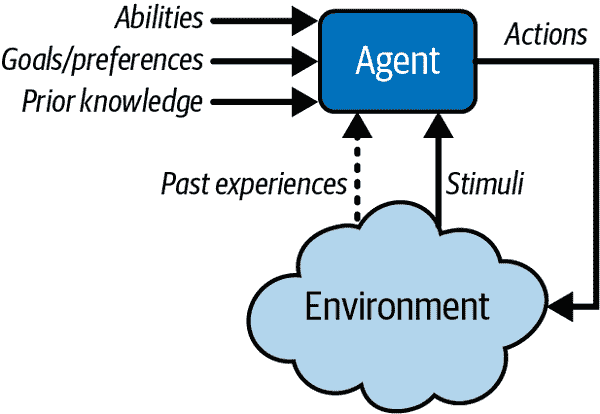
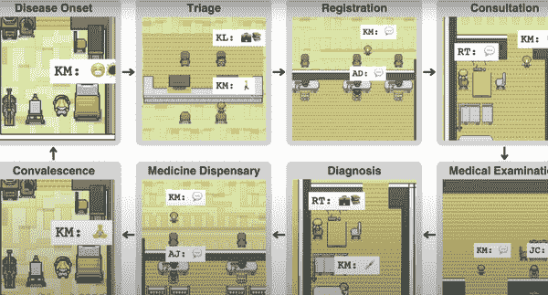
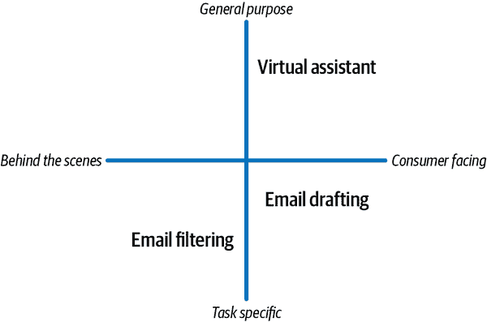
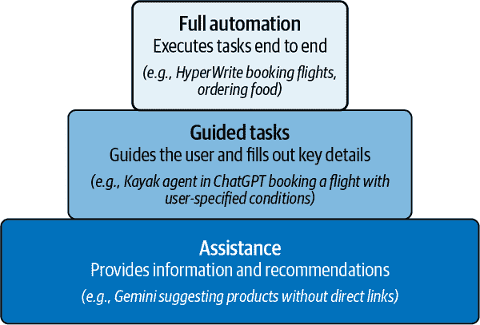
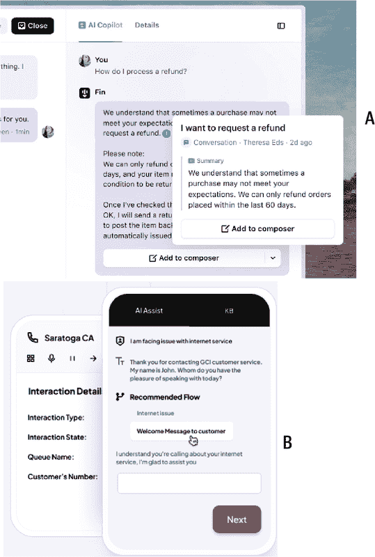

# 第八章\. 构建人工智能代理

人工智能代理通过自动化任务、提升用户体验，最重要的是，实现了聊天机器人曾经承诺但从未完全实现的承诺，正在从根本上改变行业。研究人员 Poole 和 Mackworth 讨论了*智能*或*人工智能代理*的基础特征。他们的工作引入了图 8-1 图中展示的框架。

在这个框架中，代理是在环境中采取行动的实体。如果代理：

+   它的行为符合其目标和环境。

+   它能够适应不断变化的环境和目标。

+   它从经验中学习。

+   在感知和计算限制的范围内做出适当的抉择。1

###### 图 8-1\. 代理与环境交互（来源：David L. Poole 和 Alan K. Mackworth）

这个模型强调了适应性和学习的重要性，这些是现代人工智能代理的关键特征。如图 8-1 图所示，代理的能力、目标和先验知识影响其在环境中的行为。代理感知刺激，借鉴过去的经验，并利用其计算能力做出决策。

这些智能系统已经远远超越了简单的聊天机器人，现在正演变成能够不仅理解用户需求，还能*预测*它们、执行复杂任务并从每次互动中学习的自主实体。这种进步不仅仅是技术上的转变；它是一种战略优势，每个具有前瞻性的产品领导者都必须接受。

# 什么是人工智能代理？

*人工智能代理*由其自主执行、根据用户交互进行适应和改进的能力定义。历史上，人工智能代理始于基于规则的系统——如果你回想起早期的 AI 项目，比如 IBM 的[Deep Blue](https://oreil.ly/1yuAV)或者甚至 Google 的[AlphaGo](https://oreil.ly/L7H01)，它们被限制在解决高度特定的问题上，几乎没有灵活性。然而，现代人工智能代理却拥有更大的自主性和学习能力，正如 OpenAI 的 GPT-4 驱动的[ChatGPT](https://openai.com/gpt-4)、Google 的[Project Astra](https://oreil.ly/JbIZR)、OpenAI 的[Operator](https://oreil.ly/3Uqx1)或 Microsoft 的[Copilot](https://oreil.ly/11zHZ)所证明的。这些工具不仅被动反应，而且是主动的，通过预测需求甚至代表用户执行任务，实现了新的用户参与水平。

OpenAI 为其用户提供创建自定义代理的选项，称为 *CustomGPTs*。这些是针对特定用户需求或任务定制的 OpenAI GPT 模型的版本。它们不需要对基础模型进行广泛的微调或直接修改模型的底层架构。相反，它们通过使用基础 GPT 模型的现有能力，结合动态提示、工具集成和结构化工作流程，专注于定制行为和输出。

我经常被问到：“等等，ChatGPT 不是人工智能代理吗？” 答案是否定的，并不完全是这样。ChatGPT 是一个令人印象深刻的 AI 语言模型，但它并不被归类为人工智能代理。ChatGPT 主要作为一个对话模型运行——它根据预训练数据响应用户提示，但它没有自主性。它不会独立执行任务或代表用户做出决定。它需要明确的输入，缺乏以目标为导向的框架，并且在代理意义上不作用于环境。

然而，Gemini 上的自定义宝石或结合指令和额外知识/技能的 ChatGPT 版本可以被认为是人工智能代理，因为它们可以在没有持续和明确用户提示的情况下自主执行任务。这些定制模型更加自主，旨在执行特定任务、做出决定和采取行动，通常基于用户的需求。还有方法让代理与其他工具或流程交互，通过使用 Zapier 的 zaps 等方式提供更动态、主动的体验和自动化工作流程。

从本质上讲，*代理产品* 是服务于特定目的的经验；例如，NotebookLM 是一个旨在理解复杂主题并为用户提供专用研究助理的代理。代理根据预定义的目标运行，适应新信息，并满足特定用例。Kence Anderson 在他的书 [*设计自主人工智能*](https://www.oreilly.com/library/view/designing-autonomous-ai/9781098110741)(O’Reilly, 2022) 中捕捉到了代理自主性的精髓，他指出：“人工智能系统中的真正自主性不仅需要执行预定义任务的能力，还需要学习、适应和独立追求用户目标的能力，通常是在动态和不可预测的条件下。”

AI 代理可以：

+   帮助您规划、做决定并提高生产力

+   自主执行、创建和编排任务

+   让您感到连接、支持和娱乐

+   帮助您发现新信息和学习

+   提供针对用户及其目标定制的独特和个性化体验

对于产品领导者来说，在代理产品领域导航可能会感到新鲜，有时甚至感到不知所措。构建 AI 代理不仅需要深入理解 AI 能力，还需要了解用户的行为和需求。比以往任何时候都更加，你的成功依赖于识别将 AI 代理融入产品生态系统的正确机会。问题不仅仅在于是否要构建一个代理，而在于打造一个*正确*的代理——一个能够显著提升用户体验同时推动商业价值的代理。

然而，导航这一转变也伴随着挑战。与 AI 代理合作涉及一系列考虑因素——从定义其自主权的范围到确保它们能够学习和适应。它们还需要在产品设计方面有不同的思维方式：其中代理成为用户旅程的积极参与者，而不仅仅是功能。

理解 AI 代理及其在现实产品中的应用的演变格局至关重要。像 Spotify 这样的公司已经在使用 AI 代理提供根据用户个人收听习惯定制的音乐推荐，而亚马逊则利用它们进行预测性库存管理和自动化客户服务，重点在于从实时数据中学习。特斯拉正在将 AI 代理集成到自动驾驶中，而苹果正在通过高级代理能力演进 Siri。研究这些早期采用者的策略可以为产品领导者带来显著的优势。

对于能够掌握这些系统的人来说，回报是巨大的：减少摩擦、更好的参与度，甚至为用户创造全新的价值形式。在本章中，我将引导你了解 AI 代理的核心概念，探讨目前存在的代理类型以及它们与前辈的不同之处。我还会研究领先公司如何利用这些系统创造突破性产品，并提供开始构建 AI 代理的实用步骤。无论你是新进入这个领域还是想完善你的策略，本章将为你提供在代理 AI 产品世界中取得成功所需的见解。

## 不只是被美化的聊天机器人

乍一看，AI 代理可能只是换个名字的聊天机器人，但实际情况要复杂得多。虽然 AI 代理和聊天机器人都使用自然语言处理（NLP）与用户互动，但 AI 代理的范围、复杂性和能力远远超出了传统聊天机器人所能提供的。

我们所熟知的聊天机器人，主要是基于规则的系统。它们被设计成根据脚本对话（例如，“我的订单在哪里？”或“你什么时候开门？”）对特定的输入做出响应。想想看，像[Zendesk](https://www.zendesk.com)这样的网站上早期客户服务机器人的迭代，或者帮助用户在 Facebook Messenger 上完成简单交易的虚拟助手。

另一方面，人工智能代理被设计成能够自主行动，从交互中学习，并在不依赖脚本响应的情况下做出决策。例如，虽然聊天机器人可以帮助你在电子商务网站上找到产品，但像 Amazon Alexa 这样的 AI 代理可以根据历史购买数据预测你何时会用完家庭用品，并自动为你重新订购，而无需你的指令。此外，人工智能代理可以处理更复杂的任务，例如与各种外部系统（API、数据库）集成，并通过强化学习等机制在时间上自主优化其行为。

在讨论如何构建人工智能代理之前，让我们先看看人工智能代理是如何随着时间演变的。

## 早期基于规则的代理

人工智能代理已经从早期作为基于规则的系统发展到今天我们看到更加自主和适应性的模型。早期的代理受其僵化的框架限制，被编程在受控环境中执行基于预定义指令的特定任务。它们几乎没有灵活性或学习能力，通常受限于直接编码到它们中的能力和目标。一个典型的例子是[微软的 Clippy](https://oreil.ly/zsxRn)，一个小型的动画回形针，当用户在编写文档时出现，根据预编程的规则提供帮助。虽然 Clippy 在全世界都受到了广泛的嘲笑，但它是对人工智能代理未来的一个预览。

早期的策略和模拟游戏为人工智能代理提供了一个迷人的游乐场，尤其是这些基于规则的系统。例如，在 1998 年为 MS-DOS 发布的 *战斗棋*（图 8-2），棋子由简单的具有预先编程的“移动”和“捕获”行为的简单人工智能代理控制，这些行为遵循棋规则。然而，人工智能没有适应或从过去游戏中学习的能力，完全依赖于预定义的策略。

###### 图 8-2\. 战斗棋（MS-DOS，1998）

在 1990 年代的电脑游戏，如[*魔兽争霸 II：黑暗潮汐*](https://oreil.ly/EfhWt)或[*星际争霸*](https://oreil.ly/6GUns)中，由人工智能控制的单位在指定区域巡逻，保卫关键资源，并使用预先编程的策略与敌人交战。这些游戏展示了人工智能驱动的行为的早期例子，其中敌方单位会根据玩家的行动动态响应，防御基地，或以看似有意图和战略的方式协调攻击。虽然这在当时是一个突破性的发展，但缺乏适应性是显而易见的。

另一个以早期 AI 代理为特色的难忘游戏是 *Lemmings*（1991 年）。该游戏（图 8-3）具有简单的基于规则的代理：麦田怪圈遵循严格的行为模式，不断前进，除非玩家介入并分配给他们特定的任务，例如建造桥梁或挖掘。同样，这些代理没有学习能力，只能根据玩家的输入遵循特定的路径。

###### 图 8-3\. 麦田怪圈（1991 年“代理/机器人”）

这些早期的 AI 系统通过突出仅基于规则的方法的局限性，为未来的发展奠定了基础。随着时间的推移，AI 代理变得更加动态和适应性强，演变成能够学习、做出决策和自主采取行动的系统。

代理的定义组件是其：

能力

代理可以执行的任务，例如语音识别、决策或物理动作。

目标或偏好

代理的目标或它试图满足的具体愿望。这些通常是预先编程的。

先验知识

代理已经关于环境或任务的信息。

刺激

来自环境的信息，例如来自传感器的数据、交互或用户反馈。这些输入可以包括触发器，根据预定义的规则或逻辑调用特定的行为。例如，在简单的系统中，特定的传感器读数可能会直接激活预设的响应（例如，恒温器在温度低于阈值时打开热量）。然而，在更先进的 AI 代理中，刺激是动态处理的，允许代理根据以往的经验、目标和情境理解来调整其行为。这种从僵化的基于规则的反应到自适应、基于学习的响应的演变是现代 AI 代理的一个定义特征。

过去经验

代理的历史交互，这些交互塑造了未来的行动和决策。

随着时间的推移，AI 代理开始采用学习机制，标志着从僵化的基于规则的系统到更灵活、动态的系统的转变。强化学习的引入允许代理从经验中学习，根据其行为的后果调整其行为。代理不再需要在每个场景中被告知该做什么。相反，它们可以通过试错来学习，优化其行为以实现目标。

例如，在流行的策略游戏如 2010 年的 *StarCraft II* 中，[AI 代理从他们的错误中学习](https://oreil.ly/OlDi3)，根据玩家的行动实时调整他们的策略。这些代理被设计得更加适应性强，使用强化学习随着时间的推移提高性能。

现在，AI 智能体集成了深度学习和神经网络，使它们能够在最小的人为干预下处理复杂、多方面的任务。这些现代智能体不仅限于对即时输入做出反应；它们可以预测、规划和与其他智能体协作以实现共同目标。它们在计算机和游戏机游戏如*荒野大镖客救赎 2*、*FIFA*、*生化奇兵无限*和*侠盗猎车手 V*中仍然被广泛使用。2017 年的*Divinity:* *Original Sin II*也拥有令人印象深刻的非玩家角色（NPC）AI。

一个引人注目的例子是多智能体系统的兴起。在医疗保健等环境中，[多个 AI 智能体协作](https://oreil.ly/IdcZi)来诊断和治疗患者，持续学习和共享信息以改善结果。例如，在一篇[论文](https://oreil.ly/gQTtY)中，为了研究目的创建了一个医院模拟，不同的 AI 智能体扮演了医生、护士和患者的角色，共同致力于更好的患者护理（图 8-4）。

###### 图 8-4\. 设在医院的多智能体模拟系统（来源：*https://oreil.ly/ziXvT*）

这些智能体有记忆，可以接收感官输入，并且可以根据新数据自我改进。它们的进化为自动驾驶等领域的复杂应用铺平了道路，在这些领域中，车辆（智能体）与环境互动，从实时数据中学习，并做出生死攸关的决策。

# 智能体产品

三大主要进步将 AI 智能体转变成了我们今天所看到的复杂系统：学习、决策和自主行动。这些进步使智能体能够处理各种输入，持续适应其环境，并且最重要的是，无需明确指令就能自主满足用户需求：

学习

现代 AI 智能体被设计成从经验中学习，就像人类一样.^(2) 这种能力使它们能够随着时间的推移改进其行为并提高其有效性。例如，一个电子商务平台的推荐系统可以分析用户偏好、购买模式和行为，以做出越来越准确的建议。通过机器学习模型，智能体获得了进化其对用户交互和环境刺激理解的能力.^(3)

做出决策

随着智能体收集数据和从交互中学习，它们也获得了做出明智决策的能力。这不仅仅是指用预定义的动作对刺激做出反应；它涉及到评估多个选项，并根据目标、约束和用户需求选择最合适的反应。例如，在客户服务方面，一个 AI 智能体可能会根据对话的复杂性和情感来决定是否将问题升级给人类代表。

进行自主行动

代理进化中最显著的飞跃是它们能够自主行动的能力。这些行动不仅仅是针对特定触发器的反应；它们是反映对用户意图更深层次理解的主动决策。自主代理可以执行诸如安排会议、发送通知甚至生成创意内容等任务，而无需直接的人为干预。它们代表用户行事，预测他们的需求，并利用最小输入优化结果.^(4)

由于这些进步，人工智能代理在许多应用中变得不可或缺。它们通过在精确的时间提供正确的响应或行动来提供个性化解决方案。人工智能代理不再只是独立执行重复性任务的机器人；它们是用户体验的组成部分，旨在以有意义的方式提供帮助。

例如，用户可能会使用人工智能助手来自动化组织电子邮件、安排会议，甚至管理他们的生活（例如，下订单购买杂货）。创意专业人士使用人工智能工具来激发想法、设计布局，甚至创作音乐.^(5)

## 比较聊天机器人、人工智能代理和多代理

你可能想知道人工智能代理与聊天机器人之间的具体区别，以及当多个代理协同工作时会发生什么。虽然聊天机器人和人工智能代理都处理用户交互，但它们的能效和自主水平差异很大。为了帮助澄清，我已经在表 8-1 和图 8-5 中概述了关键差异。这种比较突出了它们如何协同工作，它们的独特能力和为不同产品场景带来的价值。

表 8-1\. 比较聊天机器人、人工智能代理和多个人工智能代理

| 特性 | 聊天机器人 | 人工智能代理 | 多个人工智能代理 |
| --- | --- | --- | --- |
| 主要目的 | 对话和基本任务执行 | 自主任务执行和决策制定 | 协同问题解决和任务执行 |
| 范围 | 有限，通常是基于规则或预定义的对话 | 广泛，具有复杂任务和适应性 | 复杂的多步骤任务需要团队合作和协调 |
| 自主性 | 低：限于预定义的脚本和响应 | 中等：可以做出自主决策并自行行动 | 高：代理之间沟通、协作和协调是自主的 |
| 学习能力 | 基础：通常依赖于静态规则或脚本响应 | 高级：可以使用强化学习和数据反馈循环来适应 | 高级：代理可以单独和作为一组学习，提高协调和性能 |
| 交互性 | 主要面向用户；对用户输入做出响应 | 与用户和其他系统交互 | 同时与多个代理、用户和系统交互 |
| 复杂度 | 低：简单的逻辑或基本的 NLP 模型 | 中到高：使用复杂的 AI 模型，可以集成多种功能 | 非常高：结合了具有不同专业化的多个代理，需要高级协调机制 |
| 决策 | 无或有限：遵循脚本规则或决策树 | 自主：可以分析数据并做出明智的决策 | 集体：基于代理间通信和共享目标做出决策 |
| 适应性 | 静态：限于对话流程中的预定义变化 | 动态：可以适应新信息和不断变化的环境 | 高度动态：代理个体和集体适应以实时优化结果 |
| 示例用例 | FAQ 机器人、基本预订 | 个人助理、客户支持 | 自动驾驶（协调车辆）、虚拟医院（AI 代理在患者护理上的协作） |

聊天机器人主要设计用于对话和基本任务执行。它们在有限的范围内运行，具有最小的自主性，主要依赖脚本化的响应。它们适合简单的任务，如 FAQ 交互和预订。

相比之下，自主 AI 代理能够进行更复杂和适应性强的决策，使用如强化学习等高级学习技术来改善其响应和行动。这些代理用于个人助理和客户支持等角色，在这些角色中，更高水平的交互和决策自主性是有益的。

###### 图 8-5. 人工智能代理、聊天机器人和多代理的比较（来源：玛丽莲·尼卡博士）

多个 AI 代理展现出最高水平的复杂性和动态交互，实时协作和沟通以解决复杂的多步骤任务。这类 AI 系统用于高度协调的环境，如自动驾驶和虚拟医院，在这些环境中，无缝集成和集体决策至关重要。

这些 AI 系统在范围、复杂性和适应性方面的差异突出了每种类型代理的不同能力和适用应用。

## 人工智能代理产品景观

人工智能代理产品景观横跨多个领域，提供多样化的工具，展示了公司如何利用 AI 推动生产力和创新。在自动化领域，如[Magic Loops](https://www.magicloops.ai)和[Respell](https://www.respell.ai)等工具擅长简化重复性工作流程，从电子邮件管理到创意内容生产，对于寻求提高效率的企业来说，它们是无价的。

虚拟助手形成另一个突出的类别，例如[Lindy](https://www.lindy.ai)，它自动化专业行政任务，以及[HyperWrite](https://www.hyperwrite.ai)，这是一款旨在支持内容创作和电子邮件管理的工具，为个人用户和团队 alike 提高生产力。对于开发者来说，如 Sweep AI 和[Phind](https://www.phind.com)这样的专用 AI 代理通过自动化错误修复和提供高效的编码资源访问，简化了编码任务，使软件专业人士能够更聪明地工作。

最后，新的形式因素如[Humane](https://humane.com)和[Rewind](https://www.rewind.ai)将硬件与先进的 AI 能力相结合，通过语音控制和记忆增强技术提供无缝的用户体验。

由于人工智能领域发展迅速，许多这些工具可能会过时或被更先进的新代理所取代。一些值得检查的工具包括用于构建人工智能自动化的[Cassidy](https://www.cassidyai.com)，CrewAI 的[多代理平台](https://www.crewai.com)，用于超个性化活动的[Criya](https://www.criya.co)，或用于人工智能代理管理的[Wayfound](https://www.wayfound.ai)。在我的[通讯](https://marily.substack.com)中，我定期分享该领域的最新趋势和发展。

当我在 2024 年底写下这些时，微软已经将其[Copilot AI](https://oreil.ly/11zHZ)深度集成到其 Office 套件和 Windows 中，使其成为用户工作流程的核心部分。Copilot 协助文档创建、电子邮件和其他任务，并定位为跨设备可用的生产力 AI 代理。

在 2023 年，Meta 将 AI 驱动的角色（图 8-6）设计用于社交互动，集成到 Facebook 和 Instagram 中，尽管这些不再使用；Meta 最初计划将其与混合现实硬件更广泛地集成到其 Metaverse 项目中。

我提到这一点，因为它是一个促进个性化的战略设计选择的良好例子。想法是用户可以直观地连接到最适合他们需求的角色，无论是俏皮的创意助手还是专注的专业向导。

###### 图 8-6\. Meta 的 AI 角色（不再使用）

到 2025 年，OpenAI 推出了[Operator](https://oreil.ly/3Uqx1)，这是一种利用计算机使用代理（CUA）模型在数字环境中自主执行任务的 AI 代理。与其他仅依赖 API 或结构化输入的代理不同，Operator 配备了 GPT-4o 的视觉能力，可以通过鼠标和键盘与界面交互。这使得它能够完成填写表格、浏览网站和跨各种平台执行多步骤工作流程等任务（图 8-7）。

OpenAI Operator 的功能包括：

用餐和活动策划

在餐厅预订餐桌，推荐高评分场所，并为活动或演出确保门票。

递送跟踪和调度

监控包裹递送，更新日程，并通知用户变化。

旅行和购物助手

比较价格，预订，并提供行程更新。

人机协作

用户可以干预正在进行的任务——例如修改表单输入或验证细节——并将控制权交还给操作员，操作员可以无缝地继续其工作。

动态建议

根据用户行为和偏好，操作员提供可操作的建议，从精选的新闻更新到餐点想法。

###### 图 8-7. OpenAI 的 Operator 在行动：在预订餐厅时，它允许用户在无缝恢复自动化之前“接管”浏览器进行手动输入。

# 为您的产品打造合适的 AI 代理

现在轮到你了。从您用户的最大紧急需求开始。选择一个定义明确、具体的用例。关注 AI 可以立即产生影响的领域——无论是自动化客户服务、简化内部流程还是提升用户体验。本节提出了一些考虑因素，以帮助您确定哪种类型的代理可以满足这一需求，并以一个反思性问卷结束，帮助您将这些因素综合起来。

## 特定任务垂直代理与通用目的代理

通常，代理分为两大类：特定任务和通用目的。

*特定任务的代理*是为特定领域中的特定任务而设计的，例如发送电子邮件、预订机票或生成内容；例如，为销售团队发送基本自动化信息的 AI 代理。这些被称为*简单反射代理*的代理基于预定义的 if-then 规则操作，对特定刺激做出反应，没有记忆或学习。

特定任务的代理可以是基于目标的——使用 AI 选择有助于他们实现特定目标的选项，例如优化销售接触或找到最有效的旅行路线。它们也可以是基于效用的一一设计用来最大化特定的效用，例如最小化能源消耗。

*通用*或“全能”AI 代理拥有对世界的内部模型，这使它们能够根据不断变化的环境调整其响应和行动。它们被设计来处理多个领域中的各种任务，从预订航班到生成内容。

图 8-8 展示了我用以理解我将要构建的代理类型的框架。

###### 图 8-8. 可视化代理能力的思维模型

如您所见，AI 代理的另一个关键区别在于它们是在幕后操作还是直接面向消费者。理解这种对比有助于阐明代理在产品生态系统中所扮演的不同角色。

在 x 轴上：

幕后代理

这些智能代理在后台工作，自动化流程，优化运营或管理工作流程，而不需要直接的用户交互。例如，嵌入在物流平台中的 AI 智能代理可能会优化库存管理或路线规划，确保效率，而最终用户甚至不知道它的存在。这些智能代理通常专注于运营卓越，通过无缝集成现有系统来推动业务成果。

面向消费者的智能代理

这些智能代理直接与用户互动，提供实时服务、推荐或帮助。例如，通过自然语言处理与用户互动以完成任务，如 Siri 和 Alexa 等虚拟助手。这些智能代理优先考虑用户体验，旨在创建直观和个性化的交互。

在 y 轴上：

特定任务智能代理

这些智能代理旨在处理在定义范围内高度专业化的功能。它们以明确的目标运作，解决单一目标，如电子邮件过滤、客户支持或调度。例如，[Chatfuel](https://chatfuel.com)为顾客互动创建聊天机器人，而[NotebookLM](https://notebooklm.google)作为个人 AI 工具，用于总结和组织笔记，使用户能够快速从结构化文档中提取见解。这些智能代理擅长简化重复性任务或在特定领域提高效率，对于寻求自动化特定工作流程而不需要复杂集成的组织来说，它们是理想的工具。

通用智能代理

这些智能代理是多功能系统，能够在多个领域管理广泛的任务。与特定任务智能代理不同，它们能够适应动态的用户需求，处理从生成内容到管理工作流程的多种目标。例如，[LangChain](https://www.langchain.com)，一个将语言模型与 API 和数据库集成的平台，以及[Adept ACT-1](https://oreil.ly/act-1)，一个旨在与软件工具交互以帮助用户完成文档编辑和数据分析等任务的 AI 智能代理。这些智能代理优先考虑灵活性和可扩展性，成为寻求支持广泛用例或向用户提供全面解决方案的企业强大的工具。

## 智能代理激活

您需要决定如何激活智能代理。智能代理可以是主动的或被动的。它是否需要通过文本、音频或视频获取用户输入，还是它将自行行动？*主动智能代理*基于用户行为或上下文来启动交互。例如，包括[Dynamic Yield](https://oreil.ly/dyield)和[Zapier](https://zapier.com)。*被动智能代理*仅在用户明确调用它们时才做出响应。例如，包括[Botpress](https://botpress.com)和[HubSpot 的聊天机器人构建器](https://oreil.ly/SZ0Qq)。这个选择取决于用户场景和完成任务所需的交互程度。理解这些因素可以确保您的智能代理在提供价值的同时，不会显得侵入性或令人感到压倒。

## 自主程度

在设计 AI 代理时，考虑为用户适当的自决程度至关重要。代理在自主程度方面差异很大（图 8-9）。一些代理仅提供建议，而其他代理可以在用户明确同意的情况下代表用户采取行动——例如进行购买或安排约会。例如，一个 AI 购物代理可能最初建议产品，但最终可能代表用户进行购买，逐渐获得更多的自主权。控制自主程度涉及关于代理应有多少独立性的明确决策。一个关键的选择是代理是反应性地行动，需要明确用户输入，还是主动地行动，预测用户需求并启动行动。例如，一个反应性代理可能会等待安排请求，而一个主动性代理可以识别日历冲突并自行重新安排。

###### 图 8-9\. 代理 AI 自主程度

## 反馈和学习

你还需要定义你的 AI 代理的长期学习能力。代理需要随着时间的推移学习和适应吗？决定你的代理是否需要强化学习能力或反馈循环来提高其性能和响应能力。你还可以考虑实施用户反馈工具，如[Zowie](https://getzowie.com)或[Replika](https://replika.com)，允许用户通过交互“训练”代理。这些循环可以来自明确的反馈（点赞/踩或星级评分）和隐式反馈（分析用户交互中的模式）。

设计这些反馈机制需要仔细思考。为了激发用户驱动的反馈，你可能需要实现允许用户直接提供更正或偏好的工具，例如编辑建议或标记错误。例如，用户可能可以完善由 AI 生成的报告或指出某个推荐不相关。

对于系统驱动的反馈，你可以使代理分析其自身的行为，从其成功和失败中学习。诸如强化学习等技术可以帮助基于结果优化未来的决策。

# 代理交互设计模式

你的代理将**看起来**如何？用户界面和交互模式也将塑造整体体验。本节提供了一些设计模式，供你在决定用户如何与代理交互时考虑。

## 侧边栏

一个持久的侧边栏提供了一个持续可访问的用户界面元素，提供上下文辅助。这对于主动和响应式智能体都适用，尤其是在写作、销售和生产率等领域。一个很好的例子是[Microsoft Copilot](https://oreil.ly/11zHZ)，它在微软办公应用程序中作为一个侧边栏出现，提供诸如根据用户活动重写内容或创建图表之类的建议（在线版本[可用](https://oreil.ly/FyZHM)）。同样，[HyperWrite](https://www.hyperwriteai.com)使用侧边栏通过提供建议和内容创建选项来协助写作任务。

###### 图 8-10. 微软 Copilot 侧边栏（来源：[微软](https://oreil.ly/FyZHM)）

## 悬浮气泡

一个*悬浮气泡*是一个小型的、可移动的图标，用户可以点击它与智能体进行交互。它通常用于对特定用户输入做出反应的响应式智能体。这种模式在[Intercom](https://www.intercom.com)或[Floatbot.AI](https://floatbot.ai)等工具中很常见（图 8-11），气泡允许用户轻松访问基于聊天的辅助功能。

###### 图 8-11. Intercom（A）和 Floatbot.AI（B）

## 聊天界面

通过文本或语音的专用对话空间，对于一站式智能体来说非常理想。这种方法为用户提供了一种直接与智能体沟通的方式，并且对于处理更复杂的任务非常有用。[Salesloft](https://oreil.ly/-A2J-)就是一个例子，它使用这种格式来促进用户与 AI 智能体之间的对话交互，用于客户支持或销售咨询（图 8-12）。

###### 图 8-12. Drift 界面

## 集成式用户界面

在这种设计中，智能体无缝集成到产品的流程中，提供建议或操作而不需要专门的界面。这对于主动增强用户交互而不要求直接参与的智能体来说非常理想。两个例子是 Grammarly，它通过分析文本、建议更正和动态改进写作风格作为实时助手，以及特斯拉的 Autopilot，一个能够分析实时数据并在驾驶时做出自主决策的高级人工智能智能体。

## 弹出通知

弹出通知最适合需要引导用户或提供及时建议的主动智能体。这些通知可以根据用户的行为提醒用户智能体可以采取的机会或行动。例如，Grammarly（图 8-13）使用这种方法在实时建议语法改进或改写，确保用户在需要时收到相关建议。

###### 图 8-13. Grammarly 中的弹出通知

## 协作式浏览器界面

OpenAI 的 Operator 引入了一种独特的**协作式浏览器界面**，将自主行动与手动控制相结合，以创造灵活且用户友好的体验。此界面允许用户直接与代理执行的任务进行交互，例如填写表格、浏览网站或预订服务。与传统界面仅依赖于自动化或用户输入不同，Operator 的设计促进了两种模式之间的无缝过渡。

例如，当预订餐厅时，Operator 会自主导航到预订平台，选择合适的选项，并准备预订。在任何时候，用户都可以选择“接管”浏览器以手动调整细节，如图图 8-7 所示——例如选择不同的时间或验证特定的输入——然后在将控制权交还给 Operator 之前，Operator 会继续任务而不会中断。这种能力确保了准确性和适应性，尤其是在需要手动干预的用户偏好或复杂输入的任务中。

协作式浏览器界面在需要自动化和人工监督结合的情况下表现卓越，例如：

+   在允许用户查看和选择他们首选选项的同时，比较平台间的票价

+   使用用户指定的自定义选项完成在线申请

+   在提交前审查和批准操作，确保对自动化工作流程的信心

## 可扩展性、未来保障和其他考虑因素

很可能随着时间的推移，你的代理将需要扩展。考虑你的 AI 代理如何处理增加的用户负载，随着时间的推移扩展到包括不同的语言或集成新功能。考虑支持扩展和实时响应用户问题的后端基础设施。

数据隐私至关重要，尤其是如果你的 AI 代理处理敏感用户信息时。确保遵守 GDPR 和加州消费者隐私法案（CCPA）等规定。

还要确保代理可以与组织内部现有的系统、API 和数据库进行交互。与 CRM、企业资源规划（ERP）或客户服务平台的兼容性可能至关重要。平台可以帮助将代理一致地集成到各种工具中。我推荐使用[MuleSoft](https://www.mulesoft.com)进行 API 集成和[Make](https://oreil.ly/cab_B)进行流程自动化。

# 为你的代理定义成功

最后，一个 AI 代理产品仍然是一个产品，所以你在第六章中学到的指标仍然适用。考虑使用这些指标来评估你的代理：

任务完成率

代理在完成预期任务方面的有效性如何？例如，成功的预定会议数量或对自动消息的响应率。

准确性和质量

代理能够处理复杂用户查询吗？如点赞/踩或星级评分之类的反馈机制可以帮助评估交互质量。

干预

用户是否经常升级到人工服务？跟踪需要人工干预的会话数量，成功意味着随着时间的推移对这些干预的需求减少。

满意度

实施调查或反馈表来捕捉直接的用户反馈。对有用性、交互便捷性和代理协助完成任务的能力的积极评论是成功的良好指标。

# AI 代理问卷

使用这份问卷帮助您和您的团队思考在设计代理时需要做出的决策：

+   您的产品将满足哪些用户需求？

+   您的代理将是特定任务还是通用？如果是特定任务，它将是一个简单的反射代理、基于目标还是基于效用？

+   您的代理将是主动还是被动？如果是被动，用户将如何调用它？

+   代理需要随着时间的推移学习和适应吗？决定您的代理是否需要强化学习功能或反馈循环来提高其性能和响应能力。

+   您将实施允许用户通过交互“训练”代理的用户反馈工具吗？如果是，将使用哪一个（些）？

+   体验应该是什么样的？

+   您的代理将使用哪些设计模式进行用户交互？

+   代理将如何扩展？您需要哪些基础设施？

+   代理访问哪些数据，您将如何确保其安全？

+   代理将如何个性化用户体验？

+   代理将如何与其他工具或平台集成？

+   您将使用哪些指标来定义成功？

# 结论

AI 代理不仅仅是技术奇迹；它们代表了我们解决问题、与用户互动和设计产品的新范式。在本章中，我们探讨了 AI 代理的演变，从简单的基于规则的系统到今天塑造我们数字体验的复杂、学习驱动的实体。我们深入探讨了针对特定产品需求定制 AI 代理，并概述了一份实用清单，帮助您做出明智的决策。无论您的目标是自动化任务、增强个性化还是赋予用户自主决策的能力，可能性是无限的。

但这只是开始。AI 产品经理的角色是持续学习、持续迭代，并保持对新兴趋势的领先。随着 AI 的不断发展，我们将使用这些工具和策略来使这些智能系统得以实现。您现在已经探索了 AI 产品管理的基础原则——AI 如何融入更广泛的产品生命周期、如何衡量成功以及如何创建有意义的、可扩展的 AI 体验。

想要了解更多真实世界的案例、认证和最新内容，请访问[AI 产品中心](https://www.aiproduct.com)，以获取持续洞察、资源和社区驱动的讨论，确保您在 AI 产品管理之旅中保持活力和影响力。

^(1) David L. Poole 和 Alan K. Mackworth, *人工智能：计算代理的基础*, 2nd Edition (Cambridge University Press, 2017).

^(2) Tom M. Mitchell, *机器学习* (McGraw-Hill Education, 1997).

^(3) David Silver 等人，[“使用深度神经网络和树搜索精通围棋”](https://oreil.ly/HLSwd), *自然* 529, no. 7587 (2016): 484–489.

^(4) Ahmed Elgammal 等人，[“CAN：创意对抗网络，通过学习风格和偏离风格规范来生成‘艺术’”](https://oreil.ly/TIVr-), *arXiv* 预印本，arXiv:1706.07068，2017 年 6 月 21 日。

^(5) Akshay Kore, [*以人为本的人工智能体验设计：人工智能应用用户体验设计*](https://learning.oreilly.com/library/view/designing-human-centric-ai/9781484280881) (O’Reilly, 2022).
