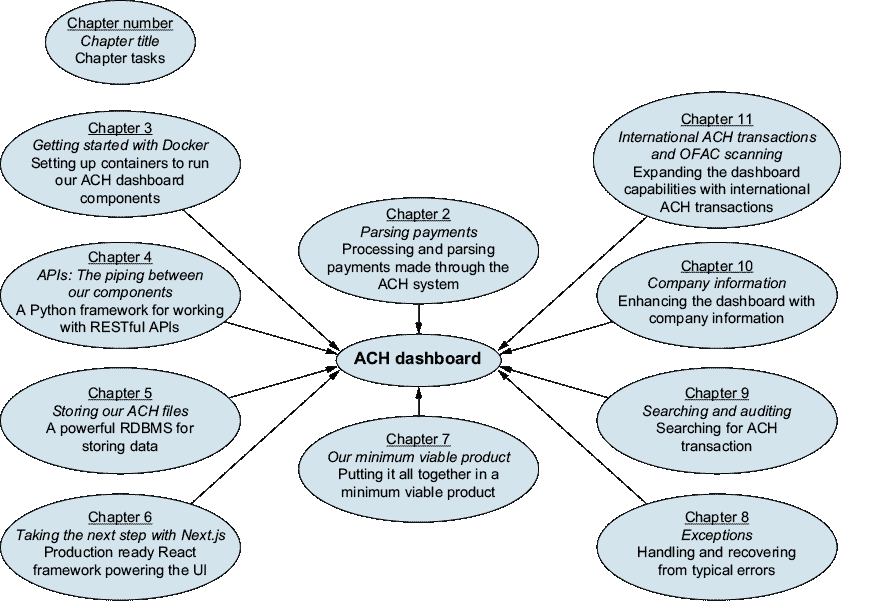
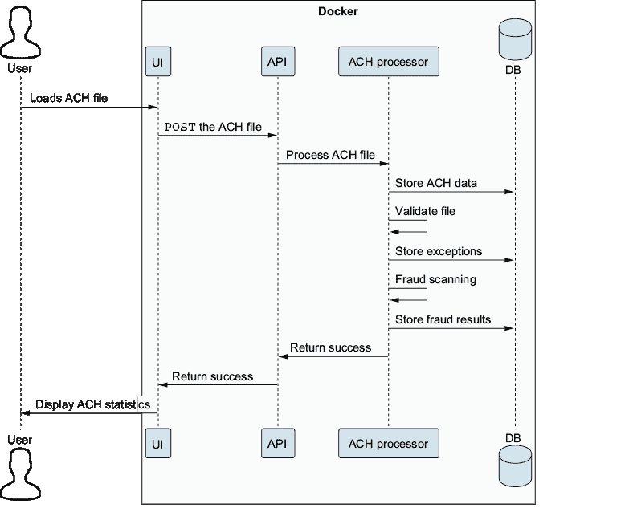
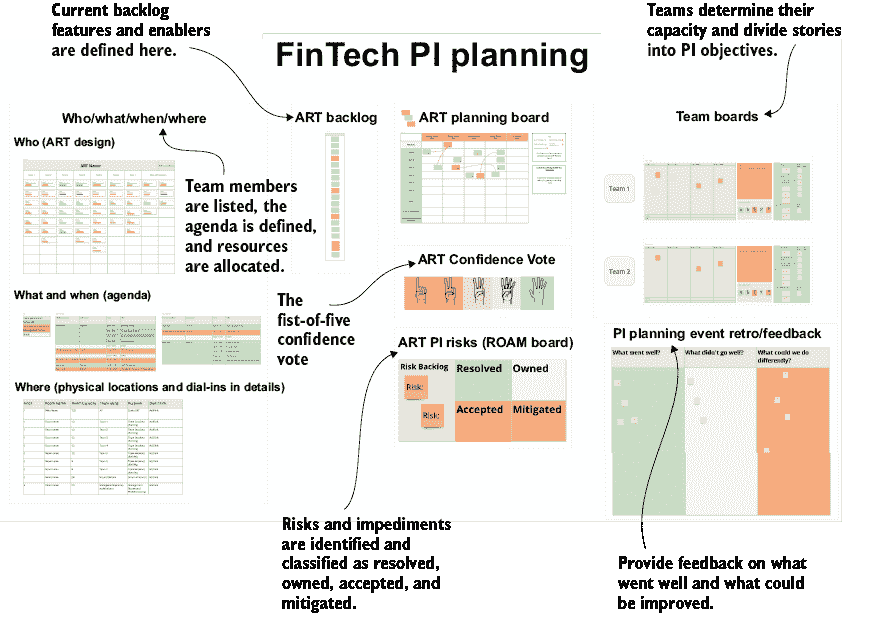
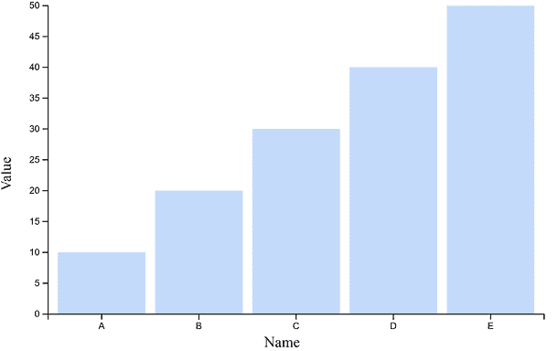
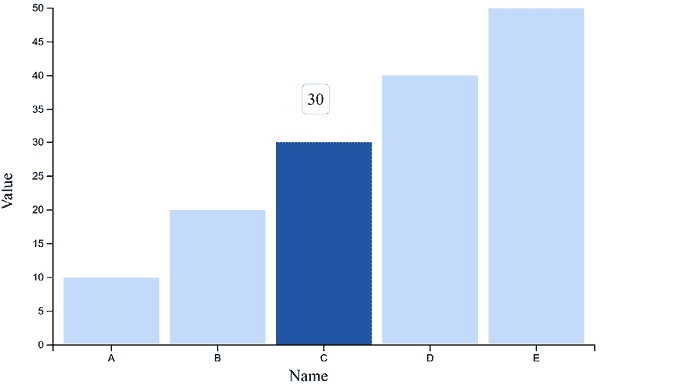

# 第一章：探索 FinTech 和生成式 AI

### 本章涵盖

+   FinTech 简介

+   ACH 是什么以及为什么它很重要

+   如何使用全栈开发来构建 ACH 仪表板

+   生成式 AI 的益处和陷阱

“FinTech”这个术语在过去的几十年中变得普遍，作为金融技术的简称。实际上，“金融技术”这个术语可以应用于很久以前的发明，比如 19 世纪的现金登记机和电报，甚至可以追溯到公元前 3300 年的最早的钱包。如今，FinTech 通过 GoFundMe 和 Kickstarter 等网站帮助赋予众筹机会。像 Uber 和 DoorDash 这样的零工服务应用依赖 FinTech 来促进快速支付。像 Venmo 和 Zelle 这样的支付服务能够提供快速的个人对个人（P2P）和企业对企业（B2B）支付，这都得益于 FinTech。比特币和以太坊这样的加密货币当然被归类为 FinTech，但即使是更传统的银行、投资和信贷公司，其核心也都有 FinTech 的元素。

那么，什么是 FinTech 呢？简单来说，它就是利用技术来改善金钱的处理方式。如今，FinTech 指的是提供更快、更方便和/或新的金钱处理方式的软件。

正如你所见，FinTech 开发者有机会从事许多种类的软件开发。不难想象，对于全栈 FinTech 开发者，或者那些能够从前端到后端的所有方面工作的开发者，职业道路会敞开。我们喜欢说，全栈开发者有机会对许多不同的领域感到好奇。作为一名全栈开发者，你将有机会从事构成应用程序的不同部分——从客户将看到的用户界面（UI）到满足 UI 请求的后端处理，以及两者之间的一切。

想象一下收到关于客户互动耗时过长且破坏用户体验（UX）的报告问题。其他开发者可能会在他们的分配边界之一放弃，而你将有机会从按钮点击开始追踪该问题，通过应用程序编程接口（API），到服务器，再到具体的结构化查询语言（SQL）语句，看看如何解决它。

本书将教授您使用真实世界金融科技公司项目进行全栈开发。本书旨在提供对金融科技公司（无论大小）遇到的一些软件开发方面的深入了解。在完成以下章节中介绍的项目后，您应该对您最感兴趣的软件开发领域有更好的理解，以及您可能想要深入研究的话题。正如金融科技和全栈开发为我们提供了许多不同的机会一样，我们希望向读者提供类似的学习金融科技和软件开发的机会。多样化的主题应该激发您的想象力，并鼓励您深入研究一个或多个主题。

## 1.1 未来金融科技公司项目

本书将带您踏上一段旅程，以一位虚构的金融科技公司——未来金融科技公司的软件新开发者身份。这意味着，如果您在现代编程语言（如我们这样）中有一点软件开发经验，这将是有益的，因为我们并不旨在从零开始教您编程。相反，您应该对循环、if 语句和类似概念有基本的理解。由于本书不专注于单一的语言或技术，新开发者将有很多东西可以学习，而经验更丰富的开发者可能会发现一些新的工具或技术。

为了帮助您将所学知识付诸实践，本书将采用未来金融科技公司等大型公司的一个典型项目。该项目旨在使未来金融科技公司众多产品中的一款现代化。需要现代化的产品通常是公司长期存在的现有产品。它们通常在市场上已经确立，并被许多客户使用。公司可能出于任何原因进行这些产品的现代化，例如

+   该公司因收购或合并而拥有的一款产品不符合公司现有的设计指南。

+   由于新的合规或监管变化，一款产品受到了重新审视。

+   一款产品正在其市场上重新定位或向新的受众进行营销。

+   一款产品需要昂贵的硬件或额外的软件来维护它，而现代化它将提供更经济有效的解决方案。

我们正在承担的项目是更新一个与支付系统相关的仪表板，该系统在美国用于促进支付（如支付抵押贷款或汽车贷款）和资金转移（将资金从支票账户转移到另一机构的更高利率储蓄账户）——自动清算所（ACH）。

我们的 ACH 仪表板项目将要求我们了解 ACH 处理和全栈开发，我们在处理数据库设计、API、后端处理以及通过 UI 展示一切时，会介绍我们作为金融科技开发者所使用过的不同方法和技术。我们还将探索生成式 AI 工具如何使我们日常工作更加高效，帮助我们写作、故障排除以及执行许多其他任务。

## 1.2 ACH 仪表板

如前所述，我们将构建一个在美国支付中常用的示例支付系统，称为 ACH。然而，ACH 系统通常会与其他国家的等效系统进行交互，例如

+   加拿大的电子资金转账（EFT）

+   欧洲的单欧元支付区（SEPA）

+   英国的银行自动化清算系统（BACS）

+   澳大利亚的大批量电子清算系统（BECS）

+   印度的国家自动化清算所（NACH）

ACH 支付是了解金融科技的一个很好的方式，因为它们是金融机构之间交易流程的真实世界例子。一旦我们将交易流入数据库，金融科技的世界将真正对我们敞开。在我们构建并增强 ACH 仪表板的过程中，我们将涉及软件开发和金融科技的许多领域，如图 1.1 所示。

了解为仪表板提供数据的各个部分有助于看到整体情况。我们还可以看看这些部分在将 ACH 文件加载到仪表板时可能如何发挥作用。图 1.2 为我们提供了一个高级概述，展示了我们的仪表板一旦构建完成将执行的事件序列。能够加载 ACH 文件是与仪表板交互的第一步。



##### 图 1.1  构建 ACH 仪表板

一旦我们完成 ACH 仪表板的构建，我们将审视所有对我们项目开放的可能路径，并希望找到一个引人入胜的项目发展方向。虽然 ACH 可能对我们产生常规影响（您的工资是否自动存入，或者您是否安排信用卡支付、抵押贷款支付或其他贷款？），但您之前可能从未听说过它。让我们看看 ACH 究竟有多重要。

### 1.2.1 ACH 有多重要？

图 1.3 展示了 2000 年至 2021 年间非现金支付的趋势，金额以万亿美元计，这是根据最新的美联储支付研究收集的([`mng.bz/5g2z`](https://mng.bz/5g2z))。注意 ACH 转账是如何显著增加的，占据了更大的商业份额，尤其是在支票使用量下降之后。

ACH 是美国的一个主导标准，但实时支付的需求正在上升。之前我们提到了 P2P 和 B2B。还有其他支付类型，但基本理念是在两个账户之间进行快速实时支付。作为回应，ACH 提出了当日 ACH 的概念，这可以显著加快处理 ACH 支付所需的时间，将其从几天缩短到几小时。



##### 图 1.2  通过 ACH 仪表板加载文件

实时支付及其提供商正将此标准定位为支付领域的下一场革命，并且他们很可能会在未来获得一些影响力。预计到 2026 年，实时处理将负责每年 1000 亿美元，但仍需走很长的路才能影响到每年通过 ACH 处理的数万亿美元。在任何情况下，从本书中学到的经验教训都将使我们能够掌握支付处理，无论使用的技术是什么。现在我们已经了解了 ACH，让我们来看看我们将如何完成这个项目的构建，该项目将使用一种名为 SAFe 的敏捷方法。

## 1.3 SAFe 敏捷

根据《敏捷状态年度报告》第 17 次年度报告，71%的受访者在其软件开发生命周期（SDLC）中使用敏捷（见[`mng.bz/6e2y`](https://mng.bz/6e2y)）。本书借鉴了 SAFe 敏捷的原则，因为我们在大型的财富 500 强金融科技公司中有直接的经验。此外，规模敏捷（SAFe 的创造者）表示，全球超过 20,000 个组织使用规模敏捷框架（SAFe）。


##### 图 1.3  各种支付方法的年度比较

如前所述，即使是那些传统上在技术采用上落后的大型金融科技公司，也已经转向了敏捷。我们加入的那个大型虚构金融科技公司名为“未来金融科技”，也不例外，并采用了 SAFe 作为其开发方法。在接下来的章节中，当我们构建 ACH 项目时，我们将努力遵守框架和敏捷方法的一般原则。SAFe 敏捷中的一个关键事件是程序增量（PI）规划会议，它有助于规划即将到来的冲刺的工作。

定义 A 程序增量（PI）是一个时间盒（一定的时间量），长度从 8 周到 12 周不等。PI 通常由四个称为“冲刺”的迭代组成；这个术语来自 Scrum，并被许多不同的软件工具（例如，JIRA）所使用。冲刺通常是一个两周的周期，但根据团队的决定，可能会有所增减。

作为 PI 规划的一部分，部门将展示下一年度的产品路线图，其中显示了企业所做出的各种承诺、预期的监管变化以及公司倡议。在这次 PI 规划会议期间，工作将被划分为史诗级项目。这些史诗级项目是较大的项目或倡议。例如，一些公司可能将他们的发布称为史诗级（如 2024 年春季发布），并将发布的项目分解为用户故事。还有一些公司可能将他们的个别项目作为史诗级，并将该项目的任务分解为用户故事。在整个书中，我们尝试在短的开发周期内工作，这也是敏捷开发的主要概念之一。如果我们将工作分解成更小的可管理部分，我们应该没问题，无论我们如何称呼这些小块（当然，保持一致性有助于沟通）。

##### 敏捷方法论

每家公司都不同，这并不令人惊讶。许多金融科技公司起源于瀑布方法论，但最近转向了敏捷。我们可能会遇到不同程度上遵循敏捷的团队（部门、业务单元或团队），从纯粹的敏捷实践者到被迫接受敏捷的团队。

我们的目的是不是真正教授敏捷，而是在我们处理项目时大致在敏捷框架的范围内工作。如果你想更深入地了解敏捷，我们鼓励你阅读 Greg Smith 和 Ahmed Sidky 的《成为敏捷》（2009 年，Manning 出版社），以及敏捷宣言（[`agilemanifesto.org/`](https://agilemanifesto.org/））也是必读内容。但别担心：宣言是一篇快速阅读的文章！

PI 规划是作为一个团队聚集在一起，你将与业务分析师、质量保证（QA）、开发者、技术作家等互动，为即将到来的工作制定计划。图 1.4 展示了使用 Miro 模板的 PI 规划板，Miro 是一种流行的协作工具，专门用于此类活动。

在 PI 规划板上，我们应该能够找到我们的团队和分配的工作。在我们这个案例中，我们已经分配了一个项目，作为公司范围内现代化遗留软件的一部分，创建一个新的 ACH 仪表板。通常，PI 规划会议持续一天，重点是优先排序工作、确定依赖关系和明确必须满足的要求。此外，我们使用 ROAM（已解决、已拥有、已接受、已缓解）板来识别风险，最后进行信心投票，每个人使用“拳头五指投票”的方式（他们举起手并投票或通过支持的工具）。如果平均投票是三票或更高，则计划被确认，我们可以开始工作。如果不是，我们则审查并重新制定计划。通常，人们会担心工作量、完成时间以及任何现有的知识差距。解决这些担忧是过程的一部分，可能需要一些时间。我们将快速跳过这部分，直接进入我们团队分配的项目，因为我们总是可以在他们的网站上找到更多关于 SAFe 及其所有动态部分的信息（[https://scaledagileframework.com/](https://scaledagileframework.com/))。

## 1.4 ACH 仪表板

在 PI 规划会议结束后，我们应该对我们的项目和即将到来的迭代中我们追求的目标有一个有希望的想法。我们的团队已经选择了现代化 ACH 仪表板的任务。现代化遗留软件可能很棘手，因为我们不仅要处理设计和开发的技术挑战，还要考虑我们的变化对客户的影响。一些行业（以及个人）可能因改变缓慢而闻名。在个人的情况下，他们了解当前的系统、流程及其特性。他们已经学会了如何导航系统以完成工作，那么为什么要改变一个行之有效的东西呢？这些问题是我们在任何项目中都应该考虑的合理问题。



##### 图 1.4  Miro 中的 PI 规划模板

个人）可能因改变缓慢而闻名。在个人的情况下，他们了解当前的系统、流程及其特性。他们已经学会了如何导航系统以完成工作，那么为什么要改变一个行之有效的东西呢？这些问题是我们在任何项目中都应该考虑的合理问题。

在我们这个案例中，公司将我们的 ACH 仪表板项目视为一种工具型任务——对业务来说是必需的，但仅此而已。然而，由于 ACH 是金融机构处理交易如此重要的一部分，客户已经一段时间以来开始要求增强功能。为了保持竞争优势，公司希望现代化仪表板。有潜力对交易进行更好的分析、欺诈监控，以及将仪表板的使用范围扩展到发起交易的客户。有了这些能力在议程上，我们需要考虑提供一款不仅提供这些功能，而且外观和感觉与其他提供的产品一致的产品。图 1.5 展示了当前遗留界面的一个示例。

尽管界面功能齐全，但仍有改进的空间。公司已经报告了团队应努力解决的局限性。


##### 图 1.5 遗留 ACH 界面

现有遗留界面的限制如下：

+   *无法上传文件*—目前操作必须确保文件已上传，然后后台办公室可以从下拉菜单中选择它们。这会在处理过程中造成不必要的延迟。

+   *基本报告*—只报告文件总数。这种方法不会产生有意义的分析。系统将文件存储在适合报告的遗留数据库中。

+   *访问限制*—该界面需要连接到运行在 IBM Power 上的后端服务器，而此系统可以运行一个 web 服务器。由于此服务器有广泛的路由和防火墙保护，我们的 SecOps 团队更倾向于将此任务卸载到不同的服务器上。

+   *样式*—新的仪表板最终将被作为更广泛系统或管理 ACH 文件的用户的一个独立组件进行营销。业务希望将现有的样式指南应用于新项目。

业务已经设想了一个现代化的网站（图 1.6），将解决这些问题，并已指派我们的团队来处理这个项目。


##### 图 1.6 现代 ACH 仪表板

技术架构师还从技术方面提供了支持公司现代化计划的要求。图 1.7 提供了 ACH 仪表板的概述。


##### 图 1.7 ACH 仪表板启动计划

现代化计划包括以下内容：

+   *PostgreSQL*—确保使用关系数据库，并将 ACH 文件解析到数据库中，以便业务智能团队能够对数据进行分析。

+   *Next.js*—使用如 Next.js 这样的生产就绪的 React 框架。确保界面可以支持可视化。

+   *Docker*—我们希望确保我们的应用程序被分割成在容器中运行的组件。

+   *Python*—目前，我们的遗留应用程序，如 ACH 处理系统，是用 COBOL 编写的。新项目应使用 Python 作为主要语言。

应该注意的是，我们可以根据需要替换这些组件（为了完成这个项目；在工作中，我们可能不会有这样的奢侈）。这是我们将在以下章节中反复提到的事情。例如，如果你更熟悉 MySQL，或者你的公司使用 Java 而不是 Python，并且使用这些技术会对你更有帮助，那么，当然，你可以使用它们。你可能需要更努力地将 Python 示例重构成 Java（如果你对两者都没有经验），但这样你也会学到很多。你希望我们使用的技术是什么？请随时告诉我们——也许我们会在下一章处理那个问题！

我们还想指出，现代化是一个你在职业生涯中会反复遇到的过程。可能在你职业生涯的某个阶段，你公司中的所有 Python/Java/Golang 代码都需要被下一代语言所取代。可能公司会聘请一位在另一个技术栈方面更有经验的新首席技术官，并希望朝那个方向发展。无论这个决定是好是坏，我们可能被迫忍受这个过渡。现在我们对项目有了更多了解，让我们看看我们将要使用的一些工具。

### 1.4.1 行业工具

作为 ACH 仪表板项目的一部分，团队将使用以下工具。正如前文建议读者可以选择用 Java 替换 Python，或者选择用 MySQL 替换 Postgres——根据他们当前的技术栈——同样适用于这些工具。如果你有更适合你当前环境的工具，请随时使用。许多这些工具将在后面的章节中讨论，但我们想给你一个正在使用的工具集的概览。

我们团队选择使用的工具有

+   *JetBrains PyCharm*—社区版或专业版。我们使用专业版，并在其中运行我们的 API、UI 和 Docker。

+   *JetBrains Webstorm*—用于我们在 Next.js 中 UI 开发的额外工具。

+   *Visual Studio Code*—我们用它来处理 Docker 和 Plant UML，但它也可以替代 JetBrains PyCharm/Webstorm。

+   *JetBrains Qodana*—用于代码审查。

+   *ChatGPT*—我们选择它作为编码辅助工具，因为有一个免费版本可供我们实验。此外，如果我们公司不能提供集成体验，我们仍然可以通过访问[`chat.openai.com/`](https://chat.openai.com/)来使用生成式 AI。

+   *GitHub Copilot*—为各种 IDE 提供 AI 编码辅助。拥有 GitHub Copilot 的订阅将使我们能够在 PyCharm、Webstorm 和 Visual Studio Code 等 IDE 中获得辅助，仅举几个例子。

我们还将介绍我们使用的各种插件；然而，在我们开始深入本书的其余部分之前，我们想确保我们已经设定了竞争的舞台。也有可能使用单个 IDE 来运行项目。个人来说，我们倾向于使用 JetBrains PyCharm Professional 进行所有开发（Python、Next.js 和 Docker），效果非常好。

在我们深入项目之前，让我们更仔细地看看生成式 AI。这本书不是关于生成式 AI 的全面书籍。为此，你可能想看看 Numa Dhamani 和 Maggie Engler 所著的《生成式 AI 入门》（2024 年，Manning）或 Amit Bahree 所著的《生成式 AI 实战》（2024 年，Manning）。相反，我们将简要介绍生成式 AI 以及与之合作时的一些重要概念。然后，随着我们完成项目，我们将展示一些我们发现生成式 AI 有帮助（以及一些它成为障碍）的具体案例。

## 1.5 生成式 AI 的第一印象

在他们上一次公司全体会议上，Futuristic FinTech 的执行团队表示有兴趣采用生成式 AI 工具来帮助提高公司内部的效率。公司不同部门已经启动了几个倡议，以评估不同的工具和将生成式 AI 融入的方式。ACH 仪表板项目也可以在现代化项目中使用生成式 AI。公司要求我们更好地了解生成式 AI 的能力、局限性和责任。那么，我们如何思考生成式 AI 呢？

### 1.5.1 更好的橡皮鸭

我们可以将生成式 AI 视为橡皮鸭的下一迭代。橡皮鸭调试是由 Andy Hunt 和 Dave Thomas 所著的书籍《实用程序员》（Addison-Wesley，1999 年）普及的，它提供了一种鼓励我们将思维过程表达给一个比老板或团队领导不那么令人畏惧的听众的方法！通过大声对橡皮鸭（或任何非生命物体）说话，我们通常能够在涉及其他人之前就识别出问题。我们经常叫来同事，指向屏幕上展示我们的观众如何证明这段代码不可能失败，结果却发现我们坚实的代码中存在立即的问题。有一个橡皮鸭来“弹跳”想法是一种无价资源（而且相当经济实惠）。如果我们害羞于大声说话（即使没有人在场），一些工具提供了将我们的想法打字出来的能力。Slack 有一个频道，可以作为我们思想的共鸣板。进入频道会显示“你也可以在这里自言自语，但请记住，你将不得不提供对话的双方。”还有[`rubberduckdebugging.com/cyberduck/`](https://rubberduckdebugging.com/cyberduck/)上的橡皮鸭聊天机器人服务以及多个生成式 AI 橡皮鸭网站，如[`rubberducktherapy.app/`](https://rubberducktherapy.app/)。

我们可以将生成式 AI 看作是那个橡皮鸭的进化。生成式 AI 让我们的橡皮鸭不仅能作为倾听者，还能提供想法和反馈。我们仍然会鼓励使用橡皮鸭，因为它能洞察我们的思维过程，在我们一天的工作结束后，代码不合作时，它还能充当一个便宜的咨询师。

生成式 AI 是机器学习的一个子集，它为 ChatGPT 和 GitHub Copilot 等工具提供动力。生成式 AI 可以生成新的内容，并基于大型语言模型（LLMs）的使用。我们看到生成式 AI 正在迅速被各种行业和角色的工作流程所采用，不仅限于技术领域，还包括如人力资源和市场营销等领域。生成式 AI 为我们提供了更高的效率，这反过来又节省了时间，我们都知道时间就是金钱。

在下一节中，我们将使用生成式 AI 给经典的“Hello, World！”程序加入金融科技的元素。

### 1.5.2 你好，检查 21！

“嗯，从哪里开始呢？”当我们第一次看到 ChatGPT 的提示时，我们可能会这样想。我们可能想直接开始，看看 ChatGPT 的编码能力，但让我们先看看 ChatGPT 的其他可能性。金融科技领域充满了我们需要注意的法规，所以我们首先让它“请总结一下检查 21 法规。”阅读完响应后，我们发现它有点枯燥，因为我们作为软件开发者，不是业务分析师。所以，虽然我们可能稍后会需要细节，但我们只想得到一个大致的印象。我们可以尝试改进我们的提示：“总结一下检查 21 对普通银行客户的好处。”这给了我们一些可能更符合我们最初想要了解的内容。我们可以进一步改进我们的提示：“用几句话告诉我检查 21 的情况，”然后我们再次得到了一个合适的响应。一个有趣的问题可以是“如果我们必须用一个词来描述检查 21，那会是什么？”答案是“数字化”，这实际上是一个很好的描述方式。

当然，作为软件开发者，我们来到这里是为了编码！让我们假设我们没有 Python 编码经验，但也许我们对其他语言和软件开发有一般性的了解。我们想看看 ChatGPT 能否帮助我们开始 Python 编程。

让我们以传统的“Hello, World！”程序为例，但给它加入金融科技的创新，改为打印“当前余额：$1000.00。”使用 ChatGPT，我们说，“在 Python 中，给我展示一行打印‘当前余额：$1000.00’的代码”然后我们得到了相关的 print（“当前余额：$1000.00”）代码。需要注意的是，ChatGPT 的更新以及 ChatGPT 的非确定性可能会导致我们收到的响应有所不同。我们可能会发现我们多次输入相同的提示，每次都会收到不同的响应。所以，如果你在跟随，如果有些响应略有不同，那是可以的。

如您所见，使用 Python，我们只需打印一行；我们不需要像在 Java 或 C 中可能遇到的那样导入库或设置主函数。因此，我们决定通过告诉 ChatGPT，“扩展程序以允许用户输入当前余额金额，然后打印出来。”这也按预期工作，给出了以下列表中所示的一个简单程序。

##### 列表 1.1  ChatGPT 生成的代码

```py
# Ask the user to enter the current balance, note that we expect the user
# to enter a numeric value otherwise we will receive a message similar to
# ValueError: could not convert string to float
current_balance = input("Enter current balance: ") #1

# Print the entered balance in the desired format
print(f"Current Balance: ${float(current_balance):,.2f}")  #2
```

#1 从键盘接收输入并将其存储在 current_balance 中

#2 打印一行显示当前余额，并相应地格式化 current_balance

观察代码后，我们决定如果我们将这部分代码拆分成一个函数可能会更有用。然后我们要求系统“更新示例代码，以调用一个打印 `current_balance` 的函数。”

##### 列表 1.2  ChatGPT 更新后的带有函数的代码

```py
def print_balance(current_balance): #1
 """ #2
 Prints the current balance in a formatted string. #2
 #2
 Parameters: #2
 - current_balance: The current balance to be printed. #2
 """ 
 print(f"Current Balance: ${float(current_balance):,.2f}") #3

# Ask the user to enter the current balance
user_input = input("Enter current balance: ")

# Call the function to print the balance
print_balance(user_input) #4
```

#1 定义一个接受当前余额参数的函数

#2 函数及其参数的文档

#3 将打印语句移动到函数中

#4 使用用户输入调用函数

代码看起来更好了，而且我们收到了一个使用 Google 风格的 docstrings 注释的函数代码，这很棒。然而，我们认为如果代码包括类型提示，将更容易维护，正如在 [`peps.python.org/pep-0484/`](https://peps.python.org/pep-0484/) 中提到的。因此，我们请求系统通过输入“请在上面的代码中添加类型提示”来包括类型提示。 

##### 列表 1.3  带有类型提示的代码扩展

```py
def print_balance(current_balance: str) -> None: #1
    """
    Prints the current balance in a formatted string.

    Parameters:
    - current_balance (str): The current balance to be printed, as a string.
    """
    print(f"Current Balance: ${float(current_balance):,.2f}")

# Ask the user to enter the current balance
user_input = input("Enter current balance: ")

# Call the function to print the balance
print_balance(user_input)
```

#1 现在我们展示 current_balance 是一个字符串，该函数不返回任何内容。

现在，我们真的很喜欢我们迄今为止编写的简单程序。然而，当我们查看 `print_balance` 的返回值时，我们发现它返回 `None`。这很合理，因为我们只是在代码中调用了一个打印语句。然而，为了使代码更加易于维护，我们只需返回格式化的字符串，让调用者决定他们想要如何处理它。毕竟，这个函数不应该决定如何处理输出，因为调用者可能想要将其写入文件或通过 API 调用返回。我们认为，不假设返回值总是以相同的方式处理（在这种情况下，打印）是一个好习惯。我们经常不得不重新编写大量代码，因为假设它总是会被打印出来（在我们的一个案例中，打印到一个开放的网络上）。结果，业务逻辑变得非常复杂，截止日期非常紧张，我们最终不得不复制现有的代码，移除打印语句，以便返回我们需要的。这导致了技术债务（未来需要完成的工作以解决重复的代码）。因此，我们只想返回格式化的字符串，以养成不假设我们的函数应该对输出执行特定操作的习惯。因此，我们告诉 ChatGPT 返回一个字符串而不是打印它，“更新代码，使 `print_balance` 返回字符串并打印它。”

##### 列表 1.4  返回一个字符串

```py
def print_balance(current_balance: str) -> str:  #1
    """
    Returns the current balance in a formatted string.

    Parameters:
    - current_balance (str): The current balance to be formatted, as a string.

    Returns:                                #2
    - str: The formatted current balance.   
    """
    return f"Current Balance: ${float(current_balance):,.2f}" #3

# Ask the user to enter the current balance
user_input = input("Enter current balance: ") #4

# Call the function to get the formatted balance and then print it
formatted_balance = print_balance(user_input)  #5
print(formatted_balance)   #6
```

#1 函数已被更新以显示它返回一个字符串。

#2 文档也已相应更新。

#3 返回字符串而不是打印它

#4 在名为 user_input 的变量中存储余额，该变量类型为字符串

#5 在名为 formatted_balance 的变量中存储格式化的字符串，该变量类型为字符串

#6 打印格式化的字符串

非常有趣的是，我们仅凭软件开发知识就能创建一个可工作的程序，而不一定需要任何 Python 知识（可能我们需要查阅 Python 的类型信息）。虽然这表明 ChatGPT 可以非常有帮助，但它只能像我们放入提示中的信息一样有帮助。

##### 提示工程和问题表述

生成式 AI 在提示工程和问题表述领域引起了很大的关注。有些讽刺的是，这些不仅是生成式 AI 的主题，而且可能是我们日常生活中应该一直在努力工作的领域！提示工程被称为能够为 LLM 创建有意义的输入（提示）。毕竟，模型需要能够解析提示并形成响应，因此输入确实很重要，因为垃圾输入往往会导致垃圾输出。

+   清晰和具体的提示

+   保持提示简洁

+   正确的语法和拼写

+   在适当的时候使用示例

有一种观点认为，提示工程并不那么重要，因为模型正在不断改进，并且越来越擅长处理提示。然而，能够清晰地表达我们的观点并保持其简洁是一种我们大多数人都能从中受益的技能。你有没有读过一封冗长的电子邮件然后停下来？是的，我们也是。虽然提示工程可能不再是那么受欢迎，但有许多不同的方法，其中一些可能取决于你正在处理的问题而成为必要。我们建议查看[`www.promptingguide.ai/techniques`](https://www.promptingguide.ai/techniques)上定义的各种技术，或者阅读 Amit Bahree 的《生成式 AI 实战》（Manning，2024 年）。

问题表述是指我们清晰地定义问题的能力。这是另一种显然适用于日常生活，而不仅仅是我们的新生成式 AI 统治者的技能。我们更愿意与那些通过说“这个程序坏了，我肯定没有做错什么！”来寻求我们帮助的人合作，还是与那些说“我试图加快这个程序的执行速度，作为 123 号工单的一部分，现在格式不正确”的同事合作呢？

虽然让生成式 AI 编写我们的代码可能会有所帮助，但作为新的软件开发人员，我们将面临大量的支持性工作，我们需要解决这些问题。让我们看看生成式 AI 如何帮助我们进行调试。

### 1.5.3 帮助！这段代码不起作用！

生成式 AI 的另一个好处是帮助我们识别代码中的问题。这对保持我们的理智或让我们的同事看起来像英雄一样都很有价值。例如，假设我们有一段代码，它应该保存客户最近进行的交易列表，这样我们就可以轻松地在代码中检索它们。这对大多数金融软件来说可能不是一个不合理的功能。在下面的列表中，我们定义了一个简单的函数，用于保存交易列表。

##### 列表 1.5 存储交易的简单函数

```py
def last_transactions(user_transactions: list, 
➥transaction: str, max: int = 3) -> list: #1
    """
    Adds a transaction to the list of user transactions 
 ➥and returns the updated list.
    :param max_length: Maximum transactions to keep
    :param user_transactions: List of current transactions
    :param transaction: New transaction
    :return: Updated list of transactions
    """
    if len(user_transactions) + 1 >= max:  #2
        user_transactions.pop(0)           

    user_transactions.append(transaction)  #3

    return user_transactions               #4
```

#1 定义了一个函数，该函数接受一个交易列表、一个新交易以及要保留的最大交易数量；如果没有传递任何内容，则默认为三个。

#2 如果存储的交易长度超过了我们的最大值，那么就删除第一个。

#3 存储新交易

#4 返回更新后的交易列表

这相当直接——我们传入一个交易列表、我们想要添加到列表中的交易以及保持列表的最大大小。如果我们超过了长度，我们将使用参数为零的方法删除列表中的第一个项目。当我们编写使用此函数的程序时，我们会发现它的行为并不完全符合预期。

##### 列表 1.6 使用我们的函数

```py
from source.last_transactions import last_transactions  #1

transactions: list[str] = [] #2

transactions = last_transactions(transactions, "deposit $100") #3
transactions = last_transactions(transactions, "deposit $200")   #3
transactions = last_transactions(transactions, "deposit $300")   #3
transactions = last_transactions(transactions, "deposit $400")   #3

print(transactions)  #4
```

#1 导入我们的函数

#2 定义了一个包含字符串的空列表

#3 添加一些交易

#4 打印结果

列表 1.6 的输出是`['deposit $300', 'deposit $400']`，所以我们只有两个条目，而不是我们预期的三个。所以，要么将参数默认设置为`3`的逻辑不起作用，要么弹出事务的逻辑不起作用。另一种可能性是发生了我们没有预料到的事情。请记住这一点，因为有时我们会盯着我们认为有问题的地方，但我们无法找出问题所在。我们可能花费数小时努力，最终发现问题和答案都存在于代码的另一个部分。我们还有一些与这个问题相关的单元测试，这些测试将在下一列表中展示。

##### 列表 1.7  为我们的函数定义单元测试

```py
def test_first_transaction_is_dropped():
    expected_value = 3  #1
    transactions: list[str] = []

    transactions = last_transactions(transactions, "deposit $100», 3)
 transactions = last_transactions(transactions, "deposit $200", 3)
 transactions = last_transactions(transactions, "deposit $300", 3)
 transactions = last_transactions(transactions, "deposit $400", 3)

  assert (
        len(transactions) == expected_value
    ), f"Expected {expected_value}, but got 
➥ {len(transactions)} transactions" #2

    assert (
➥    transactions[0] == "deposit $200"
    ), f"Expected {expected_value}, but got 
➥ {len(transactions)} transactions" #3
```

#1 定义我们预期的交易数量

#2 一个断言测试，以确保我们有预期的交易数量

#3 我们期望传递的第一个值应该被丢弃，所以我们有“deposit $200”。

因此，如果我们想在继续前进之前休息一下，看看自己能否解决这个问题，我们当然可以这样做。然后我们可以回来看看 ChatGPT

给我们的。

欢迎回来！希望我们能够尝试一下，稍微玩一下代码，但让我们直接回到 ChatGPT，输入这个命令。正如我们所见，列表 1.5 中的代码存在逻辑错误：我们期望看到三个交易被列出，但只看到了两个。我们简单地问 ChatGPT，“为什么这个代码不起作用？”这是我们故意做的，只是为了忽略我们之前讨论的一些提示工程和问题制定。我们想看看我们会收到什么样的回应，ChatGPT 的回应非常棒，因为它识别出了代码中它不喜欢的两个问题：

**** 你提供的代码旨在向用户的交易列表中添加新事务，同时确保列表的长度不超过给定的“max”。如果添加新事务会导致“max”超过，则将移除最旧的事务。

然而，有几个问题：

1.  “max”这个名字是 Python 的一个内置函数，它返回输入值中的最大值。最好避免将其用作变量名。让我们将其更改为类似“max_length”的东西。

1.  弹出事务的条件是“if len(user_transactions) + 1 >= max:”。这意味着如果你有“max_length = 3”并且当前“user_transactions”的长度是 2，它将在添加新事务之前移除第一个事务，因此始终保持长度为 2。这是不正确的。正确的条件应该是“if len(user_transactions) + 1 > max_length:”。

如我们所见，有几个问题被指出来了：首先，我们在代码中使用了`max`这个名字。我们的 IDE 也标记了这一点，因为`max`是 Python 的一个内置函数。正如我们之前看到的，由于这个名字的阴影，代码仍然可以工作，但在尝试跟随它时可能会变得有点复杂。其次，另一个建议是将代码中的 if 语句更新为`if` `len(user_transactions)` `+` `1` `>` `max_length:`。有了这两种解决方案中的任何一种，我们都可以重新运行代码或重新运行测试来确认代码工作得更好。

我们一直觉得有趣的一件事是任何问题的解决方案数量；有时我们解决了一个问题，后来又回去说，“我们在想什么？！”。我们以为 ChatGPT 只会去掉`+` `1`并保留现有的逻辑。如果我们觉得这很令人困惑，那么我们可能会问 ChatGPT 关于这个问题。我们继续追问，“如果我们把行更改为`if len(user_transactions)` `>= max_length:`？”然后 ChatGPT 给了我们一些额外的信息，并确认“这个更改确实会使代码正确地实现预期目的！”我们有代码和`pytests`确认了这两种方式。

我们无法真正提供洞察 ChatGPT 为什么选择一种方式而不是另一种方式的原因，但我们把这看作是再次确认，即生成式 AI 是一个可以使用的工具，但不一定应该被视为万能的。我们试图继续追问，“与另一种方式相比，这种方式是否有性能上的优势？”ChatGPT 给出了一个合理的回答。我们发现有趣的一点是，它开始将`if` `len(user_transactions)` `>=` `max_length:`作为其建议的更改，并倾向于它，因为它直观且提供了更好的可读性。无论如何，我们都希望你能看到从生成式 AI 工具中获得反馈以帮助我们确定代码缺陷和潜在改进的有用性。

有时候，我们遇到的问题可能并不是代码问题，而更多的是“我确信你需要使用等号来分配变量，但它就是不起作用。”当你知道你想做什么但又不记得如何在特定的语言或环境中做时，生成式 AI 可以提供巨大的帮助。我们将在下一节中探讨生成式 AI 如何提供帮助。

### 1.5.4 帮助！我忘了语法！

生成式 AI 的另一个好处是只需开始学习其语法。有时，作为一名全栈开发者，不断从一个语言切换到另一个语言可能会让我们感到头晕。我们可能会发现自己知道我们想要完成什么，但并不完全清楚如何实现。正如我们在第一个例子中所看到的，只要我们知道如何进行这个过程，我们就可以让我们的生成式 AI 工具为我们开始。例如，在我们的第一个例子中，我们能够定义一个函数，传递参数，并使用类型提示。如果我们不了解这些结构或者不愿意学习它们，那么生成式 AI 对我们来说可能不会有多大用处。

让我们再试一个全栈开发的例子。之前，我们正在使用 Python，但现在让我们转换方向，跳转到使用 HTML5 和 D3.js 的 UI。当处理 HTML 和脚本时，我们喜欢使用带有 Live Server 插件的 VS Code。每个人对 HTML5 和 D3.js 的经验水平各不相同，从从未听说过它们到专家。然而，即使我们的经验只是看到过柱状图或在网站上使用过，我们也可以通过这个问题而不遇到太多问题。我们可以要求 ChatGPT“在 HTML5 页面上创建一个简单的 d3.js 柱状图”，最终得到一些令人尊重的东西，但绝对不是获奖作品（图 1.8）。


##### 图 1.8  简单的柱状图

代码显示了所使用的数据：

```py
        const data = [
            { name: 'A', value: 10 },
            { name: 'B', value: 20 },
            { name: 'C', value: 30 },
            { name: 'D', value: 40 },
            { name: 'E', value: 50 },
        ];
```

那个图表看起来不错，但我们想给轴添加一些标签。这应该是我们在看到可视化之前已经遇到过的，而且对于我们来说，添加到可视化中不应该是一个很大的跳跃。我们只需简单地输入“你能更新代码以添加轴标签吗？”在提示符中，我们就会看到标签已经成功添加。即使我们可能不确定如何编写代码，但我们知道我们想要代码做什么，这就足够让我们在这个例子中朝着正确的方向前进。请看图 1.9 中带有轴标签的输出。



##### 图 1.9  带有轴和标签的柱状图

现在看起来相当不错了。我们可能不会赢得任何比赛，但这确实有助于通过我们的可视化传达观点。现在，我们可以考虑在鼠标悬停在条形图上时添加一些交互性。我们在提示中输入“代码能否更新以改变条形图颜色，并在鼠标悬停时显示条形图的值？”，然后我们得到了一个交互式图表。当我们在条形图上悬停时，条形图的颜色从蓝色变为橙色，同时值也会在鼠标附近显示。通过玩这个，我们可以看到它工作得相当不错，但我们不满意的一点是，带有值的工具提示出现在鼠标进入条形图的位置，但当鼠标在条形图内部移动时，它不会随着鼠标移动。我们可以通过更新代码在鼠标移动时更新位置来修复这个问题，或者我们可能应该只是在鼠标悬停时在条形图上方显示值，或者也许我们总是应该在条形图上方显示值。请随意尝试这些或实现其他方法！

我们要求工具提示显示在条形图上方。图 10.1 展示了我们最终得到的结果。



##### 图 1.10  在我们的条形图中进行突出显示和悬停

标签并没有完全居中，当它显示在最大的条形图上时，它会超出屏幕。我们可能可以说服 ChatGPT 让它达到我们想要的样子，或者我们可以深入代码并尝试解决它。无论如何，即使我们没有使用 D3.js 或者不熟悉 HTML，我们也应该能够制作出一个不错的条形图。这些代码片段也可以作为我们的训练工具，让我们可以玩转代码并从中学习。也许我们不确定如何使用 d3.js 的`append`或`on`方法，回顾这些样本或生成的代码是看到它们实际应用的好方法。

##### 验证

由于我们刚刚处理了一些可能不太熟悉的例子，现在可能是回顾验证的好时机。我们绝不应该让像 ChatGPT 这样的工具为我们编写一大堆我们永远都无法理解的代码。看到事情是如何完成的可能会有所帮助，我们甚至可以用它来为自己生成代码（以下章节将提供一些关于安全性/隐私/所有权问题的额外见解）。但请记住，将代码放入并检查它意味着我们将拥有它。我们曾多次被问及十年前我们做的代码更改，因为我们是在更改该模块的最后一个人。

这里是一个由 ChatGPT 生成的 Perl 单行脚本，用于验证电子邮件地址格式是否正确。请随意将其插入到您现有的软件解决方案中——但请准备好，当支持人员深夜打电话告诉您客户电子邮件导入过程出现问题时，您需要承担责任！

```py
perl -e 'my $email = "user@example.com"; if ($email =~ /^[a-zA-Z0-9._%+-
]+@[a-zA-Z0-9.-]+\.[a-zA-Z]{2,}$/) { print "$email is a valid email address.\n"; } else { print "$email is an invalid email address.\n"; }'
```

如果你对正则表达式和 Perl 不熟悉，你会在代码中放入这个脚本的可能性有多大？

工具如 ChatGPT 的另一个特性是能够请求参考资料。也许，在看到验证电子邮件的正则表达式后，你决定你可能想通过做更多研究来验证结果。通过要求 ChatGPT 提供代码的来源，它会将你引向 Perl 文档（`perldoc`）。它还会提到一般的正则表达式知识，以及电子邮件地址的官方标准（RFC-5322）。这可以为我们想要了解我们不理解的一些代码提供一个良好的起点。

我们看到了生成式 AI 的强大和有用之处，但在下一节中，我们将探讨使用它时可能的一个潜在陷阱。

### 1.5.5 我是不是泄露了我的数据？

生成式 AI 的下一个好处示例是能够让它为我们处理输入。例如，假设一位银行家给我们提供了一个报告文件，并希望对它进行一些报告处理。他们给我们提供了一个逗号分隔值（CSV）文件，并希望我们将其汇总。为什么他们不能在 Excel 中这样做，我们实在想不通，但我们认为这可能是一个我们获得一些额外 Python 实践和尝试生成式 AI 的好机会。我们得到了一些格式如下

```py
"ssn", "account", "balance"
"000-65-4320", 1, "$1.00"
"000-65-4321", 1, "$2.00"
```

当我们将这些数据粘贴到提示中时，ChatGPT 回应说：“看起来你提供了一份包含社会保障号码（SSNs）与账户号码和相应余额的列表。我如何帮助您处理这些数据？”这是一个非常棒的回应。将这个回应与如果您只是将类似的打印输出放在他们面前，他们可能会给出的回应进行比较。

因此，在提示中，我们输入“给定这个样本文件，编写一个 Python 程序来打印带有总计的报告”，并在提示下方粘贴我们的数据。它打印出以下列表中的程序。

##### 列表 1.8  样本报告程序

```py
data = """
"ssn", "account", "balance"
"000-65-4320", 1, "$1.00"
"000-65-4321", 1, "$2.00"
"000-65-4322", 1, "$3.00"
"000-65-4323", 1, "$4.00"
"000-65-4324", 1, "$5.00"
"000-65-4325", 1, "$6.00"
"000-65-4326", 1, "$7.00"
"000-65-4327", 1, "$8.00"
"000-65-4328", 1, "$9.00"
"000-65-4329", 1, "$10.00"
"""

lines = data.strip().split("\n")
total = 0.0

# Skip the header row
for line in lines[1:]:
    balance_str = line.split(",")[2].strip().replace("$", "")
    total += float(balance_str)

print(f"Total Balance: ${total:.2f}")
```

代码看起来是合理的，所以我们继续运行它。然而，代码遇到了一个值错误：`ValueError:` `could` `not` `convert` `string` `to` `float:` `'"1.00"'`。所以，ChatGPT 产生的代码中包含了一个错误。我们可以尝试自己修复它，或者我们可以让 ChatGPT 知道它有问题。请随意审查和调试错误，看看是否可以在继续之前修复它！

问题最终被证明是`balance_str`中的引号。为了纠正它，我们可以添加一个额外的`replace`来处理双引号，所以这一行变成了`balance_str` `=` `line.split(",")[2].strip().replace('$',` `'').replace('"',` `'')`.

虽然这可能是使用生成式 AI 的一种非常有帮助的方法，但也有一些潜在的缺点。其中一个缺点是我们刚刚将非公开信息（NPI）输入到了 ChatGPT 中。如果我们使用的工具吸收了用于训练的数据，那么可能，我们已经将客户信息暴露给了不安全的数据源，因为它可能会出现在对其他用户的响应中。我们必须非常小心地对待我们输入到任何工具中的数据，而不仅仅是当我们使用生成式 AI 时，因为我们想确保信息被安全地存储。在我们的案例中，任何以`000`开头的 SSN 都是无效的，所以我们没有使用真实数据。

##### 所有权

我们已经讨论了将受保护数据输入到生成式 AI 中的潜在担忧，我们也应该意识到将专有信息输入其中的问题。如果我们的专有代码被用来训练系统，它可能很快就不会是专有的了。始终查看服务条款（ToS）和最终用户许可协议（EULA）。

另一个担忧可能是对响应所有权的担忧：如果我们要求模型生成一些将用于我们正在销售的产品中的代码，那么谁拥有这段代码？我们是否需要向他们支付版税？这些类型的问题/担忧是我们应该在我们从学生或个人使用开发过渡到企业环境开发时牢记在心的。公司对发布敏感数据可能会非常挑剔，这是有道理的。他们的业务可能依赖于商业机密，而且不当处理敏感数据可能会面临巨额罚款。

对所有权的担忧使我们产生了对隐私和安全的类似担忧，我们将在下一节中讨论。

### 1.5.6 隐私和安全

我们需要关注的生成式 AI 的其他领域——这将是贯穿我们职业生涯的一个普遍话题——是隐私和安全领域。可能将我们的代码输入到生成式 AI 工具中正在帮助训练它，我们的专有代码最终可能作为对他人提示的响应输出。例如，GitHub Copilot 明确表示他们不会存储或分享我们的代码。在相同方面，我们还需要小心处理我们输入到模型中的敏感信息，如非公开信息（NPI）或个人身份信息（PII）。

也许我们希望生成式 AI 工具为每个业务单元总结季度收益报告，这样我们就可以创建一个引人注目的信息图表，并认为生成式 AI 可以提供帮助。但是，现在我们可能已经将公司/商业机密与模型共享了！因此，我们应该仔细思考我们输入系统中的内容。如果我们像在上一节中那样使用生成式 AI 来解决问题，创建一个更通用但仍然存在同样问题的较小代码片段可能是有益的。谁知道呢，我们可能在解决问题的过程中就找到了问题！

开放式全球应用程序安全项目（OWASP）在[`genai.owasp.org/`](https://genai.owasp.org/)上有关于采用生成式 AI 的具体指导。有趣的是，回顾 OWASP Top 10 针对 LLM 和生成式 AI，看看我们可能会遇到什么样的攻击。了解潜在的危险可能会帮助我们避免它们。

### 1.5.7 保持更新

最后一个可能的问题可能是模型中的数据是否最新。如果模型基于旧数据，我们可能得不到我们想要的结果。在大多数情况下，当我们向 ChatGPT 等工具询问 Java 或 NPM 的最新版本时，它足够了解自己的回答。在其他情况下，我们的问题可能表明这是一个潜在的版本问题。例如，当我们向 ChatGPT 询问“我如何在 Python 中连接到 PostgreSQL？”时，它提供了一个使用`psycopg2`的合理示例。然而，有一个名为`psycopg3`的`psycopg2`的新重写版本。如果我们尝试改进示例并要求 ChatGPT 使用`psycopg3`而不是`psycopg2`，它再次说它的数据可能过时：

** 看起来你的请求可能有一个拼写错误。截至我 2021 年 9 月的最后知识更新，没有名为`psycopg3`的库。

当然，如果我们不了解`psycopg2`或被指示使用`psycopg3`，我们可能会有些偏离方向，但不必担心。我们可能会认为，如果我们对作业是`psycopg2`还是`psycopg3`有疑问，我们可以很容易地询问我们的同事。然而，如果我们是新手并且被投入到了深水区，我们可能不愿意向我们的新导师（无疑非常忙碌）澄清这样的简单疏忽。

有趣的是，我们可以通过在提示符中输入以下内容来让 ChatGPT 将`psycopg3`视为`psycopg2`的替代品：“`psycopg3`是`psycopg2`的重写。你能否在给定的示例中将`psycopg2`简单地替换为`psycopg3`？”

然后，ChatGPT 将再次生成一个合理的回应：

** 我为之前的混淆道歉。由于截至我 2021 年 9 月的最后更新，我没有关于`psycopg3`的信息，我将假设它的使用与`psycopg2`类似。如果`psycopg3`确实是`psycopg2`的重写，其使用应该非常相似。

这是我们必须注意的验证的另一个方面——如果工具没有更新并且给我们提供建议，我们可能会错过特定版本或各种改进。再次强调，生成式 AI 为我们提供了一个良好的起点，但确保一切正常仍然取决于我们做一些尽职调查。

## 摘要

+   金融科技（FinTech）涵盖了广泛的金融技术，从历史上的现金登记到现代应用，包括众筹、零工服务应用、P2P 支付和加密货币。

+   本书针对金融科技领域的全栈开发者，涵盖了端到端的应用程序开发，包括 UI 设计、后端处理以及通过实际案例进行故障排除。

+   SAFe 敏捷框架在金融科技公司中得到广泛应用，并在管理软件开发项目的程序增量规划中具有重要意义。通过使用新的工具和框架，如 PostgreSQL、Next.js、Docker 和 Python，正在对遗留系统进行现代化改造。这些变化对用户和企业都产生了重大影响。生成式 AI 被视为橡皮鸭调试方法的演变，它提供积极的反馈和想法。

+   生成式 AI 使用 LLM（大型语言模型）并将其集成到各个行业以提高效率。

+   生成式 AI 在编码、调试、语法回忆以及生成跨编程语言的代码片段方面提供帮助。

+   由于可能存在过时的训练数据，读者在使用 AI 获取最新信息时应谨慎。
