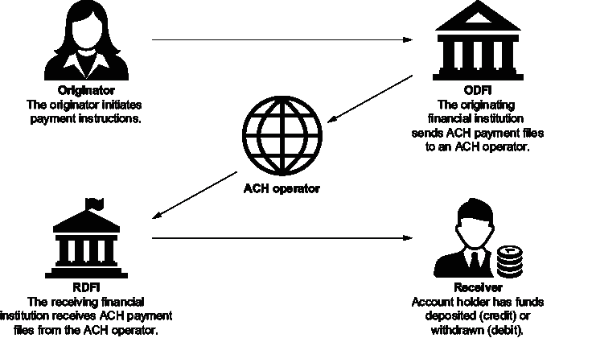
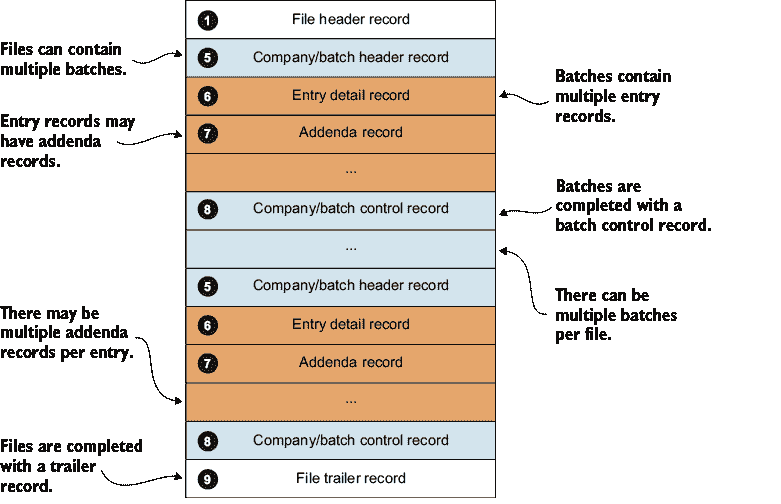
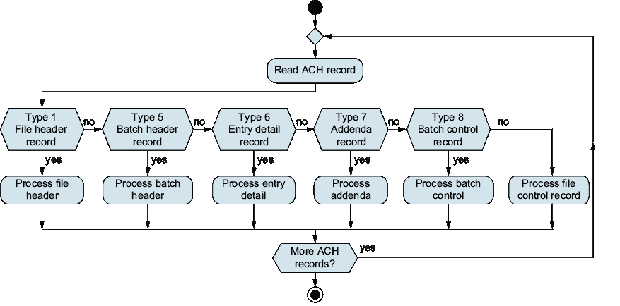
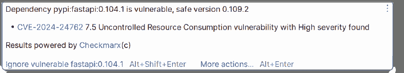

# 第二章：解析支付

### 本章涵盖

+   使用生成式 AI 解析 ACH 文件

+   使用 Python 进行单元测试

+   敏捷概念

本章解释了由自动清算所（ACH）格式化的文件的基本原理。你将解析一个初始样本文件，以更好地了解一些使用的记录布局，以及单元测试的软件开发实践。你还将扩展你对生成式 AI 的知识，并了解如何将其应用于现实世界的问题。

## 2.1 现代化我们的遗留软件

现在我们已经完成了 PI 规划并分配了我们的项目，我们将开始着手我们的第一个 spike。在 SAFe 中，spike 是一种故事类型，通常被称为启用故事。可以使用多种启用故事类别（例如，探索、架构、基础设施和合规）。在我们的情况下，我们的故事可能被归类为探索类型或研究 spike。然而，细节并不像我们的活动那样重要，因为具体细节可能在不同敏捷框架之间有所不同。本质上，这个故事旨在为团队提供一些在 Python 中工作以及了解 ACH 文件布局的经验，以便我们更好地理解预期的解决方案。

在这次迭代中分配给团队的故事可以揭示推动现代化努力的商业需求。当前的 ACH 系统运行在主机系统上，并且与现有架构高度耦合。这种耦合使得系统难以维护。业务一直在跟踪各种关键绩效指标（KPIs）：

+   *发布节奏*——显示开发团队发布新功能和更新的频率

+   *缺陷回溯*——显示在开发和发布过程中识别出的缺陷数量

+   *逃逸缺陷*——显示软件发布后识别出的缺陷数量

+   *客户满意度*——表明客户对我们产品/服务的满意度

这些指标显示，随着系统代码库在规模和复杂性上的增长，进行监管增强和一般性错误修复所需的时间一直在稳步增加。

目前，我们对 ACH 文件没有任何了解，理解和导航 COBOL 代码将需要时间；此外，我们可能需要请求访问权限。团队将需要深入了解 COBOL 代码，以便他们能更好地协助将功能从一个区域转换到另一个区域。在此期间，团队应从项目的基础开始着手。团队还首次获得访问生成式 AI 工具的权限，以帮助评估其使用情况，因为公司正在考虑使用生成式 AI 来提高生产力。我们的经理认为，团队处于一个独特的位置，可以评估这些工具以帮助我们完成这项工作。

公司为我们提供了高级 ChatGPT 和 GitHub Copilot 会员的访问权限。他们还要求我们测试 ChatGPT 的免费版本，因为如果免费版本与高级版本相当，他们更愿意节省一些钱。此外，我们的经理提醒我们不要将任何专有或机密信息粘贴到 ChatGPT 中，因为这可能会违反我们现有的保密协议（NDA）。这意味着我们无法粘贴 COBOL 代码并将其转换为 Python，或者要求 ChatGPT 解释现有代码。相反，我们应该在将代码样本插入 ChatGPT 之前，专注于隔离、净化和泛化代码样本。

我们的计划是研究一下 ACH 究竟是什么，以及我们将要处理哪种类型的格式。我们熟悉 JSON，因为我们之前已经做过相当多的基于 Web 的工作。无论如何，我们都对开始这个项目感到兴奋：进入一些代码并开展工作是我们当初想要这份工作的原因，所以让我们开始吧！

## 2.2 理解 ACH

ACH 网络允许银行和信用合作社在不建立单独关系的情况下转账。鉴于美国有超过 10,000 家银行和信用合作社，这是一项相当大的任务！那么，它是如何工作的呢？

一种常见的 ACH 交易类型被称为预先安排的支付和存款（PPD）。它通常用于直接存款支付工资（以及定期账单支付、健身房会员费和社会保障支付等）。假设我们的雇主在银行 X 有账户。每两周或每月两次，他们需要向我们支付工资，但我们使用的是另一家银行，银行 Y。为了在发薪日前几天将钱转到你那里，我们的雇主或他们的工资处理器将创建一个包含执行支付所需信息的文件。它包括我们的实发工资金额、我们的账户号码和一个*路由转换号*。路由转换号是一个唯一数字，用于识别一家银行——在这种情况下，交易最终接收方的银行：银行 Y。工资处理器会将包含员工工资信息的文件传输给银行 X。银行 X 接受该文件，并将其与其他收到的文件合并。接下来，它将一个文件发送到联邦储备银行或一家名为 The Clearing House 的私人公司。这两个实体被称为*ACH 运营商*或*清算所*。ACH 运营商接受来自数千家银行的文件，根据其路由转换号对交易进行分类，并为每个接收交易的银行创建新文件。然后，这些文件被传输到银行，银行随后接收并处理这些交易。

ACH 文件使用由 Nacha 定义的格式，Nacha 是制定 ACH 网络标准的组织。图 2.1 显示了 ACH 处理流程。



##### 图 2.1 ACH 处理流程

## 2.3 解析 ACH 文件

因此，我们被分配了一个任务，解析一个 ACH 文件并将其存储在数据库中。这个任务包括对 ACH 文件中发现的每种记录格式的解析子任务，以及将结果存储在数据库中。

ACH 文件标准是在 20 世纪 70 年代创建的，自那时以来经历了各种更新和扩展。这很好，因为它意味着关于标准的很多信息都是可用的。我们从对 ACH 的研究开始，发现 ACH 文件是一个固定宽度的 ASCII 文件，每行 94 个字符长。这些行被称为记录，每个记录由固定位置的字段组成。具有固定位置记录的固定宽度文件应该意味着解析是一个相对简单的任务。

深入挖掘，我们发现文件中可能存在六种类型的 ACH 记录。似乎有一些类型的标题记录，每种都有称为控制记录的尾记录来封装数据。我们还找到了记录类型和文件结构的概述（见图 2.2）。关于记录及其对应字段（如位置、是否必需等）的更多详细信息可在[`achdevguide.nacha.org/ach-file-details`](https://achdevguide.nacha.org/ach-file-details)找到。



##### 图 2.2  ACH 文件布局

图 2.2 给我们提供了文件结构的概念；然而，让我们也看看我们将要工作的样本文件，这样我们可以更好地了解文件可能的样子。图 2.3 可能看起来有点令人畏惧，但一旦我们将记录分解为字段，它就相对简单易懂。


##### 图 2.3  示例 ACH 文件

根据结构和文件样本，我们知道我们不得不解析以下记录类型：

+   *类型* *1*—一个文件头记录，每个文件只有一个记录

+   *类型* *5*—一个文件头记录，每个文件有多个批次

+   *类型* *6*—条目记录，每个批次有多个条目

+   *类型 7*—附加记录，每个条目记录可以有零个或多个记录

+   *类型* *8*—一个批次控制记录，包含条目和附加记录

+   *类型* *9*—一个文件尾记录，包含所有批次记录

尽管我们还没有获得对传统 COBOL 代码的访问权限，但团队成员发现了一个康纳菲斯（由 Atlassian 提供的 wiki）网站，该网站提供了一个流程图，提供了对 ACH 文件处理的一些见解（图 2.4）。



##### 图 2.4  ACH 处理流程

你的第一个任务是检查你的首选搜索引擎以查看有什么可用。你可能会找到一些现有的包（`pyNacha`、`py-nacha` 和 `pynacha`）。这些似乎是一些探索如何创建和解析 ACH 文件的不同项目。进一步的挖掘也显示，其中一些项目来自 `carta-ach`，而 `carta-ach` 又来自 `python-ach`。这些项目已经被多次分叉，但大多数似乎已经有一段时间没有更新了。由于它们没有得到积极维护，因此基于它们的项目可能不是明智的选择。然而，它们似乎有一个宽松的 MIT 许可证（关于许可问题的更多内容稍后讨论），因此我们可能可以分叉一个项目以开始。我们还可以利用一些我们的生成式 AI 工具来获得一些帮助。

### 2.3.1 向 ChatGPT 请求解析 ACH 文件

我们可以先向 ChatGPT 提出问题：“你能写一个 Python 程序来解析 ACH 文件吗？”当我们尝试在 ChatGPT 3.5 中这样做时，它给出了一个可以解析文件的 `ACH` 类的基本结构，如下一个列表所示。

##### 列表 2.1  ChatGPT 3.5 的 ACH 解析器

```py
class ACHParser:     #1
    def __init__(self, ach_file_path):     #2
        self.ach_file_path = ach_file_path #2
        self.records = []     

    def parse(self):
        with open(self.ach_file_path, 'r') as file:
            lines = file.readlines() #3

        record_type = None
        current_record = {}

        for line in lines:
            record_code = line[0]    #4
            if record_code == '1':     #5
                record_type = 'header' #5
            elif record_code == '6':    #5
                record_type = 'batch'   #5
            elif record_code == '7':    #5
                record_type = 'entry'   #5
            elif record_code == '9':    #5
                record_type = 'footer' #5

            if record_type:
                current_record[record_type] = line.strip()
                if record_type == 'footer':
                    self.records.append(current_record)
                    current_record = {}
                    record_type = None

    def get_records(self):
        return self.records

if __name__ == "__main__":
    ach_file_path = "example.ach"
    parser = ACHParser(ach_file_path)
 parser.parse()

  records = parser.get_records()
    for record in records:
        print(record)
```

#1 定义了一个名为 ACHParser 的类

#2 `__init__` 函数用作我们类的构造函数。

#3 读取整个文件

#4 确定第一个字符并将其存储在 `record_code` 中。

#5 根据记录代码进行基于记录的处理；注意没有记录代码 5 或 8。

程序看起来还不错；然而，尽管我们对 ACH 的了解有限，但我们可以看出它有一些问题：

+   缺少记录类型代码 `5`。

+   缺少记录类型代码 `8`。

+   `record_type` 标签不正确，因为 `6` 被列为 `batch` 而不是 `entry`，而 `7` 被列为 `entry` 而不是 `addenda`。

我们尝试切换到更新的 ChatGPT 4 并向它提出相同的问题。我们看到了以下列表中显示的代码。再次提醒，由于大型语言模型的不确定性，可能会导致不同的结果。

##### 列表 2.2  ChatGPT 4 的 ACH 解析器

```py
def parse_ach(filename):
    records = []   #1

    with open(filename, 'r') as file:
        lines = file.readlines()

        for line in lines:
            record_type = line[0]

            if record_type == '1':  # File Header Record #2
                record = {                                #2
                    'record_type': 'File Header',         #2
                    'priority_code': line[1:3],           #2
                    'immediate_destination': line[3:13],  #2
                    'immediate_origin': line[13:23],      #2
                    # ... additional fields               #2
                }

            elif record_type == '5':  # Batch Header Record
                record = {
                    'record_type': 'Batch Header',
                    'service_class_code': line[1:4],
                    'company_name': line[4:20],
                    # ... additional fields
                }

            elif record_type == '6':  # Entry Detail Record
                record = {
                    'record_type': 'Entry Detail',
                    'transaction_code': line[1:3],
                    'receiving_dfi_id': line[3:11],
                    'account_number': line[12:29],
                    'amount': line[29:39],
                    # ... additional fields
                }

            elif record_type == '7':  # Addenda Record
                record = {
                    'record_type': 'Addenda',
                    # ... additional fields based on the
                    # specific addenda type
                }

            elif record_type == '8':  # Batch Control Record #3
                record = {                                    #3
                    'record_type': 'Batch Control',           #3
                    # ... additional fields                   #3
                }

            elif record_type == '9':  # File Control Record
                record = {
                    'record_type': 'File Control',
                    # ... additional fields
                }

            else:
                print(f"Unknown record type: {record_type} in line: {line}")
                continue

            records.append(record) #4

    return records #5

# Test the function with an ACH file
parsed_records = parse_ach('path_to_ach_file.txt')
for record in parsed_records:#6
    print(record)            
```

#1 一个空数组，用于存储 ACH 记录。

#2 每个记录类型都存储为一个字典；其中一些字段是由 ChatGPT 提供的。

#3 这次 ChatGPT 4 生成了记录类型 8。

#4 将 ACH 记录添加到我们的数组中。

#5 返回记录。

#6 使用 for-each 循环打印出返回的记录。

这个程序似乎更完善了一些。我们看到这次有批控制记录（记录类型 8），并且一些行还进行了样本解析。这似乎是一个不错的开始；然而，我们希望保持程序的可测试性。如果我们将解析逻辑分离到单独的函数中，我们就可以向函数传递格式良好的记录和无效数据来测试它。让我们看看 ChatGPT 是否能完成这个有点繁琐的过程。

我们只是简单地询问 ChatGPT：

**** 你能更新上述程序，使得每个记录类型的解析都是一个单独的函数吗？

程序更新为将每种记录类型拆分为其自己的函数。相关更改在以下列表中显示。请注意，我们已经提供了解析函数（`parse_file_header`、`parse_batch_header` 等），并且这些函数已被 ChatGPT 存根（意味着我们将需要提供实现细节以解析实际数据）。

##### 列表 2.3  使用单独的函数进行解析

```py
def parse_ach(filename):
    records = []

    parser_functions = {          #1
        '1': parse_file_header,    #1
        '5': parse_batch_header,   #1
        '6': parse_entry_detail,   #1
        '7': parse_addenda,        #1
        '8': parse_batch_control,  #1
        '9': parse_file_control    #1
    }                              #1

    with open(filename, 'r') as file:
        lines = file.readlines()

        for line in lines:
            record_type = line[0]
            parser = parser_functions.get(record_type) #2

            if parser:                       #3
                records.append(parser(line)) 
            else:                            
                print(f"Unknown record type: 
   ➥{record_type} in line: {line}") #4
                continue

    return records
…                               #5
def parse_file_control(line):    #5
    return {                     #5
        'record_type': 'File Control',  #5
        # ... additional fields    #5
    }  #5
…                                #5
```

#1 在字典中定义所需的解析函数

#2 根据我们存储在 record_type 中的第一个字符检索适当的函数

#3 使用适当的 数据调用解析函数

#4 使用适当的数据调用解析函数

#5 解析函数的样本存根之一

在 tests/data 文件夹中，还有一个样本.ach 文件（如图 2.2 所示），我们可以将其插入到这些样本程序中，以检查它们如何处理文件并玩转结果。现在是一个很好的时候，休息一下，运行样本 ACH 文件通过这些程序，看看它们是如何工作的。如果我们还不完全理解 ACH 文件处理，或者如果我们对 Python 程序中使用的某些结构不熟悉，这将很有帮助。

它是一个强大的工具，可以帮助我们开始。许多开发者都有模板、外壳或骨架程序，他们使用这些程序开始特定的任务。或者他们可能选择一个特定的程序进行复制粘贴。当然，复制/粘贴的问题是你可能会不可避免地遗漏某些内容，并引入编译时问题或错误，然后你需要进行故障排除。当使用模板开始你的程序时，同样的事情也可能发生。

这些模板或由生成式 AI 生成的代码可能很有用，特别是如果我们愿意查看代码并从中学习的话。也许我们会学会一种新的做事方式，或者也许我们会找到一种新的应用技术。尽管如此，也许我们会在生成的代码中找到错误。关键是，只要我们使用它，并且不把输出视为理所当然；生成的代码必须像我们自己的代码一样，这意味着它应该通过我们的单元测试和质量保证（QA）流程进行测试和验证。

### 2.3.2 使用 Copilot 解析 ACH 文件

在看到 ChatGPT 提供的内容后，让我们使用 Copilot 来看看它是否能让我们更接近目标。我们首先将以下内容输入到一个空的 Python 脚本中：


```py
 # Function to parse an ACH file
```

它做得还不错，但并不完全符合我们的期望，所以我们再次尝试，使用更新的提示：


```py
 # Write a class to parse an ACH file for each NACHA record type and return a list of transactions.
```

在我们键入时，“对于每个 NACHA 记录类型并返回一个交易列表”会自动填充。然后我们输入一个扩展的注释：


```py
 # Write a class to parse an ACH file with separate functions for each NACHA record type and return a list of transactions.
```

这个提示给出了以下输出，完整的列表可以在 copilot_ach_parse_with_functions.py 中找到。

##### 列表 2.4  Copilot ACH 解析器

```py
    def parse_ach_file(self):
        with open(self.ach_file, 'r') as f:
            for line in f:
                if line.startswith('1'): self.transactions
                         .append( 
➥ self.parse_ach_batch_header(line)) #1
                elif line.startswith('5'):
                    self.transactions
                      ➥ .append(
self.parse_ach_batch_control(line))#2
                elif line.startswith('6'):
                    self.transactions
                       .append(self.parse_ach_entry_detail(line))
                elif line.startswith('7'):
                    self.transactions
                       .append(self.parse_ach_addenda_record(line))
                elif line.startswith('8'):                               
                    self.transactions
                      ➥ .append( 
self.parse_ach_file_control(line)) #3
                else: #4
                    raise ValueError(
➥'Invalid ACH record type') #5
```

#1 当这是文件头记录时，错误地调用了 parse_ach_batch_header 例程

#2 批头记录被错误地解析为批控制记录。

#3 批控制记录被错误地列在文件控制中。

#4 缺少文件控制记录（类型 9）的 elif 语句

#5 当我们没有有效的 ACH 记录类型时，会引发 ValueError。

我们可以看到它创建了一个类和函数来解析单个记录类型。然而，我们也看到了多个问题：

+   记录类型 1 正在调用 `parse_ach_batch_header` 的解析例程，而它本应被解析为文件头。

+   记录类型 5 正在调用 `parse_ach_batch_control` 的解析例程，而它本应被解析为批头。

+   记录类型 8 正在调用 `parse_ach_file_control` 的解析例程，而它本应被解析为批控制。

+   文件尾记录（记录类型 9）缺失。

因此，虽然这段代码也给我们提供了一个可行的模板，但它并不一定会直接产生可以直接使用的成果。它提供的一个有用功能是代码，用于引发一个带有 `invalid` `ACH` `record` `type` 的 `ValueError`，因此当我们尝试加载一个缺少类型 9 的测试 ACH 文件时，任何格式良好的 ACH 文件都会立即引发错误。

### 2.3.3 生成式 AI：信任但验证

当然，ChatGPT 和 Copilot 都能帮助我们开始使用有意义的模板，我们可以在以后进行扩展。然而，它们在生成代码时都存在一些问题，这突出了之前提到的验证的重要性。我们必须理解生成的代码，而不仅仅是假设它是正确的。这在我们期望代码将业务规则和逻辑应用到我们想要生成的函数时尤为重要。例如，当使用生成式 AI 帮助创建纯功能代码时——例如提交表单或读取文件的按钮——如果存在语法错误或不符合规格，它将无法编译，这将立即变得明显。然而，如果缺少记录类型或存在其他问题，它可能会引入更难发现的错误，特别是如果我们不了解那些业务规则。我们多次强调这一点，只是为了强调生成式 AI 是一个强大的工具，但仍然只是一个工具。想想制作椅子的过程。我们可以只用一把手锯来制作椅子，或者我们可以有一个装满最新最棒工具的工坊，但如果我们不知道如何使用它们，我们很可能会坐在地上。

那么，我们如何验证生成式 AI 为我们生成的代码呢？通过使用极限编程（XP）开发实践，如测试驱动开发（TDD）。我们之前提到了在金融科技中需要可靠的高质量软件。

TDD（测试驱动开发）的核心概念是在编写代码之前先编写测试，让测试引导我们的开发。其中一个好处是我们拥有高度可测试的代码。在这本书中，我们将使用 TDD 原则，并展示各种自动化测试的方法。无论我们是否决定采用测试驱动的开发实践，思考我们的代码是如何被测试的都有实际的好处。在使用 TDD 方法时，以下问题总是会被考虑：

+   这段代码是需要测试的吗，还是我们需要对这个代码进行回归测试？

+   我该如何测试这段代码？

+   别人会如何理解这段代码？

这些问题的答案通常通过单元测试来找到，当考虑单元测试时，我们应该考虑 TDD。

我们也可以利用我们的集成开发环境（IDE）及其可能附带的各种插件。这些工具可能包括可定制的格式化选项和默认的语法问题高亮显示。一旦我们的开发团队人数超过一个人，强制执行一些代码标准就具有实际的好处。

我们的公司可能会提供给我们使用的一些工具。这些工具可以帮助我们立即识别生成的代码中的问题。例如，在第三章中讨论的 Snyk 这样的工具可以扫描我们的代码以查找漏洞。至少，我们希望确保代码符合我们公司的政策和标准。

##### 通过格式化和代码检查器减少认知负荷

认知负荷可以理解为我们在编码时需要在脑海中保持的信息量。有许多方法可以在代码中减少认知负荷。在代码中提供一致性有助于减少认知负荷。它还有助于扫描工具、入职培训和避免错误。

即使没有关于代码格式、注释和类似问题的担忧，开发者也有足够的事情要担心。如果我们认为缩进一行所需的空格（或制表符）数量不会引起任何人的不满，那么我们可能会得到一个令人震惊的教训。看似微不足道的格式化决策或编码实践可能会引起激烈的辩论。希望，通过采用有偏见的格式化工具，如使用 Python 时的 black 和在使用 SonarLint 时的代码检查器，许多问题已经得到了解决。

我们可能会发现，在金融科技领域用 COBOL 或 RPG 等语言编写的遗留软件受到 80 或 132 个字符行长的限制，在某些版本中，还需要在特定列（特别是 COBOL）中开始代码。类似的限制也存在于 RPG 和其他早期语言中。虽然现代语言在很大程度上已经摆脱了这些类型的限制，但开发者很快意识到可能自由度太大。今天，许多编程语言都有各种格式化工具，这些工具强制我们的代码遵循为该语言开发的标准。无论是 Perl（perltidy）、Go（gofmt）、JavaScript（Prettier）还是 Python（black），格式化工具都是我们在开始学习新语言时应立即调查的工具。

Linters 通过确保我们的代码保持清洁并避免常见的语言陷阱（例如识别未使用的导入、未使用的变量、无效的比较和有问题的类型转换等）来发挥类似的作用。SonarLint 是一种流行的 linters，适用于许多语言和 IDE。它还提供了与 SonarQube 的集成，这是一个帮助识别和管理问题的产品。其他 linters 也可用，例如在处理 JavaScript 或 TypeScript 时使用的 ESLint。

格式化工具和 linters 可以集成到您的 IDE 中，或者通过 IDE 中的插件提供。因此，开始使用它们并不是一件麻烦事。然而，请确保您使用的是团队批准的工具，并且配置正确。这些工具还可以帮助我们成为更好的程序员，因为它们经常告诉我们为什么这是最佳实践以及如何避免它。我们经常发现自己正在阅读为什么 SonarLint 标记了某些内容，或者查找有关最佳实践的额外示例或更多信息，因为 linters 标记了某些内容。

## 2.4 自动化测试

无论我们是手动编写解析 ACH 文件的初始脚本，还是使用生成式 AI 工具开始，我们都希望确保我们正在使用单元测试。我们更喜欢 TDD 方法，并且经常会发现我们更倾向于这种方法。然而，我们不必严格遵循这种方法来获得好处。我们寻求的是短的开发周期，混合测试和编码。此时，我们应有相当好的想法，即正确解析 ACH 文件将是一项相当复杂的任务。然而，读取文件并确保我们拥有所有行并不是一个无法克服的任务，我们应该能够足够容易地完成它。那么，为什么不从确保我们从文件中收到了所有行的单元测试开始呢？

一个持续的主题是需要高质量的软件和验证我们的结果，尤其是在生成代码的背景下。本节探讨了使用`pytest`进行单元测试以帮助验证生成的代码和我们自己编写的代码。我们还讨论了在编码时需要更小、更快的反馈循环的需求，并且我们将尝试在我们的代码中应用这一点。

在我们尝试为从记录类型中解析单个字段编写测试之前，我们可能需要问自己一些问题，例如

+   我能读取文件吗？

+   文件中有多少条记录？

+   我能解析类型 1 的记录吗？类型 5 的呢？

我们从初始步骤开始，然后深入到我们代码的实际功能。在接下来的章节中，我们将从一个格式良好的示例文件开始，通过创建测试来逐步处理它。每个部分都将展示如何创建一个小型单元测试来验证我们的格式良好的文件。

### 2.4.1 测试读取的记录数量

在我们开始解决可能在我们生成的代码中注意到的任何问题之前，我们将测试从我们的 ACH 文件中读取的记录数量。这项测试涵盖了我们在本节开头列出的前两个要点。验证记录数量可能看似微不足道，但它有助于我们进入测试代码的心态，并帮助我们验证我们确实完成了这项关键任务。我们的单元测试需要验证文件中的记录数量。我们可以通过在大多数编辑器中打开文件来获取记录，或者我们可以使用 Unix 中的`wc -l`或 PowerShell 中的`Get-Content`和`Measure-Object`来获取行数。如果我们不确定如何从文件中获取行数，我们可能想询问生成式 AI 是否有任何想法，也许还能学到一两个新技巧！

根据我们到达这里的方式，我们的测试可能因为缺少某种记录类型或其他错误（如错误的文件路径、权限等）而失败。现在，作为一个练习，在我们继续编写代码之前，最好先确保这个第一个测试能够正常运行。否则，我们也可以继续使用 GitHub 上提供的示例代码。

### 2.4.2 解析记录

你可以在[`achdevguide.nacha.org/ach-file-overview`](https://achdevguide.nacha.org/ach-file-overview)找到有关 ACH 布局的信息。让我们回顾一下文件格式的一些主要方面：

+   它是一个固定宽度的 ASCII 文件。

+   记录长度为 94 个字符。

+   每一行都被称为一条记录。

+   每条记录包含位于固定位置的字段。

+   记录和字段的顺序很重要。

这种格式使得处理和验证文件更有趣。我们没有可以利用的 XML Schema Definition。我们也没有像 XML 和 JSON 那样提供格式化的自由。

虽然与其他文件格式相比有约束，但它是在其他格式出现之前就已经在使用了。对我们来说，确保正确处理文件并处理日常 ACH 处理中的某些任务将是一个有趣的挑战。我们在 IDE 中创建一个新的 Python 项目，并使用 ChatGPT 4 的响应作为起点。

##### 列表 2.5  ACH 解析器的起点

```py
def parse_file_header(line):
    return {
        'record_type': 'File Header',
        'priority_code': line[1:3],
        'immediate_destination': line[3:13],
        'immediate_origin': line[13:23],
        # ... additional fields
    }

def parse_batch_header(line):
    return {
        'record_type': 'Batch Header',
        'service_class_code': line[1:4],
        'company_name': line[4:20],
        # ... additional fields
    }

def parse_entry_detail(line):
    return {
        'record_type': 'Entry Detail',
        'transaction_code': line[1:3],
        'receiving_dfi_id': line[3:11],
        'account_number': line[12:29],
        'amount': line[29:39],
        # ... additional fields
    }

def parse_addenda(line):
    return {
        'record_type': 'Addenda',
        # ... additional fields based on the specific addenda type
    }

def parse_batch_control(line):
    return {
        'record_type': 'Batch Control',
        # ... additional fields
    }

def parse_file_control(line):
    return {
        'record_type': 'File Control',
        # ... additional fields
    }

def parse_ach(filename):
    records = []

    parser_functions = {
        '1': parse_file_header,
        '5': parse_batch_header,
        '6': parse_entry_detail,
        '7': parse_addenda,
        '8': parse_batch_control,
        '9': parse_file_control
    }

    with open(filename, 'r') as file:
        lines = file.readlines()

        for line in lines:
            record_type = line[0]
            parser = parser_functions.get(record_type)

            if parser:
                records.append(parser(line))
            else:
                print(f"Unknown record type: {record_type} in line: {line}")
                continue

    return records

# Test the function with an ACH file
parsed_records = parse_ach('path_to_ach_file.txt')
for record in parsed_records:
    print(record)
```

我们为项目创建了一个基本的文件夹结构，包括

+   `ach_processor`—我们的 Python 模块所在之处

+   `docs`—存放任何必要文档的地方

+   `tests`—存放我们的单元测试的地方

+   `venv`—我们的虚拟环境（用于将项目及其依赖项分离）

+   `README.md`—一个 Markdown 文档，可以了解更多关于项目和结构的信息

+   `requirements.txt`—一个 Python 依赖项列表，CI/CD 管道可以使用它来构建项目

##### 列表 2.6  项目文件夹结构

```py
ACH_Parser/
├─ ach_processor/
├─ docs/
├─ tests/
├─ venv/
├─ README.md
├─ requirements.txt
```

在设置好项目后，我们运行 `black` 命令来格式化源代码。使用 PyCharm 时，IDE 足够智能，能够看到已安装的包，并提示我们在 IDE 内设置 Black，因为 `black` 是开箱即用的。

完成这些后，我们可以开始处理 ACH 记录。在这个阶段，通过我们的探索性峰值，我们只是简单地解析记录。输入验证是处理任何类型数据的重要方面，因为它属于防御性编程。

##### 防御性编程

防御性编程是一种积极主动的方法，用于处理用户在使用你的软件时可能出现的未预料到的输入、错误和一般性误用。例如，如果你要求用户输入一个介于 1 和 5 之间的数字，他们很可能会输入除了 1、2、3、4 或 5 之外的任何数字。你可以预料到他们会输入 a、b、%、1231482、不可打印字符以及广泛的其它输入！

输入验证、错误处理、安全默认值、输出清理、日志/监控以及静态分析等实践是防御性编程的一些方面。随着项目的进行，我们将牢记这些原则。

### 2.4.3 文件头记录（类型 1）

文件头记录包含有关文件来源机构和目的的重要信息。一些文件细节，如创建日期和时间，也可以帮助确定文件是否已被加载过，尽管我们还将依赖于对文件内容的哈希处理。

ChatGPT 的一个强大功能是能够记住对话；如果我们登录了 ChatGPT，我们可以进去要求它扩展 `parse_file_header` 例程的解析。这将给我们另一个良好的起点，然后我们甚至可以进去要求它为头记录创建单元测试。 

然而，当我们尝试这种方法时，我们遇到了一些问题，例如文件创建日期是八位而不是六位（它使用了四位年份）。记录本身不是 94 字节长，这也导致了解析错误。我们使用了 sample.ach 文件和该头记录作为期望结果，然后针对该结果运行了`pytest`。

让我们看看单元测试并将其分解（列表 2.7）。我们首先定义函数名，按照惯例，名称以`test_`开头，这有助于识别该函数是`pytest`要拾取并运行的。

接下来，我们有将要传递给解析例程的样本行。我们也使用`expected_result`，它被定义为一个字典。我们也可以直接将其嵌入到`assert`语句中，但为了清晰起见，通常更容易将其分开。通过使用字典，我们也利用了我们的集成开发环境（IDE）。例如，如果这个测试失败，PyCharm 提供了一个很好的比较窗口，我们可以看到差异在哪里。然后我们定义解析器，并使用我们的`sample_header`调用例程。

最后，我们有一个`assert`语句，这是实际检查发生的地方。如果结果与`expected_result`不同，我们将看到错误信息。我们可以包含尽可能多的`assert`语句。例如，我们可能需要在检查我们期望返回的字段之前，断言 HTTP 调用的响应是成功的。

对其他记录的后续解析也将遵循此代码模式，因此无论我们手动编写、复制粘贴还是使用生成式 AI，我们都应该能够为其他记录格式生成类似的测试。

##### 列表 2.7  `pytest`解析文件头记录

```py
def test_parse_file_header():
    sample_header = "101 267084131 6910 
➥001340402200830A094101DEST NAME 
              ➥ORIGIN NAME            XXXXXXXX" #1

    expected_result = {               #2
        "record_type_code": "1",       #2
        "priority_code": "01",         #2
        …                              #2
        "reference_code": "XXXXXXXX",  #2
    }                                  #2

    parser = AchFileProcessor() #3
    result = parser._parse_file_header(sample_header) #4
    assert result == expected_result, 
➥ f"Expected {expected_result}, but got {result}" #5
```

#1 定义了一个我们想要测试解析器的记录

#2 定义了一个包含解析字段的字典

#3 创建了我们的 AchFileProcessor 类的实例

#4 调用函数来解析文件头并返回结果。这个方法原本是私有的，但为了便于测试，我们直接访问它。

#5 将返回的结果与期望的结果进行比较；如果不匹配，pytest 将抛出错误。

我们当然可以告诉 ChatGPT 为我们创建单元测试。如前所述，当我们使用这些工具时，我们寻求“信任但验证”。可能可以同时生成代码和测试，但鉴于我们还在努力更好地理解 ACH，这可能适得其反。例如，如果工具为我们生成了一个解析文件的糟糕函数，它也可能生成错误的单元测试。我们可能会得到看似通过并验证代码的单元测试，但最终发现它们都是错误的。在生成代码时，通过自己编写单元测试（或生成单元测试并编写代码），我们可以更好地理解它。

然而，查看在请求单元测试时可能生成的内容是有好处的。我们向 ChatGPT 提示

**** 给定以下 Python 函数来解析 Nacha ACH 文件头部，请为此提供单元测试。

我们看到了以下内容。

##### 列表 2.8  ChatGPT 生成的 `pytests`

```py
def test_parse_file_header_with_incorrect_length(self):
line = "101094000123"  # Truncated line
# Assuming your method raises a ValueError for incorrect input
with pytest.raises(ValueError):    #1
   self.parser._parse_file_header(line)

def test_parse_file_header_with_invalid_record_type(self):
line = "201 0940001234567890123200602161645A094101 
➥ Your Bank          Your Company       12345678"
# Assuming your parser validates the record type 
# and raises an exception for invalid types
with pytest.raises(ValueError):
   self.parser._parse_file_header(line)

def test_parse_file_header_with_extra_whitespace(self):
line = "1  094000123   4567890123 200602 1616A 09410 
➥ Your Bank          Your Company       12345678  "
# Assuming your parser can handle extra whitespaces gracefully
   expected = {
   "record_type_code": "1",
   "priority_code": " 0",
      "immediate_destination": "94000123",
   "immediate_origin": "4567890123",
   "file_creation_date": "20060",
   "file_creation_time": "2161",
   "file_id_modifier": "6",
   "record_size": "A 0",       #2
   "blocking_factor": "94",
   "format_code": "1",
      "immediate_destination_name": "Your Bank",
      "immediate_origin_name": "Your Company",
      "reference_code": "12345678",
   }
   # This test might fail based on the specific handling  
   # of spaces in your implementation 
   assert self.parser._parse_file_header(line) == expected

# Add more tests as needed for your implementation specifics
```

#1 可以使用 `pytest.raises` 来验证是否抛出了特定的错误，这对于测试边缘情况和异常条件非常有用。

#2 额外的空白导致了无效值的使用——最明显的是记录大小从 094 切换到“A 0”。

我们可以看到这些单元测试涵盖了行长度不正确、无效类型和额外的空白。无效类型和不正确的长度行可能是有用的测试，但我们不确定额外空白测试发生了什么。看起来它是想添加尾随空格，但它也在记录本身中添加了空格。由于这是一个固定长度的记录，这显然会导致后续的验证错误。尽管如此，它确实为我们提供了在达到那个点时进行额外测试的一些方向。此外，我们还看到了如何使用 `pytest.raises` 语法来验证预期错误。

当然，目前我们正遵循快乐路径，不是过多关注输入验证。我们只想看看我们是否能在这一阶段解析 ACH 文件。

### 2.4.4 批次头部记录（类型 5）

正如其名所示，批次头部记录表示特定公司的批次开始。每个文件可以有多个批次，并且批次中包含的所有条目和附加记录都属于该公司。

对于批次头部记录的解析，我们可以回到 IDE，让 Copilot 帮助我们开始，然后也可以要求它帮助我们定义一个 `pytest`。我们使用的提示如下：

**** # 定义一个测试函数以测试使用 `AchFileProcessor._parse_batch_header()` 解析 ACH 批次头部记录。

我们可以在 `test_parsing_file_header.py` 中查看这一点。

虽然解析批次头部的初始函数看起来合理，但 `pytest` 本身需要更多的工作，特别是在将 `sample_batch_header` 传递给 `_parse_batch_header` 时。这一行有 181 个字符，超过了格式要求的固定 94 字节。看起来每个字段的名称都被放入了测试记录的位置。另外，经过进一步检查，我们发现它并没有包含记录格式中的所有字段。然而，当我们开始输入字段名称时，我们惊讶地看到字段被填充并使用了样本数据，尽管结果参差不齐。

尽管如此，这仍然是一个非常令人印象深刻的结果，足以让我们开始并使用我们一直在使用的 sample.ach 文件完成一个通过测试。在处理解析例程和预期结果后，我们能够通过另一个测试。

希望您能够自己解析这个记录并添加单元测试。如果不能，不要担心——还有更多类型等待尝试，有很多机会去尝试！尽管这可能有些过早，但我们还想看看行为驱动开发（BDD），并展示一些如果我们在考虑这种类型方法时可能会用到的示例测试。

##### 什么是行为驱动开发？

行为驱动开发是一种软件开发方法，我们围绕软件的行为创建测试，然后将其用作确定项目是否完成的验收标准的一部分。这种类型测试的独特之处在于，所有利益相关者都紧密合作来开发这些场景。将这些用户需求正式化有助于确保我们构建的项目符合用户的期望。

每个 BDD 测试都通过一系列`given`/`when`/`then`语句来描述，这些语句直接关联到期望的功能。我们可以像对待单元测试一样，从我们的 IDE 中运行这些测试。区别仅在于测试的设计方法和执行级别。

随着我们项目的进展，我们将寻求扩展我们的 BDD 测试；目前，我们创建一个非常简单的测试来确认我们已经成功解析了记录类型字段。虽然我们已经有了一个确认这一点的单元测试，但这将是一个简单介绍如何设置 BDD 风格测试的好方法。

我们首先定义一个功能文件，它标识了我们正在测试的功能以及各种测试场景。功能文件是用一种可读的语言编写的，以便任何人都能理解它。《batch_header.feature》包含在代码中，将在下一个列表中展示。

##### 列表 2.9  解析 ACH 批次头

```py
Feature: Parsing a Nacha Batch Header

  Scenario: We have a record type of 5
    When We parse the batch header 
➥"5200Company name    DiscretionaryData   Company
 IDARCComp desc 0216232302160471061000010000001"
    ➥ Then The record type should be 5
```

我们定义了功能，然后是一个简单的场景：“我们有一个记录类型 5。”场景可以命名为任何名称，但显然，我们希望传达这个测试将要做什么。`when`和`then`语句是实际工作发生的地方——在我们的例子中，*当*我们在解析头记录时，*然后*我们想要确保我们有一个类型为 5 的记录。

一旦我们有了这些信息，下一步就是将功能文件与所谓的*步骤定义*连接起来。这就是我们将可读文本转换为可以用`pytest`执行的方法。为了简洁，我们将展示“then”步骤定义的一个示例。其余的代码在`test_batch_header.py`中可供您浏览。

##### 列表 2.10  Python 中的行为驱动开发测试

```py
@then(parsers.parse("the record type should be {type_5}"))
def then_record_type_code_should_be(record, type_5):
    assert (
        record["record_type_code"] == type_5
    ), f"Expected {type_5}, but got {record['record_type_code']}"
```

我们使用 `@then` 装饰器来装饰函数并解析文本字符串。在这个字符串中，我们有 `{type_5}`。这是一个动态值，将从特征文件中提取。因此，虽然我们使用了“记录类型应该是 5”，但 5 成为函数的参数，我们可以轻松地创建其他场景来测试其他值。然后我们定义函数，传递给它我们解析的值、一个记录（这是一个 Python fixture——稍后会更详细地介绍）以及一个我们之前见过的 `assert` 语句。然后这个测试可以与其他任何测试一起运行，当这个测试通过时，我们就完成了编码。当然，我们之前已经编写了这段代码，但在后面的章节中，我们将努力在处理功能之前定义这些场景。我们可能为每个字段提出额外的场景，或者简单地扩展测试中的`then`部分，为每个字段包含多个 `then` 语句。

## 2.5 条目详细记录（类型 6）

条目详细记录包含单个交易数据，包括账户号码和需要贷记或借记账户的金额。请注意，根据正在处理的记录类型，记录的解析可能会有所不同。批次标题记录包含批次中存在的条目记录类型，这被称为标准条目类（SEC）代码。

解析条目详细记录对 ChatGPT 来说更具挑战性，并且在我们为其制定的提示中也是如此。最初，我们尝试了扩展提示

**** 完全定义 `_`parse_entry_detail` 方法并提供一个 `pytest` 来验证它。

虽然 ChatpGPT 提供了方法和 `pytest`，但它未能有意义地解析记录。我们再次尝试

**** 请使用 NACHA 类型 6 记录的完整布局。

然后，ChatGPT 开始将类型 6 记录称为附加记录，并使用与该记录相关的字段来解析它。我们意识到存在不同类型的条目详细记录（CCD、CTX、PPD 等），因此我们尝试通过

**** 请使用 NACHA 类型 6 CCD 记录的完整布局。

虽然系统正确地将类型识别为现金集中支付，但它仍然将条目称为附加记录。

使用 Copilot 产生了更好的结果，我们在键入时填充了正确的字段名称，并允许我们快速创建一个只需要稍作更新即可通过测试的模板。然而，到目前为止，我们看到的潜在主题是，虽然这两个工具都很强大，但它们需要我们验证结果，而不是盲目地插入。因此，我们可以看到，如果我们想能够验证我们的结果，了解领域知识是很重要的。

### 2.5.1 附加记录（类型 7）

附加记录包含适用于条目详细记录的额外付款相关信息。每个条目详细记录可能有多个附加记录。

当 Copilot 被提示时

**** 定义一个函数来解析 Nacha 附加记录。

它产生了几个代码建议。下面的列表显示了最接近的有效建议。它使用了所有必需的字段，但偏移量并不完全正确。

##### 列表 2.11  附加记录解析函数

```py
def parseAddendaRecord(record):
    # Create a dictionary to hold the parsed record
    parsedRecord = {
        'recordType': record[0:1],
        'typeCode': record[1:2],
        'paymentRelatedInformation': record[2:80],
        'addendaSequenceNumber': record[80:87],
        'entryDetailSequenceNumber': record[87:94]
    }

    return parsedRecord
```

除了一般的解析不正确外，我们更愿意使用蛇形命名法作为字典键。我们可以通过定义一个函数来再次细化提示，该函数使用字典和蛇形命名法解析 Nacha 附加记录。这为我们提供了我们偏好的键格式，但我们仍然需要更新偏移量。

##### 列表 2.12  使用蛇形命名法的附加记录解析函数

```py
def parseAddendaRecordSnake(record):
    # Create a dictionary to hold the parsed record
    parsedRecord = {
        'record_type': record[0:1],
        'type_code': record[1:2],
        'payment_related_information': record[2:80],
        'addenda_sequence_number': record[80:87],
        'entry_detail_sequence_number': record[87:94]
    }

    return parsedRecord
```

为了得到正确的解析，我们需要调整`type_code`、`payment_related_information`和`addenda_sequence_number`。下面的列表显示了可以使用的更新后的返回语句。

##### 列表 2.13  更新后的返回语句，包含已修正的字段

```py
…    
return {
   "record_type_code": record[0],
   "addenda_type_code": record[1:3],
   "payment_related_information": record[3:83],
   "addenda_sequence_number": record[83:87],
   "entry_detail_sequence_number": record[87:94],
}
…
```

### 2.5.2 批次控制记录（类型 8）

批次控制记录是每个批次的尾记录，是一个必需的记录。我们使用记录中的字段，如总借记/贷记金额和记录计数，来验证我们是否收到了正确的批次内容。下面的列表显示了 Copilot 在解析此记录时采取了不同的方法。

##### 列表 2.14  Copilot 解析批次控制记录

```py
def parse_ach_batch_control_record(record):
# Define a dictionary to hold the parsed data
    parsed_record = {}

    # Define the fields in the record
    fields = [
        "record_type",
        "service_class_code",
        "entry_count",
        "entry_hash",
        "total_debit_entry_dollar_amount",
        "total_credit_entry_dollar_amount",
        "company_identification",
        "message_authentication_code",
        "reserved",
        "originating_dfi_identification",
        "batch_number"
    ]

    # Define the field lengths
    field_lengths = [
        1, # record_type
        3, # service_class_code
        6, # entry_count
        10, # entry_hash
        12, # total_debit_entry_dollar_amount
        12, # total_credit_entry_dollar_amount
        10, # company_identification
        19, # message_authentication_code
        6, # reserved
        8, # originating_dfi_identification
        7 # batch_number
    ]

    # Define the field start positions
    field_start_positions = [0]
    for field_length in field_lengths:
        field_start_positions.append(field_start_positions[-1] + field_length)

    # Parse the fields
    for i in range(len(fields)):
        field = fields[i]
        start_position = field_start_positions[i]
        end_position = field_start_positions[i + 1]
        parsed_record[field] = record[start_position:end_position]

    # Return the parsed record
    return parsed_record
```

这段代码看起来有点过度设计，因为这种广泛使用的固定位置文件格式的本质意味着字段位置不会发生变化。就个人喜好而言，我们更喜欢看到实际使用的偏移量，如列表 2.12 所示。偏移量也会使我们在处理解析记录中的错误时工作更轻松。将字段定义为`'entry_detail_sequence_number': ` `record[87:94]`意味着我们知道字段`entry_detail_sequence_number`的开始和结束位置。我们也愿意让这些魔法数字存在于代码中，因为它们仅限于这个特定区域，而不是散布在整个代码中。当然，我们也可以创建名为`BEGIN_ENTRY_DETAIL_SEQUENCE_NUMBER_POS`和`END_ENTRY_DETAIL_SEQUENCE_NUMBER_POS`的变量，并在找到令人信服的理由时使用它们。现在，让我们来看看解析文件尾记录。

### 2.5.3 文件尾记录（类型 9）

在 ACH 文件中的最后一个记录是文件尾记录（也称为文件控制记录）。文件尾记录提供了诸如批次计数和条目/附加条目计数等字段，我们使用这些字段来验证文件是否正确接收。请注意，所需的格式要求记录数必须是 10 的倍数。因此，你可能会发现文件或软件会使用全部为 9 的记录来填充创建的 ACH 文件。然而，大多数软件现在不再需要这样做。

在下面的列表中，我们又回到了 Copilot 按照我们预期的样子解析记录。所有字段都被转换为整数。

##### 列表 2.15  解析文件尾记录

```py
def parse_ach_trailer_record(record):
    return {
        "record_type": record[0],
        "batch_count": int(record[1:7]),
        "block_count": int(record[7:13]),
        "entry_count": int(record[13:21]),
        "entry_hash": int(record[21:31]),
        "total_debit_amount": int(record[31:43]),
        "total_credit_amount": int(record[43:55]),
    }
```

虽然这段代码正确地解析了记录，但我们缺少最后一个字段，该字段被标记为保留。因此，尽管现在可能并不必要，但我们仍然可能想要考虑为了完整性而包括它。

我们还可能想要创建一个示例 BDD 测试，因为，理论上，主题专家（SMEs）可能会为我们提供解析此记录（或任何这些记录）的特定用例。BDD 风格的测试可能看起来像以下列表。

##### 列表 2.16  类型 9 的 BDD 风格测试——文件尾记录

```py
Feature: Parsing a Nacha File Trailer

  Scenario: We have a record type of 9
     Given the File Trailer Record "9000010000010000000740198019800000000007825000114611480"
     When We parse the file trailer
     Then the record type should be 9
     And the batch count should be 10
     And the block count should be 1
     And the entry count should be 74
     And the entry hash should be 0198019800
     And the total debit amount should be 78.25
     And the total credit amount should be 1146114.80
```

### 2.5.4 通过了！

哇，我们做到了！那是一阵编码和测试的狂潮。即使有生成式 AI 的帮助，这也需要很多吸收。现在让我们回顾一下我们刚刚完成的事情。我们开始使用小开发周期来构建单元测试，以验证各种 ACH 记录类型的解析。重要的是要理解，我们是将生成式 AI 创建的程序分解成函数开始的（在我们开始之前，我们要求 ChatGPT 为我们做这件事）。让生成式 AI 创建函数使我们能够更容易地为每种记录类型创建单元测试。否则，我们就必须想出一种方法来确定记录是否被正确解析，并在文件加载后进行检查。

每次我们都是从创建一个应该失败的单元测试开始，然后编写足够的代码使其通过。在这个时候，我们应该相对熟悉这个过程，并准备好将其应用到项目的其他部分。

## 2.6 不太愉快的路径

恭喜！我们刚刚解析了我们很可能的第一个 ACH 文件。我们专注于有时被称为“愉快的路径”的部分。这是所有事情都按预期进行，没有抛出任何错误的地方。我们在整个解析过程中使用了一个格式良好的单个 ACH 文件来展示这个过程。

我们现在也应该考虑不太愉快的路径，这可能是我们在日常编码中更有可能遇到的。我们的不太愉快的路径将涵盖在加载文件时可能发生的一些问题。存在文件或批次可能被拒绝或条目可能触发拒绝的场景。我们将在第九章中进一步探讨异常处理和从 ACH 文件问题中恢复。目前，我们只想简要提及一些可能性。

我们将确定一些可能的拒绝场景，并提供用于编码这些场景的示例 ACH 文件和`pytests`。当一个文件被拒绝时，我们通常必须回到原始发送者那里请求一个新的文件。如果有任何交易已经过账，它们可能需要在拒绝过程中进行撤销。目前，我们更专注于识别坏文件，而不是从它们中恢复。当然，如果您想跳过，我们会提供一个解决`pytests`的完整示例。显然，我们会鼓励您通过这些场景，因为我们选择的特定场景不需要对 ACH 处理有广泛的知识。

随着项目的扩展，我们还将添加进一步的验证。目前，我们只是在扩展我们的概念验证。

### 2.6.1 文件拒绝

当格式不正确时，ACH 文件可以被拒绝。记住记录的顺序很重要。一个 ACH 文件由批次组成，每个批次包含条目和附加记录。一个批次和整个文件都有尾记录。所有记录都应该是 94 个字符长。因此，对于第一个场景，我们希望处理可能不是正确长度的记录的文件。

为什么会产生记录长度小于 94 字节的文件？在 SFTP（安全文件传输协议）变得普遍之前，当 ftp 设置为截断尾部空格时，我们会遇到这种情况。虽然 ftp 不像以前那样普遍，但它仍然可以用于内部文件传输，因此原始用例可能是有效的。此外，文件可能被路由和重新传输，甚至可能在某人的计算机上创建/更新。随着银行的合并和收购，这些问题可能仍然会出现。由于 Nacha 规范要求 94 字节的记录，我们将寻求强制执行这一点。我们已经包含了包含空单元测试的 ACH_Parser_v3，以帮助我们验证我们的更改。

对于这些挑战中的每一个，我们期望解析器累积一个错误列表。这个列表应该希望使解析代码相对简单，因为我们目前并不担心输入错误。这种方法还有一个额外的优点，就是能够在单元测试中验证预期的结果。如果我们知道我们的文件有两行短，我们也应该期待两条错误信息。目前，我们只会在错误信息是一个字符串时记录它，但你可能需要扩展你的项目或选择另一种方法。

##### 代码挑战；优点 1

我们从一个相对简单的程序开始解析我们的 ACH 文件。回到并处理这些更改将帮助我们积累一些实际经验，因为我们很可能会更多地维护和更新现有代码，而不是从头编写代码。

检查记录长度的相对简单更改迫使我们处理异常，并思考我们可能希望如何识别、格式化和存储它们。这也给我们带来了如何编码的一些选择：我们是否继续将这个未解析的记录与其他记录一起存储？如果不是，它去哪里了，用户如何知道哪个记录有错误？

看起来微不足道的选择有时会对未来产生重大影响。所以，这仅仅是我们需要注意和留意的事情，在我们处理程序时。

### 2.6.2 批量拒绝

单个批次也可能被文件拒绝，其中一个原因是跟踪号不是递增的。跟踪号出现在每个条目详细记录（类型 6）上。正如其名所示，这些跟踪号提供了一种在批次内识别 ACH 交易的方法。跟踪号的前八位是发起存款金融机构（ODFI）的路线号——换句话说，交易来自哪家银行或金融机构——跟踪号的最后七位是递增的（但不一定是连续的）。

唯一的跟踪号提供了一种对 ACH 交易进行核对和报告的手段，以及通过支付系统追踪交易的能力，这对于监管和合规原因都是必要的。我们现在可以扩展 ACH 解析器以考虑这些跟踪号。再次，ACH_Parser_v3 有一些单元测试，我们可以使用它们来验证我们的程序是否正确解析了文件。

##### 代码挑战；好处 2

这个挑战在如何选择处理这些异常的位置和时间上变得更加复杂。我们最初以函数名为 _`parse_entry_detail`_ 开始。如果我们选择更新代码以在该解析例程中处理验证，我们会更新该函数名，因为它不再只是解析吗？一个例程会调用另一个例程，还是我们会调用两个例程或只使用一个例程？我们是先解析记录然后检查跟踪号，还是先检查跟踪号然后再解析整个记录？

有时，我们可能因为时间和复杂性的原因，希望以手术般的精确度进行更改。其他时候，我们可能选择散弹枪方法，当有多个任务必须完成时。无论哪种方式，你都应该仍然在短周期内工作，确保经常测试。

### 2.6.3 条目拒绝

如果附加标志与附加记录的存在不一致，则条目可能会被拒绝。条目详细记录包含一个标志，指示下一个记录是否是附加记录。附加记录包括 ACH 交易的其他信息，有时对于特定的 SEC 代码是必需的。由于只有 94 个字节可以工作，有时需要附加记录来传递有关交易的其他附加信息。

##### 代码挑战；好处 3

编写这个挑战需要我们向前或向后看，因为我们需要能够确定是否期望有一个附加记录。这回到了做出决定然后稍后处理它们。

例如，现有的代码已经读取了所有行，然后使用 `for-each` 循环遍历它们。拥有 `for-each` 循环很方便，但现在我们可能需要一个方法来索引我们的行列表。如果我们需要节省内存，因为我们预计会有大的 ACH 文件，我们可能不想读取所有行，因此，我们就必须采取另一种方法来找到附加记录。

这都是软件开发过程的一部分。思考和规划我们的变更将帮助我们解决一些这些挑战，并希望使我们的代码面向未来。

当我们遇到我们或同事做出的不良设计选择时，要从中学到东西。即使它令人烦恼并让你重写大量代码，你也能从这次经历中学到一些东西！

## 2.7 解释代码

根据你对 Python 的经验，你可能会对作为本示例一部分生成的代码有一些疑问。以下章节将更详细地检查代码，以提供对我们所编写的 Python 代码的额外见解，包括 Python 的`switch`语句、类型提示和安全的编码。

### 2.7.1 我的`switch`语句在哪里？

对于 ACH，我们需要解析六种记录类型。如果你有一些编程经验，你很可能遇到过用于流程控制的`if`/`if` `else`/`else`结构。在 Python 中，我们会看到这作为

```py
if condition1:
elif condition2:
else:
```

在某个时候，我们可能也编写了相当大的`if`语句，包含多个条件，在有人向你介绍`switch/case`语句之前。在 Python 早期（大约 2006 年），对`switch`/`case`语句的支持被讨论并最终被拒绝。然而，截至 Python 3.10，支持`match`语句（[`peps.python.org/pep-0634/`](https://peps.python.org/pep-0634/)），它提供了创建`switch`语句的手段，如下一列表所示。

##### 列表 2.17  使用`match`创建`switch`语句

```py
parsed_record = match record_type: #1
     case '1': #2
         self._parse_file_header(line)
…
     case '7':
            self._parse_addenda(line)
…
     case _: #3
            print(f"Unknown record type: {record_type} in line: {line}")
            continue
```

#1 使用 match 关键字为 record_type 字段创建情况

#2 每个条件都有一个情况语句。

#3 默认情况用下划线标识。

在`match`构造可用之前，已经编写了数百万行 Python 代码，生成式 AI 可能会向你展示`if`/`elif`或其他常见的创建字典以存储选择的实践，就像在示例程序中所做的那样。

##### 列表 2.18  使用字典

```py
parser_functions = {                       #1
            "1": self._parse_file_header,   #1
            "5": self._parse_batch_header,  #1
            "6": self._parse_entry_detail,  #1
            "7": self._parse_addenda,       #1
            "8": self._parse_batch_control, #1
            "9": self._parse_file_control,  #1
        }                                   #1
…
                parser = parser_functions.get(record_type) #2
…
                    self.records.append(parser(line)) #3
```

#1 定义一个可以调用的函数字典

#2 根据 record_type 从字典中检索函数

#3 调用给定行的解析器并将结果追加到记录变量中

这段代码声明了每种类型的函数并调用相应的函数。有一件事可能会让我们倾向于另一种方法，那就是我们无法看到参数是否应该传递给函数。我们甚至可能无法确定它们是否是函数。处理这个问题的一种方法就是使用类型提示。

### 2.7.2 类型提示

类型提示自 Python 3.5 以来一直存在，并在[`peps.python.org/pep-0484`](https://peps.python.org/pep-0484)中定义。虽然 Python 使用鸭子类型，但类型提示的添加可以帮助使代码更易于维护。在我们看来，这回到了在编码自由和代码持久性之间做出选择的问题。在编写 Python 代码时，不受静态类型约束是件好事；相反，我们可以更多地关注代码。然而，随着越来越多的 Python 代码出现，或者当我们必须开始查看他人的代码时，我们希望有一些这样的指南。因此，尽管 Python 在运行时不强制执行类型提示，但有一些工具可以根据这些类型提示以及仅基于文档的好处来进行静态类型检查。

我们还想知道 Python 的流行以及开发者从其他语言迁移到 Python 是否也带来了一些他们的负担。我们认为这些语言特性的添加很重要，并且随着它们通过了 Python 增强提案（PEP）流程，社区也同意这一点。当然，我们的背景是在静态类型语言中，所以这些是有意义的。如果我们来自 LISP 或 Scheme，我们会希望看到语言中添加一大堆括号吗？

我们在采用字典方法进行流控制时遇到的原问题是，我们没有一种方法来确定可以传递给我们所调用的函数的参数。我们可以更新`parser_functions`以使用类型提示：

```py
parser_functions: Dict[str, Callable[[str], Dict[str, str]]] = {
```

变量`parser_functions`现在被定义为包含一个字符串（`str`）作为记录类型和一个表示被调用函数的`Callable`的字典。`Callable`接受一系列参数，在这种情况下，我们看到它接受一个用`[str]`表示的字符串，并且它返回一个字符串字典，这是我们解析的记录。

在看到这个类型提示之后，我们可能决定重写我们的代码以利用那些其他构造之一，因为这看起来很混乱！通过采用类型提示的使用，我们就可以转向静态类型检查器，如 mypy、Pyright 和 Pyre。在我们看来，静态类型检查对于有大型团队或项目长期存在的企业应用来说是必不可少的（我们假设它们将是）。其他第一次或中断项目后进入代码库的开发者会发现它们非常有帮助。当然，Python 将保持动态类型语言（见[`mng.bz/oKEM`](https://mng.bz/oKEM)），但工具的普及和它们的采用应该表明类型检查至少有一些好处。

### 2.7.3 安全编码

人们担心生成式 AI 可能不会生成安全或甚至良好的代码。这不仅适用于生成式 AI，也适用于人类：我们都会犯错误。回到我们的工具类比，我们需要记住生成式 AI 只是我们应使用的另一个工具，这就是我们为什么提倡使用格式化和 linters 来帮助我们识别代码中的问题。

企业使用市场上可用的多种工具来扫描其代码，寻找缺陷和安全漏洞。这些工具包括 Fortify on Demand、Veracode、Snyk 和亚马逊的 CodeWhisperer。这些软件的主要目标是寻找不安全的编码模式。他们经常使用 OWASP 10、SANS Top 25 和其他列表作为他们识别问题的指南。

许多时候，这些操作被纳入 CI/CD 管道中；然而，我们也有选项在 IDE 内部处理它们。由于 The Fantastic Fintech Company 使用 JetBrains，我们可以利用他们的一些内置功能。例如，在我们的 Python 项目的要求.txt 文件中，PyCharm 将检测我们的依赖项中的漏洞（见图 2.5）。我们可以看到通用漏洞和暴露（CVE）ID 和漏洞的简要描述。



##### 图 2.5  一个示例依赖项

通过点击更多操作，我们可以简单地选择更新到较新版本，如图 2.6 所示。当然，这个操作需要进一步的应用程序测试，但在我们的代码甚至进入 CI/CD 管道之前就提醒潜在问题当然是非常好的。


##### 图 2.6  处理漏洞的选项

很可能大多数公司都已经采用或正在评估静态分析工具。允许开发者直接在 IDE 中查看和调试问题，是提高生产力的另一种方式。

## 摘要

+   我们探讨了如何将生成式 AI 纳入我们的开发工作流程，学习如何提问（提示工程）以及如何明确我们的意图（问题制定）。

+   我们专注于使用如发布节奏和缺陷积压等指标来现代化运行在旧式主机架构上的 ACH 系统。

+   我们利用 ChatGPT 和 GitHub Copilot 来更好地理解 ACH 文件布局，同时确保不泄露任何机密数据。

+   ACH 网络促进了银行之间无缝的资金转账，它通常用于工资支付和账单支付等交易。

+   ACH 文件是具有特定记录类型的固定宽度 ASCII 文件，需要仔细解析文件头、批次头、条目详情、附加信息、批次控制和文件尾记录。

+   可以使用单元测试和 TDD 来验证 ACH 解析，以获得可靠、高质量的软件。

+   可以使用 SonarLint 和 black 等 linters 和 formatters 来强制执行编码标准并减少认知负荷。

+   对于可能存在错误的 ACH 文件场景，可以使用考虑意外输入和边缘情况的稳健代码来处理。

+   在 Python 中实现类型提示可以增强代码的清晰度和可维护性，这有助于更轻松的协作和入职。

+   可以通过使用静态分析工具来识别编码漏洞并确保符合安全标准来解决安全担忧。

+   本章重申了稳健测试实践、迭代开发和利用 IDE 插件早期发现潜在问题的重要性。
